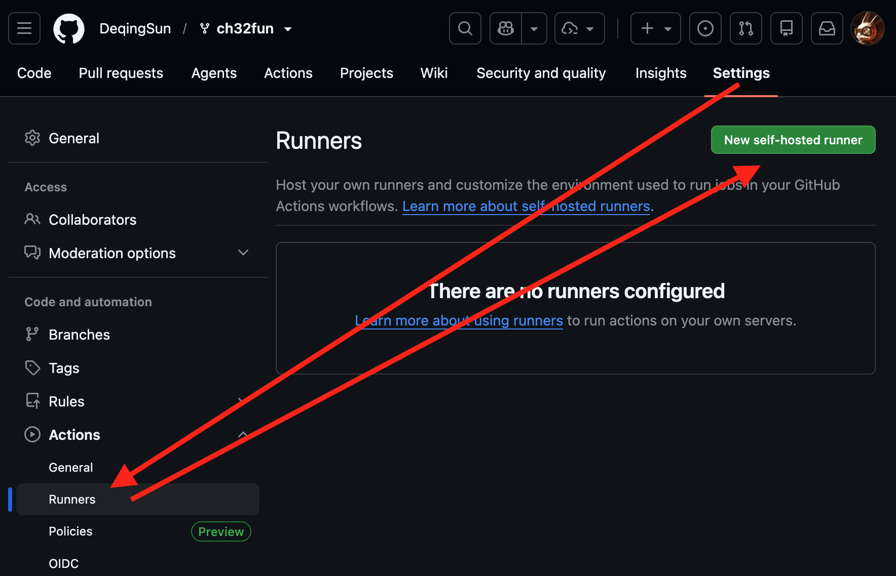
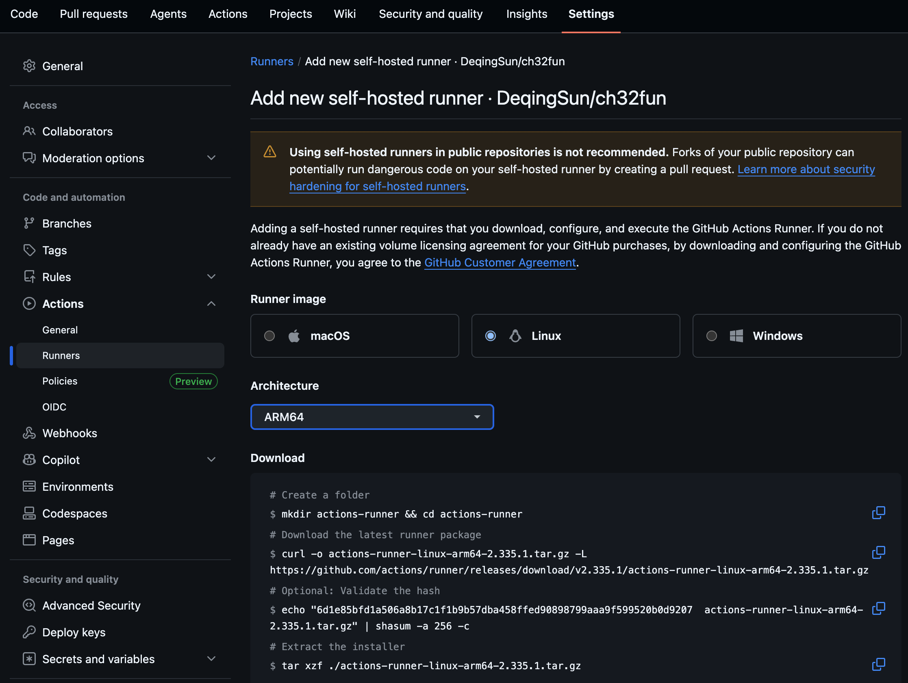

# Setup Github Self-hosted runner on Raspberry Pi

If we use Raspberry Pi, we have to use a 64-bit one. Because a 32-bit one such as Raspberry Pi Zero W is using ARMv6l architecture, and Github runner does not support it.

Here we use a Raspberry Pi Zero 2 W.
## Prepare system

I used Raspberry Pi Imager V2.0.10 to flash Raspberry Pi OS Lite 64-bit released on 2026-06-18. And setup SSH, password and Wifi in Raspberry Pi Imager. 

SSH should be available after Raspberry Pi boot up, even in headless config.

## Create self-hosted runner

Click "Settings" -> "Action - Runners" -> "New self-hosted runner"



Choose "Linux" -> "ARM64", and Github will generate shell command for Raspberry Pi.



After authentication and run the runner, the runner should be added.


Autorun runner after reboot: run ```sudo nano /etc/systemd/system/actions-runner.service``` add

```
[Unit]
Description=GitHub Actions Runner
After=network.target

[Service]
ExecStart=/home/pi/actions-runner/run.sh
WorkingDirectory=/home/pi/actions-runner
User=pi
Restart=no    

[Install]
WantedBy=multi-user.target
```

run

```sudo systemctl daemon-reload```

then

```sudo systemctl enable actions-runner.service```

then

```sudo systemctl start actions-runner.service```

Then we added necessary software package on Pi:

```
sudo apt install python3-usb
sudo apt install python3-serial
sudo apt install git
sudo apt install libusb-1.0-0-dev libudev-dev
```
