# 说明

CH32F20x 系列产品是基于 ARM $^{®}$ Cortex $^{™}$ -M3 内核设计的通用微控制器，与大部分 ARM 工具和软件兼容。提供了丰富的通讯接口和控制单元，适用于大部分控制、连接、综合等嵌入式领域。

CH32V20x、CH32V30x 和 CH32V31x 系列是基于 32 位 RISC-V 指令集及架构设计的工业级通用微控制器。依据产品性能和资源差异搭配了不同的内核型号。CH32V203 采用青稞 V4B 内核，支持硬件中断堆栈，提升中断响应效率；CH32V208 采用青稞 V4C 内核，进一步加快硬件除法运算速度，并增加了内存保护功能；CH32V303/305/307/317 采用青稞 V4F 内核，进一步支持了硬件浮点运算。该系列产品挂载了丰富的外设接口和功能模块。其内部组织架构满足低成本低功耗嵌入式应用场景。

本手册针对用户的应用开发，提供了 CH32F20x 系列、CH32V20x 系列、CH32V30x 系列和 CH32V31x 系列产品的详细使用信息，适用于系列中不同存储器容量、功能资源、封装的产品，若有差异将在对应的功能章节做特殊说明。

注：（1）CH32F20x 包括：CH32F203、CH32F205、CH32F207、CH32F208；

(2) CH32V20x 包括: CH32V203、CH32V208;  
(3) CH32V30x 包括: CH32V303、CH32V305、CH32V307;  
(4) CH32V31x 包括: CH32V317。

有关此系列产品的器件特性请参考以下数据手册。

CH32F20x\_D6: 《CH32F203DS0》

CH32F20x\_D8、CH32F20x\_D8C：《CH32F207DSO》。

CH32F20x\_D8W: 《CH32F208DSO》。

CH32V20x\_D6、CH32V20x\_D8：《CH32V203DS0》。

CH32V20x\_D8W: 《CH32V208DS0》。

CH32V30x\_D8、CH32V30x\_D8C、CH32V31x\_D8C：《CH32V307DS0》。

有关 ARM® Cortex™-M3 内核的相关信息，请参考《ARM® Cortex®-M3 Processor Technical Reference Manual Revision r2p1》，可在 ARM 公司网站下载。

有关 RISC-V 内核的相关信息，可参考 QingKeV4 微处理手册：《QingKeV4\_Processor\_Manual》。

注：同一类产品的某些外设数量或功能可能受封装限制，选择时请确认产品封装。  
CH32F20x 系列产品概览

<table><tr><td colspan="2">中小容量通用型(F203)</td><td colspan="2">大容量通用型(F203)</td><td>连接型(F205)</td><td>互联型(F207)</td><td>无线型(F208)</td></tr><tr><td>32K 闪存</td><td>64K 闪存</td><td>128K 闪存</td><td>256K 闪存</td><td>128K 闪存</td><td>256K 闪存</td><td>128K 闪存</td></tr><tr><td>10K SRAM</td><td>20K SRAM</td><td>32K SRAM</td><td>64K SRAM</td><td>32K SRAM</td><td>64K SRAM</td><td>64K SRAM</td></tr><tr><td>2*ADC(TKey)ADTM2*GPTM2*USARTSPI12C</td><td>2*ADC(TKey)ADTM3*GPTM4*U(S) ART2*SPI2*12C</td><td>2*ADC(TKey)2*DACADTM3*GPTM3*USART2*SPI</td><td>2*ADC(TKey)2*DAC4*ADTM4*GPTM2*BCTM8*U(S) ART</td><td>2*ADC(TKey)2*DAC4*ADTM4*GPTM2*BCTM5*U(S) ART</td><td>2*ADC(TKey)2*DAC4*ADTM4*GPTM2*BCTM8*U(S) ART</td><td>ADC(TKey)ADTM3*GPTMGPTM(32)4*U(S) ART2*SPI</td></tr><tr><td>USBD</td><td>USBD</td><td>2*12C</td><td>3*SPI (2*12S)</td><td>3*SPI (2*12S)</td><td>3*SPI (2*12S)</td><td>2*12C</td></tr><tr><td>USBFS</td><td>USBFS</td><td>USBD</td><td>2*12C</td><td>2*12C</td><td>2*12C</td><td>USBD</td></tr><tr><td>CAN</td><td>CAN</td><td>CAN</td><td>USBD</td><td>OTG_FS</td><td>OTG_FS</td><td>USBFS</td></tr><tr><td>RTC</td><td>RTC</td><td>RTC</td><td>CAN</td><td>USBHS (+PHY)</td><td>USBHS (+PHY)</td><td>CAN</td></tr><tr><td>2*WDG</td><td>2*WDG</td><td>2*WDG</td><td>RTC</td><td>2*CAN</td><td>2*CAN</td><td>RTC</td></tr><tr><td>2*OPA</td><td>2*OPA</td><td>4*OPA</td><td>2*WDG</td><td>RTC</td><td>RTC</td><td>2*WDG</td></tr><tr><td></td><td></td><td></td><td>4*OPA</td><td>2*WDG</td><td>2*WDG</td><td>2*OPA</td></tr><tr><td></td><td></td><td></td><td>RNG</td><td>4*OPA</td><td>4*OPA</td><td>ETH-</td></tr><tr><td></td><td></td><td></td><td>SDIO</td><td>RNG</td><td>RNG</td><td>10M (+PHY)</td></tr><tr><td></td><td></td><td></td><td>FSMC</td><td>SDIO</td><td>SDIO</td><td>BLE5. 3</td></tr><tr><td></td><td></td><td></td><td></td><td></td><td>FSMC</td><td></td></tr><tr><td></td><td></td><td></td><td></td><td></td><td>DVP</td><td></td></tr><tr><td></td><td></td><td></td><td></td><td></td><td>ETH-1000MAC</td><td></td></tr><tr><td></td><td></td><td></td><td></td><td></td><td>10M PHY</td><td></td></tr></table>

CH32V20x、CH32V30x 和 CH32V31x 系列产品概览

<table><tr><td colspan="2">中小容量通用型(V203)</td><td colspan="2">大容量通用型(V303)</td><td>连接型(V305)</td><td>互联型(V307)</td><td>互联型(V317)</td><td>无线型(V208)</td></tr><tr><td colspan="2">青稞 V4B 内核</td><td colspan="5">青稞 V4F 内核</td><td>青稞 V4C 内核</td></tr><tr><td>32K 闪存</td><td>64K 闪存</td><td>128K 闪存</td><td>256K 闪存</td><td>128K 闪存</td><td>256K 闪存</td><td>256K 闪存</td><td>128K 闪存</td></tr><tr><td>10K SRAM</td><td>20K SRAM</td><td>32K SRAM</td><td>64K SRAM</td><td>32K SRAM</td><td>64K SRAM</td><td>64K SRAM</td><td>64K SRAM</td></tr><tr><td>2*ADC (TKey)ADTM3*GPTM2*USARTSPI12CUSBDUSBFSCANRTC2*WDG2*OPA</td><td>2*ADC (TKey)ADTM3*GPTM4*U (S) ART2*SPI2*I2CUSBDUSBFSCANRTC2*WDG2*OPA</td><td>2*ADC (TKey)2*DACADTM3*GPTM3*USART2*SPI2*I2CUSBFSCANRTC2*WDG2*OPA4*OPA</td><td>2*ADC (TKey)2*DAC4*ADTM4*GPTM2*BCTM8*U (S) ART3*SPI (2*I2S)2*I2CUSBFSCANRTC2*WDG4*OPARNGSDIO FSMC</td><td>2*ADC (TKey)2*DAC4*ADTM4*GPTM2*BCTM8*U (S) ART3*SPI (2*I2S)2*I2COTG_FSUSBHS (+PHY)2*CANRTC2*WDG4*OPARNGSDIO FSMCDVPETH-1000MMACETH-10M PHY</td><td>2*ADC (TKey)2*DAC4*ADTM4*GPTM2*BCTM8*U (S) ART3*SPI (2*I2S)2*I2COTG_FSUSBHS (+PHY)2*CANRTC2*WDG4*OPARNGSDIODVPETH-10M/100MPHY</td><td>2*ADC (TKey)2*DAC4*ADTM4*GPTM2*BCTM8*U (S) ART3*SPI (2*I2S)2*I2COTG_FSUSBHS (+PHY)2*CANRTC2*WDG4*OPARNGSDIODVPETH-10M/100MPHY</td><td>ADC (TKey)ADTM3*GPTMGPTM (32)4*U (S) ART2*SPI2*I2CUSBDUSBFSCANRTC2*WDG2*OPAETH-10M (+PHY)BLE5. 3</td></tr></table>

注：同一类产品的某些外设数量或功能可能受封装限制，选择时请确认产品封装。

RISC-V 内核版本对比概览

<table><tr><td>内核版本\特点</td><td>指令集</td><td>硬件堆栈级数</td><td>中断嵌套级数</td><td>快速中断通道数</td><td>整数除法周期</td><td>向量表模式</td><td>扩展指令</td><td>内存保护</td></tr><tr><td>青稞 V4B</td><td>IMAC</td><td>2</td><td>2</td><td>4</td><td>9</td><td>地址或指令</td><td>支持</td><td>无</td></tr><tr><td>青稞 V4C</td><td>IMAC</td><td>2</td><td>2</td><td>4</td><td>5</td><td>地址或指令</td><td>支持</td><td>标准</td></tr><tr><td>青稞 V4F</td><td>IMAFC</td><td>3</td><td>8</td><td>4</td><td>5</td><td>地址或指令</td><td>支持</td><td>标准</td></tr></table>

寄存器中位属性缩写描述：

<table><tr><td>寄存器位属性</td><td>属性描述</td></tr><tr><td>RF</td><td>只读属性,读出固定值。</td></tr><tr><td>RO</td><td>只读属性,由硬件改变。</td></tr><tr><td>RZ</td><td>只读属性,读操作后自动位清0</td></tr><tr><td>WO</td><td>只写属性(不可读,读值不确定)</td></tr><tr><td>WA</td><td>只写属性,安全模式下可写入。</td></tr><tr><td>WZ</td><td>只写属性,写操作后自动位清0</td></tr><tr><td>RW</td><td>可读,可写。</td></tr><tr><td>RWA</td><td>可读,安全模式下可写入。</td></tr><tr><td>RW1</td><td>可读,写1有效,写0无效。</td></tr><tr><td>RWO</td><td>可读,写0有效,写1无效。</td></tr><tr><td>RW1T</td><td>可读,写0无效,写1翻转。</td></tr><tr><td>RW1Z</td><td>可读,写1清除此位,写0无效。</td></tr><tr><td>SC</td><td>自动清除。</td></tr></table>

CH32 系列 MCU 分类描述：

<table><tr><td>分类缩写</td><td>FLASH 大小</td><td>产品分类</td></tr><tr><td>D6</td><td>32KB 或 64KB</td><td>中小容量通用型</td></tr><tr><td>D8</td><td>128KB 或 256KB</td><td>大容量通用型</td></tr><tr><td>D8C</td><td>128KB 或 256KB</td><td>连接型或互联型</td></tr><tr><td>D8W</td><td>128KB 或 256KB</td><td>无线型</td></tr></table>

注：D（Density）、6（2^6）、8（2^8）

具体分类缩写：

CH32F20x\_D6 包括：CH32F203K8、CH32F203C6、CH32F203C8；

CH32F20x\_D8 包括：CH32F203CB、CH32F203RC、CH32F203VC、CH32F203RB；

CH32F20x\_D8C 包括：CH32F205RB、CH32F207VC；

CH32F20x\_D8W 包括：CH32F208RB、CH32F208WB；

CH32V20x\_D6 包括：CH32V203F6、CH32V203G6、CH32V203F8、CH32V203G8、CH32V203K8、CH32V203C6、CH32V203C8；

CH32V20x\_D8 包括：CH32V203RB;

CH32V20x\_D8W 包括：CH32V208GB、CH32V208CB、CH32V208RB、CH32V208WB；

CH32V30x\_D8 包括：CH32V303CB、CH32V303RB、CH32V303RC、CH32V303VC；

CH32V30x\_D8C 包括：CH32V305FB、CH32V305RB、CH32V305GB、CH32V307RC、CH32V307WC、CH32V307VC；

CH32V31x\_D8C 包括：CH32V317SC、CH32V317WC、CH32V317VC。

# 第 1 章 存储器和总线架构

# 1.1 总线架构

CH32F20x 系列是基于 ARM $^{®}$ Cortex $^{TM}$ -M3 内核设计的微控制器，其构架中的内核、仲裁单元、DMA 模块和 SRAM 存储等部分通过多组总线实现交互。

CH32V20x、CH32V30x 和 CH32V31x 系列产品是基于 RISC-V 指令集设计的通用微控制器，其架构中的内核、仲裁单元、DMA 模块、SRAM 存储等部分通过多组总线实现交互。

图 1-1 CH32F203（中小容量通用型）系统框图  
```mermaid
graph TD
    A["ARM Cortex-M3"] -->|I-code Bus| B["FLASH CTRL"]
    B --> C["Flash Memory"]
    C --> D["@VDD"]
    C --> E["POR | PDR | PVD"]
    C --> F["@VIO33"]
    C --> G["GPIO power"]
    C --> H["@VDDA"]
    A --> I["TPIU"]
    A --> J["SWD"]
    A --> K["NVIC"]
    A --> L["DMA 8Channels"]
    L --> M["USBFS"]
    M --> N["OPA1-2"]
    N --> O["OPAx_CHP"]
    N --> P["OPAx_CHN"]
    N --> Q["OPAx_OUT (x=1,2)"]
    A --> R["XMW"]
    R --> S["SRAM"]
    S --> T["Reset & MUX & DIV"]
    T --> U["PLL"]
    U --> V["HSI-RC"]
    U --> W["HSE"]
    T --> X["LSI-RC"]
    T --> Y["LSE"]
    X --> Z["OSC_IN"]
    X --> AA["OSC_OUT"]
    T --> AB["RTC_CLK"]
    T --> AC["IWDG_CLK"]
    T --> AD["@VBAT"]
    T --> AE["TAMPER-RTC"]
    T --> AF["TIM2"]
    T --> AG["TIM3"]
    T --> AH["TIM4"]
    T --> AI["USART2"]
    T --> AJ["USART3"]
    T --> AK["USART4"]
    T --> AL["SPI2"]
    T --> AM["I2C1"]
    T --> AN["I2C2"]
    T --> AO["bxCAN1"]
    T --> AP["USBD"]
    T --> AQ["+"]
    T --> AR["PB1: F_max = 144MHz"]
    AR --> AS["PB2: F_max = 144MHz"]
    AR --> AT["PB1: F_max = 144MHz"]
    subgraph Power Components
        direction TB
        A -->|TRACESWO SWCLK SWDIO| A
        B -->|V_DD: 2.4V~3.6V V_SS| B
        C -->|V_IO: 2.4V~3.6V V_SS| C
        D -->|V_DD: 2.4V~3.6V V_SS| D
        E -->|V_DD: 2.4V~3.6V V_SS| E
        F -->|V_DD: 2.4V~3.6V V_SS| F
        G -->|V_DD: 2.4V~3.6V V_SS| G
        H -->|V_DD: 2.4V~3.6V V_SS| H
        I -->|FS_DP FS_DM| I
        J -->|RSAM| J
        K -->|RCC| K
        L -->|HBM Max=144MHz| L
        M -->|RB Max=144MHz| M
        N -->|RB Max=144MHz| N
        O -->|RB Max=144MHz| O
        P -->|RB Max=144MHz| P
        Q -->|RB Max=144MHz| Q
        R -->|RB Max=144MHz| R
        S -->|RB Max=144MHz| S
        T -->|RB Max=144MHz| T
        U -->|RB Max=144MHz| U
        V -->|RB Max=144MHz| V
        W -->|RB Max=144MHz| W
        X -->|RB Max=144MHz| X
        Y -->|RB Max=144MHz| Y
        Z -->|RB Max=144MHz| Z
        AA -->|RB Max=144MHz| AA
        AB -->|RB Max=144MHz| AB
        AC -->|RB Max=144MHz| AC
        AD -->|RB Max=144MHz| AD
        AE -->|RB Max=144MHz| AE
        AF -->|RB Max=144MHz| AF
        AG -->|RB Max=144MHz| AG
        AH -->|RB Max=144MHz| AH
        AI -->|RB Max=144MHz| AI
        AJ -->|RB Max=144MHz| AJ
        AK -->|RB Max=144MHz| AK
        AL -->|RB Max=144MHz| AL
        AM -->|RB Max=144MHz| AM
        AN -->|RB Max=144MHz| AN
        AO -->|RB Max=144MHz| AO
        AP -->|RB Max=144MHz| AP
        AQ -->|RB Max=144MHz| AQ
        AR -->|RB Max=144MHz| AR
        AS -->|RB Max=144MHz| AS
        AT -->|RB Max=144MHz| AT
        AU -->|RB Max=144MHz| AU
        AV -->|RB Max=144MHz| AV
        AW -->|RB Max=144MHz| AW
        AX -->|RB Max=144MHz| AX
        AY --> Y["Temp Sensor"]
    end
```

图1-2 CH32F20x（连接/互联/大容量通用型）系统框图  
```mermaid
graph TD
    A["ARM Cortex-M3"] -->|I-code Bus| B["FLASH CTRL"]
    B --> C["Flash Memory"]
    C --> D["MUX"]
    D --> E["DMA1 7 Channels DMA2 11 Channels"]
    E --> F["X/DN"]
    F --> G["ETH MAC 10/100/1000"]
    G --> H["10M PHY"]
    H --> I["DVP"]
    I --> J["OTG_FS"]
    J --> K["USBHS +PHY"]
    K --> L["USBFS"]
    L --> M["SDIO"]
    M --> N["OPA1-4"]
    N --> O["HB to PB2 Bridge"]
    O --> P["PB1: F_max = 144MHz"]
    P --> Q["SET & MUX & DIV"]
    Q --> R["PLL"]
    R --> S["PLL2"]
    R --> T["PLL3"]
    S --> U["RTC_CLK IWDG_CLK"]
    T --> V["LSE"]
    V --> W["@VBAT"]
    W --> X["TAMPER-RTC"]
    X --> Y["TAMPER-RTC"]
    Y --> Z["TAMPER-RTC"]
    Z --> AA["TAMPER-RTC"]
    AA --> AB["TAMPER-RTC"]
    AB --> AC["TAMPER-RTC"]
    AC --> AD["TAMPER-RTC"]
    AD --> AE["TAMPER-RTC"]
    AE --> AF["TAMPER-RTC"]
    AF --> AG["TAMPER-RTC"]
    AG --> AH["TAMPER-RTC"]
    AH --> AI["TAMPER-RTC"]
    AI --> AJ["TAMPER-RTC"]
    AJ --> AK["TAMPER-RTC"]
    AK --> AL["TAMPER-RTC"]
    AL --> AM["TAMPER-RTC"]
    AM --> AN["TAMPER-RTC"]
    AN --> AO["TAMPER-RTC"]
    AO --> AP["TAMPER-RTC"]
    AP --> AQ["TAMPER-RTC"]
    AQ --> AR["TAMPER-RTC"]
    AR --> AS["TAMPER-RTC"]
    AS --> AT["TAMPER-RTC"]
    AT --> AU["TAMPER-RTC"]
    AU --> AV["TAMPER-RTC"]
    AV --> AW["TAMPER-RTC"]
    AW --> AX["TAMPER-RTC"]
    AX --> AY["TAMPER-RTC"]
    AY --> AZ["TAMPER-RTC"]
    AZ --> BA["TAMPER-RTC"]
    BA --> BB["TAMPER-RTC"]
    BB --> BC["TAMPER-RTC"]
    BC --> BD["TAMPER-RTC"]
    BD --> BE["TAMPER-RTC"]
    BE --> BF["TAMPER-RTC"]
    BF --> BG["TAMPER-RTC"]
    BG --> BH["TAMPER-RTC"]
    BH --> BI["TAMPER-RTC"]
    BI --> BJ["TAMPER-RTC"]
    BJ --> BK["TAMPER-RTC"]
    BK --> BL["TAMPER-RTC"]
    BL --> BM["TAMPER-RTC"]
    BM --> BN["TAMPER-RTC"]
    BN --> BO["TAMPER-RTC"]
    BO --> BP["TAMPER-RTC"]
    BP --> BQ["TAMPER-RTC"]
    BQ --> BR["TAMPER-RTC"]
    BR --> BS["TAMPER-RTC"]
    BS --> BT["TAMPER-RTC"]
    BT --> BU["TAMPER-RTC"]
    BU --> BV["TAMPER-RTC"]
    BV --> BW["TAMPER-RTC"]
    BW --> BX["TAMPER-RTC"]
    BX --> BY["TAMPER-RTC"]
    BY --> BZ["TAMPER-RTC"]
    BZ --> CA["TAMPER-RTC"]
    CA --> CB["TAMPER-RTC"]
    CB --> CC["TAMPER-RTC"]
    CC --> CD["TAMPER-RTC"]
    CD --> CE["TAMPER-RTC"]
    CE --> CF["TAMPER-RTC"]
    CF --> CG["TAMPER-RTC"]
    CG --> CH["TAMPER-RTC"]
    CH --> CI["TAMPER-RTC"]
    CI --> CJ["TAMPER-RTC"]
    CJ --> CK["TAMPER-RTC"]
    CK --> CR["TAMPER-RTC"]
    CR --> CS["TAMPER-RTC"]
    CS --> CT["TAMPER-RTC"]
    CT --> CU["TAMPER-RTC"]
    CU --> CV["TAMPER-RTC"]
    CV --> CW["TAMPER-RTC"]
    CW --> CX["TAMPER-RTC"]
    CX --> CY["TAMPER-RTC"]
    CY --> CZ["TAMPER-RTC"]
    CZ --> DA["TAMPER-RTC"]
    DA --> DB["TAMPER-RTC"]
    DB --> DC["TAMPER-RTC"]
    DC --> DD["TAMPER-RTC"]
    DD --> DE["TAMPER-RTC"]
    DE --> DF["TAMPER-RTC"]
    DF --> DG["TAMPER-RTC"]
    DG --> DH["TAMPER-RTC"]
    DH --> DI["TAMPER-RTC"]
    DI --> DJ["TAMPER-RTC"]
    DJ --> DK["TAMPER-RTC"]
    DK --> DL["TAMPER-RTC"]
    DL --> DV["TAMPER-RTC"]
```

图 1-3 CH32F208（无线型）系统框图  
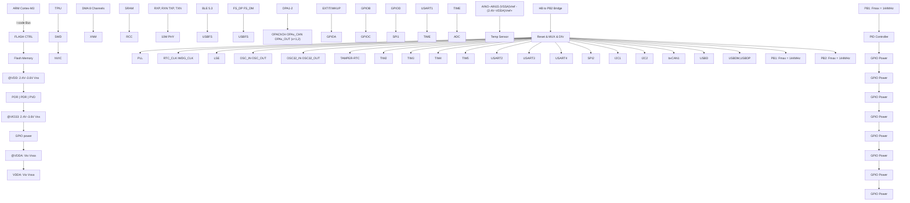

图 1-4 CH32V203（中小容量通用型）系统框图  
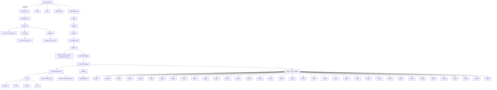

图 1-5 CH32V208（无线型）系统框图  
```mermaid
graph TD
    A["SWCLK SWDIO"] --> B["RISC-V (V4C)"]
    B --> C["PFIC"]
    B --> D["SDI"]
    B --> E["RV32 IMAC"]
    C --> F["I-code Bus"]
    D --> G["D-Code Bus"]
    F --> H["FLASH CTRL"]
    G --> H
    H --> I["Flash Memory"]
    I --> J["@VDD"]
    I --> K["POR | PDR | PVD"]
    J --> L["V_DD: 2.4V~3.6V V_SS"]
    K --> M["@VIO33"]
    K --> N["GPIO power"]
    L --> O["@VDDA"]
    M --> P["V_IO: 2.4V~3.6V V_SS"]
    N --> Q["@VDDA: V_IO V_SS"]
    B --> R["XNM"]
    R --> S["DMA 8 Channels"]
    S --> T["SRAM"]
    T --> U["Reset & MUX & DIV"]
    U --> V["PLL"]
    V --> W["OSC_IN OSC_OUT"]
    U --> X["HSI-RC"]
    U --> Y["HSE"]
    U --> Z["LSI-RC"]
    U --> AA["LSE"]
    U --> AB["@VBAT"]
    U --> AC["TAMPER-RTC"]
    U --> AD["TIM2"]
    U --> AE["TIM3"]
    U --> AF["TIM4"]
    U --> AG["TIM5"]
    U --> AH["USART2"]
    U --> AI["USART3"]
    U --> AJ["USART4"]
    U --> AK["USART1"]
    U --> AL["USART2"]
    U --> AM["USART3"]
    U --> AN["USART4"]
    U --> AO["USART1"]
    U --> AP["USART2"]
    U --> AQ["USART2"]
    U --> AR["USART1"]
    U --> AS["USART2"]
    U --> AT["USART1"]
    U --> AU["USART2"]
    U --> AV["USART1"]
    U --> AW["USART2"]
    U --> AX["USART1"]
    U --> AY["USART2"]
    U --> AZ["USART1"]
    U --> BA["USART2"]
    U --> BB["USART1"]
    U --> BC["USART2"]
    U --> BD["USART1"]
    U --> BE["USART2"]
    U --> BF["USART1"]
    U --> BG["USART2"]
    U --> BH["USART1"]
    U --> BI["USART2"]
    U --> BJ["USART1"]
    U --> BK["USART2"]
    U --> BL["USART1"]
    U --> BM["USART2"]
    U --> BN["USART1"]
    U --> BO["USART2"]
    U --> BP["USART1"]
    U --> BQ["USART2"]
    U --> BR["USART1"]
    U --> BS["USART2"]
    U --> BT["USART1"]
    U --> BU["USART2"]
```

图 1-6 CH32V30x（连接/互联/大容量通用型）系统框图  
Electronic circuit block diagram showing signal flow from input/output channels through RISC-V, DMA, MHz, and I-band to PB1 and PB2 interfaces with memory, control, and power management blocks.

图 1-7 CH32V317（互联型）系统框图  
Electronic circuit block diagram showing signal flow from RISC-V, DMA channels, and Flash memory to PB1, with labeled components and frequency limits.

系统中设有：通用 DMA 控制器用以减轻 CPU 负担、提高效率；时钟树分级管理用以降低了外设总的运行功耗，同时还兼有数据保护机制，时钟安全系统保护机制等措施来增加系统稳定性。

- 指令总线（I-Code）将内核和 FLASH 指令接口相连，预取指在此总线上完成。  
● 数据总线（D-Code）将内核和 FLASH 数据接口相连，用于常量加载和调试。  
● 系统总线将内核和总线矩阵相连，用于协调内核、DMA、SRAM 和外设的访问。  
● DMA 总线负责 DMA 的 HB 主控接口与总线矩阵相连，该总线访问对象是 FLASH 数据、SRAM 和外设。

总线矩阵负责的是系统总线、数据总线、DMA 总线、SRAM 和 HB/PB 桥之间的访问协调。  
- HB/PB 桥，为 HB 总线和两个 PB 总线提供同步连接。不同的外设挂在不同的 PB 总线下，可以按实际需求配置不同总线时钟，优化性能。

# 1.2 存储器映像

CH32F20x、CH32V20x、CH32V30x 和 CH32V31x 系列产品都包含了程序存储器、数据存储器、内核寄存器和外设寄存器等等，它们都在一个 4GB 的线性空间寻址。

系统存储以小端格式存放数据，即低字节存放在低地址，高字节存放在高地址。

图 1-8 CH32F203（中小容量通用型）存储映像  

*[figure omitted]*

图 1-9 CH32F20x（连接/互联/大容量通用型）存储映像  

*[figure omitted]*

图1-10 CH32F208（无线型）存储映像  

*[figure omitted]*

图 1-11 CH32V203（中小容量通用型）存储映像  

*[figure omitted]*

图1-12 CH32V208（无线型）存储映像  

```bar_stacked
| Category | Reserved | Core Private Peripherals | System FLASH (BOOT_28KB) | System FLASH 480KB max Includes 0 wait and non-0 waiting areas | Aliased to Flash or system memory depending on BOOT pins |
|---|---|---|---|---|---|
| 0x1FFF FFFF | 0x5005 0400 | 0x5005 0000 | 0x5005 0000 | 0x5005 0400 | 0x5005 0000 |
| 0x1FFF F880 | 0x5004 0000 | 0x5004 0000 | 0x5004 0000 | 0x5004 0000 | 0x5004 0000 |
| 0x1FFF F800 | 0x5000 0000 | 0x5000 0000 | 0x5000 0000 | 0x5000 0000 | 0x5000 0000 |
| 0x1FFF F700 | 0x4999 843 | 0x4999 843 | 0x4999 843 | 0x4999 843 | 0x4999 843 |
| 0x1FFF F600 | 0x4999 843 | 0x4999 843 | 0x4999 843 | 0x4999 843 | 0x4999 843 |
| System FLASH (BOOT_28KB) | 0x4999 783 | 0x4999 783 | 0x4999 783 | 0x4999 783 | 0x4999 783 |
| System FLASH (BOOT_28KB) + Code FLASH (48KB max) Includes 0 wait and non-0 waiting areas | 0x4999 743 | 0x4999 743 | 0x4999 743 | 0x4999 743 | 0x4999 743 |
| System FLASH (BOOT_28KB) + Aliased to Flash or system memory depending on BOOT pins | 0x4999 663 | 0x4999 663 | 0x4999 663 | 0x4999 663 | 0x4999 663 |
| System FLASH (BOOT_28KB) + Aliased to Flash or system memory depending on BOOT pins | 0x4998 683 | 0x4998 683 | 0x4998 683 | 0x4998 683 | 0x4998 683 |
| System FLASH (BOOT_28KB) + Aliased to Flash or system memory depending on BOOT pins | 0x4998 643 | 0x4998 643 | 0x4998 643 | 0x4998 643 | 0x4998 643 |
| System FLASH (BOOT_28KB) + Aliased to Flash or system memory depending on BOOT pins | 0x4997 | - | - | - | - |
| System FLASH (BOOT_28KB) + Aliased to Flash or system memory depending on BOOT pins | - | - | - | - | - |
| System FLASH (BOOT_28KB) + Aliased to Flash or system memory depending on BOOT pins | - | - | - | - | - |
| System FLASH (BOOT_28KB) + Aliased to Flash or system memory depending on BOOT pins | - | - | - | - | - |
| System FLASH (BOOT_28KB) + Aliased to Flash or system memory depending on BOOT pins | - (Reserved) | - (Reserved) | - (Reserved) | - (Reserved) | - (Reserved) |
| System FLASH (BOOT_28KB) + Aliased to Flash or system memory depending on BOOT pins | - (Reserved) | - (Reserved) | - (Reserved) | - (Reserved) | - (Reserved) |
| System FLASH (BOOT_28KB) + Aliased to Flash or system memory depending on BOOT pins | - (Reserved) | - (Reserved) | - (Reserved) | - (Reserved) | - (Reserved) |
| SystemFLASH (BOOT_28KB) + Aliased to Flash or system memory depending on BOOT pins | - (Reserved) | - (Reserved) | - (Reserved) | - (Reserved) | - (Reserved) |
| SystemFLASH (BOOT_28KB) + Aliased to Flash or system memory depending on BOOT pins | - (Reserved) | - (Reserved) | - (Reserved) | - (Reserved) | - (Reserved) |
| SystemFLASH (BOOT_12KB) + Aliased to Flash or system memory depending on BOOT pins | - (Reserved) | - (Reserved) | - (Reserved) | - (Reserved) | - (Reserved) |
| SystemFLASH (BOOT_12KB) + Aliased to Flash or system memory depending on BOOT pins | - (Reserved) | - (Reserved) | - (Reserved) | - (Reserved) | - (Reserved) |
| SystemFLASH (BOOT_12KB) + Alialed to Flash or system memory depending on BOOT pins | - (Reserved) | - (Reserved) | - (Reserved) | - (Reserved) | - (Reserved) |
| SystemFLASH (BOOT_12KB) + Aliated to Flash or system memory depending on BOOT pins | - (Reserved) | - (Reserved) | - (Reserved) | - (Reserved) | - (Reserved) |
| SystemFLASH (BOOT_12KB) + Aliated to Flash or system memory depending on BOOT pins | - (Reserved) | - (Reserved) | - (Reserved) | - (Reserved) | - (Reserved) |
| SystemFLASH (BOOT_12KB) + Aliated to Flash or System memory depending on BOOT pins | - (Reserved) | - (Reserved) | - (Reserved) | - (Reserved) | - (Reserved) |
| SystemFLASH (BOOT_12KB) + Aliated to Flash or System memory depending on BOOT pins | - (Reserved) | - (Reserved) | - (Reserved) | - (Reserved) | - (Reserved) |
| SystemFLASH (BOOT_12KB) + Aliated to Flash or System memory depending on Boot pins / Code FLASH (BOOT_28KB max Includes O wait and non-OWaiting areas / Aliased to Flash or System memory depending on Boot pins / Aliated to Flash or System memory depending on Boot pins / Aliased to Flash or System memory depending on Boot pins / Aliated to Flash or System memory depending on Boot pins / Aliated to Flash or System memory depending on Boot pins / Aliated to Flash or System memory depending on Boot pins / Aliated to Flash or System memory depending on Boot pins / Aliated to Flash or System Memory / Aliated to Flash or System Memory / Aliated to Flash or System Memory / Aliated to Flash or System Memory / Aliated to Flash or System Memory / Aliated to Flash or System Memory / Aliated to Flash or System Memory / Aliated to Flash or System Memory / Aliated to Flash or System Memory / Aliated to Flash or System Memory / Aliated to Flash or System Memory / Aliated to Flash or System Memory / Aliated to Flash or System Memory / Aliatedto Flash or System Memory / Aliatedto Flash or System Memory / Aliatedto Flash or System Memory / Aliatedto Flash or System Memory / Aliatedto Flash or System Memory / Aliatedto Flash or System Memory / Aliatedto Flash or System Memory / Aliatedto Flash or System Memory / Aliatedto Flash or System Memory / Aliatedto Flash or System Memory / Aliatedto Flash or System Memory / Aliatedto Flash or System Memory / Aliatedto Flash or SystemMemory / Aliatedto Flash or System Memory / Aliatedto Flash or System Memory / Aliatedto Flash or System Memory / Aliatedto Flash or System Memory / Aliatedto Flash or System Memory / Aliatedto Flash or System Memory / Aliatedto Flash or System Memory / Aliatedto Flash or System Memory / Aliatedto Flash or System Memory / Aliatedto Flash or System Memory / Aliatedto Flash or System Memory / Aliatedto Flash or System Memory / Aliatedo Flash or System Memory / Aliatedo Flash or System Memory / Aliatedo Flash or System Memory / Aliatedo Flash or System Memory / Aliatedo Flash or System Memory / Aliatedo Flash or System Memory / Aliatedo Flash or System Memory / Aliatedo Flash or System Memory / Aliatedo Flash or System Memory / Aliatedo Flash or System Memory / Aliatedo Flash or System Memory / Aliatedo Flash or System Memory / Aliatedo Flash or SystemMemory / Aliatedo Flash or System Memory / Aliatedo Flash or System Memory / Aliatedo Flash or System Memory / Aliatedo Flash or System Memory / Aliatedo Flash or System Memory / Aliatedo Flash or System Memory / Aliatedo Flash or System Memory / Aliatedo Flash or System Memory / Aliatedo Flash or System Memory / Aliatedo Flash or System Memory / Aliatedo Flash or System Memory / Aliatedo Flash or System Memory / Aliatede: Flash/ SRAM(64KBmax)/ FLASH/ SRAM(64KBmax)/ FLASH/ SRAM(64KBmax)/ FLASH/ SRAM(64KBmax)/ FLASH/ SRAM(64KBmax)/ FLASH/ SRAM(64KBmax)/ FLASH/ SRAM(64KBmax)/ FLASH/ SRAM(64KBmax)/ FLASH/ SRAM(64KBmax)/ FLASH/ SRAM(64KBmax)/ FLASH/ SRAM(64KBmax)/ ROSA/ RSAM(64KBmax)/ ROSA/ RSAM(64KBmax)/ ROSA/ RSAM(64KBmax)/ ROSA/ RSAM(64KBmax)/ ROSA/ RSAM(64KBmax)/ ROSA/ RSAM(64KBmax)/ ROSA/ RSAM(64KBmax)/ ROSA/ RSAM(64KBmax)/ ROSA/ RSAM(64KBmax)/ ROSA/ RSAR(64KBmax)/ ROSA/ RSAR(64KBmax)/ ROSA/ RSAR(64KBmax)/ ROSA/ RSAR(64KBmax)/ ROSA/ RSAR(64KBmax)/ ROSA/ RSAR(64KBmax)/ ROSA/ RSAR(64KBmax)/ ROSA/ RSAR(64KBmax)/ ROSA/ RSAR(64KBmax)/ ROSA/ RSAR[64KBmax]/ ROSA/ RSAR[64KBmax]/ ROSA/ RSAR[64KBmax]/ ROSA/ RSAR[64KBmax]/ ROSA/ RSAR[64KBmax]/ ROSA/ RSAR[64KBmax]/ ROSA/ RSAR[64KBmax]/ ROSA/ RSAR[64KBmax]/ ROSA/ RSAR[64KBmax]/ ROSA/ RSAR[64KBmax]/<ecel><ecel><ecel><ecel><ecel><ecel><nl>
```


图1-13 CH32V30x（连接/互联/大容量通用型）和CH32V31x（互联型）存储映像  

*[figure omitted]*

# 1.2.1 位段访问

位操作就是单独读写一个比特位的操作。CH32F20x 产品中通过映射的处理方式提供了对外设寄存器和 SRAM 区内容的位操作读写。具体方法：

1）通过对映射地址区域32位的数据进行读操作，读出的值为0或非0，获取目标位域值是0或1；  
2）通过对映射地址区域32位的数据进行写操作，写入0或1，修改目标位域值为0或1。

地址映射：

目标位域：基地址（BEaddr） + 偏移地址（Ofaddr） + 位号（BitN）

映射地址：Mapaddr

$$
\text { Mapaddr } = \text { BEaddr } + 0 x 2 0 0 0 0 0 0 + (0 f a d d r * 3 2) + (\text { BitN*4 })
$$

举例 1：对 SRAM 区的 0x20000100 地址字节中的 bit3 目标位域进行操作：

$$
\text { Mapaddr } = 0 x 2 0 0 0 0 0 0 0 + 0 x 2 0 0 0 0 0 0 + (0 x 1 0 0 * 3 2) + (3 * 4) = 0 x 2 2 0 0 2 0 0 C
$$

则读取 0x2200200C 地址的 4 字节数据内容可知 0x20000100 地址字节中的 bit3 是 0 还是 1；对 0x2200200C 地址执行写 0 或 1 操作，可以修改 0x20000100 地址字节中的 bit3 为 0 还是 1。

举例 2：对外设区域的 0x40021000 地址中的 bit24 进行操作：

$$
\text { Mapaddr } = 0 \times 4 0 0 0 0 0 0 0 + 0 \times 2 0 0 0 0 0 0 + (0 \times 2 1 0 0 0 * 3 2) + (2 4 * 4) = 0 \times 4 2 4 2 0 0 6 0
$$

则读取 0x22420060 地址的 4 字节数据内容可知 0x40021000 外设地址中的 bit24 是 0 还是 1；对

0x22420060 地址执行写 0 或 1 操作，可以修改 0x40021000 外设地址中的 bit24 为 0 还是 1。

注：CH32V20x、CH32V30x 和 CH32V31x 产品不支持位段映射访问方式。

# 1.2.2 存储器分配

内置最大 128K 字节的 SRAM，起始地址 0x20000000，支持字节、半字（2 字节）、全字（4 字节）访问。

内置最大 480K 字节的程序闪存存储区（CodeFlash），用于存储用户应用程序。

内置 28K 字节的系统存储器（bootloader），用于存储系统引导程序（厂家固化自举加载程序）。

内置 128 字节空间用于厂商配置字存储，出厂前固化，用户不可修改。

内置 128 字节空间用于用户选择字存储。

注：储存器分配各型号不同，具体参考芯片对应数据手册。

# 1.3 启动配置

系统可以通过 B00T0 和 B00T1 引脚来选择三种不同的启动模式。

表 1-1 启动模式

<table><tr><td>B00T0</td><td>B00T1</td><td>启动模式</td></tr><tr><td>0</td><td>X</td><td>从程序闪存存储器启动</td></tr><tr><td>1</td><td>0</td><td>从系统存储器启动</td></tr><tr><td>1</td><td>1</td><td>从内部 SRAM 启动</td></tr></table>

用户通过设置BOOT引脚的状态值来选择复位后的启动模式。系统复位后或者电源复位都会导致BOOT引脚的值被重新锁存。

启动模式不同，程序闪存存储器、系统存储器和内部 SRAM 有着不同的访问方式：

- 从程序闪存存储器启动时，程序闪存存储器地址被映射到 0x00000000 地址区域，同时也能够在原地址区域 0x08000000 访问。  
- 从系统存储器启动时，系统存储器地址被映射到0x00000000地址区域，同时也能够在原地址区域0x1FFF8000访问。  
- 从内部SRAM启动，只能够从0x20000000地址区域访问。对于CH32F20x系列产品，在此区域启动时，需要通过NVIC控制器设置向量表偏移寄存器，重映射向量表到SRAM中。对于CH32V20x、CH32V30x和CH32V31x系列产品无需此动作。

# 第 2 章 电源控制（PWR）

本章模块描述适用于 CH32F20x、CH32V20x、CH32V30x 和 CH32V31x 微控制器全系列产品。

# 2.1 概述

CH32F20x、CH32V20x、CH32V30x 产品系统工作电压 $V_{DD}$ 范围为 $2.4^{(1)} \sim 3.6V$ ，CH32V31x 产品系统工作电压 $V_{DD}$ 范围为 $2.4^{(1)} \sim 3.6V$ ，内置电压调节器提供内核所需的工作电源。当主电源 $V_{DD}$ 掉电后，电池等后备电源可通过 $V_{BAT}$ 引脚为实时时钟（RTC）和后备寄存器提供电源，如果无需后备电源，建议将 $V_{DD}$ 直接连接到 $V_{BAT}$ 引脚上。

注：（1）对于 FEATURE\_SIGN 寄存器 VLEVEL 位为 1 的芯片，系统工作电压 $V_{DD}$ 支持最低供电电压为 2.4V；对于 VLEVEL 位为 0 的芯片，系统工作电压 $V_{DD}$ 支持最低供电电压为 1.8V。

对于 CH32V31x 产品还包括了以下参数（具体数据参考 CH32V307DS0 手册）：

(1) $V_{DD\_ETH}$ ：为内置的以太网 10/100M PHY 供电。  
(2) $V_{DDK}$ ：内部电源 LDO 退耦端，需外接退耦电容。

$V_{DDA}$ 和 $V_{SSA}$ 引脚专门为系统中模拟相关电路供电，包括 ADC、DAC、温度传感器等。 $V_{REF+}$ 和 $V_{REF-}$ 作为一些模拟电路的参考点，在芯片内部等于 $V_{DDA}$ 及 $V_{SSA}$ 。

图 2-1 电源结构框图  
```mermaid
graph TD
    A["VDDA power supply domain"] --> B["AD converter"]
    A --> C["DA converter"]
    A --> D["Temperature sensor"]
    A --> E["Reset module"]
    A --> F["PLL"]
    A --> G["OPA&CMP"]
    H["VDD power supply domain"] --> I["I/O circuit"]
    H --> J["Voltage regulator"]
    K["VDD"] --> L["Standby circuit (Wake-up logic, IWDG)"]
    M["VSS"] --> L
    N["VBAT"] --> O["Back-up power supply domain"]
    P["Core Power supply area"] --> Q["CPU cores memory"]
    P --> R["Built-in digital peripherals"]
    S["Low voltage detector"] --> O
    T["LSE 32K crystal oscillator"] --> O
    U["Back-up register"] --> O
    V["RCC BDCR register"] --> O
    W["RTC"] --> O
```

在主电源 $V_{DD}$ 掉电后，模拟开关切换至 $V_{BAT}$ ，后备区域由 $V_{BAT}$ 引脚供电，此时 PC13～15 无法作为 GPIO，仅可使用如下功能：

● PC13 可以作为 TAMPER 引脚、RTC 闹钟或秒输出。  
● PC14 和 PC15 只能用作 LSE 引脚。

当主电源 $V_{DD}$ 上电稳定后，系统自动切换后备区域由 $V_{DD}$ 供电，PC13～15 可以用作 GPIO 功能。

当 PC13～15 引脚作为 GPIO 输出时，速度必须限制在 2MHz 以下，最大负载电容为 30pF，并且禁

止用在持续输出和吸入电流的场合，比如 LED 驱动。

注：在主电源 $V_{DD}$ 恢复供电过程中，内部 $V_{BAT}$ 电源仍然通过对应的 $V_{BAT}$ 引脚连在外部备用电源上，若 $V_{DD}$ 在小于复位滞后时间 $t_{RSTTEMPO}$ 内就达到稳定，并且高于 $V_{BAT}$ 的值 0.6V 以上，则有可能存在较短瞬间，电流通过 $V_{DD}$ 与 $V_{BAT}$ 之间的二极管灌入 $V_{BAT}$ ，进而通过 $V_{BAT}$ 引脚注入电池等后备电源，如果后备电源无法承受这样瞬时注入电流，建议在后备电源和 $V_{BAT}$ 引脚之间加一只正向导通低压降二极管。

# 2.2 电源管理

# 2.2.1 上电复位和掉电复位

系统内部集成了上电复位POR和掉电复位PDR电路，当芯片供电电压 $\mathrm{V_{DD}}$ 和 $\mathrm{V_{DDA}}$ 低于对应门限电压时，系统被相关电路复位，无需外置额外的复位电路。上电门限电压 $\mathrm{V_{POR}}$ 和掉电门限电压 $\mathrm{V_{PDR}}$ 的参数请参考对应的数据手册。

图 2-2 POR 和 PDR 的工作示意图  

```line
| Reset signal | V_DD(A) |
| ------------ | ------- |
| 0            | 0       |
| 1            | Peak    |
| 0            | 0       |
```


# 2.2.2 可编程电压监测器

可编程电压监测器 PVD，主要被用于监控系统主电源的变化，与电源控制寄存器 PWR\_CTLR 的 PLS[2:0] 所设置的门槛电压相比较，配合外部中断寄存器（EXTI）设置，可产生相关中断，以便及时通知系统进行数据保存等掉电前操作。

具体配置如下：

1）设置 PWR\_CTLR 寄存器的 PLS[2:0] 域，选择要监控电压阈值。  
2）可选的中断处理。PVD 功能内部连接 EXTI 模块的第 16 线的上升/下降边沿触发设置，开启此中断（配置 EXTI），当 $V_{DD}$ 下降到 PVD 阈值以下或上升到 PVD 阈值之上时就会产生 PVD 中断。  
3）设置 PWR\_CTLR 寄存器的 PVDE 位来开启 PVD 功能。  
4）读取 PWR\_CSR 状态寄存器的 PVDO 位可获取当前系统主电源与 PLS[2:0] 设置阈值关系，执行相应软处理。当 $V_{DD}$ 电压高于 PLS[2:0] 设置阈值，PVDO 位置 0；当 $V_{DD}$ 电压低于 PLS[2:0] 设置阈值，PVDO 位置 1。

图 2-3 PVD 的工作示意图  

```line
| Time | V_DD(A) |
|------|---------|
| 0    | 0       |
| 1    | 1       |
| 0    | Approx. 200mV hysteresis |
| 1    | 0       |
```


# 2.3 低功耗模式

在系统复位后，微控制器处于正常工作状态（运行模式），此时可以通过降低系统主频或者关闭不用外设时钟或者降低工作外设时钟来节省系统功耗。如果系统不需要工作，可设置系统进入低功耗模式，并通过特定事件让系统跳出此状态。

微控制器目前提供了3种低功耗模式，从处理器、外设、电压调节器等的工作差异上分为：

- 睡眠模式：内核停止运行，所有外设（包含内核私有外设）仍在运行。  
- 停止模式：停止所有时钟，唤醒后系统继续运行。  
● 待机模式：停止所有时钟，唤醒后微控制器复位（电源复位）。

表 2-1 低功耗模式一览

<table><tr><td>模式</td><td>进入</td><td>唤醒源</td><td>对时钟的影响</td><td>电压调节器</td></tr><tr><td rowspan="2">睡眠</td><td>WFI</td><td>任意中断唤醒</td><td rowspan="2">内核时钟关闭,其他时钟无影响</td><td rowspan="2">正常</td></tr><tr><td>WFE</td><td>唤醒事件唤醒</td></tr><tr><td>停止</td><td>SLEEPDEEP 置 1PDDS 清 0WFI 或 WFE</td><td>任一外部中断/事件(在外部中断寄存器中设置)</td><td>关闭 HSE、HSI、PLL 和外设时钟</td><td>正常:LPDS=0 或低功耗:LPDS=1</td></tr><tr><td>待机</td><td>SLEEPDEEP 置 1PDDS 置 1WFI 或 WFE</td><td>WKUP 引脚上升沿、RTC 闹钟事件、NRST 引脚复位、IWDG 复位。注:任意事件也可以唤醒系统,但唤醒后系统复位。</td><td>关闭 HSE、HSI、PLL 和外设时钟</td><td>关闭</td></tr></table>

注：SLEEPDEEP 位属于内核私有外设控制位，CH32F20x 产品参考 Cortex-M3 内核手册，CH32V20x、CH32V30x 和 CH32V31x 产品参考 PFIC\_SCTLR 寄存器。

# 2.3.1 低功耗配置选项

● WFI 和 WFE 方式

WFI：微控制器被具有中断控制器响应的中断源唤醒，系统唤醒后，将最先执行中断服务函数（微控制器复位除外）。

WFE：唤醒事件触发微控制器将退出低功耗模式。唤醒事件包括：

1）配置一个外部或内部的EXTI线为事件模式，此时无需配置中断控制器；  
2）或者配置某个中断源，等效为 WFI 唤醒，系统优先执行中断服务函数；  
3）或者配置 SEVONPEND 位，开启外设中断使能，但不开启中断控制器中的中断使能，系统唤醒后需要清除中断挂起位。

● SLEEPONEXIT

启用：执行 WFI 或 WFE 指令后，微控制器确保所有待处理的中断服务退出后进入低功耗模式。不启用：执行 WFI 或 WFE 指令后，微控制器立即进入低功耗模式。

# SEVONPEND

启用：所有中断或者唤醒事件都可以唤醒通过执行 WFE 进入的低功耗。

不启用：只有在中断控制器中使能的中断或者唤醒事件可以唤醒通过执行 WFE 进入的低功耗。

# 2.3.2 睡眠模式

此模式下，所有的 10 引脚都保持他们运行模式下的状态，所有的外设时钟都正常，所以进入睡眠模式前，尽量关闭无用的外设时钟，以减低功耗。该模式唤醒所需时间最短。

进入：配置内核寄存器控制位 SLEEPDEEP=0，电源控制寄存器 PDDS=0，LPDS 决定内部调压器状态，执行 WFI 或 WFE，可选 SEVONPEND 和 SLEEPONEXIT。

退出：任意中断或者唤醒事件。

# 2.3.3 停止模式

停止模式是在内核的深睡眠模式（SLEEPDEEP）基础上结合了外设的时钟控制机制，并让电压调节器的运行处于更低功耗的状态。此模式高频时钟（HSE/HSI/PLL）域被关闭，SRAM和寄存器内容保持，10引脚状态保持。该模式唤醒后系统可以继续运行，HSI为默认系统时钟。

如果正在进行闪存编程，直到对内存访问完成，系统才进入停止模式；如果正在进行对 PB 的访问，直到对 PB 访问完成，系统才进入停止模式。

停止模式下可工作模块：独立看门狗（IWDG）、实时时钟（RTC）、低频时钟（LSI/LSE）。

进入：配置内核寄存器控制位 SLEEPDEEP=1，电源控制寄存器的 PDDS=0，可选 LPDS 位，执行 WFI 或 WFE，可选 SEVONPEND 和 SLEEPONEXIT。

退出：任一外部中断/事件（在外部中断寄存器中设置）。

在停止模式下，可选 LPDS 位，LPDS=0，电压调节器工作在正常模式；LPDS=1，电压调节器工作在低功耗模式。在低功耗模式下，可以通过配置 PWR\_CTLR 寄存器的 RAMLV=1，使能 RAM 低电压模式，功耗达到最低。

# 2.3.4 待机模式

待机模式下，电压调节器关闭，除唤醒电路和后备域电路之外的电路将断电，实现最低功耗，在指定的唤醒条件下退出后，微控制器将被复位，并执行的是电源复位。

待机模式下可工作模块：独立看门狗（IWDG）、实时时钟（RTC）、低频时钟（LSI/LSE）。

进入：配置内核寄存器控制位 SLEEPDEEP=1，电源控制寄存器的 PDDS=1，执行 WFI 或 WFE，可选 SEVONPEND 和 SLEEPONEXIT。

退出：

1）任一事件（在外部中断寄存器中设置），此唤醒后微控制器执行电源复位。  
2）WKUP 引脚的上升沿、RTC 闹钟事件的上升沿、NRST 引脚上外部复位、IWDG 复位，此唤醒后微控制器执行电源复位。

在待机模式下，当正常供电时，通过配置 PWR\_CTLR 寄存器的 R2KSTY=1 控制 2K 字节 RAM 不掉电，R30KSTY=1 控制 30K 字节 RAM 不掉电；当使用 VBAT 供电时，通过配置 PWR\_CTLR 寄存器的 R2KVBAT=1 控制 2K 字节 RAM 不掉电，R32K\_VBATEN =1 控制 30K 字节 RAM 不掉电。在该基础之上，可以通过配置 PWR\_CTLR 寄存器的 RAMLV=1，使能 RAM 低电压模式，功耗达到最低。

注：调试模式下，使微处理器进入停止或待机模式，将失去调试连接。

R2KSTY=1 控制 2K 字节 RAM 的地址范围：0x20000000—0x20000000+2K

R30KSTY=1 控制 30K 字节 RAM 的地址范围：0x20000000+2K—0x20000000+2K+30K

# 2.3.5 RTC 自动唤醒

RTC 可以实现无需外部中断的情况下自动唤醒。通过对时间基数进行编程，可周期性地从停止或待机模式下唤醒。

可选择精准的外部低频 32.768kHz 晶振 LSE 作为 RTC 时钟源，也可以选择内部 LSI 振荡器作为 RTC 时钟源，LSI 的精度和功耗指标要差于 LSE。

RTC 闹钟事件能够把 MCU 从停机模式下唤醒，为了实现此功能，需要配置外部中断线 17，并且把 RTC 设置成可产生闹钟事件。而从待机模式下唤醒，仅需把 RTC 设置成可产生闹钟事件。

# 2.4 寄存器描述

表 2-2 PWR 相关寄存器列表

<table><tr><td>名称</td><td>访问地址</td><td>描述</td><td>复位值</td></tr><tr><td>R32_PWR_CTLR</td><td>0x40007000</td><td>电源控制寄存器</td><td>0x00000000</td></tr><tr><td>R32_PWR_CSR</td><td>0x40007004</td><td>电源控制/状态寄存器</td><td>0x00000000</td></tr></table>

# 2.4.1 电源控制寄存器（PWR\_CTLR）

偏移地址：0x00

<table><tr><td colspan="11">Reserved</td><td>RAMLV</td><td>R30KVBAT</td><td>R2KVBAT</td><td>R30KSTY</td><td>R2KSTY</td></tr><tr><td colspan="7">Reserved</td><td>DBP</td><td colspan="3">PLS[2:0]</td><td>PVDE</td><td>CSBF</td><td>CWUF</td><td>PDDS</td><td>LPDS</td></tr></table>

注：此寄存器 BIT16\~BIT20 只能由 backup 复位，其他 BIT 从待机模式唤醒时复位。

<table><tr><td>位</td><td>名称</td><td>访问</td><td>描述</td><td>复位值</td></tr><tr><td>[31:21]</td><td>Reserved</td><td>RO</td><td>保留。</td><td>0</td></tr><tr><td>20</td><td>RAMLV</td><td>RW</td><td>RAM工作在低电压模式使能控制位(功耗相对更低):0:关闭; 1:开启。注:在PWR_CTLR寄存器的LPDS位为1时有效。</td><td>0</td></tr><tr><td>19</td><td>R30KVBAT</td><td>RW</td><td>VBAT供电时,Standby模式下30K RAM是否带电控制位:0:不带电; 1:带电。注:适用于CH32F20x_D8、CH32F20x_D8C、CH32V30x_D8、CH32V30x_D8C、CH32V31x_D8C、CH32V20x_D8、CH32V20x_D8W、CH32F20x_D8。</td><td>0</td></tr><tr><td>18</td><td>R2KVBAT</td><td>RW</td><td>VBAT供电时,Standby模式下2K RAM是否带电控制位:0:不带电; 1:带电。注:适用于CH32F20x_D8、CH32F20x_D8C、CH32V30x_D8、CH32V30x_D8C、CH32V31x_D8C、CH32V20x_D8、CH32V20x_D8W、CH31F20x_D8。VBAT供电时,Standby模式下20K RAM是否带电控制位:0:不带电; 1:带电。注:适用于CH32F20x_D6、CH32V20x_D6。</td><td>0</td></tr><tr><td>17</td><td>R30KSTY</td><td>RW</td><td>Standby模式下30K RAM是否带电控制位:0:不带电; 1:带电。注:适用于CH32F20x_D8、CH32F20x_D8C、CH32V30x_D8、CH32V30x_D8C、CH32V31x_D8C、CH32V20x_D8、CH32V20x_D8W、CH32F20x_D8。</td><td>0</td></tr><tr><td>16</td><td>R2KSTY</td><td>RW</td><td>Standby 模式下 2K RAM 是否带电控制位:0:不带电;1:带电。注:适用于 CH32F20x_D8、CH32F20x_D8C、CH32V30x_D8、CH32V30x_D8C、CH32V31x_D8C、CH32V20x_D8、CH32V20x_D8W、CH32F20x_D8。Standby 模式下 20K RAM 是否带电控制位:0:不带电;1:带电。注:适用于 CH32F20x_D6、CH32V20x_D6。</td><td>0</td></tr><tr><td>[15:9]</td><td>Reserved</td><td>RO</td><td>保留。</td><td>0</td></tr><tr><td>8</td><td>DBP</td><td>RW</td><td>后备区域的写使能。当 RTC 时钟为外部时钟的 128 分频时,该位必须设置为 1。0:禁止写 RTC 和后备寄存器;1:允许写 RTC 和后备寄存器。</td><td>0</td></tr><tr><td>[7:5]</td><td>PLS[2:0]</td><td>RW</td><td>PVD 电压监测阈值设置。详细说明见数据手册中电气特性部分。适用于 VLEVEL 位为 1( $V_{DD}$  电压为 2.4V)的产品:000:上升沿 2.37V/下降沿 2.29V;001:上升沿 2.55V/下降沿 2.46V;010:上升沿 2.63V/下降沿 2.55V;011:上升沿 2.76V/下降沿 2.67V;100:上升沿 2.87V/下降沿 2.78V;101:上升沿 3.03V/下降沿 2.93V;110:上升沿 3.18V/下降沿 3.06V;111:上升沿 3.29V/下降沿 3.19V。适用于 VLEVEL 位为 0 ( $V_{DD}$  电压为 1.8V)的产品:000:上升沿 2.19V/下降沿 2.13V;001:上升沿 2.33V/下降沿 2.25V;010:上升沿 2.39V/下降沿 2.32V;011:上升沿 2.48V/下降沿 2.42V;100:上升沿 2.57V/下降沿 2.51V;101:上升沿 2.69V/下降沿 2.61V;110:上升沿 2.78V/下降沿 2.69V;111:上升沿 2.88V/下降沿 2.79V。</td><td>000b</td></tr><tr><td>4</td><td>PVDE</td><td>RW</td><td>电源电压监测功能使能标志位:0:禁止电源电压监测功能;1:开启电源电压监测功能。</td><td>0</td></tr><tr><td>3</td><td>CSBF</td><td>RW1</td><td>清除待机状态标志位,读出始终为 0。0:清 0 无效;1:置 1 清除 SBF 待机状态标志位。</td><td>0</td></tr><tr><td>2</td><td>CWUF</td><td>RW1</td><td>清除唤醒状态标志位,读出始终为 0。0:清 0 无效;1:置 1 后 2 个系统时钟周期后清除 WUF 标志位。</td><td>0</td></tr><tr><td>1</td><td>PDDS</td><td>RW</td><td>掉电深睡眠情景下,待机/停机模式选择位。0:进入停机模式,电压调节器状态由LPDS控制;1:进入待机模式。</td><td>0</td></tr><tr><td>0</td><td>LPDS</td><td>RW</td><td>停机模式下,电压调节器工作模式选择位。PDDS=0,该位有效。0:电压调节器工作在正常模式;1:电压调节器工作在低功耗模式。</td><td>0</td></tr></table>

# 2.4.2 电源控制/状态寄存器（PWR\_CSR）

偏移地址：0x04

<table><tr><td>31</td><td>30</td><td>29</td><td>28</td><td>27</td><td>26</td><td>25</td><td>24</td><td>23</td><td>22</td><td>21</td><td>20</td><td>19</td><td>18</td><td>17</td><td>16</td></tr><tr><td colspan="16">Reserved</td></tr><tr><td>15</td><td>14</td><td>13</td><td>12</td><td>11</td><td>10</td><td>9</td><td>8</td><td>7</td><td>6</td><td>5</td><td>4</td><td>3</td><td>2</td><td>1</td><td>0</td></tr><tr><td colspan="7">Reserved</td><td>EWUP</td><td colspan="5">Reserved</td><td>PVDO</td><td>SBF</td><td>WUF</td></tr></table>

<table><tr><td>位</td><td>名称</td><td>访问</td><td>描述</td><td>复位值</td></tr><tr><td>[31:9]</td><td>Reserved</td><td>RO</td><td>保留。</td><td>0</td></tr><tr><td>8</td><td>EWUP</td><td>RW</td><td>WKUP 引脚使能位:0:WKUP 引脚可用于通用 10,无待机唤醒功能;1:WKUP 强制配置为输入下拉状态,用于把 MCU 从待机状态下唤醒。</td><td>0</td></tr><tr><td>[7:3]</td><td>Reserved</td><td>RO</td><td>保留。</td><td>0</td></tr><tr><td>2</td><td>PVDO</td><td>RO</td><td>PVD 输出状态标志位。当 PWR_CTLR 寄存器的 PVDE=1时,该位有效。0: $V_{DD}$  和  $V_{DDA}$  高于 PLS[2:0]设定的 PVD 阈值;1: $V_{DD}$  和  $V_{DDA}$  低于 PLS[2:0]设定的 PVD 阈值。</td><td>0</td></tr><tr><td>1</td><td>SBF</td><td>RO</td><td>待机状态标志位,可通过 CSBF 位置 1 清除。0:MCU 不在待机模式;1:MCU 进入待机模式。</td><td>0</td></tr><tr><td>0</td><td>WUF</td><td>RO</td><td>唤醒事件状态标志位,可通过 CWUF 位置 1 清除。0:没有唤醒事件发生;1:在 WKUP 引脚检测到唤醒事件或 RTC 闹钟事件。</td><td>0</td></tr></table>

注：此寄存器从待机模式唤醒后保持不变。

# 第 3 章 复位和时钟控制（RCC）

本章模块描述适用于 CH32F20x、CH32V20x、CH32V30x 和 CH32V31x 微控制器全系列产品。

控制器根据电源区域的划分以及应用中的外设功耗管理考虑，提供了不同的复位形式以及可配置的时钟树结构。此章节描述了系统中各个时钟的作用域。

# 3.1 主要特性

- 多种复位形式  
● 多路时钟源，总线时钟管理  
● 内置外部晶体振荡监测和时钟安全系统  
● 各外设时钟独立管理：复位、开启、关闭  
● 支持内部时钟输出

# 3.2 复位

控制器提供了 3 种复位形式：电源复位、系统复位和后备区域复位。

# 3.2.1 电源复位

电源复位发生时，将复位除了后备区域外的所有寄存器（后备区域由 $V_{BAT}$ 供电）。

其产生条件包括：

● 上电/掉电复位（POR/PDR 复位）  
● 从待机模式下唤醒

# 3.2.2 系统复位

系统复位发生时，将复位除了控制/状态寄存器 RCC\_RSTSCKR 中的复位标志和后备区域外的所有寄存器。通过查看 RCC\_RSTSCKR 寄存器中的复位状态标志位识别复位事件来源。

其产生条件包括：

● NRST 引脚上的低电平信号（外部复位）  
- 窗口看门狗计数终止（WWDG 复位）  
● 独立看门狗计数终止（IWDG 复位）  
● 软件复位（SW 复位）  
● 低功耗管理复位

窗口/独立看门狗复位：由窗口/独立看门狗外设定时器计数周期溢出触发产生，详细描述看其相应章节。

软件复位:CH32F20x产品通过内核寄存器AIRCR中的bit2置1复位系统,具体操作请参考Cortex-M3内核手册获得更详细信息。CH32V20x、CH32V30x和CH32V31x产品通过可编程中断控制器PFIC中的中断配置寄存器PFIC\_CFGR的SYSRST位置1复位系统或配置寄存器PFIC\_SCTLR的SYSRST位置1复位系统，具体参考对应章节。

低功耗管理复位：通过将用户选择字节中的 STANDY\_RST 位置 0，将启用待机模式复位。这时执行了进入待机模式的过程后，将执行系统复位而不是进入待机模式。通过将用户选择字节中的 STOP\_RST 位置 0，将启用停机模式复位。这时执行了进入停机模式的过程后，将执行系统复位而不是进入停机模式。

图 3-1 系统复位结构  
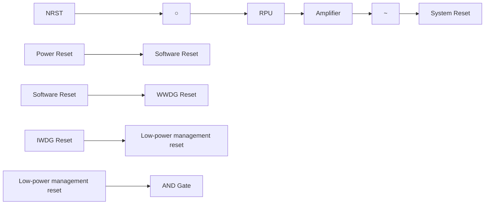

# 3.2.3 后备区域复位

后备区域复位发生时，只会复位后备区域寄存器，包括后备寄存器、RCC\_BDCTLR 寄存器（RTC 使能和 LSE 振荡器）。其产生条件包括：

- 在 $V_{DD}$ 和 $V_{BAT}$ 都掉电的前提下，由 $V_{DD}$ 或 $V_{BAT}$ 上电引起  
- RCC\_BDCTLR 寄存器的 BDRST 位置 1

# 3.3 时钟

# 3.3.1 系统时钟结构

图 3-2 CH32V305/307/317 和 CH32F205/207 时钟树框图  
```mermaid
graph TD
    subgraph_I2S3["OSC32_IN"]
        A["40kHz LSI RC"] --> B["IWDGCLK"]
        B --> C["to independent watchdog"]
        D["OSC32_OUT"] --> E["32.768kHz LSE OSC"]
        E --> F["RTCCLK"]
        F --> G["to RTC"]
        H["/128"] --> I["PREFIV2 /1,,/2,... /15,,/16"]
        I --> J["PREFIV1 SRC /1,,/2,... /15,,/16"]
        J --> K["PREFIV1"]
        K --> L["PPLL3VCO (2*PLL3CLK)"]
        L --> M["ETH-PHY"]
        M --> N["to I2S2 interface"]
        M --> O["to I2S3 interface"]
        M --> P["to TRNG"]
    end

    subgraph_MSOS["OSC_IN"]
        Q["3-25MHz HSE OSC"] --> R["8MHz HSI RC"]
        R --> S["PREFIV2 /1,,/2,... /15,,/16"]
        S --> T["PREFIV1 SRC /1,,/2,... /15,,/16"]
        T --> U["PREFIV1"]
        U --> V["PPLL3VCO (2*PLL3CLK)"]
        V --> W["ETH-PHY"]
        W --> X["to I2S2 interface"]
        W --> Y["to I2S3 interface"]
        W --> Z["to TRNG"]
    end

    subgraph_MSOS_RMI["RSMII interface"]
        AA["MCO[3:0"]] --> AB["HSE HSI"]
        AB --> AC["HB prescaler /1,,/2,.../512"]
        AC --> AD["/1,2"]
        AD --> AE["to Flash prog IF"]
        AD --> AF["to HB bus/core/memory/DMA"]
        AD --> AG["FCLK core free running clock"]
        AD --> AH["to Core System timer"]
        AC --> AI["/8"]
        AI --> AJ["PB1 prescaler /1,,/2,.../16"]
        AJ --> AK["PCLK1 to PB1 peripherals"]
        AJ --> AL["peripheral clock enable"]
        AJ --> AM["if(PB1 prescaler=1)*1 else *2"]
        AM --> AN["TIMxCLK to TIM2,3,4,5,6,7"]
        AM --> AO["peripheral clock enable"]
    end

    subgraph_MSOS_RMI_RMI["RSMII interface"]
        AP["MII_TXC"] --> AQ["MIA/RMII interface"]
        AR["MII_RXC"] --> AS["MII_RMII_SEL in AFIO_MAPR"]
        AT["GTXC"] --> AU["GTXC RGMIION"]
        AV["GRXC"] --> AW["GRXC"]
        AX["EXT_125M"] --> AY["ETH1G_EN"]
        AZ["PLL2VCO PLL3VCO"] --> BA["ETH1G_SRC"]
        BB["ETH1G_SRC"] --> BC["RGMII interface"]

    end

    subgraph_MSOS_RMI_RMI_RMI["RSMII interface"]
        BD["MCO[3:0"]] --> BE["HSE HSI"]
        BE --> BF["PLLCLK/2 PLL2CLK PLL3CLK/2 PLL3CLK XTI"]
        BG["MII_TXC"] --> BH["MIA/RMII interface"]
        BI["MII_RXC"] --> BJ["MIA/RMII interface"]
        BK["GTXC"] --> BL["GTXC RGMIION"]
        BM["GRXC"] --> BN["ETH1G_EN"]
        BO["EXT_125M"] --> BP["ETH1G_SRC"]
    end

    subgraph_MSOS_RMI_RMI_RMI["RSMII interface"]
        BQ["MCO[3:0"]] --> BR["HSE HSI"]
        BR --> BS["PLLCLK/2 PLL2CLK PLL3CLK/2 PLL3CLK XTI"]
        BT["MII_TXC"] --> BU["MIA/RMII interface"]
        BV["MII_RXC"] --> BW["MACRXCLK"]
        BX["GTXC"] --> BY["GTXC RGMIION"]
        BZ["ETH1G_EN"] --> CA["ETH1G_SRC"]
    end

    subgraph_MSOS_RMI_RMI_RMI["RSMII interface"]
        CB["MCO[3:0"]] --> CC["HSE HSI"]
        CC --> CD["PLLCLK/2 PLL2CLK PLL3CLK/2 PLL3CLK XTI"]
        DD["MII_TXC"] --> DE["MIA/RMII interface"]
        DF["MII_RXC"] --> DG["MIA/RMII interface"]
    end

    subgraph_MSOS_RMI_RMI_RMI["RSMII interface"]
        DH["MCO[3:0"]] --> DI["HSE HSI"]
        DI --> DJ["PLLCLK/2 PLL2CLK PLL3CLK/2 PLL3CLK XTI"]
        DK["GTXC"] --> DL["GTXC RGMIION"]
        DM["GRXC"] --> DN["ETH1G_EN"]
    end

    subgraph_MSOS_RMI_RMI_RMI_RMI["RSMII interface"]
        DO["MCO[3:0"]] --> DP["HSE HSI"]
        DP --> DPX["PLLCLK/2 PLL2CLK PLL3CLK/2 PLL3CLK XTI"]
        DPX --> DPXX["HCLK 144MHz max"]

    subgraph_MSOS_RMI_RMI_RMI_RMI["RSMII interface"]
        DP["MCO[3:0"]] --> DPX
    end

    subgraph_MSOS_RMI_RMI_RMI_RMI["RSMII interface"]
        DP["MCO[3:0"]] --> DPX
    end

    subgraph_MSOS_RMI_RMI_RMI_RMI["RSMII interface"]
        DP["MCO[3:0"]] --> DPX
    end

    subgraph_MSOS_RMI_RMI_RMI_RMI["RSMII interface"]
        DP["MCO[3:0"]] --> DR["HSE HSI"]
        DR --> DRX["PLLCLK/2 PLL2CLK PLL3CLK/2 PLL3CLK XTI"]
        DRX --> DRXX["HCLK 144MHz max"]

    subgraph_MSOS_RMI_RMI_RMI_RMI["RSMII interface"]
        DR["MCO[3:0"]] --> DR
    end

    subgraph_MSOS_RMI_RMI_RMI_RMI["RSMII interface"]
        DR["MCO[3:0"]] --> DR
    end

    subgraph_MSOS_RMI_RMI_RMI_RMI["RSMII interface"]
        DR["MCO[3:0"]] --> DR
    end

    subgraph_MSOS_RMI_RMI_RMI_RMI["RSMII interface"]
        DR["MCO[3:0"]] --> DR
```

注：本时钟树适用于 CH32F20x\_D8C 和 CH32V30x\_D8C、CH32V31x\_D8C。

图 3-3 CH32F203/V203/V303 时钟树框图  
```mermaid
graph TD
    A["40kHz LSI RC"] -->|IWDGCLK to independent watchdog| B["32.768kHz LSE OSC"]
    B -->|RTCCLK to RTC| C["/128"]
    C --> D["8MHz HSI RC"]
    D --> E["PLLCLK/2"]
    E --> F["HB prescaler /1,2…/512"]
    F --> G["/1,2 to Flash prog IF"]
    F --> H["/8 to Core System timer"]
    G --> I["PCLK1 to PB1 peripherals"]
    H --> J["FCLK core free running clock"]
    I --> K["Peripheral clock enable"]
    J --> L["Peripheral clock enable"]
    K --> M["PCLK2 to PB2 peripherals"]
    L --> N["ADC prescaler /2,4,6,8"]
    N --> O["Peripheral clock enable"]
    O --> P["TIMxCLK to TIM1,8,9,10"]
    P --> Q["Peripheral clock enable"]
    Q --> R["USB prescaler /1,2,3"]
    R --> S["Peripheral clock enable"]
    S --> T["USBCLK to USBCLK"]
    U["OSC32_IN"] --> V["OSC32_OUT"]
    W["OSC_IN"] --> X["OSC_OUT"]
    Y["MCO[3:0"] --> Z["HSI"]
    Y --> AA["HSE"]
    Y --> AB["PLLCLK/2"]
    AC["USB prescaler /1,2,3"] --> AD["48MHz"]
    AE["USB prescaler /1,2,3"] --> AF["Peripheral clock enable"]
    AG["USB prescaler /1,2,3"] --> AH["Peripheral clock enable"]
    AI["USB prescaler /1,2,3"] --> AJ["Peripheral clock enable"]
    AK["USB prescaler /1,2,3"] --> AL["Peripheral clock enable"]
    AM["USB prescaler /1,2,3"] --> AN["Peripheral clock enable"]
    AO["USB prescaler /1,2,3"] --> AP["Peripheral clock enable"]
    AQ["USB prescaler /1,2,3"] --> AR["Peripheral clock enable"]
    AS["USB prescaler /1,2,3"] --> AT["Peripheral clock enable"]
    AU["USB prescaler /1,2,3"] --> AV["Peripheral clock enable"]
    AW["USB prescaler /1,2,3"] --> AX["Peripheral clock enable"]
    AY["MCO"] --> AZ["HCLK 144MHz max"]
    BA["MB"] --> BB["PB1 prescaler /1,2…/16"]
    BB --> BC["if(PB1 prescaler=1)*1 else *2"]
    BC --> BD["PCLK1 to PB1 peripherals"]
    BC --> BE["PCLK2 to PB2 peripherals"]
    BC --> BF["PCLK2 to PB2 peripherals"]
    BG["MB prescaler"] --> BH["PB2 prescaler /1,2…/16"]
    BI["MB prescaler"] --> BJ["PB2 prescaler =1"]*1 else *2]
    BK["MB prescaler"] --> BL["PB2 prescaler =1"]*1 else *2]
```

注：本时钟树适用于 CH32F20x\_D6、CH32F20x\_D8、CH32V20x\_D6 和 CH32V30x\_D8。当使用 USB 功能时，CPU 的频率必须是 48MHz、96MHz 或 144MHz。使用 USB 高速功能时，USBHSPLL 的时钟源只能为 HSE。当系统从停止或待机模式唤醒时系统会自动切换为 HSI 做主频。

图 3-4 CH32V203RB 时钟树结构  
```mermaid
graph TD
    A["OSC32_IN"] --> B["32kHz LSI RC"]
    C["OSC32_OUT"] --> D["32.768kHz LSE OSC"]
    B --> E["IWDGCLK"]
    D --> F["/512"]
    E --> G["to independent watchdog"]
    F --> H["RTCCLK"]
    G --> I["to RTC"]
    J["OSC_IN"] --> K["32MHz HSE OSC"]
    K --> L["/4"]
    K --> M["/8"]
    K --> N["/2"]
    L --> O["PLLXTPRE USBPRE PLLSRC"]
    M --> P["PLLMUL *3,*4,...*16,*18"]
    N --> Q["*3,*4,...*16,*18"]
    O --> R["USB prescaler /1,2,3,5"]
    P --> S["PLLCLK"]
    Q --> T["PSW"]
    R --> U["48MHz USBCLK"]
    S --> V["SYSCLK"]
    W["MC0[3:0"]] --> X["HB prescaler /1,2.../512"]
    X --> Y["/1,2"]
    Y --> Z["to Flash prog IF"]
    Y --> AA["to HB bus/core/memory/DMA"]
    Y --> AB["FCLK core free running clock"]
    X --> AC["/8"]
    AC --> AD["to Core System timer"]
    X --> AE["/1,2"]
    AE --> AF["ETH clock enable 60MHz"]
    AF --> AG["ETH-PHY"]
    X --> AH["HCLK 144MHz max"]
    AH --> AI["PB1 prescaler /1,2.../16"]
    AI --> AJ["PCLK1 to PB1 peripherals"]
    AI --> AK["if(PB1 prescaler=1)*1 else *2"]
    AK --> AL["TIMxCLK to TIM2,3,4,5"]
    AK --> AM["peripheral clock enable"]
    AK --> AN["PCLK2 to PB2 peripherals"]
    AK --> AO["ADC prescaler /2,4,6,8"]
    AO --> AP["ADCCLK to ADC1"]
    AK --> AQ["if(PB2 prescaler=1)*1 else *2"]
    AQ --> AR["TIMxCLK to TIM1"]
    AQ --> AS["peripheral clock enable"]
```

注：（1）CH32V203RB（CH32V20x\_D8）产品外接晶体或时钟（HSE）为 32M，使用外置晶体时无需负载电容已内置。  
（2）上图3-4中蓝色虚线框出来的部分仅适用于批号倒数第五位大于0的CH32V203RB芯片。

图 3-5 CH32FV208 时钟树结构  
```mermaid
graph TD
    subgraph OSC32_IN
        A["32kHz LSI RC"] --> B["IWDGCLK"]
        B --> C["to independent watchdog"]
    end
    subgraph OSC32_OUT
        D["32.768kHz LSE OSC"] --> E["RTCCLK"]
        E --> F["to RTC"]
        F --> G["/512"]
        G --> H["/4"]
        H --> I["PLLXTPRE"]
        I --> J["USBPRE"]
        J --> K["PPLSRC"]
        K --> L["PLL MUL"]
        L --> M["*3,*4,...*16,*18"]
        M --> N["USB prescaler /1,2,3,5"]
        N --> O["USB clock enable"]
        O --> P["48MHz"]
        P --> Q["USBCLK"]
    end

    subgraph OSC_IN
        R["32MHz HSE OSC"] --> S["8MHz HSI RC"]
        S --> T["/2"]
        T --> U["PLL XTR"]
        U --> V["USBPRE"]
        V --> W["PPLSRC"]
        W --> X["*3,*4,...*16,*18"]
        X --> Y["PLL CLK"]
        Y --> Z["SW"]
        Z --> AA["SYS CLK"]
        AA --> AB["HSI"]
        AB --> AC["HSE"]
        AC --> AD["CSS"]
        AD --> AE["RF CLK"]
        AE --> AF["MCO control"]

    subgraph OSC_OUT
        AG["MCO[3:0"]] --> AH["HB prescaler /1,2.../512"]
        AH --> AI["/1,2"]
        AI --> AJ["to Flash prog IF"]
        AI --> AK["to HB bus/core/memory/DMA"]
        AI --> AL["FCLK core free running clock"]
        AI --> AM["to Core System timer"]
        AH --> AN["/8"]
        AN --> AO["BLE"]
        AO --> AP["BLEC/S clock enable"]
        AP --> AQ["/1,2"]
        AQ --> AR["EHT clock enable"]
        AR --> AS["60MHz"]
        AS --> AT["ETH-PHY"]
    end

    subgraph MCO
        AU["MCO[3:0"]] --> AV["HB prescaler /1,2.../512"]
        AV --> AW["/1,2"]
        AW --> AX["to Flash prog IF"]
        AV --> AY["to HB bus/core/memory/DMA"]
        AV --> AZ["FCLK core free running clock"]
        AV --> BA["to Core System timer"]
        AV --> BB["/8"]
        BB --> BC["BLEC/S clock enable"]
        BC --> BD["BLE"]
    end

    subgraph PB1 prescaler
        BE["PB1 prescaler /1,2.../16"] --> BF["PCLK1 to PB1 peripherals"]
        BE --> BG["peripheral clock enable"]
        BG --> BH{if(PB1 prescaler=1)*1 else *2}
        BH --> BI["TIMxCLK to TIM2,3,4"]
        BH --> BJ(peripheral clock enable)
    end

    subgraph PB2 prescaler
        BK["PB2 prescaler /1,2.../16"] --> BL["PCLK2 to PB2 peripherals"]
        BK --> BM["peripheral clock enable"]
        BL --> BN{if(PB2 prescaler=1)*1 else *2}
        BN --> BO["TIMxCLK to TIM1"]
        BN --> BP(peripheral clock enable)
    end

    subgraph ADC prescaler
        BO --> BQ["ADC prescaler /2,4,6,8"]
        BO --> BR["ADCCLK to ADC1"]
        BO --> BS(peripheral clock enable)
    end

    subgraph PB1 prescaler
        BN --> BNQ["PCLK1 to PB1 peripherals"]
    end
```

注：本时钟树适用于 CH32F20x\_D8W 和 CH32V20x\_D8W。若同时使用 USB 和 ETH 功能，需将 USBPRE[1:0]置为 11b。产品外接晶体或时钟（HSE）为 32M，使用外置晶体时无需负载电容已内置。

# 3.3.2 高速时钟（HSI/HSE）

HSI 是系统内部 8MHz 的 RC 振荡器产生的高速时钟信号。HSI RC 振荡器能够在不需要任何外部器件的条件下提供系统时钟。它的启动时间很短但时钟频率精度较差。HSI 通过设置 RCC\_CTLR 寄存器中的 HSION 位被启动和关闭，HSIRDY 位指示 HSI RC 振荡器是否稳定。系统默认 HSION 和 HSIRDY 置 1（建议不要关闭）。如果设置了 RCC\_INTR 寄存器的 HSIRDYIE 位，将产生相应中断。

\- 出厂校准：制造工艺的差异会导致每个芯片的 RC 振荡频率不同，所以在芯片出厂前，会为每颗芯片进行 HSI 校准。系统复位后，工厂校准值被装载到 RCC\_CTLR 寄存器的 HSICAL[7:0] 中。

\- 用户调整：基于不同的电压或环境温度，应用程序可以通过 RCC\_CTLR 寄存器里的 HSITRIM[4:0]位来调整 HSI 频率。

注：如果 HSE 晶体振荡器失效，HSI 时钟会被作为备用时钟源（时钟安全系统）。

HSE 是外部的高速时钟信号，包括外部晶体/陶瓷谐振器产生或者外部高速时钟送入。

\- 外部晶体/陶瓷谐振器（HSE 晶体）：外接 3-25MHz 外部振荡器为系统提供更为精确的时钟源。进一步信息可参考数据手册的电气特性部分。HSE 晶体可以通过设置 RCC\_CTLR 寄存器中的 HSEON 位被启动和关闭，HSERDY 位指示 HSE 晶体振荡是否稳定，硬件在 HSERDY 位置 1 后才将时钟送入系统。如果设置了 RCC\_INTR 寄存器的 HSERDYIE 位，将产生相应中断。

图 3-6 高速外部晶体电路  

```text_image
CL1
Load
Capacitance
3~25MHz
CL2
OSC_IN
OSC_OUT
```


注：负载电容需要尽可能地靠近振荡器引脚，并根据晶体厂家参数选择容值。

\- 外部高速时钟源（HSE 旁路）：此模式从外部直接送入时钟源到 OSC\_IN 引脚，OSC\_OUT 引脚悬空。最高支持 25MHz 频率。应用程序需在 HSEON 位为 0 情况下，置位 HSEBYP 位，打开 HSE 旁路功能，然后再置位 HSEON 位。

图 3-7 高速时钟源电路  
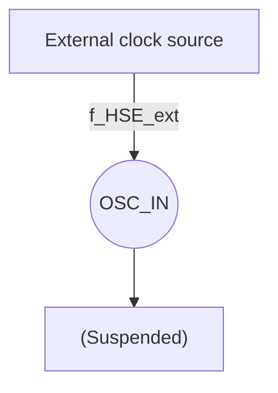

# 3.3.3 低速时钟（LSI/LSE）

LSI 是系统内部的 RC 振荡器产生的低速时钟信号。它可以在停机和待机模式下保持运行，为 RTC 时钟、独立看门狗和唤醒单元提供时钟基准。进一步信息可参考数据手册的电气特性部分。LSI 可以通过设置 RCC\_RSTSCKR 寄存器中的 LSION 位被启动和关闭，然后通过查询 LSIRDY 位检测 LSI RC 振荡是否稳定，硬件在 LSIRDY 位置 1 后才将时钟送入。如果设置了 RCC\_INTR 寄存器的 LSIRDYIE 位，将产生相应中断。

LSE 是外部的低速时钟信号，包括外部晶体/陶瓷谐振器产生或者外部低速时钟送入。它为 RTC 时钟或者其他定时功能提供一个低功耗且精确的时钟源。

\- 外部晶体/陶瓷谐振器（LSE 晶体）：外接 32.768kHz 的外部低速振荡器。LSE 通过设置 RCC\_BDCTLR 寄存器中的 LSEON 位被启动和关闭，LSERDY 位指示 LSE 晶体振荡是否稳定，硬件在 LSERDY 位置 1 后才将时钟送入系统。如果设置了 RCC\_INTR 寄存器的 LSERDYIE 位，将产生相应中断。

图 3-8 低速外部晶体电路  

```text_image
C11
Load Capacitance
32.768kHz
C12
OSC32_IN
OSC32_OUT
```


\- 外部低速时钟源（LSE 旁路）：此模式从外部直接送入时钟源到 OSC32\_IN 引脚，OSC32\_OUT 引脚悬空。应用程序需在 LSEON 位为 0 情况下，置位 LSEBYP 位，打开 LSE 旁路功能，然后再置位 LSEON 位。

图 3-9 低速时钟源电路  
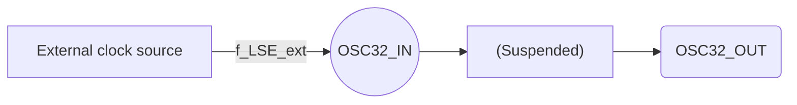

# 3.3.4 PLL 时钟

通过配置 RCC\_CFGRO 寄存器和扩展寄存器 EXTEN\_CTR，内部 PLL 时钟可以选择 3 种时钟来源和倍频系数，这些设置必须在每个 PLL 被开启前完成，一旦 PLL 被启动，这些参数就不能被改动。设置 RCC\_CTLR 寄存器中的 PLLON 位被启动和关闭，PLLRDY 位指示 PLL 时钟是否稳定，硬件在 PLLRDY 位置 1 后才将时钟送入系统。设置 RCC\_CTLR 寄存器中的 PLLON2 位被启动和关闭，PLLRDY2 位指示 PLL2 时钟是否稳定，硬件在 PLLRDY2 位置 1 后才将时钟送入系统。设置 RCC\_CTLR 寄存器中的 PLLON3 位被启动和关闭，PLLRDY3 位指示 PLL3 时钟是否稳定，硬件在 PLLRDY3 位置 1 后才将时钟送入系统。如果设置了 RCC\_INTR 寄存器的 PLLRDYIE 位、PLL2RDYIE 位或 PLL3RDYIE 位，将产生相应中断。

PLL 时钟来源：

● HSI 时钟送入  
● HSI 经过 2 分频送入  
● HSE 时钟或通过一个可配置的分频器的 PLL2 时钟  
- PLL2 和 PLL3 由 HSE 通过一个可配置的分频器（PREDIV2）2 提供时钟

# 3.3.5 总线/外设时钟

# 3.3.5.1 系统时钟（SYSCLK）

通过配置 RCC\_CFGRO 寄存器 SW[1:0] 位配置系统时钟来源，SWS[1:0] 指示当前的系统时钟源。

● HSI 作为系统时钟  
● HSE 作为系统时钟  
- PLL 时钟作为系统时钟

控制器复位后，默认 HSI 时钟被选为系统时钟源。时钟源之间的切换必须在目标时钟源准备就绪后才会发生。

# 3.3.5.2 HB/PB1/PB2 总线外设时钟（HCLK/PCLK1/PCLK2）

通过配置 RCC\_CFGRO 寄存器的 HPRE[3:0]、PPRE1[2:0]、PPRE2[2:0] 位，可以分别配置 HB、PB1、PB2 总线的时钟。这些总线时钟决定了挂载在其下面的外设接口访问时钟基准。应用程序可以调整不

同的数值，来降低部分外设工作时的功耗。

通过 RCC\_AHBRSTR、RCC\_APB1PRSTR、RCC\_APB2PRSTR 寄存器中各个位可以复位不同的外设模块，将其恢复到初始状态。

通过 RCC\_AHBPCENR、RCC\_APB1PCENR、RCC\_APB2PCENR 寄存器中各个位可以单独开启或关闭不同外设模块通讯时钟接口。使用某个外设时，首先需要开启其时钟使能位，才能访问其寄存器。

# 3.3.5.3 RTC 时钟（RTCCLK）

通过设置 RCC\_BDCTLR 寄存器的 RTCSEL[1:0]位，RTCCLK 时钟源可以由 HSE 分频、LSE 或 LSI 时钟提供。修改此位前要保证电源控制寄存器（PWR\_CTLR）中的 DBP 位置 1，只有后备区域复位，才能复位此位。

- LSE 作为 RTC 时钟：由于 LSE 处于后备域由 $V_{BAT}$ 供电，只要 $V_{BAT}$ 维持供电，尽管 $V_{DD}$ 供电被切断，RTC 仍继续工作。  
- LSI 作为 RTC 时钟：如果 $V_{DD}$ 供电被切断，RTC 自动唤醒不能保证。  
- HSE 经分频后作为 RTC 时钟：如果 $V_{DD}$ 供电被切断或内部电压调压器被关闭（1.8V 域的供电被切断），则 RTC 状态不确定。相应型号芯片的 HSE 的分频系数参考 RCC\_BDCTLR 寄存器 RTCSEL[1:0]位的描述。

# 3.3.5.4 独立看门狗时钟

如果独立看门狗已经由硬件配置设置或软件启动，LSI 振荡器将被强制打开，并且不能被关闭。在 LSI 振荡器稳定后，时钟供应给 IWDG。

# 3.3.5.5 时钟输出（MCO）

微控制器允许输出时钟信号到 MCO 引脚。在相应的 GPIO 端口寄存器配置复用推挽输出模式，通过配置 RCC\_CFGRO 寄存器 MCO[3:0] 位，可以选择以下 8 个时钟信号作为 MCO 时钟输出：

● 系统时钟（SYSCLK）输出  
● HSI 时钟输出  
● HSE 时钟输出  
- PLL 时钟经过 2 分频输出  
- PLL2 时钟输出  
- PLL3 时钟输出  
- PLL3 时钟经过 2 分频输出

● XT1 外部 3-25MHz 振荡器（用于以太网）

# 3.3.5.6 USB 时钟

USBD 48MHz 时钟源来自通过一个可配置的分频器的 PLL 时钟，此时 PLL 支持三种时钟配置，包括 48MHz、96MHz 和 144MHz，通过配置寄存器 RCC\_CFGRO 的 USBPRE[1:0] 位输出 48MHz 时钟到 USBD。

USBFS/OTG\_FS 48MHz 时钟源来自通过一个可配置的分频器的 PLL 时钟或者 USBHSPLL 时钟，可通过配置寄存器 RCC\_CFGR2 的 USBFSSRC 位来选择。若时钟源选择通过一个可配置的分频器的 PLL 时钟作为时钟源时，则配置步骤可参考 USBD。若时钟源选择 USBHSPLL 时钟作为时钟源时，通过配置寄存器 RCC\_CFGR2 的 USBHSCLK[1:0] 位，选择 USBHSPLL 参考时钟频率（参考时钟频率必须和 USBHSPLL 输入时钟保持一致）。

USBHS 时钟源来自 USBHSPLL 时钟,通过配置寄存器 RCC\_CFGR2 的 USBHSCLK[1:0]位,选择 USBHSPLL 参考时钟频率（参考时钟频率必须和 USBHSPLL 输入时钟保持一致），通过配置寄存器 RCC\_CFGR2 的 USBHSPLL 位，使能 USB PHY 内部 PLL。

# 3.3.5.7 ETH 时钟

ETH 时钟配置参考 27.1.4.5 章节。

# 3.3.5.8 I2S 和 RNG 时钟

I2S 和 RNG 的时钟源来自 PLL3VCO 或系统时钟（SYSCLK），I2S2、I2S3 和 TRNG 可分别通过配置寄存器 RCC\_CFGR2 的 I2S2SRC 位、I2S3SRC 位和 RNGSRC 位选择时钟源。

# 3.3.6 时钟安全系统

时钟安全系统是控制器的一种运行保护机制，它可以在 HSE 时钟发送故障的情况下，切换到 HSI 时钟下，并产生中断通知，允许应用程序软件完成营救操作。

通过设置 RCC\_CTLR 寄存器的 CSSON 位置 1，激活时钟安全系统。此时，时钟监测器将在 HSE 振荡器启动（HSERDY=1）延迟后被使能，并在 HSE 时钟关闭后关闭。一旦系统运行过程中 HSE 时钟发生故障，HSE 振荡器将被关闭，时钟失效事件将被送到高级定时器（TIM1 和 TIM8）的刹车输入端，并产生时钟安全中断，CSSF 位置 1，并且应用程序进入 NMI 不可屏蔽中断，通过置位 CSSC 位，可以清除 CSSF 位标志，可撤销 NMI 中断挂起位。

如果当前 HSE 作为系统时钟，或者当前 HSE 作为 PLL 输入时钟，PLL 作为系统时钟，时钟安全系统将在 HSE 故障时自动将系统时钟切换到 HSI 振荡器，并关闭 HSE 振荡器和 PLL。

# 3.4 寄存器描述

表 3-1 RCC 相关寄存器列表

<table><tr><td>名称</td><td>访问地址</td><td>描述</td><td>复位值</td></tr><tr><td>R32_RCC_CTLR</td><td>0x40021000</td><td>时钟控制寄存器</td><td>0x0000xx83</td></tr><tr><td>R32_RCC_CFGRO</td><td>0x40021004</td><td>时钟配置寄存器 0</td><td>0x00000000</td></tr><tr><td>R32_RCC_INTR</td><td>0x40021008</td><td>时钟中断寄存器</td><td>0x00000000</td></tr><tr><td>R32_RCC_APB2PRSTR</td><td>0x4002100C</td><td>PB2 外设复位寄存器</td><td>0x00000000</td></tr><tr><td>R32_RCC_APB1PRSTR</td><td>0x40021010</td><td>PB1 外设复位寄存器</td><td>0x00000000</td></tr><tr><td>R32_RCC_AHBPCENR</td><td>0x40021014</td><td>HB 外设时钟使能寄存器</td><td>0x00000014</td></tr><tr><td>R32_RCC_APB2PCENR</td><td>0x40021018</td><td>PB2 外设时钟使能寄存器</td><td>0x00000000</td></tr><tr><td>R32_RCC_APB1PCENR</td><td>0x4002101C</td><td>PB1 外设时钟使能寄存器</td><td>0x00000000</td></tr><tr><td>R32_RCC_BDCTLR</td><td>0x40021020</td><td>后备域控制寄存器</td><td>0x00000000</td></tr><tr><td>R32_RCC_RSTSCKR</td><td>0x40021024</td><td>控制/状态寄存器</td><td>0x0C000000</td></tr><tr><td>R32_RCC_AHBRSTR</td><td>0x40021028</td><td>HB 外设复位寄存器</td><td>0x00000000</td></tr><tr><td>R32_RCC_CFGR2</td><td>0x4002102C</td><td>时钟配置寄存器 2</td><td>0x00000000</td></tr></table>

表 3-2 OSC 相关寄存器列表

<table><tr><td>名称</td><td>访问地址</td><td>描述</td><td>复位值</td></tr><tr><td>R32_HSE_CAL_CTRL</td><td>0x4002202C</td><td>外部晶振校准控制寄存器</td><td>0x09000000</td></tr><tr><td>R16_LSI32K_TUNE</td><td>0x40022036</td><td>内部低速晶振校准调节寄存器</td><td>0x1011</td></tr><tr><td>R8_LSI32K_CAL_CFG</td><td>0x40022049</td><td>内部低速晶振校准配置寄存器</td><td>0x01</td></tr><tr><td>R16_LSI32K_CAL_STATR</td><td>0x4002204C</td><td>内部低速晶振校准状态寄存器</td><td>0x0000</td></tr><tr><td>R8_LSI32K_CAL_OV_CNT</td><td>0x4002204E</td><td>内部低速晶振校准次数计数器</td><td>0x00</td></tr><tr><td>R8_LSI32K_CAL_CTRL</td><td>0x4002204F</td><td>内部低速晶振校准控制寄存器</td><td>0x80</td></tr></table>

注：适用于 CH32V20x\_D8W、CH32F20x\_D8W。

# 3.4.1 时钟控制寄存器（RCC\_CTLR）

偏移地址：0x00

<table><tr><td>31</td><td>30</td><td>29</td><td>28</td><td>27</td><td>26</td><td>25</td><td>24</td><td>23</td><td>22</td><td>21</td><td>20</td><td>19</td><td>18</td><td>17</td><td>16</td></tr><tr><td colspan="2">Reserved</td><td>PLL3RDY</td><td>PLL3ON</td><td>PLL2RDY</td><td>PLL2ON</td><td>PLLRDY</td><td>PLLON</td><td colspan="4">Reserved</td><td>CSSON</td><td>HSE BYP</td><td>HSE RDY</td><td>HSEON</td></tr><tr><td>15</td><td>14</td><td>13</td><td>12</td><td>11</td><td>10</td><td>9</td><td>8</td><td>7</td><td>6</td><td>5</td><td>4</td><td>3</td><td>2</td><td>1</td><td>0</td></tr><tr><td colspan="8">HSICAL[7:0]</td><td colspan="5">HSITRIM[4:0]</td><td>Reserved</td><td>HSI RDY</td><td>HSION</td></tr></table>

<table><tr><td>位</td><td>名称</td><td>访问</td><td>描述</td><td>复位值</td></tr><tr><td>[31:30]</td><td>Reserved</td><td>RO</td><td>保留。</td><td>0</td></tr><tr><td>29</td><td>PLL3RDY</td><td>RO</td><td>PLL3时钟就绪锁定标志位(由硬件置位):0:PLL3时钟未锁定;1:PLL3时钟锁定。注:适用于CH32F20x_D8C、CH32V30x_D8C、CH32V31x_D8C。</td><td>0</td></tr><tr><td>28</td><td>PLL3ON</td><td>RW</td><td>PLL3时钟使能控制位:0:关闭PLL3时钟;1:使能PLL3时钟。注:进入停止或待机低功耗模式后,此位由硬件清0。适用于CH32F20x_D8C、CH32V30x_D8C、CH32V31x_D8C。</td><td>0</td></tr><tr><td>27</td><td>PLL2RDY</td><td>RO</td><td>PLL2时钟就绪锁定标志位(由硬件置位):0:PLL时钟未锁定;1:PLL时钟锁定。注:适用于CH32F20x_D8C、CH32V30x_D8C、CH32V31x_D8C。</td><td>0</td></tr><tr><td>26</td><td>PLL2ON</td><td>RW</td><td>PLL2时钟使能控制位:0:关闭PLL时钟;1:使能PLL时钟。注:进入停止或待机低功耗模式后,此位由硬件清0。适用于CH32F20x_D8C、CH32V30x_D8C、CH32V31x_D8C。</td><td>0</td></tr><tr><td>25</td><td>PLLRDY</td><td>RO</td><td>PLL时钟就绪锁定标志位(由硬件置位):0:PLL时钟未锁定;1:PLL时钟锁定。</td><td>0</td></tr><tr><td>24</td><td>PLLON</td><td>RW</td><td>PLL时钟使能控制位:0:关闭PLL时钟;1:使能PLL时钟。注:进入停止或待机低功耗模式后,此位由硬件清0。</td><td>0</td></tr><tr><td>[23:20]</td><td>Reserved</td><td>RO</td><td>保留。</td><td>0</td></tr><tr><td>19</td><td>CSSON</td><td>RW</td><td>时钟安全系统使能控制位:0:关闭时钟安全系统;1:使能时钟安全系统。当HSE准备好(HSERDY置1),硬件开启对HSE的时钟监测功能,发现HSE异常触发CSSF标志及NMI中断;当HSE没有准备好,硬件关闭对HSE的时钟监测功能。注:此功能不适用于批号倒数第五位等于0的CH32V20x_D6芯片。</td><td>0</td></tr><tr><td>18</td><td>HSEBYP</td><td>RW</td><td>外部高速晶体旁路控制位:0:不旁路高速外部晶体/陶瓷谐振器;1:旁路外部高速晶体/陶瓷谐振器(使用外部时钟源)。注:此位需在HSEON为0下写入。</td><td>0</td></tr><tr><td>17</td><td>HSERDY</td><td>RO</td><td>外部高速晶体振荡稳定就绪标志位(由硬件置位):0:外部高速晶体振荡没有稳定;1:外部高速晶体振荡稳定。注:在HSEON位清0后,该位需要6个HSE周期清0。</td><td>0</td></tr><tr><td>16</td><td>HSEON</td><td>RW</td><td>外部高速晶体振荡使能控制位:0:关闭HSE振荡器;1:使能HSE振荡器。注:进入停止或待机低功耗模式后,此位由硬件清0。</td><td>0</td></tr><tr><td>[15:8]</td><td>HSICAL[7:0]</td><td>RO</td><td>内部高速时钟校准值,在系统启动时被自动初始化。</td><td>xxh</td></tr><tr><td>[7:3]</td><td>HSITRIM[4:0]</td><td>RW</td><td>内部高速时钟调整值:用户可以输入一个调整值叠加到HSICAL[7:0]数值上,根据电压和温度的变化调整内部HSI RC振荡器的频率。默认值为16,可以把HSI调整到8MHz±0.25%;每步HSICAL的变化调整约20kHz。</td><td>10000b</td></tr><tr><td>2</td><td>Reserved</td><td>RO</td><td>保留。</td><td>0</td></tr><tr><td>1</td><td>HSIRDY</td><td>RO</td><td>内部高速时钟(8MHz)稳定就绪标志位(由硬件置位):0:内部高速时钟(8MHz)没有稳定;1:内部高速时钟(8MHz)稳定。注:在HSION位清0后,该位需要6个HSI周期清0。</td><td>1</td></tr><tr><td>0</td><td>HSION</td><td>RW</td><td>内部高速时钟(8MHz)使能控制位:0:关闭HSI振荡器;1:使能HSI振荡器。注:当从待机和停止模式返回或用作系统时钟的外部振荡器HSE发生故障时,该位由硬件置1来启动内部8MHz的RC振荡器。</td><td>1</td></tr></table>

# 3.4.2 时钟配置寄存器 0（RCC\_CFGRO）

偏移地址：0x04

<table><tr><td>31</td><td>30</td><td>29</td><td>28</td><td>27</td><td>26</td><td>25</td><td>24</td><td>23</td><td>22</td><td>21</td><td>20</td><td>19</td><td>18</td><td>17</td><td>16</td></tr><tr><td>ADCDUTY</td><td>ADC_DUTY_SEL</td><td>Reserved</td><td>ETHPRE</td><td colspan="4">MCO[3:0]</td><td colspan="2">USBPRE[1:0]</td><td colspan="4">PLLMUL[3:0]</td><td>PLLXTPRE</td><td>PLL SRC</td></tr><tr><td>15</td><td>14</td><td>13</td><td>12</td><td>11</td><td>10</td><td>9</td><td>8</td><td>7</td><td>6</td><td>5</td><td>4</td><td>3</td><td>2</td><td>1</td><td>0</td></tr><tr><td colspan="2">ADCPRE[1:0]</td><td colspan="3">PPRE2[2:0]</td><td colspan="3">PPRE1[2:0]</td><td colspan="4">HPRE[3:0]</td><td colspan="2">SWS[1:0]</td><td colspan="2">SW[1:0]</td></tr></table>

<table><tr><td>位</td><td>名称</td><td>访问</td><td>描述</td><td>复位值</td></tr><tr><td>31</td><td>ADCDUTY</td><td>RW</td><td>ADC 时钟占空比调整:0:ADC时钟占空比为50%;1:ADC时钟低电平时间更长。</td><td>0</td></tr><tr><td>30</td><td>ADC_DUTY_SEL</td><td>RW</td><td>ADC时钟占空比选择:0:ADC时钟占空比为50%;1:ADC时钟占空比为75%。注:此位仅适用于CH32F20xD8、CH32F20xD8C、CH32V30xD8、CH32V30xD8C、CH32V31xD8C批号倒数第六位不为0的产品。</td><td>0</td></tr><tr><td>29</td><td>Reserved</td><td>RO</td><td>保留。</td><td>0</td></tr><tr><td>28</td><td>ETHPRE</td><td>RW</td><td>以太网时钟来源预分频控制:0:不分频;1:2分频;注:适用于CH32V20xD8W、CH32V20xD8、CH32F20xD8W。</td><td>0</td></tr><tr><td>[27:24]</td><td>MCO[3:0]</td><td>RW</td><td>微控制器MCO引脚时钟输出控制:00xx:没有时钟输出;0100:系统时钟(SYSCLK)输出;0101:内部8MHz的RC振荡器时钟(HSI)输出;0110:外部振荡器时钟(HSE)输出;0111:PLL时钟2分频后输出;1000:PLL2时钟输出;1001:PLL3时钟2分频后输出;1010:XT1外部震荡器时钟输出;1011:PLL3时钟输出。注:在启动或切换MCO时钟时,可能有几个周期的时钟丢失。其中1000——1011适用于CH32F20xD8C、CH32V30xD8C、CH32V31xD8C。</td><td>0000b</td></tr><tr><td>[23:22]</td><td>USBPRE[1:0]</td><td>RW</td><td>USBFS/USBOTG时钟分频配置:00:1分频(适用于PLLCLK=48MHz);01:2分频(适用于PLLCLK=96MHz);10:3分频(适用于PLLCLK=144MHz);11:5分频,且PLL的源为HSE二分频(适用于PLLCLK=240MHz,仅适用于CH32V20xD8W/CH32F20xD8W以及CH32V20xD8批号倒数第五位大于0的)。注:CH32V20xD8W、CH32F20xD8W以及CH32V20xD8批号倒数第五位大于0的支持11b选项,其余型号该选项保留。USBD/USBHS模块时钟需要48MHz。此位必须在USBD和USBHS时钟使能前进行配置(RCC_AHBPCENR和RCC_APB1PCENR中)</td><td>00b</td></tr><tr><td>[21:18]</td><td>PLLMUL[3:0]</td><td>RW</td><td>PLL时钟倍频系数(在PLL关闭才可写入):对于CH32F20xD6、CH32F20xD8、CH32F20xD8W、CH32V20xD6、CH32V20xD8、CH32V20xD8W、CH32V30xD8:0000:PLL 2倍频输出;0001:PLL 3倍频输出;</td><td>0000b</td></tr><tr><td></td><td></td><td></td><td>0010:PLL 4倍频输出;0011:PLL 5倍频输出;0100:PLL 6倍频输出;0101:PLL 7倍频输出;0110:PLL 8倍频输出;0111:PLL 9倍频输出;1000:PLL 10倍频输出;1001:PLL 11倍频输出;1010:PLL 12倍频输出;1011:PLL 13倍频输出;1100:PLL 14倍频输出;1101:PLL 15倍频输出;1110:PLL 16倍频输出;1111:PLL 18倍频输出。对于CH32F20x_D8C、CH32V30x_D8C、CH32V31x_D8C:0000:PLL 18倍频输出;0001:PLL 3倍频输出;0010:PLL 4倍频输出;0011:PLL 5倍频输出;0100:PLL 6倍频输出;0101:PLL 7倍频输出;0110:PLL 8倍频输出;0111:PLL 9倍频输出;1000:PLL 10倍频输出;1001:PLL 11倍频输出;1100:PLL 12倍频输出;1011:PLL 13倍频输出;1100:PLL 14倍频输出;1101:PLL 6.5倍频输出;1110:PLL 15倍频输出;1111:PLL 16倍频输出。</td><td></td></tr><tr><td>17</td><td>PLLXTPRE</td><td>RW</td><td>HSE分频送入PLL控制(在PLL关闭才可写入):对于CH32F20x_D6、CH32F20x_D8、CH32V20x_D6、CH32V30x_D8:0:HSE不分频送入PLL;1:HSE 2分频送入PLL。对于CH32F20x_D8C、CH32V30x_D8C、CH32V31x_D8C:由软件置1或清0来选择PREDIV1分频因子的最低位。PLLXTPRE位与RCC_CFGR2寄存器的位[0]是同一位,因此修改RCC_CFGR2寄存器的位[0]同时会改变这一位。如果RCC_CFGR2寄存器的位[3:1]为000b,则该位控制PREDIV1对输入时钟进行2分频(PLLXPRE=1),或不对输入时钟分频(PLLXPRE=0)。对于CH32F20x_D8W、CH32V20x_D8W、CH32V20x_D8:0:HSE 4分频送入PLL;1:HSE 8分频送入PLL。</td><td>0</td></tr><tr><td>16</td><td>PLLSRC</td><td>RW</td><td>PLL的输入时钟源(在PLL关闭才可写入):对于CH32F20x_D6、CH32F20x_D8、CH32V20x_D6、CH32V30x_D8:0:HSI不分频或2分频送入PLL;1:HSE不分频或2分频送入PLL。对于CH32F20x_D8C、CH32V30x_D8C、CH32V31x_D8C:0:HSI不分频或2分频送入PLL;1:PREDIV1输出送入PLL。对于CH32F20x_D8W、CH32V20x_D8W、CH32V20x_D8:0:HSI不分频或2分频送入PLL;1:HSE 2分频或4分频或8分频送入PLL。</td><td>0</td></tr><tr><td>[15:14]</td><td>ADCPRE[1:0]</td><td>RW</td><td>ADC时钟来源预分频控制:00:PCLK2 2分频后作为ADC时钟;01:PCLK2 4分频后作为ADC时钟;10:PCLK2 6分频后作为ADC时钟;11:PCLK2 8分频后作为ADC时钟。注:ADC时钟最高不要超过14MHz。</td><td>00b</td></tr><tr><td>[13:11]</td><td>PPRE2[2:0]</td><td>RW</td><td>PB2时钟来源预分频控制:0xx:HCLK不分频;100:HCLK 2分频;101:HCLK 4分频;110:HCLK 8分频;111:HCLK 16分频</td><td>000b</td></tr><tr><td>[10:8]</td><td>PPRE1[2:0]</td><td>RW</td><td>PB1时钟来源预分频控制:0xx:HCLK不分频;100:HCLK 2分频;101:HCLK 4分频;110:HCLK 8分频;111:HCLK 16分频</td><td>000b</td></tr><tr><td>[7:4]</td><td>HPRE[3:0]</td><td>RW</td><td>HB时钟来源预分频控制:0xxx:SYSCLK不分频;1000:SYSCLK 2分频;1001:SYSCLK 4分频;1010:SYSCLK 8分频;1011:SYSCLK 16分频;1100:SYSCLK 64分频;1101:SYSCLK 128分频;1110:SYSCLK 256分频;1111:SYSCLK 512分频。</td><td>0000b</td></tr><tr><td>[3:2]</td><td>SWS[1:0]</td><td>RO</td><td>系统时钟(SYSCLK)状态(硬件置位):00:系统时钟源是HSI;01:系统时钟源是HSE;10:系统时钟源是PLL;11:不可用。</td><td>00b</td></tr><tr><td>[1:0]</td><td>SW[1:0]</td><td>RW</td><td>选择系统时钟来源:00:HSI作为系统时钟;01:HSE作为系统时钟;10:PLL输出作为系统时钟;11:不可用。注:在使能了时钟安全系统下(CSSON=1),当从待机和停止模式返回或用作系统时钟的外部振荡器HSE发生故障时,由硬件强制选择HSI作为系统时钟。</td><td>00b</td></tr></table>

# 3.4.3 时钟中断寄存器（RCC\_INTR）

偏移地址：0x08

31 30 29 28 27 26 25 24 23 22 21 20 19 18 17 16

<table><tr><td colspan="8">Reserved</td><td>CSSC</td><td>PLL3RDYC</td><td>PLL2RDYC</td><td>PLLRDYC</td><td>HSERDYC</td><td>HSIRDYC</td><td>LSERDYC</td><td>LSIRDYC</td></tr><tr><td>15</td><td>14</td><td>13</td><td>12</td><td>11</td><td>10</td><td>9</td><td>8</td><td>7</td><td>6</td><td>5</td><td>4</td><td>3</td><td>2</td><td>1</td><td>0</td></tr><tr><td>Reser ved</td><td>PLL3RDYIE</td><td>PLL2RDYIE</td><td>PLLRDYIE</td><td>HSERDYIE</td><td>HSIRDYIE</td><td>LSERDYIE</td><td>LSIRDYIE</td><td>CSSF</td><td>PLL3RDYF</td><td>PLL2RDYF</td><td>PLLRDYF</td><td>HSERDYF</td><td>HSIRDYF</td><td>LSERDYF</td><td>LSIRDYF</td></tr></table>

<table><tr><td>位</td><td>名称</td><td>访问</td><td>描述</td><td>复位值</td></tr><tr><td>[31:24]</td><td>Reserved</td><td>RO</td><td>保留。</td><td>0</td></tr><tr><td>23</td><td>CSSC</td><td>WO</td><td>清除时钟安全系统中断标志位(CSSF):0:无动作;1:清除 CSSF 中断标志。</td><td>0</td></tr><tr><td>22</td><td>PLL3RDYC</td><td>WO</td><td>清除 PLL3 就绪中断标志位:0:无动作;1:清除 PLL3RDYF 中断标志。注:适用于 CH32F20x_D8C、CH32V30x_D8C、CH32V31x_D8C。</td><td>0</td></tr><tr><td>21</td><td>PLL2RDYC</td><td>WO</td><td>清除 PLL2 就绪中断标志位:0:无动作;1:清除 PLL2RDYF 中断标志。注:适用于 CH32F20x_D8C、CH32V30x_D8C、CH32V31x_D8C。</td><td>0</td></tr><tr><td>20</td><td>PLLRDYC</td><td>WO</td><td>清除 PLL 就绪中断标志位:0:无动作;1:清除 PLLRDYF 中断标志。</td><td>0</td></tr><tr><td>19</td><td>HSERDYC</td><td>WO</td><td>清除 HSE 振荡器就绪中断标志位:0:无动作;1:清除 HSERDYF 中断标志。</td><td>0</td></tr><tr><td>18</td><td>HSIRDYC</td><td>WO</td><td>清除 HSI 振荡器就绪中断标志位:0:无动作;1:清除 HSIRDYF 中断标志。</td><td>0</td></tr><tr><td>17</td><td>LSERDYC</td><td>WO</td><td>清除 LSE 振荡器就绪中断标志位:0:无动作;1:清除 LSERDYF 中断标志。</td><td>0</td></tr><tr><td>16</td><td>LSIRDYC</td><td>WO</td><td>清除 LSI 振荡器就绪中断标志位:0:无动作;1:清除 LSIRDYF 中断标志。</td><td>0</td></tr><tr><td>15</td><td>Reserved</td><td>RO</td><td>保留。</td><td>0</td></tr><tr><td>14</td><td>PLL3RDYIE</td><td>RW</td><td>PLL3 就绪中断使能位:0:关闭 PLL3 就绪中断;1:使能 PLL3 就绪中断。注:适用于 CH32F20x_D8C、CH32V30x_D8C、CH32V31x_D8C。</td><td>0</td></tr><tr><td>13</td><td>PLL2RDYIE</td><td>RW</td><td>PLL2 就绪中断使能位:0:关闭 PLL2 就绪中断;1:使能 PLL2 就绪中断。注:适用于CH32F20x_D8C、CH32V30x_D8C、CH32V31x_D8C。</td><td>0</td></tr><tr><td>12</td><td>PLLRDYIE</td><td>RW</td><td>PLL就绪中断使能位:0:关闭PLL就绪中断;1:使能PLL就绪中断。</td><td>0</td></tr><tr><td>11</td><td>HSERDYIE</td><td>RW</td><td>HSE就绪中断使能位:0:关闭HSE就绪中断;1:使能HSE就绪中断。</td><td>0</td></tr><tr><td>10</td><td>HSIRDYIE</td><td>RW</td><td>HSI就绪中断使能位:0:关闭HSI就绪中断;1:使能HSI就绪中断。</td><td>0</td></tr><tr><td>9</td><td>LSERDYIE</td><td>RW</td><td>LSE就绪中断使能位:0:关闭LSE就绪中断;1:使能LSE就绪中断。</td><td>0</td></tr><tr><td>8</td><td>LSIRDYIE</td><td>RW</td><td>LSI就绪中断使能位:0:关闭LSI就绪中断;1:使能LSI就绪中断。</td><td>0</td></tr><tr><td>7</td><td>CSSF</td><td>RO</td><td>时钟安全系统中断标志位:0:无时钟安全系统中断;1:HSE时钟失效,产生了时钟安全中断CSSI。硬件置位,软件写CSSC位1清除。</td><td>0</td></tr><tr><td>6</td><td>PLL3RDYF</td><td>RO</td><td>PLL3时钟就绪锁定中断标志:0:无PLL3时钟锁定中断;1:PLL3时钟锁定产生中断。硬件置位,软件写PLL3RDYC位1清除。注:适用于CH32F20x_D8C、CH32V30x_D8C、CH32V31x_D8C。</td><td>0</td></tr><tr><td>5</td><td>PLL2RDYF</td><td>RO</td><td>PLL2时钟就绪锁定中断标志:0:无PLL2时钟锁定中断;1:PLL2时钟锁定产生中断。硬件置位,软件写PLL2RDYC位1清除。注:适用于CH32F20x_D8C、CH32V30x_D8C、CH32V31x_D8C。</td><td>0</td></tr><tr><td>4</td><td>PLLRDYF</td><td>RO</td><td>PLL时钟就绪锁定中断标志:0:无PLL时钟锁定中断;1:PLL时钟锁定产生中断。硬件置位,软件写PLLRDYC位1清除。</td><td>0</td></tr><tr><td>3</td><td>HSERDYF</td><td>RO</td><td>HSE时钟就绪中断标志:0:无HSE时钟就绪中断;1:HSE时钟就绪产生中断。硬件置位,软件写HSERDYC位1清除。</td><td>0</td></tr><tr><td>2</td><td>HSIRDYF</td><td>RO</td><td>HSI时钟就绪中断标志:0:无HSI时钟就绪中断;1:HSI时钟就绪产生中断。硬件置位,软件写HSIRDYC位1清除。</td><td>0</td></tr><tr><td>1</td><td>LSERDYF</td><td>RO</td><td>LSE时钟就绪中断标志:0:无 LSE 时钟就绪中断;1:LSE 时钟就绪产生中断。硬件置位,软件写 LSERDYC 位 1 清除。</td><td>0</td></tr><tr><td>0</td><td>LSIRDYF</td><td>RO</td><td>LSI 时钟就绪中断标志:0:无 LSI 时钟就绪中断;1:LSI 时钟就绪产生中断。硬件置位,软件写 LSIRDYC 位 1 清除。</td><td>0</td></tr></table>

# 3.4.4 PB2 外设复位寄存器（RCC\_APB2PRSTR）

偏移地址：0x0C

<table><tr><td colspan="11">Reserved</td><td>TIM10RST</td><td>TIM9RST</td><td colspan="3">Reserved</td></tr><tr><td>15</td><td>14</td><td>13</td><td>12</td><td>11</td><td>10</td><td>9</td><td>8</td><td>7</td><td>6</td><td>5</td><td>4</td><td>3</td><td>2</td><td>1</td><td>0</td></tr><tr><td>Reserved</td><td>USART1RST</td><td>TIM8RST</td><td>SPI1RST</td><td>TIM1RST</td><td>ADC2RST</td><td>ADC1RST</td><td colspan="2">Reserved</td><td>IOPERST</td><td>IOPDRST</td><td>IOPCRST</td><td>IOPBRST</td><td>IOPARST</td><td>Reserved</td><td>AFIO RST</td></tr></table>

<table><tr><td>位</td><td>名称</td><td>访问</td><td>描述</td><td>复位值</td></tr><tr><td>[31:21]</td><td>Reserved</td><td>RO</td><td>保留。</td><td>0</td></tr><tr><td>20</td><td>TIM10RST</td><td>RW</td><td>TIM10模块复位控制:0:无作用; 1:复位模块。</td><td>0</td></tr><tr><td>19</td><td>TIM9RST</td><td>RW</td><td>TIM9模块复位控制:0:无作用; 1:复位模块。</td><td>0</td></tr><tr><td>[18:15]</td><td>Reserved</td><td>RO</td><td>保留。</td><td>0</td></tr><tr><td>14</td><td>USART1RST</td><td>RW</td><td>USART1接口复位控制:0:无作用; 1:复位模块。</td><td>0</td></tr><tr><td>13</td><td>TIM8RST</td><td>RW</td><td>TIM8模块复位控制:0:无作用; 1:复位模块。</td><td>0</td></tr><tr><td>12</td><td>SPI1RST</td><td>RW</td><td>SPI1接口复位控制:0:无作用; 1:复位模块。</td><td>0</td></tr><tr><td>11</td><td>TIM1RST</td><td>RW</td><td>TIM1模块复位控制:0:无作用; 1:复位模块。</td><td>0</td></tr><tr><td>10</td><td>ADC2RST</td><td>RW</td><td>ADC2模块复位控制:0:无作用; 1:复位模块。</td><td>0</td></tr><tr><td>9</td><td>ADC1RST</td><td>RW</td><td>ADC1模块复位控制:0:无作用; 1:复位模块。</td><td>0</td></tr><tr><td>[8:7]</td><td>Reserved</td><td>RO</td><td>保留。</td><td>0</td></tr><tr><td>6</td><td>IOPERST</td><td>RW</td><td>IO的PE端口模块复位控制:0:无作用; 1:复位模块。</td><td>0</td></tr><tr><td>5</td><td>IOPDRST</td><td>RW</td><td>IO的PD端口模块复位控制:0:无作用; 1:复位模块。</td><td>0</td></tr><tr><td>4</td><td>IOPCRST</td><td>RW</td><td>IO的PC端口模块复位控制:0:无作用; 1:复位模块。</td><td>0</td></tr><tr><td>3</td><td>IOPBRST</td><td>RW</td><td>IO的PB端口模块复位控制:0:无作用;1:复位模块。</td><td>0</td></tr><tr><td>2</td><td>IOPARST</td><td>RW</td><td>IO的PA端口模块复位控制:0:无作用;1:复位模块。</td><td>0</td></tr><tr><td>1</td><td>Reserved</td><td>RO</td><td>保留。</td><td>0</td></tr><tr><td>0</td><td>AFIORST</td><td>RW</td><td>IO辅助功能模块复位控制:0:无作用;1:复位模块。</td><td>0</td></tr></table>

# 3.4.5 PB1 外设复位寄存器（RCC\_APB1PRSTR）

偏移地址：0x10

<table><tr><td>31</td><td>30</td><td>29</td><td>28</td><td>27</td><td>26</td><td>25</td><td>24</td><td>23</td><td>22</td><td>21</td><td>20</td><td>19</td><td>18</td><td>17</td><td>16</td></tr><tr><td colspan="2">Reserved</td><td>DAC RST</td><td>PWR RST</td><td>BKP RST</td><td>CAN2 RST</td><td>CAN1 RST</td><td>Reser ved</td><td>USBD RST</td><td>I2C2 RST</td><td>I2C1 RST</td><td>USAR T5 RST</td><td>USAR T4 RST</td><td>USART3 RST</td><td>USART2 RST</td><td>Rese rved</td></tr><tr><td>15</td><td>14</td><td>13</td><td>12</td><td>11</td><td>10</td><td>9</td><td>8</td><td>7</td><td>6</td><td>5</td><td>4</td><td>3</td><td>2</td><td>1</td><td>0</td></tr><tr><td>SPI3 RST</td><td>SPI2 RST</td><td colspan="2">Reserved</td><td>WWDG RST</td><td colspan="2">Reserved</td><td>USART8RS T</td><td>USART7RS T</td><td>USART6RS T</td><td>TIM7 RST</td><td>TIM6 RST</td><td>TIM5 RST</td><td>TIM4 RST</td><td>TIM3 RST</td><td>TIM2 RST</td></tr></table>

<table><tr><td>位</td><td>名称</td><td>访问</td><td>描述</td><td>复位值</td></tr><tr><td>[31:30]</td><td>Reserved</td><td>RO</td><td>保留。</td><td>0</td></tr><tr><td>29</td><td>DACRST</td><td>RW</td><td>DAC模块复位控制:0:无作用; 1:复位模块。</td><td>0</td></tr><tr><td>28</td><td>PWRRST</td><td>RW</td><td>电源接口模块复位控制:0:无作用; 1:复位模块。</td><td>0</td></tr><tr><td>27</td><td>BKPRST</td><td>RW</td><td>后备单元复位控制:0:无作用; 1:复位模块。</td><td>0</td></tr><tr><td>26</td><td>CAN2RST</td><td>RW</td><td>CAN2模块复位控制:0:无作用; 1:复位模块。</td><td>0</td></tr><tr><td>25</td><td>CAN1RST</td><td>RW</td><td>CAN1模块复位控制:0:无作用; 1:复位模块。</td><td>0</td></tr><tr><td>24</td><td>Reserved</td><td>RO</td><td>保留。</td><td>0</td></tr><tr><td>23</td><td>USBDRST</td><td>RW</td><td>USBD模块复位控制:0:无作用; 1:复位模块。</td><td>0</td></tr><tr><td>22</td><td>I2C2RST</td><td>RW</td><td>I2C 2接口复位控制:0:无作用; 1:复位模块。</td><td>0</td></tr><tr><td>21</td><td>I2C1RST</td><td>RW</td><td>I2C 1接口复位控制:0:无作用; 1:复位模块。</td><td>0</td></tr><tr><td>20</td><td>USART5RST</td><td>RW</td><td>USART5接口复位控制:0:无作用; 1:复位模块。</td><td>0</td></tr><tr><td>19</td><td>USART4RST</td><td>RW</td><td>USART4接口复位控制:0:无作用; 1:复位模块。</td><td>0</td></tr><tr><td>18</td><td>USART3RST</td><td>RW</td><td>USART3接口复位控制:0:无作用; 1:复位模块。</td><td>0</td></tr><tr><td>17</td><td>USART2RST</td><td>RW</td><td>USART2接口复位控制:0:无作用; 1:复位模块。</td><td>0</td></tr><tr><td>16</td><td>Reserved</td><td>RO</td><td>保留。</td><td>0</td></tr><tr><td>15</td><td>SPI3RST</td><td>RW</td><td>SPI3接口复位控制:0:无作用; 1:复位模块。</td><td>0</td></tr><tr><td>14</td><td>SPI2RST</td><td>RW</td><td>SPI2接口复位控制:0:无作用; 1:复位模块。</td><td>0</td></tr><tr><td>[13:12]</td><td>Reserved</td><td>RO</td><td>保留。</td><td>0</td></tr><tr><td>11</td><td>WWDGRST</td><td>RW</td><td>窗口看门狗复位控制:0:无作用; 1:复位模块。</td><td>0</td></tr><tr><td>[10:9]</td><td>Reserved</td><td>RO</td><td>保留。</td><td>0</td></tr><tr><td>8</td><td>USART8RST</td><td>RW</td><td>USART8接口复位控制:0:无作用; 1:复位模块。</td><td>0</td></tr><tr><td>7</td><td>USART7RST</td><td>RW</td><td>USART7接口复位控制:0:无作用; 1:复位模块。</td><td>0</td></tr><tr><td>6</td><td>USART6RST</td><td>RW</td><td>USART6接口复位控制:0:无作用; 1:复位模块。</td><td>0</td></tr><tr><td>5</td><td>TIM7RST</td><td>RW</td><td>定时器7模块复位控制:0:无作用; 1:复位模块。</td><td>0</td></tr><tr><td>4</td><td>TIM6RST</td><td>RW</td><td>定时器6模块复位控制:0:无作用; 1:复位模块。</td><td>0</td></tr><tr><td>3</td><td>TIM5RST</td><td>RW</td><td>定时器5模块复位控制:0:无作用; 1:复位模块。</td><td>0</td></tr><tr><td>2</td><td>TIM4RST</td><td>RW</td><td>定时器4模块复位控制:0:无作用; 1:复位模块。</td><td>0</td></tr><tr><td>1</td><td>TIM3RST</td><td>RW</td><td>定时器3模块复位控制:0:无作用; 1:复位模块。</td><td>0</td></tr><tr><td>0</td><td>TIM2RST</td><td>RW</td><td>定时器2模块复位控制:0:无作用; 1:复位模块。</td><td>0</td></tr></table>

# 3.4.6 HB 外设时钟使能寄存器（RCC\_AHBPCENR）

偏移地址：0x14

<table><tr><td colspan="14">Reserved</td><td>BLES</td><td>ETHMACRXEN/BLEC</td></tr><tr><td>15</td><td>14</td><td>13</td><td>12</td><td>11</td><td>10</td><td>9</td><td>8</td><td>7</td><td>6</td><td>5</td><td>4</td><td>3</td><td>2</td><td>1</td><td>0</td></tr><tr><td>ETHMACTXEN</td><td>ETHMACEN</td><td>DVPEN</td><td>OTGFSEN</td><td>USBHSEN</td><td>SDIOEN</td><td>RNGEN</td><td>FSMCEN</td><td>Reserved</td><td>CRCEN</td><td colspan="3">Reserved</td><td>SRAMEN</td><td>DMA2EN</td><td>DMA1EN</td></tr></table>

<table><tr><td>位</td><td>名称</td><td>访问</td><td>描述</td><td>复位值</td></tr><tr><td>[31:18]</td><td>Reserved</td><td>RO</td><td>保留。</td><td>0</td></tr><tr><td>17</td><td>BLES</td><td>RW</td><td>BLES时钟使能:0:BLES时钟关闭;1:BLES时钟开启。注:适用于CH32V20x_D8W、CH32F20x_D8W。</td><td>1</td></tr><tr><td>16</td><td>BLEC</td><td>RW</td><td>BLEC时钟使能:0:BLEC时钟关闭;1:BLEC时钟开启。注:适用于CH32V20x_D8W、CH32F20x_D8W。</td><td>1</td></tr><tr><td>16</td><td>ETHMACRXEN</td><td>RW</td><td>以太网MAC接收时钟使能:0:以太网MAC接收时钟关闭;1:以太网MAC接收时钟开启。注:适用于CH32V30x_D8C、CH32V31x_D8C、CH32F20x_D8C百兆千兆外置PHY。</td><td>0</td></tr><tr><td>15</td><td>ETHMACTXEN</td><td>RW</td><td>以太网MAC发送时钟使能:0:以太网MAC发送时钟关闭;1:以太网MAC发送时钟开启。注:适用于CH32V30x_D8C、CH32V31x_D8C、CH32F20x_D8C百兆千兆外置PHY。</td><td>0</td></tr><tr><td>14</td><td>ETHMACEN</td><td>RW</td><td>以太网MAC时钟使能:0:以太网MAC时钟关闭;1:以太网MAC时钟开启。注:适用于CH32V30x_D8C、CH32V31x_D8C、CH32F20x_D8C百兆千兆外置PHY。</td><td>0</td></tr><tr><td>13</td><td>DVPEN</td><td>RW</td><td>DVP模块时钟使能位:0:模块时钟关闭;1:模块时钟开启。</td><td>0</td></tr><tr><td>12</td><td>OTGFSEN</td><td>RW</td><td>USBOTG_FS模块时钟使能位:0:模块时钟关闭;1:模块时钟开启。</td><td>0</td></tr><tr><td>11</td><td>USBHSEN</td><td>RW</td><td>USBHS模块时钟使能位:0:模块时钟关闭;1:模块时钟开启。</td><td>0</td></tr><tr><td>10</td><td>SDIOEN</td><td>RW</td><td>SDIO模块时钟使能位:0:模块时钟关闭;1:模块时钟开启。</td><td>0</td></tr><tr><td>9</td><td>RNGEN</td><td>RW</td><td>RNG模块时钟使能位:0:模块时钟关闭;1:模块时钟开启。</td><td>0</td></tr><tr><td>8</td><td>FSMCEN</td><td>RW</td><td>FSMCEN 模块时钟使能位:0:模块时钟关闭;1:模块时钟开启。</td><td>0</td></tr><tr><td>7</td><td>Reserved</td><td>RO</td><td>保留。</td><td>0</td></tr><tr><td>6</td><td>CRCEN</td><td>RW</td><td>CRC 模块时钟使能位:0:模块时钟关闭;1:模块时钟开启。</td><td>0</td></tr><tr><td>[5:3]</td><td>Reserved</td><td>RO</td><td>保留。</td><td>0</td></tr><tr><td>2</td><td>SRAMEN</td><td>RW</td><td>SRAM 接口模块时钟使能位:0:睡眠模式时,SRAM 接口模块时钟关闭;1:睡眠模式时,SRAM 接口模块时钟开启。</td><td>1</td></tr><tr><td>1</td><td>DMA2EN</td><td>RW</td><td>DMA2 模块时钟使能位:0:模块时钟关闭;1:模块时钟开启。</td><td>0</td></tr><tr><td>0</td><td>DMA1EN</td><td>RW</td><td>DMA1 模块时钟使能位:0:模块时钟关闭;1:模块时钟开启。</td><td>0</td></tr></table>

# 3.4.7 PB2 外设时钟使能寄存器（RCC\_APB2PCENR）

偏移地址：0x18

<table><tr><td colspan="11">Reserved</td><td>TIM10EN</td><td>TIM9EN</td><td colspan="3">Reserved</td></tr><tr><td>15</td><td>14</td><td>13</td><td>12</td><td>11</td><td>10</td><td>9</td><td>8</td><td>7</td><td>6</td><td>5</td><td>4</td><td>3</td><td>2</td><td>1</td><td>0</td></tr><tr><td>Reserved</td><td>USART1EN</td><td>TIM8EN</td><td>SPI1EN</td><td>TIM1EN</td><td>ADC2EN</td><td>ADC1EN</td><td colspan="2">Reserved</td><td>IOPEEN</td><td>IOPDEN</td><td>IOPCEN</td><td>IOPBEN</td><td>IOPAEN</td><td>Reserved</td><td>AFIOEN</td></tr></table>

<table><tr><td>位</td><td>名称</td><td>访问</td><td>描述</td><td>复位值</td></tr><tr><td>[31:21]</td><td>Reserved</td><td>RO</td><td>保留。</td><td>0</td></tr><tr><td>20</td><td>TIM10EN</td><td>RW</td><td>TIM10接口时钟使能位:0:模块时钟关闭; 1:模块时钟开启。</td><td>0</td></tr><tr><td>19</td><td>TIM9EN</td><td>RW</td><td>TIM9接口时钟使能位:0:模块时钟关闭; 1:模块时钟开启。</td><td>0</td></tr><tr><td>[18:15]</td><td>Reserved</td><td>RO</td><td>保留。</td><td>0</td></tr><tr><td>14</td><td>USART1EN</td><td>RW</td><td>USART1接口时钟使能位:0:模块时钟关闭; 1:模块时钟开启。</td><td>0</td></tr><tr><td>13</td><td>TIM8EN</td><td>RW</td><td>TIM8模块时钟使能位:0:模块时钟关闭; 1:模块时钟开启。</td><td>0</td></tr><tr><td>12</td><td>SPI1EN</td><td>RW</td><td>SPI1接口时钟使能位:0:模块时钟关闭; 1:模块时钟开启。</td><td>0</td></tr><tr><td>11</td><td>TIM1EN</td><td>RW</td><td>TIM1模块时钟使能位:0:模块时钟关闭; 1:模块时钟开启。</td><td>0</td></tr><tr><td>10</td><td>ADC2EN</td><td>RW</td><td>ADC2模块时钟使能位:0:模块时钟关闭; 1:模块时钟开启。</td><td>0</td></tr><tr><td>9</td><td>ADC1EN</td><td>RW</td><td>ADC1模块时钟使能位:0:模块时钟关闭; 1:模块时钟开启。</td><td>0</td></tr><tr><td>[8:7]</td><td>Reserved</td><td>RO</td><td>保留。</td><td>0</td></tr><tr><td>6</td><td>IOPEEN</td><td>RW</td><td>IO的PE端口模块时钟使能位:0:模块时钟关闭;1:模块时钟开启。</td><td>0</td></tr><tr><td>5</td><td>IOPDEN</td><td>RW</td><td>IO的PD端口模块时钟使能位:0:模块时钟关闭;1:模块时钟开启。</td><td>0</td></tr><tr><td>4</td><td>IOPCEN</td><td>RW</td><td>IO的PC端口模块时钟使能位:0:模块时钟关闭;1:模块时钟开启。</td><td>0</td></tr><tr><td>3</td><td>IOPBEN</td><td>RW</td><td>IO的PB端口模块时钟使能位:0:模块时钟关闭;1:模块时钟开启。</td><td>0</td></tr><tr><td>2</td><td>IOPAEN</td><td>RW</td><td>IO的PA端口模块时钟使能位:0:模块时钟关闭;1:模块时钟开启。</td><td>0</td></tr><tr><td>1</td><td>Reserved</td><td>RO</td><td>保留。</td><td>0</td></tr><tr><td>0</td><td>AFIOEN</td><td>RW</td><td>IO辅助功能模块时钟使能位:0:模块时钟关闭;1:模块时钟开启。</td><td>0</td></tr></table>

# 3.4.8 PB1 外设时钟使能寄存器（RCC\_APB1PCENR）

偏移地址：0x1C

<table><tr><td>31</td><td>30</td><td>29</td><td>28</td><td>27</td><td>26</td><td>25</td><td>24</td><td>23</td><td>22</td><td>21</td><td>20</td><td>19</td><td>18</td><td>17</td><td>16</td></tr><tr><td colspan="2">Reserved</td><td>DACEN</td><td>PWREN</td><td>BKPEN</td><td>CAN2EN</td><td>CAN1EN</td><td>Reser ved</td><td>USBDEN</td><td>I2C2EN</td><td>I2C1EN</td><td>USART5EN</td><td>USART4EN</td><td>USART3EN</td><td>USART2EN</td><td>Reser ved</td></tr><tr><td>15</td><td>14</td><td>13</td><td>12</td><td>11</td><td>10</td><td>9</td><td>8</td><td>7</td><td>6</td><td>5</td><td>4</td><td>3</td><td>2</td><td>1</td><td>0</td></tr><tr><td>SPI3EN</td><td>SPI2EN</td><td colspan="2">Reserved</td><td>WWDGEN</td><td colspan="2">Reserved</td><td>USART8EN</td><td>USART7EN</td><td>USART6EN</td><td>TIM7EN</td><td>TIM6EN</td><td>TIM5EN</td><td>TIM4EN</td><td>TIM3EN</td><td>TIM2EN</td></tr></table>

<table><tr><td>位</td><td>名称</td><td>访问</td><td>描述</td><td>复位值</td></tr><tr><td>[31:30]</td><td>Reserved</td><td>RO</td><td>保留。</td><td>0</td></tr><tr><td>29</td><td>DACEN</td><td>RW</td><td>DAC 模块时钟使能位:0:模块时钟关闭; 1:模块时钟开启。</td><td>0</td></tr><tr><td>28</td><td>PWREN</td><td>RW</td><td>电源接口模块时钟使能位:0:模块时钟关闭; 1:模块时钟开启。</td><td>0</td></tr><tr><td>27</td><td>BKPEN</td><td>RW</td><td>后备单元时钟使能位:0:模块时钟关闭; 1:模块时钟开启。</td><td>0</td></tr><tr><td>26</td><td>CAN2EN</td><td>RW</td><td>CAN2 模块时钟使能位:0:模块时钟关闭; 1:模块时钟开启。</td><td>0</td></tr><tr><td>25</td><td>CAN1EN</td><td>RW</td><td>CAN1 模块时钟使能位:0:模块时钟关闭; 1:模块时钟开启。</td><td>0</td></tr><tr><td>24</td><td>Reserved</td><td>RO</td><td>保留。</td><td>0</td></tr><tr><td>23</td><td>USBDEN</td><td>RW</td><td>USBD 模块时钟使能位:0:模块时钟关闭; 1:模块时钟开启。</td><td>0</td></tr><tr><td>22</td><td>I2C2EN</td><td>RW</td><td>I2C 2 接口时钟使能位:0:模块时钟关闭; 1:模块时钟开启。</td><td>0</td></tr><tr><td>21</td><td>I2C1EN</td><td>RW</td><td>I2C 1 接口时钟使能位:0:模块时钟关闭; 1:模块时钟开启。</td><td>0</td></tr><tr><td>20</td><td>USART5EN</td><td>RW</td><td>USART5 接口时钟使能位:0:模块时钟关闭; 1:模块时钟开启。</td><td>0</td></tr><tr><td>19</td><td>USART4EN</td><td>RW</td><td>USART4 接口时钟使能位:0:模块时钟关闭;1:模块时钟开启。</td><td>0</td></tr><tr><td>18</td><td>USART3EN</td><td>RW</td><td>USART3接口时钟使能位:0:模块时钟关闭;1:模块时钟开启。</td><td>0</td></tr><tr><td>17</td><td>USART2EN</td><td>RW</td><td>USART2接口时钟使能位:0:模块时钟关闭;1:模块时钟开启。</td><td>0</td></tr><tr><td>16</td><td>Reserved</td><td>RO</td><td>保留。</td><td>0</td></tr><tr><td>15</td><td>SPI3EN</td><td>RW</td><td>SPI3接口时钟使能位:0:模块时钟关闭;1:模块时钟开启。</td><td>0</td></tr><tr><td>14</td><td>SPI2EN</td><td>RW</td><td>SPI2接口时钟使能位:0:模块时钟关闭;1:模块时钟开启。</td><td>0</td></tr><tr><td>[13:12]</td><td>Reserved</td><td>RO</td><td>保留。</td><td>0</td></tr><tr><td>11</td><td>WWDGEN</td><td>RW</td><td>窗口看门狗时钟使能位:0:模块时钟关闭;1:模块时钟开启。</td><td>0</td></tr><tr><td>[10:9]</td><td>Reserved</td><td>RO</td><td>保留。</td><td>0</td></tr><tr><td>8</td><td>USART8EN</td><td>RW</td><td>USART8使能位:0:模块时钟关闭;1:模块时钟开启。</td><td>0</td></tr><tr><td>7</td><td>USART7EN</td><td>RW</td><td>USART7使能位:0:模块时钟关闭;1:模块时钟开启。</td><td>0</td></tr><tr><td>6</td><td>USART6EN</td><td>RW</td><td>USART6使能位:0:模块时钟关闭;1:模块时钟开启。</td><td>0</td></tr><tr><td>5</td><td>TIM7EN</td><td>RW</td><td>定时器7模块时钟使能位:0:模块时钟关闭;1:模块时钟开启。</td><td>0</td></tr><tr><td>4</td><td>TIM6EN</td><td>RW</td><td>定时器6模块时钟使能位:0:模块时钟关闭;1:模块时钟开启。</td><td>0</td></tr><tr><td>3</td><td>TIM5EN</td><td>RW</td><td>定时器5模块时钟使能位:0:模块时钟关闭;1:模块时钟开启。</td><td>0</td></tr><tr><td>2</td><td>TIM4EN</td><td>RW</td><td>定时器4模块时钟使能位:0:模块时钟关闭;1:模块时钟开启。</td><td>0</td></tr><tr><td>1</td><td>TIM3EN</td><td>RW</td><td>定时器3模块时钟使能位:0:模块时钟关闭;1:模块时钟开启。</td><td>0</td></tr><tr><td>0</td><td>TIM2EN</td><td>RW</td><td>定时器2模块时钟使能位:0:模块时钟关闭;1:模块时钟开启。</td><td>0</td></tr></table>

# 3.4.9 后备域控制寄存器（RCC\_BDCTLR）

偏移地址：0x20

<table><tr><td>31</td><td>30</td><td>29</td><td>28</td><td>27</td><td>26</td><td>25</td><td>24</td><td>23</td><td>22</td><td>21</td><td>20</td><td>19</td><td>18</td><td>17</td><td>16</td></tr><tr><td colspan="15">Reserved</td><td>BDRST</td></tr></table>

<table><tr><td>15</td><td>14</td><td>13</td><td>12</td><td>11</td><td>10</td><td>9</td><td>8</td><td>7</td><td>6</td><td>5</td><td>4</td><td>3</td><td>2</td><td>1</td><td>0</td></tr><tr><td>RTCEN</td><td colspan="5">Reserved</td><td colspan="2">RTCSEL[1:0]</td><td colspan="5">Reserved</td><td>LSE BYP</td><td>LSE RDY</td><td>LSEON</td></tr></table>

注：后备域控制寄存器中（RCC\_BDCTLR）的 LSEON、LSEBYP、RTCSEL 和 RTCEN 位处于后备域。因此，这些位在复位后处于写保护状态，只有在电源控制寄存器（PWR\_CTLR）中的 DBP 位置 1 后，才能对这些位进行改动。这些位只能由后备域复位清除。任何内部或外部复位都不会影响这些位。

<table><tr><td>位</td><td>名称</td><td>访问</td><td>描述</td><td>复位值</td></tr><tr><td>[31:17]</td><td>Reserved</td><td>RO</td><td>保留。</td><td>0</td></tr><tr><td>16</td><td>BDRST</td><td>RW</td><td>后备域软件复位控制:0:撤销复位。1:复位整个后备域。</td><td>0</td></tr><tr><td>15</td><td>RTCEN</td><td>RW</td><td>RTC时钟使能控制:0:关闭RTC时钟;1:使能RTC时钟。注:RTCSEL!=0的条件下才可以使能RTC时钟,否则硬件强制为0。</td><td>0</td></tr><tr><td>[14:10]</td><td>Reserved</td><td>RO</td><td>保留。</td><td>0</td></tr><tr><td>[9:8]</td><td>RTCSEL[1:0]</td><td>RW</td><td>RTC时钟源选择:00:无时钟;01:LSE振荡器作为RTC时钟;10:LSI振荡器作为RTC时钟;11:HSE振荡器经过分频后作为RTC时钟。其中CH32F20xD6、CH32V20xD6系列芯片批号倒数第5位小于1的为512分频,反之为128分频;CH32F20xD8W、CH32V20xD8、CH32V20xD8W系列芯片均为512分频;CH32F20xD8、CH32F20xD8C、CH32V30xD8、CH32V30xD8C、CH32V31xD8C系列芯片均为128分频。注:一旦RTC时钟源被选定(RTCEN=1),直到下次后备域被复位,它不能再被改变。可通过设置BDRST位来恢复默认。</td><td>0</td></tr><tr><td>[7:3]</td><td>Reserved</td><td>RO</td><td>保留。</td><td>0</td></tr><tr><td>2</td><td>LSEBYP</td><td>RW</td><td>外部低速晶体(LSE)旁路控制位:0:不旁路低速外部晶体/陶瓷谐振器;1:旁路外部低速晶体/陶瓷谐振器(使用外部时钟源)。注:此位需在LSEON为0下写入。</td><td>0</td></tr><tr><td>1</td><td>LSERDY</td><td>RO</td><td>外部低速晶体振荡稳定就绪标志位(由硬件置位):0:外部低速晶体振荡没有稳定;1:外部低速晶体振荡稳定。注:在LSEON位清0后,该位需要6个LSE周期清0。</td><td>0</td></tr><tr><td>0</td><td>LSEON</td><td>RW</td><td>外部低速晶体振荡使能控制位:0:关闭LSE振荡器;1:使能LSE振荡器。</td><td>0</td></tr></table>

# 3.4.10 控制/状态寄存器（RCC\_RSTSCKR）

偏移地址：0x24

<table><tr><td>31</td><td>30</td><td>29</td><td>28</td><td>27</td><td>26</td><td>25</td><td>24</td><td>23</td><td>22</td><td>21</td><td>20</td><td>19</td><td>18</td><td>17</td><td>16</td></tr><tr><td>LPWR RSTF</td><td>WWDG RSTF</td><td>IWDG RSTF</td><td>SFT RSTF</td><td>POR RSTF</td><td>PIN RSTF</td><td>Reser ved</td><td>RMVF</td><td colspan="8">Reserved</td></tr><tr><td>15</td><td>14</td><td>13</td><td>12</td><td>11</td><td>10</td><td>9</td><td>8</td><td>7</td><td>6</td><td>5</td><td>4</td><td>3</td><td>2</td><td>1</td><td>0</td></tr></table>

<table><tr><td>Reserved</td><td>LSI RDY</td><td>LSION</td></tr></table>

<table><tr><td>位</td><td>名称</td><td>访问</td><td>描述</td><td>复位值</td></tr><tr><td>31</td><td>LPWRRSTF</td><td>RO</td><td>低功耗复位标志:0:无低功耗复位发生;1:发生低功耗复位。发生低功耗管理复位时由硬件置1;软件写RMVF位清除。</td><td>0</td></tr><tr><td>30</td><td>WWDGRSTF</td><td>RO</td><td>窗口看门狗复位标志:0:无窗口看门狗复位发生;1:发生窗口看门狗复位。发生窗口看门狗复位时由硬件置1;软件写RMVF位清除。</td><td>0</td></tr><tr><td>29</td><td>IWDGRSTF</td><td>RO</td><td>独立看门狗复位标志:0:无独立看门狗复位发生;1:发生独立看门狗复位。发生独立看门狗复位时由硬件置1;软件写RMVF位清除。</td><td>0</td></tr><tr><td>28</td><td>SFTRSTF</td><td>RO</td><td>软件复位标志:0:无软件复位发生;1:发生软件复位。发生软件复位时由硬件置1;软件写RMVF位清除。</td><td>0</td></tr><tr><td>27</td><td>PORRSTF</td><td>RO</td><td>上电/掉电复位标志:0:无上电/掉电复位发生;1:发生上电/掉电复位。发生上电/掉电复位时由硬件置1;软件写RMVF位清除。</td><td>1</td></tr><tr><td>26</td><td>PINRSTF</td><td>RO</td><td>外部手动复位(NRST引脚)标志:0:无NRST引脚复位发生;1:发生NRST引脚复位。在NRST引脚复位发生时由硬件置1;软件写RMVF位清除。</td><td>0</td></tr><tr><td>25</td><td>Reserved</td><td>RO</td><td>保留。</td><td>0</td></tr><tr><td>24</td><td>RMVF</td><td>RW</td><td>清除复位标志控制:0:无作用;1:清除复位标志。</td><td>0</td></tr><tr><td>[23:2]</td><td>Reserved</td><td>RO</td><td>保留。</td><td>0</td></tr><tr><td>1</td><td>LSIRDY</td><td>RO</td><td>内部低速时钟(LSI)稳定就绪标志位(由硬件置位):0:内部低速时钟(40kHz)没有稳定;1:内部低速时钟(40kHz)稳定。注:在LSION位清0后,该位需要3个LSI周期清0。</td><td>0</td></tr><tr><td>0</td><td>LSION</td><td>RW</td><td>内部低速时钟(LSI)使能控制位:0:关闭LSI(40kHz)振荡器;1:使能LSI(40kHz)振荡器。</td><td>0</td></tr></table>

注：除 BIT1 由上电复位清除，其他写清除复位标志可以清除。

# 3.4.11 HB 外设复位寄存器（RCC\_AHBRSTR）

偏移地址：0x28

<table><tr><td>31</td><td>30</td><td>29</td><td>28</td><td>27</td><td>26</td><td>25</td><td>24</td><td>23</td><td>22</td><td>21</td><td>20</td><td>19</td><td>18</td><td>17</td><td>16</td></tr><tr><td colspan="16">Reserved</td></tr><tr><td>15</td><td>14</td><td>13</td><td>12</td><td>11</td><td>10</td><td>9</td><td>8</td><td>7</td><td>6</td><td>5</td><td>4</td><td>3</td><td>2</td><td>1</td><td>0</td></tr><tr><td>Reserved</td><td>ETHMA CRST</td><td>DVP RST</td><td>OTGFS RST</td><td colspan="12">Reserved</td></tr></table>

<table><tr><td>位</td><td>名称</td><td>访问</td><td>描述</td><td>复位值</td></tr><tr><td>[31:15]</td><td>Reserved</td><td>RO</td><td>保留。</td><td>0</td></tr><tr><td>14</td><td>ETHMACRST</td><td>RW</td><td>以太网 MAC 复位控制:0:无作用; 1:复位模块。</td><td>0</td></tr><tr><td>13</td><td>DVPRST</td><td>RW</td><td>DVP 复位控制:0:无作用; 1:复位模块。</td><td>0</td></tr><tr><td>12</td><td>OTGFSRST</td><td>RW</td><td>USBOTG_FS 模块复位控制:0:无作用; 1:复位模块。</td><td>0</td></tr><tr><td>[11:0]</td><td>Reserved</td><td>RO</td><td>保留。</td><td>0</td></tr></table>

# 3.4.12 时钟配置寄存器 2（RCC\_CFGR2）

偏移地址：0x2C

<table><tr><td>31</td><td>30</td><td>29</td><td>28</td><td>27</td><td>26</td><td>25</td><td>24</td><td>23</td><td>22</td><td>21</td><td>20</td><td>19</td><td>18</td><td>17</td><td>16</td></tr><tr><td>USBFS SRC</td><td>USBHS PLL</td><td colspan="2">USBHSCLK [1:0]</td><td>USBHS PLLSRC</td><td colspan="3">USBHSDIV[2:0]</td><td>Reserved</td><td>ETH1GEN</td><td colspan="2">ETH1GSRC [1:0]</td><td>RNGSRC</td><td>I2S3SRC</td><td>I2S2SRC</td><td>PREDIV1SRC</td></tr><tr><td>15</td><td>14</td><td>13</td><td>12</td><td>11</td><td>10</td><td>9</td><td>8</td><td>7</td><td>6</td><td>5</td><td>4</td><td>3</td><td>2</td><td>1</td><td>0</td></tr><tr><td colspan="4">PLL3MUL [3:0]</td><td colspan="4">PLL2MUL [3:0]</td><td colspan="4">PREDIV2 [3:0]</td><td colspan="4">PREDIV1 [3:0]</td></tr></table>

注：适用于 CH32F20x\_D8C、CH32V30x\_D8C、CH32V31x\_D8C。

<table><tr><td>位</td><td>名称</td><td>访问</td><td>描述</td><td>复位值</td></tr><tr><td>31</td><td>USBFSSRC</td><td>RW</td><td>USBFS 48MHz时钟源选择:0:PLL CLK;1:USB PHY。</td><td>0</td></tr><tr><td>30</td><td>USBHSPLL</td><td>RW</td><td>USBHS PHY 内部 PLL 控制位:0:USB PHY 内部 PLL 关闭;1:USB PHY 内部 PLL 使能。</td><td>0</td></tr><tr><td>[29:28]</td><td>USBHSCLK[1:0]</td><td>RW</td><td>USBHSPLL 参考时钟频率选择(USBHSPLLSRC/USBHSDIV):00:3MHz;01:4MHz;10:8MHz;11:5MHz;</td><td>00b</td></tr><tr><td>27</td><td>USBHSPLLSRC</td><td>RW</td><td>USBHSPLL 参考源选择:0:HSE;1:HSI。</td><td>0</td></tr><tr><td>[26:24]</td><td>USBHSDIV[2:0]</td><td>RW</td><td>USBHSPLL 参考源分频:000:1 分频 001:2 分频010:3分频 011:4分频100:5分频 101:6分频110:7分频 111:8分频</td><td>000b</td></tr><tr><td>23</td><td>Reserved</td><td>RO</td><td>保留。</td><td>0</td></tr><tr><td>22</td><td>ETH1GEN</td><td>RW</td><td>千兆以太网125M时钟控制位:0:关闭; 1:开启。</td><td>0</td></tr><tr><td>[21:20]</td><td>ETH1GSRC[1:0]</td><td>RW</td><td>千兆以太网125M时钟选择:00:PLL2 VCO01:PLL3 VCO1x:外部PB1引脚输入</td><td>00b</td></tr><tr><td>19</td><td>RNGSRC</td><td>RW</td><td>RNG时钟源选择:0:系统时钟; 1:PLL3 VCO。</td><td>0</td></tr><tr><td>18</td><td>I2S3SRC</td><td>RW</td><td>I2S3时钟源:0:系统时钟(SYSCLK);1:PLL3 VCO。</td><td>0</td></tr><tr><td>17</td><td>I2S2SRC</td><td>RW</td><td>I2S2时钟源:0:系统时钟(SYSCLK);1:PLL3 VCO。</td><td>0</td></tr><tr><td>16</td><td>PREDIV1SRC</td><td>RW</td><td>PREDIV1时钟源:0:HSE;1:PLL2。</td><td>0</td></tr><tr><td>[15:12]</td><td>PLL3MUL[3:0]</td><td>RW</td><td>PLL3倍频因子(在PLL3关闭才可写入)。0000:PLL3 2.5倍频输出 0001:PLL3 12.5倍频输出;0010:PLL3 4倍频输出; 0011:PLL3 5倍频输出;0100:PLL3 6倍频输出; 0101:PLL3 7倍频输出;0110:PLL3 8倍频输出; 0111:PLL3 9倍频输出;1000:PLL3 10倍频输出; 1001:PLL3 11倍频输出;1010:PLL3 12倍频输出; 1011:PLL3 13倍频输出;1100:PLL3 14倍频输出; 1101:PLL3 15倍频输出;1110:PLL3 16倍频输出; 1111:PLL3 20倍频输出</td><td>0000b</td></tr><tr><td>[11:8]</td><td>PLL2MUL[3:0]</td><td>RW</td><td>PLL2倍频因子(在PLL2关闭才可写入)。0000:PLL2 2.5倍频输出 0001:PLL2 12.5倍频输出;0010:PLL2 4倍频输出; 0011:PLL2 5倍频输出;0100:PLL2 6倍频输出; 0101:PLL2 7倍频输出;0110:PLL2 8倍频输出; 0111:PLL2 9倍频输出;1000:PLL2 10倍频输出; 1001:PLL2 11倍频输出;1010:PLL2 12倍频输出; 1011:PLL2 13倍频输出;1100:PLL2 14倍频输出; 1101:PLL2 15倍频输出;1110:PLL2 16倍频输出; 1111:PLL2 20倍频输出</td><td>0000b</td></tr><tr><td>[7:4]</td><td>PREDIV2[3:0]</td><td>RW</td><td>PREDIV2分频因子(在PLL2和PLL3关闭才可写入)0000:PREDIV2不对输入时钟分频;0001:PREDIV2对输入时钟2分频;0010:PREDIV2对输入时钟3分频;0011:PREDIV2对输入时钟4分频;0100:PREDIV2对输入时钟5分频;0101:PREDIV2对输入时钟6分频;</td><td>0000b</td></tr><tr><td></td><td></td><td></td><td>0110: PREDIV2 对输入时钟 7 分频;0111: PREDIV2 对输入时钟 8 分频;1000: PREDIV2 对输入时钟 9 分频;1001: PREDIV2 对输入时钟 10 分频;1010: PREDIV2 对输入时钟 11 分频;1011: PREDIV2 对输入时钟 12 分频;1100: PREDIV2 对输入时钟 13 分频;1101: PREDIV2 对输入时钟 14 分频;1110: PREDIV2 对输入时钟 15 分频;1111: PREDIV2 对输入时钟 16 分频;</td><td></td></tr><tr><td>[3:0]</td><td>PREDIV1 [3:0]</td><td>RW</td><td>PREDIV1 分频因子(在 PLL 关闭才可写入)0000: PREDIV1 不对输入时钟分频;0001: PREDIV1 对输入时钟 2 分频;0010: PREDIV1 对输入时钟 3 分频;0011: PREDIV1 对输入时钟 4 分频;0100: PREDIV1 对输入时钟 5 分频;0101: PREDIV1 对输入时钟 6 分频;0110: PREDIV1 对输入时钟 7 分频;0111: PREDIV1 对输入时钟 8 分频;1000: PREDIV1 对输入时钟 9 分频;1001: PREDIV1 对输入时钟 10 分频;1010: PREDIV1 对输入时钟 11 分频;1011: PREDIV1 对输入时钟 12 分频;1100: PREDIV1 对输入时钟 13 分频;1101: PREDIV1 对输入时钟 14 分频;1110: PREDIV1 对输入时钟 15 分频;1111: PREDIV1 对输入时钟 16 分频;注:bit0 和 RCC_CFGRO 的 bit17 相同,修改 RCC_CFGRO 的 bit17 会同时改变该寄存器的 bit0。</td><td>0000b</td></tr></table>

# 3.4.13 外部晶振校准控制寄存器（HSE\_CAL\_CTRL）

偏移地址：0x00

<table><tr><td>31</td><td>30</td><td>29</td><td>28</td><td>27</td><td>26</td><td>25</td><td>24</td><td>23</td><td>22</td><td>21</td><td>20</td><td>19</td><td>18</td><td>17</td><td>16</td></tr><tr><td>Reserved</td><td colspan="3">HSEC[2:0]</td><td>HSE FAULT</td><td>Reser ved</td><td colspan="2">HSEITRIM [1:0]</td><td colspan="8">Reserved</td></tr><tr><td>15</td><td>14</td><td>13</td><td>12</td><td>11</td><td>10</td><td>9</td><td>8</td><td>7</td><td>6</td><td>5</td><td>4</td><td>3</td><td>2</td><td>1</td><td>0</td></tr><tr><td colspan="16">Reserved</td></tr></table>

<table><tr><td>位</td><td>名称</td><td>访问</td><td>描述</td><td>复位值</td></tr><tr><td>31</td><td>Reserved</td><td>RO</td><td>保留。</td><td>0</td></tr><tr><td>[30:28]</td><td>HSEC[2:0]</td><td>RW</td><td>HSE 内置匹配电容调节位:000: 8pF;001: 10pF;010: 12pF;011: 14pF;100: 16pF;101: 18pF;110: 20pF;111: 22pF。</td><td>000b</td></tr><tr><td>27</td><td>HSEFAULT</td><td>RW</td><td>HSE 失效检测禁用控制位:0: 使用模拟输入的 HSE 失效检测信号;1: 忽略模拟输入的 HSE 失效检测信号。</td><td>0</td></tr><tr><td>26</td><td>Reserved</td><td>RO</td><td>保留。</td><td>0</td></tr><tr><td>[25:24]</td><td>HSEITRIM[1:0]</td><td>RW</td><td>HSE 起振电流调节位。</td><td>01b</td></tr><tr><td>[23:0]</td><td>Reserved</td><td>RO</td><td>保留。</td><td>0</td></tr></table>

# 3.4.14 内部低速晶振校准调节寄存器（LSI32K\_TUNE）

偏移地址：0x0A

<table><tr><td>Reserved</td><td>HTUNE[7:0]</td><td>LTUNE[4:0]</td></tr></table>

<table><tr><td>位</td><td>名称</td><td>访问</td><td>描述</td><td>复位值</td></tr><tr><td>[15:13]</td><td>Reserved</td><td>RO</td><td>保留。</td><td>0</td></tr><tr><td>[12:5]</td><td>HTUNE [7:0]</td><td>RW</td><td>LSI32K 细调配置位。</td><td>0x80</td></tr><tr><td>[4:0]</td><td>LTUNE [4:0]</td><td>RW</td><td>LSI32K 粗调配置位。</td><td>0x11</td></tr></table>

# 3.4.15 内部低速晶振校准配置寄存器（LSI32K\_CAL\_CFG）

偏移地址：0x1D

<table><tr><td>7</td><td>6</td><td>5</td><td>4</td><td>3</td><td>2</td><td>1</td><td>0</td></tr><tr><td>Reserved</td><td>LPEN</td><td>WKUPEN</td><td>HALTMD</td><td></td><td colspan="3">CNTVLU[3:0]</td></tr></table>

<table><tr><td>位</td><td>名称</td><td>访问</td><td>描述</td><td>复位值</td></tr><tr><td>7</td><td>Reserved</td><td>RO</td><td>保留。</td><td>0</td></tr><tr><td>6</td><td>LPEN</td><td>RW</td><td>低功耗模式下校准使能位:0:在低功耗模式下关闭校准功能;1:在低功耗模式下使能校准功能。注:此功能必须要配合EXTEN中的RB_HSE_KEEP_LP使用。</td><td>0</td></tr><tr><td>5</td><td>WKUPEN</td><td>RW</td><td>LSI32K唤醒中断使能:0:禁止唤醒中断;1:使能唤醒中断。</td><td>0</td></tr><tr><td>4</td><td>HALTMD</td><td>RW</td><td>LSI32K校准计数暂停时长配置位:0:计数暂停维持1个CK32K周期;1:计数暂停维持3个CK32K周期。</td><td>0</td></tr><tr><td>[3:0]</td><td>CNTVLU[3:0]</td><td>RW</td><td>LSI32K校准采样时长配置位:0000:2个CK32K周期;0001:4个CK32K周期;0010: 32个CK32K周期;0011: 64个CK32K周期;0100: 128个CK32K周期;0101: 256个CK32K周期;0110: 512个CK32K周期;0111: 1024个CK32K周期;1000: 1088个CK32K周期;1001: 1152个CK32K周期;1010: 1216个CK32K周期;1011: 1280个CK32K周期;1100: 2000个CK32K周期。注:其他的配置值对应2个CK32K周期。</td><td>0001b</td></tr></table>

# 3.4.16 内部低速晶振校准状态寄存器（LSI32K\_CAL\_STATR）

偏移地址：0x20

<table><tr><td>15</td><td>14</td><td>13</td><td>12</td><td>11</td><td>10</td><td>9</td><td>8</td><td>7</td><td>6</td><td>5</td><td>4</td><td>3</td><td>2</td><td>1</td><td>0</td></tr><tr><td>IFEND</td><td>CNTOV</td><td colspan="14">CNT[13:0]</td></tr></table>

<table><tr><td>位</td><td>名称</td><td>访问</td><td>描述</td><td>复位值</td></tr><tr><td>15</td><td>IFEND</td><td>RW1</td><td>LSI32K 校准计数结束中断标志位:0:采样计数中,无标志;1:采样计数结束,标志置位。</td><td>0</td></tr><tr><td>14</td><td>CNTOV</td><td>RW1</td><td>LSI32K 采样计数器溢出标志位:0:未发生溢出;1:发生溢出。</td><td>0</td></tr><tr><td>[13:0]</td><td>CNT [13:0]</td><td>R0</td><td>对若干个 CK32K 周期基于系统主频的计数值。注:具体的 CK32K 周期数可配置。</td><td>0</td></tr></table>

# 3.4.17 内部低速晶振校准次数计数器（LSI32K\_CAL\_OV\_CNT）

偏移地址：0x22

<table><tr><td>7</td><td>6</td><td>5</td><td>4</td><td>3</td><td>2</td><td>1</td><td>0</td></tr><tr><td colspan="8">OVCNT [7:0]</td></tr></table>

<table><tr><td>位</td><td>名称</td><td>访问</td><td>描述</td><td>复位值</td></tr><tr><td>[7:0]</td><td>OVCNT [7:0]</td><td>RO</td><td>LSI32K 采样计数器溢出次数。注:清除溢出标志操作会清除此计数器。</td><td>0</td></tr></table>

# 3.4.18 内部低速晶振校准控制寄存器（LSI32K\_CAL\_CTRL）

偏移地址：0x23

<table><tr><td>7</td><td>6</td><td>5</td><td>4</td><td>3</td><td>2</td><td>1</td><td>0</td></tr><tr><td>HALT</td><td colspan="5">Reserved</td><td>CALEN</td><td>CALINTEN</td></tr></table>

注：适用于 CH32V20x\_D8W、CH32F20x\_D8W。

<table><tr><td>位</td><td>名称</td><td>访问</td><td>描述</td><td>复位值</td></tr><tr><td>7</td><td>HALT</td><td>RO</td><td>LSI32K 校准计数状态位:0: 计数中,计数值不可用;1: 计数暂停,可获取计数值。</td><td>1</td></tr><tr><td>[6:2]</td><td>Reserved</td><td>RO</td><td>保留。</td><td>0</td></tr><tr><td>1</td><td>CALEN</td><td>RW</td><td>LSI32K 校准使能:0: 关闭 LSI32K 校准;1: 使能 LSI32K 校准。</td><td>0</td></tr><tr><td>0</td><td>CALINTEN</td><td>RW</td><td>LSI32K 校准中断使能:0: 关闭 LSI32K 校准中断;1: 使能 LSI32K 校准中断。</td><td>0</td></tr></table>

# 第 4 章 后备寄存器（BKP）

本章模块描述适用于 CH32F20x、CH32V20x、CH32V30x 和 CH32V31x 微控制器全系列产品。

后备寄存器（BKP）提供了最大42个16位的后备数据寄存器，最大可以用来存储84字节的用户数据。在主电源（ $\mathrm{V_{DD}}$ ）掉电后，这些数据仍可以由 $\mathsf{V}_{\mathsf{BAT}}$ 供电而保持，不受待机状态、系统复位或电源复位的影响。此外BKP单元还提供了侵入检测管理、RTC时钟校准及脉冲输出功能。

# 4.1 主要特征

● 侵入检测（TAMPER）功能  
- RTC 时钟校准功能  
● 在 PC13 引脚上输出 RTC 时钟 64 分频，闹钟脉冲或者秒脉冲

# 4.2 功能说明

微控制器复位后对后备寄存器和RTC的访问被禁止，需通过以下操作开启对后备寄存器的访问：

1）置寄存器 RCC\_APB1PCENR 的 PWREN 位和 BKPEN 位来打开电源和后备接口的操作时钟；  
2）置电源控制寄存器 PWR\_CTLR 的 DBP 位，使能对后备寄存器和 RTC 寄存器的访问。

# 4.2.1 后备数据寄存器

后备数据寄存器可以作为通用数据缓存使用，由于其在 $V_{DD}$ 掉电下靠 $V_{BAT}$ 电源保存数据的特性，可以用来存一些重要的或敏感的数据。但这些数据在产生侵入事件后会被全部清除。

# 4.2.2 侵入检测

侵入检测就是当外界提供了一个信号（上升沿或下降沿）时，表示有“侵入事件”，硬件将自动清除当前系统中保留的重要信息。这种方式可以增加系统信息的安全性。

当侵入检测引脚上出现跳变沿（取决于 TPAL 位）时会产生一个侵入事件，如果使能了侵入检测中断，还会同时产生一个侵入检测中断。只要出现了侵入事件，后备数据寄存器就会被全部清除。此外，硬件检测采用记忆方式，即使侵入检测功能未开启（TPE=0），系统也会采样是否有跳变沿，并在满足 TPAL 位选择情况下，提前锁定侵入事件，并在 TPE 位置 1 下，触发侵入事件。

例如：当 TPAL=0 时，如果 TPE=0 未开启功能，但 TAMPER 引脚已经为高电平，一旦 TPE=1 后，则会产生一个额外的侵入事件（系统提前锁定了上升沿）。当 TPAL=1 时，如果 TPE=0 未开启功能，但 TAMPER 引脚已经为低电平，一旦 TPE=1 后，则会产生一个额外的侵入事件（系统提前锁定了下降沿）。

所以为了防止发生不必要的侵入事件，导致清除了后备寄存器，建议：在希望硬件检测侵入引脚的开始时刻，通过写 BKP\_TPCSR 寄存器 CTE 位置 1，先清除硬件可能记忆过的侵入事件，并确保当前侵入检测引脚状态是无效的。

注：当 $V_{DD}$ 电源断开时，侵入检测功能仍然有效。为了避免不必要的复位数据后备寄存器，TAMPER引脚应该在片外连接到正确的电平。

# 4.2.3 RTC 校准

此功能必须配置侵入检测引脚作为普通 10 口使用。配置 BKP\_TPCTLR 寄存器 TPE 位清 0。

\- 脉冲输出

配置 BKP\_OCTLR 寄存器的 ASOE 位，开启 RTC 脉冲输出，设置 ASOS 位，选择秒脉冲输出还是闹钟脉冲输出。

\- RTC 校准

配置 BKP\_OCTLR 寄存器的 CCO 位后, 内部的 RTC 时钟将经过 64 分频后输出到侵入检测引脚 (TAMPER)

上。通过实际测试，软件配合修改 CAL[6:0]位来调整时钟对 RTC 进行校准。

# 4.2.4 BKP 接口复位

BKP 区域可以在 $V_{DD}$ 主电源掉电下，由 $V_{BAT}$ 独立供电。应用代码控制 BKP 区域寄存器复位中，后备数据寄存器 BKP\_DATAR1-10、ASOS 位、ASOE 位在软件配置 RCC\_BDCTLR 寄存器的 BDRST 位下复位，不受 RCC 外设接口控制 BKPRST 位影响。

# 4.3 寄存器描述

注：后备数据寄存器（BKP\_DATARx）（x=11-42）适用于 CH32F20x\_D8、CH32F20x\_D8C、CH32F20x\_D8W、CH32V20x\_D8、CH32V20x\_D8W、CH32V30x\_D8、CH32V30x\_D8C、CH32V31x\_D8C。  
表 4-1 BKP 相关寄存器列表

<table><tr><td>名称</td><td>访问地址</td><td>描述</td><td>复位值</td></tr><tr><td>R16_BKP_DATAR1</td><td>0x40006C04</td><td>后备数据寄存器 1</td><td>0x0000</td></tr><tr><td>R16_BKP_DATAR2</td><td>0x40006C08</td><td>后备数据寄存器 2</td><td>0x0000</td></tr><tr><td>R16_BKP_DATAR3</td><td>0x40006C0C</td><td>后备数据寄存器 3</td><td>0x0000</td></tr><tr><td>R16_BKP_DATAR4</td><td>0x40006C10</td><td>后备数据寄存器 4</td><td>0x0000</td></tr><tr><td>R16_BKP_DATAR5</td><td>0x40006C14</td><td>后备数据寄存器 5</td><td>0x0000</td></tr><tr><td>R16_BKP_DATAR6</td><td>0x40006C18</td><td>后备数据寄存器 6</td><td>0x0000</td></tr><tr><td>R16_BKP_DATAR7</td><td>0x40006C1C</td><td>后备数据寄存器 7</td><td>0x0000</td></tr><tr><td>R16_BKP_DATAR8</td><td>0x40006C20</td><td>后备数据寄存器 8</td><td>0x0000</td></tr><tr><td>R16_BKP_DATAR9</td><td>0x40006C24</td><td>后备数据寄存器 9</td><td>0x0000</td></tr><tr><td>R16_BKP_DATAR10</td><td>0x40006C28</td><td>后备数据寄存器 10</td><td>0x0000</td></tr><tr><td>R16_BKP_OCTLR</td><td>0x40006C2C</td><td>RTC 校准寄存器</td><td>0x0000</td></tr><tr><td>R16_BKP_TPCTLR</td><td>0x40006C30</td><td>侵入检测控制寄存器</td><td>0x0000</td></tr><tr><td>R16_BKP_TPCSR</td><td>0x40006C34</td><td>侵入检测状态寄存器</td><td>0x0000</td></tr><tr><td>R16_BKP_DATAR11</td><td>0x40006C40</td><td>后备数据寄存器 11</td><td>0x0000</td></tr><tr><td>R16_BKP_DATAR12</td><td>0x40006C44</td><td>后备数据寄存器 12</td><td>0x0000</td></tr><tr><td>R16_BKP_DATAR13</td><td>0x40006C48</td><td>后备数据寄存器 13</td><td>0x0000</td></tr><tr><td>R16_BKP_DATAR14</td><td>0x40006C4C</td><td>后备数据寄存器 14</td><td>0x0000</td></tr><tr><td>R16_BKP_DATAR15</td><td>0x40006C50</td><td>后备数据寄存器 15</td><td>0x0000</td></tr><tr><td>R16_BKP_DATAR16</td><td>0x40006C54</td><td>后备数据寄存器 16</td><td>0x0000</td></tr><tr><td>R16_BKP_DATAR17</td><td>0x40006C58</td><td>后备数据寄存器 17</td><td>0x0000</td></tr><tr><td>R16_BKP_DATAR18</td><td>0x40006C5C</td><td>后备数据寄存器 18</td><td>0x0000</td></tr><tr><td>R16_BKP_DATAR19</td><td>0x40006C60</td><td>后备数据寄存器 19</td><td>0x0000</td></tr><tr><td>R16_BKP_DATAR20</td><td>0x40006C64</td><td>后备数据寄存器 20</td><td>0x0000</td></tr><tr><td>R16_BKP_DATAR21</td><td>0x40006C68</td><td>后备数据寄存器 21</td><td>0x0000</td></tr><tr><td>R16_BKP_DATAR22</td><td>0x40006C6C</td><td>后备数据寄存器 22</td><td>0x0000</td></tr><tr><td>R16_BKP_DATAR23</td><td>0x40006C70</td><td>后备数据寄存器 23</td><td>0x0000</td></tr><tr><td>R16_BKP_DATAR24</td><td>0x40006C74</td><td>后备数据寄存器 24</td><td>0x0000</td></tr><tr><td>R16_BKP_DATAR25</td><td>0x40006C78</td><td>后备数据寄存器 25</td><td>0x0000</td></tr><tr><td>R16_BKP_DATAR26</td><td>0x40006C7C</td><td>后备数据寄存器 26</td><td>0x0000</td></tr><tr><td>R16_BKP_DATAR27</td><td>0x40006C80</td><td>后备数据寄存器 27</td><td>0x0000</td></tr><tr><td>R16_BKP_DATAR28</td><td>0x40006C84</td><td>后备数据寄存器 28</td><td>0x0000</td></tr><tr><td>R16_BKP_DATAR29</td><td>0x40006C88</td><td>后备数据寄存器 29</td><td>0x0000</td></tr><tr><td>R16_BKP_DATAR30</td><td>0x40006C8C</td><td>后备数据寄存器 30</td><td>0x0000</td></tr><tr><td>R16_BKP_DATAR31</td><td>0x40006C90</td><td>后备数据寄存器 31</td><td>0x0000</td></tr><tr><td>R16_BKP_DATAR32</td><td>0x40006C94</td><td>后备数据寄存器 32</td><td>0x0000</td></tr><tr><td>R16_BKP_DATAR33</td><td>0x40006C98</td><td>后备数据寄存器 33</td><td>0x0000</td></tr><tr><td>R16_BKP_DATAR34</td><td>0x40006C9C</td><td>后备数据寄存器 34</td><td>0x0000</td></tr><tr><td>R16_BKP_DATAR35</td><td>0x40006CA0</td><td>后备数据寄存器 35</td><td>0x0000</td></tr><tr><td>R16_BKP_DATAR36</td><td>0x40006CA4</td><td>后备数据寄存器 36</td><td>0x0000</td></tr><tr><td>R16_BKP_DATAR37</td><td>0x40006CA8</td><td>后备数据寄存器 37</td><td>0x0000</td></tr><tr><td>R16_BKP_DATAR38</td><td>0x40006CAC</td><td>后备数据寄存器 38</td><td>0x0000</td></tr><tr><td>R16_BKP_DATAR39</td><td>0x40006CB0</td><td>后备数据寄存器 39</td><td>0x0000</td></tr><tr><td>R16_BKP_DATAR40</td><td>0x40006CB4</td><td>后备数据寄存器 40</td><td>0x0000</td></tr><tr><td>R16_BKP_DATAR41</td><td>0x40006CB8</td><td>后备数据寄存器 41</td><td>0x0000</td></tr><tr><td>R16_BKP_DATAR42</td><td>0x40006CBC</td><td>后备数据寄存器 42</td><td>0x0000</td></tr></table>

# 4.3.1 后备数据寄存器（BKP\_DATARx）（x=1-42）

偏移地址：0x04-0x28，0x40-0xBC

<table><tr><td>15</td><td>14</td><td>13</td><td>12</td><td>11</td><td>10</td><td>9</td><td>8</td><td>7</td><td>6</td><td>5</td><td>4</td><td>3</td><td>2</td><td>1</td><td>0</td></tr><tr><td></td><td></td><td></td><td></td><td></td><td></td><td></td><td colspan="2">D[15:0]</td><td></td><td></td><td></td><td></td><td></td><td></td><td></td></tr></table>

<table><tr><td>位</td><td>名称</td><td>访问</td><td>描述</td><td>复位值</td></tr><tr><td>[15:0]</td><td>D[15:0]</td><td>RW</td><td>后备数据,可以被用户程序调用。注:它们仅由后备域复位来复位(BDRST)或(如果侵入检测引脚 TAMPER 功能被开启时)由侵入引脚事件复位。</td><td>0</td></tr></table>

# 4.3.2 RTC 校准寄存器（BKP\_OCTLR）

偏移地址：0x2C

<table><tr><td>15</td><td>14</td><td>13</td><td>12</td><td>11</td><td>10</td><td>9</td><td>8</td><td>7</td><td>6</td><td>5</td><td>4</td><td>3</td><td>2</td><td>1</td><td>0</td></tr><tr><td colspan="6">Reserved</td><td>ASOS</td><td>ASOE</td><td>CCO</td><td colspan="7">CAL[6:0]</td></tr></table>

<table><tr><td>位</td><td>名称</td><td>访问</td><td>描述</td><td>复位值</td></tr><tr><td>[15:10]</td><td>Reserved</td><td>RO</td><td>保留。</td><td>0</td></tr><tr><td>9</td><td>ASOS</td><td>RW</td><td>TAMPER 引脚闹钟/秒脉冲输出选择:0:输出闹钟脉冲;1:输出秒脉冲。注:此位只会由后备域复位(BDRST)来复位。</td><td>0</td></tr><tr><td>8</td><td>ASOE</td><td>RW</td><td>TAMPER 引脚使能脉冲输出位:0:禁止输出闹钟脉冲或者秒脉冲;1:使能输出闹钟脉冲或者秒脉冲。注:此位只会由后备域复位(BDRST)来复位。</td><td>0</td></tr><tr><td>7</td><td>CCO</td><td>RW</td><td>校准时钟输出选择位:0:不输出校准时钟;1:TEMPER 引脚输出经 64 分频的 RTC 时钟。注 1:开启此功能必须关闭侵入检测功能。注2:当 $V_{DD}$ 供电断开时,该位被清除。</td><td>0</td></tr><tr><td>[6:0]</td><td>CAL[6:0]</td><td>RW</td><td>校准值寄存器,这个寄存器的值表示在每 $2^{20}$ 个时钟脉冲中有多少个被跳过。这个功能用来校准RTC时钟。RTC时钟可以被减慢 $0^{~121ppm}$ 。</td><td>0</td></tr></table>

# 4.3.3 侵入检测控制寄存器（BKP\_TPCTLR）

偏移地址：0x30

<table><tr><td colspan="14">Reserved</td><td>TPAL</td><td>TPE</td></tr></table>

<table><tr><td>位</td><td>名称</td><td>访问</td><td>描述</td><td>复位值</td></tr><tr><td>[15:2]</td><td>Reserved</td><td>RO</td><td>保留。</td><td>0</td></tr><tr><td>1</td><td>TPAL</td><td>RW</td><td>侵入检测引脚(TEMPER 引脚)有效电平设置0:侵入检测引脚上的高电平会清除所有后备数据寄存器(硬件锁定上升沿);1:侵入检测引脚上的低电平会清除所有后备数据寄存器(硬件锁定下降沿)。</td><td>0</td></tr><tr><td>0</td><td>TPE</td><td>RW</td><td>侵入检测引脚使能位0:TEMPER 引脚做普通 10 口用;1:TEMPER 引脚做侵入检测用。</td><td>0</td></tr></table>

注：同时将 TPAL 和 TPE 位清除会产生一个假的侵入事件，推荐只在 TPE 为 0 时才改变 TPAL 位的状态。

# 4.3.4 侵入检测状态寄存器（BKP\_TPCSR）

偏移地址：0x34

<table><tr><td colspan="6">Reserved</td><td>TIF</td><td>TEF</td><td colspan="4">Reserved</td><td>TPIE</td><td>CTI</td><td>CTE</td></tr></table>

<table><tr><td>位</td><td>名称</td><td>访问</td><td>描述</td><td>复位值</td></tr><tr><td>[15:10]</td><td>Reserved</td><td>RO</td><td>保留。</td><td>0</td></tr><tr><td>9</td><td>TIF</td><td>RO</td><td>侵入中断标志位,当检测到侵入事件且 TPIE 位置 1 时,此位会被置位。通过向 CTI 位写 1 来清除此标志位。如果 TPIE 位被复位,那么此位同时也会被复位。注:仅当系统复位或由待机模式唤醒后才复位该位。</td><td>0</td></tr><tr><td>8</td><td>TEF</td><td>RO</td><td>侵入事件标志位,当检测到侵入事件时,此位会被置位。通过向 CTE 位写 1 会清除此位。注:当此位为 1 时,所有的 BKP_DATARx 寄存器的值会被清除,且在此位不复位前,所有对 BKP_DATARx 寄存器的写入操作都是无效的。</td><td>0</td></tr><tr><td>[7:3]</td><td>Reserved</td><td>RO</td><td>保留。</td><td>0</td></tr><tr><td>2</td><td>TPIE</td><td>RW</td><td>产生侵入中断使能位:0:禁止侵入检测中断;1:使能侵入检测中断(TPE需置1)。注1:侵入中断无法将内核从低功耗模式唤醒。注2:仅当系统复位或由待机模式唤醒后才复位该位。</td><td>0</td></tr><tr><td>1</td><td>CTI</td><td>WO</td><td>侵入检测中断清除位,写1清除,读取无效。</td><td>0</td></tr><tr><td>0</td><td>CTE</td><td>WO</td><td>侵入检测事件清除位,写1清除,读取无效。</td><td>0</td></tr></table>

# 第 5 章 循环冗余校验（CRC）

本章模块描述适用于 CH32F20x、CH32V20x、CH32V30x 和 CH32V31x 微控制器全系列产品。

循环冗余校验（CRC）计算单元是根据固定的生成多项式得到任一32位数据的CRC计算结果。一般用于数据存储和数据通讯领域用来核实数据的正确性。系统提供硬件CRC计算单元可以大大节省CPU和RAM资源提高效率。

图 5-1 CRC 结构框图  
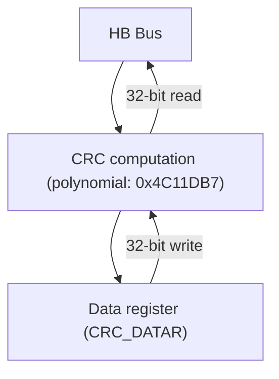

# 5.1 主要特征

- 使用 CRC32 多项式（0x4C11DB7）： $X^{32} + X^{26} + X^{23} + X^{22} + X^{16} + X^{12} + X^{11} + X^{10} + X^{8} + X^{7} + X^{5} + X^{4} + X^{2} + X + 1$ ；  
● 同一个 32 位寄存器作为数据的输入和 CRC32 计算输出  
● 单次转换时间：4 个 HB 时钟周期（HCLK）

# 5.2 功能描述

# - CRC 单元复位

如果要开始一次新数据组的 CRC 计算，需要复位 CRC 计算单元。向控制寄存器 CRC\_CTLR 的 RST 位写 1，硬件将复位数据寄存器，恢复初始值 0xFFFFFFF。

# - CRC 计算

CRC 单元的计算是前一次 CRC 计算结果和新参与的数据的 CRC 结果。CRC\_DATAR 数据寄存器，对其执行写操作将送入新数据到硬件计算单元；执行读取操作，将得到最新一轮的 CRC 计算值。硬件计算时会中断系统的写操作，因此可以连续写入新的值。

注：CRC 单元是对整个 32 位数据进行计算，而不是逐字节计算。

# ● 独立数据缓冲区

CRC 单元提供了一个 8 位独立数据寄存器 CRC\_IDATAR，用于应用代码临时存放 1 字节的数据，不受 CRC 单元复位影响。

# 5.3 寄存器描述

表 5-1 CRC 相关寄存器列表

<table><tr><td>名称</td><td>访问地址</td><td>描述</td><td>复位值</td></tr><tr><td>R32_CRC_DATAR</td><td>0x40023000</td><td>数据寄存器</td><td>0xFFFFFFF</td></tr><tr><td>R8_CRC_IDATAR</td><td>0x40023004</td><td>独立数据缓冲</td><td>0x00</td></tr><tr><td>R32_CRC_CTLR</td><td>0x40023008</td><td>控制寄存器</td><td>0x00000000</td></tr></table>

# 5.3.1 数据寄存器（CRC\_DATAR）

偏移地址：0x00

<table><tr><td>31</td><td>30</td><td>29</td><td>28</td><td>27</td><td>26</td><td>25</td><td>24</td><td>23</td><td>22</td><td>21</td><td>20</td><td>19</td><td>18</td><td>17</td><td>16</td></tr><tr><td colspan="16">DR[31:16]</td></tr><tr><td>15</td><td>14</td><td>13</td><td>12</td><td>11</td><td>10</td><td>9</td><td>8</td><td>7</td><td>6</td><td>5</td><td>4</td><td>3</td><td>2</td><td>1</td><td>0</td></tr><tr><td colspan="16">DR[15:0]</td></tr></table>

<table><tr><td>位</td><td>名称</td><td>访问</td><td>描述</td><td>复位值</td></tr><tr><td>[31:0]</td><td>DR[31:0]</td><td>RW</td><td>写入原始数据;读出计算结果。</td><td>0xFFFFFFF</td></tr></table>

# 5.3.2 独立数据缓冲（CRC\_IDATAR）

偏移地址：0x04

<table><tr><td colspan="8">Reserved</td><td colspan="8">IDR[7:0]</td></tr></table>

<table><tr><td>位</td><td>名称</td><td>访问</td><td>描述</td><td>复位值</td></tr><tr><td>[7:0]</td><td>IDR[7:0]</td><td>RW</td><td>8 位通用寄存器,可以用作数据缓存,这个寄存器不受控制寄存器的 RST 域影响。</td><td>0</td></tr></table>

# 5.3.3 控制寄存器（CRC\_CTLR）

偏移地址：0x08

<table><tr><td>31</td><td>30</td><td>29</td><td>28</td><td>27</td><td>26</td><td>25</td><td>24</td><td>23</td><td>22</td><td>21</td><td>20</td><td>19</td><td>18</td><td>17</td><td>16</td></tr><tr><td colspan="16">Reserved</td></tr><tr><td>15</td><td>14</td><td>13</td><td>12</td><td>11</td><td>10</td><td>9</td><td>8</td><td>7</td><td>6</td><td>5</td><td>4</td><td>3</td><td>2</td><td>1</td><td>0</td></tr><tr><td colspan="15">Reserved</td><td>RST</td></tr></table>

<table><tr><td>位</td><td>名称</td><td>访问</td><td>描述</td><td>复位值</td></tr><tr><td>[31:1]</td><td>Reserved</td><td>RO</td><td>保留。</td><td>0</td></tr><tr><td>0</td><td>RST</td><td>WO</td><td>CRC 计算单元复位控制,写 1 执行,硬件自动清零,执行完后,数据寄存器为 0xFFFFFFF。</td><td>0</td></tr></table>

# 第 6 章 实时时钟（RTC）

本章模块描述适用于 CH32F20x、CH32V20x、CH32V30x 和 CH32V31x 微控制器全系列产品。

实时时钟（RTC）是一个独立的定时器模块，其可编程计数器最大可达到32位，配合软件即可以实现实时时钟功能，并且可以修改计数器的值来重新配置系统的当前时间和日期。RTC模块在后备供电区域，系统复位和待机模式唤醒对其不造成影响。

# 6.1 主要特征

● 最高为 $2^{20}$ 的预分频系数  
● 32 位可编程计数器  
- 多种时钟源，中断  
● 独立复位

# 6.2 功能描述

# 6.2.1 概述

图 6-1 RTC 结构框图  
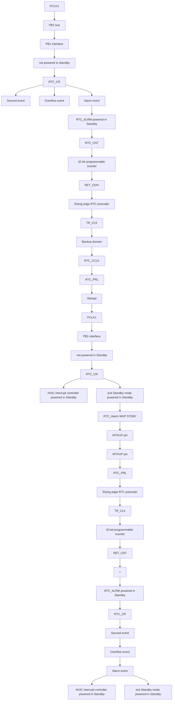

由图 6-1 所示, RTC 模块主要是 PB1 总线接口、分频器和计数器、控制和状态寄存器三部分组成, 其中分频器和计数器部分在后备区域, 可由 $V_{BAT}$ 供电。RTCCLK 输入分频器（RTC\_DIV）之后, 被分频成 TR\_CLK。值得注意的是, 分频器（RTC\_DIV）的内部是一个自减计数器, 自减到溢出就会输出一个 TR\_CLK, 然后从重装值寄存器（RTC\_PSCR）里取出预设值重装到分频器里, 读分频器实际上是读取它的实时值

（read only），写分频系数应该写到重装值寄存器（RTC\_PSCR）里。一般 TR\_CLK 的周期被设置为 1 秒，TR\_CLK 会触发秒事件，同时会使主计数器（RTC\_CNT）自增 1；当主计数器增加到和闹钟寄存器的值一致时，会触发闹钟事件；当主计数器自增到溢出时，会触发溢出事件。以上三种事件都可以触发中断，并对应相应中断使能位控制。

# 6.2.2 复位

由于实时时钟的特殊用途，其处于后备域的四组寄存器：预分频，预分频重装值，主计数器和闹钟，只能通过后备域的复位信号复位，参照 RCC 的后备域复位章节。实时时钟的控制寄存器受系统复位或电源复位控制。

# 6.2.3 较特别的读写寄存器操作

由于实时时钟的特殊用处，RTC 和 PB1 总线是独立的，PB1 对 RTC 的读取不一定是实时的，通过 PB1 读取 RTC 的寄存器必须在 PB1 启动后并经过了一个 RTC 上升沿，这种情形可能出现在系统复位和电源复位之后、从待机或者停机模式唤醒后。方便的做法是等待控制寄存器（CTLR）的 RSF 位被置高。对 RTC 的写操作器必须等上一个写操作结束，且必须进入配置模式，具体的步骤为：

1）查询 RTOFF 位，直到其变为 1；  
2）置 CNF 位，进入配置模式；  
3）对一个或者多个 RTC 寄存器进行写操作；  
4）清 CNF 位，退出配置模式，PB1 接口开始对 RTC 寄存器进行写入；  
5）查询 RTOFF 位，直到其变为 1 即为写完。

# 6.3 寄存器描述

表 6-1 RTC 相关寄存器列表

<table><tr><td>名称</td><td>访问地址</td><td>描述</td><td>复位值</td></tr><tr><td>R16_RTC_CTLRH</td><td>0x40002800</td><td>RTC 控制寄存器高位</td><td>0x0000</td></tr><tr><td>R16_RTC_CTLRL</td><td>0x40002804</td><td>RTC 控制寄存器低位</td><td>0x0020</td></tr><tr><td>R16_RTC_PSCRH</td><td>0x40002808</td><td>预分频器重装值寄存器高位</td><td>0x0000</td></tr><tr><td>R16_RTC_PSCRL</td><td>0x4000280C</td><td>预分频器重装值寄存器低位</td><td>0xXXXX</td></tr><tr><td>R16_RTC_DIVH</td><td>0x40002810</td><td>分频器寄存器高位</td><td>0xXXXX</td></tr><tr><td>R16_RTC_DIVL</td><td>0x40002814</td><td>分频器寄存器低位</td><td>0xXXXX</td></tr><tr><td>R16_RTC_CNTH</td><td>0x40002818</td><td>RTC 计数器高位</td><td>0xXXXX</td></tr><tr><td>R16_RTC_CNTL</td><td>0x4000281C</td><td>RTC 计数器低位</td><td>0xXXXX</td></tr><tr><td>R16_RTC_ALRMH</td><td>0x40002820</td><td>闹钟寄存器高位</td><td>0xXXXX</td></tr><tr><td>R16_RTC_ALRML</td><td>0x40002824</td><td>闹钟寄存器低位</td><td>0xXXXX</td></tr></table>

# 6.3.1 RTC 控制寄存器高位（RTC\_CTLRH）

偏移地址：0x00

15 14 13 12 11 10 9 8 7 6 5 4 3 2 1 0

<table><tr><td>Reserved</td><td>OWIE</td><td>ALRIE</td><td>SECIE</td></tr></table>

<table><tr><td>位</td><td>名称</td><td>访问</td><td>描述</td><td>复位值</td></tr><tr><td>[15:3]</td><td>Reserved</td><td>RO</td><td>保留。</td><td>0</td></tr><tr><td>2</td><td>OWIE</td><td>RW</td><td>溢出中断使能位。</td><td>0</td></tr><tr><td>1</td><td>ALRIE</td><td>RW</td><td>闹钟中断使能位。</td><td>0</td></tr><tr><td>0</td><td>SECIE</td><td>RW</td><td>秒中断使能位。</td><td>0</td></tr></table>

# 6.3.2 RTC 控制寄存器低位（RTC\_CTLRL）

偏移地址：0x04

<table><tr><td>15</td><td>14</td><td>13</td><td>12</td><td>11</td><td>10</td><td>9</td><td>8</td><td>7</td><td>6</td><td>5</td><td>4</td><td>3</td><td>2</td><td>1</td><td>0</td></tr><tr><td colspan="4"></td><td colspan="6">Reserved</td><td>RTOFF</td><td>CNF</td><td>RSF</td><td>OWF</td><td>ALRF</td><td>SECF</td></tr></table>

<table><tr><td>位</td><td>名称</td><td>访问</td><td>描述</td><td>复位值</td></tr><tr><td>[15:6]</td><td>Reserved</td><td>RO</td><td>保留。</td><td>0</td></tr><tr><td>5</td><td>RTOFF</td><td>RO</td><td>RTC操作状态指示位,表示对RTC的最后一次操作的执行状态,对RTC的操作必须等待此位为1。0:上一次对RTC的操作还在进行中;1:上一次对RTC的操作已经完成。</td><td>1</td></tr><tr><td>4</td><td>CNF</td><td>RW</td><td>配置标志位,将此位写1进入配置模式,从而允许向计数器(R16_RTC_CNTx)、闹钟寄存器(R16_RTC_ALRMx)和预分频器重装值寄存器(R16_RTC_PSCRx)写入值.只有将该位写1并重新被软件清0后才会执行写的操作:0:退出配置模式,开始更新RTC寄存器;1:进入配置模式。</td><td>0</td></tr><tr><td>3</td><td>RSF</td><td>RWO</td><td>寄存器同步标志位,在对RTC模块的预分频(PSCRx)、闹钟(ALRMx)、计数器(CNTx)这些寄存器进行读写前,都要先保证这个位已经被硬件置位,以确定这些寄存器已经被同步;在进行读写这些寄存器时,或者PB1复位或PB1时钟停止后,第一步应该将此位复位。0:寄存器未被同步;1:寄存器已被同步。</td><td>0</td></tr><tr><td>2</td><td>OWF</td><td>RWO</td><td>计数器溢出标志,当32位计数器溢出时,此位由硬件置位。如果置位了OWIE位,还会产生一个溢出中断。此位只能由软件清零,不能被软件置位。</td><td>0</td></tr><tr><td>1</td><td>ALRF</td><td>RWO</td><td>闹钟标志,当计数器的值达到闹钟寄存器(ALRMx)的值,此位会被硬件置位,如果闹钟中断使能位(ALRIE)置位,还会产生一个闹钟中断。此位只能由软件清零,不能被软件置位。</td><td>0</td></tr><tr><td>0</td><td>SECF</td><td>RWO</td><td>秒事件标志,当时钟经过预分频器分频后每产生一个下降沿,就会使计数器自增一,同时产生一个秒事件,此位会被置位,如果秒中断被使能(SECIE被置位),同时还会产生一个秒中断。此位只能由软件清零,不能被软件置位。</td><td>0</td></tr></table>

# 6.3.3 预分频器重装值寄存器高位（RTC\_PSCRH）

偏移地址：0x08

<table><tr><td colspan="12">Reserved</td><td colspan="4">PRL[19:16]</td></tr><tr><td>15</td><td>14</td><td>13</td><td>12</td><td>11</td><td>10</td><td>9</td><td>8</td><td>7</td><td>6</td><td>5</td><td>4</td><td>3</td><td>2</td><td>1</td><td>0</td></tr></table>

<table><tr><td>位</td><td>名称</td><td>访问</td><td>描述</td><td>复位值</td></tr><tr><td>[15:4]</td><td>Reserved</td><td>RO</td><td>保留。</td><td>0</td></tr><tr><td>[3:0]</td><td>PRL [19:16]</td><td>WO</td><td>重装值高位。</td><td>0</td></tr></table>

# 6.3.4 预分频器重装值寄存器低位（RTC\_PSCRL）

偏移地址：0x0C

<table><tr><td>15</td><td>14</td><td>13</td><td>12</td><td>11</td><td>10</td><td>9</td><td>8</td><td>7</td><td>6</td><td>5</td><td>4</td><td>3</td><td>2</td><td>1</td><td>0</td></tr><tr><td colspan="16">PRL [15:0]</td></tr></table>

<table><tr><td>位</td><td>名称</td><td>访问</td><td>描述</td><td>复位值</td></tr><tr><td>[15:0]</td><td>PRL[15:0]</td><td>WO</td><td>重装值低位。实际的分频系数就是(PRL[19:0]+1),比如如果RTC输入频率为32768Hz,那么这个值设为0x7fff就可以分频出1秒周期的信号。</td><td>X</td></tr></table>

# 6.3.5 分频器寄存器高位（RTC\_DIVH）

偏移地址：0x10

<table><tr><td>15</td><td>14</td><td>13</td><td>12</td><td>11</td><td>10</td><td>9</td><td>8</td><td>7</td><td>6</td><td>5</td><td>4</td><td>3</td><td>2</td><td>1</td><td>0</td></tr><tr><td colspan="12">Reserved</td><td colspan="4">DIV[19:16]</td></tr></table>

<table><tr><td>位</td><td>名称</td><td>访问</td><td>描述</td><td>复位值</td></tr><tr><td>[15:4]</td><td>Reserved</td><td>RO</td><td>保留。</td><td>0</td></tr><tr><td>[3:0]</td><td>DIV[19:16]</td><td>RO</td><td>分频器寄存器高位。</td><td>x</td></tr></table>

# 6.3.6 分频器寄存器低位（RTC\_DIVL）

偏移地址：0x14

<table><tr><td>15</td><td>14</td><td>13</td><td>12</td><td>11</td><td>10</td><td>9</td><td>8</td><td>7</td><td>6</td><td>5</td><td>4</td><td>3</td><td>2</td><td>1</td><td>0</td></tr><tr><td colspan="7"></td><td colspan="9">DIV[15:0]</td></tr></table>

<table><tr><td>位</td><td>名称</td><td>访问</td><td>描述</td><td>复位值</td></tr><tr><td>[15:0]</td><td>DIV[15:0]</td><td>RO</td><td>分频器寄存器低位。DIV 实际上是一个自减计数器,RTC_CLK 每来一个时钟 DIV 计数器就会减 1 ,溢出后就会输出一个 TR_CLK,同时从 PSCR 中重装载值。DIV 只能读取,读出的是当前分频器的计数器的剩余值。</td><td>X</td></tr></table>

# 6.3.7 RTC 计数器高位（RTC\_CNTH）

偏移地址：0x18

<table><tr><td>15</td><td>14</td><td>13</td><td>12</td><td>11</td><td>10</td><td>9</td><td>8</td><td>7</td><td>6</td><td>5</td><td>4</td><td>3</td><td>2</td><td>1</td><td>0</td></tr><tr><td colspan="16">CNT[31:16]</td></tr></table>

<table><tr><td>位</td><td>名称</td><td>访问</td><td>描述</td><td>复位值</td></tr><tr><td>[15:0]</td><td>CNT [31:16]</td><td>RW</td><td>计数器高位。</td><td>X</td></tr></table>

# 6.3.8 RTC 计数器低位（RTC\_CNTL）

偏移地址：0x1C

<table><tr><td>15</td><td>14</td><td>13</td><td>12</td><td>11</td><td>10</td><td>9</td><td>8</td><td>7</td><td>6</td><td>5</td><td>4</td><td>3</td><td>2</td><td>1</td><td>0</td></tr><tr><td colspan="16">CNT[15:0]</td></tr></table>

<table><tr><td>位</td><td>名称</td><td>访问</td><td>描述</td><td>复位值</td></tr><tr><td>[15:0]</td><td>CNT[15:0]</td><td>RW</td><td>计数器低位,RTC定时器的核心器件,由TRCLK(周期一般设为1秒)提供时钟。通过读取CNT[31:0]来计算出当前的时间。写这个值需要进入配置模式。</td><td>X</td></tr></table>

# 6.3.9 闹钟寄存器高位（RTC\_ALRMH）

偏移地址：0x20

<table><tr><td>15</td><td>14</td><td>13</td><td>12</td><td>11</td><td>10</td><td>9</td><td>8</td><td>7</td><td>6</td><td>5</td><td>4</td><td>3</td><td>2</td><td>1</td><td>0</td></tr><tr><td colspan="16">ALR[31:16]</td></tr></table>

<table><tr><td>位</td><td>名称</td><td>访问</td><td>描述</td><td>复位值</td></tr><tr><td>[15:0]</td><td>ALR[31:16]</td><td>WO</td><td>闹钟寄存器高位。</td><td>X</td></tr></table>

# 6.3.10 闹钟寄存器低位（RTC\_ALRML）

偏移地址：0x24

<table><tr><td>15</td><td>14</td><td>13</td><td>12</td><td>11</td><td>10</td><td>9</td><td>8</td><td>7</td><td>6</td><td>5</td><td>4</td><td>3</td><td>2</td><td>1</td><td>0</td></tr><tr><td colspan="16">ALR[15:0]</td></tr></table>

<table><tr><td>位</td><td>名称</td><td>访问</td><td>描述</td><td>复位值</td></tr><tr><td>[15:0]</td><td>ALR[15:0]</td><td>WO</td><td>闹钟寄存器低位。当闹钟寄存器 ALRM[31:0]的值和计数器 CNT[31:0]的值一致时会产生一个闹钟事件。更改这个值需要进入配置模式。</td><td>X</td></tr></table>

# 第 7 章 独立看门狗（IWDG）

本章模块描述适用于 CH32F20x、CH32V20x、CH32V30x 和 CH32V31x 微控制器全系列产品。

系统设有独立看门狗（IWDG）用来检测逻辑错误和外部环境干扰引起的软件故障。IWDG 时钟源来自于 LSI，可独立于主程序之外运行，适用于对精度要求低的场合。

# 7.1 主要特征

● 12 位自减型计数器  
● 时钟来源 LSI 分频，可以在低功耗模式下运行  
● 复位条件：计数器值减到 0

# 7.2 功能说明

# 7.2.1 原理和用法

独立看门狗的时钟来源 LSI 时钟，其功能在停机和待机模式时仍能正常工作。当看门狗计数器自减到 0 时，将会产生系统复位，所以超时时间为（重装载值 +1）个时钟。

图 7-1 独立看门狗的结构框图  
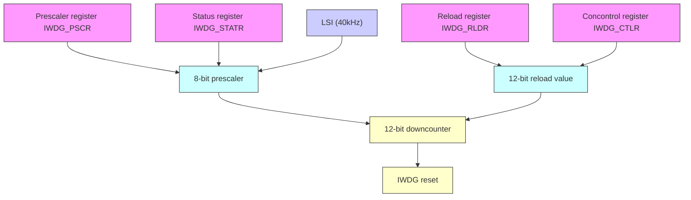

# - 启动独立看门狗

系统复位后，看门狗处于关闭状态，向 IWDG\_CTLR 寄存器写 0xCCCC 开启看门狗，随后它不能再被关闭，除非发生复位。

如果在用户选择字开启了硬件独立看门狗使能位(IWDG\_SW)，在微控制器复位后将固定开启 IWDG。

# - 看门狗配置

看门狗内部是一个递减运行的 12 位计数器，当计数器的值减为 0 时，将发生系统复位。开启 IWDG 功能，需要执行下面几点操作：

1) 计数时基：IWDG 时钟来源 LSI，通过 IWDG\_PSCR 寄存器设置 LSI 分频值时钟作为 IWDG 的计数时基。操作方法先向 IWDG\_CTLR 寄存器写 0x5555，再修改 IWDG\_PSCR 寄存器中的分频值。IWDG\_STATR 寄存器中的 PVU 位指示了分频值更新状态，在更新完成的情况下才可以进行分频值的修改和读出。

2) 重装载值：用于更新独立看门狗中计数器当前值，并且计数器由此值进行递减。操作方法先向 IWDG\_CTLR 寄存器写 0x5555，再修改 IWDG\_RLDR 寄存器设置目标重装载值。IWDG\_STATR 寄存器中的 RVU 位指示了重装载值更新状态，在更新完成的情况下才可以进行 IWDG\_RLDR 寄存器的修改和读出。

3) 看门狗使能：向 IWDG\_CTLR 寄存器写 0xCCCC，即可开启看门狗功能。

4) 喂狗：即在看门狗计数器递减到 0 前刷新当前计数器值防止发生系统复位。向 IWDG\_CTLR 寄存器写 0xAAAA，让硬件将 IWDG\_RLDR 寄存值更新到看门狗计数器中。此动作需要在看门狗功能开启后

定时执行，否则会出现看门狗复位动作。

# 7.2.2 调试模式

系统进入调试模式时，可以由调试模块寄存器配置 IWDG 的计数器继续工作或停止。

# 7.3 寄存器描述

表 7-1 IWDG 相关寄存器列表

<table><tr><td>名称</td><td>访问地址</td><td>描述</td><td>复位值</td></tr><tr><td>R16_IWDG_CTLR</td><td>0x40003000</td><td>控制寄存器</td><td>0x0000</td></tr><tr><td>R16_IWDG_PSCR</td><td>0x40003004</td><td>分频因子寄存器</td><td>0x0000</td></tr><tr><td>R16_IWDG_RLDR</td><td>0x40003008</td><td>重装载值寄存器</td><td>0x0FFF</td></tr><tr><td>R16_IWDG_STATR</td><td>0x4000300C</td><td>状态寄存器</td><td>0x0000</td></tr></table>

# 7.3.1 IWDG 控制寄存器（IWDG\_CTLR）

偏移地址：0x00

<table><tr><td>15</td><td>14</td><td>13</td><td>12</td><td>11</td><td>10</td><td>9</td><td>8</td><td>7</td><td>6</td><td>5</td><td>4</td><td>3</td><td>2</td><td>1</td><td>0</td></tr><tr><td colspan="7"></td><td colspan="9">KEY[15:0]</td></tr></table>

<table><tr><td>位</td><td>名称</td><td>访问</td><td>描述</td><td>复位值</td></tr><tr><td>[15:0]</td><td>KEY[15:0]</td><td>WO</td><td>操作键值锁。0xAAAA:喂狗。加载 IWDG_RLDR 寄存器值到独立看门狗计数器中;0x5555:允许修改 R16_IWDG_PSCR 和 R16_IWDG_RLDR 寄存器;0xCCCC:启动看门狗,如果启用了硬件看门狗(用户选择字配置)则不受这个限制。</td><td>0</td></tr></table>

# 7.3.2 分频因子寄存器（IWDG\_PSCR）

偏移地址：0x04

<table><tr><td colspan="13">Reserved</td><td>PR[2:0]</td></tr></table>

<table><tr><td>位</td><td>名称</td><td>访问</td><td>描述</td><td>复位值</td></tr><tr><td>[15:3]</td><td>Reserved</td><td>RO</td><td>保留。</td><td>0</td></tr><tr><td>[2:0]</td><td>PR[2:0]</td><td>RW</td><td>IWDG时钟分频系数,修改此域前要向KEY中写0x5555。000:4分频; 001:8分频;010:16分频; 011:32分频;100:64分频; 101:128分频;110:256分频; 111:256分频。IWDG计数时基=LSI/分频系数。注:读该域值前,要确保IWDG_STATR寄存器中的PVU位为0,否则读出值无效。</td><td>000b</td></tr></table>

# 7.3.3 重装载值寄存器（IWDG\_RLDR）

偏移地址：0x08

<table><tr><td>15</td><td>14</td><td>13</td><td>12</td><td>11</td><td>10</td><td>9</td><td>8</td><td>7</td><td>6</td><td>5</td><td>4</td><td>3</td><td>2</td><td>1</td><td>0</td></tr><tr><td colspan="4">Reserved</td><td colspan="12">RL[11:0]</td></tr></table>

<table><tr><td>位</td><td>名称</td><td>访问</td><td>描述</td><td>复位值</td></tr><tr><td>[15:12]</td><td>Reserved</td><td>RO</td><td>保留。</td><td>0</td></tr><tr><td>[11:0]</td><td>RL[11:0]</td><td>RW</td><td>计数器重装载值。修改此域前要向 KEY 中写 0x5555。当向 KEY 中写 0xAAAA 后,此域的值将会被硬件装载到计数器中,随后计数器从这个值开始递减计数。注:读写该域值前,要确保 IWDG_STATR 寄存器中的 RVU 位为 0,否则读写此域无效。</td><td>0xFFFF</td></tr></table>

# 7.3.4 状态寄存器（IWDG\_STATR）

偏移地址：0x0C

<table><tr><td colspan="14">Reserved</td><td>RVU</td><td>PVU</td></tr></table>

<table><tr><td>位</td><td>名称</td><td>访问</td><td>描述</td><td>复位值</td></tr><tr><td>[15:2]</td><td>Reserved</td><td>RO</td><td>保留。</td><td>0</td></tr><tr><td>1</td><td>RVU</td><td>RO</td><td>重装值更新标志位。硬件置位或清 0。0: 重装载更新结束(最多 5 个 LSI 周期);1: 重装载值更新正在进行中。注: 重装载值寄存器 IWDG_RLDR 只有在 RVU 位被清 0 后才可读写访问。</td><td>0</td></tr><tr><td>0</td><td>PVU</td><td>RO</td><td>时钟分频系数更新标志位。硬件置位或清 0。0: 时钟分频值更新结束(最多 5 个 LSI 周期);1: 时钟分频值更新正在进行中。注: 分频因子寄存器 IWDG_PSCR 只有在 PVU 位被清 0 后才可读写访问。</td><td>0</td></tr></table>

注：在预分频或重装值更新后，不必等待 RVU 或 PVU 复位，可继续执行下面的代码。（即使在低功耗模式下，此写操作仍会被继续执行完成。）

# 第 8 章 窗口看门狗（WWDG）

本章模块描述适用于 CH32F20x、CH32V20x、CH32V30x 和 CH32V31x 微控制器全系列产品。

窗口看门狗一般用来监测系统运行的软件故障，例如外部干扰、不可预见的逻辑错误等情况。它需要在一个特定的窗口时间（有上下限）内进行计数器刷新（喂狗），否则早于或者晚于这个窗口时间看门狗电路都会产生系统复位。

# 8.1 主要特征

● 可编程的 7 位自减型计数器  
- 双条件复位：当前计数器值小于 $0 \times 40$ ，或者计数器值在窗口时间外被重装载  
● 唤醒提前通知功能（EWI），用于及时喂狗动作防止系统复位

# 8.2 功能说明

# 8.2.1 原理和用法

窗口看门狗运行基于一个7位的递减计数器，其挂载在PB1总线下，计数时基WWDG\_CLK来源（PCLK1/4096）时钟的分频，分频系数在配置寄存器WWDG\_CFGR中的WDGTB[1:0]域设置。递减计数器处于自由运行状态，无论看门狗功能是否开启，计数器一直循环递减计数。如图8-1所示，窗口看门狗内部结构框图。

图 8-1 窗口看门狗结构框图  
```mermaid
graph TD
    A["RESET"] --> B["AND Gate"]
    B --> C["AND Gate"]
    C --> D["Write WWDG_CTLR[6:0"]]
    D --> E["T[6:0"] > W["6:0"]]
    E --> F["Watchdog configuration register(WWDG_CFGR)"]
    F --> G["WWDG"]
    G --> H["WDGA T6 T5 T4 T3 T2 T1 T0"]
    H --> I["WWDG_CLK"]
    I --> J["WDGTB[1:0"]]
    J --> K["PCLK1 /4096"]
    K --> L["WWDG enable control, software on"]
    L --> M["AND Gate"]
    M --> N["Write WWDG_CTLR[6:0"]]
    N --> O["WWDG"]
```

# - 启动窗口看门狗

系统复位后，看门狗处于关闭状态，设置 WWDG\_CTLR 寄存器的 WDGA 位能够开启看门狗，随后它不能再被关闭，除非发生复位。

注：可以通过设置 RCC\_APB1PCENR 寄存器关闭 WWDG 的时钟来源，暂停 WWDG\_CLK 计数，间接停止看门狗功能，或者通过设置 RCC\_APB1PRSTR 寄存器复位 WWDG 模块，等效为复位的作用。

# - 看门狗配置

看门狗内部是一个不断循环递减运行的 7 位计数器，支持读写访问。使用看门狗复位功能，需要执行下面几点操作：

1）计数时基：通过 WWDG\_CFGR 寄存器的 WDGTB[1:0]位域，注意要开启 RCC 单元的 WWDG 模块时钟。

2）窗口计数器：设置 WWDG\_CFGR 寄存器的 W[6:0] 位域，此计数器由硬件用作和当前计数器比较使用，数值由用户软件配置，不会改变。作为窗口时间的上限值。  
3）看门狗使能：WWDG\_CTLR 寄存器 WDGA 位软件置 1，开启看门狗功能，可以系统复位。  
4）喂狗：即刷新当前计数器值，配置 WWDG\_CTLR 寄存器的 T[6:0] 位域。此动作需要在看门狗功能开启后，在周期性的窗口时间内执行，否则会出现看门狗复位动作。

# - 喂狗窗口时间

如图 8-2 所示，灰色区域为窗口看门狗的监测窗口区域，其上限时间 t2 对应当前计数器值达到窗口值 W[6:0] 的时间点；其下限时间 t3 对应当前计数器值达到 0x3F 的时间点。此区域时间内 t2<t<t3 可以进行喂狗操作（写 T[6:0]），刷新当前计数器的数值。

图 8-2 窗口看门狗的计数模式  

```line
| Time | Value |
|------|-------|
| t1   | 0x7F  |
| t2   | W[6:0] |
| t3   | 0x3F  |
```


# - 看门狗复位：

1）当没有及时喂狗操作，导致 T[6:0] 计数器的值由 0x40 变成 0x3F，将出现 “窗口看门狗复位”，产生系统复位。即 T6-bit 被硬件检测为 0，将出现系统复位。

注：应用程序可以通过软件写 T6-bit 为 0，实现系统复位，等效软件复位功能。

2）当在不允许喂狗时间内执行计数器刷新动作，即在 $t1 \leqslant t \leqslant t2$ 时间内操作写 T[6:0]位域，将出现“窗口看门狗复位”，产生系统复位。

# - 提前唤醒

为了防止没有及时刷新计数器导致系统复位，看门狗模块提供了早期唤醒中断（EWI）通知。当计数器自减到0x40时，产生提前唤醒信号，EWIF标志置1，如果置位了EWI位，会同时触发窗口看门狗中断。此时距离硬件复位有1个计数器时钟周期（自减为0x3F），应用程序可在此时间内即时进行喂狗操作。

# 8.2.2 调试模式

系统进入调试模式时，可以由调试模块寄存器配置 WWDG 的计数器继续工作或停止。

# 8.3 寄存器描述

表 8-1 WWDG 相关寄存器列表

<table><tr><td>名称</td><td>访问地址</td><td>描述</td><td>复位值</td></tr><tr><td>R16_WWDG_CTLR</td><td>0x40002C00</td><td>控制寄存器</td><td>0x007F</td></tr><tr><td>R16_WWDG_CFGR</td><td>0x40002C04</td><td>配置寄存器</td><td>0x007F</td></tr><tr><td>R16_WWDG_STATR</td><td>0x40002C08</td><td>状态寄存器</td><td>0x0000</td></tr></table>

# 8.3.1 WWDG 控制寄存器（WWDG\_CTLR）

偏移地址：0x00

<table><tr><td colspan="8">Reserved</td><td>WDGA</td><td colspan="7">T[6:0]</td></tr></table>

<table><tr><td>位</td><td>名称</td><td>访问</td><td>描述</td><td>复位值</td></tr><tr><td>[15:8]</td><td>Reserved</td><td>RO</td><td>保留。</td><td>0</td></tr><tr><td>7</td><td>WDGA</td><td>RW1</td><td>窗口看门狗复位使能位。0:禁止看门狗功能;1:开启看门狗功能(可产生复位信号)。软件写1开启,但是只允许复位后硬件清0。</td><td>0</td></tr><tr><td>[6:0]</td><td>T[6:0]</td><td>RW</td><td>7位自减计数器,每4096*2 $^{WDGTB}$ 个PCLK1周期自减1。当计数器从0x40自减到0x3F时,即T6跳变为0时,产生看门狗复位。</td><td>0x7F</td></tr></table>

# 8.3.2 WWDG 配置寄存器（WWDG\_CFGR）

偏移地址：0x04

<table><tr><td colspan="6">Reserved</td><td>EWI</td><td>WDGTB[1:0]</td><td colspan="6">W[6:0]</td></tr></table>

<table><tr><td>位</td><td>名称</td><td>访问</td><td>描述</td><td>复位值</td></tr><tr><td>[15:10]</td><td>Reserved</td><td>RO</td><td>保留。</td><td>0</td></tr><tr><td>9</td><td>EWI</td><td>RW1</td><td>提前唤醒中断使能位。若此位置1,则在计数器的值达到0x40时产生中断。此位只能在复位后由硬件请0。</td><td>0</td></tr><tr><td>[8:7]</td><td>WDGTB[1:0]</td><td>RW</td><td>窗口看门狗时钟分频选择:00:1分频,计数时基=PCLK1/4096;01:2分频,计数时基=PCLK1/4096/2;10:4分频,计数时基=PCLK1/4096/4;11:8分频,计数时基=PCLK1/4096/8。</td><td>00b</td></tr><tr><td>[6:0]</td><td>W[6:0]</td><td>RW</td><td>窗口看门狗7位窗口值。用来与计数器的值做比较。喂狗操作只能在计数器的值小于窗口值且大于0x3F时进行。</td><td>0x7F</td></tr></table>

# 8.3.3 WWDG 状态寄存器（WWDG\_STATR）

偏移地址：0x08

<table><tr><td>15</td><td>14</td><td>13</td><td>12</td><td>11</td><td>10</td><td>9</td><td>8</td><td>7</td><td>6</td><td>5</td><td>4</td><td>3</td><td>2</td><td>1</td><td>0</td></tr><tr><td colspan="15">Reserved</td><td>EWIF</td></tr></table>

<table><tr><td>位</td><td>名称</td><td>访问</td><td>描述</td><td>复位值</td></tr><tr><td>[15:1]</td><td>Reserved</td><td>WO</td><td>保留。</td><td>0</td></tr><tr><td>0</td><td>EWIF</td><td>RWO</td><td>提前唤醒中断标志位。当计数器到达 0x40 时,此位会被硬件置位,必须通过软件清 0,用户置位是无效的。即使 EWI未被置位,此位在事件发生时仍会照常被置位。</td><td>0</td></tr></table>

# 第 9 章 中断和事件（NVIC/PFIC）

本章模块描述适用于 CH32F20x、CH32V20x、CH32V30x 和 CH32V31x 微控制器全系列产品。

CH32F20x 系列产品采用 Cortex-M3 内核，内置嵌套向量中断控制器（NVIC-Nested Vectored Interrupt Controller），管理了 88 个可屏蔽外部中断通道和 10 个内核中断通道，其他中断源保留。中断控制器与内核接口紧密相连，以最小的中断延迟提供了灵活的中断管理功能。具体关于 NVIC 控制器的使用说明请参考 Cortex-M3 相关文档说明。

CH32V20x、CH32V30x 和 CH32V31x 系列内置可编程快速中断控制器（PFIC-Programmable Fast Interrupt Controller），最多支持 255 个中断向量。当前系统管理了 88 个外设中断通道和 8 个内核中断通道，其他保留。

# 9.1 主要特征

# 9.1.1 NVIC 控制器

● 88个可屏蔽的中断通道  
● 提供不可屏蔽中断第一时间响应  
● 向量化的中断设计实现向量入口地址直接进入内核  
● 中断进入和退出时自动压栈和恢复，无需额外指令开销  
● 16级嵌套，优先级动态修改

# 9.1.2 PFIC 控制器

● 88个外设中断，每个中断请求都有独立的触发和屏蔽控制位，有专用的状态位  
● 可编程多级中断嵌套，最大嵌套深度8级，硬件压栈深度3级  
● 特有快速中断进出机制，硬件自动压栈和恢复，无需指令开销   
● 特有免表VTF（Vector Table Free）中断响应机制，4路可编程直达中断向量地址

# 9.2 系统定时器

\- CH32F20x 系列产品

Cortex-M3 内核自带了一个 24 位自减型计数器（SysTick timer）。支持 HCLK 或 HCLK/8 作为时基，具有较高优先级别（6）。一般可用于操作系统的时基。具体请参考 Cortex-M3 相关文档说明。

● CH32V30x 和 CH32V31x 系列产品

内核自带了一个 64 位加减计数器（SysTick），支持 HCLK 或者 HCLK/8 作为时基，具有较高优先级，校准后可用于时间基准。

# 9.3 中断和异常的向量表

表 9-1 CH32F20x 系列产品向量表

<table><tr><td>位置</td><td>优先级</td><td>优先级类型</td><td>名称</td><td>说明</td><td>绝对地址</td></tr><tr><td></td><td>-</td><td>-</td><td>-</td><td>保留</td><td>0x00000000</td></tr><tr><td></td><td>-3</td><td>固定</td><td>Reset</td><td>复位</td><td>0x00000004</td></tr><tr><td></td><td>-2</td><td>固定</td><td>NMI</td><td>不可屏蔽中断</td><td>0x00000008</td></tr><tr><td></td><td>-1</td><td>固定</td><td>HardFault</td><td>所有类型的失效</td><td>0x0000000C</td></tr><tr><td></td><td>0</td><td>可设置</td><td>MemManage</td><td>存储器管理</td><td>0x00000010</td></tr><tr><td></td><td>1</td><td>可设置</td><td>BusFault</td><td>预取指失败,存储器访问失败</td><td>0x00000014</td></tr><tr><td></td><td>2</td><td>可设置</td><td>UsageFault</td><td>未定义的指令或非法状态</td><td>0x00000018</td></tr><tr><td></td><td>-</td><td>-</td><td>-</td><td>保留</td><td>0x0000001C-0x0000002B</td></tr><tr><td></td><td>3</td><td>可设置</td><td>SVCall</td><td>通过SWI指令的系统服务调用</td><td>0x0000002C</td></tr><tr><td></td><td>4</td><td>可设置</td><td>Debug Monitor</td><td>调试监控器</td><td>0x00000030</td></tr><tr><td></td><td>-</td><td>-</td><td>-</td><td>保留</td><td>0x00000034</td></tr><tr><td></td><td>5</td><td>可设置</td><td>PendSV</td><td>可挂起的系统服务</td><td>0x00000038</td></tr><tr><td></td><td>6</td><td>可设置</td><td>SysTick</td><td>系统滴答定时器</td><td>0x0000003C</td></tr><tr><td>0</td><td>7</td><td>可编程</td><td>WWDG</td><td>窗口定时器中断</td><td>0x00000040</td></tr><tr><td>1</td><td>8</td><td>可编程</td><td>PVD</td><td>电源电压检测中断(EXTI)</td><td>0x00000044</td></tr><tr><td>2</td><td>9</td><td>可编程</td><td>TAMPER</td><td>侵入检测中断</td><td>0x00000048</td></tr><tr><td>3</td><td>10</td><td>可编程</td><td>RTC</td><td>实时时钟中断</td><td>0x0000004C</td></tr><tr><td>4</td><td>11</td><td>可编程</td><td>FLASH</td><td>闪存全局中断</td><td>0x00000050</td></tr><tr><td>5</td><td>12</td><td>可编程</td><td>RCC</td><td>复位和时钟控制中断</td><td>0x00000054</td></tr><tr><td>6</td><td>13</td><td>可编程</td><td>EXTIO</td><td>EXTI线0中断</td><td>0x00000058</td></tr><tr><td>7</td><td>14</td><td>可编程</td><td>EXTI1</td><td>EXTI线1中断</td><td>0x0000005C</td></tr><tr><td>8</td><td>15</td><td>可编程</td><td>EXTI2</td><td>EXTI线2中断</td><td>0x00000060</td></tr><tr><td>9</td><td>16</td><td>可编程</td><td>EXTI3</td><td>EXTI线3中断</td><td>0x00000064</td></tr><tr><td>10</td><td>17</td><td>可编程</td><td>EXTI4</td><td>EXTI线4中断</td><td>0x00000068</td></tr><tr><td>11</td><td>18</td><td>可编程</td><td>DMA1_CH1</td><td>DMA1通道1全局中断</td><td>0x0000006C</td></tr><tr><td>12</td><td>19</td><td>可编程</td><td>DMA1_CH2</td><td>DMA1通道2全局中断</td><td>0x00000070</td></tr><tr><td>13</td><td>20</td><td>可编程</td><td>DMA1_CH3</td><td>DMA1通道3全局中断</td><td>0x00000074</td></tr><tr><td>14</td><td>21</td><td>可编程</td><td>DMA1_CH4</td><td>DMA1通道4全局中断</td><td>0x00000078</td></tr><tr><td>15</td><td>22</td><td>可编程</td><td>DMA1_CH5</td><td>DMA1通道5全局中断</td><td>0x0000007C</td></tr><tr><td>16</td><td>23</td><td>可编程</td><td>DMA1_CH6</td><td>DMA1通道6全局中断</td><td>0x00000080</td></tr><tr><td>17</td><td>24</td><td>可编程</td><td>DMA1_CH7</td><td>DMA1通道7全局中断</td><td>0x00000084</td></tr><tr><td>18</td><td>25</td><td>可编程</td><td>ADC1_2</td><td>ADC1和ADC2全局中断</td><td>0x00000088</td></tr><tr><td>19</td><td>26</td><td>可编程</td><td>USB_HP或</td><td>USB_HP或CAN1_TX全局中断</td><td>0x0000008C</td></tr><tr><td>20</td><td>27</td><td>可编程</td><td>USB_LP或</td><td>USB_LP或CAN1_RXO全局中断</td><td>0x00000090</td></tr><tr><td>21</td><td>28</td><td>可编程</td><td>CAN1_RX1</td><td>CAN1_RX1全局中断</td><td>0x00000094</td></tr><tr><td>22</td><td>29</td><td>可编程</td><td>CAN1_SCE</td><td>CAN1_SCE全局中断</td><td>0x00000098</td></tr><tr><td>23</td><td>30</td><td>可编程</td><td>EXTI9_5</td><td>EXTI线[9:5]中断</td><td>0x0000009C</td></tr><tr><td>24</td><td>31</td><td>可编程</td><td>TIM1_BRK</td><td>TIM1刹车中断</td><td>0x000000A0</td></tr><tr><td>25</td><td>32</td><td>可编程</td><td>TIM1_UP</td><td>TIM1更新中断</td><td>0x000000A4</td></tr><tr><td>26</td><td>33</td><td>可编程</td><td>TIM1_TRG_COM</td><td>TIM1触发和通信中断</td><td>0x000000A8</td></tr><tr><td>27</td><td>34</td><td>可编程</td><td>TIM1_CC</td><td>TIM1捕获比较中断</td><td>0x000000AC</td></tr><tr><td>28</td><td>35</td><td>可编程</td><td>TIM2</td><td>TIM2全局中断</td><td>0x000000B0</td></tr><tr><td>29</td><td>36</td><td>可编程</td><td>TIM3</td><td>TIM3全局中断</td><td>0x000000B4</td></tr><tr><td>30</td><td>37</td><td>可编程</td><td>TIM4</td><td>TIM4全局中断</td><td>0x000000B8</td></tr><tr><td>31</td><td>38</td><td>可编程</td><td>I2C1_EV</td><td>I2C1事件中断</td><td>0x000000BC</td></tr><tr><td>32</td><td>39</td><td>可编程</td><td>I2C1_ER</td><td>I2C1错误中断</td><td>0x000000C0</td></tr><tr><td>33</td><td>40</td><td>可编程</td><td>I2C2_EV</td><td>I2C2事件中断</td><td>0x000000C4</td></tr><tr><td>34</td><td>41</td><td>可编程</td><td>I2C2_ER</td><td>I2C2错误中断</td><td>0x000000C8</td></tr><tr><td>35</td><td>42</td><td>可编程</td><td>SPI1</td><td>SPI1全局中断</td><td>0x000000C</td></tr><tr><td>36</td><td>43</td><td>可编程</td><td>SPI2</td><td>SPI2全局中断</td><td>0x000000D0</td></tr><tr><td>37</td><td>44</td><td>可编程</td><td>USART1</td><td>USART1全局中断</td><td>0x000000D4</td></tr><tr><td>38</td><td>45</td><td>可编程</td><td>USART2</td><td>USART2全局中断</td><td>0x000000D8</td></tr><tr><td>39</td><td>46</td><td>可编程</td><td>USART3</td><td>USART3全局中断</td><td>0x000000DC</td></tr><tr><td>40</td><td>47</td><td>可编程</td><td>EXTI15_10</td><td>EXTI线[15:10]中断</td><td>0x000000E0</td></tr><tr><td>41</td><td>48</td><td>可编程</td><td>RTCA1arm</td><td>RTC闹钟中断(EXTI)</td><td>0x000000E4</td></tr><tr><td>42</td><td>49</td><td>可编程</td><td>USBWakeUp</td><td>USB唤醒中断(EXTI)</td><td>0x000000E8</td></tr><tr><td>43</td><td>50</td><td>可编程</td><td>TIM8_BRK</td><td>TIM8刹车中断</td><td>0x000000EC</td></tr><tr><td>44</td><td>51</td><td>可编程</td><td>TIM8_UP</td><td>TIM8更新中断</td><td>0x000000F0</td></tr><tr><td>45</td><td>52</td><td>可编程</td><td>TIM8_TRG_COM</td><td>TIM8触发和通信中断</td><td>0x000000F4</td></tr><tr><td>46</td><td>53</td><td>可编程</td><td>TIM8_CC</td><td>TIM8捕获比较中断</td><td>0x000000F8</td></tr><tr><td>47</td><td>54</td><td>可编程</td><td>RNG</td><td>RNG全局中断</td><td>0x000000FC</td></tr><tr><td>48</td><td>55</td><td>-</td><td>-</td><td>保留</td><td>0x00000100</td></tr><tr><td>49</td><td>56</td><td>可编程</td><td>SDIO</td><td>SDIO全局中断</td><td>0x00000104</td></tr><tr><td>50</td><td>57</td><td>可编程</td><td>TIM5</td><td>TIM5全局中断</td><td>0x00000108</td></tr><tr><td>51</td><td>58</td><td>可编程</td><td>SPI3</td><td>SPI3全局中断</td><td>0x0000010C</td></tr><tr><td>52</td><td>59</td><td>可编程</td><td>USART4</td><td>USART4全局中断</td><td>0x00000110</td></tr><tr><td>53</td><td>60</td><td>可编程</td><td>USART5</td><td>USART5全局中断</td><td>0x00000114</td></tr><tr><td>54</td><td>61</td><td>可编程</td><td>TIM6</td><td>TIM6全局中断</td><td>0x00000118</td></tr><tr><td>55</td><td>62</td><td>可编程</td><td>TIM7</td><td>TIM7全局中断</td><td>0x0000011C</td></tr><tr><td>56</td><td>63</td><td>可编程</td><td>DMA2_CH1</td><td>DMA2通道1全局中断</td><td>0x00000120</td></tr><tr><td>57</td><td>64</td><td>可编程</td><td>DMA2_CH2</td><td>DMA2通道2全局中断</td><td>0x00000124</td></tr><tr><td>58</td><td>65</td><td>可编程</td><td>DMA2_CH3</td><td>DMA2通道3全局中断</td><td>0x00000128</td></tr><tr><td>59</td><td>66</td><td>可编程</td><td>DMA2_CH4</td><td>DMA2通道4全局中断</td><td>0x0000012C</td></tr><tr><td>60</td><td>67</td><td>可编程</td><td>DMA2_CH5</td><td>DMA2通道5全局中断</td><td>0x00000130</td></tr><tr><td>61</td><td>68</td><td>可编程</td><td>ETH</td><td>ETH全局中断</td><td>0x00000134</td></tr><tr><td>62</td><td>69</td><td>可编程</td><td>ETH_WKUP</td><td>ETH唤醒中断</td><td>0x00000138</td></tr><tr><td>63</td><td>70</td><td>可编程</td><td>CAN2_TX</td><td>CAN2_TX全局中断</td><td>0x0000013C</td></tr><tr><td>64</td><td>71</td><td>可编程</td><td>CAN2_RXO</td><td>CAN2_RXO全局中断</td><td>0x00000140</td></tr><tr><td>65</td><td>72</td><td>可编程</td><td>CAN2_RX1</td><td>CAN2_RX1全局中断</td><td>0x00000144</td></tr><tr><td>66</td><td>73</td><td>可编程</td><td>CAN2_SCE</td><td>CAN2_SCE全局中断</td><td>0x00000148</td></tr><tr><td>67</td><td>74</td><td>可编程</td><td>OTG_FS</td><td>全速OTG中断</td><td>0x0000014C</td></tr><tr><td>68</td><td>75</td><td>可编程</td><td>USBHSWakeUp</td><td>高速USB唤醒中断</td><td>0x00000150</td></tr><tr><td>69</td><td>76</td><td>可编程</td><td>USBHS</td><td>高速USB全局中断</td><td>0x00000154</td></tr><tr><td>70</td><td>77</td><td>可编程</td><td>DVP</td><td>DVP全局中断</td><td>0x00000158</td></tr><tr><td>71</td><td>78</td><td>可编程</td><td>USART6</td><td>USART6全局中断</td><td>0x0000015C</td></tr><tr><td>72</td><td>79</td><td>可编程</td><td>USART7</td><td>USART7全局中断</td><td>0x00000160</td></tr><tr><td>73</td><td>80</td><td>可编程</td><td>USART8</td><td>USART8全局中断</td><td>0x00000164</td></tr><tr><td>74</td><td>81</td><td>可编程</td><td>TIM9_BRK</td><td>TIM9刹车中断</td><td>0x00000168</td></tr><tr><td>75</td><td>82</td><td>可编程</td><td>TIM9_UP</td><td>TIM9更新中断</td><td>0x0000016C</td></tr><tr><td>76</td><td>83</td><td>可编程</td><td>TIM9_TRG_COM</td><td>TIM9触发和通信中断</td><td>0x00000170</td></tr><tr><td>77</td><td>84</td><td>可编程</td><td>TIM9_CC</td><td>TIM9捕获比较中断</td><td>0x00000174</td></tr><tr><td>78</td><td>85</td><td>可编程</td><td>TIM10_BRK</td><td>TIM10刹车中断</td><td>0x00000178</td></tr><tr><td>79</td><td>86</td><td>可编程</td><td>TIM10_UP</td><td>TIM10更新中断</td><td>0x0000017C</td></tr><tr><td>80</td><td>87</td><td>可编程</td><td>TIM10_TRG_COM</td><td>TIM10 触发和通信中断</td><td>0x00000180</td></tr><tr><td>81</td><td>88</td><td>可编程</td><td>TIM10_CC</td><td>TIM10 捕获比较中断</td><td>0x00000184</td></tr><tr><td>82</td><td>89</td><td>可编程</td><td>DMA2_CH6</td><td>DMA2 通道 6 全局中断</td><td>0x00000188</td></tr><tr><td>83</td><td>90</td><td>可编程</td><td>DMA2_CH7</td><td>DMA2 通道 7 全局中断</td><td>0x0000018C</td></tr><tr><td>84</td><td>91</td><td>可编程</td><td>DMA2_CH8</td><td>DMA2 通道 8 全局中断</td><td>0x00000190</td></tr><tr><td>85</td><td>92</td><td>可编程</td><td>DMA2_CH9</td><td>DMA2 通道 9 全局中断</td><td>0x00000194</td></tr><tr><td>86</td><td>93</td><td>可编程</td><td>DMA2_CH10</td><td>DMA2 通道 10 全局中断</td><td>0x00000198</td></tr><tr><td>87</td><td>94</td><td>可编程</td><td>DMA2_CH11</td><td>DMA2 通道 11 全局中断</td><td>0x0000019C</td></tr></table>

表 9-2 CH32V20x、CH32V30x 和 CH32V31x 系列产品向量表

<table><tr><td>编号</td><td>优先级</td><td>类型</td><td>名称</td><td>描述</td><td>入口地址</td></tr><tr><td>0</td><td>-</td><td>-</td><td>-</td><td>-</td><td>0x00000000</td></tr><tr><td>1</td><td>-</td><td>-</td><td>-</td><td>-</td><td>0x00000004</td></tr><tr><td>2</td><td>-5</td><td>固定</td><td>NMI</td><td>不可屏蔽中断</td><td>0x00000008</td></tr><tr><td>3</td><td>-4</td><td>固定</td><td>HardFault</td><td>异常中断</td><td>0x0000000C</td></tr><tr><td>4</td><td>-</td><td>-</td><td>-</td><td>保留</td><td>0x00000010</td></tr><tr><td>5</td><td>-3</td><td>固定</td><td>Ecall-M</td><td>机器模式回调中断</td><td>0x00000014</td></tr><tr><td>6-7</td><td>-</td><td>-</td><td>-</td><td>保留</td><td>0x00000018-0x0000001C</td></tr><tr><td>8</td><td>-2</td><td>固定</td><td>Ecall-U</td><td>用户模式回调中断</td><td>0x00000020</td></tr><tr><td>9</td><td>-1</td><td>固定</td><td>BreakPoint</td><td>断点回调中断</td><td>0x00000024</td></tr><tr><td>10-11</td><td>-</td><td>-</td><td>-</td><td>保留</td><td>0x00000028-0x0000002C</td></tr><tr><td>12</td><td>0</td><td>可编程</td><td>SysTick</td><td>系统定时器中断</td><td>0x00000030</td></tr><tr><td>13</td><td>-</td><td>-</td><td>-</td><td>保留</td><td>0x00000034</td></tr><tr><td>14</td><td>1</td><td>可编程</td><td>SW</td><td>软件中断</td><td>0x00000038</td></tr><tr><td>15</td><td>-</td><td>-</td><td>-</td><td>保留</td><td>0x0000003C</td></tr><tr><td>16</td><td>2</td><td>可编程</td><td>WWDG</td><td>窗口定时器中断</td><td>0x00000040</td></tr><tr><td>17</td><td>3</td><td>可编程</td><td>PVD</td><td>电源电压检测中断(EXTI)</td><td>0x00000044</td></tr><tr><td>18</td><td>4</td><td>可编程</td><td>TAMPER</td><td>侵入检测中断</td><td>0x00000048</td></tr><tr><td>19</td><td>5</td><td>可编程</td><td>RTC</td><td>实时时钟中断</td><td>0x0000004C</td></tr><tr><td>20</td><td>6</td><td>可编程</td><td>FLASH</td><td>闪存全局中断</td><td>0x00000050</td></tr><tr><td>21</td><td>7</td><td>可编程</td><td>RCC</td><td>复位和时钟控制中断</td><td>0x00000054</td></tr><tr><td>22</td><td>8</td><td>可编程</td><td>EXTI0</td><td>EXTI线0中断</td><td>0x00000058</td></tr><tr><td>23</td><td>9</td><td>可编程</td><td>EXTI1</td><td>EXTI线1中断</td><td>0x0000005C</td></tr><tr><td>24</td><td>10</td><td>可编程</td><td>EXTI2</td><td>EXTI线2中断</td><td>0x00000060</td></tr><tr><td>25</td><td>11</td><td>可编程</td><td>EXTI3</td><td>EXTI线3中断</td><td>0x00000064</td></tr><tr><td>26</td><td>12</td><td>可编程</td><td>EXTI4</td><td>EXTI线4中断</td><td>0x00000068</td></tr><tr><td>27</td><td>13</td><td>可编程</td><td>DMA1_CH1</td><td>DMA1通道1全局中断</td><td>0x0000006C</td></tr><tr><td>28</td><td>14</td><td>可编程</td><td>DMA1_CH2</td><td>DMA1通道2全局中断</td><td>0x00000070</td></tr><tr><td>29</td><td>15</td><td>可编程</td><td>DMA1_CH3</td><td>DMA1通道3全局中断</td><td>0x00000074</td></tr><tr><td>30</td><td>16</td><td>可编程</td><td>DMA1_CH4</td><td>DMA1通道4全局中断</td><td>0x00000078</td></tr><tr><td>31</td><td>17</td><td>可编程</td><td>DMA1_CH5</td><td>DMA1通道5全局中断</td><td>0x0000007C</td></tr><tr><td>32</td><td>18</td><td>可编程</td><td>DMA1_CH6</td><td>DMA1通道6全局中断</td><td>0x00000080</td></tr><tr><td>33</td><td>19</td><td>可编程</td><td>DMA1_CH7</td><td>DMA1 通道7全局中断</td><td>0x00000084</td></tr><tr><td>34</td><td>20</td><td>可编程</td><td>ADC1_2</td><td>ADC1 和 ADC2 全局中断</td><td>0x00000088</td></tr><tr><td>35</td><td>21</td><td>可编程</td><td>USB_HP 或 CAN1_TX</td><td>USB_HP 或 CAN1_TX 全局中断</td><td>0x0000008C</td></tr><tr><td>36</td><td>22</td><td>可编程</td><td>USB_LP 或 CAN1_RX0</td><td>USB_LP 或 CAN1_RX0 全局中断</td><td>0x00000090</td></tr><tr><td>37</td><td>23</td><td>可编程</td><td>CAN1_RX1</td><td>CAN1_RX1 全局中断</td><td>0x00000094</td></tr><tr><td>38</td><td>24</td><td>可编程</td><td>CAN1_SCE</td><td>CAN1_SCE 全局中断</td><td>0x00000098</td></tr><tr><td>39</td><td>25</td><td>可编程</td><td>EXTI9_5</td><td>EXTI 线[9:5]中断</td><td>0x0000009C</td></tr><tr><td>40</td><td>26</td><td>可编程</td><td>TIM1_BRK</td><td>TIM1 刹车中断</td><td>0x000000A0</td></tr><tr><td>41</td><td>27</td><td>可编程</td><td>TIM1_UP</td><td>TIM1 更新中断</td><td>0x000000A4</td></tr><tr><td>42</td><td>28</td><td>可编程</td><td>TIM1_TRG_COM</td><td>TIM1 触发和通信中断</td><td>0x000000A8</td></tr><tr><td>43</td><td>29</td><td>可编程</td><td>TIM1_CC</td><td>TIM1 捕获比较中断</td><td>0x000000AC</td></tr><tr><td>44</td><td>30</td><td>可编程</td><td>TIM2</td><td>TIM2 全局中断</td><td>0x000000B0</td></tr><tr><td>45</td><td>31</td><td>可编程</td><td>TIM3</td><td>TIM3 全局中断</td><td>0x000000B4</td></tr><tr><td>46</td><td>32</td><td>可编程</td><td>TIM4</td><td>TIM4 全局中断</td><td>0x000000B8</td></tr><tr><td>47</td><td>33</td><td>可编程</td><td>I2C1_EV</td><td>I2C1 事件中断</td><td>0x000000BC</td></tr><tr><td>48</td><td>34</td><td>可编程</td><td>I2C1_ER</td><td>I2C1 错误中断</td><td>0x000000C0</td></tr><tr><td>49</td><td>35</td><td>可编程</td><td>I2C2_EV</td><td>I2C2 事件中断</td><td>0x000000C4</td></tr><tr><td>50</td><td>36</td><td>可编程</td><td>I2C2_ER</td><td>I2C2 错误中断</td><td>0x000000C8</td></tr><tr><td>51</td><td>37</td><td>可编程</td><td>SPI1</td><td>SPI1 全局中断</td><td>0x000000CC</td></tr><tr><td>52</td><td>38</td><td>可编程</td><td>SPI2</td><td>SPI2 全局中断</td><td>0x000000D0</td></tr><tr><td>53</td><td>39</td><td>可编程</td><td>USART1</td><td>USART1 全局中断</td><td>0x000000D4</td></tr><tr><td>54</td><td>40</td><td>可编程</td><td>USART2</td><td>USART2 全局中断</td><td>0x000000D8</td></tr><tr><td>55</td><td>41</td><td>可编程</td><td>USART3</td><td>USART3 全局中断</td><td>0x000000DC</td></tr><tr><td>56</td><td>42</td><td>可编程</td><td>EXTI15_10</td><td>EXTI 线[15:10]中断</td><td>0x000000E0</td></tr><tr><td>57</td><td>43</td><td>可编程</td><td>RTCA1arm</td><td>RTC 闹钟中断(EXTI)</td><td>0x000000E4</td></tr><tr><td>58</td><td>44</td><td>可编程</td><td>USBWakeUp</td><td>USB 唤醒中断(EXTI)</td><td>0x000000E8</td></tr><tr><td>59</td><td>45</td><td>可编程</td><td>TIM8_BRK</td><td>TIM8 刹车中断</td><td>0x000000EC</td></tr><tr><td>60</td><td>46</td><td>可编程</td><td>TIM8_UP</td><td>TIM8 更新中断</td><td>0x000000F0</td></tr><tr><td>61</td><td>47</td><td>可编程</td><td>TIM8_TRG_COM</td><td>TIM8 触发和通信中断</td><td>0x000000F4</td></tr><tr><td>62</td><td>48</td><td>可编程</td><td>TIM8_CC</td><td>TIM8 捕获比较中断</td><td>0x000000F8</td></tr><tr><td>63</td><td>49</td><td>可编程</td><td>RNG</td><td>RNG 全局中断</td><td>0x000000FC</td></tr><tr><td>64</td><td>50</td><td>-</td><td>-</td><td>保留</td><td>0x00000100</td></tr><tr><td>65</td><td>51</td><td>可编程</td><td>SDIO</td><td>SDIO 全局中断</td><td>0x00000104</td></tr><tr><td>66</td><td>52</td><td>可编程</td><td>TIM5</td><td>TIM5 全局中断</td><td>0x00000108</td></tr><tr><td>67</td><td>53</td><td>可编程</td><td>SPI3</td><td>SPI3 全局中断</td><td>0x0000010C</td></tr><tr><td>68</td><td>54</td><td>可编程</td><td>USART4</td><td>USART4 全局中断</td><td>0x00000110</td></tr><tr><td>69</td><td>55</td><td>可编程</td><td>USART5</td><td>USART5 全局中断</td><td>0x00000114</td></tr><tr><td>70</td><td>56</td><td>可编程</td><td>TIM6</td><td>TIM6 全局中断</td><td>0x00000118</td></tr><tr><td>71</td><td>57</td><td>可编程</td><td>TIM7</td><td>TIM7 全局中断</td><td>0x0000011C</td></tr><tr><td>72</td><td>58</td><td>可编程</td><td>DMA2_CH1</td><td>DMA2 通道1 全局中断</td><td>0x00000120</td></tr><tr><td>73</td><td>59</td><td>可编程</td><td>DMA2_CH2</td><td>DMA2 通道2 全局中断</td><td>0x00000124</td></tr><tr><td>74</td><td>60</td><td>可编程</td><td>DMA2_CH3</td><td>DMA2 通道3 全局中断</td><td>0x00000128</td></tr><tr><td>75</td><td>61</td><td>可编程</td><td>DMA2_CH4</td><td>DMA2 通道4 全局中断</td><td>0x0000012C</td></tr><tr><td>76</td><td>62</td><td>可编程</td><td>DMA2_CH5</td><td>DMA2 通道5 全局中断</td><td>0x00000130</td></tr><tr><td>77</td><td>63</td><td>可编程</td><td>ETH</td><td>ETH 全局中断</td><td>0x00000134</td></tr><tr><td>78</td><td>64</td><td>可编程</td><td>ETH_WKUP</td><td>ETH 唤醒中断</td><td>0x00000138</td></tr><tr><td>79</td><td>65</td><td>可编程</td><td>CAN2_TX</td><td>CAN2_TX 全局中断</td><td>0x0000013C</td></tr><tr><td>80</td><td>66</td><td>可编程</td><td>CAN2_RXO</td><td>CAN2_RXO 全局中断</td><td>0x00000140</td></tr><tr><td>81</td><td>67</td><td>可编程</td><td>CAN2_RX1</td><td>CAN2_RX1 全局中断</td><td>0x00000144</td></tr><tr><td>82</td><td>68</td><td>可编程</td><td>CAN2_SCE</td><td>CAN2_SCE 全局中断</td><td>0x00000148</td></tr><tr><td>83</td><td>69</td><td>可编程</td><td>OTG_FS</td><td>全速 OTG 中断</td><td>0x0000014C</td></tr><tr><td>84</td><td>70</td><td>可编程</td><td>USBHSWakeUp</td><td>高速 USB 唤醒中断</td><td>0x00000150</td></tr><tr><td>85</td><td>71</td><td>可编程</td><td>USBHS</td><td>高速 USB 全局中断</td><td>0x00000154</td></tr><tr><td>86</td><td>72</td><td>可编程</td><td>DVP</td><td>DVP 全局中断</td><td>0x00000158</td></tr><tr><td>87</td><td>73</td><td>可编程</td><td>USART6</td><td>USART6 全局中断</td><td>0x0000015C</td></tr><tr><td>88</td><td>74</td><td>可编程</td><td>USART7</td><td>USART7 全局中断</td><td>0x00000160</td></tr><tr><td>89</td><td>75</td><td>可编程</td><td>USART8</td><td>USART8 全局中断</td><td>0x00000164</td></tr><tr><td>90</td><td>76</td><td>可编程</td><td>TIM9_BRK</td><td>TIM9 刹车中断</td><td>0x00000168</td></tr><tr><td>91</td><td>77</td><td>可编程</td><td>TIM9_UP</td><td>TIM9 更新中断</td><td>0x0000016C</td></tr><tr><td>92</td><td>78</td><td>可编程</td><td>TIM9_TRG_COM</td><td>TIM9 触发和通信中断</td><td>0x00000170</td></tr><tr><td>93</td><td>79</td><td>可编程</td><td>TIM9_CC</td><td>TIM9 捕获比较中断</td><td>0x00000174</td></tr><tr><td>94</td><td>80</td><td>可编程</td><td>TIM10_BRK</td><td>TIM10 刹车中断</td><td>0x00000178</td></tr><tr><td>95</td><td>81</td><td>可编程</td><td>TIM10_UP</td><td>TIM10 更新中断</td><td>0x0000017C</td></tr><tr><td>96</td><td>82</td><td>可编程</td><td>TIM10_TRG_COM</td><td>TIM10 触发和通信中断</td><td>0x00000180</td></tr><tr><td>97</td><td>83</td><td>可编程</td><td>TIM10_CC</td><td>TIM10 捕获比较中断</td><td>0x00000184</td></tr><tr><td>98</td><td>84</td><td>可编程</td><td>DMA2_CH6</td><td>DMA2 通道 6 全局中断</td><td>0x00000188</td></tr><tr><td>99</td><td>85</td><td>可编程</td><td>DMA2_CH7</td><td>DMA2 通道 7 全局中断</td><td>0x0000018C</td></tr><tr><td>100</td><td>86</td><td>可编程</td><td>DMA2_CH8</td><td>DMA2 通道 8 全局中断</td><td>0x00000190</td></tr><tr><td>101</td><td>87</td><td>可编程</td><td>DMA2_CH9</td><td>DMA2 通道 9 全局中断</td><td>0x00000194</td></tr><tr><td>102</td><td>88</td><td>可编程</td><td>DMA2_CH10</td><td>DMA2 通道 10 全局中断</td><td>0x00000198</td></tr><tr><td>103</td><td>89</td><td>可编程</td><td>DMA2_CH11</td><td>DMA2 通道 11 全局中断</td><td>0x0000019C</td></tr></table>

# 9.4 外部中断和事件控制器（EXTI）

# 9.4.1 概述

图 9-1 外部中断（EXTI）接口框图  
```mermaid
graph TD
    PBbus --> PeripheralInterface["Peripheral interface"]
    PCLK2 --> PeripheralInterface
    PeripheralInterface --> INTFR["INTFR"]
    PeripheralInterface --> INTENR["INTENR"]
    PeripheralInterface --> SWIEVR["SWIEVR"]
    PeripheralInterface --> RTENR["RTENR"]
    PeripheralInterface --> FTENR["FTENR"]
    INTFR --> AND1["AND"]
    INTENR --> AND1
    SWIEVR --> AND1
    RTENR --> AND1
    FTENR --> AND1
    AND1 --> PulseGenerator["Pulse generator"]
    PulseGenerator --> AND2["AND"]
    AND2 --> EVENR["EVENT"]
    EVENR --> PulseGenerator
    style PBbus fill:#f9f,stroke:#333
    style PeripheralInterface fill:#ccf,stroke:#333
    note_right_of_OR["To NVIC interrupt controller 22"]
    note left of OR
    note right of OR
    note bottom of OR
    note top of OR
    note bottom of OR
    note bottom of OR
    note top of OR
    note bottom of OR
    note top of OR
    note bottom of OR
    note bottom of OR
    note top of OR
    note bottom of OR
    note bottom of OR
    note top of OR
    note bottom of OR
    note bottom of OR
    note top of OR
    note bottom of OR
    note top of OR
```

由图 9-1 可以看出，外部中断的触发源既可以是软件中断（SWIEVR）也可以是实际的外部中断通道，外部中断通道的信号会先经过边沿检测电路（edge detect circuit）的筛选。只要产生软件中断或外部中断信号其一，就会通过图中的或门电路输出给事件使能和中断使能两个与门电路，只要有中断被使能或事件被使能，就会产生中断或事件。EXTI 的六个寄存器由处理器通过 PB2 接口访问。

# 9.4.2 唤醒事件说明

系统可以通过唤醒事件来唤醒由WFE指令引起的睡眠模式。唤醒事件通过以下两种配置产生：

- 在外设的寄存器里使能一个中断，但不在内核的NVIC或PFIC里使能这个中断，同时在内核里使能SEVONPEND位。体现在EXTI中，就是使能EXTI中断，但不在NVIC或PFIC中使能EXTI中断，同时使能SEVONPEND位。当CPU从WFE中唤醒后，需要清除EXTI的中断标志位和NVIC或PFIC挂起位。  
- 使能一个EXTI通道为事件通道，CPU从WFE唤醒后无需清除中断标志位和NVIC或PFIC挂起位的操作。

# 9.4.3 说明

使用外部中断需要配置相应外部中断通道，即选择相应触发沿，使能相应中断。当外部中断通道上出现了设定的触发沿时，将产生一个中断请求，对应的中断标志位也会被置位。对标志位写1可以

清除该标志位。

使用外部硬件中断步骤：

1）配置 GPIO 操作；  
2）配置对应的外部中断通道的中断使能位（EXTI\_INTENR）；  
3）配置触发沿（EXTI\_RTENR 或 EXTI\_FTENR），选择上升沿触发、下降沿触发或双边沿触发；  
4）在内核的NVIC/PFIC中配置EXTI中断，以保证其可以正确响应。

使用外部硬件事件步骤：

1）配置 GPIO 操作；  
2）配置对应的外部中断通道的事件使能位（EXTI\_EVENR）；  
3）配置触发沿（EXTI\_RTENR 或 EXTI\_FTENR），选择上升沿触发、下降沿触发或双边沿触发。

使用软件中断/事件步骤：

1）使能外部中断（EXTI\_INTENR）或外部事件（EXTI\_EVENR）；  
2）如果使用中断服务函数，需要设置内核的NVIC或PFIC里EXTI中断；  
3）设置软件中断触发（EXTI\_SWIEVR），即会产生中断。

# 9.4.4 外部事件映射

表 9-3 EXTI 中断映射

<table><tr><td>外部中断/事件线路</td><td>映射事件描述</td></tr><tr><td>EXTI0~EXTI15</td><td>Px0~Px15(x=A/B/C/D/E),任何一个IO口都可以启用外部中断/事件功能,由AFIO_EXTICRx寄存器配置。</td></tr><tr><td>EXTI16</td><td>PVD事件:超出电压监控阈值</td></tr><tr><td>EXTI17</td><td>RTC闹钟事件</td></tr><tr><td>EXTI18</td><td>USBD/USBFSOTG唤醒事件(适用于CH32F20x_D8、CH32F20x_D8C、CH32V30x_D8、CH32V30x_D8C、CH32V31x_D8C)USBD唤醒事件(其余芯片型号)</td></tr><tr><td>EXTI19</td><td>ETH唤醒事件</td></tr><tr><td>EXTI20</td><td>USBHS唤醒事件(适用于CH32F20x_D8C、CH32V30x_D8C、CH32V31x_D8C)USBFS唤醒事件(适用于其余芯片型号)</td></tr><tr><td>EXTI21</td><td>内部32K校准唤醒事件(适用于CH32V20x_D8、CH32V20x_D8W、CH32F20x_D8W)</td></tr></table>

# 9.5 寄存器描述

# 9.5.1 EXTI 寄存器描述

表 9-4 EXTI 相关寄存器列表

<table><tr><td>名称</td><td>访问地址</td><td>描述</td><td>复位值</td></tr><tr><td>R32_EXTI_INTENR</td><td>0x40010400</td><td>中断使能寄存器</td><td>0x00000000</td></tr><tr><td>R32_EXTI_EVENR</td><td>0x40010404</td><td>事件使能寄存器</td><td>0x00000000</td></tr><tr><td>R32_EXTI_RTENR</td><td>0x40010408</td><td>上升沿触发使能寄存器</td><td>0x00000000</td></tr><tr><td>R32_EXTI_FTENR</td><td>0x4001040C</td><td>下降沿触发使能寄存器</td><td>0x00000000</td></tr><tr><td>R32_EXTI_SWIEVR</td><td>0x40010410</td><td>软中断事件寄存器</td><td>0x00000000</td></tr><tr><td>R32_EXTI_INTFR</td><td>0x40010414</td><td>中断标志位寄存器</td><td>0x0000XXXX</td></tr></table>

# 9.5.1.1 中断使能寄存器（EXTI\_INTENR）

偏移地址：0x00

<table><tr><td>31</td><td>30</td><td>29</td><td>28</td><td>27</td><td>26</td><td>25</td><td>24</td><td>23</td><td>22</td><td>21</td><td>20</td><td>19</td><td>18</td><td>17</td><td>16</td></tr><tr><td colspan="10">Reserved</td><td>MR21</td><td>MR20</td><td>MR19</td><td>MR18</td><td>MR17</td><td>MR16</td></tr><tr><td>15</td><td>14</td><td>13</td><td>12</td><td>11</td><td>10</td><td>9</td><td>8</td><td>7</td><td>6</td><td>5</td><td>4</td><td>3</td><td>2</td><td>1</td><td>0</td></tr><tr><td>MR15</td><td>MR14</td><td>MR13</td><td>MR12</td><td>MR11</td><td>MR10</td><td>MR9</td><td>MR8</td><td>MR7</td><td>MR6</td><td>MR5</td><td>MR4</td><td>MR3</td><td>MR2</td><td>MR1</td><td>MRO</td></tr></table>

<table><tr><td>位</td><td>名称</td><td>访问</td><td>描述</td><td>复位值</td></tr><tr><td>[31:22]</td><td>Reserved</td><td>RO</td><td>保留。</td><td>0</td></tr><tr><td>[21:0]</td><td>MRx</td><td>RW</td><td>使能外部中断通道 x 的中断请求信号:0:屏蔽此通道的中断;1:使能此通道的中断。</td><td>0</td></tr></table>

# 9.5.1.2 事件使能寄存器（EXTI\_EVENR）

偏移地址：0x04

<table><tr><td>31</td><td>30</td><td>29</td><td>28</td><td>27</td><td>26</td><td>25</td><td>24</td><td>23</td><td>22</td><td>21</td><td>20</td><td>19</td><td>18</td><td>17</td><td>16</td></tr><tr><td colspan="10">Reserved</td><td>MR21</td><td>MR20</td><td>MR19</td><td>MR18</td><td>MR17</td><td>MR16</td></tr><tr><td>15</td><td>14</td><td>13</td><td>12</td><td>11</td><td>10</td><td>9</td><td>8</td><td>7</td><td>6</td><td>5</td><td>4</td><td>3</td><td>2</td><td>1</td><td>0</td></tr><tr><td>MR15</td><td>MR14</td><td>MR13</td><td>MR12</td><td>MR11</td><td>MR10</td><td>MR9</td><td>MR8</td><td>MR7</td><td>MR6</td><td>MR5</td><td>MR4</td><td>MR3</td><td>MR2</td><td>MR1</td><td>MRO</td></tr></table>

<table><tr><td>位</td><td>名称</td><td>访问</td><td>描述</td><td>复位值</td></tr><tr><td>[31:22]</td><td>Reserved</td><td>RO</td><td>保留。</td><td>0</td></tr><tr><td>[21:0]</td><td>MRx</td><td>RW</td><td>使能外部中断通道 x 的事件请求信号:0:屏蔽此通道的事件;1:使能此通道的事件。</td><td>0</td></tr></table>

# 9.5.1.3 上升沿触发使能寄存器（EXTI\_RTENR）

偏移地址：0x08

<table><tr><td>31</td><td>30</td><td>29</td><td>28</td><td>27</td><td>26</td><td>25</td><td>24</td><td>23</td><td>22</td><td>21</td><td>20</td><td>19</td><td>18</td><td>17</td><td>16</td></tr><tr><td colspan="10">Reserved</td><td>TR21</td><td>TR20</td><td>TR19</td><td>TR18</td><td>TR17</td><td>TR16</td></tr><tr><td>15</td><td>14</td><td>13</td><td>12</td><td>11</td><td>10</td><td>9</td><td>8</td><td>7</td><td>6</td><td>5</td><td>4</td><td>3</td><td>2</td><td>1</td><td>0</td></tr><tr><td>TR15</td><td>TR14</td><td>TR13</td><td>TR12</td><td>TR11</td><td>TR10</td><td>TR9</td><td>TR8</td><td>TR7</td><td>TR6</td><td>TR5</td><td>TR4</td><td>TR3</td><td>TR2</td><td>TR1</td><td>TR0</td></tr></table>

<table><tr><td>位</td><td>名称</td><td>访问</td><td>描述</td><td>复位值</td></tr><tr><td>[31:22]</td><td>Reserved</td><td>RO</td><td>保留。</td><td>0</td></tr><tr><td>[21:0]</td><td>TRx</td><td>RW</td><td>使能外部中断通道 x 的上升沿触发:0:禁止此通道的上升沿触发;1:使能此通道的上升沿触发。</td><td>0</td></tr></table>

# 9.5.1.4 下降沿触发使能寄存器（EXTI\_FTENR）

偏移地址：0x0C

<table><tr><td>31</td><td>30</td><td>29</td><td>28</td><td>27</td><td>26</td><td>25</td><td>24</td><td>23</td><td>22</td><td>21</td><td>20</td><td>19</td><td>18</td><td>17</td><td>16</td></tr><tr><td colspan="10">Reserved</td><td>TR21</td><td>TR20</td><td>TR19</td><td>TR18</td><td>TR17</td><td>TR16</td></tr><tr><td>15</td><td>14</td><td>13</td><td>12</td><td>11</td><td>10</td><td>9</td><td>8</td><td>7</td><td>6</td><td>5</td><td>4</td><td>3</td><td>2</td><td>1</td><td>0</td></tr><tr><td>TR15</td><td>TR14</td><td>TR13</td><td>TR12</td><td>TR11</td><td>TR10</td><td>TR9</td><td>TR8</td><td>TR7</td><td>TR6</td><td>TR5</td><td>TR4</td><td>TR3</td><td>TR2</td><td>TR1</td><td>TR0</td></tr></table>

<table><tr><td>位</td><td>名称</td><td>访问</td><td>描述</td><td>复位值</td></tr><tr><td>[31:22]</td><td>Reserved</td><td>RO</td><td>保留</td><td>0</td></tr><tr><td>[21:0]</td><td>TRx</td><td>RW</td><td>使能外部中断通道 x 的下降沿触发:0:禁止此通道的下降沿触发;1:使能此通道的下降沿触发。</td><td>0</td></tr></table>

# 9.5.1.5 软中断事件寄存器（EXTI\_SWIEVR）

偏移地址：0x10

<table><tr><td>31</td><td>30</td><td>29</td><td>28</td><td>27</td><td>26</td><td>25</td><td>24</td><td>23</td><td>22</td><td>21</td><td>20</td><td>19</td><td>18</td><td>17</td><td>16</td></tr><tr><td colspan="10">Reserved</td><td>SWIER21</td><td>SWIER20</td><td>SWIER19</td><td>SWIER18</td><td>SWIER17</td><td>SWIER16</td></tr><tr><td>15</td><td>14</td><td>13</td><td>12</td><td>11</td><td>10</td><td>9</td><td>8</td><td>7</td><td>6</td><td>5</td><td>4</td><td>3</td><td>2</td><td>1</td><td>0</td></tr><tr><td>SWIER15</td><td>SWIER14</td><td>SWIER13</td><td>SWIER12</td><td>SWIER11</td><td>SWIER10</td><td>SWIER9</td><td>SWIER8</td><td>SWIER7</td><td>SWIER6</td><td>SWIER5</td><td>SWIER4</td><td>SWIER3</td><td>SWIER2</td><td>SWIER1</td><td>SWIER0</td></tr></table>

<table><tr><td>位</td><td>名称</td><td>访问</td><td>描述</td><td>复位值</td></tr><tr><td>[31:22]</td><td>Reserved</td><td>RO</td><td>保留。</td><td>0</td></tr><tr><td>[21:0]</td><td>SWIERx</td><td>RW</td><td>在相对应的外部触发中断通道上设置一个软件中断。这里置位会使中断标志位(EXTI_INTFR)对应位置位,如果中断使能(EXTI_INTENR)或事件使能(EXTI_EVENR)开启,那么就会产生中断或事件。</td><td>0</td></tr></table>

# 9.5.1.6 中断标志位寄存器（EXTI\_INTFR）

偏移地址：0x14

<table><tr><td>31</td><td>30</td><td>29</td><td>28</td><td>27</td><td>26</td><td>25</td><td>24</td><td>23</td><td>22</td><td>21</td><td>20</td><td>19</td><td>18</td><td>17</td><td>16</td></tr><tr><td colspan="10">Reserved</td><td>IF21</td><td>IF20</td><td>IF19</td><td>IF18</td><td>IF17</td><td>IF16</td></tr><tr><td>15</td><td>14</td><td>13</td><td>12</td><td>11</td><td>10</td><td>9</td><td>8</td><td>7</td><td>6</td><td>5</td><td>4</td><td>3</td><td>2</td><td>1</td><td>0</td></tr><tr><td>IF15</td><td>IF14</td><td>IF13</td><td>IF12</td><td>IF11</td><td>IF10</td><td>IF9</td><td>IF8</td><td>IF7</td><td>IF6</td><td>IF5</td><td>IF4</td><td>IF3</td><td>IF2</td><td>IF1</td><td>IF0</td></tr></table>

<table><tr><td>位</td><td>名称</td><td>访问</td><td>描述</td><td>复位值</td></tr><tr><td>[31:22]</td><td>Reserved</td><td>R0</td><td>保留。</td><td>0</td></tr><tr><td>[21:0]</td><td>IFx</td><td>W1</td><td>中断标志位,该位置位标志表示发生了对应的外部中断。写1可以清除此位。</td><td>X</td></tr></table>

# 9.5.2 PFIC 寄存器描述

表 9-5 PFIC 相关寄存器列表

<table><tr><td>名称</td><td>访问地址</td><td>描述</td><td>复位值</td></tr><tr><td>R32_PFIC_ISR1</td><td>0xE000E000</td><td>PFIC中断使能状态寄存器1</td><td>0x00000000</td></tr><tr><td>R32_PFIC_ISR2</td><td>0xE000E004</td><td>PFIC中断使能状态寄存器2</td><td>0x00000000</td></tr><tr><td>R32_PFIC_ISR3</td><td>0xE000E008</td><td>PFIC中断使能状态寄存器3</td><td>0x00000000</td></tr><tr><td>R32_PFIC_ISR4</td><td>0xE000E00C</td><td>PFIC中断使能状态寄存器4</td><td>0x00000000</td></tr><tr><td>R32_PFIC_IPR1</td><td>0xE000E020</td><td>PFIC中断挂起状态寄存器1</td><td>0x00000000</td></tr><tr><td>R32_PFIC_IPR2</td><td>0xE000E024</td><td>PFIC中断挂起状态寄存器2</td><td>0x00000000</td></tr><tr><td>R32_PFIC_IPR3</td><td>0xE000E028</td><td>PFIC中断挂起状态寄存器3</td><td>0x00000000</td></tr><tr><td>R32_PFIC_IPR4</td><td>0xE000E02C</td><td>PFIC中断挂起状态寄存器4</td><td>0x00000000</td></tr><tr><td>R32_PFIC_ITHRESDR</td><td>0xE000E040</td><td>PFIC中断优先级阈值配置寄存器</td><td>0x00000000</td></tr><tr><td>R32_PFIC_CFGR</td><td>0xE000E048</td><td>PFIC中断配置寄存器</td><td>0x00000000</td></tr><tr><td>R32_PFIC_GISR</td><td>0xE000E04C</td><td>PFIC中断全局状态寄存器</td><td>0x00000000</td></tr><tr><td>R32_PFIC_VTFIDR</td><td>0xE000E050</td><td>PFIC VTF中断ID配置寄存器</td><td>0xXXXXXXXXX</td></tr><tr><td>R32_PFIC_VTFADDRRO</td><td>0xE000E060</td><td>PFIC VTF中断0偏移地址寄存器</td><td>0xXXXXXXXXX</td></tr><tr><td>R32_PFIC_VTFADDRR1</td><td>0xE000E064</td><td>PFIC VTF中断1偏移地址寄存器</td><td>0xXXXXXXXXX</td></tr><tr><td>R32_PFIC_VTFADDRR2</td><td>0xE000E068</td><td>PFIC VTF中断2偏移地址寄存器</td><td>0xXXXXXXXXX</td></tr><tr><td>R32_PFIC_VTFADDRR3</td><td>0xE000E06C</td><td>PFIC VTF中断3偏移地址寄存器</td><td>0xXXXXXXXXX</td></tr><tr><td>R32_PFIC_IENR1</td><td>0xE000E100</td><td>PFIC中断使能设置寄存器1</td><td>0x00000000</td></tr><tr><td>R32_PFIC_IENR2</td><td>0xE000E104</td><td>PFIC中断使能设置寄存器2</td><td>0x00000000</td></tr><tr><td>R32_PFIC_IENR3</td><td>0xE000E108</td><td>PFIC中断使能设置寄存器3</td><td>0x00000000</td></tr><tr><td>R32_PFIC_IENR4</td><td>0xE000E10C</td><td>PFIC中断使能设置寄存器4</td><td>0x00000000</td></tr><tr><td>R32_PFIC_IRER1</td><td>0xE000E180</td><td>PFIC中断使能清除寄存器1</td><td>0x00000000</td></tr><tr><td>R32_PFIC_IRER2</td><td>0xE000E184</td><td>PFIC中断使能清除寄存器2</td><td>0x00000000</td></tr><tr><td>R32_PFIC_IRER3</td><td>0xE000E188</td><td>PFIC中断使能清除寄存器3</td><td>0x00000000</td></tr><tr><td>R32_PFIC_IRER4</td><td>0xE000E18C</td><td>PFIC中断使能清除寄存器4</td><td>0x00000000</td></tr><tr><td>R32_PFIC_IPSR1</td><td>0xE000E200</td><td>PFIC中断挂起设置寄存器1</td><td>0x00000000</td></tr><tr><td>R32_PFIC_IPSR2</td><td>0xE000E204</td><td>PFIC中断挂起设置寄存器2</td><td>0x00000000</td></tr><tr><td>R32_PFIC_IPSR3</td><td>0xE000E208</td><td>PFIC中断挂起设置寄存器3</td><td>0x00000000</td></tr><tr><td>R32_PFIC_IPSR4</td><td>0xE000E20C</td><td>PFIC中断挂起设置寄存器4</td><td>0x00000000</td></tr><tr><td>R32_PFIC_IPRR1</td><td>0xE000E280</td><td>PFIC中断挂起清除寄存器1</td><td>0x00000000</td></tr><tr><td>R32_PFIC_IPRR2</td><td>0xE000E284</td><td>PFIC中断挂起清除寄存器2</td><td>0x00000000</td></tr><tr><td>R32_PFIC_IPRR3</td><td>0xE000E288</td><td>PFIC中断挂起清除寄存器3</td><td>0x00000000</td></tr><tr><td>R32_PFIC_IPRR4</td><td>0xE000E28C</td><td>PFIC中断挂起清除寄存器4</td><td>0x00000000</td></tr><tr><td>R32_PFIC_IACTR1</td><td>0xE000E300</td><td>PFIC中断激活状态寄存器1</td><td>0x00000000</td></tr><tr><td>R32_PFIC_IACTR2</td><td>0xE000E304</td><td>PFIC中断激活状态寄存器2</td><td>0x00000000</td></tr><tr><td>R32_PFIC_IACTR3</td><td>0xE000E308</td><td>PFIC中断激活状态寄存器3</td><td>0x00000000</td></tr><tr><td>R32_PFIC_IACTR4</td><td>0xE000E30C</td><td>PFIC中断激活状态寄存器4</td><td>0x00000000</td></tr><tr><td>R32_PFIC_IPRIORx</td><td>0xE000E400</td><td>PFIC中断优先级配置寄存器</td><td>0x00000000</td></tr><tr><td>R32_PFIC_SCTLR</td><td>0xE000ED10</td><td>PFIC系统控制寄存器</td><td>0x00000000</td></tr></table>

注：1. NMI、HardFault、ECALL-M、ECALL-U、BREAKPOINT 中断默认总是使能。

2. ECALL-M、ECALL-U、BREAKPOINT 均为 EXC 的一种情况，状态由 EXC 的状态位 bit3 表示。

3. NMI、EXC 支持中断挂起清除和设置操作，不支持中断使能清除和设置操作。

4. ECALL-M、ECALL-U、BREAKPOINT 不支持中断挂起清除和设置、中断使能清除和设置操作。

注：在使用 PFIC\_IENRx 寄存器屏蔽任意中断或使用 CSR 寄存器屏蔽全局中断时，追加一条 “fence.i” 指令，用于内核控制状态和中断使能状态之间的同步。

# 9.5.2.1 PFIC 中断使能状态寄存器 1（PFIC\_ISR1）

偏移地址：0x00

<table><tr><td>31</td><td>30</td><td>29</td><td>28</td><td>27</td><td>26</td><td>25</td><td>24</td><td>23</td><td>22</td><td>21</td><td>20</td><td>19</td><td>18</td><td>17</td><td>16</td></tr><tr><td colspan="16">INTENSTA[31:16]</td></tr><tr><td>15</td><td>14</td><td>13</td><td>12</td><td>11</td><td>10</td><td>9</td><td>8</td><td>7</td><td>6</td><td>5</td><td>4</td><td>3</td><td>2</td><td>1</td><td>0</td></tr><tr><td>INTENSTA15</td><td>INTENSTA14</td><td>INTENSTA13</td><td>INTENSTA12</td><td colspan="8">Reserved</td><td>INTENSTA3</td><td>INTENSTA2</td><td colspan="2">Reserved</td></tr></table>

<table><tr><td>位</td><td>名称</td><td>访问</td><td>描述</td><td>复位值</td></tr><tr><td>[31:12]</td><td>INTENSTA</td><td>RO</td><td>12#-31#中断当前使能状态。0:当前编号中断未启用;1:当前编号中断已使能。</td><td>0</td></tr><tr><td>[11:4]</td><td>Reserved</td><td>RO</td><td>保留</td><td>0</td></tr><tr><td>[3:2]</td><td>INTENSTA</td><td>RO</td><td>2#-3#中断当前使能状态。0:当前编号中断未启用;1:当前编号中断已使能。</td><td>0</td></tr><tr><td>[1:0]</td><td>Reserved</td><td>RO</td><td>保留</td><td>0</td></tr></table>

# 9.5.2.2 PFIC 中断使能状态寄存器 2（PFIC\_ISR2）

偏移地址：0x04

<table><tr><td>31</td><td>30</td><td>29</td><td>28</td><td>27</td><td>26</td><td>25</td><td>24</td><td>23</td><td>22</td><td>21</td><td>20</td><td>19</td><td>18</td><td>17</td><td>16</td></tr><tr><td colspan="16">INTENSTA[63:48]</td></tr><tr><td>15</td><td>14</td><td>13</td><td>12</td><td>11</td><td>10</td><td>9</td><td>8</td><td>7</td><td>6</td><td>5</td><td>4</td><td>3</td><td>2</td><td>1</td><td>0</td></tr><tr><td colspan="16">INTENSTA[47:32]</td></tr></table>

<table><tr><td>位</td><td>名称</td><td>访问</td><td>描述</td><td>复位值</td></tr><tr><td>[31:0]</td><td>INTENSTA</td><td>RO</td><td>32#-63#中断当前使能状态。0:当前编号中断未启用;1:当前编号中断已使能。</td><td>0</td></tr></table>

# 9.5.2.3 PFIC 中断使能状态寄存器 3（PFIC\_ISR3）

偏移地址：0x08

<table><tr><td>31</td><td>30</td><td>29</td><td>28</td><td>27</td><td>26</td><td>25</td><td>24</td><td>23</td><td>22</td><td>21</td><td>20</td><td>19</td><td>18</td><td>17</td><td>16</td></tr><tr><td colspan="16">INTENSTA[95:80]</td></tr><tr><td>15</td><td>14</td><td>13</td><td>12</td><td>11</td><td>10</td><td>9</td><td>8</td><td>7</td><td>6</td><td>5</td><td>4</td><td>3</td><td>2</td><td>1</td><td>0</td></tr><tr><td colspan="16">INTENSTA[79:64]</td></tr></table>

<table><tr><td>位</td><td>名称</td><td>访问</td><td>描述</td><td>复位值</td></tr><tr><td>[31:0]</td><td>INTENSTA</td><td>RO</td><td>64#-95#中断当前使能状态。0:当前编号中断未启用;1:当前编号中断已使能。</td><td>0</td></tr></table>

# 9.5.2.4 PFIC 中断使能状态寄存器 4（PFIC\_ISR4）

偏移地址：0x0C

<table><tr><td>31</td><td>30</td><td>29</td><td>28</td><td>27</td><td>26</td><td>25</td><td>24</td><td>23</td><td>22</td><td>21</td><td>20</td><td>19</td><td>18</td><td>17</td><td>16</td></tr><tr><td colspan="16">Reserved</td></tr><tr><td>15</td><td>14</td><td>13</td><td>12</td><td>11</td><td>10</td><td>9</td><td>8</td><td>7</td><td>6</td><td>5</td><td>4</td><td>3</td><td>2</td><td>1</td><td>0</td></tr><tr><td colspan="8">Reserved</td><td colspan="8">INTENSTA[103:96]</td></tr></table>

<table><tr><td>位</td><td>名称</td><td>访问</td><td>描述</td><td>复位值</td></tr><tr><td>[31:8]</td><td>Reserved</td><td>RO</td><td>保留</td><td>0</td></tr><tr><td>[7:0]</td><td>INTENSTA</td><td>RO</td><td>96#-103#中断当前使能状态。0:当前编号中断未启用;1:当前编号中断已使能。</td><td>0</td></tr></table>

# 9.5.2.5 PFIC 中断挂起状态寄存器 1（PFIC\_IPR1）

偏移地址：0x20

<table><tr><td>31</td><td>30</td><td>29</td><td>28</td><td>27</td><td>26</td><td>25</td><td>24</td><td>23</td><td>22</td><td>21</td><td>20</td><td>19</td><td>18</td><td>17</td><td>16</td></tr><tr><td colspan="16">PENDSTA[31:16]</td></tr><tr><td>15</td><td>14</td><td>13</td><td>12</td><td>11</td><td>10</td><td>9</td><td>8</td><td>7</td><td>6</td><td>5</td><td>4</td><td>3</td><td>2</td><td>1</td><td>0</td></tr><tr><td>PENDSTA15</td><td>PENDSTA14</td><td>PENDSTA13</td><td>PENDSTA12</td><td colspan="8">Reserved</td><td>PENDSTA3</td><td>PENDSTA2</td><td colspan="2">Reserved</td></tr></table>

<table><tr><td>位</td><td>名称</td><td>访问</td><td>描述</td><td>复位值</td></tr><tr><td>[31:12]</td><td>PENDSTA</td><td>RO</td><td>12#-31#中断当前挂起状态。0:当前编号中断未挂起;1:当前编号中断已挂起。</td><td>0</td></tr><tr><td>[11:4]</td><td>Reserved</td><td>RO</td><td>保留。</td><td>0</td></tr><tr><td>[3:2]</td><td>PENDSTA</td><td>RO</td><td>2#-3#中断当前挂起状态。0:当前编号中断未挂起;1:当前编号中断已挂起。</td><td>0</td></tr><tr><td>[1:0]</td><td>Reserved</td><td>RO</td><td>保留。</td><td>0</td></tr></table>

# 9.5.2.6 PFIC 中断挂起状态寄存器 2（PFIC\_IPR2）

偏移地址：0x24

<table><tr><td>31</td><td>30</td><td>29</td><td>28</td><td>27</td><td>26</td><td>25</td><td>24</td><td>23</td><td>22</td><td>21</td><td>20</td><td>19</td><td>18</td><td>17</td><td>16</td></tr><tr><td colspan="16">PENDSTA[63:48]</td></tr><tr><td>15</td><td>14</td><td>13</td><td>12</td><td>11</td><td>10</td><td>9</td><td>8</td><td>7</td><td>6</td><td>5</td><td>4</td><td>3</td><td>2</td><td>1</td><td>0</td></tr><tr><td colspan="16">PENDSTA[47:32]</td></tr></table>

<table><tr><td>位</td><td>名称</td><td>访问</td><td>描述</td><td>复位值</td></tr><tr><td>[31:0]</td><td>PENDSTA</td><td>RO</td><td>32#-63#中断当前挂起状态。0:当前编号中断未挂起;1:当前编号中断已挂起。</td><td>0</td></tr></table>

# 9.5.2.7 PFIC 中断挂起状态寄存器 3（PFIC\_IPR3）

偏移地址：0x28

<table><tr><td>31</td><td>30</td><td>29</td><td>28</td><td>27</td><td>26</td><td>25</td><td>24</td><td>23</td><td>22</td><td>21</td><td>20</td><td>19</td><td>18</td><td>17</td><td>16</td></tr><tr><td colspan="16">PENDSTA[95:80]</td></tr><tr><td>15</td><td>14</td><td>13</td><td>12</td><td>11</td><td>10</td><td>9</td><td>8</td><td>7</td><td>6</td><td>5</td><td>4</td><td>3</td><td>2</td><td>1</td><td>0</td></tr><tr><td colspan="16">PENDSTA[79:64]</td></tr></table>

<table><tr><td>位</td><td>名称</td><td>访问</td><td>描述</td><td>复位值</td></tr><tr><td>[31:0]</td><td>PENDSTA</td><td>RO</td><td>64#-95#中断当前挂起状态。0:当前编号中断未挂起;1:当前编号中断已挂起。</td><td>0</td></tr></table>

# 9.5.2.8 PFIC 中断挂起状态寄存器 4（PFIC\_IPR4）

偏移地址：0x2C

<table><tr><td>31</td><td>30</td><td>29</td><td>28</td><td>27</td><td>26</td><td>25</td><td>24</td><td>23</td><td>22</td><td>21</td><td>20</td><td>19</td><td>18</td><td>17</td><td>16</td></tr><tr><td colspan="16">Reserved</td></tr><tr><td>15</td><td>14</td><td>13</td><td>12</td><td>11</td><td>10</td><td>9</td><td>8</td><td>7</td><td>6</td><td>5</td><td>4</td><td>3</td><td>2</td><td>1</td><td>0</td></tr><tr><td colspan="8">Reserved</td><td colspan="8">PENDSTA[103:96]</td></tr></table>

<table><tr><td>位</td><td>名称</td><td>访问</td><td>描述</td><td>复位值</td></tr><tr><td>[31:8]</td><td>Reserved</td><td>R0</td><td>保留。</td><td>0</td></tr><tr><td>[7:0]</td><td>PENDSTA</td><td>R0</td><td>96#-103#中断当前挂起状态。0:当前编号中断未挂起;1:当前编号中断已挂起。</td><td>0</td></tr></table>

# 9.5.2.9 PFIC 中断优先级阈值配置寄存器（PFIC\_ITHRESDR）

偏移地址：0x40

31 30 29 28 27 26 25 24 23 22 21 20 19 18 17 16 15 14 13 12 11 10 9 8 7 6 5 4 3 2 1 0

<table><tr><td>Reserved</td><td>THRESHOLD [7:0]</td></tr></table>

<table><tr><td>位</td><td>名称</td><td>访问</td><td>描述</td><td>复位值</td></tr><tr><td>[31:8]</td><td>Reserved</td><td>RO</td><td>保留。</td><td>0</td></tr><tr><td>[7:0]</td><td>THRESHOLD</td><td>RW</td><td>中断优先级阈值设置值。中断优先级低于所设阈值的中断在挂起时不执行中断服务;此寄存器为0时表示阈值寄存器功能无效。对于V4B/C/F:[7:5]:优先级阈值。[4:0]:保留,固定为0。</td><td>0</td></tr></table>

# 9.5.2.10 PFIC 中断配置寄存器（PFIC\_CFGR）

偏移地址：0x48

<table><tr><td>31</td><td>30</td><td>29</td><td>28</td><td>27</td><td>26</td><td>25</td><td>24</td><td>23</td><td>22</td><td>21</td><td>20</td><td>19</td><td>18</td><td>17</td><td>16</td></tr><tr><td colspan="16">KEYCODE[15:0]</td></tr><tr><td>15</td><td>14</td><td>13</td><td>12</td><td>11</td><td>10</td><td>9</td><td>8</td><td>7</td><td>6</td><td>5</td><td>4</td><td>3</td><td>2</td><td>1</td><td>0</td></tr><tr><td colspan="8">Reserved</td><td>RSTSYS</td><td colspan="7">Reserved</td></tr></table>

<table><tr><td>位</td><td>名称</td><td>访问</td><td>描述</td><td>复位值</td></tr><tr><td>[31:16]</td><td>KEYCODE</td><td>WO</td><td>对应不同的目标控制位,需要同步写入相应的安全访问标识数据才能修改,读出数据固定为0。KEY1 = 0xFA05;KEY2 = 0xBCAF;KEY3 = 0xBEEF。</td><td>0</td></tr><tr><td>[15:8]</td><td>Reserved</td><td>RO</td><td>保留。</td><td>0</td></tr><tr><td>7</td><td>RSTSYS</td><td>WO</td><td>系统复位(同步写入KEY3)。自动清0。写1有效,写0无效。注:与PFIC_SCTLR寄存器SYSRST位作用相同。</td><td>0</td></tr><tr><td>[6:0]</td><td>Reserved</td><td>RO</td><td>保留。</td><td>0</td></tr></table>

# 9.5.2.11 PFIC 中断全局状态寄存器（PFIC\_GISR）

偏移地址：0x4C

<table><tr><td>31</td><td>30</td><td>29</td><td>28</td><td>27</td><td>26</td><td>25</td><td>24</td><td>23</td><td>22</td><td>21</td><td>20</td><td>19</td><td>18</td><td>17</td><td>16</td></tr><tr><td colspan="16">Reserved</td></tr><tr><td>15</td><td>14</td><td>13</td><td>12</td><td>11</td><td>10</td><td>9</td><td>8</td><td>7</td><td>6</td><td>5</td><td>4</td><td>3</td><td>2</td><td>1</td><td>0</td></tr><tr><td colspan="6">Reserved</td><td>GPEND STA</td><td>GACT STA</td><td colspan="8">NESTSTA[7:0]</td></tr></table>

<table><tr><td>位</td><td>名称</td><td>访问</td><td>描述</td><td>复位值</td></tr><tr><td>[31:10]</td><td>Reserved</td><td>RO</td><td>保留。</td><td>0</td></tr><tr><td>9</td><td>GPENDSTA</td><td>RO</td><td>当前是否有中断处于挂起:0:没有; 1:有。</td><td>0</td></tr><tr><td>8</td><td>GACTSTA</td><td>RO</td><td>当前是否有中断被执行:0:没有; 1:有。</td><td>0</td></tr><tr><td>[7:0]</td><td>NESTSTA</td><td>RO</td><td>当前中断嵌套状态,目前最大支持8级嵌套,硬件压栈深度最大为3级,若设置嵌套深度大于3级,则应配置低三级中断为硬件压栈,其余高优先级使用软件压栈。0xFF:第8级中断中;0x7F:第7级中断中;0x3F:第6级中断中;0x1F:第5级中断中;0x0F:第4级中断中;0x07:第3级中断中;0x03:第2级中断中;0x01:第1级中断中;0x00:没有中断发生;其他:不可能情况。注:适用于青稞V4F内核: $CH32V30x\_D8$ 、 $CH32V30x\_D8C$ 、 $CH32V31x\_D8C$ 。当前中断嵌套状态,目前最大支持2级嵌套,硬件压栈深度最大为2级。0x03:第2级中断中;0x01:第1级中断中;0x00:没有中断发生;其他:不可能情况。注:适用于青稞V4B、V4C内核: $CH32V20x\_D6$ 、 $CH32V20x\_D8$ 、 $CH32V20x\_D8W$ 。</td><td>0x00</td></tr></table>

# 9.5.2.12 PFIC VTF 中断 ID 配置寄存器（PFIC\_VTFIDR）

偏移地址：0x50

<table><tr><td>31</td><td>30</td><td>29</td><td>28</td><td>27</td><td>26</td><td>25</td><td>24</td><td>23</td><td>22</td><td>21</td><td>20</td><td>19</td><td>18</td><td>17</td><td>16</td></tr><tr><td colspan="8">VTFID3</td><td colspan="8">VTFID2</td></tr><tr><td>15</td><td>14</td><td>13</td><td>12</td><td>11</td><td>10</td><td>9</td><td>8</td><td>7</td><td>6</td><td>5</td><td>4</td><td>3</td><td>2</td><td>1</td><td>0</td></tr><tr><td colspan="8">VTFID1</td><td colspan="8">VTFID0</td></tr></table>

<table><tr><td>位</td><td>名称</td><td>访问</td><td>描述</td><td>复位值</td></tr><tr><td>[31:24]</td><td>VTFID3</td><td>RW</td><td>配置 VTF 中断 3 的中断编号。</td><td>X</td></tr><tr><td>[23:16]</td><td>VTFID2</td><td>RW</td><td>配置 VTF 中断 2 的中断编号。</td><td>X</td></tr><tr><td>[15:8]</td><td>VTFID1</td><td>RW</td><td>配置 VTF 中断 1 的中断编号。</td><td>X</td></tr><tr><td>[7:0]</td><td>VTFID0</td><td>RW</td><td>配置 VTF 中断 0 的中断编号。</td><td>X</td></tr></table>

# 9.5.2.13 PFIC VTF 中断 0 地址寄存器（PFIC\_VTFADDRRO）

偏移地址：0x60

<table><tr><td>31</td><td>30</td><td>29</td><td>28</td><td>27</td><td>26</td><td>25</td><td>24</td><td>23</td><td>22</td><td>21</td><td>20</td><td>19</td><td>18</td><td>17</td><td>16</td></tr><tr><td colspan="16">ADDR0[31:16]</td></tr><tr><td>15</td><td>14</td><td>13</td><td>12</td><td>11</td><td>10</td><td>9</td><td>8</td><td>7</td><td>6</td><td>5</td><td>4</td><td>3</td><td>2</td><td>1</td><td>0</td></tr><tr><td colspan="15">ADDR0[15:1]</td><td>VTFOEN</td></tr></table>

<table><tr><td>位</td><td>名称</td><td>访问</td><td>描述</td><td>复位值</td></tr><tr><td>[31:1]</td><td>ADDRO</td><td>RW</td><td>VTF 中断 0 服务程序地址 bit[31:1]。</td><td>X</td></tr><tr><td>0</td><td>VTFOEN</td><td>RW</td><td>VTF 中断 0 使能位:0:关闭;1:启用 VTF 中断 0 通道。</td><td>0</td></tr></table>

# 9.5.2.14 PFIC VTF 中断 1 地址寄存器（PFIC\_VTFADDRR1）

偏移地址：0x64

<table><tr><td>31</td><td>30</td><td>29</td><td>28</td><td>27</td><td>26</td><td>25</td><td>24</td><td>23</td><td>22</td><td>21</td><td>20</td><td>19</td><td>18</td><td>17</td><td>16</td></tr><tr><td colspan="16">ADDR1 [31:16]</td></tr><tr><td>15</td><td>14</td><td>13</td><td>12</td><td>11</td><td>10</td><td>9</td><td>8</td><td>7</td><td>6</td><td>5</td><td>4</td><td>3</td><td>2</td><td>1</td><td>0</td></tr><tr><td colspan="15">ADDR1 [15:1]</td><td>VTF1EN</td></tr></table>

<table><tr><td>位</td><td>名称</td><td>访问</td><td>描述</td><td>复位值</td></tr><tr><td>[31:1]</td><td>ADDR1</td><td>RW</td><td>VTF 中断 1 服务程序地址 bit[31:1]。</td><td>X</td></tr><tr><td>0</td><td>VTF1EN</td><td>RW</td><td>VTF 中断 1 使能位:0:关闭;1:启用 VTF 中断 1 通道。</td><td>0</td></tr></table>

# 9.5.2.15 PFIC VTF 中断 2 地址寄存器（PFIC\_VTFADDRR2）

偏移地址：0x68

<table><tr><td>31</td><td>30</td><td>29</td><td>28</td><td>27</td><td>26</td><td>25</td><td>24</td><td>23</td><td>22</td><td>21</td><td>20</td><td>19</td><td>18</td><td>17</td><td>16</td></tr><tr><td colspan="16">ADDR2[31:16]</td></tr><tr><td>15</td><td>14</td><td>13</td><td>12</td><td>11</td><td>10</td><td>9</td><td>8</td><td>7</td><td>6</td><td>5</td><td>4</td><td>3</td><td>2</td><td>1</td><td>0</td></tr><tr><td colspan="15">ADDR2[15:1]</td><td>VTF2EN</td></tr></table>

<table><tr><td>位</td><td>名称</td><td>访问</td><td>描述</td><td>复位值</td></tr><tr><td>[31:1]</td><td>ADDR2</td><td>RW</td><td>VTF 中断 2 服务程序地址 bit[31:1]。</td><td>X</td></tr><tr><td>0</td><td>VTF2EN</td><td>RW</td><td>VTF 中断 2 使能位:0:关闭;1:启用 VTF 中断 2 通道。</td><td>0</td></tr></table>

# 9.5.2.16 PFIC VTF 中断 3 地址寄存器（PFIC\_VTFADDRR3）

偏移地址：0x6C

<table><tr><td>31</td><td>30</td><td>29</td><td>28</td><td>27</td><td>26</td><td>25</td><td>24</td><td>23</td><td>22</td><td>21</td><td>20</td><td>19</td><td>18</td><td>17</td><td>16</td></tr><tr><td colspan="16">ADDR3[31:16]</td></tr><tr><td>15</td><td>14</td><td>13</td><td>12</td><td>11</td><td>10</td><td>9</td><td>8</td><td>7</td><td>6</td><td>5</td><td>4</td><td>3</td><td>2</td><td>1</td><td>0</td></tr><tr><td colspan="15">ADDR3[15:1]</td><td>VTF3EN</td></tr></table>

<table><tr><td>位</td><td>名称</td><td>访问</td><td>描述</td><td>复位值</td></tr><tr><td>[31:1]</td><td>ADDR3</td><td>RW</td><td>VTF 中断 3 服务程序地址 bit [31:1]。</td><td>X</td></tr><tr><td>0</td><td>VTF3EN</td><td>RW</td><td>VTF 中断 3 使能位:0:关闭;1:启用 VTF 中断 3 通道。</td><td>0</td></tr></table>

# 9.5.2.17 PFIC 中断使能设置寄存器 1（PFIC\_IENR1）

偏移地址：0x100

<table><tr><td>31</td><td>30</td><td>29</td><td>28</td><td>27</td><td>26</td><td>25</td><td>24</td><td>23</td><td>22</td><td>21</td><td>20</td><td>19</td><td>18</td><td>17</td><td>16</td></tr><tr><td colspan="16">INTEN[31:16]</td></tr><tr><td>15</td><td>14</td><td>13</td><td>12</td><td>11</td><td>10</td><td>9</td><td>8</td><td>7</td><td>6</td><td>5</td><td>4</td><td>3</td><td>2</td><td>1</td><td>0</td></tr><tr><td>INTEN15</td><td>INTEN14</td><td>INTEN13</td><td>INTEN12</td><td colspan="12">Reserved</td></tr></table>

<table><tr><td>位</td><td>名称</td><td>访问</td><td>描述</td><td>复位值</td></tr><tr><td>[31:12]</td><td>INTEN</td><td>WO</td><td>12#-31#中断使能控制。0:无影响;1:当前编号中断使能。</td><td>0</td></tr><tr><td>[11:0]</td><td>Reserved</td><td>RO</td><td>保留。</td><td>0</td></tr></table>

# 9.5.2.18 PFIC 中断使能设置寄存器 2（PFIC\_IENR2）

偏移地址：0x104

<table><tr><td>31</td><td>30</td><td>29</td><td>28</td><td>27</td><td>26</td><td>25</td><td>24</td><td>23</td><td>22</td><td>21</td><td>20</td><td>19</td><td>18</td><td>17</td><td>16</td></tr><tr><td colspan="16">INTEN[63:48]</td></tr><tr><td>15</td><td>14</td><td>13</td><td>12</td><td>11</td><td>10</td><td>9</td><td>8</td><td>7</td><td>6</td><td>5</td><td>4</td><td>3</td><td>2</td><td>1</td><td>0</td></tr><tr><td colspan="16">INTEN[47:32]</td></tr></table>

<table><tr><td>位</td><td>名称</td><td>访问</td><td>描述</td><td>复位值</td></tr><tr><td>[31:0]</td><td>INTEN</td><td>WO</td><td>32#-63#中断使能控制。0:无影响;1:当前编号中断使能。</td><td>0</td></tr></table>

# 9.5.2.19 PFIC 中断使能设置寄存器 3（PFIC\_IENR3）

偏移地址：0x108

<table><tr><td>31</td><td>30</td><td>29</td><td>28</td><td>27</td><td>26</td><td>25</td><td>24</td><td>23</td><td>22</td><td>21</td><td>20</td><td>19</td><td>18</td><td>17</td><td>16</td></tr><tr><td colspan="16">INTEN[95:80]</td></tr><tr><td>15</td><td>14</td><td>13</td><td>12</td><td>11</td><td>10</td><td>9</td><td>8</td><td>7</td><td>6</td><td>5</td><td>4</td><td>3</td><td>2</td><td>1</td><td>0</td></tr><tr><td colspan="16">INTEN[79:64]</td></tr></table>

<table><tr><td>位</td><td>名称</td><td>访问</td><td>描述</td><td>复位值</td></tr><tr><td>[31:0]</td><td>INTEN</td><td>WO</td><td>64#-95#中断使能控制。0:无影响;1:当前编号中断使能。</td><td>0</td></tr></table>

# 9.5.2.20 PFIC 中断使能设置寄存器 4（PFIC\_IENR4）

偏移地址：0x10C

<table><tr><td>31</td><td>30</td><td>29</td><td>28</td><td>27</td><td>26</td><td>25</td><td>24</td><td>23</td><td>22</td><td>21</td><td>20</td><td>19</td><td>18</td><td>17</td><td>16</td></tr><tr><td colspan="16">Reserved</td></tr><tr><td>15</td><td>14</td><td>13</td><td>12</td><td>11</td><td>10</td><td>9</td><td>8</td><td>7</td><td>6</td><td>5</td><td>4</td><td>3</td><td>2</td><td>1</td><td>0</td></tr><tr><td colspan="8">Reserved</td><td colspan="8">INTEN[103:96]</td></tr></table>

<table><tr><td>位</td><td>名称</td><td>访问</td><td>描述</td><td>复位值</td></tr><tr><td>[31:8]</td><td>Reserved</td><td>RO</td><td>保留。</td><td>0</td></tr><tr><td>[7:0]</td><td>INTEN</td><td>WO</td><td>96#-103#中断使能控制。0:无影响;1:当前编号中断使能。</td><td>0</td></tr></table>

# 9.5.2.21 PFIC 中断使能清除寄存器 1（PFIC\_IRER1）

偏移地址：0x180

<table><tr><td>31</td><td>30</td><td>29</td><td>28</td><td>27</td><td>26</td><td>25</td><td>24</td><td>23</td><td>22</td><td>21</td><td>20</td><td>19</td><td>18</td><td>17</td><td>16</td></tr><tr><td colspan="16">INTRSET [31:16]</td></tr><tr><td>15</td><td>14</td><td>13</td><td>12</td><td>11</td><td>10</td><td>9</td><td>8</td><td>7</td><td>6</td><td>5</td><td>4</td><td>3</td><td>2</td><td>1</td><td>0</td></tr><tr><td>INTRSET15</td><td>INTRSET14</td><td>INTRSET13</td><td>INTRSET12</td><td colspan="12">Reserved</td></tr></table>

<table><tr><td>位</td><td>名称</td><td>访问</td><td>描述</td><td>复位值</td></tr><tr><td>[31:12]</td><td>INTRSET</td><td>WO</td><td>12#-31#中断关闭控制。0:无影响;1:当前编号中断关闭。</td><td>0</td></tr><tr><td>[11:0]</td><td>Reserved</td><td>RO</td><td>保留。</td><td>0</td></tr></table>

# 9.5.2.22 PFIC 中断使能清除寄存器 2（PFIC\_IRER2）

偏移地址：0x184

<table><tr><td>31</td><td>30</td><td>29</td><td>28</td><td>27</td><td>26</td><td>25</td><td>24</td><td>23</td><td>22</td><td>21</td><td>20</td><td>19</td><td>18</td><td>17</td><td>16</td></tr><tr><td colspan="16">INTRSET[63:48]</td></tr><tr><td>15</td><td>14</td><td>13</td><td>12</td><td>11</td><td>10</td><td>9</td><td>8</td><td>7</td><td>6</td><td>5</td><td>4</td><td>3</td><td>2</td><td>1</td><td>0</td></tr><tr><td colspan="16">INTRSET[47:32]</td></tr></table>

<table><tr><td>位</td><td>名称</td><td>访问</td><td>描述</td><td>复位值</td></tr><tr><td>[31:0]</td><td>INTRSET</td><td>WO</td><td>32#-63#中断关闭控制。0:无影响;1:当前编号中断关闭。</td><td>0</td></tr></table>

# 9.5.2.23 PFIC 中断使能清除寄存器 3（PFIC\_IRER3）

偏移地址：0x188

<table><tr><td>31</td><td>30</td><td>29</td><td>28</td><td>27</td><td>26</td><td>25</td><td>24</td><td>23</td><td>22</td><td>21</td><td>20</td><td>19</td><td>18</td><td>17</td><td>16</td></tr><tr><td colspan="16">INTRSET[95:80]</td></tr><tr><td>15</td><td>14</td><td>13</td><td>12</td><td>11</td><td>10</td><td>9</td><td>8</td><td>7</td><td>6</td><td>5</td><td>4</td><td>3</td><td>2</td><td>1</td><td>0</td></tr><tr><td colspan="16">INTRSET[79:64]</td></tr></table>

<table><tr><td>位</td><td>名称</td><td>访问</td><td>描述</td><td>复位值</td></tr><tr><td>[31:0]</td><td>INTRSET</td><td>WO</td><td>64#-95#中断关闭控制。0:无影响;1:当前编号中断关闭。</td><td>0</td></tr></table>

# 9.5.2.24 PFIC 中断使能清除寄存器 4（PFIC\_IRER4）

偏移地址：0x18C

<table><tr><td>31</td><td>30</td><td>29</td><td>28</td><td>27</td><td>26</td><td>25</td><td>24</td><td>23</td><td>22</td><td>21</td><td>20</td><td>19</td><td>18</td><td>17</td><td>16</td></tr><tr><td colspan="16">Reserved</td></tr><tr><td>15</td><td>14</td><td>13</td><td>12</td><td>11</td><td>10</td><td>9</td><td>8</td><td>7</td><td>6</td><td>5</td><td>4</td><td>3</td><td>2</td><td>1</td><td>0</td></tr><tr><td colspan="8">Reserved</td><td colspan="8">INTRSET[103:96]</td></tr></table>

<table><tr><td>位</td><td>名称</td><td>访问</td><td>描述</td><td>复位值</td></tr><tr><td>[31:8]</td><td>Reserved</td><td>RO</td><td>保留。</td><td>0</td></tr><tr><td>[7:0]</td><td>INTRSET</td><td>WO</td><td>96#-103#中断关闭控制。0:无影响;1:当前编号中断关闭。</td><td>0</td></tr></table>

# 9.5.2.25 PFIC 中断挂起设置寄存器 1（PFIC\_IPSR1）

偏移地址：0x200

<table><tr><td>31</td><td>30</td><td>29</td><td>28</td><td>27</td><td>26</td><td>25</td><td>24</td><td>23</td><td>22</td><td>21</td><td>20</td><td>19</td><td>18</td><td>17</td><td>16</td></tr><tr><td colspan="16">PENDSET[31:16]</td></tr><tr><td>15</td><td>14</td><td>13</td><td>12</td><td>11</td><td>10</td><td>9</td><td>8</td><td>7</td><td>6</td><td>5</td><td>4</td><td>3</td><td>2</td><td>1</td><td>0</td></tr><tr><td>PEND SET15</td><td>PEND SET14</td><td>PEND SET1 3</td><td>PEND SET12</td><td colspan="8">Reserved</td><td>PEND SET3</td><td>PEND SET2</td><td colspan="2">Reserved</td></tr></table>

<table><tr><td>位</td><td>名称</td><td>访问</td><td>描述</td><td>复位值</td></tr><tr><td>[31:12]</td><td>PENDSET</td><td>WO</td><td>12#-31#中断挂起设置,13#和15#保留。0:无影响;1:当前编号中断挂起。</td><td>0</td></tr><tr><td>[11:4]</td><td>Reserved</td><td>RO</td><td>保留。</td><td>0</td></tr><tr><td>[3:2]</td><td>PENDSET</td><td>WO</td><td>2#-3#中断挂起设置。0:无影响;1:当前编号中断挂起;</td><td>0</td></tr><tr><td>[1:0]</td><td>Reserved</td><td>R0</td><td>保留。</td><td>0</td></tr></table>

# 9.5.2.26 PFIC 中断挂起设置寄存器 2（PFIC\_IPSR2）

偏移地址：0x204

<table><tr><td>31</td><td>30</td><td>29</td><td>28</td><td>27</td><td>26</td><td>25</td><td>24</td><td>23</td><td>22</td><td>21</td><td>20</td><td>19</td><td>18</td><td>17</td><td>16</td></tr><tr><td colspan="16">PENDSET [63:48]</td></tr><tr><td>15</td><td>14</td><td>13</td><td>12</td><td>11</td><td>10</td><td>9</td><td>8</td><td>7</td><td>6</td><td>5</td><td>4</td><td>3</td><td>2</td><td>1</td><td>0</td></tr><tr><td colspan="16">PENDSET [47:32]</td></tr></table>

<table><tr><td>位</td><td>名称</td><td>访问</td><td>描述</td><td>复位值</td></tr><tr><td>[31:0]</td><td>PENDSET</td><td>WO</td><td>32#-63#中断挂起设置。0:无影响;1:当前编号中断挂起。</td><td>0</td></tr></table>

# 9.5.2.27 PFIC 中断挂起设置寄存器 3（PFIC\_IPSR3）

偏移地址：0x208

<table><tr><td>31</td><td>30</td><td>29</td><td>28</td><td>27</td><td>26</td><td>25</td><td>24</td><td>23</td><td>22</td><td>21</td><td>20</td><td>19</td><td>18</td><td>17</td><td>16</td></tr><tr><td colspan="16">PENDSET [95:80]</td></tr><tr><td>15</td><td>14</td><td>13</td><td>12</td><td>11</td><td>10</td><td>9</td><td>8</td><td>7</td><td>6</td><td>5</td><td>4</td><td>3</td><td>2</td><td>1</td><td>0</td></tr><tr><td colspan="16">PENDSET [79:64]</td></tr></table>

<table><tr><td>位</td><td>名称</td><td>访问</td><td>描述</td><td>复位值</td></tr><tr><td>[31:0]</td><td>PENDSET</td><td>WO</td><td>64#-95#中断挂起设置。0:无影响;1:当前编号中断挂起。</td><td>0</td></tr></table>

# 9.5.2.28 PFIC 中断挂起设置寄存器 4（PFIC\_IPSR4）

偏移地址：0x20C

<table><tr><td>31</td><td>30</td><td>29</td><td>28</td><td>27</td><td>26</td><td>25</td><td>24</td><td>23</td><td>22</td><td>21</td><td>20</td><td>19</td><td>18</td><td>17</td><td>16</td></tr><tr><td colspan="16">Reserved</td></tr><tr><td>15</td><td>14</td><td>13</td><td>12</td><td>11</td><td>10</td><td>9</td><td>8</td><td>7</td><td>6</td><td>5</td><td>4</td><td>3</td><td>2</td><td>1</td><td>0</td></tr><tr><td colspan="8">Reserved</td><td colspan="8">PENDSET [103:96]</td></tr></table>

<table><tr><td>位</td><td>名称</td><td>访问</td><td>描述</td><td>复位值</td></tr><tr><td>[31:8]</td><td>Reserved</td><td>RO</td><td>保留。</td><td>0</td></tr><tr><td>[7:0]</td><td>PENDSET</td><td>WO</td><td>96#-103#中断挂起设置。0:无影响;1:当前编号中断挂起。</td><td>0</td></tr></table>

# 9.5.2.29 PFIC 中断挂起清除寄存器 1（PFIC\_IPRR1）

偏移地址：0x280

<table><tr><td>31</td><td>30</td><td>29</td><td>28</td><td>27</td><td>26</td><td>25</td><td>24</td><td>23</td><td>22</td><td>21</td><td>20</td><td>19</td><td>18</td><td>17</td><td>16</td></tr><tr><td colspan="16">PENDRST [31:16]</td></tr><tr><td>15</td><td>14</td><td>13</td><td>12</td><td>11</td><td>10</td><td>9</td><td>8</td><td>7</td><td>6</td><td>5</td><td>4</td><td>3</td><td>2</td><td>1</td><td>0</td></tr><tr><td>PENDRST15</td><td>PENDRST14</td><td>PENDRST13</td><td>PENDRST12</td><td colspan="8">Reserved</td><td>PENDRST3</td><td>PENDRST2</td><td colspan="2">Reserved</td></tr></table>

<table><tr><td>位</td><td>名称</td><td>访问</td><td>描述</td><td>复位值</td></tr><tr><td>[31:12]</td><td>PENDRST</td><td>WO</td><td>12#-31#中断挂起清除,13#和15#保留。0:无影响;1:当前编号中断清除挂起状态。</td><td>0</td></tr><tr><td>[11:4]</td><td>Reserved</td><td>RO</td><td>保留。</td><td>0</td></tr><tr><td>[3:2]</td><td>PENDRST</td><td>WO</td><td>2#-3#中断挂起清除。0:无影响;1:当前编号中断清除挂起状态。</td><td>0</td></tr><tr><td>[1:0]</td><td>Reserved</td><td>RO</td><td>保留。</td><td>0</td></tr></table>

# 9.5.2.30 PFIC 中断挂起清除寄存器 2（PFIC\_IPRR2）

偏移地址：0x284

<table><tr><td>31</td><td>30</td><td>29</td><td>28</td><td>27</td><td>26</td><td>25</td><td>24</td><td>23</td><td>22</td><td>21</td><td>20</td><td>19</td><td>18</td><td>17</td><td>16</td></tr><tr><td colspan="16">PENDRST[63:48]</td></tr><tr><td>15</td><td>14</td><td>13</td><td>12</td><td>11</td><td>10</td><td>9</td><td>8</td><td>7</td><td>6</td><td>5</td><td>4</td><td>3</td><td>2</td><td>1</td><td>0</td></tr><tr><td colspan="16">PENDRST[47:32]</td></tr></table>

<table><tr><td>位</td><td>名称</td><td>访问</td><td>描述</td><td>复位值</td></tr><tr><td>[31:0]</td><td>PENDRST</td><td>WO</td><td>32#-63#中断挂起清除。0:无影响;1:当前编号中断清除挂起状态。</td><td>0</td></tr></table>

# 9.5.2.31 PFIC 中断挂起清除寄存器 3（PFIC\_IPRR3）

偏移地址：0x288

<table><tr><td>31</td><td>30</td><td>29</td><td>28</td><td>27</td><td>26</td><td>25</td><td>24</td><td>23</td><td>22</td><td>21</td><td>20</td><td>19</td><td>18</td><td>17</td><td>16</td></tr><tr><td colspan="16">PENDRST [95:80]</td></tr><tr><td>15</td><td>14</td><td>13</td><td>12</td><td>11</td><td>10</td><td>9</td><td>8</td><td>7</td><td>6</td><td>5</td><td>4</td><td>3</td><td>2</td><td>1</td><td>0</td></tr><tr><td colspan="16">PENDRST [79:64]</td></tr></table>

<table><tr><td>位</td><td>名称</td><td>访问</td><td>描述</td><td>复位值</td></tr><tr><td>[31:0]</td><td>PENDRST</td><td>WO</td><td>64#-95#中断挂起清除。0:无影响;1:当前编号中断清除挂起状态。</td><td>0</td></tr></table>

# 9.5.2.32 PFIC 中断挂起清除寄存器 4（PFIC\_IPRR4）

偏移地址：0x28C

<table><tr><td>31</td><td>30</td><td>29</td><td>28</td><td>27</td><td>26</td><td>25</td><td>24</td><td>23</td><td>22</td><td>21</td><td>20</td><td>19</td><td>18</td><td>17</td><td>16</td></tr><tr><td colspan="16">Reserved</td></tr><tr><td>15</td><td>14</td><td>13</td><td>12</td><td>11</td><td>10</td><td>9</td><td>8</td><td>7</td><td>6</td><td>5</td><td>4</td><td>3</td><td>2</td><td>1</td><td>0</td></tr><tr><td colspan="8">Reserved</td><td colspan="8">PENDRST [103:96]</td></tr></table>

<table><tr><td>位</td><td>名称</td><td>访问</td><td>描述</td><td>复位值</td></tr><tr><td>[31:8]</td><td>Reserved</td><td>RO</td><td>保留。</td><td>0</td></tr><tr><td>[7:0]</td><td>PENDSET</td><td>WO</td><td>96#-103#中断挂起清除。0:无影响;1:当前编号中断清除挂起状态。</td><td>0</td></tr></table>

# 9.5.2.33 PFIC 中断激活状态寄存器 1（PFIC\_IACTR1）

偏移地址：0x300

<table><tr><td>31</td><td>30</td><td>29</td><td>28</td><td>27</td><td>26</td><td>25</td><td>24</td><td>23</td><td>22</td><td>21</td><td>20</td><td>19</td><td>18</td><td>17</td><td>16</td></tr><tr><td colspan="16">IACTS [31:16]</td></tr><tr><td>15</td><td>14</td><td>13</td><td>12</td><td>11</td><td>10</td><td>9</td><td>8</td><td>7</td><td>6</td><td>5</td><td>4</td><td>3</td><td>2</td><td>1</td><td>0</td></tr><tr><td>IACTS15</td><td>IACTS14</td><td>IACTS13</td><td>IACTS12</td><td colspan="8">Reserved</td><td>IACTS3</td><td>IACTS2</td><td colspan="2">Reserved</td></tr></table>

<table><tr><td>位</td><td>名称</td><td>访问</td><td>描述</td><td>复位值</td></tr><tr><td>[31:12]</td><td>IACTS</td><td>RO</td><td>12#-31#中断执行状态,13#和15#保留。0:当前编号中断没执行;1:当前编号中断执行中。</td><td>0</td></tr><tr><td>[11:4]</td><td>Reserved</td><td>RO</td><td>保留。</td><td>0</td></tr><tr><td>[3:2]</td><td>IACTS</td><td>RO</td><td>2#-3#中断执行状态。0:当前编号中断没执行;1:当前编号中断执行中。</td><td>0</td></tr><tr><td>[1:0]</td><td>Reserved</td><td>RO</td><td>保留。</td><td>0</td></tr></table>

# 9.5.2.34 PFIC 中断激活状态寄存器 2（PFIC\_IACTR2）

偏移地址：0x304

<table><tr><td>31</td><td>30</td><td>29</td><td>28</td><td>27</td><td>26</td><td>25</td><td>24</td><td>23</td><td>22</td><td>21</td><td>20</td><td>19</td><td>18</td><td>17</td><td>16</td></tr><tr><td colspan="16">IACTS[63:48]</td></tr><tr><td>15</td><td>14</td><td>13</td><td>12</td><td>11</td><td>10</td><td>9</td><td>8</td><td>7</td><td>6</td><td>5</td><td>4</td><td>3</td><td>2</td><td>1</td><td>0</td></tr><tr><td colspan="16">IACTS[47:32]</td></tr></table>

<table><tr><td>位</td><td>名称</td><td>访问</td><td>描述</td><td>复位值</td></tr><tr><td>[31:0]</td><td>IACTS</td><td>R0</td><td>32#-63#中断执行状态。0:当前编号中断没执行;1:当前编号中断执行中。</td><td>0</td></tr></table>

# 9.5.2.35 PFIC 中断激活状态寄存器 3（PFIC\_IACTR3）

偏移地址：0x308

<table><tr><td>31</td><td>30</td><td>29</td><td>28</td><td>27</td><td>26</td><td>25</td><td>24</td><td>23</td><td>22</td><td>21</td><td>20</td><td>19</td><td>18</td><td>17</td><td>16</td></tr><tr><td colspan="16">IACTS[95:80]</td></tr><tr><td>15</td><td>14</td><td>13</td><td>12</td><td>11</td><td>10</td><td>9</td><td>8</td><td>7</td><td>6</td><td>5</td><td>4</td><td>3</td><td>2</td><td>1</td><td>0</td></tr><tr><td colspan="16">IACTS[79:64]</td></tr></table>

<table><tr><td>位</td><td>名称</td><td>访问</td><td>描述</td><td>复位值</td></tr><tr><td>[31:0]</td><td>IACTS</td><td>RO</td><td>64#-95#中断执行状态。0:当前编号中断没执行;1:当前编号中断执行中。</td><td>0</td></tr></table>

# 9.5.2.36 PFIC 中断激活状态寄存器 4（PFIC\_IACTR4）

偏移地址：0x30C

<table><tr><td>31</td><td>30</td><td>29</td><td>28</td><td>27</td><td>26</td><td>25</td><td>24</td><td>23</td><td>22</td><td>21</td><td>20</td><td>19</td><td>18</td><td>17</td><td>16</td></tr><tr><td colspan="16">Reserved</td></tr><tr><td>15</td><td>14</td><td>13</td><td>12</td><td>11</td><td>10</td><td>9</td><td>8</td><td>7</td><td>6</td><td>5</td><td>4</td><td>3</td><td>2</td><td>1</td><td>0</td></tr><tr><td colspan="8">Reserved</td><td colspan="8">IACTS [103:96]</td></tr></table>

<table><tr><td>位</td><td>名称</td><td>访问</td><td>描述</td><td>复位值</td></tr><tr><td>[31:8]</td><td>Reserved</td><td>RO</td><td>保留。</td><td>0</td></tr><tr><td>[7:0]</td><td>IACTS</td><td>WO</td><td>96#-103#中断执行状态。0:当前编号中断没执行;1:当前编号中断执行中。</td><td>0</td></tr></table>

# 9.5.2.37 PFIC 中断优先级配置寄存器（PFIC\_IPRIORx）（x=0-63）

偏移地址：0x400 - 0x4FF

控制器支持 256 个中断（0-255），每个中断使用 8bit 来设置控制优先级。

<table><tr><td></td><td>31</td><td>24</td><td>23</td><td>16</td><td>15</td><td>8</td><td>7</td><td>0</td></tr><tr><td>IPRIOR63</td><td colspan="2">PRIO_255</td><td colspan="2">PRIO_254</td><td colspan="2">PRIO_253</td><td colspan="2">PRIO_252</td></tr><tr><td>...</td><td colspan="2">...</td><td colspan="2">...</td><td colspan="2">...</td><td colspan="2">...</td></tr><tr><td>IPRIORx</td><td colspan="2">PRIO_(4x+3)</td><td colspan="2">PRIO_(4x+2)</td><td colspan="2">PRIO_(4x+1)</td><td colspan="2">PRIO_(4x)</td></tr><tr><td>...</td><td colspan="2">...</td><td colspan="2">...</td><td colspan="2">...</td><td colspan="2">...</td></tr><tr><td>IPRIOR0</td><td colspan="2">PRIO_3</td><td colspan="2">PRIO_2</td><td colspan="2">PRIO_1</td><td colspan="2">PRIO_0</td></tr><tr><td>位</td><td colspan="2">名称</td><td colspan="2">访问</td><td colspan="2">描述</td><td colspan="2">复位值</td></tr><tr><td>[2047:2040]</td><td colspan="2">IP_255</td><td colspan="2">RW</td><td colspan="2">同 IP_0 描述。</td><td colspan="2">0</td></tr><tr><td>...</td><td colspan="2">...</td><td colspan="2">...</td><td colspan="2">...</td><td colspan="2">...</td></tr><tr><td>[31:24]</td><td colspan="2">IP_3</td><td colspan="2">RW</td><td colspan="2">同 IP_0 描述。</td><td colspan="2">0</td></tr><tr><td>[23:16]</td><td colspan="2">IP_2</td><td colspan="2">RW</td><td colspan="2">同 IP_0 描述。</td><td colspan="2">0</td></tr><tr><td>[15:8]</td><td colspan="2">IP_1</td><td colspan="2">RW</td><td colspan="2">同 IP_0 描述。</td><td colspan="2">0</td></tr><tr><td>[7:0]</td><td colspan="2">IP_0</td><td colspan="2">RW</td><td colspan="2">编号 0 中断优先级配置:[7:5]:优先级控制位。若配置无嵌套,无抢占位;若配置 2 级嵌套,bit7 为抢占位;若配置 4 级嵌套,bit7-bit6 为抢占位;若配置 8 级嵌套,bit7-bit5 为抢占位;优先级数值越小则优先级越高,同一抢占优先级中断若同时挂起,优先执行优先级高的中断。[4:0]:保留,固定为 0,写无效。注:适用于青稞 V4F 内核:CH32V30x_D8、CH32V30x_D8C、CH32V31x_D8C。编号 0 中断优先级配置:[7:5]:优先级控制位。若配置无嵌套,无抢占位;若配置 2 级嵌套,bit7 为抢占位;优先级数值越小则优先级越高,同一抢占优先级中断若同时挂起,优先执行优先级高的中断。[4:0]:保留,固定为 0,写无效。注:适用于青稞 V4B、V4C 内核:CH32V20x_D6、CH32V20x_D8、CH32V20x_D8W。</td><td colspan="2">0</td></tr></table>

# 9.5.2.38 PFIC 系统控制寄存器（PFIC\_SCTLR）

偏移地址：0xD10

<table><tr><td>31</td><td>30</td><td>29</td><td>28</td><td>27</td><td>26</td><td>25</td><td>24</td><td>23</td><td>22</td><td>21</td><td>20</td><td>19</td><td>18</td><td>17</td><td>16</td></tr><tr><td>SYSRST</td><td colspan="15">Reserved</td></tr><tr><td>15</td><td>14</td><td>13</td><td>12</td><td>11</td><td>10</td><td>9</td><td>8</td><td>7</td><td>6</td><td>5</td><td>4</td><td>3</td><td>2</td><td>1</td><td>0</td></tr></table>

<table><tr><td>Reserved</td><td>SET EVENT</td><td>SEV ONPEND</td><td>WF I TO WFE</td><td>SLEEP DEEP</td><td>SLEEP ONEXIT</td><td>Reser ved</td></tr></table>

<table><tr><td>位</td><td>名称</td><td>访问</td><td>描述</td><td>复位值</td></tr><tr><td>31</td><td>SYSRST</td><td>WO</td><td>系统复位,自动清0。写1有效,写0无效,与PFIC_CFGR寄存器相同效果</td><td>0</td></tr><tr><td>[30:6]</td><td>Reserved</td><td>RO</td><td>保留。</td><td>0</td></tr><tr><td>5</td><td>SETEVENT</td><td>WO</td><td>设置事件,可以唤醒 WFE 的情况。</td><td>0</td></tr><tr><td>4</td><td>SEVONPEND</td><td>RW</td><td>当发生事件或者中断挂起状态时,可以从 WFE 指令后唤醒系统,如果未执行 WFE 指令,将在下次执行该指令后立即唤醒系统。0:只有启用的事件和启用的中断可以唤醒系统;1:启用的事件和所有中断(包括未开启中断)都能唤醒系统。</td><td>0</td></tr><tr><td>3</td><td>WFITOWFE</td><td>RW</td><td>将 WFI 指令当成是 WFE 执行。0:无作用;1:将之后的 WFI 指令当做 WFE 指令。</td><td>0</td></tr><tr><td>2</td><td>SLEEPDEEP</td><td>RW</td><td>控制系统的低功耗模式:0:sleep 1:deepsleep</td><td>0</td></tr><tr><td>1</td><td>SLEEPONEXIT</td><td>RW</td><td>控制离开中断服务程序后,系统状态:0:系统进入主程序;1:系统进入低功耗模式。</td><td>0</td></tr><tr><td>0</td><td>Reserved</td><td>RO</td><td>保留。</td><td>0</td></tr></table>

# 9.5.3 专用 CSR 寄存器

RISC-V 架构中定义了一些控制和状态寄存器（Control and Status Register, CSR），用于配置或标识或记录运行状态。CSR 寄存器属于内核内部的寄存器，使用专用的 12 位地址空间。CH32V20x、CH32V30x 和 CH32V31x 系列芯片除了 RISC-V 特权架构文档中定义的标准寄存器外，还增加了一些厂商自定义寄存器，需要使用 csr 指令进行访问。

注：此类寄存器标注为“MRW, MRO, MRW1”属性的需要系统在机器模式下才能访问。

# 9.5.3.1 中断系统控制寄存器（INTSYSCR）

CSR 地址：0x804

<table><tr><td>31</td><td>30</td><td>29</td><td>28</td><td>27</td><td>26</td><td>25</td><td>24</td><td>23</td><td>22</td><td>21</td><td>20</td><td>19</td><td>18</td><td>17</td><td>16</td></tr><tr><td colspan="16">Reserved</td></tr><tr><td>15</td><td>14</td><td>13</td><td>12</td><td>11</td><td>10</td><td>9</td><td>8</td><td>7</td><td>6</td><td>5</td><td>4</td><td>3</td><td>2</td><td>1</td><td>0</td></tr><tr><td colspan="8">PMTSTA</td><td colspan="2">Reserved</td><td>GIHWS TKNEN</td><td>HWSTKO VEN</td><td colspan="2">PMTCFG</td><td>INEST EN</td><td>HWSTK EN</td></tr></table>

<table><tr><td>位</td><td>名称</td><td>访问</td><td>描述</td><td>复位值</td></tr><tr><td>[31:16]</td><td>Reserved</td><td>MRO</td><td>保留。</td><td>0</td></tr><tr><td>[15:8]</td><td>PMTSTA</td><td>MRO</td><td>抢占位状态指示:0x00:优先级配置位中无抢占位,不发生中断嵌套;0x80:优先级配置位中最高位为抢占位,2级中断嵌套;0xC0:优先级配置位中高2位为抢占位,4级中断嵌套;0xE0:优先级配置位中高3位为抢占位,8级中断嵌套。注:此位仅适用于青稞 V4F 内核:CH32V30x_D8 、 CH32V30x_D8C 、CH32V31x_D8C。</td><td>0x00</td></tr><tr><td>[7:6]</td><td>Reserved</td><td>MRO</td><td>保留。</td><td>0</td></tr><tr><td>5</td><td>GIHWSTKNEN</td><td>MRW1</td><td>全局中断和硬件压栈关闭使能。注:该位常使用于实时操作系统中,中断切换上下文时,置位该位,可关闭全局中断和硬件压栈出栈,当上下文切换完成,执行完中断返回后,硬件自动清除该位。</td><td>0</td></tr><tr><td>4</td><td>HWSTKOVEN</td><td>MRW</td><td>硬件压栈溢出后中断使能:0:硬件压栈溢出后,关闭全局中断;1:硬件压栈溢出后,中断仍可执行。注:此位仅适用于 CH32V30x_D8 、CH32V30x_D8C、CH32V31x_D8C,其硬件压栈深度为3级,当配置嵌套等级大于3级,若该位设置1,需要将低优先级的三级中断配置为硬件压栈,高优先级配置为软件压栈。</td><td>0</td></tr><tr><td>[3:2]</td><td>PMTCFG[1:0]</td><td>MRW</td><td>中断嵌套深度配置:00:无嵌套,抢占位个数为0;01:2级嵌套,抢占位个数为1;10:4级嵌套,抢占位个数为2;11:8级嵌套,抢占位个数为3。注:此位仅适用于青稞 V4F 内核:CH32V30x_D8 、 CH32V30x_D8C 、CH32V31x_D8C。</td><td>00b</td></tr><tr><td>1</td><td>INESTEN</td><td>MRW</td><td>中断嵌套使能:0:中断嵌套功能关闭;1:中断嵌套功能使能。</td><td>0</td></tr><tr><td>0</td><td>HWSTKEN</td><td>MRW</td><td>硬件压栈使能:0:硬件压栈功能关闭;1:硬件压栈功能使能。</td><td>0</td></tr></table>

# 9.5.3.2 异常入口基地址寄存器（MTVEC）

CSR 地址：0x305

<table><tr><td>31</td><td>30</td><td>29</td><td>28</td><td>27</td><td>26</td><td>25</td><td>24</td><td>23</td><td>22</td><td>21</td><td>20</td><td>19</td><td>18</td><td>17</td><td>16</td></tr><tr><td colspan="16">BASEADDR[31:16]</td></tr><tr><td>15</td><td>14</td><td>13</td><td>12</td><td>11</td><td>10</td><td>9</td><td>8</td><td>7</td><td>6</td><td>5</td><td>4</td><td>3</td><td>2</td><td>1</td><td>0</td></tr><tr><td colspan="14">BASEADDR[15:2]</td><td>MODE1</td><td>MODE0</td></tr></table>

<table><tr><td>位</td><td>名称</td><td>访问</td><td>描述</td><td>复位值</td></tr><tr><td>[31:2]</td><td>BASEADDR[31:2]</td><td>MRW</td><td>中断向量表基地址。</td><td>0</td></tr><tr><td>1</td><td>MODE1</td><td>MRW</td><td>中断向量表识别模式:0:按跳转指令识别,有限范围,支持非跳指令;1:按绝对地址识别,支持全范围,但必须跳转。</td><td>0</td></tr><tr><td>0</td><td>MODE0</td><td>MRW</td><td>中断或异常入口地址模式选择:0:使用统一入口地址;1:根据中断编号*4进行地址偏移。</td><td>0</td></tr></table>

# 9.5.4 物理内存保护单元（PMP）

为了提高系统安全，RISC-V的架构中定义了一套物理地址访问限制，可以为区域内物理内存设置其读、写、执行属性，区域长度最小4字节保护。PMP单元在用户模式下一直生效，在机器模式下可选生效，如果违背了当前内存限制，将会产生系统异常中断（EXC）。

PMP 单元包含 4 组 8-bit 的配置寄存器（32bit）和 4 组地址寄存器，需要使用 csr 指令进行访问，并且在机器模式下进行。

# 9.5.4.1 PMP 配置寄存器（PMPCFGO）

CSR 地址：0x3A0

<table><tr><td>31</td><td>30</td><td>29</td><td>28</td><td>27</td><td>26</td><td>25</td><td>24</td><td>23</td><td>22</td><td>21</td><td>20</td><td>19</td><td>18</td><td>17</td><td>16</td></tr><tr><td colspan="8">pmp3cfg</td><td colspan="8">pmp2cfg</td></tr><tr><td>15</td><td>14</td><td>13</td><td>12</td><td>11</td><td>10</td><td>9</td><td>8</td><td>7</td><td>6</td><td>5</td><td>4</td><td>3</td><td>2</td><td>1</td><td>0</td></tr><tr><td colspan="8">pmp1cfg</td><td colspan="8">pmp0cfg</td></tr></table>

<table><tr><td>位</td><td>名称</td><td>访问</td><td colspan="3">描述</td><td>复位值</td></tr><tr><td>[31:24]</td><td>pmp3cfg</td><td>MRW</td><td colspan="3">见 pmp0cfg。</td><td>0</td></tr><tr><td>[23:16]</td><td>pmp2cfg</td><td>MRW</td><td colspan="3">见 pmp0cfg。</td><td>0</td></tr><tr><td>[15:8]</td><td>pmp1cfg</td><td>MRW</td><td colspan="3">见 pmp0cfg。</td><td>0</td></tr><tr><td rowspan="7">[7:0]</td><td rowspan="7">pmp0cfg</td><td rowspan="7">MRW</td><td>位</td><td>名称</td><td>描述</td><td rowspan="7">0</td></tr><tr><td>7</td><td>L</td><td>锁定使能,机器模式下可解锁0:不锁定;1:锁定相关寄存器。</td></tr><tr><td>[6:5]</td><td>-</td><td>保留。</td></tr><tr><td>[4:3]</td><td>A</td><td>地址对齐及保护区域范围选择。</td></tr><tr><td>2</td><td>X</td><td>可执行属性。</td></tr><tr><td>1</td><td>W</td><td>可写入属性。</td></tr><tr><td>0</td><td>R</td><td>可读出属性。</td></tr></table>

其中，地址对齐及保护区域范围选择，对于 A\_ADDR≤region<B\_ADDR 区域进行内存保护（要求 A\_ADDR 和 B\_ADDR 均为 4 字节对齐）：

1、如果 B\_ADDR - A\_ADDR == $2^{2}$ ，则采用 NA4 方式；  
2、如果 B\_ADDR - A\_ADDR == $2^{(G+2)}$ ， $G \geqslant 1$ ，且 A\_ADDR 为 $2^{(G+2)}$ 对齐则采用 NAPOT 方式；  
3、否则采用 TOR 方式。

<table><tr><td>A 值</td><td>名称</td><td>描述</td></tr><tr><td>00b</td><td>OFF</td><td>没有区域要保护</td></tr><tr><td>01b</td><td>TOR</td><td>顶端对齐区域保护:pmp0cfg下,0≤region &lt;pmpaddr0;pmp1cfg下,pmpaddr0≤region &lt;pmpaddr1;pmp2cfg下,pmpaddr1≤region &lt;pmpaddr2;pmp3cfg下,pmpaddr2≤region &lt;pmpaddr3。pmpaddr $_{i-1}$ =A_ADDR&gt;&gt;2;pmpaddr $_{i}$ =B_ADDR&gt;&gt;2。</td></tr><tr><td>10b</td><td>NA4</td><td>固定4字节区域保护。pmp0cfg~pmp3cfg对应pmpaddr0~pmpaddr3作为起始地址。pmpaddr $_{i}$ =A_ADDR&gt;&gt;2。</td></tr><tr><td>11b</td><td>NAPOT</td><td>保护2 $^{(G+2)}$ 区域,G≥1,此时A_ADDR为2 $^{(G+2)}$ 对齐。pmpaddr $_{i}$ =(A_ADDR|(2 $^{(G+2)}$ -1))&amp;~(1&lt;&lt;G+1))&gt;&gt;2。</td></tr></table>

# 9.5.4.2 PMP 地址 0 寄存器（PMPADDR0）

CSR 地址：0x3B0

<table><tr><td>31</td><td>30</td><td>29</td><td>28</td><td>27</td><td>26</td><td>25</td><td>24</td><td>23</td><td>22</td><td>21</td><td>20</td><td>19</td><td>18</td><td>17</td><td>16</td></tr><tr><td colspan="16">ADDR0 [33:18]</td></tr><tr><td>15</td><td>14</td><td>13</td><td>12</td><td>11</td><td>10</td><td>9</td><td>8</td><td>7</td><td>6</td><td>5</td><td>4</td><td>3</td><td>2</td><td>1</td><td>0</td></tr><tr><td colspan="16">ADDR0 [17:2]</td></tr></table>

<table><tr><td>位</td><td>名称</td><td>访问</td><td>描述</td><td>复位值</td></tr><tr><td>[31:0]</td><td>ADDR0[31:0]</td><td>MRW</td><td>PMP 设置地址 0 的 bit[33:2],实际高 2 位未用。</td><td>0</td></tr></table>

# 9.5.4.3 PMP 地址 1 寄存器（PMPADDR1）

CSR 地址：0x3B1

<table><tr><td>31</td><td>30</td><td>29</td><td>28</td><td>27</td><td>26</td><td>25</td><td>24</td><td>23</td><td>22</td><td>21</td><td>20</td><td>19</td><td>18</td><td>17</td><td>16</td></tr><tr><td colspan="16">ADDR1 [33:18]</td></tr><tr><td>15</td><td>14</td><td>13</td><td>12</td><td>11</td><td>10</td><td>9</td><td>8</td><td>7</td><td>6</td><td>5</td><td>4</td><td>3</td><td>2</td><td>1</td><td>0</td></tr><tr><td colspan="16">ADDR1 [17:2]</td></tr></table>

<table><tr><td>位</td><td>名称</td><td>访问</td><td>描述</td><td>复位值</td></tr><tr><td>[31:0]</td><td>ADDR1 [31:0]</td><td>MRW</td><td>PMP 设置地址 1 的 bit[33:2],实际高 2 位未用。</td><td>0</td></tr></table>

# 9.5.4.4 PMP 地址 2 寄存器（PMPADDR2）

CSR 地址：0x3B2

<table><tr><td>31</td><td>30</td><td>29</td><td>28</td><td>27</td><td>26</td><td>25</td><td>24</td><td>23</td><td>22</td><td>21</td><td>20</td><td>19</td><td>18</td><td>17</td><td>16</td></tr><tr><td colspan="16">ADDR2[33:18]</td></tr><tr><td>15</td><td>14</td><td>13</td><td>12</td><td>11</td><td>10</td><td>9</td><td>8</td><td>7</td><td>6</td><td>5</td><td>4</td><td>3</td><td>2</td><td>1</td><td>0</td></tr><tr><td colspan="16">ADDR2[17:2]</td></tr></table>

<table><tr><td>位</td><td>名称</td><td>访问</td><td>描述</td><td>复位值</td></tr><tr><td>[31:0]</td><td>ADDR2 [31:0]</td><td>MRW</td><td>PMP 设置地址 2 的 bit[33:2],实际高 2 位未用。</td><td>0</td></tr></table>

# 9.5.4.5 PMP 地址 3 寄存器（PMPADDR3）

CSR 地址：0x3B3

<table><tr><td>31</td><td>30</td><td>29</td><td>28</td><td>27</td><td>26</td><td>25</td><td>24</td><td>23</td><td>22</td><td>21</td><td>20</td><td>19</td><td>18</td><td>17</td><td>16</td></tr><tr><td colspan="16">ADDR3[33:18]</td></tr><tr><td>15</td><td>14</td><td>13</td><td>12</td><td>11</td><td>10</td><td>9</td><td>8</td><td>7</td><td>6</td><td>5</td><td>4</td><td>3</td><td>2</td><td>1</td><td>0</td></tr><tr><td colspan="16">ADDR3[17:2]</td></tr></table>

<table><tr><td>位</td><td>名称</td><td>访问</td><td>描述</td><td>复位值</td></tr><tr><td>[31:0]</td><td>ADDR3[31:0]</td><td>MRW</td><td>PMP 设置地址 3 的 bit[33:2],实际高 2 位未用。</td><td>0</td></tr></table>

# 9.5.5 RISC-V-SysTick 寄存器描述

表 9-6 STK 相关寄存器列表

<table><tr><td>名称</td><td>访问地址</td><td>描述</td><td>复位值</td></tr><tr><td>R32_STK_CTLR</td><td>0xE000F000</td><td>系统计数控制寄存器</td><td>0x00000000</td></tr><tr><td>R32_STK_SR</td><td>0xE000F004</td><td>系统计数状态寄存器</td><td>0x00000000</td></tr><tr><td>R32_STK_CNTL</td><td>0xE000F008</td><td>系统计数器低位寄存器</td><td>0x00000000</td></tr><tr><td>R32_STK_CNTH</td><td>0xE000F00C</td><td>系统计数器高位寄存器</td><td>0x00000000</td></tr><tr><td>R32_STK_CMPLR</td><td>0xE000F010</td><td>计数比较低位寄存器</td><td>0x00000000</td></tr><tr><td>R32_STK_CMPHR</td><td>0xE000F014</td><td>计数比较高位寄存器</td><td>0x00000000</td></tr></table>

注：适用于基于 32 位 RISC-V 指令集及架构设计的通用微控制器。

# 9.5.5.1 系统计数控制寄存器（STK\_CTLR）

偏移地址：0x00

<table><tr><td>31</td><td>30</td><td>29</td><td>28</td><td>27</td><td>26</td><td>25</td><td>24</td><td>23</td><td>22</td><td>21</td><td>20</td><td>19</td><td>18</td><td>17</td><td>16</td></tr><tr><td>SWIE</td><td colspan="15">Reserved</td></tr><tr><td>15</td><td>14</td><td>13</td><td>12</td><td>11</td><td>10</td><td>9</td><td>8</td><td>7</td><td>6</td><td>5</td><td>4</td><td>3</td><td>2</td><td>1</td><td>0</td></tr><tr><td colspan="10">Reserved</td><td>INIT</td><td>MODE</td><td>STRE</td><td>STCLK</td><td>STIE</td><td>STE</td></tr></table>

<table><tr><td>位</td><td>名称</td><td>访问</td><td>描述</td><td>复位值</td></tr><tr><td>31</td><td>SWIE</td><td>RW</td><td>软件中断触发使能(SWI):0:关闭触发;1:触发软件中断。进入软件中断后,需软件清0,否则持续触发。</td><td>0</td></tr><tr><td>[30:6]</td><td>Reserved</td><td>RO</td><td>保留。</td><td>0</td></tr><tr><td>5</td><td>INIT</td><td>W1</td><td>计数器初始值更新:0:无效;1:向上计数时更新为0,向下计数时更新为比较值。</td><td>0</td></tr><tr><td>4</td><td>MODE</td><td>RW</td><td>计数模式:0:向上计数;1:向下计数。</td><td>0</td></tr><tr><td>3</td><td>STRE</td><td>RW</td><td>自动重装载计数使能位:0:向上计数到比较值后继续向上计数,向下计数到0后,重新从最大值开始向下计数;1:向上计数到比较值后重新从0开始计数,向下计数到0后,重新从比较值开始计数。</td><td>0</td></tr><tr><td>2</td><td>STCLK</td><td>RW</td><td>计数器时钟源选择位:0:HCLK/8做时基;1:HCLK做时基;</td><td>0</td></tr><tr><td>1</td><td>STIE</td><td>RW</td><td>计数器中断使能控制位:0:关闭计数器中断;1:使能计数器中断。</td><td>0</td></tr><tr><td>0</td><td>STE</td><td>RW</td><td>系统计数器使能控制位:0:关闭系统计数器STK,计数器停止计数;1:启动系统计数器STK。</td><td>0</td></tr></table>

# 9.5.5.2 系统计数状态寄存器（STK\_SR）

偏移地址：0x04

<table><tr><td>31</td><td>30</td><td>29</td><td>28</td><td>27</td><td>26</td><td>25</td><td>24</td><td>23</td><td>22</td><td>21</td><td>20</td><td>19</td><td>18</td><td>17</td><td>16</td></tr><tr><td colspan="16">Reserved</td></tr><tr><td>15</td><td>14</td><td>13</td><td>12</td><td>11</td><td>10</td><td>9</td><td>8</td><td>7</td><td>6</td><td>5</td><td>4</td><td>3</td><td>2</td><td>1</td><td>0</td></tr><tr><td colspan="15">Reserved</td><td>CNTIF</td></tr></table>

<table><tr><td>位</td><td>名称</td><td>访问</td><td>描述</td><td>复位值</td></tr><tr><td>[31:1]</td><td>Reserved</td><td>RO</td><td>保留</td><td>0</td></tr><tr><td>0</td><td>CNTIF</td><td>RWO</td><td>计数值比较标志,写0清除,写1无效:0:未达到比较值;1:向上计数达到比较值,向下计数到0。</td><td>0</td></tr></table>

# 9.5.5.3 系统计数器低位寄存器（STK\_CNTL）

偏移地址：0x08

<table><tr><td>31</td><td>30</td><td>29</td><td>28</td><td>27</td><td>26</td><td>25</td><td>24</td><td>23</td><td>22</td><td>21</td><td>20</td><td>19</td><td>18</td><td>17</td><td>16</td></tr><tr><td colspan="16">CNT[31:16]</td></tr><tr><td>15</td><td>14</td><td>13</td><td>12</td><td>11</td><td>10</td><td>9</td><td>8</td><td>7</td><td>6</td><td>5</td><td>4</td><td>3</td><td>2</td><td>1</td><td>0</td></tr><tr><td colspan="16">CNT[15:0]</td></tr></table>

<table><tr><td>位</td><td>名称</td><td>访问</td><td>描述</td><td>复位值</td></tr><tr><td>[31:0]</td><td>CNT [31:0]</td><td>RW</td><td>当前计数器计数值低 32 位。</td><td>0</td></tr></table>

注：寄存器 STK\_CNTL 和寄存器 STK\_CNTH 共同构成了 64 位系统计数器。

# 9.5.5.4 系统计数器高位寄存器（STK\_CNTH）

偏移地址：0x0C

<table><tr><td>31</td><td>30</td><td>29</td><td>28</td><td>27</td><td>26</td><td>25</td><td>24</td><td>23</td><td>22</td><td>21</td><td>20</td><td>19</td><td>18</td><td>17</td><td>16</td></tr><tr><td colspan="16">CNT [63:48]</td></tr><tr><td>15</td><td>14</td><td>13</td><td>12</td><td>11</td><td>10</td><td>9</td><td>8</td><td>7</td><td>6</td><td>5</td><td>4</td><td>3</td><td>2</td><td>1</td><td>0</td></tr><tr><td colspan="16">CNT [47:32]</td></tr></table>

<table><tr><td>位</td><td>名称</td><td>访问</td><td>描述</td><td>复位值</td></tr><tr><td>[31:0]</td><td>CNT[63:32]</td><td>RW</td><td>当前计数器计数值高32位。</td><td>0</td></tr></table>

注：寄存器 STK\_CNTL 和寄存器 STK\_CNTH 共同构成了 64 位系统计数器。

# 9.5.5.5 计数比较低位寄存器（STK\_CMPLR）

偏移地址：0x10

<table><tr><td>31</td><td>30</td><td>29</td><td>28</td><td>27</td><td>26</td><td>25</td><td>24</td><td>23</td><td>22</td><td>21</td><td>20</td><td>19</td><td>18</td><td>17</td><td>16</td></tr><tr><td colspan="16">CMP [31:16]</td></tr><tr><td>15</td><td>14</td><td>13</td><td>12</td><td>11</td><td>10</td><td>9</td><td>8</td><td>7</td><td>6</td><td>5</td><td>4</td><td>3</td><td>2</td><td>1</td><td>0</td></tr><tr><td colspan="16">CMP [15:0]</td></tr></table>

<table><tr><td>位</td><td>名称</td><td>访问</td><td>描述</td><td>复位值</td></tr><tr><td>[31:0]</td><td>CMP [31:0]</td><td>RW</td><td>设置比较计数器值低 32 位。</td><td>0</td></tr></table>

注：寄存器 STK\_CMPLR 和寄存器 STK\_CMPHR 共同构成了 64 位计数器比较值。

# 9.5.5.6 计数比较高位寄存器（STK\_CMPHR）

偏移地址：0x14

<table><tr><td>31</td><td>30</td><td>29</td><td>28</td><td>27</td><td>26</td><td>25</td><td>24</td><td>23</td><td>22</td><td>21</td><td>20</td><td>19</td><td>18</td><td>17</td><td>16</td></tr><tr><td colspan="16">CMP[63:48]</td></tr><tr><td>15</td><td>14</td><td>13</td><td>12</td><td>11</td><td>10</td><td>9</td><td>8</td><td>7</td><td>6</td><td>5</td><td>4</td><td>3</td><td>2</td><td>1</td><td>0</td></tr><tr><td colspan="16">CMP[47:32]</td></tr></table>

<table><tr><td>位</td><td>名称</td><td>访问</td><td>描述</td><td>复位值</td></tr><tr><td>[31:0]</td><td>CMP[63:32]</td><td>RW</td><td>设置比较计数器值高32位。</td><td>0</td></tr></table>

注：寄存器 STK\_CMPLR 和寄存器 STK\_CMPHR 共同构成了 64 位计数器比较值。

# 9.5.6 ARM-SysTick 寄存器描述

表 9-7 SysTick 相关寄存器列表

<table><tr><td>名称</td><td>访问地址</td><td>描述</td><td>复位值</td></tr><tr><td>R32_STK_CTRL</td><td>0xE000E010</td><td>SysTick 控制及状态寄存器</td><td>0x00000000</td></tr><tr><td>R32_STK_LOAD</td><td>0xE000E014</td><td>SysTick 重装载数值寄存器</td><td>0x00000000</td></tr><tr><td>R32_STK_VAL</td><td>0xE000E018</td><td>SysTick 当前数值寄存器</td><td>0x00000000</td></tr><tr><td>R32_STK_CALIB</td><td>0xE000E01C</td><td>SysTick 校准数值寄存器</td><td>0x00000000</td></tr></table>

注：适用于基于 ARM $^{®}$ CortexTM-M3 内核设计的通用微控制器

# 9.5.6.1 SysTick 控制及状态寄存器（STK\_CTRL）

偏移地址：0x00

<table><tr><td colspan="15">Reserved</td><td>CLKSOURCE</td><td>TICKINT</td><td>ENABLE</td></tr><tr><td colspan="13">Reserved</td><td>2</td><td>1</td><td>0</td><td></td><td></td></tr></table>

<table><tr><td>位</td><td>名称</td><td>访问</td><td>描述</td><td>复位值</td></tr><tr><td>[31:17]</td><td>Reserved</td><td>RO</td><td>保留。</td><td>0</td></tr><tr><td>16</td><td>COUNTFLAG</td><td>RO</td><td>如果在上次读取本寄存器后,SysTick 已经数到了 0,则该位为 1。如果读取该位,该位将自动清零。</td><td>0</td></tr><tr><td>[15:3]</td><td>Reserved</td><td>RO</td><td>保留。</td><td>0</td></tr><tr><td>2</td><td>CLKSOURCE</td><td>RW</td><td>0:外部时钟源(STCLK);1:内部时钟(FCLK)。</td><td>0</td></tr><tr><td>1</td><td>TICKINT</td><td>RW</td><td>0:数到 0 时无动作;1:SysTick 倒数到 0 时产生 SysTick 异常请求。</td><td>0</td></tr><tr><td>0</td><td>ENABLE</td><td>RW</td><td>SysTick 定时器的使能位:0:禁止;1:使能。</td><td>0</td></tr></table>

# 9.5.6.2 SysTick 重装载数值寄存器（STK\_LOAD）

偏移地址：0x04

<table><tr><td>31</td><td>30</td><td>29</td><td>28</td><td>27</td><td>26</td><td>25</td><td>24</td><td>23</td><td>22</td><td>21</td><td>20</td><td>19</td><td>18</td><td>17</td><td>16</td></tr><tr><td colspan="8">Reserved</td><td colspan="8">RELOAD[23:16]</td></tr><tr><td>15</td><td>14</td><td>13</td><td>12</td><td>11</td><td>10</td><td>9</td><td>8</td><td>7</td><td>6</td><td>5</td><td>4</td><td>3</td><td>2</td><td>1</td><td>0</td></tr><tr><td colspan="16">RELOAD[15:0]</td></tr></table>

<table><tr><td>位</td><td>名称</td><td>访问</td><td>描述</td><td>复位值</td></tr><tr><td>[31:24]</td><td>Reserved</td><td>RO</td><td>保留。</td><td>0</td></tr><tr><td>[23:0]</td><td>RELOAD[23:0]</td><td>RW</td><td>当倒数至零时,将被重装载的值。</td><td>0</td></tr></table>

# 9.5.6.3 SysTick 当前数值寄存器（STK\_VAL）

偏移地址：0x08

<table><tr><td>31</td><td>30</td><td>29</td><td>28</td><td>27</td><td>26</td><td>25</td><td>24</td><td>23</td><td>22</td><td>21</td><td>20</td><td>19</td><td>18</td><td>17</td><td>16</td></tr><tr><td colspan="8">Reserved</td><td colspan="8">CURRENT [23:16]</td></tr><tr><td>15</td><td>14</td><td>13</td><td>12</td><td>11</td><td>10</td><td>9</td><td>8</td><td>7</td><td>6</td><td>5</td><td>4</td><td>3</td><td>2</td><td>1</td><td>0</td></tr><tr><td colspan="16">CURRENT [15:0]</td></tr></table>

<table><tr><td>位</td><td>名称</td><td>访问</td><td>描述</td><td>复位值</td></tr><tr><td>[31:24]</td><td>Reserved</td><td>RO</td><td>保留。</td><td>0</td></tr><tr><td>[23:0]</td><td>CURRENT</td><td>RW</td><td>读取时返回当前倒计数的值,写它则使之清零,同时还会清除在 SysTick 控制及状态寄存器中的 COUNTFLAG 标志。</td><td>0</td></tr></table>

# 9.5.6.4 SysTick 校准数值寄存器（STK\_CALIB）

偏移地址：0x0C

<table><tr><td>31</td><td>30</td><td>29</td><td>28</td><td>27</td><td>26</td><td>25</td><td>24</td><td>23</td><td>22</td><td>21</td><td>20</td><td>19</td><td>18</td><td>17</td><td>16</td></tr><tr><td>NOREF</td><td>SKEW</td><td colspan="6">Reserved</td><td colspan="8">TENMS [23:16]</td></tr><tr><td>15</td><td>14</td><td>13</td><td>12</td><td>11</td><td>10</td><td>9</td><td>8</td><td>7</td><td>6</td><td>5</td><td>4</td><td>3</td><td>2</td><td>1</td><td>0</td></tr><tr><td colspan="16">TENMS [15:0]</td></tr></table>

<table><tr><td>位</td><td>名称</td><td>访问</td><td>描述</td><td>复位值</td></tr><tr><td>31</td><td>NOREF</td><td>RO</td><td>0:外部参考时钟可用;1:没有外部参考时钟(STCLK不可用)。</td><td>0</td></tr><tr><td>30</td><td>SKEW</td><td>RO</td><td>0:校准值是准确的10ms;1:校准值不是准确的10ms。</td><td>0</td></tr><tr><td>[29:24]</td><td>Reserved</td><td>RO</td><td>保留。</td><td>0</td></tr><tr><td>[23:0]</td><td>TENMS</td><td>RW</td><td>10ms的时间内倒计数的格数。芯片设计者应该通过Cortex-M3的输入信号提供该数值。若该数值读回零,则表示无法使用校准功能。</td><td>0</td></tr></table>

# 第 10 章 GPIO 及其复用功能（GPIO/AFIO）

本章模块描述适用于 CH32F20x、CH32V20x、CH32V30x 和 CH32V31x 微控制器全系列产品。

GPIO 口可以配置成多种输入或输出模式，内置可关闭的上拉或下拉电阻，可以配置成推挽或开漏功能。GPIO 口还可以复用成其他功能。

# 10.1 主要特征

端口的每个引脚可以配置成以下的多种模式之一：

- 浮空输入  
- 开漏输出  
- 上拉输入  
- 推挽输出  
- 下拉输入  
- 复用功能的输入和输出  
- 模拟输入

许多引脚拥有复用功能，很多其他的外设把自己的输出和输入通道映射到这些引脚上，这些复用引脚具体用法需要参照各个外设，而对这些引脚是否复用和是否重映射的内容由本章说明。

# 10.2 功能描述

# 10.2.1 概述

图 10-1 GPIO 模块基本结构框图  
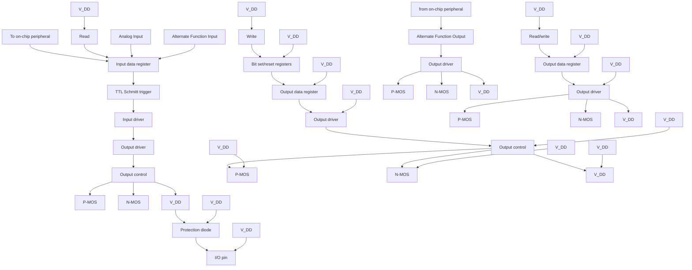

如图 10-1 所示 IO 口结构，每个引脚在芯片内部都有两只保护二极管，IO 口内部可分为输入和输出驱动模块。其中输入驱动有弱上下拉电阻可选，可连接到 AD 等模拟输入的外设；如果输入到数字外设，就需要经过一个 TTL 施密特触发器，再连接到 GPIO 输入寄存器或其他复用外设。而输出驱动有一对 MOS 管，可通过配置上下的 MOS 管是否使能来将 IO 口配置成开漏或推挽输出；输出驱动内部也可以配置成由 GPIO 控制输出还是由复用的其他外设控制输出。

# 10.2.2 GPIO 的初始化功能

刚复位后，GPIO 口运行在初始状态，这时大多数 10 口都是运行在浮空输入状态，但也有 HSE 等外设相关的引脚是运行在外设复用的功能上。具体的初始化功能请参照引脚描述相关的章节。

# 10.2.3 外部中断

所有的 GPIO 口都可以被配置外部中断输入通道，但一个外部中断输入通道最多只能映射到一个 GPIO 引脚上，且外部中断通道的序号必须和 GPIO 端口的位号一致，比如 PA1（或 PB1、PC1、PD1、PE1 等）只能映射到 EXTI1 上，且 EXTI1 只能接受 PA1、PB1、PC1、PD1 或 PE1 等其中之一的映射，两方都是一对一的关系。

# 10.2.4 复用功能

使用复用功能必须要注意：

- 使用输入方向的复用功能，端口必须配置成复用输入模式，上下拉设置可根据实际需要来设置  
- 使用输出方向的复用功能，端口必须配置成复用输出模式，推挽或开漏可根据实际情况设置  
● 对于双向的复用功能，端口必须配置成复用输出模式，这时驱动器被配置成浮空输入模式

同一个 10 口可能有多个外设复用到此管脚，因此为了使各个外设都有最大的发挥空间，外设的复用引脚除了默认复用引脚，还可以进行重映射，重映射到其他的引脚，避开被占用的引脚。

# 10.2.5 锁定机制

锁定机制可以锁定 10 口的配置。经过特定的一个写序列后，选定的 10 引脚配置将被锁定，在下一个复位前无法更改。

# 10.2.6 输入配置

图 10-2 GPIO 模块输入配置结构框图  
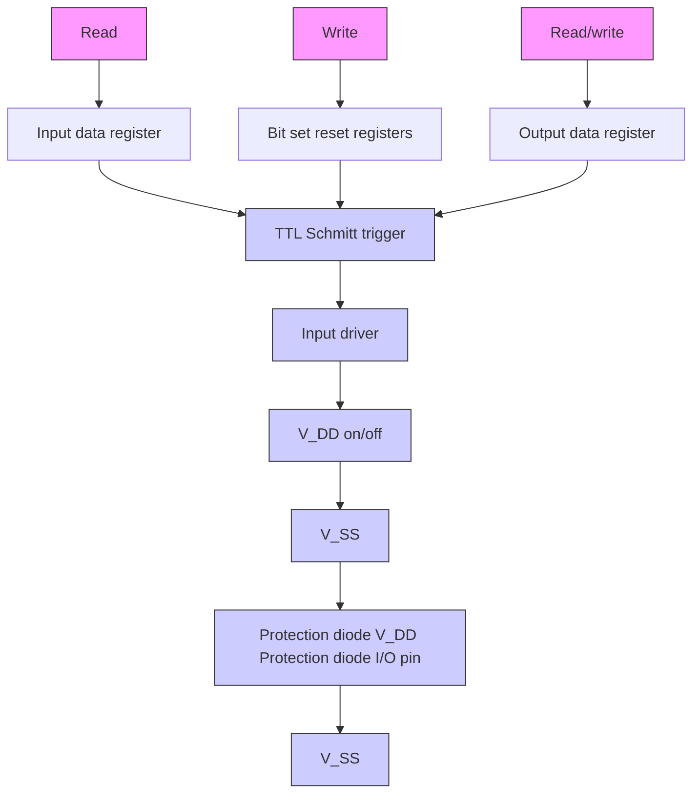

当 10 口配置成输入模式时，输出驱动断开，输入上下拉可选，不连接复用功能和模拟输入。在每个 10 口上的数据在每个 PB2 时钟被采样到输入数据寄存器，读取输入数据寄存器对应位即获取了对应引脚的电平状态。

# 10.2.7 输出配置

图 10-3 GPIO 模块输出配置结构框图  
```mermaid
graph TD
    A["Read"] --> B["Input data register"]
    C["Write"] --> D["Bit set/reset registers"]
    E["Read/write"] --> F["Output data register"]
    B --> G["TTL Schmitt trigger"]
    D --> G
    F --> G
    G --> H["Output driver"]
    H --> I["Output control"]
    I --> J["P-MOS"]
    I --> K["N-MOS"]
    I --> L["V_DD"]
    L --> M["Protection diode"]
    M --> N["I/O pin"]
    M --> O["V_SS"]
    O --> P["Protection diode"]
    P --> Q["V_DD"]
    style G fill:#f9f,stroke:#333
    style H fill:#ccf,stroke:#333
    style I fill:#cfc,stroke:#333
    style J fill:#fcc,stroke:#333
    style K fill:#fcc,stroke:#333
    style L fill:#cff,stroke:#333
    style M fill:#ffc,stroke:#333
    style N fill:#ffc,stroke:#333
    style O fill:#ffc,stroke:#333
    style P fill:#ffc,stroke:#333
```

当 10 口配置成输出模式时，输出驱动器中的一对 MOS 可根据需要被配置成推挽或开漏模式，不使用复用功能。输入驱动的上下拉电阻被禁用，TTL 施密特触发器被激活，出现在 10 引脚上的电平将会在每个 PB2 时钟被采样到输入数据寄存器，所以读取输入数据寄存器将会得到 10 状态，在推挽输出模式时，对输出数据寄存器的访问就会得到最后一次写入的值。

# 10.2.8 复用功能配置

图 10-4 GPIO 模块被其他外设复用时的结构框图  
```mermaid
graph TD
    A["Read"] --> B["Input data register"]
    C["Write"] --> D["Bit set/reset registers"]
    E["Read/write"] --> F["Output data register"]
    G["To on-chip peripheral"] --> H["Alternate Function Input"]
    I["From on-chip peripheral"] --> J["Alternate Function Output"]
    K["TTL Schmitt trigger"] --> L["On"]
    M["Output driver"] --> N["Output control"]
    O["V_DD Protection diode"] --> P["P-MOS"]
    Q["V_SS Protection diode"] --> R["N-MOS"]
    S["V_DD Protection diode"] --> T["P-MOS"]
    U["V_SS Protection diode"] --> V["N-MOS"]
    W["V_DD Protection diode"] --> X["P-MOS"]
    Y["V_SS Protection diode"] --> Z["N-MOS"]
    AA["Push-pull, open-drain or disabled"] --> AB["Output driver"]
    AC["I/O pin"] --> AD["Protection diode"]
```

在启用复用功能时，输出驱动器被使能，可以按需要被配置成开漏或推挽模式，施密特触发器也被打开，复用功能的输入和输出线都被连接，但是输出数据寄存器被断开，出现在10引脚上的电平将会在每个PB2时钟被采样到输入数据寄存器，在开漏模式下，读取输入数据寄存器将会得到10口当前状态；在推挽模式下，读取输出数据寄存器将会得到最后一次写入的值。

# 10.2.9 模拟输入配置

图 10-5 GPIO 模块作为模拟输入时的配置结构框图  
```mermaid
graph TD
    A["To on-chip peripheral"] --> B["Input data register"]
    B --> C["TTL Schmitt trigger"]
    C --> D["Input driver"]
    D --> E["Output driver"]
    E --> F["Push-pull, open-drain or disabled"]
    F --> G["V_DD Protection diode"]
    F --> H["V_SS Protection diode"]
    I["Write"] --> J["Bit set/reset registers"]
    K["Read/write"] --> L["Output data register"]
    M["On-chip"] --> N["Analog Input"]
    O["Write"] --> P["Bit set/reset registers"]
    Q["Read/write"] --> R["Output data register"]
    S["Off"] --> T["0"]
    U["Write"] --> V["Bit set/reset registers"]
    W["Read/write"] --> X["Output data register"]
    Y["Write"] --> Z["Bit set/reset registers"]
    AA["Read/write"] --> AB["Output data register"]
    AC["Write"] --> AD["Bit set/reset registers"]
    AE["Read/write"] --> AF["Output data register"]
```

在启用模拟输入时，输出缓冲器被断开，输入驱动中施密特触发器的输入被禁止以防止产生10口上的消耗，上下拉电阻被禁止，读取输入数据寄存器将一直为0。

# 10.2.10 外设的 GPIO 设置

下列表格推荐了各个外设的引脚相应的 GPIO 口配置。

表 10-1 高级定时器（TIM1/8/9/10）

<table><tr><td>TIM1/8/9/10</td><td>配置</td><td>GPIO 配置</td></tr><tr><td rowspan="2">TIM1/8/9/10_CHx</td><td>输入捕获通道 x</td><td>浮空输入</td></tr><tr><td>输出比较通道 x</td><td>推挽复用输出</td></tr><tr><td>TIM1/8/9/10_CHxN</td><td>互补输出通道 x</td><td>推挽复用输出</td></tr><tr><td>TIM1/8/9/10_BKIN</td><td>刹车输入</td><td>浮空输入</td></tr><tr><td>TIM1/8/9/10_ETR</td><td>外部触发时钟输入</td><td>浮空输入</td></tr></table>

表 10-2 通用定时器（TIM2/3/4/5）

<table><tr><td>TIM2/3/4/5 引脚</td><td>配置</td><td>GPIO 配置</td></tr><tr><td rowspan="2">TIM2/3/4/5_CHx</td><td>输入捕获通道 x</td><td>浮空输入</td></tr><tr><td>输出比较通道 x</td><td>推挽复用输出</td></tr><tr><td>TIM2/3/4/5_ETR</td><td>外部触发时钟输入</td><td>浮空输入</td></tr></table>

表 10-3 通用同步异步串行收发器（USART）

<table><tr><td>USART 引脚</td><td>配置</td><td>GPIO 配置</td></tr><tr><td rowspan="2">USARTx_TX</td><td>全双工模式</td><td>推挽复用输出</td></tr><tr><td>半双工同步模式</td><td>开漏复用输出</td></tr><tr><td rowspan="2">USARTx_RX</td><td>全双工模式</td><td>浮空输入或带上拉输入</td></tr><tr><td>半双工同步模式</td><td>未使用</td></tr><tr><td>USARTx_CK</td><td>同步模式</td><td>推挽复用输出</td></tr><tr><td>USARTx_RTS</td><td>硬件流量控制</td><td>推挽复用输出</td></tr><tr><td>USARTx_CTS</td><td>硬件流量控制</td><td>浮空输入或带上拉输入</td></tr></table>

表 10-4 串行外设接口（SPI）模块

<table><tr><td>SPI 引脚</td><td>配置</td><td>GPIO 配置</td></tr><tr><td rowspan="2">SPIx_SCK</td><td>主模式</td><td>推挽复用输出</td></tr><tr><td>从模式</td><td>浮空输入</td></tr><tr><td rowspan="4">SPIx_MOSI</td><td>全双工主模式</td><td>推挽复用输出</td></tr><tr><td>全双工从模式</td><td>浮空输入或带上拉输入</td></tr><tr><td>简单的双向数据线/主模式</td><td>推挽复用输出</td></tr><tr><td>简单的双向数据线/从模式</td><td>未使用</td></tr><tr><td rowspan="4">SPIx_MISO</td><td>全双工主模式</td><td>浮空输入或带上拉输入</td></tr><tr><td>全双工从模式</td><td>推挽复用输出</td></tr><tr><td>简单的双向数据线/主模式</td><td>未使用</td></tr><tr><td>简单的双向数据线/从模式</td><td>推挽复用输出</td></tr><tr><td rowspan="3">SPIx_NSS</td><td>硬件主或从模式</td><td>浮空、上拉或下拉输入</td></tr><tr><td>硬件主模式/NSS 输出使能</td><td>推挽复用输出</td></tr><tr><td>软件模式</td><td>未使用</td></tr></table>

表 10-5 内置音频总线（I2S）模块

<table><tr><td>12S 引脚</td><td>配置</td><td>GPIO 配置</td></tr><tr><td rowspan="2">12Sx_WS</td><td>主模式</td><td>推挽复用输出</td></tr><tr><td>从模式</td><td>浮空输入</td></tr><tr><td rowspan="2">12Sx_CK</td><td>主模式</td><td>推挽复用输出</td></tr><tr><td>从模式</td><td>浮空输入</td></tr><tr><td rowspan="2">12Sx_SD</td><td>发送器</td><td>推挽复用输出</td></tr><tr><td>接收器</td><td>浮空、上拉或下拉输入</td></tr><tr><td rowspan="2">12Sx_MCK</td><td>主模式</td><td>推挽复用输出</td></tr><tr><td>从模式</td><td>未使用</td></tr></table>

表 10-6 内部集成总线（I2C）模块

<table><tr><td> $I^{2}C$  引脚</td><td>配置</td><td>GPIO 配置</td></tr><tr><td> $I^{2}C\_SCL$ </td><td> $I^{2}C$  时钟</td><td>开漏复用输出</td></tr><tr><td> $I^{2}C\_SDA$ </td><td> $I^{2}C$  数据</td><td>开漏复用输出</td></tr></table>

表 10-7 控制器局域网（CAN）模块

<table><tr><td>CAN 引脚</td><td>GPIO 配置</td></tr><tr><td>CANx_TX</td><td>推挽复用输出</td></tr><tr><td>CANx_RX</td><td>浮空输入或上拉输入</td></tr></table>

表 10-8 USB 全速设备（USBD）控制器

<table><tr><td>USBD 引脚</td><td>GPIO 配置</td></tr><tr><td>USBD_DM/USBD_DP</td><td>使能了 USB 模块之后,复用 IO 口会自动连接到内部 USBD 收发器</td></tr></table>

表 10-9 USB 主机设备（USBFS）控制器

<table><tr><td>USBFS 引脚</td><td>GPIO 配置</td></tr><tr><td>USBFS_DM/USBFS_DP</td><td>使能了 USB 模块之后,复用 IO 口会自动连接到内部 USBFS 收发器</td></tr></table>

表 10-10 USB OTG\_FS 控制器

<table><tr><td>USB OTG_FS 引脚</td><td>GPIO 配置</td></tr><tr><td>OTG_FS_VBUS</td><td>模拟输入</td></tr><tr><td>OTG_FS_ID</td><td>上拉输入</td></tr><tr><td>OTG_FS_DM</td><td>由 USB 断电自动控制</td></tr><tr><td>OTG_FS_DP</td><td>由 USB 断电自动控制</td></tr></table>

表 10-11 安全数字输入输出（SDIO）模块

<table><tr><td>SD10 引脚</td><td>配置</td><td>GPIO 配置</td></tr><tr><td>SD10_CK</td><td>时钟</td><td>推挽复用输出</td></tr><tr><td>SD10_CMD</td><td>命令</td><td>推挽复用输出</td></tr><tr><td>SD10[D7:D0]</td><td>数据</td><td>推挽复用输出</td></tr></table>

表 10-12 直接存储器访问控制（FSMC）控制器

<table><tr><td>FSMC 引脚</td><td>GPIO 配置</td></tr><tr><td>FSMC_A[23:16]FSMC_D[15:0]</td><td>推挽复用输出</td></tr><tr><td>FSMC_CK</td><td>推挽复用输出</td></tr><tr><td>FSMC_NOEFSMC_NWE</td><td>推挽复用输出</td></tr><tr><td>FSMC_NE1FSMC_NCE2</td><td>推挽复用输出</td></tr><tr><td>FSMC_NWAIT</td><td>浮空输入或带上拉输入</td></tr><tr><td>FSMC_NBL[1:0]</td><td>推挽复用输出</td></tr></table>

表 10-13 模拟转数字转换器（ADC）及数字转模拟转换器（DAC）

<table><tr><td>ADC/DAC 引脚</td><td>GPIO 配置</td></tr><tr><td>ADC/DAC</td><td>模拟输入</td></tr></table>

表 10-14 其他的 I0 功能设置

<table><tr><td>引脚</td><td>配置功能</td><td>GPIO 配置</td></tr><tr><td rowspan="2">TAMPER_RTC</td><td>RTC 输出</td><td rowspan="2">硬件自动设置</td></tr><tr><td>侵入事件输入</td></tr><tr><td>MCO</td><td>时钟输出</td><td>推挽复用输出</td></tr><tr><td>EXTI</td><td>外部中断输入</td><td>浮空、上拉或下拉输入</td></tr></table>

# 10.2.11 复用功能重映射 GPIO 设置

# 10.2.11.1 OSC32\_IN/OSC32\_OUT 作为 GPIO 端口 PC14/PC15

当 LSEON=0 时，LSE 振荡器引脚 OSC32\_IN/OSC32\_OUT 可以分别用做 GPIO 的 PC14/PC15。

当 LSEON=1 时，作为 LSE 引脚。

# 10.2.11.2 OSC\_IN/OSC\_OUT 引脚作为 GPIO 端口 PD0/PD1

OSC\_IN/OSC\_OUT 可以用做 GPIO 的 PD0/PD1，通过设置重映射寄存器 1（AFIO\_PCFR1）实现。

这个重映射适用于 CH32V30x\_D8、CH32V30x\_D8C、CH32V31x\_D8C、CH32F20x\_D6、CH32F20x\_D8、CH32F20x\_D8C 系列芯片，但对于 LQFP100 封装，由于 PDO 和 PD1 为固有的功能引脚，因此没有必要再由软件进行重映射设置。

这个重映射对于 CH32V20x\_D6 系列芯片, 只适用于 CH32V203CxT6、CH32V203CxU6、CH32V203K8T6、CH32V203G6U6、CH32V203F6P6 芯片; 对于 CH32V20x\_D8 系列芯片 CH32V203RBT6 只有 OSC\_IN 和 OSC\_OUT 功能脚, 不支持映射。

注：批号倒数第五位小于 4 且倒数第六位等于 0 的 CH32V307R，CH32V305R，CH32V305G，CH32V305F，CH32V303C，CH32V303R，CH32F205R，CH32F203R，CH32F203C 芯片，PDO、PD1 做普通引脚时，外部中断/事件功能没有被映射，不能用来产生外部中断/事件。

# 10.2.11.3 定时器复用功能重映射

表 10-15 TIM1 复用功能重映射

<table><tr><td>复用功能</td><td>TIM1_RM=00默认映射</td><td>TIM1_RM=01部分映射</td><td>TIM1_RM=11完全映射(1)</td></tr><tr><td>TIM1_ETR</td><td>PA12</td><td>PA12</td><td>PE7</td></tr><tr><td>TIM1_CH1</td><td>PA8</td><td>PA8</td><td>PE9</td></tr><tr><td>TIM1_CH2</td><td>PA9</td><td>PA9</td><td>PE11</td></tr><tr><td>TIM1_CH3</td><td>PA10</td><td>PA10</td><td>PE13</td></tr><tr><td>TIM1_CH4</td><td>PA11</td><td>PA11</td><td>PE14</td></tr><tr><td>TIM1_BKIN</td><td>PB12</td><td>PA6</td><td>PE15</td></tr><tr><td>TIM1_CH1N</td><td>PB13</td><td>PA7</td><td>PE8</td></tr><tr><td>TIM1_CH2N</td><td>PB14</td><td>PB0</td><td>PE10</td></tr><tr><td>TIM1_CH3N</td><td>PB15</td><td>PB1</td><td>PE12</td></tr></table>

注：（1）仅 LQFP100 封装，支持该位重映射功能。

表 10-16 TIM2 复用功能重映射

<table><tr><td>复用功能</td><td>TIM2_RM=00默认映射</td><td>TIM2_RM=01部分映射</td><td>TIM2_RM=10部分映射</td><td>TIM2_RM=11完全映射</td></tr><tr><td>TIM2_ETR</td><td>PA0</td><td>PA15</td><td>PA0</td><td>PA15</td></tr><tr><td>TIM2_CH1</td><td>PA0</td><td>PA15</td><td>PA0</td><td>PA15</td></tr><tr><td>TIM2_CH2</td><td>PA1</td><td>PB3</td><td>PA1</td><td>PB3</td></tr><tr><td>TIM2_CH3</td><td>PA2</td><td>PA2</td><td>PB10</td><td>PB10</td></tr><tr><td>TIM2_CH4</td><td>PA3</td><td>PA3</td><td>PB11</td><td>PB11</td></tr></table>

表 10-17 TIM3 复用功能重映射

<table><tr><td>复用功能</td><td>TIM3_RM=00默认映射</td><td>TIM3_RM=10部分映射</td><td>TIM3_RM=11完全映射(1)</td></tr><tr><td>TIM3_CH1</td><td>PA6</td><td>PB4</td><td>PC6</td></tr><tr><td>TIM3_CH2</td><td>PA7</td><td>PB5</td><td>PC7</td></tr><tr><td>TIM3_CH3</td><td>PBO</td><td>PBO</td><td>PC8</td></tr><tr><td>TIM3_CH4</td><td>PB1</td><td>PB1</td><td>PC9</td></tr></table>

注：（1）64 脚以下封装不支持该位映射。

表 10-18 TIM4 复用功能重映射

<table><tr><td>复用功能</td><td>TIM4_RM=0默认映射</td><td>TIM4_RM=1重映射(1)</td></tr><tr><td>TIM4_CH1</td><td>PB6</td><td>PD12</td></tr><tr><td>TIM4_CH2</td><td>PB7</td><td>PD13</td></tr><tr><td>TIM4_CH3</td><td>PB8</td><td>PD14</td></tr><tr><td>TIM4_CH4</td><td>PB9</td><td>PD15</td></tr></table>

注：（1）仅 LQFP100 封装，支持该位重映射功能。

表 10-19 TIM5 复用功能重映射

<table><tr><td>复用功能</td><td>TIM5CH4_RM=0默认映射</td><td>TIM5CH4_RM=1重映射</td></tr><tr><td>TIM5_CH4</td><td>PA3</td><td>LSI 内部时钟</td></tr></table>

表 10-20 TIM8 复用功能重映射

<table><tr><td>复用功能</td><td>TIM8_RM=0默认映射</td><td>TIM8_RM=1重映射</td></tr><tr><td>TIM8_ETR</td><td>PA0</td><td>PA0</td></tr><tr><td>TIM8_CH1</td><td>PC6</td><td>PB6</td></tr><tr><td>TIM8_CH2</td><td>PC7</td><td>PB7</td></tr><tr><td>TIM8_CH3</td><td>PC8</td><td>PB8</td></tr><tr><td>TIM8_CH4</td><td>PC9</td><td>PC13</td></tr><tr><td>TIM8_BKIN</td><td>PA6</td><td>PB9</td></tr><tr><td>TIM8_CH1N</td><td>PA7</td><td>PA13</td></tr><tr><td>TIM8_CH2N</td><td>PB0</td><td>PA14</td></tr><tr><td>TIM8_CH3N</td><td>PB1</td><td>PA15</td></tr></table>

表 10-21 TIM9 复用功能重映射

<table><tr><td>复用功能</td><td>TIM9_RM=00默认映射</td><td>TIM9_RM=01部分映射</td><td>TIM9_RM=1x完全映射(1)</td></tr><tr><td>TIM9_ETR</td><td>PA2</td><td>PA2</td><td>PD9</td></tr><tr><td>TIM9_CH1</td><td>PA2</td><td>PA2</td><td>PD9</td></tr><tr><td>TIM9_CH2</td><td>PA3</td><td>PA3</td><td>PD11</td></tr><tr><td>TIM9_CH3</td><td>PA4</td><td>PA4</td><td>PD13</td></tr><tr><td>TIM9_CH4</td><td>PC4</td><td>PC14</td><td>PD15</td></tr><tr><td>TIM9_BKIN</td><td>PC5</td><td>PA1</td><td>PD14</td></tr><tr><td>TIM9_CH1N</td><td>PC0</td><td>PB0</td><td>PD8</td></tr><tr><td>TIM9_CH2N</td><td>PC1</td><td>PB1</td><td>PD10</td></tr><tr><td>TIM9_CH3N</td><td>PC2</td><td>PB2</td><td>PD12</td></tr></table>

注：（1）仅 LQFP100 封装，支持该位重映射功能。

注：（1）仅 LQFP100 封装，支持该位重映射功能。  
表 10-22 TIM10 复用功能重映射

<table><tr><td>复用功能</td><td>TIM10_RM=00默认映射</td><td>TIM10_RM=01部分映射</td><td>TIM10_RM=1x完全映射(1)</td></tr><tr><td>TIM10_ETR</td><td>PC10</td><td>PB11</td><td>PD0</td></tr><tr><td>TIM10_CH1</td><td>PB8</td><td>PB3</td><td>PD1</td></tr><tr><td>TIM10_CH2</td><td>PB9</td><td>PB4</td><td>PD3</td></tr><tr><td>TIM10_CH3</td><td>PC3</td><td>PB5</td><td>PD5</td></tr><tr><td>TIM10_CH4</td><td>PC11</td><td>PC15</td><td>PD7</td></tr><tr><td>TIM10_BKIN</td><td>PC12</td><td>PB10</td><td>PE2</td></tr><tr><td>TIM10_CH1N</td><td>PA12</td><td>PA5</td><td>PE3</td></tr><tr><td>TIM10_CH2N</td><td>PA13</td><td>PA6</td><td>PE4</td></tr><tr><td>TIM10_CH3N</td><td>PA14</td><td>PA7</td><td>PE5</td></tr></table>

# 10.2.11.4 USART 复用功能重映射

表 10-23 USART1 复用功能重映射

<table><tr><td>复用功能</td><td>USART1_RM1=0 $^{(1)}$ USART1_RM2=0 $^{(2)}$ 默认映射</td><td>USART1_RM1=1 $^{(1)}$ USART1_RM2=0 $^{(2)}$ 重映射</td><td>USART1_RM1=0 $^{(1)}$ USART1_RM2=1 $^{(2)}$ 重映射</td><td>USART1_RM1=1 $^{(1)}$ USART1_RM2=1 $^{(2)}$ 重映射</td></tr><tr><td>USART1_CK</td><td>PA8</td><td>PA8</td><td>PA10</td><td>PA5</td></tr><tr><td>USART1_TX</td><td>PA9</td><td>PB6</td><td>PB15</td><td>PA6</td></tr><tr><td>USART1_RX</td><td>PA10</td><td>PB7</td><td>PA8</td><td>PA7</td></tr><tr><td>USART1_CTS</td><td>PA11</td><td>PA11</td><td>PA5</td><td>PC4</td></tr><tr><td>USART1_RTS</td><td>PA12</td><td>PA12</td><td>PA9</td><td>PC5</td></tr></table>

注：（1）USART1\_RM1 为 AFIO\_PCFR1 寄存器 bit2，为映射配置低位。  
（2）USART1\_RM2 为 AFIO\_PCFR2 寄存器 bit26，为映射配置高位，CH32V20x\_D6、CH32F20x\_D6 不支持该位映射。

表 10-24 USART2 复用功能重映射

<table><tr><td>复用功能</td><td>USART2_RM=0默认映射</td><td>USART2_RM=1重映射(1)</td></tr><tr><td>USART2_CTS</td><td>PA0</td><td>PD3</td></tr><tr><td>USART2_RTS</td><td>PA1</td><td>PD4</td></tr><tr><td>USART2_TX</td><td>PA2</td><td>PD5</td></tr><tr><td>USART2_RX</td><td>PA3</td><td>PD6</td></tr><tr><td>USART2_CK</td><td>PA4</td><td>PD7</td></tr></table>

表 10-25 USART3 复用功能重映射

<table><tr><td>复用功能</td><td>USART3_RM=00默认映射</td><td>USART3_RM=01部分映射(1)</td><td>USART3_RM=10部分映射(2)</td><td>USART3_RM=11完全映射(3)</td></tr><tr><td>USART3_TX</td><td>PB10</td><td>PC10</td><td>PA13</td><td>PD8</td></tr><tr><td>USART3_RX</td><td>PB11</td><td>PC11</td><td>PA14</td><td>PD9</td></tr><tr><td>USART3_CK</td><td>PB12</td><td>PC12</td><td>PD10</td><td>PD10</td></tr><tr><td>USART3_CTS</td><td>PB13</td><td>PB13</td><td>PD11</td><td>PD11</td></tr><tr><td>USART3_RTS</td><td>PB14</td><td>PB14</td><td>PD12</td><td>PD12</td></tr></table>

注：（1）48 脚以下封装不支持该位映射。  
(2) 只适用于 CH32F20x\_D8、CH32F20x\_D8C、CH32V30x\_D8、CH32V30x\_D8C、CH32V31x\_D8C 系列芯片

批号倒数第五位等于大于 2 或批号倒数第六位不等于 0。

（3）仅 LQFP100 封装，支持该位重映射功能。

表 10-26 USART4 复用功能重映射

<table><tr><td>复用功能(1)</td><td>USART4_RM=00默认映射</td><td>USART4_RM=01重映射</td><td>USART4_RM=1x重映射(2)</td></tr><tr><td>USART4_TX</td><td>PC10</td><td>PBO</td><td>PE0</td></tr><tr><td>USART4_RX</td><td>PC11</td><td>PB1</td><td>PE1</td></tr></table>

注：(1)适用于 CH32V30x\_D8C、CH32V31x\_D8C、CH32V30x\_D8、CH32V30x\_D8W、CH32V20x\_D8、CH32F20x\_D8C、CH32F20x\_D8、CH32F20x\_D8W。  
(2) 仅 LQFP100 封装，支持该位重映射功能。

表 10-27 USART4 复用功能重映射 $^{(1)}$ 

<table><tr><td>复用功能</td><td>USART4_RM=x0默认映射</td><td>USART4_RM=x1重映射</td></tr><tr><td>USART4_CK</td><td>PB2</td><td>PA6</td></tr><tr><td>USART4_TX</td><td>PB0</td><td>PA5</td></tr><tr><td>USART4_RX</td><td>PB1</td><td>PB5</td></tr><tr><td>USART4_CTS</td><td>PB3</td><td>PA7</td></tr><tr><td>USART4_RTS</td><td>PB4</td><td>PA15</td></tr></table>

注：（1）该功能仅支持 CH32V203C8、CH32F203C8 和 64 引脚及以上产品。

表 10-28 USART5 复用功能重映射 $^{(2)}$ 

<table><tr><td>复用功能</td><td>USART5_RM=00默认映射</td><td>USART5_RM=01重映射</td><td>USART5_RM=1x重映射(1)</td></tr><tr><td>USART5_TX</td><td>PC12</td><td>PB4</td><td>PE8</td></tr><tr><td>USART5_RX</td><td>PD2</td><td>PB5</td><td>PE9</td></tr></table>

注：（1）仅 LQFP100 封装，支持该位重映射功能。  
(2) 该功能不支持 64 引脚以下产品。

表 10-29 USART6 复用功能重映射 $^{(2)}$ 

<table><tr><td>复用功能</td><td>USART6_RM=00默认映射(2)</td><td>USART6_RM=01重映射</td><td>USART6_RM=1x重映射(1)</td></tr><tr><td>USART6_TX</td><td>PC0</td><td>PB8</td><td>PE10</td></tr><tr><td>USART6_RX</td><td>PC1</td><td>PB9</td><td>PE11</td></tr></table>

注：（1）仅 LQFP100 封装，支持该位重映射功能。  
(2) 该功能不支持 64 引脚以下产品。

表 10-30 USART7 复用功能重映射 $^{(2)}$ 

<table><tr><td>复用功能</td><td>USART7_RM=00默认映射</td><td>USART7_RM=01重映射</td><td>USART7_RM=1x重映射(1)</td></tr><tr><td>USART7_TX</td><td>PC2</td><td>PA6</td><td>PE12</td></tr><tr><td>USART7_RX</td><td>PC3</td><td>PA7</td><td>PE13</td></tr></table>

注：（1）仅 LQFP100 封装，支持该位重映射功能。

# (2) 该功能不支持 64 引脚以下产品。

表 10-31 USART8 复用功能重映射 $^{(2)}$ 

<table><tr><td>复用功能</td><td>USART8_RM=00默认映射</td><td>USART8_RM=01重映射</td><td>USART8_RM=1x重映射(1)</td></tr><tr><td>USART8_TX</td><td>PC4</td><td>PA14</td><td>PE14</td></tr><tr><td>USART8_RX</td><td>PC5</td><td>PA15</td><td>PE15</td></tr></table>

注：（1）仅 LQFP100 封装，支持该位重映射功能。  
(2) 该功能不支持 64 引脚以下产品。

# 10.2.11.5 SPI 复用功能重映射

表 10-32 SPI1 复用功能重映射

<table><tr><td>复用功能</td><td>SPI1_RM=0默认映射</td><td>SPI1_RM=1重映射</td></tr><tr><td>SPI1_NSS</td><td>PA4</td><td>PA15</td></tr><tr><td>SPI1_SCK</td><td>PA5</td><td>PB3</td></tr><tr><td>SPI1_MISO</td><td>PA6</td><td>PB4</td></tr><tr><td>SPI1_MOSI</td><td>PA7</td><td>PB5</td></tr></table>

表 10-33 SPI3/I2S3 复用功能重映射

<table><tr><td>复用功能</td><td>SPI3_RM=0默认映射</td><td>SPI3_RM=1重映射</td></tr><tr><td>SPI3_NSS</td><td>PA15</td><td>PA4</td></tr><tr><td>SPI3_SCK</td><td>PB3</td><td>PC10</td></tr><tr><td>SPI3_MISO</td><td>PB4</td><td>PC11</td></tr><tr><td>SPI3_MOSI</td><td>PB5</td><td>PC12</td></tr></table>

<table><tr><td>复用功能</td><td>I2S3_RM=0默认映射</td><td>I2S3_RM=1重映射</td></tr><tr><td>I2S3_WS</td><td>PA15</td><td>PA4</td></tr><tr><td>I2S3_CK</td><td>PB3</td><td>PC10</td></tr><tr><td>I2S3_MCK</td><td>PC7</td><td>PC7</td></tr><tr><td>I2S3_SD</td><td>PB5</td><td>PC12</td></tr></table>

# 10.2.11.6 I2C 复用功能重映射

表 10-34 I2C1 复用功能重映射

<table><tr><td>复用功能</td><td>I2C1_RM=0默认映射</td><td>I2C1_RM=1重映射</td></tr><tr><td>I2C1_SCL</td><td>PB6</td><td>PB8</td></tr><tr><td>I2C1_SDA</td><td>PB7</td><td>PB9</td></tr></table>

# 10.2.11.7 CAN 复用功能重映射

表 10-35 CAN1 复用功能重映射

<table><tr><td>复用功能</td><td>CAN1_RM=00默认映射</td><td>CAN1_RM=10重映射</td><td>CAN1_RM=11重映射</td></tr><tr><td>CAN1_RX</td><td>PA11</td><td>PB8</td><td>PD0</td></tr><tr><td>CAN1_TX</td><td>PA12</td><td>PB9</td><td>PD1</td></tr></table>

表 10-36 CAN2 复用功能重映射

<table><tr><td>复用功能</td><td>CAN2_RM=0默认映射</td><td>CAN2_RM=1重映射</td></tr><tr><td>CAN2_RX</td><td>PB12</td><td>PB5</td></tr><tr><td>CAN2_TX</td><td>PB13</td><td>PB6</td></tr></table>

# 10.2.11.8 ADC 复用功能重映射

表 10-37 ADC1 外部触发注入转换复用功能重映射

<table><tr><td>复用功能</td><td>ADC1_ETRGINJ_RM=0默认映射</td><td>ADC1_ETRGINJ_RM=1重映射</td></tr><tr><td>ADC1 外部触发注入转换</td><td>ADC1 外部触发注入转换与EXTI15 相连</td><td>ADC1 外部触发注入转换与TIM8_CH4 相连</td></tr></table>

表 10-38 ADC1 外部触发规则转换复用功能重映射

<table><tr><td>复用功能</td><td>ADC1_ETRGREG_RM=0默认映射</td><td>ADC1_ETRGREG_RM=1重映射</td></tr><tr><td>ADC1 外部触发规则转换</td><td>ADC1 外部触发规则转换与EXTI11 相连</td><td>ADC1 外部触发规则转换与TIM8_TRGO 相连</td></tr></table>

表 10-39 ADC2 外部触发注入转换复用功能重映射

<table><tr><td>复用功能</td><td>ADC2_ETRGINJ_RM=0默认映射</td><td>ADC2_ETRGINJ_RM=1重映射</td></tr><tr><td>ADC2 外部触发注入转换</td><td>ADC2 外部触发注入转换与EXTI15 相连</td><td>ADC2 外部触发注入转换与TIM8_CH4 相连</td></tr></table>

表 10-40 ADC2 外部触发规则转换复用功能重映射

<table><tr><td>复用功能</td><td>ADC2_ETRGREG_RM=0默认映射</td><td>ADC2_ETRGREG_RM=1重映射</td></tr><tr><td>ADC2 外部触发规则转换</td><td>ADC2 外部触发规则转换与EXTI11 相连</td><td>ADC2 外部触发规则转换与TIM8_TRGO 相连</td></tr></table>

注：ADC1 重映射只支持存在 TIM8 的产品，详细信息见相关数据手册。

# 10.2.11.9 ETH 复用功能重映射

注：（1）仅 LQFP100 封装互联型，支持该位重映射功能。  
表 10-41 ETH 复用功能重映射

<table><tr><td>复用功能(1)</td><td>ETH_RM=0默认映射</td><td>ETH_RM=1重映射(1)</td></tr><tr><td>ETH_RX_DV</td><td>PA7</td><td>PD8</td></tr><tr><td>ETH_CRS_DV</td><td>PA7</td><td>PD8</td></tr><tr><td>ETH_RXD0</td><td>PC4</td><td>PD9</td></tr><tr><td>ETH_RXD1</td><td>PC5</td><td>PD10</td></tr><tr><td>ETH_RXD2</td><td>PB0</td><td>PD11</td></tr><tr><td>ETH_RXD3</td><td>PB1</td><td>PD12</td></tr></table>

# 10.2.11.10 FSMC\_NADV 复用功能重映射 $^{(2)}$

表 10-42 FSMC\_NADV 复用功能重映射

<table><tr><td>复用功能(1)</td><td>FSMCEN=1默认映射</td><td>FSMCEN=1&amp;USBHSEN=1&amp;RB_UC_RST_SIE=0</td></tr><tr><td>FSMC_NADV</td><td>PB7</td><td>PD2</td></tr></table>

注：（1）当 FSMC\_NADV=1 时禁止 FSMC\_NADV 输出。  
(2) 批号倒数第五位小于 2 且批号倒数第六位等于 0 的不支持该功能。

# 10.2.11.11 DVP 复用功能重映射 $^{(1)}$

表 10-43 DVP 复用功能重映射

<table><tr><td>复用功能</td><td>DVPEN=1默认映射</td><td>DVPEN=1&amp;USBHSEN=1&amp;RB_UC_RST_SIE=0</td></tr><tr><td>DVP_D5</td><td>PB6</td><td>PB3</td></tr></table>

注：（1）批号倒数第五位小于2且批号倒数第六位等于0的不支持该功能。

# 10.2.11.12 SDIO 复用功能重映射 $^{(1)}$

表 10-44 SDIO 复用功能重映射

<table><tr><td>复用功能</td><td>SDIOEN=1</td><td>SDIOEN=1&amp;ETHMACEN=1</td></tr><tr><td>SDCK</td><td>PC12</td><td>PC12</td></tr><tr><td>CMD</td><td>PD2</td><td>PD2</td></tr><tr><td>SD0</td><td>PC8</td><td>PB14</td></tr><tr><td>SD1</td><td>PC9</td><td>PB15</td></tr><tr><td>SD2</td><td>PC10</td><td>PC10</td></tr><tr><td>SD3</td><td>PC11</td><td>PC11</td></tr><tr><td>SD4</td><td>PB8</td><td>PB8</td></tr><tr><td>SD5</td><td>PB9</td><td>PB9</td></tr><tr><td>SD6</td><td>PC6</td><td>PC6</td></tr><tr><td>SD7</td><td>PC7</td><td>PC7</td></tr></table>

注：（1）批号倒数第五位小于2且批号倒数第六位等于0的不支持该功能。

# 10.2.11.13 SPI3/I2S3 复用功能重映射 $^{(1)}$

注：（1）批号第五位等于 2 且倒数第六位等于 0 的才支持该功能。  
(2) SPI3\_NSS 不支持硬件功能。  
(3) SPI3EN=1&ETHMACEN=1 时, I2S3 禁用。  
表 10-45 SPI3 复用功能重映射

<table><tr><td>复用功能</td><td>SPI3EN=1</td><td> $SPI3EN=1\&ETHMACEN=1^{(3)}$ </td></tr><tr><td>SPI3_NSS</td><td>PA15</td><td>无效(2)</td></tr><tr><td>SPI3_SCK</td><td>PB3</td><td>PB3</td></tr><tr><td>SPI3_MISO</td><td>PB4</td><td>PB4</td></tr><tr><td>SPI3_MOSI</td><td>PB5</td><td>PA15</td></tr></table>

# 10.2.11.14 SPI3/I2S3 复用功能重映射 $^{(1)}$

表 10-46 I2S3 复用功能重映射

<table><tr><td>复用功能</td><td>SPI3EN=1</td><td>I2SMOD=1&amp;ETH10M=1(2)</td></tr><tr><td>I2S3_WS</td><td>PA15</td><td>PA15</td></tr><tr><td>I2S3_CK</td><td>PB3</td><td>PB3</td></tr><tr><td>I2S3_MCK</td><td>PC7</td><td>PA8</td></tr><tr><td>I2S3_SD</td><td>PB5</td><td>PA9</td></tr></table>

注：（1）仅批号第五位大于 2 或倒数第六位不等于 0 的支持该功能。  
（2）SPI\_12S\_CFGR 寄存器的 I2SMOD 位置 1 时选择 I2S 模式，EXTEN\_CTR 寄存器的 ETH10M 位置 1 时启用 10M 以太网功能并使能时钟。

# 10.3 寄存器描述

# 10.3.1 GPIO 的寄存器描述

除非特殊说明，GPIO 的寄存器必须以字的方式操作（以 32 位来操作这些寄存器）。

表 10-47 GPIO 相关寄存器列表

<table><tr><td>名称</td><td>访问地址</td><td>描述</td><td>复位值</td></tr><tr><td>R32_GPIOA_CFGLR</td><td>0x40010800</td><td>PA 端口配置寄存器低位</td><td>0x44444444</td></tr><tr><td>R32_GPIOB_CFGLR</td><td>0x40010C00</td><td>PB 端口配置寄存器低位</td><td>0x44444444</td></tr><tr><td>R32_GPIOC_CFGLR</td><td>0x40011000</td><td>PC 端口配置寄存器低位</td><td>0x44444444</td></tr><tr><td>R32_GPIOD_CFGLR</td><td>0x40011400</td><td>PD 端口配置寄存器低位</td><td>0x44444444</td></tr><tr><td>R32_GPIOE_CFGLR</td><td>0x40011800</td><td>PE 端口配置寄存器低位</td><td>0x44444444</td></tr><tr><td>R32_GPIOA_CFGHR</td><td>0x40010804</td><td>PA 端口配置寄存器高位</td><td>0x44444444</td></tr><tr><td>R32_GPIOB_CFGHR</td><td>0x40010C04</td><td>PB 端口配置寄存器高位</td><td>0x44444444</td></tr><tr><td>R32_GPIOC_CFGHR</td><td>0x40011004</td><td>PC 端口配置寄存器高位</td><td>0x44444444</td></tr><tr><td>R32_GPIOD_CFGHR</td><td>0x40011404</td><td>PD 端口配置寄存器高位</td><td>0x44444444</td></tr><tr><td>R32_GPIOE_CFGHR</td><td>0x40011804</td><td>PE 端口配置寄存器高位</td><td>0x44444444</td></tr><tr><td>R32_GPIOA_INDR</td><td>0x40010808</td><td>PA 端口输入数据寄存器</td><td>0x0000XXXX</td></tr><tr><td>R32_GPIOB_INDR</td><td>0x40010C08</td><td>PB 端口输入数据寄存器</td><td>0x0000XXXX</td></tr><tr><td>R32_GPIOC_INDR</td><td>0x40011008</td><td>PC 端口输入数据寄存器</td><td>0x0000XXXX</td></tr><tr><td>R32_GPIOD_INDR</td><td>0x40011408</td><td>PD 端口输入数据寄存器</td><td>0x0000XXXX</td></tr><tr><td>R32_GPIOE_INDR</td><td>0x40011808</td><td>PE 端口输入数据寄存器</td><td>0x0000XXXX</td></tr><tr><td>R32_GPIOA_OUTDR</td><td>0x4001080C</td><td>PA 端口输出数据寄存器</td><td>0x00000000</td></tr><tr><td>R32_GPIOB_OUTDR</td><td>0x40010C0C</td><td>PB 端口输出数据寄存器</td><td>0x00000000</td></tr><tr><td>R32_GPIOC_OUTDR</td><td>0x4001100C</td><td>PC 端口输出数据寄存器</td><td>0x00000000</td></tr><tr><td>R32_GPIOD_OUTDR</td><td>0x4001140C</td><td>PD 端口输出数据寄存器</td><td>0x00000000</td></tr><tr><td>R32_GPIOE_OUTDR</td><td>0x4001180C</td><td>PE 端口输出数据寄存器</td><td>0x00000000</td></tr><tr><td>R32_GPIOA_BSHR</td><td>0x40010810</td><td>PA 端口置位/复位寄存器</td><td>0x00000000</td></tr><tr><td>R32_GPIOB_BSHR</td><td>0x40010C10</td><td>PB 端口置位/复位寄存器</td><td>0x00000000</td></tr><tr><td>R32_GPIOC_BSHR</td><td>0x40011010</td><td>PC 端口置位/复位寄存器</td><td>0x00000000</td></tr><tr><td>R32_GPIOD_BSHR</td><td>0x40011410</td><td>PD 端口置位/复位寄存器</td><td>0x00000000</td></tr><tr><td>R32_GPIOE_BSHR</td><td>0x40011810</td><td>PE 端口置位/复位寄存器</td><td>0x00000000</td></tr><tr><td>R32_GPIOA_BCR</td><td>0x40010814</td><td>PA 端口复位寄存器</td><td>0x00000000</td></tr><tr><td>R32_GPIOB_BCR</td><td>0x40010C14</td><td>PB 端口复位寄存器</td><td>0x00000000</td></tr><tr><td>R32_GPIOC_BCR</td><td>0x40011014</td><td>PC 端口复位寄存器</td><td>0x00000000</td></tr><tr><td>R32_GPIOD_BCR</td><td>0x40011414</td><td>PD 端口复位寄存器</td><td>0x00000000</td></tr><tr><td>R32_GPIOE_BCR</td><td>0x40011814</td><td>PE 端口复位寄存器</td><td>0x00000000</td></tr><tr><td>R32_GPIOA_LCKR</td><td>0x40010818</td><td>PA 端口锁定配置寄存器</td><td>0x00000000</td></tr><tr><td>R32_GPIOB_LCKR</td><td>0x40010C18</td><td>PB 端口锁定配置寄存器</td><td>0x00000000</td></tr><tr><td>R32_GPIOC_LCKR</td><td>0x40011018</td><td>PC 端口锁定配置寄存器</td><td>0x00000000</td></tr><tr><td>R32_GPIOD_LCKR</td><td>0x40011418</td><td>PD 端口锁定配置寄存器</td><td>0x00000000</td></tr><tr><td>R32_GPIOE_LCKR</td><td>0x40011818</td><td>PE 端口锁定配置寄存器</td><td>0x00000000</td></tr></table>

# 10.3.1.1 GPIO 配置寄存器低位（GPIOx\_CFGLR）（x=A/B/C/D/E）

偏移地址：0x00

<table><tr><td>31</td><td>30</td><td>29</td><td>28</td><td>27</td><td>26</td><td>25</td><td>24</td><td>23</td><td>22</td><td>21</td><td>20</td><td>19</td><td>18</td><td>17</td><td>16</td></tr><tr><td colspan="2">CNF7[1:0]</td><td colspan="2">MODE7[1:0]</td><td colspan="2">CNF6[1:0]</td><td colspan="2">MODE6[1:0]</td><td colspan="2">CNF5[1:0]</td><td colspan="2">MODE5[1:0]</td><td colspan="2">CNF4[1:0]</td><td colspan="2">MODE4[1:0]</td></tr><tr><td>15</td><td>14</td><td>13</td><td>12</td><td>11</td><td>10</td><td>9</td><td>8</td><td>7</td><td>6</td><td>5</td><td>4</td><td>3</td><td>2</td><td>1</td><td>0</td></tr><tr><td colspan="2">CNF3[1:0]</td><td colspan="2">MODE3[1:0]</td><td colspan="2">CNF2[1:0]</td><td colspan="2">MODE2[1:0]</td><td colspan="2">CNF1[1:0]</td><td colspan="2">MODE1[1:0]</td><td colspan="2">CNF0[1:0]</td><td colspan="2">MODE0[1:0]</td></tr></table>

<table><tr><td>位</td><td>名称</td><td>访问</td><td>描述</td><td>复位值</td></tr><tr><td>[31:30]</td><td rowspan="8">CNFy[1:0]</td><td rowspan="8">RW</td><td rowspan="8">(y=0-7),端口x的配置位,通过这些位配置相应的端口。在输入模式时(MODE=00b):00:模拟输入模式;01:浮空输入模式;10:带有上下拉模式。11:保留。在输出模式(MODE&gt;00b):00:通用推挽输出模式;01:通用开漏输出模式;10:复用功能推挽输出模式;11:复用功能开漏输出模式。</td><td rowspan="8">01b</td></tr><tr><td>[27:26]</td></tr><tr><td>[23:22]</td></tr><tr><td>[19:18]</td></tr><tr><td>[15:14]</td></tr><tr><td>[11:10]</td></tr><tr><td>[7:6]</td></tr><tr><td>[3:2]</td></tr><tr><td>[29:28]</td><td rowspan="8">MODEy[1:0]</td><td rowspan="8">RW</td><td rowspan="8">(y=0-7),端口x模式选择,通过这些位配置相应的端口。00:输入模式;01:输出模式,最大速度10MHz;10:输出模式,最大速度2MHz;11:输出模式,最大速度50MHz。</td><td rowspan="8">00b</td></tr><tr><td>[25:24]</td></tr><tr><td>[21:20]</td></tr><tr><td>[17:16]</td></tr><tr><td>[13:12]</td></tr><tr><td>[9:8]</td></tr><tr><td>[5:4]</td></tr><tr><td>[1:0]</td></tr></table>

# 10.3.1.2 GPIO 配置寄存器高位（GPIOx\_CFGHR）（x=A/B/C/D/E）

偏移地址：0x04

<table><tr><td>31</td><td>30</td><td>29</td><td>28</td><td>27</td><td>26</td><td>25</td><td>24</td><td>23</td><td>22</td><td>21</td><td>20</td><td>19</td><td>18</td><td>17</td><td>16</td></tr><tr><td colspan="2">CNF15[1:0]</td><td colspan="2">MODE15[1:0]</td><td colspan="2">CNF14[1:0]</td><td colspan="2">MODE14[1:0]</td><td colspan="2">CNF13[1:0]</td><td colspan="2">MODE13[1:0]</td><td colspan="2">CNF12[1:0]</td><td colspan="2">MODE12[1:0]</td></tr><tr><td>15</td><td>14</td><td>13</td><td>12</td><td>11</td><td>10</td><td>9</td><td>8</td><td>7</td><td>6</td><td>5</td><td>4</td><td>3</td><td>2</td><td>1</td><td>0</td></tr><tr><td colspan="2">CNF11[1:0]</td><td colspan="2">MODE11[1:0]</td><td colspan="2">CNF10[1:0]</td><td colspan="2">MODE10[1:0]</td><td colspan="2">CNF9[1:0]</td><td colspan="2">MODE9[1:0]</td><td colspan="2">CNF8[1:0]</td><td colspan="2">MODE8[1:0]</td></tr></table>

<table><tr><td>位</td><td>名称</td><td>访问</td><td>描述</td><td>复位值</td></tr><tr><td>[31:30]</td><td rowspan="8">CNFy[1:0]</td><td rowspan="8">RW</td><td rowspan="8">(y=8-15),端口x的配置位,通过这些位配置相应的端口。在输入模式时(MODE=00b):00:模拟输入模式;01:浮空输入模式;10:带有上下拉模式。11:保留。在输出模式(MODE&gt;00b):00:通用推挽输出模式;01:通用开漏输出模式;10:复用功能推挽输出模式;11:复用功能开漏输出模式。</td><td rowspan="8">01b</td></tr><tr><td>[27:26]</td></tr><tr><td>[23:22]</td></tr><tr><td>[19:18]</td></tr><tr><td>[15:14]</td></tr><tr><td>[11:10]</td></tr><tr><td>[7:6]</td></tr><tr><td>[3:2]</td></tr><tr><td>[29:28]</td><td rowspan="8">MODEy[1:0]</td><td rowspan="8">RW</td><td rowspan="8">(y=8-15),端口x的模式位,通过这些位配置相应的端口。00:输入模式;01:输出模式,最大速度10MHz;10:输出模式,最大速度2MHz;11:输出模式,最大速度50MHz。</td><td rowspan="8">00b</td></tr><tr><td>[25:24]</td></tr><tr><td>[21:20]</td></tr><tr><td>[17:16]</td></tr><tr><td>[13:12]</td></tr><tr><td>[9:8]</td></tr><tr><td>[5:4]</td></tr><tr><td>[1:0]</td></tr></table>

# 10.3.1.3 端口输入寄存器（GPIOx\_INDR）（x=A/B/C/D/E）

偏移地址：0x08

<table><tr><td>31</td><td>30</td><td>29</td><td>28</td><td>27</td><td>26</td><td>25</td><td>24</td><td>23</td><td>22</td><td>21</td><td>20</td><td>19</td><td>18</td><td>17</td><td>16</td></tr><tr><td colspan="16">Reserved</td></tr><tr><td>15</td><td>14</td><td>13</td><td>12</td><td>11</td><td>10</td><td>9</td><td>8</td><td>7</td><td>6</td><td>5</td><td>4</td><td>3</td><td>2</td><td>1</td><td>0</td></tr><tr><td>IDR15</td><td>IDR14</td><td>IDR13</td><td>IDR12</td><td>IDR11</td><td>IDR10</td><td>IDR9</td><td>IDR8</td><td>IDR7</td><td>IDR6</td><td>IDR5</td><td>IDR4</td><td>IDR3</td><td>IDR2</td><td>IDR1</td><td>IDRO</td></tr></table>

<table><tr><td>位</td><td>名称</td><td>访问</td><td>描述</td><td>复位值</td></tr><tr><td>[31:16]</td><td>Reserved</td><td>RO</td><td>保留。</td><td>0</td></tr><tr><td>[15:0]</td><td>IDRy</td><td>RO</td><td>(y=0-15),端口输入数据。这些位只读并只能以 16 位形式读出。读出的值就是对应位的高低状态。</td><td>X</td></tr></table>

# 10.3.1.4 端口输出寄存器（GPIOx\_OUTDR）（x=A/B/C/D/E）

偏移地址：0x0C

<table><tr><td>31</td><td>30</td><td>29</td><td>28</td><td>27</td><td>26</td><td>25</td><td>24</td><td>23</td><td>22</td><td>21</td><td>20</td><td>19</td><td>18</td><td>17</td><td>16</td></tr><tr><td colspan="16">Reserved</td></tr><tr><td>15</td><td>14</td><td>13</td><td>12</td><td>11</td><td>10</td><td>9</td><td>8</td><td>7</td><td>6</td><td>5</td><td>4</td><td>3</td><td>2</td><td>1</td><td>0</td></tr><tr><td>ODR15</td><td>ODR14</td><td>ODR13</td><td>ODR12</td><td>ODR11</td><td>ODR10</td><td>ODR9</td><td>ODR8</td><td>ODR7</td><td>ODR6</td><td>ODR5</td><td>ODR4</td><td>ODR3</td><td>ODR2</td><td>ODR1</td><td>ODRO</td></tr></table>

<table><tr><td>位</td><td>名称</td><td>访问</td><td>描述</td><td>复位值</td></tr><tr><td>[31:16]</td><td>Reserved</td><td>RO</td><td>保留。</td><td>0</td></tr><tr><td>[15:0]</td><td>ODRy</td><td>RW</td><td>对于输出模式:(y=0-15),端口输出的数据。这些数据只能以16位的形式操作。IO口对外输出这些寄存器的值。对于带有上下拉的输入模式:0:下拉输入;1:上拉输入。</td><td>0</td></tr></table>

# 10.3.1.5 端口复位/置位寄存器（GPIOx\_BSHR）（x=A/B/C/D/E）

偏移地址：0x10

<table><tr><td>31</td><td>30</td><td>29</td><td>28</td><td>27</td><td>26</td><td>25</td><td>24</td><td>23</td><td>22</td><td>21</td><td>20</td><td>19</td><td>18</td><td>17</td><td>16</td></tr><tr><td>BR15</td><td>BR14</td><td>BR13</td><td>BR12</td><td>BR11</td><td>BR10</td><td>BR9</td><td>BR8</td><td>BR7</td><td>BR6</td><td>BR5</td><td>BR4</td><td>BR3</td><td>BR2</td><td>BR1</td><td>BR0</td></tr><tr><td>15</td><td>14</td><td>13</td><td>12</td><td>11</td><td>10</td><td>9</td><td>8</td><td>7</td><td>6</td><td>5</td><td>4</td><td>3</td><td>2</td><td>1</td><td>0</td></tr><tr><td>BS15</td><td>BS14</td><td>BS13</td><td>BS12</td><td>BS11</td><td>BS10</td><td>BS9</td><td>BS8</td><td>BS7</td><td>BS6</td><td>BS5</td><td>BS4</td><td>BS3</td><td>BS2</td><td>BS1</td><td>BS0</td></tr></table>

<table><tr><td>位</td><td>名称</td><td>访问</td><td>描述</td><td>复位值</td></tr><tr><td>[31:16]</td><td>BRy</td><td>WO</td><td>(y=0-15),对这些位置位会清除对应的OUTDR位,写0不产生影响。这些位只能以16位的形式访问。如果同时设置了BR和BS位,则BS位起作用。</td><td>0</td></tr><tr><td>[15:0]</td><td>BSy</td><td>WO</td><td>(y=0-15),对这些位置位会使对应的OUTDR位置位,写0不产生影响。这些位只能以16位的形式访问。如果同时设置了BR和BS位,则BS位起作用。</td><td>0</td></tr></table>

# 10.3.1.6 端口复位寄存器（GPIOx\_BCR）（x=A/B/C/D/E）

偏移地址：0x14

<table><tr><td>31</td><td>30</td><td>29</td><td>28</td><td>27</td><td>26</td><td>25</td><td>24</td><td>23</td><td>22</td><td>21</td><td>20</td><td>19</td><td>18</td><td>17</td><td>16</td></tr><tr><td colspan="16"></td></tr><tr><td>15</td><td>14</td><td>13</td><td>12</td><td>11</td><td>10</td><td>9</td><td>8</td><td>7</td><td>6</td><td>5</td><td>4</td><td>3</td><td>2</td><td>1</td><td>0</td></tr><tr><td>BR15</td><td>BR14</td><td>BR13</td><td>BR12</td><td>BR11</td><td>BR10</td><td>BR9</td><td>BR8</td><td>BR7</td><td>BR6</td><td>BR5</td><td>BR4</td><td>BR3</td><td>BR2</td><td>BR1</td><td>BR0</td></tr></table>

<table><tr><td>位</td><td>名称</td><td>访问</td><td>描述</td><td>复位值</td></tr><tr><td>[31:16]</td><td>Reserved</td><td>RO</td><td>保留。</td><td>0</td></tr><tr><td>[15:0]</td><td>BRy</td><td>WO</td><td>(y=0-15),对这些位置位会清除对应的OUTDR位,写0不产生影响。这些位只能以16位的形式访问。</td><td>0</td></tr></table>

# 10.3.1.7 配置锁定寄存器（GPIOx\_LCKR）（x=A/B/C/D/E）

偏移地址：0x18

<table><tr><td>31</td><td>30</td><td>29</td><td>28</td><td>27</td><td>26</td><td>25</td><td>24</td><td>23</td><td>22</td><td>21</td><td>20</td><td>19</td><td>18</td><td>17</td><td>16</td></tr><tr><td colspan="15">Reserved</td><td>LCKK</td></tr><tr><td>15</td><td>14</td><td>13</td><td>12</td><td>11</td><td>10</td><td>9</td><td>8</td><td>7</td><td>6</td><td>5</td><td>4</td><td>3</td><td>2</td><td>1</td><td>0</td></tr><tr><td>LCK15</td><td>LCK14</td><td>LCK13</td><td>LCK12</td><td>LCK11</td><td>LCK10</td><td>LCK9</td><td>LCK8</td><td>LCK7</td><td>LCK6</td><td>LCK5</td><td>LCK4</td><td>LCK3</td><td>LCK2</td><td>LCK1</td><td>LCK0</td></tr></table>

<table><tr><td>位</td><td>名称</td><td>访问</td><td>描述</td><td>复位值</td></tr><tr><td>[31:17]</td><td>Reserved</td><td>RO</td><td>保留</td><td>0</td></tr><tr><td>16</td><td>LCKK</td><td>RW</td><td>锁定键,它可以通过特定的序列写入实现锁定,但它可以随时读出。它读出为0时表示未锁定生效,读出1时表示锁定生效。锁定键的写入序列为:写1-写0-写1-读0-读1,最后一步非必要,但是可以用以确认锁定键已经激活。在写入序列时任何错误都不会使激活锁定,且在写入序列时,不能更改LCK[15:0]的值。锁定生效后,只有在下次复位后才能更改端口的配置。</td><td>0</td></tr><tr><td>[15:0]</td><td>LCKy</td><td>RW</td><td>(y=0-15),这些位为1时表示锁定对应端口的配置。只能在LCKK未锁定前改变这些位。锁定的配置指的是配置寄存器 GPIOx_CFGLR 和 GPIOx_CFGHR。</td><td>0</td></tr></table>

注：当对相应的端口位执行了 LOCK 序列后，在下次系统复位之前将不能再更改端口位的配置。

# 10.3.2 AFIO 寄存器

除非特殊说明，AF10 的寄存器必须以字的方式操作（以 32 位来操作这些寄存器）。

表 10-48 AFIO 相关寄存器列表

<table><tr><td>名称</td><td>访问地址</td><td>描述</td><td>复位值</td></tr><tr><td>R32_AF10_ECR</td><td>0x40010000</td><td>事件控制寄存器</td><td>0x00000000</td></tr><tr><td>R32_AF10_PCFR1</td><td>0x40010004</td><td>重映射寄存器 1</td><td>0x00000000</td></tr><tr><td>R32_AF10_EXTICR1</td><td>0x40010008</td><td>外部中断配置寄存器 1</td><td>0x00000000</td></tr><tr><td>R32_AF10_EXTICR2</td><td>0x4001000C</td><td>外部中断配置寄存器 2</td><td>0x00000000</td></tr><tr><td>R32_AF10_EXTICR3</td><td>0x40010010</td><td>外部中断配置寄存器 3</td><td>0x00000000</td></tr><tr><td>R32_AF10_EXTICR4</td><td>0x40010014</td><td>外部中断配置寄存器 4</td><td>0x00000000</td></tr><tr><td>R32_AF10_PCFR2</td><td>0x4001001C</td><td>重映射寄存器 2</td><td>0x00000000</td></tr></table>

# 10.3.2.1 事件控制寄存器（AFIO\_ECR）

偏移地址：0x00

<table><tr><td>31</td><td>30</td><td>29</td><td>28</td><td>27</td><td>26</td><td>25</td><td>24</td><td>23</td><td>22</td><td>21</td><td>20</td><td>19</td><td>18</td><td>17</td><td>16</td></tr><tr><td colspan="16">Reserved</td></tr><tr><td>15</td><td>14</td><td>13</td><td>12</td><td>11</td><td>10</td><td>9</td><td>8</td><td>7</td><td>6</td><td>5</td><td>4</td><td>3</td><td>2</td><td>1</td><td>0</td></tr><tr><td colspan="8">Reserved</td><td>EVOE</td><td colspan="3">PORT[2:0]</td><td colspan="4">PIN[3:0]</td></tr></table>

<table><tr><td>位</td><td>名称</td><td>访问</td><td>描述</td><td>复位值</td></tr><tr><td>[31:8]</td><td>Reserved</td><td>RO</td><td>保留。</td><td>0</td></tr><tr><td>7</td><td>EVOE</td><td>RW</td><td>允许事件输出位,对该位置位会使内核的EVENTOUT连接到PORT和PIN选定的IO口。</td><td>0</td></tr><tr><td>[6:4]</td><td>PORT[2:0]</td><td>RW</td><td>用于选择内核输出EVENTOUT的端口:000:选择PA口; 001:选择PB口;010:选择PC口; 011:选择PD口;其他:保留。</td><td>000b</td></tr><tr><td>[3:0]</td><td>PIN[3:0]</td><td>RW</td><td>此位的值用来确定选择内核输出EVENTOUT到端口的具体引脚号,值0-15分别对应PORT中选定的Px的第0-15号引脚。</td><td>0</td></tr></table>

# 10.3.2.2 重映射寄存器 1（AFIO\_PCFR1）

偏移地址：0x04

<table><tr><td>31</td><td>30</td><td>29</td><td>28</td><td>27</td><td>26</td><td>25</td><td>24</td><td>23</td><td>22</td><td>21</td><td>20</td><td>19</td><td>18</td><td>17</td><td>16</td></tr><tr><td>Reserved</td><td>PTP_PPS_RM</td><td>TIM2_ITR1_RM</td><td>SPI3_RM</td><td>Reserved</td><td colspan="3">SW_CFG[2:0]</td><td>MII_RMSEL</td><td>CAN2_RM</td><td>ETH_RM</td><td>ADC2_ETRREG_RM</td><td>ADC2_ETRGINJ_RM</td><td>ADC1_ETRREG_RM</td><td>ADC1_ETRGINJ_RM</td><td>TIM5CH4_RM</td></tr><tr><td>15</td><td>14</td><td>13</td><td>12</td><td>11</td><td>10</td><td>9</td><td>8</td><td>7</td><td>6</td><td>5</td><td>4</td><td>3</td><td>2</td><td>1</td><td>0</td></tr><tr><td>PDPD1_RM</td><td colspan="2">CAN1_RM[1:0]</td><td>TIM4_RM</td><td colspan="2">TIM3_RM[1:0]</td><td colspan="2">TIM2_RM[1:0]</td><td colspan="2">TIM1_RM[1:0]</td><td colspan="2">USART3_RM[1:0]</td><td>USART2_RM</td><td>USART1_RM</td><td>I2C1_RM</td><td>SPI1_RM</td></tr></table>

<table><tr><td>位</td><td>名称</td><td>访问</td><td>描述</td><td>复位值</td></tr><tr><td>31</td><td>Reserved</td><td>RO</td><td>保留。</td><td>0</td></tr><tr><td>30</td><td>PTP_PPS_RM</td><td>RW</td><td>以太网的 PTP PPS 重映射。0: PTP PPS 不输出到 PB5 引脚;1: PTP PPS 输出到 PB5 引脚。注: 此位适用于 CH32V20x_D8C、CH32V30x_D8C、CH32V31x_D8C 系列芯片。</td><td>0</td></tr><tr><td>29</td><td>TIM2ITR1_RM</td><td>RW</td><td>TIM2 内部触发 1 重映射。0: 在内部连接 TIM2_ITR1 至以太网的 PTP 输出;1: 在内部连接 TIM2_ITR1 至全速 USB OTG 的 SOF 输出。注: 此位适用于 CH32F20x、CH32V20x、CH32V30x 和 CH32V31x 全系列芯片。</td><td>0</td></tr><tr><td>28</td><td>SPI3_RM</td><td>RW</td><td>SPI3 重映射。0: 默认映射(NSS/PA15、SCK/PB3、MISO/PB4、MOSI/PB5);1:重映射(NSS/PA4、SCK/PC10、MISO/PC11、MOSI/PC12)。注:此位适用于CH32V30xD8、CH32V30xD8C、CH32V31xD8C和CH32F20xD8、CH32F20xD8C系列芯片。</td><td>0</td></tr><tr><td>27</td><td>Reserved</td><td>RO</td><td>保留。</td><td>0</td></tr><tr><td>[26:24]</td><td>SW_CFG[2:0]</td><td>RW</td><td>这些位用以配置SW功能和跟踪功能的IO口。SWD(SDI)是访问内核的调试接口。系统复位后总是作为SWD端口。0xx:启用SWD(SDI);100:关闭SWD(SDI),作为GPIO功能;其他:无效。注:此位适用于CH32F20x、CH32V20x、CH32V30x和CH32V31x全系列芯片。</td><td>000b</td></tr><tr><td>23</td><td>MII_RMII_SEL</td><td>RW</td><td>MII或RMII选择。配置内部的以太网MAC适用外部的MII接口还是RMII接口的收发器(PHY)。0:配置以太网的MAC使用外部MII接口的收发器(PHY);1:配置以太网的MAC使用外部RMII接口的收发器(PHY);注:此位适用于CH32F20xD8C、CH32V30xD8C、CH32V31xD8C、CH32F20xD8W、CH32V20xD8、CH32V20xD8W系列芯片。</td><td>0</td></tr><tr><td>22</td><td>CAN2_RM</td><td>RW</td><td>CAN2重映射位。0:默认映射(CAN2_RX/PB12,CAN2_TX/PB13);1:重映射(CAN2_RX/PB5,CAN2_TX/PB6)。注:此位适用于CH32V30xD8、CH32V30xD8C、CH32V31xD8C、CH32F20xD8和CH32F20xD8C、CH32V20xD8系列芯片。</td><td>0</td></tr><tr><td>21</td><td>ETH_RM</td><td>RW</td><td>以太网的重映射位。0:默认映射(RX_DV-CRS_DV/PA7,RXD0/PC4,RXD1/PC5,RXD2/PB0,RXD3/PB1);1:重映射(RX_DV-CRS_DV/PD8,RXD0/PD9,RXD1/PD10,RXD2/PD11,RXD3/PD12)注:以太网的重映射功能只适用于CH32F207VCT6、CH32V307VCT6、CH32V317VCT6芯片。</td><td>0</td></tr><tr><td>20</td><td>ADC2_ETRGREG_RM</td><td>RW</td><td>ADC2外部触发规则转换的重映射位。0:ADC2外部触发规则转换与EXTI11相连;1:ADC2外部触发规则转换与TIM8_TRGO相连;注:此位适用于CH32F20xD8、CH32F20xD8C、CH32V30x和CH32V31x全系列芯片。</td><td>0</td></tr><tr><td>19</td><td>ADC2_ETRGINJ_RM</td><td>RW</td><td>ADC2外部触发注入转换的重映射位。0:ADC2外部触发注入转换与EXTI15相连;1:ADC2外部触发注入转换与TIM8_CH4相连;注:此位适用于CH32F20xD8、CH32F20xD8C、CH32V30x 和 CH32V31x 全系列芯片。</td><td>0</td></tr><tr><td>18</td><td>ADC1_ETRGREG_RM</td><td>RW</td><td>ADC1 外部触发规则转换的重映射位。0: ADC1 外部触发规则转换与EXTI11相连;1: ADC1 外部触发规则转换与TIM8_TRGO相连;注:注:此位适用于CH32F20x_D8、CH32F20x_D8C、CH32V30x和CH32V31x全系列芯片。</td><td>0</td></tr><tr><td>17</td><td>ADC1_ETRGINJ_RM</td><td>RW</td><td>ADC1 外部触发注入转换的重映射位。0: ADC1 外部触发注入转换与EXTI15相连;1: ADC1 外部触发注入转换与TIM8_CH4相连;注:注:此位适用于CH32F20x_D8、CH32F20x_D8C、CH32V30x和CH32V31x全系列芯片。</td><td>0</td></tr><tr><td>16</td><td>TIM5CH4_RM</td><td>RW</td><td>定时器5通道4的重映射。0: 默认映射,定时器5通道4的重映射;1: 重映射,定时器5通道4映射至LSI内部时钟。注:此位适用于CH32V20x、CH32V30x和CH32V31x全系列芯片。</td><td>0</td></tr><tr><td>15</td><td>PDOPD1_RM</td><td>RW</td><td>引脚PDO&amp;PD1重映射位,该位可由用户读写。它控制PDO和PD1的GPIO功能是否进行重映射,即PDO&amp;PD1映射到OSC_IN&amp;OSC_OUT。0: 引脚作为晶振引脚使用;1: 引脚作为GPIO口使用。注:(1)此位重映射适用于CH32V30x_D8、CH32V30x_D8C、CH32V31x_D8C、CH32F20x_D6、CH32F20x_D8、CH32F20x_D8C系列芯片,但对于LQFP100封装,由于PDO和PD1为固有的功能引脚,因此没有必要再由软件进行重映像设置。(2)此位重映射对于CH32V20x_D6系列芯片,只适用于CH32V203CXT6、CH32V203CxU6、CH32V203K8T6、CH32V203G6U6、CH32V203F6P6芯片。(3)对于CH32V20x_D8系列芯片CH32V203RBT6只有OSC_IN和OSC_OUT功能脚,不支持映射。</td><td>0</td></tr><tr><td>[14:13]</td><td>CAN1_RM[1:0]</td><td>RW</td><td>CAN1 复用功能重映射位,这些位可由用户读写。控制CAN_RX和CAN_TX的重映射:00: CAN1_RX映射到PA11,CAN1_TX映射到PA12;10: CAN1_RX映射到PB8,CAN1_TX映射到PB9;01:保留;11: CAN1_RX映射到PDO,CAN1_TX映射到PD1。注:(1)此位适用于CH32F20x、CH32V20x、CH32V30x和CH32V31x系列芯片。</td><td>00b</td></tr><tr><td>12</td><td>TIM4_RM</td><td>RW</td><td>定时器4的重映射位,该位可由用户读写。它控制定时器4的通道1至4在GPIO端口的重映射:0: 默认映射(CH1/PB6,CH2/PB7,CH3/PB8,CH4/PB9);1: 重映射(CH1/PD12,CH2/PD13,CH3/PD14,CH4/PD15)。注:此位重映射适用于CH32V303VCT6、CH32V307VCT6、CH32V317VCT6、CH32F203VCT6、CH32F207VCT6芯片。</td><td>0</td></tr><tr><td>[11:10]</td><td>TIM3_RM[1:0]</td><td>RW</td><td>定时器3的重映射位,这些位可由用户读写。它控制定时器3的通道1至4在GPIO端口的重映射:00:默认映射(CH1/PA6,CH2/PA7,CH3/PB0,CH4/PB1);01:保留;10:部分映射(CH1/PB4,CH2/PB5,CH3/PB0,CH4/PB1);11:完全映射(CH1/PC6,CH2/PC7,CH3/PC8,CH4/PC9);注:(1)重映射不影响在PD2上的TIM3_ETR。(2)此位重映射适用于CH32F20x、CH32V20x、CH32V30x和CH32V31x系列64脚及以上封装芯片。</td><td>00b</td></tr><tr><td>[9:8]</td><td>TIM2_RM[1:0]</td><td>RW</td><td>定时器2的重映射位。这些位可由用户读写。它控制定时器2的通道1至4和外部触发(ETR)在GPIO端口的映射:00:默认映射(ETR/PA0,CH1/PA0,CH2/PA1,CH3/PA2,CH4/PA3);01:部分映射(ETR/PA15,CH1/PA15,CH2/PB3,CH3/PA2,CH4/PA3);10:部分映射(ETR/PA0,CH1/PA0,CH2/PA1,CH3/PB10,CH4/PB11);11:完全映射(ETR/PA15,CH1/PA15,CH2/PB3,CH3/PB10,CH4/PB11)。注:此位适用于CH32F20x、CH32V20x、CH32V30x和CH32V31x全系列芯片。</td><td>00b</td></tr><tr><td>[7:6]</td><td>TIM1_RM[1:0]</td><td>RW</td><td>定时器1的重映射位。这些位可由用户读写。它控制定时器1的通道1至4、1N至3N、外部触发(ETR)和刹车输入(BKIN)在GPIO端口的映射:00:默认映射(ETR/PA12,CH1/PA8,CH2/PA9,CH3/PA10,CH4/PA11,BKIN/PB12,CH1N/PB13,CH2N/PB14,CH3N/PB15);01:部分映射(ETR/PA12,CH1/PA8,CH2/PA9,CH3/PA10,CH4/PA11,BKIN/PA6,CH1N/PA7,CH2N/PB0,CH3N/PB1);10:保留;11:完全映射(ETR/PE7,CH1/PE9,CH2/PE11,CH3/PE13,CH4/PE14,BKIN/PE15,CH1N/PE8,CH2N/PE10,CH3N/PE12)。注:此位部分映射适用于CH32F20x、CH32V20x、CH32V30x和CH32V31x全系列芯片;完全映射只适用于CH32V303VCT6、CH32V307VCT6、CH32V317VCT6、CH32F203VCT6、CH32F207VCT6芯片。</td><td>00b</td></tr><tr><td>[5:4]</td><td>USART3_RM[1:0]</td><td>RW</td><td>USART3 的重映射位,这些位可由用户读写。它控制 USART3 的 CTS、RTS、CK、TX 和 RX 复用功能在 GPIO 端口的映射:00:默认映射(TX/PB10,RX/PB11,CK/PB12,CTS/PB13,RTS/PB14);01:部分重映射(TX/PC10,RX/PC11,CK/PC12,CTS/PB13,RTS/PB14);10:部分重映射(TX/PA13,RX/PA14,CK/PD10,CTS/PD11,RTS/PD12);11:完全重映射(TX/PD8,RX/PD9,CK/PD10,CTS/PD11,RTS/PD12)。注:(1)48 脚以下封装不支持(01b)部分重映射。(2)部分重映射(10b)只适用于 CH32F20x_D8、CH32F20x_D8C、CH32V30x_D8、CH32V30x_D8C、CH32V31x_D8C 系列芯片批号倒数第五位等于大于 2 或批号倒数第六位不等于 0。(3)完全映射只适用于 CH32V303VCT6、CH32V307VCT6、CH32V317VCT6、CH32F203VCT6、CH32F207VCT6 的 LQFP100 封装芯片。(4)CH32V20x_D6、CH32F20x_D6 只存在默认映射(00b)。</td><td>00b</td></tr><tr><td>3</td><td>USART2_RM</td><td>RW</td><td>USART2 的重映射位。该位可由用户读写。它控制 USART2 的 CTS、RTS、CK、TX 和 RX 复用功能在 GPIO 端口的映射:0:默认映射(CTS/PA0,RTS/PA1,TX/PA2,RX/PA3,CK/PA4);1:重映射(CTS/PD3,RTS/PD4,TX/PD5,RX/PD6,CK/PD7)。注:CH32V20x_D6、CH32F20x_D6 系列芯片只存在默认映射(Ob)。</td><td>0</td></tr><tr><td>2</td><td>USART1_RM</td><td>RW</td><td>USART1 映射配置低位(配合 AFIO_PCFR2 寄存器 bit26 USART1_RM1 使用)。00:默认映射(CK/PA8,TX/PA9,RX/PA10,CTS/PA11,RTS/PA12);01:重映射(CK/PA8,TX/PB6,RX/PB7,CTS/PA11,RTS/PA12);10:重映射(CK/PA10,TX/PB15,RX/PA8,CTS/PA5,RTS/PA9);11:重映射(CK/PA5,TX/PA6,RX/PA7,CTS/PC4,RTS/PC5)。注:CH32F20x_D6、CH32F20x_D8、CH32F20x_D8W、CH32V20x_D6、CH32V20x_D8、CH32V20x_D8W 只存在默认映射(00b)、重映射(01b)。</td><td>0</td></tr><tr><td>1</td><td>I2C1_RM</td><td>RW</td><td>I2C1 的重映射。该位可由用户读写。它控制 I2C1 的 SCL 和 SDA 复用功能在 GPIO 端口的映射:0:默认映射(SCL/PB6,SDA/PB7);1:重映射(SCL/PB8,SDA/PB9)。注:此位适用于CH32F20x、CH32V20x、CH32V30x和CH32V31x全系列芯片。</td><td>0</td></tr><tr><td>0</td><td>SPI1_RM</td><td>RW</td><td>SPI1的重映射。该位可由用户读写。它控制SPI1的NSS、SCK、MISO和MOSI复用功能在GPIO端口的映射:0:默认映射(NSS/PA4,SCK/PA5,MISO/PA6,MOSI/PA7);1:重映射(NSS/PA15,SCK/PB3,MISO/PB4,MOSI/PB5)。注:此位适用于CH32F20x、CH32V20x、CH32V30x和CH32V31x全系列芯片。</td><td>0</td></tr></table>

# 10.3.2.3 外部中断配置寄存器 1（AFIO\_EXTICR1）

偏移地址：0x08

<table><tr><td>31</td><td>30</td><td>29</td><td>28</td><td>27</td><td>26</td><td>25</td><td>24</td><td>23</td><td>22</td><td>21</td><td>20</td><td>19</td><td>18</td><td>17</td><td>16</td></tr><tr><td colspan="16">Reserved</td></tr><tr><td>15</td><td>14</td><td>13</td><td>12</td><td>11</td><td>10</td><td>9</td><td>8</td><td>7</td><td>6</td><td>5</td><td>4</td><td>3</td><td>2</td><td>1</td><td>0</td></tr><tr><td colspan="4">EXTI3[3:0]</td><td colspan="4">EXTI2[3:0]</td><td colspan="4">EXTI1[3:0]</td><td colspan="4">EXTI0[3:0]</td></tr></table>

<table><tr><td>位</td><td>名称</td><td>访问</td><td>描述</td><td>复位值</td></tr><tr><td>[31:16]</td><td>Reserved</td><td>RO</td><td>保留。</td><td>0</td></tr><tr><td>[15:12][11:8][7:4][3:0]</td><td>EXTIx[3:0]</td><td>RW</td><td>(x=0-3),外部中断输入引脚配置位。用以决定外部中断引脚映射到哪个端口的引脚上:0000:PA引脚的第x个引脚;0001:PB引脚的第x个引脚;0010:PC引脚的第x个引脚;0011:PD引脚的第x个引脚;0100:PE引脚的第x个引脚;其他:保留。</td><td>0000b</td></tr></table>

# 10.3.2.4 外部中断配置寄存器 2（AFIO\_EXTICR2）

偏移地址：0x0C

<table><tr><td colspan="16">Reserved</td></tr><tr><td>15</td><td>14</td><td>13</td><td>12</td><td>11</td><td>10</td><td>9</td><td>8</td><td>7</td><td>6</td><td>5</td><td>4</td><td>3</td><td>2</td><td>1</td><td>0</td></tr><tr><td colspan="4">EXTI7[3:0]</td><td colspan="4">EXTI6[3:0]</td><td colspan="4">EXTI5[3:0]</td><td colspan="4">EXTI4[3:0]</td></tr></table>

<table><tr><td>位</td><td>名称</td><td>访问</td><td>描述</td><td>复位值</td></tr><tr><td>[31:16]</td><td>Reserved</td><td>RO</td><td>保留。</td><td>0</td></tr><tr><td>[15:12][11:8]</td><td>EXTIx[3:0]</td><td>RW</td><td>(x=4-7),外部中断输入引脚配置位。用以决定外部中断引脚映射到哪个端口的引脚上:</td><td>0000b</td></tr><tr><td>[7:4][3:0]</td><td></td><td></td><td>0000:PA引脚的第x个引脚;0001:PB引脚的第x个引脚;0010:PC引脚的第x个引脚;0011:PD引脚的第x个引脚;0100:PE引脚的第x个引脚;其他:保留。</td><td></td></tr></table>

# 10.3.2.5 外部中断配置寄存器 3（AFIO\_EXTICR3）

偏移地址：0x10

<table><tr><td colspan="16">Reserved</td></tr><tr><td>15</td><td>14</td><td>13</td><td>12</td><td>11</td><td>10</td><td>9</td><td>8</td><td>7</td><td>6</td><td>5</td><td>4</td><td>3</td><td>2</td><td>1</td><td>0</td></tr><tr><td colspan="4">EXTI11[3:0]</td><td colspan="4">EXTI10[3:0]</td><td colspan="4">EXTI9[3:0]</td><td colspan="4">EXTI8[3:0]</td></tr></table>

<table><tr><td>位</td><td>名称</td><td>访问</td><td>描述</td><td>复位值</td></tr><tr><td>[31:16]</td><td>Reserved</td><td>RO</td><td>保留。</td><td>0</td></tr><tr><td>[15:12][11:8][7:4][3:0]</td><td>EXTIx[3:0]</td><td>RW</td><td>(x=8-11),外部中断输入引脚配置位。用以决定外部中断引脚映射到哪个端口的引脚上:0000:PA引脚的第x个引脚;0001:PB引脚的第x个引脚;0010:PC引脚的第x个引脚;0011:PD引脚的第x个引脚;0100:PE引脚的第x个引脚;其他:保留。</td><td>0000b</td></tr></table>

# 10.3.2.6 外部中断配置寄存器 4（AFIO\_EXTICR4）

偏移地址：0x14

<table><tr><td>31</td><td>30</td><td>29</td><td>28</td><td>27</td><td>26</td><td>25</td><td>24</td><td>23</td><td>22</td><td>21</td><td>20</td><td>19</td><td>18</td><td>17</td><td>16</td></tr><tr><td colspan="16">Reserved</td></tr><tr><td>15</td><td>14</td><td>13</td><td>12</td><td>11</td><td>10</td><td>9</td><td>8</td><td>7</td><td>6</td><td>5</td><td>4</td><td>3</td><td>2</td><td>1</td><td>0</td></tr><tr><td colspan="4">EXTI15[3:0]</td><td colspan="4">EXTI14[3:0]</td><td colspan="4">EXTI13[3:0]</td><td colspan="4">EXTI12[3:0]</td></tr></table>

<table><tr><td>位</td><td>名称</td><td>访问</td><td>描述</td><td>复位值</td></tr><tr><td>[31:16]</td><td>Reserved</td><td>RO</td><td>保留。</td><td>0</td></tr><tr><td>[15:12][11:8][7:4][3:0]</td><td>EXTIx[3:0]</td><td>RW</td><td>(x=12-15),外部中断输入引脚配置位。用以决定外部中断引脚映射到哪个端口的引脚上:0000:PA引脚的第x个引脚;0001:PB引脚的第x个引脚;0010:PC引脚的第x个引脚;0011:PD引脚的第x个引脚;0100:PE引脚的第x个引脚;其他:保留。</td><td>0000b</td></tr></table>

# 10.3.2.7 重映射寄存器 2（AFIO\_PCFR2）

偏移地址：0x1C

<table><tr><td>31</td><td>30</td><td>29</td><td>28</td><td>27</td><td>26</td><td>25</td><td>24</td><td>23</td><td>22</td><td>21</td><td>20</td><td>19</td><td>18</td><td>17</td><td>16</td></tr><tr><td colspan="5">Reserved</td><td>USART1_RM1</td><td colspan="2">USART8_RM[1:0]</td><td colspan="2">USART7_RM[1:0]</td><td colspan="2">USART6_RM[1:0]</td><td colspan="2">USART5_RM[1:0]</td><td colspan="2">USART4_RM[1:0]</td></tr><tr><td>15</td><td>14</td><td>13</td><td>12</td><td>11</td><td>10</td><td>9</td><td>8</td><td>7</td><td>6</td><td>5</td><td>4</td><td>3</td><td>2</td><td>1</td><td>0</td></tr><tr><td colspan="5">Reserved</td><td>FSMC_NADV</td><td colspan="3">Reserved</td><td colspan="2">TIM10_RM[1:0]</td><td colspan="2">TIM9_RM[1:0]</td><td>TIM8_RM</td><td colspan="2">Reserved</td></tr></table>

<table><tr><td>位</td><td>名称</td><td>访问</td><td>描述</td><td>复位值</td></tr><tr><td>[31:27]</td><td>Reserved</td><td>RO</td><td>保留。</td><td>0</td></tr><tr><td>26</td><td>USART1_RM1</td><td>RW</td><td>USART1 映射配置高位(配合 AFIO_PCFR1 寄存器 bit2 USART1_RM 使用)。00:默认映射(CK/PA8,TX/PA9,RX/PA10,CTS/PA11,RTS/PA12);01:重映射(CK/PA8,TX/PB6,RX/PB7,CTS/PA11,RTS/PA12);10:重映射(CK/PA10,TX/PB15,RX/PA8,CTS/PA5,RTS/PA9);11:重映射(CK/PA5,TX/PA6,RX/PA7,CTS/PC4,RTS/PC5)。注:CH32F20x_D6、CH32F20x_D8、CH32F20x_D8W、CH32V20x_D6、CH32V20x_D8、CH32V20x_D8W 只存在默认映射(00b)、重映射(01b)。</td><td>0</td></tr><tr><td>[25:24]</td><td>USART8_RM[1:0]</td><td>RW</td><td>USART8 重映射。00:默认映射(TX/PC4,RX/PC5);01:重映射(TX/PA14,RX/PA15);1x:重映射(TX/PE14,RX/PE15)。注:(1)此位(01b)重映射不支持 64 引脚以下产品。(2)(1xb)重映射只适用于 CH32V303VCT6、CH32V307VCT6、CH32V317VCT6、CH32F203VCT6、CH32F207VCT6 的 LQFP100 封装芯片。</td><td>00b</td></tr><tr><td>[23:22]</td><td>USART7_RM[1:0]</td><td>RW</td><td>USART7 重映射。00:默认映射(TX/PC2,RX/PC3);01:重映射(TX/PA6,RX/PA7);1x:重映射(TX/PE12,RX/PE13)。注:(1)此位(01b)重映射不支持 64 引脚以下产品。(2)(1xb)重映射只适用于 CH32V303VCT6、CH32V307VCT6、CH32V317VCT6、CH32F203VCT6、CH32F207VCT6 的 LQFP100 尦装芯片。</td><td>00b</td></tr><tr><td>[21:20]</td><td>USART6_RM[1:0]</td><td>RW</td><td>USART6 重映射。00:默认映射(TX/PC0,RX/PC1);01:重映射(TX/PB8,RX/PB9);1x:重映射(TX/PE10,RX/PE11)。注:(1)(1xb)重映射只适用于CH32V303VCT6、CH32V307VCT6、CH32V317VCT6、CH32F203VCT6、CH32F207VCT6的LQFP100封装芯片。(2)此位映射不支持64引脚以下产品。</td><td>00b</td></tr><tr><td>[19:18]</td><td>USART5_RM[1:0]</td><td>RW</td><td>USART5重映射。00:默认映射(TX/PC12,RX/PD2);01:重映射(TX/PB4,RX/PB5);1x:重映射(TX/PE8,RX/PE9)。注:(1)此位映射能不支持64引脚以下产品。(2)(1xb)重映射只适用于CH32V303VCT6、CH32V307VCT6、CH32V317VCT6、CH32F203VCT6、CH32F207VCT6的LQFP100封装芯片。</td><td>00b</td></tr><tr><td>[17:16]</td><td>USART4_RM[1:0]</td><td>RW</td><td>UART4重映射。00:默认映射(TX/PC10,RX/PC11);01:重映射(TX/PB0,RX/PB1);1x:重映射(TX/PE0,RX/PE1)。注:适用于CH32V30x_D8C、CH32V31x_D8C、CH32V30x_D8、CH32V30x_D8W、CH32V20x_D8、CH32F20x_D8C、CH32F20x_D8、CH32F20x_D8W。x0:默认映射(CK/PB2,TX/PB0,RX/PB1,CTS/PB3,RTS/PB4);x1:重映射(CK/PA6,TX/PA5,RX/PB5,CTS/PA7,RTS/PA15)。注:该功能仅支持CH32V203C8、CH32F203C8和64引脚及以上产品。</td><td>00b</td></tr><tr><td>[15:11]</td><td>Reserved</td><td>RW</td><td>保留。</td><td>0</td></tr><tr><td>10</td><td>FSMC_NADV</td><td>RW</td><td>FSMC_NADV重映射。0:FSMC NADV映射到PB7;1:禁止FSMC NADV输出。注:批号倒数第五位小于2且批号倒数第六位等于0的不支持该功能。</td><td>0</td></tr><tr><td>[9:7]</td><td>Reserved</td><td>RO</td><td>保留。</td><td>0</td></tr><tr><td>[6:5]</td><td>TIM10_RM[1:0]</td><td>RW</td><td>TIM10的重映射位。00:默认映射(ETR/PC10,CH1/PB8,CH2/PB9,CH3/PC3,CH4/PC11,BKIN/PC12,CH1N/PA12,CH2N/PA13,CH3N/PA14);01:部分映射(ETR/PB11,CH1/PB3,CH2/PB4,CH3/PB5,CH4/PC15,BKIN/PB10,CH1N/PA5,CH2N/PA6,CH3N/PA7);1x:完全映射(ETR/PD0,CH1/PD1,CH2/PD3,CH3/PD5,CH4/PD7,BKIN/PE2,CH1N/PE3,CH2N/PE4,CH3N/PE5)。注:此位完全映射适用于CH32V303VCT6、CH32V307VCT6、CH32V317VCT6和CH32F207VCT6、CH32F203VCT6芯片。</td><td>00b</td></tr><tr><td>[4:3]</td><td>TIM9_RM[1:0]</td><td>RW</td><td>TIM9的重映射位。00:默认映射(ETR/PA2,CH1/PA2,CH2/PA3,CH3/PA4,CH4/PC4,BKIN/PC5,CH1N/PC0,CH2N/PC1,CH3N/PC2);01:部分映射(ETR/PA2,CH1/PA2,CH2/PA3,CH3/PA4,CH4/PC14,BKIN/PA1,CH1N/PB0,CH2N/PB1,CH3N/PB2);1x:完全映射(ETR/PD9,CH1/PD9,CH2/PD11,CH3/PD13,CH4/PD15,BKIN/PD14,CH1N/PD8,CH2N/PD10,CH3N/PD12)。注:此位完全映射适用于CH32V303VCT6、CH32V307VCT6、CH32V317VCT6和CH32F207VCT6、CH32F203VCT6芯片。</td><td>00b</td></tr><tr><td>2</td><td>TIM8_RM</td><td>RW</td><td>TIM8的重映射位。0:默认映射(ETR/PA0,CH1/PC6,CH2/PC7,CH3/PC8,CH4/PC9,BKIN/PA6,CH1N/PA7,CH2N/PB0,CH3N/PB1);1:重映射(ETR/PA0,CH1/PB6,CH2/PB7,CH3/PB8,CH4/PC13,BKIN/PB9,CH1N/PA13,CH2N/PA14,CH3N/PA15);注:此位适用于CH32F20x_D8、CH32F20x_D8C、CH32V30x和CH32V31x系列芯片。</td><td>0</td></tr><tr><td>[1:0]</td><td>Reserved</td><td>RW</td><td>保留。</td><td>0</td></tr></table>

# 第 11 章 直接存储器访问控制（DMA）

本章模块描述适用于 CH32F20x、CH32V20x、CH32V30x 和 CH32V31x 微控制器全系列产品。

直接存储器访问控制器（DMA）提供在外设和存储器之间或存储器和存储器之间的高速数据传输方式，无须 CPU 干预，数据可以通过 DMA 快速地移动，以节省 CPU 的资源来做其他操作。

DMA 控制器每个通道专门用来管理来自于一个或多个外设对存储器访问的请求。还有一个仲裁器来协调各通道之间的优先级。

# 11.1 主要特性

- 多个独立可配置通道  
- 每个通道都直接连接专用的硬件 DMA 请求，并支持软件触发  
● 支持循环的缓冲器管理  
- 多个通道之间的请求优先权可以通过软件编程设置（最高、高、中和低），优先权设置相等时由通道号决定（通道号越低优先级越高）  
● 支持外设到存储器、存储器到外设、存储器到存储器之间的传输  
- 闪存、SRAM、外设的 SRAM、PB1、PB2 和 HB 外设均可作为访问的源和目标  
● 可编程的数据传输字节数目：最大为 65535

# 11.2 功能描述

# 11.2.1 DMA 通道处理

# 1）仲裁优先级

多个独立的通道产生的 DMA 请求通过逻辑或结构输入到 DMA 控制器，当前只会有一个通道的请求得到响应。模块内部的仲裁器根据通道请求的优先级来选择要启动的外设/存储器的访问。

软件管理中，应用程序通过对 DMA\_CFGRx 寄存器的 PL[1:0] 位设置，可以为每个通道独立配置优先等级，包括最高、高、中、低 4 个等级。当通道间的软件设置等级一致时，模块会按固定的硬件优先级选择，通道编号偏低的要比偏高的有较高优先权。

# 2）DMA 配置

当 DMA 控制器收到一个请求信号时，会访问发出请求的外设或存储器，建立外设或存储器和存储器之间的数据传输。主要包括下面 3 个操作步骤：

1）从外设数据寄存器或当前外设/存储器地址寄存器指示的存储器地址取数据，第一次传输时的开始地址是DMA\_PADDRx或DMA\_MADDRx寄存器指定的外设基地址或存储器地址。  
2）存数据到外设数据寄存器或当前外设/存储器地址寄存器指示的存储器地址，第一次传输时的开始地址是 DMA\_PADDRx 或 DMA\_MADDRx 寄存器指定的外设基地址或存储器地址。  
3）执行一次 DMA\_CNTRx 寄存器中数值的递减操作，该寄存器指示当前未完成转移的操作数目。

每个通道包括 3 种 DMA 数据转移方式：

● 外设到存储器（MEM2MEM=0，DIR=0）  
- 存储器到外设（MEM2MEM=0，DIR=1）  
- 存储器到存储器（MEM2MEM=1）

注：存储器到存储器方式无需外设请求信号，配置为此模式后（MEM2MEM=1），通道开启（EN=1）即可启动数据传输。此方式不支持循环模式。

配置过程如下：

1）在DMA\_PADDRx寄存器中设置外设寄存器的首地址或存储器到存储器方式（MEM2MEM=1）下存储器数据地址。发生DMA请求时，这个地址将是数据传输的源或目标地址。  
2）在 DMA\_MADDRx 寄存器中设置存储器数据地址。发生 DMA 请求时，传输的数据将从这个地址读出或写入这个地址。  
3）在 DMA\_CNTRx 寄存器中设置要传输的数据数量。在每个数据传输后，这个数值递减。  
4）在 DMA\_CFGRx 寄存器的 PL[1:0] 位中设置通道的优先级。  
5）在 DMA\_CFGRx 寄存器中设置数据传输的方向、循环模式、外设和存储器的增量模式、外设和存储器的数据宽度、传输过半、传输完成、传输错误中断使能位，  
6）设置 DMA\_CFGRx 寄存器的 EN 位，启动通道 x。

注：DMA\_PADDRx/DMA\_MADDRx/DMA\_CNTRx 寄存器以及 DMA\_CFGRx 寄存器中的数据传输的方向（DIR）、循环模式（位置）、外设和存储器的增量模式（MINC/PINC）等控制位只有在 DMA 通道被关闭下才可以配置写入。

# 3）循环模式

设置 DMA\_CFGRx 寄存器的 CIRC 位置 1，可以启用通道数据传输的循环模式功能。循环模式下，当数据传输的数目变为 0 时，DMA\_CNTRx 寄存器的内容会自动被重新加载为其初始数值，内部的外设和存储器地址寄存器也被重新加载为 DMA\_PADDRx 和 DMA\_MADDRx 寄存器设定的初始地址值，DMA 操作将继续进行，直到通道被关闭或关闭 DMA 模式。

# 4）DMA 处理状态

- 传输过半：对应DMA\_INTFR寄存器中的HTIFx位硬件置位。当DMA的传输字节数目减至初始设定值一半以下将会产生DMA传输过半标志，如果在DMA\_CFGRx寄存器中置位了HTIE，则将产生中断。硬件通过此标志提醒应用程序，可以为新一轮数据传输做准备。  
- 传输完成：对应 DMA\_INTFR 寄存器中的 TCIFx 位硬件置位。当 DMA 的传输字节数目减至 0 将会产生 DMA 传输完成标志，如果在 DMA\_CFGRx 寄存器中置位了 TCIE，则将产生中断。  
- 传输错误：对应 DMA\_INTFR 寄存器中的 TEIFx 位硬件置位。读写一个保留的地址区域，将会产生 DMA 传输错误。同时模块硬件会自动清 0 发生错误的通道所对应的 DMA\_CFGRx 寄存器的 EN 位，该通道被关闭。如果在 DMA\_CFGRx 寄存器中置位了 TEIE，则将产生中断。

应用程序在查询 DMA 通道状态时，可以先访问 DMA\_INTFR 寄存器的 GIFx 位，判断出当前哪个通道发生了 DMA 事件，进而处理该通道的具体 DMA 事件内容。

# 11.2.2 可编程的数据传输总大小/数据位宽/对齐方式

DMA 每个通道一轮传输的数据量总大小可编程，最大 65535 次。DMA\_CNTRx 寄存器中指示待传输字节数目。在 EN=0 时，写入设置值，在 EN=1 开启 DMA 传输通道后，此寄存器变为只读属性，在每次传输后数值递减。

外设和存储器的传输数据取值支持地址指针自动递增功能，指针增量可编程。它们访问的第一个传输的数据地址存放在 DMA\_PADDRx 和 DMA\_MADDRx 寄存器中，通过设置 DMA\_CFGRx 寄存器的 PINC 位或 MINC 位置 1，可以分别开启外设地址自增模式或存储器地址自增模式，PSIZE[1:0] 设置外设地址取数据大小及地址自增大小，MSIZE[1:0] 设置存储器地址取数据大小及地址自增大小，包括 3 种选择：8 位、16 位、32 位。具体数据转移方式如下表：

表 11-1 不同数据位宽下 DMA 转移（PINC=MINC=1）

<table><tr><td>源端位宽</td><td>目标位宽</td><td>传输数目</td><td>源:地址/数据</td><td>目标:地址/数据</td><td>传输操作</td></tr><tr><td>8</td><td>8</td><td>4</td><td>0x00/B00x01/B10x02/B20x03/B3</td><td>0x00/B00x01/B10x02/B20x03/B3</td><td>● 源端地址递增量与源端设置的数据位宽对齐,取值大小等于源端数据位宽● 目标地址递增量与目标设置数据的位宽对齐,取值大小等于目标数据位宽● DMA 转移送入目标端的数据依据原则:数据大小不足高位补0,数据大小溢出高位去掉● 存储数据方式:小端模式,低地址存放低字节,高地址存放高字节</td></tr><tr><td>8</td><td>16</td><td>4</td><td>0x00/B00x01/B10x02/B20x03/B3</td><td>0x00/00B00x02/00B10x04/00B20x06/00B3</td><td rowspan="8"></td></tr><tr><td>8</td><td>32</td><td>4</td><td>0x00/B00x01/B10x02/B20x03/B3</td><td>0x00/000000B00x04/000000B10x08/000000B20x0C/000000B3</td></tr><tr><td>16</td><td>8</td><td>4</td><td>0x00/B1B00x02/B3B20x04/B5B40x06/B7B6</td><td>0x00/B00x01/B20x02/B40x03/B6</td></tr><tr><td>16</td><td>16</td><td>4</td><td>0x00/B1B00x02/B3B20x04/B5B40x06/B7B6</td><td>0x00/B1B00x02/B3B20x04/B5B40x06/B7B6</td></tr><tr><td>16</td><td>32</td><td>4</td><td>0x00/B1B00x02/B3B20x04/B5B40x06/B7B6</td><td>0x00/0000B1B00x04/0000B3B20x08/0000B5B40x0C/0000B7B6</td></tr><tr><td>32</td><td>8</td><td>4</td><td>0x00/B3B2B1B00x04/B7B6B5B40x08/BBBAB9B80x0C/BFBEBDBC</td><td>0x00/B00x01/B40x02/B80x03/BC</td></tr><tr><td>32</td><td>16</td><td>4</td><td>0x00/B3B2B1B00x04/B7B6B5B40x08/BBBAB9B80x0C/BFBEBDBC</td><td>0x00/B1B00x02/B5B40x04/B9B80x06/BDBC</td></tr><tr><td>32</td><td>32</td><td>4</td><td>0x00/B3B2B1B00x04/B7B6B5B40x08/BBBAB9B80x0C/BFBEBDBC</td><td>0x00/B3B2B1B00x04/B7B6B5B40x08/BBBAB9B80x0C/BFBEBDBC</td></tr></table>

# 11.2.3 DMA 请求映射

青稞 V4F MCU（包括 CH32V30x\_D8C、CH32V31x\_D8C、CH32V30x\_D8）以及 ARM $^{®}$ Cortex $^{TM}$ -M3 MCU（包括 CH32F20x\_D8C、CH32F20x\_D8），DMA 控制器提供 18 个通道，其中 DMA1 包含 7 个通道，DMA2 包含 11 个通道，每个通道对应多个外设请求，通过设置相应外设寄存器中对应 DMA 控制位，可以独立的开启或关闭各个外设的 DMA 功能，具体对应关系如下。

注：（1）DMA1 在使用时需注意，对于批号倒数第五位小于 3 且倒数第六位等于 0 的，DMA1 所有通道的 DMA 访问地址不得超过 64K 边界。

例如-CH32V307VCT6配置RAM为128K，此时配置DAM1需注意DMA源地址+传输数据数目，或DMA目的地址+传输数据只能在0-64K，或64K-128K区域，不可出现63K-65K类似情况。对于批号倒数第五位等于3且倒数第六位等于0的，DAM1通道2，3，4，5，DMA访问地址不得超过128K边界，DMA1通道1，6，7DMA访问地址依然不得超过64K边界。

（2）对于 CH32F20x\_D8、CH32F20x\_D8C、CH32V30x\_D8、CH32V30x\_D8C、CH32V31x\_D8C 批号倒数第六

位不为 0 的产品 DMA1 使用上没有限制。

# (3) DMA2 使用上没有限制。

图 11-1 DMA1 请求映像  
```mermaid
graph TD
    A["ADC1"] --> B["Hardware request1"]
    C["TIM2_CH3"] --> B
    D["TIM4_CH1"] --> B
    B --> E["EN bit of channel 1"]
    E --> F["Channel 1"]
    G["SPI1_RX"] --> H["Hardware request2"]
    I["USART3_TX"] --> H
    J["TIM1_CH1"] --> H
    K["TIM2_UP"] --> H
    L["TIM3_CH3"] --> H
    M["SPI1_TX"] --> N["Hardware request3"]
    O["USART3_RX"] --> N
    P["TIM1_CH2"] --> N
    Q["TIM3_CH4/TIM3_UP"] --> N
    N --> R["EN bit of channel 2"]
    S["SPI/I2S2_RX"] --> T["Hardware request4"]
    U["USART1_TX"] --> T
    V["I2C2_TX"] --> T
    W["TIM1_TRIG/TIM1_COM/TIM1_CH4"] --> T
    X["TIM4_CH2"] --> T
    Y["SPI/I2S2_TX"] --> Z["Hardware request5"]
    AA["USART1_RX"] --> Z
    AB["I2C2_RX"] --> Z
    AC["TIM1_UP"] --> Z
    AD["TIM2_CH1"] --> Z
    AE["TIM4_CH3"] --> Z
    Z --> AF["EN bit of channel 3"]
    AG["USART2_RX"] --> AH["Hardware request6"]
    AI["I2C1_TX"] --> AH
    AJ["TIM1_CH3"] --> AH
    AK["TIM3_CH1/TIM3_TRIG"] --> AH
    AH --> AL["EN bit of channel 4"]
    AM["USART2_TX"] --> AN["Hardware request7"]
    AO["I2C1_RX"] --> AN
    AP["TIM2_CH2/TIM2_CH4"] --> AN
    AN --> AQ["EN bit of channel 5"]
    AR["TIM4_UP"] --> AQ
    AQ --> AS["Software Trigger MEM2MEM bit"]
    AS --> AT["EN bit of channel 6"]
    AU["Software Trigger MEM2MEM bit"] --> AV["EN bit of channel 7"]
    AW["Software Trigger MEM2MEM bit"] --> AX["EN bit of channel 7"]
    AY["Arbiter"] --> AZ["Software Priority"]
    AZ --> BA["PL setting value of channel"]
    BA --> BB["Fixed hardware priority"]
    BB --> BC["Channel No."]
    BC --> BD["DMA Request to internal"]
```

图 11-2 DMA2 请求映像  
```mermaid
graph TD
    A["TIM5_CH4/TIM5_TRIG<br>TIM8_CH3/TIM8_UP<br>SPI/I2S3_RX"] --> B["Hardware request1"]
    B --> C["EN bit of channel 1"]
    B --> D["Software Trigger MEM2MEM bit"]
    D --> E["Channel 1"]
    F["TIM5_CH3/TIM5_UP<br>TIM8_CH4/TIM8_TRIG/TIM8_COM<br>UART5_RX<br>SPI/I2S3_TX"] --> G["Hardware request2"]
    G --> H["EN bit of channel 2"]
    G --> I["Software Trigger MEM2MEM bit"]
    I --> J["Channel 2"]
    K["TIM6_UP<br>TIM8_CH1<br>UART4_RX<br>DAC1"] --> L["Hardware request3"]
    L --> M["EN bit of channel 3"]
    L --> N["Software Trigger MEM2MEM bit"]
    N --> O["Channel 3"]
    P["TIM5_CH2<br>TIM7_UP<br>UART5_TX<br>SDIO DAC2"] --> Q["Hardware request4"]
    Q --> R["EN bit of channel 4"]
    Q --> S["Software Trigger MEM2MEM bit"]
    S --> T["Channel 4"]
    U["TIM5_CH1<br>TIM8_CH2<br>UART4_TX"] --> V["Hardware request5"]
    V --> W["EN bit of channel 5"]
    V --> X["Software Trigger MEM2MEM bit"]
    X --> Y["Channel 5"]
    Z["TIM9_UP<br>TIM10_CH4<br>UART6_TX"] --> AA["Hardware request6"]
    AA --> AB["EN bit of channel 6"]
    AA --> AC["Software Trigger MEM2MEM bit"]
    AC --> AD["Channel 6"]
    AE["TIM9_CH1<br>TIM10_TRIG/TIM10_COM<br>UART6_RX"] --> AF["Hardware request7"]
    AF --> AG["EN bit of channel 7"]
    AF --> AH["Software Trigger MEM2MEM bit"]
    AH --> AI["Channel 7"]
    AJ["TIM9_CH4<br>TIM10_CH1<br>UART7_TX"] --> AK["Hardware request8"]
    AK --> AL["EN bit of channel 8"]
    AK --> AM["Software Trigger MEM2MEM bit"]
    AM --> AN["Channel 8"]
    AO["TIM9_CH2<br>TIM10_CH3<br>UART7_RX"] --> AP["Hardware request9"]
    AP --> AQ["EN bit of channel 9"]
    AP --> AR["Software Trigger MEM2MEM bit"]
    AR --> AS["Channel 9"]
    AT["TIM9_TRIG/TIM9_COM<br>TIM10_CH2<br>UART8_TX"] --> AU["Hardware request10"]
    AU --> AV["EN bit of channel 10"]
    AU --> AW["Software Trigger MEM2MEM bit"]
    AW --> AX["Channel 10"]
    AY["TIM9_CH3<br>TIM10_UP<br>UART8_RX"] --> AZ["Hardware request11"]
    AZ --> BA["EN bit of channel 11"]
    AZ --> BB["Software Trigger MEM2MEM bit"]
    BB --> BC["Channel 11"]
    BD["Arbiter"] --> BE["Software Priority"]
    BE --> BF["PL setting value of channel"]
    BF --> BG["Fixed hardware priority Channel No."]
    BH["DMA Request to internal"] --> BI["-->"]
```

表 11-2 DMA1 各通道外设映射表

<table><tr><td>外设</td><td>通道 1</td><td>通道 2</td><td>通道 3</td><td>通道 4</td><td>通道 5</td><td>通道 6</td><td>通道 7</td></tr><tr><td>ADC1</td><td>ADC1</td><td></td><td></td><td></td><td></td><td></td><td></td></tr><tr><td>SPI1</td><td></td><td>SPI1_RX</td><td>SPI1_TX</td><td></td><td></td><td></td><td></td></tr><tr><td>SPI/I2S2</td><td></td><td></td><td></td><td>SPI/I2S2_RX</td><td>SPI/I2S2_TX</td><td></td><td></td></tr><tr><td>USART1</td><td></td><td></td><td></td><td>USART1_TX</td><td>USART1_RX</td><td></td><td></td></tr><tr><td>USART2</td><td></td><td></td><td></td><td></td><td></td><td>USART2_RX</td><td>USART2_TX</td></tr><tr><td>USART3</td><td></td><td>USART3_TX</td><td>USART3_RX</td><td></td><td></td><td></td><td></td></tr><tr><td>I2C1</td><td></td><td></td><td></td><td></td><td></td><td>I2C1_TX</td><td>I2C1_RX</td></tr><tr><td>I2C2</td><td></td><td></td><td></td><td>I2C2_TX</td><td>I2C2_RX</td><td></td><td></td></tr><tr><td>TIM1</td><td></td><td>TIM1_CH1</td><td>TIM1_CH2</td><td>TIM1_CH4TIM1_TRIGTIM1_COM</td><td>TIM1_UP</td><td>TIM1_CH3</td><td></td></tr><tr><td>TIM2</td><td>TIM2_CH3</td><td>TIM2_UP</td><td></td><td></td><td>TIM2_CH1</td><td></td><td>TIM2_CH2TIM2_CH4</td></tr><tr><td>TIM3</td><td></td><td>TIM3_CH3</td><td>TIM3_CH4TIM3_UP</td><td></td><td></td><td>TIM3_CH1TIM3_TRIG</td><td></td></tr><tr><td>TIM4</td><td>TIM4_CH1</td><td></td><td></td><td>TIM4_CH2</td><td>TIM4_CH3</td><td></td><td>TIM4_UP</td></tr></table>

表 11-3 DMA2 各通道外设映射表一

<table><tr><td>外设</td><td>通道1</td><td>通道2</td><td>通道3</td><td>通道4</td><td>通道5</td><td>通道6</td><td>通道7</td></tr><tr><td>TIM5</td><td>TIM5_CH4TIM5_TRIG</td><td>TIM5_CH3TIM5_UP</td><td></td><td>TIM5_CH2</td><td>TIM5_CH1</td><td></td><td></td></tr><tr><td>TIM6</td><td></td><td></td><td>TIM6_UP</td><td></td><td></td><td></td><td></td></tr><tr><td>TIM7</td><td></td><td></td><td></td><td>TIM7_UP</td><td></td><td></td><td></td></tr><tr><td>TIM8</td><td>TIM8_CH3TIM8_UP</td><td>TIM8_CH4TIM8_TRIGTIM8_COM</td><td>TIM8_CH1</td><td></td><td>TIM8_CH2</td><td></td><td></td></tr><tr><td>TIM9</td><td></td><td></td><td></td><td></td><td></td><td>TIM9_UP</td><td>TIM9_CH1</td></tr><tr><td>TIM10</td><td></td><td></td><td></td><td></td><td></td><td>TIM10_CH4</td><td>TIM10_TRIGTIM10_COM</td></tr><tr><td>USART4</td><td></td><td></td><td>USART4_RX</td><td></td><td>USART4_TX</td><td></td><td></td></tr><tr><td>USART5</td><td></td><td>USART5_RX</td><td></td><td>USART5_TX</td><td></td><td></td><td></td></tr><tr><td>USART6</td><td></td><td></td><td></td><td></td><td></td><td>USART6_TX</td><td>USART6_RX</td></tr><tr><td>USART7</td><td></td><td></td><td></td><td></td><td></td><td></td><td></td></tr><tr><td>USART8</td><td></td><td></td><td></td><td></td><td></td><td></td><td></td></tr><tr><td>SPI/I2S3</td><td>SPI/I2S3_RX</td><td>SPI/I2S3_TX</td><td></td><td></td><td></td><td></td><td></td></tr><tr><td>SDIO</td><td></td><td></td><td></td><td>SDIO</td><td></td><td></td><td></td></tr><tr><td>DAC1</td><td></td><td></td><td>DAC1</td><td></td><td></td><td></td><td></td></tr><tr><td>DAC2</td><td></td><td></td><td></td><td>DAC2</td><td></td><td></td><td></td></tr><tr><td> $ADC2^{(1)}$ </td><td></td><td></td><td></td><td></td><td>ADC2</td><td></td><td></td></tr></table>

注：（1）ADC2 的 DMA 通道外设映射仅适用于 CH32F20x\_D8、CH32F20x\_D8C、CH32V30x\_D8、CH32V30x\_D8C、CH32V31x\_D8C 批号倒数第六位不为 0 的产品。

表 11-4 DMA2 各通道外设映射表二

<table><tr><td>外设</td><td>通道 8</td><td>通道 9</td><td>通道 10</td><td>通道 11</td></tr><tr><td>TIM5</td><td></td><td></td><td></td><td></td></tr><tr><td>TIM6</td><td></td><td></td><td></td><td></td></tr><tr><td>TIM7</td><td></td><td></td><td></td><td></td></tr><tr><td>TIM8</td><td></td><td></td><td></td><td></td></tr><tr><td>TIM9</td><td>TIM9_CH4</td><td>TIM9_CH2</td><td>TIM9_TRIGTIM9_COM</td><td>TIM9_CH3</td></tr><tr><td>TIM10</td><td>TIM10_CH1</td><td>TIM10_CH3</td><td>TIM10_CH2</td><td>TIM10_UP</td></tr><tr><td>USART4</td><td></td><td></td><td></td><td></td></tr><tr><td>USART5</td><td></td><td></td><td></td><td></td></tr><tr><td>USART6</td><td></td><td></td><td></td><td></td></tr><tr><td>USART7</td><td>USART7_TX</td><td>USART7_RX</td><td></td><td></td></tr><tr><td>USART8</td><td></td><td></td><td>USART8_TX</td><td>USART8_RX</td></tr><tr><td>SPI/I2S3</td><td></td><td></td><td></td><td></td></tr><tr><td>SDIO</td><td></td><td></td><td></td><td></td></tr><tr><td>DAC1</td><td></td><td></td><td></td><td></td></tr><tr><td>DAC2</td><td></td><td></td><td></td><td></td></tr></table>

青稞 V4B MCU（包括 CH32V20x\_D6）以及 ARM $^{®}$ Cortex $^{TM}$ -M3 MCU（包括 CH32F20x\_D6），DMA 控制器提供 8 个通道，每个通道对应多个外设请求，通过设置相应外设寄存器中对应 DMA 控制位，可以独立的开启或关闭各个外设的 DMA 功能，具体对应关系如下。

表 11-5 DMA 各通道外设映射表

<table><tr><td>外设</td><td>通道1</td><td>通道2</td><td>通道3</td><td>通道4</td><td>通道5</td><td>通道6</td><td>通道7</td><td>通道8</td></tr><tr><td>ADC1</td><td>ADC1</td><td></td><td></td><td></td><td></td><td></td><td></td><td></td></tr><tr><td>SPI1</td><td></td><td>SPI1_RX</td><td>SPI1_TX</td><td></td><td></td><td></td><td></td><td></td></tr><tr><td>SPI2</td><td></td><td></td><td></td><td>SPI2_RX</td><td>SPI2_TX</td><td></td><td></td><td></td></tr><tr><td>USART1</td><td></td><td></td><td></td><td>USART1_TX</td><td>USART1_RX</td><td></td><td></td><td></td></tr><tr><td>USART2</td><td></td><td></td><td></td><td></td><td></td><td>USART2_RX</td><td>USART2_TX</td><td></td></tr><tr><td>USART3</td><td></td><td>USART3_TX</td><td>USART3_RX</td><td></td><td></td><td></td><td></td><td></td></tr><tr><td>USART4</td><td>USART4_TX</td><td></td><td></td><td></td><td></td><td></td><td></td><td>USART4_RX</td></tr><tr><td>I2C1</td><td></td><td></td><td></td><td></td><td></td><td>I2C1_TX</td><td>I2C1_RX</td><td></td></tr><tr><td>I2C2</td><td></td><td></td><td></td><td>I2C2_TX</td><td>I2C2_RX</td><td></td><td></td><td></td></tr><tr><td>TIM1</td><td></td><td>TIM1_CH1</td><td>TIM1_CH2</td><td>TIM1_CH4TIM1_TRIGTIM1_COM</td><td>TIM1_UP</td><td>TIM1_CH3</td><td></td><td></td></tr><tr><td>TIM2</td><td>TIM2_CH3</td><td>TIM2_UP</td><td></td><td></td><td>TIM2_CH1</td><td></td><td>TIM2_CH2TIM2_CH4</td><td></td></tr><tr><td>TIM3</td><td></td><td>TIM3_CH3</td><td>TIM3_CH4TIM3_UP</td><td></td><td></td><td>TIM3_CH1TIM3_TRIG</td><td></td><td></td></tr><tr><td>TIM4</td><td>TIM4_CH1</td><td></td><td></td><td>TIM4_CH2</td><td>TIM4_CH3</td><td></td><td>TIM4_UP</td><td></td></tr></table>

图 11-3 DMA 请求映像  
```mermaid
graph LR
    A["ADC1<br>USART4_TX<br>TIM2_CH3<br>TIM4_CH1"] --> B["Hardware request1"]
    B --> C["EN bit of channel 1"]
    B --> D["Software Trigger MEM2MEM bit"]
    D --> E["Channel 1"]
    F["SPI1_RX<br>USART3_TX<br>TIM1_CH1<br>TIM2_UP<br>TIM3_CH3"] --> G["Hardware request2"]
    G --> H["EN bit of channel 2"]
    G --> I["Software Trigger MEM2MEM bit"]
    I --> J["Channel 2"]
    K["SPI1_TX<br>USART3_RX<br>TIM1_CH2<br>TIM3_CH4/TIM3_UP"] --> L["Hardware request3"]
    L --> M["EN bit of channel 3"]
    L --> N["Software Trigger MEM2MEM bit"]
    N --> O["Channel 3"]
    P["SPI2_RX<br>USART1_TX<br>I2C2_TX<br>TIM1_CH4/TIM1_TRIG/TIM1_COM<br>TIM4_CH2"] --> Q["Hardware request4"]
    Q --> R["EN bit of channel 4"]
    Q --> S["Software Trigger MEM2MEM bit"]
    S --> T["Channel 4"]
    U["SPI2_TX<br>USART1_RX<br>I2C2_RX<br>TIM1_UP<br>TIM2_CH1<br>TIM4_CH3"] --> V["Hardware request5"]
    V --> W["EN bit of channel 5"]
    V --> X["Software Trigger MEM2MEM bit"]
    X --> Y["Channel 5"]
    Z["USART2_RX<br>I2C1_TX<br>TIM1_CH3<br>TIM3_CH1/TIM3_TRIG"] --> AA["Hardware request6"]
    AA --> AB["EN bit of channel 6"]
    AA --> AC["Software Trigger MEM2MEM bit"]
    AC --> AD["Channel 6"]
    E --> AE["Arbiter"]
    F --> AE
    G --> AE
    H --> AE
    I --> AE
    J --> AE
    K --> AE
    L --> AE
    M --> AE
    N --> AE
    O --> AE
    P --> AE
    Q --> AE
    R --> AE
    S --> AE
    T --> AE
    U --> AE
    V --> AE
    W --> AE
    X --> AE
    Y --> AE
    AC --> AE
    AD --> AE
    AE --> AF["Software Priority"]
    AF --> AG["PL setting value of channel"]
    AG --> AH["DMA Request to internal"]
```

青稞 V4C MCU(包括 CH32V20x\_D8W、CH32V20x\_D8)以及 ARM $^{®}$ Cortex $^{TM}$ -M3 MCU(包括 CH32F20x\_D8W)，DMA 控制器提供 8 个通道，每个通道对应多个外设请求，通过设置相应外设寄存器中对应 DMA 控制位，可以独立的开启或关闭各个外设的 DMA 功能，具体对应关系如下。

表 11-6 DMA 各通道外设映射表

<table><tr><td>外设</td><td>通道1</td><td>通道2</td><td>通道3</td><td>通道4</td><td>通道5</td><td>通道6</td><td>通道7</td><td>通道8</td></tr><tr><td>ADC1</td><td>ADC1</td><td></td><td></td><td></td><td></td><td></td><td></td><td></td></tr><tr><td>SPI1</td><td></td><td>SPI1_RX</td><td>SPI1_TX</td><td></td><td></td><td></td><td></td><td></td></tr><tr><td>SPI2</td><td></td><td></td><td></td><td>SPI2_RX</td><td>SPI2_TX</td><td></td><td></td><td></td></tr><tr><td>USART1</td><td></td><td></td><td></td><td>USART1_TX</td><td>USART1_RX</td><td></td><td></td><td></td></tr><tr><td>USART2</td><td></td><td></td><td></td><td></td><td></td><td>USART2_RX</td><td>USART2_TX</td><td></td></tr><tr><td>USART3</td><td></td><td>USART3_TX</td><td>USART3_RX</td><td></td><td></td><td></td><td></td><td></td></tr><tr><td>USART4</td><td>USART4_TX</td><td></td><td></td><td></td><td></td><td></td><td></td><td>USART4_RX</td></tr><tr><td>I2C1</td><td></td><td></td><td></td><td></td><td></td><td>I2C1_TX</td><td>I2C1_RX</td><td></td></tr><tr><td>I2C2</td><td></td><td></td><td></td><td>I2C2_TX</td><td>I2C2_RX</td><td></td><td></td><td></td></tr><tr><td>TIM1</td><td></td><td>TIM1_CH1</td><td>TIM1_CH2</td><td>TIM1_CH4TIM1_TRIGTIM1_COM</td><td>TIM1_UP</td><td>TIM1_CH3</td><td></td><td></td></tr><tr><td>TIM2</td><td>TIM2_CH3</td><td>TIM2_UP</td><td></td><td></td><td>TIM2_CH1</td><td></td><td>TIM2_CH2TIM2_CH4</td><td></td></tr><tr><td>TIM3</td><td></td><td>TIM3_CH3</td><td>TIM3_CH4TIM3_UP</td><td></td><td></td><td>TIM3_CH1TIM3_TRIG</td><td></td><td></td></tr><tr><td>TIM4</td><td>TIM4_CH1</td><td></td><td></td><td>TIM4_CH2</td><td>TIM4_CH3</td><td></td><td>TIM4_UP</td><td></td></tr><tr><td>TIM5</td><td>TIM5_CH2</td><td></td><td>TIM5_CH3</td><td></td><td></td><td>TIM5_CH4</td><td>TIM5_CH1TIM5_TRIG</td><td>TIM5_UP</td></tr></table>

图 11-4 DMA 请求映像  
```mermaid
graph LR
    A["ADC1<br>USART4_TX<br>TIM2_CH3<br>TIM4_CH1<br>TIM5_CH2"] --> B["Hardware request1"]
    B --> C["EN bit of channel 1"]
    B --> D["Software Trigger MEM2MEM bit"]
    D --> E["Channel 1"]
    F["SPI1_RX<br>USART3_TX<br>TIM1_CH1<br>TIM2_UP<br>TIM3_CH3"] --> G["Hardware request2"]
    G --> H["EN bit of channel 2"]
    G --> I["Software Trigger MEM2MEM bit"]
    I --> J["Channel 2"]
    K["SPI1_TX<br>USART3_RX<br>TIM1_CH2<br>TIM3_CH4/TIM3_UP<br>TIM5_CH3"] --> L["Hardware request3"]
    L --> M["EN bit of channel 3"]
    L --> N["Software Trigger MEM2MEM bit"]
    N --> O["Channel 3"]
    P["SPI2_RX<br>USART1_TX<br>I2C2_TX<br>TIM1_CH4/TIM1_TRIG/TIM1_COM<br>TIM4_CH2"] --> Q["Hardware request4"]
    Q --> R["EN bit of channel 4"]
    Q --> S["Software Trigger MEM2MEM bit"]
    S --> T["Channel 4"]
    U["SPI2_TX<br>USART1_RX<br>I2C2_RX<br>TIM1_UP<br>TIM2_CH1<br>TIM4_CH3"] --> V["Hardware request5"]
    V --> W["EN bit of channel 5"]
    V --> X["Software Trigger MEM2MEM bit"]
    X --> Y["Channel 5"]
    Z["USART2_RX<br>I2C1_TX<br>TIM1_CH3<br>TIM3_CH1/TIM3_TRIG<br>TIM5_CH4"] --> AA["Hardware request6"]
    AA --> AB["EN bit of channel 6"]
    AA --> AC["Software Trigger MEM2MEM bit"]
    AC --> AD["Channel 6"]
    E --> AE["Arbiter"]
    F --> AE
    G --> AE
    H --> AE
    I --> AE
    J --> AE
    K --> AE
    L --> AE
    M --> AE
    N --> AE
    O --> AE
    P --> AE
    Q --> AE
    R --> AE
    S --> AE
    T --> AE
    U --> AE
    V --> AE
    W --> AE
    X --> AE
    Y --> AE
    AC --> AE
    AD --> AE
    AE --> AF["Software Priority"]
    AF --> AG["PL setting value of channel"]
    AG --> AH["DMA Request to internal"]
```

# 11.3 寄存器描述

表 11-7 DMA1 相关寄存器列表

<table><tr><td>名称</td><td>访问地址</td><td>描述</td><td>复位值</td></tr><tr><td>R32_DMA1_INTFR</td><td>0x40020000</td><td>DMA1 中断状态寄存器</td><td>0x00000000</td></tr><tr><td>R32_DMA1_INTFCR</td><td>0x40020004</td><td>DMA1 中断标志清除寄存器</td><td>0x00000000</td></tr><tr><td>R32_DMA1_CFGR1</td><td>0x40020008</td><td>DMA1 通道1 配置寄存器</td><td>0x00000000</td></tr><tr><td>R32_DMA1_CNTR1</td><td>0x4002000C</td><td>DMA1 通道1 传输数据数目寄存器</td><td>0x00000000</td></tr><tr><td>R32_DMA1_PADDR1</td><td>0x40020010</td><td>DMA1 通道1 外设地址寄存器</td><td>0x00000000</td></tr><tr><td>R32_DMA1_MADDR1</td><td>0x40020014</td><td>DMA1 通道1 存储器地址寄存器</td><td>0x00000000</td></tr><tr><td>R32_DMA1_CFGR2</td><td>0x4002001C</td><td>DMA1 通道2 配置寄存器</td><td>0x00000000</td></tr><tr><td>R32_DMA1_CNTR2</td><td>0x40020020</td><td>DMA1 通道2 传输数据数目寄存器</td><td>0x00000000</td></tr><tr><td>R32_DMA1_PADDR2</td><td>0x40020024</td><td>DMA1 通道2 外设地址寄存器</td><td>0x00000000</td></tr><tr><td>R32_DMA1_MADDR2</td><td>0x40020028</td><td>DMA1 通道2 存储器地址寄存器</td><td>0x00000000</td></tr><tr><td>R32_DMA1_CFGR3</td><td>0x40020030</td><td>DMA1 通道3 配置寄存器</td><td>0x00000000</td></tr><tr><td>R32_DMA1_CNTR3</td><td>0x40020034</td><td>DMA1 通道3 传输数据数目寄存器</td><td>0x00000000</td></tr><tr><td>R32_DMA1_PADDR3</td><td>0x40020038</td><td>DMA1 通道3 外设地址寄存器</td><td>0x00000000</td></tr><tr><td>R32_DMA1_MADDR3</td><td>0x4002003C</td><td>DMA1 通道3 存储器地址寄存器</td><td>0x00000000</td></tr><tr><td>R32_DMA1_CFGR4</td><td>0x40020044</td><td>DMA1 通道4 配置寄存器</td><td>0x00000000</td></tr><tr><td>R32_DMA1_CNTR4</td><td>0x40020048</td><td>DMA1 通道4 传输数据数目寄存器</td><td>0x00000000</td></tr><tr><td>R32_DMA1_PADDR4</td><td>0x4002004C</td><td>DMA1 通道4 外设地址寄存器</td><td>0x00000000</td></tr><tr><td>R32_DMA1_MADDR4</td><td>0x40020050</td><td>DMA1 通道4 存储器地址寄存器</td><td>0x00000000</td></tr><tr><td>R32_DMA1_CFGR5</td><td>0x40020058</td><td>DMA1 通道5 配置寄存器</td><td>0x00000000</td></tr><tr><td>R32_DMA1_CNTR5</td><td>0x4002005C</td><td>DMA1 通道5 传输数据数目寄存器</td><td>0x00000000</td></tr><tr><td>R32_DMA1_PADDR5</td><td>0x40020060</td><td>DMA1 通道5 外设地址寄存器</td><td>0x00000000</td></tr><tr><td>R32_DMA1_MADDR5</td><td>0x40020064</td><td>DMA1 通道5 存储器地址寄存器</td><td>0x00000000</td></tr><tr><td>R32_DMA1_CFGR6</td><td>0x4002006C</td><td>DMA1 通道6 配置寄存器</td><td>0x00000000</td></tr><tr><td>R32_DMA1_CNTR6</td><td>0x40020070</td><td>DMA1 通道6 传输数据数目寄存器</td><td>0x00000000</td></tr><tr><td>R32_DMA1_PADDR6</td><td>0x40020074</td><td>DMA1 通道6 外设地址寄存器</td><td>0x00000000</td></tr><tr><td>R32_DMA1_MADDR6</td><td>0x40020078</td><td>DMA1 通道6 存储器地址寄存器</td><td>0x00000000</td></tr><tr><td>R32_DMA1_CFGR7</td><td>0x40020080</td><td>DMA1 通道7 配置寄存器</td><td>0x00000000</td></tr><tr><td>R32_DMA1_CNTR7</td><td>0x40020084</td><td>DMA1 通道7 传输数据数目寄存器</td><td>0x00000000</td></tr><tr><td>R32_DMA1_PADDR7</td><td>0x40020088</td><td>DMA1 通道7 外设地址寄存器</td><td>0x00000000</td></tr><tr><td>R32_DMA1_MADDR7</td><td>0x4002008C</td><td>DMA1 通道7 存储器地址寄存器</td><td>0x00000000</td></tr><tr><td>R32_DMA1_CFGR8</td><td>0x40020094</td><td>DMA1 通道8 配置寄存器</td><td>0x00000000</td></tr><tr><td>R32_DMA1_CNTR8</td><td>0x40020098</td><td>DMA1 通道8 传输数据数目寄存器</td><td>0x00000000</td></tr><tr><td>R32_DMA1_PADDR8</td><td>0x4002009C</td><td>DMA1 通道8 外设地址寄存器</td><td>0x00000000</td></tr><tr><td>R32_DMA1_MADDR8</td><td>0x400200A0</td><td>DMA1 通道8 存储器地址寄存器</td><td>0x00000000</td></tr></table>

表 11-8 DMA2 相关寄存器列表

<table><tr><td>名称</td><td>访问地址</td><td>描述</td><td>复位值</td></tr><tr><td>R32_DMA2_INTFR</td><td>0x40020400</td><td>DMA2 中断状态寄存器</td><td>0x00000000</td></tr><tr><td>R32_DMA2_INTFCR</td><td>0x40020404</td><td>DMA2 中断标志清除寄存器</td><td>0x00000000</td></tr><tr><td>R32_DMA2_CFGR1</td><td>0x40020408</td><td>DMA2 通道 1 配置寄存器</td><td>0x00000000</td></tr><tr><td>R32_DMA2_CNTR1</td><td>0x4002040C</td><td>DMA2 通道 1 传输数据数目寄存器</td><td>0x00000000</td></tr><tr><td>R32_DMA2_PADDR1</td><td>0x40020410</td><td>DMA2 通道 1 外设地址寄存器</td><td>0x00000000</td></tr><tr><td>R32_DMA2_MADDR1</td><td>0x40020414</td><td>DMA2 通道 1 存储器地址寄存器</td><td>0x00000000</td></tr><tr><td>R32_DMA2_CFGR2</td><td>0x4002041C</td><td>DMA2 通道 2 配置寄存器</td><td>0x00000000</td></tr><tr><td>R32_DMA2_CNTR2</td><td>0x40020420</td><td>DMA2 通道 2 传输数据数目寄存器</td><td>0x00000000</td></tr><tr><td>R32_DMA2_PADDR2</td><td>0x40020424</td><td>DMA2 通道 2 外设地址寄存器</td><td>0x00000000</td></tr><tr><td>R32_DMA2_MADDR2</td><td>0x40020428</td><td>DMA2 通道 2 存储器地址寄存器</td><td>0x00000000</td></tr><tr><td>R32_DMA2_CFGR3</td><td>0x40020430</td><td>DMA2 通道 3 配置寄存器</td><td>0x00000000</td></tr><tr><td>R32_DMA2_CNTR3</td><td>0x40020434</td><td>DMA2 通道 3 传输数据数目寄存器</td><td>0x00000000</td></tr><tr><td>R32_DMA2_PADDR3</td><td>0x40020438</td><td>DMA2 通道 3 外设地址寄存器</td><td>0x00000000</td></tr><tr><td>R32_DMA2_MADDR3</td><td>0x4002043C</td><td>DMA2 通道 3 存储器地址寄存器</td><td>0x00000000</td></tr><tr><td>R32_DMA2_CFGR4</td><td>0x40020444</td><td>DMA2 通道 4 配置寄存器</td><td>0x00000000</td></tr><tr><td>R32_DMA2_CNTR4</td><td>0x40020448</td><td>DMA2 通道 4 传输数据数目寄存器</td><td>0x00000000</td></tr><tr><td>R32_DMA2_PADDR4</td><td>0x4002044C</td><td>DMA2 通道 4 外设地址寄存器</td><td>0x00000000</td></tr><tr><td>R32_DMA2_MADDR4</td><td>0x40020450</td><td>DMA2 通道 4 存储器地址寄存器</td><td>0x00000000</td></tr><tr><td>R32_DMA2_CFGR5</td><td>0x40020458</td><td>DMA2 通道 5 配置寄存器</td><td>0x00000000</td></tr><tr><td>R32_DMA2_CNTR5</td><td>0x4002045C</td><td>DMA2 通道 5 传输数据数目寄存器</td><td>0x00000000</td></tr><tr><td>R32_DMA2_PADDR5</td><td>0x40020460</td><td>DMA2 通道 5 外设地址寄存器</td><td>0x00000000</td></tr><tr><td>R32_DMA2_MADDR5</td><td>0x40020464</td><td>DMA2 通道 5 存储器地址寄存器</td><td>0x00000000</td></tr><tr><td>R32_DMA2_CFGR6</td><td>0x4002046C</td><td>DMA2 通道 6 配置寄存器</td><td>0x00000000</td></tr><tr><td>R32_DMA2_CNTR6</td><td>0x40020470</td><td>DMA2 通道 6 传输数据数目寄存器</td><td>0x00000000</td></tr><tr><td>R32_DMA2_PADDR6</td><td>0x40020474</td><td>DMA2 通道 6 外设地址寄存器</td><td>0x00000000</td></tr><tr><td>R32_DMA2_MADDR6</td><td>0x40020478</td><td>DMA2 通道 6 存储器地址寄存器</td><td>0x00000000</td></tr><tr><td>R32_DMA2_CFGR7</td><td>0x40020480</td><td>DMA2 通道 7 配置寄存器</td><td>0x00000000</td></tr><tr><td>R32_DMA2_CNTR7</td><td>0x40020484</td><td>DMA2 通道 7 传输数据数目寄存器</td><td>0x00000000</td></tr><tr><td>R32_DMA2_PADDR7</td><td>0x40020488</td><td>DMA2 通道 7 外设地址寄存器</td><td>0x00000000</td></tr><tr><td>R32_DMA2_MADDR7</td><td>0x4002048C</td><td>DMA2 通道 7 存储器地址寄存器</td><td>0x00000000</td></tr><tr><td>R32_DMA2_CFGR8</td><td>0x40020490</td><td>DMA2 通道 8 配置寄存器</td><td>0x00000000</td></tr><tr><td>R32_DMA2_CNTR8</td><td>0x40020494</td><td>DMA2 通道 8 传输数据数目寄存器</td><td>0x00000000</td></tr><tr><td>R32_DMA2_PADDR8</td><td>0x40020498</td><td>DMA2 通道 8 外设地址寄存器</td><td>0x00000000</td></tr><tr><td>R32_DMA2_MADDR8</td><td>0x4002049C</td><td>DMA2 通道 8 存储器地址寄存器</td><td>0x00000000</td></tr><tr><td>R32_DMA2_CFGR9</td><td>0x400204A0</td><td>DMA2 通道 9 配置寄存器</td><td>0x00000000</td></tr><tr><td>R32_DMA2_CNTR9</td><td>0x400204A4</td><td>DMA2 通道 9 传输数据数目寄存器</td><td>0x00000000</td></tr><tr><td>R32_DMA2_PADDR9</td><td>0x400204A8</td><td>DMA2 通道 9 外设地址寄存器</td><td>0x00000000</td></tr><tr><td>R32_DMA2_MADDR9</td><td>0x400204AC</td><td>DMA2 通道 9 存储器地址寄存器</td><td>0x00000000</td></tr><tr><td>R32_DMA2_CFGR10</td><td>0x400204B0</td><td>DMA2 通道 10 配置寄存器</td><td>0x00000000</td></tr><tr><td>R32_DMA2_CNTR10</td><td>0x400204B4</td><td>DMA2 通道 10 传输数据数目寄存器</td><td>0x00000000</td></tr><tr><td>R32_DMA2_PADDR10</td><td>0x400204B8</td><td>DMA2 通道 10 外设地址寄存器</td><td>0x00000000</td></tr><tr><td>R32_DMA2_MADDR10</td><td>0x400204BC</td><td>DMA2 通道 10 存储器地址寄存器</td><td>0x00000000</td></tr><tr><td>R32_DMA2_CFGR11</td><td>0x400204C0</td><td>DMA2 通道 11 配置寄存器</td><td>0x00000000</td></tr><tr><td>R32_DMA2_CNTR11</td><td>0x400204C4</td><td>DMA2 通道 11 传输数据数目寄存器</td><td>0x00000000</td></tr><tr><td>R32_DMA2_PADDR11</td><td>0x400204C8</td><td>DMA2 通道 11 外设地址寄存器</td><td>0x00000000</td></tr><tr><td>R32_DMA2_MADDR11</td><td>0x400204CC</td><td>DMA2 通道 11 存储器地址寄存器</td><td>0x00000000</td></tr><tr><td>R32_DMA2_EXTEM_INTFR</td><td>0x400204D0</td><td>DMA2 扩展中断状态寄存器</td><td>0x00000000</td></tr><tr><td>R32_DMA2_EXTEM_INTFCR</td><td>0x400204D4</td><td>DMA2 扩展中断标志清除寄存器</td><td>0x00000000</td></tr></table>

# 11.3.1 DMAx 中断状态寄存器（DMAx\_INTFR）（x=1/2）

偏移地址：0x00 + （x-1）\*0x400

<table><tr><td>31</td><td>30</td><td>29</td><td>28</td><td>27</td><td>26</td><td>25</td><td>24</td><td>23</td><td>22</td><td>21</td><td>20</td><td>19</td><td>18</td><td>17</td><td>16</td></tr><tr><td>TEIF8</td><td>HTIF8</td><td>TCIF8</td><td>GIF8</td><td>TEIF7</td><td>HTIF7</td><td>TCIF7</td><td>GIF7</td><td>TEIF6</td><td>HTIF6</td><td>TCIF6</td><td>GIF6</td><td>TEIF5</td><td>HTIF5</td><td>TCIF5</td><td>GIF5</td></tr><tr><td>15</td><td>14</td><td>13</td><td>12</td><td>11</td><td>10</td><td>9</td><td>8</td><td>7</td><td>6</td><td>5</td><td>4</td><td>3</td><td>2</td><td>1</td><td>0</td></tr><tr><td>TEIF4</td><td>HTIF4</td><td>TCIF4</td><td>GIF4</td><td>TEIF3</td><td>HTIF3</td><td>TCIF3</td><td>GIF3</td><td>TEIF2</td><td>HTIF2</td><td>TCIF2</td><td>GIF2</td><td>TEIF1</td><td>HTIF1</td><td>TCIF1</td><td>GIF1</td></tr></table>

<table><tr><td>位</td><td>名称</td><td>访问</td><td>描述</td><td>复位值</td></tr><tr><td>31/27/23/19/15/11/7/3</td><td>TEIFx</td><td>RO</td><td>通道 x 的传输错误标志(x=1/2/3/4/5/6/7/8):0:在通道 x 上没有传输错误;1:在通道 x 上发生了传输错误。硬件置位,软件写 CTEIFx 位清除此标志。</td><td>0</td></tr><tr><td>30/26/22/18/14/10/6/2</td><td>HTIFx</td><td>RO</td><td>通道 x 的传输过半标志(x=1/2/3/4/5/6/7/8):0:在通道 x 上没有传输过半;1:在通道 x 上产生了传输过半事件。硬件置位,软件写 CHTIFx 位清除此标志。</td><td>0</td></tr><tr><td>29/25/21/17/13/9/5/1</td><td>TCIFx</td><td>RO</td><td>通道 x 的传输完成标志(x=1/2/3/4/5/6/7/8):0:在通道 x 上没有传输完成事件;1:在通道 x 上产生了传输完成事件。硬件置位,软件写 CTCIFx 位清除此标志。</td><td>0</td></tr><tr><td>28/24/20/16/12/8/4/0</td><td>GIFx</td><td>RO</td><td>通道 x 的全局中断标志(x=1/2/3/4/5/6/7/8):0:在通道 x 上没有发生 TEIFx 或 HTIFx 或 TCIFx;1:在通道 x 上产生了 TEIFx 或 HTIFx 或 TCIFx。硬件置位,软件写 CGIFx 位清除此标志。</td><td>0</td></tr></table>

注：通道 8 适用于 CH32V20x\_D8、CH32V20x\_D8W、CH32F20x\_D8W、CH32F20x\_D6、CH32V20x\_D6。

# 11.3.2 DMAx 中断标志清除寄存器（DMAx\_INTFCR）（x=1/2）

偏移地址：0x04 + （x-1）\*0x400

<table><tr><td>31</td><td>30</td><td>29</td><td>28</td><td>27</td><td>26</td><td>25</td><td>24</td><td>23</td><td>22</td><td>21</td><td>20</td><td>19</td><td>18</td><td>17</td><td>16</td></tr><tr><td>CTEIF8</td><td>CHTIF8</td><td>CTCIF8</td><td>CGIF8</td><td>CTEIF7</td><td>CHTIF7</td><td>CTCIF7</td><td>CGIF7</td><td>CTEIF6</td><td>CHTIF6</td><td>CTCIF6</td><td>CGIF6</td><td>CTEIF5</td><td>CHTIF5</td><td>CTCIF5</td><td>CGIF5</td></tr><tr><td>15</td><td>14</td><td>13</td><td>12</td><td>11</td><td>10</td><td>9</td><td>8</td><td>7</td><td>6</td><td>5</td><td>4</td><td>3</td><td>2</td><td>1</td><td>0</td></tr><tr><td>CTEIF4</td><td>CHTIF4</td><td>CTCIF4</td><td>CGIF4</td><td>CTEIF3</td><td>CHTIF3</td><td>CTCIF3</td><td>CGIF3</td><td>CTEIF2</td><td>CHTIF2</td><td>CTCIF2</td><td>CGIF2</td><td>CTEIF1</td><td>CHTIF1</td><td>CTCIF1</td><td>CGIF1</td></tr></table>

注：通道 8 适用于 CH32V20x\_D8、CH32V20x\_D8W、CH32F20x\_D8W、CH32F20x\_D6、CH32V20x\_D6。

<table><tr><td>位</td><td>名称</td><td>访问</td><td>描述</td><td>复位值</td></tr><tr><td>31/27/23/19/15/11/7/3</td><td>CTEIFx</td><td>WO</td><td>清除通道 x 的传输错误标志(x=1/2/3/4/5/6/7/8):0:无作用;1:清除 DMA_INTFR 寄存器中的 TEIFx 标志。</td><td>0</td></tr><tr><td>30/26/22/18/14/10/6/2</td><td>CHTIFx</td><td>WO</td><td>清除通道 x 的传输过半标志(x=1/2/3/4/5/6/7/8):0:无作用;1:清除 DMA_INTFR 寄存器中的 HTIFx 标志。</td><td>0</td></tr><tr><td>29/25/21/17/13/9/5/1</td><td>CTCIFx</td><td>WO</td><td>清除通道 x 的传输完成标志(x=1/2/3/4/5/6/7/8):0:无作用;1:清除 DMA_INTFR 寄存器中的 TCIFx 标志。</td><td>0</td></tr><tr><td>28/24/20/16/12/8/4/0</td><td>CGIFx</td><td>WO</td><td>清除通道 x 的全局中断标志(x=1/2/3/4/5/6/7/8):0:无作用;1: 清除 DMA_INTFR 寄存器中的 TEIFx/HTIFx/TCIFx/GIFx 标志。</td><td>0</td></tr></table>

# 11.3.3 DMAy 通道 x 配置寄存器（DMAy\_CFGRx）（x=1/2/3/4/5/6/7/8，y=1/2）

偏移地址：0x08 + （x-1）\*20 + （y-1）\*0x400

<table><tr><td colspan="16">Reserved</td></tr><tr><td>15</td><td>14</td><td>13</td><td>12</td><td>11</td><td>10</td><td>9</td><td>8</td><td>7</td><td>6</td><td>5</td><td>4</td><td>3</td><td>2</td><td>1</td><td>0</td></tr><tr><td>Reserved</td><td>MEM2 MEM</td><td colspan="2">PL[1:0]</td><td colspan="2">MSIZE[1:0]</td><td colspan="2">PSIZE[1:0]</td><td>MINC</td><td>PINC</td><td>CIRC</td><td>DIR</td><td>TEIE</td><td>HTIE</td><td>TCIE</td><td>EN</td></tr></table>

注：通道 8 适用于 CH32V20x\_D8、CH32V20x\_D8W、CH32F20x\_D8W、CH32F20x\_D6、CH32V20x\_D6。

<table><tr><td>位</td><td>名称</td><td>访问</td><td>描述</td><td>复位值</td></tr><tr><td>[31:15]</td><td>Reserved</td><td>RO</td><td>保留。</td><td>0</td></tr><tr><td>14</td><td>MEM2MEM</td><td>RW</td><td>存储器到存储器模式使能:0:非存储器到存储器数据传输;1:使能存储器到存储器数据传输模式。</td><td>0</td></tr><tr><td>[13:12]</td><td>PL[1:0]</td><td>RW</td><td>通道优先级设置:00:低; 01:中;10:高; 11:最高。</td><td>00b</td></tr><tr><td>[11:10]</td><td>MSIZE[1:0]</td><td>RW</td><td>存储器地址数据宽度设置:00:8位; 01:16位;10:32位; 11:保留。</td><td>00b</td></tr><tr><td>[9:8]</td><td>PSIZE[1:0]</td><td>RW</td><td>外设地址数据宽度设置:00:8位; 01:16位;10:32位; 11:保留。</td><td>00b</td></tr><tr><td>7</td><td>MINC</td><td>RW</td><td>存储器地址增量递增模式使能:0:存储器地址保持不变操作;1:使能存储器地址增量递增操作。</td><td>0</td></tr><tr><td>6</td><td>PINC</td><td>RW</td><td>外设地址增量递增模式使能:0:外设地址保持不变操作;1:使能外设地址增量递增操作。</td><td>0</td></tr><tr><td>5</td><td>CIRC</td><td>RW</td><td>DMA通道循环模式使能:0:执行单次操作;1:使能循环操作。</td><td>0</td></tr><tr><td>4</td><td>DIR</td><td>RW</td><td>数据传输方向:0:从外设读;1:从存储器读。</td><td>0</td></tr><tr><td>3</td><td>TEIE</td><td>RW</td><td>传输错误中断使能控制:0:禁止传输错误中断;1:使能传输错误中断。</td><td>0</td></tr><tr><td>2</td><td>HTIE</td><td>RW</td><td>传输过半中断使能控制:0:禁止传输过半中断;1:使能传输过半中断。</td><td>0</td></tr><tr><td>1</td><td>TCIE</td><td>RW</td><td>传输完成中断使能控制:0:禁止传输完成中断;1:使能传输完成中断。</td><td>0</td></tr><tr><td>0</td><td>EN</td><td>RW</td><td>通道使能控制:0:通道关闭; 1:通道开启。发生 DMA 传输错误时,硬件自动将此位清 0,关闭通道。</td><td>0</td></tr></table>

# 11.3.4 DMAy 通道 x 传输数据数目寄存器（DMAy\_CNTRx）（x=1/2/3/4/5/6/7/8, y=1/2）

偏移地址：0x0C + （x-1）\*20 + （y-1）\*0x400

<table><tr><td>31</td><td>30</td><td>29</td><td>28</td><td>27</td><td>26</td><td>25</td><td>24</td><td>23</td><td>22</td><td>21</td><td>20</td><td>19</td><td>18</td><td>17</td><td>16</td></tr><tr><td colspan="16">Reserved</td></tr><tr><td>15</td><td>14</td><td>13</td><td>12</td><td>11</td><td>10</td><td>9</td><td>8</td><td>7</td><td>6</td><td>5</td><td>4</td><td>3</td><td>2</td><td>1</td><td>0</td></tr><tr><td colspan="16">NDT[15:0]</td></tr></table>

<table><tr><td>位</td><td>名称</td><td>访问</td><td>描述</td><td>复位值</td></tr><tr><td>[31:16]</td><td>Reserved</td><td>RO</td><td>保留。</td><td>0</td></tr><tr><td>[15:0]</td><td>NDT[15:0]</td><td>RW</td><td>数据传输数量,范围 0-65535。指示剩余的待传输数目(寄存器内容在每次 DMA 传输后递减)。在通道为循环模式下,寄存器的内容将被自动重新加载为之前配置的数值。</td><td>0</td></tr></table>

注：表示当前待传输数目。此寄存器只能在 EN=0 时更改，EN=1 时不可写。当寄存器内容为 0 时，无论通道是否开启，都不会发生任何数据传输。通道 8 适用于 CH32V20x\_D8、CH32V20x\_D8W、CH32F20x\_D8W、CH32F20x\_D6、CH32V20x\_D6。

# 11.3.5 DMAy 通道 x 外设地址寄存器（DMAy\_PADDRx）（x=1/2/3/4/5/6/7/8，y=1/2）

偏移地址：0x10 + （x-1）\*20 + （y-1）\*0x400

31 30 29 28 27 26 25 24 23 22 21 20 19 18 17 16 15 14 13 12 11 10 9 8 7 6 5 4 3 2 1 0

PA[31:0]

<table><tr><td>位</td><td>名称</td><td>访问</td><td>描述</td><td>复位值</td></tr><tr><td>[31:0]</td><td>PA[31:0]</td><td>RW</td><td>外设基地址,作为外设数据传输的源或目标地址。当PSIZE[1:0]=‘01’(16位),模块自动忽略bit0,操作地址自动2字节对齐;当PSIZE[1:0]=‘10’(32位),模块自动忽略bit[1:0],操作地址自动4字节对齐。</td><td>0</td></tr></table>

注：此寄存器只能在 EN=0 时更改，EN=1 时不可写。通道 8 适用于 CH32V20x\_D8、CH32V20x\_D8W、CH32F20x\_D8W、CH32F20x\_D6、CH32V20x\_D6。

# 11.3.6 DMAy 通道 x 存储器地址寄存器（DMAy\_MADDRx）（x=1/2/3/4/5/6/7/8，

$$
\mathrm{y} = 1 / 2)
$$

偏移地址：0x14 + （x-1）\*20 + （y-1）\*0x400

31 30 29 28 27 26 25 24 23 22 21 20 19 18 17 16 15 14 13 12 11 10 9 8 7 6 5 4 3 2 1 0

MA[31:0]

<table><tr><td>位</td><td>名称</td><td>访问</td><td>描述</td><td>复位值</td></tr><tr><td>[31:0]</td><td>MA[31:0]</td><td>RW</td><td>存储器数据地址,作为数据传输的源或目标地址。当MSIZE[1:0]=‘01’(16位),模块自动忽略bit0,操作地址自动2字节对齐;当MSIZE[1:0]=‘10’(32位),模块自动忽略bit[1:0],操作地址自动4字节对齐。</td><td>0</td></tr></table>

注：此寄存器只能在 EN=0 时更改，EN=1 时不可写。通道 8 适用于 CH32V20x\_D8、CH32V20x\_D8W、CH32F20x\_D8W、CH32F20x\_D6、CH32V20x\_D6。

# 11.3.7 DMA2 通道 x 配置寄存器（DMA2\_CFGRx）（x=8/9/10/11）

偏移地址：0x490 + (x-8) \*16

<table><tr><td colspan="16">Reserved</td></tr><tr><td>15</td><td>14</td><td>13</td><td>12</td><td>11</td><td>10</td><td>9</td><td>8</td><td>7</td><td>6</td><td>5</td><td>4</td><td>3</td><td>2</td><td>1</td><td>0</td></tr><tr><td>Reserved</td><td>MEM2 MEM</td><td colspan="2">PL[1:0]</td><td colspan="2">MSIZE[1:0]</td><td colspan="2">PSIZE[1:0]</td><td>MINC</td><td>PINC</td><td>CIRC</td><td>DIR</td><td>TEIE</td><td>HTIE</td><td>TCIE</td><td>EN</td></tr></table>

注：适用于 CH32F20x\_D8、CH32F20x\_D8C、CH32V30x\_D8、CH32V30x\_D8C、CH32V31x\_D8C。

<table><tr><td>位</td><td>名称</td><td>访问</td><td>描述</td><td>复位值</td></tr><tr><td>[31:15]</td><td>Reserved</td><td>RO</td><td>保留。</td><td>0</td></tr><tr><td>14</td><td>MEM2MEM</td><td>RW</td><td>存储器到存储器模式使能:0:非存储器到存储器数据传输;1:使能存储器到存储器数据传输模式。</td><td>0</td></tr><tr><td>[13:12]</td><td>PL[1:0]</td><td>RW</td><td>通道优先级设置:00:低; 01:中;10:高; 11:最高。</td><td>00b</td></tr><tr><td>[11:10]</td><td>MSIZE[1:0]</td><td>RW</td><td>存储器地址数据宽度设置:00:8位; 01:16位;10:32位; 11:保留。</td><td>00b</td></tr><tr><td>[9:8]</td><td>PSIZE[1:0]</td><td>RW</td><td>外设地址数据宽度设置:00:8位; 01:16位;10:32位; 11:保留。</td><td>00b</td></tr><tr><td>7</td><td>MINC</td><td>RW</td><td>存储器地址增量递增模式使能:0:存储器地址保持不变操作;1:使能存储器地址增量递增操作。</td><td>0</td></tr><tr><td>6</td><td>PINC</td><td>RW</td><td>外设地址增量递增模式使能:0:外设地址保持不变操作;1:使能外设地址增量递增操作。</td><td>0</td></tr><tr><td>5</td><td>CIRC</td><td>RW</td><td>DMA通道循环模式使能:0:执行单次操作;1:使能循环操作。</td><td>0</td></tr><tr><td>4</td><td>DIR</td><td>RW</td><td>数据传输方向:0:从外设读;1:从存储器读。</td><td>0</td></tr><tr><td>3</td><td>TEIE</td><td>RW</td><td>传输错误中断使能控制:0:禁止传输错误中断;1:使能传输错误中断。</td><td>0</td></tr><tr><td>2</td><td>HTIE</td><td>RW</td><td>传输过半中断使能控制:0:禁止传输过半中断;1:使能传输过半中断。</td><td>0</td></tr><tr><td>1</td><td>TCIE</td><td>RW</td><td>传输完成中断使能控制:0:禁止传输完成中断;1:使能传输完成中断。</td><td>0</td></tr><tr><td>0</td><td>EN</td><td>RW</td><td>通道使能控制:0:通道关闭; 1:通道开启。发生DMA传输错误时,硬件自动将此位清0,关闭通道。</td><td>0</td></tr></table>

# 11.3.8 DMA2通道 $\mathbf{x}$ 传输数据数目寄存器（DMA2\_CNTRx）（ $x = 8 / 9 / 10 / 11$ ）

偏移地址：0x494 + (x-8) \*16

<table><tr><td>31</td><td>30</td><td>29</td><td>28</td><td>27</td><td>26</td><td>25</td><td>24</td><td>23</td><td>22</td><td>21</td><td>20</td><td>19</td><td>18</td><td>17</td><td>16</td></tr><tr><td colspan="16">Reserved</td></tr><tr><td>15</td><td>14</td><td>13</td><td>12</td><td>11</td><td>10</td><td>9</td><td>8</td><td>7</td><td>6</td><td>5</td><td>4</td><td>3</td><td>2</td><td>1</td><td>0</td></tr><tr><td colspan="16">NDT[15:0]</td></tr></table>

<table><tr><td>位</td><td>名称</td><td>访问</td><td>描述</td><td>复位值</td></tr><tr><td>[31:16]</td><td>Reserved</td><td>RO</td><td>保留。</td><td>0</td></tr><tr><td>[15:0]</td><td>NDT[15:0]</td><td>RW</td><td>数据传输数量,范围 0-65535。指示剩余的待传输数目(寄存器内容在每次 DMA 传输后递减)。在通道为循环模式下,寄存器的内容将被自动重新加载为之前配置的数值。</td><td>0</td></tr></table>

注：表示当前待传输数目。当寄存器内容为 0 时，无论通道是否开启，都不会发生任何数据传输，适用于 CH32F20x\_D8、CH32F20x\_D8C、CH32V30x\_D8、CH32V30x\_D8C、CH32V31x\_D8C。

# 11.3.9 DMA2 通道 x 外设地址寄存器（DMA2\_PADDRx）（x=8/9/10/11）

偏移地址：0x498 + (x-8) \*16

31 30 29 28 27 26 25 24 23 22 21 20 19 18 17 16 15 14 13 12 11 10 9 8 7 6 5 4 3 2 1 0

PA[31:0]

注: 此寄存器只能在 EN=0 时更改, EN=1 时不可写, 适用于 CH32F20x\_D8、CH32F20x\_D8C、CH32V30x\_D8、CH32V30x\_D8C、CH32V31x\_D8C。

<table><tr><td>位</td><td>名称</td><td>访问</td><td>描述</td><td>复位值</td></tr><tr><td>[31:0]</td><td>PA[31:0]</td><td>RW</td><td>外设基地址,作为外设数据传输的源或目标地址。当PSIZE[1:0]=‘01’(16位),模块自动忽略bit0,操作地址自动2字节对齐;当PSIZE[1:0]=‘10’(32位),模块自动忽略bit[1:0],操作地址自动4字节对齐。</td><td>0</td></tr></table>

# 11.3.10 DMA2 通道 x 存储器地址寄存器（DMA2\_MADDRx）（x=8/9/10/11）

偏移地址：0x49C + (x-8) \*16

31 30 29 28 27 26 25 24 23 22 21 20 19 18 17 16 15 14 13 12 11 10 9 8 7 6 5 4 3 2 1 0

MA[31:0]

<table><tr><td>位</td><td>名称</td><td>访问</td><td>描述</td><td>复位值</td></tr><tr><td>[31:0]</td><td>MA[31:0]</td><td>RW</td><td>存储器数据地址,作为数据传输的源或目标地址。当MSIZE[1:0]=‘01’(16位),模块自动忽略bit0,操作地址自动2字节对齐;当MSIZE[1:0]=‘10’(32位),模块自动忽略bit[1:0],操作地址自动4字节对齐。</td><td>0</td></tr></table>

注: 此寄存器只能在 EN=0 时更改, EN=1 时不可写, 适用于 CH32F20x\_D8、CH32F20x\_D8C、CH32V30x\_D8、CH32V30x\_D8C、CH32V31x\_D8C。

# 11.3.11 DMA2 扩展中断状态寄存器（DMA2\_EXTEM\_INTFR）

偏移地址：0x4D0

<table><tr><td colspan="17">Reserved</td></tr><tr><td>15</td><td>14</td><td>13</td><td>12</td><td>11</td><td>10</td><td>9</td><td>8</td><td>7</td><td>6</td><td>5</td><td>4</td><td>3</td><td>2</td><td>1</td><td>0</td><td></td></tr><tr><td>TEIF11</td><td>HTIF11</td><td>TCIF11</td><td>GIF11</td><td>TEIF10</td><td>HTIF10</td><td>TCIF10</td><td>GIF10</td><td>TEIF9</td><td>HTIF9</td><td>TCIF9</td><td>GIF9</td><td>TEIF8</td><td>HTIF8</td><td>TCIF8</td><td>GIF8</td><td></td></tr></table>

注：适用于 CH32F20x\_D8、CH32F20x\_D8C、CH32V30x\_D8、CH32V30x\_D8C、CH32V31x\_D8C。

<table><tr><td>位</td><td>名称</td><td>访问</td><td>描述</td><td>复位值</td></tr><tr><td>[31:16]</td><td>Reserved</td><td>RO</td><td>保留。</td><td>0</td></tr><tr><td>15/11/7/3</td><td>TEIFx</td><td>RO</td><td>通道 x 的传输错误标志(x=8/9/10/11):0:在通道 x 上没有传输错误;1:在通道 x 上发生了传输错误。硬件置位,软件写 CTEIFx 位清除此标志。</td><td>0</td></tr><tr><td>14/10/6/2</td><td>HTIFx</td><td>RO</td><td>通道 x 的传输过半标志(x=8/9/10/11):0:在通道 x 上没有传输过半;1:在通道 x 上产生了传输过半事件。硬件置位,软件写 CHTIFx 位清除此标志。</td><td>0</td></tr><tr><td>13/9/5/1</td><td>TCIFx</td><td>RO</td><td>通道 x 的传输完成标志(x=8/9/10/11):0:在通道 x 上没有传输完成事件;1:在通道 x 上产生了传输完成事件。硬件置位,软件写 CTCIFx 位清除此标志。</td><td>0</td></tr><tr><td>12/8/4/0</td><td>GIFx</td><td>RO</td><td>通道 x 的全局中断标志(x=8/9/10/11):0:在通道 x 上没有发生 TEIFx 或 HTIFx 或 TCIFx;1:在通道 x 上产生了 TEIFx 或 HTIFx 或 TCIFx。硬件置位,软件写 CGIFx 位清除此标志。</td><td>0</td></tr></table>

# 11.3.12 DMA2 扩展中断标志清除寄存器（DMA2\_EXTEM\_INTFCR）

偏移地址：0x4D4

<table><tr><td colspan="17">Reserved</td></tr><tr><td>15</td><td>14</td><td>13</td><td>12</td><td>11</td><td>10</td><td>9</td><td>8</td><td>7</td><td>6</td><td>5</td><td>4</td><td>3</td><td>2</td><td>1</td><td>0</td><td></td></tr><tr><td>CTEIF11</td><td>CHTIF11</td><td>CTCIF11</td><td>CGIF11</td><td>CTEIF10</td><td>CHTIF10</td><td>CTCIF10</td><td>CGIF10</td><td>CTEIF9</td><td>CHTF9</td><td>CTCIF9</td><td>CGIF9</td><td>CTEIF8</td><td>CHTIF8</td><td>CTCIF8</td><td>CGIF8</td><td></td></tr></table>

<table><tr><td>位</td><td>名称</td><td>访问</td><td>描述</td><td>复位值</td></tr><tr><td>[31:16]</td><td>Reserved</td><td>RO</td><td>保留。</td><td>0</td></tr><tr><td>15/11/7/3</td><td>CTEIFx</td><td>WO</td><td>清除通道 x 的传输错误标志(x=8/9/10/11):0:无作用;1:清除 DMA_INTFR 寄存器中的 TEIFx 标志。</td><td>0</td></tr><tr><td>14/10/6/2</td><td>CHTIFx</td><td>WO</td><td>清除通道 x 的传输过半标志(x=8/9/10/11):0:无作用;1:清除 DMA_INTFR 寄存器中的 HTIFx 标志。</td><td>0</td></tr><tr><td>13/9/5/1</td><td>CTCIFx</td><td>WO</td><td>清除通道 x 的传输完成标志(x=8/9/10/11):0:无作用;1:清除 DMA_INTFR 寄存器中的 TCIFx 标志。</td><td>0</td></tr><tr><td>12/8/4/0</td><td>CGIFx</td><td>WO</td><td>清除通道 x 的全局中断标志(x=8/9/10/11):0:无作用;1:清除 DMA_INTFR 寄存器中的 TEIFx/HTIFx/TCIFx/GIFx 标志。</td><td>0</td></tr></table>

注：适用于 CH32F20x\_D8、CH32F20x\_D8C、CH32V30x\_D8、CH32V30x\_D8C、CH32V31x\_D8C。

# 第 12 章 模拟/数字转换（ADC）

本章模块描述适用于 CH32F20x、CH32V20x、CH32V30x 和 CH32V31x 微控制器全系列产品。

ADC 模块包含 2 个 12 位的逐次逼近型的模拟数字转换器，最高 14MHz 的输入时钟。支持 16 个外部通道和 2 个内部信号源采样源。可完成通道的单次转换、连续转换，通道间自动扫描模式、间断模式、外部触发模式、双重采样等功能。可以通过模拟看门狗功能监测通道电压是否在阈值范围内。

# 12.1 主要特性

● 12 位分辨率  
● 支持 16 个外部通道和 2 个内部信号源采样  
● 多通道的多种采样转换方式：单次、连续、扫描、触发、间断等  
● 数据对齐模式：左对齐、右对齐  
● 采样时间可按通道分别编程  
● 规则转换和注入转换均支持外部触发  
● 模拟看门狗监测通道电压，自校准功能  
- 双重模式  
● ADC 通道输入范围： $0 \leqslant V_{IN} \leqslant V_{DDA}$   
● 输入增益可调，可实现小信号放大采样

# 12.2 功能描述

# 12.2.1 模块结构

图 12-1 ADC 模块框图  
```mermaid
graph TD
    A["ADC_IN0"] --> B["GPIO Port"]
    C["ADC_IN1"] --> B
    D["ADC_IN15"] --> E["Temperature sensor VREFINT"]
    B --> F["PGA"]
    F --> G["Rule channel group"]
    G --> H["Injection channel group"]
    H --> I["Analog to Digital Converters"]
    I --> J["DMA Request"]
    K["VDDA"] --> B
    L["VSSA"] --> B
    M["VREF+"] --> N["Rule channel data register (16 bits)"]
    N --> O["Conversion ends EOC=1"]
    P["VREF-"] --> Q["Injection channel data register (4×16 bits)"]
    Q --> R["End of Injection conversion JE0C=1"]
    S["TIME TRGO"] --> T["ADCx_ETRGREG_RM"]
    U["TIME CC1"] --> V["EXTSEL [2:0"]]
    W["TIME CC2"] --> V
    X["TIME CC3"] --> V
    Y["TIME CC2"] --> V
    Z["TIME TRGO"] --> V
    AA["TIME CC4"] --> V
    AB["TIME CC4"] --> V
    AC["JSWSTART"] --> AD["EXTTRIG"]
    AE["JEXTSEL [2:0"]] --> AF["JEXTTRIG"]
    AG["JEXTTRIG"] --> AH["Output"]
    subgraph Logic Components
        I["High threshold (10-bit)"]
        J["Low threshold (10-bit)"]
        K["Compare Results"]
        L["AWD=1"]
        M["AND Gate"]
        N["AND Gate"]
        O["AND Gate"]
        P["AND Gate"]
        Q["AND Gate"]
        R["AND Gate"]
        S["AND Gate"]
        T["AND Gate"]
        U["AND Gate"]
        V["AND Gate"]
        W["AND Gate"]
        X["AND Gate"]
        Y["AND Gate"]
        Z["AND Gate"]
        AA["AND Gate"]
        AB["AND Gate"]
        AC["AND Gate"]
        AD["AND Gate"]
        AE["AND Gate"]
        AF["AND Gate"]
        J["AND Gate"]
        K["AND Gate"]
        L["AND Gate"]
        M["AND Gate"]
        N["AND Gate"]
        O["AND Gate"]
        P["AND Gate"]
        Q["AND Gate"]
        R["AND Gate"]
        S["AND Gate"]
        T["AND Gate"]
        U["AND Gate"]
        V["AND Gate"]
        W["AND Gate"]
        X["AND Gate"]
        Y["AND Gate"]
        Z["AND Gate"]
        AA["AND Gate"]
        AB["AND Gate"]
        AC
        AD
        AE
        AF
        AG
        AH
    end
```

# 12.2.2 ADC 配置

# 1）模块上电

ADC\_CTLR2 寄存器的 ADON 位为 1 表示 ADC 模块上电。当 ADC 模块从断电模式（ADON=0）下进入上电状态（ADON=1）后，需要延迟一段时间 $t_{STAB}$ 用于模块稳定时间。之后再次写入 ADON 位为 1，用于作为软件启动 ADC 转换的启动信号。通过清除 ADON 位为 0，可以终止当前转换并将 ADC 模块置于断电模式，这个状态下，ADC 几乎不耗电。

# 2）采样时钟

模块的寄存器操作基于 PCLK2（PB2 总线）时钟，其转换单元的时钟基准 ADCCLK 与 PCLK2 同步，由 RCC\_CFGRO 寄存器的 ADCPRE[1:0] 域配置分频，最大不能超过 14MHz。

# 3）通道配置

ADC 模块提供了 18 个通道采样源，包括 16 个外部通道和 2 个内部通道。它们可以配置到两种转换组中：规则组和注入组。以实现任意多个通道上以任意顺序进行一系列转换构成的组转换。

转换组：

- 规则组：由多达16个转换组成。规则通道和它们的转换顺序在ADC\_RSQRx寄存器中设置。规则组中转换的总数量应写入ADC\_RSQR1寄存器的L[3:0]中。  
- 注入组：由多达4个转换组成。注入通道和它们的转换顺序在ADC\_ISQR寄存器中设置。注入组里的转换总数量应写入ADC\_ISQR寄存器的JL[1:0]中。

注：如果 ADC\_RSQRx 或 ADC\_ISQR 寄存器在转换期间被更改，当前的转换被终止，一个新的启动信号将发送到 ADC 以转换新选择的组。

# 2 个内部通道：

- 温度传感器：连接 ADC\_IN16 通道，用来测量器件周围的温度（TA）。  
- $V_{REFINT}$ 内部参考电压：连接ADC\_IN17通道。

# 4）校准

通过写 ADC\_CTLR2 寄存器的 RSTCAL 位置 1 初始化校准寄存器，等待 RSTCAL 硬件清 0 表示初始化完成。置位 CAL 位，启动校准功能，一旦校准结束，硬件会自动清除 CAL 位，将校准码存储到 ADC\_RDATAR 中。之后可以开始正常的转换功能。建议在 ADC 模块上电时执行一次 ADC 校准。

注：启动校准前，必须保证 ADC 模块处于上电状态（ADON=1）超过至少两个 ADC 时钟周期。

# 5）可编程采样时间

ADC 使用若干个 ADCCLK 周期对输入电压采样，通道的采样周期数目可以通过 ADC\_SAMPTR1 和 ADC\_SAMPTR2 寄存器中的 SMPx[2:0] 位更改。每个通道可以分别使用不同的时间采样。

总转换时间如下计算：

$$
T _ {C O N V} = \text {采样时间} + 1 2. 5 T _ {A D C C L K}
$$

ADC 的规则通道转换支持 DMA 功能。规则通道转换的值储存在一个仅有的数据寄存器 ADC\_RDATAR 中，为防止连续转换多个规则通道时，没有及时取走 ADC\_RDATAR 寄存器中的数据，可以开启 ADC 的 DMA 功能。硬件会在规则通道的转换结束时（EOC 置位）产生 DMA 请求，并将转换的数据从 ADC\_RDATAR 寄存器传输到用户指定的目的地址。

对 DMA 控制器模块的通道配置完成后, 写 ADC\_CTLR2 寄存器的 DMA 位置 1, 开启 ADC 的 DMA 功能。注：注入组转换不支持 DMA 功能。

# 6）数据对齐

ADC\_CTLR2 寄存器中的 ALIGN 位选择 ADC 转换后的数据存储对齐方式。12 位数据支持左对齐和右对齐模式。

规则组通道的数据寄存器 ADC\_RDATAR 保存的是实际转换的 12 位数字值；而注入组通道的数据寄存器 ADC\_IDATARx 是实际转换的数据减去 ADC\_IOFRx 寄存器的定义的偏移量后写入的值，会存在正负情况，所以有符号位（SIGNB）。

图 12-2 数据左对齐  
规则组数据寄存器

<table><tr><td>D11</td><td>D10</td><td>D9</td><td>D8</td><td>D7</td><td>D6</td><td>D5</td><td>D4</td><td>D3</td><td>D2</td><td>D1</td><td>D0</td><td>0</td><td>0</td><td>0</td><td>0</td></tr><tr><td colspan="16">注入组数据寄存器</td></tr><tr><td>SIGNB</td><td>D11</td><td>D10</td><td>D9</td><td>D8</td><td>D7</td><td>D6</td><td>D5</td><td>D4</td><td>D3</td><td>D2</td><td>D1</td><td>D0</td><td>0</td><td>0</td><td>0</td></tr></table>

图 12-3 数据右对齐  
规则组数据寄存器

<table><tr><td>0</td><td>0</td><td>0</td><td>0</td><td>D11</td><td>D10</td><td>D9</td><td>D8</td><td>D7</td><td>D6</td><td>D5</td><td>D4</td><td>D3</td><td>D2</td><td>D1</td><td>D0</td></tr></table>

注入组数据寄存器

<table><tr><td>SIGNB</td><td>SIGNB</td><td>SIGNB</td><td>SIGNB</td><td>D11</td><td>D10</td><td>D9</td><td>D8</td><td>D7</td><td>D6</td><td>D5</td><td>D4</td><td>D3</td><td>D2</td><td>D1</td><td>D0</td></tr></table>

# 12.2.3 外部触发源

ADC 转换的启动事件可以由外部事件触发。如果设置了 ADC\_CTLR2 寄存器的 EXTTRIG 或 JEXTTRIG 位，则可分别通过外部事件触发规则组或注入组通道的转换。此时，EXTSEL[2:0] 和 JEXTSEL[2:0] 位的配置决定规则组和注入组的外部事件源。

注：当外部触发信号被选为 ADC 规则或注入转换时，只有它的上升沿可以启动转换。

表 12-1 规则组通道的外部触发源

<table><tr><td>EXTSEL [2:0]</td><td>触发源</td><td>类型</td></tr><tr><td>000</td><td>定时器 1 的 CC1 事件</td><td rowspan="6">来自片上定时器的内部信号</td></tr><tr><td>001</td><td>定时器 1 的 CC2 事件</td></tr><tr><td>010</td><td>定时器 1 的 CC3 事件</td></tr><tr><td>011</td><td>定时器 2 的 CC2 事件</td></tr><tr><td>100</td><td>定时器 3 的 TRGO 事件</td></tr><tr><td>101</td><td>定时器 4 的 CC4 事件</td></tr><tr><td>110</td><td>EXTI 线 11/TIM8_TRGO</td><td>来自外部引脚/内部定时器信号</td></tr><tr><td>111</td><td>SWSTART 位置 1 软件触发</td><td>软件控制位</td></tr></table>

表 12-2 注入组通道的外部触发源

<table><tr><td>JEXTSEL[2:0]</td><td>触发源</td><td>类型</td></tr><tr><td>000</td><td>定时器1的TRGO事件</td><td rowspan="6">来自片上定时器的内部信号</td></tr><tr><td>001</td><td>定时器1的CC4事件</td></tr><tr><td>010</td><td>定时器2的TRGO事件</td></tr><tr><td>011</td><td>定时器2的CC1事件</td></tr><tr><td>100</td><td>定时器3的CC4事件</td></tr><tr><td>101</td><td>定时器4的TRGO事件</td></tr><tr><td>110</td><td>EXTI线15/TIM8_CC4</td><td>来自外部引脚/内部定时器信号</td></tr><tr><td>111</td><td>JSWSTART位置1软件触发</td><td>软件控制位</td></tr></table>

# 12.2.4 转换模式

注：规则组和注入组的外部触发事件是不一样的，而且 ‘ACON’ 位只能启动规则组通道转换，所以规则组和注入组通道转换的启动事件独立。  
表 12-3 转换模式组合

<table><tr><td colspan="5">ADC_CTLR1 和 ADC_CTLR2 寄存器控制位</td><td rowspan="2">ADC 转换模式</td></tr><tr><td>CONT</td><td>SCAN</td><td>DISCEN/JDISCEN</td><td>JAUTO</td><td>启动事件</td></tr><tr><td rowspan="3">0</td><td rowspan="2">0</td><td rowspan="2">0</td><td rowspan="2">0</td><td>ADON 位置1</td><td>单次单通道模式:某一规则通道执行单次转换。</td></tr><tr><td>外部触发方式</td><td>单次单通道模式:规则通道或注入通道的某一通道执行单次转换。</td></tr><tr><td>1</td><td>0</td><td>0</td><td>ADON 位置1 或外部触发方式</td><td>单次扫描模式:按顺序对选中的所有规则组通道(ADC_RSQRx)或所有注入组通道(ADC_ISQR)逐个执行单次转换。触发注入方式:当规则组通道转换过程中可以插入注入组通道所有转换,之后再继续规则组通道转换;但转换注入组通道时不会插入规则组通道转换。</td></tr><tr><td rowspan="4"></td><td></td><td></td><td>1</td><td>ADON位置1或外部触发方式</td><td>单次扫描模式:按顺序对选中的所有规则组通道(ADC_RSQRx)或所有注入组通道(ADC_ISQR)逐个执行单次转换。自动注入方式:在规则组通道转换完之后,注入组通道被自动转换。注:转换过程中不允许出现注入通道的外部触发信号。</td></tr><tr><td rowspan="2">0</td><td rowspan="2">1(DISCEN和JDISCEN不能同时为1)</td><td>0</td><td>外部触发方式</td><td>单次间断模式:每次启动事件,执行一个短序列(DISCNUM[2:0]定义数量)的通道数量转换,直到所有选中通道转换完成才能重头开始。注:规则组和注入组选中此模式控制位分别为DISCEN和JDISCEN,不能同时为规则组和注入组配置间断模式,间断模式只能用于一组转换。</td></tr><tr><td>1</td><td>-</td><td>禁止此模式。</td></tr><tr><td>1</td><td>1</td><td>X</td><td>-</td><td>无此模式。</td></tr><tr><td rowspan="3">1</td><td>0</td><td>0</td><td>0</td><td rowspan="3">ADON位置1或外部触发方式</td><td rowspan="3">连续单通道/扫描模式:每轮结束后重复新一轮的转换,直到CONT清0才能终止。</td></tr><tr><td rowspan="2">1</td><td rowspan="2">0</td><td>0</td></tr><tr><td>1</td></tr></table>

# 1）单次单通道转换模式

此模式下，对当前 1 个通道只执行一次转换。该模式对规则组或注入组中排序第 1 的通道执行转换，其中通过设置 ADC\_CTLR2 寄存器的 ADON 位置 1（只适用于规则通道）启动也可通过外部触发启动（适用于规则通道或注入通道）。一旦选择通道的转换完成将：

如果转换的是规则组通道，则转换数据被储存在 16 位 ADC\_RDATAR 寄存器中，EOC 标志被置位，如果设置了 EOCIE 位，将触发 ADC 中断。

如果转换的是注入组通道，则转换数据被储存在 16 位 ADC\_IDATAR1 寄存器中，EOC 和 JEOC 标志被置位，如果设置了 JEOCIE 或 EOCIE 位，将触发 ADC 中断。

# 2）单次扫描模式转换

通过设置 ADC\_CTLR1 寄存器的 SCAN 位为 1 进入 ADC 扫描模式。此模式用来扫描一组模拟通道，对被 ADC\_RSQRx 寄存器（对规则通道）或 ADC\_ISQR（对注入通道）选中的所有通道逐个执行单次转换，当前通道转换结束时，同一组的下一个通道被自动转换。

在扫描模式里，根据JAUTO位的状态，又分为触发注入方式和自动注入方式。

# ● 触发注入

JAUTO 位为 0，当在扫描规则组通道过程中，发生了注入组通道转换的触发事件，当前转换被复位，注入通道的序列被以单次扫描方式进行，在所有选中的注入组通道扫描转换结束后，恢复上次被中断的规则组通道转换。

如果当前在扫描注入组通道序列时，发生了规则通道的启动事件，注入组转换不会被中断，而是

在注入序列转换完成后再执行规则序列的转换。

注：使用触发的注入转换时，必须保证触发事件的间隔长于注入序列。例如，完成注入序列的转换总体时间需要28个ADCCLK，那么触发注入通道的事件间隔时间最小值为29个ADCCLK。

# - 自动注入

JAUTO 位为 1，在扫描完规则组选中的所有通道转换后，自动进行注入组选中通道的转换。这种方式可以用来转换 ADC\_RSQRx 和 ADC\_ISQR 寄存器中多达 20 个转换序列。

此模式里，必须禁止注入通道的外部触发（JEXTTRIG=0）。

注：对于 ADC 时钟预分频系数（ADCPRE[1:0]）为 4 至 8 时，当从规则转换切换到注入序列或从注入转换切换到规则序列时，会自动插入 1 个 ADCCLK 间隔；当 ADC 时钟预分频系数为 2 时，则有 2 个 ADCCLK 间隔的延迟。

# 3）单次间断模式转换

通过设置 ADC\_CTLR1 寄存器的 DISCEN 或 JDISCEN 位为 1 进入规则组或注入组的间断模式。此模式区别扫描模式中扫描完整的一组通道，而是将一组通道分为多个短序列，每次外部触发事件将执行一个短序列的扫描转换。

短序列的长度 n（n<=8）定义在 ADC\_CTLR1 寄存器的 DISCNUM[2:0] 中，当 DISCEN 为 1，则是规则组的间断模式，待转换总长度定义在 ADC\_RSQR1 寄存器的 L[3:0] 中；当 JDISCEN 为 1，则是注入组的间断模式，待转换总长度定义在 ADC\_ISQR 寄存器的 JL[1:0] 中。不能同时将规则组和注入组设置为间断模式。

规则组间断模式举例：

DISCEN=1, DISCNUM[2:0]=3, L[3:0]=8, 待转换通道=1, 3, 2, 5, 8, 4, 10, 6

第 1 次外部触发：转换序列为：1，3，2

第 2 次外部触发：转换序列为：5，8，4

第 3 次外部触发：转换序列为：10，6，同时产生 EOC 事件

第 4 次外部触发：转换序列为：1，3，2

注入组间断模式举例：

JDISCEN=1, JL[1:0]=3, 待转换通道=1, 3, 2

第 1 次外部触发：转换序列为：1

第 2 次外部触发：转换序列为：3

第 3 次外部触发：转换序列为：2，同时产生 EOC 和 JEOC 事件

第 4 次外部触发：转换序列为：1

注：1. 当以间断模式转换一个规则组或注入组时，转换序列结束后不自动从头开始。当所有子组被转换完成，下一次触发事件启动第一个子组的转换。

2. 不能同时使用自动注入（JAUTO=1）和间断模式。

3. 不能同时为规则组和注入组设置间断模式，间断模式只能用于一组转换。

4. 注入组的间断模式下，外部触发后要转换的注入通道数目为 1。

# 4）连续转换

在连续转换模式中，当前面 ADC 转换一结束马上就启动另一次转换，转换不会在选择组的最后一个通道上停止，而是再次从选择组的第一个通道继续转换。此模式的启动事件包括外部触发事件和 ADON 位置 1，设置启动后，需将 CONT 位置 1。

如果一个规则通道被转换, 转换数据被存储于 ADC\_RDATAR 寄存器中, 转换结束标志 EOC 被置位, 如果设置了 EOCIE, 则产生中断。

如果一个注入通道被转换，转换数据被存储于 ADC\_IDATARx 寄存器中，注入转换结束标志 JEOC 被置位，如果设置了 JEOCIE，则产生中断。

# 12.2.5 模拟看门狗

如果被 ADC 转换的模拟电压低于低阈值或高于高阈值，AWD 模拟看门狗状态位被设置。阈值设置位于 ADC\_WDHTR 和 ADC\_WDLTR 寄存器的最低 12 个有效位中。通过设置 ADC\_CTLR1 寄存器的 AWDIE 位以允许产生相应中断。

图 12-4 模拟看门狗阈值区  

```bar
| Threshold          | Analog voltage conversion values |
| ------------------ | --------------------------------- |
| Alert High Threshold | Not labeled                      |
| Alert Low Threshold | Not labeled                      |
| ADC_WDHTR          | Not labeled                      |
| ADC_WDLTR          | Not labeled                      |
```


配置 ADC\_CTLR1 寄存器的 AWDSGL、AWDEN、JAWDEN 及 AWDCH[4:0] 位选择模拟看门狗警戒的通道，具体关系见下表：

表 12-4 模拟看门狗通道选择

<table><tr><td rowspan="2">模拟看门狗警戒通道</td><td colspan="4">ADC_CTLR1 寄存器控制位</td></tr><tr><td>AWDSGL</td><td>AWDEN</td><td>JAWDEN</td><td>AWDCH[4:0]</td></tr><tr><td>不警戒</td><td>忽略</td><td>0</td><td>0</td><td>忽略</td></tr><tr><td>所有注入通道</td><td>0</td><td>0</td><td>1</td><td>忽略</td></tr><tr><td>所有规则通道</td><td>0</td><td>1</td><td>0</td><td>忽略</td></tr><tr><td>所有注入和规则通道</td><td>0</td><td>1</td><td>1</td><td>忽略</td></tr><tr><td>单一注入通道</td><td>1</td><td>0</td><td>1</td><td>决定通道编号</td></tr><tr><td>单一规则通道</td><td>1</td><td>1</td><td>0</td><td>决定通道编号</td></tr><tr><td>单一注入和规则通道</td><td>1</td><td>1</td><td>1</td><td>决定通道编号</td></tr></table>

# 12.2.6 温度传感器

芯片内置温度传感器，连接 ADC\_INT16 通道，通过 ADC 将传感器输出的电压转换成数字值来反馈芯片内部温度，推荐设置采样时间是 17.1us。温度传感器输出的电压随温度线性变化，由于制造离散性，其线性变化的曲线斜率和偏移有所不同，所以内部温度传感器更适合于检测温度的变化，而不是测量绝对的温度。如果需要测量精确的温度，应该使用一个外置的温度传感器。

通过设置 ADC\_CTLR2 寄存器的 TSVREFE 位置 1，唤醒 ADC 内部采样通道，软件启动或外部触发启动 ADC 的温度传感器通道转换，读取数据结果（mV）。其中，数字值和温度（℃）换算公式如下：

温度（°C） = （ $V_{SENSE}-V_{25}$ / Avg\_Slope）+25

V25: 温度传感器在 $25^{\circ}$ C 下的电压值

Avg\_Slope: 温度与 $V_{SENSE}$ 曲线的平均斜率（mV/°C）

参考数据手册电气特性章节中 $V_{25}$ 和 Avg\_Slope 的实际值。

注：内部温度传感器上电（TSVREFE 位从 0 改为 1）需要一个建立时间，而 ADC 模块上电也需要一个建立时间（ADON 位从 0 改为 1），所以为了缩短等待时间，可以同时设置 ADON 和 TSVREFE 位。

# 12.2.7 双 ADC 模式

在有 2 个的 ADC 模块产品中，可以使 2 个 ADC 配合使用，实现双 ADC 模式。在双 ADC 模式中，ADC1 为主 ADC，ADC2 为从 ADC。通过配置 ADC1\_CTLR1 中 DUALMODE[3:0] 以选择模式，实现 ADC1 和 ADC2 交替触发或同步触发转换。

注：双 ADC 模式中，选择外部触发事件触发时，用户必须使能主从 ADC 的外部触发使能且需要将主 ADC 设为相应的触发，从 ADC 设置为软件触发，防止不必要的触发使从 ADC 进行转换。

通过配置可以实现以下几种可能的模式：

● 独立模式  
- 同步注入模式  
- 同步规则模式  
- 快速交替模式  
- 慢速交替模式  
● 交替触发模式  
- 同步规则模式+同步注入模式  
● 同步规则模式+交替触发模式  
- 同步注入模式+快速交替模式  
● 同步注入模式+慢速交替模式

注：1. 双 ADC 模式中，为了主数据寄存器能够读取从 ADC 的转换数据，需要使能 DMA 位。

2. 只有 ADC1 拥有 DMA 功能。而 ADC2 转化的数据只可以通过双 ADC 模式，利用 ADC1 的 DMA 功能传输。

图 12-5 双 ADC 框图  
```mermaid
graph TD
    subgraph ADC2 (slave)
        A["Regular channel data registers (16-bit)"] --> B["Injected channel data registers (4×16 bits)"]
        B --> C["Analog-to-digital converter"]
        C --> D["Injection channel group"]
        D --> E["Rule channel group"]
        E --> F["PGA"]
        F --> G["PGA"]
        G --> H["PGA"]
        H --> I["GPIO port"]
        I --> J["Temperature Sensor VREF INT"]
    end

    subgraph ADC1 (master)
        K["Regular channel data registers (16-bit)"] --> L["Injected channel data registers (4×16 bits)"]
        L --> M["Analog-to-digital converter"]
        M --> N["Injection channel group"]
        N --> O["Rule channel group"]
        O --> P["PGA"]
        P --> Q["PGA"]
        Q --> R["GPIO port"]
        R --> S["Temperature Sensor VREF INT"]
    end

    subgraph ADC1 (master)
        T["Regular channel data registers (16-bit)"] --> U["Injected channel data registers (4×16 bits)"]
        U --> V["Analog-to-digital converter"]
        V --> W["Injection channel group"]
        W --> X["Rule channel group"]
        X --> Y["PGA"]
        Y --> Z["PGA"]
        Z --> AA["GPIO port"]
        AA --> AB["Temperature Sensor VREF INT"]
    end

    subgraph ADC1 (master)
        AC["Regular channel data registers (16-bit)"] --> AD["Injected channel data registers (4×16 bits)"]
        AD --> AE["Analog-to-digital converter"]
        AE --> AF["Injection channel group"]
        AF --> AG["Rule channel group"]
        AG --> AH["PGA"]
        AH --> AI["PGA"]
        AI --> AJ["GPIO port"]
        AJ --> AK["Temperature Sensor VREF INT"]
    end

    subgraph ADC1 (master)
        AL["Regular channel data registers (16-bit)"] --> AM["Injected channel data registers (4×16 bits)"]
        AM --> AN["Analog-to-digital converter"]
        AN --> AO["Injection channel group"]
        AO --> AP["Rule channel group"]
        AP --> AQ["PGA"]
        AQ --> AR["PGA"]
        AR --> AS["GPIO port"]
        AS --> AT["Temperature Sensor VREF INT"]
    end

    subgraph ADC1 (master)
        AU["Regular channel data registers (16-bit)"] --> AV["Injected channel data registers (4×16 bits)"]
        AV --> AW["Analog-to-digital converter"]
        AW --> AX["Injection channel group"]
        AX --> AY["Rule channel group"]
        AY --> AZ["PGA"]
        AZ --> BA["PGA"]
        BA --> BB["GPIO port"]
        BB --> BC["Temperature Sensor VREF INT"]
    end

    subgraph ADC1 (master)
        BD["Regular channel data registers (16-bit)"] --> BE["Injected channel data registers (4×16 bits)"]
        BE --> BF["Analog-to-digital converter"]
        BF --> BG["Injection channel group"]
        BG --> BH["Rule channel group"]
        BH --> BI["PGA"]
        BI --> BJ["PGA"]
        BJ --> BK["GPIO port"]
        BK --> BL["Temperature Sensor VREF INT"]
    end

    subgraph ADC1 (master)
        BM["Regular channel data registers (16-bit)"] --> BN["Injected channel data registers (4×16 bits)"]
        BN --> BO["Analog-to-digital converter"]
        BO --> BP["Injection channel group"]
        BP --> BQ["Rule channel group"]
        BQ --> BR["PGA"]
        BR --> BS["PGA"]
        BS --> BT["GPIO port"]
        BT --> BU["Temperature Sensor VREF INT"]
    end

    subgraph ADC1 (master)
        BV["Regular channel data registers (16-bit)"] --> BW["Injected channel data registers (4×16 bits)"]
        BW --> BX["Analog-to-digital converter"]
        BX --> BY["Injection channel group"]
        BY --> BZ["Rule channel group"]
        BZ --> CA["PGA"]
        CA --> CB["PGA"]
        CB --> CC["GPIO port"]
        CC --> CD["Temperature Sensor VREF INT"]
    end

    subgraph ADC1 (master)
        DD["Regular channel data registers (16-bit)"] --> DE["Injected channel data registers (4×16 bits)"]
        DE --> DF["Analog-to-digital converter"]
        DF --> DG["Injection channel group"]
        DG --> DH["Rule channel group"]
        DH --> DI["PGA"]
        DI --> DJ["PGA"]
        DJ --> DK["GPIO port"]
        DK --> DL["Temperature Sensor VREF INT"]
    end

    subgraph ADC1 (master)
        EM["Regular channel data registers (16-bit)"] --> EN["Injected channel data registers (4×16 bits)"]
        EN --> E0E0-1
        EN --> E0E0-1
        EN --> E0E0-1
    end

    subgraph ADC1 (master)
        FN["Regular channel data registers (16-bit)"] --> FN0["Aoxic CLK Max=14MHz ADC_SAMPTRx DMA request"]

    end

    subgraph ADC1 (master)
        GN["TIME_CCL TIMI_CC2 TIMI_CC3 TIMI_CC2 TIMI_CC3 TIMI_CC4 TIMI_CC4 TIMI_CC4 SWSTART"] --> GN
    end

    subgraph ADC1 (master)
        OH["TIME_TRGO ADCx_ETRG_INJ_RM"] --> OH
    end

    subgraph ADC1 (master)
        OK["TIME_TRGO TIMI_TRGO TIMI_CC4 TIMI_CC3 TIMI_CC2 TIMI_CC4 TIMI_CC4 TIMI_CC4 JSWSTART"] --> OK
    end

    subgraph ADC1 (master)
        OR["TIME_CC4 ADCx_ETRGREG_RM"] --> OR
    end

    subgraph ADC1 (master)
        ON["TIME_CC4 ADCx_ETRGREG_RM"] --> ON
    end

    style ADC2 (slave) fill:#f9f,stroke:#333
    style ADC1 (master) fill:#ccf,stroke:#333
```

# 1）独立模式

此模式下，双 ADC 不同步工作，相互之间独立工作。

# 2）同步注入模式

此模式下用于转换一个注入通道组，设置 ADC1\_CTLR2 中 JEXTSEL[2:0]，以选择触发源，同时它也将用于同步触发 ADC2。转换完成时，转换后的数据分别存储在 ADCx 的 ADC\_IDATARx 中，且若使能任一 ADC 中断，转换结束后将产生 JEOC 中断。

图 12-6 4 通道同步注入转换  
```mermaid
graph TD
    A["ADC1"] --> B["Trigger"]
    C["ADC2"] --> D["Sample conversion"]
    style A fill:#f9f,stroke:#333
    style C fill:#ccf,stroke:#333
    style B fill:#dfd,stroke:#333
    style D fill:#dfd,stroke:#333
    note right of C ADC1 and ADC2 injection conversion ends
```

注：1. 同一时刻 ADC1 和 ADC2 的转换通道不应重合。  
2. 同步模式下，ADC1 和 ADC2 应有相同时间长度的转换序列或两者之中较长的转换序列的时长小于触发时间间隔，以保证每次触发两个序列均能转换完成。

# 3）同步规则模式

此模式下用于转换规则通道序列，设置 ADC1\_CTLR2 中 EXTSEL[2:0]，以选择触发源，同时它也将用于同步触发 ADC2。转换完成时，将产生一个 32 位 DMA 传输请求，将数据寄存器 ADC1\_RDATAR 的内容传输到 SRAM 中，高 16 位包含 ADC2 转换数据，低 16 位包含 ADC1 转换数据。若使能任一 ADC 中断，将产生 EOC 中断。

图 12-7 16 通道同步规则转换  
```mermaid
graph TD
    A["ADC1"] --> B["CH0"]
    B --> C["CH1"]
    C --> D["CH2"]
    D --> E["CH3"]
    F["ADC2"] --> G["CH15"]
    G --> H["CH14"]
    H --> I["CH13"]
    I --> J["CH12"]
    K["..."] --> L["CH15"]
    M["..."] --> N["CH0"]
    O["Trigger"] --> P["ADC1 and ADC2 injection conversion ends"]
    Q["Sample conversion"] --> R["..."]
    S["conversion"] --> T["..."]
```

注：1. 同一时刻 ADC1 和 ADC2 的转换通道不应重合；  
2. 同步模式下，ADC1 和 ADC2 应有相同时间长度的转换序列或两者之中较长的转换序列的时长小于触发时间间隔，以保证每次触发两个序列均能转换完成。

# 4）快速交替模式

此模式仅适用于规则通道（往往只有一个通道），设置 ADC1\_CTLR2 中 EXTSEL[2:0]，以选择触发源，当触发产生后 ADC2 将立即启动转换，ADC1 在延迟 7 个 ADC 时钟周期后启动转换。如果均开启连续模式（CONT 被置位），两个 ADC 将对规则通道连续交替转换。如果使能中断，ADC1 将产生 EOC 中断，若同时使能 DMA，则将产生一个 32 位的 DMA 传输请求，将数据寄存器 ADC1\_RDATAR 的内容传输到 SRAM 中，高 16 位包含 ADC2 转换数据，低 16 位包含 ADC1 转换数据。

图 12-8 单通道快速交替连续转换  
```mermaid
graph TD
    A["ADC1"] --> B["Trigger"]
    B --> C["7 ADCCLK cycles"]
    D["ADC2"] --> E["CH0"]
    E --> F["..."]
    F --> G["ADC2 conversion ends"]
    H["ADC1 conversion ends"] --> I["..."]
    I --> J["CH0"]
    style A fill:#f9f,stroke:#333
    style B fill:#ccf,stroke:#333
    style C fill:#cfc,stroke:#333
    style D fill:#fcc,stroke:#333
    style E fill:#ffc,stroke:#333
    style F fill:#cfc,stroke:#333
    style G fill:#fcc,stroke:#333
    style H fill:#fcc,stroke:#333
    style I fill:#cfc,stroke:#333
```

注：采样时间应小于7个ADC时钟周期，以避免ADC1和ADC2在采样同一个通道时，出现采样周期重合的问题。

# 5）慢速交替模式

此模式仅适用于规则通道且只能一个通道。设置 ADC1\_CTLR2 中 EXTSEL[2:0]，以选择触发源，当触发产生后 ADC2 将立即启动转换，ADC1 在延迟 14 个 ADC 时钟周期后启动转换，再次延时 14 个 ADC 时钟周期后 ADC2 再次启动，如此往复循环。若使能中断，ADC1 将产生 EOC 中断，若同时使能 DMA，则将产生一个 32 位的 DMA 传输请求，将数据寄存器 ADC1\_RDATAR 的内容传输到 SRAM 中，高 16 位包含 ADC2 转换数据，低 16 位包含 ADC1 转换数据。

图 12-9 单通道慢速交替转换  
```mermaid
graph TD
    A["ADC1"] --> B["Trigger"]
    B --> C["ADC2"]
    C --> D["ADC2 conversion ends"]
    D --> E["ADC1 conversion ends"]
    E --> F["ADC1"]
    style A fill:#f9f,stroke:#333
    style B fill:#ccf,stroke:#333
    style C fill:#cfc,stroke:#333
    style D fill:#fcc,stroke:#333
    style E fill:#ffc,stroke:#333
    style F fill:#fcc,stroke:#333
```

注：1. 采样时间应小于 14 个 ADC 时钟周期，以避免和下一次采样周期重合；  
2. 28 个 ADC 时钟周期后自动启动新的 ADC2 转换；  
3. 不需要设置 CONT 位。

# 6）交替触发模式

此模式仅适用于注入通道组，设置 ADC1\_CTLR2 中 JEXTSEL[2:0]，以选择触发源。当第一次触发事件发生时，ADC1 上所有的注入通道被转换，当第二次触发事件发生时，ADC2 上所有的注入通道被转换。依次循环往复，若使能中断，则当 ADC1 所有注入通道转换完成后产生 JEOC 中断，ADC2 所有注入通道转换完成后产生 JEOC 中断。

图 12-10 每个 ADC 注入通道组交替触发转换  
```mermaid
graph TD
    A["1st trigger"] --> B["ADC1"]
    B --> C["EOC, IEOC(ADC1)"]
    C --> D["2nd trigger"]
    D --> E["EOC, IEOC(ADC2)"]
    E --> F["3rd trigger"]
    F --> G["EOC, IEOC(ADC1)"]
    G --> H["4th trigger"]
    H --> I["EOC, IEOC(ADC2)"]
    I --> J["Nth trigger"]
    J --> K["N+1th trigger"]
    style A fill:#f9f,stroke:#333
    style K fill:#f9f,stroke:#333
    classDef gray fill:#ccc,stroke:#333;
    classDef white fill:#ccc,stroke:#333;
    class B,C,D,E,F,G,H,I,J,K gray;
    class C gray;
    class G gray;
    class H gray;
    class I gray;
    class J gray;
    class K gray;
```

若同时使用注入间断模式，则当第一次触发事件发生时，ADC1上的第一个注入通道被转换，当第二次触发事件发生时，ADC2上第一个注入通道被转换。以此类推，往复循环。同时若使能中断，则当ADC1所有注入通道转换完成后，产生JEOC中断，当ADC2所有注入通道转换完成后产生JEOC中断。

图 12-11 间断模式下每个 ADC 注入通道交替触发转换  
```mermaid
graph TD
    A["1st trigger"] --> B["ADC1"]
    B --> C["ADC2"]
    C --> D["2nd trigger"]
    D --> E["3rd trigger"]
    E --> F["4th trigger"]
    F --> G["5th trigger"]
    G --> H["6th trigger"]
    H --> I["7th trigger"]
    I --> J["8th trigger"]
    J --> K["IEOC(ADC2)"]
    style A fill:#ccc,stroke:#333
    style K fill:#ccc,stroke:#333
    style B fill:#ddd,stroke:#333
    style E fill:#ddd,stroke:#333
    style F fill:#ddd,stroke:#333
    style G fill:#ddd,stroke:#333
    style H fill:#ddd,stroke:#333
    style I fill:#ddd,stroke:#333
    style J fill:#ddd,stroke:#333
    style K fill:#ddd,stroke:#333
```

# 7）同步规则模式+同步注入模式

此模式下规则组的同步转换可以打断，以启动注入组的同步转换。同时此模式下需要保准转换具有相同时间长度的序列，或保证触发时间间隔比两个序列中较长序列的时间长。

# 8）同步规则模式+交替触发模式

此模式下规则组的同步转换可以被打断，以启动注入组的交替触发转换。当发生注入事件时，交替触发转换立即启动。如果同步规则正在转换，则所有 ADC 的规则转换被停止，在注入转换结束后同步恢复。

图 12-12 同步规则模式下交替触发注入通道转换  
```mermaid
graph TD
    A["ADC1 rule conversion"] --> B["CH0"]
    B --> C["CH1"]
    C --> D["CH2"]
    D --> E["CH2"]
    E --> F["CH3"]
    F --> G["CH3"]
    G --> H["CH4"]
    I["ADC1 injection conversion"] --> J["CH0"]
    J --> K["CH6"]
    K --> L["CH6"]
    L --> M["CH7"]
    M --> N["CH7"]
    N --> O["CH8"]
    P["ADC2 rule conversion"] --> Q["CH3"]
    Q --> R["CH5"]
    R --> S["CH6"]
    S --> T["CH0"]
    T --> U["2nd trigger"]
    U --> V["Sync but not lose"]
```

注：此模式下需要保准转换具有相同时间长度的序列，或者保证触发时间间隔比两个序列中较长序列的时间长。

如果注入触发事件发生在中断了规则转换的注入转换期间，则这个触发事件将会被忽略，例如下图描述的第 2 次触发的情况。

图 12-13 触发事件发生在注入转换期间  
```mermaid
graph TD
    A["ADC1 rule conversion"] --> B["1st trigger"]
    B --> C["2nd trigger"]
    C --> D["3rd trigger"]
    D --> E["4th trigger"]
    
    subgraph 2nd trigger
        F1["ADC1 injection conversion"] --> G["CH0"]
        G --> H["CH1"]
        H --> I["CH2"]
        I --> J["CH0"]
        J --> K["CH6"]
        K --> L["CH7"]
        L --> M["CH0"]
    end
    
    subgraph 3rd trigger
        N1["ADC2 rule conversion"] --> O["CH3"]
        O --> P["CH5"]
        P --> Q["CH6"]
        Q --> R["CH6"]
        R --> S["CH7"]
        S --> T["CH7"]
        T --> U["CH7"]
        U --> V["CH8"]
    end
    
    style 2nd trigger fill:#f9f,stroke:#333
    style 3rd trigger fill:#bbf,stroke:#333
    style 4th trigger fill:#dfd,stroke:#333
```

# 9）同步注入模式+交替模式

此模式下，注入转换可以打断交替转换。发生注入事件时，交替转换被打断，注入转换启动，在

注入转换结束后，交替转换被恢复。

图 12-14 交替转换下触发注入组转换  
```mermaid
graph TD
    A["ADC1"] --> B["CH0"]
    B --> C["CH0"]
    C --> D["CH0"]
    E["ADC2"] --> F["CH0"]
    F --> G["CH0"]
    G --> H["CH0"]
    I["Trigger"] --> J["CH11"]
    J --> K["CH12"]
    L["Sample conversion"] --> M["CH12"]
    M --> N["CH11"]
    O["CH0"] --> P["CH0"]
    P --> Q["CH0"]
    R["CH0"] --> S["CH0"]
```

注：当ADC的预分频系数为4时，交替转换恢复后采样间隔不再是均匀的7个ADC时钟，改为8个和6个时钟周期交替。

# 12.3 寄存器描述

表 12-5 ADC1 相关寄存器列表

<table><tr><td>名称</td><td>访问地址</td><td>描述</td><td>复位值</td></tr><tr><td>R32_ADC1_STATR</td><td>0x40012400</td><td>ADC1 状态寄存器</td><td>0x00000000</td></tr><tr><td>R32_ADC1_CTLR1</td><td>0x40012404</td><td>ADC1 控制寄存器 1</td><td>0x00000000</td></tr><tr><td>R32_ADC1_CTLR2</td><td>0x40012408</td><td>ADC1 控制寄存器 2</td><td>0x00000000</td></tr><tr><td>R32_ADC1_SAMPTR1</td><td>0x4001240C</td><td>ADC1 采样时间配置寄存器 1</td><td>0x00000000</td></tr><tr><td>R32_ADC1_SAMPTR2</td><td>0x40012410</td><td>ADC1 采样时间配置寄存器 2</td><td>0x00000000</td></tr><tr><td>R32_ADC1_IOFR1</td><td>0x40012414</td><td>ADC1 注入通道数据偏移寄存器 1</td><td>0x00000000</td></tr><tr><td>R32_ADC1_IOFR2</td><td>0x40012418</td><td>ADC1 注入通道数据偏移寄存器 2</td><td>0x00000000</td></tr><tr><td>R32_ADC1_IOFR3</td><td>0x4001241C</td><td>ADC1 注入通道数据偏移寄存器 3</td><td>0x00000000</td></tr><tr><td>R32_ADC1_IOFR4</td><td>0x40012420</td><td>ADC1 注入通道数据偏移寄存器 4</td><td>0x00000000</td></tr><tr><td>R32_ADC1_WDHTR</td><td>0x40012424</td><td>ADC1 看门狗高阈值寄存器</td><td>0x00000FFF</td></tr><tr><td>R32_ADC1_WDLTR</td><td>0x40012428</td><td>ADC1 看门狗低阈值寄存器</td><td>0x00000000</td></tr><tr><td>R32_ADC1_RSQR1</td><td>0x4001242C</td><td>ADC1 规则通道序列寄存器 1</td><td>0x00000000</td></tr><tr><td>R32_ADC1_RSQR2</td><td>0x40012430</td><td>ADC1 规则通道序列寄存器 2</td><td>0x00000000</td></tr><tr><td>R32_ADC1_RSQR3</td><td>0x40012434</td><td>ADC1 规则通道序列寄存器 3</td><td>0x00000000</td></tr><tr><td>R32_ADC1_ISQR</td><td>0x40012438</td><td>ADC1 注入通道序列寄存器</td><td>0x00000000</td></tr><tr><td>R32_ADC1_IDATAR1</td><td>0x4001243C</td><td>ADC1 注入数据寄存器 1</td><td>0x00000000</td></tr><tr><td>R32_ADC1_IDATAR2</td><td>0x40012440</td><td>ADC1 注入数据寄存器 2</td><td>0x00000000</td></tr><tr><td>R32_ADC1_IDATAR3</td><td>0x40012444</td><td>ADC1 注入数据寄存器 3</td><td>0x00000000</td></tr><tr><td>R32_ADC1_IDATAR4</td><td>0x40012448</td><td>ADC1 注入数据寄存器 4</td><td>0x00000000</td></tr><tr><td>R32_ADC1_RDATAR</td><td>0x4001244C</td><td>ADC1 规则数据寄存器</td><td>0x00000000</td></tr><tr><td>R32_ADC1_AUX</td><td>0x40012454</td><td>ADC1 采样时间寄存器</td><td>0x00000000</td></tr></table>

表 12-6 ADC2 相关寄存器列表

<table><tr><td>名称</td><td>访问地址</td><td>描述</td><td>复位值</td></tr><tr><td>R32_ADC2_STATR</td><td>0x40012800</td><td>ADC2 状态寄存器</td><td>0x00000000</td></tr><tr><td>R32_ADC2_CTLR1</td><td>0x40012804</td><td>ADC2 控制寄存器 1</td><td>0x00000000</td></tr><tr><td>R32_ADC2_CTLR2</td><td>0x40012808</td><td>ADC2 控制寄存器 2</td><td>0x00000000</td></tr><tr><td>R32_ADC2_SAMPTR1</td><td>0x4001280C</td><td>ADC2 采样时间配置寄存器 1</td><td>0x00000000</td></tr><tr><td>R32_ADC2_SAMPTR2</td><td>0x40012810</td><td>ADC2 采样时间配置寄存器 2</td><td>0x00000000</td></tr><tr><td>R32_ADC2_IOFR1</td><td>0x40012814</td><td>ADC2 注入通道数据偏移寄存器 1</td><td>0x00000000</td></tr><tr><td>R32_ADC2_IOFR2</td><td>0x40012818</td><td>ADC2 注入通道数据偏移寄存器 2</td><td>0x00000000</td></tr><tr><td>R32_ADC2_IOFR3</td><td>0x4001281C</td><td>ADC2 注入通道数据偏移寄存器 3</td><td>0x00000000</td></tr><tr><td>R32_ADC2_IOFR4</td><td>0x40012820</td><td>ADC2 注入通道数据偏移寄存器 4</td><td>0x00000000</td></tr><tr><td>R32_ADC2_WDHTR</td><td>0x40012824</td><td>ADC2 看门狗高阈值寄存器</td><td>0x00000FFF</td></tr><tr><td>R32_ADC2_WDLTR</td><td>0x40012828</td><td>ADC2 看门狗低阈值寄存器</td><td>0x00000000</td></tr><tr><td>R32_ADC2_RSQR1</td><td>0x4001282C</td><td>ADC2 规则通道序列寄存器 1</td><td>0x00000000</td></tr><tr><td>R32_ADC2_RSQR2</td><td>0x40012830</td><td>ADC2 规则通道序列寄存器 2</td><td>0x00000000</td></tr><tr><td>R32_ADC2_RSQR3</td><td>0x40012834</td><td>ADC2 规则通道序列寄存器 3</td><td>0x00000000</td></tr><tr><td>R32_ADC2_ISQR</td><td>0x40012838</td><td>ADC2 注入通道序列寄存器</td><td>0x00000000</td></tr><tr><td>R32_ADC2_IDATAR1</td><td>0x4001283C</td><td>ADC2 注入数据寄存器 1</td><td>0x00000000</td></tr><tr><td>R32_ADC2_IDATAR2</td><td>0x40012840</td><td>ADC2 注入数据寄存器 2</td><td>0x00000000</td></tr><tr><td>R32_ADC2_IDATAR3</td><td>0x40012844</td><td>ADC2 注入数据寄存器 3</td><td>0x00000000</td></tr><tr><td>R32_ADC2_IDATAR4</td><td>0x40012848</td><td>ADC2 注入数据寄存器 4</td><td>0x00000000</td></tr><tr><td>R32_ADC2_RDATAR</td><td>0x4001284C</td><td>ADC2 规则数据寄存器</td><td>0x00000000</td></tr><tr><td>R32_ADC2_AUX</td><td>0x40012854</td><td>ADC2 采样时间寄存器</td><td>0x00000000</td></tr></table>

# 12.3.1 ADCx 状态寄存器（ADCx\_STATR）（x=1/2）

偏移地址：0x00

<table><tr><td>31</td><td>30</td><td>29</td><td>28</td><td>27</td><td>26</td><td>25</td><td>24</td><td>23</td><td>22</td><td>21</td><td>20</td><td>19</td><td>18</td><td>17</td><td>16</td></tr><tr><td colspan="16">Reserved</td></tr><tr><td>15</td><td>14</td><td>13</td><td>12</td><td>11</td><td>10</td><td>9</td><td>8</td><td>7</td><td>6</td><td>5</td><td>4</td><td>3</td><td>2</td><td>1</td><td>0</td></tr><tr><td colspan="11">Reserved</td><td>STRT</td><td>JSTRT</td><td>JEOC</td><td>EOC</td><td>AWD</td></tr></table>

<table><tr><td>位</td><td>名称</td><td>访问</td><td>描述</td><td>复位值</td></tr><tr><td>[31:5]</td><td>Reserved</td><td>RO</td><td>保留。</td><td>0</td></tr><tr><td>4</td><td>STRT</td><td>RWO</td><td>规则通道转换开始状态:0:规则通道转换未开始;1:规则通道转换已开始。该位由硬件置1,由软件清0(写1无效)。</td><td>0</td></tr><tr><td>3</td><td>JSTRT</td><td>RWO</td><td>注入通道转换开始状态:0:注入通道转换未开始;1:注入通道转换已开始。该位由硬件置1,由软件清0(写1无效)。</td><td>0</td></tr><tr><td>2</td><td>JEOC</td><td>RWO</td><td>注入通道组转换结束状态:0:转换未完成;1:转换完成。该位由硬件置1(所有注入通道转换完),由软件清0(写1无效)。</td><td>0</td></tr><tr><td>1</td><td>EOC</td><td>RWO</td><td>转换结束状态:0:转换未完成;1:转换完成。该位由硬件置1(规则或注入通道组转换结束),由软件清0(写1无效)或读ADC_RDATAR时清除。</td><td>0</td></tr><tr><td>0</td><td>AWD</td><td>RWO</td><td>模拟看门狗标志位:0:没有发生模拟看门狗事件;1:发生模拟看门狗事件。该位由硬件置1(转换值超出ADC_WDHTR和ADC_WDLTR寄存器范围),由软件清0(写1无效)。</td><td>0</td></tr></table>

# 12.3.2 ADCx 控制寄存器 1（ADCx\_CTLR1）（x=1/2）

偏移地址：0x04

<table><tr><td>31</td><td>30</td><td>29</td><td>28</td><td>27</td><td>26</td><td>25</td><td>24</td><td>23</td><td>22</td><td>21</td><td>20</td><td>19</td><td>18</td><td>17</td><td>16</td></tr><tr><td colspan="3">Reserved</td><td colspan="2">PGA[1:0]</td><td>BUFEN</td><td>TKITUNE</td><td>TKENABLE</td><td>AWDEN</td><td>JAWDEN</td><td colspan="2">Reserved</td><td colspan="4">DUALMOD[3:0]</td></tr><tr><td>15</td><td>14</td><td>13</td><td>12</td><td>11</td><td>10</td><td>9</td><td>8</td><td>7</td><td>6</td><td>5</td><td>4</td><td>3</td><td>2</td><td>1</td><td>0</td></tr><tr><td colspan="3">DISCNUM[2:0]</td><td>JDISCEN</td><td>DISCEN</td><td>JAUTO</td><td>AWDSGL</td><td>SCAN</td><td>JEOCIE</td><td>AWDIE</td><td>EOCIE</td><td colspan="5">AWDCH[4:0]</td></tr></table>

<table><tr><td>位</td><td>名称</td><td>访问</td><td>描述</td><td>复位值</td></tr><tr><td>[31:29]</td><td>Reserved</td><td>RO</td><td>保留。</td><td>0</td></tr><tr><td>[28:27]</td><td>PGA[1:0]</td><td>RW</td><td>ADC通道增益配置:00:x1;01:x4;10:x16;11:x64。注:输入增益可调,可实现小信号放大采样。使用此功能需开启ADC_Buffer。</td><td>00b</td></tr><tr><td>26</td><td>BUFEN</td><td>RW</td><td>ADC BUFFER使能:0:关闭输入Buffer;1:使能输入Buffer。注:需要开启buffer的情况:1.当TKENABLE位或TSVREFE位置1,buffer默认开启不可关闭(故在这两种情况下,ADC校准需在TKENABLE位或TSVREFE位置1之前,且buffer需要关闭)。2.当外部输入阻抗大于最大输入阻抗要求,可开启buffer以改善ADC采集数据(此时ADC的采样时间不建议小于7.5T),外部输入阻抗详见CH32F203DS0/CH32F208DS0/CH32V203DS0/CH32V208DS0数据手册表4-28 CH32V307DS0/CH32F207DS0数据手册表4-41。具体操作可参考EVT相关例程。</td><td>0</td></tr><tr><td>25</td><td>TKITUNE</td><td>RW</td><td>TKEY模块充电电流配置:0:充电电流为35uA;1:充电电流减半。</td><td>0</td></tr><tr><td>24</td><td>TKENABLE</td><td>RW</td><td>TKEY模块使能控制,包括TKEY_F和TKEY_V单元:0:关闭TKEY模块;1:开启TKEY模块。</td><td>0</td></tr><tr><td>23</td><td>AWDEN</td><td>RW</td><td>在规则通道上模拟看门狗功能使能位:0:规则通道上关闭模拟看门狗;1:规则通道上使能模拟看门狗。</td><td>0</td></tr><tr><td>22</td><td>JAWDEN</td><td>RW</td><td>在注入通道上模拟看门狗功能使能位:0:注入通道上关闭模拟看门狗;1:注入通道上使能模拟看门狗。</td><td>0</td></tr><tr><td>[21:20]</td><td>Reserved</td><td>RO</td><td>保留。</td><td>0</td></tr><tr><td>[19:16]</td><td>DUALMOD[3:0]</td><td>RW</td><td>双重模式选择。0000:独立模式0001:同步规则+同步注入模式0010:同步规则+交替触发模式0011:同步注入+快速交替模式0100:同步注入+慢速交替模式0101:同步注入模式0110:同步规则模式0111:快速交替模式1000:慢速交替模式1001:交替触发模式注:ADC2中这些位为保留位,任何配置位的修改应在双重模式关闭的情况下进行。</td><td>0000b</td></tr><tr><td>[15:13]</td><td>DISCNUM[2:0]</td><td>RW</td><td>间断模式下,外部触发后要转换的规则通道数目:000:1个通道;...111:8个通道。</td><td>000b</td></tr><tr><td>12</td><td>JDISCEN</td><td>RW</td><td>注入通道上的间断模式使能位:0:关闭注入通道上的间断模式;1:使能注入通道上的间断模式。</td><td>0</td></tr><tr><td>11</td><td>DISCEN</td><td>RW</td><td>规则通道上的间断模式使能位:0:关闭规则通道上的间断模式;1:使能规则通道上的间断模式。</td><td>0</td></tr><tr><td>10</td><td>JAUTO</td><td>RW</td><td>开启规则通道完成后,自动转换注入通道组使能位:0:关闭自动的注入通道组转换;1:使能自动的注入通道组转换。注:此模式需要禁止注入通道的外部触发功能。</td><td>0</td></tr><tr><td>9</td><td>AWDSGL</td><td>RW</td><td>扫描模式下,在单一通道上使用模拟看门狗使能位:0:在所有通道上使用模拟看门狗;1:在单一通道上使用模拟看门狗(AWDCH[4:0]选择)。</td><td>0</td></tr><tr><td>8</td><td>SCAN</td><td>RW</td><td>扫描模式使能位:0:关闭扫描模式;1:使能扫描模式(连续转换ADC_IOFRx和ADC_RSQRx选择的所有通道)。</td><td>0</td></tr><tr><td>7</td><td>JEOCIE</td><td>RW</td><td>注入通道组转换结束中断使能位:0:关闭注入通道组转换完成中断;1:使能注入通道组转换完成中断(JEOC标志)。</td><td>0</td></tr><tr><td>6</td><td>AWDIE</td><td>RW</td><td>模拟看门狗中断使能位:0:关闭模拟看门狗中断;1:使能模拟看门狗中断。注:在扫描模式下,如果发生此中断将中止扫描。</td><td>0</td></tr><tr><td>5</td><td>EOCIE</td><td>RW</td><td>转换结束(规则或注入通道组)中断使能位:0:关闭转换结束中断;1:使能转换结束中断(EOC标志)。</td><td>0</td></tr><tr><td>[4:0]</td><td>AWDCH[4:0]</td><td>RW</td><td>模拟看门狗通道选择位:00000:模拟输入通道0;00001:模拟输入通道1;...10001:模拟输入通道17。</td><td>00000b</td></tr></table>

# 12.3.3 ADCx 控制寄存器 2（ADCx\_CTLR2）（x=1/2）

偏移地址：0x08

<table><tr><td>31</td><td>30</td><td>29</td><td>28</td><td>27</td><td>26</td><td>25</td><td>24</td><td>23</td><td>22</td><td>21</td><td>20</td><td>19</td><td>18</td><td>17</td><td>16</td></tr><tr><td colspan="3"></td><td colspan="5">Reserved</td><td>TSVREFE</td><td>SWSTART</td><td>JSWSTART</td><td>EXTTRIG</td><td colspan="3">EXTSEL[2:0]</td><td>Reser ved</td></tr><tr><td>15</td><td>14</td><td>13</td><td>12</td><td>11</td><td>10</td><td>9</td><td>8</td><td>7</td><td>6</td><td>5</td><td>4</td><td>3</td><td>2</td><td>1</td><td>0</td></tr></table>

<table><tr><td>JEXT TRIG</td><td>JEXTSEL [2:0]</td><td>ALIGN</td><td>Reserved</td><td>DMA</td><td>Reserved</td><td>RST CAL</td><td>CAL</td><td>CONT</td><td>ADON</td></tr></table>

<table><tr><td>位</td><td>名称</td><td>访问</td><td>描述</td><td>复位值</td></tr><tr><td>[31:24]</td><td>Reserved</td><td>RO</td><td>保留。</td><td>0</td></tr><tr><td>23</td><td>TSVREFE</td><td>RW</td><td>温度传感器和内部电压( $V_{REFINT}$ )通道使能位:0:禁止温度传感器和 $V_{REFINT}$ 通道;1:使能温度传感器和 $V_{REFINT}$ 通道。注:该位仅适用于ADC1。</td><td>0</td></tr><tr><td>22</td><td>SWSTART</td><td>RW</td><td>启动一个规则通道转换,需要设置软件触发:0:复位状态;1:启动规则通道转换。此位由软件置位,转换开始后硬件清0。</td><td>0</td></tr><tr><td>21</td><td>JSWSTART</td><td>RW</td><td>启动一个注入通道转换,需要设置软件触发:0:复位状态;1:启动注入通道转换。此位由软件置位,转换开始后硬件清0或者软件清0。</td><td>0</td></tr><tr><td>20</td><td>EXTTRIG</td><td>RW</td><td>规则通道的外部触发转换模式使能:0:关闭外部事件启动功能;1:使用外部事件启动转换。</td><td>0</td></tr><tr><td>[19:17]</td><td>EXTSEL[2:0]</td><td>RW</td><td>启动规则通道转换的外部触发事件选择:000:定时器1的CC1事件;001:定时器1的CC2事件;010:定时器1的CC3事件;011:定时器2的CC2事件;100:定时器3的TRGO事件;101:定时器4的CC4事件;110:EXTI线11/定时器8的TRGO事件;111:SWSTART 软件触发。注:仅大容量产品中具有定时器8的TRGO事件</td><td>000b</td></tr><tr><td>16</td><td>Reserved</td><td>RO</td><td>保留。</td><td>0</td></tr><tr><td>15</td><td>JEXTTRIG</td><td>RW</td><td>注入通道的外部触发转换模式使能:0:关闭外部事件启动功能;1:使用外部事件启动转换。</td><td>0</td></tr><tr><td>[14:12]</td><td>JEXTSEL[2:0]</td><td>RW</td><td>启动注入通道转换的外部触发事件选择:000:定时器1的TRGO事件;001:定时器1的CC4事件;010:定时器2的TRGO事件;011:定时器2的CC1事件;100:定时器3的CC4事件;101:定时器4的TRGO事件;110:EXTI线15/定时器8的CC4事件;111:JSWSTART软件触发。注:仅大容量产品中具有定时器8的CC4事件</td><td>000b</td></tr><tr><td>11</td><td>ALIGN</td><td>RW</td><td>数据对齐方式:0:右对齐;1:左对齐。</td><td>0</td></tr><tr><td>[10:9]</td><td>Reserved</td><td>RO</td><td>保留。</td><td>0</td></tr><tr><td>8</td><td>DMA</td><td>RW</td><td>直接存储访问(DMA)模式使能:0:关闭DMA模式;1:使能DMA模式。</td><td>0</td></tr><tr><td>[7:4]</td><td>Reserved</td><td>RO</td><td>保留。</td><td>0</td></tr><tr><td>3</td><td>RSTCAL</td><td>RW</td><td>复位校准,此位由软件置位,复位完成后由硬件清0:0:校准寄存器已初始化;1:初始化校准寄存器。注:如果正在进行转换时设置RSTCAL,清除校准寄存器需要额外的周期。</td><td>0</td></tr><tr><td>2</td><td>CAL</td><td>RW</td><td>A/D校准,该位由软件置位,校准结束时由硬件清0。0:校准完成;1:开始校准。</td><td>0</td></tr><tr><td>1</td><td>CONT</td><td>RW</td><td>连续转换使能:0:单次转换模式;1:连续转换模式。如果设置了此位,则转换将连续进行直到该位被清除。</td><td>0</td></tr><tr><td>0</td><td>ADON</td><td>RW</td><td>开/关A/D转换器当该位为0时,写入1将把ADC从断电模式下唤醒;当该位为1时,写入1将启动转换。0:关闭ADC转换/校准,并进入断电模式;1:开启ADC并启动转换。注:当寄存器只有ADON改变时,才会启动一次转换,如果还有其他任意位发送变化,则不会启动新的转换。</td><td>0</td></tr></table>

# 12.3.4 ADCx 采样时间配置寄存器 1（ADCx\_SAMPTR1）（x=1/2）

偏移地址：0x0C

<table><tr><td>31</td><td>30</td><td>29</td><td>28</td><td>27</td><td>26</td><td>25</td><td>24</td><td>23</td><td>22</td><td>21</td><td>20</td><td>19</td><td>18</td><td>17</td><td>16</td></tr><tr><td colspan="8">Reserved</td><td colspan="3">SMP17[2:0]</td><td colspan="3">SMP16[2:0]</td><td colspan="2">SMP15[2:1]</td></tr><tr><td>15</td><td>14</td><td>13</td><td>12</td><td>11</td><td>10</td><td>9</td><td>8</td><td>7</td><td>6</td><td>5</td><td>4</td><td>3</td><td>2</td><td>1</td><td>0</td></tr><tr><td>SMP15[0]</td><td colspan="3">SMP14[2:0]</td><td colspan="3">SMP13[2:0]</td><td colspan="3">SMP12[2:0]</td><td colspan="3">SMP11[2:0]</td><td colspan="3">SMP10[2:0]</td></tr></table>

<table><tr><td>位</td><td>名称</td><td>访问</td><td>描述</td><td>复位值</td></tr><tr><td>[31:24]</td><td>Reserved</td><td>RO</td><td>保留。</td><td>0</td></tr><tr><td>[23:0]</td><td>SMPx[2:0]</td><td>RW</td><td>SMPx[2:0]:通道x的采样时间配置:000:1.5周期; 001:7.5周期;010:13.5周期; 011:28.5周期;100:41.5周期; 101:55.5周期;110:71.5周期; 111:239.5周期;SMPx[2:0]:置ADC_SMP_SELx位时,通道x的采样时间配置(仅适用于CH32F20x_D8、CH32F20x_D8C、CH32V30x_D8、CH32V30x_D8C、CH32V31x_D8C批号倒数第六位不为0的产品):000:1.5周期; 001:7.5周期;010:13.5周期; 011:28.5周期;100:2.5周期; 101:3.5周期;110:4.5周期; 111:5.5周期;这些位用于独立地选择每个通道的采样时间,在采样周期中通道配置值必须保持不变。</td><td>000b</td></tr></table>

# 12.3.5 ADCx 采样时间配置寄存器 2（ADCx\_SAMPTR2）（x=1/2）

偏移地址：0x10

<table><tr><td>31</td><td>30</td><td>29</td><td>28</td><td>27</td><td>26</td><td>25</td><td>24</td><td>23</td><td>22</td><td>21</td><td>20</td><td>19</td><td>18</td><td>17</td><td>16</td></tr><tr><td colspan="2">Reserved</td><td colspan="3">SMP9[2:0]</td><td colspan="3">SMP8[2:0]</td><td colspan="3">SMP7[2:0]</td><td colspan="3">SMP6[2:0]</td><td colspan="2">SMP5[2:1]</td></tr><tr><td>15</td><td>14</td><td>13</td><td>12</td><td>11</td><td>10</td><td>9</td><td>8</td><td>7</td><td>6</td><td>5</td><td>4</td><td>3</td><td>2</td><td>1</td><td>0</td></tr><tr><td>SMP5[0]</td><td colspan="3">SMP4[2:0]</td><td colspan="3">SMP3[2:0]</td><td colspan="3">SMP2[2:0]</td><td colspan="3">SMP1[2:0]</td><td colspan="3">SMPO[2:0]</td></tr></table>

<table><tr><td>位</td><td>名称</td><td>访问</td><td>描述</td><td>复位值</td></tr><tr><td>[31:30]</td><td>Reserved</td><td>RO</td><td>保留。</td><td>0</td></tr><tr><td>[29:0]</td><td>SMPx[2:0]</td><td>RW</td><td>SMPx[2:0]:通道x的采样时间配置:000:1.5周期; 001:7.5周期;010:13.5周期; 011:28.5周期;100:41.5周期; 101:55.5周期;110:71.5周期; 111:239.5周期;SMPx[2:0]:置ADC_SMP_SELx位时,通道x的采样时间配置(仅适用于CH32F20xD8、CH32F20xD8C、CH32V30xD8、CH32V30xD8C、CH32V31xD8C批号倒数第六位不为0的产品):000:1.5周期; 001:7.5周期;010:13.5周期; 011:28.5周期;100:2.5周期; 101:3.5周期;110:4.5周期; 111:5.5周期;这些位用于独立地选择每个通道的采样时间,在采样周期中通道配置值必须保持不变。</td><td>000b</td></tr></table>

# 12.3.6 ADCy 注入通道数据偏移寄存器 x（ADCy\_IOFRx）（y=1/2；x=1/2/3/4）

偏移地址：0x14 + （x-1）\*4

<table><tr><td>31</td><td>30</td><td>29</td><td>28</td><td>27</td><td>26</td><td>25</td><td>24</td><td>23</td><td>22</td><td>21</td><td>20</td><td>19</td><td>18</td><td>17</td><td>16</td></tr><tr><td colspan="16">Reserved</td></tr><tr><td>15</td><td>14</td><td>13</td><td>12</td><td>11</td><td>10</td><td>9</td><td>8</td><td>7</td><td>6</td><td>5</td><td>4</td><td>3</td><td>2</td><td>1</td><td>0</td></tr><tr><td colspan="4">Reserved</td><td colspan="12">JOFFSETx[11:0]</td></tr></table>

<table><tr><td>位</td><td>名称</td><td>访问</td><td>描述</td><td>复位值</td></tr><tr><td>[31:12]</td><td>Reserved</td><td>RO</td><td>保留。</td><td>0</td></tr><tr><td>[11:0]</td><td>JOFFSETx[11:0]</td><td>RW</td><td>注入通道 x 的数据偏移值。转换注入通道时,这个值定义了用于从原始转换数据中减去的数值。转换的结果可以在 ADC_IDATARx 寄存器中读出。</td><td>0</td></tr></table>

# 12.3.7 ADCx 看门狗高阈值寄存器（ADCx\_WDHTR）（x=1/2）

偏移地址：0x24

<table><tr><td>31</td><td>30</td><td>29</td><td>28</td><td>27</td><td>26</td><td>25</td><td>24</td><td>23</td><td>22</td><td>21</td><td>20</td><td>19</td><td>18</td><td>17</td><td>16</td></tr><tr><td colspan="16">Reserved</td></tr><tr><td>15</td><td>14</td><td>13</td><td>12</td><td>11</td><td>10</td><td>9</td><td>8</td><td>7</td><td>6</td><td>5</td><td>4</td><td>3</td><td>2</td><td>1</td><td>0</td></tr><tr><td colspan="4">Reserved</td><td colspan="12">HT[11:0]</td></tr></table>

<table><tr><td>位</td><td>名称</td><td>访问</td><td>描述</td><td>复位值</td></tr><tr><td>[31:12]</td><td>Reserved</td><td>RO</td><td>保留。</td><td>0</td></tr><tr><td>[11:0]</td><td>HT[11:0]</td><td>RW</td><td>模拟看门狗高阈值设置值。</td><td>FFFh</td></tr></table>

注：可以在转换过程中更改 WDHTR 和 WDLTR 的值，但它们将在下次转换时生效。

# 12.3.8 ADCx 看门狗低阈值寄存器（ADCx\_WDLTR）（x=1/2）

偏移地址：0x28

<table><tr><td>31</td><td>30</td><td>29</td><td>28</td><td>27</td><td>26</td><td>25</td><td>24</td><td>23</td><td>22</td><td>21</td><td>20</td><td>19</td><td>18</td><td>17</td><td>16</td></tr><tr><td colspan="16">Reserved</td></tr><tr><td>15</td><td>14</td><td>13</td><td>12</td><td>11</td><td>10</td><td>9</td><td>8</td><td>7</td><td>6</td><td>5</td><td>4</td><td>3</td><td>2</td><td>1</td><td>0</td></tr><tr><td colspan="4">Reserved</td><td colspan="12">LT[11:0]</td></tr></table>

<table><tr><td>位</td><td>名称</td><td>访问</td><td>描述</td><td>复位值</td></tr><tr><td>[31:12]</td><td>Reserved</td><td>RO</td><td>保留。</td><td>0</td></tr><tr><td>[11:0]</td><td>LT[11:0]</td><td>RW</td><td>模拟看门狗低阈值设置值。</td><td>0</td></tr></table>

注：可以在转换过程中更改 WDHTR 和 WDLTR 的值，但它们将在下次转换时生效。

# 12.3.9 ADCx 规则通道序列寄存器 1（ADCx\_RSQR1）（x=1/2）

偏移地址：0x2C

<table><tr><td>31</td><td>30</td><td>29</td><td>28</td><td>27</td><td>26</td><td>25</td><td>24</td><td>23</td><td>22</td><td>21</td><td>20</td><td>19</td><td>18</td><td>17</td><td>16</td></tr><tr><td colspan="8">Reserved</td><td colspan="4">L[3:0]</td><td colspan="4">RSQ16[4:1]</td></tr><tr><td>15</td><td>14</td><td>13</td><td>12</td><td>11</td><td>10</td><td>9</td><td>8</td><td>7</td><td>6</td><td>5</td><td>4</td><td>3</td><td>2</td><td>1</td><td>0</td></tr><tr><td>SQ16[0]</td><td colspan="5">SQ15[4:0]</td><td colspan="5">SQ14[4:0]</td><td colspan="5">SQ13[4:0]</td></tr></table>

<table><tr><td>位</td><td>名称</td><td>访问</td><td>描述</td><td>复位值</td></tr><tr><td>[31:24]</td><td>Reserved</td><td>RO</td><td>保留。</td><td>0</td></tr><tr><td>[23:20]</td><td>L[3:0]</td><td>RW</td><td>规则通道转换序列中需要转换的通道数目:0000-1111:1-16个转换。</td><td>0</td></tr><tr><td>[19:15]</td><td>SQ16[4:0]</td><td>RW</td><td>规则序列中的第16个转换通道的编号(0-17)。</td><td>0</td></tr><tr><td>[14:10]</td><td>SQ15[4:0]</td><td>RW</td><td>规则序列中的第15个转换通道的编号(0-17)。</td><td>0</td></tr><tr><td>[9:5]</td><td>SQ14[4:0]</td><td>RW</td><td>规则序列中的第14个转换通道的编号(0-17)。</td><td>0</td></tr><tr><td>[4:0]</td><td>SQ13[4:0]</td><td>RW</td><td>规则序列中的第13个转换通道的编号(0-17)。</td><td>0</td></tr></table>

# 12.3.10 ADCx 规则通道序列寄存器 2（ADCx\_RSQR2）（x=1/2）

偏移地址：0x30

<table><tr><td>31</td><td>30</td><td>29</td><td>28</td><td>27</td><td>26</td><td>25</td><td>24</td><td>23</td><td>22</td><td>21</td><td>20</td><td>19</td><td>18</td><td>17</td><td>16</td></tr><tr><td colspan="2">Reserved</td><td colspan="5">SQ12[4:0]</td><td colspan="5">SQ11[4:0]</td><td colspan="4">SQ10[4:1]</td></tr><tr><td>15</td><td>14</td><td>13</td><td>12</td><td>11</td><td>10</td><td>9</td><td>8</td><td>7</td><td>6</td><td>5</td><td>4</td><td>3</td><td>2</td><td>1</td><td>0</td></tr><tr><td>SQ10[0]</td><td colspan="5">SQ9[4:0]</td><td colspan="5">SQ8[4:0]</td><td colspan="5">SQ7[4:0]</td></tr></table>

<table><tr><td>位</td><td>名称</td><td>访问</td><td>描述</td><td>复位值</td></tr><tr><td>[31:30]</td><td>Reserved</td><td>RO</td><td>保留。</td><td>0</td></tr><tr><td>[29:25]</td><td>SQ12[4:0]</td><td>RW</td><td>规则序列中的第 12 个转换通道的编号(0-17)。</td><td>0</td></tr><tr><td>[24:20]</td><td>SQ11[4:0]</td><td>RW</td><td>规则序列中的第 11 个转换通道的编号(0-17)。</td><td>0</td></tr><tr><td>[19:15]</td><td>SQ10[4:0]</td><td>RW</td><td>规则序列中的第 10 个转换通道的编号(0-17)。</td><td>0</td></tr><tr><td>[14:10]</td><td>SQ9[4:0]</td><td>RW</td><td>规则序列中的第 9 个转换通道的编号(0-17)。</td><td>0</td></tr><tr><td>[9:5]</td><td>SQ8[4:0]</td><td>RW</td><td>规则序列中的第 8 个转换通道的编号(0-17)。</td><td>0</td></tr><tr><td>[4:0]</td><td>SQ7[4:0]</td><td>RW</td><td>规则序列中的第 7 个转换通道的编号(0-17)。</td><td>0</td></tr></table>

# 12.3.11 ADCx 规则通道序列寄存器 3（ADCx\_RSQR3）（x=1/2）

偏移地址：0x34

<table><tr><td>31</td><td>30</td><td>29</td><td>28</td><td>27</td><td>26</td><td>25</td><td>24</td><td>23</td><td>22</td><td>21</td><td>20</td><td>19</td><td>18</td><td>17</td><td>16</td></tr><tr><td colspan="2">Reserved</td><td colspan="5">SQ6[4:0]</td><td colspan="5">SQ5[4:0]</td><td colspan="4">SQ4[4:1]</td></tr><tr><td>15</td><td>14</td><td>13</td><td>12</td><td>11</td><td>10</td><td>9</td><td>8</td><td>7</td><td>6</td><td>5</td><td>4</td><td>3</td><td>2</td><td>1</td><td>0</td></tr><tr><td>SQ4[0]</td><td colspan="5">SQ3[4:0]</td><td colspan="5">SQ2[4:0]</td><td colspan="5">SQ1[4:0]</td></tr></table>

<table><tr><td>位</td><td>名称</td><td>访问</td><td>描述</td><td>复位值</td></tr><tr><td>[31:30]</td><td>Reserved</td><td>RO</td><td>保留。</td><td>0</td></tr><tr><td>[29:25]</td><td>SQ6[4:0]</td><td>RW</td><td>规则序列中的第6个转换通道的编号(0-17)。</td><td>0</td></tr><tr><td>[24:20]</td><td>SQ5[4:0]</td><td>RW</td><td>规则序列中的第5个转换通道的编号(0-17)。</td><td>0</td></tr><tr><td>[19:15]</td><td>SQ4[4:0]</td><td>RW</td><td>规则序列中的第4个转换通道的编号(0-17)。</td><td>0</td></tr><tr><td>[14:10]</td><td>SQ3[4:0]</td><td>RW</td><td>规则序列中的第3个转换通道的编号(0-17)。</td><td>0</td></tr><tr><td>[9:5]</td><td>SQ2[4:0]</td><td>RW</td><td>规则序列中的第2个转换通道的编号(0-17)。</td><td>0</td></tr><tr><td>[4:0]</td><td>SQ1[4:0]</td><td>RW</td><td>规则序列中的第1个转换通道的编号(0-17)。</td><td>0</td></tr></table>

# 12.3.12 ADCx 注入通道序列寄存器（ADCx\_ISQR）（x=1/2）

偏移地址：0x38

<table><tr><td>31</td><td>30</td><td>29</td><td>28</td><td>27</td><td>26</td><td>25</td><td>24</td><td>23</td><td>22</td><td>21</td><td>20</td><td>19</td><td>18</td><td>17</td><td>16</td></tr><tr><td colspan="10">Reserved</td><td colspan="2">JL[1:0]</td><td colspan="4">JSQ4[4:1]</td></tr><tr><td>15</td><td>14</td><td>13</td><td>12</td><td>11</td><td>10</td><td>9</td><td>8</td><td>7</td><td>6</td><td>5</td><td>4</td><td>3</td><td>2</td><td>1</td><td>0</td></tr><tr><td>JSQ4[0]</td><td colspan="5">JSQ3[4:0]</td><td colspan="5">JSQ2[4:0]</td><td colspan="5">JSQ1[4:0]</td></tr></table>

<table><tr><td>位</td><td>名称</td><td>访问</td><td>描述</td><td>复位值</td></tr><tr><td>[31:22]</td><td>Reserved</td><td>RO</td><td>保留。</td><td>0</td></tr><tr><td>[21:20]</td><td>JL [1:0]</td><td>RW</td><td>注入通道转换序列中需要转换的通道数目:00-11: 1-4个转换。</td><td>0</td></tr><tr><td>[19:15]</td><td>JSQ4 [4:0]</td><td>RW</td><td>注入序列中的第4个转换通道的编号(0-17)。注:软件写入,并将通道编号(0-17)分配为要转换的序列中的第4个。</td><td>0</td></tr><tr><td>[14:10]</td><td>JSQ3 [4:0]</td><td>RW</td><td>注入序列中的第3个转换通道的编号(0-17)。</td><td>0</td></tr><tr><td>[9:5]</td><td>JSQ2 [4:0]</td><td>RW</td><td>注入序列中的第2个转换通道的编号(0-17)。</td><td>0</td></tr><tr><td>[4:0]</td><td>JSQ1 [4:0]</td><td>RW</td><td>注入序列中的第1个转换通道的编号(0-17)。</td><td>0</td></tr></table>

注：不同于规则转换序列，如果 JL[1:0] 的长度小于 4，则转换的序列顺序是从（4-JL）开始。例如，当 JL[1:0]=3（定序器中有 4 次注入转换）时，ADC 将按以下顺序转换通道：JSQ1[4:0]、JSQ2[4:0]、JSQ3[4:0] 和 JSQ4[4:0]；  
当 JL[1:0]=2（定序器中有 3 次注入转换）时，ADC 将按以下顺序转换通道：JSQ2[4:0]、JSQ3[4:0] 和 JSQ4[4:0]；  
当 JL[1:0]=1（定序器中有2次注入转换）时，ADC 转换通道的顺序为：先是 JSQ3[4:0]，后是 JSQ4[4:0]；当 JL[1:0]=0（定序器中有1次注入转换）时，ADC 将仅转换 JSQ4[4:0] 通道。  
如果 ADCx\_ISQR[21:0]=10 00111 00011 00111 00010，ADC 将按以下顺序转换通道：JSQ2[4:0]、JSQ3[4:0] 和 JSQ4[4:0]，表示扫描转换按以下通道顺序进行：7、3、7。

# 12.3.13 ADCy 注入数据寄存器 x（ADCy\_IDATARx）（y=1/2；x=1/2/3/4）

偏移地址：0x3C + (x-1)\*4

<table><tr><td>31</td><td>30</td><td>29</td><td>28</td><td>27</td><td>26</td><td>25</td><td>24</td><td>23</td><td>22</td><td>21</td><td>20</td><td>19</td><td>18</td><td>17</td><td>16</td></tr><tr><td colspan="16">Reserved</td></tr><tr><td>15</td><td>14</td><td>13</td><td>12</td><td>11</td><td>10</td><td>9</td><td>8</td><td>7</td><td>6</td><td>5</td><td>4</td><td>3</td><td>2</td><td>1</td><td>0</td></tr><tr><td colspan="16">JDATA[15:0]</td></tr></table>

<table><tr><td>位</td><td>名称</td><td>访问</td><td>描述</td><td>复位值</td></tr><tr><td>[31:16]</td><td>Reserved</td><td>RO</td><td>保留。</td><td>0</td></tr><tr><td>[15:0]</td><td>JDATA[15:0]</td><td>RO</td><td>注入通道转换数据(数据左对齐或右对齐)。</td><td>0</td></tr></table>

# 12.3.14 ADCx 规则数据寄存器（ADCx\_RDATAR）（x=1/2）

偏移地址：0x4C

<table><tr><td>31</td><td>30</td><td>29</td><td>28</td><td>27</td><td>26</td><td>25</td><td>24</td><td>23</td><td>22</td><td>21</td><td>20</td><td>19</td><td>18</td><td>17</td><td>16</td></tr><tr><td colspan="16">ADC2DATA[15:0]</td></tr><tr><td>15</td><td>14</td><td>13</td><td>12</td><td>11</td><td>10</td><td>9</td><td>8</td><td>7</td><td>6</td><td>5</td><td>4</td><td>3</td><td>2</td><td>1</td><td>0</td></tr><tr><td colspan="16">DATA[15:0]</td></tr></table>

<table><tr><td>位</td><td>名称</td><td>访问</td><td>描述</td><td>复位值</td></tr><tr><td>[31:16]</td><td>ADC2DATA[15:0]</td><td>RO</td><td>ADC2 转换的数据:在 ADC1 中:双模式下,这些位包含了 ADC2 转换的规则通道数据。在 ADC2 中:不使用这些位。</td><td>0</td></tr><tr><td>[15:0]</td><td>DATA[15:0]</td><td>RO</td><td>规则通道转换数据(数据左对齐或右对齐)。</td><td>0</td></tr></table>

# 12.3.15 ADCx 采样时间寄存器（ADCx\_AUX）（x=1/2）

偏移地址：0x54

<table><tr><td colspan="14">Reserved</td><td>ADC_SMP_SEL17</td><td>ADC_SMP_SEL16</td></tr><tr><td>15</td><td>14</td><td>13</td><td>12</td><td>11</td><td>10</td><td>9</td><td>8</td><td>7</td><td>6</td><td>5</td><td>4</td><td>3</td><td>2</td><td>1</td><td>0</td></tr><tr><td>ADC_SMP_SEL15</td><td>ADC_SMP_SEL14</td><td>ADC_SMP_SEL13</td><td>ADC_SMP_SEL12</td><td>ADC_SMP_SEL11</td><td>ADC_SMP_SEL10</td><td>ADC_SMP_SEL9</td><td>ADC_SMP_SEL8</td><td>ADC_SMP_SEL7</td><td>ADC_SMP_SEL6</td><td>ADC_SMP_SEL5</td><td>ADC_SMP_SEL4</td><td>ADC_SMP_SEL3</td><td>ADC_SMP_SEL2</td><td>ADC_SMP_SEL1</td><td>ADC_SMP_SEL0</td></tr></table>

<table><tr><td>位</td><td>名称</td><td>访问</td><td>描述</td><td>复位值</td></tr><tr><td>[31:18]</td><td>Reserved</td><td>RO</td><td>保留。</td><td>0</td></tr><tr><td>[17:0]</td><td>ADC_SMP_SELx</td><td>RW</td><td>x=0-17,通道x的采样时间可选使能位(仅在SMPx为100-111):0:采样时间为对应SMPx配置周期;1:SMPx=100:采样时间2.5个周期;SMPx=101:采样时间3.5个周期;SMPx=110:采样时间4.5个周期;SMPx=111:采样时间5.5个周期。</td><td>0</td></tr></table>

注：ADCx\_AUX 寄存器仅适用于 CH32F20x\_D8、CH32F20x\_D8C、CH32V30x\_D8、CH32V30x\_D8C、CH32V31x\_D8C 批号倒数第六位不为 0 的产品。

# 第 13 章 触摸按键检测（TKEY）

本章模块描述适用于 CH32F20x、CH32V20x、CH32V30x 和 CH32V31x 微控制器全系列产品。

触摸检测控制（TKEY）单元，借助 ADC 模块的电压转换功能，通过将电容量转换为电压量进行采样，实现触摸按键检测功能。检测通道复用 ADC 的 16 个外部通道，通过 ADC 模块的单次转换模式实现触摸按键检测。

# 13.1 TKEY 功能描述

# - TKEY 开启

TKEY 检测过程需要 ADC 模块配合进行，所以使用 TKEY 功能时，需要保证 ADC 模块处于上电状态（ADON=1），然后将 ADC\_CTLR1 寄存器的 TKENABLE 位置 1，打开 TKEY 单元功能，且可以通过 TKITUNE 位调整 TKEY 模块的充电电流。

TKEY 只支持单次单通道转换模式，将待转换的通道配置到 ADC 模块的规则组序列第一个，软件启动转换（写 TKEY\_ACT\_DCG 寄存器）。

注：不进行 TKEY 转换时，仍然可以保留 ADC 通道配置转换功能。

图 13-1 TKEY 工作时序图  
```mermaid
graph TD
    A["EOC"] --> B["ADC power up"]
    B --> C["ADCACT"]
    C --> D["TKCHG"]
    D --> E["TKDI SCHG"]
    E --> F["TKACT"]
    F --> G["TKCLK"]
    G --> H["TKENABLE"]
    
    subgraph Time Points
        I["t_STAB"] --> J["t_DISCHG"]
        K["t_CHG"] --> L["t_DISCHG"]
        M["ADC power up"] --> N["ADC conversion period"]
        O["Software clear interrupt bit"]
    end
    
    style I fill:#f9f,stroke:#333
    style K fill:#f9f,stroke:#333
    style O fill:#f9f,stroke:#333
    
    note1["Entire sampling period"]
    note2["First conversion"]
    note3["Next conversion"]
    note4["s Software clear interrupt bit"]
```

# - 可编程采样时间

TKEY 单元转换需要先使用若干个 ADCCLK 时钟周期（ $t_{DISCHG}$ ）进行放电，然后再通过若干个 ADCCLK 周期（ $t_{CHG}$ ）对通道进行充电进行电压采样，充电周期数为 TKEY\_CHARGE1 和 TKEY\_CHARGE2 寄存器中的 TKCGx[2:0] 配置值加上 TKEY\_CHGOFFSET 偏移量之和，每个通道可以分别用不同的充电周期来调整采样电压。

# 13.2 TKEY 操作步骤

TKEY 检测属于 ADC 模块下的扩展功能，其工作原理是通过 “触摸” 和 “非触摸” 方式让硬件通道感知的电容量发生变化，进而通过可设置的充放电周期数将电容量的变化转换为电压的变化，最后通过 ADC 模块转换为数字值。

采样时，需要将 ADC 配置为单次单通道工作模式，由 TKEY\_ACT 寄存器的 “写操作” 启动一次转换，具体流程如下：

1）初始化 ADC 功能，配置 ADC 模块为单次转换模块，置 ACON 位为 1，唤醒 ADC 模块。将 ADC\_CTLR1 寄存器的 TKNABLE 位置 1，打开 TKEY 单元。

2）设置要转换的通道，将通道号写入 ADC 规则组序列中第一个转换位置（ADC\_RSQR3[4:0]），设置 L[3:0] 为 1。  
3）设置通道的充电采样时间，写TKEY\_CHARGEx寄存器，可为每个通道配置不同的充电时间。  
4）写 TKEY\_CHGOFFSET 寄存器，设置通道的充电时间偏移量（低八位有效），以调整充电时间。  
5）写TKEY\_ACT\_DCG寄存器，设置放电时间（低八位有效），并启动一次TKEY的采样和转换。  
6）等待 ADC 状态寄存器的 EOC 转换结束标志位置 1，读取 ADC\_DR 寄存器得到此次转换值。  
7）如果需要进行下次转换，重复2-6步骤。如果不需修改通道充电采样时间，可省略步骤3或4。

# 13.3 TKEY 寄存器描述

表 13-1 TKEY1 相关寄存器列表

<table><tr><td>名称</td><td>访问地址</td><td>描述</td><td>复位值</td></tr><tr><td>R32_TKEY1_CHARGE1</td><td>0x4001240C</td><td>TKEY 充电采样时间寄存器 1</td><td>0x00000000</td></tr><tr><td>R32_TKEY1_CHARGE2</td><td>0x40012410</td><td>TKEY 充电采样时间寄存器 2</td><td>0x00000000</td></tr><tr><td>R32_TKEY1_CHGOFFSET</td><td>0x4001243C</td><td>TKEY 充电时间偏移量寄存器</td><td>0x00000000</td></tr><tr><td>R32_TKEY1_ACT_DCG</td><td>0x4001244C</td><td>TKEY 启动和放电时间寄存器</td><td>0x00000000</td></tr><tr><td>R32_TKEY1_DR</td><td>0x4001244C</td><td>TKEY 数据寄存器</td><td>0x00000000</td></tr></table>

表 13-2 TKEY2 相关寄存器列表

<table><tr><td>名称</td><td>访问地址</td><td>描述</td><td>复位值</td></tr><tr><td>R32_TKEY2_CHARGE1</td><td>0x4001280C</td><td>TKEY 充电采样时间寄存器 1</td><td>0x00000000</td></tr><tr><td>R32_TKEY2_CHARGE2</td><td>0x40012810</td><td>TKEY 充电采样时间寄存器 2</td><td>0x00000000</td></tr><tr><td>R32_TKEY2_CHGOFFSET</td><td>0x4001283C</td><td>TKEY 充电时间偏移量寄存器</td><td>0x00000000</td></tr><tr><td>R32_TKEY2_ACT_DCG</td><td>0x4001284C</td><td>TKEY 启动和放电时间寄存器</td><td>0x00000000</td></tr><tr><td>R32_TKEY2_DR</td><td>0x4001284C</td><td>TKEY 数据寄存器</td><td>0x00000000</td></tr></table>

# 13. 3.1 TKEYx 充电采样时间寄存器 1（TKEYx\_CHARGE1）（x=1/2）

偏移地址：0x0C

<table><tr><td>31</td><td>30</td><td>29</td><td>28</td><td>27</td><td>26</td><td>25</td><td>24</td><td>23</td><td>22</td><td>21</td><td>20</td><td>19</td><td>18</td><td>17</td><td>16</td></tr><tr><td colspan="8">Reserved</td><td colspan="3">TKCG17[2:0]</td><td colspan="3">TKCG16[2:0]</td><td colspan="2">TKCG15[2:1]</td></tr><tr><td>15</td><td>14</td><td>13</td><td>12</td><td>11</td><td>10</td><td>9</td><td>8</td><td>7</td><td>6</td><td>5</td><td>4</td><td>3</td><td>2</td><td>1</td><td>0</td></tr><tr><td>TKCG15</td><td colspan="3">TKCG14[2:0]</td><td colspan="3">TKCG13[2:0]</td><td colspan="3">TKCG12[2:0]</td><td colspan="3">TKCG11[2:0]</td><td colspan="3">TKCG10[2:0]</td></tr></table>

<table><tr><td>位</td><td>名称</td><td>访问</td><td>描述</td><td>复位值</td></tr><tr><td>[31:24]</td><td>Reserved</td><td>RO</td><td>保留。</td><td>0</td></tr><tr><td>[23:0]</td><td>TKCGx [2:0]</td><td>RW</td><td>TKCGx [2:0] (x=10-17):选择通道 x 的充电采样时间这些为用于独立地选择每个通道的充电时间。000: 1.5 周期 100: 41.5 周期001: 7.5 周期 101: 55.5 周期010: 13.5 周期 110: 71.5 周期011: 28.5 周期 111: 239.5 周期时间基准:ADC 时钟。</td><td>000b</td></tr></table>

注：此寄存器映射 ADC 模块的采样时间寄存器 1（ADC\_SAMPTR1）。配置 ADC 功能时，为通道的采用时

间；配置 TKEY 功能时，为通道充电时间。

# 13.3.2 TKEYx 充电采样时间寄存器 2（TKEYx\_CHARGE2）（x=1/2）

偏移地址：0x10

<table><tr><td>31</td><td>30</td><td>29</td><td>28</td><td>27</td><td>26</td><td>25</td><td>24</td><td>23</td><td>22</td><td>21</td><td>20</td><td>19</td><td>18</td><td>17</td><td>16</td></tr><tr><td colspan="2">Reserved</td><td colspan="3">TKCG9[2:0]</td><td colspan="3">TKCG8[2:0]</td><td colspan="3">TKCG7[2:0]</td><td colspan="3">TKCG6[2:0]</td><td colspan="2">TKCG5[2:1]</td></tr><tr><td>15</td><td>14</td><td>13</td><td>12</td><td>11</td><td>10</td><td>9</td><td>8</td><td>7</td><td>6</td><td>5</td><td>4</td><td>3</td><td>2</td><td>1</td><td>0</td></tr><tr><td>TKCG5</td><td colspan="3">TKCG4[2:0]</td><td colspan="3">TKCG3[2:0]</td><td colspan="3">TKCG2[2:0]</td><td colspan="3">TKCG1[2:0]</td><td colspan="3">TKCG0[2:0]</td></tr></table>

<table><tr><td>位</td><td>名称</td><td>访问</td><td>描述</td><td>复位值</td></tr><tr><td>[31:30]</td><td>Reserved</td><td>RO</td><td>保留。</td><td>0</td></tr><tr><td>[29:0]</td><td>TKCGx[2:0]</td><td>RW</td><td>TKCGx[2:0] (x=0-9):选择通道x的充电采样时间这些为用于独立地选择每个通道的充电时间。000: 1.5周期 100: 41.5周期001: 7.5周期 101: 55.5周期010: 13.5周期 110: 71.5周期011: 28.5周期 111: 239.5周期时间基准:ADC时钟。</td><td>000b</td></tr></table>

注：此寄存器映射 ADC 模块的采样时间寄存器 1（ADC\_SAMPTR2）。配置 ADC 功能时，为通道的采用时间；配置 TKEY 功能时，为通道充电时间。

# 13.3.3 TKEYx 充电时间偏移量寄存器（TKEYx\_CHGOFFSET）（x=1/2）

偏移地址：0x3C

<table><tr><td>31</td><td>30</td><td>29</td><td>28</td><td>27</td><td>26</td><td>25</td><td>24</td><td>23</td><td>22</td><td>21</td><td>20</td><td>19</td><td>18</td><td>17</td><td>16</td></tr><tr><td colspan="16">Reserved</td></tr><tr><td>15</td><td>14</td><td>13</td><td>12</td><td>11</td><td>10</td><td>9</td><td>8</td><td>7</td><td>6</td><td>5</td><td>4</td><td>3</td><td>2</td><td>1</td><td>0</td></tr><tr><td colspan="8">Reserved</td><td colspan="8">TKCGOFFSET[7:0]</td></tr></table>

<table><tr><td>位</td><td>名称</td><td>访问</td><td>描述</td><td>复位值</td></tr><tr><td>[31:8]</td><td>Reserved</td><td>RO</td><td>保留。</td><td>0</td></tr><tr><td>[7:0]</td><td>TKCGOFFSET[7:0]</td><td>WO</td><td>TKEY 充电时间偏移量配置值。总充电时间 TCHG=TKCGOFFSET+ TKCGx</td><td>0</td></tr></table>

注：此寄存器映射 ADC 模块的注入数据寄存器 1（ADC\_IDATAR1）。因此当该地址寄存器进行“写操作”时，作为 TKEY 充电时间偏移量（TKEY\_CHGOFFSET）执行；进行“读操作”时，作为 ADC 模块的注入数据寄存器 1（ADC\_IDATAR1）执行。

# 13.3.4 TKEYx 启动和放电时间寄存器（TKEYx\_ACT\_DCG）（x=1/2）

偏移地址：0x4C

<table><tr><td colspan="8">Reserved</td><td colspan="8">TKACT_DCG[7:0]</td></tr><tr><td>31</td><td>30</td><td>29</td><td>28</td><td>27</td><td>26</td><td>25</td><td>24</td><td>23</td><td>22</td><td>21</td><td>20</td><td>19</td><td>18</td><td>17</td><td>16</td></tr></table>

<table><tr><td>位</td><td>名称</td><td>访问</td><td>描述</td><td>复位值</td></tr><tr><td>[31:8]</td><td>Reserved</td><td>RO</td><td>保留。</td><td>0</td></tr><tr><td>[7:0]</td><td>TKACT_DCG[7:0]</td><td>WO</td><td>写放电时间并启动一次 TKEY 通道检测。</td><td>0</td></tr></table>

注：此寄存器映射 ADC 模块的规则数据寄存器（ADC\_RDATAR）。

# 13.3.5 TKEYx 数据寄存器（TKEYx\_DR）（x=1/2）

偏移地址：0x4C

<table><tr><td>31</td><td>30</td><td>29</td><td>28</td><td>27</td><td>26</td><td>25</td><td>24</td><td>23</td><td>22</td><td>21</td><td>20</td><td>19</td><td>18</td><td>17</td><td>16</td></tr><tr><td colspan="16">Reserved</td></tr><tr><td>15</td><td>14</td><td>13</td><td>12</td><td>11</td><td>10</td><td>9</td><td>8</td><td>7</td><td>6</td><td>5</td><td>4</td><td>3</td><td>2</td><td>1</td><td>0</td></tr><tr><td colspan="16">DATA[15:0]</td></tr></table>

<table><tr><td>位</td><td>名称</td><td>访问</td><td>描述</td><td>复位值</td></tr><tr><td>[31:16]</td><td>Reserved</td><td>RO</td><td>保留。</td><td>0</td></tr><tr><td>[15:0]</td><td>DATA[15:0]</td><td>RO</td><td>转换的数据。</td><td>0</td></tr></table>

注：此寄存器映射 ADC 模块的规则数据寄存器（ADC\_RDATAR）。

# 第 14 章 高级定时器（ADTM）

本章模块描述适用于 CH32F20x、CH32V20x、CH32V30x 和 CH32V31x 微控制器全系列产品。

高级定时器模块包含一个功能强大的 16 位自动重装定时器（TIM1、TIM8、TIM9 和 TIM10），可用于测量脉冲宽度或产生脉冲、PWM 波等。用于电机控制、电源等领域。

# 14.1 主要特征

高级定时器（TIM1/8/9/10）的主要特征包括：

● 16 位自动重装计数器，支持增计数模式，减计数模式和增减计数模式；  
● 16 位预分频器，分频系数从 1～65536 之间动态可调；  
● 支持四路独立的比较捕获通道；  
● 每路比较捕获通道支持多种工作模式，比如：输入捕获，输出比较，PWM 生成和单脉冲输出；  
● 支持可编程死区时间的互补输出；  
● 支持外部信号控制定时器；  
● 支持使用重复计数器在确定周期后更新定时器；  
● 支持使用刹车信号将定时器复位或置其于确定状态；  
● 支持在多种模式下使用 DMA;  
- 支持增量式编码器；  
● 支持定时器之间的级联和同步

# 14.2 原理和结构

本节主要论述高级定时器的内部构造。

# 14.2.1 概述

如图 14-1，高级定时器的结构大致可以分为三部分，即输入时钟部分，核心计数器部分和比较捕获通道部分。

高级定时器的时钟可以来自于 PB 总线时钟（CK\_INT），可以来自外部时钟输入引脚（TIMx\_ETR），亦可以来自于其他具有时钟输出功能的定时器（ITRx），还可以来自于比较捕获通道的输入端（TIMx\_CHx）。这些输入的时钟信号经过各种设定的滤波分频等操作后成为 CK\_PSC 时钟，输出给核心计数器部分。另外，这些复杂的时钟来源还可以作为 TRGO 输出给其他的定时器、ADC 和 DAC 等外设。

高级定时器的核心是一个16位计数器（CNT）。CK\_PSC经过预分频器（PSC）分频后，成为CK\_CNT并输出给CNT,CNT支持增计数模式、减计数模式和增减计数模式，并有一个自动重装值寄存器(ATRLR)在每个计数周期结束后为CNT重装载初始值。另外还有个辅助计数器在一旁计数ATRLR为CNT重装载初值的次数，当次数达到重复计数值寄存器（RPTCR）里设置的次数时，可以产生特定事件。

高级定时器拥有四组比较捕获通道，每组比较捕获通道都可以从专属的引脚上输入脉冲，也可以向引脚输出波形，即比较捕获通道支持输入和输出模式。比较捕获寄存器每个通道的输入都支持滤波、分频和边沿检测等操作，并支持通道间的互触发，还能为核心计数器 CNT 提供时钟。每个比较捕获通道都拥有一组比较捕获寄存器（CHxCVR），支持与主计数器（CNT）进行比较而输出脉冲。

图 14-1 高级定时器的结构框图  
```mermaid
graph TD
    subgraph TIMx_ETR
        A["CK_TIMx from ROC"] --> B["Polarity selection & Edge detector & Prescaler"]
        B --> C["ETRP"]
        C --> D["Input filter"]
        D --> E["TIF_ED"]
        E --> F["T11FP1"]
        E --> G["T12FP2"]
        F --> H["Trigger controller"]
        G --> I["TrGO"]
        H --> J["To other timers To DAC and ADC"]
        I --> K["Slave mode controller"]
        K --> L["Encoder interface"]
        L --> M["Reset, Enable, Up/Down, Count"]
        M --> N["AutoReload Register"]
        N --> O["CNT (counter)"]
        O --> P["Capture/Compare 1 Register"]
        P --> Q["Capture/Compare 2 Register"]
        Q --> R["Capture/Compare 3 Register"]
        R --> S["Capture/Compare 4 Register"]
        S --> T["Output control"]
        T --> U["REP Register"]
        U --> V["Repetition counter"]
    end

    subgraph TIMx_CH1
        W["TI1"] --> X["Input filter & Edge detector"]
        X --> Y["T11FP1"]
        X --> Z["T11FP2"]
        Y --> AA["IC1"]
        Z --> AB["TRC"]
        AA --> AC["Prescaler"]
        AB --> AD["IC2PS"]
        AC --> AE["IC1PS"]
        AD --> AF["CC4I"]
        AE --> AG["CC3I"]
        AF --> AH["CC2I"]
        AG --> AI["CC1I"]
        AH --> AJ["CC4PS"]
        AI --> AK["CC4I"]
        AJ --> AL["CC4I"]
        AK --> AM["OC4REF"]
        AL --> AN["OC3REF"]
        AM --> AO["OC4REF"]
        AN --> AP["DTG[7:0"] registers]
        AP --> AQ["OC2N"]
        AP --> AR["OC2N"]
        AP --> AS["OC2N"]
        AP --> AT["OC2N"]
        AP --> AU["OC2N"]
        AP --> AV["OC2N"]
        AP --> AW["OC2N"]
        AP --> AX["OC2N"]
    end

    subgraph TIMx_CH2
        AY["TI2"] --> AZ["Input filter & Edge detector"]
        AZ --> BA["T12FP1"]
        AZ --> BB["T12FP2"]
        BA --> BC["IC2"]
        BB --> BD["TRC"]
        BC --> BE["Prescaler"]
        BD --> BF["IC2PS"]
        BE --> BG["CC3I"]
        BF --> BH["CC2I"]
        BG --> BI["CC3I"]
        BH --> BJ["CC2I"]
        BI --> BK["CC3I"]
        BJ --> BL["CC3I"]
        BK --> BM["OC3N"]
        BL --> BN["OC3N"]
        BL --> BO["OC3N"]
    end

    subgraph TIMx_CH3
        BP["TI3"] --> BQ["Input filter & Edge detector"]
        BQ --> BR["T13FP3"]
        BQ --> BS["T13FP4"]
        BQ --> BT["TRC"]
        BP --> BU["Prescaler"]
        BU --> BV["IC3PS"]
        BP --> BW["Prescaler"]
        BW --> BX["IC4PS"]
        BP --> BY["Prescaler"]
        BY --> BZ["IC4PS"]
        BX --> CA["CC1I"]
        BY --> CB["CC4PS"]
    end

    subgraph TIMx_CH4
        DA["TI4"] --> DB["Input filter & Edge detector"]
        DB --> DC["T14FP3"]
        DB --> DD["T14FP4"]
        DA --> DE["Polarity selection"]
    end

    subgraph TIMx_BKN
        EG["BRK"] --> EG
    end

    style TIMx_ETR fill:#f9f,stroke:#333
    style TIMx_CH1 fill:#ccf,stroke:#333
    style TIMx_CH2 fill:#ccf,stroke:#333
    style TIMx_CH3 fill:#ccf,stroke:#333
    style TIMx_CH4 fill:#ccf,stroke:#333
    style TIMx_BKN fill:#cfc,stroke:#333
    style TIMx_BKN fill:#fcc,stroke:#333
```

# 14.2.2 时钟输入

图 14-2 高级定时器的 CK\_PSC 来源框图  
```mermaid
graph TD
    A["TI2"] --> B["Filter"]
    B --> C["ICF[3:0"]]
    C --> D["TIMx_CCMR1"]
    D --> E["Edge detector"]
    E --> F["TI2F_Rising"]
    F --> G["TI2F_Falling"]
    G --> H["0 1"]
    H --> I["CC2P"]
    I --> J["TIMx_CCER"]
    J --> K["TS[2:0"]]
    K --> L["0xx"]
    L --> M["TI1_ED"]
    L --> N["TI1FP1"]
    L --> O["TI2FP2"]
    L --> P["ETRF"]
    P --> Q["111"]
    Q --> R["Encoder mode"]
    R --> S["TRGI"]
    S --> T["External clock mode 1"]
    T --> U["Encoder mode"]
    U --> V["External clock mode 2"]
    V --> W["Encoder mode"]
    W --> X["CK_INT (internal clock)"]
    X --> Y["Internal clock mode"]
    Y --> Z["ECE"]
    Y --> AA["SMS[2:0"]]
    Z --> AB["TIMx_SMCR"]
    AA --> AC["TIMx_SMCR"]
    AD["ETR pin"] --> AE["ETR 0 1"]
    AE --> AF["TIMx_SMCR"]
    AG["ETR pin"] --> AH["ETP"]
    AH --> AI["TIMx_SMCR"]
    AJ["Divider /1,,/2,,/4,,/8"] --> AK["ETPS[1:0"]]
    AK --> AL["TIMx_SMCR"]
    AM["ETRP f_DTS"] --> AN["TIMx_SMCR"]
    AO["Filter downcounter"] --> AP["ETF[3:0"]]
    AP --> AQ["TIMx_SMCR"]
```

高级定时器 CK\_PSC 的时钟来源很多，可以分为 4 类：

1）外部时钟引脚（ETR）输入时钟的路线：ETR→ETRP→ETRF；  
2）内部 PB 时钟输入路线：CK\_INT；  
3）来自比较捕获通道引脚（TIMx\_CHx）的路线：TIMx\_CHx→Tlx→TlxFPx，此路线也用于编码器模式；  
4）来自内部其他定时器的输入：ITRx；  
通过决定 CK\_PSC 来源的 SMS 的输入脉冲选择可以将实际的操作分为 4 类:

1）选择内部时钟源（CK\_INT）；

2）外部时钟源模式1；

3）外部时钟源模式2；

4）编码器模式；

上文提到的 4 种时钟源来源都可通过这 4 种操作选定。

# 14.2.2.1 内部时钟源（CK\_INT）

如果将 SMS 域保持 000b 时启动高级定时器，那么就是选定内部时钟源（CK\_INT）为时钟。此时 CK\_INT 就是 CK\_PSC。

# 14.2.2.2 外部时钟源模式 1

如果将 SMS 域设置为 111b 时，就会启用外部时钟源模式 1。启用外部时钟源 1 时，TRGI 被选定为 CK\_PSC 的来源，值得注意的，还需要通过配置 TS 域来选择 TRGI 的来源。TS 域可选择以下几种脉冲作为时钟来源：

1）内部触发（ITRx，x 为 0，1，2，3）；  
2）比较捕获通道 1 经过边沿检测器后的信号（TI1F\_ED）；  
3）比较捕获通道的信号 TI1FP1、TI2FP2；  
4）来自外部时钟引脚输入的信号 ETRF。

# 14.2.2.3 外部时钟源模式 2

使用外部触发模式 2 能在外部时钟引脚输入的每一个上升沿或下降沿计数。将 ECE 位置位时，将使用外部时钟源模式 2。使用外部时钟源模式 2 时，ETRF 被选定为 CK\_PSC。ETR 引脚经过可选的反相

器（ETP），分频器（ETPS）后成为 ETRP，再经过滤波器（ETF）后即成为 ETRF。

在 ECE 位置位且将 SMS 设为 111b 时，相当于 TS 选择 ETRF 为输入。

# 14.2.2.4 编码器模式

将 SMS 置为 001b, 010b, 011b 将会启用编码器模式。启用编码器模式可以选择在 TI1FP1 和 TI2FP2 中某一个特定的电平下以另一个跳变沿作为信号进行信号输出。此模式用于外接编码器使用的情况下。具体功能参考 14.3.9 节。

# 14.2.3 计数器和周边

CK\_PSC 输入给预分频器（PSC）进行分频。PSC 是 16 位的，实际的分频系数相当于 R16\_TIMx\_PSC 的值 +1。CK\_PSC 经过 PSC 会成为 CK\_INT。更改 R16\_TIM1\_PSC 的值并不会实时生效，而会在更新事件后更新给 PSC。更新事件包括 UG 位清零和复位。定时器的核心是一个 16 位计数器（CNT），CK\_CNT 最终会输入给 CNT，CNT 支持增计数模式、减计数模式和增减计数模式，并有一个自动重装值寄存器（ATRLR）在每个计数周期结束后为 CNT 重新装载初始值。另外还有个辅助计数器在一旁记录 ATRLR 为 CNT 重新装载初值的次数，当达到重复计数值寄存器（RPTCR）里设置的次数时，可以产生特定事件。

# 14.2.4 比较捕获通道和周边

比较捕获通道是定时器实现复杂功能的主要组件，它的核心是比较捕获寄存器，辅以外围输入部分的数字滤波，分频和通道间复用、输出部分的比较器和输出控制组成。

图 14-3 比较捕获通道的结构框图  
```mermaid
graph TD
    subgraph Master_Master_Circuit
        direction TB
        A["TI1"] --> B["Filter downcounter"]
        B --> C["ICF[3:0"]]
        C --> D["TIMx_CCMR1"]
        D --> E["TI1F"]
        E --> F["Edge detector"]
        F --> G["TI1F_Rising"]
        G --> H["TI1F_Falling"]
        H --> I["TI1FP1"]
        I --> J["TI2FP1"]
        J --> K["TRC (from slave mode controller)"]
        K --> L["CC1S[1:0"]]
        K --> M["ICPS[1:0"]]
        K --> N["CC1E"]
        O["TIMx_CHCTLR1"] --> P["ICPS[1:0"]]
        P --> Q["TIMx_CCER"]
        R["TI2F_Rising (from channel 2)"] --> S["TI2F_Falling (from channel 2)"]
        T["TI2F_Rising (from channel 2)"] --> U["TI2F_Falling (from channel 2)"]
        V["TI2F_Rising (from channel 2)"] --> W["TI2F_Falling (from channel 2)"]
        X["TI2F_Rising (from channel 2)"] --> Y["TI2F_Falling (from channel 2)"]
        Z["TI2F_Rising (from channel 2)"] --> AA["TI2F_Falling (from channel 2)"]
        AB["PB Bus"] --> AC["MCU-peripheral interface"]
        AD["Read CCR1H"] --> AE["S R"]
        AF["Read CCR1L"] --> AE
        AG["CC1S[1"] CC1S["0"]] --> AH["Input mode"]
        AI["IC1PS"] --> AJ["CC1E"]
        AK["CC1G"] --> AL["Counter"]
        AM["Timer1_SWEVGR"] --> AN["Counter"]
        AO["Timer1_CHCTLR1"] --> AP["Output mode controller"]
        AQ["Timer1_BDTR"] --> AR["Output selector"]
        AS["DTG[7:0"]] --> AT["OC1REF"]
        AU["OC1NE"] --> AV["OCxREF"]
        AW["CC1P"] --> AX["Timer1_CCER"]
        AY["Timer1_CCER"] --> AZ["Output enable circuit"]
        BA["Timer1_BDTR"] --> BB["Output enable circuit"]
        BC["OC1N"] --> BD["Timer1_CCER"]
    end
    subgraph Master_Accumference
        direction LR
        E --> AD
        E --> AF
        E --> AG
        E --> AH
        E --> AI
        E --> AJ
        E --> AK
        E --> AL
        E --> AM
        E --> AN
        E --> BB
        E --> AC
        E --> AD
        E --> AF
        E --> AG
        E --> AH
        E --> AI
        E --> AJ
        E --> AK
    end
    subgraph Master_Bandline
        direction LR
        AD --> AE
        AD --> AF
        AD --> AH
        AD --> AI
        AD --> AJ
        AD --> AK
    end
```

比较捕获通道的结构框图如图 14-3 所示。信号从通道 x 引脚输入进来后可选做为 Tlx（TI1 的来源可以不只是 CH1，见定时器的结构框图 14-1），TI1 经过滤波器（ICF[3:0]）生成 TI1F，再经过边沿检测器分成 TI1F\_Rising 和 TI1F\_Falling，这两个信号经过选择（CC1P）生成 TI1FP1，TI1FP1 和来自通道 2 的 TI2FP1 一起送给 CC1S 选择成为 IC1，经过 ICPS 分频后送给比较捕获寄存器。

比较捕获寄存器由一个预装载寄存器和一个影子寄存器组成，读写过程仅操作预装载寄存器。在

捕获模式下，捕获发生在影子寄存器上，然后复制到预装载寄存器；在比较模式下，预装载寄存器的内容被复制到影子寄存器中，然后影子寄存器的内容与核心计数器（CNT）进行比较。

# 14.3 功能和实现

高级定时器复杂功能的实现都是对定时器的比较捕获通道、时钟输入电路和计数器及周边部分的操作实现的。定时器的时钟输入可以来自于包括比较捕获通道的输入在内的多个时钟源。对比较捕获通道和时钟源选择的操作直接决定其功能。比较捕获通道是双向的，可以工作在输入和输出模式。

# 14.3.1 输入捕获模式

输入捕获模式是定时器的基本功能之一。输入捕获模式的原理是，当检测到 ICxPS 信号上确定的边沿后，则发生捕获事件，计数器当前的值会被锁存到比较捕获寄存器（R16\_TIMx\_CHCTLRx）中。发生捕获事件时，CCxIF（在 R16\_TIMx\_INTFR 中）被置位，如果使能了中断或 DMA，还会产生相应中断或 DMA。如果发生捕获事件时，CCxIF 已经被置位了，那么 CCxOF 位会被置位。CCxIF 可由软件清除，也可以通过读取比较捕获寄存器由硬件清除。CCxOF 由软件清除。

举个通道 1 的例子来说明使用输入捕获模式的步骤，如下：

1）配置 CCxS 域，选择 ICx 信号的来源。比如设为 10b，选择 TI1FP1 作为 IC1 的来源，而不可以使用默认设置，CCxS 域默认是使比较捕获模块作为输出通道；  
2）配置 ICxF 域，设定 TI 信号的数字滤波器。数字滤波器会以确定的频率，采样确定的次数，再输出一个跳变。这个采样频率和次数是通过 ICxF 来确定的；  
3）配置 CCxP 位，设定 T1xFPx 的极性。比如保持 CC1P 位为低，选择上升沿跳变；  
4）配置 ICxPS 域，设定 ICx 信号成为 ICxPS 之间的分频系数。比如保持 ICxPS 为 00b，不分频；  
5）配置 CCxE 位，允许捕获核心计数器（CNT）的值到比较捕获寄存器中。置 CC1E 位；  
6）根据需要配置 CCxIE 和 CCxDE 位，决定是否允许使能中断或 DMA。

至此已经将比较捕获通道配置完成。

当 TI1 输入了一个被捕获的脉冲时，核心计数器（CNT）的值会被记录到比较捕获寄存器中，CC1IF 被置位，当 CC1IF 在之前就已经被置位时，CCIOF 位也会被置位。如果 CC1IE 位，那么会产生一个中断；如果 CC1DE 被置位，会产生一个 DMA 请求。可以通过写事件产生寄存器（TIMx\_SWEVGR）的方式由软件产生一个输入捕获事件。

# 14.3.2 比较输出模式

比较输出模式是定时器的基本功能之一。比较输出模式的原理是在核心计数器（CNT）的值与比较捕获寄存器的值一致时，输出特定的变化或波形。OCxM 域（在 R16\_TIMx\_CHCTLRx 中）和 CCxP 位（在 R16\_TIMx\_CCER 中）决定输出的是确定的高低电平还是电平翻转。产生比较一致事件时还会置 CCxIF 位，如果预先置了 CCxIE 位，则会产生一个中断；如果预先设置了 CCxDE 位，则会产生一个 DMA 请求。

配置为比较输出模式的步骤为下：

1）配置核心计数器（CNT）的时钟源和自动重装值；  
2）设置需要对比的计数值到比较捕获寄存器（R16\_TIMx\_CHxCVR）中；  
3）如果需要产生中断，置 CCxIE 位；  
4）保持 OCxPE 为 0，禁用比较寄存器的预装载寄存器；  
5）设定输出模式，设置 OCxM 域和 CCxP 位；  
6）使能输出，置 CCxE 位；  
7）置 CEN 位启动定时器。

# 14.3.3 强制输出模式

定时器的比较捕获通道的输出模式可以由软件强制输出确定的电平，而不依赖比较捕获寄存器的影子寄存器和核心计数器的比较。

具体的做法是将 OCxM 置为 100b，即为强制将 OCxREF 置为低；或者将 OCxM 置为 101b，即为强制将 OCxREF 置为高。

需要注意的是，将 OCxM 强制置为 100b 或者 101b，内部核心计数器和比较捕获寄存器的比较过程还在进行，相应的标志位还在置位，中断和 DMA 请求还在产生。

# 14.3.4 PWM 输入模式

PWM 输入模式是用来测量 PWM 的占空比和频率的，是输入捕获模式的一种特殊情况。除下列区别外，操作和输入捕获模式相同：PWM 占用两个比较捕获通道，且两个通道的输入极性设为相反，其中一个信号被设为触发输入，SMS 设为复位模式。

例如，测量从 TI1 输入的 PWM 波的周期和频率，需要进行以下操作：

1）将 TI1（TI1FP1）设为 IC1 信号的输入。将 CC1S 置为 01b；  
2）将 TI1FP1 置为上升沿有效。将 CC1P 保持为 0；  
3）将 TI1（TI1FP2）置为 IC2 信号的输入。将 CC2S 置为 10b；  
4）选 TI1FP2 置为下降沿有效。将 CC2P 置为 1；  
5）时钟源的来源选择 TI1FP1。将 TS 设为 101b；  
6）将 SMS 设为复位模式，即 100b；  
7）使能输入捕获。CC1E 和 CC2E 置位；

这样比较捕获寄存器1的值就是PWM的周期，而比较捕获寄存器2的值就是其占空比。

注:因只有 TI1FP1 和 TI2FP2 连到了从模式控制器,所以 PWM 输入模式只能使用 TIMx\_CH1/TIMx\_CH2。

# 14.3.5 PWM 输出模式

PWM 输出模式是定时器的基本功能之一。PWM 输出模式最常见的是使用重装值确定 PWM 频率，使用捕获比较寄存器确定占空比的方法。将 OCxM 域中置 110b 或 111b 使用 PWM 模式 1 或模式 2，置 OCxPE 位使能预装载寄存器，最后置 ARPE 位使能预装载寄存器的自动重装载。由于在发生一个更新事件时，预装载寄存器的值才能被送到影子寄存器，所以在核心计数器开始计数之前，需要置 UG 位来初始化所有寄存器。在 PWM 模式下，核心计数器和比较捕获寄存器一直在进行比较，根据 CMS 位，定时器能够输出边沿对齐或中央对齐的 PWM 信号。

# - 边沿对齐

使用边沿对齐时，核心计数器增计数或减计数，在 PWM 模式 1 的情景下，在核心计数器的值大于比较捕获寄存器时，OCxREF 为高；当核心计数器的值小于比较捕获寄存器时（比如核心计数器增长到 R16\_TIMx\_ATRLR 的值而恢复成全 0 时），OCxREF 为低。

# ● 中央对齐

使用中央对齐模式时，核心计数器运行在增计数和减计数交替进行的模式下，OCxREF 在核心计数器和比较捕获寄存器的值一致时进行上升和下降的跳变。但比较标志在三种中央对齐模式下，置位的时机有所不同。在使用中央对齐模式时，最好在启动核心计数器之前产生一个软件更新标志（置 UG 位）。

# 14.3.6 互补输出和死区

比较捕获通道一般有两个输出引脚（比较捕获通道4只有一个输出引脚），能输出两个互补的信号（OCx和OCxN），OCx和OCxN可以通过CCxP和CCxNP位独立地设置极性，通过CCxE和CCxNE独立地设置输出使能，通过MOE、OIS、OISN、OSSI、OSSR位进行死区和其他的控制。同时使能OCx和OCxN输出将插入死区，每个通道都有一个10位的死区发生器。如果存在刹车电路则还要设置MOE位。OCx和OCxN由OCxREF关联产生，如果OCx和OCxN都是高有效，那么OCx与OCxREF相同，只是OCx

的上升沿相当于 OCxREF 有一个延迟，OCxN 与 OCxREF 相反，它的上升沿相对参考信号的下降沿会有一个延迟，如果延迟大于有效输出宽度，则不会产生相应的脉冲。

如图 14-4 展示了 OCx 和 OCxN 与 OCxREF 的关系，并展示出死区。

图 14-4 互补输出和死区  

```text_image
OCxREF
OCx
OCxN
delay
delay
```


# 14.3.7 刹车信号

当产生刹车信号时，输出使能信号和无效电平都会根据 MOE、OIS、OISN、OSSI 和 OSSR 等位进行修改。但 OCx 和 OCxN 不会在任何时间都处在有效电平。刹车事件源可以来自于刹车输入引脚，也可以是一个时钟失败事件，而时钟失败事件由 CSS（时钟安全系统）产生。

在系统复位后，刹车功能被默认禁止（MOE 位为低），置 BKE 位可以使能刹车功能，输入的刹车信号的极性可以通过设置 BKP 设置，BKE 和 BKP 信号可以被同时写入，在真正写入之前会有一个 PB 时钟的延迟，因此需要等一个 PB 周期才能正确读出写入值。

在刹车引脚出现选定的电平系统将产生如下动作：

1）MOE 位被异步清零，根据 S00I 位的设置将输出置为无效状态、空闲状态或复位状态；  
2）在 MOE 被清零后，每一个输出通道输出由 OISx 确定的电平；  
3）当使用互补输出时：输出被置于无效状态，具体取决于极性；  
4）如果 BIE 被置位，当 BIF 置位，会产生一个中断；如果设置了 BDE 位，则会产生一个 DMA 请求；  
5）如果 AOE 被置位，在下一个更新事件 UEV 时，MOE 位被自动置位。

# 14.3.8 单脉冲模式

单脉冲模式可以用于让微控制器响应一个特定的事件，使之在一个延迟之后产生一个脉冲，延迟和脉冲的宽度可编程。置 OPM 位可以使核心计数器在产生下一个更新事件 UEV 时（计数器翻转到 0）停止。

如图 14-5，需要在 TI2 输入引脚上检测到一个上升沿开始，延迟 Tdelay 之后，在 OC1 上产生一个长度为 Tpulse 的正脉冲：

图 14-5 单脉冲的产生  

```line
| Signal     | Time Label |
|------------|------------|
| TI2        | 0          |
| OC1REF     | t_DELAY    |
| OC1        | t_PULSE   |
| ATRLR      | t Delaware |
| CHxCVR     | t_PULSE   |
```


1）设定 TI2 为触发。置 CC2S 域为 01b，把 TI2FP2 映射到 TI2；置 CC2P 位为 0b，TI2FP2 设为上升沿检测；置 TS 域为 110b，TI2FP2 设为触发源；置 SMS 域为 110b，TI2FP2 被用来启动计数器；  
2）Tdelay 由比较捕获寄存器的的值确定，Tpulse 由自动重装值寄存器的值和比较捕获寄存器的值确定。

# 14.3.9 编码器模式

编码器模式是定时器的一个典型应用，可以用来接入编码器的双相输出，核心计数器的计数方向和编码器的转轴方向同步，编码器每输出一个脉冲就会使核心计数器加一或减一。使用编码器的步骤为：将SMS域置为001b（只在TI2边沿计数）、010b（只在TI1边沿计数）或011b（在TI1和TI2双边沿计数），将编码器接到比较捕获通道1、2的输入端，给重装值寄存器设一个值，这个值可以设的大一点。在编码器模式时，定时器内部的比较捕获寄存器，预分频器，重复计数寄存器等都正常工作。下表表明了计数方向和编码器信号的关系。

表 14-1 定时器编码器模式的计数方向和编码器信号之间的关系

<table><tr><td rowspan="2">计数有效边沿</td><td rowspan="2">相对信号的电平</td><td colspan="2">TI1FP1 信号边沿</td><td colspan="2">TI2FP2 信号</td></tr><tr><td>上升沿</td><td>下降沿</td><td>上升沿</td><td>下降沿</td></tr><tr><td rowspan="2">仅在 TI1 边沿计数</td><td>高</td><td>向下计数</td><td>向上计数</td><td rowspan="2" colspan="2">不计数</td></tr><tr><td>低</td><td>向上计数</td><td>向下计数</td></tr><tr><td rowspan="2">仅在 TI2 边沿计数</td><td>高</td><td rowspan="2" colspan="2">不计数</td><td>向上计数</td><td>向下计数</td></tr><tr><td>低</td><td>向下计数</td><td>向上计数</td></tr><tr><td rowspan="2">在 TI1 和 TI2 双边沿计数</td><td>高</td><td>向下计数</td><td>向上计数</td><td>向上计数</td><td>向下计数</td></tr><tr><td>低</td><td>向上计数</td><td>向下计数</td><td>向下计数</td><td>向上计数</td></tr></table>

# 14.3.10 定时器同步模式

定时器能够输出时钟脉冲（TRGO），也能接收其他定时器的输入（ITRx）。不同的定时器的 ITRx 的来源（别的定时器的 TRGO）是不一样的。定时器内部触发连接如表 14-2 所示。

表 14-2 TIMx 内部触发连接

<table><tr><td>从定时器</td><td>ITRO(TS=000)</td><td>ITR1(TS=001)</td><td>ITR2(TS=010)</td><td>ITR3(TS=011)</td></tr><tr><td>TIM1</td><td>TIM5</td><td>TIM2</td><td>TIM3</td><td>TIM4</td></tr><tr><td>TIM8</td><td>TIM1</td><td>TIM2</td><td>TIM4</td><td>TIM5</td></tr><tr><td>TIM9</td><td>TIM10</td><td>TIM5</td><td>TIM6</td><td>TIM7</td></tr><tr><td>TIM10</td><td>TIM9</td><td>TIM2</td><td>TIM4</td><td>TIM5</td></tr></table>

# 14.3.11 双边沿捕获模式

可通过 TIMx\_AUX 寄存器对脉冲进行测量。

例如：通过通道 2 来捕获脉冲宽度，在捕获功能配置上，选择 IC2 信号的来源（TIMx\_CHCTLR1 寄存器的 CC2S 位为 11b），使能通道 2 的双边沿捕获功能（TIMx\_AUX 寄存器的 CAP\_ED\_CH2 位为 1）。至此已经将双边沿捕获配置完成。

可通过 TIMx\_CH2CVR 寄存器的 CCR2 位读取捕获的双边沿脉冲宽度值。

注：仅适用于 CH32F20x\_D8、CH32F20x\_D8C、CH32V30x\_D8、CH32V30x\_D8C、CH32V31x\_D8C 批号倒数第六位不为 0 的产品。

# 14.3.12 调试模式

当系统进入调试模式时，定时器根据 DBG 模块的设置继续运转或停止。

# 14.4 寄存器描述

表 14-3 TIM1 相关寄存器列表

<table><tr><td>名称</td><td>访问地址</td><td>描述</td><td>复位值</td></tr><tr><td>R16_TIM1_CTLR1</td><td>0x40012C00</td><td>控制寄存器 1</td><td>0x0000</td></tr><tr><td>R16_TIM1_CTLR2</td><td>0x40012C04</td><td>控制寄存器 2</td><td>0x0000</td></tr><tr><td>R16_TIM1_SMCFGR</td><td>0x40012C08</td><td>从模式控制寄存器</td><td>0x0000</td></tr><tr><td>R16_TIM1_DMAINTENR</td><td>0x40012C0C</td><td>DMA/中断使能寄存器</td><td>0x0000</td></tr><tr><td>R16_TIM1_INTFR</td><td>0x40012C10</td><td>中断状态寄存器</td><td>0x0000</td></tr><tr><td>R16_TIM1_SWEVGR</td><td>0x40012C14</td><td>事件产生寄存器</td><td>0x0000</td></tr><tr><td>R16_TIM1_CHCTLR1</td><td>0x40012C18</td><td>比较/捕获控制寄存器 1</td><td>0x0000</td></tr><tr><td>R16_TIM1_CHCTLR2</td><td>0x40012C1C</td><td>比较/捕获控制寄存器 2</td><td>0x0000</td></tr><tr><td>R16_TIM1_CCER</td><td>0x40012C20</td><td>比较/捕获使能寄存器</td><td>0x0000</td></tr><tr><td>R16_TIM1_CNT</td><td>0x40012C24</td><td>计数器</td><td>0x0000</td></tr><tr><td>R16_TIM1_PSC</td><td>0x40012C28</td><td>计数时钟预分频器</td><td>0x0000</td></tr><tr><td>R16_TIM1_ATRLR</td><td>0x40012C2C</td><td>自动重装值寄存器</td><td>0xFFFF</td></tr><tr><td>R16_TIM1_RPTCR</td><td>0x40012C30</td><td>重复计数值寄存器</td><td>0x0000</td></tr><tr><td>R16_TIM1_CH1CVR</td><td>0x40012C34</td><td>比较/捕获寄存器 1</td><td>0x0000</td></tr><tr><td>R16_TIM1_CH2CVR</td><td>0x40012C38</td><td>比较/捕获寄存器 2</td><td>0x0000</td></tr><tr><td>R16_TIM1_CH3CVR</td><td>0x40012C3C</td><td>比较/捕获寄存器 3</td><td>0x0000</td></tr><tr><td>R16_TIM1_CH4CVR</td><td>0x40012C40</td><td>比较/捕获寄存器 4</td><td>0x0000</td></tr><tr><td>R16_TIM1_BDTR</td><td>0x40012C44</td><td>刹车和死区寄存器</td><td>0x0000</td></tr><tr><td>R16_TIM1_DMACFGR</td><td>0x40012C48</td><td>DMA 控制寄存器</td><td>0x0000</td></tr><tr><td>R16_TIM1_DMAADR</td><td>0x40012C4C</td><td>连续模式的 DMA 地址寄存器</td><td>0x0000</td></tr><tr><td>R16_TIM1_AUX</td><td>0x40012C50</td><td>双边沿捕获寄存器</td><td>0x0000</td></tr></table>

表 14-4 TIM8 相关寄存器列表

<table><tr><td>名称</td><td>访问地址</td><td>描述</td><td>复位值</td></tr><tr><td>R16_TIM8_CTLR1</td><td>0x40013400</td><td>控制寄存器 1</td><td>0x0000</td></tr><tr><td>R16_TIM8_CTLR2</td><td>0x40013404</td><td>控制寄存器 2</td><td>0x0000</td></tr><tr><td>R16_TIM8_SMCFGR</td><td>0x40013408</td><td>从模式控制寄存器</td><td>0x0000</td></tr><tr><td>R16_TIM8_DMAINTENR</td><td>0x4001340C</td><td>DMA/中断使能寄存器</td><td>0x0000</td></tr><tr><td>R16_TIM8_INTFR</td><td>0x40013410</td><td>中断状态寄存器</td><td>0x0000</td></tr><tr><td>R16_TIM8_SWEVGR</td><td>0x40013414</td><td>事件产生寄存器</td><td>0x0000</td></tr><tr><td>R16_TIM8_CHCTLR1</td><td>0x40013418</td><td>比较/捕获控制寄存器 1</td><td>0x0000</td></tr><tr><td>R16_TIM8_CHCTLR2</td><td>0x4001341C</td><td>比较/捕获控制寄存器 2</td><td>0x0000</td></tr><tr><td>R16_TIM8_CCER</td><td>0x40013420</td><td>比较/捕获使能寄存器</td><td>0x0000</td></tr><tr><td>R16_TIM8_CNT</td><td>0x40013424</td><td>计数器</td><td>0x0000</td></tr><tr><td>R16_TIM8_PSC</td><td>0x40013428</td><td>计数时钟预分频器</td><td>0x0000</td></tr><tr><td>R16_TIM8_ATRLR</td><td>0x4001342C</td><td>自动重装值寄存器</td><td>0xFFFF</td></tr><tr><td>R16_TIM8_RPTCR</td><td>0x40013430</td><td>重复计数值寄存器</td><td>0x0000</td></tr><tr><td>R16_TIM8_CH1CVR</td><td>0x40013434</td><td>比较/捕获寄存器 1</td><td>0x0000</td></tr><tr><td>R16_TIM8_CH2CVR</td><td>0x40013438</td><td>比较/捕获寄存器 2</td><td>0x0000</td></tr><tr><td>R16_TIM8_CH3CVR</td><td>0x4001343C</td><td>比较/捕获寄存器 3</td><td>0x0000</td></tr><tr><td>R16_TIM8_CH4CVR</td><td>0x40013440</td><td>比较/捕获寄存器 4</td><td>0x0000</td></tr><tr><td>R16_TIM8_BDTR</td><td>0x40013444</td><td>刹车和死区寄存器</td><td>0x0000</td></tr><tr><td>R16_TIM8_DMACFGR</td><td>0x40013448</td><td>DMA 控制寄存器</td><td>0x0000</td></tr><tr><td>R16_TIM8_DMAADR</td><td>0x4001344C</td><td>连续模式的 DMA 地址寄存器</td><td>0x0000</td></tr><tr><td>R16_TIM8_AUX</td><td>0x40013450</td><td>双边沿捕获寄存器</td><td>0x0000</td></tr></table>

表 14-5 TIM9 相关寄存器列表

<table><tr><td>名称</td><td>访问地址</td><td>描述</td><td>复位值</td></tr><tr><td>R16_TIM9_CTLR1</td><td>0x40014C00</td><td>控制寄存器 1</td><td>0x0000</td></tr><tr><td>R16_TIM9_CTLR2</td><td>0x40014C04</td><td>控制寄存器 2</td><td>0x0000</td></tr><tr><td>R16_TIM9_SMCFGR</td><td>0x40014C08</td><td>从模式控制寄存器</td><td>0x0000</td></tr><tr><td>R16_TIM9_DMAINTENR</td><td>0x40014C0C</td><td>DMA/中断使能寄存器</td><td>0x0000</td></tr><tr><td>R16_TIM9_INTFR</td><td>0x40014C10</td><td>中断状态寄存器</td><td>0x0000</td></tr><tr><td>R16_TIM9_SWEVGR</td><td>0x40014C14</td><td>事件产生寄存器</td><td>0x0000</td></tr><tr><td>R16_TIM9_CHCTLR1</td><td>0x40014C18</td><td>比较/捕获控制寄存器 1</td><td>0x0000</td></tr><tr><td>R16_TIM9_CHCTLR2</td><td>0x40014C1C</td><td>比较/捕获控制寄存器 2</td><td>0x0000</td></tr><tr><td>R16_TIM9_CCER</td><td>0x40014C20</td><td>比较/捕获使能寄存器</td><td>0x0000</td></tr><tr><td>R16_TIM9_CNT</td><td>0x40014C24</td><td>计数器</td><td>0x0000</td></tr><tr><td>R16_TIM9_PSC</td><td>0x40014C28</td><td>计数时钟预分频器</td><td>0x0000</td></tr><tr><td>R16_TIM9_ATRLR</td><td>0x40014C2C</td><td>自动重装值寄存器</td><td>0xFFFF</td></tr><tr><td>R16_TIM9_RPTCR</td><td>0x40014C30</td><td>重复计数值寄存器</td><td>0x0000</td></tr><tr><td>R16_TIM9_CH1CVR</td><td>0x40014C34</td><td>比较/捕获寄存器 1</td><td>0x0000</td></tr><tr><td>R16_TIM9_CH2CVR</td><td>0x40014C38</td><td>比较/捕获寄存器 2</td><td>0x0000</td></tr><tr><td>R16_TIM9_CH3CVR</td><td>0x40014C3C</td><td>比较/捕获寄存器 3</td><td>0x0000</td></tr><tr><td>R16_TIM9_CH4CVR</td><td>0x40014C40</td><td>比较/捕获寄存器 4</td><td>0x0000</td></tr><tr><td>R16_TIM9_BDTR</td><td>0x40014C44</td><td>刹车和死区寄存器</td><td>0x0000</td></tr><tr><td>R16_TIM9_DMACFGR</td><td>0x40014C48</td><td>DMA 控制寄存器</td><td>0x0000</td></tr><tr><td>R16_TIM9_DMAADR</td><td>0x40014C4C</td><td>连续模式的 DMA 地址寄存器</td><td>0x0000</td></tr><tr><td>R16_TIM9_AUX</td><td>0x40014C50</td><td>双边沿捕获寄存器</td><td>0x0000</td></tr></table>

表 14-6 TIM10 相关寄存器列表

<table><tr><td>名称</td><td>访问地址</td><td>描述</td><td>复位值</td></tr><tr><td>R16_TIM10_CTLR1</td><td>0x40015000</td><td>控制寄存器 1</td><td>0x0000</td></tr><tr><td>R16_TIM10_CTLR2</td><td>0x40015004</td><td>控制寄存器 2</td><td>0x0000</td></tr><tr><td>R16_TIM10_SMCFGR</td><td>0x40015008</td><td>从模式控制寄存器</td><td>0x0000</td></tr><tr><td>R16_TIM10_DMAINTENR</td><td>0x4001500C</td><td>DMA/中断使能寄存器</td><td>0x0000</td></tr><tr><td>R16_TIM10_INTFR</td><td>0x40015010</td><td>中断状态寄存器</td><td>0x0000</td></tr><tr><td>R16_TIM10_SWEVGR</td><td>0x40015014</td><td>事件产生寄存器</td><td>0x0000</td></tr><tr><td>R16_TIM10_CHCTLR1</td><td>0x40015018</td><td>比较/捕获控制寄存器 1</td><td>0x0000</td></tr><tr><td>R16_TIM10_CHCTLR2</td><td>0x4001501C</td><td>比较/捕获控制寄存器 2</td><td>0x0000</td></tr><tr><td>R16_TIM10_CCER</td><td>0x40015020</td><td>比较/捕获使能寄存器</td><td>0x0000</td></tr><tr><td>R16_TIM10_CNT</td><td>0x40015024</td><td>计数器</td><td>0x0000</td></tr><tr><td>R16_TIM10_PSC</td><td>0x40015028</td><td>计数时钟预分频器</td><td>0x0000</td></tr><tr><td>R16_TIM10_ATRLR</td><td>0x4001502C</td><td>自动重装值寄存器</td><td>0xFFFF</td></tr><tr><td>R16_TIM10_RPTCR</td><td>0x40015030</td><td>重复计数值寄存器</td><td>0x0000</td></tr><tr><td>R16_TIM10_CH1CVR</td><td>0x40015034</td><td>比较/捕获寄存器 1</td><td>0x0000</td></tr><tr><td>R16_TIM10_CH2CVR</td><td>0x40015038</td><td>比较/捕获寄存器 2</td><td>0x0000</td></tr><tr><td>R16_TIM10_CH3CVR</td><td>0x4001503C</td><td>比较/捕获寄存器 3</td><td>0x0000</td></tr><tr><td>R16_TIM10_CH4CVR</td><td>0x40015040</td><td>比较/捕获寄存器 4</td><td>0x0000</td></tr><tr><td>R16_TIM10_BDTR</td><td>0x40015044</td><td>刹车和死区寄存器</td><td>0x0000</td></tr><tr><td>R16_TIM10_DMACFGR</td><td>0x40015048</td><td>DMA 控制寄存器</td><td>0x0000</td></tr><tr><td>R16_TIM10_DMAADR</td><td>0x4001504C</td><td>连续模式的 DMA 地址寄存器</td><td>0x0000</td></tr><tr><td>R16_TIM10_AUX</td><td>0x40015050</td><td>双边沿捕获寄存器</td><td>0x0000</td></tr></table>

# 14.4.1 控制寄存器 1（TIMx\_CTLR1）（x=1/8/9/10）

偏移地址：0x00

<table><tr><td>15</td><td>14</td><td>13</td><td>12</td><td>11</td><td>10</td><td>9</td><td>8</td><td>7</td><td>6</td><td>5</td><td>4</td><td>3</td><td>2</td><td>1</td><td>0</td></tr><tr><td colspan="2"></td><td colspan="4">Reserved</td><td colspan="2">CKD[1:0]</td><td>ARPE</td><td colspan="2">CMS[1:0]</td><td>DIR</td><td>OPM</td><td>URS</td><td>UDIS</td><td>CEN</td></tr></table>

<table><tr><td>位</td><td>名称</td><td>访问</td><td>描述</td><td>复位值</td></tr><tr><td>[15:10]</td><td>Reserved</td><td>RO</td><td>保留。</td><td>0</td></tr><tr><td>[9:8]</td><td>CKD[1:0]</td><td>RW</td><td>这2位定义在定时器时钟(CK_INT)频率、死区时间和由死区发生器与数字滤波器(ETR,Tlx)所用的采样时钟之间的分频比例:00:Tdts=Tck_int01:Tdts=2xTck_int10:Tdts=4xTck_int11:保留。</td><td>00b</td></tr><tr><td>7</td><td>ARPE</td><td>RW</td><td>自动重装预装使能位:0:禁止自动重装值寄存器(ATRLR);1:使能自动重装值寄存器(ATRLR)。</td><td>0</td></tr><tr><td>[6:5]</td><td>CMS[1:0]</td><td>RW</td><td>中央对齐模式选择:00:边沿对齐模式。计数器依据方向位(DIR)向上或向下计数。01:中央对齐模式1。计数器交替地向上和向下计数。配置为输出的通道(CHCTLRx寄存器中CCxS=00)的输出比较中断标志位,只在计数器向下计数时被设置。10:中央对齐模式2。计数器交替地向上和向下计数。配置为输出的通道(CHCTLRx寄存器中CCxS=00)的输出比较中断标志位,只在计数器向上计数时被设置。11:中央对齐模式3。计数器交替地向上和向下计数。配置为输出的通道(CHCTLRx寄存器中CCxS=00)的输出比较中断标志位,在计数器向上和向下计数时均被设置。注:在计数器使能时(CEN=1),不允许从边沿对齐模式转换到中央对齐模式。</td><td>00b</td></tr><tr><td>4</td><td>DIR</td><td>RW</td><td>计数器方向:0:计数器的计数模式为增计数;1:计数器的计数模式为减计数。注:当计数器配置为中央对齐模式或编码器模式时,该位无效。</td><td>0</td></tr><tr><td>3</td><td>OPM</td><td>RW</td><td>单脉冲模式:0:在发生下一次更新事件时,计数器不停止;1:在发生下一次更新事件时,计数器停止(清除CEN位)。</td><td>0</td></tr><tr><td>2</td><td>URS</td><td>RW</td><td>更新请求源,软件通过该位选择UEV事件的源。0:如果使能了更新中断或DMA请求,则下述任一事件产生更新中断或DMA请求。-计数器溢出/下溢-设置UG位-从模式控制产生的更新。1:如果使能了更新中断或DMA请求,则只有计数器溢出/下溢才产生更新中断或DMA请求。</td><td>0</td></tr><tr><td>1</td><td>UDIS</td><td>RW</td><td>禁止更新,软件通过该位允许/禁止UEV事件的产生。0:允许UEV。更新(UEV)事件由下述任一事件产生。-计数器溢出/下溢-设置UG位-从模式控制产生的更新具有缓存的寄存器被装入它们的预装载值。1:禁止UEV。不产生更新事件,各寄存器(ARR、PSC、CHxCVR)保持它们的值。如果设置了UG位或从模式控制器发出了一个硬件复位,则计数器和预分频器被重新初始化;</td><td>0</td></tr><tr><td>0</td><td>CEN</td><td>RW</td><td>使能计数器:0:禁止计数器;1:使能计数器。注:在软件设置了CEN位后,外部时钟、门控模式和编码器模式才能工作。触发模式可以自动地通过硬件设置CEN位。</td><td>0</td></tr></table>

# 14.4.2 控制寄存器 2（TIMx\_CTLR2）（x=1/8/9/10）

偏移地址：0x04

<table><tr><td>15</td><td>14</td><td>13</td><td>12</td><td>11</td><td>10</td><td>9</td><td>8</td><td>7</td><td>6</td><td>5</td><td>4</td><td>3</td><td>2</td><td>1</td><td>0</td></tr><tr><td>Reserved</td><td>OIS4</td><td>OIS3N</td><td>OIS3</td><td>OIS2N</td><td>OIS2</td><td>OIS1N</td><td>OIS1</td><td>TI1S</td><td colspan="3">MMS[2:0]</td><td>CCDS</td><td>CCUS</td><td>Reserved</td><td>CCPC</td></tr></table>

<table><tr><td>位</td><td>名称</td><td>访问</td><td>描述</td><td>复位值</td></tr><tr><td>15</td><td>Reserved</td><td>RO</td><td>保留。</td><td>0</td></tr><tr><td>14</td><td>0IS4</td><td>RW</td><td>输出空闲状态 4:0:当 MOE=0 时,如果实施了 OC4N,则死区后 OC4=0;1:当 MOE=0 时,如果实施了 OC4N,则死区后 OC4=1。注:已经设置了 LOCK(TIMx_BDTR 寄存器)级别 1、2或3后,该位不能被修改。</td><td>0</td></tr><tr><td>13</td><td>OIS3N</td><td>RW</td><td>输出空闲状态3:0:当MOE=0时,死区后OC3N=0;1:当MOE=0时,死区后OC3N=1。注:已经设置了LOCK(TIMx_BDTR寄存器)级别1、2或3后,该位不能被修改。</td><td>0</td></tr><tr><td>12</td><td>OIS3</td><td>RW</td><td>输出空闲状态3,参见OIS4。</td><td>0</td></tr><tr><td>11</td><td>OIS2N</td><td>RW</td><td>输出空闲状态2,参见OIS3N。</td><td>0</td></tr><tr><td>10</td><td>OIS2</td><td>RW</td><td>输出空闲状态2,参见OIS4。</td><td>0</td></tr><tr><td>9</td><td>OIS1N</td><td>RW</td><td>输出空闲状态1,参见OIS3N。</td><td>0</td></tr><tr><td>8</td><td>OIS1</td><td>RW</td><td>输出空闲状态1,参见OIS4。</td><td>0</td></tr><tr><td>7</td><td>TI1S</td><td>RW</td><td>TI1选择:0:TIMx_CH1引脚直连到TI1输入;1:TIMx_CH1、TIMx_CH2和TIMx_CH3引脚经异或后连到TI1输入。</td><td>0</td></tr><tr><td>[6:4]</td><td>MMS[2:0]</td><td>RW</td><td>主模式选择:这3位用于选择在主模式下送到从定时器的同步信息(TRGO)。可能的组合如下:000:复位-TIMx_EGR寄存器的UG位被用于作为触发输出(TRGO)。如果是触发输入产生的复位(从模式控制器处于复位模式),则TRGO上的信号相对实际的复位会有一个延迟;001:使能-计数器使能信号CNT_EN被用于作为触发输出(TRGO)。有时需要在同一时间启动多个定时器或控制在一段时间内使能从定时器。计数器使能信号是通过CEN控制位和门控模式下的触发输入信号的逻辑或产生。当计数器使能信号受控于触发输入时,TRGO上会有一个延迟,除非选择了主/从模式(见TIMx_SMCR寄存器中MSM位的描述);010:更新-更新事件被选为触发输出(TRGO)。例如,一个主定时器的时钟可以被用作一个从定时器的预分频器;011:比较脉冲-在发生一次捕获或一次比较成功时,当要设置CC1IF标志时(即使它已经为高),触发输出送出一个正脉冲(TRGO);100:比较-0C1REF信号被用于作为触发输出(TRGO);101:比较-0C2REF信号被用于作为触发输出(TRGO);110:比较-0C3REF信号被用于作为触发输出(TRGO);111:比较-0C4REF信号被用于作为触发输出(TRGO)。</td><td>000b</td></tr><tr><td>3</td><td>CCDS</td><td>RW</td><td>捕获比较的DMA选择:0:当发生CHxCVR时,产生CHxCVR的DMA请求;1:当发生更新事件时,送出CHxCVR的DMA请求。</td><td>0</td></tr><tr><td>2</td><td>CCUS</td><td>RW</td><td>比较捕获控制更新选择位:0:如果 CCPC 置位,只能通过设置 COM 位更新它们;1:如果 CCPC 置位,可以通过设置 COM 位或 TRGI 上的一个上升沿更新它们。注:该位只对具有互补输出的通道起作用。</td><td>0</td></tr><tr><td>1</td><td>Reserved</td><td>RO</td><td>保留。</td><td>0</td></tr><tr><td>0</td><td>CCPC</td><td>RW</td><td>比较捕获预装载控制位:0:CCxE,CCxNE 和 OCxM 位不是预装载的;1:CCxE,CCxNE 和 OCxM 位是预装载的,设置该位后,它们只在设置了 COM 位后被更新。注:该位只对具有互补输出的通道起作用。</td><td>0</td></tr></table>

# 14.4.3 从模式控制寄存器（TIMx\_SMCFGR）（x=1/8/9/10）

偏移地址：0x08

<table><tr><td>15</td><td>14</td><td>13</td><td>12</td><td>11</td><td>10</td><td>9</td><td>8</td><td>7</td><td>6</td><td>5</td><td>4</td><td>3</td><td>2</td><td>1</td><td>0</td></tr><tr><td>ETP</td><td>ECE</td><td colspan="2">ETPS[1:0]</td><td colspan="4">ETF[3:0]</td><td>MSM</td><td colspan="3">TS[2:0]</td><td>Reserved</td><td colspan="3">SMS[2:0]</td></tr></table>

<table><tr><td>位</td><td>名称</td><td>访问</td><td>描述</td><td>复位值</td></tr><tr><td>15</td><td>ETP</td><td>RO</td><td>ETR 触发极性选择,该位选择是直接输入 ETR 还是输入 ETR 的反相。0: ETR,高电平或上升沿有效;1: 将 ETR 反相,低电平或下降沿有效。</td><td>0</td></tr><tr><td>14</td><td>ECE</td><td>RW</td><td>外部时钟模式 2 启用选择:0: 禁用外部时钟模式 2;1: 使能外部时钟模式 2。注 1: 从模式可以与外部时钟模式 2 同时使用: 复位模式,门控模式和触发模式;但是,这时 TRGI 不能连到 ETRF(TS 位不能是'111')。注 2: 外部时钟模式 1 和外部时钟模式 2 同时被使能时,外部时钟的输入是 ETRF。</td><td>0</td></tr><tr><td>[13:12]</td><td>ETPS[1:0]</td><td>RW</td><td>外部触发信号(ETRP)分频,这个信号频率最大不能超过 TIMxCLK 频率的 1/4,可以通过这个域来降频:00: 关闭预分频;01: ETRP 频率除以 2;10: ETRP 频率除以 4;11: ETRP 频率除以 8。</td><td>00b</td></tr><tr><td>[11:8]</td><td>ETF[3:0]</td><td>RW</td><td>外部触发滤波,实际上,数字滤波器是一个事件计数器,它使用一定的采样的频率,记录到 N 个事件后会产生一个输出的跳变。0000: 无滤波器,以 Fdts 采样;0001: 采样频率 Fsampl ing=Fck_int, N=2;0010: 采样频率 Fsampl ing=Fck_int, N=4;0011: 采样频率 Fsampl ing=Fck_int, N=8;0100: 采样频率 Fsampl ing=Fdts/2, N=6;0101:采样频率 Fsampling=Fdts/2,N=8;0110:采样频率 Fsampling=Fdts/4,N=6;0111:采样频率 Fsampling=Fdts/4,N=8;1000:采样频率 Fsampling=Fdts/8,N=6;1001:采样频率 Fsampling=Fdts/8,N=8;1010:采样频率 Fsampling=Fdts/16,N=5;1011:采样频率 Fsampling=Fdts/16,N=6;1100:采样频率 Fsampling=Fdts/16,N=8;1101:采样频率 Fsampling=Fdts/32,N=5;1110:采样频率 Fsampling=Fdts/32,N=6;1111:采样频率 Fsampling=Fdts/32,N=8。</td><td>0000b</td></tr><tr><td>7</td><td>MSM</td><td>RW</td><td>主/从模式选择:0:不发挥作用;1:触发输入(TRGI)上的事件被延迟了,以允许在当前定时器(通过 TRGO)与它的从定时器间的完美同步。这对要求把几个定时器同步到一个单一的外部事件时是非常有用的。</td><td>0</td></tr><tr><td>[6:4]</td><td>TS[2:0]</td><td>RW</td><td>触发选择域,这 3 位选择用于同步计数器的触发输入源:000:内部触发 0(ITRO);001:内部触发 1(ITR1);010:内部触发 2(ITR2);011:内部触发 3(ITR3);100:TI1 的边沿检测器(TI1F_ED);101:滤波后的定时器输入 1(TI1FP1);110:滤波后的定时器输入 2(TI2FP2);111:外部触发输入(ETRF);以上只有在 SMS 为 0 时改变。注:具体见表 14-2。</td><td>000b</td></tr><tr><td>3</td><td>Reserved</td><td>RO</td><td>保留。</td><td>0</td></tr><tr><td>[2:0]</td><td>SMS[2:0]</td><td>RW</td><td>输入模式选择域。选择核心计数器的时钟和触发模式。000:由内部时钟 CK_INT 驱动;001:编码器模式 1,根据 TI1FP1 的电平,核心计数器在 TI2FP2 的边沿增减计数;010:编码器模式 2,根据 TI2FP2 的电平,核心计数器在 TI1FP1 的边沿增减计数;011:编码器模式 3,根据另一个信号的输入电平,核心计数器在 TI1FP1 和 TI2FP2 的边沿增减计数;100:复位模式,触发输入(TRGI)的上升沿将初始化计数器,并且产生一个更新寄存器的信号;101:门控模式,当触发输入(TRGI)为高时,计数器的时钟开启;在触发输入变为低,计数器停止,计数器的启停都是受控的;110:触发模式,计数器在触发输入 TRGI 的上升沿启动,只有计数器的启动是受控的;111:外部时钟模式 1,选中的触发输入(TRGI)的上升沿驱动计数器。</td><td>000b</td></tr></table>

# 14.4.4 DMA/中断使能寄存器（TIMx\_DMAINTENR）（x=1/8/9/10）

偏移地址：0x0C

<table><tr><td>15</td><td>14</td><td>13</td><td>12</td><td>11</td><td>10</td><td>9</td><td>8</td><td>7</td><td>6</td><td>5</td><td>4</td><td>3</td><td>2</td><td>1</td><td>0</td></tr><tr><td>Reserved</td><td>TDE</td><td>COMDE</td><td>CC4DE</td><td>CC3DE</td><td>CC2DE</td><td>CC1DE</td><td>UDE</td><td>BIE</td><td>TIE</td><td>COMIE</td><td>CC4IE</td><td>CC3IE</td><td>CC2IE</td><td>CC1IE</td><td>UIE</td></tr></table>

<table><tr><td>位</td><td>名称</td><td>访问</td><td>描述</td><td>复位值</td></tr><tr><td>15</td><td>Reserved</td><td>RO</td><td>保留。</td><td>0</td></tr><tr><td>14</td><td>TDE</td><td>RW</td><td>触发DMA请求使能位:0:禁止触发DMA请求;1:允许触发DMA请求。</td><td>0</td></tr><tr><td>13</td><td>COMDE</td><td>RW</td><td>COM的DMA请求使能位:0:禁止COM的DMA请求;1:允许COM的DMA请求。</td><td>0</td></tr><tr><td>12</td><td>CC4DE</td><td>RW</td><td>比较捕获通道4的DMA请求使能位:0:禁止比较捕获通道4的DMA请求;1:允许比较捕获通道4的DMA请求。</td><td>0</td></tr><tr><td>11</td><td>CC3DE</td><td>RW</td><td>比较捕获通道3的DMA请求使能位:0:禁止比较捕获通道3的DMA请求;1:允许比较捕获通道3的DMA请求。</td><td>0</td></tr><tr><td>10</td><td>CC2DE</td><td>RW</td><td>比较捕获通道2的DMA请求使能位:0:禁止比较捕获通道2的DMA请求;1:允许比较捕获通道2的DMA请求。</td><td>0</td></tr><tr><td>9</td><td>CC1DE</td><td>RW</td><td>比较捕获通道1的DMA请求使能位:0:禁止比较捕获通道1的DMA请求;1:允许比较捕获通道1的DMA请求。</td><td>0</td></tr><tr><td>8</td><td>UDE</td><td>RW</td><td>更新的DMA请求使能位:0:禁止更新的DMA请求;1:允许更新的DMA请求。</td><td>0</td></tr><tr><td>7</td><td>BIE</td><td>RW</td><td>刹车中断使能位:0:禁止刹车中断;1:允许刹车中断。</td><td>0</td></tr><tr><td>6</td><td>TIE</td><td>RW</td><td>触发中断使能位:0:禁止触发中断;1:使能触发中断。</td><td>0</td></tr><tr><td>5</td><td>COMIE</td><td>RW</td><td>COM中断允许位:0:禁止COM中断;1:允许COM中断。</td><td>0</td></tr><tr><td>4</td><td>CC4IE</td><td>RW</td><td>比较捕获通道4中断使能位:0:禁止比较捕获通道4中断;1:允许比较捕获通道4中断。</td><td>0</td></tr><tr><td>3</td><td>CC3IE</td><td>RW</td><td>比较捕获通道3中断使能位:0:禁止比较捕获通道3中断;1:允许比较捕获通道3中断。</td><td>0</td></tr><tr><td>2</td><td>CC2IE</td><td>RW</td><td>比较捕获通道2中断使能位:0:禁止比较捕获通道2中断;1:允许比较捕获通道2中断。</td><td>0</td></tr><tr><td>1</td><td>CC1IE</td><td>RW</td><td>比较捕获通道1中断使能位:0:禁止比较捕获通道1中断;1:允许比较捕获通道1中断。</td><td>0</td></tr><tr><td>0</td><td>UIE</td><td>RW</td><td>更新中断使能位:0:禁止更新中断;1:允许更新中断。</td><td>0</td></tr></table>

# 14.4.5 中断状态寄存器（TIMx\_INTFR）（x=1/8/9/10）

偏移地址：0x10

15 14 13 12 11 10 9 8 7 6 5 4 3 2 1 0

Reserved CC40F CC30F CC20F CC10F Reserved BIF TIF COMIF CC4IF CC3IF CC2IF CC1IF UIF

<table><tr><td>位</td><td>名称</td><td>访问</td><td>描述</td><td>复位值</td></tr><tr><td>[15:13]</td><td>Reserved</td><td>RO</td><td>保留。</td><td>0</td></tr><tr><td>12</td><td>CC40F</td><td>RWO</td><td>比较捕获通道4重复捕获标志位。</td><td>0</td></tr><tr><td>11</td><td>CC30F</td><td>RWO</td><td>比较捕获通道3重复捕获标志位。</td><td>0</td></tr><tr><td>10</td><td>CC20F</td><td>RWO</td><td>比较捕获通道2重复捕获标志位。</td><td>0</td></tr><tr><td>9</td><td>CC10F</td><td>RWO</td><td>比较捕获通道1重复捕获标志位,仅用于比较捕获通道被配置为输入捕获模式时。该标记由硬件置位,软件写0可清除此位。0:无重复捕获产生;1:计数器的值被捕获到捕获比较寄存器时,CC1IF的状态已经被置位。</td><td>0</td></tr><tr><td>8</td><td>Reserved</td><td>RO</td><td>保留。</td><td>0</td></tr><tr><td>7</td><td>BIF</td><td>RWO</td><td>刹车中断标志位,一旦刹车输入有效,由硬件对该位置位,可由软件清零。0:无刹车事件产生;1:刹车引脚输入上检测到设定的有效电平。</td><td>0</td></tr><tr><td>6</td><td>TIF</td><td>RWO</td><td>触发器中断标志位,当发生触发事件时由硬件对该位置位,由软件清零。触发事件包括从除门控模式外的其它模式时,在TRGI输入端检测到有效边沿,或门控模式下的任一边沿。0:无触发器事件产生;1:触发器事件产生。</td><td>0</td></tr><tr><td>5</td><td>COMIF</td><td>RWO</td><td>COM中断标志位,一旦产生COM事件,该位由硬件置位,由软件清零。COM事件包括CCxE、CCxNE、OCxM被更新。0:无COM事件产生;1:COM事件产生。</td><td>0</td></tr><tr><td>4</td><td>CC4IF</td><td>RWO</td><td>比较捕获通道4中断标志位。</td><td>0</td></tr><tr><td>3</td><td>CC3IF</td><td>RWO</td><td>比较捕获通道3中断标志位。</td><td>0</td></tr><tr><td>2</td><td>CC2IF</td><td>RWO</td><td>比较捕获通道2中断标志位。</td><td>0</td></tr><tr><td>1</td><td>CC1IF</td><td>RWO</td><td>比较捕获通道1中断标志位。如果比较捕获通道配置为输出模式:当计数器值与比较值匹配时该位由硬件置位,但在中心对称模式下除外。该位由软件清零。0:无匹配发生;1:核心计数器的值与比较捕获寄存器1的值匹配。如果比较捕获通道1配置为输入模式:当捕获事件发生时该位由硬件置位,它由软件清零或通过读比较捕获寄存器清零。0:无输入捕获产生;1:计数器值已被捕获比较捕获寄存器1。</td><td>0</td></tr><tr><td>0</td><td>UIF</td><td>RWO</td><td>更新中断标志位,当产生更新事件时该位由硬件置位,由软件清零。0:无更新事件产生;1:更新中断产生。以下情形会产生更新事件:若UDIS=0,当重复计数器数值上溢或下溢时;若URS=0、UDIS=0,当置UG位时,或当通过软件对计数器核心计数器重新初始化时;若URS=0、UDIS=0,当计数器CNT被触发事件重新初始化时;</td><td>0</td></tr></table>

# 14.4.6 事件产生寄存器（TIMx\_SWEVGR）（x=1/8/9/10）

偏移地址：0x14

<table><tr><td>15</td><td>14</td><td>13</td><td>12</td><td>11</td><td>10</td><td>9</td><td>8</td><td>7</td><td>6</td><td>5</td><td>4</td><td>3</td><td>2</td><td>1</td><td>0</td></tr><tr><td colspan="3"></td><td colspan="5">Reserved</td><td>BG</td><td>TG</td><td>COMG</td><td>CC4G</td><td>CC3G</td><td>CC2G</td><td>CC1G</td><td>UG</td></tr></table>

<table><tr><td>位</td><td>名称</td><td>访问</td><td>描述</td><td>复位值</td></tr><tr><td>[15:8]</td><td>Reserved</td><td>RO</td><td>保留。</td><td>0</td></tr><tr><td>7</td><td>BG</td><td>WO</td><td>刹车事件产生位,此位由软件置位和清零,用来产生一个刹车事件。0:无动作;1:产生一个刹车事件。此时 MOE=0、BIF=1,若使能对应的中断和 DMA,则产生相应的中断和 DMA。</td><td>0</td></tr><tr><td>6</td><td>TG</td><td>WO</td><td>触发事件产生位,该位由软件置位,硬件清零,用于产生一个触发事件。0:无动作;1:产生一个触发事件,TIF 被置位,若使能对应的中断和 DMA,则产生相应的中断和 DMA。</td><td>0</td></tr><tr><td>5</td><td>COMG</td><td>WO</td><td>比较捕获控制更新产生位。产生比较捕获控制更新事件。该位由软件置位,由硬件自动清零。0:无动作;1:当 CCPC=1,允许更新 CCxE、CCxNE、OCxM 位。注:该位只对拥有互补输出的通道(通道 1,2,3)有效。</td><td>0</td></tr><tr><td>4</td><td>CC4G</td><td>WO</td><td>比较捕获事件产生位4。产生比较捕获事件4。</td><td>0</td></tr><tr><td>3</td><td>CC3G</td><td>WO</td><td>比较捕获事件产生位3。产生比较捕获事件3。</td><td>0</td></tr><tr><td>2</td><td>CC2G</td><td>WO</td><td>比较捕获事件产生位2。产生比较捕获事件2。</td><td>0</td></tr><tr><td>1</td><td>CC1G</td><td>WO</td><td>比较捕获事件产生位1,产生比较捕获事件1。该位由软件置位,由硬件清零。用于产生一个比较捕获事件。0:无动作;1:在比较捕获通道1上产生一个比较捕获事件:若比较捕获通道1配置为输出:置CC1IF位。若使能对应的中断和DMA,则产生相应的中断和DMA;若比较捕获通道1配置为输入:当前核心计数器的值被捕获至比较捕获寄存器1;置CC1IF位,若使能了对应的中断和DMA,则产生相应的中断和DMA。若CC1IF已经置位,则置CC1OF位。</td><td>0</td></tr><tr><td>0</td><td>UG</td><td>WO</td><td>更新事件产生位,产生更新事件。该位由软件置位,由硬件自动清零。0:无动作;1:初始化计数器,并产生一个更新事件。注:预分频器的计数器也被清零,但是预分频系数不变。若在中心对称模式下或增计数模式下则核心计数器被清零;若减计数模式下则核心计数器取重装值寄存器的值。</td><td>0</td></tr></table>

# 14.4.7 比较/捕获控制寄存器 1（TIMx\_CHCTLR1）（x=1/8/9/10）

偏移地址：0x18

通道可用于输入（捕获模式）或输出（比较模式），通道的方向由相应的 CCxS 位定义。该寄存器其它位的作用在输入和输出模式下不同。OCxx 描述了通道在输出模式下的功能，ICxx 描述了通道在输入模式下的功能。

<table><tr><td>15</td><td>14</td><td>13</td><td>12</td><td>11</td><td>10</td><td>9</td><td>8</td><td>7</td><td>6</td><td>5</td><td>4</td><td>3</td><td>2</td><td>1</td><td>0</td></tr><tr><td>OC2CE</td><td colspan="3">OC2M[2:0]</td><td>OC2PE</td><td>OC2FE</td><td rowspan="2" colspan="2">CC2S[1:0]</td><td>OC1CE</td><td colspan="3">OC1M[2:0]</td><td>OC1PE</td><td>OC1FE</td><td rowspan="2" colspan="2">CC1S[1:0]</td></tr><tr><td colspan="4">IC2F[3:0]</td><td colspan="2">IC2PSC[1:0]</td><td colspan="4">IC1F[3:0]</td><td colspan="2">IC1PSC[1:0]</td></tr></table>

比较模式（引脚方向为输出）：

<table><tr><td>位</td><td>名称</td><td>访问</td><td>描述</td><td>复位值</td></tr><tr><td>15</td><td>OC2CE</td><td>RW</td><td>比较捕获通道2清零使能位:0:OC2REF不受ETRF输入的影响;1:一旦检测到ETRF输入高电平,清除OC2REF位零。</td><td>0</td></tr><tr><td>[14:12]</td><td>OC2M[2:0]</td><td>RW</td><td>比较捕获通道2模式设置域:该3位定义了输出参考信号OC2REF的动作,而OC2REF决定了OC2、OC2N的值。OC2REF是高电平有效,而OC2和OC2N的有效电平取决于CC2P、CC2NP位。000:冻结。比较捕获寄存器的值与核心计数器间的比较值对OC2REF不起作用;001:强制设为有效电平。当核心计数器与比较捕获寄存器2的值相同时,强制OC2REF为高;010:强制设为无效电平。当核心计数器的值与比较捕获寄存器2相同时,强制OC2REF为低;011:翻转。当核心计数器与比较捕获寄存器2的值相同时,翻转OC2REF的电平。100:强制为无效电平。强制OC2REF为低。101:强制为有效电平。强制OC2REF为高。110:PWM模式1:在向上计数时,一旦核心计数器小于比较捕获寄存器的值时,通道2为有效电平,否则为无效电平;在向下计数时,一旦核心计数器大于比较捕获寄存器的值时,通道2为无效电平(OC2REF=0),否则为有效电平(OC2REF=1)。111:PWM模式2:在向上计数时,一旦核心计数器小于比较捕获寄存器的值时,通道2为无效电平,否则为有效电平;在向下计数时,一旦核心计数器大于比较捕获寄存器的值时,通道2为有效电平(OC2REF=1),否则为无效电平(OC2REF=0)。注:一旦LOCK级别设为3并且CC2S=00b则该位不能被修改。在PWM模式1或PWM模式2中,只有当比较结果改变了或在输出比较模式中从冻结模式切换到PWM模式时,OC2REF电平才改变。</td><td>000b</td></tr><tr><td>11</td><td>OC2PE</td><td>RW</td><td>比较捕获寄存器2预装载使能位:0:禁止比较捕获寄存器2的预装载功能,可随时写入比较捕获寄存器2,并且新写入的数值立即起作用;1:开启比较捕获寄存器2的预装载功能,读写操作仅对预装载寄存器操作,比较捕获寄存器2的预装载值在更新事件到来时被加载至当前影子寄存器中。注:一旦LOCK级别设为3并且CC2S=00,则该位不能被修改;仅仅在单脉冲模式下(OPM=1)可以在未确认预装载寄存器情况下使用PWM模式,否则其动作不确定。</td><td>0</td></tr><tr><td>10</td><td>OC2FE</td><td>RW</td><td>比较捕获通道2快速使能位,该位用于加快比较捕获通道输出对触发输入事件的响应。0:根据计数器与比较捕获寄存器1的值,比较捕获通道2正常操作,即使触发器是打开的。当触发器的输入有一个有效沿时,激活比较捕获通道2输出的最小延时为5个时钟周期;1:输入到触发器的有效沿的作用就像发生了一次比较匹配。因此,OC被设置为比较电平而与比较结果无关。采样触发器的有效沿和比较捕获通道2输出间的延时被缩短为3个时钟周期。注:OC2FE只在通道被配置成PWM1或PWM2模式时起作用。</td><td>0</td></tr><tr><td>[9:8]</td><td>CC2S[1:0]</td><td>RW</td><td>比较捕获通道2输入选择域:00:比较捕获通道2被配置为输出;01:比较捕获通道2被配置为输入,IC2映射在TI2上;10:比较捕获通道2被配置为输入,IC2映射在TI1上;11:比较捕获通道2被配置为输入,IC2映射在TRC上。此模式仅工作在内部触发器输入被选中时(由TS位选择)。注:比较捕获通道2仅在通道关闭时(CC2E为零时)才是可写的。</td><td>00b</td></tr><tr><td>7</td><td>OC1CE</td><td>RW</td><td>比较捕获通道1清零使能位。</td><td>0</td></tr><tr><td>[6:4]</td><td>OC1M[2:0]</td><td>RW</td><td>比较捕获通道1模式设置域。</td><td>0</td></tr><tr><td>3</td><td>OC1PE</td><td>RW</td><td>比较捕获寄存器1预装载使能位。</td><td>0</td></tr><tr><td>2</td><td>OC1FE</td><td>RW</td><td>比较捕获通道1快速使能位。</td><td>0</td></tr><tr><td>[1:0]</td><td>CC1S[1:0]</td><td>RW</td><td>比较捕获通道1输入选择域。</td><td>0</td></tr></table>

捕获模式（引脚方向为输入）：

<table><tr><td>位</td><td>名称</td><td>访问</td><td>描述</td><td>复位值</td></tr><tr><td>[15:12]</td><td>IC2F[3:0]</td><td>RW</td><td>输入捕获滤波器2配置域,这几位设置了TI1输入的采样频率及数字滤波器长度。数字滤波器由一个事件计数器组成,它记录到N个事件后会产生一个输出的跳变。0000:无滤波器,以fDTS采样;1000:采样频率Fsampling=Fdts/8,N=6;0001:采样频率Fsampling=Fck_int,N=2;1001:采样频率Fsampling=Fdts/8,N=8;0010:采样频率Fsampling=Fck_int,N=4;1010:采样频率Fsampling=Fdts/16,N=5;0011:采样频率Fsampling=f=Fck_int,N=8;1011:采样频率Fsampling=Fdts/16,N=6;0100:采样频率Fsampling=Fdts/2,N=6;1100:采样频率Fsampling=Fdts/16,N=8;0101:采样频率Fsampling=Fdts/2,N=8;1101:采样频率Fsampling=Fdts/32,N=5;0110:采样频率Fsampling=Fdts/4,N=6;1110:采样频率Fsampling=Fdts/32,N=6;0111:采样频率Fsampling=Fdts/4,N=8;1111:采样频率Fsampling=Fdts/32,N=8。</td><td>0000b</td></tr><tr><td>[11:10]</td><td>IC2PSC[1:0]</td><td>RW</td><td>比较捕获通道2预分频配置域,这2位定义了比较捕获通道2的预分频系数。一旦CC1E=0,则预分频器复位。00:无预分频器,捕获输入口上检测到的每一个边沿都触发一次捕获;01:每2个事件触发一次捕获;10:每4个事件触发一次捕获;11:每8个事件触发一次捕获。</td><td>00b</td></tr><tr><td>[9:8]</td><td>CC2S[1:0]</td><td>RW</td><td>比较捕获通道2输入选择域,这2位定义通道的方向(输入/输出),及输入脚的选择。00:比较捕获通道2通道被配置为输出;01:比较捕获通道2通道被配置为输入,IC1映射在TI1上;10:比较捕获通道2通道被配置为输入,IC1映射在TI2上;11:比较捕获通道2通道被配置为输入,IC1映射在TRC上。此模式仅工作在内部触发器输入被选中时(由TS位选择)。注:CC2S仅在通道关闭时(CC2E为0)才是可写的。</td><td>00b</td></tr><tr><td>[7:4]</td><td>IC1F[3:0]</td><td>RW</td><td>输入捕获滤波器1配置域。</td><td>0</td></tr><tr><td>[3:2]</td><td>IC1PSC[1:0]</td><td>RW</td><td>比较捕获通道1预分频配置域。</td><td>0</td></tr><tr><td>[1:0]</td><td>CC1S[1:0]</td><td>RW</td><td>比较捕获通道1输入选择域。</td><td>0</td></tr></table>

# 14.4.8 比较/捕获控制寄存器 2（TIMx\_CHCTLR2）（x=1/8/9/10）

偏移地址：0x1C

通道可用于输入（捕获模式）或输出（比较模式），通道的方向由相应的 CCxS 位定义。该寄存器其它位的作用在输入和输出模式下不同。OCxx 描述了通道在输出模式下的功能，ICxx 描述了通道在输入模式下的功能。

<table><tr><td>15</td><td>14</td><td>13</td><td>12</td><td>11</td><td>10</td><td>9</td><td>8</td><td>7</td><td>6</td><td>5</td><td>4</td><td>3</td><td>2</td><td>1</td><td>0</td></tr><tr><td>OC4CE</td><td colspan="3">OC4M[2:0]</td><td>OC4PE</td><td>OC4FE</td><td rowspan="2" colspan="2">CC4S[1:0]</td><td>OC3CE</td><td colspan="3">OC3M[2:0]</td><td>OC3PE</td><td>OC3FE</td><td rowspan="2" colspan="2">CC3S[1:0]</td></tr><tr><td colspan="4">IC4F[3:0]</td><td colspan="2">IC4PSC[1:0]</td><td colspan="4">IC3F[3:0]</td><td colspan="2">IC3PSC[1:0]</td></tr></table>

比较模式（引脚方向为输出）：

<table><tr><td>位</td><td>名称</td><td>访问</td><td>描述</td><td>复位值</td></tr><tr><td>15</td><td>OC4CE</td><td>RW</td><td>比较捕获通道 4 清零使能位。</td><td>0</td></tr><tr><td>[14:12]</td><td>OC4M[2:0]</td><td>RW</td><td>比较捕获通道 4 模式设置域。</td><td>0</td></tr><tr><td>11</td><td>OC4PE</td><td>RW</td><td>比较捕获寄存器 4 预装载使能位。</td><td>0</td></tr><tr><td>10</td><td>OC4FE</td><td>RW</td><td>比较捕获通道 4 快速使能位。</td><td>0</td></tr><tr><td>[9:8]</td><td>CC4S[1:0]</td><td>RW</td><td>比较捕获通道 4 输入选择域。</td><td>0</td></tr><tr><td>7</td><td>OC3CE</td><td>RW</td><td>比较捕获通道 3 清零使能位。</td><td>0</td></tr><tr><td>[6:4]</td><td>OC3M[2:0]</td><td>RW</td><td>比较捕获通道 3 模式设置域。</td><td>0</td></tr><tr><td>3</td><td>OC3PE</td><td>RW</td><td>比较捕获寄存器 3 预装载使能位。</td><td>0</td></tr><tr><td>2</td><td>OC3FE</td><td>RW</td><td>比较捕获通道 3 快速使能位。</td><td>0</td></tr><tr><td>[1:0]</td><td>CC3S[1:0]</td><td>RW</td><td>比较捕获通道 3 输入选择域。</td><td>0</td></tr></table>

捕获模式（引脚方向为输入）：

<table><tr><td>位</td><td>名称</td><td>访问</td><td>描述</td><td>复位值</td></tr><tr><td>[15:12]</td><td>IC4F[3:0]</td><td>RW</td><td>输入捕获滤波器4配置域。</td><td>0</td></tr><tr><td>[11:10]</td><td>IC4PSC[1:0]</td><td>RW</td><td>比较捕获通道4预分频配置域。</td><td>0</td></tr><tr><td>[9:8]</td><td>CC4S[1:0]</td><td>RW</td><td>比较捕获通道4输入选择域。</td><td>0</td></tr><tr><td>[7:4]</td><td>IC3F[3:0]</td><td>RW</td><td>输入捕获滤波器3配置域。</td><td>0</td></tr><tr><td>[3:2]</td><td>IC3PSC[1:0]</td><td>RW</td><td>比较捕获通道3预分频配置域。</td><td>0</td></tr><tr><td>[1:0]</td><td>CC3S[1:0]</td><td>RW</td><td>比较捕获通道3输入选择域。</td><td>0</td></tr></table>

# 14.4.9 比较/捕获使能寄存器（TIMx\_CCER）（x=1/8/9/10）

偏移地址：0x20

<table><tr><td>15</td><td>14</td><td>13</td><td>12</td><td>11</td><td>10</td><td>9</td><td>8</td><td>7</td><td>6</td><td>5</td><td>4</td><td>3</td><td>2</td><td>1</td><td>0</td></tr><tr><td colspan="2">Reserved</td><td>CC4P</td><td>CC4E</td><td>CC3NP</td><td>CC3NE</td><td>CC3P</td><td>CC3E</td><td>CC2NP</td><td>CC2NE</td><td>CC2P</td><td>CC2E</td><td>CC1NP</td><td>CC1NE</td><td>CC1P</td><td>CC1E</td></tr></table>

<table><tr><td>位</td><td>名称</td><td>访问</td><td>描述</td><td>复位值</td></tr><tr><td>[15:14]</td><td>Reserved</td><td>RO</td><td>保留。</td><td>0</td></tr><tr><td>13</td><td>CC4P</td><td>RW</td><td>比较捕获通道4输出极性设置位。</td><td>0</td></tr><tr><td>12</td><td>CC4E</td><td>RW</td><td>比较捕获通道4输出使能位。</td><td>0</td></tr><tr><td>11</td><td>CC3NP</td><td>RW</td><td>比较捕获通道3互补输出极性设置位。</td><td>0</td></tr><tr><td>10</td><td>CC3NE</td><td>RW</td><td>比较捕获通道3互补输出使能位。</td><td>0</td></tr><tr><td>9</td><td>CC3P</td><td>RW</td><td>比较捕获通道3输出极性设置位。</td><td>0</td></tr><tr><td>8</td><td>CC3E</td><td>RW</td><td>比较捕获通道3输出使能位。</td><td>0</td></tr><tr><td>7</td><td>CC2NP</td><td>RW</td><td>比较捕获通道2互补输出极性设置位。</td><td>0</td></tr><tr><td>6</td><td>CC2NE</td><td>RW</td><td>比较捕获通道2互补输出使能位。</td><td>0</td></tr><tr><td>5</td><td>CC2P</td><td>RW</td><td>比较捕获通道2输出极性设置位。</td><td>0</td></tr><tr><td>4</td><td>CC2E</td><td>RW</td><td>比较捕获通道2输出使能位。</td><td>0</td></tr><tr><td>3</td><td>CC1NP</td><td>RW</td><td>比较捕获通道1互补输出极性设置位。</td><td>0</td></tr><tr><td>2</td><td>CC1NE</td><td>RW</td><td>比较捕获通道1互补输出使能位。</td><td>0</td></tr><tr><td>1</td><td>CC1P</td><td>RW</td><td>比较捕获通道1输出极性设置位。CC1通道配置为输出:0:OC1高电平有效;1:OC1低电平有效。CC1通道配置为输入:该位选择是IC1还是IC1的反相信号作为触发或捕获信号。0:不反相:捕获发生在IC1的上升沿;当用作外部触发器时,IC1不反相;1:反相:捕获发生在IC1的下降沿;当用作外部触发器时,IC1反相。注:一旦LOCK级别(TIMx_BDTR寄存器中的LOCK位)设为3或2,则该位不能被修改。</td><td>0</td></tr><tr><td>0</td><td>CC1E</td><td>RW</td><td>比较捕获通道1输出使能位。CC1通道配置为输出:0:关闭。OC1禁止输出,因此OC1的输出电平依赖于MOE、OSSI、OSSR、OIS1、OIS1N和CC1NE位的值;1:开启。OC1信号输出到对应的输出引脚,其输出电平依赖于MOE、OSSI、OSSR、OIS1、OIS1N和CC1NE位的值。CC1通道配置为输入:该位决定了计数器的值是否能捕获入TIMx_CCR1寄存器。0:捕获禁止;1:捕获使能。</td><td>0</td></tr></table>

# 14.4.10 高级定时器的计数器（TIMx\_CNT）（x=1/8/9/10）

偏移地址：0x24

<table><tr><td>15</td><td>14</td><td>13</td><td>12</td><td>11</td><td>10</td><td>9</td><td>8</td><td>7</td><td>6</td><td>5</td><td>4</td><td>3</td><td>2</td><td>1</td><td>0</td></tr><tr><td colspan="16">CNT[15:0]</td></tr></table>

<table><tr><td>位</td><td>名称</td><td>访问</td><td>描述</td><td>复位值</td></tr><tr><td>[15:0]</td><td>CNT[15:0]</td><td>RW</td><td>定时器的计数器的实时值。</td><td>0</td></tr></table>

# 14.4.11 计数时钟预分频器（TIMx\_PSC）（x=1/8/9/10）

偏移地址：0x28

<table><tr><td>15</td><td>14</td><td>13</td><td>12</td><td>11</td><td>10</td><td>9</td><td>8</td><td>7</td><td>6</td><td>5</td><td>4</td><td>3</td><td>2</td><td>1</td><td>0</td></tr><tr><td></td><td></td><td></td><td></td><td></td><td></td><td></td><td></td><td></td><td></td><td></td><td></td><td></td><td></td><td></td><td></td></tr></table>

<table><tr><td>位</td><td>名称</td><td>访问</td><td>描述</td><td>复位值</td></tr><tr><td>[15:0]</td><td>PSC[15:0]</td><td>RW</td><td>定时器的预分频器的分频系数;计数器的时钟频率等于分频器的输入频率/(PSC+1)。</td><td>0</td></tr></table>

# 14.4.12 自动重装值寄存器（TIMx\_ATRLR）（x=1/8/9/10）

偏移地址：0x2C

<table><tr><td>15</td><td>14</td><td>13</td><td>12</td><td>11</td><td>10</td><td>9</td><td>8</td><td>7</td><td>6</td><td>5</td><td>4</td><td>3</td><td>2</td><td>1</td><td>0</td></tr><tr><td colspan="16">ARR[15:0]</td></tr></table>

<table><tr><td>位</td><td>名称</td><td>访问</td><td>描述</td><td>复位值</td></tr><tr><td>[15:0]</td><td>ARR[15:0]</td><td>RW</td><td>此域的值将会被装入计数器,ATRLR 何时动作和更新见 14.2.3 章节;ATRLR 为空时,计数器停止。</td><td>FFFFh</td></tr></table>

# 14.4.13 重复计数值寄存器（TIMx\_RPTCR）（x=1/8/9/10）

偏移地址：0x30

<table><tr><td>Reserved</td><td>REP[7:0]</td></tr></table>

<table><tr><td>位</td><td>名称</td><td>访问</td><td>描述</td><td>复位值</td></tr><tr><td>[15:8]</td><td>Reserved</td><td>R0</td><td>保留。</td><td>0</td></tr><tr><td>[7:0]</td><td>REP[7:0]</td><td>RW</td><td>重复计数器的值。</td><td>0</td></tr></table>

# 14.4.14 比较/捕获寄存器 1（TIMx\_CH1CVR）（x=1/8/9/10）

偏移地址：0x34

<table><tr><td>15</td><td>14</td><td>13</td><td>12</td><td>11</td><td>10</td><td>9</td><td>8</td><td>7</td><td>6</td><td>5</td><td>4</td><td>3</td><td>2</td><td>1</td><td>0</td></tr><tr><td colspan="16">CCR1 [15:0]</td></tr></table>

<table><tr><td>位</td><td>名称</td><td>访问</td><td>描述</td><td>复位值</td></tr><tr><td>[15:0]</td><td>CCR1 [15:0]</td><td>RW</td><td>比较捕获寄存器通道 1 的值。</td><td>0</td></tr></table>

# 14.4.15 比较/捕获寄存器 2（TIMx\_CH2CVR）（x=1/8/9/10）

偏移地址：0x38

<table><tr><td>15</td><td>14</td><td>13</td><td>12</td><td>11</td><td>10</td><td>9</td><td>8</td><td>7</td><td>6</td><td>5</td><td>4</td><td>3</td><td>2</td><td>1</td><td>0</td></tr><tr><td colspan="16">CCR2[15:0]</td></tr></table>

<table><tr><td>位</td><td>名称</td><td>访问</td><td>描述</td><td>复位值</td></tr><tr><td>[15:0]</td><td>CCR2[15:0]</td><td>RW</td><td>比较捕获寄存器通道2的值。</td><td>0</td></tr></table>

# 14.4.16 比较/捕获寄存器 3（TIMx\_CH3CVR）（x=1/8/9/10）

偏移地址：0x3C

<table><tr><td>15</td><td>14</td><td>13</td><td>12</td><td>11</td><td>10</td><td>9</td><td>8</td><td>7</td><td>6</td><td>5</td><td>4</td><td>3</td><td>2</td><td>1</td><td>0</td></tr><tr><td></td><td></td><td></td><td></td><td></td><td></td><td></td><td></td><td></td><td></td><td></td><td></td><td></td><td></td><td></td><td></td></tr></table>

<table><tr><td>位</td><td>名称</td><td>访问</td><td>描述</td><td>复位值</td></tr><tr><td>[15:0]</td><td>CCR3[15:0]</td><td>RW</td><td>比较捕获寄存器通道3的值。</td><td>0</td></tr></table>

# 14.4.17 比较/捕获寄存器 4（TIMx\_CH4CVR）（x=1/8/9/10）

偏移地址：0x40

<table><tr><td>15</td><td>14</td><td>13</td><td>12</td><td>11</td><td>10</td><td>9</td><td>8</td><td>7</td><td>6</td><td>5</td><td>4</td><td>3</td><td>2</td><td>1</td><td>0</td></tr><tr><td colspan="16">CCR4[15:0]</td></tr></table>

<table><tr><td>位</td><td>名称</td><td>访问</td><td>描述</td><td>复位值</td></tr><tr><td>[15:0]</td><td>CCR4[15:0]</td><td>RW</td><td>比较捕获寄存器通道 4 的值。</td><td>0</td></tr></table>

# 14.4.18 刹车和死区寄存器（TIMx\_BDTR）（x=1/8/9/10）

偏移地址：0x44

<table><tr><td>15</td><td>14</td><td>13</td><td>12</td><td>11</td><td>10</td><td>9</td><td>8</td><td>7</td><td>6</td><td>5</td><td>4</td><td>3</td><td>2</td><td>1</td><td>0</td></tr><tr><td>MOE</td><td>AOE</td><td>BKP</td><td>BKE</td><td>OSSR</td><td>OSSI</td><td colspan="2">LOCK[1:0]</td><td colspan="3"></td><td colspan="5">DTG[7:0]</td></tr></table>

<table><tr><td>位</td><td>名称</td><td>访问</td><td>描述</td><td>复位值</td></tr><tr><td>15</td><td>MOE</td><td>RW</td><td>主输出使能位。一旦刹车信号有效,将被异步清零。0:禁止OCx和OCxN的输出或者强制为空闲状态;1:允许OCx和OCxN设为输出。</td><td>0</td></tr><tr><td>14</td><td>AOE</td><td>RW</td><td>自动输出使能:0:MOE只能被软件置位;1:MOE可以被软件置位或者在下一个更新事件中被置位。</td><td>0</td></tr><tr><td>13</td><td>BKP</td><td>RW</td><td>刹车输入极性设置位:0:刹车输入低电平有效;1:刹车输入高电平有效。注:当设置了LOCK级别1后,该位不能被修改。对该位的写需要一个PB时钟以后才能生效。</td><td>0</td></tr><tr><td>12</td><td>BKE</td><td>RW</td><td>刹车功能使能位:0:禁止刹车输入;1:开启刹车输入。注:当设置了LOCK级别1后,该位不能被修改。对该位的写需要一个PB时钟以后才能生效。</td><td>0</td></tr><tr><td>11</td><td>OSSR</td><td>RW</td><td>0:当定时器不工作时,禁止OC/OCN输出;1:当定时器不工作时,一旦CCxE=1或CCxNE=1,首先开启OC/OCN并输出无效电平,然后置OCx、OCxN使能输出信号=1。注:当设置了LOCK级别1后,该位不能被修改。</td><td>0</td></tr><tr><td>10</td><td>OSSI</td><td>RW</td><td>0:当定时器不工作时,禁止OC/OCN输出;1:当定时器不工作时,一旦CCxE=1或CCxNE=1,OC/OCN首先输出其空闲电平,然后OCx、OCxN使能输出信号=1。注:当设置了LOCK级别1后,该位不能被修改。</td><td>0</td></tr><tr><td>[9:8]</td><td>LOCK[1:0]</td><td>RW</td><td>锁定功能设置域:00:关闭锁定功能;01:锁定级别1,不能写DTG、BKE、BKP、AOE、OISx和OISxN位;10:锁定级别2,不能写入锁定级别1中的各位,也不能写入CC极性位以及OSSR和OSSI位;11:锁定级别3,不能写入锁定级别2中的各位,也不能写入CC控制位。注:在系统复位后,只能写一次LOCK位,无法再次修改直到复位。</td><td>00b</td></tr><tr><td>[7:0]</td><td>DTG[7:0]</td><td>RW</td><td>死区设置位,这些位定义了互补输出之间的死区持续时间。假设DT表示其持续时间:DTG[7:5]=0xx=&gt;DT=DTG[7:0]*Tdtg,Tdtg =TDTS;DTG[7:5]=10x=&gt;DT=(64+DTG[5:0])*Tdtg,Tdtg=2*TDTS;DTG[7:5]=110=&gt;DT=(32+DTG[4:0])*Tdtg,Tdtg=8×TDTS;DTG[7:5]=111=&gt;DT=(32+DTG[4:0])*Tdtg,Tdtg=16*TDTS。注:一旦 LOCK 级别(TIMx_BDTR 寄存器中的LOCK[1:0]位)设为 01b、10b 或 11b,则不能修改这些位。</td><td>0</td></tr></table>

# 14.4.19 DMA 控制寄存器（TIMx\_DMACFGR）（x=1/8/9/10）

偏移地址：0x48

<table><tr><td>Reserved</td><td>DBL[4:0]</td><td>Reserved</td><td>DBA[4:0]</td></tr></table>

<table><tr><td>位</td><td>名称</td><td>访问</td><td>描述</td><td>复位值</td></tr><tr><td>[15:13]</td><td>Reserved</td><td>RO</td><td>保留。</td><td>0</td></tr><tr><td>[12:8]</td><td>DBL[4:0]</td><td>RW</td><td>DMA 连续传送的长度,实际值为此域的值+1。当对 TIMx_DMAADR 寄存器进行读或写时,定时器则进行一次连续传送),即:定义传输的次数,传输可以是半字(双字节)或字节:00000:1 次传输;00001:2 次传输;00002:3 次传输;......10001:18 次传输。假如,我们进行这样的传输: DBL=7,DBA=TIM2_CTLR1。如果 DBL=7,DBA=TIM2_CTLR1 表示待传输数据的地址,那么传输的地址由以下公式给出:(TIMx_CTLR1 的地址)+DBA+(DMA 索引),其中 DMA 索引=DBL,其中(TIMx_CTLR1 的地址)+DBA 再加上 7,给出了将要写入或者读出数据的地址,这样数据的传输将发生在从地址(TIMx_CR1 的地址)+DBA 开始的 7 个寄存器。根据 DMA 数据长度的设置,可能发生以下情况:1、如果设置数据为半字(16 位),那么数据就会传输给全部 7 个寄存器。2、如果设置数据为字节,数据仍然会传输给全部 7 个寄存器:第一个寄存器包含第一个 MSB 字节,第二个寄存器包含第一个 LSB 字节,依此类推。因此对于定时器,用户必须指定由 DMA 传输的数据宽度。</td><td>0</td></tr><tr><td>[7:5]</td><td>Reserved</td><td>RO</td><td>保留。</td><td>0</td></tr><tr><td>[4:0]</td><td>DBA[4:0]</td><td>RW</td><td>这些位定义了 DMA 在连续模式下从控制寄存器 1 所在地址的偏移量。00000:TIMx_CTLR1;00001:TIMx_CTLR2;00010:TIMx_SMCFGR;......</td><td>0</td></tr></table>

# 14.4.20 连续模式的 DMA 地址寄存器（TIMx\_DMAADR）（x=1/8/9/10）

偏移地址：0x4C

<table><tr><td>15</td><td>14</td><td>13</td><td>12</td><td>11</td><td>10</td><td>9</td><td>8</td><td>7</td><td>6</td><td>5</td><td>4</td><td>3</td><td>2</td><td>1</td><td>0</td></tr><tr><td colspan="16">DMAB[15:0]</td></tr></table>

<table><tr><td>位</td><td>名称</td><td>访问</td><td>描述</td><td>复位值</td></tr><tr><td>[15:0]</td><td>DMAB[15:0]</td><td>RW</td><td>连续模式下,DMA 的地址。对 TIMx_DMAADR 寄存器的读或写会导致对以下地址所在寄存器的存取操作:TIMx_CTLR1 地址+DBA+ DMA 索引,其中:“TIMx_CTLR1 地址”是控制寄存器 1(TIMx_CTLR1)所在的地址;“DBA”是 TIMx_DMACFGR 寄存器中定义的基地址;“DMA 索引”是由DMA 自动控制的偏移量,它取决于 TIMx_DMACFGR 寄存器中定义的 DBL。</td><td>0</td></tr></table>

# 14.4.21 双边沿捕获寄存器（TIMx\_AUX）（x=1/8/9/10）

偏移地址：0x50

<table><tr><td colspan="12">Reserved</td><td>CAP_ED_CH4</td><td>CAP_ED_CH3</td><td>CAP_ED_CH2</td></tr></table>

<table><tr><td>位</td><td>名称</td><td>访问</td><td>描述</td><td>复位值</td></tr><tr><td>[15:3]</td><td>Reserved</td><td>RO</td><td>保留。</td><td>0</td></tr><tr><td>2</td><td>CAP_ED_CH4</td><td>RW</td><td>通道4的双边沿捕获使能:0:关闭通道4的双边沿捕获使能;1:使能通道4的双边沿捕获使能。</td><td>0</td></tr><tr><td>1</td><td>CAP_ED_CH3</td><td>RW</td><td>通道3的双边沿捕获使能:0:关闭通道3的双边沿捕获使能;1:使能通道3的双边沿捕获使能。</td><td>0</td></tr><tr><td>0</td><td>CAP_ED_CH2</td><td>RW</td><td>通道2的双边沿捕获使能:0:关闭通道2的双边沿捕获使能;1:使能通道2的双边沿捕获使能。</td><td>0</td></tr></table>

注：TIMx\_AUX 寄存器仅适用于 CH32F20x\_D8、CH32F20x\_D8C、CH32V30x\_D8、CH32V30x\_D8C、CH32V31x\_D8C 批号倒数第六位不为 0 的产品。

# 第 15 章 通用定时器（GPTM）

本章模块描述适用于 CH32F20x、CH32V20x、CH32V30x 和 CH32V31x 微控制器全系列产品。

通用定时器模块包含四个16位可自动重装的定时器（TIM2、TIM3、TIM4和TIM5），用于测量脉冲宽度或者产生特定频率的脉冲、PWM波等。可用于自动化控制、电源等领域。

注：对于 CH32F20x\_D8W、CH32V20x\_D8、CH32V20x\_D8W 系列的产品 TIM5 为 32 位，其他系列芯片的 TIM5 为 16 位。

# 15.1 主要特征

通用定时器的主要特征包括：

● 16 位自动重装计数器，支持增计数模式，减计数模式和增减计数模式  
● 16 位预分频器，分频系数从 1～65536 之间动态可调  
● 支持四路独立的比较捕获通道  
● 每路比较捕获通道支持多种工作模式，比如：输入捕获、输出比较、PWM生成和单脉冲输出  
● 支持外部信号控制定时器  
● 支持在多种模式下使用 DMA  
● 支持增量式编码，定时器之间的级联和同步

# 15.2 原理和结构

图 15-1 通用定时器的结构框图  
```mermaid
graph TD
    A["CLK_TIMx from RCC"] --> B["Polarity selection & Edge detector & Prescaler"]
    B --> C["ETRP"]
    C --> D["Input filter"]
    D --> E["TIF_ED"]
    E --> F["T11FP1"]
    E --> G["T12FP2"]
    F --> H["Encoder interface"]
    G --> H
    H --> I["Trigger controller"]
    I --> J["TrGO"]
    J --> K["To other timers To DAC and ADC"]
    
    L["TIMx_CH1"] --> M["Input filter & Edge detector"]
    M --> N["T11FP1"]
    M --> O["T11FP2"]
    N --> P["IC1"]
    O --> Q["IC2"]
    P --> R["Prescaler"]
    Q --> S["Prescaler"]
    R --> T["IC1PS"]
    S --> U["IC2PS"]
    T --> V["Capture/Compare 1 Register"]
    U --> W["Capture/Compare 2 Register"]
    V --> X["Capture/Compare 3 Register"]
    W --> Y["Capture/Compare 4 Register"]
    X --> Z["Output control"]
    
    AA["TIMx_CH2"] --> AB["Input filter & Edge detector"]
    AB --> AC["T12FP1"]
    AB --> AD["T12FP2"]
    AC --> AE["TRC"]
    AD --> AF["TRC"]
    AE --> AG["Prescaler"]
    AF --> AH["Prescaler"]
    AG --> AI["CC1I"]
    AH --> AJ["CC2I"]
    AI --> AK["CC3I"]
    AJ --> AL["CC4I"]
    AK --> AM["CC4REF"]
    
    AN["TIMx_CH3"] --> AO["Input filter & Edge detector"]
    AO --> AP["T13FP3"]
    AO --> AQ["T13FP4"]
    AP --> AR["IC3"]
    AQ --> AS["IC4"]
    AR --> AT["Prescaler"]
    AS --> AU["Prescaler"]
    AT --> AV["IC3PS"]
    AU --> AW["IC4PS"]
    
    AX["TIMx_CH4"] --> AY["Input filter & Edge detector"]
    AY --> AZ["T14FP3"]
    AY --> BA["T14FP4"]
    AZ --> BB["TRC"]
    
    style A fill:#f9f,stroke:#333
    style B fill:#ccf,stroke:#333
    style C fill:#cfc,stroke:#333
    style D fill:#fcc,stroke:#333
    style E fill:#cff,stroke:#333
    style F fill:#ffc,stroke:#333
    style G fill:#ffc,stroke:#333
    style H fill:#ffc,stroke:#333
    style I fill:#ffc,stroke:#333
    style J fill:#ffc,stroke:#333
    style K fill:#ffc,stroke:#333
    style L fill:#ffc,stroke:#333
    style M fill:#ffc,stroke:#333
    style N fill:#ffc,stroke:#333
    style O fill:#ffc,stroke:#333
    style P fill:#ffc,stroke:#333
    style Q fill:#ffc,stroke:#333
    style R fill:#ffc,stroke:#333
    style S fill:#ffc,stroke:#333
    style T fill:#ffc,stroke:#333
    style U fill:#ffc,stroke:#333
    style V fill:#ffc,stroke:#333
    style W fill:#ffc,stroke:#333
    style X fill:#ffc,stroke:#333
```

# 15.2.1 概述

如图 15-1 所示，通用定时器的结构大致可以分为三部分，即输入时钟部分，核心计数器部分和比较捕获通道部分。

通用定时器的时钟可以来自于 HB 总线时钟（CK\_INT），可以来自外部时钟输入引脚（TIMx\_ETR），可以来自于其他具有时钟输出功能的定时器（ITRx），还可以来自于比较捕获通道的输入端（TIMx\_CHx）。这些输入的时钟信号经过各种设定的滤波分频等操作后成为 CK\_PSC 时钟，输出给核心计数器部分。另外，这些复杂的时钟来源还可以作为 TRGO 输出给其他的定时器、ADC 和 DAC 等外设。

通用定时器的核心是一个 16 位计数器（CNT）。CK\_PSC 经过预分频器（PSC）分频后，成为 CK\_CNT 再最终输给 CNT，CNT 支持增计数模式、减计数模式和增减计数模式，并有一个自动重装值寄存器（ATRLR）在每个计数周期结束后为 CNT 重装载初始化值。

通用定时器拥有四组比较捕获通道，每组比较捕获通道都可以从专属的引脚上输入脉冲，也可以向引脚输出波形，即比较捕获通道支持输入和输出模式。比较捕获寄存器每个通道的输入都支持滤波、

分频、边沿检测等操作，并支持通道间的互触发，还能为核心计数器 CNT 提供时钟。每个比较捕获通道都拥有一组比较捕获寄存器（CHxCVR），支持与主计数器（CNT）进行比较而输出脉冲。

# 15.2.2 通用定时器和高级定时器的区别

与高级定时器相比，通用定时器缺少以下功能：

1）通用定时器缺少对核心计数器的计数周期进行计数的重复计数寄存器。  
2）通用定时器的比较捕获通道缺少死区产生，没有互补输出。  
3）通用定时器没有刹车信号机制。  
4）通用定时器的默认时钟 CK\_INT 都来自 PB1，而高级定时器的 CK\_INT 都来自 PB2。

# 15.2.3 时钟输入

本节论述 CK\_PSC 的来源。此处截取通用定时器的整体结构框图的时钟源部分。

图 15-2 通用定时器 CK\_PSC 来源框图  
```mermaid
graph TD
    A["TI2"] --> B["Filter"]
    B --> C["ICF[3:0"]]
    C --> D["TIMx_CCMR1"]
    D --> E["Edge detector"]
    E --> F["TI2F_Rising"]
    F --> G["TI2F_Falling"]
    G --> H["CC2P"]
    H --> I["TIMx_CCER"]
    I --> J["TS[2:0"]]
    J --> K["0xx"]
    K --> L["ITERx"]
    L --> M["TI1_ED"]
    L --> N["TI1FP1"]
    L --> O["TI2FP2"]
    L --> P["ETRF"]
    P --> Q["111"]
    Q --> R["Encoder mode"]
    R --> S["External clock mode 1"]
    R --> T["External clock mode 2"]
    R --> U["CK_INT (internal clock)"]
    U --> V["Internal clock mode"]
    V --> W["CK_PSC"]
    
    X["ETR pin"] --> Y["0"]
    Y --> Z["TIMx_SMCR"]
    Z --> AA["ETP"]
    AA --> AB["TIMx_CCMR"]
    AB --> AC["Divider /1,,/2,,/4,,/8"]
    AC --> AD["ETPS[1:0"]]
    AC --> AE["TIMx_SMCR"]
    AC --> AF["ETRP f_DTS"]
    AF --> AG["Filter downcounter"]
    AG --> AH["ETF[3:0"]]
    AH --> AI["TIMx_SMCR"]
    AI --> AJ["ECE"]
    AJ --> AK["TIMx_SMCR"]
    AK --> AL["SMS[2:0"]]
```

可选的输入时钟可以分为 4 类:

1）外部时钟引脚（ETR）输入的路线：ETR→ETRP→ETRF；  
2) 内部 PB 时钟输入路线：CK\_INT；  
3) 来自比较捕获通道引脚（TIMx\_CHx）的路线：TIMx\_CHx→Tlx→TlxFPx，此路线也用于编码器模式；  
4) 来自内部其他定时器的输入：ITRx。

通过决定 CK\_PSC 来源的 SMS 的输入脉冲选择可以将实际的操作分为三类：

1）选择内部时钟源（CK\_INT）；  
2) 外部时钟源模式 1;  
3) 外部时钟源模式 2;  
4) 编码器模式。

上文提到的 4 种时钟源来源都可通过这 4 种操作选定。

# 15.2.3.1 内部时钟源（CK\_INT）

如果将 SMS 域保持为 000b 时启动通用定时器，那么就是选定内部时钟源（CK\_INT）为时钟。此时 CK\_INT 就是 CK\_PSC。

# 15.2.3.2 外部时钟源模式 1

如果将 SMS 域设置为 111b 时，就会启用外部时钟源模式 1。启用外部时钟源 1 时，TRGI 被选定为 CK\_PSC 的来源，值得注意的，用户还需要通过配置 TS 域来选择 TRGI 的来源。TS 域可选择以下几种脉冲作为时钟来源：

1）内部触发（ITRx，x 为 0，1，2，3）；  
2）比较捕获通道1经过边沿检测器后的信号（TI1F\_ED）；  
3）比较捕获通道的信号 TI1FP1、TI2FP2；  
4）来自外部时钟引脚输入的信号 ETRF。

# 15.2.3.3 外部时钟源模式 2

使用外部触发模式 2 能在外部时钟引脚输入的每一个上升沿或下降沿计数。将 ECE 位置位时，将使用外部时钟源模式 2。使用外部时钟源模式 2 时，ETRF 被选定为 CK\_PSC。ETR 引脚经过可选的反相器（ETP），分频器（ETPS）后成为 ETRP，再经过滤波器（ETF）后即成为 ETRF。

在 ECE 位置位且将 SMS 设为 111b 时，那么，相当于 TS 选择 ETRF 为输入。

# 15.2.3.4 编码器模式

将 SMS 置为 001b, 010b, 011b 将会启用编码器模式。启用编码器模式可以选择在 TI1FP1 和 TI2FP2 中某一个特定的电平下以另一个跳变沿作为信号进行信号输出。此模式用于外接编码器使用的情况下。具体功能参考 15.3.7 节。

# 15.2.4 计数器和周边

CK\_PSC 输入给预分频器（PSC）进行分频。PSC 是 16 位的，实际的分频系数相当于 R16\_TIMx\_PSC 的值 +1。CK\_PSC 经过 PSC 会成为 CK\_INT。更改 R16\_TIM1\_PSC 的值并不会实时生效，而会在更新事件后更新给 PSC。更新事件包括 UG 位清零和复位。

# 15.2.5 比较捕获通道

比较捕获通道是定时器实现复杂功能的核心，它的核心是比较捕获寄存器，辅以外围输入部分的数字滤波，分频和通道间复用，输出部分的比较器和输出控制组成。比较捕获通道的结构框图如图 15-3 所示。

图 15-3 比较捕获通道的结构框图  
```mermaid
graph TD
    A["TI1"] --> B["Filter downcounter"]
    B --> C["TI1F"]
    C --> D["Edge detector"]
    D --> E["TI1F_Rising"]
    D --> F["TI1F_Falling"]
    E --> G["TI1FP1"]
    F --> H["TI2FP1"]
    G --> I["01"]
    H --> J["01"]
    I --> K["IC1"]
    J --> L["IC1"]
    K --> M["Divider /1,,2,,4,,8"]
    L --> N["ICPS[1:0"]]
    M --> O["TIMx_CHCTLR1"]
    N --> P["TIMx_CCER"]
    O --> Q["TIMx_CHCTLR1"]
    P --> R["TIMx_CHCTLR1"]
    S["ICF[3:0"]] --> T["TIMx_CHCTLR1"]
    U["CC1P/CC1NP"] --> V["TIMx_CCER"]
    W["TI2F_Rising (from channel 2)"] --> X["TI2F_Falling (from channel 2)"]
    Y["TI2F_Rising (from channel 2)"] --> Z["TI2F_Falling (from channel 2)"]
    AA["PB Bus"] --> AB["MCU-peripheral interface"]
    AC["Read CCR1H"] --> AD["S R"]
    AE["Read CCR1L"] --> AD
    AF["CC1S[1"] CC1S["0"]] --> AG["Input mode"]
    AH["IC1PS CC1E"] --> AI["AND Gate"]
    AJ["CC1G"] --> AK["AND Gate"]
    AL["Counter"] --> AM["Capture/compare preload register"]
    AN["Capture/compare shadow register"] --> AO["Capture"]
    AP["Counter"] --> AQ["Comparator"]
    AR["Output mode"] --> AS["OC1PE UEV (from time base unit)"]
    AT["Output enable circuit"] --> AU["OC1"]
    AV["To the master mode controller"] --> AW["01"]
    AX["To the master mode controller"] --> AY["CC1P TIM1_CCER"]
    AZ["CNT > CCR1 CNT = CCR1"] --> BA["Output mode controller"]
    BB["ETRF"] --> BC["OC1M[2:0"] TIMx_CHCTLR1]
    BD["To the slave mode controller"] --> BE["TI1F_ED To the slave mode controller"]
```

信号从通道 x 引脚输入进来后可选做为 TIx（TI1 的来源可以不只是 CH1，见定时器的框图 14-1），TI1 经过滤波器（ICF[3:0]）生成 TI1F，再经过边沿检测器分成 TI1F\_Rising 和 TI1F\_Falling，这两个信号经过选择（CC1P）生成 TI1FP1，TI1FP1 和来自通道 2 的 TI2FP1 一起送给 CC1S 选择成为 IC1，经过 ICPS 分频后送给比较捕获寄存器。

比较捕获寄存器由一个预装载寄存器和一个影子寄存器组成，读写过程仅操作预装载寄存器。在捕获模式下，捕获发生在影子寄存器上，然后复制到预装载寄存器；在比较模式下，预装载寄存器的内容被复制到影子寄存器中，然后影子寄存器的内容与核心计数器（CNT）进行比较。

# 15.3 功能和实现

通用定时器复杂功能的实现都是对定时器的比较捕获通道、时钟输入电路和计数器及周边组件进行操作实现的。定时器的时钟输入可以来自于包括比较捕获通道的输入在内的多个时钟源。对比较捕

获寄存通道和时钟源选择的操作直接决定其功能。比较捕获通道是双向的，可以工作在输入和输出模式。

# 15.3.1 输入捕获模式

输入捕获模式是定时器的基本功能之一。输入捕获模式的原理是，当检测到 ICxPS 信号上确定的边沿后，则产生捕获事件，计数器当前的值会被锁存到比较捕获寄存器（R16\_TIMx\_CHCTLRx）中。发生捕获事件时，CCxIF（在 R16\_TIMx\_INTFR 中）被置位，如果使能了中断或者 DMA，还会产生相应中断或者 DMA。如果发生捕获事件时，CCxIF 已经被置位了，那么 CCxOF 位会被置位。CCxIF 可由软件清除，也可以通过读取比较捕获寄存器由硬件清除。CCxOF 由软件清除。

举个通道 1 的例子来说明使用输入捕获模式的步骤，如下：

1）配置 CCxS 域，选择 ICx 信号的来源。比如设为 10b，选择 TI1FP1 作为 IC1 的来源，不可以使用默认设置，CCxS 域默认是使比较捕获模块作为输出通道；  
2）配置 ICxF 域，设定 TI 信号的数字滤波器。数字滤波器会以确定的频率，采样确定的次数，再输出一个跳变。这个采样频率和次数是通过 ICxF 来确定的；  
3）配置 CCxP 位，设定 T1xFPx 的极性。比如保持 CC1P 位为低，选择上升沿跳变；  
4）配置 ICxPS 域，设定 ICx 信号成为 ICxPS 之间的分频系数。比如保持 ICxPS 为 00b，不分频；  
5）配置 CCxE 位，允许捕获核心计数器（CNT）的值到比较捕获寄存器中。置 CC1E 位；  
6）根据需要配置 CCxIE 和 CCxDE 位，决定是否允许使能中断或者 DMA。

至此已经将比较捕获通道配置完成。

当 TI1 输入了一个被捕获的脉冲时，核心计数器（CNT）的值会被记录到比较捕获寄存器中，CC1IF 被置位，当 CC1IF 在之前就已经被置位时，CCIOF 位也会被置位。如果 CC1IE 位，那么会产生一个中断；如果 CC1DE 被置位，会产生一个 DMA 请求。可以通过写事件产生寄存器的方式（R16\_TIMx\_SWEVGR）的方式由软件产生一个输入捕获事件。

# 15.3.2 比较输出模式

比较输出模式是定时器的基本功能之一。比较输出模式的原理是在核心计数器（CNT）的值与比较捕获寄存器的值一致时，输出特定的变化或波形。OCxM 域（在 R16\_TIMx\_CHCTLRx 中）和 CCxP 位（在 R16\_TIMx\_CCER 中）决定输出的是确定的高低电平还是电平翻转。产生比较一致事件时还会置 CCxIF 位，如果预先置了 CCxIE 位，则会产生一个中断；如果预先设置了 CCxDE 位，则会产生一个 DMA 请求。

配置为比较输出模式的步骤为下：

1）配置核心计数器（CNT）的时钟源和自动重装值；  
2）设置好需要对比的计数值到比较捕获寄存器（R16\_TIMx\_CHxCVR）中；  
3）如果需要产生中断，置 CCxIE 位；  
4）保持 OCxPE 为 0，禁用比较捕获寄存器的预装载寄存器；  
5）设定输出模式，设置 OCxM 域和 CCxP 位；  
6）使能输出，置 CCxE 位；  
7）置 CEN 位启动定时器；

# 15.3.3 强制输出模式

定时器的比较捕获通道的输出模式可以由软件强制输出确定的电平，而不依赖比较捕获寄存器的影子寄存器和核心计数器的比较。

具体的做法是将 OCxM 置为 100b，即为强制将 OCxREF 置为低；或者将 OCxM 置为 101b，即为强制将 OCxREF 置为高。

需要注意的是，将 OCxM 强制置为 100b 或者 101b，内部主计数器和比较捕获寄存器的比较过程还在进行，相应的标志位还在置位，中断和 DMA 请求还在产生。

# 15.3.4 PWM 输入模式

PWM 输入模式是用来测量 PWM 的占空比和频率的，是输入捕获模式的一种特殊情况。除下列区别外，操作和输入捕获模式相同：PWM 占用两个比较捕获通道，且两个通道的输入极性设为相反，其中一个信号被设为触发输入，SMS 设为复位模式。

例如，测量从 TI1 输入的 PWM 波的周期和频率，需要进行以下操作：

1）将 TI1（TI1FP1）设为 IC1 信号的输入。将 CC1S 置为 01b；  
2）将 TI1FP1 置为上升沿有效。将 CC1P 保持为 0；  
3）将 TI1（TI1FP2）置为 IC2 信号的输入。将 CC2S 置为 10b；  
4）选 TI1FP2 置为下降沿有效。将 CC2P 置为 1；  
5）时钟源的来源选择 TI1FP1。将 TS 设为 101b；  
6）将 SMS 设为复位模式，即 100b；  
7）使能输入捕获。CC1E 和 CC2E 置位。

注: 因只有 TI1FP1 和 TI2FP2 连到了从模式控制器, 所以 PWM 输入模式只能使用 TIMx\_CH1/TIMx\_CH2。

# 15.3.5 PWM 输出模式

PWM 输出模式是定时器的基本功能之一。PWM 输出模式最常见的是使用重装值确定 PWM 频率，使用捕获比较寄存器确定占空比的方法。将 OCxM 域中置 110b 或者 111b 使用 PWM 模式 1 或者模式 2，置 OCxPE 位使能预装载寄存器，最后置 ARPE 位使能预装载寄存器的自动重装载。在发生一个更新事件时，预装载寄存器的值才能被送到影子寄存器，所以在核心计数器开始计数之前，需要置 UG 位来初始化所有寄存器。在 PWM 模式下，核心计数器和比较捕获寄存器一直在进行比较，根据 CMS 位，定时器能够输出边沿对齐或者中央对齐的 PWM 信号。

# - 边沿对齐

使用边沿对齐时，核心计数器增计数或者减计数，在 PWM 模式 1 的情景下，在核心计数器的值大于比较捕获寄存器时，OCxREF 上升为高；当核心计数器的值小于比较捕获寄存器时（比如核心计数器增长到 R16\_TIMx\_ATRLR 的值而恢复成全 0 时），OCxREF 下降为低。

# ● 中央对齐

使用中央对齐模式时，核心计数器运行在增计数和减计数交替进行的模式下，OCxREF 在核心计数器和比较捕获寄存器的值一致时进行上升和下降的跳变。但比较标志在三种中央对齐模式下，置位的时机有所不同。在使用中央对齐模式时，最好在启动核心计数器之前产生一个软件更新标志（置 UG 位）。

# 15.3.6 单脉冲模式

单脉冲模式可以响应一个特定的事件，在一个延迟之后产生一个脉冲，延迟和脉冲的宽度可编程。置 OPM 位可以使核心计数器在产生下一个更新事件 UEV 时（计数器翻转到 0）停止。

图 15-4 事件产生和脉冲响应  

```line
| Time Point | Counter |
| ---------- | ------- |
| 0          | 0       |
| t_DELAY    | Low     |
| t_PULSE    | High    |
| t          | 0.5     |
```


如图 15-4 所示，需要在 T12 输入引脚上检测到一个上升沿开始，延迟 Tdelay 之后，在 OC1 上产生一个长度为 Tpulse 的正脉冲：

1）设定 TI2 为触发。置 CC2S 域为 01b，把 TI2FP2 映射到 TI2；置 CC2P 位为 0b，TI2FP2 设为上升沿检测；置 TS 域为 110b，TI2FP2 设为触发源；置 SMS 域为 110b，TI2FP2 被用来启动计数器；  
2）Tdelay 由比较捕获寄存器定义，Tpulse 由自动重装值寄存器的值和比较捕获寄存器的值确定。

# 15.3.7 编码器模式

编码器模式是定时器的一个典型应用，可以用来接入编码器的双相输出，核心计数器的计数方向和编码器的转轴方向同步，编码器每输出一个脉冲就会使核心计数器加一或减一。使用编码器的步骤为：将SMS域置为001b（只在TI2边沿计数）、010b（只在TI1边沿计数）或者011b（在TI1和TI2双边沿计数），将编码器接到比较捕获通道1、2的输入端，设一个重装值计数器的值，这个值可以设的大一点。在编码器模式时，定时器内部的比较捕获寄存器，预分频器，重复计数寄存器等都正常工作。下表表明了计数方向和编码器信号的关系。

表 15-1 定时器编码器模式的计数方向和编码器信号之间的关系

<table><tr><td rowspan="2">计数有效边沿</td><td rowspan="2">相对信号的电平</td><td colspan="2">TI1FP1 信号边沿</td><td colspan="2">TI2FP2 信号</td></tr><tr><td>上升沿</td><td>下降沿</td><td>上升沿</td><td>下降沿</td></tr><tr><td rowspan="2">仅在 TI1 边沿计数</td><td>高</td><td>向下计数</td><td>向上计数</td><td rowspan="2" colspan="2">不计数</td></tr><tr><td>低</td><td>向上计数</td><td>向下计数</td></tr><tr><td rowspan="2">仅在 TI2 边沿计数</td><td>高</td><td rowspan="2" colspan="2">不计数</td><td>向上计数</td><td>向下计数</td></tr><tr><td>低</td><td>向下计数</td><td>向上计数</td></tr><tr><td rowspan="2">在 TI1 和 TI2 双边沿计数</td><td>高</td><td>向下计数</td><td>向上计数</td><td>向上计数</td><td>向下计数</td></tr><tr><td>低</td><td>向上计数</td><td>向下计数</td><td>向下计数</td><td>向上计数</td></tr></table>

# 15.3.8 定时器同步模式

定时器能够输出时钟脉冲（TRGO），也能接收其他定时器的输入（ITRx）。不同的定时器的 ITRx 的来源（别的定时器的 TRGO）是不一样的。定时器内部触发连接如表 15-2 所示。

表 15-2 GTPM 内部触发连接

<table><tr><td>从定时器</td><td>ITRO(TS=000)</td><td>ITR1(TS=001)</td><td>ITR2(TS=010)</td><td>ITR3(TS=011)</td></tr><tr><td>TIM2</td><td>TIM1</td><td>TIM8/USB/ETH</td><td>TIM3</td><td>TIM4</td></tr><tr><td>TIM3</td><td>TIM1</td><td>TIM2</td><td>TIM5</td><td>TIM4</td></tr><tr><td>TIM4</td><td>TIM1</td><td>TIM2</td><td>TIM3</td><td>TIM8</td></tr><tr><td>TIM5</td><td>TIM2</td><td>TIM3</td><td>TIM4</td><td>TIM8</td></tr></table>

# 15.3.9 双边沿捕获模式

可通过 TIMx\_AUX 寄存器对脉冲进行测量。

例如：通过通道 2 来捕获脉冲宽度，在捕获功能配置上，选择 IC2 信号的来源（TIMx\_CHCTLR1 寄存器的 CC2S 位为 11b），使能通道 2 的双边沿捕获功能（TIMx\_AUX 寄存器的 CAP\_ED\_CH2 位为 1）。至此已经将双边沿捕获配置完成。

可通过 TIMx\_CH2CVR 寄存器的 CCR2 位读取捕获的双边沿脉冲宽度值。

注：仅适用于 CH32F20x\_D8、CH32F20x\_D8C、CH32V30x\_D8、CH32V30x\_D8C、CH32V31x\_D8C 批号倒数第六位不为 0 的产品。

# 15.3.10 调试模式

当系统进入调试模式时，根据 DBG 模块的设置可以控制定时器继续运转或者停止。

# 15.4 寄存器描述

表 15-3 TIM2 相关寄存器列表

<table><tr><td>名称</td><td>偏移地址</td><td>描述</td><td>复位值</td></tr><tr><td>R16_TIM2_CTLR1</td><td>0x40000000</td><td>TIM2 控制寄存器 1</td><td>0x0000</td></tr><tr><td>R16_TIM2_CTLR2</td><td>0x40000004</td><td>TIM2 控制寄存器 2</td><td>0x0000</td></tr><tr><td>R16_TIM2_SMCFGR</td><td>0x40000008</td><td>TIM2 从模式控制寄存器</td><td>0x0000</td></tr><tr><td>R16_TIM2_DMAINTENR</td><td>0x4000000C</td><td>TIM2 DMA/中断使能寄存器</td><td>0x0000</td></tr><tr><td>R16_TIM2_INTFR</td><td>0x40000010</td><td>TIM2 中断状态寄存器</td><td>0x0000</td></tr><tr><td>R16_TIM2_SWEVGR</td><td>0x40000014</td><td>TIM2 事件产生寄存器</td><td>0x0000</td></tr><tr><td>R16_TIM2_CHCTLR1</td><td>0x40000018</td><td>TIM2 比较/捕获控制寄存器 1</td><td>0x0000</td></tr><tr><td>R16_TIM2_CHCTLR2</td><td>0x4000001C</td><td>TIM2 比较/捕获控制寄存器 2</td><td>0x0000</td></tr><tr><td>R16_TIM2_CCER</td><td>0x40000020</td><td>TIM2 比较/捕获使能寄存器</td><td>0x0000</td></tr><tr><td>R16_TIM2_CNT</td><td>0x40000024</td><td>TIM2 计数器</td><td>0x0000</td></tr><tr><td>R16_TIM2_PSC</td><td>0x40000028</td><td>TIM2 计数时钟预分频器</td><td>0x0000</td></tr><tr><td>R16_TIM2_ATRLR</td><td>0x4000002C</td><td>TIM2 自动重装值寄存器</td><td>0xFFFF</td></tr><tr><td>R16_TIM2_CH1CVR</td><td>0x40000034</td><td>TIM2 比较/捕获寄存器 1</td><td>0x0000</td></tr><tr><td>R16_TIM2_CH2CVR</td><td>0x40000038</td><td>TIM2 比较/捕获寄存器 2</td><td>0x0000</td></tr><tr><td>R16_TIM2_CH3CVR</td><td>0x4000003C</td><td>TIM2 比较/捕获寄存器 3</td><td>0x0000</td></tr><tr><td>R16_TIM2_CH4CVR</td><td>0x40000040</td><td>TIM2 比较/捕获寄存器 4</td><td>0x0000</td></tr><tr><td>R16_TIM2_DMACFGR</td><td>0x40000048</td><td>TIM2 DMA 控制寄存器</td><td>0x0000</td></tr><tr><td>R16_TIM2_DMAADR</td><td>0x4000004C</td><td>TIM2 连续模式的 DMA 地址寄存器</td><td>0x0000</td></tr><tr><td>R16_TIM2_AUX</td><td>0x40000050</td><td>TIM2 双边沿捕获寄存器</td><td>0x0000</td></tr></table>

表 15-4 TIM3 相关寄存器列表

<table><tr><td>名称</td><td>偏移地址</td><td>描述</td><td>复位值</td></tr><tr><td>R16_TIM3_CTLR1</td><td>0x40000400</td><td>TIM3 控制寄存器 1</td><td>0x0000</td></tr><tr><td>R16_TIM3_CTLR2</td><td>0x40000404</td><td>TIM3 控制寄存器 2</td><td>0x0000</td></tr><tr><td>R16_TIM3_SMCFGR</td><td>0x40000408</td><td>TIM3 从模式控制寄存器</td><td>0x0000</td></tr><tr><td>R16_TIM3_DMAINTENR</td><td>0x4000040C</td><td>TIM3 DMA/中断使能寄存器</td><td>0x0000</td></tr><tr><td>R16_TIM3_INTFR</td><td>0x40000410</td><td>TIM3 中断状态寄存器</td><td>0x0000</td></tr><tr><td>R16_TIM3_SWEVGR</td><td>0x40000414</td><td>TIM3 事件产生寄存器</td><td>0x0000</td></tr><tr><td>R16_TIM3_CHCTLR1</td><td>0x40000418</td><td>TIM3 比较/捕获控制寄存器 1</td><td>0x0000</td></tr><tr><td>R16_TIM3_CHCTLR2</td><td>0x4000041C</td><td>TIM3 比较/捕获控制寄存器 2</td><td>0x0000</td></tr><tr><td>R16_TIM3_CCER</td><td>0x40000420</td><td>TIM3 比较/捕获使能寄存器</td><td>0x0000</td></tr><tr><td>R16_TIM3_CNT</td><td>0x40000424</td><td>TIM3 计数器</td><td>0x0000</td></tr><tr><td>R16_TIM3_PSC</td><td>0x40000428</td><td>TIM3 计数时钟预分频器</td><td>0x0000</td></tr><tr><td>R16_TIM3_ATRLR</td><td>0x4000042C</td><td>TIM3 自动重装值寄存器</td><td>0xFFFF</td></tr><tr><td>R16_TIM3_CH1CVR</td><td>0x40000434</td><td>TIM3 比较/捕获寄存器 1</td><td>0x0000</td></tr><tr><td>R16_TIM3_CH2CVR</td><td>0x40000438</td><td>TIM3 比较/捕获寄存器 2</td><td>0x0000</td></tr><tr><td>R16_TIM3_CH3CVR</td><td>0x4000043C</td><td>TIM3 比较/捕获寄存器 3</td><td>0x0000</td></tr><tr><td>R16_TIM3_CH4CVR</td><td>0x40000440</td><td>TIM3 比较/捕获寄存器 4</td><td>0x0000</td></tr><tr><td>R16_TIM3_DMACFGR</td><td>0x40000448</td><td>TIM3 DMA 控制寄存器</td><td>0x0000</td></tr><tr><td>R16_TIM3_DMAADR</td><td>0x4000044C</td><td>TIM3 连续模式的 DMA 地址寄存器</td><td>0x0000</td></tr><tr><td>R16_TIM3_AUX</td><td>0x40000450</td><td>TIM3 双边沿捕获寄存器</td><td>0x0000</td></tr></table>

表 15-5 TIM4 相关寄存器列表

<table><tr><td>名称</td><td>偏移地址</td><td>描述</td><td>复位值</td></tr><tr><td>R16_TIM4_CTLR1</td><td>0x40000800</td><td>TIM4 控制寄存器 1</td><td>0x0000</td></tr><tr><td>R16_TIM4_CTLR2</td><td>0x40000804</td><td>TIM4 控制寄存器 2</td><td>0x0000</td></tr><tr><td>R16_TIM4_SMCFGR</td><td>0x40000808</td><td>TIM4 从模式控制寄存器</td><td>0x0000</td></tr><tr><td>R16_TIM4_DMAINTENR</td><td>0x4000080C</td><td>TIM4 DMA/中断使能寄存器</td><td>0x0000</td></tr><tr><td>R16_TIM4_INTFR</td><td>0x40000810</td><td>TIM4 中断状态寄存器</td><td>0x0000</td></tr><tr><td>R16_TIM4_SWEVGR</td><td>0x40000814</td><td>TIM4 事件产生寄存器</td><td>0x0000</td></tr><tr><td>R16_TIM4_CHCTLR1</td><td>0x40000818</td><td>TIM4 比较/捕获控制寄存器 1</td><td>0x0000</td></tr><tr><td>R16_TIM4_CHCTLR2</td><td>0x4000081C</td><td>TIM4 比较/捕获控制寄存器 2</td><td>0x0000</td></tr><tr><td>R16_TIM4_CCER</td><td>0x40000820</td><td>TIM4 比较/捕获使能寄存器</td><td>0x0000</td></tr><tr><td>R16_TIM4_CNT</td><td>0x40000824</td><td>TIM4 计数器</td><td>0x0000</td></tr><tr><td>R16_TIM4_PSC</td><td>0x40000828</td><td>TIM4 计数时钟预分频器</td><td>0x0000</td></tr><tr><td>R16_TIM4_ATRLR</td><td>0x4000082C</td><td>TIM4 自动重装值寄存器</td><td>0xFFFF</td></tr><tr><td>R16_TIM4_CH1CVR</td><td>0x40000834</td><td>TIM4 比较/捕获寄存器 1</td><td>0x0000</td></tr><tr><td>R16_TIM4_CH2CVR</td><td>0x40000838</td><td>TIM4 比较/捕获寄存器 2</td><td>0x0000</td></tr><tr><td>R16_TIM4_CH3CVR</td><td>0x4000083C</td><td>TIM4 比较/捕获寄存器 3</td><td>0x0000</td></tr><tr><td>R16_TIM4_CH4CVR</td><td>0x40000840</td><td>TIM4 比较/捕获寄存器 4</td><td>0x0000</td></tr><tr><td>R16_TIM4_DMACFGR</td><td>0x40000848</td><td>TIM4 DMA 控制寄存器</td><td>0x0000</td></tr><tr><td>R16_TIM4_DMAADR</td><td>0x4000084C</td><td>TIM4 连续模式的 DMA 地址寄存器</td><td>0x0000</td></tr><tr><td>R16_TIM4_AUX</td><td>0x40000850</td><td>TIM4 双边沿捕获寄存器</td><td>0x0000</td></tr></table>

表 15-6 TIM5 相关寄存器列表

<table><tr><td>名称</td><td>偏移地址</td><td>描述</td><td>复位值</td></tr><tr><td>R16_TIM5_CTLR1</td><td>0x40000C00</td><td>TIM5 控制寄存器 1</td><td>0x0000</td></tr><tr><td>R16_TIM5_CTLR2</td><td>0x40000C04</td><td>TIM5 控制寄存器 2</td><td>0x0000</td></tr><tr><td>R16_TIM5_SMCFGR</td><td>0x40000C08</td><td>TIM5 从模式控制寄存器</td><td>0x0000</td></tr><tr><td>R16_TIM5_DMAINTENR</td><td>0x40000C0C</td><td>TIM5 DMA/中断使能寄存器</td><td>0x0000</td></tr><tr><td>R16_TIM5_INTFR</td><td>0x40000C10</td><td>TIM5 中断状态寄存器</td><td>0x0000</td></tr><tr><td>R16_TIM5_SWEVGR</td><td>0x40000C14</td><td>TIM5 事件产生寄存器</td><td>0x0000</td></tr><tr><td>R16_TIM5_CHCTLR1</td><td>0x40000C18</td><td>TIM5 比较/捕获控制寄存器 1</td><td>0x0000</td></tr><tr><td>R16_TIM5_CHCTLR2</td><td>0x40000C1C</td><td>TIM5 比较/捕获控制寄存器 2</td><td>0x0000</td></tr><tr><td>R16_TIM5_CCER</td><td>0x40000C20</td><td>TIM5 比较/捕获使能寄存器</td><td>0x0000</td></tr><tr><td>R32_TIM5_CNT</td><td>0x40000C24</td><td>TIM5 计数器</td><td>0x0000</td></tr><tr><td>R16_TIM5_PSC</td><td>0x40000C28</td><td>TIM5 计数时钟预分频器</td><td>0x0000</td></tr><tr><td>R32_TIM5_ATRLR</td><td>0x40000C2C</td><td>TIM5 自动重装值寄存器</td><td>0x0000FFFF</td></tr><tr><td>R32_TIM5_CH1CVR</td><td>0x40000C34</td><td>TIM5 比较/捕获寄存器 1</td><td>0x00000000</td></tr><tr><td>R32_TIM5_CH2CVR</td><td>0x40000C38</td><td>TIM5 比较/捕获寄存器 2</td><td>0x00000000</td></tr><tr><td>R32_TIM5_CH3CVR</td><td>0x40000C3C</td><td>TIM5 比较/捕获寄存器 3</td><td>0x00000000</td></tr><tr><td>R32_TIM5_CH4CVR</td><td>0x40000C40</td><td>TIM5 比较/捕获寄存器 4</td><td>0x00000000</td></tr><tr><td>R16_TIM5_DMACFGR</td><td>0x40000C48</td><td>TIM5 DMA 控制寄存器</td><td>0x0000</td></tr><tr><td>R16_TIM5_DMAADR</td><td>0x40000C4C</td><td>TIM5 连续模式的 DMA 地址寄存器</td><td>0x0000</td></tr><tr><td>R16_TIM5_AUX</td><td>0x40000C50</td><td>TIM5 双边沿捕获寄存器</td><td>0x0000</td></tr></table>

# 15.4.1 控制寄存器 1（TIMx\_CTLR1）（x=2/3/4/5）

偏移地址：0x00

<table><tr><td>15</td><td>14</td><td>13</td><td>12</td><td>11</td><td>10</td><td>9</td><td>8</td><td>7</td><td>6</td><td>5</td><td>4</td><td>3</td><td>2</td><td>1</td><td>0</td></tr><tr><td colspan="2"></td><td colspan="4">Reserved</td><td colspan="2">CKD[1:0]</td><td>ARPE</td><td colspan="2">CMS[1:0]</td><td>DIR</td><td>OPM</td><td>URS</td><td>UDIS</td><td>CEN</td></tr></table>

<table><tr><td>位</td><td>名称</td><td>访问</td><td>描述</td><td>复位值</td></tr><tr><td>[15:10]</td><td>Reserved</td><td>RO</td><td>保留。</td><td>0</td></tr><tr><td>[9:8]</td><td>CKD[1:0]</td><td>RW</td><td>这2位定义在定时器时钟(CK_INT)频率、数字滤波器所用的采样时钟之间的分频比例:00: Tdts=Tck_int;01: Tdts= 2xTck_int;10: Tdts= 4xTck_int;11: 保留。</td><td>00b</td></tr><tr><td>7</td><td>ARPE</td><td>RW</td><td>自动重装预装使能位:0: 禁止自动重装值寄存器(ATRLR);1: 使能自动重装值寄存器(ATRLR)。</td><td>0</td></tr><tr><td>[6:5]</td><td>CMS[1:0]</td><td>RW</td><td>中央对齐模式选择:00: 边沿对齐模式。计数器依据方向位(DIR)向上或向下计数。01: 中央对齐模式 1。计数器交替地向上和向下计数。配置为输出的通道(CHCTLRx 寄存器中 CCxS=00)的输出比较中断标志位,只在计数器向下计数时被设置。10: 中央对齐模式 2。计数器交替地向上和向下计数。配置为输出的通道(CHCTLRx 寄存器中 CCxS=00)的输出比较中断标志位,只在计数器向上计数时被设置。11:中央对齐模式3。计数器交替地向上和向下计数。配置为输出的通道(CHCTLRx寄存器中CCxS=00)的输出比较中断标志位,在计数器向上和向下计数时均被设置。注:在计数器使能时(CEN=1),不允许从边沿对齐模式转换到中央对齐模式。</td><td>00b</td></tr><tr><td>4</td><td>DIR</td><td>RW</td><td>计数器方向:0:计数器的计数模式为增计数;1:计数器的计数模式为减计数。注:当计数器配置为中央对齐模式或编码器模式时,该位无效。</td><td>0</td></tr><tr><td>3</td><td>OPM</td><td>RW</td><td>单脉冲模式。0:在发生下一次更新事件时,计数器不停止;1:在发生下一次更新事件(清除CEN位)时,计数器停止。</td><td>0</td></tr><tr><td>2</td><td>URS</td><td>RW</td><td>更新请求源,软件通过该位选择UEV事件的源。0:如果使能了更新中断或DMA请求,则下述任一事件产生更新中断或DMA请求。-计数器溢出/下溢-设置UG位-从模式控制器产生的更新1:如果使能了更新中断或DMA请求,则只有计数器溢出/下溢才产生更新中断或DMA请求。</td><td>0</td></tr><tr><td>1</td><td>UDIS</td><td>RW</td><td>禁止更新,软件通过该位允许/禁止UEV事件的产生。0:允许UEV。更新(UEV)事件由下述任一事件产生:-计数器溢出/下溢-设置UG位-从模式控制器产生的更新具有缓存的寄存器被装入它们的预装载值。1:禁止UEV。不产生更新事件,各寄存器(ATRLR、PSC、CHCTLRx)保持它们的值。如果设置了UG位或从模式控制器发出了一个硬件复位,则计数器和预分频器被重新初始化。</td><td>0</td></tr><tr><td>0</td><td>CEN</td><td>RW</td><td>使能计数器(Counter enable):0:禁止计数器;1:使能计数器。注:在软件设置了CEN位后,外部时钟、门控模式和编码器模式才能工作。触发模式可以自动地通过硬件设置CEN位。</td><td>0</td></tr></table>

# 15.4.2 控制寄存器 2（TIMx\_CTLR2）（x=2/3/4/5）

偏移地址：0x04

<table><tr><td colspan="7">Reserved</td><td>TI1S</td><td>MMS[2:0]</td><td>CCDS</td><td>CCUS</td><td>Reserved</td><td>CCPC</td></tr></table>

<table><tr><td>位</td><td>名称</td><td>访问</td><td>描述</td><td>复位值</td></tr><tr><td>[15:8]</td><td>Reserved</td><td>RO</td><td>保留。</td><td>0</td></tr><tr><td>7</td><td>TI1S</td><td>RW</td><td>TI1 选择:0: TIMx_CH1 引脚直连到 TI1 输入;1: TIMx_CH1、TIMx_CH2 和 TIMx_CH3 引脚经异或后连到 TI1 输入。</td><td>0</td></tr><tr><td>[6:4]</td><td>MMS[2:0]</td><td>RW</td><td>主模式选择:这 3 位用于选择在主模式下送到从定时器的同步信息(TRGO)。可能的组合如下:000: 复位 - UG 位被用于作为触发输出(TRGO)。如果是触发输入产生的复位(从模式控制器处于复位模式),则 TRGO 上的信号相对实际的复位会有一个延迟;001: 使能 - 计数器使能信号 CNT_EN 被用于作为触发输出(TRGO)。有时需要在同一时间启动多个定时器或控制在一段时间内使能从定时器。计数器使能信号是通过 CEN 控制位和门控模式下的触发输入信号的逻辑或产生。当计数器使能信号受控于触发输入时,TRGO 上会有一个延迟,除非选择了主/从模式(见 TIMx_SMCFGR 寄存器中 MSM 位的描述);010: 更新事件被选为触发输出(TRGO)。例如,一个主定时器的时钟可以被用作一个从定时器的预分频器;011: 比较脉冲,在发生一次捕获或一次比较成功时,当要设置 CC1IF 标志时(即使它已经为高),触发输出送出一个正脉冲(TRGO);100: OC1REF 信号被用于作为触发输出(TRGO;101: OC2REF 信号被用于作为触发输出(TRGO);110: OC3REF 信号被用于作为触发输出(TRGO);111: OC4REF 信号被用于作为触发输出(TRGO)。</td><td>000b</td></tr><tr><td>3</td><td>CCDS</td><td>RW</td><td>0: 当发生 CHxCVR 时,产生 CHxCVR 的 DMA 请求;1: 当发生更新事件时,送出 CHxCVR 的 DMA 请求。</td><td>0</td></tr><tr><td>2</td><td>CCUS</td><td>RW</td><td>比较捕获控制更新选择位:0: 如果 CCPC 置位,只能通过设置 COM 位更新它们;1: 如果 CCPC 置位,可以通过设置 COM 位或 TRGI 上的一个上升沿更新它们。注:该位只对具有互补输出的通道起作用。</td><td>0</td></tr><tr><td>1</td><td>Reserved</td><td>RO</td><td>保留。</td><td>0</td></tr><tr><td>0</td><td>CCPC</td><td>RW</td><td>比较捕获预装载控制位:0: CCxE, CCxNE 和 OCxM 位不是预装载的;1: CCxE, CCxNE 和 OCxM 位是预装载的,设置该位后,它们只在设置了 COM 位后被更新。注:该位只对具有互补输出的通道起作用。</td><td>0</td></tr></table>

# 15.4.3 从模式控制寄存器（TIMx\_SMCFGR）（x=2/3/4/5）

偏移地址：0x08

<table><tr><td>15</td><td>14</td><td>13</td><td>12</td><td>11</td><td>10</td><td>9</td><td>8</td><td>7</td><td>6</td><td>5</td><td>4</td><td>3</td><td>2</td><td>1</td><td>0</td></tr><tr><td>ETP</td><td>ECE</td><td colspan="2">ETPS[1:0]</td><td colspan="4">ETF[3:0]</td><td>MSM</td><td colspan="3">TS[2:0]</td><td>Reserved</td><td colspan="3">SMS[2:0]</td></tr></table>

<table><tr><td>位</td><td>名称</td><td>访问</td><td>描述</td><td>复位值</td></tr><tr><td>15</td><td>ETP</td><td>RO</td><td>ETR 触发极性选择,该位选择是直接输入 ETR 还是输入 ETR 的反相。0: ETR,高电平或上升沿有效;1: 将 ETR 反相,低电平或下降沿有效。</td><td>0</td></tr><tr><td>14</td><td>ECE</td><td>RW</td><td>外部时钟模式 2 启用选择:0: 禁用外部时钟模式 2;1: 使能外部时钟模式 2。注 1: 从模式可以与外部时钟模式 2 同时使用: 复位模式,门控模式和触发模式;但是,这时 TRGI 不能连到 ETRF(TS 位不能是 111b)。注 2: 外部时钟模式 1 和外部时钟模式 2 同时被使能时,外部时钟的输入是 ETRF。</td><td>0</td></tr><tr><td>[13:12]</td><td>ETPS[1:0]</td><td>RW</td><td>外部触发信号(ETRP)分频,这个信号频率最大不能超过是 TIMxCLK 频率的 1/4,可以通过这个域来降频。00: 关闭预分频;01: ETRP 频率除以 2;10: ETRP 频率除以 4;11: ETRP 频率除以 8。</td><td>00b</td></tr><tr><td>[11:8]</td><td>ETF[3:0]</td><td>RW</td><td>外部触发滤波,实际上,数字滤波器是一个事件计数器,它使用一定的采样的频率,记录到 N 个事件后会产生一个输出的跳变。0000: 无滤波器,以 Fdts 采样;0001: 采样频率 Fsampling=Fck_int, N=2;0010: 采样频率 Fsampling=Fck_int, N=4;0011: 采样频率 Fsampling=Fck_int, N=8;0100: 采样频率 Fsampling=Fdts/2, N=6;0101: 采样频率 Fsampling=Fdts/2, N=8;0110: 采样频率 Fsampling=Fdts/4, N=6;0111: 采样频率 Fsampling=Fdts/4, N=8;1000: 采样频率 Fsampling=Fdts/8, N=6;1001: 采样频率 Fsampling=Fdts/8, N=8;1010: 采样频率 Fsampling=Fdts/16, N=5;1011: 采样频率 Fsampling=Fdts/16, N=6;1100: 采样频率 Fsampling=Fdts/16, N=8;1101: 采样频率 Fsampling=Fdts/32, N=5;1110: 采样频率 Fsampling=Fdts/32, N=6;1111: 采样频率 Fsampling=Fdts/32, N=8。</td><td>0000b</td></tr><tr><td>7</td><td>MSM</td><td>RW</td><td>主/从模式选择:0: 不发挥作用;1: 触发输入(TRGI)上的事件被延迟了,以允许在当前定时器(通过TRGO)与它的从定时器间的完美同步。这对要求把几个定时器同步到一个单一的外部事件时是非常有用的。</td><td>0</td></tr><tr><td>[6:4]</td><td>TS[2:0]</td><td>RW</td><td>触发选择域,这3位选择用于同步计数器的触发输入源。000:内部触发0(ITRO);100:TI1的边沿检测器(TI1F_ED);001:内部触发1(ITR1);101:滤波后的定时器输入1(TI1FP1);010:内部触发2(ITR2);110:滤波后的定时器输入2(TI2FP2);011:内部触发3(ITR3);111:外部触发输入(ETRF);以上只有在SMS为0时改变。</td><td>000b</td></tr><tr><td>3</td><td>Reserved</td><td>RO</td><td>保留。</td><td>0</td></tr><tr><td>[2:0]</td><td>SMS[2:0]</td><td>RW</td><td>输入模式选择域。选择核心计数器的时钟和触发模式。000:由内部时钟CK_INT驱动;001:编码器模式1,根据TI1FP1的电平,核心计数器在TI2FP2的边沿增减计数;010:编码器模式2,根据TI2FP2的电平,核心计数器在TI1FP1的边沿增减计数;011:编码器模式3,根据另一个信号的输入电平,核心计数器在TI1FP1和TI2FP2的边沿增减计数;100:复位模式,触发输入(TRGI)的上升沿将初始化计数器,并且产生一个更新寄存器的信号;101:门控模式,当触发输入(TRGI)为高时,计数器的时钟开启;在触发输入变为低,计数器停止,计数器的启停都是受控的;110:触发模式,计数器在触发输入TRGI的上升沿启动,只有计数器的启动是受控的;111:外部时钟模式1,选中的触发输入(TRGI)的上升沿驱动计数器。</td><td>000b</td></tr></table>

# 15.4.4 DMA/中断使能寄存器（TIMx\_DMAINTENR）（x=2/3/4/5）

偏移地址：0x0C

<table><tr><td>15</td><td>14</td><td>13</td><td>12</td><td>11</td><td>10</td><td>9</td><td>8</td><td>7</td><td>6</td><td>5</td><td>4</td><td>3</td><td>2</td><td>1</td><td>0</td></tr><tr><td>Reserved</td><td>TDE</td><td>COMD E</td><td>CC4D E</td><td>CC3D E</td><td>CC2D E</td><td>CC1D E</td><td>U D E</td><td>Reserve d</td><td>TIE</td><td>Reserve d</td><td>CC4I E</td><td>CC3I E</td><td>CC2I E</td><td>CC1I E</td><td>UIE</td></tr></table>

<table><tr><td>位</td><td>名称</td><td>访问</td><td>描述</td><td>复位值</td></tr><tr><td>15</td><td>Reserved</td><td>RO</td><td>保留。</td><td>0</td></tr><tr><td>14</td><td>TDE</td><td>RW</td><td>触发 DMA 请求使能位:0:禁止触发 DMA 请求;1:允许触发 DMA 请求。</td><td>0</td></tr><tr><td>13</td><td>COMDE</td><td>RW</td><td>COM的DMA请求使能位:0:禁止COM的DMA请求;1:允许COM的DMA请求。</td><td>0</td></tr><tr><td>12</td><td>CC4DE</td><td>RW</td><td>比较捕获通道4的DMA请求使能位:0:禁止比较捕获通道4的DMA请求;1:允许比较捕获通道4的DMA请求。</td><td>0</td></tr><tr><td>11</td><td>CC3DE</td><td>RW</td><td>比较捕获通道3的DMA请求使能位:0:禁止比较捕获通道3的DMA请求;1:允许比较捕获通道3的DMA请求。</td><td>0</td></tr><tr><td>10</td><td>CC2DE</td><td>RW</td><td>比较捕获通道2的DMA请求使能位:0:禁止比较捕获通道2的DMA请求;1:允许比较捕获通道2的DMA请求。</td><td>0</td></tr><tr><td>9</td><td>CC1DE</td><td>RW</td><td>比较捕获通道1的DMA请求使能位:0:禁止比较捕获通道1的DMA请求;1:允许比较捕获通道1的DMA请求。</td><td>0</td></tr><tr><td>8</td><td>UDE</td><td>RW</td><td>更新的DMA请求使能位:0:禁止更新的DMA请求;1:允许更新的DMA请求。</td><td>0</td></tr><tr><td>7</td><td>Reserved</td><td>RO</td><td>保留。</td><td>0</td></tr><tr><td>6</td><td>TIE</td><td>RW</td><td>触发中断使能位:0:禁止触发中断;1:使能触发中断。</td><td>0</td></tr><tr><td>5</td><td>Reserved</td><td>RO</td><td>保留。</td><td>0</td></tr><tr><td>4</td><td>CC4IE</td><td>RW</td><td>比较捕获通道4中断使能位:0:禁止比较捕获通道4中断;1:允许比较捕获通道4中断。</td><td>0</td></tr><tr><td>3</td><td>CC3IE</td><td>RW</td><td>比较捕获通道3中断使能位:0:禁止比较捕获通道3中断;1:允许比较捕获通道3中断。</td><td>0</td></tr><tr><td>2</td><td>CC2IE</td><td>RW</td><td>比较捕获通道2中断使能位:0:禁止比较捕获通道2中断;1:允许比较捕获通道2中断。</td><td>0</td></tr><tr><td>1</td><td>CC1IE</td><td>RW</td><td>比较捕获通道1中断使能位:0:禁止比较捕获通道1中断;1:允许比较捕获通道1中断。</td><td>0</td></tr><tr><td>0</td><td>UIE</td><td>RW</td><td>更新中断使能位:0:禁止更新中断;1:允许更新中断。</td><td>0</td></tr></table>

# 15.4.5 中断状态寄存器（TIMx\_INTFR）（x=2/3/4/5）

偏移地址：0x10

<table><tr><td>Reserved</td><td>CC40F</td><td>CC30F</td><td>CC20F</td><td>CC10F</td><td>Reserved</td><td>TIF</td><td>Reserved</td><td>CC4IF</td><td>CC3IF</td><td>CC2IF</td><td>CC1IF</td><td>UIF</td></tr></table>

<table><tr><td>位</td><td>名称</td><td>访问</td><td>描述</td><td>复位值</td></tr><tr><td>[15:13]</td><td>Reserved</td><td>RO</td><td>保留。</td><td>0</td></tr><tr><td>12</td><td>CC40F</td><td>RWO</td><td>比较捕获通道4重复捕获标志位。</td><td>0</td></tr><tr><td>11</td><td>CC30F</td><td>RWO</td><td>比较捕获通道3重复捕获标志位。</td><td>0</td></tr><tr><td>10</td><td>CC20F</td><td>RWO</td><td>比较捕获通道2重复捕获标志位。</td><td>0</td></tr><tr><td>9</td><td>CC10F</td><td>RWO</td><td>比较捕获通道1重复捕获标志位,仅用于比较捕获通道被配置为输入捕获模式时。该标记由硬件置位,软件写0可清除此位。0:无重复捕获产生;1:计数器的值被捕获到捕获比较寄存器时,CC1IF的状态已经被置位。</td><td>0</td></tr><tr><td>[8:7]</td><td>Reserved</td><td>RO</td><td>保留。</td><td>0</td></tr><tr><td>6</td><td>TIF</td><td>RWO</td><td>触发器中断标志位,当发生触发事件时由硬件对该位置位,由软件清零。触发事件包括从除门控模式外的其它模式时,在TRGI输入端检测到有效边沿,或门控模式下的任一边沿。0:无触发器事件产生;1:触发器事件产生。</td><td>0</td></tr><tr><td>5</td><td>Reserved</td><td>RO</td><td>保留。</td><td>0</td></tr><tr><td>4</td><td>CC4IF</td><td>RWO</td><td>比较捕获通道4中断标志位。</td><td>0</td></tr><tr><td>3</td><td>CC3IF</td><td>RWO</td><td>比较捕获通道3中断标志位。</td><td>0</td></tr><tr><td>2</td><td>CC2IF</td><td>RWO</td><td>比较捕获通道2中断标志位。</td><td>0</td></tr><tr><td>1</td><td>CC1IF</td><td>RWO</td><td>比较捕获通道1中断标志位。如果比较捕获通道配置为输出模式,当计数器值与比较值匹配时该位由硬件置位,但在中心对称模式下除外。该位由软件清零。0:无匹配发生。1:核心计数器的值与比较捕获寄存器1的值匹配。如果比较捕获通道1配置为输入模式,当捕获事件发生时该位由硬件置位,它由软件清零或通过读比较捕获寄存器清零。0:无输入捕获产生;1:计数器值已被捕获比较捕获寄存器1。</td><td>0</td></tr><tr><td>0</td><td>UIF</td><td>RWO</td><td>更新中断标志位,当产生更新事件时该位由硬件置位,由软件清零。0:无更新事件产生;1:更新中断产生。以下情形会产生更新事件:若UDIS=0,当重复计数器数值上溢或下溢时;若URS=0、UDIS=0,当置UG位时,或当通过软件对计数器核心计数器重新初始化时;若URS=0、UDIS=0,当计数器CNT被触发事件重新初始化时。</td><td>0</td></tr></table>

# 15.4.6 事件产生寄存器（TIMx\_SWEVGR）（x=2/3/4/5）

偏移地址：0x14

<table><tr><td>15</td><td>14</td><td>13</td><td>12</td><td>11</td><td>10</td><td>9</td><td>8</td><td>7</td><td>6</td><td>5</td><td>4</td><td>3</td><td>2</td><td>1</td><td>0</td></tr><tr><td colspan="3"></td><td colspan="5">Reserved</td><td>BG</td><td>TG</td><td>COMG</td><td>CC4G</td><td>CC3G</td><td>CC2G</td><td>CC1G</td><td>UG</td></tr></table>

<table><tr><td>位</td><td>名称</td><td>访问</td><td>描述</td><td>复位值</td></tr><tr><td>[15:8]</td><td>Reserved</td><td>RO</td><td>保留。</td><td>0</td></tr><tr><td>7</td><td>BG</td><td>WO</td><td>刹车事件产生位,此位由软件置位和清零,用来产生一个刹车事件。0:无动作;1:产生一个刹车事件。此时 MOE=0、BIF=1,若使能对应的中断和 DMA,则产生相应的中断和 DMA。</td><td>0</td></tr><tr><td>6</td><td>TG</td><td>WO</td><td>触发事件产生位,该位由软件置位,硬件清零,用于产生一个触发事件。0:无动作;1:产生一个触发事件,TIF 被置位,若使能对应的中断和 DMA,则产生相应的中断和 DMA。</td><td>0</td></tr><tr><td>5</td><td>COMG</td><td>WO</td><td>比较捕获控制更新产生位。产生比较捕获控制更新事件。该位由软件置位,由硬件自动清零。0:无动作;1:当 CCPC=1,允许更新 CCxE、CCxNE、OCxM 位。注:该位只对拥有互补输出的通道(通道 1,2,3)有效。</td><td>0</td></tr><tr><td>4</td><td>CC4G</td><td>WO</td><td>比较捕获事件产生位 4。产生比较捕获事件 4。</td><td>0</td></tr><tr><td>3</td><td>CC3G</td><td>WO</td><td>比较捕获事件产生位 3。产生比较捕获事件 3。</td><td>0</td></tr><tr><td>2</td><td>CC2G</td><td>WO</td><td>比较捕获事件产生位 2。产生比较捕获事件 2。</td><td>0</td></tr><tr><td>1</td><td>CC1G</td><td>WO</td><td>比较捕获事件产生位 1,产生比较捕获事件 1。该位由软件置位,由硬件清零。用于产生一个比较捕获事件。0:无动作;1:在比较捕获通道 1 上产生一个比较捕获事件:若比较捕获通道 1 配置为输出:置 CC1IF 位。若使能对应的中断和 DMA,则产生相应的中断和 DMA;若比较捕获通道 1 配置为输入:当前核心计数器的值被捕获至比较捕获寄存器 1;置 CC1IF 位,若使能了对应的中断和 DMA,则产生相应的中断和 DMA。若 CC1IF 已经置位,则置 CC1OF 位。</td><td>0</td></tr><tr><td>0</td><td>UG</td><td>WO</td><td>更新事件产生位,产生更新事件。该位由软件置位,由硬件自动清零。0:无动作;1:初始化计数器,并产生一个更新事件。注:预分频器的计数器也被清零,但是预分频系数不变。若在中心对称模式下或增计数模式下则核心计数器被清零;若减计数模式下则核心计数器取重装值寄存器的值。</td><td>0</td></tr></table>

# 15.4.7 比较/捕获控制寄存器 1（TIMx\_CHCTLR1）（x=2/3/4/5）

偏移地址：0x18

通道可用于输入（捕获模式）或输出（比较模式），通道的方向由相应的 CCxS 位定义。该寄存器其它位的作用在输入和输出模式下不同。OCxx 描述了通道在输出模式下的功能，ICxx 描述了通道在输入模式下的功能。

<table><tr><td>15</td><td>14</td><td>13</td><td>12</td><td>11</td><td>10</td><td>9</td><td>8</td><td>7</td><td>6</td><td>5</td><td>4</td><td>3</td><td>2</td><td>1</td><td>0</td></tr><tr><td>OC2CE</td><td colspan="3">OC2M[2:0]</td><td>OC2PE</td><td>OC2FE</td><td rowspan="2" colspan="2">CC2S[1:0]</td><td>OC1CE</td><td colspan="3">OC1M[2:0]</td><td>OC1PE</td><td>OC1FE</td><td rowspan="2" colspan="2">CC1S[1:0]</td></tr><tr><td colspan="4">IC2F[3:0]</td><td colspan="2">IC2PSC[1:0]</td><td colspan="4">IC1F[3:0]</td><td colspan="2">IC1PSC[1:0]</td></tr></table>

比较模式（引脚方向为输出）：

<table><tr><td>位</td><td>名称</td><td>访问</td><td>描述</td><td>复位值</td></tr><tr><td>15</td><td>OC2CE</td><td>RW</td><td>比较捕获通道2清零使能位:0:OC2REF不受ETRF输入的影响;1:一旦检测到ETRF输入高电平,清除OC2REF位零。</td><td>0</td></tr><tr><td>[14:12]</td><td>OC2M[2:0]</td><td>RW</td><td>比较捕获通道2模式设置域。该3位定义了输出参考信号OC2REF的动作,而OC2REF决定了OC2、OC2N的值。OC2REF是高电平有效,而OC2和OC2N的有效电平取决于CC2P、CC2NP位。000:冻结。比较捕获寄存器的值与核心计数器间的比较值对OC2REF不起作用;001:强制设为有效电平。当核心计数器与比较捕获寄存器2的值相同时,强制OC2REF为高;010:强制设为无效电平。当核心计数器的值与比较捕获寄存器2相同时,强制OC2REF为低;011:翻转。当核心计数器与比较捕获寄存器2的值相同时,翻转OC2REF的电平。100:强制为无效电平。强制OC2REF为低。101:强制为有效电平。强制OC2REF为高。110:PWM模式1:在向上计数时,一旦核心计数器小于比较捕获寄存器的值时,通道2为有效电平,否则为无效电平;在向下计数时,一旦核心计数器大于比较捕获寄存器的值时,通道2为无效电平(OC2REF=0),否则为有效电平(OC2REF=1)。111:PWM模式2:在向上计数时,一旦核心计数器小于比较捕获寄存器的值时,通道2为无效电平,否则为有效电平;在向下计数时,一旦核心计数器大于比较捕获寄存器的值时,通道2为有效电平(OC2REF=1),否则为无效电平(OC2REF=0)。注:一旦LOCK级别设为3并且CC2S=00b则该位不能被修改。在PWM模式1或PWM模式2中,只有当比较结果改变了或在输出比较模式中从冻结模式切换到PWM模式时,OC2REF电平才改变。</td><td>000b</td></tr><tr><td>11</td><td>OC2PE</td><td>RW</td><td>比较捕获寄存器2预装载使能位:0:禁止比较捕获寄存器2的预装载功能,可随时写入比较捕获寄存器2,并且新写入的数值立即起作用;1:开启比较捕获寄存器2的预装载功能,读写操作仅对预装载寄存器操作,比较捕获寄存器2的预装载值在更新事件到来时被加载至当前影子寄存器中。注:一旦LOCK级别设为3并且CC2S=00,则该位不能被修改。仅仅在单脉冲模式下(OPM=1)可以在未确认预装载寄存器情况下使用PWM模式,否则其动作不确定。</td><td>0</td></tr><tr><td>10</td><td>OC2FE</td><td>RW</td><td>比较捕获通道2快速使能位,该位用于加快比较捕获通道输出对触发输入事件的响应。0:根据计数器与比较捕获寄存器1的值,比较捕获通道2正常操作,即使触发器是打开的。当触发器的输入有一个有效沿时,激活比较捕获通道2输出的最小延时为5个时钟周期;1:输入到触发器的有效沿的作用就像发生了一次比较匹配。因此,OC被设置为比较电平而与比较结果无关。采样触发器的有效沿和比较捕获通道2输出间的延时被缩短为3个时钟周期。注:OC2FE只在通道被配置成PWM1或PWM2模式时起作用。</td><td>0</td></tr><tr><td>[9:8]</td><td>CC2S[1:0]</td><td>RW</td><td>比较捕获通道2输入选择域:00:比较捕获通道2被配置为输出;01:比较捕获通道2被配置为输入,IC2映射在TI2上;10:比较捕获通道2被配置为输入,IC2映射在TI1上;11:比较捕获通道2被配置为输入,IC2映射在TRC上。此模式仅工作在内部触发器输入被选中时(由TS位选择)。注:比较捕获通道2仅在通道关闭时(CC2E为零时)才是可写的。</td><td>00b</td></tr><tr><td>7</td><td>OC1CE</td><td>RW</td><td>比较捕获通道1清零使能位。</td><td>0</td></tr><tr><td>[6:4]</td><td>OC1M[2:0]</td><td>RW</td><td>比较捕获通道1模式设置域。</td><td>0</td></tr><tr><td>3</td><td>OC1PE</td><td>RW</td><td>比较捕获寄存器1预装载使能位。</td><td>0</td></tr><tr><td>2</td><td>OC1FE</td><td>RW</td><td>比较捕获通道1快速使能位。</td><td>0</td></tr><tr><td>[1:0]</td><td>CC1S[1:0]</td><td>RW</td><td>比较捕获通道1输入选择域。</td><td>0</td></tr></table>

捕获模式（引脚方向为输入）：

<table><tr><td>位</td><td>名称</td><td>访问</td><td>描述</td><td>复位值</td></tr><tr><td>[15:12]</td><td>IC2F[3:0]</td><td>RW</td><td>输入捕获滤波器2配置域,这几位设置了TI1输入的采样频率及数字滤波器长度。数字滤波器由一个事件计数器组成,它记录到N个事件后会产生一个输出的跳变。0000:无滤波器,以fDTS采样;1000:采样频率Fsampling=Fdts/8,N=6;0001:采样频率Fsampling=Fck_int,N=2;1001:采样频率Fsampling=Fdts/8,N=8;0010:采样频率Fsampling=Fck_int,N=4;1010:采样频率Fsampling=Fdts/16,N=5;0011:采样频率Fsampling=f=Fck_int,N=8;1011:采样频率Fsampling=Fdts/16,N=6;0100:采样频率Fsampling=Fdts/2,N=6;1100:采样频率Fsampling=Fdts/16,N=8;0101:采样频率Fsampling=Fdts/2,N=8;1101:采样频率Fsampling=Fdts/32,N=5;0110:采样频率Fsampling=Fdts/4,N=6;1110:采样频率Fsampling=Fdts/32,N=6;0111:采样频率Fsampling=Fdts/4,N=8;1111:采样频率Fsampling=Fdts/32,N=8。</td><td>0000b</td></tr><tr><td>[11:10]</td><td>IC2PSC[1:0]</td><td>RW</td><td>比较捕获通道2预分频配置域,这2位定义了比较捕获通道2的预分频系数。一旦CC1E=0,则预分频器复位。00:无预分频器,捕获输入口上检测到的每一个边沿都触发一次捕获;01:每2个事件触发一次捕获;10:每4个事件触发一次捕获;11:每8个事件触发一次捕获。</td><td>00b</td></tr><tr><td>[9:8]</td><td>CC2S[1:0]</td><td>RW</td><td>比较捕获通道2输入选择域,这2位定义通道的方向(输入/输出),及输入脚的选择。00:比较捕获通道1通道被配置为输出;01:比较捕获通道1通道被配置为输入,IC1映射在TI1上;10:比较捕获通道1通道被配置为输入,IC1映射在TI2上;11:比较捕获通道1通道被配置为输入,IC1映射在TRC上。此模式仅工作在内部触发器输入被选中时(由TS位选择)。注:CC1S仅在通道关闭时(CC1E为0)才是可写的。</td><td>00b</td></tr><tr><td>[7:4]</td><td>IC1F[3:0]</td><td>RW</td><td>输入捕获滤波器1配置域。</td><td>0</td></tr><tr><td>[3:2]</td><td>IC1PSC[1:0]</td><td>RW</td><td>比较捕获通道1预分频配置域。</td><td>0</td></tr><tr><td>[1:0]</td><td>CC1S[1:0]</td><td>RW</td><td>比较捕获通道1输入选择域。</td><td>0</td></tr></table>

# 15.4.8 比较/捕获控制寄存器 2（TIMx\_CHCTLR2）（x=2/3/4/5）

偏移地址：0x1C

通道可用于输入（捕获模式）或输出（比较模式），通道的方向由相应的 CCxS 位定义。该寄存器其它位的作用在输入和输出模式下不同。OCxx 描述了通道在输出模式下的功能，ICxx 描述了通道在输入模式下的功能。

<table><tr><td>15</td><td>14</td><td>13</td><td>12</td><td>11</td><td>10</td><td>9</td><td>8</td><td>7</td><td>6</td><td>5</td><td>4</td><td>3</td><td>2</td><td>1</td><td>0</td></tr><tr><td>OC4CE</td><td colspan="3">OC4M[2:0]</td><td>OC4PE</td><td>OC4FE</td><td rowspan="2" colspan="2">CC4S[1:0]</td><td>OC3CE</td><td colspan="3">OC3M[2:0]</td><td>OC3PE</td><td>OC3FE</td><td rowspan="2" colspan="2">CC3S[1:0]</td></tr><tr><td colspan="4">IC4F[3:0]</td><td colspan="2">IC4PSC[1:0]</td><td colspan="4">IC3F[3:0]</td><td colspan="2">IC3PSC[1:0]</td></tr></table>

比较模式（引脚方向为输出）：

<table><tr><td>位</td><td>名称</td><td>访问</td><td>描述</td><td>复位值</td></tr><tr><td>15</td><td>OC4CE</td><td>RW</td><td>比较捕获通道 4 清零使能位。</td><td>0</td></tr><tr><td>[14:12]</td><td>OC4M[2:0]</td><td>RW</td><td>比较捕获通道 4 模式设置域。</td><td>0</td></tr><tr><td>11</td><td>OC4PE</td><td>RW</td><td>比较捕获寄存器 4 预装载使能位。</td><td>0</td></tr><tr><td>10</td><td>OC4FE</td><td>RW</td><td>比较捕获通道 4 快速使能位。</td><td>0</td></tr><tr><td>[9:8]</td><td>CC4S[1:0]</td><td>RW</td><td>比较捕获通道 4 输入选择域。</td><td>0</td></tr><tr><td>7</td><td>OC3CE</td><td>RW</td><td>比较捕获通道 3 清零使能位。</td><td>0</td></tr><tr><td>[6:4]</td><td>OC3M[2:0]</td><td>RW</td><td>比较捕获通道 3 模式设置域。</td><td>0</td></tr><tr><td>3</td><td>OC3PE</td><td>RW</td><td>比较捕获寄存器 3 预装载使能位。</td><td>0</td></tr><tr><td>2</td><td>OC3FE</td><td>RW</td><td>比较捕获通道 3 快速使能位。</td><td>0</td></tr><tr><td>[1:0]</td><td>CC3S[1:0]</td><td>RW</td><td>比较捕获通道 3 输入选择域。</td><td>0</td></tr></table>

捕获模式（引脚方向为输入）：

<table><tr><td>位</td><td>名称</td><td>访问</td><td>描述</td><td>复位值</td></tr><tr><td>[15:12]</td><td>IC4F[3:0]</td><td>RW</td><td>输入捕获滤波器 4 配置域。</td><td>0</td></tr><tr><td>[11:10]</td><td>IC4PSC[1:0]</td><td>RW</td><td>比较捕获通道 4 预分频配置域。</td><td>0</td></tr><tr><td>[9:8]</td><td>CC4S[1:0]</td><td>RW</td><td>比较捕获通道 4 输入选择域。</td><td>0</td></tr><tr><td>[7:4]</td><td>IC3F[3:0]</td><td>RW</td><td>输入捕获滤波器 3 配置域。</td><td>0</td></tr><tr><td>[3:2]</td><td>IC3PSC[1:0]</td><td>RW</td><td>比较捕获通道 3 预分频配置域。</td><td>0</td></tr><tr><td>[1:0]</td><td>CC3S[1:0]</td><td>RW</td><td>比较捕获通道 3 输入选择域。</td><td>0</td></tr></table>

# 15.4.9 比较/捕获使能寄存器（TIMx\_CCER）（x=2/3/4/5）

偏移地址：0x20

<table><tr><td>15</td><td>14</td><td>13</td><td>12</td><td>11</td><td>10</td><td>9</td><td>8</td><td>7</td><td>6</td><td>5</td><td>4</td><td>3</td><td>2</td><td>1</td><td>0</td></tr><tr><td colspan="2">Reserved</td><td>CC4P</td><td>CC4E</td><td colspan="2">Reserved</td><td>CC3P</td><td>CC3E</td><td colspan="2">Reserved</td><td>CC2P</td><td>CC2E</td><td colspan="2">Reserved</td><td>CC1P</td><td>CC1E</td></tr></table>

<table><tr><td>位</td><td>名称</td><td>访问</td><td>描述</td><td>复位值</td></tr><tr><td>[15:14]</td><td>Reserved</td><td>RO</td><td>保留。</td><td>0</td></tr><tr><td>13</td><td>CC4P</td><td>RW</td><td>比较捕获通道 4 输出极性设置位。</td><td>0</td></tr><tr><td>12</td><td>CC4E</td><td>RW</td><td>比较捕获通道 4 输出使能位。</td><td>0</td></tr><tr><td>[11:10]</td><td>Reserved</td><td>RO</td><td>保留。</td><td>0</td></tr><tr><td>9</td><td>CC3P</td><td>RW</td><td>比较捕获通道 3 输出极性设置位。</td><td>0</td></tr><tr><td>8</td><td>CC3E</td><td>RW</td><td>比较捕获通道 3 输出使能位。</td><td>0</td></tr><tr><td>[7:6]</td><td>Reserved</td><td>RO</td><td>保留。</td><td>0</td></tr><tr><td>5</td><td>CC2P</td><td>RW</td><td>比较捕获通道 2 输出极性设置位。</td><td>0</td></tr><tr><td>4</td><td>CC2E</td><td>RW</td><td>比较捕获通道 2 输出使能位。</td><td>0</td></tr><tr><td>[3:2]</td><td>Reserved</td><td>RO</td><td>保留。</td><td>0</td></tr><tr><td>1</td><td>CC1P</td><td>RW</td><td>比较捕获通道1输出极性设置位。CC1通道配置为输出:0:0C1高电平有效;1:0C1低电平有效。CC1通道配置为输入:该位选择是IC1还是IC1的反相信号作为触发或捕获信号。0:不反相:捕获发生在IC1的上升沿;当用作外部触发器时,IC1不反相;1:反相:捕获发生在IC1的下降沿;当用作外部触发器时,IC1反相。</td><td>0</td></tr><tr><td>0</td><td>CC1E</td><td>RW</td><td>比较捕获通道1输出使能位。CC1通道配置为输出:0:关闭:0C1禁止输出;1:开启:0C1信号输出到对应的输出引脚。CC1通道配置为输入:该位决定了计数器的值是否能捕获入TIMx_CCR1寄存器。0:捕获禁止;1:捕获使能。</td><td>0</td></tr></table>

# 15.4.10 通用定时器的计数器（TIMx\_CNT）（x=2/3/4）

偏移地址：0x24

<table><tr><td>15</td><td>14</td><td>13</td><td>12</td><td>11</td><td>10</td><td>9</td><td>8</td><td>7</td><td>6</td><td>5</td><td>4</td><td>3</td><td>2</td><td>1</td><td>0</td></tr><tr><td colspan="16">CNT[15:0]</td></tr></table>

<table><tr><td>位</td><td>名称</td><td>访问</td><td>描述</td><td>复位值</td></tr><tr><td>[15:0]</td><td>CNT[15:0]</td><td>RW</td><td>定时器的计数器的实时值。</td><td>0</td></tr></table>

# 15.4.11 通用定时器的计数器（TIMx\_CNT）（x=5）

偏移地址：0x24

<table><tr><td>31</td><td>30</td><td>29</td><td>28</td><td>27</td><td>26</td><td>25</td><td>24</td><td>23</td><td>22</td><td>21</td><td>20</td><td>19</td><td>18</td><td>17</td><td>16</td></tr><tr><td colspan="16">CNT [31:16]</td></tr><tr><td>15</td><td>14</td><td>13</td><td>12</td><td>11</td><td>10</td><td>9</td><td>8</td><td>7</td><td>6</td><td>5</td><td>4</td><td>3</td><td>2</td><td>1</td><td>0</td></tr><tr><td colspan="16">CNT [15:0]</td></tr></table>

<table><tr><td>位</td><td>名称</td><td>访问</td><td>描述</td><td>复位值</td></tr><tr><td>[31:0]</td><td>CNT [31:0]</td><td>RW</td><td>定时器的计数器的实时值。</td><td>0</td></tr></table>

注：32 位的 TIM5\_CNT 仅适用于型号为 CH32F20x\_D8W、CH32V20x\_D8、CH32V20x\_D8W 系列的产品，其他系列芯片的 TIM5\_CNT 为 16 位。

# 15.4.12 计数时钟预分频器（TIMx\_PSC）（x=2/3/4/5）

偏移地址：0x28

<table><tr><td>15</td><td>14</td><td>13</td><td>12</td><td>11</td><td>10</td><td>9</td><td>8</td><td>7</td><td>6</td><td>5</td><td>4</td><td>3</td><td>2</td><td>1</td><td>0</td></tr><tr><td colspan="16">PSC[15:0]</td></tr></table>

<table><tr><td>位</td><td>名称</td><td>访问</td><td>描述</td><td>复位值</td></tr><tr><td>[15:0]</td><td>PSC[15:0]</td><td>RW</td><td>定时器的预分频器的分频系数;计数器的时钟频率等于分频器的输入频率/(PSC+1)。</td><td>0</td></tr></table>

# 15.4.13 自动重装值寄存器（TIMx\_ATRLR）（x=2/3/4）

偏移地址：0x2C

<table><tr><td>15</td><td>14</td><td>13</td><td>12</td><td>11</td><td>10</td><td>9</td><td>8</td><td>7</td><td>6</td><td>5</td><td>4</td><td>3</td><td>2</td><td>1</td><td>0</td></tr><tr><td colspan="16">ARR[15:0]</td></tr></table>

<table><tr><td>位</td><td>名称</td><td>访问</td><td>描述</td><td>复位值</td></tr><tr><td>[15:0]</td><td>ARR[15:0]</td><td>RW</td><td>ATRLR[15:0]的值将会被装入计数器,ATRLR何时动作和更新请阅读15.2.4节;ATRLR为空时,计数器停止。</td><td>FFFFh</td></tr></table>

# 15.4.14 自动重装值寄存器（TIMx\_ATRLR）（x=5）

偏移地址：0x2C

<table><tr><td>31</td><td>30</td><td>29</td><td>28</td><td>27</td><td>26</td><td>25</td><td>24</td><td>23</td><td>22</td><td>21</td><td>20</td><td>19</td><td>18</td><td>17</td><td>16</td></tr><tr><td colspan="16">ARR[31:16]</td></tr><tr><td>15</td><td>14</td><td>13</td><td>12</td><td>11</td><td>10</td><td>9</td><td>8</td><td>7</td><td>6</td><td>5</td><td>4</td><td>3</td><td>2</td><td>1</td><td>0</td></tr><tr><td colspan="16">ARR[15:0]</td></tr></table>

<table><tr><td>位</td><td>名称</td><td>访问</td><td>描述</td><td>复位值</td></tr><tr><td>[31:0]</td><td>ARR[31:0]</td><td>RW</td><td>ATRLR[31:0]的值将会被装入计数器,ATRLR何时动作和更新请阅读15.2.4节;ATRLR为空时,计数器停止。</td><td>0000FF FFh</td></tr></table>

注：32 位的 TIM5\_ATRLR 仅适用于型号为 CH32F20x\_D8W、CH32V20x\_D8、CH32V20x\_D8W 系列的产品，其他系列芯片的 TIM5\_ATRLR 为 16 位。

# 15.4.15 比较/捕获寄存器 1（TIMx\_CH1CVR）（x=2/3/4）

偏移地址：0x34

<table><tr><td>15</td><td>14</td><td>13</td><td>12</td><td>11</td><td>10</td><td>9</td><td>8</td><td>7</td><td>6</td><td>5</td><td>4</td><td>3</td><td>2</td><td>1</td><td>0</td></tr><tr><td colspan="16"></td></tr></table>

<table><tr><td>位</td><td>名称</td><td>访问</td><td>描述</td><td>复位值</td></tr><tr><td>[15:0]</td><td>CCR1 [15:0]</td><td>RW</td><td>比较捕获寄存器通道 1 的值。</td><td>0</td></tr></table>

# 15.4.16 比较/捕获寄存器 1（TIMx\_CH1CVR）（x=5）

偏移地址：0x34

<table><tr><td>31</td><td>30</td><td>29</td><td>28</td><td>27</td><td>26</td><td>25</td><td>24</td><td>23</td><td>22</td><td>21</td><td>20</td><td>19</td><td>18</td><td>17</td><td>16</td></tr><tr><td colspan="16">CCR1 [31:16]</td></tr><tr><td>15</td><td>14</td><td>13</td><td>12</td><td>11</td><td>10</td><td>9</td><td>8</td><td>7</td><td>6</td><td>5</td><td>4</td><td>3</td><td>2</td><td>1</td><td>0</td></tr><tr><td colspan="16">CCR1 [15:0]</td></tr></table>

<table><tr><td>位</td><td>名称</td><td>访问</td><td>描述</td><td>复位值</td></tr><tr><td>[31:0]</td><td>CCR1 [31:0]</td><td>RW</td><td>比较捕获寄存器通道 1 的值。</td><td>0</td></tr></table>

注：32位的TIM5\_CH1CVR仅适用于型号为CH32F20x\_D8W、CH32V20x\_D8、CH32V20x\_D8W系列的产品，其他系列芯片的TIM5\_CH1CVR为16位。

# 15.4.17 比较/捕获寄存器 2（TIMx\_CH2CVR）（x=2/3/4）

偏移地址：0x38

<table><tr><td>15</td><td>14</td><td>13</td><td>12</td><td>11</td><td>10</td><td>9</td><td>8</td><td>7</td><td>6</td><td>5</td><td>4</td><td>3</td><td>2</td><td>1</td><td>0</td></tr><tr><td></td><td></td><td></td><td></td><td></td><td></td><td></td><td></td><td></td><td></td><td></td><td></td><td></td><td></td><td></td><td></td></tr></table>

<table><tr><td>位</td><td>名称</td><td>访问</td><td>描述</td><td>复位值</td></tr><tr><td>[15:0]</td><td>CCR2[15:0]</td><td>RW</td><td>比较捕获寄存器通道2的值。</td><td>0</td></tr></table>

# 15.4.18 比较/捕获寄存器 2（TIMx\_CH2CVR）（x=5）

偏移地址：0x38

<table><tr><td>31</td><td>30</td><td>29</td><td>28</td><td>27</td><td>26</td><td>25</td><td>24</td><td>23</td><td>22</td><td>21</td><td>20</td><td>19</td><td>18</td><td>17</td><td>16</td></tr><tr><td colspan="16">CCR2[31:16]</td></tr><tr><td>15</td><td>14</td><td>13</td><td>12</td><td>11</td><td>10</td><td>9</td><td>8</td><td>7</td><td>6</td><td>5</td><td>4</td><td>3</td><td>2</td><td>1</td><td>0</td></tr><tr><td colspan="16">CCR2[15:0]</td></tr></table>

<table><tr><td>位</td><td>名称</td><td>访问</td><td>描述</td><td>复位值</td></tr><tr><td>[31:0]</td><td>CCR1 [31:0]</td><td>RW</td><td>比较捕获寄存器通道2的值。</td><td>0</td></tr></table>

注：32位的TIM5\_CH2CVR仅适用于型号为CH32F20x\_D8W、CH32V20x\_D8、CH32V20x\_D8W系列的产品，其他系列芯片的TIM5\_CH2CVR为16位。

# 15.4.19 比较/捕获寄存器 3（TIMx\_CH3CVR）（x=2/3/4）

偏移地址：0x3C

<table><tr><td>15</td><td>14</td><td>13</td><td>12</td><td>11</td><td>10</td><td>9</td><td>8</td><td>7</td><td>6</td><td>5</td><td>4</td><td>3</td><td>2</td><td>1</td><td>0</td></tr><tr><td></td><td></td><td></td><td></td><td></td><td></td><td></td><td></td><td></td><td></td><td></td><td></td><td></td><td></td><td></td><td></td></tr></table>

<table><tr><td>位</td><td>名称</td><td>访问</td><td>描述</td><td>复位值</td></tr><tr><td>[15:0]</td><td>CCR3[15:0]</td><td>RW</td><td>比较捕获寄存器通道3的值。</td><td>0</td></tr></table>

# 15.4.20 比较/捕获寄存器 3（TIMx\_CH3CVR）（x=5）

偏移地址：0x3C

<table><tr><td>31</td><td>30</td><td>29</td><td>28</td><td>27</td><td>26</td><td>25</td><td>24</td><td>23</td><td>22</td><td>21</td><td>20</td><td>19</td><td>18</td><td>17</td><td>16</td></tr><tr><td colspan="16">CCR3[31:16]</td></tr><tr><td>15</td><td>14</td><td>13</td><td>12</td><td>11</td><td>10</td><td>9</td><td>8</td><td>7</td><td>6</td><td>5</td><td>4</td><td>3</td><td>2</td><td>1</td><td>0</td></tr><tr><td colspan="16">CCR3[15:0]</td></tr></table>

<table><tr><td>位</td><td>名称</td><td>访问</td><td>描述</td><td>复位值</td></tr><tr><td>[31:0]</td><td>CCR3[31:0]</td><td>RW</td><td>比较捕获寄存器通道3的值。</td><td>0</td></tr></table>

注：32位的TIM5\_CH3CVR仅适用于型号为CH32F20x\_D8W、CH32V20x\_D8、CH32V20x\_D8W系列的产品，其他系列芯片的TIM5\_CH3CVR为16位。

# 15.4.21 比较/捕获寄存器 4（TIMx\_CH4CVR）（x=2/3/4）

偏移地址：0x40

<table><tr><td>15</td><td>14</td><td>13</td><td>12</td><td>11</td><td>10</td><td>9</td><td>8</td><td>7</td><td>6</td><td>5</td><td>4</td><td>3</td><td>2</td><td>1</td><td>0</td></tr><tr><td></td><td></td><td></td><td></td><td></td><td></td><td></td><td colspan="2">CCR4[15:0]</td><td></td><td></td><td></td><td></td><td></td><td></td><td></td></tr></table>

<table><tr><td>位</td><td>名称</td><td>访问</td><td>描述</td><td>复位值</td></tr><tr><td>[15:0]</td><td>CCR4[15:0]</td><td>RW</td><td>比较捕获寄存器通道 4 的值。</td><td>0</td></tr></table>

# 15.4.22 比较/捕获寄存器 4（TIMx\_CH4CVR）（x=5）

偏移地址：0x40

<table><tr><td>31</td><td>30</td><td>29</td><td>28</td><td>27</td><td>26</td><td>25</td><td>24</td><td>23</td><td>22</td><td>21</td><td>20</td><td>19</td><td>18</td><td>17</td><td>16</td></tr><tr><td colspan="16">CCR4[31:16]</td></tr><tr><td>15</td><td>14</td><td>13</td><td>12</td><td>11</td><td>10</td><td>9</td><td>8</td><td>7</td><td>6</td><td>5</td><td>4</td><td>3</td><td>2</td><td>1</td><td>0</td></tr><tr><td colspan="16">CCR4[15:0]</td></tr></table>

<table><tr><td>位</td><td>名称</td><td>访问</td><td>描述</td><td>复位值</td></tr><tr><td>[31:0]</td><td>CCR4[31:0]</td><td>RW</td><td>比较捕获寄存器通道 4 的值。</td><td>0</td></tr></table>

注：32位的TIM5\_CH4CVR仅适用于型号为CH32F20x\_D8W、CH32V20x\_D8、CH32V20x\_D8W系列的产品，其他系列芯片的TIM5\_CH4CVR为16位。

# 15.4.23 DMA 控制寄存器（TIMx\_DMACFGR）（x=2/3/4/5）

偏移地址：0x48

<table><tr><td>Reserved</td><td>DBL[4:0]</td><td>Reserved</td><td>DBA[4:0]</td></tr></table>

<table><tr><td>位</td><td>名称</td><td>访问</td><td>描述</td><td>复位值</td></tr><tr><td>[15:13]</td><td>Reserved</td><td>RO</td><td>保留。</td><td>0</td></tr><tr><td>[12:8]</td><td>DBL [4:0]</td><td>RW</td><td>DMA 连续传送的长度,实际值为此域的值+1。</td><td>0</td></tr><tr><td>[7:5]</td><td>Reserved</td><td>RO</td><td>保留。</td><td>0</td></tr><tr><td>[4:0]</td><td>DBA[4:0]</td><td>RW</td><td>这些位定义了DMA在连续模式下从控制寄存器1所在地址的偏移量。</td><td>0</td></tr></table>

# 15.4.24 连续模式的 DMA 地址寄存器（TIMx\_DMAADR）（x=2/3/4/5）

偏移地址：0x4C

<table><tr><td>15</td><td>14</td><td>13</td><td>12</td><td>11</td><td>10</td><td>9</td><td>8</td><td>7</td><td>6</td><td>5</td><td>4</td><td>3</td><td>2</td><td>1</td><td>0</td></tr><tr><td colspan="16">DMAB[15:0]</td></tr></table>

<table><tr><td>位</td><td>名称</td><td>访问</td><td>描述</td><td>复位值</td></tr><tr><td>[15:0]</td><td>DMAB[15:0]</td><td>RW</td><td>连续模式下,DMA 的地址。</td><td>0</td></tr></table>

# 15.4.25 双边沿捕获寄存器（TIMx\_AUX）（x=2/3/4/5）

偏移地址：0x50

<table><tr><td colspan="12">Reserved</td><td>CAP_ED_CH4</td><td>CAP_ED_CH3</td><td>CAP_ED_CH2</td></tr></table>

<table><tr><td>位</td><td>名称</td><td>访问</td><td>描述</td><td>复位值</td></tr><tr><td>[15:3]</td><td>Reserved</td><td>RO</td><td>保留。</td><td>0</td></tr><tr><td>2</td><td>CAP_ED_CH4</td><td>RW</td><td>通道4的双边沿捕获使能:0:关闭通道4的双边沿捕获使能;1:使能通道4的双边沿捕获使能。</td><td>0</td></tr><tr><td>1</td><td>CAP_ED_CH3</td><td>RW</td><td>通道3的双边沿捕获使能:0:关闭通道3的双边沿捕获使能;1:使能通道3的双边沿捕获使能。</td><td>0</td></tr><tr><td>0</td><td>CAP_ED_CH2</td><td>RW</td><td>通道2的双边沿捕获使能:0:关闭通道2的双边沿捕获使能;1:使能通道2的双边沿捕获使能。</td><td>0</td></tr></table>

注：TIMx\_AUX 寄存器仅适用于 CH32F20x\_D8、CH32F20x\_D8C、CH32V30x\_D8、CH32V30x\_D8C、CH32V31x\_D8C 批号倒数第六位不为 0 的产品。

# 第 16 章 基本定时器（BCTM）

本章模块描述适用于 CH32F20x、CH32V30x 和 CH32V31x 微控制器全系列产品。

基本定时器模块包含一个 16 位可自动重装的定时器（TIM6 和 TIM7），用于计数和在更新新事件产生中断或 DMA 请求。

# 16.1 主要特征

基本定时器的主要特征包括：

● 16 位自动重装计数器，支持增计数模式  
● 16 位预分频器，分频系数从 1～65536 之间动态可调  
● 触发 DAC 同步电路  
● 在更新事件时产生中断或 DMA 请求

# 16.2 原理和结构

图 16-1 基本定时器的结构框图  
```mermaid
graph TD
    A["CK_TIM from RCC"] --> B["Internal clock(CK_INT)"]
    B --> C["Trigger controller"]
    C --> D["Reset, Enable, Up, Count"]
    D --> E["To DAC"]
    C --> F["AutoReload Register"]
    F --> G["CNT (counter)"]
    G --> H["CK_PSC"]
    H --> I["PSC (prescaler)"]
    I --> J["CK_CNT"]
    J --> F
    F --> K["Stop, clear or up"]
    K --> L["U"]
    L --> M["U"]
    M --> N["TRGO"]
```

# 16.2.1 概述

如图 16-1 所示，基本定时器的结构大致可以分为两部分，即输入时钟部分和核心计数器部分。

基本定时器的时钟来自于 HB 总线时钟（CK\_INT）。这些输入的时钟信号经过各种设定的滤波分频等操作后成为 CK\_PSC 时钟，输出给核心计数器部分。另外，这些复杂的时钟来源还可以作为 TRGO 输出至 DAC 外设。

基本定时器的核心是一个 16 位计数器（CNT）。CK\_PSC 经过预分频器（PSC）分频后，成为 CK\_CNT 再最终输给 CNT，CNT 支持增计数模式，并有一个自动重装值寄存器（ATRLR）在每个计数周期结束后为 CNT 重装载初始化值。

# 16.2.2 基本定时器和通用定时器的区别

与通用定时器相比，基本定时器缺少以下功能：

1）基本定时器缺少减计数模式和增减计数模式。  
2）基本定时器缺少四路独立的比较捕获通道。  
3）基本定时器不支持外部信号控制定时器。  
4）基本定时器不支持增量式编码，定时器之间的级联和同步。

# 16.2.3 时钟输入

基本定时器的时钟由内部时钟 CK\_INT 提供。

# 16.2.4 计数器和周边

CK\_PSC 输入给预分频器（PSC）进行分频。PSC 是 16 位的，实际的分频系数相当于 R16\_TIMx\_PSC 的值 +1。CK\_PSC 经过 PSC 会成为 CK\_INT。更改 R16\_TIM1\_PSC 的值并不会实时生效，而会在更新事件后更新给 PSC。更新事件包括 UG 位清零和复位。

# 16.3 调试模式

当系统进入调试模式时，根据 DBG 模块的设置可以控制定时器继续运转或者停止。

# 16.4 寄存器描述

表 16-1 TIM6 相关寄存器列表

<table><tr><td>名称</td><td>偏移地址</td><td>描述</td><td>复位值</td></tr><tr><td>R16_TIM6_CTLR1</td><td>0x40001000</td><td>TIM6 控制寄存器 1</td><td>0x0000</td></tr><tr><td>R16_TIM6_CTLR2</td><td>0x40001004</td><td>TIM6 控制寄存器 2</td><td>0x0000</td></tr><tr><td>R16_TIM6_DMAINTENR</td><td>0x4000100C</td><td>TIM6 DMA/中断使能寄存器</td><td>0x0000</td></tr><tr><td>R16_TIM6_INTFR</td><td>0x40001010</td><td>TIM6 中断状态寄存器</td><td>0x0000</td></tr><tr><td>R16_TIM6_SWEVGR</td><td>0x40001014</td><td>TIM6 事件产生寄存器</td><td>0x0000</td></tr><tr><td>R16_TIM6_CNT</td><td>0x40001024</td><td>TIM6 计数器</td><td>0x0000</td></tr><tr><td>R16_TIM6_PSC</td><td>0x40001028</td><td>TIM6 计数时钟预分频器</td><td>0x0000</td></tr><tr><td>R16_TIM6_ATRLR</td><td>0x4000102C</td><td>TIM6 自动重装值寄存器</td><td>0xFFFF</td></tr></table>

表 16-2 TIM7 相关寄存器列表

<table><tr><td>名称</td><td>偏移地址</td><td>描述</td><td>复位值</td></tr><tr><td>R16_TIM7_CTLR1</td><td>0x40001400</td><td>TIM7 控制寄存器 1</td><td>0x0000</td></tr><tr><td>R16_TIM7_CTLR2</td><td>0x40001404</td><td>TIM7 控制寄存器 2</td><td>0x0000</td></tr><tr><td>R16_TIM7_DMAINTENR</td><td>0x4000140C</td><td>TIM7 DMA/中断使能寄存器</td><td>0x0000</td></tr><tr><td>R16_TIM7_INTFR</td><td>0x40001410</td><td>TIM7 中断状态寄存器</td><td>0x0000</td></tr><tr><td>R16_TIM7_CNT</td><td>0x40001424</td><td>TIM7 计数器</td><td>0x0000</td></tr><tr><td>R16_TIM7_PSC</td><td>0x40001428</td><td>TIM7 计数时钟预分频器</td><td>0x0000</td></tr><tr><td>R16_TIM7_ATRLR</td><td>0x4000142C</td><td>TIM7 自动重装值寄存器</td><td>0xFFFF</td></tr></table>

# 16.4.1 控制寄存器 1（TIMx\_CTLR1）（x=6/7）

偏移地址：0x00

<table><tr><td>15</td><td>14</td><td>13</td><td>12</td><td>11</td><td>10</td><td>9</td><td>8</td><td>7</td><td>6</td><td>5</td><td>4</td><td>3</td><td>2</td><td>1</td><td>0</td></tr><tr><td colspan="3"></td><td colspan="5">Reserved</td><td>ARPE</td><td colspan="3">Reserved</td><td>OPM</td><td>URS</td><td>UDIS</td><td>CEN</td></tr></table>

<table><tr><td>位</td><td>名称</td><td>访问</td><td>描述</td><td>复位值</td></tr><tr><td>[15:8]</td><td>Reserved</td><td>RO</td><td>保留。</td><td>0</td></tr><tr><td>7</td><td>ARPE</td><td>RW</td><td>自动重装预装使能位:0:禁止自动重装值寄存器(ATRLR);1:使能自动重装值寄存器(ATRLR)。</td><td>0</td></tr><tr><td>[6:4]</td><td>Reserved</td><td>RO</td><td>保留。</td><td>0</td></tr><tr><td>3</td><td>OPM</td><td>RW</td><td>单脉冲模式。0:在发生下一次更新事件时,计数器不停止;1:在发生下一次更新事件(清除CEN位)时,计数器停止。</td><td>0</td></tr><tr><td>2</td><td>URS</td><td>RW</td><td>更新请求源,软件通过该位选择UEV事件的源。0:如果使能了更新中断或DMA请求,则下述任一事件产生更新中断或DMA请求。-计数器溢出/下溢-设置UG位-从模式控制器产生的更新。1:如果使能了更新中断或DMA请求,则只有计数器溢出/下溢才产生更新中断或DMA请求。</td><td>0</td></tr><tr><td>1</td><td>UDIS</td><td>RW</td><td>禁止更新,软件通过该位允许/禁止UEV事件的产生。0:允许UEV。更新(UEV)事件由下述任一事件产生:-计数器溢出/下溢-设置UG位-从模式控制器产生的更新具有缓存的寄存器被装入它们的预装载值。1:禁止UEV。不产生更新事件,各寄存器(ATRLR、PSC、CHCTLRx)保持它们的值。如果设置了UG位或从模式控制器发出了一个硬件复位,则计数器和预分频器被重新初始化。</td><td>0</td></tr><tr><td>0</td><td>CEN</td><td>RW</td><td>使能计数器(Counter enable):0:禁止计数器;1:使能计数器。</td><td>0</td></tr></table>

# 16.4.2 控制寄存器 2（TIMx\_CTLR2）（x=6/7）

偏移地址：0x04

<table><tr><td colspan="9">Reserved</td><td>MMS[2:0]</td><td colspan="4">Reserved</td></tr><tr><td>15</td><td>14</td><td>13</td><td>12</td><td>11</td><td>10</td><td>9</td><td>8</td><td>7</td><td>6</td><td>5</td><td>4</td><td>3</td><td>2</td></tr></table>

<table><tr><td>位</td><td>名称</td><td>访问</td><td>描述</td><td>复位值</td></tr><tr><td>[15:7]</td><td>Reserved</td><td>RO</td><td>保留。</td><td>0</td></tr><tr><td>[6:4]</td><td>MMS[2:0]</td><td>RW</td><td>主模式选择:这3位用于选择在主模式下送到从定时器的同步信息(TRGO)。可能的组合如下:000:复位-UG位被用于作为触发输出(TRGO)。如果是触发输入产生的复位(从模式控制器处于复位模式),则TRGO上的信号相对实际的复位会有一个延迟;001:使能-计数器使能信号CNT_EN被用于作为触发输出(TRGO)。有时需要在同一时间启动多个定时器或控制在一段时间内使能从定时器。计数器使能信号是通过CEN控制位和门控模式下的触发输入信号的逻辑或产生。当计数器使能信号受控于触发输入时,TRGO上会有一个延迟,除非选择了主/从模式(见TIMx_SMCFGR寄存器中MSM位的描述);010:更新事件被选为触发输出(TRGO)。例如,一个主定时器的时钟可以被用作一个从定时器的预分频器。</td><td>000b</td></tr><tr><td>[3:0]</td><td>Reserved</td><td>RO</td><td>保留。</td><td>0</td></tr></table>

# 16.4.3 DMA/中断使能寄存器（TIMx\_DMAINTENR）（x=6/7）

偏移地址：0x0C

<table><tr><td colspan="2">Reserved</td><td>UDE</td><td colspan="2">Reserved</td><td>UIE</td></tr></table>

<table><tr><td>位</td><td>名称</td><td>访问</td><td>描述</td><td>复位值</td></tr><tr><td>[15:9]</td><td>Reserved</td><td>RO</td><td>保留。</td><td>0</td></tr><tr><td>8</td><td>UDE</td><td>RW</td><td>更新的DMA请求使能位:0:禁止更新的DMA请求;1:允许更新的DMA请求。</td><td>0</td></tr><tr><td>[7:1]</td><td>Reserved</td><td>RO</td><td>保留。</td><td>0</td></tr><tr><td>0</td><td>UIE</td><td>RW</td><td>更新中断使能位:0:禁止更新中断;1:允许更新中断。</td><td>0</td></tr></table>

# 16.4.4 中断状态寄存器（R16\_TIMx\_INTFR）（x=6/7）

偏移地址：0x10

<table><tr><td colspan="16">Reserved</td><td>UIF</td></tr></table>

<table><tr><td>位</td><td>名称</td><td>访问</td><td>描述</td><td>复位值</td></tr><tr><td>[15:1]</td><td>Reserved</td><td>RO</td><td>保留。</td><td>0</td></tr><tr><td>0</td><td>UIF</td><td>RWO</td><td>更新中断标志位,当产生更新事件时该位由硬件置位,由软件清零。0:无更新事件产生;1:更新中断产生。以下情形会产生更新事件:若 UDIS=0,当重复计数器数值上溢或下溢时;若 URS=0、UDIS=0,当置 UG 位时,或当通过软件对计数器核心计数器重新初始化时。</td><td>0</td></tr></table>

# 16.4.5 事件产生寄存器（TIMx\_SWEVGR）（x=6/7）

偏移地址：0x14

<table><tr><td colspan="16">Reserved</td><td>UG</td></tr></table>

<table><tr><td>位</td><td>名称</td><td>访问</td><td>描述</td><td>复位值</td></tr><tr><td>[15:1]</td><td>Reserved</td><td>RO</td><td>保留。</td><td>0</td></tr><tr><td>0</td><td>UG</td><td>WO</td><td>更新事件产生位,产生更新事件。该位由软件置位,由硬件自动清零。0:无动作;1:初始化计数器,并产生一个更新事件。注:预分频器的计数器也被清零,但是预分频系数不变。若在增计数模式下则核心计数器被清零。</td><td>0</td></tr></table>

# 16.4.6 通用定时器的计数器（TIMx\_CNT）（x=6/7）

偏移地址：0x24

<table><tr><td>15</td><td>14</td><td>13</td><td>12</td><td>11</td><td>10</td><td>9</td><td>8</td><td>7</td><td>6</td><td>5</td><td>4</td><td>3</td><td>2</td><td>1</td><td>0</td></tr><tr><td colspan="16">CNT[15:0]</td></tr></table>

<table><tr><td>位</td><td>名称</td><td>访问</td><td>描述</td><td>复位值</td></tr><tr><td>[15:0]</td><td>CNT[15:0]</td><td>RW</td><td>定时器的计数器的实时值。</td><td>0</td></tr></table>

# 16.4.7 计数时钟预分频器（TIMx\_PSC）（x=6/7）

偏移地址：0x28

<table><tr><td>15</td><td>14</td><td>13</td><td>12</td><td>11</td><td>10</td><td>9</td><td>8</td><td>7</td><td>6</td><td>5</td><td>4</td><td>3</td><td>2</td><td>1</td><td>0</td></tr><tr><td></td><td></td><td></td><td></td><td></td><td></td><td></td><td colspan="2">PSC[15:0]</td><td></td><td></td><td></td><td></td><td></td><td></td><td></td></tr></table>

<table><tr><td>位</td><td>名称</td><td>访问</td><td>描述</td><td>复位值</td></tr><tr><td>[15:0]</td><td>PSC[15:0]</td><td>RW</td><td>定时器的预分频器的分频系数;计数器的时钟频率等于分频器的输入频率/(PSC+1)。</td><td>0</td></tr></table>

# 16.4.8 自动重装值寄存器（TIMx\_ATRLR）（x=6/7）

偏移地址：0x2C

<table><tr><td>15</td><td>14</td><td>13</td><td>12</td><td>11</td><td>10</td><td>9</td><td>8</td><td>7</td><td>6</td><td>5</td><td>4</td><td>3</td><td>2</td><td>1</td><td>0</td></tr><tr><td colspan="16">ARR[15:0]</td></tr></table>

<table><tr><td>位</td><td>名称</td><td>访问</td><td>描述</td><td>复位值</td></tr><tr><td>[15:0]</td><td>ARR[15:0]</td><td>RW</td><td>ATRLR[15:0]的值将会被装入计数器,ATRLR何时动作和更新请阅读16.2.4节;ATRLR为空时,计数器停止。</td><td>FFFFh</td></tr></table>

# 第 17 章 数字/模拟转换（DAC）

本章模块描述适用于 CH32F20x、CH32V20x、CH32V30x 和 CH32V31x 微控制器部分产品。

数字/模拟转换模块（DAC），包含2个可配置8/12位数字输入转换2路模拟电压输出的转换器。内置三角波、噪声波形发生器，支持多种事件触发转换，DMA功能等。

# 17.1 主要特性

● 2 个 DAC 转换器，每个转换器对应 1 个输出通道  
- 三角波、噪声波形发生器  
● 可配置 8 位或 12 位输出  
● 12 位数据左对齐或右对齐  
- 双DAC同时或分别转换  
● 支持 DMA 功能  
- 多种触发事件

# 17.2 功能描述

# 17.2.1 DAC 模块结构

图 17-1 DAC 模块框图  
```mermaid
graph TD
    A["EXTI_9"] --> B["TSELx[2:0"]]
    B --> C["TM5_TRGO"]
    B --> D["TM6_TRGO"]
    B --> E["TM7_TRGO"]
    B --> F["TM8_TRGO"]
    B --> G["SWTRIG"]
    B --> H["TM2_TRGO"]
    B --> I["TM4_TRGO"]
    C --> J["DNA"]
    D --> K["DNA"]
    E --> L["DNA"]
    F --> M["DNA"]
    G --> N["DNA"]
    H --> O["DNA"]
    I --> P["DNA"]
    Q["xDHRx"] --> R["12bit"]
    R --> S["Control logic"]
    T["Triangular wave generator"] --> U["12bit"]
    V["Noise Generator"] --> W["12bit"]
    X["DORx"] --> Y["12bit"]
    Y --> Z["Digital to Analog Converter"]
    AA["V_DDA"] --> Z
    AB["V_SSA"] --> Z
    AC["DAC_OUTx"] --> AD["EN"]
    AE["TENx"] --> S
    AF["BOFFx"] --> S
    AG["WAVEx[2:0"]/MAMPx["3:0"]] --> S
    AH["DMA request"] --> S
    AI["DAC Control Register (DAC_CTLR)"] --> AJ["DNA"]
```

# 17.2.2 DAC 通道配置

# 17.2.2.1 开启 DAC 功能：

将 DAC\_CTLR 寄存器的 ENx 位置 1，即可打开对 DAC 通道 x 的模拟供电。经过一段启动时间，DAC 通道 x 即被使能。DAC 包含 2 个模拟输出通道，可同时或分别独立输出。

注：为了避免寄生的干扰和额外的功耗，DAC 通道对应的引脚需提前设置成模拟输入（AIN）模式。

# 17.2.2.2 打开输出缓冲：

DAC 集成了输出缓冲，可以用来减少输出阻抗，增加驱动能力直接驱动外部负载。每个 DAC 通道输出缓存可以通过设置 DAC\_CTLR 寄存器的 BOFFx 位来使能或关闭。

# 17.2.2.3 数据格式：

单 DAC 通道模式下，包括 8 位数据右对齐、12 位数据左对齐、12 位数据右对齐。

8 位数据右对齐时，写入数据到 DAC\_R8BDHRx[7:0]，模块将加载（1 个 PB1 时钟周期后）其左

移数据到数据输出寄存器 DAC\_DORx[11:4]。

12 位数据右对齐时，写入数据到 DAC\_R12BDHRx[11:0]，模块将加载（1 个 PB1 时钟周期后）右对齐数据到数据输出寄存器 DAC\_DORx[11:0]。  
12 数据左对齐时，写入数据到 DAC\_L12BDHRx[15:4]，模块经过相应的移位后，将加载（1 个 PB1 时钟周期后）左对齐数据到数据输出寄存器 DAC\_DORx[11:0]。

图 17-2 单通道数据格式  

```bar_stacked
| Bit Type              | Value |
| --------------------- | ----- |
| 8 Bit right-aligned   | 8     |
| 12 Bit left-aligned   | 12    |
| 12 Bit right-aligned  | 12    |
```


双 DAC 通道模式下，同样包括 8 位数据右对齐、12 数据左对齐、12 位数据右对齐三种方式。

8 位数据右对齐时，写入数据到 DAC\_RD8BDHR[7:0]，模块将加载（1 个 PB1 时钟周期后）位 [7:0] 移位后到 DAC\_DOR1[11:4]，位 [15:8] 移位后到 DAC\_DOR2[11:4]。

12 数据左对齐时，写入数据到 DAC\_LD12BDHR[31:0]，模块将加载（1 个 PB 时钟周期后）位 [15:4] 数据移位后到 DAC\_DOR1[11:0]，位 [31:20] 数据移位后到 DAC\_DOR2[11:0]。  
12 位数据右对齐，写入数据到 DAC\_RD12BDHR[31:0]，模块将加载（1 个 PB 时钟周期后）位 [11:0] 数据到 DAC\_DOR1[11:0]，位 [27:16] 数据到 DAC\_DOR2[11:0]。

图 17-3 双通道数据格式  

```bar_stacked
| Category             | Value |
| -------------------- | ----- |
| 8 Bit right-aligned  | 31    |
| 12 Bit left-aligned  | 24    |
| 12 Bit right-aligned | 15    |
| 12 Bit left-aligned  | 7     |
| 12 Bit right-aligned | 0     |
```


# 17.2.2.4 DMA 功能：

DAC通道具有DMA功能。设置DAC\_CTLR寄存器的DMAENx位为1，开启对应通道的DMA功能。当有触发事件（不包括软件触发）发生，则产生一个DMA请求，然后DAC\_DORx寄存器的数据将被更新。

# 17.2.2.5 触发事件选择：

DAC 转换可以由以下事件触发进行转换。当配置 DAC\_CTLR 寄存器的 TENx 位为 1，配置 TSELx[2:0] 控制位选择某个触发事件触发 DAC 转换。

表 17-1 触发事件

<table><tr><td>触发源</td><td>类型</td><td>TSELx[2:0]</td></tr><tr><td>定时器 6 TRGO 事件</td><td rowspan="6">来自片上定时器内部信号</td><td>000</td></tr><tr><td>定时器 8 TRGO 事件</td><td>001</td></tr><tr><td>定时器 7 TRGO 事件</td><td>010</td></tr><tr><td>定时器 5 TRGO 事件</td><td>011</td></tr><tr><td>定时器 2 TRGO 事件</td><td>100</td></tr><tr><td>定时器 4 TRGO 事件</td><td>101</td></tr><tr><td>EXTI 线路 9</td><td>外部引脚</td><td>110</td></tr><tr><td>SWTRIG(软件触发)</td><td>软件控制位</td><td>111</td></tr></table>

DAC 接口会监测到来自选中的定时器 TRGO 输出或外部中断线 9 的上升沿，在触发后的 3 个 PB1 时钟周期后，将寄存器 DAC\_DORx 更新为新值。

如果配置的是软件触发方式，SWTRIG 位一旦置 1，将会启动一次转换，在触发后的 1 个 PB1 时钟周期后，将寄存器 DAC\_DORx 更新为新值，并且硬件对 SWTRIG 位自动清 0。

注：不能在 ENx 为 1 时改变 TSELx[2:0] 位。

# 17.2.3 DAC 转换

DAC 通道的数据来自 DAC\_DORx 寄存器，但不能直接对寄存器 DAC\_DORx 写入数据，任何输出到 DAC 通道 x 的数据都必须写入 DAC\_R12BDHR1、DAC\_L12BDHR1、DAC\_R12BDHR2、DAC\_L12BDHR2、DAC\_RD12BDHR、DAC\_LD12BDHR、DAC\_RD8BDHR 寄存器中。由系统内部的保持寄存器 DAC\_DHRx 会获取上述寄存器值将其经过相应时间送入 DAC\_DORx 寄存器。

非触发方式下，写入寄存器 DAC\_xDHRx 的数据会在 1 个 PB1 时钟周期后移入 DAC\_DORx 寄存器。

软件触发下，事件触发上升沿后 1 个 PB1 时钟周期后自动更新 DAC\_DORx 寄存器。

硬件触发（定时器 TRGO 事件或者外部中断线 9 上升沿）下，触发事件后 3 个 PB1 时钟周期后自动更新 DAC\_DORx 寄存器。

装入 DAC\_DORx 寄存器数据，在经过时间 $t_{SETTLING}$ 之后，输出即有效，这段时间的长短依电源电压和模拟输出负载的不同会有所变化。

数字输入经过 DAC 被线性地转换为模拟电压输出，其范围为 0 到 $V_{DDA}$ 。任一 DAC 通道引脚上的输出电压满足下面的关系：

DAC 输出电压 = $V_{DDA}$ \* （DAC\_DORx/4096）。

# 17.2.4 DAC 三角波生成器

模块内置了一个三角波生成器，可以在基准信号上加上一个小幅度的三角波。设置 WAVEx[1:0] 位为 ‘10’ 选择 DAC 的三角波生成功能。设置 DAC\_CTLR 寄存器的 MAMPx[3:0] 位来选择三角波的幅度。

系统内部包含一个从 0 开始的三角波计数器，在每次触发事件后 3 个 PB1 时钟周期后累加 1。计数器的值与 DAC\_DHRx 寄存器的数值相加并丢弃溢出位后写入 DAC\_DORx 寄存器。在传入 DAC\_DORx 寄存器的数值小于 MAMPx[3:0] 位定义的最大幅度时，三角波计数器逐步累加，一旦达到设置的最大幅度，则计数器开始递减，达到 0 后再开始累加，周而复始。将 WAVEx[1:0] 位置 ‘00’，可以复位三角波的生成。

注：1. 为了产生三角波，必须使能 DAC 触发，即设 DAC\_CTLR 寄存器的 TENx 位为 1。

2. MAMPx[3:0]位必须在使能 DAC 之前设置，否则其值不能修改。

图 17-4 三角波生成  

```line
| Time | MAMPx[3:0] maximum amplitude + DAC_DHRx base value |
|------|--------------------------------------------------|
| 0    | 0                                                |
| Peak | 1                                                |
| Decrease | 0                                             |
| Peak | 1                                                |
| Decline | 0                                             |
```


# 17.2.5 DAC 噪声生成器

模块内置了一个噪声生成器，是利用线性反馈移位寄存器（Linear Feedback Shift Register LFSR）产生幅度变化的伪噪声。设置 WAVE[1:0] 位为 ‘01’ 选择 DAC 噪声生成功能。设置 DAC\_CTLR 寄存器的 MAMPx[3:0] 位来选择屏蔽部分 LFSR 的数据。

寄存器 LFSR 的预装入值为 0xAAA。按照特定算法，在每次触发事件后 3 个 PB1 时钟周期之后更新该寄存器的值。设置 DAC\_CR 寄存器的 MAMPx[3:0] 位可以屏蔽部分或者全部 LFSR 的数据，这样的

得到的 LSFR 值与 DAC\_DHRx 的数值相加，去掉溢出位之后即被写入 DAC\_DORx 寄存器。如果寄存器 LFSR 值为 0x000，则会注入 ‘1’（防锁定机制）。将 WAVEx[1:0] 位置 ‘00’，可以复位 LFSR 波形的生成算法。

注：为了产生噪声，必须使能 DAC 触发，即设 DAC\_CTLR 寄存器的 TENx 位为 1。

图 17-5 LFSR 寄存器算法  
```mermaid
graph TD
    A["Input X^12"] --> B["11"]
    B --> C["10"]
    C --> D["9"]
    D --> E["8"]
    E --> F["7"]
    F --> G["6"]
    G --> H["5"]
    H --> I["4"]
    I --> J["3"]
    J --> K["2"]
    K --> L["1"]
    L --> M["0"]
    M --> N["NOR"]
    N --> O["Output X^0"]
    O --> P["X^0"]
    P --> Q["X^4"]
    Q --> R["X^6"]
    R --> S["X^12"]
    S --> T["X^12"]
    T --> A
    style A fill:#f9f,stroke:#333
    style N fill:#ccf,stroke:#333
```

# 17.3 双 DAC 转换

当需要 2 个 DAC 同时转换的情况下，为了更加便捷和高效的操作 DAC 模块，模块集成 3 个双 DAC 模式下的数据寄存器 DAC\_RD8BDHR、DAC\_LD12BDHR、DAC\_RD12BDHR。只需操作其中之一寄存器即可更新 2 个 DAC 的转换值。

针对双 DAC 的转换可配合模块的其他寄存器，可实现 11 种不同组合的转换模式，两个通道待转换值需写入上述 3 个双通道数据寄存器之一。

# 17.3.1 不同触发下使用相同 LFSR

设置 TENx 置位，TSELx 为不同值，WAVEx 为 0b01，MAMPx 为相同的 LFSR 屏蔽值。当通道 1 触发事件发生时，将通道 1 数据寄存器 DAC\_DHR1 值加上带相同屏蔽的 LFSR1 计数值，延迟 3 个 PB1 时钟后送给 DAC\_DOR1，用于转换，并更新 LFSR1；当通道 2 触发事件发生时，将通道 2 数据寄存器 DAC\_DHR2 值加上带相同屏蔽的 LFSR2 计数值，延迟 3 个 PB1 时钟后送给 DAC\_DOR2，用于转换，并更新 LFSR2。

# 17.3.2 不同触发下使用不同 LFSR

设置 TENx 置位，TSELx 为不同值，WAVEx 为 0b01，MAMPx 为不同的 LFSR 屏蔽值。当通道 1 触发事件发生时，将通道 1 数据寄存器 DAC\_DHR1 值加上按 MAMP1[3:0] 所设屏蔽的 LFSR1 计数值，延迟 3 个 PB1 时钟后送给 DAC\_DOR1，用于转换，并更新 LFSR1；当通道 2 触发事件发生时，将通道 2 数据寄存器 DAC\_DHR2 值加上按 MAMP2[3:0] 所设屏蔽的 LFSR2 计数值，延迟 3 个 PB1 时钟后送给 DAC\_DOR2，用于转换，并更新 LFSR2。

# 17.3.3 不同触发下产生相同三角波

设置 TENx 置位，TSELx 为不同值，WAVEx 为 0b1x，MAMPx 设为相同三角波幅值。当通道 1 触发事件发生时，将通道 1 数据寄存器 DAC\_DHR1 值加上 MAMPx 所设的相同幅值的三角波计数器值，延迟 3 个 PB1 时钟后送给 DAC\_DOR1，用于转换，并更新通道 1 三角波计数器；当通道 2 触发事件发生时，将通道 2 数据寄存器 DAC\_DHR2 值加上 MAMPx 所设的相同幅值的三角波计数器值，延迟 3 个 PB1 时钟后送给 DAC\_DOR2，用于转换，并更新通道 2 三角波计数器。

# 17.3.4 不同触发下产生不同三角波

设置 TENx 置位，TSELx 为不同值，WAVEx 为 0b1x，MAMPx 设为不同的三角波幅值。当通道 1 触发事件发生时，将通道 1 数据寄存器 DAC\_DHR1 值加上 MAMP1 所设幅值的三角波计数器值，延迟 3 个 PB1 时钟后送给 DAC\_DOR1，用于转换，并更新通道 1 三角波计数器；当通道 2 触发事件发生时，将通道 2 数据寄存器 DAC\_DHR2 值加上 MAMP2 所设幅值的三角波计数器值，延迟 3 个 PB1 时钟后送给

DAC\_DOR2，用于转换，并更新通道 2 三角波计数器。

# 17.3.5 不同触发下不使用波形发生器

设置 TENx 置位，TSELx 为不同值选择不同触发源。当通道 1 触发事件发生时，将通道 1 数据寄存器 DAC\_DHR1 值延迟 3 个 PB1 时钟后送给 DAC\_DOR1，用于转换；当通道 2 触发事件发生时，将通道 2 数据寄存器 DAC\_DHR2 值延迟 3 个 PB1 时钟后送给 DAC\_DOR2，用于转换。

# 17.3.6 均使用软件触发

在此配置下，双通道数据寄存器写入需要转换值，1个PB1时钟周期后，DAC\_DHR1和DAC\_DHR2的数据被分别送到DAC\_DOR1和DAC\_DOR2用于转换。

# 17.3.7 相同触发下使用相同 LFSR

设置 TENx 置位，TSELx 为相同值，WAVEx 为 0b01，MAMPx 为相同的 LFSR 屏蔽值。当触发事件发生后，寄存器 DAC\_DHR1 的值加上带相同屏蔽的 LFSR1 计数值，延迟 3 个 PB1 时钟后送给 DAC\_DOR1，用于转换，并更新 LFSR1，同时寄存器 DAC\_DHR2 的值加上带相同屏蔽的 LFSR2 计数值，延迟 3 个 PB1 时钟后送给 DAC\_DOR2，用于转换，并更新 LFSR2。

# 17.3.8 相同触发下使用不同 LFSR

设置 TENx 置位，TSELx 为相同值，WAVEx 为 0b01，MAMPx 为不同的 LFSR 屏蔽值。当触发事件发生后，寄存器 DAC\_DHR1 的值加上带不同屏蔽值的 LFSR1 计数值，延迟 3 个 PB1 时钟后送给 DAC\_DOR1，用于转换，并更新 LFSR1，同时寄存器 DAC\_DHR2 的值加上带不同屏蔽值的 LFSR2 计数值，延迟 3 个 PB1 时钟后送给 DAC\_DOR2，用于转换，并更新 LFSR2。

# 17.3.9 相同触发下产生相同三角波

设置 TENx 置位，TSELx 为相同值，WAVEx 为 0b1x，MAMPx 为相同的三角波幅值。当触发事件发生后，寄存器 DAC\_DHR1 的值加上相同三角波幅值的计数器值，延迟 3 个 PB1 时钟后送给 DAC\_DOR1，用于转换，并更新通道 1 三角波计数器，同时寄存器 DAC\_DHR2 的值加上相同三角波幅值的计数器值，延迟 3 个 PB1 时钟后送给 DAC\_DOR2，用于转换，并更新通道 2 三角波计数器值。

# 17.3.10 相同触发下产生不同三角波

设置 TENx 置位，TSELx 为相同值，WAVEx 为 0b1x，MAMPx 为不同的三角波幅值。当触发事件发生后，寄存器 DAC\_DHR1 的值加上 MAMP1[3:0] 所设的三角波幅值计数器值，延迟 3 个 PB1 时钟后送给 DAC\_DOR1，用于转换，并更新通道 1 三角波计数器，同时寄存器 DAC\_DHR2 的值加上 MAMP2[3:0] 所设的三角波幅值计数器值，延迟 3 个 PB1 时钟后送给 DAC\_DOR2，用于转换，并更新通道 2 三角波计数器值。

# 17.3.11 相同触发下不使用波形发生器

设置 TENx 置位，TSELx 为相同值。该配置下，当触发事件发生后，寄存器 DAC\_DHR1 和 DAC\_DHR2 的值在延迟 3 个 PB1 时钟后分别送给 DAC\_DOR1 和 DAC\_DOR2 用于 DAC 转换。

# 17.4 寄存器描述

表 17-2 DAC 相关寄存器列表

<table><tr><td>名称</td><td>访问地址</td><td>描述</td><td>复位值</td></tr><tr><td>R32_DAC_CTLR</td><td>0x40007400</td><td>DAC 配置寄存器</td><td>0x00000000</td></tr><tr><td>R32_DAC_SWTR</td><td>0x40007404</td><td>DAC 软件触发寄存器</td><td>0x00000000</td></tr><tr><td>R32_DAC_R12BDHR1</td><td>0x40007408</td><td>DAC 通道 1 右对齐 12 位数据保存寄存器</td><td>0x00000000</td></tr><tr><td>R32_DAC_L12BDHR1</td><td>0x4000740C</td><td>DAC 通道 1 左对齐 12 位数据保存寄存器</td><td>0x00000000</td></tr><tr><td>R32_DAC_R8BDHR1</td><td>0x40007410</td><td>DAC 通道 1 右对齐 8 位数据保存寄存器</td><td>0x00000000</td></tr><tr><td>R32_DAC_R12BDHR2</td><td>0x40007414</td><td>DAC 通道 2 右对齐 12 位数据保存寄存器</td><td>0x00000000</td></tr><tr><td>R32_DAC_L12BDHR2</td><td>0x40007418</td><td>DAC 通道 2 左对齐 12 位数据保存寄存器</td><td>0x00000000</td></tr><tr><td>R32_DAC_R8BDHR2</td><td>0x4000741C</td><td>DAC 通道 2 右对齐 8 位数据保存寄存器</td><td>0x00000000</td></tr><tr><td>R32_DAC_RD12BDHR</td><td>0x40007420</td><td>双通道右对齐 12 位数据保存寄存器</td><td>0x00000000</td></tr><tr><td>R32_DAC_LD12BDHR</td><td>0x40007424</td><td>双通道左对齐 12 位数据保存寄存器</td><td>0x00000000</td></tr><tr><td>R32_DAC_RD8BDHR</td><td>0x40007428</td><td>双通道右对齐 8 位数据保存寄存器</td><td>0x00000000</td></tr><tr><td>R32_DAC_DOR1</td><td>0x4000742C</td><td>DAC 通道 1 数据输出寄存器</td><td>0x00000000</td></tr><tr><td>R32_DAC_DOR2</td><td>0x40007430</td><td>DAC 通道 2 数据输出寄存器</td><td>0x00000000</td></tr></table>

# 17.4.1 DAC 配置寄存器（DAC\_CTLR）

偏移地址：0x00

<table><tr><td>31</td><td>30</td><td>29</td><td>28</td><td>27</td><td>26</td><td>25</td><td>24</td><td>23</td><td>22</td><td>21</td><td>20</td><td>19</td><td>18</td><td>17</td><td>16</td></tr><tr><td colspan="3">Reserved</td><td>DMAEN2</td><td></td><td colspan="3">MAMP2[3:0]</td><td colspan="2">WAVE2[2:0]</td><td colspan="3">TSEL2[2:0]</td><td>TEN2</td><td>BOFF2</td><td>EN2</td></tr><tr><td>15</td><td>14</td><td>13</td><td>12</td><td>11</td><td>10</td><td>9</td><td>8</td><td>7</td><td>6</td><td>5</td><td>4</td><td>3</td><td>2</td><td>1</td><td>0</td></tr><tr><td colspan="3">Reserved</td><td>DMAEN1</td><td></td><td colspan="3">MAMP1[3:0]</td><td colspan="2">WAVE1[2:0]</td><td colspan="3">TSEL1[2:0]</td><td>TEN1</td><td>BOFF1</td><td>EN1</td></tr></table>

<table><tr><td>位</td><td>名称</td><td>访问</td><td>描述</td><td>复位值</td></tr><tr><td>[31:29]</td><td>Reserved</td><td>RO</td><td>保留。</td><td>0</td></tr><tr><td>28</td><td>DMAEN2</td><td>RW</td><td>DAC通道2的DMA使能:0:关闭DAC通道2DMA功能;1:使能DAC通道2DMA功能。</td><td>0</td></tr><tr><td>[27:24]</td><td>MAMP2[3:0]</td><td>RW</td><td>DAC通道2屏蔽/幅值设置,软件设置这个区域用来在噪声生成模式下选择LFSR数据屏蔽位,在三角波形生成模式下选择波形的幅值:0000:不屏蔽LFSR位0/三角波幅值为1;0001:不屏蔽LFSR位[1:0]/三角波幅值为3;0010:不屏蔽LFSR位[2:0]/三角波幅值为7;0011:不屏蔽LFSR位[3:0]/三角波幅值为15;0100:不屏蔽LFSR位[4:0]/三角波幅值为31;0101:不屏蔽LFSR位[5:0]/三角波幅值为63;0110:不屏蔽LFSR位[6:0]/三角波幅值为127;0111:不屏蔽LFSR位[7:0]/三角波幅值为255;1000:不屏蔽LFSR位[8:0]/三角波幅值为511;1001:不屏蔽LFSR位[9:0]/三角波幅值为1023;1010:不屏蔽LFSR位[10:0]/三角波幅值为2047;≥1011:不屏蔽LFSR位[11:0]/三角波幅值为4095。</td><td>0000b</td></tr><tr><td>[23:22]</td><td>WAVE2[1:0]</td><td>RW</td><td>DAC通道2的噪声/三角波生成使能00:关闭波形发生器;01:使能噪声波形发生器;1x:使能三角波波形发生器。</td><td>00b</td></tr><tr><td>[21:19]</td><td>TSEL2[2:0]</td><td>RW</td><td>DAC通道2触发事件选择设置:000:TIM6 TRGO事件;001:TIM8 TRGO事件;010:TIM7 TRGO事件011:TIM5 TRGO事件100:TIM2 TRGO事件;101:TIM4 TRGO事件;110:外部中断线9;111:软件触发;其他:保留。</td><td>000b</td></tr><tr><td>18</td><td>TEN2</td><td>RW</td><td>DAC通道2外部触发模式使能:0:关闭DAC通道2触发功能,写入DAC_xDHR寄存器的数据在1个PB1时钟周期后送入DAC_DOR2寄存器。1:使能DAC通道2触发功能,写入DAC_xDHR寄存器的数据在3个PB1时钟周期后送入DAC_DOR2寄存器。注:如果选择软件触发,DAC_xDHR中的数据只需1个PB1时钟周期后送入DAC_DOR2寄存器。</td><td>0</td></tr><tr><td>17</td><td>BOFF2</td><td>RW</td><td>DAC通道2输出缓冲关闭控制(建议打开):0:打开DAC通道2输出缓存;1:关闭DAC通道2输出缓存。</td><td>0</td></tr><tr><td>16</td><td>EN2</td><td>RW</td><td>DAC通道2使能:0:关闭DAC通道2;1:使能DAC通道2。</td><td>0</td></tr><tr><td>[15:13]</td><td>Reserved</td><td>RO</td><td>保留。</td><td>0</td></tr><tr><td>12</td><td>DMAEN1</td><td>RW</td><td>DAC通道1的DMA使能:0:关闭DAC通道1DMA功能;1:使能DAC通道1DMA功能。</td><td>0</td></tr><tr><td>[11:8]</td><td>MAMP1[3:0]</td><td>RW</td><td>DAC通道1屏蔽/幅值设置,软件设置这个区域用来在噪声生成模式下选择LFSR数据屏蔽位,在三角波形生成模式下选择波形的幅值:0000:不屏蔽LFSR位0/三角波幅值为1;0001:不屏蔽LFSR位[1:0]/三角波幅值为3;0010:不屏蔽LFSR位[2:0]/三角波幅值为7;0011:不屏蔽LFSR位[3:0]/三角波幅值为15;0100:不屏蔽LFSR位[4:0]/三角波幅值为31;0101:不屏蔽LFSR位[5:0]/三角波幅值为63;0110:不屏蔽LFSR位[6:0]/三角波幅值为127;0111:不屏蔽LFSR位[7:0]/三角波幅值为255;1000:不屏蔽LFSR位[8:0]/三角波幅值为511;1001:不屏蔽LFSR位[9:0]/三角波幅值为1023;1010:不屏蔽LFSR位[10:0]/三角波幅值为2047;≥1011:不屏蔽LFSR位[11:0]/三角波幅值为4095。</td><td>0000b</td></tr><tr><td>[7:6]</td><td>WAVE1[1:0]</td><td>RW</td><td>DAC通道1的噪声/三角波生成使能。</td><td>00b</td></tr><tr><td>[5:3]</td><td>TSEL1[2:0]</td><td>RW</td><td>DAC通道1触发事件选择设置:000:TIM6 TRGO事件;001:TIM8 TRGO事件;010:TIM7 TRGO事件011:TIM5 TRGO事件100:TIM2 TRGO事件;101:TIM4 TRGO事件;110:外部中断线9;111:软件触发;其他:保留。</td><td>000b</td></tr><tr><td>2</td><td>TEN1</td><td>RW</td><td>DAC通道1外部触发模式使能:0:关闭DAC通道1触发功能,写入DAC_xDHR寄存器的数据在1个PB1时钟周期后送入DAC_DOR1寄存器。1:使能DAC通道1触发功能,写入DAC_xDHR寄存器的数据在3个PB1时钟周期后送入DAC_DOR1寄存器。注:如果选择软件触发,DAC_xDHR中的数据只需1个PB1时钟周期后送入DAC_DOR1寄存器。</td><td>0</td></tr><tr><td>1</td><td>BOFF1</td><td>RW</td><td>DAC通道1输出缓冲关闭控制(建议打开):0:打开DAC通道1输出缓存;1:关闭DAC通道1输出缓存。</td><td>0</td></tr><tr><td>0</td><td>EN1</td><td>RW</td><td>DAC通道1使能:0:关闭DAC通道1;1:使能DAC通道1。</td><td>0</td></tr></table>

# 17.4.2 DAC 软件触发寄存器（DAC\_SWTR）

偏移地址：0x04

<table><tr><td>31</td><td>30</td><td>29</td><td>28</td><td>27</td><td>26</td><td>25</td><td>24</td><td>23</td><td>22</td><td>21</td><td>20</td><td>19</td><td>18</td><td>17</td><td>16</td></tr><tr><td colspan="16">Reserved</td></tr><tr><td>15</td><td>14</td><td>13</td><td>12</td><td>11</td><td>10</td><td>9</td><td>8</td><td>7</td><td>6</td><td>5</td><td>4</td><td>3</td><td>2</td><td>1</td><td>0</td></tr></table>

<table><tr><td>Reserved</td><td>SWTRIG2</td><td>SWTRIG1</td></tr></table>

<table><tr><td>位</td><td>名称</td><td>访问</td><td>描述</td><td>复位值</td></tr><tr><td>[31:2]</td><td>Reserved</td><td>RO</td><td>保留。</td><td>0</td></tr><tr><td>1</td><td>SWTRIG2</td><td>WO</td><td>DAC 通道 2 软件触发控制位:0:关闭 DAC 通道 2 软件触发;1:使能 DAC 通道 2 软件触发。注:一旦  $DAC\_xDHR$  中的数据(1 个 PB1 时钟周期后)送入  $DAC\_DOR2$  寄存器,该位将硬件清 0。</td><td>0</td></tr><tr><td>0</td><td>SWTRIG1</td><td>WO</td><td>DAC 通道 1 软件触发控制位:0:关闭 DAC 通道 1 软件触发;1:使能 DAC 通道 1 软件触发。注:一旦  $DAC\_xDHR$  中的数据(1 个 PB1 时钟周期后)送入  $DAC\_DOR1$  寄存器,该位将硬件清 0。</td><td>0</td></tr></table>

# 17.4.3 DAC 通道 1 右对齐 12 位数据保存寄存器（DAC\_R12BDHR1）

偏移地址：0x08

<table><tr><td>31</td><td>30</td><td>29</td><td>28</td><td>27</td><td>26</td><td>25</td><td>24</td><td>23</td><td>22</td><td>21</td><td>20</td><td>19</td><td>18</td><td>17</td><td>16</td></tr><tr><td colspan="16">Reserved</td></tr><tr><td>15</td><td>14</td><td>13</td><td>12</td><td>11</td><td>10</td><td>9</td><td>8</td><td>7</td><td>6</td><td>5</td><td>4</td><td>3</td><td>2</td><td>1</td><td>0</td></tr><tr><td colspan="4">Reserved</td><td colspan="12">DACC1DHR[11:0]</td></tr></table>

<table><tr><td>位</td><td>名称</td><td>访问</td><td>描述</td><td>复位值</td></tr><tr><td>[31:12]</td><td>Reserved</td><td>RO</td><td>保留。</td><td>0</td></tr><tr><td>[11:0]</td><td>DACC1DHR[11:0]</td><td>RW</td><td>DAC 通道 1 的 12 位右对齐数据。</td><td>0</td></tr></table>

# 17.4.4 DAC 通道 1 左对齐 12 位数据保存寄存器（DAC\_L12BDHR1）

偏移地址：0x0C

<table><tr><td>31</td><td>30</td><td>29</td><td>28</td><td>27</td><td>26</td><td>25</td><td>24</td><td>23</td><td>22</td><td>21</td><td>20</td><td>19</td><td>18</td><td>17</td><td>16</td></tr><tr><td colspan="16">Reserved</td></tr><tr><td>15</td><td>14</td><td>13</td><td>12</td><td>11</td><td>10</td><td>9</td><td>8</td><td>7</td><td>6</td><td>5</td><td>4</td><td>3</td><td>2</td><td>1</td><td>0</td></tr><tr><td colspan="12">DACC1DHR[11:0]</td><td colspan="4">Reserved</td></tr></table>

<table><tr><td>位</td><td>名称</td><td>访问</td><td>描述</td><td>复位值</td></tr><tr><td>[31:16]</td><td>Reserved</td><td>RO</td><td>保留。</td><td>0</td></tr><tr><td>[15:4]</td><td>DACC1DHR[11:0]</td><td>RW</td><td>DAC 通道 1 的 12 位左对齐数据。</td><td>0</td></tr><tr><td>[3:0]</td><td>Reserved</td><td>RO</td><td>保留。</td><td>0</td></tr></table>

# 17.4.5 DAC 通道 1 右对齐 8 位数据保存寄存器（DAC\_R8BDHR1）

偏移地址：0x10

<table><tr><td>31</td><td>30</td><td>29</td><td>28</td><td>27</td><td>26</td><td>25</td><td>24</td><td>23</td><td>22</td><td>21</td><td>20</td><td>19</td><td>18</td><td>17</td><td>16</td></tr><tr><td colspan="16">Reserved</td></tr><tr><td>15</td><td>14</td><td>13</td><td>12</td><td>11</td><td>10</td><td>9</td><td>8</td><td>7</td><td>6</td><td>5</td><td>4</td><td>3</td><td>2</td><td>1</td><td>0</td></tr><tr><td colspan="8">Reserved</td><td colspan="8">DACC1DHR[7:0]</td></tr></table>

<table><tr><td>位</td><td>名称</td><td>访问</td><td>描述</td><td>复位值</td></tr><tr><td>[31:8]</td><td>Reserved</td><td>RO</td><td>保留。</td><td>0</td></tr><tr><td>[7:0]</td><td>DACC1DHR[7:0]</td><td>RW</td><td>DAC 通道 1 的 8 位右对齐数据。</td><td>0</td></tr></table>

# 17.4.6 DAC 通道 2 右对齐 12 位数据保存寄存器（DAC\_R12BDHR2）

偏移地址：0x14

<table><tr><td>31</td><td>30</td><td>29</td><td>28</td><td>27</td><td>26</td><td>25</td><td>24</td><td>23</td><td>22</td><td>21</td><td>20</td><td>19</td><td>18</td><td>17</td><td>16</td></tr><tr><td colspan="16">Reserved</td></tr><tr><td>15</td><td>14</td><td>13</td><td>12</td><td>11</td><td>10</td><td>9</td><td>8</td><td>7</td><td>6</td><td>5</td><td>4</td><td>3</td><td>2</td><td>1</td><td>0</td></tr><tr><td colspan="4">Reserved</td><td colspan="12">DACC2DHR[11:0]</td></tr></table>

<table><tr><td>位</td><td>名称</td><td>访问</td><td>描述</td><td>复位值</td></tr><tr><td>[31:12]</td><td>Reserved</td><td>RO</td><td>保留。</td><td>0</td></tr><tr><td>[11:0]</td><td>DACC2DHR[11:0]</td><td>RW</td><td>DAC 通道 2 的 12 位右对齐数据。</td><td>0</td></tr></table>

# 17.4.7 DAC 通道 2 左对齐 12 位数据保存寄存器（DAC\_L12BDHR2）

偏移地址：0x18

<table><tr><td>31</td><td>30</td><td>29</td><td>28</td><td>27</td><td>26</td><td>25</td><td>24</td><td>23</td><td>22</td><td>21</td><td>20</td><td>19</td><td>18</td><td>17</td><td>16</td></tr><tr><td colspan="16">Reserved</td></tr><tr><td>15</td><td>14</td><td>13</td><td>12</td><td>11</td><td>10</td><td>9</td><td>8</td><td>7</td><td>6</td><td>5</td><td>4</td><td>3</td><td>2</td><td>1</td><td>0</td></tr><tr><td colspan="12">DACC2DHR[11:0]</td><td colspan="4">Reserved</td></tr></table>

<table><tr><td>位</td><td>名称</td><td>访问</td><td>描述</td><td>复位值</td></tr><tr><td>[31:16]</td><td>Reserved</td><td>RO</td><td>保留。</td><td>0</td></tr><tr><td>[15:4]</td><td>DACC2DHR[11:0]</td><td>RW</td><td>DAC 通道 2 的 12 位左对齐数据。</td><td>0</td></tr><tr><td>[3:0]</td><td>Reserved</td><td>RO</td><td>保留。</td><td>0</td></tr></table>

# 17.4.8 DAC 通道 2 右对齐 8 位数据保存寄存器（DAC\_R8BDHR2）

偏移地址：0x1C

<table><tr><td>31</td><td>30</td><td>29</td><td>28</td><td>27</td><td>26</td><td>25</td><td>24</td><td>23</td><td>22</td><td>21</td><td>20</td><td>19</td><td>18</td><td>17</td><td>16</td></tr><tr><td colspan="16">Reserved</td></tr><tr><td>15</td><td>14</td><td>13</td><td>12</td><td>11</td><td>10</td><td>9</td><td>8</td><td>7</td><td>6</td><td>5</td><td>4</td><td>3</td><td>2</td><td>1</td><td>0</td></tr><tr><td colspan="8">Reserved</td><td colspan="8">DACC2DHR[7:0]</td></tr></table>

<table><tr><td>位</td><td>名称</td><td>访问</td><td>描述</td><td>复位值</td></tr><tr><td>[31:8]</td><td>Reserved</td><td>RO</td><td>保留。</td><td>0</td></tr><tr><td>[7:0]</td><td>DACC2DHR[7:0]</td><td>RW</td><td>DAC 通道 2 的 8 位右对齐数据。</td><td>0</td></tr></table>

# 17.4.9 DAC 双通道右对齐 12 位数据保存寄存器（DAC\_RD12BDHR）

偏移地址：0x20

<table><tr><td>31</td><td>30</td><td>29</td><td>28</td><td>27</td><td>26</td><td>25</td><td>24</td><td>23</td><td>22</td><td>21</td><td>20</td><td>19</td><td>18</td><td>17</td><td>16</td></tr><tr><td></td><td colspan="3">Reserved</td><td colspan="12">DACC2DHR[11:0]</td></tr><tr><td>15</td><td>14</td><td>13</td><td>12</td><td>11</td><td>10</td><td>9</td><td>8</td><td>7</td><td>6</td><td>5</td><td>4</td><td>3</td><td>2</td><td>1</td><td>0</td></tr><tr><td></td><td colspan="3">Reserved</td><td colspan="12">DACC1DHR[11:0]</td></tr></table>

<table><tr><td>位</td><td>名称</td><td>访问</td><td>描述</td><td>复位值</td></tr><tr><td>[31:28]</td><td>Reserved</td><td>RO</td><td>保留。</td><td>0</td></tr><tr><td>[27:16]</td><td>DACC2DHR[11:0]</td><td>RW</td><td>DAC 通道 2 的 12 位右对齐数据。</td><td>0</td></tr><tr><td>[15:12]</td><td>Reserved</td><td>RO</td><td>保留。</td><td>0</td></tr><tr><td>[11:0]</td><td>DACC1DHR[11:0]</td><td>RW</td><td>DAC 通道 1 的 12 位右对齐数据。</td><td>0</td></tr></table>

# 17.4.10 DAC 双通道左对齐 12 位数据保存寄存器（DAC\_LD12BDHR）

偏移地址：0x24

<table><tr><td>31</td><td>30</td><td>29</td><td>28</td><td>27</td><td>26</td><td>25</td><td>24</td><td>23</td><td>22</td><td>21</td><td>20</td><td>19</td><td>18</td><td>17</td><td>16</td></tr><tr><td colspan="12">DACC2DHR[11:0]</td><td colspan="4">Reserved</td></tr><tr><td>15</td><td>14</td><td>13</td><td>12</td><td>11</td><td>10</td><td>9</td><td>8</td><td>7</td><td>6</td><td>5</td><td>4</td><td>3</td><td>2</td><td>1</td><td>0</td></tr><tr><td colspan="12">DACC1DHR[11:0]</td><td colspan="4">Reserved</td></tr></table>

<table><tr><td>位</td><td>名称</td><td>访问</td><td>描述</td><td>复位值</td></tr><tr><td>[31:20]</td><td>DACC2DHR[11:0]</td><td>RW</td><td>DAC 通道 2 的 12 位左对齐数据。</td><td>0</td></tr><tr><td>[19:16]</td><td>Reserved</td><td>RO</td><td>保留。</td><td>0</td></tr><tr><td>[15:4]</td><td>DACC1DHR[11:0]</td><td>RW</td><td>DAC 通道 1 的 12 位左对齐数据。</td><td>0</td></tr><tr><td>[3:0]</td><td>Reserved</td><td>RO</td><td>保留。</td><td>0</td></tr></table>

# 17.4.11 DAC 双通道右对齐 8 位数据保存寄存器（DAC\_RD8BDHR）

偏移地址：0x28

<table><tr><td>31</td><td>30</td><td>29</td><td>28</td><td>27</td><td>26</td><td>25</td><td>24</td><td>23</td><td>22</td><td>21</td><td>20</td><td>19</td><td>18</td><td>17</td><td>16</td></tr><tr><td colspan="16">Reserved</td></tr><tr><td>15</td><td>14</td><td>13</td><td>12</td><td>11</td><td>10</td><td>9</td><td>8</td><td>7</td><td>6</td><td>5</td><td>4</td><td>3</td><td>2</td><td>1</td><td>0</td></tr><tr><td colspan="8">DACC2DHR[7:0]</td><td colspan="8">DACC1DHR[7:0]</td></tr></table>

<table><tr><td>位</td><td>名称</td><td>访问</td><td>描述</td><td>复位值</td></tr><tr><td>[31:16]</td><td>Reserved</td><td>RO</td><td>保留。</td><td>0</td></tr><tr><td>[15:8]</td><td>DACC2DHR[7:0]</td><td>RW</td><td>DAC 通道 2 的 8 位右对齐数据。</td><td>0</td></tr><tr><td>[7:0]</td><td>DACC1DHR[7:0]</td><td>RW</td><td>DAC 通道 1 的 8 位右对齐数据。</td><td>0</td></tr></table>

# 17.4.12 DAC 通道 1 数据输出寄存器（DAC\_DOR1）

偏移地址：0x2C

<table><tr><td>31</td><td>30</td><td>29</td><td>28</td><td>27</td><td>26</td><td>25</td><td>24</td><td>23</td><td>22</td><td>21</td><td>20</td><td>19</td><td>18</td><td>17</td><td>16</td></tr><tr><td colspan="16">Reserved</td></tr><tr><td>15</td><td>14</td><td>13</td><td>12</td><td>11</td><td>10</td><td>9</td><td>8</td><td>7</td><td>6</td><td>5</td><td>4</td><td>3</td><td>2</td><td>1</td><td>0</td></tr><tr><td colspan="4">Reserved</td><td colspan="12">DACC1DOR[11:0]</td></tr></table>

<table><tr><td>位</td><td>名称</td><td>访问</td><td>描述</td><td>复位值</td></tr><tr><td>[31:12]</td><td>Reserved</td><td>R0</td><td>保留。</td><td>0</td></tr><tr><td>[11:0]</td><td>DACC1DOR[11:0]</td><td>RO</td><td>DAC 通道 1 输出数据。</td><td>0</td></tr></table>

# 17.4.13 DAC 通道 2 数据输出寄存器（DAC\_DOR2）

偏移地址：0x30

<table><tr><td>31</td><td>30</td><td>29</td><td>28</td><td>27</td><td>26</td><td>25</td><td>24</td><td>23</td><td>22</td><td>21</td><td>20</td><td>19</td><td>18</td><td>17</td><td>16</td></tr><tr><td colspan="16">Reserved</td></tr><tr><td>15</td><td>14</td><td>13</td><td>12</td><td>11</td><td>10</td><td>9</td><td>8</td><td>7</td><td>6</td><td>5</td><td>4</td><td>3</td><td>2</td><td>1</td><td>0</td></tr><tr><td colspan="4">Reserved</td><td colspan="12">DACC2DOR[11:0]</td></tr></table>

<table><tr><td>位</td><td>名称</td><td>访问</td><td>描述</td><td>复位值</td></tr><tr><td>[31:12]</td><td>Reserved</td><td>RO</td><td>保留。</td><td>0</td></tr><tr><td>[11:0]</td><td>DACC2DOR[11:0]</td><td>RO</td><td>DAC 通道 2 输出数据。</td><td>0</td></tr></table>

# 第 18 章 通用同步异步收发器（USART）

本章模块描述适用于 CH32F20x、CH32V20x、CH32V30x 和 CH32V31x 微控制器全系列产品。

该模块包含3个通用同步异步收发器（USART1/2/3）和5个通用异步收发器（UART4/5/6/7/8）。注：对于CH32V203C8、CH32F203C8，串口4为同步异步收发器（USART4）。

# 18.1 主要特征

● 全双工或半双工的同步或异步通信  
- NRZ 数据格式  
- 分数波特率发生器，最高9Mbps  
- 可编程数据长度  
- 可配置的停止位  
● 支持 LIN，IrDA 编码器，智能卡  
- 支持 DMA  
- 多种中断源

# 18.2 概述

图 18-1 通用同步/异步收发器的结构框图  
```mermaid
graph TD
    A["IRDA SIR ENDEC BLOCK"] --> B["Transmit Data Register"]
    B --> C["Transmit Shift Register"]
    C --> D["GPR GT PSC"]
    D --> E["CK CONTROL"]
    E --> F["CLK"]
    F --> G["TRANSMIT CONTROL"]
    G --> H["WAKE UP UNIT"]
    H --> I["RECEIVER CONTROL"]
    I --> J["USART BRR TF TRANSCRUTED DATE"]
    K["TX RX SW_RX (Connect with RX Internally)"] --> L["IrDA SIR ENDEC BLOCK"]
    M["Hardware flow controller"] --> N["TRANSMIT CONTROL"]
    O["Write (CPU or DMA)"] --> P["Transmit Data Register"]
    Q["Read (CPU or DMA)"] --> R["Receive Data Register"]
    S["GPR GT PSC"] --> T["CK CONTROL"]
    U["GPR GT PSC"] --> V["CTLR2 LINE STOP[1:0"] CKEN CPOL CPHA LBCL]
    W["GPR GT PSC"] --> X["CTLR1 UE M WAKE PCE PS PEIE"]
    Y["GPR GT PSC"] --> Z["RECEIVER CONTROL"]
    AA["GPR GT PSC"] --> AB["USART Interrupt CONTROL"]
    AC["GPR GT PSC"] --> AD["RECEIVER CLOCK"]
    AE["GPR GT PSC"] --> AF["USART BRR TF TRANSCRUTED DATE"]
    AG["TX EIE TCIE RXNE IE IDLE IE TE RE RWU SBK"] --> AH["TRANSMIT CONTROL"]
    AI["TX EIE TCIE RXNE IE IDLE IE TE RE RWU SBK"] --> AJ["RECEIVER CLOCK"]
    AK["TX EIE TCIE RXNE IE IDLE IE TE RE RWU SBK"] --> AL["RECEIVER CLOCK"]
```

当 TE（发送使能位）置位时，发送移位寄存器里的数据在 TX 引脚上输出，时钟在 CK 引脚上输出。在发送时，最先移出的是最低有效位，每个数据帧都由一个低电平的起始位开始，然后发送器根据 M（字长）位上的设置发送八位或九位的数据字，最后是数目可配置的停止位。如果配有奇偶检验位，数据字的最后一位为校验位。在 TE 置位后会发送一个空闲帧，空闲帧是 10 位或 11 位高电平，包含停止位。断开帧是 10 位或 11 位低电平，后跟着停止位。

# 18.3 波特率发生器

收发器的波特率 = FCLK/（16\*USARTDIV），FCLK 是 PBx 的时钟，即 PCLK1 或 PCLK2，USART1 模块使用 PCLK2，其余的使用 PCLK1。USARTDIV 的值是根据 USART\_BRR 中的 DIV\_M 和 DIV\_F 两个域决定的，具体计算的公式为：

$$
\text { USARTDIV } = \text { DIV\_M+ } (\text { DIV\_F / 16 })
$$

需要注意的是，波特率产生器产生的波特率不一定能刚好生成用户所需要的，这其中可能是存在偏差。除了尽量取接近的值，减小偏差的方法还可以是增大 PBx 的时钟。比如设定波特率为 9600bps 的时，USARTDIV 的值设为 78.125，在 12MHz 时可以得到 9600bps 的波特率，但是如果你需要 115200bps 的波特率时，计算的 USARTDIV 是 6.51，但是实际上在 USART\_BRR 里填入的值最接近只能是 6.5，实际产生的波特率是 115384bps，误差达到 0.16%。

发送方发出的串口波形传到接收端时，接收方和发送方的波特率是有一定误差的。误差主要来自三个方面：接收方和发送方实际的波特率不一致；接收方和发送方的时钟有误差；波形在线路中产生的变化。外设模块的接收器是有一定接收容差能力的，当以上三个方面产生的总偏差之和小于模块的容差能力极限时，这个总偏差不影响收发。模块的容差能力极限受是否采用分数波特率和M位（数据域字长）影响，采用分数波特率和使用9位数据域长度会使容差能力极限降低，但不低于3%。

# 18.4 同步模式

同步模式使得系统在使用 USART 模块时可以输出时钟信号。在开启同步模式对外发送数据时，CK 引脚会同时对外输出时钟。

开启同步模式的方式是对控制寄存器 2（R16\_USARTx\_CTLR2）的 CLKEN 位置位，但同时需要关闭 LIN 模式、智能卡模式、红外模式和半双工模式，即保证 SCEN、HDSEL 和 IREN 位处于复位状态，这三位在控制寄存器 3（R16\_USARTx\_CTLR3）中。

同步模式使用的要点在于时钟的输出控制。有以下几点需要注意：

USART 模块同步模式只工作在主模式，即 CK 引脚只输出时钟，不接收输入；

只在 TX 引脚输出数据时输出时钟信号；

LBCL 位决定在发送最后一位数据位时是否输出时钟，CPOL 位决定时钟的极性，CPHA 决定时钟的相位，这三个位在控制寄存器 2（R16\_USARTx\_CTLR2）中，这三个位需要在 TE 和 RE 未被使能的情况下设置，具体区别见图 18-2。

接收器在同步模式下只会在输出时钟时采样，需要从设备保持一定的信号建立时间和保持时间，具体见图 18-3。

图 18-2 USART 时钟时序示例（M=0）  
```mermaid
graph TD
    A["Start"] --> B["Idle or preceding transmission"]
    B --> C["Stop"]
    C --> D["Idle or next transmission"]
    
    subgraph Time Points
        E["Clock (CPOL=0, CPHA=0)"] --> F["Data on TX (from master)"]
        G["Clock (CPOL=0, CPHA=1)"] --> H["Data on TX (from master)"]
        I["Clock (CPOL=1, CPHA=0)"] --> J["Data on TX (from master)"]
        K["Clock (CPOL=1, CPHA=1)"] --> L["Data on TX (from master)"]
        M["Start"] --> N["LSB"]
        O["1"] --> P["LSB"]
        Q["2"] --> R["LSB"]
        S["3"] --> T["LSB"]
        U["4"] --> V["MSB"]
        W["5"] --> X["Stop"]
        Y["6"] --> Z["MSB"]
        AA["7"] --> AB["*LBCL bit controls last data clock pulse"]
    end
    
    subgraph Data Lines
        AC["Data on RX (from slave)"] --> AD["Capture Strobe"]
    end
```

图 18-3 数据采样保持时间


```text_image
CK (capture strobe on CK
rising edge in this example)
Data on RX
(from slave)
valid DATA bit
t_SETUP = t_HOLD 1/16 bit time
```


# 18.5 单线半双工模式

半双工模式支持使用单个引脚（只使用 TX 引脚）来接收和发送，TX 引脚和 RX 引脚在芯片内部连接。

开启半双工模式的方式是对控制寄存器 3（R16\_USARTx\_CTLR3）的 HDSEL 位置位，但同时需要关闭 LIN 模式、智能卡模式、红外模式和同步模式，即保证 SCEN、CLKEN 和 IREN 位处于复位状态，这三位在控制寄存器 2 和 3（R16\_USARTx\_CTLR2 和 R16\_USARTx\_CTLR3）中。

设置成半双工模式之后，需要把 TX 的 10 口设置成开漏输出高模式。在 TE 置位的情况下，只要将数据写到数据寄存器上，就会发送出去。特别要注意的是，半双工模式可能会出现多设备使用单总线收发时的总线冲突，这需要用户用软件自行避免。

# 18.6 智能卡

智能卡模式支持 ISO7816-3 协议访问智能卡控制器。

开启智能卡模式的方式是对控制寄存器 3（R16\_USARTx\_CTLR3）的 SCEN 位置位，但同时需要关闭 LIN 模式、半双工模式和红外模式，即保证 LINEN、HDSEL 和 IREN 位处于复位状态，但是可以开启

CLKEN 来输出时钟，这些位在控制寄存器 2 和 3（R16\_USARTx\_CTLR2 和 R16\_USARTx\_CTLR3）中。

为了支持智能卡模式，USART 应当被置为 8 位数据位外加 1 位校验位，它的停止位建议配置成发送和接收都为 1.5 位，智能卡模式是一种单线半双工的协议，它使用 TX 线作为数据通讯，应当被配置为开漏输出加上拉。当接收方接收一帧数据检测到奇偶校验错误时，会在停止位时，发出一个 NACK 信号，即在停止位期间主动把 TX 拉低一个周期，发送方检测到 NACK 信号后，会产生帧错误，应用程序据此可以重发。图 17-4 展示了正确情况下和发生奇偶校验错误情况下的 TX 引脚上的波形图。USART 的 TC 标志（发送完成标志）可以延迟 GT（保护时间）个时钟产生，接收方也不会将自己置的 NACK 信号认成起始位。

图 18-4 （未）发生奇偶校验错误示意图  
```mermaid
graph TD
    A["Without Parity error"] --> B["S 0 1 2 3 4 5 6 7 P"]
    C["With Parity error"] --> D["S 0 1 2 3 4 5 6 7 P"]
    E["Start bit"] --> F["Line pulled low by receiver during stop in case of parity error"]
    style A fill:#f9f,stroke:#333
    style C fill:#f9f,stroke:#333
    style E fill:#f9f,stroke:#333
    style B fill:#ccf,stroke:#333
    style D fill:#ccf,stroke:#333
    style F fill:#ccf,stroke:#333
    style_G["Guard time"] --> H["End"]
```

在智能卡模式下，CK 引脚使能后输出的波形和通讯无关，它仅仅是给智能卡提供时钟的，它的值是 PB 时钟再经过五位可设置的时钟分频（分频值为 PSC 的两倍，最高 62 分频）。

# 18.7 IrDA

USART 模块支持控制 IrDA 红外收发器进行物理层通信。使用 IrDA 必须清除 LINEN、STOP、CLKEN、SCEN 和 HDSEL 位。USART 模块和 SIR 物理层（红外收发器）之间使用 NRZ（不归零）编码，最高支持到 115200bps 速率。

IrDA 是一个半双工的协议，如果 UASRT 正在给 SIR 物理层发数据，那么 IrDA 解码器将会忽视新发来的红外信号，如果 USART 正在接受从 SIR 发来的数据，那么 SIR 不会接受来自 USART 的信号。USART 发给 SIR 和 SIR 发给 USART 的电平逻辑是不一样的，SIR 接收逻辑中，高电平为 1，低电平为 0，但是在 SIR 发送逻辑中，高电平为 0，低电平为 1。

# 18.8 DMA

USART 模块支持 DMA 功能，可以利用 DMA 实现快速连续收发。当启用 DMA 时，TXE 被置位时，DMA 就会从设定的内存空间向发送缓冲区写数据。当使用 DMA 接收时，每次 RXNE 置位后，DMA 就会将接收缓冲区里的数据转移到特定的内存空间。

# 18.9 中断

USART 模块支持多种中断源，包括发送数据寄存器空（TXE）、CTS、发送完成（TC）、接收数据就绪（RXNE）、数据溢出（ORE）、线路空闲（IDLE）、奇偶校验出错（PE）、断开标志（LBD）、噪声（NE）、多缓冲通信的溢出（ORE）和帧错误（FE）等等。

表 18-1 中断和对应的使能位的关系

<table><tr><td>中断源</td><td>使能位</td></tr><tr><td>数据寄存器空(TXE)</td><td>TXEIE</td></tr><tr><td>允许发送(CTS)</td><td>CTSIE</td></tr><tr><td>发送完成(TC)</td><td>TCIE</td></tr><tr><td>接收数据就绪(RXNE)</td><td rowspan="2">RXNEIE</td></tr><tr><td>数据溢出(ORE)</td></tr><tr><td>线路空闲(IDLE)</td><td>IDLEIE</td></tr><tr><td>奇偶校验出错(PE)</td><td>PEIE</td></tr><tr><td>断开标志(LBD)</td><td>LBDIE</td></tr><tr><td>噪声(NE)</td><td rowspan="3">EIE</td></tr><tr><td>多缓冲通信的溢出(ORE)</td></tr><tr><td>多缓冲通信的帧错误(FE)</td></tr></table>

# 18.10 寄存器描述

表 18-2 USART1 相关寄存器列表

<table><tr><td>名称</td><td>访问地址</td><td>描述</td><td>复位值</td></tr><tr><td>R32_USART1_STATR</td><td>0x40013800</td><td>UASRT1 状态寄存器</td><td>0x000000C0</td></tr><tr><td>R32_USART1_DATAR</td><td>0x40013804</td><td>UASRT1 数据寄存器</td><td>0x00000000</td></tr><tr><td>R32_USART1_BRR</td><td>0x40013808</td><td>UASRT1 波特率寄存器</td><td>0x00000000</td></tr><tr><td>R32_USART1_CTLR1</td><td>0x4001380C</td><td>UASRT1 控制寄存器 1</td><td>0x00000000</td></tr><tr><td>R32_USART1_CTLR2</td><td>0x40013810</td><td>UASRT1 控制寄存器 2</td><td>0x00000000</td></tr><tr><td>R32_USART1_CTLR3</td><td>0x40013814</td><td>UASRT1 控制寄存器 3</td><td>0x00000000</td></tr><tr><td>R32_USART1_GPR</td><td>0x40013818</td><td>UASRT1 保护时间和预分频寄存器</td><td>0x00000000</td></tr><tr><td>R32_USART1_CTRL4</td><td>0x4001381C</td><td>UASRT1 控制寄存器 4</td><td>0x00000000</td></tr></table>

表 18-3 USART2 相关寄存器列表

<table><tr><td>名称</td><td>访问地址</td><td>描述</td><td>复位值</td></tr><tr><td>R32_USART2_STATR</td><td>0x40004400</td><td>UASRT2 状态寄存器</td><td>0x000000C0</td></tr><tr><td>R32_USART2_DATAR</td><td>0x40004404</td><td>UASRT2 数据寄存器</td><td>0x00000000</td></tr><tr><td>R32_USART2_BRR</td><td>0x40004408</td><td>UASRT2 波特率寄存器</td><td>0x00000000</td></tr><tr><td>R32_USART2_CTLR1</td><td>0x4000440C</td><td>UASRT2 控制寄存器 1</td><td>0x00000000</td></tr><tr><td>R32_USART2_CTLR2</td><td>0x40004410</td><td>UASRT2 控制寄存器 2</td><td>0x00000000</td></tr><tr><td>R32_USART2_CTLR3</td><td>0x40004414</td><td>UASRT2 控制寄存器 3</td><td>0x00000000</td></tr><tr><td>R32_USART2_GPR</td><td>0x40004418</td><td>UASRT2 保护时间和预分频寄存器</td><td>0x00000000</td></tr><tr><td>R32_USART2_CTRL4</td><td>0x4000441C</td><td>UASRT2 控制寄存器 4</td><td>0x00000000</td></tr></table>

表 18-4 USART3 相关寄存器列表

<table><tr><td>名称</td><td>访问地址</td><td>描述</td><td>复位值</td></tr><tr><td>R32_USART3_STATR</td><td>0x40004800</td><td>UASRT3 状态寄存器</td><td>0x000000C0</td></tr><tr><td>R32_USART3_DATAR</td><td>0x40004804</td><td>UASRT3 数据寄存器</td><td>0x00000000</td></tr><tr><td>R32_USART3_BRR</td><td>0x40004808</td><td>UASRT3 波特率寄存器</td><td>0x00000000</td></tr><tr><td>R32_USART3_CTLR1</td><td>0x4000480C</td><td>UASRT3 控制寄存器 1</td><td>0x00000000</td></tr><tr><td>R32_USART3_CTLR2</td><td>0x40004810</td><td>UASRT3 控制寄存器 2</td><td>0x00000000</td></tr><tr><td>R32_USART3_CTLR3</td><td>0x40004814</td><td>UASRT3 控制寄存器 3</td><td>0x00000000</td></tr><tr><td>R32_USART3_GPR</td><td>0x40004818</td><td>UASRT3 保护时间和预分频寄存器</td><td>0x00000000</td></tr><tr><td>R32_USART3_CTRL4</td><td>0x4000481C</td><td>UASRT3 控制寄存器 4</td><td>0x00000000</td></tr></table>

表 18-5 USART4 相关寄存器列表

<table><tr><td>名称</td><td>访问地址</td><td>描述</td><td>复位值</td></tr><tr><td>R32_USART4_STATR</td><td>0x40004C00</td><td>USART4 状态寄存器</td><td>0x000000C0</td></tr><tr><td>R32_USART4_DATAR</td><td>0x40004C04</td><td>USART4 数据寄存器</td><td>0x00000000</td></tr><tr><td>R32_USART4_BRR</td><td>0x40004C08</td><td>USART4 波特率寄存器</td><td>0x00000000</td></tr><tr><td>R32_USART4_CTLR1</td><td>0x40004C0C</td><td>USART4 控制寄存器 1</td><td>0x00000000</td></tr><tr><td>R32_USART4_CTLR2</td><td>0x40004C10</td><td>USART4 控制寄存器 2</td><td>0x00000000</td></tr><tr><td>R32_USART4_CTLR3</td><td>0x40004C14</td><td>USART4 控制寄存器 3</td><td>0x00000000</td></tr><tr><td>R32_USART4_GPR</td><td>0x40004C18</td><td>USART4 保护时间和预分频寄存器</td><td>0x00000000</td></tr><tr><td>R32_USART4_CTRL4</td><td>0x40004C1C</td><td>UASRT4 控制寄存器 4</td><td>0x00000000</td></tr></table>

表 18-6 USART5 相关寄存器列表

<table><tr><td>名称</td><td>访问地址</td><td>描述</td><td>复位值</td></tr><tr><td>R32_USART5_STATR</td><td>0x40005000</td><td>USART5 状态寄存器</td><td>0x000000C0</td></tr><tr><td>R32_USART5_DATAR</td><td>0x40005004</td><td>USART5 数据寄存器</td><td>0x00000000</td></tr><tr><td>R32_USART5_BRR</td><td>0x40005008</td><td>USART5 波特率寄存器</td><td>0x00000000</td></tr><tr><td>R32_USART5_CTLR1</td><td>0x4000500C</td><td>USART5 控制寄存器 1</td><td>0x00000000</td></tr><tr><td>R32_USART5_CTLR2</td><td>0x40005010</td><td>USART5 控制寄存器 2</td><td>0x00000000</td></tr><tr><td>R32_USART5_CTLR3</td><td>0x40005014</td><td>USART5 控制寄存器 3</td><td>0x00000000</td></tr><tr><td>R32_USART5_GPR</td><td>0x40005018</td><td>USART5 保护时间和预分频寄存器</td><td>0x00000000</td></tr><tr><td>R32_USART5_CTRL4</td><td>0x4000501C</td><td>UASRT5 控制寄存器 4</td><td>0x00000000</td></tr></table>

表 18-7 USART6 相关寄存器列表

<table><tr><td>名称</td><td>访问地址</td><td>描述</td><td>复位值</td></tr><tr><td>R32_USART6_STATR</td><td>0x40001800</td><td>USART6 状态寄存器</td><td>0x000000C0</td></tr><tr><td>R32_USART6_DATAR</td><td>0x40001804</td><td>USART6 数据寄存器</td><td>0x00000000</td></tr><tr><td>R32_USART6_BRR</td><td>0x40001808</td><td>USART6 波特率寄存器</td><td>0x00000000</td></tr><tr><td>R32_USART6_CTLR1</td><td>0x4000180C</td><td>USART6 控制寄存器 1</td><td>0x00000000</td></tr><tr><td>R32_USART6_CTLR2</td><td>0x40001810</td><td>USART6 控制寄存器 2</td><td>0x00000000</td></tr><tr><td>R32_USART6_CTLR3</td><td>0x40001814</td><td>USART6 控制寄存器 3</td><td>0x00000000</td></tr><tr><td>R32_USART6_GPR</td><td>0x40001818</td><td>USART6 保护时间和预分频寄存器</td><td>0x00000000</td></tr><tr><td>R32_USART6_CTRL4</td><td>0x4000181C</td><td>UASRT6 控制寄存器 4</td><td>0x00000000</td></tr></table>

表 18-8 USART7 相关寄存器列表

<table><tr><td>名称</td><td>访问地址</td><td>描述</td><td>复位值</td></tr><tr><td>R32_USART7_STATR</td><td>0x40001C00</td><td>USART7 状态寄存器</td><td>0x000000C0</td></tr><tr><td>R32_USART7_DATAR</td><td>0x40001C04</td><td>USART7 数据寄存器</td><td>0x00000000</td></tr><tr><td>R32_USART7_BRR</td><td>0x40001C08</td><td>USART7 波特率寄存器</td><td>0x00000000</td></tr><tr><td>R32_USART7_CTLR1</td><td>0x40001C0C</td><td>USART7 控制寄存器 1</td><td>0x00000000</td></tr><tr><td>R32_USART7_CTLR2</td><td>0x40001C10</td><td>USART7 控制寄存器 2</td><td>0x00000000</td></tr><tr><td>R32_USART7_CTLR3</td><td>0x40001C14</td><td>USART7 控制寄存器 3</td><td>0x00000000</td></tr><tr><td>R32_USART7_GPR</td><td>0x40001C18</td><td>USART7 保护时间和预分频寄存器</td><td>0x00000000</td></tr><tr><td>R32_USART7_CTRL4</td><td>0x40001C1C</td><td>UASRT7 控制寄存器 4</td><td>0x00000000</td></tr></table>

表 18-9 USART8 相关寄存器列表

<table><tr><td>名称</td><td>访问地址</td><td>描述</td><td>复位值</td></tr><tr><td>R32_USART8_STATR</td><td>0x40002000</td><td>USART8 状态寄存器</td><td>0x000000C0</td></tr><tr><td>R32_USART8_DATAR</td><td>0x40002004</td><td>USART8 数据寄存器</td><td>0x00000000</td></tr><tr><td>R32_USART8_BRR</td><td>0x40002008</td><td>USART8 波特率寄存器</td><td>0x00000000</td></tr><tr><td>R32_USART8_CTLR1</td><td>0x4000200C</td><td>USART8 控制寄存器 1</td><td>0x00000000</td></tr><tr><td>R32_USART8_CTLR2</td><td>0x40002010</td><td>USART8 控制寄存器 2</td><td>0x00000000</td></tr><tr><td>R32_USART8_CTLR3</td><td>0x40002014</td><td>USART8 控制寄存器 3</td><td>0x00000000</td></tr><tr><td>R32_USART8_GPR</td><td>0x40002018</td><td>USART8 保护时间和预分频寄存器</td><td>0x00000000</td></tr><tr><td>R32_USART8_CTRL4</td><td>0x4000201C</td><td>UASRT8 控制寄存器 4</td><td>0x00000000</td></tr></table>

# 18. 10.1 USART 状态寄存器（USARTx\_STATR）（x=1/2/3/4/5/6/7/8）

偏移地址：0x00

<table><tr><td colspan="16">Reserved</td></tr><tr><td>15</td><td>14</td><td>13</td><td>12</td><td>11</td><td>10</td><td>9</td><td>8</td><td>7</td><td>6</td><td>5</td><td>4</td><td>3</td><td>2</td><td>1</td><td>0</td></tr><tr><td colspan="4">Reserved</td><td>MS_ERR</td><td>RX_BUSY</td><td>CTS</td><td>LBD</td><td>TXE</td><td>TC</td><td>RXNE</td><td>IDLE</td><td>ORE</td><td>NE</td><td>FE</td><td>PE</td></tr></table>

<table><tr><td>位</td><td>名称</td><td>访问</td><td>描述</td><td>复位值</td></tr><tr><td>[31:12]</td><td>Reserved</td><td>RO</td><td>保留。</td><td>0</td></tr><tr><td>11</td><td>MS_ERR</td><td>RO</td><td>MARK或SPACE校验错误标志。在接收模式下,如果产生MARK或SPACE校验错误,硬件置位此位。读此位再读数据寄存器的操作会复位此位。如果之前MS_ERRIE被置位,那么此位被置位会产生相应中断。注:仅适用于CH32F20x_D8、CH32F20x_D8C、CH32V30x_D8、CH32V30x_D8C、CH32V31x_D8C批号倒数第六位不为0的产品。</td><td>0</td></tr><tr><td>10</td><td>RX_BUSY</td><td>RO</td><td>接收状态指示位:0:处于非接收状态;1:工作在接收状态时,此位置位。注:仅适用于CH32F20x_D8、CH32F20x_D8C、CH32V30x_D8、CH32V30x_D8C、CH32V31x_D8C批号倒数第六位不为0的产品。</td><td>0</td></tr><tr><td>9</td><td>CTS</td><td>RWO</td><td>CTS状态改变标志。如果设置了CTSE位,当nCTS输出状态改变时,该位将由硬件置高。由软件清零。如果CTSIE位已经被置位,则会产生中断。0:nCTS状态线上没有变化;1:nCTS状态线上存在变化。</td><td>0</td></tr><tr><td>8</td><td>LBD</td><td>RWO</td><td>LIN Break 检测标志。当检测到 LIN Break 时,该位被硬件置位。由软件清零。如果 LBDIE 已经被置位,则将会产生中断。0:没有检测待 LIN Break;1:检测到 LIN Break。</td><td>0</td></tr><tr><td>7</td><td>TXE</td><td>RO</td><td>发送数据寄存器空标志。当 TDR 寄存器中的的数据被硬件转移到移位寄存器的时候,该位被硬件置位。如果 TXEIE 已经被置位时,就会产生中断,对数据寄存器进行写操作,此位将会被复位。0:数据还没被转移到移位寄存器;1:数据已经被转移到移位寄存器。</td><td>1</td></tr><tr><td>6</td><td>TC</td><td>RWO</td><td>发送完成标志。当含有数据的一帧发送完成后,并且 TXE 被置位,则硬件将会此位置位,如果 TCIE 被置位,还会产生对应中断,软件读了此位再写数据寄存器则会清除此位。也可以直接写 0 来清除此位。0:发送还未完成;1:发送完成。</td><td>1</td></tr><tr><td>5</td><td>RXNE</td><td>RWO</td><td>读数据寄存器非空标志,当移位寄存器中的数据被转移到数据寄存器中,该位会被硬件置位。如果 RXNEIE 已经被置位,则还会产生对应的中断。对数据寄存器的读操作可以将该位清除。也可以直接写 0 来清除该位。0:数据还没收到;1:数据收到,能够读出。</td><td>0</td></tr><tr><td>4</td><td>IDLE</td><td>RO</td><td>总线空闲标志。当总线空闲时,该位将会被硬件置位。如果 IDLEIE 已经被置位,则会产生对应的中断。读状态寄存器再读数据寄存器的操作会清除此位。0:没有检测到总线空闲;1:总线正空闲。注:此位不会被再次置位直到 RXNE 被置位。</td><td>0</td></tr><tr><td>3</td><td>ORE</td><td>RO</td><td>过载错误标志。当接收移位寄存器存在数据需要转到数据寄存器时,但是数据寄存器的接收域还有数据未读出时,此位将会被置位。如果 RXNEIE 被置位了,还会产生对应中断。0:没有过载错误;1:发生过载错误。注:发生过载错误时,数据寄存器的值不会丢失,但是移位寄存器的值会被覆盖。如果设置可 EIE 位,在多缓冲区通讯模式下,ORE 标志位置位会产生中断。</td><td>0</td></tr><tr><td>2</td><td>NE</td><td>RO</td><td>噪声错误标志。当检测到噪声错误标志时,由硬件置位。读状态寄存器后,再读数据寄存器的操作会复位此位。0:没有检测到噪声;1:检测到噪声。注:该位不会产生中断。如果设置了EIE位,在多缓冲区通讯模式下,FE标志位置位会产生中断。</td><td>0</td></tr><tr><td>1</td><td>FE</td><td>RO</td><td>帧错误标志。当检测到同步错误,过多的噪声或者断开符,该位将会被硬件置位。读此位再读数据寄存器的操作会复位此位。0:没有检测到帧错误;1:检测到帧错误。注:该位不会产生中断,如果设置了EIE位,在多缓冲区通讯模式下,FE标志位置位会产生中断。</td><td>0</td></tr><tr><td>0</td><td>PE</td><td>RO</td><td>校验错误标志。在接收模式下,如果产生奇偶检验错误,硬件置位此位。读此位再读数据寄存器的操作会复位此位。在清除此位前,软件必须等RXNE标志位被置位。如果PEIE之前已经被置位,那么此位被置位会产生对应的中断。0:没有检验错误;1:出现奇偶校验错误。</td><td>0</td></tr></table>

# 18. 10.2 USART 数据寄存器（USARTx\_DATAR）（x=1/2/3/4/5/6/7/8）

偏移地址：0x04

<table><tr><td>31</td><td>30</td><td>29</td><td>28</td><td>27</td><td>26</td><td>25</td><td>24</td><td>23</td><td>22</td><td>21</td><td>20</td><td>19</td><td>18</td><td>17</td><td>16</td></tr><tr><td colspan="16">Reserved</td></tr><tr><td>15</td><td>14</td><td>13</td><td>12</td><td>11</td><td>10</td><td>9</td><td>8</td><td>7</td><td>6</td><td>5</td><td>4</td><td>3</td><td>2</td><td>1</td><td>0</td></tr><tr><td colspan="7">Reserved</td><td colspan="9">DR[8:0]</td></tr></table>

<table><tr><td>位</td><td>名称</td><td>访问</td><td>描述</td><td>复位值</td></tr><tr><td>[31:9]</td><td>Reserved</td><td>RO</td><td>保留。</td><td>0</td></tr><tr><td>[8:0]</td><td>DR[8:0]</td><td>RW</td><td>数据寄存器。这个寄存器实际上是接收数据寄存器(RDR)和发送寄存器(TDR)两个寄存器组成,DR的读写操作起始分别是读接收寄存器(RDR)和写发送寄存器(TDR)。</td><td>0</td></tr></table>

# 18. 10.3 USART 波特率寄存器（USARTx\_BRR）（x=1/2/3/4/5/6/7/8）

偏移地址：0x08

<table><tr><td>31</td><td>30</td><td>29</td><td>28</td><td>27</td><td>26</td><td>25</td><td>24</td><td>23</td><td>22</td><td>21</td><td>20</td><td>19</td><td>18</td><td>17</td><td>16</td></tr><tr><td colspan="16">Reserved</td></tr><tr><td>15</td><td>14</td><td>13</td><td>12</td><td>11</td><td>10</td><td>9</td><td>8</td><td>7</td><td>6</td><td>5</td><td>4</td><td>3</td><td>2</td><td>1</td><td>0</td></tr><tr><td colspan="12">DIV_Mantissa[11:0]</td><td colspan="4">DIV_Fraction[3:0]</td></tr></table>

<table><tr><td>位</td><td>名称</td><td>访问</td><td>描述</td><td>复位值</td></tr><tr><td>[31:16]</td><td>Reserved</td><td>RO</td><td>保留。</td><td>0</td></tr><tr><td>[15:4]</td><td>DIV_Mantissa[11:0]</td><td>RW</td><td>这 12 位定义了分频器除法因子的整数部分。</td><td>0</td></tr><tr><td>[3:0]</td><td>DIV_Fraction[3:0]</td><td>RW</td><td>这 4 位定义了分频器除法因子的小数部分。</td><td>0</td></tr></table>

# 18. 10.4 USART 控制寄存器 1（USARTx\_CTLR1）（x=1/2/3/4/5/6/7/8）

偏移地址：0x0C

<table><tr><td>31</td><td>30</td><td>29</td><td>28</td><td>27</td><td>26</td><td>25</td><td>24</td><td>23</td><td>22</td><td>21</td><td>20</td><td>19</td><td>18</td><td>17</td><td>16</td></tr><tr><td colspan="16">Reserved</td></tr><tr><td>15</td><td>14</td><td>13</td><td>12</td><td>11</td><td>10</td><td>9</td><td>8</td><td>7</td><td>6</td><td>5</td><td>4</td><td>3</td><td>2</td><td>1</td><td>0</td></tr><tr><td colspan="2">M_EXT</td><td>UE</td><td>M</td><td>WAKE</td><td>PCE</td><td>PS</td><td>PEIE</td><td>TXEIE</td><td>TCIE</td><td>RXNEIE</td><td>IDLEIE</td><td>TE</td><td>RE</td><td>RWU</td><td>SBK</td></tr></table>

<table><tr><td>位</td><td>名称</td><td>访问</td><td>描述</td><td>复位值</td></tr><tr><td>[31:16]</td><td>Reserved</td><td>RO</td><td>保留。</td><td>0</td></tr><tr><td>[15:14]</td><td>M_EXT</td><td>RW</td><td>字长扩展位:00:无效,M位决定数据长度。01:7个数据位;10:6个数据位;11:5个数据位。注:仅适用于CH32F20x_D8、CH32F20x_D8C、CH32V30x_D8、CH32V30x_D8C、CH32V31x_D8C批号倒数第六位不为0的产品。</td><td>0</td></tr><tr><td>13</td><td>UE</td><td>RW</td><td>USART使能位。0:禁止USART;1:使能USART。当此位被清零后,在当前字节传输完成后,USART的分频器和输出都会停止工作。</td><td>0</td></tr><tr><td>12</td><td>M</td><td>RW</td><td>字长位。0:8个数据位;1:9个数据位。</td><td>0</td></tr><tr><td>11</td><td>WAKE</td><td>RW</td><td>唤醒位。此位决定了把USART唤醒的方法:0:总线空闲;1:地址标记。</td><td>0</td></tr><tr><td>10</td><td>PCE</td><td>RW</td><td>校验位使能。0:校验位关闭;1:校验位使能。对于接收方,就是进行对数据的奇偶校验;对于发送方,就是插入校验位。一旦设置了此位,只有当前字节传输完成后,校验位使能才生效。</td><td>0</td></tr><tr><td>9</td><td>PS</td><td>RW</td><td>奇偶校验选择:0:偶校验;1:奇校验。设置了该位后,只有当前字节传输完成后,校验位使能才生效。</td><td>0</td></tr><tr><td>8</td><td>PEIE</td><td>RW</td><td>奇偶检验中断使能位。0:禁止产生奇偶检验错误中断;1:允许产生奇偶检验错误中断。</td><td>0</td></tr><tr><td>7</td><td>TXEIE</td><td>RW</td><td>发送缓冲区空中断使能:0:禁止产生发送缓冲区空中断;1:允许产生发送缓冲区空中断。</td><td>0</td></tr><tr><td>6</td><td>TCIE</td><td>RW</td><td>发送完成中断使能:0:禁止产生发送完成中断;1:允许产生发送完成中断。</td><td>0</td></tr><tr><td>5</td><td>RXNEIE</td><td>RW</td><td>接收缓冲区非空中断使能:0:禁止产生接收缓冲区非空中断;1:允许产生接收缓冲区非空中断。</td><td>0</td></tr><tr><td>4</td><td>IDLEIE</td><td>RW</td><td>总线空闲中断使能:0:禁止产生总线空闲中断;1:允许产生总线空闲中断。</td><td>0</td></tr><tr><td>3</td><td>TE</td><td>RW</td><td>发送使能。0:关闭发送器;1:使能发送器。</td><td>0</td></tr><tr><td>2</td><td>RE</td><td>RW</td><td>接收使能。0:关闭接收器;1:使能接收器,接收器开始检测 RX 引脚上的起始位。</td><td>0</td></tr><tr><td>1</td><td>RWU</td><td>RW</td><td>接收唤醒。该位决定是否把 USART 置于静默模式:0:接收器处于正常工作模式;1:接收器处于静默模式。注 1:置 RWU 位之前,USART 需要先接收一个数据字节,否则在静默模式下,不能被总线空闲唤醒;注 2:当配置成地址标记唤醒时,在 RXNE 被置位时,不能用软件修改 RWU 位。</td><td>0</td></tr><tr><td>0</td><td>SBK</td><td>RW</td><td>发送帧断开字符控制位。置此位来发送一个帧断开字符。在断开帧的停止位时,由硬件复位。0:不发送;1:发送。</td><td>0</td></tr></table>

# 18. 10.5 USART 控制寄存器 2（USARTx\_CTLR2）（x=1/2/3/4/5/6/7/8）

偏移地址：0x10

<table><tr><td colspan="16">Reserved</td></tr><tr><td>15</td><td>14</td><td>13</td><td>12</td><td>11</td><td>10</td><td>9</td><td>8</td><td>7</td><td>6</td><td>5</td><td>4</td><td>3</td><td>2</td><td>1</td><td>0</td></tr><tr><td>Reser</td><td>LINEN</td><td colspan="2">STOP</td><td>CLKEN</td><td>CPOL</td><td>CPHA</td><td>LBCL</td><td>Reser</td><td>LBDIE</td><td>LBDL</td><td>Reser</td><td></td><td colspan="3">ADD[3:0]</td></tr></table>

<table><tr><td>ved</td><td></td><td></td><td></td><td></td><td></td><td></td><td>ved</td><td></td><td></td><td>ved</td><td></td></tr></table>

<table><tr><td>位</td><td>名称</td><td>访问</td><td>描述</td><td>复位值</td></tr><tr><td>[31:15]</td><td>Reserved</td><td>RO</td><td>保留。</td><td>0</td></tr><tr><td>14</td><td>LINEN</td><td>RW</td><td>LIN模式使能位,置位则使能LIN模式。在LIN模式下,可以使用SBK位发送LIN同步断开符号,以及检测LIN同步断开符。</td><td>0</td></tr><tr><td>[13:12]</td><td>STOP</td><td>RW</td><td>停止位设置域。这两位来设置停止位。00:1个停止位;01:0.5个停止位;10:2个停止位;11:1.5个停止位。</td><td>00b</td></tr><tr><td>11</td><td>CLKEN</td><td>RW</td><td>时钟使能,使能CK引脚。0:禁止;1:使能。</td><td>0</td></tr><tr><td>10</td><td>CPOL</td><td>RW</td><td>时钟极性设置位。在同步模式下,可以用该位选择SLCK引脚上时钟输出的极性,和CPHA一起配合来产生需要的时钟/数据的采样关系。0:总线空闲时CK引脚上保持低电平;1:总线空闲时CK引脚上保持高电平。注:使能发送后此位不可被修改。</td><td>0</td></tr><tr><td>9</td><td>CPHA</td><td>RW</td><td>时钟相位设置位。在同步模式下,可以用该位选择SLCK引脚上的时钟输出的相位,和CPOL位一起配合来产生需要的时钟/数据的采样关系。0:在时钟的第一个边沿进行数据捕获;1:在时钟的第二个边沿进行数据捕获。注:使能发送后此位不可被修改。</td><td>0</td></tr><tr><td>8</td><td>LBCL</td><td>RW</td><td>最后一个时钟脉冲控制位:在同步模式下,使用该位来控制是否在CK引脚上输出最后发送的那个数据字节对应的时钟脉冲;0:最后一位数据的时钟脉冲会从CK输出;1:最后一位数据的时钟脉冲不从CK输出。注:使能发送后此位不可被修改。</td><td>0</td></tr><tr><td>7</td><td>Reserved</td><td>RW</td><td>保留。</td><td>0</td></tr><tr><td>6</td><td>LBDIE</td><td>RW</td><td>LIN Break检测中断使能:0:关闭LBD引起的中断;1:使能LBD引起的中断。</td><td>0</td></tr><tr><td>5</td><td>LBDL</td><td>RW</td><td>LIN Break检测长度,该位用来选择是11位还是10位的断开符检测。0:10位的断开符检测;1:11位的断开符检测。</td><td>0</td></tr><tr><td>4</td><td>Reserved</td><td>RW</td><td>保留。</td><td>0</td></tr><tr><td>[3:0]</td><td>ADD[3:0]</td><td>RW</td><td>地址域,用来设置本设备的USART节点地址。在多处理器通讯下的静默模式中使用的,使用地址标记来唤醒某个USART设备。</td><td>0</td></tr></table>

# 18. 10.6 USART 控制寄存器 3（USARTx\_CTLR3）（x=1/2/3/4/5/6/7/8）

偏移地址：0x14

<table><tr><td colspan="16">Reserved</td></tr><tr><td>15</td><td>14</td><td>13</td><td>12</td><td>11</td><td>10</td><td>9</td><td>8</td><td>7</td><td>6</td><td>5</td><td>4</td><td>3</td><td>2</td><td>1</td><td>0</td></tr><tr><td colspan="5">Reserved</td><td>CTSIE</td><td>CTSE</td><td>RTSE</td><td>DMAT</td><td>DMAR</td><td>SCEN</td><td>NACK</td><td>HDSEL</td><td>IRLP</td><td>IREN</td><td>EIE</td></tr></table>

<table><tr><td>位</td><td>名称</td><td>访问</td><td>描述</td><td>复位值</td></tr><tr><td>[31:11]</td><td>Reserved</td><td>RO</td><td>保留。</td><td>0</td></tr><tr><td>10</td><td>CTSIE</td><td>RW</td><td>CTSIE中断使能位:0:在CTS被置位时不产生中断;1:在CTS被置位时会产生中断。</td><td>0</td></tr><tr><td>9</td><td>CTSE</td><td>RW</td><td>CTS使能位:0:关闭CTS流控;1:使能CTS流控。</td><td>0</td></tr><tr><td>8</td><td>RTSE</td><td>RW</td><td>RTS使能位:0:关闭RTS流控;1:使能RTS流控。</td><td>0</td></tr><tr><td>7</td><td>DMAT</td><td>RW</td><td>DMA发送使能位:0:在发送时不使用DMA;1:在发送时使用DMA。</td><td>0</td></tr><tr><td>6</td><td>DMAR</td><td>RW</td><td>DMA接收使能位:0:在接收时不使用DMA;1:在接收时使用DMA。</td><td>0</td></tr><tr><td>5</td><td>SCEN</td><td>RW</td><td>智能卡模式使能位:0:关闭智能卡模式;1:使能智能卡模式。</td><td>0</td></tr><tr><td>4</td><td>NACK</td><td>RW</td><td>智能卡NACK使能位:0:在校验错误出现时,不发送NACK;1:在校验错误出现时,发送NACK。</td><td>0</td></tr><tr><td>3</td><td>HDSEL</td><td>RW</td><td>半双工模式选择位:0:关闭半双工模式;1:开启半双工模式。</td><td>0</td></tr><tr><td>2</td><td>IRLP</td><td>RW</td><td>红外低功耗选择位:0:在选择红外线时,关闭低功耗模式;1:在选择红外线时,启用低功耗模式。</td><td>0</td></tr><tr><td>1</td><td>IREN</td><td>RW</td><td>红外线使能位:0:关闭红外模式;1:使能红外模式。</td><td>0</td></tr><tr><td>0</td><td>EIE</td><td>RW</td><td>错误中断位使能:0:关闭错误中断;1:使能错误中断。置此位后,在DMAR被置位的前提下,如果FE、ORE或NE被置位,就会产生中断。</td><td>0</td></tr></table>

# 18. 10.7 USART 保护时间和预分频寄存器（USARTx\_GPR）（x=1/2/3/4/5/6/7/8）

偏移地址：0x18

<table><tr><td>31</td><td>30</td><td>29</td><td>28</td><td>27</td><td>26</td><td>25</td><td>24</td><td>23</td><td>22</td><td>21</td><td>20</td><td>19</td><td>18</td><td>17</td><td>16</td></tr><tr><td colspan="16">Reserved</td></tr><tr><td>15</td><td>14</td><td>13</td><td>12</td><td>11</td><td>10</td><td>9</td><td>8</td><td>7</td><td>6</td><td>5</td><td>4</td><td>3</td><td>2</td><td>1</td><td>0</td></tr><tr><td colspan="8">GT[7:0]</td><td colspan="8">PSC[7:0]</td></tr></table>

<table><tr><td>位</td><td>名称</td><td>访问</td><td>描述</td><td>复位值</td></tr><tr><td>[31:16]</td><td>Reserved</td><td>RO</td><td>保留。</td><td>0</td></tr><tr><td>[15:8]</td><td>GT[7:0]</td><td>RW</td><td>保护时间值域。该域规定了以波特率时钟为单位的保护时间。在智能卡模式下,当保护时间过去后,才会设置发送完成标志。</td><td>0</td></tr><tr><td>[7:0]</td><td>PSC[7:0]</td><td>RW</td><td>预分频器值域。在红外低功耗模式下,源时钟被该值(全部8位有效)分频,值为0时表示保留;在红外正常模式下,此位只能被设置为1;在智能卡模式下,源时钟被该值(低5位有效)的两倍分频,来给智能卡提供时钟,值为0表示保留。</td><td>0</td></tr></table>

# 18. 10.8 USART 控制寄存器 4（USARTx\_CTLR4）（x=1/2/3/4/5/6/7/8）

偏移地址：0x1C

<table><tr><td>31</td><td>30</td><td>29</td><td>28</td><td>27</td><td>26</td><td>25</td><td>24</td><td>23</td><td>22</td><td>21</td><td>20</td><td>19</td><td>18</td><td>17</td><td>16</td></tr><tr><td colspan="16">Reserved</td></tr><tr><td>15</td><td>14</td><td>13</td><td>12</td><td>11</td><td>10</td><td>9</td><td>8</td><td>7</td><td>6</td><td>5</td><td>4</td><td>3</td><td>2</td><td>1</td><td>0</td></tr><tr><td colspan="12">Reserved</td><td colspan="2">CHECK_SEL[1:0]</td><td>MS_ERRIE</td><td>Reserved</td></tr></table>

<table><tr><td>位</td><td>名称</td><td>访问</td><td>描述</td><td>复位值</td></tr><tr><td>[31:4]</td><td>Reserved</td><td>RO</td><td>保留。</td><td>0</td></tr><tr><td>[3:2]</td><td>CHECK_SEL [1:0]</td><td>RW</td><td>校验功能选择位:0x:关闭 MARK 和 SPACE 校验。10:使能 MARK 校验。11:使能 SPACE 校验。</td><td>0</td></tr><tr><td>1</td><td>MS_ERRIE</td><td>RW</td><td>SPACE 或 MARK 校验使能位:0:禁止产生 SPACE 或 MARK 校验错误中断;1:允许产生 SPACE 或 MARK 校验错误中断。</td><td>0</td></tr><tr><td>0</td><td>Reserved</td><td>RO</td><td>保留。</td><td>0</td></tr></table>

注：USARTx\_CTLR4 寄存器仅适用于 CH32F20x\_D8、CH32F20x\_D8C、CH32V30x\_D8、CH32V30x\_D8C、

CH32V31x\_D8C 批号倒数第六位不为 0 的产品。

# 第 19 章 两线通信总线（I2C）

本章模块描述适用于 CH32F20x、CH32V20x、CH32V30x 和 CH32V31x 微控制器全系列产品。

内部集成电路总线（I2C）广泛用在微控制器和传感器及其他片外模块的通讯上，它本身支持多主多从模式，仅仅使用两根线（SDA 和 SCL）就能以 100kHz（标准）和 400kHz（快速）两种速度通讯。I2C 总线还兼容 SMBus 协议，不仅支持 I2C 的时序，还支持仲裁、定时和 DMA，拥有 CRC 校验功能。

# 19.1 主要特征

- 支持主模式和从模式  
● 支持 7 位或 10 位地址  
● 从设备支持双 7 位地址  
● 支持两种速度模式：100kHz 和 400kHz  
● 多种状态模式，多种错误标志  
● 支持加长的时钟功能  
- 2个中断向量  
● 支持 DMA  
● 支持 PEC  
- 兼容 SMBus

# 19.2 概述

I2C 是半双工的总线，它同时只能运行在下列四种模式中之一：主设备发送模式、主设备接收模式、从设备发送模式和从设备接收模式。I2C 模块默认工作在从模式，在产生起始条件后，会自动地切换到主模式，当仲裁丢失或产生停止信号后，会切换到从模式。I2C 模块支持多主机功能。工作在主模式时，I2C 模块会主动发出数据和地址。数据和地址都以 8 位为单位进行传输，高位在前，低位在后，在起始事件后的是一个字节（7 位地址模式下）或两个字节（10 位地址模式下）地址，主机每发送 8 位数据或地址，从机需要回复一个应答 ACK，即把 SDA 总线拉低，如图 19-1 所示。

图 19-1 I2C 时序图  

```text_image
SDA
MSB
ACK
SCL
1
2
8
9
Start
condition
Stop
condition
```


为了正常使用必须给 I2C 输入正确的时钟，其中标准模式下，输入时钟最低为 2MHz，在快速模式下，输入时钟最低为 4MHz。

图 19-2 是 I2C 模块功能框图。

图 19-2 I2C 功能框图  
```mermaid
graph TD
    A["SDA"] --> B["Noise filter"]
    B --> C["Data control"]
    C --> D["Data shift register"]
    D --> E["Comparator"]
    D --> F["PEC calculation"]
    E --> G["Own address register"]
    F --> H["Dual address register"]
    G --> I["Clock control"]
    H --> J["PEC register"]
    I --> K["Clock control Register (CKCFGR)"]
    J --> L["Control logic"]
    K --> M["Control registers (CTLR1&CTLR2)"]
    L --> N["Status registers (STAR1&STAR2)"]
    M --> O["Interrupts"]
    N --> P["DMA requests & ACK"]
    Q["SCL"] --> R["Noise filter"]
    R --> S["Clock control"]
    S --> T["Control logic"]
    T --> U["Interrupts"]
    V["SMBA"] --> W["Interrupts"]
    X["Data register"] --> Y["Data shift register"]
    Y --> Z["Comparator"]
    Y --> AA["PEC calculation"]
```

# 19.3 主模式

主模式时，12C 模块主导数据传输并输出时钟信号，数据传输以开始事件开始，以结束事件结束。使用主模式通讯的步骤为：

在控制寄存器 2（R16\_I2Cx\_CTLR2）和时钟控制寄存器（R16\_I2Cx\_CKCFGR）中设置正确的时钟；

在上升沿寄存器（R16\_I2Cx\_RTR）设置合适的上升沿；

在控制寄存器（R16\_I2Cx\_CTLR1）中置 PE 位启动外设；

在控制寄存器（R16\_I2Cx\_CTLR1）中置 START 位，产生起始事件。

在置 START 位后，I2C 模块会自动切换到主模式，MSL 位会置位，产生起始事件，在产生起始事件后，SB 位会置位，如果 ITEVTEN 位（在 R16\_I2Cx\_CTLR2）被置位，则会产生中断。此时应该读取状态寄存器 1（R16\_I2Cx\_STAR1），写从地址到数据寄存器后，SB 位会自动清除；

如果是使用 10 位地址模式，那么写数据寄存器发送头序列（头序列为 11110xx0b，其中的 xx 位是 10 位地址的最高两位）。

在发送完头序列之后，状态寄存器的 ADD10 位会被置位，如果 ITEVTEN 位已经置位，则会产生中断，此时应读取 R16\_I2Cx\_STAR1 寄存器后，写第二个地址字节到数据寄存器后，清除 ADD10 位。

然后写数据寄存器发送第二个地址字节，在发送完第二个地址字节后，状态寄存器的 ADDR 位会被置位，如果 ITEVTEN 位已经置位，则会产生中断，此时应读取 R16\_I2Cx\_STAR1 寄存器后再读一次 R16\_I2Cx\_STAR2 寄存器以清除 ADDR 位；

如果使用的是 7 位地址模式，那么写数据寄存器发送地址字节，在发送完地址字节后，状态寄存器的 ADDR 位会被置位，如果 ITEVTEN 位已经置位，则会产生中断，此时应读取 R16\_I2Cx\_STAR1 寄存器后再读一次 R16\_I2Cx\_STAR2 寄存器以清除 ADDR 位；

在 7 位地址模式下，发送的第一个字节为地址字节，头 7 位代表的是目标从设备地址，第 8 位决定了后续报文的方向，0 代表是主设备写入数据到从设备，1 代表是主设备向从设备读取信息。

在 10 位地址模式下，如图 18-3 所示，在发送地址阶段，第一个字节为 11110xx0，xx 为 10 位地址的最高 2 位，第二个字节为 10 位地址的低 8 位。若后续进入主设备发送模式，则继续发送数据；若后续准备进入主设备接收模式，则需要重新发送一个起始条件，跟随发送一个字节为 11110xx1，然后进入主设备接收模式。

图 19-3 10 位地址时主机收发数据示意图  
```mermaid
graph TD
    subgraph Transmitter
        S1["S 1 1 1 0 XX"] --> A1["0 A Address 7-0"]
        S1 --> A2["Address 7-0"]
        S1 --> A3["DATA"]
        S1 --> A4["DATA"]
        S1 --> A5["P"]
        A1 --> B1["(The upper 2 bits of the address)"]
        A2 --> B2["(Write)"]
        A3 --> B3["The lower 8 bits of the address"]
    end
    subgraph Receiver
        S2["S 1 1 1 0 XX"] --> A4["0 A Address 7-0"]
        S2 --> A5["Address 7-0"]
        S2 --> A6["S 1 1 1 0 XX"]
        S2 --> A7["DATA"]
        S2 --> A8["A DATA"]
        S2 --> A9["DATA"]
        S2 --> A10["P̅"]
        A6 --> B1a["(The upper 2 bits of the address)"]
        A6 --> B2b["(Write)"]
        A6 --> B3b["The lower 8 bits of the address"]
        A6 --> B4b["Read"]
    end
```

# 主发送模式：

主设备内部的移位寄存器将数据从数据寄存器发送到 SDA 线上，当主设备接收到 ACK 时，状态寄存器 1（R16\_I2Cx\_STAR1）的 TxE 被置位，如果 ITEVTEN 和 ITBUFEN 被置位，还会产生中断。向数据寄存器写入数据将会清除 TxE 位。

如果 TxE 位被置位且上次发送数据之前没有新的数据被写入数据寄存器，那么 BTF 位会被置位，在其被清除之前，SCL 将保持低电平，读 R16\_I2Cx\_STAR1 后，向数据寄存器写入数据将会清除 BTF 位。

图 19-4 主发送器传送序列图  

```text_image
7-bit master transmit
S Address A Data1 A Data2 A ...... DataN A P
EVT5 EVT6 EVT8_1 EVT8 EVT8 EVT8_2
10-bit master transmit
S Frame header A Address A Data1 A ...... DataN A P
EVT5 EVT9 EVT6 EVT8_1 EVT8 EVT8 EVT8_2
Description: S=Start (start condition), Sr=repeated start condition, P=Stop (stop condition), A=response, NA=non-response, EVTx=event (interrupt generated when ITEVFEN=1)
EVT5: SB=1, reading SR1 and then writing the address to the DR register will clear the event.
EVT6;ADDR=1,reading SR1 then reading SR2 will clear the event.
EVT8_1: TxE=1, shift register empty, data register empty, write DR register.
EVT8: TxE=1,shift register is not empty,data register is empty,writing DR register will clear the event.
EVT8_2: TxE=1, BTF=1, request to set the stop bit. the TxE and BTF bits are cleared by hardware when the stop condition is generated.
EVT9: ADDR10=1, reading SR1 and then writing to DR register will clear the event.
Note: 1: EVT5, EVT6, EVT9, EVT8_1 and EVT8_2 events elongate the SCL low until the end of the corresponding software sequence.
2: The software sequence of EVT8 must be completed before the end of the current byte transfer.
```


# 主接收模式：

I2C 模块会从 SDA 线接收数据，通过移位寄存器写进数据寄存器。在每个字节之后，如果 ACK 位被置位，那么 I2C 模块将会发出一个应答低电平，同时 RxNE 位会被置位，如果 ITEVTEN 和 ITBUFEN 被置位，还会产生中断。如果 RxNE 被置位且在新的数据被接收前，原有的数据没有被读出，则 BTF 位将被置位，在清除 BTF 之前，SCL 将保持低电平，读取 R16\_I2Cx\_STAR1 后，再读取数据寄存器将会清

除 BTF 位。

图 19-5 接收器传送序列图  
```mermaid
graph TD
    A["7-bit master reception"] --> B["S"]
    B --> C["Address"]
    C --> D["A"]
    D --> E["Data1"]
    E --> F["A_(1)"]
    F --> G["Data2"]
    G --> H["A"]
    H --> I["......"]
    I --> J["DataN"]
    J --> K["NA"]
    K --> L["P"]
    L --> M["EVT5"]
    M --> N["EVT6"]
    N --> O["EVT6_1"]
    O --> P["EVT7"]
    P --> Q["EVT7"]
    Q --> R["EVT7_1"]
    R --> S["EVT7"]
    
    T["10-bit master reception"] --> U["S"]
    U --> V["Frame header"]
    V --> W["A"]
    W --> X["Address"]
    X --> Y["A"]
    Y --> Z["EVT9"]
    Z --> AA["EVT6"]
    AA --> AB["Sr"]
    AB --> AC["Frame header"]
    AC --> AD["A"]
    AD --> AE["Data1"]
    AE --> AF["A_(1)"]
    AF --> AG["Data2"]
    AG --> AH["A"]
    AH --> AI["......"]
    AI --> AJ["DataN"]
    AJ --> AK["NA"]
    AK --> AL["P"]
    AL --> AM["EVT5"]
    AM --> AN["EVT5"]
    AN --> AO["EVT6"]
    AO --> AP["EVT6_1"]
    AP --> AQ["EVT7"]
    AQ --> AR["EVT7"]
    AR --> AS["EVT7_1"]
    AS --> AT["EVT7"]
    
    U --> U1["EVT5"]
    U1 --> U2["EVT5"]
    
    V --> V1["EVT5"]
    V1 --> V2["EVT6_1"]
    V2 --> V3["EVT6"]
    V3 --> V4["EVT7"]
    V4 --> V5["EVT7_1"]
    V5 --> V6["EVT7"]
    
    U2 --> U3["EVT5"]
    U3 --> U4["EVT6_1"]
    U4 --> U5["EVT6"]
    U5 --> U6["EVT7"]
    U6 --> U7["EVT7_1"]
    U7 --> U8["EVT7"]
    
    V3 --> V4
    V4 --> V5
    V5 --> V6
    V6 --> V7
    V7 --> V8["EVT7_1"]
    V8 --> V9["EVT7_1"]
    
    U3 --> U4
    U4 --> U5
    U5 --> U6
    U6 --> U7
    U7 --> U8
    
    V3 --> V4
    V4 --> V5
    V5 --> V6
    V6 --> V7
    V7 --> V8
    
    U3 --> U4
    U4 --> U5
    U5 --> U6
    U6 --> U7
    U7 --> U8
    
    V3 --> V4
    V4 --> V5
    V5 --> V6
    V6 --> V7
```

主设备在结束发送数据时，会主动发一个结束事件，即置 STOP 位，I2C 将切换至从模式。在接收模式时，主设备需要在最后一个数据位的应答位置 NAK，接收到 NACK 后，从设备释放对 SCL 和 SDA 线的控制；主设备就可以发送一个停止/重起始条件。注意，产生停止条件后，I2C 模块将会自动切换至从模式。

# 19.4 从模式

从模式时，I2C 模块能识别它自己的地址和广播呼叫地址。软件能控制开启或禁止广播呼叫地址的识别。一旦检测到起始事件，I2C 模块将 SDA 的数据通过移位寄存器与自己的地址（位数取决于 ENDUAL 和 ADDMODE）或广播地址（ENGC 置位时）相比较，如果不匹配将会忽略，直到产生新的起始事件；如果与头序列相匹配，则会产生一个 ACK 信号并等待第二个字节的地址；如果第二字节的地址也匹配或者 7 位地址情况下全段地址匹配，那么：

首先产生一个 ACK 应答；

ADDR 位被置位，如果 ITEVTEN 位已经置位，那么还会产生相应的中断；

如果使用的是双地址模式（ENDUAL 位被置位），还需要读取 DUALF 位来判断主机唤起的是哪一个地址。

从模式默认是接收模式，在接收的头序列的最后一位为 1，或者 7 位地址最后一位为 1 后（取决于第一次接收到头序列还是普通的 7 位地址），当接收到重复的起始条件时，I2C 模块将进入到发送器模式，TRA 位将指示当前是接收器还是发送器模式。

# 从发送模式：

在清除 ADDR 位后，I2C 模块将字节从数据寄存器通过移位寄存器发送到 SDA 线上。从设备保持 SCL 为低电平，直到 ADDR 位被清除且待发送数据已写入数据寄存器。（见下图中的 EVT1 和 EVT3）。在收到一个应答 ACK 后，TxE 位将被置位，如果设置了 ITEVTEN 和 ITBUFEN，还会产生一个中断。如果 TxE 被置位但在下一个数据发送结束前没有新的数据被写入数据寄存器时，BTF 位将被置位。在清除 BTF 前，SCL 将保持低电平，读取状态寄存器 1（R16\_I2Cx\_STAR1）后，再向数据寄存器写入数据将会清除 BTF 位。

图 19-6 从发送器的传送序列图  
```mermaid
graph TD
    A["7-bit slave send"] --> B["S Address A"]
    B --> C["Data1"]
    C --> D["A Data2"]
    D --> E["A"]
    E --> F["......"]
    F --> G["DataN NA P"]
    B --> H["EVT1 EVT3_1"]
    H --> I["EVT3"]
    I --> J["EVT3"]
    J --> K["EVT3"]
    K --> L["EVT3_2"]
    M["10-bit slave send"] --> N["S Frame header A Address A"]
    N --> O["EVT1"]
    O --> P["SR Frame header A"]
    P --> Q["EVT1 EVT3_1"]
    Q --> R["EVT3"]
    R --> S["EVT3"]
    S --> T["......"]
    T --> U["DataN NA P"]
    T --> V["EVT3_2"]
```

# 从接收模式：

在 ADDR 被清除后，I2C 模块将 SDA 上的数据通过移位寄存器存进数据寄存器，在每接收到一个字节后，I2C 模块都会置一个 ACK 位，并置 RxNE 位。如果设置了 ITEVTEN 和 ITBUFEN，还会产生一个中断。如果 RxNE 被置位，且在接收到新的数据前旧的数据没有被读出，那么 BTF 会被置位。在清除 BTF 位之前 SCL 会保持低电平。读取状态寄存器 1（R16\_I2Cx\_STAR1）并读取数据寄存器里的数据会清除 BTF 位。

图 19-7 从接收器的传送序列图  

```text_image
7-bit slave reception
S Address A Data1 A Data2 A ...... DataN A P
EVT1 EVT2 EVT2 ... EVT2 EVT2 EVT4
10-bit slave reception
S Frame header A Address A Data1 A ...... DataN A P
EVT1 EVT2 EVT2 EVT4
Description: S=Start (start condition), Sr=repeated start condition, P=Stop (stop condition), A=response, NA=non-response, EVTx=event (interrupt generated when ITEVFEN=1)
EVT1;ADDR=1, reading SR1 then SR2 will erase the event.
EVT2: RxNE=1, reading DR will clear the event.
EVT4: STOPF=1, reading SR1 and then writing CR1 register will clear the event.
Note: 1: EVT1 event elongates SCL low until the end of the corresponding software sequence.
2: The software sequence of EVT2 must be completed before the end of the current byte transfer.
```


主设备在传输完最后一个数据字节后，将产生一个停止条件，当 I2C 模块检测到停止事件时，将置 STOPF 位，如果设置了 ITEVFEN 位，还会产生一个中断。用户需要读取状态寄存器（R16\_I2Cx\_STAR1）再写控制寄存器（比如复位控制字 SWRST）来清除。（见上图中的 EVT4）。

# 19.5 错误

# 19.5.1 总线错误 BERR

在传输地址或数据期间，I2C 模块检测到外部的起始或停止事件时，将产生一个总线错误。产生总线错误时，BERR 位被置位，如果设置了 ITERREN 还会产生一个中断。在从模式下，数据被丢弃，硬件释放总线。如果是起始信号，硬件会认为是重启信号，开始等待地址或停止信号；如果是停止信号，则提前按正常的停止条件操作。在主模式下，硬件不会释放总线，同时不影响当前传输，由用户代码决定是否中止传输。

# 19.5.2 应答错误 AF

当 I2C 模块检测到一个字节后没有应答时，会产生应答错误。产生应答错误时：AF 会被置位，如果设置了 ITERREN 还会产生一个中断；遇到 AF 错误，如果 I2C 模块工作在从模式，硬件必须释放总线，如果处于主模式，软件必须生成一个停止事件。

# 19.5.3 仲裁丢失 ARL0

当 I2C 模块检测到仲裁丢失时，产生仲裁丢失错误。产生仲裁丢失错误时：ARLO 位被置位，如果设置了 ITERREN 还会产生一个中断；I2C 模块切换到从模式，并不再响应针对它的从地址发起的传输，除非有主机发起新的起始事件；硬件会释放总线。

# 19.5.4 过载/欠载错误 OVR

# - 过载错误：

在从机模式下，如果禁止时钟延长，12C 模块正在接收数据，如果已经接受到一个字节的数据，但是上一次接收到数据还没有被读出，则会产生过载错误。发生过载错误时，最后收到的字节将被丢弃，发送方应当重发最后一次发送的字节。

# - 欠载错误：

在从模式下，如果禁止时钟延长，I2C 模块正在发送数据，如果在下一个字节的时钟到来之前新的数据还没有被写入到数据寄存器，那么将产生欠载错误。在发生欠载错误时，前一次数据寄存器里的数据将被发送两次，如果发生欠载错误，那么接收方应该丢弃重复收到的数据。为了不产生欠载错误，I2C 模块应当在下一个字节的第一个上升沿之前将数据写入数据寄存器。

# 19.6 时钟延长

如果禁止时钟延长，那么就存在发生过载/欠载错误的可能。但如果使能了时钟延长：

- 在发送模式下，如果 TxE 置位且 BTF 置位，SCL 将一直为低，一直等待用户读取状态寄存器，并向数据寄存器写入待发送的数据；  
- 在接收模式下，如果 RxNE 置位且 BTF 置位，那么 SCL 在接收到数据后将保持低，直到用户读取状态寄存器，并读取数据寄存器；

由此可见，使能时钟延长可以避免出现过载/欠载错误。

# 19.7 SMBus

SMBus 也是一种双线接口，它一般应用在系统和电源管理之间。SMBus 和 I2C 有很多相似的地方，例如 SMBus 使用和 I2C 一样的 7 位地址模式，以下是 SMBus 和 I2C 的共同点：

1）主从通信模式，主机提供时钟，支持多主多从；  
2）两线通讯结构，其中 SMBus 可选一个警示线；

3）都支持7位地址格式。

同时 SMBus 和 I2C 也存在区别：

1）I2C 支持的速度最高 400kHz，而 SMBus 支持的最高是 100kHz，且 SMBus 有最小 10kHz 的速度限制；  
2）SMBus 的时钟为低超过 35mS 时，会报超时，但 I2C 无此限制；  
3）SMBus 有固定的逻辑电平，而 I2C 没有，取决于 $V_{DD}$ ;  
4）SMBus 有总线协议，而 I2C 没有。

SMBus 还包括设备识别、地址解析协议、唯一的设备标识符、SMBus 提醒和各种总线协议，具体请参考 SMBus 规范 2.0 版本。当使用 SMBus 时，只需要置控制寄存器的 SMBus 位，按需配置 SMBTYPE 位和 ENAARP 位。

# 19.8 中断

每个 I2C 模块都有两种中断向量，分别是事件中断和错误中断。两种中断支持图 19-4 的中断源。

图 19-8 I2C 中断请求  
```mermaid
graph TD
    A["SB"] --> G["AND Gate"]
    B["ADDR"] --> G
    C["ADD10"] --> G
    D["STOPF"] --> G
    E["BTF"] --> G
    F["TxE"] --> G
    G --> G1["IT_event"]
    H["ITBUFEN"] --> I["AND Gate"]
    J["RxNE"] --> I
    I --> G2["IT_event"]
    K["BERR"] --> L["AND Gate"]
    M["ARLO"] --> L
    N["AF"] --> L
    O["OVR"] --> L
    P["PECERR"] --> L
    Q["TIMEOUT"] --> L
    R["SMBALERT"] --> L
    L --> S["ITERREN"]
    S --> T["AND Gate"]
    U["ITERVEN"] --> V["AND Gate"]
    W["ITERVEN"] --> V
    V --> X["ITERREN"]
```

# 19.9 DMA

可以使用 DMA 来进行批量数据的收发。使用 DMA 时不能对控制寄存器的 ITBUFEN 位进行置位。

● 利用 DMA 发送

通过将 CTLR2 寄存器的 DMAEN 位置位可以激活 DMA 模式。只要 TxE 位被置位，数据将由 DMA 从设定的内存装载进 I2C 的数据寄存器。需要进行以下设定来为 I2C 分配通道。

1）向 DMA\_PADDRx 寄存器设置 I2Cx\_DATAR 寄存器地址，DMA\_MADDRx 寄存器中设置存储器地址，这样在每个 TxE 事件后，数据将从存储器送至 I2Cx\_DATAR 寄存器。  
2）在 DMA\_CNTRx 寄存器中设置所需的传输字节数。在每个 TxE 事件后，此值将被递减。  
3）利用 DMA\_CFGRx 寄存器中的 PL[0:1] 位配置通道优先级。  
4）设置 DMA\_CFGRx 寄存器中的 DIR 位，并根据应用要求可以配置在整个传输完成一半或全部完成时发出中断请求。  
5）通过设置 DMA\_CFGRx 寄存器上的 EN 位激活通道。

当DMA控制器中设置的数据传输字节数目已经完成时，DMA控制器给I2C接口发送一个传输结束的EOT/EOT\_1信号。在中断允许的情况下，将产生一个DMA中断。

# ● 利用 DMA 接收

置位 CTLR2 寄存器的 DMAEN 后即可进行 DMA 接收模式。使用 DMA 接收时，DMA 将数据寄存器里的数据传送到预设的内存区域。需要以下步骤来为 I2C 分配通道。

1）向 DMA\_PADDRx 寄存器设置 I2Cx\_DATAR 寄存器地址，DMA\_MADDRx 寄存器中设置存储器地址，这样在每个 RxNE 事件后，数据将从 I2Cx\_DATAR 寄存器写入存储器。  
2）在 DMA\_CNTRx 寄存器中设置所需的传输字节数。在每个 RxNE 事件后，此值将被递减。  
3）用 DMA\_CFGRx 寄存器中的 PL[0:1] 配置通道优先级。  
4）清除 DMA\_CFGRx 寄存器中的 DIR 位，根据应用要求可以设置在数据传输完成一半或全部完成时发出中断请求。  
5）设置 DMA\_CFGRx 寄存器中的 EN 位激活该通道。

当 DMA 控制器中设置的数据传输字节数目已经完成时，DMA 控制器给 I2C 接口发送一个传输结束的 EOT/EOT\_1 信号。在中断允许的情况下，将产生一个 DMA 中断。

# 19.10 包校验错误

包错误校验（PEC）是为了提供传输的可靠性而增加一项CRC8校验的步骤，使用以下多项式对每一位串行数据进行计算：

$$
\mathrm{C} = \mathrm{X} ^ {8} + \mathrm{X} ^ {2} + \mathrm{X} + 1
$$

PEC 计算是由控制寄存器的 ENPEC 位激活，对所有信息字节进行计算，包括地址和读写位在内。在发送时，启用 PEC 会在最后一字节数据之后加上一个字节的 CRC8 计算结果；而在接收模式，在最后一字节被认为是 CRC8 校验结果，如果和内部的计算结果不符合，就会回复一个 NAK，如果是主接收器，无论校验结果正确与否，都会回复一个 NAK。

# 19.11 调试模式

当系统进入调试模式之后，可以通过 DEBUG 模块的 DBG\_12Cx\_SMBUS\_TIMEOUT 位来决定 I2CSMBus 的超时控制是继续工作还是停止。

# 19.12 寄存器描述

表 19-1 I2C1 相关寄存器列表

<table><tr><td>名称</td><td>访问地址</td><td>描述</td><td>复位值</td></tr><tr><td>R16_I2C1_CTLR1</td><td>0x40005400</td><td>I2C1 控制寄存器 1</td><td>0x0000</td></tr><tr><td>R16_I2C1_CTLR2</td><td>0x40005404</td><td>I2C1 控制寄存器 2</td><td>0x0000</td></tr><tr><td>R16_I2C1_OADDR1</td><td>0x40005408</td><td>I2C1 地址寄存器 1</td><td>0x0000</td></tr><tr><td>R16_I2C1_OADDR2</td><td>0x4000540C</td><td>I2C1 地址寄存器 2</td><td>0x0000</td></tr><tr><td>R16_I2C1_DATAR</td><td>0x40005410</td><td>I2C1 数据寄存器</td><td>0x0000</td></tr><tr><td>R16_I2C1_STAR1</td><td>0x40005414</td><td>I2C1 状态寄存器 1</td><td>0x0000</td></tr><tr><td>R16_I2C1_STAR2</td><td>0x40005418</td><td>I2C1 状态寄存器 2</td><td>0x0000</td></tr><tr><td>R16_I2C1_CKCFGR</td><td>0x4000541C</td><td>I2C1 时钟寄存器</td><td>0x0000</td></tr><tr><td>R16_I2C1_RTR</td><td>0x40005420</td><td>I2C1 上升时间寄存器</td><td>0x0002</td></tr></table>

表 19-2 I2C2 相关寄存器列表

<table><tr><td>名称</td><td>访问地址</td><td>描述</td><td>复位值</td></tr><tr><td>R16_I2C2_CTLR1</td><td>0x40005800</td><td>I2C2 控制寄存器 1</td><td>0x0000</td></tr><tr><td>R16_I2C2_CTLR2</td><td>0x40005804</td><td>I2C2 控制寄存器 2</td><td>0x0000</td></tr><tr><td>R16_I2C2_OADDR1</td><td>0x40005808</td><td>I2C2 地址寄存器 1</td><td>0x0000</td></tr><tr><td>R16_I2C2_OADDR2</td><td>0x4000580C</td><td>I2C2 地址寄存器 2</td><td>0x0000</td></tr><tr><td>R16_I2C2_DATAR</td><td>0x40005810</td><td>I2C2 数据寄存器</td><td>0x0000</td></tr><tr><td>R16_I2C2_STAR1</td><td>0x40005814</td><td>I2C2 状态寄存器 1</td><td>0x0000</td></tr><tr><td>R16_I2C2_STAR2</td><td>0x40005818</td><td>I2C2 状态寄存器 2</td><td>0x0000</td></tr><tr><td>R16_I2C2_CKCFGR</td><td>0x4000581C</td><td>I2C2 时钟寄存器</td><td>0x0000</td></tr><tr><td>R16_I2C2_RTR</td><td>0x40005820</td><td>I2C2 上升时间寄存器</td><td>0x0002</td></tr></table>

# 19. 12.1 I2C 控制寄存器（I2Cx\_CTLR1）（x=1/2）

偏移地址：0x00

<table><tr><td>15</td><td>14</td><td>13</td><td>12</td><td>11</td><td>10</td><td>9</td><td>8</td><td>7</td><td>6</td><td>5</td><td>4</td><td>3</td><td>2</td><td>1</td><td>0</td></tr><tr><td>SWRST</td><td>Reserved</td><td>ALERT</td><td>PEC</td><td>POS</td><td>ACK</td><td>STOP</td><td>START</td><td>NOSTRETCH</td><td>ENGC</td><td>ENPEC</td><td>ENARP</td><td>SMBTYPE</td><td>Reserved</td><td>SMBUS</td><td>PE</td></tr></table>

<table><tr><td>位</td><td>名称</td><td>访问</td><td>描述</td><td>复位值</td></tr><tr><td>15</td><td>SWRST</td><td>RW</td><td>软件重置,用户代码置此位会使I2C外设重置。在复位前确定I2C总线的引脚被释放,总线处于空闲状态。注:该位可以在总线上没有检测到停止条件但是busy位为1时,重置I2C模块。</td><td>0</td></tr><tr><td>14</td><td>Reserved</td><td>RO</td><td>保留。</td><td>0</td></tr><tr><td>13</td><td>ALERT</td><td>RW</td><td>SMBus提醒位,用户代码可以设置此位或清除此位;当PE置位后,此位可以被硬件清除。0:释放SMBusALERT引脚使其变高,响应地址头应紧跟在NACK信号后面;1:驱动SMBusALERT引脚使其变低,响应地址头应紧跟在ACK信号后面。</td><td>0</td></tr><tr><td>12</td><td>PEC</td><td>RW</td><td>数据包出错检测使能位,置此位启用数据包出错检测。用户代码可以对此位置位或清零;当PEC被传输后,产生开始或结束信号,或PE位清0时,硬件清零该位;0:不带PEC;1:带PEC。注:仲裁丢失时,PEC失效。</td><td>0</td></tr><tr><td>11</td><td>POS</td><td>RW</td><td>ACK和PEC位置设置位,该位可以被用户代码置位或清零,在PE被清零后,可以被硬件清除;0:ACK位控制当前移位寄存器内正在接受的字节的ACK或NAK。PEC位表明当位前移位寄存器的字节是PEC。1: ACK位控制在移位寄存器里接收的下一个字节的ACK或NAK。PEC移位寄存器里接收的下一字节是PEC。注:POS位在2字节数据接收中的用法如下:必须在接收之前配置好。为了NACK第2个字节,必须在清除ADDR位后立刻清除ACK位;为了检测第二个字节的PEC,必须在ADDR事件发生后,配置POS位后设置PEC位。</td><td>0</td></tr><tr><td>10</td><td>ACK</td><td>RW</td><td>应答使能位,该位可以被用户代码置位或清零,当PE位被置位时,该位可以被硬件清除;0:不设应答;1:在接收到一个字节后返回一个应答。</td><td>0</td></tr><tr><td>9</td><td>STOP</td><td>RW</td><td>停止事件产生位,该位可以被用户代码置位或清零,或当检测到停止事件时,由硬件清除,或检测到超时错误时,由硬件将其置位。主模式下:0:无停止事件产生;1:在当前字节传输或当前起始条件发出后产生停止事件。从模式下:0:无停止事件产生;1:在当前字节传输后释放SCL和SDA线。</td><td>0</td></tr><tr><td>8</td><td>START</td><td>RW</td><td>起始事件产生位,该位可以被用户代码置位或清零,当起始条件发出后或PE被清零时,由硬件清零。主模式下:0:无起始事件产生;1:重复产生起始事件。从模式下:0:无起始事件产生;1:当总线空闲时,产生起始事件。</td><td>0</td></tr><tr><td>7</td><td>NOSTRETCH</td><td>RW</td><td>禁止时钟延长位,此位用于在ADDR或BTF标志被置位的情况下,禁止从模式下的时钟延长,直至被软件清零。0:允许时钟延长;1:禁止时钟延长;</td><td>0</td></tr><tr><td>6</td><td>ENGC</td><td>RW</td><td>广播呼叫使能位,置此位使能广播呼叫,应答广播地址00h。</td><td>0</td></tr><tr><td>5</td><td>ENPEC</td><td>RW</td><td>PEC使能位:0:关闭PEC计算;1:开启PEC计算。</td><td>0</td></tr><tr><td>4</td><td>ENARP</td><td>RW</td><td>ARP使能位:0:关闭ARP;1:使能ARP。如果SMBTYPE=0,则使用SMBus设备的默认地址;如果SMBTYPE=1,则使用SMBus的主地址。</td><td>0</td></tr><tr><td>3</td><td>SMBTYPE</td><td>RW</td><td>SMBus 设备类型:0:SMBus 从设备;1:SMBus 主设备。</td><td>0</td></tr><tr><td>2</td><td>Reserved</td><td>RO</td><td>保留。</td><td>0</td></tr><tr><td>1</td><td>SMBUS</td><td>RW</td><td>SMBus 模式选择位:0:使用 I2C 模式;1:使用 SMBus 模式。</td><td>0</td></tr><tr><td>0</td><td>PE</td><td>RW</td><td>I2C 外设使能位。0:禁用 I2C 模块;1:启用 I2C 模块。</td><td>0</td></tr></table>

# 19. 12. 2 I2C 控制寄存器 2（I2Cx\_CTLR2）（x=1/2）

偏移地址：0x04

15 14 13 12 11 10 9 8 7 6 5 4 3 2 1 0

<table><tr><td>Reserved</td><td>LAST</td><td>DMAEN</td><td>ITBUF EN</td><td>ITEVT EN</td><td>ITERREN</td><td>Reserved</td><td>FREQ[5:0]</td></tr></table>

<table><tr><td>位</td><td>名称</td><td>访问</td><td>描述</td><td>复位值</td></tr><tr><td>[15:13]</td><td>Reserved</td><td>RO</td><td>保留。</td><td>0</td></tr><tr><td>12</td><td>LAST</td><td>RW</td><td>DMA最后一次传输设置位。0:下一次DMA的EOT不是最后的传输;1:下一次DMA的EOT是最后的传输。注:该位在主接收模式使用,可以在最后一次接收数据时产生一个NAK。</td><td>0</td></tr><tr><td>11</td><td>DMAEN</td><td>RW</td><td>DMA请求使能位:0:在TxE或RxNE被置位时禁止DMA请求;1:在TxE或RxNE被置位时允许DMA请求。</td><td>0</td></tr><tr><td>10</td><td>ITBUFEN</td><td>RW</td><td>缓冲器中断使能位。0:当TxE或RxNE被置位时,不产生中断;1:当TxE或RxNE被置位时,产生事件中断。</td><td>0</td></tr><tr><td>9</td><td>ITEVTEN</td><td>RW</td><td>事件中断使能位:0:关闭事件中断;1:使能事件中断;在下列条件下,将产生此中断:SB=1(主模式);ADDR=1(主从模式);ADDR10=1(主模式);STOPF=1(从模式);BTF=1,但是没有TxE或RxNE事件;如果ITBUFEN=1,TxE事件为1;如果ITBUFEN=1,RxNE事件为1。</td><td>0</td></tr><tr><td>8</td><td>ITERREN</td><td>RW</td><td>出错中断使能位:0:禁止出错中断;1:允许出错中断;在下列条件下,将产生该中断;BERR=1;ARLO=1;AF=1;OVR=1;PECERR=1;TIMEOUT=1;SMBAlert=1。</td><td>0</td></tr><tr><td>[7:6]</td><td>Reserved</td><td>RO</td><td>保留。</td><td>0</td></tr><tr><td>[5:0]</td><td>FREQ[5:0]</td><td>RW</td><td>I2C模块时钟频率域,必须输入正确的时钟频率以产生正确的时序,允许的范围在4-60MHz之间。必须设置在000100b到111100b之间,单位为MHz。</td><td>0</td></tr></table>

# 19. 12.3 I2C 地址寄存器 1（I2Cx\_OADDR1）（x=1/2）

偏移地址：0x08

<table><tr><td>15</td><td>14</td><td>13</td><td>12</td><td>11</td><td>10</td><td>9</td><td>8</td><td>7</td><td>6</td><td>5</td><td>4</td><td>3</td><td>2</td><td>1</td><td>0</td></tr><tr><td>ADD MODE</td><td colspan="5">Reserved</td><td colspan="2">ADD [9:8]</td><td colspan="7">ADD [7:1]</td><td>ADDO</td></tr></table>

<table><tr><td>位</td><td>名称</td><td>访问</td><td>描述</td><td>复位值</td></tr><tr><td>15</td><td>ADDMODE</td><td>RW</td><td>地址模式。0:7位从机地址(不响应10位地址);1:10位从机地址(不响应7位地址)。</td><td>0</td></tr><tr><td>[14:10]</td><td>Reserved</td><td>RO</td><td>保留。</td><td>0</td></tr><tr><td>[9:8]</td><td>ADD[9:8]</td><td>RW</td><td>接口地址,在使用10位地址时为第9-8位,在使用7位地址时忽略。</td><td>0</td></tr><tr><td>[7:1]</td><td>ADD[7:1]</td><td>RW</td><td>接口地址,第7-1位。</td><td>0</td></tr><tr><td>0</td><td>ADDO</td><td>RW</td><td>接口地址,使用10位地址时为第0位,在使用7位地址时忽略。</td><td>0</td></tr></table>

# 19. 12.4 I2C 地址寄存器 2（I2Cx\_OADDR2）（x=1/2）

偏移地址：0x0C

<table><tr><td>Reserved</td><td>ADD2[7:1]</td><td>ENDUAL</td></tr></table>

<table><tr><td>位</td><td>名称</td><td>访问</td><td>描述</td><td>复位值</td></tr><tr><td>[15:8]</td><td>Reserved</td><td>RO</td><td>保留。</td><td>0</td></tr><tr><td>[7:1]</td><td>ADD2 [7:1]</td><td>RW</td><td>接口地址,双地址模式下地址的 7-1 位。</td><td>0</td></tr><tr><td>0</td><td>ENDUAL</td><td>RW</td><td>双地址模式使能位,置此位可以让 ADD2 也能被识别。</td><td>0</td></tr></table>

# 19. 12.5 I2C 数据寄存器（I2Cx\_DATAR）（x=1/2）

偏移地址：0x10

<table><tr><td colspan="8">Reserved</td><td colspan="8">DR[7:0]</td></tr></table>

<table><tr><td>位</td><td>名称</td><td>访问</td><td>描述</td><td>复位值</td></tr><tr><td>[15:8]</td><td>Reserved</td><td>R0</td><td>保留。</td><td>0</td></tr><tr><td>[7:0]</td><td>DR[7:0]</td><td>RW</td><td>数据寄存器,该域用来存放接收到的数据或存放用于发送到总线的数据。</td><td>0</td></tr></table>

# 19. 12.6 I2C 状态寄存器 1（I2Cx\_STAR1）（x=1/2）

偏移地址：0x14

<table><tr><td>15</td><td>14</td><td>13</td><td>12</td><td>11</td><td>10</td><td>9</td><td>8</td><td>7</td><td>6</td><td>5</td><td>4</td><td>3</td><td>2</td><td>1</td><td>0</td></tr><tr><td>SMBALERT</td><td>TIMEOUT</td><td>Reserved</td><td>PECERR</td><td>OVR</td><td>AF</td><td>ARLO</td><td>BERR</td><td>TxE</td><td>RxNE</td><td>Reserved</td><td>STOPF</td><td>ADD10</td><td>BTF</td><td>ADDR</td><td>SB</td></tr></table>

<table><tr><td>位</td><td>名称</td><td>访问</td><td>描述</td><td>复位值</td></tr><tr><td>15</td><td>SMBALERT</td><td>RWO</td><td>SMBus警示位,该位可以由用户写0复位,或在PE变低时由硬件复位。在SMBus主机模式下:0:无SMBus警示;1:在引脚上产生了SMBus警示。在SMBus从机模式下:0:没有收到SMBAlert响应地址头序列;1:收到SMBAlert响应地址头序列直到SMBAlert变低。</td><td>0</td></tr><tr><td>14</td><td>TIMEOUT</td><td>RWO</td><td>超时或Tlow错误标志位,该位可以由用户写0复位,或在PE变低时由硬件复位。0:无超时错误;1:SCL处于低已达到25ms,或主机低电平累计时钟扩招时间超过10ms,或从设备低电平累计时间超过25ms。注:在从模式下此位被置位,从设备会复位通讯,硬件会释放总线;在主模式下此位被置位,硬件会发出停止条件。</td><td>0</td></tr><tr><td>13</td><td>Reserved</td><td>RO</td><td>保留。</td><td>0</td></tr><tr><td>12</td><td>PECERR</td><td>RWO</td><td>在接收时发生PEC错误标志位,该位可以由用户写0复位,或在PE变低时由硬件复位。0:无PEC错误;1:有PEC错误,接收到PEC后,返回NAK。</td><td>0</td></tr><tr><td>11</td><td>OVR</td><td>RWO</td><td>过载、欠载标志位:0:无过载、欠载事件;1:有过载、欠载事件发生:当NOSTRETCH=1时,在接收模式中收到一个新的字节时,数据寄存器里的内容还未被读出,则新接收的字节将丢失;在发送模式时,没有新的数据写入数据寄存器,同样的字节将被发送两次。</td><td>0</td></tr><tr><td>10</td><td>AF</td><td>RWO</td><td>应答失败标志位,该位可以由用户写0复位,或在PE变低时由硬件复位。0:应答正常;1:应答错误。</td><td>0</td></tr><tr><td>9</td><td>ARLO</td><td>RWO</td><td>仲裁丢失标志位,该位可以由用户写0复位,或在PE变低时由硬件复位。0:仲裁正常;1:检测到仲裁丢失,模块失去对总线的控制。</td><td>0</td></tr><tr><td>8</td><td>BERR</td><td>RWO</td><td>总线出错标志位,该位可以由用户写0复位,或在PE变低时由硬件复位。0:正常;1:起始或停止条件出错。</td><td>0</td></tr><tr><td>7</td><td>TxE</td><td>RO</td><td>数据寄存器为空标志位,向数据寄存器写数据可以清除,或产生一个起始或停止位后,或当PE为0后,由硬件自动清除。0:数据寄存器非空;1:发送数据时,发送数据寄存器为空。</td><td>0</td></tr><tr><td>6</td><td>RxNE</td><td>RO</td><td>数据寄存器非空标志位,对数据寄存器的读写操作将清除此位,或当PE为0后,由硬件清除此位。0:正常;1:接收数据时,数据寄存器不为空。</td><td>0</td></tr><tr><td>5</td><td>Reserved</td><td>RO</td><td>保留。</td><td>0</td></tr><tr><td>4</td><td>STOPF</td><td>RO</td><td>停止事件标志位,用户读取状态寄存器1之后,对控制寄存器1的写操作将会清除该位,或当PE为0后,由硬件清除此位。0:没有检测到停止事件;1:在应答之后,从设备在总线上检测到停止事件。</td><td>0</td></tr><tr><td>3</td><td>ADD10</td><td>RO</td><td>10位地址头序列发送标志位,用户读取状态寄存器1之后,对控制寄存器1的写操作将会清除该位,或当PE为0后,由硬件清除此位。0:无;1:在10位地址模式下,主设备已经将第一个地址字节发送出去。</td><td>0</td></tr><tr><td>2</td><td>BTF</td><td>RO</td><td>字节发送结束标志位,用户读取状态寄存器1后,对数据寄存器的读写将清除此位;在传输中,发起一个起始或者停止事件后,或当PE为0后,由硬件清除此位。0:无;1:字节发送结束。当NOSTRETCH=0时:发送时,当一个新数据被发送且数据寄存器还未被写入新数据;接收时,当接收一个新的字节但是数据寄存器还未被读取。</td><td>0</td></tr><tr><td>1</td><td>ADDR</td><td>RWO</td><td>地址被发送/地址匹配标志位,用户读取状态寄存器1后,对状态寄存器2的读操作将会清除此位,或当PE为0时,由硬件清除此位。主模式:0:地址发送没有结束;1:地址发送结束:在10位地址模式下,当收到地址的第二个字节的ACK后改为被置位;在7位地址模式下,当收到地址的ACK后被置位。从模式:0:地址不匹配或没有收到地址;1:收到的地址匹配。</td><td>0</td></tr><tr><td>0</td><td>SB</td><td>R0</td><td>起始位发送标志位,读取状态寄存器1后写数据寄存器的操作将清除该位,或当PE为0时,硬件将会清除此位。0:未发送起始位;1:已发送起始位。</td><td>0</td></tr></table>

# 19. 12.7 I2C 状态寄存器 2（I2Cx\_STAR2）（x=1/2）

偏移地址：0x18

15 14 13 12 11 10 9 8 7 6 5 4 3 2 1 0

<table><tr><td>PEC[7:0]</td><td>DUALF</td><td>SMBHOST</td><td>SMBDEFAULT</td><td>GENCALL</td><td>Reserved</td><td>TRA</td><td>BUSY</td><td>MSL</td></tr></table>

<table><tr><td>位</td><td>名称</td><td>访问</td><td>描述</td><td>复位值</td></tr><tr><td>[15:8]</td><td>PEC[7:0]</td><td>RO</td><td>包错误检查域,当 PEC 使能时(ENPEC 置位),此域存放 PEC 的值。</td><td>0</td></tr><tr><td>7</td><td>DUALF</td><td>RO</td><td>匹配检测标志位,在产生停止位或起始位时,或在 PE=0 时,硬件会将该位清零。0:接收到的地址与 OAR1 中的内容相符;1:接收到的地址与 OAR2 中的内容相符。</td><td>0</td></tr><tr><td>6</td><td>SMBHOST</td><td>RO</td><td>SMBus 主机头标志位,在产生停止位或起始位时,或在 PE=0 时,硬件会将该位清零。0:未接收到 SMBus 主机地址;1:当 SMBTYPE=1 且 ENARP=1 时,收到了 SMBus 主机地址。</td><td>0</td></tr><tr><td>5</td><td>SMBDEFAULT</td><td>RO</td><td>SMBus 设备默认地址标志位,在产生停止位或起始位时,或在 PE=0 时,硬件会将该位清零。0:未收到地址;1:当 ENARP=1,收到 SMBus 设备的默认地址。</td><td>0</td></tr><tr><td>4</td><td>GENCALL</td><td>RO</td><td>广播呼叫地址标志位,在产生停止位或起始位时,或者在 PE=0 时,硬件会将该位清零。1:当 ENGC=1 时,收到广播呼叫的地址;0:未收到广播呼叫地址。</td><td>0</td></tr><tr><td>3</td><td>Reserved</td><td>RO</td><td>保留。</td><td>0</td></tr><tr><td>2</td><td>TRA</td><td>RO</td><td>发送/接收标志位,在检测到停止事件(STOPF=1),重复的起始条件、总线仲裁丢失(ARLO=1)或 PE=0 时,硬件会将其清零。0:接收到数据;1:数据已发送。该位根据地址字节的 R/W 位来决定。</td><td>0</td></tr><tr><td>1</td><td>BUSY</td><td>RO</td><td>总线忙标志位,该位在检测到一个停止位时会被清零。在接口被禁用时(PE=0),该信息仍被更新。0:总线空闲无通讯;1:总线忙:SDA或SCL存在低电平。</td><td>0</td></tr><tr><td>0</td><td>MSL</td><td>RO</td><td>主从模式指示位,当接口处于主模式时(SB=1),硬件将该位置位;当总线检测到一个停止位,仲裁丢失时,或PE=0时,硬件会清除该位。</td><td>0</td></tr></table>

# 19. 12.8 I2C 时钟寄存器（I2Cx\_CKCFGR）（x=1/2）

偏移地址：0x1C

<table><tr><td>15</td><td>14</td><td>13</td><td>12</td><td>11</td><td>10</td><td>9</td><td>8</td><td>7</td><td>6</td><td>5</td><td>4</td><td>3</td><td>2</td><td>1</td><td>0</td></tr><tr><td>F/S</td><td>DUTY</td><td colspan="2">Reserved</td><td colspan="12">CCR[11:0]</td></tr></table>

<table><tr><td>位</td><td>名称</td><td>访问</td><td>描述</td><td>复位值</td></tr><tr><td>15</td><td>F/S</td><td>RW</td><td>主模式选择位。0: 标准模式;1: 快速模式。</td><td>0</td></tr><tr><td>14</td><td>DUTY</td><td>RW</td><td>快速模式时的占空比:0:  $T_{低电平}/T_{高电平} = 2$ ;1:  $T_{低电平}/T_{高电平} = 16/9$ 。</td><td>0</td></tr><tr><td>[13:12]</td><td>Reserved</td><td>RO</td><td>保留。</td><td>0</td></tr><tr><td>[11:0]</td><td>CCR[11:0]</td><td>RW</td><td>时钟分频系数域,决定 SCL 时钟的频率波形。</td><td>0</td></tr></table>

# 19. 12.9 I2C 上升时间寄存器（I2Cx\_RTR）（x=1/2）

偏移地址：0x20

<table><tr><td colspan="10">Reserved</td><td colspan="6">TRISE[5:0]</td></tr></table>

<table><tr><td>位</td><td>名称</td><td>访问</td><td>描述</td><td>复位值</td></tr><tr><td>[15:6]</td><td>Reserved</td><td>RO</td><td>保留。</td><td>0</td></tr><tr><td>[5:0]</td><td>TRISE[5:0]</td><td>RW</td><td>最大上升时间域。这个位设置主模式的 SCL 的上升时间。最大的上升沿时间等于 TRISE-1 个时钟周期。此位只能在 PE 清零下设置。比如如果 I2C 模块的输入时钟周期为 125ns,而 TRISE 的值为 9,那么最大上升沿时间为(9-1)*125ns,即 1000ns。</td><td>000010b</td></tr></table>

# 第 20 章 串行外设接口（SPI/I2S）

本章模块描述适用于 CH32F20x、CH32V20x、CH32V30x 和 CH32V31x 微控制器全系列产品。

SPI 支持以三线同步串行模式进行数据交互，加上片选线支持硬件切换主从模式，支持以单根数据线通讯。

I2S 也是三线的同步串行接口通信协议，它支持四种音频标准，包括飞利浦 I2S 标准、MSB 对齐标准、LSB 对齐标准和 PCM 标准。

# 20.1 主要特征

# 20.1.1 SPI 特征

- 支持全双工同步串行模式  
- 支持单线半双工模式  
● 支持主模式和从模式，多从模式  
● 支持 8 位或 16 位数据结构  
● 最高时钟频率支持到 Fpclk 的一半  
● 数据顺序支持 MSB 或 LSB 在前  
● 支持硬件或软件控制 NSS 引脚  
● 收发支持硬件 CRC 校验  
● 收发缓冲器支持 DMA 传输  
● 支持修改时钟相位和极性

# 20.1.2 I2S 特征

- 支持单工通信  
- 支持主模式和从模式  
● 支持 16 位、24 位和 32 位数据格式  
● 音频采样频率支持范围 8kHz-562.2kHz  
- 支持时钟极性可编程  
● 支持常用 I2S 协议：飞利浦标准、MSB 对齐标准、LSB 对齐标准和 PCM 标准  
● 收发缓冲器支持 DMA 传输  
● 支持主时钟向外部音频设备输出

# 20.2 SPI 功能描述

# 20.2.1 概述

图 20-1 SPI 结构框图  
```mermaid
graph TD
    A["Address and data bus"] --> B["Read"]
    B --> C["Rx buffer"]
    C --> D["Shift register"]
    D --> E["Tx buffer"]
    E --> F["Write"]
    F --> G["Communication control"]
    G --> H["SPI_CTLR1"]
    H --> I["BIDI MODE"]
    H --> J["BIDI OE"]
    H --> K["CRC EN"]
    H --> L["CRC Next"]
    H --> M["DFF"]
    H --> N["RX ONLY"]
    H --> O["SSM"]
    H --> P["SSI"]
    Q["SCK"] --> R["Baud rate generator"]
    R --> G
    S["NSS"] --> T["Master control logic"]
    T --> G
    U["MOSI"] --> V["Shift register"]
    W["MISO"] --> V
    X["SPI_CTLR2"] --> Y["TXE IE"]
    X --> Z["RXNE IE"]
    X --> AA["ERR IE"]
    X --> AB["0"]
    X --> AC["0"]
    X --> AD["SSOE"]
    X --> AE["TXDMAEN"]
    X --> AF["RXDMAEN"]
    G --> AG["0"]
    G --> AH["1"]
    G --> AI["BSY"]
    G --> AJ["OVR"]
    G --> AK["MODF"]
    G --> AL["CRC ERR"]
    G --> AM["0"]
    G --> AN["0"]
    G --> AO["TXE"]
    G --> AP["RXNE"]
```

由图 20-1 可以看出，与 SPI 相关的主要是 MISO、MOSI、SCK 和 NSS 四个引脚。其中 MISO 引脚在 SPI 模块工作在主模式下时，是数据输入引脚；工作在从模式下时，是数据输出引脚。MOSI 引脚工作在主模式下时，是数据输出引脚；工作在从模式时，是数据输入引脚。SCK 是时钟引脚，时钟信号一直由主机输出，从机接收时钟信号并同步数据收发。NSS 引脚是片选引脚，有以下用法：

1）NSS 由软件控制：此时 SSM 被置位，内部 NSS 信号由 SSI 决定输出高还是低，这种情况一般用于 SPI 主模式；  
2）NSS 由硬件控制：在 NSS 输出使能时，即 SSOE 置位时，在 SPI 主机向外发送输出时会主动拉低 NSS 引脚，如果不能成功拉低 NSS 脚，说明主线上还有其他主设备正在通信，则会产生一个硬件错误；SSOE 不置位，则可以用于多主机模式，如果它被拉低则会强行进入从机模式，MSTR 位会被自动清除。

可以通过 CPHA 和 CPOL 配置 SPI 的工作模式。CPHA 置位表示模块在时钟的第二个边沿进行数据采样，数据被锁存，CPHA 不置位表示 SPI 模块在时钟的第一个边沿进行采样，数据被锁存。CPOL 则表示无数据时时钟保持高电平还是低电平。具体见下图 20-2。

图 20-2 SPI 模式  
```mermaid
graph TD
    A["CPOL=1"] --> B["MOSI"]
    C["CPOL=0"] --> D["MISO"]
    E["NSS (to slave)"] --> F["Capture strobe"]
    B --> G["M$Bit"]
    D --> H["M$Bit"]
    G --> I["LSBit"]
    H --> J["LSBit"]
    style A fill:#f9f,stroke:#333
    style C fill:#f9f,stroke:#333
    style E fill:#ccf,stroke:#333
    style B fill:#fff,stroke:#333
    style D fill:#fff,stroke:#333
    style G fill:#fff,stroke:#333
    style H fill:#fff,stroke:#333
    style I fill:#fff,stroke:#333
    style J fill:#fff,stroke:#333
```


```text_image
CPHA=0
CPOL=1
CPOL=0
MOSI MSBit LSBit
MISO MSBit LSBit
NSS
(to slave)
Capture strobe
```


主机和设备需要设置为相同的 SPI 模式，在配置 SPI 模式前，需要清除 SPE 位。DEF 位可以决定 SP 的单个数据长度是 8 位还是 16 位。LSBFIRST 可以控制单个数据字是高位在前还是低位在前。

# 20.2.2 主模式

在 SPI 模块工作在主模式时，由 SCK 产生串行时钟。配置成主模式进行以下步骤：

配置控制寄存器的 BR[2:0] 域来确定时钟；

配置 CPOL 和 CPHA 位来确定 SPI 模式；

配置 DEF 确定数据字长；

配置 LSBFIRST 确定帧格式；

配置 NSS 引脚，比如置 SSOE 位让硬件去置 NSS。也可以置 SSM 位并把 SSI 位置高；

置 MSTR 位和 SPE 位，需要保证 NSS 此时已经是高。

需要发送数据时只需要向数据寄存器写要发送的数据就行了。SPI会从发送缓冲区并行地把数据送到移位寄存器，然后按照LSBFIRST的设置将数据从移位寄存器发出去，当数据已经到了移位寄存器时，TXE标志会被置位，如果已经置位了TXEIE，那么会产生中断。如果TXE标志位置位需要向数据寄存器里填数据，维持完整的数据流。

当接收器接收数据时，当数据字的最后一个采样时钟沿到来时，数据从移位寄存器并行地转移到接收缓冲区，RXNE 位被置位，如果之前置位了 RXNEIE 位，还会产生中断。此时应该尽快读取数据寄

存器取走数据。

# 20.2.3 从模式

当 SPI 模块工作在从模式时，SCK 用于接收主机发来的时钟，自身的波特率设置无效。配置成从模式的步骤如下：

配置 DEF 位设置数据位长度；

配置 CPOL 和 CPHA 位匹配主机模式；

配置 LSBFIRST 匹配主机数据帧格式；

硬件管理模式下，NSS 管脚需要保持为低电平，如果设置 NSS 为软件管理（SSM 置位），那么请保持 SSI 不被置位；

清除 MSTR 位，置 SPE 位，开启 SPI 模式。

在发送时，当 SCK 出现第一个从机接收采样沿时，从机开始发送。发送的过程就是发送缓冲区的数据移到发送移位寄存器，当发送缓冲区的数据移到了移位寄存器之后，会置位 TXE 标志，如果之前置位了 TXEIE 位，那么会产生中断。

在接收时，最后一个时钟采样沿之后，RXNE 位被置位，移位寄存器接收到的字节被转移到接收缓冲区，读数据寄存器的读操作可以获得接收缓冲区里的数据。如果在 RXNE 置位之前 RXNEIE 已经被置位，那么会产生中断。

# 20.2.4 单工模式

SPI 接口可以工作在半双工模式，即主设备使用 MOSI 引脚，从设备使用 MISO 引脚进行通讯。使用半双工通讯时需要把 BIDIMODE 置位，使用 BIDIOE 控制传输方向。

在正常全双工模式下将 RXONLY 位置位可以将 SPI 模块设置为仅仅接收的单工模式，在 RXONLY 置位之后会释放一个数据脚，主模式和从模式释放的引脚并不相同。也可以不理会接收的数据将 SPI 置成只发送的模式。

# 20. 2. 5 CRC

SPI 模块使用 CRC 校验保证全双工通信的可靠性，数据收发分别使用单独的 CRC 计算器。CRC 计算的多项式由多项式寄存器决定，对于 8 位数据宽度和 16 位数据宽度，会分别使用不同的计算方法。

设置 CRCEN 位会启用 CRC 校验，同时会使 CRC 计算器复位。在发送完最后一个数据字节后，置 CRCNEXT 位会在当前字节发送结束后发送 TXCRCR 计算器的计算结果，同时最后接收到的接收移位寄存器的值如果与本地算出来的 RXCRCR 的计算值不相符，那么 CRCERR 位会被置位。使用 CRC 校验需要在配置 SPI 工作模式时设置多项式计算器并置 CRCEN 位，并在最后一个字或半字置 CRCNEXT 位发送 CRC 并进行接收 CRC 的校验。注意，收发双方的 CRC 计算多项式应该统一。

# 20. 2. 6 DMA

SPI 模块支持使用 DMA 加快数据通讯速度，可以使用 DMA 向发送缓冲区填写数据，或使用 DMA 从接收缓冲区及时取走数据。DMA 会以 RXNE 和 TXE 为信号及时取走或发来数据。DMA 也可以工作在单工或加 CRC 校验的模式。

# 20.2.7 错误

# - 主模式失效错误

当 SPI 工作在 NSS 引脚硬件管理模式下，发生了外部拉低 NSS 引脚的操作；或在 NSS 引脚软件管理模式下，SSI 位被清零；或 SPE 位被清零，导致 SPI 被关闭；或 MSTR 位被清零，SPI 进入从模式。如果 ERRIE 位已经被置位，还会产生中断。清除 MODF 位步骤：首先执行一次对 R16\_SPI1\_STATR 的读或写操作，然后写 R16\_SPI1\_CTLR1。

# - 溢出错误

如果主机发送了数据，而从设备的接收缓冲区中还有未读取的数据，就会发生溢出错误，OVR 位被置位，如果 ERRIE 被置位还会产生中断。发送溢出错误应该重新开始当前传输。读取数据寄存器再读取状态寄存器会消除此位。

# - CRC 错误

当接收到的 CRC 校验字和 RXCRCR 的值不匹配时，会产生 CRC 校验错误，CRCERR 位会被置位。

# 20.2.8 中断

SPI 模块的中断支持五个中断源, 其中发送缓冲区空、接收缓冲区非空这两个事件分别会置位 TXE 和 RXNE, 在分别置位了 TXEIE 和 RXNEIE 位的情况下会产生中断。除此之外上面提到的三种错误也会产生中断, 分别是 MODF、OVR 和 CRCERR, 在使能了 ERRIE 位之后, 这三种错误也会产生错误中断。

# 20.3 I2S 功能描述

# 20.3.1 I2S 概述

图 20-3 I2S 结构框图  
```mermaid
graph TD
    A["Address and data bus"] --> B["Tx buffer"]
    B --> C["Shift register"]
    C --> D["Rx buffer"]
    D --> E["Communication control"]
    E --> F["I2S Clock generator"]
    F --> G["MCK"]
    F --> H["MCK"]
    F --> I["MCK"]
    F --> J["MCK"]
    F --> K["MCK"]
    F --> L["MCK"]
    F --> M["MCK"]
    F --> N["MCK"]
    F --> O["MCK"]
    F --> P["MCK"]
    F --> Q["MCK"]
    F --> R["MCK"]
    F --> S["MCK"]
    F --> T["MCK"]
    F --> U["MCK"]
    F --> V["MCK"]
    F --> W["MCK"]
    F --> X["MCK"]
    F --> Y["MCK"]
    F --> Z["MCK"]
    F --> AA["MCK"]
    F --> AB["MCK"]
    F --> AC["MCK"]
    F --> AD["MCK"]
    F --> AE["MCK"]
    F --> AF["MCK"]
    F --> AG["MCK"]
    F --> AH["MCK"]
    F --> AI["MCK"]
    F --> AJ["MCK"]
    F --> AK["MCK"]
    F --> AL["MCK"]
    F --> AM["MCK"]
    F --> AN["MCK"]
    F --> AO["MCK"]
    F --> AP["MCK"]
    F --> AQ["MCK"]
    F --> AR["MCK"]
    F --> AS["MCK"]
    F --> AT["MCK"]
    F --> AU["MCK"]
    F --> AV["MCK"]
    F --> AW["MCK"]
    F --> AX["MCK"]
    F --> AY["MCK"]
    F --> AZ["MCK"]
    F --> BA["MCK"]
    F --> BB["MCK"]
    F --> BC["MCK"]
    F --> BD["MCK"]
    F --> BE["MCK"]
    F --> BF["MCK"]
    F --> BG["MCK"]
    F --> BH["MCK"]
    F --> BI["MCK"]
    F --> BJ["MCK"]
    F --> BK["MCK"]
    F --> BL["MCK"]
    F --> BM["MCK"]
    F --> BN["MCK"]
    F --> BO["MCK"]
    F --> BP["MCK"]
    F --> BQ["MCK"]
    F --> BR["MCK"]
    F --> BS["MCK"]
    F --> BT["MCK"]
    F --> BU["MCK"]
    F --> BV["MCK"]
    F --> BW["MCK"]
    F --> BX["MCK"]
    F --> BY["MCK"]
    F --> BZ["MCK"]
    F --> CA["MCK"]
    F --> CB["MCK"]
    F --> CC["MCK"]
    F --> CD["MCK"]
    F --> CE["MCK"]
    F --> CF["MCK"]
    F --> CG["MCK"]
    F --> CH["MCK"]
    F --> CI["MCK"]
    F --> CJ["MCK"]
    F --> CK["MCK"]
    F --> CL["MCK"]
    F --> CD
    F --> CD
```

通过将寄存器 I2SCFGR 的 I2SMOD 位置位，使能 I2S 功能。此时，可以把 SPI 模块用作 I2S 音频接口。I2S 与 SPI 共用 3 个引脚：

- SD：串行数据（映射至MOSI引脚），用来发送和接收2路时分复用通道的数据；  
● WS：字选（映射至 NSS 引脚），主模式下作为数据控制信号输出，从模式下作为输入；  
● CK：串行时钟（映射至 SCK 引脚），主模式下作为时钟信号输出，从模式下作为输入。

在某些外部音频设备需要主时钟时，可以另有一个附加引脚输出时钟：

● MCK：主时钟（独立映射），在 I2S 配置为主模式，寄存器 I2SPR 的 MCKOE 位为 1 时，作为输出额外的时钟信号引脚使用。输出时钟信号的频率预先设置为 $256 \times Fs$ ，其中 Fs 是音频信号的采样频率。

设置成主模式时，I2S使用自身的时钟发生器来产生通信用的时钟信号。这个时钟发生器也是主时钟输出的时钟源。I2S模式下有2个额外的寄存器，一个是与时钟发生器配置相关的寄存器I2SPR，另一个是I2S通用配置寄存器I2SCFGR（可设置音频标准、从/主模式、数据格式、数据包帧、时钟极性等参数）。在I2S模式下不使用寄存器CTLR1和所有的CRCR寄存器。同样，I2S模式下也不使用寄存器CTLR2的SSOE位，和寄存器STATR的MODF位和CRCERR位。I2S使用与SPI相同的寄存器DATAR用作16位宽模式数据传输。

# 20.3.2 支持的音频协议

三线总线支持 2 个声道上音频数据的时分复用：左声道和右声道，但是只有一个 16 位寄存器用作发送或接收。因此，软件必须在对数据寄存器写入数据时，根据当前传输中的声道写入相应的数据；同样，在读取寄存器数据时，通过检查寄存器 STATR 的 CHSIDE 位来判断接收到的数据属于哪个声道。左声道总是先于右声道发送数据（CHSIDE 位在 PCM 协议下无意义）。有四种可用的数据和包帧组合。可以通过以下四种数据格式发送数据：

● 16 位数据打包进 16 位帧  
● 16 位数据打包进 32 位帧  
● 24 位数据打包进 32 位帧  
● 32 位数据打包进 32 位帧

在使用 16 位数据扩展到 32 位帧时，前 16 位（MSB）是有意义的数据，后 16 位（LSB）被强制为 0，该操作不需要软件干预，也不需要有 DMA 请求（仅需要一次读或写操作）。24 位和 32 位数据帧需要 CPU 对寄存器 DATAR 进行 2 次读或写操作，在使用 DMA 时，需要 2 次 DMA 传输。对于 24 位数据，扩展到 32 位后，最低 8 位由硬件置 0。对于所有的数据格式和通讯标准，总是先发送最高位（MSB）。I2S 接口支持四种音频标准，可以通过设置寄存器 I2SCFGR 的 I2SSTD[1:0]位和 PCMSYNC 位来选择。

# 20.3.2.1 I2S 飞利浦标准

在此标准下，引脚 WS 用来指示正在发送的数据属于哪个声道。在发送第一位数据（MSB）前 1 个时钟周期，该引脚即为有效。发送方在时钟信号（CK）的下降沿改变数据，接收方在上升沿读取数据。WS 信号也在时钟信号的下降沿变化。

图20-4 飞利浦协议波形（16/32全精度，CPOL=0）  
```mermaid
graph TD
    A["CK"] --> B["MSB"]
    C["WS"] --> D["MSB"]
    E["SD"] --> F["MSB"]
    B --> G["Channel left"]
    D --> H["Channel right"]
    I["Transmission"] --> J["Maybe16-bit,32-bit"]
    K["Reception"] --> L["LSB"]
    M["MSB"] --> N["MSB"]
    style A fill:#f9f,stroke:#333
    style C fill:#f9f,stroke:#333
    style E fill:#f9f,stroke:#333
    style I fill:#ccf,stroke:#333
    style K fill:#ccf,stroke:#333
    style M fill:#ccf,stroke:#333
    style B fill:#dfd,stroke:#333
    style D fill:#dfd,stroke:#333
    style F fill:#dfd,stroke:#333
    style G fill:#dfd,stroke:#333
    style H fill:#dfd,stroke:#333
    style I fill:#dfd,stroke:#333
    style J fill:#dfd,stroke:#333
    style K fill:#dfd,stroke:#333
    style L fill:#dfd,stroke:#333
    style M fill:#dfd,stroke:#333
```

图 20-5 飞利浦协议波形（24 位帧，CPOL=0）  
```mermaid
graph TD
    A["CK"] --> B["Transmission"]
    B --> C["WS"]
    C --> D["24-bit data"]
    D --> E["8-bit remaining"]
    E --> F["SD"]
    F --> G["MSB"]
    F --> H["LSB"]
    style A fill:#f9f,stroke:#333
    style B fill:#ccf,stroke:#333
    style C fill:#cfc,stroke:#333
    style D fill:#fcc,stroke:#333
    style E fill:#cff,stroke:#333
    style F fill:#ffc,stroke:#333
    style G fill:#fcc,stroke:#333
    style H fill:#fcc,stroke:#333
```

此模式需要对寄存器 SPI\_DATAR 进行 2 次读或写操作。在发送模式下：如果需要发送 0x8EAA33（24 位）：

```mermaid
graph LR
    A["First write to Data register\n0x8EAA"] --> B["Second write to Data register\n0x33XX"]
    note["Only the 8 MSB are sent to complete the 24 bits\n8 LSB bit have no meaning and could be\nanything"]
```

在接收模式下：如果接收 0x8EAA33：

```mermaid
graph LR
    A["First read from Data register\n0x8EAA"] --> B["Second read from Data register\n0x3300"]
    note["Only the 8MSB are right\nThe 8 LSB will always be 00"]
```

图20-6 飞利浦协议标准波形（16位扩展至32位包帧，CPOL=0）  
```mermaid
graph TD
    A["CK"] --> B["Transmission"]
    B --> C["16-bit data"]
    C --> D["Reception"]
    D --> E["0 forced 16-bit remaining"]
    F["WS"] --> G["MSB"]
    G --> H["LSB"]
    H --> I["Channel left 32-bit"]
    I --> J["Channel right"]
```

在 I2S 配置阶段，如果选择将 16 位数据扩展到 32 位声道帧，只需要访问一次寄存器 DATAR 用来扩展到 32 位的低 16 位被硬件置为 0x0000。如果待传输或接收的数据是 0x76A3（扩展到 32 位是 0x76A30000），只需要操作一次 DATAR。在发送时需要将 MSB 写入寄存器 DATAR；标志位 TXE 为 1 表示可以写入新的数据，如果允许了相应的中断，则可以产生中断。发送是由硬件完成的，即使还未发送出后 16 位的 0x0000，也会设置 TXE 并产生相应的中断。接收时，每次收到高 16 位半字（MSB）后，标志位 RXNE 置 1，如果允许了相应的中断，则可以产生中断。这样，在 2 次读和写之间有更多的时间，可以防止下溢或上溢的情况发生。

# 20.3.2.2 MSB 对齐标准

在此标准下，WS 信号和第一个数据位，即最高位（MSB）同时产生。

图 20-7 MSB 对齐 16 位或 32 位全精度（CPOL = 0）  

```text_image
CK
WS
Transmission Perception
SD
May be 16-bit, 32-bit
MSB LSB MSB
Channel left Channel right
```


发送方在时钟信号的下降沿改变数据；接收方是在上升沿读取数据。

图20-8MSB对齐24位数据，CPOL $= 0$   
```mermaid
graph LR
    A["CK"] --> B["Transmission"]
    B --> C["WS"]
    C --> D["SD"]
    D --> E["Channel left 32-bit"]
    E --> F["Channel right"]
    G["MSB"] --> H["24-bit data"]
    H --> I["8-bit remaining 0 forced"]
    I --> J["Reception"]
    J --> K["Output"]
```

图20-9MSB对齐16位数据扩展到32位包帧，CPOL $= 0$   
```mermaid
graph LR
    A["CK"] --> B["Transmission"]
    B --> C["WS"]
    C --> D["SD"]
    D --> E["Channel left 32-bit"]
    E --> F["Channel right"]
    G["16-bit data"] --> H["Reception"]
    I["0 forced"] --> J["16-bit remaining"]
    style A fill:#f9f,stroke:#333
    style B fill:#ccf,stroke:#333
    style C fill:#cfc,stroke:#333
    style D fill:#fcc,stroke:#333
    style E fill:#ffc,stroke:#333
    style F fill:#fcc,stroke:#333
    style G fill:#fff,stroke:#333
    style H fill:#fff,stroke:#333
    style I fill:#fff,stroke:#333
    style J fill:#fff,stroke:#333
```

# 20.3.2.3 LSB 对齐标准

此标准与 MSB 对齐标准类似（在 16 位或 32 位全精度帧格式下无区别）。

图 20-10 LSB 对齐 16 或 32 位全精度，CPOL = 0


```text_image
CK
WS
Transmission Perception
SD
May be 16-bit, 32-bit
MSB LSB MSB
Channel left Channel right
```


图20-11 LSB对齐24位数据，CPOL = 0  
```mermaid
graph TD
    A["CK"] --> B["WS"]
    B --> C["SD"]
    C --> D["Channel left 32-bit"]
    D --> E["Channel right"]
    F["Transmission"] --> G["24-bit remaining"]
    H["Reception"] --> I["0 forced"]
    J["MSB"] --> K["LSB"]
    style A fill:#f9f,stroke:#333
    style B fill:#f9f,stroke:#333
    style C fill:#f9f,stroke:#333
    style D fill:#ccf,stroke:#333
    style E fill:#ccf,stroke:#333
    style F fill:#dfd,stroke:#333
    style G fill:#dfd,stroke:#333
    style H fill:#dfd,stroke:#333
    style I fill:#dfd,stroke:#333
    style J fill:#dfd,stroke:#333
    style K fill:#dfd,stroke:#333
```

在发送模式下如果要发送数据 0x3478AE, 需要通过软件或 DMA 对寄存器 DATAR 进行 2 次写操作。

```mermaid
graph LR
    A["0xXX34"] --> B["0x78AE"]
    style A fill:#f9f,stroke:#333
    style B fill:#f9f,stroke:#333
```

在接收模式下如果要接收数据 0x3478AE，需要在 2 个连续的 RXNE 事件发生时，分别对寄存器 DATAR 进行 1 次读操作。

```mermaid
graph LR
    A["0xXX34"] --> B["0x78AE"]
    style A fill:#f9f,stroke:#333
    style B fill:#f9f,stroke:#333
    note1["Only the lower 8 bits in the halfword have meaning, the higher 8 bits are forced to be set to 0x00"]
    note2["RXNE='1' when the data register is read out for the first time"]
    note3["RXNE='1' when the data register is read out for the second time"]
```

图 20-12 LSB 对齐 16 位数据扩展到 32 位包帧，CPOL = 0

```mermaid
graph TD
    A["CK"] --> B["WS"]
    B --> C["SD"]
    C --> D["Channel left 32-bit"]
    D --> E["Channel right"]
    F["Transmission"] --> G["Reception"]
    H["Remaining 16-bit data"] --> I["0 forced"]
    J["MSB"] --> K["LSB"]
    style A fill:#f9f,stroke:#333
    style B fill:#f9f,stroke:#333
    style C fill:#f9f,stroke:#333
    style D fill:#ccf,stroke:#333
    style E fill:#ccf,stroke:#333
    style F fill:#fff,stroke:#333
    style G fill:#fff,stroke:#333
    style H fill:#fff,stroke:#333
    style I fill:#fff,stroke:#333
    style J fill:#fff,stroke:#333
    style K fill:#fff,stroke:#333
```

在 I2S 配置阶段, 如果选择将 16 位数据扩展到 32 声道帧, 只需要访问一次寄存器 DATAR。此时, 扩展到 32 位后的高半字（16 位 MSB）被硬件置为 0x0000。

如果待传输或接收的数据是 0x76A3（扩展到 32 位是 0x000076A3），只需要操作一次 DATAR，在发送时，如果 TXE 为 1，用户需要写入待发送的数据（即 0x76A3）。用来扩展到 32 位的 0x0000 部分

由硬件首先发送出去，一旦有效数据开始从 SD 引脚送出，即发生下一次 TXE 事件。在接收时，一旦接收到有效数据（而不是 0x0000 部分），即发生 RXNE 事件。这样，在 2 次读和写之间有更多的时间，可以防止下溢或上溢的情况发生。

# 20.3.2.4 PCM 标准

在 PCM 标准下，不存在声道选择的信息。PCM 标准有 2 种可用的帧结构，短帧或长帧，可以通过设置寄存器 I2SCFGR 的 PCMSYNC 位来选择。

图 20-13 PCM 标准波形（16 位）  

```text_image
CK
WS Short frame
WS long frame
fixed to 13bit
MSB
16-bit
LSB
MSB
```


对于长帧，主模式下，用来同步的 WS 信号有效的时间固定为 13 位。对于短帧，用来同步的 WS 信号长度只有 1 位。

图 20-14 PCM 标准波形（16 位）  

```text_image
CK
WS short frame
fixed to 13-bit
WS long frame
16-bit
SD
MSB LSB
```


无论哪种模式（主或从）、哪种同步方式（短帧或长帧），连续的2帧数据之间和2个同步信号之间的时间差，（即使是从模式）需要通过设置I2SCFGR寄存器的DATLEN位和CHLEN位来确定。

# 20.3.3 时钟发生器

I2S 的比特率即确定了在 I2S 数据线上的数据流和 I2S 的时钟信号频率。I2S 比特率 = 每个声道的比特数 × 声道数目 × 音频采样频率。

对于一个具有左右声道和 16 位音频信号，I2S 比特率计算如下：

I2S 比特率 = 16 × 2 × Fs

如果包长为 32 位，I2S 比特率计算如下：

I2S 比特率 = 32 × 2 × Fs

图 20-15 音频采样频率定义  
```mermaid
graph LR
    A["Sample point"] --> B["16-bit or 32-bit left channel"]
    B --> C["16-bit or 32-bit right channel"]
    C --> D["Sample point"]
    style A fill:#f9f,stroke:#333
    style B fill:#ccf,stroke:#333
    style C fill:#ccf,stroke:#333
    style D fill:#dfd,stroke:#333
```

在主模式下，为了获得需要的音频频率，需要正确地对线性分频器进行设置。

图 20-16 I2S 时钟发生器结构  
```mermaid
graph TD
    A["I2SxCLK"] --> B["8-bit Linear Divider + Reshaping stage"]
    B --> C["Divider by 4"]
    C --> D["Div2"]
    D --> E["01"]
    E --> F["MCKOE"]
    F --> G["CK"]
    G --> H["MCK"]
    B --> I["MCKOE ODD I2SDIV[7:0"]]
    B --> J["I2SMOE CHLEN"]
    C --> K["01"]
    D --> L["01"]
    E --> M["01"]
    F --> N["MCKOE"]
    G --> O["MCK"]
```

图中 I2SxCLK 的时钟源是系统时钟（即驱动 HB 时钟的 HSI、HSE 或 PLL）。I2SxCLK 可以来自 SYSCLK，或 PLL3 VCO（2xPLL3CLK）时钟，可以通过 RCC\_CFGR2 寄存器的 I2S2SRC 和 I2S3SRC 位选择。音频的采样频率可以是 96kHz、48kHz、44.1kHz、32kHz、22.05kHz、16kHz、11.025kHz 或 8kHz（或任何此范围内的数值）。为了获得需要的频率，需按照以下公式设置线性分频器：

当需要生成主时钟时（寄存器 SPI\_12SPR 的 MCKOE 位为 1）：

声道的帧长为 16 位时， $F_{s} = 12S \times CLK / [(16*2) * ((2*12SDIV) + ODD)*8]$

声道的帧长为 32 位时， $F_{s} = 12S \times CLK / [(32*2) * ((2*12SDIV) + ODD)*4]$

当关闭主时钟时（MCKOE 位为’0’）：

声道的帧长为 16 位时， $F_{s} = I2S \times CLK / [(16*2) * (2*I2SDIV) + ODD]$

声道的帧长为 32 位时， $F_{s} = 12S \times CLK / [(32*2) * (2*12SDIV) + ODD]$

# 20.3.4 I2S 主模式

设置 I2S 工作在主模式，串行时钟由引脚 CK 输出，字选信号由引脚 WS 产生。可以通过设置寄存器 I2SPR 的 MCKOE 位来选择输出或不输出主时钟（MCK）。

# 20.3.4.1 配置流程

\- 设置寄存器12SPR的12SDIV[7:0]定义与音频采样频率相符的串行时钟波特率。同时也要定义寄存器12SPR的ODD位。

- 设置 CKPOL 位定义通信时钟在空闲时的电平状态。如果需要向外部的 DAC/ADC 音频器件提供主时钟 MCK，需寄存器 I2SPR 的 MCKOE 位置为。  
- 设置寄存器 I2SCFGR 的 I2SMOD 位为 1 激活 I2S 功能，设置 I2SSTD[1:0] 和 PCMSYNC 位选择所用的 I2S 标准，设置 CHLEN 选择每个声道的数据位数。还要设置寄存器 SPI\_I2SCFGR 的 I2SCFG[1:0] 选择 I2S 主模式和方向（发送端还是接收端）。  
● 如果需要，可以通过设置寄存器 CR2 来打开所需的中断功能和 DMA 功能。  
- 必须将寄存器 I2SCFGR 的 I2SE 位置为 1。  
- 引脚 WS 和 CK 需要配置为输出模式。如果寄存器 SPI\_12SPR 的 MCKOE 位为 1，引脚 MCK 也要配置成输出模式。

# 20.3.4.2 发送流程

当写入 1 个半字（16 位）的数据至发送缓存，发送流程开始。假设第一个写入发送缓存的数据对应的是左声道数据。当数据从发送缓存移到移位寄存器时，标志位 TXE 置 1，这时，要把对应右声道的数据写入发送缓存。标志位 CHSIDE 提示了目前待传输的数据对应哪个声道。标志位 CHSIDE 的值在 TXE 为 1 时更新，因此它在 TXE 为 1 时有意义。在先左声道后右声道的数据都传输完成后，才能被认为是一个完整的数据帧。不可以只传输部分数据帧，如仅有左声道的数据。

当发出第一位数据的同时，半字数据被并行地传送至 16 位移位寄存器，然后后面的位依次按高位在先的顺序从引脚 MOSI/SD 发出。每次数据从发送缓存移至移位寄存器时，标志位 TXE 置为 1，如果寄存器 CR2 的 TXEIE 位为 1，则产生中断。

为了保证连续的音频数据传输，建议在当前传输完成之前，对寄存器 DATAR 写入下一个要传输的数据。建议在要关闭 I2S 功能时，等待标志位 TXE=1 及 BSY=0，再将 I2SE 位清’ 0’ 。

# 20.3.4.3 接收流程

接收流程的配置步骤除了第3点外，与发送流程的一致（参见前述的“发送流程”），需要通过配置I2SCFG[1:0]来选择主接收模式。无论何种数据和声道长度，音频数据总是以16位包的形式接收。即每次填满接收缓存后，标志位RXNE置1，如果寄存器CR2的RXNEIE位为1，则产生中断。根据配置的数据和声道长度，收到左声道或右声道的数据会需要1次或2次把数据传送到接收缓存的过程。对寄存器DATAR进行读操作即可清除RXNE标志位。每次接收以后即更新CHSIDE。它的值取决于I2S单元产生的WS信号。如果前一个接收到的数据还没有被读取，又接收到新数据，即发生上溢，标志位OVR被置为1，如果寄存器CR2的ERRIE位为1，则产生中断，表示发生了错误。若要关闭I2S功能，需要执行特别的操作，以保证I2S模块可以正常地完成传输周期而不会开始新的数据传输。操作过程与数据配置和通道长度、以及音频协议的模式相关：

● 16 位数据扩展到 32 位通道长度（DATLEN=00 并且 CHLEN=1），使用 LSB（低位）对齐模式（I2SSTD=10）a）等待倒数第二个（n-1）RXNE=1；

b）等待 17 个 I2S 时钟周期（使用软件延迟）；  
c）关闭 I2S（I2SE=0）。

● 16 位数据扩展到 32 位通道长度（DATLEN=00 并且 CHLEN=1），使用 MSB（高位）对齐、I2S 或 PCM 模式（分别为 I2SSTD=00、I2SSTD=01 或 I2SSTD=11）

a）等待最后一个 RXNE=1；  
b）等待 1 个 I2S 时钟周期（使用软件延迟）；  
c）关闭 I2S（I2SE=0）。

● 所有其它 DATLEN 和 CHLEN 的组合，I2SSTD 选择的任意音频模式，使用下述方式关闭 I2S:

a）等待倒数第二个（n-1）RXNE=1；  
b）等待一个 I2S 时钟周期（使用软件延迟）；  
c）关闭 I2S（I2SE=0）。

注：在传输期间 BSY 标志始终为低。

# 20.3.5 I2S 从模式

在从模式下，I2S 可以设置成发送和接收模式。从模式的配置方式基本遵循和配置主模式一样的流程。在从模式下，不需要 I2S 接口提供时钟。时钟信号和 WS 信号都由外部主 I2S 设备提供，连接到相应的引脚上。因此用户无需配置时钟。

配置步骤如下：

- 设置寄存器 I2SCFGR 的 I2SMOD 位激活 I2S 功能；设置 I2SSTD[1:0] 来选择所用的 I2S 标准；设置 DATLEN[1:0] 选择数据的比特数；设置 CHLEN 选择每个声道的数据位数。设置寄存器 I2SCFGR 的 I2SCFG[1:0] 选择 I2S 从模式的数据方向（发送端还是接收端）。  
● 根据需要，设置寄存器 CR2 打开所需的中断功能和 DMA 功能。  
- 必须设置寄存器 I2SCFGR 的 I2SE 位为 1。

# 20.3.5.1 发送流程

当外部主设备发送时钟信号，并且当 NSS\_WS 信号请求传输数据时，发送流程开始。必须先使能从设备，并且写入 I2S 数据寄存器之后，外部主设备才能开始通信。对于 I2S 的 MSB 对齐和 LSB 对齐模式，第一个写入数据寄存器的数据项对应左声道的数据。当开始通信时，数据从发送缓冲器传送到移位寄存器，然后标志位 TXE 置为 1；这时，要把对应右声道的数据项写入 I2S 数据寄存器。标志位 CHSIDE 提示了目前待传输的数据对应哪个声道。与主模式的发送流程相比，在从模式中，CHSIDE 取决于来自外部主 I2S 的 WS 信号。这意味着从 I2S 在接收到主机生成的时钟信号之前，就要准备好第一个要发送的数据。WS 信号为 1 表示先发送左声道。

# 20.3.5.2 接收流程

配置步骤除了第1点外，与发送流程一致。需要通过配置I2SCFG[1:0]来选择主接收模式。无论何种数据和声道长度，音频数据总是以16位包的形式接收，即每次填满接收缓存，标志位RXNE置1，如果寄存器I2S\_CTLR2的RXNEIE位为1，则产生中断。按照不同的数据和声道长度设置，收到左声道或右声道数据会需要1次或2次传输数据至接收缓冲器的过程。每次接收到数据（将要从DATAR读出）以后即更新CHSIDE，它对应I2S单元产生的WS信号。读取SPI\_DATAR寄存器，将清除RXNE位。在还没有读出前一个接收到的数据，又接收到新数据时，即产生上溢，并设置标志位OVR为1；如果寄存器I2S\_CTLR2的ERRIE位为1，则产生中断，指示发生了错误。要关闭I2S功能时，需要在接收到最后一次RXNE=1时将I2SE位清0。

# 20.3.6 状态标志位

有 3 个状态标志位供用户监控 I2S 总线的状态。

# 20.3.6.1 状态标志位（BSY）

BSY 标志由硬件设置与清除（写入此位无效果），该标志位指示 I2S 通信层的状态。该位为 1 时表明 I2S 通讯正在进行中，但有一个例外：主接收模式（I2SCFG=11）下，在接收期间 BSY 标志始终为低。在软件要关闭 SPI 模块之前，可以使用 BSY 标志检测传输是否结束，这样可以避免破坏最后一次传输，因此需要严格按照下述过程执行。当传输开始时，BSY 标志被置为 1，除非 I2S 模块处于主接收模式。当传输结束时或者当关闭 I2S 模块时，该标志位被清除。当通信是连续的时候在主发送模式时，整个传输期间，BSY 标志始终为高；在从模式时，每个数据项传输之间，BSY 标志在 1 个 I2S 时钟周期内变低。

# 20.3.6.2 发送缓冲标志位（TXE）

该标志位为 1 表示发送缓冲器为空，可以对发送缓冲器写入新的待发送数据。在发送缓冲器中已有数据时，标志位清 0。在 I2S 被关闭时（I2SE 位为 0），该标志位也为 0。

# 20.3.6.3 接收缓存非空标志位（RXNE）

该标志位置 1 表示在接收缓存里有接收到的有效数据。在读取寄存器 DATAR 时，该位清 0。

# 20.3.6.4 声道标志位（CHSIDE）

在发送模式下，该标志位在 TXE 为高时刷新，指示从 SD 引脚上发送的数据所在的声道。如果在从发送模式下发生了下溢错误，该标志位的值无效，在重新开始通讯前需要把 I2S 关闭再打开。在接收模式下，该标志位在寄存器 DATAR 接收到数据时刷新，指示接收到的数据所在的声道。注意，如果发生错误，该标志位无意义，需要将 I2S 关闭再打开。在 PCM 标准下，无论短帧格式还是长帧格式，这个标志位都没有意义。如果寄存器 STATR 的标志位 OVR 或 UDR 为 1，且寄存器 CR2 的 ERRIE 位为 1，则会产生中断。（中断源已经被清除后）可以通过读寄存器 STATR 来清除中断标志。

# 20.3.7 错误标志位

# 20.3.7.1 下溢标志位（UDR）

在从发送模式下，如果数据传输的第一个时钟边沿到达时，新的数据仍然没有写入 DATAR 寄存器，该标志位会被置 1。在寄存器 I2SCFGR 的 I2SMOD 位置 1 后，该标志位才有效。如果寄存器 CR2 的 ERRIE 位为 1，就会产生中断。通过对寄存器 STATR 进行读操作来清除该标志位。

# 20.3.7.2 上溢标志位（OVR）

如果还没有读出前一个接收到的数据时，又接收到新的数据，即产生上溢，该标志位置1，如果寄存器CTLR2的ERRIE位为1，则产生中断指示发生了错误。这时，接收缓存的内容，不会刷新为从发送设备送来的新数据。对寄存器DATAR的读操作返回最后一个正确接收到的数据。其他所有在上溢发生后由发送设备发出的16位数据都会丢失。通过先读寄存器DATAR再读寄存器STATR，来清除该标志位。

# 20.3.8 I2S 中断

I2S 有 4 个中断源，其中发送缓冲区空，接收缓冲区非空这两个事件分别会置位 TXE 和 RXNE，在分别置位了 TXEIE 和 RXNEIE 位的情况下会产生中断。如果还没有读出前一个接收到的数据时，又接收到新的数据，即产生上溢，如果置位了 ERRIE 会产生上溢中断；在从发送模式下，如果数据传输的第一个时钟边沿到达时，新的数据仍然没有写入 DATAR 寄存器如果置位了 ERRIE 会产生下溢中断。

# 20.3.9 DMA 功能

DMA 的工作方式在 I2S 模式除了 CRC 功能不可用以外，与在 SPI 模式完全相同。因为在 I2S 模式下没有数据传输保护系统。

# 20.4 寄存器描述

表 20-1 SPI1 相关寄存器列表

<table><tr><td>名称</td><td>访问地址</td><td>描述</td><td>复位值</td></tr><tr><td>R16_SPI1_CTLR1</td><td>0x40013000</td><td>SPI1 控制寄存器 1</td><td>0x0000</td></tr><tr><td>R16_SPI1_CTLR2</td><td>0x40013004</td><td>SPI1 控制寄存器 2</td><td>0x0000</td></tr><tr><td>R16_SPI1_STATR</td><td>0x40013008</td><td>SPI1 状态寄存器</td><td>0x0002</td></tr><tr><td>R16_SPI1_DATAR</td><td>0x4001300C</td><td>SPI1 数据寄存器</td><td>0x0000</td></tr><tr><td>R16_SPI1_CRCR</td><td>0x40013010</td><td>SPI1 多项式寄存器</td><td>0x0007</td></tr><tr><td>R16_SPI1_RCRCR</td><td>0x40013014</td><td>SPI1 接收 CRC 寄存器</td><td>0x0000</td></tr><tr><td>R16_SPI1_TCRCR</td><td>0x40013018</td><td>SPI1 发送 CRC 寄存器</td><td>0x0000</td></tr><tr><td>R16_SPI1_I2S_CFGR</td><td>0x4001301C</td><td>SPI1_I2S 配置寄存器</td><td>0x0000</td></tr><tr><td>R16_SPI1_HSCR</td><td>0x40013024</td><td>SPI1 高速控制寄存器</td><td>0x0000</td></tr></table>

表 20-2 SPI2 相关寄存器列表

<table><tr><td>名称</td><td>访问地址</td><td>描述</td><td>复位值</td></tr><tr><td>R16_SPI2_CTLR1</td><td>0x40003800</td><td>SPI2 控制寄存器 1</td><td>0x0000</td></tr><tr><td>R16_SPI2_CTLR2</td><td>0x40003804</td><td>SPI2 控制寄存器 2</td><td>0x0000</td></tr><tr><td>R16_SPI2_STATR</td><td>0x40003808</td><td>SPI2 状态寄存器</td><td>0x0002</td></tr><tr><td>R16_SPI2_DATAR</td><td>0x4000380C</td><td>SPI2 数据寄存器</td><td>0x0000</td></tr><tr><td>R16_SPI2_CRCR</td><td>0x40003810</td><td>SPI2 多项式寄存器</td><td>0x0007</td></tr><tr><td>R16_SPI2_RCRCR</td><td>0x40003814</td><td>SPI2 接收 CRC 寄存器</td><td>0x0000</td></tr><tr><td>R16_SPI2_TCRCR</td><td>0x40003818</td><td>SPI2 发送 CRC 寄存器</td><td>0x0000</td></tr><tr><td>R16_SPI2_I2S_CFGR</td><td>0x4000381C</td><td>SPI2_I2S 配置寄存器</td><td>0x0000</td></tr><tr><td>R16_SPI2_I2SPR</td><td>0x40003820</td><td>SPI2_I2S 预分频寄存器</td><td>0x0000</td></tr><tr><td>R16_SPI2_HSCR</td><td>0x40003824</td><td>SPI2 高速控制寄存器</td><td>0x0000</td></tr></table>

表 20-3 SPI3 相关寄存器列表

<table><tr><td>名称</td><td>访问地址</td><td>描述</td><td>复位值</td></tr><tr><td>R16_SPI3_CTLR1</td><td>0x40003C00</td><td>SPI3 控制寄存器 1</td><td>0x0000</td></tr><tr><td>R16_SPI3_CTLR2</td><td>0x40003C04</td><td>SPI3 控制寄存器 2</td><td>0x0000</td></tr><tr><td>R16_SPI3_STATR</td><td>0x40003C08</td><td>SPI3 状态寄存器</td><td>0x0002</td></tr><tr><td>R16_SPI3_DATAR</td><td>0x40003C0C</td><td>SPI3 数据寄存器</td><td>0x0000</td></tr><tr><td>R16_SPI3_CRCR</td><td>0x40003C10</td><td>SPI3 多项式寄存器</td><td>0x0007</td></tr><tr><td>R16_SPI3_RCRCR</td><td>0x40003C14</td><td>SPI3 接收 CRC 寄存器</td><td>0x0000</td></tr><tr><td>R16_SPI3_TCRCR</td><td>0x40003C18</td><td>SPI3 发送 CRC 寄存器</td><td>0x0000</td></tr><tr><td>R16_SPI3_I2S_CFGR</td><td>0x40003C1C</td><td>SPI3_I2S 配置寄存器</td><td>0x0000</td></tr><tr><td>R16_SPI3_I2SPR</td><td>0x40003C20</td><td>SPI3_I2S 预分频寄存器</td><td>0x0000</td></tr><tr><td>R16_SPI3_HSCR</td><td>0x40003C24</td><td>SPI3 高速控制寄存器</td><td>0x0000</td></tr></table>

# 20.4.1 SPI 控制寄存器 1（SPIx\_CTLR1）（x=1/2/3）

偏移地址：0x00

<table><tr><td>15</td><td>14</td><td>13</td><td>12</td><td>11</td><td>10</td><td>9</td><td>8</td><td>7</td><td>6</td><td>5</td><td>4</td><td>3</td><td>2</td><td>1</td><td>0</td></tr><tr><td>BIDI MODE</td><td>BIDI OE</td><td>CRCEN</td><td>CRC NEXT</td><td>DFF</td><td>RX ONLY</td><td>SSM</td><td>SSI</td><td>LSB FIRST</td><td>SPE</td><td colspan="3">BR[2:0]</td><td>MSTR</td><td>CPOL</td><td>CPHA</td></tr></table>

<table><tr><td>位</td><td>名称</td><td>访问</td><td>描述</td><td>复位值</td></tr><tr><td>15</td><td>BIDIMODE</td><td>RW</td><td>单向数据模式使能位。0:选择双线双向模式;1:选择单线双向模式。</td><td>0</td></tr><tr><td>14</td><td>BIDIOE</td><td>RW</td><td>单线输出使能位,和 BIDIMODE 配合使用。0:禁止输出,仅接收;1:使能输出,仅发送。</td><td>0</td></tr><tr><td>13</td><td>CRCEN</td><td>RW</td><td>硬件 CRC 校验使能位,该位只能在 SPE 为 0 时写入,该位只能在全双工模式下使用。0:禁止 CRC 计算;1:启动 CRC 计算。</td><td>0</td></tr><tr><td>12</td><td>CRCNEXT</td><td>RW</td><td>在接下来的一次数据传输后,发送 CRC 寄存器的值。这位应该在向数据寄存器写入最后一个数据后立刻置位。0:继续发送数据寄存器的数据;1:发送 CRC 校验结果。</td><td>0</td></tr><tr><td>11</td><td>DFF</td><td>RW</td><td>数据帧长度位,此位只能在 SPE 为 0 时写入。0:使用 8 位数据长度进行收发;1:使用 16 位数据长度进行收发。</td><td>0</td></tr><tr><td>10</td><td>RXONLY</td><td>RW</td><td>双线模式下只接收位,该位和 BIDIMODE 配合使用。置此位可以让设备只接收不发送。0:全双工模式;1:只接收,单工模式。</td><td>0</td></tr><tr><td>9</td><td>SSM</td><td>RW</td><td>片选引脚管理位,此位决定 NSS 引脚的电平由硬件还是软件控制。0:硬件控制 NSS 引脚;1:软件控制 NSS 引脚。</td><td>0</td></tr><tr><td>8</td><td>SSI</td><td>RW</td><td>片选引脚控制位,在 SSM 置位的情况下,此位决定 NSS 引脚的电平。0:NSS 为低电平;1:NSS 为高电平。</td><td>0</td></tr><tr><td>7</td><td>LSBFIRST</td><td>RW</td><td>帧格式控制位。不可以在通讯时修改此位。0:先发送 MSB;1:先发送 LSB。</td><td>0</td></tr><tr><td>6</td><td>SPE</td><td>RW</td><td>SPI 使能位。0:禁用 SPI;1:启用 SPI。</td><td>0</td></tr><tr><td>[5:3]</td><td>BR[2:0]</td><td>RW</td><td>波特率设置域,在通讯时不可以修改此域。当 HSRXEN 位为 0 时,SCK 频率为:000: $F_{PCLK}/2$ ;001: $F_{PCLK}/4$ ;010: $F_{PCLK}/8$ ;011: $F_{PCLK}/16$ ;100: $F_{PCLK}/32$ ;101: $F_{PCLK}/64$ ;110: $F_{PCLK}/128$ ;111: $F_{PCLK}/256$ 。当 HSRXEN 位为 1 时,SCK 频率为:000: $F_{PCLK}/2$ ;001: $F_{PCLK}/3$ ;010: $F_{PCLK}/4$ ;011: $F_{PCLK}/5$ ;100: $F_{PCLK}/6$ ;101: $F_{PCLK}/7$ ;110: $F_{PCLK}/8$ ;111: $F_{PCLK}/9$ 。注:此位仅适用于批号倒数第六位不等于 0 的 CH32F20x_D8、CH32F20x_D8C、CH32V30x_D8、CH32V30x_D8C、CH32V31x_D8C 系列芯片。</td><td>000b</td></tr><tr><td>2</td><td>MSTR</td><td>RW</td><td>主从设置位,在通讯时不可以修改此位。0:配置为从设备;1:配置为主设备。</td><td>0</td></tr><tr><td>1</td><td>CPOL</td><td>RW</td><td>时钟极性选择位,在通讯时不可以修改此位。0:空闲状态时,SCK保持低电平;1:空闲状态时,SCK保持高电平。</td><td>0</td></tr><tr><td>0</td><td>CPHA</td><td>RW</td><td>时钟相位设置位,在通讯时不可以修改此位。0:数据采样从第一个时钟沿开始;1:数据采样从第二个时钟沿开始。</td><td>0</td></tr></table>

# 20.4.2 SPI 控制寄存器 2（SPIx\_CTLR2）（x=1/2/3）

偏移地址：0x04

<table><tr><td colspan="7">Reserved</td><td>TXEIE</td><td>RXNEIE</td><td>ERRIE</td><td>Reserved</td><td>SSOE</td><td>TXDMAEN</td><td>RXDMAEN</td></tr></table>

控制寄存器 2

<table><tr><td>位</td><td>名称</td><td>访问</td><td>描述</td><td>复位值</td></tr><tr><td>[15:8]</td><td>Reserved</td><td>RO</td><td>保留。</td><td>0</td></tr><tr><td>7</td><td>TXEIE</td><td>RW</td><td>发送缓冲区空中断使能位:0:禁止 TXE 被置位时产生中断;1:允许 TXE 被置位时产生中断。</td><td>0</td></tr><tr><td>6</td><td>RXNEIE</td><td>RW</td><td>接收缓冲区非空中断使能位:0:禁止 RXNE 被置位时产生中断;1:允许 RXNE 被置位时产生中断。</td><td>0</td></tr><tr><td>5</td><td>ERRIE</td><td>RW</td><td>错误中断使能位:0:禁止在产生错误(CRCERR, OVR, MODF)时产生中断;1:允许在产生错误(CRCERR, OVR, MODF)时产生中断。</td><td>0</td></tr><tr><td>[4:3]</td><td>Reserved</td><td>RO</td><td>保留。</td><td>0</td></tr><tr><td>2</td><td>SSOE</td><td>RW</td><td>SS 输出使能。禁止 SS 输出可以工作在多主模式下。0:禁止主模式下的 SS 输出;1:使能 SS 输出。</td><td>0</td></tr><tr><td>1</td><td>TXDMAEN</td><td>RW</td><td>发送缓冲区 DMA 使能位。0:禁用发送缓冲区 DMA;1:启用发送缓冲区 DMA。</td><td>0</td></tr><tr><td>0</td><td>RXDMAEN</td><td>RW</td><td>接收缓冲区 DMA 使能位。0:禁用接收缓冲区 DMA;1:启用接收缓冲区 DMA。</td><td>0</td></tr></table>

# 20.4.3 SPI 状态寄存器（SPIx\_STATR）（x=1/2/3）

偏移地址：0x08

<table><tr><td colspan="8">Reserved</td><td>BSY</td><td>OVR</td><td>MODF</td><td>CRCERR</td><td>UDR</td><td>CHSIDE</td><td>TXE</td><td>RXNE</td></tr></table>

<table><tr><td>位</td><td>名称</td><td>访问</td><td>描述</td><td>复位值</td></tr><tr><td>[15:8]</td><td>Reserved</td><td>RO</td><td>保留。</td><td>0</td></tr><tr><td>7</td><td>BSY</td><td>RO</td><td>忙标志位,该位由硬件置位或复位。0:SPI 不在通讯;1:SPI 正在通讯,或发送缓冲区非空。</td><td>0</td></tr><tr><td>6</td><td>OVR</td><td>RO</td><td>溢出标志位,该位由硬件置位,软件复位。0:没有出现溢出错误;1:出现溢出错误。</td><td>0</td></tr><tr><td>5</td><td>MODF</td><td>RO</td><td>模式错误标志位,该位由硬件置位,软件复位。0:没有出现模式错误;1:出现了模式错误。</td><td>0</td></tr><tr><td>4</td><td>CRCERR</td><td>RWO</td><td>CRC 错误标志位,该位由硬件置位,软件复位。0:收到的 CRC 值与 RCRCR 的值一致;1:收到的 CRC 值与 RCRCR 的值不一致。</td><td>0</td></tr><tr><td>3</td><td>UDR</td><td>RO</td><td>下溢标志位,该位由硬件置位,软件复位。0:未发生下溢;1:发生下溢。</td><td>0</td></tr><tr><td>2</td><td>CHSIDE</td><td>RO</td><td>声道,该位由硬件置位,软件复位。0:需要传输或接收左声道;1:需要传输或接收右声道。</td><td>0</td></tr><tr><td>1</td><td>TXE</td><td>RO</td><td>发送缓冲区为空标志位:0:发送缓冲区非空;1:发送缓冲区为空。</td><td>1</td></tr><tr><td>0</td><td>RXNE</td><td>RO</td><td>接收缓冲区非空标志位:0:接收缓冲区为空;1:接收缓冲区非空。注:读 DATAR,自动清零。</td><td>0</td></tr></table>

# 20.4.4 SPI 数据寄存器（SPIx\_DATAR）（x=1/2/3）

偏移地址：0x0C

<table><tr><td>15</td><td>14</td><td>13</td><td>12</td><td>11</td><td>10</td><td>9</td><td>8</td><td>7</td><td>6</td><td>5</td><td>4</td><td>3</td><td>2</td><td>1</td><td>0</td></tr><tr><td colspan="16">DR[15:0]</td></tr></table>

<table><tr><td>位</td><td>名称</td><td>访问</td><td>描述</td><td>复位值</td></tr><tr><td>[15:0]</td><td>DR[15:0]</td><td>RW</td><td>数据寄存器。数据寄存器用于存放接收到的数据或预存将要发送出去的数据,因此数据寄存器的读写实际上是对应操作不同的区域,其中读对应接收缓冲区,写对应发送缓冲区。数据的接收和发送可以是8位或者16位的,需要在传输之前就确定使用多少位的数据。使用8位进行数据传输时,只有数据寄存器的低8位被使用,接收时高8位强制为0。使用16位数据结构则会使全部16位数据寄存器被使用。</td><td>0</td></tr></table>

# 20.4.5 SPI 多项式寄存器（SPIx\_CRCR）（x=1/2/3）

偏移地址：0x10

<table><tr><td>15</td><td>14</td><td>13</td><td>12</td><td>11</td><td>10</td><td>9</td><td>8</td><td>7</td><td>6</td><td>5</td><td>4</td><td>3</td><td>2</td><td>1</td><td>0</td></tr><tr><td colspan="16">CRCPOLY[15:0]</td></tr></table>

<table><tr><td>位</td><td>名称</td><td>访问</td><td>描述</td><td>复位值</td></tr><tr><td>[15:0]</td><td>CRCPOLY[15:0]</td><td>RW</td><td>CRC 多项式。此域定义 CRC 计算用到的多项式。</td><td>0x0007</td></tr></table>

# 20.4.6 SPI 接收 CRC 寄存器（SPIx\_RCRCR）（x=1/2/3）

偏移地址：0x14

<table><tr><td>15</td><td>14</td><td>13</td><td>12</td><td>11</td><td>10</td><td>9</td><td>8</td><td>7</td><td>6</td><td>5</td><td>4</td><td>3</td><td>2</td><td>1</td><td>0</td></tr><tr><td colspan="16">RXCRC[15:0]</td></tr></table>

<table><tr><td>位</td><td>名称</td><td>访问</td><td>描述</td><td>复位值</td></tr><tr><td>[15:0]</td><td>RXCRC[15:0]</td><td>RO</td><td>接收 CRC 值。存储着计算出来的接收到的字节的 CRC 校验的结果。对 CRCEN 置位会复位该寄存器。计算方法使用 CRCPOLY 用到的多项式。8 位模式下只有低 8 位参与计算,16 位模式下全部 16 位都会参与计算。需要在 BSY 为 0 时去读取这个寄存器。</td><td>0</td></tr></table>

# 20.4.7 发送 CRC 寄存器（SPIx\_TCRCR）（x=1/2/3）

偏移地址：0x18

<table><tr><td>15</td><td>14</td><td>13</td><td>12</td><td>11</td><td>10</td><td>9</td><td>8</td><td>7</td><td>6</td><td>5</td><td>4</td><td>3</td><td>2</td><td>1</td><td>0</td></tr><tr><td colspan="16">TXCRC[15:0]</td></tr></table>

<table><tr><td>位</td><td>名称</td><td>访问</td><td>描述</td><td>复位值</td></tr><tr><td>[15:0]</td><td>TXCRC[15:0]</td><td>RO</td><td>发送 CRC 值。存储着计算出来的已经发送出去的字节的 CRC 校验的结果。对 CRCEN 置位会复位该寄存器。计算方法使用 CRCPOLY 用到的多项式。8 位模式下只有低 8 位参与计算,16 位模式下全部 16 位都会参与计算。需要在 BSY 为 0 时去读取这个寄存器。</td><td>0</td></tr></table>

# 20.4.8 SPI\_I2S 配置寄存器（SPIx\_I2S\_CFGR）（x=1/2/3）

偏移地址：0x1C

<table><tr><td>15</td><td>14</td><td>13</td><td>12</td><td>11</td><td>10</td><td>9</td><td>8</td><td>7</td><td>6</td><td>5</td><td>4</td><td>3</td><td>2</td><td>1</td><td>0</td></tr><tr><td colspan="4">Reserved</td><td>I2S MOD</td><td>I2SE</td><td colspan="2">I2SCFG [1:0]</td><td>PCM SYNC</td><td>Reser ved</td><td colspan="2">I2SSTD [1:0]</td><td>CKPOL</td><td colspan="2">DATLEN [1:0]</td><td>CHLEN</td></tr></table>

<table><tr><td>位</td><td>名称</td><td>访问</td><td>描述</td><td>复位值</td></tr><tr><td>[15:12]</td><td>Reserved</td><td>RO</td><td>保留。</td><td>0</td></tr><tr><td>11</td><td>I2SMOD</td><td>RW</td><td>I2S 模式选择,该位只有在关闭了 SPI 或者 I2S 时才能设置。0:选择 SPI 模式;1:选择 I2S 模式。</td><td>0</td></tr><tr><td>10</td><td>I2SE</td><td>RW</td><td>I2S 使能,在 SPI 模式下不使用。0:关闭 I2S;1:I2S 使能。</td><td>0</td></tr><tr><td>[9:8]</td><td>I2SCFG[1:0]</td><td>RW</td><td>I2S 模式选择,此该位只有在关闭了 I2S 时才能设置:00:从设备发送;01:从设备接收;10:主设备发送;11:主设备接受。</td><td>00b</td></tr><tr><td>7</td><td>PCMSYNC</td><td>RW</td><td>PCM 帧同步。该位只在 I2SSTD = 11(使用 PCM 标准)时有意义。0:短帧同步;1:长帧同步。</td><td>0</td></tr><tr><td>6</td><td>Reserved</td><td>RO</td><td>保留</td><td>0</td></tr><tr><td>[5:4]</td><td>I2SSTD[1:0]</td><td>RW</td><td>I2S 标准选择,只有在关闭了 I2S 时才能设置该位。00:I2S 飞利浦标准;01:高字节对齐标准(左对齐);10:低字节对齐标准(右对齐);11:PCM 标准。</td><td>00b</td></tr><tr><td>3</td><td>CKPOL</td><td>RW</td><td>静止态时钟极性,为了正确操作,该位只有在关闭了 I2S 时才能设置。0:I2S 时钟静止态为低电平;1:I2S 时钟静止态为高电平。</td><td>0</td></tr><tr><td>[2:1]</td><td>DATLEN[1:0]</td><td>RW</td><td>待传输数据长度,为了正确操作,该位只有在关闭了 I2S 时才能设置。00:16 位数据长度;01:24 位数据长度;10:32 位数据长度;11:不允许。</td><td>00b</td></tr><tr><td>0</td><td>CHLEN</td><td>RW</td><td>声道长度,只有在 DATLEN = 00 时该位的写操作才有意义,否则声道长度都由硬件固定为32 位。。0:16 位宽;1:32 位宽。</td><td>0</td></tr></table>

# 20.4.9 SPI\_12S 预分频寄存器（SPIx\_12SPR）（x=2/3）

偏移地址：0x20

<table><tr><td>15</td><td>14</td><td>13</td><td>12</td><td>11</td><td>10</td><td>9</td><td>8</td><td>7</td><td>6</td><td>5</td><td>4</td><td>3</td><td>2</td><td>1</td><td>0</td></tr><tr><td></td><td colspan="5">Reserved</td><td>MCKOE</td><td>ODD</td><td colspan="3"></td><td colspan="5">I2SDIV[7:0]</td></tr></table>

<table><tr><td>位</td><td>名称</td><td>访问</td><td>描述</td><td>复位值</td></tr><tr><td>[15:10]</td><td>Reserved</td><td>RO</td><td>保留</td><td>0</td></tr><tr><td>9</td><td>MCKOE</td><td>RW</td><td>主设备时钟输出使能,为了正确操作,该位只有在关闭了I2S时才能设置。仅在I2S主设备模式下使用该位。0:关闭主设备时钟输出;1:主设备时钟输出使能。</td><td>0</td></tr><tr><td>8</td><td>ODD</td><td>RW</td><td>奇系数预分频,为了正确操作,该位只有在关闭了I2S时才能设置。仅在I2S主设备模式下使用该位。0:实际分频系数= I2SDIV *2;1:实际分频系数=(I2SDIV * 2)+1。</td><td>0</td></tr><tr><td>[7:0]</td><td>I2SDIV[7:0]</td><td>RW</td><td>I2S线性预分频。为了正确操作,该位只有在关闭了I2S时才能设置。仅在I2S主设备模式下使用该位。禁止设置I2SDIV [7:0] = 0或者I2SDIV[7:0] = 1。参见20.3.3节。</td><td>0</td></tr></table>

# 20.4.10 SPI 高速控制寄存器（SPIx\_HSCR）（x=1/2/3）

偏移地址：0x24

<table><tr><td colspan="12">Reserved</td><td>HSRXEN2</td><td>Reser ved</td><td>HSRXEN</td></tr></table>

<table><tr><td>位</td><td>名称</td><td>访问</td><td>描述</td><td>复位值</td></tr><tr><td>[15:3]</td><td>Reserved</td><td>RO</td><td>保留</td><td>0</td></tr><tr><td>2</td><td>HSRXEN2</td><td>RW</td><td>SPI 高速读模式 2该模式仅在开启 HSRXEN 且 SPI PCLK 大于等于 120M 时使用,小于 120M 不建议使用此位。可以获得比仅开启 HSRXEN 更高的主机读速度。0:关闭高速读模式 2;1:使能高速读模式 2。注:仅适用于 CH32F20x_D8、CH32F20x_D8C、CH32V30x_D8、CH32V30x_D8C、CH32V31x_D8C 批号倒数第六位不为 0 的产品。</td><td>0</td></tr><tr><td>1</td><td>Reserved</td><td>RO</td><td>保留</td><td>0</td></tr><tr><td>0</td><td>HSRXEN</td><td>WO</td><td>高速读模式使能位:0:关闭高速读模式;1:使能高速读模式。该位除 CH32F20x_D8、CH32F20x_D8C、CH32V30x_D8、CH32V30x_D8C、CH32V31x_D8C 批号倒数第六位不为 0 的产品可读可写外,其他型号芯片均为只写。</td><td>0</td></tr><tr><td></td><td></td><td></td><td>对于CH32F20xD6、CH32V20xD6系列芯片所有版本支持该模式仅在时钟2分频(即CTLR1寄存器的BR=000)时有效。对于CH32F20xD8、CH32F20xD8C、CH32V30xD8、CH32V30xD8C、CH32V31xD8C系列芯片批号倒数第五位小于2且批号倒数第六位为0的、CH32V20xD8、CH32V20xD8W、CH32F20xD8W系列芯片批号倒数第五位小于2的,只支持该模式仅在时钟2分频(即CTLR1寄存器的BR=000)时有效,其他批次不受限制。</td><td></td></tr></table>

# 第 21 章 USB 全速设备控制器（USBD）

本章模块描述适用于 CH32F20x、CH32V20x、CH32V30x 和 CH32V31x 微控制器系列部分产品。

USBD 模块是基于 USB2.0 全速设备技术规范，设计的 USB 全速、低速协议通讯控制器。内置硬件自动处理物理信号的反向不归零（NRZI）编码/解码、位填充。控制可驱动出 USB 总线多种状态、协议包收发，并提供自动应答进行流控保证应用程序处理时间等功能。

# 21.1 主要特性

● 符合 USB2.0 全速设备技术规范  
● 支持 USB 全速 12Mbps、低速 1.5Mbps 模式  
● 支持配置 16 个传输通道  
● 支持端点地址范围 0-15  
● 支持控制、中断、批量、同步传输  
● 支持批量/同步端点的双缓冲机制  
- USB 挂起、唤醒、恢复操作  
● 硬件自动进行数据 PID 翻转、传输流控   
● 帧锁定时钟脉冲生成

注：USBD 和 CAN 控制器在设计中共享了一个专用的 512 字节 SRAM 区域用于数据的发送和接收，因此同时使用 USBD 和 CAN 功能时，需要合理分配此共享区域，防止出现数据冲突。

# 21.2 功能描述

# 21.2.1 功能介绍

USBD 模块为 USB 主机（一般是 PC）和微控制器之间的数据通讯提供了一条符合 USB 规范的通信连接，使用时由应用程序和模块硬件配合完成。模块中包含一块共享的 512 字节专用 SRAM 区域作为 USB 收发数据缓冲区，由配置的端点数目和每个端点最大数据包长度决定实际使用范围。最多可用于 16 个单向或 8 个双向端点。

USBD 模块功能包括：

- 物理信号编码/解码：根据USB规范实现令牌包、数据包、握手包的PID检测，包括位填充、CRC的生成和校验、帧头同步识别等。  
● 事务处理：判断正确传输和错误状态，提供各自标志状态及中断通知。  
总线挂起/复位/唤醒状态识别通知。  
- 自动数据包 PID：根据协议，对非同步端点、同步端点的收发数据包 PID 进行硬件翻转或锁定，减少应用程序工作。  
- 自动应答包 PID：根据协议，完成一次 USB 事务后，对非同步端点会自动修改应答包状态来为应用程序提供足够的处理和准备时间，但不影响 USB 总线上的物理收发。  
- 管理数据收发：定位端点配置及缓冲区描述区域，检测缓冲区边界防溢出。单缓冲/双缓冲区域管理、按端点类型中断上报优先级管理等。  
● 提供通用类、端点类、缓冲区描述类寄存器配置。

应用程序可以：

● 获取基于 USB 协议的帧间隔时间点，总线状态：挂起、复位。  
● 自定义端点数目、端点类型、端点大小。自定义传输数据缓冲区域。  
● 获取当前或已挂起端点的服务进行处理。  
● 获取如位填充、格式、CRC、协议、缺失 ACK、缓冲区溢出/缓冲区未满等错误状态。  
● 驱动模块进入低功耗模式。

USBD 模块提 USB 事件映射到 3 个不同的 NVIC 或 PFIC 请求线上（使用了 3 个中断号）：

1）USB 高优先级中断：仅能由同步和双缓冲批量传输的正确传输事件触发，目的是保证最大的传输速率。  
2）USB 低优先级中断：可由所有 USB 事件触发（正确传输，USB 复位等）。固件在处理中断前应当首先确定中断源。  
3）USB 唤醒中断：由 USB 挂起模式的唤醒事件触发。

# 21.2.2 功能配置

# 1）GPIO 端口

一旦使能了 USBD 模块，作为 UDP 和 UPM 的 GPIO 口会自动连接到内部 USB 收发器，而断开其 GPIO 外设的端口设置。所以推荐 GPIO 口配置为推挽方式输出低电平，防止在未开启 USBD 功能前，出现端口不确定状态或连接 PC 主机时，提前通知有 USB 设备接入。

USBD 模块内置 USB 设备模式的 1.5K 上拉电阻，无需外接上拉电阻。具体配置请参考配置扩展控制寄存器（EXTEN\_CTR）说明。

# 2）模块初始化

首先，USB收发器相关的模拟部分需要标准的48MHz时钟作为基准时钟，此时钟来源于HB总线。应用程序需要先通过配置时钟管理逻辑的相应控制位(RCC\_CFGRO寄存器)保证当前USB时钟是48MHz，再使能USB接口时钟，使程序可以访问USBD模块的寄存器。

其次，在模块强制复位时（USBD\_CNTR 寄存器上的 FRES 位默认为 1），应用程序应该初始化所需要的寄存器和分组缓冲区描述表。包括：分组缓冲区描述表地址寄存器（USBD\_BTABLE）、端点配置寄存器（USBD\_EPRx）和分组缓冲区描述表寄存器。配置 USBD\_DADDR 寄存器 ADD[6:0] 域为 0（USB 协议默认地址），置位 EF 位使能端点传输功能。

最后，启用内部 1.5K 上拉电阻和设置速度模式（EXTEN\_CTR 寄存器），然后，清除 USBD\_CNTR 寄存器上的 FRES 位，撤销 USBD 模块强制复位状态来使能 USBD 模块，清除 USBD\_ISTR 寄存器的各种状态标志，以便在使能其他任何单元的操作之前清除未处理的假中断标志。开启 USBD\_CNTR 寄存器中需要的中断控制位。

# 3）USB 复位

USB 复位包括：USBD 模块强制复位和 USB 总线复位（协议复位）。两者皆会产生 USBD\_ISTR 寄存器的 RST 标志。发生 USB 复位时，所有端点的通信都被禁止（USBD 模块不会响应任何包传输）。在 USB 复位后，USBD 模块被使能，同时 USB 端点也需要被使能以便可以响应 USB 主机（USBD\_DADDR 寄存器的 EF 位为 1）。在 USB 设备的枚举阶段，主机将分配给设备一个唯一的地址，这个地址必须写入 USBD\_DADDR 寄存器的 ADD[6:0] 位中。

注：RST 标志来源 USBD 模块强制复位控制位（FRES）的状态和 USB 总线复位信号起始。

# 4）端点配置及缓冲区描述表

每个端点配置寄存器可以配置一个双向端点单缓冲属性，也可以配置一个单向端点双缓冲属性。例如：配置双向端点单缓冲属性，端点配置寄存器3（USBD\_EPRx），EA[3:0]为2，那么可以在USB传输上存在端点2上传通道和端点2下传通道（具体由描述符信息决定）；配置单向端点双缓冲属性（只针对批量端点和同步端点），端点配置寄存器3（USBD\_EPRx），EA[3:0]为2，端点类型（EPTYPE）为同步或批量端点，EP\_KIND位置1，那么可以在USB传输上存在端点2上传通道或端点2下传通道，2选1，收发速度上与单缓冲相比更快，微控制器处理和USBD模块物理收发可以同步进行，降低等待时间。

注：USBD 模块内置冲突仲裁机制，使得微控制器和 USBD 模块对分组缓冲区的访问如同对一个双端口

SRAM 的访问，即使微控制器连续访问缓冲区，也不会产生访问冲突。

每个端点配置寄存器对应一组缓冲区描述类寄存器（描述表）及相应数据收发缓冲区域，他们都位于共享的512字节专用SRAM区域内（基地址0x40006000）。其中，USBD\_BTABLE寄存器定义缓冲区描述表在SRAM区域内的起始地址，而数据收发缓冲区域可以位于整个专用SRAM区域内的任意位置，因为它们的地址和长度都定义在对应的缓冲区描述表中，注意分配冲突问题。

注：CH32V20x\_D6、CH32V20x\_D8、CH32V20x\_D8W、CH32F20x\_D6、CH32F20x\_D8W系列产品使用CAN时，CAN过滤器表使用共享的512字节专用SRAM区域中的高128字节，USB使用低384字节。

CH32V30x\_D8、CH32V30x\_D8C、CH32V31x\_D8C、CH32F20x\_D8、CH32F20x\_D8C 系列产品使用 CAN1 时，CAN 过滤器表使用共享的 512 字节专用 SRAM 区域中的高 128 字节，USB 使用低 384 字节；同时使用 CAN1&CAN2 时，CAN 过滤器表使用共享的 512 字节专用 SRAM 区域中的高 256 字节，USB 使用低 256 字节。

图 21-1 缓冲区描述表结构  
```mermaid
graph TD
    A["共享的专用SRAM (有效区域512字节)"] --> B["0x4000 6400"]
    B --> C["USBD_BTABLE 基址"]
    C --> D["偏移地址"]
    D --> E["缓冲区描述表"]
    E --> F["数据包缓冲区"]
    F --> G["..."]
    G --> H["双缓冲模式 端点3发送缓冲区1"]
    F --> I["双缓冲模式 端点3发送缓冲区0"]
    F --> J["双缓冲模式 端点2接收缓冲区1"]
    F --> K["双缓冲模式 端点2接收缓冲区0"]
    F --> L["单缓冲模式 端点1接收缓冲区"]
    F --> M["单缓冲模式 端点1发送缓冲区"]
    F --> N["单缓冲模式 端点0接收缓冲区"]
    F --> O["单缓冲模式 端点0发送缓冲区"]
    E --> P["..."]
    E --> Q["..."]
    E --> R["EA=3"]
    E --> S["EA=2"]
    E --> T["EA=1"]
    E --> U["EA=0"]
    E --> V["..."]
    E --> W["..."]
    E --> X["..."]
```

不论接收或发送，分组缓冲区都是从底部开始使用的。USBD 模块不会改变超出当前分配到的缓冲区区域以外的其他缓冲区的内容。如果缓冲区收到一个比自己大的数据分组，它只会接收最大为自身大小的数据，其他的丢掉，即发生了所谓的缓冲区溢出异常。

# 1）端点初始化

初始化端点的第一步是把适当的值写到 USBD\_ADDRx\_TX 或 USBD\_ADDRx\_RX 寄存器中，以便 USBD 模块能找到要传输的数据或准备好接收数据的缓冲区。USBD\_EPRx 寄存器的 EPTYPE[1:0] 位确定端点的基本类型，EP\_KIND 位确定端点的特殊特性。作为发送方，需要设置 USBD\_EPRx 寄存器的 STAT\_TX 位来使能端点，并配置 COUNTx\_TX 位决定发送长度。作为接收方，需要设置 STAT\_RX 位来使能端点，并且设置 BL\_SIZE 和 NUM\_BLOCK 位，确定接收缓冲区的大小，以检测缓冲区溢出的异常。对于非同步非双缓冲批量传输的单向端点，只需要设置一个传输方向上的寄存器。一旦端点被使能，应用程序就不能再修改 USBD\_EPRx 寄存器的值和 USBD\_ADDRx\_TX/USBD\_ADDRx\_RX、USBD\_COUNTx\_TX/USBD\_COUNTx\_RX 寄存器所在的位置，因为这些值会被硬件实时修改。当数据传输完成时，CTR 中断会产生，此时上述寄存器可以被访问，并重新使能新的传输。

# 2）IN事务（进行数据发送）

当接收到 IN 令牌包时，如果接收到的地址和一个配置好的端点地址相符合，并且此时寄存器 USBD\_EPRx 上的 STAT\_TX 位表示可发送的话，USBD 模块将会根据缓冲区描述表的内容及 DTOG\_TX 位进行组包编码发出数据包。如果收到的令牌包所对应的端点是无效的，将根据 USBD\_EPRx 寄存器上的 STAT\_TX 位发送 NAK 或 STALL 握手包而不发送数据包。

在接收到主机响应的 ACK 握手包后，USBD\_EPRx 寄存器的值有以下更新：DTOG\_TX 位被翻转，STAT\_TX 位为 ‘10’（NAK 状态），使端点无效，CTR\_TX 位被置位。应用程序需要通过 USBD\_ISTR 寄存器的 EP\_ID 和 DIR 位识别产生中断的 USB 端点。CTR\_TX 事件的中断服务程序需要首先清除中断标志位，如果要继续发送数据（可以在任何需要发送数据时执行），需要准备好需要发送的数据缓冲区，更新 COUNTx\_TX 为下次需要传输的字节数，最后再设置 STAT\_TX 位为 ‘11’（ACK，端点有效），再次使能数据传输。当 STAT\_TX 位为 ‘10’ 时（NAK 状态），任何发送到该端点的 IN 请求都会被 NAK，USB 主机会重发 IN 请求直到该端点确认请求有效。

# 3）OUT 事务和 SETUP 事务（进行数据接收）

USBD 模块对这两种事务的处理方式基本相同；当接收到一个 OUT 或 SETUP 包时，如果接收到的地址和一个配置好的端点地址相符合，并且此时寄存器 USBD\_EPRx 上的 STAT\_RX 位表示可接收的话，USBD 模块根据 DTOG\_RX 位判断接收数据是否 PID 匹配，如果匹配将访问缓冲区描述表，找到与该端点相关的 ADDRx\_RX 和 COUNTx\_RX 寄存器，将接收的数据包（先收到的为低字节）保存到 ADDRx\_RX 定义的地址空间内并根据 BL\_SIZE 和 NUM\_BLOCK 的值检测接收是否溢出缓冲区。如果传输中没有任何错误发生，则发送 ACK 握手包到主机。即使发生 CRC 错误或其他类型的错误（位填充，帧错误等），数据还是会被保存到分组缓冲区中，至少会保存到发生错误的数据点，只是不会发送 ACK 握手包，并且 USBD\_ISTR 寄存器的 ERR 位将会置位。在这种情况下，应用程序通常不需要干涉处理，USBD 模块将从传输错误中自动恢复，并为下一次传输做好准备。如果收到的包所对应的端点没有准备好，USBD 模块将根据 USBD\_EPRx 寄存器的 STAT\_RX 位发送 NAK 或 STALL 握手包，数据将不会被写入接收缓冲区。

ADDRx\_RX 的值决定接收缓冲区的起始地址，COUNTx\_RX 决定接收缓冲区大小（期望有效数据长度 +2 字节 CRC）。如果接收到的数据包长度超出了缓冲区的范围，超过范围的数据不会被写入缓冲区，USBD 模块将报告缓冲区发生溢出，并向主机发送 STALL 握手包，并置位分组缓冲区溢出标志 PMAOVR。

如果传输正确完成，USBD 模块将发送 ACK 握手包，并将实际接收数据包中的有效数据字节数写入 COUNTx\_RX 寄存器中。USBD\_EPRx 寄存器的值有以下更新：DTOG\_RX 位翻转，STAT\_RX 位为 ‘10’（NAK 状态）使端点无效，CTR\_RX 位被置位。应用程序需要通过 USBD\_ISTR 寄存器的 EP\_ID 和 DIR 位识别产生中断的 USB 端点。CTR\_RX 事件的中断服务程序首先要根据 SETUP 位确定传输的类型，同时清除中断标志位，然后读相关的缓冲区描述表表项指向的 COUNTx\_RX 寄存器，获得此次传输的总字节数，处理接收数据。处理完后，应用程序需要将 USBD\_EPRx 中的 STAT\_RX 位置成 ‘11’（ACK 状态），使能下一次的传输。当 STAT\_RX 位为 ‘10’ 时（NAK 状态），任何一个发送到端点上的 OUT 请求都会被 NAK，SETUP 请求除外（协议规定 SETUP 请求必须以 ACK 握手包接收）。PC 主机将不断重发被 NAK 的 OUT 事务包，直到收到端点的 ACK 握手包。

# 4）控制传输

控制（SETUP）传输一定发生在端点 0 上，所以也称端点 0 位控制端点。控制传输由 3 个阶段组成，首先是主机发送 SETUP 事务的 SETUP 阶段，然后是主机发送零个或多个数据（IN/OUT 事务）的数据阶段，最后是状态阶段，由与数据阶段方向相反的数据事务构成。

SETUP 事务非常类似于 OUT 事务的传输过程，所以控制端点在每次发生 CTR\_RX 中断时，都必须检查 USBD\_EPRx 寄存器的 SETUP 位，以识别是普通的 OUT 事务还是 SETUP 事务。当主机发送 SETUP 事务下来，USBD 模块会固定回复 ACK 握手包接收下来，而忽略判断 STAT\_RX 和 DTOG\_RX 的内容。然后强制将 DTOG\_RX 和 DTOG\_TX 设置为 DATA1 状态，并设置 STAT\_RX 和 STAT\_TX 为 ‘10’（NAK），保证应

用程序可以根据 SETUP 事务中的相应数据决定后面的传输是 IN 还是 OUT。如果拒绝后续数据传输或出现错误，应用程序可以设置 STAT\_RX 或 STAT\_TX 为 ‘01’，应答 STALL 握手包。如果应用程序收到一个 SETUP 事务并处理时，此时 CTR\_RX 仍然保持置位，又收到一个 SETUP 包，USBD 模块会丢掉此 SETUP 包，并不给予任何握手包应答，以此来模拟一个接收错误，迫使主机再次发送 SETUP 包，这样做是为了避免丢失紧随一次 CTR\_RX 中断之后的又一个 SETUP 事务传输。

在控制传输的状态阶段，如果执行的是由主机发送给设备的 OUT 事务，那么 STATUS\_OUT 位（USBD\_EPRx 寄存器中的 EP\_KIND）应该被置位，只有这样，在状态阶段传输过程中收到了非零长度的数据分组，才会产生传输错误。在完成状态阶段传输后，应用程序应该清除 STATUS\_OUT 位，并且将 STAT\_RX 设为 ACK 表示已准备好接收一个新的命令请求，将 STAT\_TX 则设为 NAK，不接受任何数据上传的请求。

# 21.2.3 双缓冲机制

在 USB 协议标准里，对不同的数据传输方式进行了应用描述。其中，批量传输适用于 USB 主机和设备间进行大批量的数据传输，主机在帧时间内利用尽可能多的带宽执行批量传输。但这种传输需要保证数据的正确性和完整性，所以传输中包含令牌包、数据包、握手包的顺序进行。同步传输适用于对数据要求恒定速率传送，但对错误有一定容忍性，认为传输一般都可以成功，主机在每个帧时间内有固定的带宽来执行同步传输以此保证传输速率，所以传输中包含令牌包、数据包的顺序进行，没有握手包来确认传输状态和终止传输。

# 21.2.3.1 单向双缓冲批量端点

批量传输，在单缓冲方式下，当应用程序处理批量端点的前一次的数据传输时，又收到新的数据包，USBD模块将回应NAK握手包，使PC主机不断重发同样的数据包，直到应用程序重新设置ACK握手包。这样的重传占用了很多带宽，影响了批量传输的速率。因此对批量端点引入双缓冲机制来提高数据传输率。在双缓冲方式下，单向批量端点有2个数据缓冲区，即该端点的接收和发送两块数据缓冲区。数据翻转位（DTOG\_RX或DTOG\_TX）用来选择当前使用到两块缓冲区中的哪一块，使应用程序可以在USBD模块访问其中一块缓冲区的同时，对另一块缓冲区进行操作。例如，对一个双缓冲批量端点进行OUT事务传输时，USBD模块将来自PC主机的数据保存到一个缓冲区，同时应用程序可以对另一个缓冲区中的数据进行处理（对于IN事务来说，情况是一样的）。这样利用USBD模块的接收或发送数据的时间完成应用程序的数据处理，提高了USB收发效率。因为对于一个传输方向需要2个缓冲区，所以配置双向缓冲区的批量端点必须配置为单向端点，其USBD\_EPRx寄存器只需设定STAT\_RX位（作为双缓冲批量接收端点）或STAT\_TX位（作为双缓冲批量发送端点）。为尽可能利用双缓冲的优势，达到较高的传输速率，USBD模块处理双缓冲批量端点的流控与其他端点的稍有不同。它只在缓冲区发生访问冲突时才会设置端点为NAK状态，而不是在每次传输成功后都将端点设为NAK状态。

USBD\_EPRx 寄存器中的 DTOG\_xx 位用来标识 USBD 模块和应用程序当前分别使用的存储缓存区，以避免发生访问冲突。当配置为单向发送双缓冲区端点时，DTOG\_TX 标识 USBD 模块当前使用缓冲区，而 DTOG\_RX 标识应用程序当前使用缓冲区；当配置为单向接收双缓冲区端点时，DTOG\_RX 标识 USBD 模块当前使用缓冲区，而 DTOG\_TX 标识应用程序当前使用缓冲区。我们命名 USBD 模块使用缓冲区标识为 DTOG，应用程序使用缓冲区标识为 SW\_BUF。所以双缓冲单向批量端点标识定义如下：

表 21-1 缓冲区标识

<table><tr><td>缓冲区标识位</td><td>发送端点</td><td>接收端点</td></tr><tr><td>DTOG</td><td>DTOG_TX(USBD_EPRx 寄存器 bit6)</td><td>DTOG_RX(USBD_EPRx 寄存器 bit14)</td></tr><tr><td>SW_BUF</td><td>DTOG_RX(USBD_EPRx 寄存器 bit14)</td><td>DTOG_TX(USBD_EPRx 寄存器 bit6)</td></tr></table>

表 21-2 双缓冲批量端点缓冲区

<table><tr><td>端点类型</td><td>DTOG</td><td>SW_BUF</td><td>USBD 模块使用缓冲区</td><td>应用程序使用缓冲区</td></tr><tr><td>IN 端点</td><td>0</td><td>1</td><td>ADDRx_TX_0/COUNTx_TX_0</td><td>ADDRx_TX_1/COUNTx_TX_1</td></tr><tr><td rowspan="3"></td><td>1</td><td>0</td><td>ADDRx_TX_1/COUNTx_TX_1</td><td>ADDRx_TX_0/COUNTx_TX_0</td></tr><tr><td>0</td><td>0</td><td>设置端点处于 NAK 状态</td><td>ADDRx_TX_0/COUNTx_TX_0</td></tr><tr><td>1</td><td>1</td><td>设置端点处于 NAK 状态</td><td>ADDRx_TX_1/COUNTx_TX_1</td></tr><tr><td rowspan="4">OUT 端点</td><td>0</td><td>1</td><td>ADDRx_RX_0/COUNTx_RX_0</td><td>ADDRx_RX_1/COUNTx_RX_1</td></tr><tr><td>1</td><td>0</td><td>ADDRx_RX_1/COUNTx_RX_1</td><td>ADDRx_RX_0/COUNTx_RX_0</td></tr><tr><td>0</td><td>0</td><td>设置端点处于 NAK 状态</td><td>ADDRx_RX_0/COUNTx_RX_0</td></tr><tr><td>1</td><td>1</td><td>设置端点处于 NAK 状态</td><td>ADDRx_RX_1/COUNTx_RX_1</td></tr></table>

应用程序配置一个双缓冲批量端点，需要设置 USBD\_EPRx 寄存器的 EPTYPE[1:0] 为 ‘00’，EP\_KIND 位为 ‘1’。根据传输开始时用到的缓冲区来初始化 DTOG 和 SW\_BUF 位。每成功完成一次传输后，USBD 模块将根据双缓冲批量端点的流量控制操作，并且持续到 EP\_KIND 变为无效为止。每次传输结束，根据端点的传输方向，CTR\_RX 位或 CTR\_TX 位将会置位。与此同时，硬件将设置相应的 DTOG\_xx 位（翻转），并实现缓冲区交换，如果没有发生 USBD 模块和应用程序的缓冲区访问冲突（即 DTOG 和 SW\_BUF 为相同的值，见表 154），则保持 STAT\_xx 位的状态值，否则将会被置为 ‘10’（NAK 状态）。所以应用程序访问缓冲区之后，需要及时翻转 SW\_BUF 位，以通知 USB 模块该块缓冲区已变为可用状态。

# 21.2.3.2 同步端点

同步传输一般用于传输音频流、压缩的视频流等对数据传输率有严格要求的数据。执行同步传输的端点即为同步端点。USB 主机会在每个帧时间内分配固定的带宽给同步端点进行 IN 事务或 OUT 事务传输，并且没有重传机制，无握手协议，同时传输的数据包 PID 固定为 DATA0，不会出现 DATA0 和 DATA1 数据翻转机制（控制/批量/中断传输中出现）。

因为同步传输中没有握手机制,USBD\_EPRx 寄存器的 STAT\_RX 位和 STAT\_TX 位分别只能设成 '00'（禁止传输）和 '11'（运行传输）两种状态。同步传输使用双缓冲机制来简化软件流程，它同样使用两个缓冲区，以确保在 USB 模块使用其中一块缓冲区时，应用程序可以访问另外一块缓冲区。不同于单向批量端点的双缓冲机制，同步端点由于在 USB 标准中传输有固定的时间间隔，及容错能力，所以 USBD 模块不判断与应用程序缓冲区冲突情况，只使用 DTOG 位来标识自身当前使用的缓冲区（USBD\_EPRx 寄存器中的 DTOG\_RX 位用来标识接收同步端点，DTOG\_TX 位用来标识发送同步端点）。

表 21-3 同步端点缓冲区标识

<table><tr><td>端点类型</td><td>DTOG</td><td>USBD 模块使用缓冲区</td><td>应用程序使用缓冲区</td></tr><tr><td rowspan="2">IN 端点</td><td>0</td><td>ADDRx_TX_0/COUNTx_TX_0</td><td>ADDRx_TX_1/COUNTx_TX_1</td></tr><tr><td>1</td><td>ADDRx_TX_1/COUNTx_TX_1</td><td>ADDRx_TX_0/COUNTx_TX_0</td></tr><tr><td rowspan="2">OUT 端点</td><td>0</td><td>ADDRx_RX_0/COUNTx_RX_0</td><td>ADDRx_RX_1/COUNTx_RX_1</td></tr><tr><td>1</td><td>ADDRx_RX_1/COUNTx_RX_1</td><td>ADDRx_RX_0/COUNTx_RX_0</td></tr></table>

应用程序配置一个同步端点，需要设置 USBD\_EPRx 寄存器的 EPTYPE[1:0] 为 ‘10’ 。根据传输开始时用到的缓冲区来初始化 DTOG 位。每成功完成一次传输后，根据端点的传输方向，CTR\_RX 位或 CTR\_TX 位将会置位。与此同时，硬件将设置相应的 DTOG\_xx 位（翻转）实现缓冲区交换，但不会改变期望或发送的数据包 PID（固定为 DATAO）。STAT\_RX 或 STAT\_TX 位不会发生变化。同步传输中，即使 OUT 事务发生 CRC 错误或者缓冲区溢出，本次传输仍被看作是正确的，并且可以触发 CTR\_RX 中断事件，但是，发生 CRC 错误时硬件会设置 USB\_ISTR 寄存器的 ERR 位，提醒应用程序数据可能损坏。

# 21.2.4 挂起/唤醒流程

USB 标准中定义了一种总线状态——总线挂起，如果 USB 总线在 3ms 内没有任何活动就进入挂起状态。在这种状态下 USB 总线上提供电流会降低（低速设备一般不超过 500uA，高速或支持远程唤醒功能设备一般不超过 2.5mA）。这种电流限制对于由总线供电的 USB 设备至关重要，而自供电的设备

则不需要严格遵守这样的电流消耗限制。

正常工作状态下，USB 主机会以 1ms 间隔时间发送 SOF 包，所以如果 USBD 模块检测到 3 个连续的 SOF 包丢失事件即可判断主机发出了挂起请求，此时，它会置位 USBD\_ISTR 寄存器的 SUSP 位，如果使能了中断还会触发挂起中断。USBD 模块会不断检测总线的挂起状态，并更新 SUSP 位（一直处于总线挂起状态下清除 SUSP 位标志仍然会由硬件再次置位）。所以当应用程序收到 USB 总线挂起事件后，需要执行以下流程：

将 USBD\_CNTR 寄存器的 FSUSP 位置 1，屏蔽硬件的挂起状态检测，防止不断触发挂起事件。

消除或减少 USBD 模块以外其他模块的静态电流消耗。

将USBD\_CNTR寄存器的LPMODE位置1，让USBD模块处于低功耗运行状态，但仍可检测总线唤醒信号。

可选择关闭外部振荡器和 PLL，以停止设备的任何活动。

处于挂起状态的 USB 设备或主机，将由 “唤醒” 序列唤醒。所谓的 “唤醒” 序列可以由 USB 主机发起唤醒挂起的 USB 设备，也可以由 USB 设备触发唤醒挂起的 USB 主机，但最终由 USB 主机结束 “唤醒” 序列。此外，作为挂起的 USB 设备，还需能够检测 RST 信号（总线复位）的功能，并将其当作一次正常的复位操作来执行。

挂起的USBD模块收到唤醒信号后会触发一个WKUP中断事件（通道42），并将USBD\_ISTR寄存器的WKUP位置1，自动清除LPMODE位。当应用程序收到USB唤醒事件后，需要执行以下流程：

清除 USBD\_CNTR 寄存器的 FSUSP 位，重新开启 USB 总线的挂起状态检测功能；

可选择启动外部振荡器和 PLL。

查询 USBD\_FNR 寄存器的 RXDP 和 RXDM 位判断是什么触发了唤醒事件，并执行相应软件操作。

USBD 模块可以发出唤醒序列唤醒被挂起的 USB 主机。在这种情况下，先将 USBD\_CNTR 寄存器的 RESUME 位置 1，然后在 1ms-15ms 之间再把它清为 0 可以启动唤醒序列。RESUME 位被清零后，唤醒过程将由主机 PC 完成（USB 主机唤醒后会继续执行此序列以唤醒其他挂载的 USB 设备）。应用程序可以查询 USBD\_FNR 寄存器的 RXDP 和 RXDM 位来判断唤醒是否完成。

注：只有在 USBD 模块被设置为挂起状态时（设置 USB\_CNTR 寄存器的 FSUSP 位为 ‘1’），才可以设置 RESUME 位。

表 21-4 USB 总线状态

<table><tr><td>RXDP</td><td>RXDM</td><td>条件</td><td>USB 总线状态</td></tr><tr><td>0</td><td>0</td><td>&gt;10ms</td><td>总线复位</td></tr><tr><td rowspan="2">0</td><td rowspan="2">1</td><td>&gt;1ms(全速设备)</td><td>唤醒序列开始</td></tr><tr><td>&gt;3ms(低速设备)</td><td>挂起状态</td></tr><tr><td rowspan="2">1</td><td rowspan="2">0</td><td>&gt;3ms(全速设备)</td><td>挂起状态</td></tr><tr><td>&gt;1ms(低速设备)</td><td>唤醒序列开始</td></tr><tr><td>1</td><td>1</td><td>-</td><td>总线错误(或干扰)</td></tr></table>

# 21.3 寄存器描述

USBD 模块有以下 3 类寄存器：

● 通用类寄存器：USBD 模块控制、中断相关，基地址 0x40005C40。  
● 端点类寄存器：端点配置、收发状态相关，基地址 0x40005C00。  
● 缓冲区描述类寄存器：数据收发缓冲区相关，基地址 0x40006000。

表 21-5 USBD 通用类寄存器列表

<table><tr><td>名称</td><td>访问地址</td><td>描述</td><td>复位值</td></tr><tr><td>R16_USBD_CNTR</td><td>0x40005C40</td><td>USB 控制寄存器</td><td>0x0003</td></tr><tr><td>R16_USBD_ISTR</td><td>0x40005C44</td><td>USB 中断状态寄存器</td><td>0x0000</td></tr><tr><td>R16_USBD_FNR</td><td>0x40005C48</td><td>USB 帧编号寄存器</td><td>0x0XXX</td></tr><tr><td>R16_USBD_DADDR</td><td>0x40005C4C</td><td>USB 设备地址寄存器</td><td>0x0000</td></tr><tr><td>R16_USBD_BTABLE</td><td>0x40005C50</td><td>USB 分组缓冲区描述表地址寄存器</td><td>0x0000</td></tr></table>

表 21-6 USBD 端点类寄存器列表

<table><tr><td>名称</td><td>访问地址</td><td>描述</td><td>复位值</td></tr><tr><td>R16_USBD_EPRO</td><td>0x40005C00</td><td>USB 端点配置寄存器 0</td><td>0x0000</td></tr><tr><td>R16_USBD_EPR1</td><td>0x40005C04</td><td>USB 端点配置寄存器 1</td><td>0x0000</td></tr><tr><td>R16_USBD_EPR2</td><td>0x40005C08</td><td>USB 端点配置寄存器 2</td><td>0x0000</td></tr><tr><td>R16_USBD_EPR3</td><td>0x40005C0C</td><td>USB 端点配置寄存器 3</td><td>0x0000</td></tr><tr><td>R16_USBD_EPR4</td><td>0x40005C10</td><td>USB 端点配置寄存器 4</td><td>0x0000</td></tr><tr><td>R16_USBD_EPR5</td><td>0x40005C14</td><td>USB 端点配置寄存器 5</td><td>0x0000</td></tr><tr><td>R16_USBD_EPR6</td><td>0x40005C18</td><td>USB 端点配置寄存器 6</td><td>0x0000</td></tr><tr><td>R16_USBD_EPR7</td><td>0x40005C1C</td><td>USB 端点配置寄存器 7</td><td>0x0000</td></tr></table>

注：以上缓冲区描述类寄存器和端点配置寄存器使用相对应。例如：USB 端点配置寄存器 0 对应端点发送缓存区地址寄存器 0、端点发送数据字节数寄存器 0、端点接收缓存区地址寄存器 0、端点接收数据字节数寄存器 0。  
表 21-7 USBD 缓冲区描述类寄存器列表

<table><tr><td>名称</td><td>访问地址</td><td>描述</td><td>复位值</td></tr><tr><td>R16_USBD_ADDR0_TX</td><td>0x40006000+[USBD_BTABLE]</td><td>端点发送缓存区地址寄存器 0</td><td>0x0000</td></tr><tr><td>R16_USBD_COUNT0_TX</td><td>0x40006004+[USBD_BTABLE]</td><td>端点发送数据字节数寄存器 0</td><td>0x0000</td></tr><tr><td>R16_USBD_ADDR0_RX</td><td>0x40006008+[USBD_BTABLE]</td><td>端点接收缓存区地址寄存器 0</td><td>0x0000</td></tr><tr><td>R16_USBD_COUNT0_RX</td><td>0x4000600C+[USBD_BTABLE]</td><td>端点接收数据字节数寄存器 0</td><td>0x0000</td></tr><tr><td>R16_USBD_ADDR1_TX</td><td>0x40006010+[USBD_BTABLE]</td><td>端点发送缓存区地址寄存器 1</td><td>0x0000</td></tr><tr><td>R16_USBD_COUNT1_TX</td><td>0x40006014+[USBD_BTABLE]</td><td>端点发送数据字节数寄存器 1</td><td>0x0000</td></tr><tr><td>R16_USBD_ADDR1_RX</td><td>0x40006018+[USBD_BTABLE]</td><td>端点接收缓存区地址寄存器 1</td><td>0x0000</td></tr><tr><td>R16_USBD_COUNT1_RX</td><td>0x4000601C+[USBD_BTABLE]</td><td>端点接收数据字节数寄存器 1</td><td>0x0000</td></tr><tr><td>R16_USBD_ADDR2_TX</td><td>0x40006020+[USBD_BTABLE]</td><td>端点发送缓存区地址寄存器 2</td><td>0x0000</td></tr><tr><td>R16_USBD_COUNT2_TX</td><td>0x40006024+[USBD_BTABLE]</td><td>端点发送数据字节数寄存器 2</td><td>0x0000</td></tr><tr><td>R16_USBD_ADDR2_RX</td><td>0x40006028+[USBD_BTABLE]</td><td>端点接收缓存区地址寄存器 2</td><td>0x0000</td></tr><tr><td>R16_USBD_COUNT2_RX</td><td>0x4000602C+[USBD_BTABLE]</td><td>端点接收数据字节数寄存器 2</td><td>0x0000</td></tr><tr><td>R16_USBD_ADDR3_TX</td><td>0x40006030+[USBD_BTABLE]</td><td>端点发送缓存区地址寄存器 3</td><td>0x0000</td></tr><tr><td>R16_USBD_COUNT3_TX</td><td>0x40006034+[USBD_BTABLE]</td><td>端点发送数据字节数寄存器 3</td><td>0x0000</td></tr><tr><td>R16_USBD_ADDR3_RX</td><td>0x40006038+[USBD_BTABLE]</td><td>端点接收缓存区地址寄存器 3</td><td>0x0000</td></tr><tr><td>R16_USBD_COUNT3_RX</td><td>0x4000603C+[USBD_BTABLE]</td><td>端点接收数据字节数寄存器 3</td><td>0x0000</td></tr><tr><td>R16_USBD_ADDR4_TX</td><td>0x40006040+[USBD_BTABLE]</td><td>端点发送缓存区地址寄存器 4</td><td>0x0000</td></tr><tr><td>R16_USBD_COUNT4_TX</td><td>0x40006044+[USBD_BTABLE]</td><td>端点发送数据字节数寄存器 4</td><td>0x0000</td></tr><tr><td>R16_USBD_ADDR4_RX</td><td>0x40006048+[USBD_BTABLE]</td><td>端点接收缓存区地址寄存器 4</td><td>0x0000</td></tr><tr><td>R16_USBD_COUNT4_RX</td><td>0x4000604C+[USBD_BTABLE]</td><td>端点接收数据字节数寄存器 4</td><td>0x0000</td></tr><tr><td>R16_USBD_ADDR5_TX</td><td>0x40006050+[USBD_BTABLE]</td><td>端点发送缓存区地址寄存器 5</td><td>0x0000</td></tr><tr><td>R16_USBD_COUNT5_TX</td><td>0x40006054+[USBD_BTABLE]</td><td>端点发送数据字节数寄存器 5</td><td>0x0000</td></tr><tr><td>R16_USBD_ADDR5_RX</td><td>0x40006058+[USBD_BTABLE]</td><td>端点接收缓存区地址寄存器 5</td><td>0x0000</td></tr><tr><td>R16_USBD_COUNT5_RX</td><td>0x4000605C+[USBD_BTABLE]</td><td>端点接收数据字节数寄存器 5</td><td>0x0000</td></tr><tr><td>R16_USBD_ADDR6_TX</td><td>0x40006060+[USBD_BTABLE]</td><td>端点发送缓存区地址寄存器 6</td><td>0x0000</td></tr><tr><td>R16_USBD_COUNT6_TX</td><td>0x40006064+[USBD_BTABLE]</td><td>端点发送数据字节数寄存器 6</td><td>0x0000</td></tr><tr><td>R16_USBD_ADDR6_RX</td><td>0x40006068+[USBD_BTABLE]</td><td>端点接收缓存区地址寄存器 6</td><td>0x0000</td></tr><tr><td>R16_USBD_COUNT6_RX</td><td>0x4000606C+[USBD_BTABLE]</td><td>端点接收数据字节数寄存器 6</td><td>0x0000</td></tr><tr><td>R16_USBD_ADDR7_TX</td><td>0x40006070+[USBD_BTABLE]</td><td>端点发送缓存区地址寄存器 7</td><td>0x0000</td></tr><tr><td>R16_USBD_COUNT7_TX</td><td>0x40006074+[USBD_BTABLE]</td><td>端点发送数据字节数寄存器 7</td><td>0x0000</td></tr><tr><td>R16_USBD_ADDR7_RX</td><td>0x40006078+[USBD_BTABLE]</td><td>端点接收缓存区地址寄存器 7</td><td>0x0000</td></tr><tr><td>R16_USBD_COUNT7_RX</td><td>0x4000607C+[USBD_BTABLE]</td><td>端点接收数据字节数寄存器 7</td><td>0x0000</td></tr></table>

# 21.3.1 USB 控制寄存器（USBD\_CNTR）

偏移地址：0x40

<table><tr><td>15</td><td>14</td><td>13</td><td>12</td><td>11</td><td>10</td><td>9</td><td>8</td><td>7</td><td>6</td><td>5</td><td>4</td><td>3</td><td>2</td><td>1</td><td>0</td></tr><tr><td>CTRM</td><td>PMA OVRM</td><td>ERRM</td><td>WKUPM</td><td>SUSPM</td><td>RSTM</td><td>SOFM</td><td>ESOFM</td><td>MODE_1WIRE</td><td colspan="2">Reserved</td><td>RESUME</td><td>FSUSP</td><td>LP MODE</td><td>PDWN</td><td>FRES</td></tr></table>

<table><tr><td>位</td><td>名称</td><td>访问</td><td>描述</td><td>复位值</td></tr><tr><td>15</td><td>CTRM</td><td>RW</td><td>正确传输中断使能位:0:禁止正确传输(CTR)中断;1:使能正确传输(CTR)中断,在中断寄存器的相应位被置1时产生中断。</td><td>0</td></tr><tr><td>14</td><td>PMAOVRM</td><td>RW</td><td>分组缓冲区溢出中断使能位:0:禁止PMAOVR中断;1:使能PMAOVR中断,在中断寄存器的相应位被置1时产生中断。</td><td>0</td></tr><tr><td>13</td><td>ERRM</td><td>RW</td><td>出错中断使能位:0:禁止出错中断;1:使能出错中断,在中断寄存器的相应位被置1时产生中断。</td><td>0</td></tr><tr><td>12</td><td>WKUPM</td><td>RW</td><td>唤醒中断使能位:0:禁止唤醒中断;1:使能唤醒中断,在中断寄存器的相应位被置1时产生中断。</td><td>0</td></tr><tr><td>11</td><td>SUSPM</td><td>RW</td><td>挂起中断使能位:0:禁止挂起(SUSP)中断;1:使能挂起(SUSP)中断,在中断寄存器的相应位被置1时产生中断。</td><td>0</td></tr><tr><td>10</td><td>RSTM</td><td>RW</td><td>USB复位(总线复位或强制复位)中断使能位:0:禁止USB复位中断;1:使能USB复位中断,在中断寄存器的相应位被置1时产生中断。</td><td>0</td></tr><tr><td>9</td><td>SOFM</td><td>RW</td><td>帧首(SOF)中断使能位:0:禁止SOF中断;1:使能SOF中断,在中断寄存器的相应位被置1时产生中断。</td><td>0</td></tr><tr><td>8</td><td>ESOFM</td><td>RW</td><td>定时帧首丢失中断使能位:0:禁止 ESOF 中断;1:使能 ESOF 中断,在中断寄存器的相应位被置 1 时产生中断。</td><td>0</td></tr><tr><td>[7]</td><td>MODE_1WIRE</td><td>RW</td><td>USB 单线模式使能:0:禁止 USB 单线模式;1:使能 USB 单线模式。注:仅适用于 CH32F20x_D8 批号倒数第六位不为 0 的产品。</td><td>0</td></tr><tr><td>[6:5]</td><td>Reserved</td><td>RO</td><td>保留。</td><td>0</td></tr><tr><td>4</td><td>RESUME</td><td>RW</td><td>唤醒请求控制位:0:空闲状态;1:输出唤醒信号。根据 USB 协议,如果此位在 1ms 到 15ms 内保持有效,主机将对 USBD 模块实行唤醒操作。注:只有在 FSUSP 位为 1 时,才可以设置此位。</td><td>0</td></tr><tr><td>3</td><td>FSUSP</td><td>RW</td><td>屏蔽挂起检测控制位:0:打开总线挂起状态检测;1:屏蔽总线挂起状态检测。此时 USB 模拟收发器的时钟和静态功耗仍然保持。如果需要进入低功耗状态(总线供电类的设备),需要先置位 FSUSP 再置位 LPMODE。注:当 USB 总线上保持 3ms 没有数据通信(包括 SOF)时,SUSP 中断会被触发,此时软件必需设置此位,否则会一直触发 SUSP 中断。</td><td>0</td></tr><tr><td>2</td><td>LPMODE</td><td>RW</td><td>低功耗模式控制位:此模式用于在 USB 挂起状态下降低功耗。在此模式下,除了外接上拉电阻的供电,其他的静态功耗都被关闭,系统时钟将会停止或者降低到一定的频率来减少耗电。USB 总线上的活动(唤醒事件)将会清除此位(软件也可以清 0)。0:非低功耗模式;1:低功耗模式。</td><td>0</td></tr><tr><td>1</td><td>PDWN</td><td>RW</td><td>断电模式(Power down)此模式用于彻底关闭 USB 模块。当此位被置位时,不能使用 USB 模块。0:退出断电模式1:进入断电模式</td><td>1</td></tr><tr><td>0</td><td>FRES</td><td>RW</td><td>强制 USB 复位控制位:0:清除 USB 复位;1:对 USBD 模块强制复位。USBD 模块将一直保持在复位状态下直到软件清除此位。如果 USB 复位中断被使能,将产生复位中断。</td><td>1</td></tr></table>

# 21.3.2 USB 中断状态寄存器（USBD\_ISTR）

偏移地址：0x44

<table><tr><td>15</td><td>14</td><td>13</td><td>12</td><td>11</td><td>10</td><td>9</td><td>8</td><td>7</td><td>6</td><td>5</td><td>4</td><td>3</td><td>2</td><td>1</td><td>0</td></tr><tr><td>CTR</td><td>PMAOVR</td><td>ERR</td><td>WKUP</td><td>SUSP</td><td>RST</td><td>SOF</td><td>ESOF</td><td colspan="3">Reserved</td><td>DIR</td><td></td><td colspan="3">EP_ID[3:0]</td></tr></table>

<table><tr><td>位</td><td>名称</td><td>访问</td><td>描述</td><td>复位值</td></tr><tr><td>15</td><td>CTR</td><td>RO</td><td>正确的传输状态指示。此位在端点正确完成一次数据传输后由硬件置位。应用程序可以通过DIR和EP_ID位来识别是哪个端点完成了正确的数据传输。</td><td>0</td></tr><tr><td>14</td><td>PMAOVR</td><td>RWO</td><td>分组缓冲区溢出标志。此位在微控制器长时间没有响应一个访问USB分组缓冲区请求时由硬件置位。USBD模块通常在以下情况时置位该位:在接收过程中一个ACK握手分组没有被发送,或在发送过程中发生了比特填充错误,在以上两种情况下主机都会要求数据重传。在正常的数据传输中不会产生PMAOVR中断。由于失败的传输都将由主机发起重传,应用程序就可以在这个中断的服务程序中加速设备的其他操作,并准备重传。但这个中断不会在同步传输中产生(同步传输不支持重传)因此数据可能会丢失。此位可读,写0清除,写1无效。</td><td>0</td></tr><tr><td>13</td><td>ERR</td><td>RWO</td><td>出错标志,下列错误发生时硬件会置位此位:NANS:无应答。主机的应答超时。CRC:校验错误。USB的包中的CRC校验出错。BST:位填充错误。USB数据位中检测出位填充错误。FVIO:帧格式错误。收到非标准帧(如EOP出现在错误的时刻,错误的令牌等)。USB应用程序通常可以忽略这些错误,因为USBD模块和主机在发生错误时都会启动重传机制。此位产生的中断可以用于应用程序的开发阶段,可以用来监测USB总线的传输质量,标识用户可能发生的错误(连接线松,环境干扰严重,USB线损坏等)。此位可读,写0清除,写1无效。</td><td>0</td></tr><tr><td>12</td><td>WKUP</td><td>RWO</td><td>唤醒信号标志:当USBD模块处于挂起状态时,如果检测到唤醒信号,此位将由硬件置1。此时CTLR寄存器的LP_MODE位将被清0,FSUSP位需要软件清0开启挂起检测。同时USB_WAKEUP被激活,通知设备的其他部分(如唤醒单元)将开始唤醒过程。此位可读,写0清除,写1无效。</td><td>0</td></tr><tr><td>11</td><td>SUSP</td><td>RWO</td><td>总线挂起标志:此位在USB线上超过3ms没有信号传输时由硬件置位。USB复位(总线复位或强制复位)撤销后,硬件立即使能对挂起信号的检测,但在挂起模式下(FSUSP=1)硬件不会再检测挂起信号直到唤醒过程结束。此位可读,写0清除,写1无效。</td><td>0</td></tr><tr><td>10</td><td>RST</td><td>RWO</td><td>USB复位(总线复位或者强制复位)标志:此位在USBD模块检测到USB总线复位信号边沿或强制复位状态时由硬件置位。此时USBD模块将复位内部协议状态机,并在中断使能的情况下触发复位中断来响应。USBD模块的发送和接收部分将被禁止,直到此位被清除。所有的配置寄存器不会被复位,除非应用程序对他们清零。这用来保证在复位撤销后USB传输还可以立即正确执行。但设备的地址和端点寄存器会被USB复位所复位。此位可读,写0清除,写1无效。</td><td>0</td></tr><tr><td>9</td><td>SOF</td><td>RWO</td><td>帧首(SOF)标志:此位在USBD模块检测到总线上的SOF包时由硬件置位。中断服务程序可以通过检测SOF事件来完成与主机的1ms同步,并正确读出寄存器在收到SOF时的更新内容(此功能在同步传输时非常有意义)。此位可读,写0清除,写1无效。</td><td>0</td></tr><tr><td>8</td><td>ESOF</td><td>RWO</td><td>定时帧首(ESOF)丢失标志:此位在USBD模块未按时收到SOF包时由硬件置位。主机应该每毫秒都发送SOF包,但如果USBD模块没有收到,挂起定时器将触发此中断。如果连续发生3次ESOF中断,也就是连续3次未收到SOF包,将产生SUSP中断。此位可读,写0清除,写1无效。</td><td>0</td></tr><tr><td>[7:5]</td><td>Reserved</td><td>RO</td><td>保留。</td><td>0</td></tr><tr><td>4</td><td>DIR</td><td>RO</td><td>事务数据传输方向。此位在完成数据传输产生中断后由硬件根据传输方向写入。如果DIR=0,相应端点的CTR_TX位被置位,标志一个IN事务(数据从USBD模块传输到PC主机)的传输完成。如果DIR=1,相应端点的CTR_RX位被置位,标志一个OUT事务(数据从PC主机传输到USBD模块)的传输完成。如果CTR_TX位同时也被置位,就标志同时存在挂起的OUT事务和IN事务。应用程序可以利用该信息访问USBD_EPnR位对应的操作,它表示挂起中断传输方向的信息。</td><td>0</td></tr><tr><td>[3:0]</td><td>EP_ID[3:0]</td><td>RO</td><td>端点号。此位在USBD模块完成数据传输产生中断后由硬件根据请求中断的端点号写入。如果同时有多个端点的请求中断,硬件写入优先级最高的端点号。端点的优先级按以下方法定义:同步端点和双缓冲批量端点具有高优先级,其他的端点为低优先级。如果多个同优先级的端点请求中断,则根据端点号来确定优先级,即端点0具有最高优先级,端点号越小,优先级越高。应用程序可以通过上述的优先级策略顺序处理端点的中断请求。</td><td>0</td></tr></table>

# 21.3.3 USB 帧编号寄存器（USBD\_FNR）

偏移地址：0x48

<table><tr><td>15</td><td>14</td><td>13</td><td>12</td><td>11</td><td>10</td><td>9</td><td>8</td><td>7</td><td>6</td><td>5</td><td>4</td><td>3</td><td>2</td><td>1</td><td>0</td></tr><tr><td>RXDP</td><td>RXDM</td><td>LCK</td><td colspan="2">LSOF[1:0]</td><td colspan="11">FN[10:0]</td></tr></table>

<table><tr><td>位</td><td>名称</td><td>访问</td><td>描述</td><td>复位值</td></tr><tr><td>15</td><td>RXDP</td><td>RO</td><td>D+数据线电平状态。</td><td>0</td></tr><tr><td>14</td><td>RXDM</td><td>RO</td><td>D-数据线电平状态。</td><td>0</td></tr><tr><td>13</td><td>LCK</td><td>RO</td><td>SOF包计数停止锁定位。USBD模块在复位或唤醒序列结束后会检测SOF包,如果连续检测到至少2个SOF包,则硬件会置位此位。此位一旦锁定,帧计数器将停止计数,一直等到USBD模块复位或总线挂起时再恢复计数。</td><td>0</td></tr><tr><td>[12:11]</td><td>LSOF[1:0]</td><td>RO</td><td>帧首丢失标志位。当ESOF事件发生时,硬件会将丢失的SOF包的数目写入此域。如果再次收到SOF包,此域被清除。</td><td>X</td></tr><tr><td>[10:0]</td><td>FN[10:0]</td><td>RO</td><td>帧编号。此域为最新收到的SOF包中的11位帧编号。主机每发送一个帧,帧编号都会自加,这对于同步传输非常有意义。此域在发生SOF中断时更新。</td><td>X</td></tr></table>

# 21.3.4 USB 设备地址寄存器（USBD\_DADDR）

偏移地址：0x4C

<table><tr><td>15</td><td>14</td><td>13</td><td>12</td><td>11</td><td>10</td><td>9</td><td>8</td><td>7</td><td>6</td><td>5</td><td>4</td><td>3</td><td>2</td><td>1</td><td>0</td></tr><tr><td colspan="8">Reserved</td><td>EF</td><td colspan="7">ADD[6:0]</td></tr></table>

<table><tr><td>位</td><td>名称</td><td>访问</td><td>描述</td><td>复位值</td></tr><tr><td>[15:8]</td><td>Reserved</td><td>RO</td><td>保留。</td><td>0</td></tr><tr><td>7</td><td>EF</td><td>RW</td><td>USB 功能使能位。此位在需要使能 USB 设备功能时由应用程序置位。如果此位为 0,USBD 模块将停止工作,忽略所有寄存器的设置,不响应任何 USB 通信。0:停止 USB 设备功能;1:使能 USB 设备功能。</td><td>0</td></tr><tr><td>[6:0]</td><td>ADD[6:0]</td><td>RW</td><td>USB 设备地址。此域是 USB 主机在枚举过程中为 USB 设备分配的地址值。该地址值和 EA 位必需和 USB 令牌包中的地址信息匹配,才能在指定的端点进行正确的 USB 传输。</td><td>0</td></tr></table>

# 21.3.5 USB 分组缓冲区描述表地址寄存器（USBD\_BTABLE）

偏移地址：0x50

<table><tr><td>15</td><td>14</td><td>13</td><td>12</td><td>11</td><td>10</td><td>9</td><td>8</td><td>7</td><td>6</td><td>5</td><td>4</td><td>3</td><td>2</td><td>1</td><td>0</td></tr><tr><td colspan="13">BTABLE[15:3]</td><td colspan="3">Reserved</td></tr></table>

<table><tr><td>位</td><td>名称</td><td>访问</td><td>描述</td><td>复位值</td></tr><tr><td>[15:3]</td><td>BTABLE[15:3]</td><td>RW</td><td>缓冲表。此域是分组缓冲区描述表的基地址。分组缓冲区描述表用来指示每个端点的分组缓冲区地址和大小,按8字节对齐(即最低3位为000)。每次传输开始时,USBD模块读取相应端点所对应的分组缓冲区描述表获得缓冲区地址和大小信息。</td><td>0</td></tr><tr><td>[2:0]</td><td>Reserved</td><td>RO</td><td>保留。</td><td>0</td></tr></table>

# 21.3.6 USB 端点配置寄存器 x（USBD\_EPRx）（x=0/1/2/3/4/5/6/7）

偏移地址：0x00-0x1C

<table><tr><td>15</td><td>14</td><td>13</td><td>12</td><td>11</td><td>10</td><td>9</td><td>8</td><td>7</td><td>6</td><td>5</td><td>4</td><td>3</td><td>2</td><td>1</td><td>0</td></tr><tr><td>CTR_RX</td><td>DTOG_RX</td><td colspan="2">STAT_RX[1:0]</td><td>SETUP</td><td colspan="2">EPTYPE[1:0]</td><td>EP_KIND</td><td>CTR_TX</td><td>DTOG_TX</td><td colspan="2">STAT_TX[1:0]</td><td colspan="4">EA[3:0]</td></tr></table>

<table><tr><td>位</td><td>名称</td><td>访问</td><td>描述</td><td>复位值</td></tr><tr><td>15</td><td>CTR_RX</td><td>RWO</td><td>正确接收标志位(OUT/SETUP)。此位在正确接收到 OUT 或 SETUP 事务(发送 ACK 应答)时由硬件置位。如果 CTRM 位已置位,相应的中断会产生,应用程序需要在处理完该事件后清除此位。收到的是 OUT 事务还是 SETUP 事务可以通过下面的 SETUP 位确定。此位可读,写 0 清除,写 1 无效。注:以 NAK 或 STALL 应答的事务或出错的传输此位不会置位。</td><td>0</td></tr><tr><td>14</td><td>DTOG_RX</td><td>RW1T</td><td>期望下次接收的数据包 PID(OUT/SETUP),硬件设置:0:期望 DATA0;1:期望 DATA1。对于非同步端点,在接收正确的 PID 数据包后,USBD 模块发送 ACK 握手包,硬件自动翻转此位。对于控制端点,硬件在收到正确的 SETUP 包后置位(DATA1)。对于有双缓冲属性的端点,硬件除了自动翻转此位表示期望数据包 PID 外,还根据此位标识来支持双缓冲区的交换(请参考双缓冲机制中描述)。对于同步端点,硬件不判断数据包 PID,仅通过此位标识支持双缓冲区的交换。此位可读,写 0 无效,写 1 翻转。注:应用程序可以对此位进行初值设定,或者翻转此位用于特殊用途。</td><td>0</td></tr><tr><td>[13:12]</td><td>STAT_RX[1:0]</td><td>RW1T</td><td>表示数据接收的状态位(OUT/SETUP 事务中):00:DISABLED,端点忽略所有的接收请求,不应答;01:STALL,端点以STALL包响应接收请求;10:NAK,端点以 NAK 包响应接收请求;11:ACK,端点以 ACK 包响应接收请求。当一次正确的 OUT 或 SETUP 数据传输完成后</td><td>00b</td></tr><tr><td></td><td></td><td></td><td>(CTR_RX=1),硬件会自动设置此位为NAK状态,使应用程序有足够的时间处理并响应下一个事务。对于双缓冲批量端点,由于使用特殊的传输流量控制策略,会根据使用的缓冲区状态控制传输状态(请参考双缓冲端点)。对于同步端点,由于端点状态只能是有效或禁用,因此硬件不会在正确的传输之后设置此位。如果将此域设为STALL或NAK,USBD模块响应的操作是未定义的。此域可读,位写0无效,写1翻转。注:应用程序可以对域位进行初值设定。</td><td></td></tr><tr><td>11</td><td>SETUP</td><td>RO</td><td>SETUP事务传输完成标志位:0:非SETUP事务;1:是SETUP事务,并正确接收(发送ACK应答)。注意:硬件会在CTR_RX=0条件时,才可能修改此位。</td><td>0</td></tr><tr><td>[10:9]</td><td>EP_TYPE[1:0]</td><td>RW</td><td>传输端点类型:00:BULK,批量端点;01:CONTROL,控制端点;10:ISO,同步端点;11:INTERRUPT,中断端点。只有控制端点才会有SETUP传输,其他类型的端点无视此类传输。SETUP传输不能以NAK或STALL包响应,如果控制端点在收到SETUP包时处于NAK状态,USBD模块将不响应请求,就会出现接收错误。如果控制端点处于STALL状态,SETUP包会被正确接收,数据会被正确传输,并产生一个正确传输完成的中断。控制端点的OUT包按普通端点的方式处理。批量端点和中断端点的处理方式非常类似,仅在对EP_KIND位的处理上有差别。</td><td>00b</td></tr><tr><td>8</td><td>EP_KIND</td><td>RW</td><td>端点特殊类型控制位(配合EP_TYPE使用):EPTYPE[1:0]EP_KINDBULKDBL_BUF:开启双缓冲。CONTROLSTATUS_OUT:控制传输状态阶段数据包长度判断。ISO未使用。INTERRUTP未使用。DBL_BUF:设置此位使能批量端点的双缓冲功能。STATUS_OUT:设置此位表示USB设备期望主机发送控制传输中的状态阶段事务,此时,设备对于任何长度不为0的数据包都响应STALL握手包。(此功能仅用于控制端点,有利于提供对于协议层错误的检测。)如果STATUS_OUT位被清除,处于状态阶段的OUT事务可以包含任意长度的数据。</td><td>0</td></tr><tr><td>7</td><td>CTR_TX</td><td>RWO</td><td>正确发送标志位(IN):此位在正确的IN事务(收到ACK应答)完成时由硬件置位。如果 CTRM 位已被置位,会产生相应的中断,应用程序需要在处理完该事件后清除此位。在 IN 分组结束时,如果主机响应 NAK 或 STALL 则此位不会被置位,因为数据传输没有成功。此位可读,写 0 清除,写 1 无效。注:如果主机以 NAK 或 STALL 响应则此位不会置位。</td><td>0</td></tr><tr><td>6</td><td>DTOG_TX</td><td>RW1T</td><td>要发送的数据包 PID(IN),硬件设置:0:发送 DATA0;1:发送 DATA1。对于非同步端点,在发送正确的 PID 数据包后,如果USBD 模块收到主机的 ACK 握手包,硬件自动翻转此位。对于控制端点,硬件在收到正确的 SETUP 包后置位(DATA1)。对于有双缓冲属性的端点,硬件除了自动翻转此位表示发送数据包 PID 外,还根据此位标识来支持双缓冲区的交换(请参考双缓冲机制中描述)。对于同步端点,硬件强制发送数据包 DATA0,并且通过此位标识支持双缓冲区的交换。此位可读,写 0 无效,写 1 翻转。注:应用程序可以对此位进行初值设定,或翻转此位用于特殊用途。</td><td>0</td></tr><tr><td>[5:4]</td><td>STAT_TX[1:0]</td><td>RW1T</td><td>表示发送数据的状态位(IN 事务中):00:DISABLED,端点忽略所有的发送请求,不应答;01:STALL,端点以STALL包响应主机IN请求;10:NAK,端点以NAK包响应主机IN请求;11:ACK,端点可以发送数据。当正确完成一次IN事务数据传输完成后(CTR_TX=1),硬件会自动设置此位为NAK状态,以保证应用程序有足够的时间处理并响应下一个事务传输。对于双缓冲批量端点,由于使用特殊的传输流量控制策略,会根据使用的缓冲区状态控制传输状态(请参考双缓冲端点)。对于同步端点,由于端点状态只能是有效或禁用,因此硬件不会在正确的传输之后设置此位。如果将此域设为STALL或者NAK,USBD模块响应的操作是未定义的。此域可读,位写0无效,写1翻转。注:应用程序可以对域位进行初值设定。</td><td>00b</td></tr><tr><td>[3:0]</td><td>EA[3:0]</td><td>RW</td><td>端点地址域(设置端点号):应用程序要为此端点配置寄存器设置一个端点地址。</td><td>0</td></tr></table>

# 21.3.7 端点发送缓存区地址寄存器 x（USBD\_ADDRx\_TX）（x=0/1/2/3/4/5/6/7）

偏移地址：[USBD\_BTABLE] + x\*16

<table><tr><td>15</td><td>14</td><td>13</td><td>12</td><td>11</td><td>10</td><td>9</td><td>8</td><td>7</td><td>6</td><td>5</td><td>4</td><td>3</td><td>2</td><td>1</td><td>0</td></tr><tr><td colspan="6"></td><td colspan="9">ADDRx_TX[15:1]</td><td>-</td></tr></table>

<table><tr><td>位</td><td>名称</td><td>访问</td><td>描述</td><td>复位值</td></tr><tr><td>[15:1]</td><td>ADDRx_TX[15:1]</td><td>RW</td><td>待发送数据缓冲区起始地址(IN事务中)。</td><td>0</td></tr><tr><td>0</td><td>-</td><td>RZ</td><td>缓冲区的地址必须按2字节对齐,所以此位必须为0。</td><td>0</td></tr></table>

# 21.3.8 端点发送数据字节数寄存器 x（USBD\_COUNTx\_TX）（x=0/1/2/3/4/5/6/7）

偏移地址：[USBD\_BTABLE] + x\*16 + 4

<table><tr><td>Reserved</td><td>COUNTx_TX[9:0]</td></tr></table>

<table><tr><td>位</td><td>名称</td><td>访问</td><td>描述</td><td>复位值</td></tr><tr><td>[15:10]</td><td>Reserved</td><td>RO</td><td>保留。</td><td>0</td></tr><tr><td>[9:0]</td><td>COUNTx_TX[9:0]</td><td>RW</td><td>待发送数据长度字节数(IN事务中)。</td><td>0</td></tr></table>

注：双缓冲区和同步 IN 端点有 2 个 USBD\_ADDRx\_TX 寄存器和 2 个 USB\_COUNTx\_TX 寄存器：分别为 USBD\_ADDRx\_TX\_1 和 USBD\_ADDRx\_TX\_0，USB\_COUNTx\_TX\_1 和 USB\_COUNTx\_TX\_0，内容如下：  
USBD\_ADDRx\_TX 映射为 USBD\_ADDRx\_TX\_0  
USBD\_ADDRx\_RX 映射为 USBD\_ADDRx\_TX\_1  
USBD\_COUNTx\_TX 映射为 USB\_COUNTx\_TX\_O   
USBD\_COUNTx\_RX 映射为 USB\_COUNTx\_TX\_1

# 21.3.9 端点接收缓存区地址寄存器 x（USBD\_ADDRx\_RX）（x=0/1/2/3/4/5/6/7）

偏移地址：[USBD\_BTABLE] + x\*16 + 8

<table><tr><td>15</td><td>14</td><td>13</td><td>12</td><td>11</td><td>10</td><td>9</td><td>8</td><td>7</td><td>6</td><td>5</td><td>4</td><td>3</td><td>2</td><td>1</td><td>0</td></tr><tr><td colspan="6"></td><td colspan="9">ADDRx_RX[15:1]</td><td>-</td></tr></table>

<table><tr><td>位</td><td>名称</td><td>访问</td><td>描述</td><td>复位值</td></tr><tr><td>[15:1]</td><td>ADDRx_RX[15:1]</td><td>RW</td><td>待接收数据缓冲区起始地址(OUT 或 SETUP 事务中)。</td><td>0</td></tr><tr><td>0</td><td>-</td><td>RZ</td><td>缓冲区的地址必须按2字节对齐,所以此位必须为0。</td><td>0</td></tr></table>

# 21.3.10 端点接收数据字节数寄存器 x（USBD\_COUNTx\_RX）（x=0/1/2/3/4/5/6/7）

偏移地址：[USBD\_BTABLE] + x\*16 + 12

<table><tr><td>15</td><td>14</td><td>13</td><td>12</td><td>11</td><td>10</td><td>9</td><td>8</td><td>7</td><td>6</td><td>5</td><td>4</td><td>3</td><td>2</td><td>1</td><td>0</td></tr><tr><td>BLSIZE</td><td colspan="5">NUM_BLOCK[4:0]</td><td colspan="10">COUNTx_RX[9:0]</td></tr></table>

<table><tr><td>位</td><td>名称</td><td>访问</td><td>描述</td><td>复位值</td></tr><tr><td>15</td><td>BL_SIZE</td><td>RW</td><td>存储区块大小:0:块大小2字节,配合NUM_BLOCK使用,可分配接收缓冲区范围2-62字节;1:块大小32字节,配合NUM_BLOCK使用,可分配接收缓冲区范围32-512字节。</td><td>0</td></tr><tr><td>[14:10]</td><td>NUM_BLOCK[4:0]</td><td>RW</td><td>存储区块数目。</td><td>0</td></tr><tr><td>[9:0]</td><td>COUNTx_RX[9:0]</td><td>RO</td><td>端点实际接收数据长度字节数(OUT或SETUP事务中)。</td><td>X</td></tr></table>

注：双缓冲区和同步 IN 端点有 2 个 USBD\_ADDRx\_RX 寄存器和 2 个 USB\_COUNTx\_RX 寄存器：分别为 USBD\_ADDRx\_RX\_1 和 USBD\_ADDRx\_RX\_0，USB\_COUNTx\_RX\_1 和 USB\_COUNTx\_RX\_0，内容如下：

USBD\_ADDRx\_TX 映射为 USBD\_ADDRx\_RX\_O

USBD\_ADDRx\_RX 映射为 USBD\_ADDRx\_RX\_1

USBD\_COUNTx\_TX 映射为 USB\_COUNTx\_RX\_0

USBD\_COUNTx\_RX 映射为 USB\_COUNTx\_RX\_1

USBD\_COUNTx\_RX 寄存器的高 6 位定义了接收分组缓冲区的大小，以便 USBD 模块可以检测缓冲区的溢出边界。缓冲区的大小可以依据设备枚举过程中的端点描述符中参数 maxPacketSize 表述。

表 20-8 缓冲区大小定义

<table><tr><td rowspan="2">NUM_BLOCK[4:0]</td><td colspan="2">接收缓冲区限制大小</td></tr><tr><td>BLSIZE = 0</td><td>BLSIZE = 1</td></tr><tr><td>00000</td><td>不允许使用</td><td>32 字节</td></tr><tr><td>00001</td><td>2 字节</td><td>64 字节</td></tr><tr><td>00010</td><td>4 字节</td><td>96 字节</td></tr><tr><td>00011</td><td>6 字节</td><td>128 字节</td></tr><tr><td>...</td><td>...</td><td>...</td></tr><tr><td>01111</td><td>30 字节</td><td>512 字节</td></tr><tr><td>10000</td><td>32 字节</td><td>保留</td></tr><tr><td>...</td><td>...</td><td>...</td></tr><tr><td>11110</td><td>60 字节</td><td>保留</td></tr><tr><td>11111</td><td>62 字节</td><td>保留</td></tr></table>

# 第 22 章 USB 高速主机/设备控制器（USBHS）

本章模块描述适用于 CH32F20x、CH32V20x、CH32V30x 和 CH32V31x 微控制器系列部分产品。

# 22.1 USB 控制器简介

内嵌 USB2.0 控制器和 USB-PHY，具有主机控制器和 USB 设备控制器双重角色。当作为主机控制器时，它可支持低速、全速和高速的 USB 设备/HUB。当作为设备控制器时，可以灵活设置为低速、全速或高速模式以适应各种应用。

USB 控制器特性如下:

● 支持 USB Host 主机功能和 USB Device 设备功能。  
- 主机模式下支持下行端口连接高速/全速 HUB。  
● 设备模式下支持 USB2.0 高速 480Mbps、全速 12Mbps 或低速 1.5Mbps。  
● 支持 USB 控制传输、批量传输、中断传输和同步/实时传输。  
● 支持 DMA 直接访问各端点缓冲区的数据。  
● 支持挂起，唤醒/远程唤醒。  
- 端点 0 支持最大 64 字节的数据包，除设备端点 0 外，其他端点均支持最大 1024 字节的数据包，且均支持双缓冲。

# 22.2 寄存器描述

USB 相关寄存器分为 3 个部分，部分寄存器是在主机和设备模式下进行复用的。

- USB 全局寄存器  
- USB 设备控制寄存器  
- USB 主机控制寄存器

# 22.2.1 全局寄存器描述

表 22-1 USBHS 相关寄存器列表

<table><tr><td>名称</td><td>访问地址</td><td>描述</td><td>复位值</td></tr><tr><td>R8_USB_CTRL</td><td>0x40023400</td><td>USB 控制寄存器</td><td>0x06</td></tr><tr><td>R8_USB_INT_EN</td><td>0x40023402</td><td>USB 中断使能寄存器</td><td>0x00</td></tr><tr><td>R8_USB_DEV_AD</td><td>0x40023403</td><td>USB 设备地址寄存器</td><td>0x00</td></tr><tr><td>R16_USB_FRAME_NO</td><td>0x40023404</td><td>USB 帧号寄存器</td><td>0x0000</td></tr><tr><td>R8_USB_SUSPEND</td><td>0x40023406</td><td>USB 挂起控制寄存器</td><td>0x00</td></tr><tr><td>R8_USB_SPPED_TYPE</td><td>0x40023408</td><td>USB 当前速度类型寄存器</td><td>0x00</td></tr><tr><td>R8_USB_MIS_ST</td><td>0x40023409</td><td>USB 杂项状态寄存器</td><td>0xX8</td></tr><tr><td>R8_USB_INT_FG</td><td>0x4002340A</td><td>USB 中断标志寄存器</td><td>0x00</td></tr><tr><td>R8_USB_INT_ST</td><td>0x4002340B</td><td>USB 中断状态寄存器</td><td>0xXX</td></tr><tr><td>R16_USB_RX_LEN</td><td>0x4002340C</td><td>USB 接收长度寄存器</td><td>0xXXXX</td></tr></table>

22.2.1.1 USB 控制寄存器（R8\_USB\_CTRL）

<table><tr><td>位</td><td>名称</td><td>访问</td><td>描述</td><td>复位值</td></tr><tr><td>7</td><td>RB_UC_HOST_MODE</td><td>RW</td><td>USB 工作模式选择位:0: 设备模式 (DEVICE);1: 主机模式 (HOST)。</td><td>0</td></tr><tr><td>[6:5]</td><td>RB_UC_SPEED_TYPE[1:0]</td><td>RW</td><td>USB 总线信号传输速率选择位:00:全速;01:高速;10:低速;11:保留。</td><td>00b</td></tr><tr><td>4</td><td>RB_UC_DEV_PU_EN</td><td>RW</td><td>设备模式下,USB设备使能和内部上拉电阻控制位:0:不启用;1:使能USB设备传输并且启用内部上拉电阻。</td><td>0</td></tr><tr><td>3</td><td>RB_UC_INT_BUSY</td><td>RW</td><td>USB传输完成中断标志未清零前自动暂停使能位:0:不暂停;1:在中断标志UIF_TRANSFER未清零前自动暂停,设备模式下自动应答忙NAK,主机模式下自动暂停后续传输。</td><td>0</td></tr><tr><td>2</td><td>RB_UC_RST_SIE</td><td>RW</td><td>USB协议处理器软件复位控制位:0:不复位;1:强制复位USB协议处理器(SIE),需要软件清零。该位清除后,PB6/PB7自动切换为USBIO模式</td><td>1</td></tr><tr><td>1</td><td>RB_UC_CLR_ALL</td><td>RW</td><td>USB的FIFO和中断标志清零:0:不清空;1:清空USB中断标志和FIFO,需要软件清零。</td><td>1</td></tr><tr><td>0</td><td>RB_UC_DMA_EN</td><td>RW</td><td>使能USB的DMA,正常传输模式下该位必须设置为1:0:关闭DMA;1:使能DMA功能和DMA中断。</td><td>0</td></tr></table>

# 22.2.1.2 USB 中断使能寄存器（R8\_USB\_INT\_EN）

<table><tr><td>位</td><td>名称</td><td>访问</td><td>描述</td><td>复位值</td></tr><tr><td>7</td><td>RB_UIE_DEV_NAK</td><td>RW</td><td>USB 设备模式,接收到 NAK 中断:0:禁止相应中断;1:使能相应中断。</td><td>0</td></tr><tr><td>6</td><td>RB_UIE_ISO_ACT</td><td>RW</td><td>同步传输开始发送/接收数据中断:0:禁止相应中断;1:使能相应中断。</td><td>0</td></tr><tr><td>5</td><td>RB_UIE_SETUP_ACT</td><td>RW</td><td>SETUP 事务完成中断:0:禁止相应中断;1:使能相应中断。</td><td>0</td></tr><tr><td>4</td><td>RB_UIE_FIFO_OV</td><td>RW</td><td>FIFO 溢出中断:0:禁止中断;1:使能中断。</td><td>0</td></tr><tr><td>3</td><td>RB_UIE_SOF_ACT</td><td>RW</td><td>USB 主机模式,SOF 定时中断:0:禁止中断;1:使能中断。USB 设备模式,使能后接收 SOF 包产生传输完成中断。</td><td>0</td></tr><tr><td>2</td><td>RB_UIE_SUSPEND</td><td>RW</td><td>USB 总线挂起或唤醒事件中断:0:禁止中断;1:使能中断。</td><td>0</td></tr><tr><td>1</td><td>RB_UIE_TRANSFER</td><td>RW</td><td>USB 传输(不包括 SETUP 事务)完成中断:0:禁止中断;1:使能中断。</td><td>0</td></tr><tr><td rowspan="2">0</td><td>RB_UIE_DETECT</td><td>RW</td><td>USB 主机模式,USB 设备连接或断开事件中断:0:禁止中断;1:使能中断。</td><td>0</td></tr><tr><td>RB_UIE_BUS_RST</td><td>RW</td><td>USB 设备模式,USB 总线复位事件中断:0:禁止中断;1:使能中断。</td><td>0</td></tr></table>

22.2.1.3 USB 设备地址寄存器（R16\_USB\_DEV\_AD）

<table><tr><td>位</td><td>名称</td><td>访问</td><td>描述</td><td>复位值</td></tr><tr><td>7</td><td>Reserved</td><td>RO</td><td>保留。</td><td>0</td></tr><tr><td>[6:0]</td><td>RB_MASK_USB_ADDR[6:0]</td><td>RW</td><td>主机模式下是当前操作的 USB 设备的地址或 HUB 地址;设备模式:该 USB 自身地址。</td><td>0</td></tr></table>

22.2.1.4 USB 帧号寄存器（R16\_USB\_FRAME\_NO）

<table><tr><td>位</td><td>名称</td><td>访问</td><td>描述</td><td>复位值</td></tr><tr><td>[15:0]</td><td>USB_FRAME_NO[15:0]</td><td>RO</td><td>帧号,主机模式下表示即将发送的 SOF 包的帧号,设备模式下表示当前接收到的 SOF 包的帧号。其中低 11 位为有效帧号,高 3 位为高速模式的微帧号。</td><td>0</td></tr></table>

注：USB\_FRAME\_NO是16为寄存器，其中低11位表示SOF包帧号，高3为表示当前属于第几个微帧，可在操作高速HUB下进行中断、同步/实时传输时使用。

22.2.1.5 USB 挂起寄存器（R8\_USB\_SUSPEND）

<table><tr><td>位</td><td>名称</td><td>访问</td><td>描述</td><td>复位值</td></tr><tr><td>[7:6]</td><td>Reserved</td><td>RO</td><td>保留。</td><td>0</td></tr><tr><td>[5:4]</td><td>RB_USB_LINESTATE[1:0]</td><td>RO</td><td>PHY 的 Linestate 信号。</td><td>X</td></tr><tr><td>3</td><td>Reserved</td><td>RO</td><td>保留。</td><td>0</td></tr><tr><td>2</td><td>RB_USB_WAKEUP_ST</td><td>RO</td><td>在挂起状态下,如果接收到主机的唤醒信号,该位置 1,直到退出挂起状态。</td><td>X</td></tr><tr><td>[1:0]</td><td>RB_USB_SYS_MOD[1:0]</td><td>RW</td><td>主机模式下的测试模式。</td><td>0</td></tr></table>

注：需要远程唤醒时，将 RB\_UH\_REMOTE\_WKUP 位拉高再拉低即可。

22.2.1.6 USB 速度类型寄存器（R8\_USB\_SPEED\_TYPE）

<table><tr><td>位</td><td>名称</td><td>访问</td><td>描述</td><td>复位值</td></tr><tr><td>[7:2]</td><td>Reserved</td><td>R0</td><td>保留。</td><td>0</td></tr><tr><td>[1:0]</td><td>RB_USB_SPEED_TYPE[1:0]</td><td>R0</td><td>在主机模式下,表示当前连接的设备速度类型,在设备模式下,表示当前设备的速度类型;00:全速;01:高速;10:低速;11:保留。</td><td>00b</td></tr></table>

注：区别于 R8\_USB\_CTRL 寄存器中的 RB\_UC\_SPEED\_TYPE，RB\_UC\_SPEED\_TYPE 表示期望处于的最高速度，假设在设备模式下，设置 RB\_UC\_SPEED\_TYPE 为高速，当该设备连接在一个全速主机下，则实际的速度类型就是全速，通过查询 R8\_USB\_SPEED\_TYPE 寄存器可以获知。在主机模式下，设置 RB\_UC\_SPEED\_TYPE 为高速，当连接一个全速设备时，则实际通讯速度就是全速，通过查询 R8\_USB\_SPEED\_TYPE 寄存器可以获知。

22.2.1.7 USB 杂项状态寄存器（R8\_USB\_MIS\_ST）

<table><tr><td>位</td><td>名称</td><td>访问</td><td>描述</td><td>复位值</td></tr><tr><td>7</td><td>RB_UMS_SOF_PRES</td><td>RO</td><td>USB主机模式下SOF包预示状态位:0:无SOF包发送;1:将要发送SOF包,此时如有其它USB数据包将被自动延后。</td><td>X</td></tr><tr><td>6</td><td>RB_UMS_SOF_ACT</td><td>RO</td><td>USB主机模式下SOF包传输状态位:0:发送完成或空闲;1:正在发出SOF包。</td><td>X</td></tr><tr><td>5</td><td>RB_UMS_SIE_FREE</td><td>RO</td><td>USB协议处理器的空闲状态位:0:忙,正在进行USB传输;1:协议器空闲。</td><td>1</td></tr><tr><td>4</td><td>RB_UMS_R_FIFO_RDY</td><td>RO</td><td>USB接收FIFO数据就绪状态位:0:接收FIFO为空;1:接收FIFO非空。</td><td>0</td></tr><tr><td>3</td><td>RB_UMS_BUS_RST</td><td>RO</td><td>USB总线复位状态位:0:当前USB总线处于非复位态;1:当前USB总线处于复位态。</td><td>X</td></tr><tr><td>2</td><td>RB_UMS_SUSPEND</td><td>RO</td><td>USB挂起状态位:0:USB总线处于非挂起态;1:USB总线处于挂起态,有一段时间没有USB活动。</td><td>0</td></tr><tr><td>1</td><td>RB_UMS_DEV_ATTACH</td><td>RO</td><td>USB主机模式下端口的USB设备连接状态位:0:端口没有USB设备连接;1:端口已经连接USB设备。</td><td>0</td></tr><tr><td>0</td><td>RB_UMS_SPLIT_CAN</td><td>RO</td><td>USB主机模式下,SPLIT包发送允许位:0:禁止发送;1:允许发送SPLIT包。</td><td>0</td></tr></table>

# 22.2.1.8 USB 中断标志寄存器（R8\_USB\_INT\_FG）

<table><tr><td>位</td><td>名称</td><td>访问</td><td>描述</td><td>复位值</td></tr><tr><td>7</td><td>Reserved</td><td>RO</td><td>保留。</td><td>0</td></tr><tr><td>6</td><td>RB_UIF_ISO_ACT</td><td>RO</td><td>同步传输开始发送/接收数据中断标志位,写1清零:0:无事件;1:开始发送/接收数据触发。注:对于接收如果接收CRC16错误,将不会产生UIF_TRANSFER,否则在事务完成后依然会产生UIF_TRANSFER。</td><td>0</td></tr><tr><td>5</td><td>RB_UIF_SETUP_ACT</td><td>RO</td><td>SETUP事务完成中断标志位,写1清零:0:无事件;1:SETUP事务完成。</td><td>1</td></tr><tr><td>4</td><td>RB_UIF_FIFO_OV</td><td>RW</td><td>USB FIFO溢出中断标志位,写1清零:0:无事件;1:FIFO溢出触发。</td><td>0</td></tr><tr><td>3</td><td>RB_UIF_HST_SOF</td><td>RW</td><td>USB主机模式下SOF定时中断标志位,写1清零:0:无事件;1:SOF包传输完成触发。</td><td>0</td></tr><tr><td>2</td><td>RB_UIF_SUSPEND</td><td>RW</td><td>USB总线挂起或唤醒事件中断标志位,写1清零:0:无事件;1:USB挂起事件或唤醒事件触发。</td><td>0</td></tr><tr><td>1</td><td>RB_UIF_TRANSFER</td><td>RW</td><td>USB传输完成中断标志位,写1清零:0:无事件;1:一个USB传输完成触发。</td><td>0</td></tr><tr><td rowspan="2">0</td><td>RB_UIF_DETECT</td><td>RW</td><td>USB主机模式下USB设备连接或断开事件中断标志位,写1清零:0:无事件;1:检测到USB设备连接或断开触发。</td><td>0</td></tr><tr><td>RB_UIF_BUS_RST</td><td>RW</td><td>USB设备模式下USB总线复位事件中断标志位,写1清零:0:无事件;1:USB总线复位事件触发。</td><td>0</td></tr></table>

22.2.1.9 USB 中断状态寄存器（R8\_USB\_INT\_ST）

<table><tr><td>位</td><td>名称</td><td>访问</td><td>描述</td><td>复位值</td></tr><tr><td>7</td><td>RB UIS IS NAK</td><td>RO</td><td>USB 设备模式下,NAK 响应状态位,同 RB U IS NAK:0:无 NAK 响应;1:当前 USB 传输过程中回应 NAK。</td><td>0</td></tr><tr><td>6</td><td>RB UIS TOG OK</td><td>RO</td><td>USB 事务接收完成后,接收到的数据包的 Toggle 与设置的期望值匹配状态位:0: toggle 不匹配;1: toggle 匹配。</td><td>0</td></tr><tr><td>[5:4]</td><td>MASK UIS TOKEN [1:0]</td><td>RO</td><td>设备模式下,当前 USB 传输事务的令牌 PID 标识。</td><td>X</td></tr><tr><td rowspan="2">[3:0]</td><td>MASK UIS ENDP [3:0]</td><td>RO</td><td>设备模式下,当前 USB 传输事务的端点号。</td><td>X</td></tr><tr><td>MASK UIS H RES [3:0]</td><td>RO</td><td>主机模式下,当前 USB 传输事务的应答 PID 标识,0000 表示设备无应答或超时;其它值表示应答 PID。</td><td>X</td></tr></table>

注：MASK\_UI\$\_TOKEN 用于 USB 设备模式下标识当前 USB 传输事务的令牌 PID: 00 表示 OUT 包；01 表示 SOF 包；10 表示 IN 包；11 表示 SETUP 包。

MASK\_UI S\_H\_RES 仅在主机模式下有效。在主机模式下，若主机发送 OUT/SETUP 令牌包时，则该 PID 是握手包 ACK/NAK/STALL，或是设备无应答/超时。若主机发送 IN 令牌包，则该 PID 是数据包的 PID（DATA0/DATA1）或握手包 PID。

# 22. 2. 1. 10 USB 接收长度寄存器（R16\_USB\_RX\_LEN）

<table><tr><td>位</td><td>名称</td><td>访问</td><td>描述</td><td>复位值</td></tr><tr><td>[15:0]</td><td>R16_USB_RX_LEN[15:0]</td><td>RO</td><td>当前 USB 端点接收的数据字节数。</td><td>X</td></tr></table>

# 22.2.2 设备寄存器描述

USBHS 模块在 USB 设备模式下，提供了端点 0-15 共 16 组双向端点，除端点 0 之外的所有端点的最大数据包长度都是 1024 字节，端点 0 的最大数据包长度为 64 字节。

- 端点0是默认端点，支持控制传输，发送和接收共用一个64字节数据缓冲区。  
- 端点1-15各自包括一个发送端点IN和一个接收端点OUT，发送和接收各有一个独立的数据缓冲区，支持批量传输、中断传输和实时/同步传输。  
- 端点 0 具有独立的 DMA 地址，收发共用，端点 1\~15 的发送和接收各有一个 DMA 地址。通过入 R32\_UEPn\_BUF\_MOD 寄存器可以设置数据缓冲区的模式为双缓冲或单缓冲。若使用双缓冲区模式，该端点只能使用单方向传输。  
- 每组端点都具有收发控制寄存器 R8\_UEPn\_TX\_CTRL、R8\_UEPn\_RX\_CTRL 和发送长度寄存器 R16\_UEPn\_T\_LEN 和 R32\_UEPn\_\*DMA（n=0\~15），用于配置该端点的同步触发位、对 OUT 事务和 IN 事务的响应以及发送数据的长度等。

作为 USB 设备所必要的 USB 总线上拉电阻可以由软件随时设置是否启用，当 USB 控制寄存器 R8\_USB\_CTRL 中的 RB\_UC\_DEV\_PU\_EN 置 1 时，控制器根据 RB\_UC\_SPEED\_TYPE 的速度设置，在内部为 USB 总线的 DP/DM 引脚连接上拉电阻，并启用 USB 设备功能。

当检测到 USB 总线复位、USB 总线挂起或唤醒事件，或当 USB 成功处理完数据发送或数据接收后，USB 协议处理器都将设置相应的中断标志，如果中断使能打开，还会产生相应的中断请求。应用程序可以直接查询或在 USB 中断服务程序中查询并分析中断标志寄存器 R8\_USB\_INT\_FG，根据 RB\_UIF\_BUS\_RST 和 RB\_UIF\_SUSPEND 进行相应的处理；并且，如果 RB\_UIF\_TRANSFER 有效，那么还需要继续分析 USB 中断状态寄存器 R8\_USB\_INT\_ST，根据当前端点号 MASK\_UISENDP 和当前事务令牌 PID 标识 MASK\_UISTOKEN 进行相应的处理。如果事先设定了各个端点的 OUT 事务的同步触发位 RB\_UEP\_R\_TOG，那么可以通过 RB\_U\_TOG\_OK 或 RB\_UISETOG\_OK 判断当前所接收到的数据包的同步触发位是否与该端点的同步触发位匹配，如果数据同步，则数据有效；如果数据不同步，则数据应该被丢弃。每次处理完 USB 发送或接收中断后，都应该正确修改相应端点的同步触发位，用于下次所发送的数据包或下次所接收的数据包是否同步检测；另外，设置 RB\_UEP\_T\_TOG\_AUTO 或 RB\_UEP\_R\_TOG\_AUTO 可以实现在发送成功或接收成功后自动修改相应的同步触发位（翻转或自减）。

各个端点准备发送的数据在各自的缓冲区中, 准备发送的数据长度是独立设定在 R16\_UEPn\_T\_LEN

中；各个端点接收到的数据在各自的缓冲区中，但是接收到的数据长度都在 USB 接收长度寄存器 R16\_USB\_RX\_LEN 中，可以在 USB 接收中断时根据当前端点号区分。

表 22-2 设备相关寄存器列表

<table><tr><td>名称</td><td>访问地址</td><td>描述</td><td>复位值</td></tr><tr><td>R32_UEP_CONFIG</td><td>0x40023410</td><td>端点使能配置寄存器</td><td>0x00000000</td></tr><tr><td>R32_UEP_TYPE</td><td>0x40023414</td><td>端点类型配置寄存器</td><td>0x00000000</td></tr><tr><td>R32_UEP_BUF_MOD</td><td>0x40023418</td><td>端点缓冲区模式寄存器</td><td>0x00000000</td></tr><tr><td>R32_UEP0_DMA</td><td>0x4002341C</td><td>端点0缓冲区的起始地址</td><td>0xXXXXXXXXX</td></tr><tr><td>R32_UEP1_RX_DMA</td><td>0x40023420</td><td>端点1接收缓冲区的起始地址</td><td>0xXXXXXXXXX</td></tr><tr><td>R32_UEP2_RX_DMA</td><td>0x40023424</td><td>端点2接收缓冲区的起始地址</td><td>0xXXXXXXXXX</td></tr><tr><td>R32_UEP3_RX_DMA</td><td>0x40023428</td><td>端点3接收缓冲区的起始地址</td><td>0xXXXXXXXXX</td></tr><tr><td>R32_UEP4_RX_DMA</td><td>0x4002342C</td><td>端点4接收缓冲区的起始地址</td><td>0xXXXXXXXXX</td></tr><tr><td>R32_UEP5_RX_DMA</td><td>0x40023430</td><td>端点5接收缓冲区的起始地址</td><td>0xXXXXXXXXX</td></tr><tr><td>R32_UEP6_RX_DMA</td><td>0x40023434</td><td>端点6接收缓冲区的起始地址</td><td>0xXXXXXXXXX</td></tr><tr><td>R32_UEP7_RX_DMA</td><td>0x40023438</td><td>端点7接收缓冲区的起始地址</td><td>0xXXXXXXXXX</td></tr><tr><td>R32_UEP8_RX_DMA</td><td>0x4002343C</td><td>端点8接收缓冲区的起始地址</td><td>0xXXXXXXXXX</td></tr><tr><td>R32_UEP9_RX_DMA</td><td>0x40023440</td><td>端点9接收缓冲区的起始地址</td><td>0xXXXXXXXXX</td></tr><tr><td>R32_UEP10_RX_DMA</td><td>0x40023444</td><td>端点10接收缓冲区的起始地址</td><td>0xXXXXXXXXX</td></tr><tr><td>R32_UEP11_RX_DMA</td><td>0x40023448</td><td>端点11接收缓冲区的起始地址</td><td>0xXXXXXXXXX</td></tr><tr><td>R32_UEP12_RX_DMA</td><td>0x4002344C</td><td>端点12接收缓冲区的起始地址</td><td>0xXXXXXXXXX</td></tr><tr><td>R32_UEP13_RX_DMA</td><td>0x40023450</td><td>端点13接收缓冲区的起始地址</td><td>0xXXXXXXXXX</td></tr><tr><td>R32_UEP14_RX_DMA</td><td>0x40023454</td><td>端点14接收缓冲区的起始地址</td><td>0xXXXXXXXXX</td></tr><tr><td>R32_UEP15_RX_DMA</td><td>0x40023458</td><td>端点15接收缓冲区的起始地址</td><td>0xXXXXXXXXX</td></tr><tr><td>R32_UEP1_TX_DMA</td><td>0x4002345C</td><td>端点1发送缓冲区的起始地址</td><td>0xXXXXXXXXX</td></tr><tr><td>R32_UEP2_TX_DMA</td><td>0x40023460</td><td>端点2发送缓冲区的起始地址</td><td>0xXXXXXXXXX</td></tr><tr><td>R32_UEP3_TX_DMA</td><td>0x40023464</td><td>端点3发送缓冲区的起始地址</td><td>0xXXXXXXXXX</td></tr><tr><td>R32_UEP4_TX_DMA</td><td>0x40023468</td><td>端点4发送缓冲区的起始地址</td><td>0xXXXXXXXXX</td></tr><tr><td>R32_UEP5_TX_DMA</td><td>0x4002346C</td><td>端点5发送缓冲区的起始地址</td><td>0xXXXXXXXXX</td></tr><tr><td>R32_UEP6_TX_DMA</td><td>0x40023470</td><td>端点6发送缓冲区的起始地址</td><td>0xXXXXXXXXX</td></tr><tr><td>R32_UEP7_TX_DMA</td><td>0x40023474</td><td>端点7发送缓冲区的起始地址</td><td>0xXXXXXXXXX</td></tr><tr><td>R32_UEP8_TX_DMA</td><td>0x40023478</td><td>端点8发送缓冲区的起始地址</td><td>0xXXXXXXXXX</td></tr><tr><td>R32_UEP9_TX_DMA</td><td>0x4002347C</td><td>端点9发送缓冲区的起始地址</td><td>0xXXXXXXXXX</td></tr><tr><td>R32_UEP10_TX_DMA</td><td>0x40023480</td><td>端点10发送缓冲区的起始地址</td><td>0xXXXXXXXXX</td></tr><tr><td>R32_UEP11_TX_DMA</td><td>0x40023484</td><td>端点11发送缓冲区的起始地址</td><td>0xXXXXXXXXX</td></tr><tr><td>R32_UEP12_TX_DMA</td><td>0x40023488</td><td>端点12发送缓冲区的起始地址</td><td>0xXXXXXXXXX</td></tr><tr><td>R32_UEP13_TX_DMA</td><td>0x4002348C</td><td>端点13发送缓冲区的起始地址</td><td>0xXXXXXXXXX</td></tr><tr><td>R32_UEP14_TX_DMA</td><td>0x40023490</td><td>端点14发送缓冲区的起始地址</td><td>0xXXXXXXXXX</td></tr><tr><td>R32_UEP15_TX_DMA</td><td>0x40023494</td><td>端点15发送缓冲区的起始地址</td><td>0xXXXXXXXXX</td></tr><tr><td>R16_UEP0_MAX_LEN</td><td>0x40023498</td><td>端点0最大长度包寄存器</td><td>0xXXXX</td></tr><tr><td>R16_UEP1_MAX_LEN</td><td>0x4002349C</td><td>端点1最大长度包寄存器</td><td>0xXXXX</td></tr><tr><td>R16_UEP2_MAX_LEN</td><td>0x400234A0</td><td>端点2最大长度包寄存器</td><td>0xXXXX</td></tr><tr><td>R16_UEP3_MAX_LEN</td><td>0x400234A4</td><td>端点3最大长度包寄存器</td><td>0xXXXX</td></tr><tr><td>R16_UEP4_MAX_LEN</td><td>0x400234A8</td><td>端点4最大长度包寄存器</td><td>0xXXXX</td></tr><tr><td>R16_UEP5_MAX_LEN</td><td>0x400234AC</td><td>端点5最大长度包寄存器</td><td>0xXXXX</td></tr><tr><td>R16_UEP6_MAX_LEN</td><td>0x400234B0</td><td>端点6最大长度包寄存器</td><td>0xXXXX</td></tr><tr><td>R16_UEP7_MAX_LEN</td><td>0x400234B4</td><td>端点7最大长度包寄存器</td><td>0xXXXX</td></tr><tr><td>R16_UEP8_MAX_LEN</td><td>0x400234B8</td><td>端点8最大长度包寄存器</td><td>0xXXXX</td></tr><tr><td>R16_UEP9_MAX_LEN</td><td>0x400234BC</td><td>端点9最大长度包寄存器</td><td>0xXXXX</td></tr><tr><td>R16_UEP10_MAX_LEN</td><td>0x400234C0</td><td>端点10最大长度包寄存器</td><td>0xXXXX</td></tr><tr><td>R16_UEP11_MAX_LEN</td><td>0x400234C4</td><td>端点11最大长度包寄存器</td><td>0xXXXX</td></tr><tr><td>R16_UEP12_MAX_LEN</td><td>0x400234C8</td><td>端点12最大长度包寄存器</td><td>0xXXXX</td></tr><tr><td>R16_UEP13_MAX_LEN</td><td>0x400234CC</td><td>端点13最大长度包寄存器</td><td>0xXXXX</td></tr><tr><td>R16_UEP14_MAX_LEN</td><td>0x400234D0</td><td>端点14最大长度包寄存器</td><td>0xXXXX</td></tr><tr><td>R16_UEP15_MAX_LEN</td><td>0x400234D4</td><td>端点15最大长度包寄存器</td><td>0xXXXX</td></tr><tr><td>R16_UEP0_T_LEN</td><td>0x400234D8</td><td>端点0发送长度寄存器</td><td>0xXXXX</td></tr><tr><td>R8_UEP0_TX_CTRL</td><td>0x400234DA</td><td>端点0发送控制寄存器</td><td>0x00</td></tr><tr><td>R8_UEP0_RX_CTRL</td><td>0x400234DB</td><td>端点0接收控制寄存器</td><td>0x00</td></tr><tr><td>R16_UEP1_T_LEN</td><td>0x400234DC</td><td>端点1发送长度寄存器</td><td>0xXXXX</td></tr><tr><td>R8_UEP1_TX_CTRL</td><td>0x400234DE</td><td>端点1发送控制寄存器</td><td>0x00</td></tr><tr><td>R8_UEP1_RX_CTRL</td><td>0x400234DF</td><td>端点1接收控制寄存器</td><td>0x00</td></tr><tr><td>R16_UEP2_T_LEN</td><td>0x400234E0</td><td>端点2发送长度寄存器</td><td>0xXXXX</td></tr><tr><td>R8_UEP2_TX_CTRL</td><td>0x400234E2</td><td>端点2发送控制寄存器</td><td>0x00</td></tr><tr><td>R8_UEP2_RX_CTRL</td><td>0x400234E3</td><td>端点2接收控制寄存器</td><td>0x00</td></tr><tr><td>R16_UEP3_T_LEN</td><td>0x400234E4</td><td>端点3发送长度寄存器</td><td>0xXXXX</td></tr><tr><td>R8_UEP3_TX_CTRL</td><td>0x400234E6</td><td>端点3发送控制寄存器</td><td>0x00</td></tr><tr><td>R8_UEP3_RX_CTRL</td><td>0x400234E7</td><td>端点3接收控制寄存器</td><td>0x00</td></tr><tr><td>R16_UEP4_T_LEN</td><td>0x400234E8</td><td>端点4发送长度寄存器</td><td>0xXXXX</td></tr><tr><td>R8_UEP4_TX_CTRL</td><td>0x400234EA</td><td>端点4发送控制寄存器</td><td>0x00</td></tr><tr><td>R8_UEP4_RX_CTRL</td><td>0x400234EB</td><td>端点4接收控制寄存器</td><td>0x00</td></tr><tr><td>R16_UEP5_T_LEN</td><td>0x400234EC</td><td>端点5发送长度寄存器</td><td>0xXXXX</td></tr><tr><td>R8_UEP5_TX_CTRL</td><td>0x400234EE</td><td>端点5发送控制寄存器</td><td>0x00</td></tr><tr><td>R8_UEP5_RX_CTRL</td><td>0x400234EF</td><td>端点5接收控制寄存器</td><td>0x00</td></tr><tr><td>R16_UEP6_T_LEN</td><td>0x400234F0</td><td>端点6发送长度寄存器</td><td>0xXXXX</td></tr><tr><td>R8_UEP6_TX_CTRL</td><td>0x400234F2</td><td>端点6发送控制寄存器</td><td>0x00</td></tr><tr><td>R8_UEP6_RX_CTRL</td><td>0x400234F3</td><td>端点6接收控制寄存器</td><td>0x00</td></tr><tr><td>R16_UEP7_T_LEN</td><td>0x400234F4</td><td>端点7发送长度寄存器</td><td>0xXXXX</td></tr><tr><td>R8_UEP7_TX_CTRL</td><td>0x400234F6</td><td>端点7发送控制寄存器</td><td>0x00</td></tr><tr><td>R8_UEP7_RX_CTRL</td><td>0x400234F7</td><td>端点7接收控制寄存器</td><td>0x00</td></tr><tr><td>R16_UEP8_T_LEN</td><td>0x400234F8</td><td>端点8发送长度寄存器</td><td>0xXXXX</td></tr><tr><td>R8_UEP8_TX_CTRL</td><td>0x400234FA</td><td>端点8发送控制寄存器</td><td>0x00</td></tr><tr><td>R8_UEP8_RX_CTRL</td><td>0x400234FB</td><td>端点8接收控制寄存器</td><td>0x00</td></tr><tr><td>R16_UEP9_T_LEN</td><td>0x400234FC</td><td>端点9发送长度寄存器</td><td>0xXXXX</td></tr><tr><td>R8_UEP9_TX_CTRL</td><td>0x400234FE</td><td>端点9发送控制寄存器</td><td>0x00</td></tr><tr><td>R8_UEP9_RX_CTRL</td><td>0x400234FF</td><td>端点9接收控制寄存器</td><td>0x00</td></tr><tr><td>R16_UEP10_T_LEN</td><td>0x40023500</td><td>端点10发送长度寄存器</td><td>0xXXXX</td></tr><tr><td>R8_UEP10_TX_CTRL</td><td>0x40023502</td><td>端点10发送控制寄存器</td><td>0x00</td></tr><tr><td>R8_UEP10_RX_CTRL</td><td>0x40023503</td><td>端点10接收控制寄存器</td><td>0x00</td></tr><tr><td>R16_UEP11_T_LEN</td><td>0x40023504</td><td>端点11发送长度寄存器</td><td>0xXXXX</td></tr><tr><td>R8_UEP11_TX_CTRL</td><td>0x40023506</td><td>端点11发送控制寄存器</td><td>0x00</td></tr><tr><td>R8_UEP11_RX_CTRL</td><td>0x40023507</td><td>端点 11 接收控制寄存器</td><td>0x00</td></tr><tr><td>R16_UEP12_T_LEN</td><td>0x40023508</td><td>端点 12 发送长度寄存器</td><td>0xXXXX</td></tr><tr><td>R8_UEP12_TX_CTRL</td><td>0x4002350A</td><td>端点 12 发送控制寄存器</td><td>0x00</td></tr><tr><td>R8_UEP12_RX_CTRL</td><td>0x4002350B</td><td>端点 12 接收控制寄存器</td><td>0x00</td></tr><tr><td>R16_UEP13_T_LEN</td><td>0x4002350C</td><td>端点 13 发送长度寄存器</td><td>0xXXXX</td></tr><tr><td>R8_UEP13_TX_CTRL</td><td>0x4002350E</td><td>端点 13 发送控制寄存器</td><td>0x00</td></tr><tr><td>R8_UEP13_RX_CTRL</td><td>0x4002350F</td><td>端点 13 接收控制寄存器</td><td>0x00</td></tr><tr><td>R16_UEP14_T_LEN</td><td>0x40023510</td><td>端点 14 发送长度寄存器</td><td>0xXXXX</td></tr><tr><td>R8_UEP14_TX_CTRL</td><td>0x40023512</td><td>端点 14 发送控制寄存器</td><td>0x00</td></tr><tr><td>R8_UEP14_RX_CTRL</td><td>0x40023513</td><td>端点 14 接收控制寄存器</td><td>0x00</td></tr><tr><td>R16_UEP15_T_LEN</td><td>0x40023514</td><td>端点 15 发送长度寄存器</td><td>0xXXXX</td></tr><tr><td>R8_UEP15_TX_CTRL</td><td>0x40023516</td><td>端点 15 发送控制寄存器</td><td>0x00</td></tr><tr><td>R8_UEP15_RX_CTRL</td><td>0x40023517</td><td>端点 15 接收控制寄存器</td><td>0x00</td></tr></table>

# 22.2.2.1 USB 端点配置寄存器（R32\_UEP\_CONFIG）

<table><tr><td>位</td><td>名称</td><td>访问</td><td>描述</td><td>复位值</td></tr><tr><td>[31:17]</td><td>RB_UEP_R_EN</td><td>RW</td><td>端点 1-15 接收使能:0:禁止;1:使能。</td><td>0</td></tr><tr><td>16</td><td>Reserved</td><td>RO</td><td>保留。</td><td>0</td></tr><tr><td>[15:1]</td><td>RB_UEP_T_EN</td><td>RW</td><td>端点 1-15 发送使能:0:禁止;1:使能。</td><td>0</td></tr><tr><td>0</td><td>Reserved</td><td>RO</td><td>保留。</td><td>0</td></tr></table>

注：端点 0 的收发使能信号始终有效。

# 22.2.2 USB 端点类型控制寄存器（R32\_UEP\_TYPE）

<table><tr><td>位</td><td>名称</td><td>访问</td><td>描述</td><td>复位值</td></tr><tr><td>[31:17]</td><td>RB_UEP_R_TYPE</td><td>RW</td><td>端点 1-15, OUT 方向传输类型:0: 非同步传输;1: 同步传输。</td><td>0</td></tr><tr><td>16</td><td>Reserved</td><td>RO</td><td>保留。</td><td>0</td></tr><tr><td>[15:1]</td><td>RB_UEP_T_TYPE</td><td>RW</td><td>端点 1-15, IN 方向传输类型:0: 非同步传输;1: 同步传输。</td><td>0</td></tr><tr><td>0</td><td>Reserved</td><td>RO</td><td>保留。</td><td>0</td></tr></table>

# 22.2.2.3 USB 端点缓冲区模式控制寄存器（R32\_UEP\_BUF\_MOD）

<table><tr><td>位</td><td>名称</td><td>访问</td><td>描述</td><td>复位值</td></tr><tr><td>[31:16]</td><td>RB_UEP_ISO_BUF_MOD</td><td>RW</td><td>同步端点缓冲区模式控制位,1有效。</td><td>0</td></tr><tr><td>[15:0]</td><td>RB_UEP_BUF_MOD</td><td>RW</td><td>端点缓冲区模式控制位。</td><td>0</td></tr></table>

注：当 RB\_UEP\_ISO\_BUF\_MOD 为 1 时，对于同步 IN 端点，在接收到 SOF 包后，硬件会有以下操作：将 EPx\_R\_TOG 内容加载到 EPx\_T\_TOG 中；将 EPx\_MAX\_LEN 值加载到 EPx\_T\_LEN 中；将 UEPn\_RX\_DMA 值加载到 UEPn\_TX\_DMA 中。  
当 RB\_UEP\_ISO\_BUF\_MOD 为 1 时，对于同步 OUT 端点，在接收到 SOF 包后，硬件会有以下操作：

将 $EPx\_T\_TOG$ 内容加载到 $EPx\_R\_TOG$ 中；将 $UEPn\_TX\_DMA$ 的值加载到 $UEPn\_RX\_DMA$ 中。

表 21-3 端点 n 缓冲区模式 (n=1-15)

<table><tr><td>UEPn_RX_EN</td><td>UEPn_TX_EN</td><td>UEPn_BUF_MOD</td><td>描述:以 UEPn_DMA 为起始地址由低向高排列</td></tr><tr><td>0</td><td>0</td><td>x</td><td>端点被禁用,未用到 UEPn_*_DMA 缓冲区。</td></tr><tr><td>1</td><td>0</td><td>0</td><td>接收(OUT)缓冲区首地址为 UEPn_RX_DMA</td></tr><tr><td>1</td><td>0</td><td>1</td><td>RB_UEPn_RX_TOG[0]=0,使用缓冲区 UEPn_RX_DMA RB_UEPn_RX_TOG[0]=1,使用缓冲区 UEPn_TX_DMA</td></tr><tr><td>0</td><td>1</td><td>0</td><td>发送(IN)缓冲区首地址为 UEPn_TX_DMA。</td></tr><tr><td>0</td><td>1</td><td>1</td><td>RB_UEPn_TX_TOG[0]=0,使用缓冲区 UEPn_TX_DMA RB_UEPn_TX_TOG[0]=1,使用缓冲区 UEPn_RX_DMA</td></tr></table>

# 22.2.2.4 端点 n 缓冲区起始地址（R32\_UEP0\_DMA）

<table><tr><td>位</td><td>名称</td><td>访问</td><td>描述</td><td>复位值</td></tr><tr><td>[31:0]</td><td>R32_UEPn_DMA[31:0]</td><td>RW</td><td>端点 0 缓冲区起始地址。地址必须 4 字节对齐。</td><td>X</td></tr></table>

# 22.2.2.5 USB 端点 n 发送缓冲区起始地址（R32\_UEPn\_TX\_DMA）（n=1-15）

<table><tr><td>位</td><td>名称</td><td>访问</td><td>描述</td><td>复位值</td></tr><tr><td>[31:0]</td><td>R32_UEPn_TX_DMA[31:0]</td><td>RW</td><td>端点 n 发送缓冲区起始地址。地址必须 4 字节对齐。</td><td>X</td></tr></table>

# 22.2.2.6 USB 端点 n 接收缓冲区起始地址（R32\_UEPn\_RX\_DMA）（n=1-15）

<table><tr><td>位</td><td>名称</td><td>访问</td><td>描述</td><td>复位值</td></tr><tr><td>[31:0]</td><td>R32_UEPn_RX_DMA[31:0]</td><td>RW</td><td>端点 n 接收缓冲区起始地址。地址必须 4 字节对齐。</td><td>X</td></tr></table>

# 22.2.2.7 端点 n 最大长度包寄存器（R16\_UEPn\_MAX\_LEN）（n=0-15）

<table><tr><td>位</td><td>名称</td><td>访问</td><td>描述</td><td>复位值</td></tr><tr><td>[15:11]</td><td>Reserved</td><td>RO</td><td>保留。</td><td>0</td></tr><tr><td>[10:0]</td><td>UEPn_MAX_LEN[10:0]</td><td>RW</td><td>端点 n 接收数据的最大包长度。</td><td>X</td></tr></table>

注: 这个最大包长度决定了端点可接收数据最大长度, 超出此长度的数据会被丢弃, 不会写入缓冲区。

# 22.2.2.8 端点 n 发送长度寄存器（R16\_UEPn\_T\_LEN）（n=0-15）

<table><tr><td>位</td><td>名称</td><td>访问</td><td>描述</td><td>复位值</td></tr><tr><td>[10:0]</td><td>UEPn_T_LEN[10:0]</td><td>RW</td><td>设置USB端点n准备发送的数据字节数,对于控制端点(0),低7位有效。</td><td>X</td></tr></table>

# 22.2.2.9 端点 n 发送控制寄存器（R8\_UEPn\_TX\_CTRL）（n=0-15）

<table><tr><td>位</td><td>名称</td><td>访问</td><td>描述</td><td>复位值</td></tr><tr><td>[7:6]</td><td>Reserved</td><td>RO</td><td>保留。</td><td>0</td></tr><tr><td>5</td><td>RB_UEP_T_TOG_AUTO</td><td>RW</td><td>同步触发位自动翻转使能控制位,软件可修改:0:不自动翻转,可以手动切换;1:对于非同步端点,数据发送成功后自动翻转 MASK_UEP_T_TOG [0],对于同步端点,数据发送成功后 MASK_UEP_T_TOG自动减1。注:端点0此位为保留位。</td><td>0</td></tr><tr><td>[4:3]</td><td>MASK_UEP_T_TOG[1:0]</td><td>RW</td><td>USB 端点n的发送器(处理IN事务)准备的同步触发位:00:发送DATA0;01:发送DATA1;10:发送DATA2;11:发送MDATA。</td><td>00b</td></tr><tr><td>2</td><td>Reserved</td><td>RO</td><td>保留</td><td>0</td></tr><tr><td>[1:0]</td><td>MASK_UEP_T_RES[1:0]</td><td>RW</td><td>端点n的发送器对IN事务的响应控制:00:数据就绪并期望ACK;01:保留;10:应答NAK或忙;11:应答STALL或错误。</td><td>00b</td></tr></table>

22.2.2.10 端点 n 接收控制寄存器（R8\_UEPn\_RX\_CTRL）（n=0-15）

<table><tr><td>位</td><td>名称</td><td>访问</td><td>描述</td><td>复位值</td></tr><tr><td>[7:6]</td><td>Reserved</td><td>RO</td><td>保留</td><td>0</td></tr><tr><td>5</td><td>RB_UEP_R_TOG_AUTO</td><td>RO</td><td>同步触发位自动翻转使能控制位:0:不自动翻转,可以手动切换;1:数据接收成功后自动翻转MASK_UEP_R_TOG[0]。注:端点0此位为保留位。</td><td>0</td></tr><tr><td>[4:3]</td><td>MASK_UEP_R_TOG[1:0]</td><td>RW</td><td>USB端点n的接收器(处理OUT事务)准备的同步触发位:00:期望DATA0;01:期望DATA1;10:期望DATA2;11:期望MDATA。对于实时/同步传输无效。</td><td>00b</td></tr><tr><td>2</td><td>Reserved</td><td>RO</td><td>保留。</td><td>0</td></tr><tr><td>[1:0]</td><td>MASK_UEP_R_RES[1:0]</td><td>RW</td><td>端点n的接收器对OUT事务的响应控制:00:数据就绪并期望ACK;01:应答NYET;10:应答NAK或忙;11:应答STALL或错误;对于实时/同步传输无效。</td><td>00b</td></tr></table>

# 22.2.3 USB 主机寄存器

在 USB 主机模式下，芯片提供了一组双向主机端点，包括一个发送端点 OUT 和一个接收端点 IN，一个数据包的最大长度是 1024 字节（同步传输），支持控制传输、中断传输、批量传输和实时/同步传输。

主机端点发起的每一个 USB 事务，在处理结束后总是自动设置 RB\_UIF\_TRANSFER 中断标志。应用程序可以直接查询或在 USB 中断服务程序中查询并分析中断标志寄存器 R8\_USB\_INT\_FG，根据各中断

标志分别进行相应的处理；并且，如果 RB\_UIF\_TRANSFER 有效，那么还需要继续分析 USB 中断状态寄存器 R8\_USB\_INT\_ST，根据当前 USB 传输事务的应答 PID 标识 MASK\_UIS\_H\_RES 进行相应的处理。

如果事先设定了主机接收端点的 IN 事务的同步触发位（RB\_UH\_R\_TOG），那么可以通过 RB\_U\_TOG\_OK 或 RB\_UI\_S\_TOG\_OK 判断当前所接收到的数据包的同步触发位是否与主机接收端点的同步触发位匹配，如果数据同步，则数据有效；如果数据不同步，则数据应该被丢弃。每次处理完 USB 发送或接收中断后，都应该正确修改相应主机端点的同步触发位，用于同步下次所发送的数据包和检测下次所接收的数据包是否同步；另外，通过设置 RB\_UH\_T\_AUTO\_TOG 和 RB\_UH\_R\_AUTO\_TOG 可以实现在发送成功或接收成功后自动翻转相应的同步触发位。

USB 主机令牌设置寄存器 R8\_UH\_EP\_PID 用于设置被操作的目标设备的端点号和本次 USB 传输事务的令牌 PID 包标识。SETUP 令牌和 OUT 令牌所对应的数据由主机发送端点提供，准备发送的数据在 R16\_UH\_TX\_DMA 缓冲区中，准备发送的数据长度设置在 R16\_UH\_TX\_LEN 中；IN 令牌所对应数据由目标设备返回给主机接收端点，接收到数据存放 R16\_UH\_RX\_DMA 缓冲区中，接收到的数据长度存放在 R16\_USB\_RX\_LEN 中。

表 22-3 主机相关寄存器列表

<table><tr><td>名称</td><td>访问地址</td><td>描述</td><td>复位值</td></tr><tr><td>R8_UHOST_CTRL</td><td>0x40023401</td><td>USB 主机控制寄存器</td><td>0x00</td></tr><tr><td>R32_UH_CONFIG</td><td>0x40023410</td><td>USB 主机端点配置寄存器</td><td>0x00000000</td></tr><tr><td>R32_UH_EP_TYPE</td><td>0x40023414</td><td>USB 主机端点类型寄存器</td><td>0x00000000</td></tr><tr><td>R32_UH_RX_DMA</td><td>0x40023424</td><td>USB 主机接收缓冲区起始地址</td><td>0x0000XXXX</td></tr><tr><td>R32_UH_TX_DMA</td><td>0x40023464</td><td>USB 主机发送缓冲区起始地址</td><td>0x0000XXXX</td></tr><tr><td>R16_UH_RX_MAX_LEN</td><td>0x400234A0</td><td>USB 主机接收最大长度包寄存器</td><td>0xXXXX</td></tr><tr><td>R8_UH_EP_PID</td><td>0x400234E0</td><td>USB 主机令牌设置寄存器</td><td>0x00</td></tr><tr><td>R8_UH_RX_CTRL</td><td>0x400234E3</td><td>USB 主机接收端点控制寄存器</td><td>0x00</td></tr><tr><td>R16_UH_TX_LEN</td><td>0x400234E4</td><td>USB 主机发送长度寄存器</td><td>0xXXXX</td></tr><tr><td>R8_UH_TX_CTRL</td><td>0x400234E6</td><td>USB 主机发送端点控制寄存器</td><td>0x00</td></tr><tr><td>R16_UH_SPLIT_DATA</td><td>0x400234E8</td><td>USB 主机发送 SPLIT 包的数据</td><td>0xXXXX</td></tr></table>

22.2.3.1 USB 主机控制寄存器（R8\_UHOST\_CTRL）

<table><tr><td>位</td><td>名称</td><td>访问</td><td>描述</td><td>复位值</td></tr><tr><td>7</td><td>RB_UH_SOF_EN</td><td>RW</td><td>自动产生 SOF 包使能控制位:0:不产生 SOF 包;1:主机自动发生 SOF 包。该位在从连接状态变为断开状态时由硬件自动清零。</td><td>0</td></tr><tr><td>6</td><td>RB_UH_SOF_FREE</td><td>RO</td><td>总线空闲。</td><td>0</td></tr><tr><td>5</td><td>Reserved</td><td>RO</td><td>保留。</td><td>0</td></tr><tr><td>4</td><td>RB_UH_PHY_SUSPENDM</td><td>RW</td><td>USB-PHY 的处于挂起状态,内部 USB-PLL 将被关闭,低有效。</td><td>0</td></tr><tr><td>3</td><td>RB_UH_REMOTE_WKUP</td><td>RW</td><td>远程唤醒。</td><td>0</td></tr><tr><td>2</td><td>RB_UH_TX_BUS_RESUME</td><td>RW</td><td>主机模式下,表示主机唤醒设备,软件拉高 50ns 后,硬件自动发送 30ms 的唤醒信号。</td><td>0</td></tr><tr><td>1</td><td>RB_UH_TX_BUS_SUSPEND</td><td>RW</td><td>USB 主机发送挂起信号,需由软件拉高 10ms。</td><td>0</td></tr><tr><td>0</td><td>RB_UH_TX_BUS_RST</td><td>RW</td><td>USB 主机发送总线复位信号,需由软件拉高 10ms。</td><td>0</td></tr></table>

注：复位的时间由 RB\_UH\_TX\_BUS\_RST 的高电平持续时间决定（建议至少 10ms，10ms 后直接查询速度类型）。如果主机唤醒设备，bUH\_TX\_BUS\_RESUME 拉高之后，硬件自动发送 30ms 的唤醒信号（K），bUH\_TX\_BUS\_RESUME 需要手动清除，以免影响下一次主机挂起（bUH\_TX\_BUS\_RESUME 高电平至少维持 50ns）。

22.2.3.2 USB 主机端点配置控制寄存器（R32\_UH\_CONFIG）

<table><tr><td>位</td><td>名称</td><td>访问</td><td>描述</td><td>复位值</td></tr><tr><td>[31:19]</td><td>Reserved</td><td>RO</td><td>保留。</td><td>0</td></tr><tr><td>18</td><td>RB_UH_EP_RX_EN</td><td>RW</td><td>主机接收使能:0:禁止;1:使能。</td><td>0</td></tr><tr><td>[17:4]</td><td>Reserved</td><td>RO</td><td>保留。</td><td>0</td></tr><tr><td>3</td><td>RB_UH_EP_TX_EN</td><td>RW</td><td>主机发送使能:0:禁止;1:使能。</td><td>0</td></tr><tr><td>[2:0]</td><td>Reserved</td><td>RO</td><td>保留。</td><td>0</td></tr></table>

22.2.3.3 USB 主机端点类型寄存器（R32\_UH\_EP\_TYPE）

<table><tr><td>位</td><td>名称</td><td>访问</td><td>描述</td><td>复位值</td></tr><tr><td>[31:19]</td><td>Reserved</td><td>RO</td><td>保留。</td><td>0</td></tr><tr><td>18</td><td>RB_UH_EP_RX_TYPE</td><td>RW</td><td>主机接收端点类型:0:非同步传输;1:同步传输。</td><td>0</td></tr><tr><td>[17:4]</td><td>Reserved</td><td>RO</td><td>保留。</td><td>0</td></tr><tr><td>3</td><td>RB_UH_EP_TX_TYPE</td><td>RW</td><td>主机发送端点类型:0:非同步传输;1:同步传输。</td><td>0</td></tr><tr><td>[2:0]</td><td>Reserved</td><td>RO</td><td>保留。</td><td>0</td></tr></table>

22.2.3.4 USB 主机接收缓冲区起始地址（R32\_UH\_RX\_DMA）

<table><tr><td>位</td><td>名称</td><td>访问</td><td>描述</td><td>复位值</td></tr><tr><td>[31:17]</td><td>Reserved</td><td>R0</td><td>保留。</td><td>0</td></tr><tr><td>[16:0]</td><td>R16_UH_RX_DMA[16:0]</td><td>RW</td><td>主机端点数据接收缓冲区起始地址,最低2位固定为0(4字节对齐)。</td><td>X</td></tr></table>

22.2.3.5 USB 主机发送缓冲区起始地址（R32\_UH\_TX\_DMA）

<table><tr><td>位</td><td>名称</td><td>访问</td><td>描述</td><td>复位值</td></tr><tr><td>[31:17]</td><td>Reserved</td><td>R0</td><td>保留。</td><td>0</td></tr><tr><td>[16:0]</td><td>R16_UH_TX_DMA[16:0]</td><td>RW</td><td>主机端点数据发送缓冲区起始地址(不需要4字节对齐)。</td><td>X</td></tr></table>

注：这个最大包大小决定了端点可接收数据最大长度，超出此长度的数据会被丢弃。  
22.2.3.6 USB 主机接收最大长度包寄存器（R16\_UH\_RX\_MAX\_LEN）

<table><tr><td>位</td><td>名称</td><td>访问</td><td>描述</td><td>复位值</td></tr><tr><td>[15:11]</td><td>Reserved</td><td>RO</td><td>保留。</td><td>0</td></tr><tr><td>[10:0]</td><td>UH_RX_MAX_LEN[10:0]</td><td>RW</td><td>主机端点接收数据的最大包长度。</td><td>X</td></tr></table>

22.2.3.7 USB 主机令牌设置寄存器（R8\_UH\_EP\_PID）

<table><tr><td>位</td><td>名称</td><td>访问</td><td>描述</td><td>复位值</td></tr><tr><td>[7:4]</td><td>MASK_UH_TOKEN[3:0]</td><td>RW</td><td>设置本次USB传输事务的令牌PID标识。</td><td>0</td></tr><tr><td>[3:0]</td><td>MASK_UH_ENDP[3:0]</td><td>RW</td><td>设置本次被操作的目标设备的端点号。</td><td>0</td></tr></table>

22.2.3.8 USB 主机接收端点控制寄存器（R8\_UH\_RX\_CTRL）

<table><tr><td>位</td><td>名称</td><td>访问</td><td>描述</td><td>复位值</td></tr><tr><td>7</td><td>Reserved</td><td>RO</td><td>保留。</td><td>0</td></tr><tr><td>6</td><td>RB_UH_R_DATA_NO</td><td>RW</td><td>0:期望数据包(IN);1:不期待数据包,用于主机模式下的操作高速HUB。</td><td>0</td></tr><tr><td>5</td><td>RB_UH_R_AUTO_TOG</td><td>RW</td><td>同步触发位自动翻转使能控制位:0:不自动翻转,可以手动切换。1:对于非同步传输,数据接收成功后自动翻转相应MASK_UH_R_TOG[0];对于同步传输,数据接收成功后MASK_UH_R_TOG会自动减1。</td><td>0</td></tr><tr><td>[4:3]</td><td>MASK_UH_R_TOG[1:0]</td><td>RW</td><td>主机接收器(处理IN事务)期望的同步触发位,00:期望DATA0;01:期望DATA1;10:期望DATA2;11:期望MDATA。</td><td>00b</td></tr><tr><td>2</td><td>RB_UH_R_RES_NO</td><td>RW</td><td>0:接收数据成功后发送应答;1:无应答,用于实现非端点0的实时/同步传输。此时忽略MASK_UEP_R_RES。</td><td>0</td></tr><tr><td>[1:0]</td><td>MASK_UH_R_RES[1:0]</td><td>RW</td><td>主机接收器对IN事务的响应控制位:00:应答ACK;对于实时/同步传输无效。</td><td>00b</td></tr></table>

22.2.3.9 USB 主机发送长度寄存器（R16\_UH\_TX\_LEN）

<table><tr><td>位</td><td>名称</td><td>访问</td><td>描述</td><td>复位值</td></tr><tr><td>[15:11]</td><td>Reserved</td><td>RO</td><td>保留</td><td>0</td></tr><tr><td>[10:0]</td><td>R16_UH_TX_LEN[10:0]</td><td>RW</td><td>设置 USB 主机发送端点准备发送的数据字节。</td><td>X</td></tr></table>

22.2.3.10 USB 主机发送端点控制寄存器（R8\_UH\_TX\_CTRL）

<table><tr><td>位</td><td>名称</td><td>访问</td><td>描述</td><td>复位值</td></tr><tr><td>7</td><td>Reserved</td><td>RO</td><td>保留。</td><td>0</td></tr><tr><td>6</td><td>RB_UH_T_DATA_NO</td><td>RW</td><td>0:发送数据包(OUT/SETUP);1:不发送数据包(PING/SPLIT)。</td><td>0</td></tr><tr><td>5</td><td>RB_UH_T_AUTO_TOG</td><td>RW</td><td>同步触发位自动翻转使能控制位,可软件修改:0:不自动翻转,可以手动切换;1:对于非同步传输,数据发送成功后自动翻转MASK_UH_T_TOG[0]。</td><td>0</td></tr><tr><td>[4:3]</td><td>MASK_UH_T_TOG[1:0]</td><td>RW</td><td>USB主机发送器(处理SETUP/OUT事务)准备的同步触发位00表示发送DATA0;01表示发送DATA1;10表示发送DATA2;11表示发送MDATA。</td><td>00b</td></tr><tr><td>2</td><td>RB_UH_T_RES_NO</td><td>RW</td><td>0:发送数据成功后期待应答;1:无应答,用于实现非端点0的实时/同步传输。此时忽略MASK_UEP_T_RES。</td><td>0</td></tr><tr><td>[1:0]</td><td>MASK_UH_T_RES[1:0]</td><td>RW</td><td>USB主机发送器对SETUP/OUT事务的响应控制位00:期望应答ACK;01:期望应答NYET;10:期望应答NAK或忙;11:期望应答STALL或错误。对于实时/同步传输无效。</td><td>00b</td></tr></table>

22.2.3.11 USB 主机发送 SPLIT 包的数据（R16\_UH\_SPLIT\_DATA）

<table><tr><td>位</td><td>名称</td><td>访问</td><td>描述</td><td>复位值</td></tr><tr><td>[15:12]</td><td>Reserved</td><td>RO</td><td>保留。</td><td>0</td></tr><tr><td>[11:0]</td><td>UH_SPLIT_DATA[11:0]</td><td>RW</td><td>主机端点发送 SPLIT 包的数据内容,低 12 位有效,高 4 位固定为 0。</td><td>0x0XXX</td></tr></table>

# 第 23 章 USB 全速主机/设备控制器（USBFS/OTG\_FS）

本章模块描述适用于 CH32F20x、CH32V20x、CH32V30x 和 CH32V31x 微控制器系列部分产品。

# 23.1 USB 控制器简介

芯片内嵌 USB 控制器及收发器，特性如下：

● 双重角色设备控制器，支持 USB Host 主机功能和 USB Device 设备功能。  
● 遵循 On-The-GoSupplement to the USB2.0 规范，主机和设备模式均支持 USB2.0 全速 12Mbps 或低速 1.5Mbps。  
● 支持软件 HNP 和 SRP 协议。  
● 支持 USB 控制传输、批量传输、中断传输、同步/实时传输。  
● 支持最大 64 字节的数据包，内置 FIFO，支持中断和 DMA。

# 23.2 寄存器描述

USB 相关寄存器分为 3 个部分，部分寄存器是在主机和设备模式下进行复用的。

- USB 全局寄存器  
- USB 设备控制寄存器  
- USB 主机控制寄存器

# 23.2.1 全局寄存器描述

表 23-1 USBFS 相关寄存器列表

<table><tr><td>名称</td><td>访问地址</td><td>描述</td><td>复位值</td></tr><tr><td>R8_USB_CTRL</td><td>0x50000000</td><td>USB 控制寄存器</td><td>0x06</td></tr><tr><td>R8_USB_INT_EN</td><td>0x50000002</td><td>USB 中断使能寄存器</td><td>0x00</td></tr><tr><td>R8_USB_DEV_AD</td><td>0x50000003</td><td>USB 设备地址寄存器</td><td>0x00</td></tr><tr><td>R8_USB_MIS_ST</td><td>0x50000005</td><td>USB 杂项状态寄存器</td><td>0xXX</td></tr><tr><td>R8_USB_INT_FG</td><td>0x50000006</td><td>USB 中断标志寄存器</td><td>0x20</td></tr><tr><td>R8_USB_INT_ST</td><td>0x50000007</td><td>USB 中断状态寄存器</td><td>0xXX</td></tr><tr><td>R16_USB_RX_LEN</td><td>0x50000008</td><td>USB 接收长度寄存器</td><td>0x0XXX</td></tr><tr><td>R32_USB_OTG_CR</td><td>0x50000054</td><td>USB OTG 控制寄存器</td><td>0x00000000</td></tr><tr><td>R32_USB_OTG_SR</td><td>0x50000058</td><td>USB OTG 状态寄存器</td><td>0x0000000X</td></tr></table>

23.2.1.1 USB 控制寄存器（R8\_USB\_CTRL）

<table><tr><td>位</td><td>名称</td><td>访问</td><td>描述</td><td>复位值</td></tr><tr><td>7</td><td>RB_UC_HOST_MODE</td><td>RW</td><td>USB 工作模式选择位:0: 设备模式 (DEVICE);1: 主机模式 (HOST)。</td><td>0</td></tr><tr><td>6</td><td>RB_UC_LOW_SPEED</td><td>RW</td><td>USB 总线信号传输速率选择位:0: 12Mbps;1: 1.5Mbps。</td><td>0</td></tr><tr><td>5</td><td>RB_UC_DEV_PU_EN</td><td>RW</td><td>USB 设备模式下, USB 设备使能和内部上拉电阻控制位,为 1 则使能 USB 设备传输并且启用内部上拉电阻。</td><td>0</td></tr><tr><td>[5:4]</td><td>MASK_UC_SYS_CTRL</td><td>RW</td><td>见下表配置 USB 系统。</td><td>0</td></tr><tr><td>3</td><td>RB_UC_INT_BUSY</td><td>RW</td><td>USB 传输完成中断标志未清零前自动暂停使能位:0:不暂停;1:在中断标志 UIF_TRANSFER 未清零前自动暂停,设备模式下自动应答忙 NAK,主机模式下自动暂停后续传输。</td><td>0</td></tr><tr><td>2</td><td>RB_UC_RST_SIE</td><td>RW</td><td>USB 协议处理器软件复位控制位:0:不复位;1:强制复位 USB 协议处理器(SIE),需要软件清零。</td><td>1</td></tr><tr><td>1</td><td>RB_UC_CLR_ALL</td><td>RW</td><td>USB 的 FIFO 和中断标志清零:0:不清;1:强制清空和清零。</td><td>1</td></tr><tr><td>0</td><td>RB_UC_DMA_EN</td><td>RW</td><td>USB 的 DMA 和 DMA 中断控制位:0:关闭 DMA;1:使能 DMA 功能和 DMA 中断。</td><td>0</td></tr></table>

由 RB\_UC\_HOST\_MODE 和 MASK\_UC\_SYS\_CTRL 组成 USB 系统控制组合：

表 23-2 USB 系统控制组合

<table><tr><td>RB_UC_HOST_MODE</td><td>MASK_UC_SYS_CTRL</td><td>USB 系统控制描述</td></tr><tr><td>0</td><td>00</td><td>禁止 USB 设备功能,关闭内部上拉电阻。</td></tr><tr><td>0</td><td>01</td><td>使能 USB 设备功能,关闭内部上拉电阻,需加外部上拉。</td></tr><tr><td>0</td><td>1x</td><td>使能 USB 设备功能,启用内部 1.5K 上拉电阻。该上拉电阻优先于下拉电阻,也可用于 GPIO 模式。</td></tr><tr><td>1</td><td>00</td><td>USB 主机模式,正常工作状态。</td></tr><tr><td>1</td><td>01</td><td>USB 主机模式,强制 DP/DM 输出 SEO 状态。</td></tr><tr><td>1</td><td>10</td><td>USB 主机模式,强制 DP/DM 输出 J 状态。</td></tr><tr><td>1</td><td>11</td><td>USB 主机模式,强制 DP/DM 输出 K 状态/唤醒。</td></tr></table>

23.2.1.2 USB 中断使能寄存器（R8\_USB\_INT\_EN）

<table><tr><td>位</td><td>名称</td><td>访问</td><td>描述</td><td>复位值</td></tr><tr><td>7</td><td>Reserved</td><td>RO</td><td>保留。</td><td>0</td></tr><tr><td>6</td><td>RB_UIE_DEV_NAK</td><td>RW</td><td>USB 设备模式,接收到 NAK 中断:0:禁止中断;1:使能中断。</td><td>0</td></tr><tr><td>[5]</td><td>RB_U_1WIRE_MODE</td><td>RW</td><td>USB 单线模式使能:0:禁止 USB 单线模式;1:使能 USB 单线模式。注:仅适用于 CH32F20x_D8C、CH32V30x_D8、CH32V30x_D8C、CH32V31x_D8C 批号倒数第六位不为 0 的产品。</td><td>0</td></tr><tr><td>4</td><td>RB_UIE_FIFO_OV</td><td>RW</td><td>FIFO 溢出中断:0:禁止中断;1:使能中断。</td><td>0</td></tr><tr><td>3</td><td>RB_UIE_HST_SOF</td><td>RW</td><td>USB主机模式,SOF定时中断:0:禁止中断;1:使能中断。</td><td>0</td></tr><tr><td>2</td><td>RB_UIE_SUSPEND</td><td>RW</td><td>USB总线挂起或唤醒事件中断:0:禁止中断;1:使能中断。</td><td>0</td></tr><tr><td>1</td><td>RB_UIE_TRANSFER</td><td>RW</td><td>USB传输完成中断:0:禁止中断;1:使能中断。</td><td>0</td></tr><tr><td rowspan="2">0</td><td>RB_UIE_DETECT</td><td>RW</td><td>USB主机模式,USB设备连接或断开事件中断:0:禁止中断;1:使能中断。</td><td>0</td></tr><tr><td>RB_UIE_BUS_RST</td><td>RW</td><td>USB设备模式,USB总线复位事件中断:0:禁止中断;1:使能中断。</td><td>0</td></tr></table>

# 23.2.1.3 USB 设备地址寄存器（R8\_USB\_DEV\_AD）

<table><tr><td>位</td><td>名称</td><td>访问</td><td>描述</td><td>复位值</td></tr><tr><td>7</td><td>RB_UDA_GP_BIT</td><td>RW</td><td>USB 通用标志位,用户自定义。</td><td>0</td></tr><tr><td>[6:0]</td><td>MASK_USB_ADDR</td><td>RW</td><td>主机模式:当前操作的 USB 设备地址;设备模式:该 USB 自身地址。</td><td>0</td></tr></table>

# 23.2.1.4 USB 杂项状态寄存器（R8\_USB\_MIS\_ST）

<table><tr><td>位</td><td>名称</td><td>访问</td><td>描述</td><td>复位值</td></tr><tr><td>7</td><td>RB_UMS_SOF_PRES</td><td>RO</td><td>USB主机模式下SOF包预示状态位:0:无SOF包发送;1:将要发送SOF包,此时如有其它USB数据包将被自动延后。</td><td>x</td></tr><tr><td>6</td><td>RB_UMS_SOF_ACT</td><td>RO</td><td>USB主机模式下SOF包传输状态位:0:发送完成或者空闲;1:正在发出SOF包。</td><td>x</td></tr><tr><td>5</td><td>RB_UMS_SIE_FREE</td><td>RO</td><td>USB协议处理器的空闲状态位:0:忙,正在进行USB传输;1:协议器空闲。</td><td>1</td></tr><tr><td>4</td><td>RB_UMS_R_FIFO_RDY</td><td>RO</td><td>USB接收FIFO数据就绪状态位:0:接收FIFO为空;1:接收FIFO非空。</td><td>0</td></tr><tr><td>3</td><td>RB_UMS_BUS_RST</td><td>RO</td><td>USB总线复位状态位:0:当前USB总线处于非复位态;1:当前USB总线处于复位态。</td><td>x</td></tr><tr><td>2</td><td>RB_UMS_SUSPEND</td><td>RO</td><td>USB挂起状态位:0:USB总线处于非挂起态;1:USB总线处于挂起态,有一段时间没有USB活动。</td><td>0</td></tr><tr><td>1</td><td>RB_UMS_DM_LEVEL</td><td>RO</td><td>USB 主机模式下,设备刚连入 USB 端口时 DM 引脚的电平状态,用于判断速度:0:低电平/全速;1:高电平/低速。</td><td>0</td></tr><tr><td>0</td><td>RB_UMS_DEV_ATTACH</td><td>RO</td><td>USB 主机模式下端口的 USB 设备连接状态位:0:端口没有 USB 设备连接;1:端口已经连接 USB 设备。</td><td>0</td></tr></table>

23.2.1.5 USB 中断标志寄存器（R8\_USB\_INT\_FG）

<table><tr><td>位</td><td>名称</td><td>访问</td><td>描述</td><td>复位值</td></tr><tr><td>7</td><td>RB_U_IS_NAK</td><td>RO</td><td>USB 设备模式下,NAK 响应状态位:0:无 NAK 响应;1:当前 USB 传输过程中回应 NAK。</td><td>0</td></tr><tr><td>6</td><td>RB_U_TOG_OK</td><td>RO</td><td>当前 USB 传输 DATA0/1 同步标志匹配状态位:0:不同步;1:同步。</td><td>0</td></tr><tr><td>5</td><td>RB_U_SIE_FREE</td><td>RO</td><td>USB 协议处理器空闲状态位:0:忙,正在进行 USB 传输;1:USB 空闲。</td><td>1</td></tr><tr><td>4</td><td>RB_UIF_FIFO_OV</td><td>RW</td><td>USB FIFO 溢出中断标志位,写 1 清零:0:无事件;1:FIFO 溢出触发。</td><td>0</td></tr><tr><td>3</td><td>RB_UIF_HST_SOF</td><td>RW</td><td>USB 主机模式下 SOF 定时中断标志位,写 1 清零:0:无事件;1:SOF 包传输完成触发。</td><td>0</td></tr><tr><td>2</td><td>RB_UIF_SUSPEND</td><td>RW</td><td>USB 总线挂起或唤醒事件中断标志位,写 1 清零:0:无事件;1:USB 挂起事件或唤醒事件触发。</td><td>0</td></tr><tr><td>1</td><td>RB_UIF_TRANSFER</td><td>RW</td><td>USB 传输完成中断标志位,写 1 清零:0:无事件;1:一个 USB 传输完成触发。</td><td>0</td></tr><tr><td rowspan="2">0</td><td>RB_UIF_DETECT</td><td>RW</td><td>USB 主机模式下 USB 设备连接或断开事件中断标志位,写 1 清零:0:无事件;1:检测到 USB 设备连接或断开触发。</td><td>0</td></tr><tr><td>RB_UIF_BUS_RST</td><td>RW</td><td>USB 设备模式下 USB 总线复位事件中断标志位,写 1 清零:0:无事件;1:USB 总线复位事件触发。</td><td>0</td></tr></table>

# 23.2.1.6 USB 中断状态寄存器（R8\_USB\_INT\_ST）

<table><tr><td>位</td><td>名称</td><td>访问</td><td>描述</td><td>复位值</td></tr><tr><td>7</td><td>RB UIS IS NAK</td><td>RO</td><td>USB 设备模式下,NAK 响应状态位,同 RB U IS NAK:0:无 NAK 响应;1:当前 USB 传输过程中回应 NAK。</td><td>0</td></tr><tr><td>6</td><td>RB UIS TOG OK</td><td>RO</td><td>当前 USB 传输 DATA0/1 同步标志匹配状态位,同 RB U TOG OK:0:不同步;1:同步。</td><td>0</td></tr><tr><td>[5:4]</td><td>MASK UIS TOKEN</td><td>RO</td><td>设备模式下,当前 USB 传输事务的令牌 PID 标识。</td><td>x</td></tr><tr><td rowspan="2">[3:0]</td><td>MASK UIS ENDP</td><td>RO</td><td>设备模式下,当前 USB 传输事务的端点号。</td><td>x</td></tr><tr><td>MASK UIS H RES</td><td>RO</td><td>主机模式下,当前 USB 传输事务的应答 PID 标识,0000 表示设备无应答或超时;其它值表示应答 PID。</td><td>x</td></tr></table>

MASK\_UI\$\_TOKEN 用于 USB 设备模式下标识当前 USB 传输事务的令牌 PID: 00 表示 OUT 包; 01 保留; 10 表示 IN 包; 11 表示 SETUP 包。

MASK\_UI5\_H\_RES 仅在主机模式下有效。在主机模式下，若主机发送 OUT/SETUP 令牌包时，则该 PID 是握手包 ACK/NAK/STALL，或是设备无应答/超时。若主机发送 IN 令牌包，则该 PID 是数据包的 PID（DATA0/DATA1）或握手包 PID。

# 23.2.1.7 USB 接收长度寄存器（R16\_USB\_RX\_LEN）

<table><tr><td>位</td><td>名称</td><td>访问</td><td>描述</td><td>复位值</td></tr><tr><td>[15:10]</td><td>Reserved</td><td>R0</td><td>保留</td><td>0</td></tr><tr><td>[9:0]</td><td>R16_USB_RX_LEN</td><td>R0</td><td>当前 USB 端点接收的数据字节数</td><td>x</td></tr></table>

# 23. 2. 1. 8 USB OTG 控制寄存器（R32\_USB\_OTG\_CR）

注：此寄存器仅适用于 CH32V305、CH32V307、CH32F205 和 CH32F207。

<table><tr><td>位</td><td>名称</td><td>访问</td><td>描述</td><td>复位值</td></tr><tr><td>[31:6]</td><td>Reserved</td><td>RO</td><td>保留</td><td>0</td></tr><tr><td>5</td><td>RB_CR_SESS_VTH</td><td>RW</td><td>OTG 会话有效阈值电压设置0: SESS_VLD 电平为 0.8V;1: SESS_VLD 电平为 1.4V。</td><td>0</td></tr><tr><td>4</td><td>RB_CR_VBUS_VTH</td><td>RW</td><td>OTG VBUS 阈值电压设置0: VBUS_VLD 电平为 4.8V;1: VBUS_VLD 电平为 4.4V。</td><td>0</td></tr><tr><td>3</td><td>RB_CR_OTG_EN</td><td>RW</td><td>OTG 功能使能0: 禁止;1: 使能。</td><td>0</td></tr><tr><td>2</td><td>RB_CR_IDPU</td><td>RW</td><td>USB_OTG_ID 引脚上拉使能0: 禁止;1: 使能。</td><td>0</td></tr><tr><td>1</td><td>RB_CR_CHARGE_VBUS</td><td>RW</td><td>OTG VBUS 充电使能0: 禁止;1:使能。</td><td>0</td></tr><tr><td>0</td><td>RB_CR_DISCHAR_VBUS</td><td>RW</td><td>OTG VBUS 放电使能0:禁止;1:使能。</td><td>0</td></tr></table>

23.2.1.9 USB OTG 状态寄存器（R32\_USB\_OTG\_SR）

<table><tr><td>位</td><td>名称</td><td>访问</td><td>描述</td><td>复位值</td></tr><tr><td>[31:4]</td><td>Reserved</td><td>RO</td><td>保留</td><td>0</td></tr><tr><td>3</td><td>RB_SR_ID_DIG</td><td>RO</td><td>OTG ID 标志:0:A 设备;1:B 设备。</td><td>0</td></tr><tr><td>2</td><td>RB_SR_SESS_END</td><td>RO</td><td>OTG 会话结束有效标志0:无效;1:有效。</td><td>0</td></tr><tr><td>1</td><td>RB_SR_SESS_VLD</td><td>RO</td><td>OTG 会话有效标志0:无效,会话有效电平小于阈值电压;1:有效,会话有效电平大于阈值电压。</td><td>0</td></tr><tr><td>0</td><td>RB_SR_VBUS_VLD</td><td>RO</td><td>OTG VBUS 输入电平0:VBUS 电压小于阈值电压;1:VBUS 电压大于阈值电压。</td><td>X</td></tr></table>

注：此寄存器仅适用于 CH32V305、CH32V307、CH32F205 和 CH32F207。

# 23.2.2 设备寄存器描述

USB OTG 模块在 USB 设备模式下，提供了端点号 0-7 共 8 组双向端点配置寄存器，可映射端点号 8-15 的配置，除 3 号端点外所有端点最大包长度为 64 字节，3 号端点的最大数据包长度都是 1023 字节（同步传输）。

- 端点0是默认端点，支持控制传输，发送和接收共用一个64字节数据缓冲区  
- 端点1-15，可配置独立的64字节发送和接收缓冲区或者双64字节数据缓冲区，支持批量传输、中断传输和实时/同步传输。

每组端点都具有一个控制寄存器 R8\_UEPn\_CTRL 和发送长度寄存器 R16\_UEPn\_T\_LEN，用于设定该端点的同步触发位、对 OUT 事务和 IN 事务的响应以及发送数据的长度等。

USB OTG 模块主机和设备的角色由 OTG\_FS\_ID 引脚状态决定，当 OTG\_FS\_ID 引脚悬空，其内置的上拉电阻会使得 USB OTG 状态寄存器 R32\_USB\_OTG\_SR 的 RB\_SR\_ID\_DIG 位置 1，此时控制器应初始化为 B 设备。当 OTG\_FS\_ID 引脚接地，此时 USB OTG 状态寄存器 R32\_USB\_OTG\_SR 的 RB\_SR\_ID\_DIG 位为 0，控制器应初始化为 A 设备。

B 设备在开始会话根据 OTG 状态寄存器 R32\_USB\_OTG\_SR 的 RB\_SR\_SESS\_VLD 来确保 VBUS 的电平低于 $V_{SESS\_VLD\_min}$ ，若该位为 0，则可开始新的会话。若该位为 1，则可将 OTG 控制寄存器 R32\_USB\_OTG\_CR 的 RB\_CR\_DISCHAR\_VBUS 位置 1 进行放电，使得 VBUS 小于会话阈值电平。

作为 B 类设备时，需从 VBUS 取电，则外部需一个转换电路，如图 23-1 所示。

图 23-1 OTG B 类设备连接图  
```mermaid
graph TD
    A["OSC_IN"] -->|VDD| B["5V to VDD 转换电路"]
    B --> C["USB Micro-B接口"]
    D["OSC_OUT"] -->|VDD| E["5V to VDD 转换电路"]
    E --> F["USB Micro-B接口"]
    G["VBUS"] --> H["DM"]
    I["GND"] --> J["USB Micro-B接口"]
    K["PA9"] --> L["USB Micro-B接口"]
    M["PA11"] --> N["USB Micro-B接口"]
    O["PA12"] --> P["USB Micro-B接口"]
```

作为 USB 设备所必要的 USB 总线上拉电阻可以由软件随时设置是否启用，当 USB 控制寄存器 R8\_USB\_CTRL 中的 RB\_UC\_DEV\_PU\_EN 置 1 时，控制器根据 RB\_UD\_LOW\_SPEED 的速度设置，在内部为 USB 总线的 DP/DM 引脚连接上拉电阻，并启用 USB 设备功能。

当检测到 USB 总线复位、USB 总线挂起或唤醒事件，或当 USB 成功处理完数据发送或数据接收后，USB 协议处理器都将设置相应的中断标志，如果中断使能打开，还会产生相应的中断请求。应用程序可以直接查询或在 USB 中断服务程序中查询并分析中断标志寄存器 R8\_USB\_INT\_FG，根据 RB\_UIF\_BUS\_RST 和 RB\_UIF\_SUSPEND 进行相应的处理；并且，如果 RB\_UIF\_TRANSFER 有效，那么还需要继续分析 USB 中断状态寄存器 R8\_USB\_INT\_ST，根据当前端点号 MASK\_UISENDP 和当前事务令牌 PID 标识 MASK\_UISTOKEN 进行相应的处理。如果事先设定了各个端点的 OUT 事务的同步触发位 RB\_UEP\_R\_TOG，那么可以通过 RB\_U\_TOG\_OK 或 RB\_UISTOG\_OK 判断当前所接收到的数据包的同步触发位是否与该端点的同步触发位匹配，如果数据同步，则数据有效；如果数据不同步，则数据应该被丢弃。每次处理完 USB 发送或接收中断后，都应该正确修改相应端点的同步触发位，用于下次所发送的数据包或下次所接收的数据包是否同步检测；另外，设置 RB\_UEP\_T\_AUTO\_TOG 或 RB\_UEP\_R\_AUTO\_TOG 可以实现在发送成功或接收成功后自动翻转相应的同步触发位。

各个端点准备发送的数据在各自的缓冲区中，准备发送的数据长度是独立设定在 R8\_UEPn\_T\_LEN 中；各个端点接收到的数据在各自的缓冲区中，但是接收到的数据长度都在 USB 接收长度寄存器 R8\_USB\_RX\_LEN 中，可以在 USB 接收中断时根据当前端点号区分。

表 23-3 设备相关寄存器列表

<table><tr><td>名称</td><td>访问地址</td><td>描述</td><td>复位值</td></tr><tr><td>R8_UDEV_CTRL</td><td>0x50000001</td><td>USB 设备物理端口控制寄存器</td><td>0xX0</td></tr><tr><td>R8_UEP4_1_MOD</td><td>0x5000000C</td><td>端点 1(9)/4(8/12)模式控制寄存器</td><td>0x00</td></tr><tr><td>R8_UEP2_3_MOD</td><td>0x5000000D</td><td>端点 2(10)/3(11)模式控制寄存器</td><td>0x00</td></tr><tr><td>R8_UEP5_6_MOD</td><td>0x5000000E</td><td>端点 5(13)/6(14)模式控制寄存器</td><td>0x00</td></tr><tr><td>R8_UEP7_MOD</td><td>0x5000000F</td><td>端点 7(15)模式控制寄存器</td><td>0x00</td></tr><tr><td>R32_UEP0_DMA</td><td>0x50000010</td><td>端点0缓冲区起始地址</td><td>0xXXXXXXXXX</td></tr><tr><td>R32_UEP1_DMA</td><td>0x50000014</td><td>端点1(9)缓冲区起始地址</td><td>0xXXXXXXXXX</td></tr><tr><td>R32_UEP2_DMA</td><td>0x50000018</td><td>端点2(10)缓冲区起始地址</td><td>0xXXXXXXXXX</td></tr><tr><td>R32_UEP3_DMA</td><td>0x5000001C</td><td>端点3(11)缓冲区起始地址</td><td>0xXXXXXXXXX</td></tr><tr><td>R32_UEP4_DMA</td><td>0x50000020</td><td>端点4(8/12)缓冲区起始地址</td><td>0xXXXXXXXXX</td></tr><tr><td>R32_UEP5_DMA</td><td>0x50000024</td><td>端点5(13)缓冲区起始地址</td><td>0xXXXXXXXXX</td></tr><tr><td>R32_UEP6_DMA</td><td>0x50000028</td><td>端点6(14)缓冲区起始地址</td><td>0xXXXXXXXXX</td></tr><tr><td>R32_UEP7_DMA</td><td>0x5000002C</td><td>端点7(15)缓冲区起始地址</td><td>0xXXXXXXXXX</td></tr><tr><td>R8_UEP0_T_LEN</td><td>0x50000030</td><td>端点0发送长度寄存器</td><td>0xXX</td></tr><tr><td>R8_UEP0_TX_CTRL</td><td>0x50000032</td><td>端点0发送控制寄存器</td><td>0x00</td></tr><tr><td>R8_UEP0_RX_CTRL</td><td>0x50000033</td><td>端点0接收控制寄存器</td><td>0x00</td></tr><tr><td>R8_UEP1_T_LEN</td><td>0x50000034</td><td>端点1(9)发送长度寄存器</td><td>0xXX</td></tr><tr><td>R8_UEP1_TX_CTRL</td><td>0x50000036</td><td>端点1(9)发送控制寄存器</td><td>0x00</td></tr><tr><td>R8_UEP1_RX_CTRL</td><td>0x50000037</td><td>端点1(9)接收控制寄存器</td><td>0x00</td></tr><tr><td>R8_UEP2_T_LEN</td><td>0x50000038</td><td>端点2(10)发送长度寄存器</td><td>0xXX</td></tr><tr><td>R8_UEP2_TX_CTRL</td><td>0x5000003A</td><td>端点2(10)发送控制寄存器</td><td>0x00</td></tr><tr><td>R8_UEP2_RX_CTRL</td><td>0x5000003B</td><td>端点2(10)接收控制寄存器</td><td>0x00</td></tr><tr><td>R8_UEP3_T_LEN</td><td>0x5000003C</td><td>端点3(11)发送长度寄存器</td><td>0xXX</td></tr><tr><td>R8_UEP3_TX_CTRL</td><td>0x500003E</td><td>端点3(11)发送控制寄存器</td><td>0x00</td></tr><tr><td>R8_UEP3_RX_CTRL</td><td>0x500003F</td><td>端点3(11)接收控制寄存器</td><td>0x00</td></tr><tr><td>R8_UEP4_T_LEN</td><td>0x50000040</td><td>端点4(8/12)发送长度寄存器</td><td>0xXX</td></tr><tr><td>R8_UEP4_TX_CTRL</td><td>0x50000042</td><td>端点4(8/12)发送控制寄存器</td><td>0x00</td></tr><tr><td>R8_UEP4_RX_CTRL</td><td>0x50000043</td><td>端点4(8/12)接收控制寄存器</td><td>0x00</td></tr><tr><td>R8_UEP5_T_LEN</td><td>0x50000044</td><td>端点5(13)发送长度寄存器</td><td>0xXX</td></tr><tr><td>R8_UEP5_TX_CTRL</td><td>0x50000046</td><td>端点5(13)发送控制寄存器</td><td>0x00</td></tr><tr><td>R8_UEP5_RX_CTRL</td><td>0x50000047</td><td>端点5(13)接收控制寄存器</td><td>0x00</td></tr><tr><td>R8_UEP6_T_LEN</td><td>0x50000048</td><td>端点6(14)发送长度寄存器</td><td>0xXX</td></tr><tr><td>R8_UEP6_TX_CTRL</td><td>0x5000004A</td><td>端点6(14)发送控制寄存器</td><td>0x00</td></tr><tr><td>R8_UEP6_RX_CTRL</td><td>0x5000004B</td><td>端点6(14)接收控制寄存器</td><td>0x00</td></tr><tr><td>R8_UEP7_T_LEN</td><td>0x5000004C</td><td>端点7(15)发送长度寄存器</td><td>0xXX</td></tr><tr><td>R8_UEP7_TX_CTRL</td><td>0x5000004E</td><td>端点7(15)发送控制寄存器</td><td>0x00</td></tr><tr><td>R8_UEP7_RX_CTRL</td><td>0x5000004F</td><td>端点7(15)接收控制寄存器</td><td>0x00</td></tr></table>

23.2.2.1 USB 设备物理端口控制寄存器（R8\_UDEV\_CTRL）

<table><tr><td>位</td><td>名称</td><td>访问</td><td>描述</td><td>复位值</td></tr><tr><td>7</td><td>RB_UD_PD_DIS</td><td>RW</td><td>USB 设备端口 UD+/UD-引脚内部下拉电阻控制位:0:使能内部下拉;1:禁用内部下拉。可用于 GPIO 模式提供下拉电阻。</td><td>1</td></tr><tr><td>6</td><td>Reserved</td><td>RO</td><td>保留。</td><td>0</td></tr><tr><td>5</td><td>RB_UD_DP_PIN</td><td>RO</td><td>当前 UD+引脚状态:0:低电平;1:高电平。</td><td>x</td></tr><tr><td>4</td><td>RB_UD_DM_PIN</td><td>RO</td><td>当前 UD-引脚状态:0:低电平;1:高电平。</td><td>x</td></tr><tr><td>3</td><td>Reserved</td><td>RO</td><td>保留。</td><td>0</td></tr><tr><td>2</td><td>RB_UD_LOW_SPEED</td><td>RW</td><td>USB 设备物理端口低速模式使能位:0:选择 12Mbps 全速模式;1:选择 1.5Mbps 低速模式。</td><td>0</td></tr><tr><td>1</td><td>RB_UD_GP_BIT</td><td>RW</td><td>USB 设备模式通用标志位,用户自定义。</td><td>0</td></tr><tr><td>0</td><td>RB_UD_PORT_EN</td><td>RW</td><td>USB 设备物理端口使能位:0:禁用物理端口;1:使能物理端口。</td><td>0</td></tr></table>

23.2.2.2 端点 1（9）/4（8/12）模式控制寄存器（R8\_UEP4\_1\_MOD）

<table><tr><td>位</td><td>名称</td><td>访问</td><td>描述</td><td>复位值</td></tr><tr><td>7</td><td>RB_UEP1_RX_EN</td><td>RW</td><td>0:禁止端点1(9)接收;1:使能端点1(9)接收(OUT)。</td><td>0</td></tr><tr><td>6</td><td>RB_UEP1_TX_EN</td><td>RW</td><td>0:禁止端点1(9)发送;1:使能端点1(9)发送(IN)。</td><td>0</td></tr><tr><td>5</td><td>Reserved</td><td>RO</td><td>保留。</td><td>0</td></tr><tr><td>4</td><td>RB_UEP1_BUF_MOD</td><td>RW</td><td>端点1(9)数据缓冲区模式控制位。</td><td>0</td></tr><tr><td>3</td><td>RB_UEP4_RX_EN</td><td>RW</td><td>0:禁止端点4(8/12)接收;1:使能端点4(8/12)接收(OUT)。</td><td>0</td></tr><tr><td>2</td><td>RB_UEP4_TX_EN</td><td>RW</td><td>0:禁止端点4(8/12)发送;1:使能端点4(8/12)发送(IN)。</td><td>0</td></tr><tr><td>1</td><td>Reserved</td><td>RO</td><td>保留。</td><td>0</td></tr><tr><td>0</td><td>RB_UEP4_BUF_MOD</td><td>RW</td><td>端点4(8/12)数据缓冲区模式控制位。</td><td>0</td></tr></table>

注：端点 1 配置选项映射端点 9，端点 4 配置选项映射端点 8 和 12。

23.2.2.3 端点 2（10）/3（11）模式控制寄存器（R8\_UEP2\_3\_MOD）

<table><tr><td>位</td><td>名称</td><td>访问</td><td>描述</td><td>复位值</td></tr><tr><td>7</td><td>RB_UEP3_RX_EN</td><td>RW</td><td>0:禁止端点3(11)接收;1:使能端点3(11)接收(OUT)。</td><td>0</td></tr><tr><td>6</td><td>RB_UEP3_TX_EN</td><td>RW</td><td>0:禁止端点3(11)发送;1:使能端点3(11)发送(IN)。</td><td>0</td></tr><tr><td>5</td><td>Reserved</td><td>RO</td><td>保留。</td><td>0</td></tr><tr><td>4</td><td>RB_UEP3_BUF_MOD</td><td>RW</td><td>端点3(11)数据缓冲区模式控制位。</td><td>0</td></tr><tr><td>3</td><td>RB_UEP2_RX_EN</td><td>RW</td><td>0:禁止端点2(10)接收;1:使能端点2(10)接收(OUT)。</td><td>0</td></tr><tr><td>2</td><td>RB_UEP2_TX_EN</td><td>RW</td><td>0:禁止端点2(10)发送;1:使能端点2(10)发送(IN)。</td><td>0</td></tr><tr><td>1</td><td>Reserved</td><td>RO</td><td>保留。</td><td>0</td></tr><tr><td>0</td><td>RB_UEP2_BUF_MOD</td><td>RW</td><td>端点2(10)数据缓冲区模式控制位。</td><td>0</td></tr></table>

注：端点 2 配置选项映射端点 10，端点 3 配置选项映射端点 11。

注：端点 5 配置选项映射端点 13，端点 6 配置选项映射端点 14。  
23.2.2.4 端点 5（13）/6（14）模式控制寄存器（R8\_UEP5\_6\_MOD）

<table><tr><td>位</td><td>名称</td><td>访问</td><td>描述</td><td>复位值</td></tr><tr><td>7</td><td>RB_UEP6_RX_EN</td><td>RW</td><td>0:禁止端点6(14)接收;1:使能端点6(14)接收(OUT)。</td><td>0</td></tr><tr><td>6</td><td>RB_UEP6_TX_EN</td><td>RW</td><td>0:禁止端点6(14)发送;1:使能端点6(14)发送(IN)。</td><td>0</td></tr><tr><td>5</td><td>Reserved</td><td>RO</td><td>保留。</td><td>0</td></tr><tr><td>4</td><td>RB_UEP6_BUF_MOD</td><td>RW</td><td>端点6(14)数据缓冲区模式控制位。</td><td>0</td></tr><tr><td>3</td><td>RB_UEP5_RX_EN</td><td>RW</td><td>0:禁止端点5(13)接收;1:使能端点5(13)接收(OUT)。</td><td>0</td></tr><tr><td>2</td><td>RB_UEP5_TX_EN</td><td>RW</td><td>0:禁止端点5(13)发送;1:使能端点5(13)发送(IN)。</td><td>0</td></tr><tr><td>1</td><td>Reserved</td><td>RO</td><td>保留。</td><td>0</td></tr><tr><td>0</td><td>RB_UEP5_BUF_MOD</td><td>RW</td><td>端点5(13)数据缓冲区模式控制位。</td><td>0</td></tr></table>

# 23.2.2.5 端点 7（15）模式控制寄存器（R8\_UEP7\_MOD）

<table><tr><td>位</td><td>名称</td><td>访问</td><td>描述</td><td>复位值</td></tr><tr><td>[7:4]</td><td>Reserved</td><td>RO</td><td>保留。</td><td>0</td></tr><tr><td>3</td><td>RB_UEP7_RX_EN</td><td>RW</td><td>0:禁止端点7(15)接收;1:使能端点7(15)接收(OUT)。</td><td>0</td></tr><tr><td>2</td><td>RB_UEP7_TX_EN</td><td>RW</td><td>0:禁止端点7(15)发送;1:使能端点7(15)发送(IN)。</td><td>0</td></tr><tr><td>1</td><td>Reserved</td><td>RO</td><td>保留。</td><td>0</td></tr><tr><td>0</td><td>RB_UEP7_BUF_MOD</td><td>RW</td><td>端点7(15)数据缓冲区模式控制位。</td><td>0</td></tr></table>

注：端点 7 配置选项映射端点 15。

由 RB\_UEPn\_RX\_EN 和 RB\_UEPn\_TX\_EN 以及 RB\_UEPn\_BUF\_MOD 组合分别配置 USB 端点 1-15 的数据缓冲区模式，具体参考表 23-4。其中，在双 64 字节缓冲区模式下，USB 数据传输时将根据 RB\_UEP\_\*\_TOG=0 选择前 64 字节缓冲区，根据 RB\_UEP\_\*\_TOG=1 选择后 64 字节缓冲区，设置 RB\_UEP\_\*\_AUTO\_TOG=1 可实现自动切换。需要注意的是：在同步传输时，（RB\_UEPn\_RX\_EN, RB\_UEPn\_TX\_EN, RB\_UEPn\_BUF\_MOD）仅为（1,0,0）或（0,1,0）时，端点 3 支持最大 1023 字节。

注：表 21-4 的配置选择支持 n=1-7，端点 8-15 配置映射端点 1-7 配置。  
表 23-4 端点 n 缓冲区模式 (n=1-7)

<table><tr><td>RB_UEPn_RX_EN</td><td>RB_UEPn_TX_EN</td><td>RB_UEPn_BUF_MOD</td><td>描述:以R16_UEPn_DMA为起始地址由低向高排列</td></tr><tr><td>0</td><td>0</td><td>X</td><td>端点被禁用,未用到R16_UEPn_DMA缓冲区。</td></tr><tr><td>1</td><td>0</td><td>0</td><td>单64字节接收缓冲区(OUT)。</td></tr><tr><td>1</td><td>0</td><td>1</td><td>双64字节接收缓冲区(OUT),由RB_UEP_R_TOG选择。</td></tr><tr><td>0</td><td>1</td><td>0</td><td>单64字节发送缓冲区(IN)。</td></tr><tr><td>0</td><td>1</td><td>1</td><td>双64字节发送缓冲区(IN),由RB_UEP_T_TOG选择。</td></tr><tr><td>1</td><td>1</td><td>0</td><td>单64字节接收缓冲区(OUT),单64字节发送缓冲区(IN)。</td></tr><tr><td>1</td><td>1</td><td>1</td><td>双64字节接收缓冲区(OUT),通过RB_UEP_R_TOG选择,双64字节发送缓冲区(IN),通过RB_UEP_T_TOG选择。全部256字节排列如下:UEPn_DMA+0地址:RB_UEP_R_TOG=0时端点接收地址;UEPn_DMA+64地址:RB_UEP_R_TOG=1时端点接收地址;UEPn_DMA+128 地址: RB_UEP_T_TOG=0 时端点发送地址;UEPn_DMA+192 地址: RB_UEP_T_TOG=1 时端点发送地址。</td></tr></table>

23.2.2.6 端点 n 缓冲区起始地址（R32\_UEPn\_DMA）（n=0-7）

<table><tr><td>位</td><td>名称</td><td>访问</td><td>描述</td><td>复位值</td></tr><tr><td>[31:0]</td><td>R32_UEPn_DMA</td><td>RW</td><td>端点 n 缓冲区起始地址。地址必须 4 字节对齐。</td><td>x</td></tr></table>

注：1. 接收数据的缓冲区的长度 $> = \min$ （可能收到的最大数据包长度 + 2 字节，64 字节）。2. 端点 DMA 配置支持 0-7 端点，可映射配置端点 8-15 端点。

23.2.2.7 端点 n 发送长度寄存器（R16\_UEPn\_T\_LEN）（n=0-7）

<table><tr><td>位</td><td>名称</td><td>访问</td><td>描述</td><td>复位值</td></tr><tr><td>[9:0]</td><td>R8_UEP3_T_LEN</td><td>RW</td><td>设置USB端点3准备发送的数据字节数。</td><td>x</td></tr><tr><td>[7:0]</td><td>R8_UEPn_T_LEN</td><td>RW</td><td>设置USB端点n准备发送的数据字节数n=0, 1, 2, 4, 5, 6, 7。</td><td>x</td></tr></table>

注 1. 端点发送长度配置支持 0-7 端点，可映射配置 8-15 端点的发送。  
2. 主机发送支持最大 1023 字节（针对同步端点）

23.2.2.8 端点 n 控制寄存器（R8\_UEPn\_TX\_CTRL）（n=0-7）

<table><tr><td>位</td><td>名称</td><td>访问</td><td>描述</td><td>复位值</td></tr><tr><td>[7:4]</td><td>Reserved</td><td>RO</td><td>保留。</td><td>0</td></tr><tr><td>3</td><td>RB_UEP_T_AUTO_TOG</td><td>RW</td><td>同步触发位自动翻转使能控制位:0:不自动翻转,可以手动切换;1:数据发送成功后自动翻转相应的同步触发位。注:端点0此位保留。</td><td>0</td></tr><tr><td>2</td><td>RB_UEP_T_TOG</td><td>RW</td><td>USB端点n的发送器(处理IN事务)准备的同步触发位:0:发送DATA0;1:发送DATA1。</td><td>0</td></tr><tr><td>[1:0]</td><td>MASK_UEP_T_RES</td><td>RW</td><td>端点n的发送器对IN事务的响应控制:00:DATA0/DATA1数据就绪并期望ACK;01:应答DATA0/DATA1并期望无响应,用于非端点0的实时/同步传输;10:应答NAK或忙;11:应答STALL或错误。</td><td>00b</td></tr></table>

注：端点配置支持 0-7 端点，可映射配置端点 8-15 端点。

注：端点配置支持 0-7 端点，可映射配置端点 8-15 端点。  
23.2.2.9 端点 n 控制寄存器（R8\_UEPn\_RX\_CTRL）（n=0-7）

<table><tr><td>位</td><td>名称</td><td>访问</td><td>描述</td><td>复位值</td></tr><tr><td>[7:4]</td><td>Reserved</td><td>RO</td><td>保留。</td><td>0</td></tr><tr><td>3</td><td>RB_UEP_R_AUTO_TOG</td><td>RW</td><td>同步触发位自动翻转使能控制位:0:不自动翻转,可以手动切换;1:数据接收成功后自动翻转相应的同步触发位。注:端点0此位保留。</td><td>0</td></tr><tr><td>2</td><td>MASK_UEP_R_TOG</td><td>RW</td><td>USB端点n的接收器(处理OUT事务)期望的同步触发位:0:期望DATA0;1:期望DATA1。</td><td>0</td></tr><tr><td>[1:0]</td><td>MASK_UEP_R_RES</td><td>RW</td><td>端点n的接收器对OUT事务的响应控制:00:应答ACK;01:超时/无响应,用于非端点0的实时/同步传输;10:应答NAK或忙;11:应答STALL或错误。</td><td>00b</td></tr></table>

# 23.2.3 USB 主机寄存器

在 USB OTG 主机模式下，芯片提供了一组双向主机端点，包括一个发送端点 OUT 和一个接收端点 IN，一个数据包的最大长度是 1023 字节，支持控制传输、中断传输、批量传输和实时/同步传输。

在 USB 0TG 主机模式下，若控制器不能为 VUBS 提供 5V 电源，则需外接电荷泵，若应用板能提供 5V 电源则可采用模拟开关控制 VBUS 的打开和关断，如图 23-2 所示。

图 23-2 OTG 的 A 类设备连接  
```mermaid
graph TD
    A["电源"] --> B["OSC_IN"]
    B --> C["CH32V205xx/CH32V207xx"]
    B --> D["CH32F205xx/CH32F207xx"]
    C --> E["GPIO"]
    D --> F["模拟开关"]
    E --> G["VDD"]
    F --> H["5V_in"]
    F --> I["5V_out"]
    G --> J["USBMicro-A接口"]
    I --> J
    K["5V to VDD 转换电路"] --> L["GPIO"]
    M["PGND"] --> N["GND"]
    O["PA9"] --> P["VBUS"]
    Q["PA11"] --> P
    R["PA12"] --> P
    S["PA10"] --> T["VBUS"]
    U["DM"] --> P
    V["DP"] --> P
    W["ID"] --> P
```

主机端点发起的每一个 USB 事务，在处理结束后总是自动设置 RB\_UIF\_TRANSFER 中断标志。应用程序可以直接查询或在 USB 中断服务程序中查询并分析中断标志寄存器 R8\_USB\_INT\_FG，根据各中断标志分别进行相应的处理；并且，如果 RB\_UIF\_TRANSFER 有效，那么还需要继续分析 USB 中断状态寄存器 R8\_USB\_INT\_ST，根据当前 USB 传输事务的应答 PID 标识 MASK\_UIS\_H\_RES 进行相应的处理。

如果事先设定了主机接收端点的 IN 事务的同步触发位（RB\_UH\_R\_TOG），那么可以通过 RB\_U\_TOG\_OK 或 RB\_UI\_S\_TOG\_OK 判断当前所接收到的数据包的同步触发位是否与主机接收端点的同步触发位匹配，如果数据同步，则数据有效；如果数据不同步，则数据应该被丢弃。每次处理完 USB 发

送或接收中断后，都应该正确修改相应主机端点的同步触发位，用于同步下次所发送的数据包和检测下次所接收的数据包是否同步；另外，通过设置 RB\_UH\_T\_AUTO\_TOG 和 RB\_UH\_R\_AUTO\_TOG 可以实现在发送成功或接收成功后自动翻转相应的同步触发位。

USB 主机令牌设置寄存器 R8\_UH\_EP\_PID 用于设置被操作的目标设备的端点号和本次 USB 传输事务的令牌 PID 包标识。SETUP 令牌和 OUT 令牌所对应的数据由主机发送端点提供，准备发送的数据在 R16\_UH\_TX\_DMA 缓冲区中，准备发送的数据长度设置在 R16\_UH\_TX\_LEN 中；IN 令牌所对应数据由目标设备返回给主机接收端点，接收到数据存放 R16\_UH\_RX\_DMA 缓冲区中，接收到的数据长度存放在 R16\_USB\_RX\_LEN 中，主机端点可接收的最大包长度需要提前写入到 R16\_UH\_RX\_MAX\_LEN 寄存器中。

表 23-5 主机相关寄存器列表

<table><tr><td>名称</td><td>访问地址</td><td>描述</td><td>复位值</td></tr><tr><td>R8_UHOST_CTRL</td><td>0x50000001</td><td>USB 主机物理端口控制寄存器</td><td>0xX0</td></tr><tr><td>R32_UH_EP_MOD</td><td>0x5000000D</td><td>USB 主机端点模式控制寄存器</td><td>0x00</td></tr><tr><td>R16_UH_RX_DMA</td><td>0x50000018</td><td>USB 主机接收缓冲区起始地址</td><td>X</td></tr><tr><td>R16_UH_TX_DMA</td><td>0x5000001C</td><td>USB 主机发送缓冲区起始地址</td><td>X</td></tr><tr><td>R16_UH_SETUP</td><td>0x50000036</td><td>USB 主机辅助设置寄存器</td><td>0x00</td></tr><tr><td>R8_UH_EP_PID</td><td>0x50000038</td><td>USB 主机令牌设置寄存器</td><td>0x00</td></tr><tr><td>R8_UH_RX_CTRL</td><td>0x5000003B</td><td>USB 主机接收端点控制寄存器</td><td>0x00</td></tr><tr><td>R16_UH_TX_LEN</td><td>0x5000003C</td><td>USB 主机发送长度寄存器</td><td>X</td></tr><tr><td>R8_UH_TX_CTRL</td><td>0x5000003E</td><td>USB 主机发送端点控制寄存器</td><td>0x00</td></tr></table>

23.2.3.1 USB 主机物理端口控制寄存器（R8\_UHOST\_CTRL）

<table><tr><td>位</td><td>名称</td><td>访问</td><td>描述</td><td>复位值</td></tr><tr><td>7</td><td>RB_UH_PD_DIS</td><td>RW</td><td>USB 主机端口 UD+/UD-引脚内部下拉电阻控制位:0:使能内部下拉;1:禁用内部下拉。可用于 GPIO 模式提供下拉电阻。</td><td>1</td></tr><tr><td>6</td><td>Reserved</td><td>RO</td><td>保留。</td><td>0</td></tr><tr><td>5</td><td>RB_UH_DP_PIN</td><td>RO</td><td>当前 UD+引脚状态:0:低电平;1:高电平。</td><td>x</td></tr><tr><td>4</td><td>RB_UH_DM_PIN</td><td>RO</td><td>当前 UD-引脚状态:0:低电平;1:高电平。</td><td>x</td></tr><tr><td>3</td><td>Reserved</td><td>RO</td><td>保留。</td><td>0</td></tr><tr><td>2</td><td>RB_UH_LOW_SPEED</td><td>RW</td><td>USB 主机端口低速模式使能位:0:选择 12Mbps 全速模式;1:选择 1.5Mbps 低速模式。</td><td>0</td></tr><tr><td>1</td><td>RB_UH_BUS_RST</td><td>RW</td><td>USB 主机模式总线复位控制位:0:结束输出;1:强制输出 USB 总线复位。</td><td>0</td></tr><tr><td>0</td><td>RB_UH_PORT_EN</td><td>RW</td><td>USB 主机端口使能位:0:禁用主机端口;1:使能主机端口。当 USB 设备断开连接时,该位自动清 0。</td><td>0</td></tr></table>

23.2.3.2 USB 主机端点模式控制寄存器（R32\_UH\_EP\_MOD）

<table><tr><td>位</td><td>名称</td><td>访问</td><td>描述</td><td>复位值</td></tr><tr><td>7</td><td>Reserved</td><td>RO</td><td>保留。</td><td>0</td></tr><tr><td>6</td><td>RB_UH_EP_TX_EN</td><td>RW</td><td>主机发送端点发送(SETUP/OUT)使能位:0:禁止端点发送;1:使能端点发送。</td><td>0</td></tr><tr><td>5</td><td>Reserved</td><td>RO</td><td>保留。</td><td>0</td></tr><tr><td>4</td><td>RB_UH_EP_TBUF_MOD</td><td>RW</td><td>主机发送端点发送数据缓冲区模式控制位。</td><td>0</td></tr><tr><td>3</td><td>RB_UH_EP_RX_EN</td><td>RW</td><td>主机接收端点接收(IN)使能位:0:禁止端点接收;1:使能端点接收。</td><td>0</td></tr><tr><td>[2:1]</td><td>Reserved</td><td>RO</td><td>保留。</td><td>0</td></tr><tr><td>0</td><td>RB_UH_EP_RBUF_MOD</td><td>RW</td><td>USB 主机接收端点接收数据缓冲区模式控制位。</td><td>0</td></tr></table>

由 RB\_UH\_EP\_TX\_EN 和 RB\_UH\_EP\_TBUF\_MOD 组合控制主机发送端点数据缓冲区模式，参考下表。

表 23-6 主机发送缓冲区模式

<table><tr><td>RB_UH_EP_TX_EN</td><td>RB_UH_EP_TBUF_MOD</td><td>描述:以R16_UH_TX_DMA为起始地址</td></tr><tr><td>0</td><td>X</td><td>端点被禁用,未用到R16_UH_TX_DMA缓冲区。</td></tr><tr><td>1</td><td>0</td><td>单64字节发送缓冲区(SETUP/OUT)。</td></tr><tr><td>1</td><td>1</td><td>双64字节发送缓冲区,通过RB_UH_T_TOG选择:当RB_UH_T_TOG=0时选择前64字节缓冲区;当RB_UH_T_TOG=1时选择后64字节缓冲区。</td></tr></table>

由 RB\_UH\_EP\_RX\_EN 和 RB\_UH\_EP\_RBUF\_MOD 组合控制主机接收端点数据缓冲区模式，参考下表。

表 23-7 主机接收缓冲区模式

<table><tr><td>RB_UH_EP_RX_EN</td><td>RB_UH_EP_RBUF_MOD</td><td>结构描述:以R16_UH_TX_DMA为起始地址</td></tr><tr><td>0</td><td>X</td><td>端点被禁用,未用到R16_UH_RX_DMA缓冲区。</td></tr><tr><td>1</td><td>0</td><td>单64字节接收缓冲区(IN)。</td></tr><tr><td>1</td><td>1</td><td>双64字节接收缓冲区,通过RB_UH_R_TOG选择:当RB_UH_R_TOG=0时选择前64字节缓冲区;当RB_UH_R_TOG=1时选择后64字节缓冲区。</td></tr></table>

USB 主机接收缓冲区起始地址（R16\_UH\_RX\_DMA）

<table><tr><td>位</td><td>名称</td><td>访问</td><td>描述</td><td>复位值</td></tr><tr><td>[15:0]</td><td>R16_UH_RX_DMA</td><td>RW</td><td>主机端点数据接收缓冲区起始地址。低 15 位有效,地址必须 4 字节对齐。</td><td>x</td></tr></table>

USB 主机发送缓冲区起始地址（R16\_UH\_TX\_DMA）

<table><tr><td>位</td><td>名称</td><td>访问</td><td>描述</td><td>复位值</td></tr><tr><td>[15:0]</td><td>R16_UH_TX_DMA</td><td>RW</td><td>主机端点数据发送缓冲区起始地址。低 15 位有效,地址必须 4 字节对齐。</td><td>x</td></tr></table>

23.2.3.3 USB 主机辅助设置寄存器（R16\_UH\_SETUP）

<table><tr><td>位</td><td>名称</td><td>访问</td><td>描述</td><td>复位值</td></tr><tr><td>[15:11]</td><td>Reserved</td><td>RO</td><td>保留。</td><td>0</td></tr><tr><td>10</td><td>RB_UH_PRE_PID_EN</td><td>RW</td><td>低速前导包 PRE PID 使能位:0:禁用低速前导包;1:使能,用于通过外部 HUB 与低速 USB 设备通讯。</td><td>0</td></tr><tr><td>[9:3]</td><td>Reserved</td><td>RO</td><td>保留。</td><td>0</td></tr><tr><td>2</td><td>RB_UH_SOF_EN</td><td>RW</td><td>自动产生 SOF 包使能位:0:关闭自动 SOF 功能;1:主机自动产生 SOF 包。</td><td>0</td></tr><tr><td>[1:0]</td><td>Reserved</td><td>RO</td><td>保留。</td><td>0</td></tr></table>

23.2.3.4 USB 主机令牌设置寄存器（R8\_UH\_EP\_PID）

<table><tr><td>位</td><td>名称</td><td>访问</td><td>描述</td><td>复位值</td></tr><tr><td>[7:4]</td><td>MASK_UH_TOKEN</td><td>RW</td><td>设置本次USB传输事务的令牌PID标识。</td><td>0</td></tr><tr><td>[3:0]</td><td>MASK_UH_ENDP</td><td>RW</td><td>设置本次被操作的目标设备的端点号。</td><td>0</td></tr></table>

23.2.3.5 USB 主机接收端点控制寄存器（R8\_UH\_RX\_CTRL）

<table><tr><td>位</td><td>名称</td><td>访问</td><td>描述</td><td>复位值</td></tr><tr><td>[7:4]</td><td>Reserved</td><td>RO</td><td>保留。</td><td>0</td></tr><tr><td>3</td><td>RB_UH_R_AUTO_TOG</td><td>RW</td><td>同步触发位自动翻转使能控制位:0:手动控制同步触发位(RB_UH_R_TOG);1:数据接收成功后自动翻转相应的期待同步触发位(RB_UH_R_TOG)。</td><td>0</td></tr><tr><td>2</td><td>RB_UH_R_TOG</td><td>RW</td><td>主机接收器(处理IN事务)准备的同步触发位:0:应答ACK;1:无响应,用于非0端点的实时/同步传输。</td><td>0</td></tr><tr><td>1</td><td>Reserved</td><td>RO</td><td>保留。</td><td>0</td></tr><tr><td>0</td><td>RB_UH_R_RES</td><td>RO</td><td>主机接收器对IN事务的响应控制位:0:应答ACK;1:无响应,用于非0端点的实时/同步传输。</td><td>0</td></tr></table>

23.2.3.6 USB 主机发送长度寄存器（R16\_UH\_TX\_LEN）

<table><tr><td>位</td><td>名称</td><td>访问</td><td>描述</td><td>复位值</td></tr><tr><td>[15:0]</td><td>R16_UH_TX_LEN</td><td>RW</td><td>设置 USB 主机发送端点准备发送的数据字节数。</td><td>x</td></tr></table>

# 23.2.3.7 USB 主机发送端点控制寄存器（R8\_UH\_TX\_CTRL）

<table><tr><td>位</td><td>名称</td><td>访问</td><td>描述</td><td>复位值</td></tr><tr><td>[7:4]</td><td>Reserved</td><td>RO</td><td>保留。</td><td>0</td></tr><tr><td>3</td><td>RB_UH_T_AUTO_TOG</td><td>RO</td><td>同步触发位自动翻转使能控制位:0:手动控制同步触发位(RB_UH_T_TOG);1:数据发送成功后自动翻转相应的同步触发位(RB_UH_T_TOG)。</td><td>0</td></tr><tr><td>2</td><td>RB_UH_T_TOG</td><td>RW</td><td>USB主机发送器(处理SETUP/OUT事务)准备的同步触发位:0:表示发送DATA0;1:表示发送DATA1。</td><td>0</td></tr><tr><td>1</td><td>Reserved</td><td>RO</td><td>保留。</td><td>0</td></tr><tr><td>0</td><td>RB_UH_T_RES</td><td>RW</td><td>USB主机发送器对SETUP/OUT事务的响应控制位:0:期望应答ACK;1:期望无响应,用于非0端点的实时/同步传输。</td><td>0</td></tr></table>

# 第 24 章 控制器局域网（CAN）

本章模块描述适用于 CH32F20x、CH32V20x、CH32V30x 和 CH32V31x 微控制器系列部分产品。

控制器局域网是一种用于串行数据通信的高性能通信协议。CAN 控制器提供了一个完整的 CAN 协议实现方案，支持 CAN 协议 2.0A 和 2.0B。CAN 控制器可以用来构建强大的局域网来实现安全的分布式实时控制，以较小的 CPU 负荷来处理大量的数据报文，在工业和汽车领域有着广泛的应用。

# 24.1 主要特性

● 兼容 CAN 规范 2.0A 和 2.0B  
● 可编程的传输速率，最高可达 1Mbit/s  
● 支持时间触发通信功能，避免低优先级消息阻塞  
- 支持三个发送邮箱，发送报文优先级可由报文标识符或发送请求的次序决定，并可记录发送报文SOF时刻的时间戳  
- 支持三级邮箱深度的 2 个接收 FIFO，28 个报文过滤器组可供配置，大容量产品 CAN1 和 CAN2 共用 28 个过滤器，每个过滤器组可配置成 32 或 16 位模式，屏蔽位或标识符列表模式，能够尽量减少软件对报文筛选的干预，FIFO 溢出处理方式灵活，并可记录接收报文 SOF 时刻的时间戳  
● 占用 4 个中断向量，每个中断源可以独立配置

# 24.2 CAN 控制器工作模式

CAN 控制器可以对寄存器 CAN\_CTLR 中的 SLEEP 或 INRQ 位进行操作，实现在初始化模式、睡眠模式和正常模式 3 个工作模式下切换。

# 24.2.1 初始化模式

在复位后，CAN 默认工作在睡眠模式以减低功耗，此时禁止报文收发，TX 引脚的内部上拉电阻使能，TX 引脚输出隐性位。对寄存器 CAN\_CTLR 中的 INRQ 位置 1，请求 CAN 控制器进入初始化模式，当寄存器 CAN\_STATR 的 INAK 位自动置 1 则成功进入初始化状态。同样对寄存器 CAN\_CTLR 中的 INRQ 位清零，请求 CAN 控制器退出初始化模式，当寄存器 CAN\_STATR 的 INAK 位自动清 0 则成功退出初始化状态。

对过滤器组进行初始化，可以在非初始化模式下进行，不过必须对寄存器 CAN\_FCTLR 的 FINIT 位进行置 1，此时禁止接收报文。

# 24.2.2 睡眠模式

对寄存器 CAN\_CTLR 中的 SLEEP 位置 1，请求 CAN 控制器进入睡眠模式，当寄存器 CAN\_STATR 的 SLAK 位自动置 1 则 CAN 成功进入睡眠模式，此时 CAN 控制器的时钟停止，但邮箱寄存器仍可访问。由睡眠模式进入初始化模式，必须对 CAN\_CTLR 的 SLEEP 位清 0，INRQ 位置 1，当寄存器 CAN\_STATR 的 INAK 位自动置 1 则切换为初始化状态完成。

由睡眠模式进入正常模式，必须对 CAN\_CTLR 的 SLEEP 位清 0，当寄存器 CAN\_STATR 的 SLAK 位自动清 0 则进入正常模式。

图 24-1 CAN 工作模式切换  
```mermaid
graph TD
    A["Reset"] --> B["Sleep mode SLAK=1\nINAK=0"]
    B --> C["Normal mode SLAK=0\nINAK=0"]
    C --> D["Initialization mode SLAK=0\nINAK=1"]
    D --> E["SLEEP=1 Query SLAK=1\nSLEEP=0 INRQ=0 Synchronous\nINRQ=1 Query INAK=1"]
    D --> F["SLEEP=1 INRQ=0 Query SLAK=1\nSLEEP=0 INRQ=1 Query INAK=1"]
    F --> B
    style A fill:#f9f,stroke:#333
    style C fill:#ccf,stroke:#333
    style D fill:#cfc,stroke:#333
```

# 24.3 CAN 控制器测试模式

在初始化模式下，对寄存器 CAN\_BTIMR 的 SILM 和 LBKM 位进行操作，可以选择一种测试模式，然后通过对寄存器 CAN\_CTLR 的 INRQ 位清零，退出初始化模式，进入测试模式。测试模式分为静默模式、环回模式和静默环回模式三种。

# 24.3.1 静默模式

对寄存器 CAN\_BTIMR 的 SILM 位置 1，可选择进入静默模式。该模式下，CAN 控制器可以接收，不能对外发送报文，对外总是处于隐性位，可以避免对总线产生影响，但是报文能够被所在节点的控制器所接收。通常静默模式被用于 CAN 总线的状态分析。

# 24.3.2 环回模式

对寄存器 CAN\_BTIMR 的 LBKM 位置 1，可选择进入环回模式。该模式下，CAN 控制器可以对外发送报文，不能接收外部报文，但是发送报文能够被所在节点的控制器所接收，接收过滤机制有效。通常环回模式被用于 CAN 控制器的收发测试。

# 24.3.3 静默环回模式

对寄存器 CAN\_BTIMR 的 SILM 和 LBKM 位置 1，可选择进入静默环回模式。该模式通常用于 CAN 控制器封闭自测试，在该模式下，对 CAN 总线无影响，RX 引脚与总线断开，TX 引脚置隐性位。

图 24-2 CAN 总线的三种测试模式  
```mermaid
graph TD
    A["CAN"] --> B["Send"]
    A --> C["Receive"]
    B --> D["=1"]
    C --> E["CANRX"]
    D --> F["CANTX"]
    E --> G["CANRX"]
```

```mermaid
graph TD
    A["CAN"] --> B["Send"]
    A --> C["Receive"]
    B --> D["CANTX"]
    C --> E["CANRX"]
    style A fill:#f9f,stroke:#333
    style B fill:#ccf,stroke:#333
    style C fill:#cfc,stroke:#333
    style D fill:#fcc,stroke:#333
    style E fill:#cff,stroke:#333
```

```mermaid
graph TD
    A["CAN"] --> B["Send"]
    A --> C["Receive"]
    B --> D["=1"]
    C --> E["+"]
    D --> F["CANTX"]
    E --> G["CANRX"]
```

# 24.4 MCU 处于调试模式下 CAN 控制器的工作状态

当 MCU 进入调试模式后，内核处于暂停状态，但可以通过调试模块中配置位来决定 CAN 控制器是处于正常运行或停止状态。

# 24.5 CAN 控制器功能描述

# 24.5.1 发送处理流程

发送处理流程如下：如果三个发送邮箱中有空置的邮箱，应用层软件仅对空置邮箱的寄存器具有写入权限，对寄存器 CAN\_TXMIRx、CAN\_TXMDTRx、CAN\_TXMDLRx 和 CAN\_TXMDHRx 进行操作，可以设置报文标识符、报文长度、时间戳和报文数据等。在数据准备好之后，对寄存器 CAN\_TXMIRx 的 TXRQ 位置 1 请求发送，邮箱进入挂号状态，并进行优先级排队；一旦成为最高优先级邮箱，则变为预定发送状态，等待 CAN 总线空闲；当 CAN 总线空闲时，预定发送邮箱的报文立刻进入发送状态；报文发送完毕后，邮箱重新成为空置邮箱，并且寄存器 CAN\_TSTATR 的 RQCP 和 TXOK 位置 1，来指示发送成功；若发送时仲裁失败，寄存器 CAN\_TSTATR 的 ALST 位置 1，若发送错误，则 TERR 位置 1。

# 24.5.2 发送优先级

发送优先级可以由标识符或发送请求先后次序决定，寄存器 CAN\_CTLR 的 TXFP 位置 1 按发送请求先后次序发送，按发送请求先后次序主要应用于分段发送；TXFP 位清 0 按标识符优先级决定发送次序，标识符越小则优先级越高，同标识符的情况下，则低编号的邮箱有更高优先级。

# 24.5.3 发送中止处理

若对寄存器 CAN\_TSTATR 的 ABRQ 位置 1，则可以中止发送请求。当邮箱状态为挂号或预定发送状态时，发送请求直接中止；当邮箱处于发送状态时，中止请求可能会成功（停止发送），也有可能会失败（发送完成），结果可由寄存器 CAN\_TSTATR 的 TXOK 位来查询。

# 24.5.4 基于时间触发模式

传统的 CAN 通信总线繁忙时，容易造成低优先级的消息长时间阻塞，甚至无法满足其时限的要求。为了解决该瓶颈，推出了基于时间触发模式的相关协议，此类协议在工业上有一定规模的应用，基于时间触发模式的功能即为配合此类协议的应用。

在时间触发模式下有两种模式可供选择，使用该模式需关闭自动重传功能，通过配置 CAN\_TTCTLR 寄存器的 MODE 位来选择默认模式和增强模式。对寄存器 CAN\_CTLR 的 TTCM 和 NART 位置 1，使能时间触发模式并禁止自动重传，CAN\_TTCTLR 寄存器的 MODE 位默认为 0，此时工作在默认模式，内部定时器被激活用来产生发送和接收邮箱的时间戳，定时器在 CAN 位时间累加，内部定时器在接收和发送的

帧起始位的采样点位置被采样并产生时间戳。若使用增强模式，需要将配置 CAN\_TTCTLR 寄存器的 MODE 位为 1，来开启增强模式，使用该模式，在整个 CAN 网络中，必须存在三个或三个以上的节点，其中一个节点发送时间基准，其他节点收到该基准节点的时间戳后，通过向 CAN\_TTCTLR 寄存器的 TIMRST 位写 1 复位内部计数器，将内部计数器进行同步，这样除了发送时间基准的节点之外，其余 CAN 节点实现了时间同步，之后将待发送的数据写入发送邮箱，依次配置各节点的时间触发计数值（CAN\_TTCNT 寄存器的 TIMCNT）和内部计数器计数终值（CAN\_TTCTLR 寄存器 TIMCMV），时间触发计数值和内部计数器计数终值由 CAN 节点的个数、CAN 通信速率和一帧数据位数决定，配置完成后，各节点等待内部计数器计数到时间触发计数值后，触发发送动作。

# 24.5.5 接收处理流程

CAN 总线报文的接收，由控制器硬件来完成，无需 MCU 的干涉，减轻了 MCU 的处理负荷。所接收到的报文，根据寄存器 CAN\_FAFIFOR 的设置，分别被存储到两个具有 3 级邮箱深度的 FIFO 中，应用层如需获取报文，只能通过接收 FIFO 邮箱来读取有效接收报文。

初始时，接收FIFO为空，接收FIFO寄存器CAN\_RFIFOx的FMR[1:0]值为二进制00b，接到一个有效接收报文后，变为挂号1状态，控制器自动把接收FIFO寄存器CAN\_RFIFOx的FMR[1:0]设置二进制01b；若此时读取邮箱数据寄存器CAN\_RXMDLRx和CAN\_RXMDHRx，通过对接收FIFO寄存器CAN\_RFIFOx的RFOM位置1来释放邮箱，接收FIFO状态又变为空；如果在挂号1状态时不释放邮箱，下一个有效接收报文被接到后，接收FIFO状态切换为挂号2状态，此时接收FIFO寄存器CAN\_RFIFOx的FMR[1:0]自动置二进制10b；若读取邮箱数据寄存器并释放邮箱，则状态回到挂号1；如果在挂号2状态不释放邮箱，则接收FIFO进入挂号3状态；同样在挂号3状态下读取报文并释放邮箱，则返回挂号2状态；若在挂号3状态不释放邮箱，则在接收到下一个有效报文时，必然导致报文丢失情况出现。

图 24-3 接收 FIFO 状态切换图  
```mermaid
graph LR
    A["Empty\nFMP=00b\nFOVR=0"] -->|Valid message received| B["Registered 1\nFMP=01b\nFOVR=0"]
    B -->|Valid message received| C["Registered 2\nFMP=10b\nFOVR=0"]
    C -->|Valid message received| D["Registered 3\nFMP=11b\nFOVR=0"]
    D -->|Valid message received| E["Overflow\nFMP=11b\nFOVR=1"]
    E -->|Valid message received| A
    B -->|Release Mailbox RFOM=1| A
    C -->|Release Mailbox RFOM=1| B
    D -->|Release Mailbox RFOM=1| C
    E -->|Release Mailbox RFOM=1| D
```

上文中的报文丢失情况,即接收 FIFO 为满,报文溢出导致报文丢失,接收 FIFO 寄存器 CAN\_RFIFOx 的 FOVR 位会硬件自动置 1,以供溢出查询。寄存器 CAN\_CTLR 的 RFLM 位置 1,则接收 FIFO 锁定功能启用,丢弃的报文为新接收报文;寄存器 CAN\_CTLR 的 RFLM 位清 0,则接收 FIFO 锁定功能停用,接收 FIFO 的三个原报文中,最后接收的报文会被新报文覆盖。

当寄存器 CAN\_INTENR 相关位置位，可以使接收 FIFO 状态切换时产生中断，以便更高效的处理接收报文，详见 24.6 节 CAN 中断。

# 24.5.6 接收报文标识符过滤

模块中有着多达 28 个过滤器组，通过设置过滤器组，每个 CAN 节点都可以接收到符合过滤规则的报文，不符合过滤规则的报文被硬件丢弃，无需软件干涉。

每个过滤器组由 2 个 32 位寄存器 CAN\_FxRO 和 CAN\_FxR1 组成。过滤器组的位宽都可以通过设置寄存器 CAN\_FSCFGR 的各个位独立配置成 1 个 32 位过滤器或两个 16 位过滤器。每个过滤器组可通过设置寄存器 CAN\_FMCFGR 的各个位配置为屏蔽位或标识符列表模式，各个过滤器组可以通过设置寄存器 CAN\_FWR 的各个位选择启用或禁用。设置寄存器 CAN\_FAFIFOR 的各个位可以把选择通过过滤器的报文存放到哪个接收 FIFO。

如下表24-1所示，屏蔽位模式下，两个寄存器分别为标识符寄存器和屏蔽寄存器，两者需要配

合使用，标识符寄存器每一位指示相应的位期望值为显性或隐性，屏蔽寄存器每一位指示相应位是否需要对应标识符寄存器位期望值一致。

表 24-1 32 位屏蔽位模式

<table><tr><td>标识符寄存器</td><td>CAN_FxR1[31:24]</td><td colspan="2">CAN_FxR1[23:16]</td><td>CAN_FxR1[15:8]</td><td colspan="4">CAN_FxR1[7:0]</td></tr><tr><td>屏蔽位寄存器</td><td>CAN_FxR2[31:24]</td><td colspan="2">CAN_FxR2[23:16]</td><td>CAN_FxR2[15:8]</td><td colspan="4">CAN_FxR2[7:0]</td></tr><tr><td>映射</td><td>STID[10:3]</td><td>STID[2:0]</td><td>EXID[17:13]</td><td>EXID[12:5]</td><td>EXID[4:0]</td><td>IDE</td><td>RTR</td><td>0</td></tr></table>

标识符列表模式下，两个寄存器都被用作标识符寄存器，接收报文标识符必须与其中一个寄存器保持一致才能通过筛选。

表 24-2 32 位标识符列表模式

<table><tr><td>标识符寄存器</td><td>CAN_FxR1[31:24]</td><td colspan="2">CAN_FxR1[23:16]</td><td>CAN_FxR1[15:8]</td><td colspan="4">CAN_FxR1[7:0]</td></tr><tr><td>屏蔽位寄存器</td><td>CAN_FxR2[31:24]</td><td colspan="2">CAN_FxR2[23:16]</td><td>CAN_FxR2[15:8]</td><td colspan="4">CAN_FxR2[7:0]</td></tr><tr><td>映射</td><td>STID[10:3]</td><td>STID[2:0]</td><td>EXID[17:13]</td><td>EXID[12:5]</td><td>EXID[4:0]</td><td>IDE</td><td>RTR</td><td>0</td></tr></table>

在 16 位模式下，寄存器组被拆分成四个寄存器，屏蔽位模式每组过滤器的屏蔽位模式可以有 2 个过滤器，每个过滤器里各包含一个 16 位标识符寄存器和 16 位屏蔽寄存器；标识符列表模式下四个寄存器都用作标识符寄存器。

表 24-3 16 位屏蔽位模式

<table><tr><td>标识符寄存器 n</td><td>CAN_FxR1[15:8]</td><td colspan="4">CAN_FxR1[7:0]</td></tr><tr><td>屏蔽位寄存器 n</td><td>CAN_FxR1[31:24]</td><td colspan="4">CAN_FxR1[23:16]</td></tr><tr><td>标识符寄存器 n+1</td><td>CAN_FxR2[15:8]</td><td colspan="4">CAN_FxR2[7:0]</td></tr><tr><td>屏蔽位寄存器 n+1</td><td>CAN_FxR2[31:24]</td><td colspan="4">CAN_FxR2[23:16]</td></tr><tr><td>映射</td><td>STID[10:3]</td><td>STID[2:0]</td><td>RTR</td><td>IDE</td><td>EXID[17:15]</td></tr></table>

表 24-4 16 位标识符列表模式

<table><tr><td>标识符寄存器 n</td><td>CAN_FxR1[15:8]</td><td colspan="4">CAN_FxR1[7:0]</td></tr><tr><td>屏蔽位寄存器 n</td><td>CAN_FxR1[31:24]</td><td colspan="4">CAN_FxR1[23:16]</td></tr><tr><td>标识符寄存器 n+1</td><td>CAN_FxR2[15:8]</td><td colspan="4">CAN_FxR2[7:0]</td></tr><tr><td>屏蔽位寄存器 n+1</td><td>CAN_FxR2[31:24]</td><td colspan="4">CAN_FxR2[23:16]</td></tr><tr><td>映射</td><td>STID[10:3]</td><td>STID[2:0]</td><td>RTR</td><td>IDE</td><td>EXID[17:15]</td></tr></table>

报文进入FIFO邮箱中，会被应用程序读取并存放，通常应用程序根据报文标识符来区分报文数据。CAN控制器对接收FIFO中通过不同过滤器筛选的报文，提供了过滤器编号，编号被存放在寄存器CAN\_RXMDTRx的FMI[7:0]中，编号时不考虑过滤器组是否启用。编号规则详见图24-4的示例。

当出现某个报文能通过多个过滤器的过滤，则接收邮箱中存放的过滤器编号根据过滤器优先级规则来决定存放哪个过滤器的编号，过滤器优先级规则如下：

● 所有 32 位的过滤器优先级均高于 16 位的过滤器  
● 对于同样宽度的过滤器，标识符列表的过滤器优先级高于屏蔽位模式的过滤器  
● 宽度和模式都一致的过滤器，编号小的过滤器优先级更高

如图 24-5 所示：在接收报文时，先把标识符与 32 位标识符列表模式过滤器进行匹配筛选，没有匹配再与 32 位屏蔽位模式过滤器进行匹配筛选，没有匹配则继续与 16 位标识符列表模式过滤器进行

匹配筛选, 没有匹配最后与 16 位屏蔽位模式过滤器进行匹配筛选, 最后如果都没有匹配则丢弃报文, 出现匹配则报文存入接收 FIFO 的邮箱, 标识符编号存入寄存器 CAN\_RXMDTRx 的 FMI 中。

图 24-4 过滤器编号的示例  

```other
| Filter group number | FIFO0 | Filter number |
|---|---|---|
| 0 | 32-bit shield mode | 0 |
| 2 | 16-bit list mode | 1/2/3/4 |
| 3 | 32-bit list mode | 5/6 |
| 5 | Disabled 16-bit shield Mode | 7/8 |
| 7 | 32-bit shield mode | 9 |
| 8 | 32-bit list mode | 10/11 |
| 10 | 16-bit shield mode | 12/13 |
| Filter group number | FIFO1 | Filter number |
| 1 | 16-bit list mode | 0/1/2/3 |
| 4 | 16-bit shield mode | 4/5 |
| 6 | 32-bit list mode | 6/7 |
| 9 | 32-bit shield mode | 8 |
| 11 | Disabled 16-bit shield Mode | 9/10 |
| 12 | 32-bit list mode | 11/12 |
| 13 | 32-bit list mode | 13/14 |
```


图 24-5 过滤器过滤示例  
```mermaid
graph TD
    A["identifier"] --> B["List filter"]
    A --> C["List filter"]
    A --> D["List filter"]
    A --> E["List filter"]
    A --> F["List filter"]
    A --> G["Shield filter"]
    A --> H["Shield filter"]
    B --> I["0"]
    C --> J["1"]
    D --> K["7"]
    E --> L["8"]
    F --> M["2"]
    G --> N["11"]
    H --> O["3"]
    I --> P["Passed the screening"]
    J --> P
    K --> P
    L --> P
    M --> P
    N --> Q["Save messages"]
    O --> R["Save the number to FMI."]
    P --> S["List filter"]
    Q --> T["List filter"]
    R --> U["List filter"]
    S --> V["16-bit filter"]
    T --> W["16-bit filter"]
    U --> X["16-bit filter"]
    V --> Y["16-bit filter"]
    W --> Z["16-bit filter"]
    X --> AA["16-bit filter"]
    Y --> AB["16-bit filter"]
    Z --> AC["No match, discard message"]
    AA --> AC
```

# 24.5.7 出错处理

CAN 控制器依靠状态错误寄存器 CAN\_ERRSR，对于总线上的出错管理。状态错误寄存器 CAN\_ERRSR 里的 TEC 和 REC，分别代表发送和接收错误计数值，根据随着收发错误的增加而增加，收发成功而减

小，可以根据它们的值来判断 CAN 总线的稳定性。

当状态错误寄存器 CAN\_ERRSR 里的 TEC 和 REC 小于 128 时，当前 CAN 节点处于错误主动状态，可以正常参与总线通信，并且在侦测到错误的时候发出主动错误标志。

当状态错误寄存器 CAN\_ERRSR 里的 TEC 和 REC 大于 127 时，当前 CAN 节点处于错误被动状态，并且在侦测到错误的时候不允许发出主动错误标志，只能发出被动错误标志。

当状态错误寄存器 CAN\_ERRSR 里的 TEC 大于 255 时，当前 CAN 节点进入离线状态。

当总线监测到 128 次出现 11 个连续的隐性位时，恢复到错误主动状态，该恢复方式受主控制寄存器 CAN\_CTLR 里的 ABOM 位影响。若 ABOM 置 1，则硬件自动退出离线状态。若 ABOM 为 0，则需要软件操作 INRQ 位进入初始化模式，随后退出初始化，才能退出离线状态。

图 24-6 CAN 错误状态切换图  
```mermaid
graph TD
    A["Error active status"] -->|When TEC or REC > 127| B["Error passive state"]
    A -->|When TEC or REC < 128| B
    C["Offline status"] -->|When the bus appears 128 times, 11 recessive bits| A
    C -->|When TEC > 255| B
```

# 24.5.8 位时序

按照 CAN 总线的标准，将每一位时间分为四段：分别为同步段、传播时间段、相位缓冲段 1 和相位缓冲段 2。这些段由最小时间单元 Tq 组成。CAN 控制器通过采样来监测 CAN 总线变化，通过帧起始位的边沿进行同步

CAN 控制器把上述四段重新划分为三段，分别为：

- 同步段（SS）：也就是CAN标准里的同步段，固定为1个最小时间单元，正常情况下所期望的位跳变发生在本时间段内。  
- 时间段 1（BS1）：包含 CAN 标准里的传播时间段和相位缓冲段 1，可以被设置为包含 1 到 16 最小时间单元，可以被自动延长，用于补偿 CAN 总线上不同节点频率精度误差带来的相位正向漂移。该时间段结束为采样点位置。  
- 时间段2（BS2）：也就是CAN标准里的相位缓冲段2，可以被设置为1到8个最小时间单元，可以被自动缩短，以补偿CAN总线上不同节点频率精度误差带来的相位负向漂移。

重新同步跳转宽度（SJW），是每位中可以延长和缩小的最小时间单元数量上限，范围可设置为1到4个最小时间单元。

上述参数都可以在 CAN 总线时序寄存器 CAN\_BTIMR 里配置。

图 24-7 跳变出现在 BS1 中  

```bar_stacked
| Period         | SS   | B$1  | B$2  | SS   |
| -------------- | ---- | ---- | ---- | ---- |
| Before adjustment | 0    | 0    | 0    | 0    |
| After adjustment | 0    | 0    | 0    | 0    |
```


如图 24-7，SJW 为 2，总线电平跳变在时间段 1 被检测到，则需要延长时间段 1 的长度，最大延长 SJW，从而延迟采样点的位置。

图 24-8 跳变出现在 BS2 中  

```bar_stacked
| Period          | Component | Value |
| --------------- | --------- | ----- |
| Before adjustment | B$2       | 0     |
| Before adjustment | SS        | 0     |
| Before adjustment | B$1       | 0     |
| Before adjustment | B$2       | 0     |
| After adjustment | B$2       | 0     |
| After adjustment | SS        | 0     |
| After adjustment | B$1       | 0     |
| After adjustment | B$2       | 0     |
| After adjustment | SS        | 0     |
```


如图 24-8，SJW 为 2，总线电平跳变在时间段 2 被检测到，则需要缩小时间段 2 的长度，最大缩小 SJW，从而提前采样点的位置。

CAN 波特率计算公式为:

$$
\mathrm{CANbps} = \frac {\mathrm{tpclk1}}{\left(\mathrm{TS1} [ 3 : 0 ] + 1 + \mathrm{TS2} [ 2 : 0 ] + 1 + 1\right) \times \mathrm{BRP} [ 9 : 0 ]}
$$

这里 tpc1k1 为 PB1 时钟周期，BRP[9:0]、TS1[3:0]、TS2[2:0] 为 CANx\_BTIMR 寄存器对应位。

# 24.6 CAN 中断

CAN 控制器有四个中断向量，分别为发送中断、FIFO\_0 中断、FIFO\_1 中断、错误及状态变化中断。

设置 CAN 中断允许寄存器 CAN\_INTENR，可以允许或禁用各个中断源。

发送中断由发送邮箱变空事件产生，中断产生后，查询寄存器 CAN\_TSTATR 的 RQCPO、RQCP1 和 RQCP2 位来判断是哪个邮箱变空事件产生。

FIF00 中断由接收新报文、接收邮箱变满和溢出事件产生，中断产生后，查询寄存器 CAN\_RFIF00 的 FMPO、FULL0 和 FOVERO 位来判断是哪个邮箱变空事件产生。

FIF01 中断由接收新报文、接收邮箱变满和溢出事件产生，中断产生后，查询寄存器 CAN\_RFIF01 的 FMP1、FULL1 和 FOVER1 位来判断是哪个邮箱变空事件产生。

错误及状态变化中断由出错、唤醒和睡眠事件产生。

图 24-9 CAN 中断逻辑图  
```mermaid
graph TD
    subgraph R32_CAN_TSTART
        A["RQCP0"] --> B["OR"]
        C["RQCP1"] --> B
        D["RQCP2"] --> B
        B --> E["TMEIE"]
        E --> F["AND"]
        F --> G["Send interrupt"]
    end

    subgraph R32_CAN_RFIF00
        H["FMP0"] --> I["OR"]
        J["FFIE0"] --> K["AND"]
        L["FOVR0"] --> M["AND"]
        K --> N["FIFO0 interrupts"]
        M --> N
        N --> O["FIFO1 interrupts"]
    end

    subgraph R32_CAN_RFIF01
        P["FMP1"] --> Q["OR"]
        R["FFIE1"] --> S["AND"]
        T["FOVR1"] --> U["AND"]
        U --> V["FIFO1 interrupts"]
    end

    subgraph R32_CAN_ERRSR
        W["EWGF"] --> X["OR"]
        Y["EPVF"] --> Z["AND"]
        AA["BOFF"] --> AB["AND"]
        AC["1≤LEC≤6"] --> AD["AND"]
        AE["ERRIE"] --> AF["OR"]
        AG["EWGIE"] --> AH["AND"]
        AI["EPVIE"] --> AJ["AND"]
        AK["BOFIE"] --> AL["AND"]
        AM["LECIE"] --> AN["AND"]
        AO["ERRI"] --> AP["R32_CAN_STATR"]
        AQ["Status change error interrupt"] --> AR["OR"]
        AS["R32_CAN_STATR"] --> AT["WKUI"]
        AS --> AU["SLAKI"]
        AS --> AV["WKUIE"]
        AS --> AW["SLKIE"]
    end

    subgraph R32_CAN_STATR
        AX["SLAKI"] --> AY["AND"]
        AZ["R32_CAN_STATR"] --> AY
    end
```

# 24.7 寄存器描述

CAN 控制器相关的寄存器必须用 32 位字的方式来操作。为了避免当前节点对整个 CAN 总线的影响，所以应用软件只能在初始化模式下修改位时序寄存器 CAN\_BTIMR。

表 24-5 CAN1 相关寄存器列表

<table><tr><td>名称</td><td>访问地址</td><td>描述</td><td>复位值</td></tr><tr><td>R32_CAN1_CTLR</td><td>0x40006400</td><td>CAN1 主控制寄存器</td><td>0x00010002</td></tr><tr><td>R32_CAN1_STATR</td><td>0x40006404</td><td>CAN1 主状态寄存器</td><td>0x00000X02</td></tr><tr><td>R32_CAN1_TSTATR</td><td>0x40006408</td><td>CAN1 发送状态寄存器</td><td>0x1C000000</td></tr><tr><td>R32_CAN1_RFIF00</td><td>0x4000640C</td><td>CAN1 接收 FIF00 控制和状态寄存器</td><td>0x00000000</td></tr><tr><td>R32_CAN1_RFIF01</td><td>0x40006410</td><td>CAN1 接收 FIF01 控制和状态寄存器</td><td>0x00000000</td></tr><tr><td>R32_CAN1_INTENR</td><td>0x40006414</td><td>CAN1 中断使能寄存器</td><td>0x00000000</td></tr><tr><td>R32_CAN1_ERRSR</td><td>0x40006418</td><td>CAN1 错误状态寄存器</td><td>0x00000000</td></tr><tr><td>R32_CAN1_BTIMR</td><td>0x4000641C</td><td>CAN1 位时序寄存器</td><td>0x01230000</td></tr><tr><td>R32_CAN1_TTCTLR</td><td>0x40006420</td><td>CAN1 时间触发控制寄存器</td><td>0x0000FFFF</td></tr><tr><td>R32_CAN1_TTCNT</td><td>0x40006424</td><td>CAN1 时间触发计数值寄存器</td><td>0x00000000</td></tr></table>

表 24-6 CAN2 相关寄存器列表

<table><tr><td>名称</td><td>访问地址</td><td>描述</td><td>复位值</td></tr><tr><td>R32_CAN2_CTLR</td><td>0x40006800</td><td>CAN2 主控制寄存器</td><td>0x00010002</td></tr><tr><td>R32_CAN2_STATR</td><td>0x40006804</td><td>CAN2 主状态寄存器</td><td>0x00000X02</td></tr><tr><td>R32_CAN2_TSTATR</td><td>0x40006808</td><td>CAN2 发送状态寄存器</td><td>0x1C000000</td></tr><tr><td>R32_CAN2_RFIF00</td><td>0x4000680C</td><td>CAN2 接收 FIF00 控制和状态寄存器</td><td>0x00000000</td></tr><tr><td>R32_CAN2_RFIF01</td><td>0x40006810</td><td>CAN2 接收 FIF01 控制和状态寄存器</td><td>0x00000000</td></tr><tr><td>R32_CAN2_INTENR</td><td>0x40006814</td><td>CAN2 中断使能寄存器</td><td>0x00000000</td></tr><tr><td>R32_CAN2_ERRSR</td><td>0x40006818</td><td>CAN2 错误状态寄存器</td><td>0x00000000</td></tr><tr><td>R32_CAN2_BTIMR</td><td>0x4000681C</td><td>CAN2 位时序寄存器</td><td>0x01230000</td></tr><tr><td>R32_CAN2_TTCTLR</td><td>0x40006820</td><td>CAN2 时间触发控制寄存器</td><td>0x0000FFFF</td></tr><tr><td>R32_CAN2_TTCNT</td><td>0x40006824</td><td>CAN2 时间触发计数值寄存器</td><td>0x00000000</td></tr></table>

表 24-7 CAN1 邮箱相关寄存器列表

<table><tr><td>名称</td><td>访问地址</td><td>描述</td><td>复位值</td></tr><tr><td>R32_CAN1_TXMIRO</td><td>0x40006580</td><td>CAN1 发送邮箱 0 标识符寄存器</td><td>X</td></tr><tr><td>R32_CAN1_TXMDTRO</td><td>0x40006584</td><td>CAN1 发送邮箱 0 数据长度和时间戳寄存器</td><td>X</td></tr><tr><td>R32_CAN1_TXMDLRO</td><td>0x40006588</td><td>CAN1 发送邮箱 0 低字节数据寄存器</td><td>X</td></tr><tr><td>R32_CAN1_TXMDHRO</td><td>0x4000658C</td><td>CAN1 发送邮箱 0 高字节数据寄存器</td><td>X</td></tr><tr><td>R32_CAN1_TXMIR1</td><td>0x40006590</td><td>CAN1 发送邮箱 1 标识符寄存器</td><td>X</td></tr><tr><td>R32_CAN1_TXMDTR1</td><td>0x40006594</td><td>CAN1 发送邮箱 1 数据长度和时间戳寄存器</td><td>X</td></tr><tr><td>R32_CAN1_TXMDLR1</td><td>0x40006598</td><td>CAN1 发送邮箱 1 低字节数据寄存器</td><td>X</td></tr><tr><td>R32_CAN1_TXMDHR1</td><td>0x4000659C</td><td>CAN1 发送邮箱 1 高字节数据寄存器</td><td>X</td></tr><tr><td>R32_CAN1_TXMIR2</td><td>0x400065A0</td><td>CAN1 发送邮箱 2 标识符寄存器</td><td>X</td></tr><tr><td>R32_CAN1_TXMDTR2</td><td>0x400065A4</td><td>CAN1 发送邮箱 2 数据长度和时间戳寄存器</td><td>X</td></tr><tr><td>R32_CAN1_TXMDLR2</td><td>0x400065A8</td><td>CAN1 发送邮箱 2 低字节数据寄存器</td><td>X</td></tr><tr><td>R32_CAN1_TXMDHR2</td><td>0x400065AC</td><td>CAN1 发送邮箱 2 高字节数据寄存器</td><td>X</td></tr><tr><td>R32_CAN1_RXMIRO</td><td>0x400065B0</td><td>CAN1 接收 FIF00 邮箱标识符寄存器</td><td>X</td></tr><tr><td>R32_CAN1_RXMDTRO</td><td>0x400065B4</td><td>CAN1 接收 FIF00 邮箱数据长度和时间戳寄存器</td><td>X</td></tr><tr><td>R32_CAN1_RXMDLRO</td><td>0x400065B8</td><td>CAN1 接收 FIF00 邮箱低字节数据寄存器</td><td>X</td></tr><tr><td>R32_CAN1_RXMDHRO</td><td>0x400065BC</td><td>CAN1 接收 FIF00 邮箱高字节数据寄存器</td><td>X</td></tr><tr><td>R32_CAN1_RXMIR1</td><td>0x400065C0</td><td>CAN1 接收 FIF01 邮箱标识符寄存器</td><td>X</td></tr><tr><td>R32_CAN1_RXMDTR1</td><td>0x400065C4</td><td>CAN1 接收 FIF01 邮箱数据长度和时间戳寄存器</td><td>X</td></tr><tr><td>R32_CAN1_RXMDLR1</td><td>0x400065C8</td><td>CAN1 接收 FIF01 邮箱低字节数据寄存器</td><td>X</td></tr><tr><td>R32_CAN1_RXMDHR1</td><td>0x400065CC</td><td>CAN1 接收 FIF01 邮箱高字节数据寄存器</td><td>X</td></tr></table>

表 24-8 CAN2 邮箱相关寄存器列表

<table><tr><td>名称</td><td>访问地址</td><td>描述</td><td>复位值</td></tr><tr><td>R32_CAN2_TXMIRO</td><td>0x40006980</td><td>CAN2 发送邮箱 0 标识符寄存器</td><td>X</td></tr><tr><td>R32_CAN2_TXMDTRO</td><td>0x40006984</td><td>CAN2 发送邮箱 0 数据长度和时间戳寄存器</td><td>X</td></tr><tr><td>R32_CAN2_TXMDLRO</td><td>0x40006988</td><td>CAN2 发送邮箱 0 低字节数据寄存器</td><td>X</td></tr><tr><td>R32_CAN2_TXMDHRO</td><td>0x4000698C</td><td>CAN2 发送邮箱 0 高字节数据寄存器</td><td>X</td></tr><tr><td>R32_CAN2_TXMIR1</td><td>0x40006990</td><td>CAN2 发送邮箱 1 标识符寄存器</td><td>X</td></tr><tr><td>R32_CAN2_TXMDTR1</td><td>0x40006994</td><td>CAN2 发送邮箱 1 数据长度和时间戳寄存器</td><td>X</td></tr><tr><td>R32_CAN2_TXMDLR1</td><td>0x40006998</td><td>CAN2 发送邮箱 1 低字节数据寄存器</td><td>X</td></tr><tr><td>R32_CAN2_TXMDHR1</td><td>0x4000699C</td><td>CAN2 发送邮箱 1 高字节数据寄存器</td><td>X</td></tr><tr><td>R32_CAN2_TXMIR2</td><td>0x400069A0</td><td>CAN2 发送邮箱 2 标识符寄存器</td><td>X</td></tr><tr><td>R32_CAN2_TXMDTR2</td><td>0x400069A4</td><td>CAN2 发送邮箱 2 数据长度和时间戳寄存器</td><td>X</td></tr><tr><td>R32_CAN2_TXMDLR2</td><td>0x400069A8</td><td>CAN2 发送邮箱 2 低字节数据寄存器</td><td>X</td></tr><tr><td>R32_CAN2_TXMDHR2</td><td>0x400069AC</td><td>CAN2 发送邮箱 2 高字节数据寄存器</td><td>X</td></tr><tr><td>R32_CAN2_RXMIRO</td><td>0x400069B0</td><td>CAN2 接收 FIF00 邮箱标识符寄存器</td><td>X</td></tr><tr><td>R32_CAN2_RXMDTRO</td><td>0x400069B4</td><td>CAN2 接收 FIF00 邮箱数据长度和时间戳寄存器</td><td>X</td></tr><tr><td>R32_CAN2_RXMDLRO</td><td>0x400069B8</td><td>CAN2 接收 FIF00 邮箱低字节数据寄存器</td><td>X</td></tr><tr><td>R32_CAN2_RXMDHRO</td><td>0x400069BC</td><td>CAN2 接收 FIF00 邮箱高字节数据寄存器</td><td>X</td></tr><tr><td>R32_CAN2_RXMIR1</td><td>0x400069C0</td><td>CAN2 接收 FIF01 邮箱标识符寄存器</td><td>X</td></tr><tr><td>R32_CAN2_RXMDTR1</td><td>0x400069C4</td><td>CAN2 接收 FIF01 邮箱数据长度和时间戳寄存器</td><td>X</td></tr><tr><td>R32_CAN2_RXMDLR1</td><td>0x400069C8</td><td>CAN2 接收 FIF01 邮箱低字节数据寄存器</td><td>X</td></tr><tr><td>R32_CAN2_RXMDHR1</td><td>0x400069CC</td><td>CAN2 接收 FIF01 邮箱高字节数据寄存器</td><td>X</td></tr></table>

表 24-9 CAN1 过滤器相关寄存器列表

<table><tr><td>名称</td><td>访问地址</td><td>描述</td><td>复位值</td></tr><tr><td>R32_CAN1_FCTLR</td><td>0x40006600</td><td>CAN1 过滤器主控制寄存器</td><td>0x2A1C0E01</td></tr><tr><td>R32_CAN1_FMCFGR</td><td>0x40006604</td><td>CAN1 过滤器模式寄存器</td><td>0x00000000</td></tr><tr><td>R32_CAN1_FSCFGR</td><td>0x4000660C</td><td>CAN1 过滤器位宽寄存器</td><td>0x00000000</td></tr><tr><td>R32_CAN1_FAFIFOR</td><td>0x40006614</td><td>CAN1 过滤器 FIFO 关联寄存器</td><td>0x00000000</td></tr><tr><td>R32_CAN1_FWR</td><td>0x4000661C</td><td>CAN1 过滤器激活寄存器</td><td>0x00000000</td></tr><tr><td>R32_CAN1_FOR1</td><td>0x40006640</td><td>CAN1 过滤器组 0 寄存器 1</td><td>X</td></tr><tr><td>R32_CAN1_FOR2</td><td>0x40006644</td><td>CAN1 过滤器组 0 寄存器 2</td><td>X</td></tr><tr><td>R32_CAN1_F1R1</td><td>0x40006648</td><td>CAN1 过滤器组 1 寄存器 1</td><td>X</td></tr><tr><td>R32_CAN1_F1R2</td><td>0x4000664C</td><td>CAN1 过滤器组 1 寄存器 2</td><td>X</td></tr><tr><td>R32_CAN1_F2R1</td><td>0x40006650</td><td>CAN1 过滤器组 2 寄存器 1</td><td>X</td></tr><tr><td>R32_CAN1_F2R2</td><td>0x40006654</td><td>CAN1 过滤器组 2 寄存器 2</td><td>X</td></tr><tr><td>R32_CAN1_F3R1</td><td>0x40006658</td><td>CAN1 过滤器组 3 寄存器 1</td><td>X</td></tr><tr><td>R32_CAN1_F3R2</td><td>0x4000665C</td><td>CAN1 过滤器组 3 寄存器 2</td><td>X</td></tr><tr><td>R32_CAN1_F4R1</td><td>0x40006660</td><td>CAN1 过滤器组 4 寄存器 1</td><td>X</td></tr><tr><td>R32_CAN1_F4R2</td><td>0x40006664</td><td>CAN1 过滤器组 4 寄存器 2</td><td>X</td></tr><tr><td>R32_CAN1_F5R1</td><td>0x40006668</td><td>CAN1 过滤器组 5 寄存器 1</td><td>X</td></tr><tr><td>R32_CAN1_F5R2</td><td>0x4000666C</td><td>CAN1 过滤器组 5 寄存器 2</td><td>X</td></tr><tr><td>R32_CAN1_F6R1</td><td>0x40006670</td><td>CAN1 过滤器组 6 寄存器 1</td><td>X</td></tr><tr><td>R32_CAN1_F6R2</td><td>0x40006674</td><td>CAN1 过滤器组 6 寄存器 2</td><td>X</td></tr><tr><td>R32_CAN1_F7R1</td><td>0x40006678</td><td>CAN1 过滤器组 7 寄存器 1</td><td>X</td></tr><tr><td>R32_CAN1_F7R2</td><td>0x4000667C</td><td>CAN1 过滤器组 7 寄存器 2</td><td>X</td></tr><tr><td>R32_CAN1_F8R1</td><td>0x40006680</td><td>CAN1 过滤器组 8 寄存器 1</td><td>X</td></tr><tr><td>R32_CAN1_F8R2</td><td>0x40006684</td><td>CAN1 过滤器组 8 寄存器 2</td><td>X</td></tr><tr><td>R32_CAN1_F9R1</td><td>0x40006688</td><td>CAN1 过滤器组 9 寄存器 1</td><td>X</td></tr><tr><td>R32_CAN1_F9R2</td><td>0x4000668C</td><td>CAN1 过滤器组 9 寄存器 2</td><td>X</td></tr><tr><td>R32_CAN1_F10R1</td><td>0x40006690</td><td>CAN1 过滤器组 10 寄存器 1</td><td>X</td></tr><tr><td>R32_CAN1_F10R2</td><td>0x40006694</td><td>CAN1 过滤器组 10 寄存器 2</td><td>X</td></tr><tr><td>R32_CAN1_F11R1</td><td>0x40006698</td><td>CAN1 过滤器组 11 寄存器 1</td><td>X</td></tr><tr><td>R32_CAN1_F11R2</td><td>0x4000669C</td><td>CAN1 过滤器组 11 寄存器 2</td><td>X</td></tr><tr><td>R32_CAN1_F12R1</td><td>0x400066A0</td><td>CAN1 过滤器组 12 寄存器 1</td><td>X</td></tr><tr><td>R32_CAN1_F12R2</td><td>0x400066A4</td><td>CAN1 过滤器组 12 寄存器 2</td><td>X</td></tr><tr><td>R32_CAN1_F13R1</td><td>0x400066A8</td><td>CAN1 过滤器组 13 寄存器 1</td><td>X</td></tr><tr><td>R32_CAN1_F13R2</td><td>0x400066AC</td><td>CAN1 过滤器组 13 寄存器 2</td><td>X</td></tr><tr><td>R32_CAN1_F14R1</td><td>0x400066B0</td><td>CAN1 过滤器组 14 寄存器 1</td><td>X</td></tr><tr><td>R32_CAN1_F14R2</td><td>0x400066B4</td><td>CAN1 过滤器组 14 寄存器 2</td><td>X</td></tr><tr><td>R32_CAN1_F15R1</td><td>0x400066B8</td><td>CAN1 过滤器组 15 寄存器 1</td><td>X</td></tr><tr><td>R32_CAN1_F15R2</td><td>0x400066BC</td><td>CAN1 过滤器组 15 寄存器 2</td><td>X</td></tr><tr><td>R32_CAN1_F16R1</td><td>0x400066C0</td><td>CAN1 过滤器组 16 寄存器 1</td><td>X</td></tr><tr><td>R32_CAN1_F16R2</td><td>0x400066C4</td><td>CAN1 过滤器组 16 寄存器 2</td><td>X</td></tr><tr><td>R32_CAN1_F17R1</td><td>0x400066C8</td><td>CAN1 过滤器组 17 寄存器 1</td><td>X</td></tr><tr><td>R32_CAN1_F17R2</td><td>0x400066CC</td><td>CAN1 过滤器组 17 寄存器 2</td><td>X</td></tr><tr><td>R32_CAN1_F18R1</td><td>0x400066D0</td><td>CAN1 过滤器组 18 寄存器 1</td><td>X</td></tr><tr><td>R32_CAN1_F18R2</td><td>0x400066D4</td><td>CAN1 过滤器组 18 寄存器 2</td><td>X</td></tr><tr><td>R32_CAN1_F19R1</td><td>0x400066D8</td><td>CAN1 过滤器组 19 寄存器 1</td><td>X</td></tr><tr><td>R32_CAN1_F19R2</td><td>0x400066DC</td><td>CAN1 过滤器组 19 寄存器 2</td><td>X</td></tr><tr><td>R32_CAN1_F20R1</td><td>0x400066E0</td><td>CAN1 过滤器组 20 寄存器 1</td><td>X</td></tr><tr><td>R32_CAN1_F20R2</td><td>0x400066E4</td><td>CAN1 过滤器组 20 寄存器 2</td><td>X</td></tr><tr><td>R32_CAN1_F21R1</td><td>0x400066E8</td><td>CAN1 过滤器组 21 寄存器 1</td><td>X</td></tr><tr><td>R32_CAN1_F21R2</td><td>0x400066EC</td><td>CAN1 过滤器组 21 寄存器 2</td><td>X</td></tr><tr><td>R32_CAN1_F22R1</td><td>0x400066F0</td><td>CAN1 过滤器组 22 寄存器 1</td><td>X</td></tr><tr><td>R32_CAN1_F22R2</td><td>0x400066F4</td><td>CAN1 过滤器组 22 寄存器 2</td><td>X</td></tr><tr><td>R32_CAN1_F23R1</td><td>0x400066F8</td><td>CAN1 过滤器组 23 寄存器 1</td><td>X</td></tr><tr><td>R32_CAN1_F23R2</td><td>0x400066FC</td><td>CAN1 过滤器组 23 寄存器 2</td><td>X</td></tr><tr><td>R32_CAN1_F24R1</td><td>0x40006700</td><td>CAN1 过滤器组 24 寄存器 1</td><td>X</td></tr><tr><td>R32_CAN1_F24R2</td><td>0x40006704</td><td>CAN1 过滤器组 24 寄存器 2</td><td>X</td></tr><tr><td>R32_CAN1_F25R1</td><td>0x40006708</td><td>CAN1 过滤器组 25 寄存器 1</td><td>X</td></tr><tr><td>R32_CAN1_F25R2</td><td>0x4000670C</td><td>CAN1 过滤器组 25 寄存器 2</td><td>X</td></tr><tr><td>R32_CAN1_F26R1</td><td>0x40006710</td><td>CAN1 过滤器组 26 寄存器 1</td><td>X</td></tr><tr><td>R32_CAN1_F26R2</td><td>0x40006714</td><td>CAN1 过滤器组 26 寄存器 2</td><td>X</td></tr><tr><td>R32_CAN1_F27R1</td><td>0x40006718</td><td>CAN1 过滤器组 27 寄存器 1</td><td>X</td></tr><tr><td>R32_CAN1_F27R2</td><td>0x4000671C</td><td>CAN1 过滤器组 27 寄存器 2</td><td>X</td></tr></table>

# 24.7.1 CANx 主控制寄存器（CANx\_CTLR）（x=1/2）

偏移地址：0x00

<table><tr><td>31</td><td>30</td><td>29</td><td>28</td><td>27</td><td>26</td><td>25</td><td>24</td><td>23</td><td>22</td><td>21</td><td>20</td><td>19</td><td>18</td><td>17</td><td>16</td></tr><tr><td colspan="15">Reserved</td><td>DBF</td></tr><tr><td>15</td><td>14</td><td>13</td><td>12</td><td>11</td><td>10</td><td>9</td><td>8</td><td>7</td><td>6</td><td>5</td><td>4</td><td>3</td><td>2</td><td>1</td><td>0</td></tr><tr><td>RST</td><td colspan="7">Reserved</td><td>TTCM</td><td>ABOM</td><td>AWUM</td><td>NART</td><td>RFLM</td><td>TXFP</td><td>SLEEP</td><td>INRQ</td></tr></table>

<table><tr><td>位</td><td>名称</td><td>访问</td><td>描述</td><td>复位值</td></tr><tr><td>[31:17]</td><td>Reserved</td><td>RO</td><td>保留。</td><td>0</td></tr><tr><td>16</td><td>DBF</td><td>RW</td><td>调试是否禁止CAN总线工作:0:调试时,CAN控制器正常工作;1:调试时,CAN的收发被禁止,但是接收FIFO的控制和读写操作一切正常。</td><td>1</td></tr><tr><td>15</td><td>RST</td><td>RW1Z</td><td>CAN控制器软件复位请求,该位写0无效:0:CAN控制器正常状态;1:对CAN控制器进行复位,复位后控制器进入睡眠模式,然后硬件自动清0。</td><td>0</td></tr><tr><td>[14:8]</td><td>Reserved</td><td>RO</td><td>保留</td><td>0</td></tr><tr><td>7</td><td>TTCM</td><td>RW</td><td>是否允许时间触发模式:0:禁止时间触发模式;1:使能时间触发模式。时间触发模式主要是配合TTCAN协议使用。</td><td>0</td></tr><tr><td>6</td><td>ABOM</td><td>RW</td><td>离线自动退出控制:0:需要软件操作寄存器CAN_CTLR的INRQ位置1然后清0,当检测到128次连续11个隐性位后,退出离线状态;1:硬件检测到128次连续11个隐性位,自动退出离线状态。</td><td>0</td></tr><tr><td>5</td><td>AWUM</td><td>RW</td><td>CAN控制器自动唤醒使能:0:需要软件操作寄存器CAN_CTLR的SLEEP位清0,唤醒CAN控制器;1:当检测到报文时,硬件自动唤醒,寄存器CAN_STATR的SLEEP和SLAK位自动清0。</td><td>0</td></tr><tr><td>4</td><td>NART</td><td>RW</td><td>报文自动重传功能禁止:0:CAN控制器一直重传至发送成功为止;1:无论发送成功与否,报文只能被发送一次。</td><td>0</td></tr><tr><td>3</td><td>RFLM</td><td>RW</td><td>接收FIFO报文锁定模式使能:0:当接收FIFO溢出时,已接收邮箱报文未读出,邮箱未释放时,新接收到的报文会覆盖原有报文;1:当接收FIFO溢出时,已接收邮箱报文未读出,邮箱未释放时,新接收到的报文被丢弃。</td><td>0</td></tr><tr><td>2</td><td>TXFP</td><td>RW</td><td>发送邮箱优先级方式选择:0:优先级由报文标识符来决定;1:优先级由发送请求的先后顺序决定。</td><td>0</td></tr><tr><td>1</td><td>SLEEP</td><td>RW</td><td>睡眠模式请求位:0:软件清0后,控制器退出睡眠模式;1:置1请求CAN控制器进入睡眠模式,当前活动完成后,控制器进入睡眠模式,若AWUM位置1,则在接收到报文时,控制器把SLEEP位清0。</td><td>1</td></tr><tr><td>0</td><td>INRQ</td><td>RW</td><td>初始化模式请求位:0:置0请求CAN控制器退出初始化模式,进入正常模式,硬件对寄存器CAN_STATR的INAK位清0;1:置1请求CAN控制器进入初始化模式,当前活动完成后,控制器进入初始化模式,硬件对寄存器CAN_STATR的INAK位置1。</td><td>0</td></tr></table>

# 24.7.2 CANx 主状态寄存器（CANx\_STATR）（x=1/2）

偏移地址：0x04

<table><tr><td>31</td><td>30</td><td>29</td><td>28</td><td>27</td><td>26</td><td>25</td><td>24</td><td>23</td><td>22</td><td>21</td><td>20</td><td>19</td><td>18</td><td>17</td><td>16</td></tr><tr><td colspan="16">Reserved</td></tr><tr><td>15</td><td>14</td><td>13</td><td>12</td><td>11</td><td>10</td><td>9</td><td>8</td><td>7</td><td>6</td><td>5</td><td>4</td><td>3</td><td>2</td><td>1</td><td>0</td></tr><tr><td colspan="4">Reserved</td><td>RX</td><td>SAMP</td><td>RXM</td><td>TXM</td><td colspan="3">Reserved</td><td>SLAKI</td><td>WKUI</td><td>ERRI</td><td>SLAK</td><td>INAK</td></tr></table>

<table><tr><td>位</td><td>名称</td><td>访问</td><td>描述</td><td>复位值</td></tr><tr><td>[31:12]</td><td>Reserved</td><td>RO</td><td>保留。</td><td>0</td></tr><tr><td>11</td><td>RX</td><td>RO</td><td>CAN控制器接收引脚RX当前实际电平。</td><td>x</td></tr><tr><td>10</td><td>SAMP</td><td>RO</td><td>CAN控制器接收引脚RX上一个接收位的电平。</td><td>x</td></tr><tr><td>9</td><td>RXM</td><td>RO</td><td>接收模式查询位:0:当前CAN控制器非接收模式;1:当前CAN控制器为接收模式。</td><td>0</td></tr><tr><td>8</td><td>TXM</td><td>RO</td><td>发送模式查询位:0:当前CAN控制器非发送模式;1:当前CAN控制器为发送模式。</td><td>0</td></tr><tr><td>[7:5]</td><td>Reserved</td><td>RO</td><td>保留</td><td>0</td></tr><tr><td>4</td><td>SLAKI</td><td>RW1Z</td><td>睡眠中断使能时,即寄存器CAN_INTENR的SLKIE位置1时,中断产生标志位,写1清0,写0无效。0:退出睡眠模式时,硬件清0也可软件清0;1:进入睡眠模式时,中断产生,硬件置1。</td><td>0</td></tr><tr><td>3</td><td>WKUI</td><td>RW1Z</td><td>唤醒中断标志位。当寄存器CAN_INTENR的WKUI位置1时,若CAN控制器处于睡眠模式时,检测到SOF位,则硬件置1。软件置1清0,置0无效。</td><td>0</td></tr><tr><td>2</td><td>ERRI</td><td>RW1Z</td><td>出错中断状态标志位。当寄存器 CAN_INTENR的 ERRIE 位置 1 时,产生错误及状态变化中断。该位软件置 1 清 0,置 0 无效。</td><td>0</td></tr><tr><td>1</td><td>SLAK</td><td>RO</td><td>睡眠模式指示位。0:CAN 控制器不在睡眠模式;1:CAN 控制器正处于睡眠模式。</td><td>1</td></tr><tr><td>0</td><td>INAK</td><td>RO</td><td>初始化模式指示位。0:CAN 控制器工作在非初始化模式;1:CAN 控制器正在初始化模式。</td><td>0</td></tr></table>

# 24.7.3 CANx 发送状态寄存器（CANx\_TSTATR）（x=1/2）

偏移地址：0x08

<table><tr><td>31</td><td>30</td><td>29</td><td>28</td><td>27</td><td>26</td><td>25</td><td>24</td><td>23</td><td>22</td><td>21</td><td>20</td><td>19</td><td>18</td><td>17</td><td>16</td></tr><tr><td>LOW2</td><td>LOW1</td><td>LOW0</td><td>TME2</td><td>TME1</td><td>TME0</td><td colspan="2">CODE[1:0]</td><td>ABRQ2</td><td colspan="3">Reserved</td><td>TERR2</td><td>ALST2</td><td>TXOK2</td><td>RQCP2</td></tr><tr><td>15</td><td>14</td><td>13</td><td>12</td><td>11</td><td>10</td><td>9</td><td>8</td><td>7</td><td>6</td><td>5</td><td>4</td><td>3</td><td>2</td><td>1</td><td>0</td></tr><tr><td>ABRQ1</td><td colspan="3">Reserved</td><td>TERR1</td><td>ALST1</td><td>TXOK1</td><td>RQCP1</td><td>ABRQ0</td><td colspan="3">Reserved</td><td>TERRO</td><td>ALST0</td><td>TXOK0</td><td>RQCP0</td></tr></table>

<table><tr><td>位</td><td>名称</td><td>访问</td><td>描述</td><td>复位值</td></tr><tr><td>31</td><td>LOW2</td><td>RO</td><td>发送邮箱2的最低优先级标志位:0:表示发送邮箱2的优先级非最低;1:表示发送邮箱2的优先级最低。</td><td>0</td></tr><tr><td>30</td><td>LOW1</td><td>RO</td><td>发送邮箱1的最低优先级标志位:0:表示发送邮箱1的优先级非最低;1:表示发送邮箱1的优先级最低。</td><td>0</td></tr><tr><td>29</td><td>LOW0</td><td>RO</td><td>发送邮箱0的最低优先级标志位:0:表示发送邮箱0的优先级非最低;1:表示发送邮箱0的优先级最低。</td><td>0</td></tr><tr><td>28</td><td>TME2</td><td>RO</td><td>发送邮箱2的空标志位:0:表示发送邮箱2有等待发送报文;1:表示发送邮箱2无等待发送报文。</td><td>1</td></tr><tr><td>27</td><td>TME1</td><td>RO</td><td>发送邮箱1的空标志位:0:表示发送邮箱1有等待发送报文;1:表示发送邮箱1无等待发送报文。</td><td>1</td></tr><tr><td>26</td><td>TME0</td><td>RO</td><td>发送邮箱0的空标志位:0:表示发送邮箱0有等待发送报文;1:表示发送邮箱0无等待发送报文。</td><td>1</td></tr><tr><td>[25:24]</td><td>CODE[1:0]</td><td>RO</td><td>邮箱编号:当有1个以上邮箱为空时,表示下一个为空的邮箱号;当邮箱全空时,表示优先级最低的邮箱号。</td><td>0</td></tr><tr><td>23</td><td>ABRQ2</td><td>RW1</td><td>发送邮箱2的发送中止请求。软件置1,可以中止邮箱2的发送请求,发送报文被清除时硬件清0,若邮箱2清空,软件置1无效。</td><td>0</td></tr><tr><td>[22:20]</td><td>Reserved</td><td>RO</td><td>保留。</td><td>0</td></tr><tr><td>19</td><td>TERR2</td><td>RW1Z</td><td>发送邮箱2发送失败标志位,当发送邮箱2发送失败,该位自动置1。软件置1清0,软件写0无效。</td><td>0</td></tr><tr><td>18</td><td>ALST2</td><td>RW1Z</td><td>发送邮箱2仲裁失败标志位,当发送邮箱2仲裁优先级低导致发送失败,该位自动置1。软件置1清0,软件写0无效。</td><td>0</td></tr><tr><td>17</td><td>TXOK2</td><td>RW1Z</td><td>发送邮箱2发送成功标志位:0:上次发送失败;1:上次发送成功。软件置1清0,软件写0无效。</td><td>0</td></tr><tr><td>16</td><td>RQCP2</td><td>RW1Z</td><td>发送邮箱2请求完成标志位,当发送邮箱2的发送或中止请求完成时,该位自动置1。软件置1清0,软件写0无效。</td><td>0</td></tr><tr><td>15</td><td>ABRQ1</td><td>RW1Z</td><td>发送邮箱1的发送中止请求。软件置1,可以中止邮箱1的发送请求,发送报文被清除时硬件清0。软件写0无效。</td><td>0</td></tr><tr><td>[14:12]</td><td>Reserved</td><td>RO</td><td>保留。</td><td>0</td></tr><tr><td>11</td><td>TERR1</td><td>RW1Z</td><td>发送邮箱1发送失败标志位,当发送邮箱1发送失败,该位自动置1。软件置1清0,软件写0无效。</td><td>0</td></tr><tr><td>10</td><td>ALST1</td><td>RW1Z</td><td>发送邮箱1仲裁失败标志位,当发送邮箱1仲裁优先级低导致发送失败,该位自动置1。</td><td>0</td></tr><tr><td>9</td><td>TXOK1</td><td>RW1Z</td><td>发送邮箱1发送成功标志位:0:上次发送失败;1:上次发送成功。软件置1清0,软件写0无效。</td><td>0</td></tr><tr><td>8</td><td>RQCP1</td><td>RW1Z</td><td>发送邮箱1请求完成标志位,当发送邮箱1的发送或中止请求完成时,该位自动置1。软件置1清0,软件写0无效。</td><td>0</td></tr><tr><td>7</td><td>ABRQ0</td><td>RW1Z</td><td>发送邮箱0的发送中止请求。软件置1,可以中止邮箱0的发送请求,发送报文被清除时硬件清0。软件写0无效。</td><td>0</td></tr><tr><td>[6:4]</td><td>Reserved</td><td>RO</td><td>保留</td><td>0</td></tr><tr><td>3</td><td>TERRO</td><td>RW1Z</td><td>发送邮箱0发送失败标志位,当发送邮箱0发送失败,该位自动置1。软件置1清0,软件写0无效。</td><td>0</td></tr><tr><td>2</td><td>ALSTO</td><td>RW1Z</td><td>发送邮箱0仲裁失败标志位,当发送邮箱0仲裁优先级低导致发送失败,该位自动置1。软件置1清0,软件写0无效。</td><td>0</td></tr><tr><td>1</td><td>TXOKO</td><td>RW1Z</td><td>发送邮箱0发送成功标志位:0:上次发送失败;1:上次发送成功。软件置1清0,软件写0无效。</td><td>0</td></tr><tr><td>0</td><td>RQCPO</td><td>RW1Z</td><td>发送邮箱0请求完成标志位,当发送邮箱0的发送或中止请求完成时,该位自动置1。软件置1清0,软件写0无效。</td><td>0</td></tr></table>

# 24.7.4 CANx 接收 FIFO 0 状态寄存器（CANx\_RFIF00）（x=1/2）

偏移地址：0x0C

<table><tr><td>31</td><td>30</td><td>29</td><td>28</td><td>27</td><td>26</td><td>25</td><td>24</td><td>23</td><td>22</td><td>21</td><td>20</td><td>19</td><td>18</td><td>17</td><td>16</td></tr><tr><td colspan="16">Reserved</td></tr><tr><td>15</td><td>14</td><td>13</td><td>12</td><td>11</td><td>10</td><td>9</td><td>8</td><td>7</td><td>6</td><td>5</td><td>4</td><td>3</td><td>2</td><td>1</td><td>0</td></tr><tr><td colspan="10">Reserved</td><td>RFOMO</td><td>FOVRO</td><td>FULLO</td><td>Reser ved</td><td colspan="2">FMP0[1:0]</td></tr></table>

<table><tr><td>位</td><td>名称</td><td>访问</td><td>描述</td><td>复位值</td></tr><tr><td>[31:6]</td><td>Reserved</td><td>R0</td><td>保留。</td><td>0</td></tr><tr><td>5</td><td>RFOMO</td><td>RW1Z</td><td>软件对该位置1,则释放接收FIFO_0的当前邮箱报文,释放完后自动清0,软件写0无效。</td><td>0</td></tr><tr><td>4</td><td>FOVRO</td><td>RW1Z</td><td>接收FIFO_0溢出标志位。当FIFO_0中有三个报文时,又接到新报文,硬件置1。该位需要软件置1清0,软件写0无效。</td><td>0</td></tr><tr><td>3</td><td>FULL0</td><td>RW1Z</td><td>接收FIFO_0满标志位。当FIFO_0中有三个报文时,硬件置1。该位需要软件置1清0,软件写0无效。</td><td>0</td></tr><tr><td>2</td><td>Reserved</td><td>R0</td><td>保留。</td><td>0</td></tr><tr><td>[1:0]</td><td>FMP0[1:0]</td><td>R0</td><td>接收FIFO_0报文数目。</td><td>0</td></tr></table>

# 24.7.5 CANx 接收 FIFO 1 状态寄存器（CANx\_RFIF01）（x=1/2）

偏移地址：0x10

<table><tr><td>31</td><td>30</td><td>29</td><td>28</td><td>27</td><td>26</td><td>25</td><td>24</td><td>23</td><td>22</td><td>21</td><td>20</td><td>19</td><td>18</td><td>17</td><td>16</td></tr><tr><td colspan="16">Reserved</td></tr><tr><td>15</td><td>14</td><td>13</td><td>12</td><td>11</td><td>10</td><td>9</td><td>8</td><td>7</td><td>6</td><td>5</td><td>4</td><td>3</td><td>2</td><td>1</td><td>0</td></tr><tr><td colspan="10">Reserved</td><td>RFOM1</td><td>FOVR1</td><td>FULL1</td><td>Reser ved</td><td colspan="2">FMP1 [1:0]</td></tr></table>

<table><tr><td>位</td><td>名称</td><td>访问</td><td>描述</td><td>复位值</td></tr><tr><td>[31:6]</td><td>Reserved</td><td>R0</td><td>保留。</td><td>0</td></tr><tr><td>5</td><td>RFOM1</td><td>RW1Z</td><td>软件对该位置 1,则释放接收 FIFO_1 的当前邮箱报文,释放完后自动清 0,软件写 0 无效。</td><td>0</td></tr><tr><td>4</td><td>FOVR1</td><td>RW1Z</td><td>接收 FIFO_1 溢出标志位。当 FIFO_1 中有三个报文时,又接到新报文,硬件置 1。该位需要软件置 1 清 0,软件写 0 无效。</td><td>0</td></tr><tr><td>3</td><td>FULL1</td><td>RW1Z</td><td>接收 FIFO_1 满标志位。当 FIFO_1 中有三个报文时,硬件置 1。该位需要软件置 1 清 0,软件写 0 无效。</td><td>0</td></tr><tr><td>2</td><td>Reserved</td><td>RF</td><td>保留。</td><td>0</td></tr><tr><td>[1:0]</td><td>FMP1 [1:0]</td><td>R0</td><td>接收 FIFO_1 报文数目。</td><td>0</td></tr></table>

# 24.7.6 CANx 中断使能寄存器（CANx\_INTENR）（x=1/2）

偏移地址：0x14

<table><tr><td>31</td><td>30</td><td>29</td><td>28</td><td>27</td><td>26</td><td>25</td><td>24</td><td>23</td><td>22</td><td>21</td><td>20</td><td>19</td><td>18</td><td>17</td><td>16</td></tr><tr><td colspan="14">Reserved</td><td>SLKIE</td><td>WKUIE</td></tr><tr><td>15</td><td>14</td><td>13</td><td>12</td><td>11</td><td>10</td><td>9</td><td>8</td><td>7</td><td>6</td><td>5</td><td>4</td><td>3</td><td>2</td><td>1</td><td>0</td></tr><tr><td>ERRIE</td><td colspan="3">Reserved</td><td>LECIE</td><td>BOFIE</td><td>EPVIE</td><td>EWGIE</td><td>Reser ved</td><td>FOV IE1</td><td>FFIE1</td><td>FMP IE1</td><td>FOV IE0</td><td>FFIE0</td><td>FMP IE0</td><td>TMEIE</td></tr></table>

<table><tr><td>位</td><td>名称</td><td>访问</td><td>描述</td><td>复位值</td></tr><tr><td>[31:18]</td><td>Reserved</td><td>RO</td><td>保留。</td><td>0</td></tr><tr><td>17</td><td>SLKIE</td><td>RW</td><td>睡眠中断使能位:0:进入睡眠状态时,不产生中断;1:进入睡眠状态时,产生中断。</td><td>0</td></tr><tr><td>16</td><td>WKUIE</td><td>RW</td><td>唤醒中断使能位:0:当CAN控制器被唤醒时,不产生中断;1:当CAN控制器被唤醒时,产生中断。</td><td>0</td></tr><tr><td>15</td><td>ERRIE</td><td>RW</td><td>错误中断使能位,CAN错误中断总使能位:0:当CAN控制器产生错误时,不产生中断;1:当CAN控制器产生错误时,产生中断。</td><td>0</td></tr><tr><td>[14:12]</td><td>Reserved</td><td>RF</td><td>保留。</td><td>0</td></tr><tr><td>11</td><td>LECIE</td><td>RW</td><td>上次错误号中断使能位:0:检测到错误时,硬件更新LEC[2:0],不更新ERRI位,不触发错误中断;1:检测到错误时,硬件更新LEC[2:0],更新ERRI位为1,触发错误中断。</td><td>0</td></tr><tr><td>10</td><td>BOFIE</td><td>RW</td><td>离线中断使能位:0:进入离线状态时,不更新ERRI位,不触发错误中断;1:进入离线状态时,更新ERRI位为1,触发错误中断。</td><td>0</td></tr><tr><td>9</td><td>EPVIE</td><td>RW</td><td>错误被动中断使能位:0:进入错误被动状态时,不更新ERRI位,不触发错误中断;1:进入错误被动状态时,更新ERRI位为1,触发错误中断。</td><td>0</td></tr><tr><td>8</td><td>EWGIE</td><td>RW</td><td>错误警告中断使能位:0:出错次数达到警告阈值时,不更新ERRI位,不触发错误中断;1:出错次数达到警告阈值时,更新ERRI位为1,触发错误中断。</td><td>0</td></tr><tr><td>7</td><td>Reserved</td><td>RF</td><td>保留。</td><td>0</td></tr><tr><td>6</td><td>FOVIE1</td><td>RW</td><td>接收FIFO_1溢出中断使能位:0:当FIFO_1溢出,不触发FIFO_1中断;1:当FIFO_1溢出,触发FIFO_1中断。</td><td>0</td></tr><tr><td>5</td><td>FFIE1</td><td>RW</td><td>接收FIFO_1满中断使能位:0:当FIFO_1为满,不触发FIFO_1中断;1:当FIFO_1为满,触发FIFO_1中断。</td><td>0</td></tr><tr><td>4</td><td>FMPIE1</td><td>RW</td><td>接收FIFO_1消息挂号中断使能位:0:当FIFO_1更新FMP位,且不为0,不触发FIFO_1中断;1:当FIFO_1更新FMP位,且不为0,触发FIFO_1中断。</td><td>0</td></tr><tr><td>3</td><td>FOVIE0</td><td>RW</td><td>接收FIFO_0溢出中断使能位:0:当FIFO_0溢出,不触发FIFO_0中断;1:当FIFO_0溢出,触发FIFO_0中断。</td><td>0</td></tr><tr><td>2</td><td>FFIE0</td><td>RW</td><td>接收FIFO_0满中断使能位:0:当FIFO_0为满,不触发FIFO_0中断;1:当FIFO_0为满,触发FIFO_0中断。</td><td>0</td></tr><tr><td>1</td><td>FMPIE0</td><td>RW</td><td>接收FIFO_0消息挂号中断使能位:0:当FIFO_0更新FMP位,且不为0,不触发FIFO_0中断;1:当FIFO_0更新FMP位,且不为0,触发FIFO_0中断。</td><td>0</td></tr><tr><td>0</td><td>TMEIE</td><td>RW</td><td>发送邮箱空中断:0:当发送邮箱为空时,不产生中断;1:当发送邮箱为空时,产生中断。</td><td>0</td></tr></table>

# 24.7.7 CANx 错误状态寄存器（CANx\_ERRSR）（x=1/2）

偏移地址：0x18

<table><tr><td>31</td><td>30</td><td>29</td><td>28</td><td>27</td><td>26</td><td>25</td><td>24</td><td>23</td><td>22</td><td>21</td><td>20</td><td>19</td><td>18</td><td>17</td><td>16</td></tr><tr><td colspan="8">REC[7:0]</td><td colspan="8">TEC[7:0]</td></tr><tr><td>15</td><td>14</td><td>13</td><td>12</td><td>11</td><td>10</td><td>9</td><td>8</td><td>7</td><td>6</td><td>5</td><td>4</td><td>3</td><td>2</td><td>1</td><td>0</td></tr><tr><td colspan="9">Reserved</td><td colspan="3">LEC[2:0]</td><td>Reserved</td><td>BOFF</td><td>EPVF</td><td>EWGF</td></tr></table>

<table><tr><td>位</td><td>名称</td><td>访问</td><td>描述</td><td>复位值</td></tr><tr><td>[31:24]</td><td>REC[7:0]</td><td>RO</td><td>接收错误计数器:当 CAN 接收出错时,根据出错条件,该计数器加 1 或 8;接收成功后,该计数器减 1 或设为 120(错误计数值大于 127)。计数器值超过 127 时,CAN 进入错误被动状态。</td><td>0</td></tr><tr><td>[23:16]</td><td>TEC[7:0]</td><td>RO</td><td>发送错误计数器:当 CAN 发送出错时,根据出错条件,该计数器加 1 或 8;发送成功后,该计数器减 1 或设为 120(错误计数值大于 127)。计数器值超过 127 时,CAN 进入错误被动状态。</td><td>0</td></tr><tr><td>[15:7]</td><td>Reserved</td><td>RO</td><td>保留。</td><td>0</td></tr><tr><td>[6:4]</td><td>LEC{2:0}</td><td>RW</td><td>上次错误代号:检测到CAN总线上发送错误时,控制器根据出错情况设置,当正确收发报文时,置000b。000:无错误;001:位填充错误;010:FORM格式错误;011:ACK确认错误;100:隐性位错误;101:显性位错误;110:CRC错误;111:软件设置。通常应用软件读取到错误时,把代号设置为111b,可以检测到代号更新。</td><td>000b</td></tr><tr><td>3</td><td>Reserved</td><td>RO</td><td>保留。</td><td>0</td></tr><tr><td>2</td><td>BOFF</td><td>RO</td><td>离线状态标志位:当CAN控制器进入离线状态时,硬件自动置1;退出离线状态时,硬件自动清0。</td><td>0</td></tr><tr><td>1</td><td>EPVF</td><td>RO</td><td>错误被动标志位:当收发错误计数器达到错误被动阈值时,即大于127时,硬件置1。</td><td>0</td></tr><tr><td>0</td><td>EWGF</td><td>RO</td><td>错误警告标志位:当收发错误计数器达到警告阈值时,即大于等于96时,硬件置1。</td><td>0</td></tr></table>

# 24.7.8 CANx 位时序寄存器（CANx\_BTIMR）（x=1/2）

偏移地址：0x1C

<table><tr><td>31</td><td>30</td><td>29</td><td>28</td><td>27</td><td>26</td><td>25</td><td>24</td><td>23</td><td>22</td><td>21</td><td>20</td><td>19</td><td>18</td><td>17</td><td>16</td></tr><tr><td>SILM</td><td>LBKM</td><td colspan="4">Reserved</td><td colspan="2">SJW[1:0]</td><td>Reserved</td><td colspan="3">TS2[2:0]</td><td colspan="4">TS1[3:0]</td></tr><tr><td>15</td><td>14</td><td>13</td><td>12</td><td>11</td><td>10</td><td>9</td><td>8</td><td>7</td><td>6</td><td>5</td><td>4</td><td>3</td><td>2</td><td>1</td><td>0</td></tr><tr><td colspan="6">Reserved</td><td colspan="10">BRP[9:0]</td></tr></table>

<table><tr><td>位</td><td>名称</td><td>访问</td><td>描述</td><td>复位值</td></tr><tr><td>31</td><td>SILM</td><td>RW</td><td>静默模式设置位:0:退出静默模式;1:进入静默模式。</td><td>0</td></tr><tr><td>30</td><td>LBKM</td><td>RW</td><td>环回模式设置位:0:退出环回模式;1:进入环回模式。</td><td>0</td></tr><tr><td>[29:26]</td><td>Reserved</td><td>RO</td><td>保留。</td><td>0</td></tr><tr><td>[25:24]</td><td>SJW[1:0]</td><td>RW</td><td>定义了重新同步跳转宽度设置值:实现重新同步时,位中可以延长和缩小的最小时间单元数量上限,实际值为(SJW[1:0]+1),范围可设置为1到4个最小时间单元。</td><td>01b</td></tr><tr><td>23</td><td>Reserved</td><td>RO</td><td>保留。</td><td>0</td></tr><tr><td>[22:20]</td><td>TS2[2:0]</td><td>RW</td><td>时间段2设置值:定义了时间段2占用了多少个最小时间单元,实际值为(TS2[2:0]+1)。</td><td>010b</td></tr><tr><td>[19:16]</td><td>TS1[3:0]</td><td>RW</td><td>时间段1设置值:定义了时间段1占用了多少个最小时间单元,实际值为(TS1[3:0]+1)。</td><td>0011b</td></tr><tr><td>[15:10]</td><td>Reserved</td><td>RO</td><td>保留。</td><td>0</td></tr><tr><td>[9:0]</td><td>BRP[9:0]</td><td>RW</td><td>最小时间单元长度设置值 $Tq = (BRP[9:0]+1) \times t_{pclk}$ 注:CAN波特率计算公式为: $CANbps=PCLK1/((TSI[3:0]+1+TS2[2:0]+1+1)*(BPR[9:0]+1))$ </td><td>0</td></tr></table>

# 24.7.9 CANx 时间触发控制寄存器（CANx\_TTCTLR）（x=1/2）

偏移地址：0x20

<table><tr><td>31</td><td>30</td><td>29</td><td>28</td><td>27</td><td>26</td><td>25</td><td>24</td><td>23</td><td>22</td><td>21</td><td>20</td><td>19</td><td>18</td><td>17</td><td>16</td></tr><tr><td colspan="14">Reserved</td><td>MODE</td><td>TIMRS T</td></tr><tr><td>15</td><td>14</td><td>13</td><td>12</td><td>11</td><td>10</td><td>9</td><td>8</td><td>7</td><td>6</td><td>5</td><td>4</td><td>3</td><td>2</td><td>1</td><td>0</td></tr><tr><td colspan="16">TIMCMV[15:0]</td></tr></table>

<table><tr><td>位</td><td>名称</td><td>访问</td><td>描述</td><td>复位值</td></tr><tr><td>[31:18]</td><td>Reserved</td><td>RO</td><td>保留。</td><td>0</td></tr><tr><td>17</td><td>MODE</td><td>RW</td><td>时间触发模式选择位:0:默认模式;1:增强模式。</td><td>0</td></tr><tr><td>16</td><td>TIMRST</td><td>WZ</td><td>内部计数器复位控制位:写1复位内部计数器,硬件自动清0</td><td>0</td></tr><tr><td>[15:0]</td><td>TIMCMV[15:0]</td><td>RW</td><td>内部计数器计数终值。</td><td>0xFFFF</td></tr></table>

# 24.7.10 CANx 时间触发计数值寄存器（CANx\_TTCNT）（x=1/2）

偏移地址：0x24

<table><tr><td>31</td><td>30</td><td>29</td><td>28</td><td>27</td><td>26</td><td>25</td><td>24</td><td>23</td><td>22</td><td>21</td><td>20</td><td>19</td><td>18</td><td>17</td><td>16</td></tr><tr><td colspan="16">Reserved</td></tr><tr><td>15</td><td>14</td><td>13</td><td>12</td><td>11</td><td>10</td><td>9</td><td>8</td><td>7</td><td>6</td><td>5</td><td>4</td><td>3</td><td>2</td><td>1</td><td>0</td></tr><tr><td colspan="16">TIMCNT[15:0]</td></tr></table>

<table><tr><td>位</td><td>名称</td><td>访问</td><td>描述</td><td>复位值</td></tr><tr><td>[31:16]</td><td>Reserved</td><td>RO</td><td>保留。</td><td>0</td></tr><tr><td>[15:0]</td><td>TIMCNT[15:0]</td><td>RW</td><td>时间触发计数值。</td><td>0</td></tr></table>

# 24.7.11 CANx 发送邮箱标识符寄存器（CANx\_TXMIRy）（x=1/2，y=0/1/2）

偏移地址：0x180，0x190，0x1A0

<table><tr><td>31</td><td>30</td><td>29</td><td>28</td><td>27</td><td>26</td><td>25</td><td>24</td><td>23</td><td>22</td><td>21</td><td>20</td><td>19</td><td>18</td><td>17</td><td>16</td></tr><tr><td colspan="11">STID[10:0]/EXID[28:18]</td><td colspan="5">EXID[17:13]</td></tr><tr><td>15</td><td>14</td><td>13</td><td>12</td><td>11</td><td>10</td><td>9</td><td>8</td><td>7</td><td>6</td><td>5</td><td>4</td><td>3</td><td>2</td><td>1</td><td>0</td></tr><tr><td colspan="13">EXID[12:0]</td><td>IDE</td><td>RTR</td><td>TXRQ</td></tr></table>

<table><tr><td>位</td><td>名称</td><td>访问</td><td>描述</td><td>复位值</td></tr><tr><td>[31:21]</td><td>STID[10:0]/EXID[28:18]</td><td>RW</td><td>标准标识符或扩展标识符的高11位。</td><td>x</td></tr><tr><td>[20:3]</td><td>EXID[17:0]</td><td>RW</td><td>扩展标识符的低18位。</td><td>x</td></tr><tr><td>2</td><td>IDE</td><td>RW</td><td>标识符选择标志位:0:选用标准标识符;1:选用扩展标识符。</td><td>x</td></tr><tr><td>1</td><td>RTR</td><td>RW</td><td>远程帧(也称遥控帧)选择标志位:0:当前为数据帧;1:当前为远程帧。</td><td>x</td></tr><tr><td>0</td><td>TXRQ</td><td>RW</td><td>数据发送请求标志位:软件置1时,请求发送邮箱里的数据,发送完毕邮箱为空时,硬件清0。</td><td>0</td></tr></table>

# 24.7.12 CANx 发送邮箱数据长度和时间戳寄存器（CANx\_TXMDTRy）（x=1/2, y=0/1/2）

偏移地址：0x184，0x194，0x1A4

<table><tr><td>31</td><td>30</td><td>29</td><td>28</td><td>27</td><td>26</td><td>25</td><td>24</td><td>23</td><td>22</td><td>21</td><td>20</td><td>19</td><td>18</td><td>17</td><td>16</td></tr><tr><td colspan="16">TIME[15:0]</td></tr><tr><td>15</td><td>14</td><td>13</td><td>12</td><td>11</td><td>10</td><td>9</td><td>8</td><td>7</td><td>6</td><td>5</td><td>4</td><td>3</td><td>2</td><td>1</td><td>0</td></tr><tr><td colspan="7">Reserved</td><td>TGT</td><td colspan="4">Reserved</td><td colspan="4">DLC[3:0]</td></tr></table>

<table><tr><td>位</td><td>名称</td><td>访问</td><td>描述</td><td>复位值</td></tr><tr><td>[31:16]</td><td>TIME[15:0]</td><td>RW</td><td>用于发送报文 SOF 时刻的 16 位定时器值。</td><td>x</td></tr><tr><td>[15:9]</td><td>Reserved</td><td>RO</td><td>保留。</td><td>0</td></tr><tr><td>8</td><td>TGT</td><td>RW</td><td>报文时间戳发送选择标志位。该位在 TTCM 置 1,并报文长度为 8 时有效。0:不发送时间戳;1:发送时间戳,值为 TIME[15:0] 的即时值,替换了 8 字节报文的最后两个字节。</td><td>x</td></tr><tr><td>[7:4]</td><td>Reserved</td><td>RO</td><td>保留。</td><td>0</td></tr><tr><td>[3:0]</td><td>DLC[3:0]</td><td>RW</td><td>数据帧的数据长度或远程帧请求数据长度 数据长度可设置范围为 0 到 8。</td><td>0</td></tr></table>

# 24.7.13 CANx 发送邮箱低字节数据寄存器（CANx\_TXMDLRy）（x=1/2，y=0/1/2）

偏移地址：0x188，0x198，0x1A8

<table><tr><td>31</td><td>30</td><td>29</td><td>28</td><td>27</td><td>26</td><td>25</td><td>24</td><td>23</td><td>22</td><td>21</td><td>20</td><td>19</td><td>18</td><td>17</td><td>16</td></tr><tr><td colspan="8">DATA3[7:0]</td><td colspan="8">DATA2[7:0]</td></tr><tr><td>15</td><td>14</td><td>13</td><td>12</td><td>11</td><td>10</td><td>9</td><td>8</td><td>7</td><td>6</td><td>5</td><td>4</td><td>3</td><td>2</td><td>1</td><td>0</td></tr><tr><td colspan="8">DATA1[7:0]</td><td colspan="8">DATA0[7:0]</td></tr></table>

<table><tr><td>位</td><td>名称</td><td>访问</td><td>描述</td><td>复位值</td></tr><tr><td>[31:24]</td><td>DATA3 [7:0]</td><td>RW</td><td>发送数据字节 3 的内容。</td><td>x</td></tr><tr><td>[23:16]</td><td>DATA2 [7:0]</td><td>RW</td><td>发送数据字节 2 的内容。</td><td>x</td></tr><tr><td>[15:8]</td><td>DATA1 [7:0]</td><td>RW</td><td>发送数据字节 1 的内容。</td><td>x</td></tr><tr><td>[7:0]</td><td>DATA0 [7:0]</td><td>RW</td><td>发送数据字节 0 的内容。</td><td>x</td></tr></table>

# 24.7.14 CANx 发送邮箱高字节数据寄存器（CANx\_TXMDHRy）（x=1/2，y=0/1/2）

偏移地址：0x18C，0x19C，0x1AC

<table><tr><td>31</td><td>30</td><td>29</td><td>28</td><td>27</td><td>26</td><td>25</td><td>24</td><td>23</td><td>22</td><td>21</td><td>20</td><td>19</td><td>18</td><td>17</td><td>16</td></tr><tr><td colspan="8">DATA7[7:0]</td><td colspan="8">DATA6[7:0]</td></tr><tr><td>15</td><td>14</td><td>13</td><td>12</td><td>11</td><td>10</td><td>9</td><td>8</td><td>7</td><td>6</td><td>5</td><td>4</td><td>3</td><td>2</td><td>1</td><td>0</td></tr><tr><td colspan="8">DATA5[7:0]</td><td colspan="8">DATA4[7:0]</td></tr></table>

<table><tr><td>位</td><td>名称</td><td>访问</td><td>描述</td><td>复位值</td></tr><tr><td>[31:24]</td><td>DATA7[7:0]</td><td>RW</td><td>发送数据字节 7 的内容。</td><td>x</td></tr><tr><td>[23:16]</td><td>DATA6[7:0]</td><td>RW</td><td>发送数据字节 6 的内容。</td><td>x</td></tr><tr><td>[15:8]</td><td>DATA5[7:0]</td><td>RW</td><td>发送数据字节 5 的内容。</td><td>x</td></tr><tr><td>[7:0]</td><td>DATA4[7:0]</td><td>RW</td><td>发送数据字节 4 的内容。</td><td>x</td></tr></table>

# 24.7.15 CANx 接收邮箱标识符寄存器（CANx\_RXMIRy）（x=1/2, y=0/1）

偏移地址：0x1B0，0x1C0

<table><tr><td>31</td><td>30</td><td>29</td><td>28</td><td>27</td><td>26</td><td>25</td><td>24</td><td>23</td><td>22</td><td>21</td><td>20</td><td>19</td><td>18</td><td>17</td><td>16</td></tr><tr><td colspan="11">STID[10:0]/EXID[28:18]</td><td colspan="5">EXID[17:13]</td></tr><tr><td>15</td><td>14</td><td>13</td><td>12</td><td>11</td><td>10</td><td>9</td><td>8</td><td>7</td><td>6</td><td>5</td><td>4</td><td>3</td><td>2</td><td>1</td><td>0</td></tr><tr><td colspan="13">EXID[12:0]</td><td>IDE</td><td>RTR</td><td>TXRQ</td></tr></table>

<table><tr><td>位</td><td>名称</td><td>访问</td><td>描述</td><td>复位值</td></tr><tr><td>[31:21]</td><td>STID[10:0]/EXIDH[28:18]</td><td>RO</td><td>标准标识符或扩展标识符的高11位。</td><td>x</td></tr><tr><td>[20:3]</td><td>EXIDL[17:0]</td><td>RO</td><td>扩展标识符的低18位。</td><td>x</td></tr><tr><td>2</td><td>IDE</td><td>RO</td><td>标识符选择标志位。0:选用标准标识符;1:选用扩展标识符。</td><td>x</td></tr><tr><td>1</td><td>RTR</td><td>RO</td><td>远程帧(也称遥控帧)选择标志位。0:当前为数据帧;1:当前为远程帧。</td><td>x</td></tr><tr><td>0</td><td>Reserved</td><td>R0</td><td>保留。</td><td>x</td></tr></table>

# 24.7.16 CANx 接收邮箱数据长度和时间戳寄存器（CANx\_RXMDTRy）（x=1/2，y=0/1）

偏移地址：0x1B4，0x1C4

<table><tr><td>31</td><td>30</td><td>29</td><td>28</td><td>27</td><td>26</td><td>25</td><td>24</td><td>23</td><td>22</td><td>21</td><td>20</td><td>19</td><td>18</td><td>17</td><td>16</td></tr><tr><td colspan="16">TIME[15:0]</td></tr><tr><td>15</td><td>14</td><td>13</td><td>12</td><td>11</td><td>10</td><td>9</td><td>8</td><td>7</td><td>6</td><td>5</td><td>4</td><td>3</td><td>2</td><td>1</td><td>0</td></tr><tr><td colspan="8">FMI [7:0]</td><td colspan="4">Reserved</td><td colspan="4">DLC[3:0]</td></tr></table>

<table><tr><td>位</td><td>名称</td><td>访问</td><td>描述</td><td>复位值</td></tr><tr><td>[31:16]</td><td>TIME[15:0]</td><td>RO</td><td>用于接收报文 SOF 时刻的 16 位定时器值。</td><td>x</td></tr><tr><td>[15:8]</td><td>FMI[7:0]</td><td>RO</td><td>报文所匹配的过滤器编号。</td><td>x</td></tr><tr><td>[7:4]</td><td>Reserved</td><td>RO</td><td>保留。</td><td>0</td></tr><tr><td>[3:0]</td><td>DLC[3:0]</td><td>RO</td><td>接收报文数据长度。数据帧长度 0 到 8,远程帧为 0。</td><td>x</td></tr></table>

# 24.7.17 CANx 接收邮箱低字节数据寄存器（CANx\_RXMDLRy）（x=1/2，y=0/1）

偏移地址：0x1B8，0x1C8

<table><tr><td>31</td><td>30</td><td>29</td><td>28</td><td>27</td><td>26</td><td>25</td><td>24</td><td>23</td><td>22</td><td>21</td><td>20</td><td>19</td><td>18</td><td>17</td><td>16</td></tr><tr><td colspan="8">DATA3[7:0]</td><td colspan="8">DATA2[7:0]</td></tr><tr><td>15</td><td>14</td><td>13</td><td>12</td><td>11</td><td>10</td><td>9</td><td>8</td><td>7</td><td>6</td><td>5</td><td>4</td><td>3</td><td>2</td><td>1</td><td>0</td></tr><tr><td colspan="8">DATA1[7:0]</td><td colspan="8">DATA0[7:0]</td></tr></table>

<table><tr><td>位</td><td>名称</td><td>访问</td><td>描述</td><td>复位值</td></tr><tr><td>[31:24]</td><td>DATA3 [7:0]</td><td>RO</td><td>接收报文的数据字节 3。</td><td>x</td></tr><tr><td>[23:16]</td><td>DATA2 [7:0]</td><td>RO</td><td>接收报文的数据字节 2。</td><td>x</td></tr><tr><td>[15:8]</td><td>DATA1 [7:0]</td><td>RO</td><td>接收报文的数据字节 1。</td><td>x</td></tr><tr><td>[7:0]</td><td>DATA0 [7:0]</td><td>RO</td><td>接收报文的数据字节 0。</td><td>x</td></tr></table>

# 24.7.18 CANx 接收邮箱高字节数据寄存器（CANx\_RXMDHRy）（x=1/2，y=0/1）

偏移地址：0x1BC，0x1CC

<table><tr><td>31</td><td>30</td><td>29</td><td>28</td><td>27</td><td>26</td><td>25</td><td>24</td><td>23</td><td>22</td><td>21</td><td>20</td><td>19</td><td>18</td><td>17</td><td>16</td></tr><tr><td colspan="8">DATA7[7:0]</td><td colspan="8">DATA6[7:0]</td></tr><tr><td>15</td><td>14</td><td>13</td><td>12</td><td>11</td><td>10</td><td>9</td><td>8</td><td>7</td><td>6</td><td>5</td><td>4</td><td>3</td><td>2</td><td>1</td><td>0</td></tr><tr><td colspan="8">DATA5[7:0]</td><td colspan="8">DATA4[7:0]</td></tr></table>

<table><tr><td>位</td><td>名称</td><td>访问</td><td>描述</td><td>复位值</td></tr><tr><td>[31:24]</td><td>DATA7[7:0]</td><td>R0</td><td>接收报文的数据字节 7。</td><td>x</td></tr><tr><td>[23:16]</td><td>DATA6[7:0]</td><td>R0</td><td>接收报文的数据字节 6。</td><td>x</td></tr><tr><td>[15:8]</td><td>DATA5[7:0]</td><td>R0</td><td>接收报文的数据字节 5。</td><td>x</td></tr><tr><td>[7:0]</td><td>DATA4[7:0]</td><td>RO</td><td>接收报文的数据字节 4。</td><td>x</td></tr></table>

# 24.7.19 CANx 过滤器主控制寄存器（CANx\_FCTLR）（x=1/2）

偏移地址：0x200

<table><tr><td>31</td><td>30</td><td>29</td><td>28</td><td>27</td><td>26</td><td>25</td><td>24</td><td>23</td><td>22</td><td>21</td><td>20</td><td>19</td><td>18</td><td>17</td><td>16</td></tr><tr><td colspan="16">Reserved</td></tr><tr><td>15</td><td>14</td><td>13</td><td>12</td><td>11</td><td>10</td><td>9</td><td>8</td><td>7</td><td>6</td><td>5</td><td>4</td><td>3</td><td>2</td><td>1</td><td>0</td></tr><tr><td colspan="2">Reserved</td><td colspan="6">CAN2SB[5:0]</td><td colspan="7">Reserved</td><td>FINIT</td></tr></table>

<table><tr><td>位</td><td>名称</td><td>访问</td><td>描述</td><td>复位值</td></tr><tr><td>[31:14]</td><td>Reserved</td><td>RO</td><td>保留。</td><td>0</td></tr><tr><td>[13:8]</td><td>CAN2SB[5:0]</td><td>RW</td><td>CAN2 过滤器开始组(取值范围 1-27)。</td><td>01110b</td></tr><tr><td>[7:1]</td><td>Reserved</td><td>RO</td><td>保留。</td><td>0</td></tr><tr><td>0</td><td>FINIT</td><td>RW</td><td>过滤器初始化模式使能标志位。0: 过滤器组为正常模式;1: 过滤器组为初始化模式。</td><td>1</td></tr></table>

# 24.7.20 CANx 过滤器模式寄存器（CANx\_FMCFGR）（x=1/2）

偏移地址：0x204

<table><tr><td>31</td><td>30</td><td>29</td><td>28</td><td>27</td><td>26</td><td>25</td><td>24</td><td>23</td><td>22</td><td>21</td><td>20</td><td>19</td><td>18</td><td>17</td><td>16</td></tr><tr><td></td><td colspan="3">Reserved</td><td>FBM27</td><td>FBM26</td><td>FBM25</td><td>FBM24</td><td>FBM23</td><td>FBM22</td><td>FBM21</td><td>FBM20</td><td>FBM19</td><td>FBM18</td><td>FBM17</td><td>FBM16</td></tr><tr><td>15</td><td>14</td><td>13</td><td>12</td><td>11</td><td>10</td><td>9</td><td>8</td><td>7</td><td>6</td><td>5</td><td>4</td><td>3</td><td>2</td><td>1</td><td>0</td></tr><tr><td>FBM15</td><td>FBM14</td><td>FBM13</td><td>FBM12</td><td>FBM11</td><td>FBM10</td><td>FBM9</td><td>FBM8</td><td>FBM7</td><td>FBM6</td><td>FBM5</td><td>FBM4</td><td>FBM3</td><td>FBM2</td><td>FBM1</td><td>FBM0</td></tr></table>

<table><tr><td>位</td><td>名称</td><td>访问</td><td>描述</td><td>复位值</td></tr><tr><td>[31:28]</td><td>Reserved</td><td>RO</td><td>保留。</td><td>0</td></tr><tr><td>[27:0]</td><td>FBMx</td><td>RW</td><td>过滤器组 x 的工作模式控制位,FINIT 为 1 才能写入。0: 过滤器组 x 的寄存器为屏蔽位模式;1: 过滤器组 x 的寄存器为标识符列表模式。</td><td>0</td></tr></table>

注：CAN1 使用 bit[13:0]，CAN2 使用 bit[27:14]。

# 24.7.21 CANx 过滤器位宽寄存器（CANx\_FSCFGR）（x=1/2）

偏移地址：0x20C

<table><tr><td>31</td><td>30</td><td>29</td><td>28</td><td>27</td><td>26</td><td>25</td><td>24</td><td>23</td><td>22</td><td>21</td><td>20</td><td>19</td><td>18</td><td>17</td><td>16</td></tr><tr><td></td><td colspan="3">Reserved</td><td>FSC27</td><td>FSC26</td><td>FSC25</td><td>FSC24</td><td>FSC23</td><td>FSC22</td><td>FSC21</td><td>FSC20</td><td>FSC19</td><td>FSC18</td><td>FSC17</td><td>FSC16</td></tr><tr><td>15</td><td>14</td><td>13</td><td>12</td><td>11</td><td>10</td><td>9</td><td>8</td><td>7</td><td>6</td><td>5</td><td>4</td><td>3</td><td>2</td><td>1</td><td>0</td></tr><tr><td>FSC15</td><td>FSC14</td><td>FSC13</td><td>FSC12</td><td>FSC11</td><td>FSC10</td><td>FSC9</td><td>FSC8</td><td>FSC7</td><td>FSC6</td><td>FSC5</td><td>FSC4</td><td>FSC3</td><td>FSC2</td><td>FSC1</td><td>FSC0</td></tr></table>

注：CAN1 使用 bit[13:0]，CAN2 使用 bit[27:14]。

<table><tr><td>位</td><td>名称</td><td>访问</td><td>描述</td><td>复位值</td></tr><tr><td>[31:28]</td><td>Reserved</td><td>R0</td><td>保留。</td><td>0</td></tr><tr><td>[27:0]</td><td>FSCx</td><td>RW</td><td>过滤器组 x 的位宽控制位,FINIT 为 1 才能写入。0: 过滤器组 x 的寄存器为 2 个 16 位;1: 过滤器组 x 的寄存器为单个 32 位。</td><td>0</td></tr></table>

# 24.7.22 CANx 过滤器 FIFO 关联寄存器（CANx\_FAFIFOR）（x=1/2）

偏移地址：0x214

<table><tr><td>31</td><td>30</td><td>29</td><td>28</td><td>27</td><td>26</td><td>25</td><td>24</td><td>23</td><td>22</td><td>21</td><td>20</td><td>19</td><td>18</td><td>17</td><td>16</td></tr><tr><td></td><td colspan="3">Reserved</td><td>FFA27</td><td>FFA26</td><td>FFA25</td><td>FFA24</td><td>FFA23</td><td>FFA22</td><td>FFA21</td><td>FFA20</td><td>FFA19</td><td>FFA18</td><td>FFA17</td><td>FFA16</td></tr><tr><td>15</td><td>14</td><td>13</td><td>12</td><td>11</td><td>10</td><td>9</td><td>8</td><td>7</td><td>6</td><td>5</td><td>4</td><td>3</td><td>2</td><td>1</td><td>0</td></tr><tr><td>FFA15</td><td>FFA14</td><td>FFA13</td><td>FFA12</td><td>FFA11</td><td>FFA10</td><td>FFA9</td><td>FFA8</td><td>FFA7</td><td>FFA6</td><td>FFA5</td><td>FFA4</td><td>FFA3</td><td>FFA2</td><td>FFA1</td><td>FFA0</td></tr></table>

<table><tr><td>位</td><td>名称</td><td>访问</td><td>描述</td><td>复位值</td></tr><tr><td>[31:28]</td><td>Reserved</td><td>RO</td><td>保留。</td><td>0</td></tr><tr><td>[27:0]</td><td>FFAx</td><td>RW</td><td>过滤器组x的关联FIFO控制位,FINIT为1才能写入。0:过滤器组x被关联到FIFO_0;1:过滤器组x被关联到FIFO_1。</td><td>0</td></tr></table>

注：CAN1 使用 bit[13:0]，CAN2 使用 bit[27:14]。

# 24.7.23 CANx 过滤器激活寄存器（CANx\_FWR）（x=1/2）

偏移地址：0x21C

<table><tr><td>31</td><td>30</td><td>29</td><td>28</td><td>27</td><td>26</td><td>25</td><td>24</td><td>23</td><td>22</td><td>21</td><td>20</td><td>19</td><td>18</td><td>17</td><td>16</td></tr><tr><td colspan="4">Reserved</td><td>FACT 27</td><td>FACT 26</td><td>FACT 25</td><td>FACT 24</td><td>FACT 23</td><td>FACT 22</td><td>FACT 21</td><td>FACT 20</td><td>FACT 19</td><td>FACT 18</td><td>FACT 17</td><td>FACT 16</td></tr><tr><td>15</td><td>14</td><td>13</td><td>12</td><td>11</td><td>10</td><td>9</td><td>8</td><td>7</td><td>6</td><td>5</td><td>4</td><td>3</td><td>2</td><td>1</td><td>0</td></tr><tr><td>FACT 15</td><td>FACT 14</td><td>FACT 13</td><td>FACT 12</td><td>FACT 11</td><td>FACT 10</td><td>FACT 9</td><td>FACT 8</td><td>FACT 7</td><td>FACT 6</td><td>FACT 5</td><td>FACT 4</td><td>FACT 3</td><td>FACT 2</td><td>FACT 1</td><td>FACT 0</td></tr></table>

<table><tr><td>位</td><td>名称</td><td>访问</td><td>描述</td><td>复位值</td></tr><tr><td>[31:28]</td><td>Reserved</td><td>RO</td><td>保留。</td><td>0</td></tr><tr><td>[27:0]</td><td>FACTx</td><td>RW</td><td>过滤器组 x 的激活控制位。0: 过滤器组 x 禁用;1: 过滤器组 x 激活。</td><td>0</td></tr></table>

注：CAN1 使用 bit[13:0]，CAN2 使用 bit[27:14]。

# 24.7.24 CANx 过滤器组的过滤寄存器（CANx\_FiRy）（x=1, i=0-27, y=1/2）

偏移地址：0x240-0x31C

<table><tr><td>31</td><td>30</td><td>29</td><td>28</td><td>27</td><td>26</td><td>25</td><td>24</td><td>23</td><td>22</td><td>21</td><td>20</td><td>19</td><td>18</td><td>17</td><td>16</td></tr><tr><td>FB31</td><td>FB30</td><td>FB29</td><td>FB28</td><td>FB27</td><td>FB26</td><td>FB25</td><td>FB24</td><td>FB23</td><td>FB22</td><td>FB21</td><td>FB20</td><td>FB19</td><td>FB18</td><td>FB17</td><td>FB16</td></tr><tr><td>15</td><td>14</td><td>13</td><td>12</td><td>11</td><td>10</td><td>9</td><td>8</td><td>7</td><td>6</td><td>5</td><td>4</td><td>3</td><td>2</td><td>1</td><td>0</td></tr><tr><td>FB15</td><td>FB14</td><td>FB13</td><td>FB12</td><td>FB11</td><td>FB10</td><td>FB9</td><td>FB8</td><td>FB7</td><td>FB6</td><td>FB5</td><td>FB4</td><td>FB3</td><td>FB2</td><td>FB1</td><td>FB0</td></tr></table>

<table><tr><td>位</td><td>名称</td><td>访问</td><td>描述</td><td>复位值</td></tr><tr><td>[31:0]</td><td>FB</td><td>WO</td><td>过滤器组中寄存器的标志位,FINIT为1才能写入。标识符模式下:0:相应位期望电平为显性位;1:相应位期望电平为隐性位。屏蔽位模式下:0:不需要和对应的标识符寄存器位一致;1:必须和对应的标识符寄存器位一致。</td><td>0</td></tr></table>

# 第 25 章 数字图像接口（DVP）

本章模块描述适用于 CH32F20x、CH32V30x 和 CH32V31x 微控制器系列部分产品。

数字图像接口（DVP），它支持使用 DVP 接口时序来获取图像数据流，支持按原始的行、帧格式组织的图像数据，如 YUV、RGB 等，也支持如 JPEG 格式的压缩图像数据，能够接收外部 8 位、10 位、12 位的摄像头模块输出的高速并行数据流。

# 25.1 主要特性

● 可配置8/10/12位数据宽度模式  
● 支持YUV、RGB格式数据  
● 支持JPEG压缩格式数据  
- 内置FIFO，支持DMA传输  
- 支持双缓冲接收  
- 支持裁剪功能  
● 支持连续模式和快照模式

# 25.2 功能描述

# 25.2.1 与传感器相连

图 25-1 DVP 接口连接  
```mermaid
graph LR
    A["Sensor"] -->|VSYNC| B["Controller"]
    A -->|HSYNC| B
    A -->|PCLK| B
    A -->|DO~D11| B
    A -->|SCL| B
    A -->|SDA| B
    A -->|XCLK| B
```

- PLCK（Pixel clk）：像素时钟，每个时钟对应一个像素数据（非压缩数据）。外部DVP接口传感器输出的PCLK时钟最大支持96MHz。  
- HSYNC（horizontal synchronization）：行同步信号。  
● VSYNC（vertical synchronization）：帧同步信号。  
● DATA：像素数据或压缩数据，位宽支持 8/10/12 位。  
● XCLK: Sensor 的参考时钟，可以由微控制器提供或外部提供，一般使用晶振。  
- I2C 接口：用来配置 sensor 的寄存器，可通过控制的普通 GPIO 口模拟 I2C 时序通讯，亦可使用硬件 I2C 接口操作。

表 25-1 DVP 引脚

<table><tr><td>名称</td><td>信号类型描述</td></tr><tr><td>PLCK</td><td>像素时钟输入</td></tr><tr><td>DATA[11:0]</td><td>像素数据输入</td></tr><tr><td>VSYNC</td><td>帧同步信号输入</td></tr><tr><td>HSYNC</td><td>行同步信号输入</td></tr></table>

# 25.2.2 工作时序

一般使用的DVP接口传感器模块输出的数字信号数据流和图像大小存在一定的关系，下面以一个图像数据举例。

如图 25-2 所示，传感器内部是一个 3576\*1145 大小完整的图像尺寸，经过内部缩放处理，最终从接口输出的图像数据大小为 1920\*1080，图像刷新率为 25。

图 25-2 时序描述  

```other
| Type   | Cycle Count | Duration (s) |
|--------|-------------|--------------|
| VSYNC  | 3576        | 1 frame     |
| VSYNC  | 1920        | 25 frames   |
| VSYNC  | 1080        | 25 frames    |
| VSYNC  | 1145        | 25 frames    |
| HSYNC  | 3576        | 1 row         |
| HSYNC  | 1920        | 1656         |
| HSYNC  | 1145        | 1656         |
| HSYNC  | 1920 PCLK   | 1656 PCLK    |
| HSYNC  | 1 PCLK      | 1656 PCLK    |
| PCLK   | 3576        | 1 row         |
| PCLK   | 1920        | 1656         |
| PCLK   | 1 PCLK      | 1656         |
| PCLK   | 1 PCLK      | 1656         |
| PCLK   | 1 PCLK      | 1656         |
| PCLK   | 1 PCLK      | 1656         |
| PCLK   | 1 PCLK      | 1656         |
| PCLK   | 1 PCLK      | 1656         |
| SYNC   | 3576        | 25 frames    |
| SYNC   | 1920        | 25 frames    |
| SYNC   | 1080        | 25 frames    |
| SYNC   | 1145        | 25 frames    |
| HSYNC  | 3576        | 1 row         |
| HSYNC  | 1920        | 1656         |
| HSYNC  | 1 PCLK      | 1656         |
| HSYNC  | 1 PCLK      | 1656         |
| HSYNC  | 1 PCLK      | 1656         |
| HSYNC  | 1 PCLK      | 1656         |
| HSYNC  | 1 PCLK      | 1656         |
| HSYNC  | 1 PCLK      | 1656         |
| SYNC   | 3576        | 25 frames    |
| SYNC   | 1920        | 25 frames    |
| SYNC   | 1080        | 25 frames    |
| SYNC   | 1145        | 25 frames    |
| HSYNC  | 3576        | 25 frames    |
| HSYNC  | 1920        | 25 frames    |
| HSYNC  | 1 PCLK      | 25 frames    |
| HSYNC  | 1 PCLK      | 25 frames    |
| HSYNC  | 1 PCLK      | 25 frames    |
| HSYNC  | 1 PCLK      | 25 frames    |
| HSYNC  | 1 PCLK      | 25 frames    |
| HSYNC  | 1 PCLK      | 25 frames    |
| HSYNC  | 1PCLK       | 25 frames    |
| HSYNC  | 1PCLK       | 25 frames    |
| HSYNC  | 1PCLK       | 25 frames    |
| HSYNC  | 1PCLK       | 25 frames    |
| HSYNC  | 1PCLK       | 25 frames    |
| HSYNC  | 1PCLK       | 25 frames    |
| HSYNC  | 1 PCLK      | 25 frames    |
| HSYNC  | 1 PCLK      | 25 frames    |
| HSYNC  | 1 PCLK      | 25 frames    |
| HSYNC  | 1 PCLK      | 25 frames    |
| HSYNC  | 1 PCLK      | 25 frames    |
| HSYNC  | 1 FCLK      | -            |
| HSYNC  | -           | -            |
| HSYNC  | -           | -            |
| HSYNC  | -           | -            |
| HSYNC  | -           | -            |
| HSYNC  | -           | -            |
| HSYNC  | -           | -            |
| HSYNC  | -           | -            |
| HSYNC  | -           | -            |
| HSYNC  | -           | -            |
| HSYNC  | -           (end)   | -            |
| PCLK   | -           | -            |
| PCLK   | -           | -            |
| PCLK   | -           | -            |
| PCLK   | -           | -            |
| PCLK   | -           | -            |
| PCLK   | -           | -            |
| PCLK   | -           (end)   | -            |
| PCLK   | -           (end)   | -            |
| PCLK   | -           (end)   | -            |
| PCLK   | -           (end)   | -            |
| PCLK   | -           (end)   | -            |
| PCLK   | -           (end)   | -            |
| PCLK   | -           (end)   | -            |
| PCLK   | (end)       | -            |
| PCLK   | (end)       | -            |
| PCLK   | (end)       | -            |
| PCLK   | (end)       | -            |
| PCLK   | (end)       | -            |
| PCLK   | (end)       | -            |
| PCLK   | (end)       | -            |
| PCLK   | (end)       | -            |
| PCLK   + PCLK + PCLK + PCLK + PCLK + PCLK + PCLK + PCLK + PCLK + PCLK + PCLK + PCLK + PCLK + PCLK + PCLK + PCLK + PCLK + PCLK + PCLK + PCLK + PCLK + PCLK + PCLK + PCLK + PCLK + PCLK + PCLK + PCLK + PCLK + PCLK + PCLK + PCLK + PCLK + PCLK + PCLK / end
PCLK : (end) = -          (end) = -     |
PCLK : (end) = -          (end) = -     |
PCLK : (end) = -          (end) = -     |
PCLK : (end) = -          (end) = -     |
PCLK : (end) = -          (end) = -     |
PCLK : (end) = -          (end) = -     |
PCLK : (end) = -          (end) = -     |
PCLK :(end) = -          (end) = -     |
PCLK :(end) = -          (end) = -     |
PCLK :(end) = -          (end) = -     |
PCLK :(end) = -          (end) = -     |
PCLK :(end) = -          (end) = -     |
PCLK :(end) = -          (end) = -     |
PCLK :(end) =-          (end) = -     |
PCLK :(end) =-          (end) = -     |
PCLK :(end) =-          (end) = -     |
PCLK :(end) =-          (end) = -     |
PCLK :(end) =-          (end) = -     |
PCLK :(end) =-          (end) = -     |
PCLK :(end) =-          (end)-     |
PCLK :(end) =-          (end)-     |
PCLK :(end) =-          (end)-     |
PCLK :(end) =-          (end)-     |
PCLK :(end) =-          (end)-     |
PCLK :(end) =-          (end)-     |
PCLK :(end) =-          (end)-     |
PCLK :(end) =-          (end)-    <nl>
```


PCLK 是一个像素传输的时间，所以 HSYNC 是 PCLK 的 3576 倍，在 3576 个像素中，只有 1920 个像素是有效的，剩下的 1656 个像素点时间内 Sensor 不传输数据。VSYNC 是帧同步信号，所以 VSYNC 时间是 PCLK 的 3576\*1145 倍，同样，只有在 1920\*1080 个有效像素时间内，Sensor 在传输数据。如果传感器传输的是 JPEG 压缩后的数据，可能无需使用 HSYNC 信号。

DVP 接口信号和图像数据的关系具体以选用的传感器数据手册说明为主。

# 25.2.3 RGB/YUV/JPEG 压缩数据格式说明

RGB

三原色：红色、绿色、蓝色

● YUV

亮度信号 Y，色度信号 U 和 V、Pb 和 Pr、Cb 和 Cr。

\- JPEG (Joint Photographic Experts Group)

有损失压缩，但损失的部分是人视觉不易察觉的部分，利用人眼对计算机色彩中高频信息部分不敏感的特点。去除视觉上多余信息（空间冗余度），去除数据本身的多余信息（结构冗余度）。

# 25.3 数字图像接口的应用

# 25.3.1 数字图像接口配置说明

1）DVP的数据接收中，每一帧数据由BUFO和BUF1交替存储，从BUFO开始。对于RGB和YUV数据流，硬件在每次帧信号从无效电平变为有效电平时会复位选择BUFO开始，存满一行数据将会切换的BUF1，实现交替存储；对于JPEG压缩数据，硬件会根据设置的DMA接收长度设置BUFO和BUF1的切换阈值。  
2）当数据总线宽度为 10 位或者 12 位时，每接收一个数据时，系统将自动对数据进行无符号扩展到 16 位再进行存储。  
3）R16\_DVP\_ROW\_NUM 和 R16\_DVP\_COL\_NUM 寄存器必须与传感器实际输出的图像大小匹配。  
4）在视频流 RGB 模式下，R16\_DVP\_COL\_NUM 表示一行数据的有效 PCLK 周期数，R16\_DVP\_ROW\_NUM 表示一帧图像数据内包含的行数；在图像 JPEG 模式下，R16\_DVP\_COL\_NUM 用于配置 DMA 长度，此模式下，R16\_DVP\_ROW\_NUM 寄存器不起作用。

# 25.3.2 数字图像接口应用说明

在使用数字图像接口接收图像数据时，须正确配置 DVP 相关的控制寄存器，使其与图像传感器的模式相匹配，具体操作步骤如下：

1）通过 R8\_DVP\_CR1 寄存器清除 RB\_DVP\_ALL\_CLR 和 RB\_DVP\_RCV\_CLR 字段。  
2）通过 R8\_DVP\_CRO 寄存器配置图像模式、数据位宽、PCLK 极性、HSYNC 极性和 VSYNC 极性，使其与 SENSOR 的输出相匹配。  
3）根据配置后的图像传感器输出的有效图像像素，配置 R16\_DVP\_ROW\_NUM 和 R16\_DVP\_COL\_NUM 寄存器，使其与 SENSOR 的输出相匹配，在图像 JPEG 模式下，只需配置 R16\_DVP\_COL\_NUM 寄存器。  
4）通过 R32\_DVP\_DMA\_BUF0/1 寄存器配置 DMA 接收地址。  
5）若使用快照模式，需通过 R8\_DVP\_CR1 寄存器，配置 RB\_DVP\_CM 字段，开启快照模式。  
6）若使用裁剪模式，需通过 R8\_DVP\_CR1 寄存器，配置 RB\_DVP\_CROP 和 RB\_DVP\_FCRC 字段，开启裁剪功能和控制帧捕获率，同时通过配置 R16\_DVP\_HOFFCNT、R16\_DVP\_VST、R16\_DVP\_CAPCNT 和 R16\_DVP\_VLINE 设置裁剪图像的尺寸。  
7）根据需求，通过 R8\_DVP\_IER 寄存器使能相应中断，通过中断控制器 NVIC 或 PFIC 配置中断优先级以及使能 DVP 中断。  
8）通过 R8\_DVP\_CR1 寄存器使能 DMA，通过 R8\_DVP\_CRO 寄存器使能 DVP 接口。  
9）等待相关接收中断的产生，及时处理接收数据。

# 25.3.3 捕获模式说明

DVP 接口支持两种捕获模式：快照（单帧）模式和连续模式。

# 25.3.3.1 快照模式

在该模式下，只捕获单帧（R8\_DVP\_CR1 寄存器中 RB\_DVP\_CM 置 1），当使能 DVP 接口后，等待系统检测帧起始，之后开始进行图像数据采样，在接收完整一帧数据后，将会关闭 DVP 接口（R8\_DVP\_CRO 寄存器的 RB\_DVP\_ENABLE 字段清 0）。快照模式下的单帧捕获波形如图 25-3 所示。

图 25-3 快照模式下的单帧捕获波形  

```text_image
Frame 1 is captured
Frame 2 is not captured
```


# 25.3.3.2 连续模式

在该模式下（R8\_DVP\_CR1 寄存器中 RB\_DVP\_CM 清 0），当使能 DVP 接口后，在 R8\_DVP\_CRO 寄存器的 RB\_DVP\_ENABLE 字段清 0 前，会持续采样每帧数据。连续模式下的帧捕获波形如图 25-4 所示。

图 25-4 连续模式下帧捕获波形  

```text_image
Frame 1 is captured
Frame 2 is captured
```


# 25.3.4 裁剪功能说明

DVP 可以使用裁剪功能从接收到的图像中截取一个矩形窗口，该矩形窗口起始坐标（矩形左上角 X 坐标 R16\_DVP\_HOFFCNT，Y 坐标 R16\_DVP\_VST）和窗口大小（R16\_DVP\_CAPCNT 表示水平尺寸、R16\_DVP\_VLINE 表示垂直尺寸）可配置。裁剪窗口的坐标和大小如图 25-5 所示。裁剪窗口数据捕获波形如图 25-6 所示。

图 25-5 裁剪窗口的坐标和大小

图 25-6 裁剪窗口数据捕获波形  

```text_image
HSYNC
VSYNC
HOFFCNT
CAPCNT
```


*[figure omitted]*

Data that is not captured at this stage


*[figure omitted]*

Data captured at this stage

# 25.4 寄存器描述

表 25-2 DVP 相关寄存器列表

<table><tr><td>名称</td><td>访问地址</td><td>描述</td><td>复位值</td></tr><tr><td>R8_DVP_CRO</td><td>0x50050000</td><td>DVP 控制寄存器 0</td><td>0x00</td></tr><tr><td>R8_DVP_CR1</td><td>0x50050001</td><td>DVP 控制寄存器 1</td><td>0x06</td></tr><tr><td>R8_DVP_IER</td><td>0x50050002</td><td>DVP 中断使能寄存器</td><td>0x00</td></tr><tr><td>R16_DVP_ROW_NUM</td><td>0x50050004</td><td>图像行数配置寄存器</td><td>0x0000</td></tr><tr><td>R16_DVP_COL_NUM</td><td>0x50050006</td><td>图像列数配置寄存器</td><td>0x0000</td></tr><tr><td>R32_DVP_DMA_BUFO</td><td>0x50050008</td><td>DVP DMA 地址 0 寄存器</td><td>0x00000000</td></tr><tr><td>R32_DVP_DMA_BUF1</td><td>0x5005000C</td><td>DVP DMA 地址 1 寄存器</td><td>0x00000000</td></tr><tr><td>R8_DVP_IFR</td><td>0x50050010</td><td>DVP 中断标志寄存器</td><td>0x00</td></tr><tr><td>R8_DVP_STATUS</td><td>0x50050011</td><td>DVP 接收 FIFO 状态寄存器</td><td>0x00</td></tr><tr><td>R16_DVP_ROW_CNT</td><td>0x50050014</td><td>DVP 行计数器寄存器</td><td>0x0000</td></tr><tr><td>R16_DVP_HOFFCNT</td><td>0x50050018</td><td>窗口开始的水平方向位移寄存器</td><td>0x0000</td></tr><tr><td>R16_DVP_VST</td><td>0x5005001A</td><td>窗口开始的行数寄存器</td><td>0x0000</td></tr><tr><td>R16_DVP_CAPCNT</td><td>0x5005001C</td><td>捕获计数寄存器</td><td>0x0000</td></tr><tr><td>R16_DVP_VLINE</td><td>0x5005001E</td><td>垂直行计数寄存器</td><td>0x0000</td></tr><tr><td>R32_DVP_DR</td><td>0x50050020</td><td>数据寄存器</td><td>0x00000000</td></tr></table>

# 25.4.1 DVP 配置寄存器（R8\_DVP\_CRO）

偏移地址：0x00

<table><tr><td>位</td><td>名称</td><td>访问</td><td>描述</td><td>复位值</td></tr><tr><td>6</td><td>RB_DVP_JPEG</td><td>RW</td><td>JPEG 模式使能:0:原始数据格式;1: JPEG 压缩格式。</td><td>0</td></tr><tr><td>[5:4]</td><td>RB_DVP_MSK_DAT_MOD[1:0]</td><td>RW</td><td>DVP 数据位宽配置:00:8 位模式;01:10 位模式;1x: 12位模式。</td><td>00b</td></tr><tr><td>3</td><td>RB_DVP_P_POLAR</td><td>RW</td><td>PCLK极性配置:0: 在PCLK上升沿采样数据;1: 在PCLK下降沿采样数据。</td><td>0</td></tr><tr><td>2</td><td>RB_DVP_H_POLAR</td><td>RW</td><td>HSYNC极性配置:0: HSYNC高电平数据有效;1: HSYNC低电平数据有效。</td><td>0</td></tr><tr><td>1</td><td>RB_DVP_V_POLAR</td><td>RW</td><td>VSYNC极性配置:0: VSYNC低电平数据有效;1: VSYNC高电平数据有效。</td><td>0</td></tr><tr><td>0</td><td>RB_DVP_ENABLE</td><td>RW</td><td>DVP功能使能:0: 禁用DVP;1: 使能DVP。</td><td>0</td></tr></table>

# 25.4.2 DVP 配置寄存器（R8\_DVP\_CR1）

偏移地址：0x01

<table><tr><td>位</td><td>名称</td><td>访问</td><td>描述</td><td>复位值</td></tr><tr><td>[7:6]</td><td>RB_DVP_FCRC[1:0]</td><td>RW</td><td>DVP 帧捕获率控制:00:捕获所有帧;01:每隔一帧捕获一次;10:每隔三帧捕获一次。11:保留</td><td>00b</td></tr><tr><td>5</td><td>RB_DVP_CROP</td><td>RW</td><td>裁剪功能控制:0:捕获完整图像;1:仅捕获剪裁寄存器所指定的窗口中的数据。</td><td>0</td></tr><tr><td>4</td><td>RB_DVP_CM</td><td>RW</td><td>捕获模式:0:连续模式;1:快照模式。</td><td>0</td></tr><tr><td>3</td><td>RB_DVP_BUF_TOG</td><td>RWT</td><td>缓冲地址标志位。硬件控制翻转,软件置 1 翻转该位,写 0 无效。0:数据存储在接收地址 0;1:数据存储在接收地址 1。</td><td>0</td></tr><tr><td>2</td><td>RB_DVP_RCV_CLR</td><td>RW</td><td>接收逻辑复位控制:0:取消复位操作;1:复位接收逻辑电路。</td><td>1</td></tr><tr><td>1</td><td>RB_DVP_ALL_CLR</td><td>RW</td><td>标志与 FIFO 清除控制,由软件写 1 或写 0:0:取消复位操作;1:复位标志与 FIFO。</td><td>1</td></tr><tr><td>0</td><td>RB_DVP_DMA_ENABLE</td><td>RW</td><td>DMA 使能控制位:0:禁用 DMA;1:使能 DMA。</td><td>0</td></tr></table>

# 25.4.3 DVP 中断使能寄存器（R8\_DVP\_IER）

偏移地址：0x02

<table><tr><td>位</td><td>名称</td><td>访问</td><td>描述</td><td>复位值</td></tr><tr><td>[7:5]</td><td>Reserved</td><td>RO</td><td>保留。</td><td>0</td></tr><tr><td>4</td><td>RB_DVP_IE_STP_FRM</td><td>RW</td><td>帧结束中断使能。(在 VSYNC 从有效电平变为无效电平时产生中断。)0:禁止帧结束中断;1:使能帧结束中断。</td><td>0</td></tr><tr><td>3</td><td>RB_DVP_IE_FIFO_OV</td><td>RW</td><td>接收 FIFO 溢出中断使能:0:禁止 FIFO 溢出中断;1:使能 FIFO 溢出中断。</td><td>0</td></tr><tr><td>2</td><td>RB_DVP_IE_FRM_DONE</td><td>RW</td><td>帧接收完成中断使能。(计数器达到ROW/COL_NUM 配置值时产生中断,表示最后一个数据已写入 RAM)0:禁止帧接收完成中断;1:使能帧接收完成中断。</td><td>0</td></tr><tr><td>1</td><td>RB_DVP_IE_ROW_DONE</td><td>RW</td><td>行结束中断使能。(计数器达到 COL_NUM 配置值时产生中断)0:禁止行结束中断;1:使能行结束中断。</td><td>0</td></tr><tr><td>0</td><td>RB_DVP_IE_STR_FRM</td><td>RW</td><td>新一帧开始中断使能。(在 VSYNC 从无效电平变为有效电平时产生中断,表示新的一帧开始,数据即将到来。)0:禁止新一帧开始中断;1:使能新一帧开始中断。</td><td>0</td></tr></table>

# 25.4.4 DVP 图像有效行数配置寄存器（R16\_DVP\_ROW\_NUM）

偏移地址：0x04

<table><tr><td>位</td><td>名称</td><td>访问</td><td>描述</td><td>复位值</td></tr><tr><td>[15:0]</td><td>RB_DVP_ROW_NUM[15:0]</td><td>RW</td><td>在 RGB 模式下,表示一帧图像数据内包含的行数。在 JPEG 模式下,该寄存器无实际意义。</td><td>0</td></tr></table>

# 25.4.5 DVP 图像有效列配置寄存器（16\_DVP\_COL\_NUM）

偏移地址：0x06

<table><tr><td>位</td><td>名称</td><td>访问</td><td>描述</td><td>复位值</td></tr><tr><td>[15:0]</td><td>RB_DVP_COL_NUM[15:0]</td><td>RW</td><td>在 RGB 模式下,表示一行数据内包含的 PCLK 周期数。在 JPEG 模式下,用于配置 DMA 接收长度。</td><td>0</td></tr></table>

# 25.4.6 DVP DMA 接收地址 0 寄存器（R32\_DVP\_DMA\_BUF0）

偏移地址：0x08

<table><tr><td>位</td><td>名称</td><td>访问</td><td>描述</td><td>复位值</td></tr><tr><td>[31:0]</td><td>RB_DVP_DMA_BUF0[31:0]</td><td>RW</td><td>DMA 接收地址 0。</td><td>0</td></tr></table>

# 25.4.7 DVP DMA 接收地址 1 寄存器（R32\_DVP\_DMA\_BUF1）

偏移地址：0x0C

<table><tr><td>位</td><td>名称</td><td>访问</td><td>描述</td><td>复位值</td></tr><tr><td>[31:0]</td><td>RB_DVP_DMA_BUF1 [31:0]</td><td>RW</td><td>DMA 接收地址 1。</td><td>0</td></tr></table>

# 25.4.8 DVP 中断标志寄存器（R8\_DVP\_IFR）

偏移地址：0x10

<table><tr><td>位</td><td>名称</td><td>访问</td><td>描述</td><td>复位值</td></tr><tr><td>[7:5]</td><td>Reserved</td><td>RO</td><td>保留。</td><td>0</td></tr><tr><td>4</td><td>RB_DVP_IF_STP_FRM</td><td>RW</td><td>帧结束中断标志,高有效,写0清除。</td><td>0</td></tr><tr><td>3</td><td>RB_DVP_IF_FIFO_OV</td><td>RW</td><td>接收FIFO溢出中断标志,高有效,写0清除。</td><td>0</td></tr><tr><td>2</td><td>RB_DVP_IF_FRM_DONE</td><td>RW</td><td>帧接收完成中断标志,高有效,写0清除。</td><td>0</td></tr><tr><td>1</td><td>RB_DVP_IF_ROW_DONE</td><td>RW</td><td>行结束中断标志,高有效,写0清除。</td><td>0</td></tr><tr><td>0</td><td>RB_DVP_IF_STR_FRM</td><td>RW</td><td>帧开始中断标志,高有效,写0清除。</td><td>0</td></tr></table>

# 25.4.9 DVP 接收 FIFO 状态寄存器（R8\_DVP\_STATUS）

偏移地址：0x11

<table><tr><td>位</td><td>名称</td><td>访问</td><td>描述</td><td>复位值</td></tr><tr><td>7</td><td>Reserved</td><td>RO</td><td>保留。</td><td>0</td></tr><tr><td>[6:4]</td><td>RB_DVP_FIFO_CNT[2:0]</td><td>RO</td><td>FIFO计数器。</td><td>0</td></tr><tr><td>3</td><td>Reserved</td><td>RO</td><td>保留。</td><td>0</td></tr><tr><td>2</td><td>RB_DVP_FIFO_OV</td><td>RO</td><td>FIFO溢出状态:0:FIFO未溢出;1:FIFO溢出。</td><td>0</td></tr><tr><td>1</td><td>RB_DVP_FIFO_FULL</td><td>RO</td><td>FIFO满状态:0:FIFO未满;1:缓存已满。</td><td>0</td></tr><tr><td>0</td><td>RB_DVP_FIFO_RDY</td><td>RO</td><td>FIFO就绪状态:0:FIFO中无数据;1:FIFO中有数据。</td><td>0</td></tr></table>

# 25.4.10 DVP 接收图像行数寄存器（R16\_DVP\_ROW\_CNT）

偏移地址：0x14

<table><tr><td>位</td><td>名称</td><td>访问</td><td>描述</td><td>复位值</td></tr><tr><td>[15:0]</td><td>RB_DVP_ROW_CNT[15:0]</td><td>RO</td><td>实际接收中,一帧图像数据包含的行数,此寄存器在帧结束时更新。在 JPEG 格式下,该寄存器的值没有意义。</td><td>0</td></tr></table>

# 25.4.11 DVP 窗口开始的水平方向位移寄存器（R16\_DVP\_HOFFCNT）

偏移地址：0x18

<table><tr><td>位</td><td>名称</td><td>访问</td><td>描述</td><td>复位值</td></tr><tr><td>[15:0]</td><td>RB_DVP_HOFFCNT[15:0]</td><td>RW</td><td>窗口行内,每行在捕获数据前需要空出PCLK周期数。低14位有效。</td><td>0</td></tr></table>

# 25.4.12 DVP 窗口开始的行数寄存器（R16\_DVP\_VST）

偏移地址：0x1A

<table><tr><td>位</td><td>名称</td><td>访问</td><td>描述</td><td>复位值</td></tr><tr><td>[15:0]</td><td>RB_DVP_VST[15:0]</td><td>RW</td><td>图像开始捕获的行数,此行之前的数据不捕获。低13位有效。</td><td>0</td></tr></table>

# 25.4.13 DVP 捕获计数寄存器（R16\_DVP\_CAPCNT）

偏移地址：0x1C

<table><tr><td>位</td><td>名称</td><td>访问</td><td>描述</td><td>复位值</td></tr><tr><td>[15:0]</td><td>RB_DVP_CAPCNT[15:0]</td><td>RW</td><td>裁剪窗口内需要捕获的 PCLK 周期数。低 14 位有效。</td><td>0</td></tr></table>

# 25.4.14 DVP 垂直行计数寄存器（R16\_DVP\_VLINE）

偏移地址：0x1E

<table><tr><td>位</td><td>名称</td><td>访问</td><td>描述</td><td>复位值</td></tr><tr><td>[15:0]</td><td>RB_DVP_VLINE[15:0]</td><td>RW</td><td>裁剪窗口内需要捕获的行数。低 14 位有效。</td><td>0</td></tr></table>

# 25.4.15 DVP 数据寄存器（R32\_DVP\_DR）

偏移地址：0x20

<table><tr><td>位</td><td>名称</td><td>访问</td><td>描述</td><td>复位值</td></tr><tr><td>[31:0]</td><td>RB_DVP_DR[31:0]</td><td>RO</td><td>DVP 接口每次接收 4 字节数据,才会触发一次 DMA 请求,4 字节深度的 FIFO 可为 DMA 传输留有充足的时间。可有效防止出现 DMA 溢出情况。</td><td>0</td></tr></table>

# 第 26 章 可变静态存储控制器（FSMC）

本章模块描述适用于CH32F20x和CH32V30x微控制器系列部分产品。

可变静态存储控制器（FSMC），支持多种静态存储器类型以及丰富的存储操作方法，可根据系统应用需要，对不同类型大容量静态存储器进行扩展。

# 26.1 主要特性

● 支持操作SRAM、ROM、NOR FLASH和PSRAM  
● 支持操作NAND FLASH，并且内置硬件ECC，最多可检测8KByte数据  
● 支持对同步器件操作，如PSRAM  
● 支持8bit或16bit数据总线宽度  
- 时序信号可软件编程

# 26.2 功能描述

# 26.2.1 模块结构

FSMC 主要包括 HB 总线接口、NOR 存储控制器、NAND 存储控制器和外部设备接口。

图 26-1 FSMC 模块框图

# 26.2.2 外部设备地址映射

FSMC 根据地址线将存储块分为固定大小 16MByte 的两个存储块，见图 26-2。

图 26-2 FSMC 存储块  

```bar_stacked
| Address | Memory block | Supported storage types |
| ------- | ------------ | ------------------------ |
| 6000 0000h | Block 1 | NOR/PSRAM |
| 60FF FFFFh | 1x16MB | - |
| 7000 0000h | Block 2 | NAND flash |
| 70FF FFFFh | 1x16MB | - |
```


# 26.2.2.1 NOR/PSRAM 地址映射

表 26-1 外部存储器地址

<table><tr><td>数据宽度</td><td>配连接到存储器的地址线</td><td>最大访问存储器空间(bit)</td></tr><tr><td>8bit</td><td>HADDR[23:0]与 FSMC_A[23:0]对应相连</td><td>16MBx8=128Mbit</td></tr><tr><td>16bit</td><td>HADDR[23:1]与 FSMC_A[22:0]对应相连,HADDR[0]未接</td><td>16MB/2x16=128Mbit</td></tr></table>

注：100 脚芯片，支持 FSMC，并且仅支持地址和数据线复用模式。

NOR FLASH 和 PSRAM 支持非对齐访问。对于异步模式，每次操作需要准确的地址；对于同步模式，只需发出一次地址信号，之后批量的数据通过 CLK 顺序进行。对于支持非对齐批量访问的 NOR FLASH，可以将存储器的非对齐访问模式设置为和 HB 相同的模式，若不能设置，则禁用非对齐访问模式，并把非对齐的访问请求分开成两个连续的访问操作。

# 26.2.2.2 NAND 地址映射

NAND FLASH 映像和时序寄存器，见表 26-2。

表 26-2 存储器映像和时序寄存器

<table><tr><td>起始地址</td><td>结束地址</td><td>FSMC 存储块</td><td>存储空间</td><td>时序寄存器</td></tr><tr><td>0x78000000</td><td>0x78FFFFFFF</td><td rowspan="2">块 2-NAND FLASH</td><td>属性</td><td>FSMC_PATT2(0x6C)</td></tr><tr><td>0x70000000</td><td>0x70FFFFFFF</td><td>通用</td><td>FSMC_PMEM2(0x68)</td></tr></table>

通用和属性空间可以在低 256KB 划分为地址区（第二个 128KB 区域）、命令区（第二个 64KB 区域）和数据区（前 64KB 区域），见表 26-3。

软件通过操作这 3 个区域访问 NAND FLASH 的具体流程：

- 向 NAND FLASH 发送读写等操作命令：软件可以操作命令区任何地址发送命令；  
- 向 NAND FLASH 发送将要操作的地址：软件可以操作地址区任何地址发送命令；

\- 从 NAND FLASH 读写数据：软件可以操作数据区任何地址写入或读出数据。

表 26-3 NAND 存储块选择

<table><tr><td>区域名称</td><td>HADDR[17:16]</td><td>地址范围</td></tr><tr><td>地址区</td><td>1X</td><td>0x020000-0x03FFFF</td></tr><tr><td>命令区</td><td>01</td><td>0x010000-0x01FFFF</td></tr><tr><td>数据区</td><td>00</td><td>0x000000-0x00FFFF</td></tr></table>

# 26.2.3 NOR/PSRAM 控制器

FSMC 支持 8bit、16bit 和 32bit 异步操作 SRAM 和 ROM，支持异步模式和突发模式操作 PSRAM，支持异步模式和突发模式操作 NOR FLASH。所有控制器的输出信号在内部时钟 HCLK 的上升沿改变，对于同步写模式（PSRAM）下，输出的数据在存储器时钟（CLK）的下降沿改变，具体参照同步传输和异步传输时序图。存储器的读写参数可软件配置，见表 26-4。

表 26-4 软件可控的 NOR/PSRAM 读写参数

<table><tr><td>参数</td><td>读写方式</td><td>参数取值范围</td></tr><tr><td>地址建立时间</td><td>异步</td><td>1&lt;&lt; T &lt;&lt;16 (HB HCLK)</td></tr><tr><td>地址保持时间</td><td>异步</td><td>1&lt;&lt; T &lt;&lt;16 (HB HCLK)</td></tr><tr><td>数据建立时间</td><td>异步</td><td>2&lt;&lt; T &lt;&lt;256 (HB HCLK)</td></tr><tr><td>总线恢复时间</td><td>异步或同步读</td><td>1&lt;&lt; T &lt;&lt;16 (HB HCLK)</td></tr><tr><td>时钟分频因子</td><td>同步</td><td>2&lt;&lt; T &lt;&lt;16 (HB HCLK)</td></tr><tr><td>数据产生时间</td><td>同步</td><td>2&lt;&lt; T &lt;&lt;17 (Memory CLK)</td></tr></table>

# 26.2.3.1 外部存储器复用接口信号

NOR FLASH 和 PSRAM 接口，见表 26-5、表 26-6。

表 26-5 复用 NOR FLASH 接口

<table><tr><td>FSMC 引脚</td><td>方向</td><td>描述</td></tr><tr><td>CLK</td><td>输出</td><td>时钟线(仅用于同步突发模式)</td></tr><tr><td>A[23:16]</td><td>输出</td><td>地址线</td></tr><tr><td>AD[15:0]</td><td>输入/输出</td><td>16bit 地址/数据线(复用)</td></tr><tr><td>NE[1]</td><td>输出</td><td>片选线</td></tr><tr><td>NOE</td><td>输出</td><td>输出使能</td></tr><tr><td>NWE</td><td>输出</td><td>写使能</td></tr><tr><td>NL(NADV)</td><td>输出</td><td>锁存使能</td></tr><tr><td>NWAIT</td><td>输入</td><td>等待信号线(仅用于 NOR FLASH)</td></tr></table>

注：前缀“N”的信号，表示低电平有效。  
表 26-6 复用 PSRAM 接口

<table><tr><td>FSMC 引脚</td><td>方向</td><td>描述</td></tr><tr><td>CLK</td><td>输出</td><td>时钟线(仅用于同步突发模式)</td></tr><tr><td>A[23:16]</td><td>输出</td><td>地址线</td></tr><tr><td>AD[15:0]</td><td>输入/输出</td><td>16bit 地址/数据线(复用)</td></tr><tr><td>NE[1]</td><td>输出</td><td>片选线</td></tr><tr><td>NOE</td><td>输出</td><td>输出使能</td></tr><tr><td>NWE</td><td>输出</td><td>写使能</td></tr><tr><td>NL(NADV)</td><td>输出</td><td>锁存使能</td></tr><tr><td>NWAIT</td><td>输入</td><td>等待信号线</td></tr><tr><td>NBL[1]</td><td>输出</td><td>高字节使能(NUB)</td></tr><tr><td>NBL[0]</td><td>输出</td><td>低字节使能(NLB)</td></tr></table>

# 26.2.3.2 支持的存储器以及操作方式

支持的存储器以及操作方式见表 26-7。

表 26-7 支持存储器和操作方式

<table><tr><td>存储器</td><td>模式</td><td>HB 数据宽度</td><td>存储器宽度</td><td>描述</td></tr><tr><td rowspan="7">NOR FLASH</td><td>异步读</td><td>8</td><td>16</td><td></td></tr><tr><td>异步读</td><td>16</td><td>16</td><td></td></tr><tr><td>异步写</td><td>16</td><td>16</td><td></td></tr><tr><td>异步读</td><td>32</td><td>16</td><td>分成 2 次 FSMC 访问</td></tr><tr><td>异步写</td><td>32</td><td>16</td><td>分成 2 次 FSMC 访问</td></tr><tr><td>同步读</td><td>16</td><td>16</td><td></td></tr><tr><td>同步读</td><td>32</td><td>16</td><td>分成 2 次 FSMC 访问</td></tr><tr><td rowspan="10">PSRAM</td><td>异步读</td><td>8</td><td>16</td><td></td></tr><tr><td>异步写</td><td>8</td><td>16</td><td>使用字节信 NBL[1:0]</td></tr><tr><td>异步读</td><td>16</td><td>16</td><td></td></tr><tr><td>异步写</td><td>16</td><td>16</td><td></td></tr><tr><td>异步读</td><td>32</td><td>16</td><td>分成 2 次 FSMC 访问</td></tr><tr><td>异步写</td><td>32</td><td>16</td><td>分成 2 次 FSMC 访问</td></tr><tr><td>同步读</td><td>16</td><td>16</td><td></td></tr><tr><td>同步读</td><td>31</td><td>16</td><td>分成 2 次 FSMC 访问</td></tr><tr><td>同步写</td><td>8</td><td>16</td><td>使用字节信 NBL[1:0]</td></tr><tr><td>同步写</td><td>16/32</td><td>16</td><td></td></tr><tr><td rowspan="2">SRAM 和 ROM</td><td>异步读</td><td>8/16/32</td><td>8/16</td><td>使用字节信 NBL[1:0]</td></tr><tr><td>异步写</td><td>8/16/32</td><td>8/16</td><td>使用字节信 NBL[1:0]</td></tr></table>

# 26.2.3.3 NOR/PSRAM 异步传输地址/数据复用的时序图

对于异步静态存储器（NOR FLASH 和 PSRAM）操作需注意如下：

\- 当启用扩展模式时，可混合使用模式 A、B、C 和 D 对存储器的读写操作。

图 26-3 模式 1 读操作（复用）  
```mermaid
graph TD
    A["A[23:16"]] --> B["Memory operation cycle"]
    C["NBL[1:0"]] --> D["NADV"]
    E["NEx"] --> F["NOE"]
    G["NWE"] --> H["NWE High level"]
    I["AD[15:0"]] --> J["Lower 16-bit address"]
    J --> K["Data sampling"]
    K --> L["external memory"]
    L --> M["Data storage"]
    
    style A fill:#f9f,stroke:#333
    style C fill:#f9f,stroke:#333
    style E fill:#f9f,stroke:#333
    style G fill:#f9f,stroke:#333
    style I fill:#f9f,stroke:#333
    
    subgraph Timeframe
        direction LR
        L1["1HCLK"] --> L2["2HCLK"] --> L3["3HCLK"] --> L4["4HCLK"] --> L5["5HCLK"] --> L6["6HCLK"] --> L7["7HCLK"] --> L8["8HCLK"] --> L9["9HCLK"] --> L10["10HCLK"] --> L11["11HCLK"] --> L12["12HCLK"] --> L13["13HCLK"] --> L14["14HCLK"] --> L15["15HCLK"] --> L16["16HCLK"] --> L17["17HCLK"] --> L18["18HCLK"] --> L19["19HCLK"] --> L20["20HCLK"] --> L21["21HCLK"] --> L22["22HCLK"] --> L23["23HCLK"] --> L24["24HCLK"] --> L25["25HCLK"] --> L26["26HCLK"] --> L27["27HCLK"] --> L28["28HCLK"] --> L29["29HCLK"] --> L30["30HCLK"] --> L31["31HCLK"] --> L32["32HCLK"] --> L33["33HCLK"] --> L34["34HCLK"] --> L35["35HCLK"] --> L36["36HCLK"] --> L37["37HCLK"] --> L38["38HCLK"] --> L39["39HCLK"] --> L40["40HCLK"] --> L41["41HCLK"] --> L42["42HCLK"] --> L43["43HCLK"] --> L44["44HCLK"] --> L45["45HCLK"] --> L46["46HCLK"] --> L47["47HCLK"] --> L48["48HCLK"] --> L49["49HCLK"] --> L50["50HCLK"] --> L51["51HCLK"] --> L52["52HCLK"] --> L53["53HCLK"] --> L54["54HCLK"] --> L55["55HCLK"] --> L56["56HCLK"] --> L57["57HCLK"] --> L58["58HCLK"] --> L59["59HCLK"] --> L60["60HCLK"] --> L61["61HCLK"] --> L62["62HCLK"] --> L63["63HCLK"] --> L64["64HCLK"] --> L65["65HCLK"] --> L66["66HCLK"] --> L67["67HCLK"] --> L68["68HCLK"] --> L69["69HCLK"] --> L70["70HCLK"] --> L71["71HCLK"] --> L72["72HCLK"] --> L73["73HCLK"] --> L74["74HCLK"] --> L75["75HCLK"] --> L76["76HCLK"] --> L77["77HCLK"] --> L78["78HCLK"] --> L79["79HCLK"] --> L80["80HCLK"] --> L81["81HCLK"] --> L82["82HCLK"] --> L83["83HCLK"] --> L84["84HCLK"] --> L85["85HCLK"] --> L86["86HCLK"] --> L87["87HCLK"] --> L88["88HCLK"] --> L89["89HCLK"] --> L90["90HCLK"] --> L91["91HCLK"] --> L92["92HCLK"] --> L93["93HCLK"] --> L94["94HCLK"] --> L95["95HCLK"] --> L96["96HCLK"] --> L97["97HCLK"] --> L98["98HCLK"] --> L99["99HCLK"]
    end
    
    note right of A
        (ADDSET+1)
        HCLK
        (ADDHDLD+1)
        HCLK
        (DATAST+1)
        HCLK
        (BUSTURN+1)
        HCLK
    end
    
    subgraph Timeframe
        direction LR
        direction LR
        direction LR
        direction LR
        direction LR
        direction LR
        direction LR
        direction LR
        direction LR
        direction LR
        direction LR
        direction LR
        direction LR
        direction LR
        direction LR
        direction LR
        direction LR
        direction LR
        direction LR
        direction LR
        direction LR
        direction LR
        direction LR
        direction LR
        direction LR
        directionLR
        (ADDSET+1)
        HCLK
        (ADDHDLD+1)
        HCLK
        (DATAST+1)
        HCLK
        (BUSTURN+1)
        HCLK
        (Data sampling)
        Data storage
```

图 26-4 模式 1 写操作（复用）  

```text_image
Memory operation cycle
A[23:16]
NBL[1:0]
NADV
NEX
NOE
NWE
AD[15:0]
Lower 16-bit address
The data bus is driven by FSMC
(ADDSET+1)
(ADDHLD+1)
(DATAST+1)
(BUSTURN+1)
HCLK
HCLK
HCLK
HCLK
```


注:在写操作的最后一个 HCLK 周期可以保证 NWE 上升沿后地址和数据的保持时间,因为存在这个 HCLK

周期，DATAST 的数值必须大于 $O(DATAST > 0)$ 。

表 26-8 模式 1 FSMC\_BCR1 位域

<table><tr><td>Bitx</td><td>名称</td><td>配置值</td></tr><tr><td>[31:20]</td><td>Reserved</td><td>0x000</td></tr><tr><td>19</td><td>CBURSTRW</td><td>0x0</td></tr><tr><td>[18:16]</td><td>Reserved</td><td>0x0</td></tr><tr><td>15</td><td>ASYNCWAIT</td><td>如果存储器支持该功能则为 1,否则为 0</td></tr><tr><td>14</td><td>EXTMOD</td><td>0x0</td></tr><tr><td>13</td><td>WAITEN</td><td>0x0</td></tr><tr><td>12</td><td>WREN</td><td>根据需要设置</td></tr><tr><td>11</td><td>WAITCFG</td><td>该位不起作用</td></tr><tr><td>10</td><td>Reserved</td><td>0x0</td></tr><tr><td>9</td><td>WAITPOL</td><td>当 bit15 为 1 时,有意义</td></tr><tr><td>8</td><td>BURSTEN</td><td>0x0</td></tr><tr><td>7</td><td>Reserved</td><td>0x1</td></tr><tr><td>6</td><td>FACCEN</td><td>该位不起作用</td></tr><tr><td>[5:4]</td><td>MWID</td><td>根据需要设置</td></tr><tr><td>[3:2]</td><td>MTYP</td><td>根据需要设置,不包含 0x2(NOR FLASH)</td></tr><tr><td>1</td><td>MUXEN</td><td>0x1</td></tr><tr><td>0</td><td>MBKEN</td><td>0x1</td></tr></table>

表 26-9 模式 1 FSMC\_BTR1 位域

<table><tr><td>Bitx</td><td>名称</td><td>配置值</td></tr><tr><td>[31:30]</td><td>Reserved</td><td>0x0</td></tr><tr><td>[29:28]</td><td>ACCMOD</td><td>该位不起作用</td></tr><tr><td>[27:24]</td><td>DATLAT</td><td>该位不起作用</td></tr><tr><td>[23:20]</td><td>CLKDIV</td><td>该位不起作用</td></tr><tr><td>[19:16]</td><td>BUSTURN</td><td>0x0</td></tr><tr><td>[15:8]</td><td>DATAST</td><td>数据建立时间。写操作为 (DATAST+1 HCLK),读操作为 (DATAST+3 HCLK)。该位最小为 1。</td></tr><tr><td>[7:4]</td><td>ADDHLD</td><td>地址保持时间。(ADDHLD+1 HCLK)</td></tr><tr><td>[3:0]</td><td>ADDSET</td><td>地址建立时间。(ADDSET+1 HCLK)。</td></tr></table>

图 26-5 模式 A 读操作（复用）  

```text_image
Memory operation cycle
A[23:16]
NBL[1:0]
NADV
NEx
NOE
NWE High level
AD[15:0]
Lower 16-bit address
The data bus is driven by external memory
(ADDSET+1)
HCLK
(ADDHLD+1)
HCLK
1HCLK
(DATAST+1)
HCLK
2 HCLK
(BUSTURN+1)
HCLK
Data sampling
Data storage
```


图 26-6 模式 A 写操作（复用）  

```text_image
Memory operation cycle
A[23:16]
NBL[1:0]
NADV
NEX
NOE
1HCLK
NWE
AD[15:0]
Lower 16-bit address
The data bus is driven by FSMC
(ADDSET+1)
(ADDHLD+1)
(DATAST+1)
(BUSTURN+1)
HCLK
HCLK
HCLK
HCLK
```


表 26-10 模式 A FSMC\_BCR1 位域

<table><tr><td>Bitx</td><td>名称</td><td>配置值</td></tr><tr><td>[31:20]</td><td>Reserved</td><td>0x000</td></tr><tr><td>19</td><td>CBURSTRW</td><td>0x0</td></tr><tr><td>[18:16]</td><td>Reserved</td><td>0x0</td></tr><tr><td>15</td><td>ASYNCWAIT</td><td>如果存储器支持该功能则为 1,否则为 0</td></tr><tr><td>14</td><td>EXTMOD</td><td>0x1</td></tr><tr><td>13</td><td>WAITEN</td><td>0x0</td></tr><tr><td>12</td><td>WREN</td><td>根据需要设置</td></tr><tr><td>11</td><td>WAITCFG</td><td>该位不起作用</td></tr><tr><td>10</td><td>Reserved</td><td>0x0</td></tr><tr><td>9</td><td>WAITPOL</td><td>当 bit15 为 1 时,有意义</td></tr><tr><td>8</td><td>BURSTEN</td><td>0x0</td></tr><tr><td>7</td><td>Reserved</td><td>0x1</td></tr><tr><td>6</td><td>FACCEN</td><td>该位不起作用</td></tr><tr><td>[5:4]</td><td>MWID</td><td>根据需要设置</td></tr><tr><td>[3:2]</td><td>MTYP</td><td>根据需要设置,不包含 0x2(NOR FLASH)</td></tr><tr><td>1</td><td>MUXEN</td><td>0x1</td></tr><tr><td>0</td><td>MBKEN</td><td>0x1</td></tr></table>

表 26-11 模式 A FSMC\_BTR1 位域

<table><tr><td>Bitx</td><td>名称</td><td>配置值</td></tr><tr><td>[31:30]</td><td>Reserved</td><td>0x0</td></tr><tr><td>[29:28]</td><td>ACCMOD</td><td>0x0</td></tr><tr><td>[27:24]</td><td>DATLAT</td><td>该位不起作用</td></tr><tr><td>[23:20]</td><td>CLKDIV</td><td>该位不起作用</td></tr><tr><td>[19:16]</td><td>BUSTYRN</td><td>0x0</td></tr><tr><td>[15:8]</td><td>DATAST</td><td>数据建立时间。读操作为 (DATAST+3 HCLK)。该位最小为 1。</td></tr><tr><td>[7:4]</td><td>ADDHLD</td><td>该位不起作用</td></tr><tr><td>[3:0]</td><td>ADDSET</td><td>地址建立时间。读操作为 (ADDSET+1 HCLK)。</td></tr></table>

表 26-12 模式 A FSMC\_BWTR1 位域

<table><tr><td>Bitx</td><td>名称</td><td>配置值</td></tr><tr><td>[31:30]</td><td>Reserved</td><td>0x0</td></tr><tr><td>[29:28]</td><td>ACCMOD</td><td>0x0</td></tr><tr><td>[27:24]</td><td>DATLAT</td><td>该位不起作用</td></tr><tr><td>[23:20]</td><td>CLKDIV</td><td>该位不起作用</td></tr><tr><td>[19:16]</td><td>BUSTURN</td><td>0x0</td></tr><tr><td>[15:8]</td><td>DATAST</td><td>数据建立时间。写操作为 (DATAST+1 HCLK)。该位最小为 1。</td></tr><tr><td>[7:4]</td><td>ADDHLD</td><td>地址保持时间。(ADDHLD+1 HCLK)</td></tr><tr><td>[3:0]</td><td>ADDSET</td><td>地址建立时间。写操作为 (ADDSET+1</td></tr></table>

<table><tr><td></td><td></td><td>HCLK)。</td></tr></table>

图 26-7 模式 B 读操作（复用）


```other
| Signal | High Level | Low Level |
|--------|------------|-----------|
| AD[15:0] | Lower 16-bit address | The data bus is driven by external memory |
| A[23:16] | High level | Lower 16-bit address (ADDSET+1) HCLK, (ADDHLD+1) HCLK, (DATAST+1) HCLK, (BUSTURN+1) HCLK, Data sampling, Data storage
```


图 26-8 模式 B 写操作（复用）  

```other
| Signal | Time Interval | Description                     |
|--------|---------------|----------------------------------|
| A[23:16] | Start        | Memory operation cycle           |
| NADV   | End           | Memory operation cycle           |
| NEx    | End           | Memory operation cycle           |
| NOE    | End           | Memory operation cycle           |
| NWE    | End           | Memory operation cycle           |
| AD[15:0] | End          | Lower 16-bit address             |
|      | AddSET+1      | ADDHLD                           |
|      | ADDHLD         | ADDHLD                          |
|      | DATAST+2       | DATAST+2                         |
|      | BUSTURN+1     | BUSTURN+1                        |
```


表 26-13 模式 B FSMC\_BCR1 位域

<table><tr><td>Bitx</td><td>名称</td><td>配置值</td></tr><tr><td>[31:20]</td><td>Reserved</td><td>0x000</td></tr><tr><td>19</td><td>CBURSTRW</td><td>0x0</td></tr><tr><td>[18:16]</td><td>Reserved</td><td>0x0</td></tr><tr><td>15</td><td>ASYNCWAIT</td><td>如果存储器支持该功能则为 1,否则为 0</td></tr><tr><td>14</td><td>EXTMOD</td><td>0x1</td></tr><tr><td>13</td><td>WAITEN</td><td>0x0</td></tr><tr><td>12</td><td>WREN</td><td>根据需要设置</td></tr><tr><td>11</td><td>WAITCFG</td><td>该位不起作用</td></tr><tr><td>10</td><td>Reserved</td><td>0x0</td></tr><tr><td>9</td><td>WAITPOL</td><td>当 bit15 为 1 时,有意义。</td></tr><tr><td>8</td><td>BURSTEN</td><td>0x0</td></tr><tr><td>7</td><td>Reserved</td><td>0x1</td></tr><tr><td>6</td><td>FACCEN</td><td>0x1</td></tr><tr><td>[5:4]</td><td>MWID</td><td>根据需要设置</td></tr><tr><td>[3:2]</td><td>MTYP</td><td>0x2(NOR FLASH)</td></tr><tr><td>1</td><td>MUXEN</td><td>0x1</td></tr><tr><td>0</td><td>MBKEN</td><td>0x1</td></tr></table>

表 26-14 模式 B FSMC\_BTR1 位域

<table><tr><td>Bitx</td><td>名称</td><td>配置值</td></tr><tr><td>[31:30]</td><td>Reserved</td><td>0x0</td></tr><tr><td>[29:28]</td><td>ACCMOD</td><td>0x1</td></tr><tr><td>[27:24]</td><td>DATLAT</td><td>该位不起作用</td></tr><tr><td>[23:20]</td><td>CLKDIV</td><td>该位不起作用</td></tr><tr><td>[19:16]</td><td>BUSTURN</td><td>0x0</td></tr><tr><td>[15:8]</td><td>DATAST</td><td>数据建立时间。读操作为 (DATAST+3 HCLK)。该位最小为 1。</td></tr><tr><td>[7:4]</td><td>ADDHLD</td><td>地址保持时间。(ADDHLD+1 HCLK)</td></tr><tr><td>[3:0]</td><td>ADDSET</td><td>地址建立时间。读操作为 (ADDSET+1 HCLK)。</td></tr></table>

表 26-15 模式 B FSMC\_BWTR1 位域

<table><tr><td>Bitx</td><td>名称</td><td>配置值</td></tr><tr><td>[31:30]</td><td>Reserved</td><td>0x0</td></tr><tr><td>[29:28]</td><td>ACCMOD</td><td>0x1</td></tr><tr><td>[27:24]</td><td>DATLAT</td><td>该位不起作用</td></tr><tr><td>[23:20]</td><td>CLKDIV</td><td>该位不起作用</td></tr><tr><td>[19:16]</td><td>BUSTURN</td><td>0x0</td></tr><tr><td>[15:8]</td><td>DATAST</td><td>数据建立时间。写操作为 (DATAST+1 HCLK)。该位最小为 1。</td></tr><tr><td>[7:4]</td><td>ADDHLD</td><td>地址保持时间。(ADDHLD+1 HCLK)</td></tr><tr><td>[3:0]</td><td>ADDSET</td><td>地址建立时间。写操作为 (ADDSET+1 HCLK)。</td></tr></table>

图 26-9 模式 C 读操作（复用）  

```text_image
Memory operation cycle
A[23:16]
NBL[1:0]
NADV
NEx
NOE
NWE High level
AD[15:0]
Lower 16-bit address
The data bus is driven by external memory
(ADDSET+1)
HCLK
(ADDHLD+1)
HCLK
1HCLK
(DATAST+1)
HCLK
2 HCLK
(BUSTURN+1)
HCLK
Data sampling Data storage
```


图 26-10 模式 C 写操作（复用）  

```text_image
Memory operation cycle
A[23:16]
NADV
NEX
NOE
NWE
AD[15:0]
Lower 16-bit address
The data bus is driven by FSMC
(ADDSET+1)
ADDHLD
(DATAST+2)
(BUSTURN+1)
HCLK
HCLK
HCLK
HCLK
```


表 26-16 模式 C FSMC\_BCR1 位域

<table><tr><td>Bitx</td><td>名称</td><td>配置值</td></tr><tr><td>[31:20]</td><td>Reserved</td><td>0x000</td></tr><tr><td>19</td><td>CBURSTRW</td><td>0x0</td></tr><tr><td>[18:16]</td><td>Reserved</td><td>0x0</td></tr><tr><td>15</td><td>ASYNCWAIT</td><td>如果存储器支持该功能则为 1,否则为 0</td></tr><tr><td>14</td><td>EXTMOD</td><td>0x1</td></tr><tr><td>13</td><td>WAITEN</td><td>0x0</td></tr><tr><td>12</td><td>WREN</td><td>根据需要设置</td></tr><tr><td>11</td><td>WAITCFG</td><td>该位不起作用</td></tr><tr><td>10</td><td>Reserved</td><td>0x0</td></tr><tr><td>9</td><td>WAITPOL</td><td>当 bit15 为 1 时,有意义。</td></tr><tr><td>8</td><td>BURSTEN</td><td>0x0</td></tr><tr><td>7</td><td>Reserved</td><td>0x1</td></tr><tr><td>6</td><td>FACCEN</td><td>0x1</td></tr><tr><td>[5:4]</td><td>MWID</td><td>根据需要设置</td></tr><tr><td>[3:2]</td><td>MTYP</td><td>0x2(NOR FLASH)</td></tr><tr><td>1</td><td>MUXEN</td><td>0x1</td></tr><tr><td>0</td><td>MBKEN</td><td>0x1</td></tr></table>

表 26-17 模式 C FSMC\_BTR1 位域

<table><tr><td>Bitx</td><td>名称</td><td>配置值</td></tr><tr><td>[31:30]</td><td>Reserved</td><td>0x0</td></tr><tr><td>[29:28]</td><td>ACCMOD</td><td>0x2</td></tr><tr><td>[27:24]</td><td>DATLAT</td><td>该位不起作用</td></tr><tr><td>[23:20]</td><td>CLKDIV</td><td>该位不起作用</td></tr><tr><td>[19:16]</td><td>BUSTURN</td><td>0x0</td></tr><tr><td>[15:8]</td><td>DATAST</td><td>数据建立时间。读操作为 (DATAST+3 HCLK)。该位最小为 1。</td></tr><tr><td>[7:4]</td><td>ADDHLD</td><td>地址保持时间。(ADDHLD+1 HCLK)</td></tr><tr><td>[3:0]</td><td>ADDSET</td><td>地址建立时间。读操作为 (ADDSET+1 HCLK)。</td></tr></table>

表 26-18 模式 C FSMC\_BWTR1 位域

<table><tr><td>Bitx</td><td>名称</td><td>配置值</td></tr><tr><td>[31:30]</td><td>Reserved</td><td>0x0</td></tr><tr><td>[29:28]</td><td>ACCMOD</td><td>0x2</td></tr><tr><td>[27:24]</td><td>DATLAT</td><td>该位不起作用</td></tr><tr><td>[23:20]</td><td>CLKDIV</td><td>该位不起作用</td></tr><tr><td>[19:16]</td><td>BUSTURN</td><td>0x0</td></tr><tr><td>[15:8]</td><td>DATAST</td><td>数据建立时间。写操作为 (DATAST+1 HCLK)。该位最小为 1。</td></tr><tr><td>[7:4]</td><td>ADDHLD</td><td>地址保持时间。(ADDHLD+1 HCLK)</td></tr><tr><td>[3:0]</td><td>ADDSET</td><td>地址建立时间。写操作为 (ADDSET+1 HCLK)。</td></tr></table>

图 26-11 模式 D 读操作（复用）  

```text_image
Memory operation cycle
A[23:16]
NADV
NEx
NOE
NWE High level
AD[15:0] lower 16-bit address The data bus is driven by external memory
(ADDSET+1) HCLK (ADDHLD+1) HCLK (DATAST+1) HCLK 2 HCLK (BUSTURN+1) HCLK Data sampling Data storage
```


图 26-12 模式 D 写操作（复用）  

```text_image
Memory operation cycle
A[23:16]
NADV
NEX
NOE
1HCLK
NWE
AD[15:0]
Lower 16-bit address
The data bus is driven by FSMC
(ADDSET+1)
ADDHLD
(DATAST+2)
(BUSTURN+1)
(HCLK)
(HCLK)
(HCLK)
```


表 26-19 模式 D FSMC\_BCR1 位域

<table><tr><td>Bitx</td><td>名称</td><td>配置值</td></tr><tr><td>[31:20]</td><td>Reserved</td><td>0x000</td></tr><tr><td>19</td><td>CBURSTRW</td><td>0x0</td></tr><tr><td>[18:16]</td><td>Reserved</td><td>0x0</td></tr><tr><td>15</td><td>ASYNCWAIT</td><td>如果存储器支持该功能则为 1,否则为 0</td></tr><tr><td>14</td><td>EXTMOD</td><td>0x1</td></tr><tr><td>13</td><td>WAITEN</td><td>0x0</td></tr><tr><td>12</td><td>WREN</td><td>根据需要设置</td></tr><tr><td>11</td><td>WAITCFG</td><td>该位不起作用</td></tr><tr><td>10</td><td>Reserved</td><td>0x0</td></tr><tr><td>9</td><td>WAITPOL</td><td>当 bit15 为 1 时,有意义。</td></tr><tr><td>8</td><td>BURSTEN</td><td>0x0</td></tr><tr><td>7</td><td>Reserved</td><td>0x1</td></tr><tr><td>6</td><td>FACCEN</td><td>根据需要设置</td></tr><tr><td>[5:4]</td><td>MWID</td><td>根据需要设置</td></tr><tr><td>[3:2]</td><td>MTYP</td><td>根据需要设置</td></tr><tr><td>1</td><td>MUXEN</td><td>0x1</td></tr><tr><td>0</td><td>MBKEN</td><td>0x1</td></tr></table>

表 26-20 模式 D FSMC\_BTR1 位域

<table><tr><td>Bitx</td><td>名称</td><td>配置值</td></tr><tr><td>[31:30]</td><td>Reserved</td><td>0x0</td></tr><tr><td>[29:28]</td><td>ACCMOD</td><td>0x3</td></tr><tr><td>[27:24]</td><td>DATLAT</td><td>该位不起作用</td></tr><tr><td>[23:20]</td><td>CLKDIV</td><td>该位不起作用</td></tr><tr><td>[19:16]</td><td>BUSTURN</td><td>0x0</td></tr><tr><td>[15:8]</td><td>DATAST</td><td>数据建立时间。读操作为(DATAST+3HCLK)。该位最小为1。</td></tr><tr><td>[7:4]</td><td>ADDHLD</td><td>地址保持时间。(ADDHLD+1 HCLK)。</td></tr><tr><td>[3:0]</td><td>ADDSET</td><td>地址建立时间。读操作为(ADDSET+1HCLK)。</td></tr></table>

表 26-21 模式 D FSMC\_BWTR1 位域

<table><tr><td>Bitx</td><td>名称</td><td>配置值</td></tr><tr><td>[31:30]</td><td>Reserved</td><td>0x0</td></tr><tr><td>[29:28]</td><td>ACCMOD</td><td>0x3</td></tr><tr><td>[27:24]</td><td>DATLAT</td><td>0x0</td></tr><tr><td>[23:20]</td><td>CLKDIV</td><td>0x0</td></tr><tr><td>[19:16]</td><td>BUSTYRN</td><td>0x0</td></tr><tr><td>[15:8]</td><td>DATAST</td><td>数据建立时间。写操作为 (DATAST+1 HCLK)。该位最小为 1。</td></tr><tr><td>[7:4]</td><td>ADDHLD</td><td>地址保持时间。(ADDHLD+1 HCLK)。</td></tr><tr><td>[3:0]</td><td>ADDSET</td><td>地址建立时间。写操作为 (ADDSET+1 HCLK)。</td></tr></table>

# 26.2.3.4 NOR/PSRAM 同步传输地址/数据复用的时序图

数据延迟与 NOR FLASH 的延时需注意, DATALAT 数值必须与 NOR FLASH 配置寄存器中的定义一致。NADV 信号为低时的时钟周期不计算在延迟参数中。FSMC 的 DATLAT 参数可以为 DATALAT+2 或为 DATALAT+3，对于特别的存储器会在数据保持时间阶段产生 NWAIT 信号，DATLAT 需要设置为最小值，对于另外一些存储器不会在数据保持时间阶段产生 NWAIT 信号，FSMC 和存储器的数据保持时间必须设置一致。

对于单次批量传输需注意，存储器配置位同步批量模式，若传输 16bit 数据，FSMC 会执行 1 次长度为 1 的批量传输，若传输 32bit 数据，FSMC 分为 2 次 16bit 传输，执行 1 次长度为 2 的批量传输。

NOR FLASH 同步批量模式访问时，在保持时间（DATLAT+1 CLK）之后，若检测 NWAIT 信号为低电平时，在 NWAIT 变成高电平之前 FSMC 需要插入等待周期，当 NWAIT 变为高电平时，FSMC 认为数据有效。在 NWAIT 信号控制的等待状态插入期间，控制器会持续向存储器发送时钟脉冲、保持片选信号和输出有效信号，同时忽略无效的数据信号。在批量传输模式下，NOR FLASH 的 NWAIT 信号通过配置 WAITCFG 位选择两种时序配置。

图 26-13 同步总线复用读操作（复用）  

```other
| Signal     | Time Segment                     |
|------------|----------------------------------|
| HCLK       | 4 half-word of bulk transfer      |
| CLK        | 4 half-word of bulk transfer      |
| A[23:16]   | Addr[23:16]                      |
| NEx        | 4 half-word of bulk transfer      |
| NOE        | 4 half-word of bulk transfer      |
| NWE        | High level                       |
| NADV       | 4 half-word of bulk transfer      |
| NWAIT (WAITCFG=0) | 4 half-word of bulk transfer    |
```


表 26-22 FSMC\_BCR1 位域（同步读模式）

<table><tr><td>Bitx</td><td>名称</td><td>配置值</td></tr><tr><td>[31:20]</td><td>Reserved</td><td>0x000</td></tr><tr><td>19</td><td>CBURSTRW</td><td>该位不起作用</td></tr><tr><td>[18:16]</td><td>Reserved</td><td>0x0</td></tr><tr><td>15</td><td>ASYNCWAIT</td><td>0x0</td></tr><tr><td>14</td><td>EXTMOD</td><td>0x0</td></tr><tr><td>13</td><td>WAITEN</td><td>0x0</td></tr><tr><td>12</td><td>WREN</td><td>该位不起作用</td></tr><tr><td>11</td><td>WAITCFG</td><td>根据需要设置</td></tr><tr><td>10</td><td>Reserved</td><td>0x0</td></tr><tr><td>9</td><td>WAITPOL</td><td>根据需要设置</td></tr><tr><td>8</td><td>BURSTEN</td><td>0x1</td></tr><tr><td>7</td><td>Reserved</td><td>0x1</td></tr><tr><td>6</td><td>FACCEN</td><td>根据需要设置</td></tr><tr><td>[5:4]</td><td>MWID</td><td>根据需要设置</td></tr><tr><td>[3:2]</td><td>MTYP</td><td>0x1 或 0x2</td></tr><tr><td>1</td><td>MUXEN</td><td>0x1</td></tr><tr><td>0</td><td>MBKEN</td><td>0x1</td></tr></table>

表 26-23 FSMC\_BTR1 位域（同步读模式）

<table><tr><td>Bitx</td><td>名称</td><td>配置值</td></tr><tr><td>[31:30]</td><td>Reserved</td><td>0x0</td></tr><tr><td>[29:28]</td><td>ACCMOD</td><td>0x0</td></tr><tr><td>[27:24]</td><td>DATLAT</td><td>数据保持时间</td></tr><tr><td>[23:20]</td><td>CLKDIV</td><td>0x0 - 保留0x1 - CLK=2 HCLK</td></tr><tr><td>[19:16]</td><td>BUSTURN</td><td>该位不起作用</td></tr><tr><td>[15:8]</td><td>DATAST</td><td>该位不起作用</td></tr><tr><td>[7:4]</td><td>ADDHLD</td><td>该位不起作用</td></tr><tr><td>[3:0]</td><td>ADDSET</td><td>该位不起作用</td></tr></table>

图 26-14 同步总线复用写操作（复用）


```other
| Signal | Time Segment Description                     |
|--------|---------------------------------------------|
| HCLK   | High-frequency square wave pattern           |
| CLK    | Low-frequency square wave pattern           |
| A[23:16] | Addressed [23:16] (Crossed between two segments) |
| NEx    | Low-frequency square wave pattern           |
| NOE    | Low-frequency square wave pattern           |
| NWE    | Low-frequency square wave pattern           |
| NADV   | Low-frequency square wave pattern           |
| NWAIT  | Wait status of the (WaitCFG=0)                 |
```


表 26-24 FSMC\_BCR1 位域（同步写模式）

<table><tr><td>Bitx</td><td>名称</td><td>配置值</td></tr><tr><td>[31:20]</td><td>Reserved</td><td>0x000</td></tr><tr><td>19</td><td>CBURSTRW</td><td>0x1</td></tr><tr><td>[18:16]</td><td>Reserved</td><td>0x0</td></tr><tr><td>15</td><td>ASYNCWAIT</td><td>0x0</td></tr><tr><td>14</td><td>EXTMOD</td><td>0x0</td></tr><tr><td>13</td><td>WAITEN</td><td>如果存储器支持该功能则为 1,否则为 0</td></tr><tr><td>12</td><td>WREN</td><td>0x1</td></tr><tr><td>11</td><td>WAITCFG</td><td>0x0</td></tr><tr><td>10</td><td>Reserved</td><td>0x0</td></tr><tr><td>9</td><td>WAITPOL</td><td>根据需要设置</td></tr><tr><td>8</td><td>BURSTEN</td><td>该位不起作用</td></tr><tr><td>7</td><td>Reserved</td><td>0x1</td></tr><tr><td>6</td><td>FACCEN</td><td>根据需要设置</td></tr><tr><td>[5:4]</td><td>MWID</td><td>根据需要设置</td></tr><tr><td>[3:2]</td><td>MTYP</td><td>0x1</td></tr><tr><td>1</td><td>MUXEN</td><td>0x1</td></tr><tr><td>0</td><td>MBKEN</td><td>0x1</td></tr></table>

表 26-25 FSMC\_BTR1 位域（同步写模式）

<table><tr><td>Bitx</td><td>名称</td><td>配置值</td></tr><tr><td>[31:30]</td><td>Reserved</td><td>0x0</td></tr><tr><td>[29:28]</td><td>ACCMOD</td><td>0x0</td></tr><tr><td>[27:24]</td><td>DATLAT</td><td>数据保持时间</td></tr><tr><td>[23:20]</td><td>CLKDIV</td><td>0x0 - 保留0x1 - CLK=2 HCLK</td></tr><tr><td>[19:16]</td><td>BUSTURN</td><td>该位不起作用</td></tr><tr><td>[15:8]</td><td>DATAST</td><td>该位不起作用</td></tr><tr><td>[7:4]</td><td>ADDHLD</td><td>该位不起作用</td></tr><tr><td>[3:0]</td><td>ADDSET</td><td>该位不起作用</td></tr></table>

# 26.2.4 NAND FLASH 控制器

FSMC 支持 8bit、16bit 操作 NAND FLASH，FSMC 可以根据需要产生多个地址周期，理论上 FSMC 对 NAND FLASH 的容量没有限制。NAND FLASH 的读写参数可软件配置，见表 26-26。

表 26-26 软件可控的 NAND 读写参数

<table><tr><td>参数</td><td>功能</td><td>读写方式</td><td>参数取值范围</td></tr><tr><td>存储器建立时间</td><td>发出命令之前建立地址的时间</td><td>读/写</td><td>1&lt;&lt; T &lt;&lt;256 (HB HCLK)</td></tr><tr><td>存储器等待时间</td><td>发出命令的最短持续时间</td><td>读/写</td><td>1&lt;&lt; T &lt;&lt;256 (HB HCLK)</td></tr><tr><td>存储器保持时间</td><td>在发送命令结束后保持地址的时间,写操作时也是数据的保持时间</td><td>读/写</td><td>1&lt;&lt; T &lt;&lt;255 (HB HCLK)</td></tr><tr><td>存储器数据总线高阻时间</td><td>启动写操作之后数据总线持续为高阻态时间</td><td>写</td><td>0&lt;&lt; T &lt;&lt;255 (HB HCLK)</td></tr></table>

# 26.2.4.1 外部存储器接口信号

8bit 和 16bit NAND FLASH 接口，见表 26-27、表 26-28。

表 26-27 8bit NAND FLASH

<table><tr><td>FSMC 引脚</td><td>方向</td><td>描述</td></tr><tr><td>A[17]</td><td>输出</td><td>地址锁存允许信号(ALE)</td></tr><tr><td>A[16]</td><td>输出</td><td>命令锁存允许信号(CLE)</td></tr><tr><td>D[7:0]</td><td>输入/输出</td><td>8bit 双向地址/数据复用总线</td></tr><tr><td>NCE[2]</td><td>输出</td><td>片选线</td></tr><tr><td>NOE</td><td>输出</td><td>输出使能</td></tr><tr><td>NWE</td><td>输出</td><td>写使能</td></tr><tr><td>NWAIT</td><td>输入</td><td>等待信号线</td></tr></table>

表 26-28 16bit NAND FLASH

<table><tr><td>FSMC 引脚</td><td>方向</td><td>描述</td></tr><tr><td>A[17]</td><td>输出</td><td>地址锁存允许信号(ALE)</td></tr><tr><td>A[16]</td><td>输出</td><td>命令锁存允许信号(CLE)</td></tr><tr><td>D[15:0]</td><td>输入/输出</td><td>16bit 双向地址/数据复用总线</td></tr><tr><td>NCE[2]</td><td>输出</td><td>片选线</td></tr><tr><td>NOE</td><td>输出</td><td>输出使能</td></tr><tr><td>NWE</td><td>输出</td><td>写使能</td></tr><tr><td>NWAIT</td><td>输入</td><td>等待信号线</td></tr></table>

# 26.2.4.2 支持的存储器以及操作方式

支持的存储器以及操作方式见表 26-29。

表 26-29 支持存储器和操作方式

<table><tr><td>存储器</td><td>模式</td><td>HB 数据宽度</td><td>存储器宽度</td><td>描述</td></tr><tr><td rowspan="6">8bit NAND</td><td>异步读</td><td>8</td><td>8</td><td></td></tr><tr><td>异步写</td><td>8</td><td>8</td><td></td></tr><tr><td>异步读</td><td>16</td><td>8</td><td>分成2次 FSMC访问</td></tr><tr><td>异步写</td><td>16</td><td>8</td><td>分成2次 FSMC访问</td></tr><tr><td>异步读</td><td>32</td><td>8</td><td>分成4次 FSMC访问</td></tr><tr><td>异步写</td><td>32</td><td>8</td><td>分成4次 FSMC访问</td></tr><tr><td rowspan="5">16bit NAND</td><td>异步读</td><td>8</td><td>16</td><td></td></tr><tr><td>异步读</td><td>16</td><td>16</td><td></td></tr><tr><td>异步写</td><td>16</td><td>16</td><td></td></tr><tr><td>异步读</td><td>32</td><td>16</td><td>分成2次 FSMC访问</td></tr><tr><td>异步写</td><td>32</td><td>16</td><td>分成2次 FSMC访问</td></tr></table>

# 26.2.4.3 NAND FLASH 时序图（包括预等待功能）

NAND FLASH 操作时序控制，涉及 FSMC\_PMEM2 和 FSMC\_PATT2 时序寄存器，每一个寄存器包含 4 个参数。MEMHOLD、MEMWAIT 和 ATTSET 三个参数对应操作 NAND FLASH 的三个阶段的 HCLK 周期数，MEMHIZ

参数对应 FSMC 开始驱动数据总线的时机。NAND FLASH 控制器通用存储空间访问时序，见图 26-15。

图 26-15 NAND FLASH 控制器通用存储空间的访问时序  

```text_image
HCLK
A[23:0]
NCEx
NREG,
NIOW,NIOR High level MEMxSET+1 MEMxWAIT+1 MEMxHOLD+1
NWE,
NOE MEMxHIZ+1
WR DATA Valid
RD DATA
```


# 26.2.4.4 NAND FLASH 操作流程

NAND FLASH 的命令锁存使能信号（CLE）和地址锁存使能信号（ALE）分别由 FSMC 地址线 A16 和 A17 驱动，故在对 NAND FLASH 操作发送命令或地址时，需要对存储空间的特定地址执行写操作。对 NAND FLASH 的读操作过程如下：

1）根据即将操作的 NAND FLASH 特性，配置 FSMC\_PCR2、FSMC\_PMEM2 和 FSMC\_PATT2 寄存器的 PWID、PTYP、PWAITEN 和 PBKEN。  
2）在通用存储空间写入命令字节，在 NWE 为低电平期间，CLE 输出高电平，此时该命令字节被 NAND FLASH 识别为一个命令，并锁存该命令，随后的页读操作不需要重复发送该命令。  
3）之后通过向存储器空间写入4个字节，作为读操作的起始地址。在NWE为低电平期间，ALE输出高电平，此时4个字节被NAND FLASH识别为读操作的起始地址。在操作属性存储空间时，可以使FSMC产生不同的时序，实现某些NAND FLASH预等待功能。  
4）FSMC控制器开始新的操作前需要等待NAND FLASH的R/NB信号变为高电平，在等待期间FSMC控制器需要保持NCE信号为低电平。  
5）FSMC控制器可以通过操作通用存储空间，可以从NAND FLASH逐字节的读出存储页。

# 26.2.4.5 NAND FLASH 预等待功能

某些特殊的 NAND FLASH 需要在输入最后一个地址字节后，R/NB 信号变为低电平，见图 26-16。图中（1）为 CPU 写字节命令 0x00 到 0x70010000；图中（2）为 CPU 写 NAND FLASH 的地址 A7-A0 至 0x70020000；图中（3）为 CPU 写 NAND FLASH 的地址 A15-A8 至 0x70020000；图中（4）为 CPU 写 NAND FLASH 的地址 A23-A16 至 0x70020000；图中（5）为 CPU 写 NAND FLASH 的地址 A31-A24 至 0x70020000；

图 26-16 操作特殊型 NAND FLASH  

```other
| Signal | Timeframe Position |
|--------|---------------------|
| NCE    | High Level          |
| CLE    | High Level          |
| ALE    | High Level          |
| NWE    | High Level          |
| NOE    | High Level          |
| I/O[7:0] | 0x00, A7-A0, A15-A8, A23-A16, A31-A24, R/NB |
| tR     | Low                 |
| tWB    | Low                 |
```


使用该功能时,通过配置 FSMC\_PMEM2 寄存器的 MEMHOLD 位来保证 tWB 的时序,之后对 NAND FLASH 的读写操作, FSMC 控制器都会在 NEW 信号的上升沿至下一次操作之间插入（MEMHOLD+1）HCLK 保持延时。为了解决该问题,这里使用属性空间配置 ATTHOLD 数值使之符合 tWB 的时序,同时需要保持 MEMHOLD 为最小值。此时,只有在写入 NAND FLASH 地址的最后一个字节时, FSMC 控制器需要写入属性存储空间,其余 NAND FLASH 的读写操作使用通用存储空间。

# 26.2.4.6 NAND FLASH ECC 功能

FSMC 的 NAND FLASH 控制器包含 1 个纠错码计算硬件模块，可有效减少 CPU 在处理纠错码时的软件工作量。ECC 模块在读写 NAND FLASH 时，支持每 256、512、1024、2048、4096 或 8192 个字节中，矫正 1 个 bit 错误并且检测出 2 个 bit 错误。页大小对应 ECC 结果有效位，见表 26-30。在 ECC 计算电路使能后，ECC 模块监测 NAND FLASH 的数据总线和读/写信号（NCE 和 NWE）。ECC 使用时需注意如下：

- 在访问 NAND FLASH 时，出现在 D[15:0] 总线上的数据被锁存并用于 ECC 计算。  
- 当规定数目的字节已经被写入 NAND FLASH 或从 NAND FLASH 读出后，软件从 FSMC\_ECCR2 寄存器读出 ECC 值。若需再次计算 ECC，先将 ECCEN 清 0，再写 1 重新使能 ECC 计算。

表 26-30 页大小对应 ECC 结果有效位

<table><tr><td>ECCPS[2:0]</td><td>页大小(字节)</td><td>ECC有效位</td></tr><tr><td>000</td><td>256</td><td>ECC[21:0]</td></tr><tr><td>001</td><td>512</td><td>ECC[23:0]</td></tr><tr><td>010</td><td>1024</td><td>ECC[25:0]</td></tr><tr><td>011</td><td>2048</td><td>ECC[27:0]</td></tr><tr><td>100</td><td>4096</td><td>ECC[29:0]</td></tr><tr><td>101</td><td>8192</td><td>ECC[31:0]</td></tr></table>

# 26.3 寄存器描述

表 26-31 FSMC 相关寄存器列表

<table><tr><td>名称</td><td>访问地址</td><td>描述</td><td>复位值</td></tr><tr><td>R32_FSMC_BCR1</td><td>0xA0000000</td><td>SRAM/NOR-Flash 片选控制寄存器 1</td><td>0x000030DX</td></tr><tr><td>R32_FSMC_BTR1</td><td>0xA0000004</td><td>SRAM/NOR-Flash 片选时序寄存器 1</td><td>0x0FFFFFFF</td></tr><tr><td>R32_FSMC_PCR2</td><td>0xA0000060</td><td>NAND-Flash 控制寄存器 2</td><td>0x00000018</td></tr><tr><td>R32_FSMC_SR2</td><td>0xA0000064</td><td>FIFO 状态和中断寄存器 2</td><td>0x00000040</td></tr><tr><td>R32_FSMC_PMEM2</td><td>0xA0000068</td><td>通用存储空间时序寄存器 2</td><td>0xFCFCFCFC</td></tr><tr><td>R32_FSMC_PATT2</td><td>0xA000006C</td><td>属性存储空间时序寄存器 2</td><td>0xFCFCFCFC</td></tr><tr><td>R32_FSMC_ECCR2</td><td>0xA0000074</td><td>ECC 结果寄存器 2</td><td>0x00000000</td></tr><tr><td>R32_FSMC_BWTR1</td><td>0xA0000104</td><td>SRAM/NOR-Flash 写时序寄存器 1</td><td>0x0FFFFFFF</td></tr></table>

# 26.3.1 SRAM/NOR-Flash 片选控制寄存器 1（FSMC\_BCR1）

偏移地址：0x00

<table><tr><td colspan="12">Reserved</td><td>CBURSTRW</td><td colspan="3">Reserved</td></tr><tr><td>15</td><td>14</td><td>13</td><td>12</td><td>11</td><td>10</td><td>9</td><td>8</td><td>7</td><td>6</td><td>5</td><td>4</td><td>3</td><td>2</td><td>1</td><td>0</td></tr><tr><td>ASYNCWAIT</td><td>EXTMOD</td><td>WAITEN</td><td>WREN</td><td>WAITCFG</td><td>Reser ved</td><td>WAIT POL</td><td>BURSTEN</td><td>Reser ved</td><td>FACCEN</td><td colspan="2">MWID[1:0]</td><td colspan="2">MTYP[1:0]</td><td>MUXEN</td><td>MBKEN</td></tr></table>

<table><tr><td>位</td><td>名称</td><td>访问</td><td>描述</td><td>复位值</td></tr><tr><td>[31:20]</td><td>Reserved</td><td>RO</td><td>保留。</td><td>0</td></tr><tr><td>19</td><td>CBURSTRW</td><td>RW</td><td>批量写使能:0:写操作处于异步模式;1:写操作处于同步模式。</td><td>0</td></tr><tr><td>[18:16]</td><td>Reserved</td><td>RO</td><td>保留。</td><td>0</td></tr><tr><td>15</td><td>ASYNCWAIT</td><td>RW</td><td>异步传输期间的等待信号:0:禁用异步传输期间等待信号;1:启用异步传输期间等待信号。</td><td>0</td></tr><tr><td>14</td><td>EXTMOD</td><td>RW</td><td>扩展模式使能:0:不允许写使用 FSMC_BWTR 寄存器;1:允许写使用 FSMC_BWTR 寄存器。</td><td>0</td></tr><tr><td>13</td><td>WAITEN</td><td>RW</td><td>等待使能。当闪存存储器处于批量传输模式时,该位控制是否根据 NWAIT 信号插入等待信号。0:禁用 NWAIT 信号;1:使用 NWAIT 信号。</td><td>1</td></tr><tr><td>12</td><td>WREN</td><td>RW</td><td>写操作使能:0:禁止 FSMC 对存储器进行写操作;1:允许 FSMC 对存储器进行写操作。</td><td>1</td></tr><tr><td>11</td><td>WAITCFG</td><td>RW</td><td>等待时序配置:0:NWAIT 信号在等待状态前的一个数据周期有效;1:NWAIT 信号在等待状态期间有效。</td><td>0</td></tr><tr><td>10</td><td>Reserved</td><td>RO</td><td>保留。</td><td>0</td></tr><tr><td>9</td><td>WAITPOL</td><td>RW</td><td>等待信号极性:0:NWAIT 等待信号为低有效;1:NWAIT 等待信号为高有效。</td><td>0</td></tr><tr><td>8</td><td>BURSTEN</td><td>RW</td><td>批量模式使能:0:不使能批量模式;1:使能批量模式。</td><td>0</td></tr><tr><td>7</td><td>Reserved</td><td>RO</td><td>保留。</td><td>1</td></tr><tr><td>6</td><td>FACCEN</td><td>RW</td><td>NOR FLASH 访问使能:0:禁止对 NOR FLASH 访问;1:允许对 NOR FLASH 访问。</td><td>1</td></tr><tr><td>[5:4]</td><td>MWID[1:0]</td><td>RW</td><td>数据总线宽度:00:8位;01:16位;10:保留;11:保留。</td><td>01b</td></tr><tr><td>[3:2]</td><td>MTYP[1:0]</td><td>RW</td><td>储存器类型:00:SRAM、ROM;01:PSRAM;10:NOR FLASH;11:保留。</td><td>xxb</td></tr><tr><td>1</td><td>MUXEN</td><td>RW</td><td>地址/数据复用使能:0:地址/数据不复用;1:地址/数据复用。</td><td>x</td></tr><tr><td>0</td><td>MBKEN</td><td>RW</td><td>存储器块使能:0:禁用对应的存储器块;1:启用对应的存储器块。</td><td>x</td></tr></table>

# 26.3.2 SRAM/NOR-Flash 片选时序寄存器 1（FSMC\_BTR1）

偏移地址：0x04

<table><tr><td>31</td><td>30</td><td>29</td><td>28</td><td>27</td><td>26</td><td>25</td><td>24</td><td>23</td><td>22</td><td>21</td><td>20</td><td>19</td><td>18</td><td>17</td><td>16</td></tr><tr><td colspan="2">Reserved</td><td colspan="2">ACCMOD[1:0]</td><td colspan="4">DATLAT[3:0]</td><td colspan="4">CLKDIV[3:0]</td><td colspan="4">BUSTURN[3:0]</td></tr><tr><td>15</td><td>14</td><td>13</td><td>12</td><td>11</td><td>10</td><td>9</td><td>8</td><td>7</td><td>6</td><td>5</td><td>4</td><td>3</td><td>2</td><td>1</td><td>0</td></tr></table>

<table><tr><td>DATAST [7:0]</td><td>ADDHLD [3:0]</td><td>ADDSET [3:0]</td></tr></table>

<table><tr><td>位</td><td>名称</td><td>访问</td><td>描述</td><td>复位值</td></tr><tr><td>[31:30]</td><td>Reserved</td><td>RO</td><td>保留。</td><td>0</td></tr><tr><td>[29:28]</td><td>ACCMOD[1:0]</td><td>RW</td><td>异步访问模式:00: 模式 A;01: 模式B;10: 模式C;11: 模式D。</td><td>00b</td></tr><tr><td>[27:24]</td><td>DATLAT[3:0]</td><td>RW</td><td>数据保持时间。用于同步批量模式(仅适用于NOR FLASH)。0000: 第一个数据保持时间为2个CLK时钟......1110: 第一个数据保持时间为16个CLK时钟;1111: 第一个数据保持时间为17个CLK时钟。</td><td>1111b</td></tr><tr><td>[23:20]</td><td>CLKDIV[3:0]</td><td>RW</td><td>时钟分频比(CLK信号)。访问异步NOR FLASH、SRAM和ROM时,该参数不起作用。0000: 保留;0001: 1个CLK周期=2个HCLK周期;......1110: 1个CLK周期=15个HCLK周期;1111: 1个CLK周期=16个HCLK周期。</td><td>1111b</td></tr><tr><td>[19:16]</td><td>BUSTURN[3:0]</td><td>RW</td><td>总线恢复时间。(仅适用于NOR FLASH)0000: 总线恢复时间=1个HCLK周期;......1110: 总线恢复时间=15个HCLK周期;1111: 总线恢复时间=16个HCLK周期。</td><td>1111b</td></tr><tr><td>[15:8]</td><td>DATAST[7:0]</td><td>RW</td><td>数据保持时间。00000000: 保留。00000001: 数据保持时间=2个HCLK周期;......11111110: 数据保持时间=255个HCLK周期;11111111: 数据保持时间=256个HCLK周期。对于每一种存储器类型和访问方式的数据保持时间,请参考对应的图表(见图26-3至图26-12)。例如:模式1和模式A,读操作时DATAST=1:数据保持时间=DATAST+3=4个HCLK时钟周期。</td><td>0xFF</td></tr><tr><td>[7:4]</td><td>ADDHLD[3:0]</td><td>RW</td><td>地址保持时间。(仅适用于异步操作)0000: 地址保持时间=1个HCLK周期;......1110: 地址保持时间=15个HCLK周期;1111: 地址保持时间=16个HCLK周期。</td><td>1111b</td></tr><tr><td>[3:0]</td><td>ADDSET[3:0]</td><td>RW</td><td>地址建立时间。(仅适用于异步操作)0000: 地址建立时间=1个HCLK周期;......1110: 地址建立时间=15个HCLK周期;1111: 地址建立时间=16个HCLK周期。对于每一种存储器类型和访问方式的数据保持时间,请参考对应的图表(见图26-3至图26-12)。例如:模式1和模式A,读操作时DATAST=1:数据保持时间=DATAST+3=4个HCLK时钟周期。</td><td>1111b</td></tr></table>

# 26.3.3 NAND-Flash 控制寄存器 2（FSMC\_PCR2）

偏移地址：0x60

<table><tr><td>31</td><td>30</td><td>29</td><td>28</td><td>27</td><td>26</td><td>25</td><td>24</td><td>23</td><td>22</td><td>21</td><td>20</td><td>19</td><td>18</td><td>17</td><td>16</td></tr><tr><td colspan="12">Reserved</td><td colspan="3">ECCPS[2:0]</td><td>TAR[3]</td></tr><tr><td>15</td><td>14</td><td>13</td><td>12</td><td>11</td><td>10</td><td>9</td><td>8</td><td>7</td><td>6</td><td>5</td><td>4</td><td>3</td><td>2</td><td>1</td><td>0</td></tr><tr><td colspan="3">TAR[2:0]</td><td colspan="4">TCLR[3:0]</td><td colspan="2">Reserved</td><td>ECCEN</td><td colspan="2">PWID[1:0]</td><td>PTYP</td><td>PBKEN</td><td>PWAI TEN</td><td>Reser ved</td></tr></table>

<table><tr><td>位</td><td>名称</td><td>访问</td><td>描述</td><td>复位值</td></tr><tr><td>[31:20]</td><td>Reserved</td><td>RO</td><td>保留。</td><td>0</td></tr><tr><td>[19:17]</td><td>ECCPS[2:0]</td><td>RW</td><td>ECC页面大小:000:256Byte;001:512Byte;010:1024Byte;011:2048Byte;100:4096Byte;101:8192Byte;111:保留。</td><td>000b</td></tr><tr><td>[16:13]</td><td>TAR[3:0]</td><td>RW</td><td>ALE至RE的延迟:0000:1个HCLK周期;......1110:15个HCLK周期;1111:16个HCLK周期。</td><td>0000b</td></tr><tr><td>[12:9]</td><td>TCLR[3:0]</td><td>RW</td><td>CLE至RE的延迟:0000:1个HCLK周期;......1110:15个HCLK周期;1111:16个HCLK周期。</td><td>0000b</td></tr><tr><td>[8:7]</td><td>Reserved</td><td>RO</td><td>保留。</td><td>0</td></tr><tr><td>6</td><td>ECCEN</td><td>RW</td><td>ECC使能:0:禁用ECC;1:使能ECC。</td><td>0</td></tr><tr><td>[5:4]</td><td>PWID[1:0]</td><td>RW</td><td>数据总线宽度:00:8位;01:16位;10:保留;11:保留。</td><td>01b</td></tr><tr><td>3</td><td>PTYP</td><td>RW</td><td>存储器类:0:保留;1:NAND 闪存。</td><td>1</td></tr><tr><td>2</td><td>PBKEN</td><td>RW</td><td>NAND 存储器使能:0:禁用对应的存储器块;1:使能对应的存储器块。</td><td>0</td></tr><tr><td>1</td><td>PWAITEN</td><td>RW</td><td>等待功能使能:0:禁用;1:使能。</td><td>0</td></tr><tr><td>0</td><td>Reserved</td><td>RO</td><td>保留。</td><td>0</td></tr></table>

# 26.3.4 FIFO 状态和中断寄存器 2（FSMC\_SR2）

偏移地址：0x64

<table><tr><td>31</td><td>30</td><td>29</td><td>28</td><td>27</td><td>26</td><td>25</td><td>24</td><td>23</td><td>22</td><td>21</td><td>20</td><td>19</td><td>18</td><td>17</td><td>16</td></tr><tr><td colspan="16">Reserved</td></tr><tr><td>15</td><td>14</td><td>13</td><td>12</td><td>11</td><td>10</td><td>9</td><td>8</td><td>7</td><td>6</td><td>5</td><td>4</td><td>3</td><td>2</td><td>1</td><td>0</td></tr><tr><td colspan="9">Reserved</td><td>FEMPT</td><td colspan="6">Reserved</td></tr></table>

<table><tr><td>位</td><td>名称</td><td>访问</td><td>描述</td><td>复位值</td></tr><tr><td>[31:7]</td><td>Reserved</td><td>R0</td><td>保留。</td><td>0</td></tr><tr><td>6</td><td>FEMPT</td><td>R0</td><td>FIFO 空标志。0:FIFO 不空;1:FIFO 空。</td><td>1</td></tr><tr><td>[5:0]</td><td>Reserved</td><td>R0</td><td>保留。</td><td>0</td></tr></table>

# 26.3.5 通用存储空间时序寄存器 2（FSMC\_PMEM2）

偏移地址：0x68

<table><tr><td>31</td><td>30</td><td>29</td><td>28</td><td>27</td><td>26</td><td>25</td><td>24</td><td>23</td><td>22</td><td>21</td><td>20</td><td>19</td><td>18</td><td>17</td><td>16</td></tr><tr><td colspan="8">MEMHIZx[7:0]</td><td colspan="8">MEMHOLDx[7:0]</td></tr><tr><td>15</td><td>14</td><td>13</td><td>12</td><td>11</td><td>10</td><td>9</td><td>8</td><td>7</td><td>6</td><td>5</td><td>4</td><td>3</td><td>2</td><td>1</td><td>0</td></tr><tr><td colspan="8">MEMWAITx[7:0]</td><td colspan="8">MEMSETx[7:0]</td></tr></table>

<table><tr><td>位</td><td>名称</td><td>访问</td><td>描述</td><td>复位值</td></tr><tr><td>[31:24]</td><td>MEMHIZx[7:0]</td><td>RW</td><td>通用空间数据总线的高阻时间:00000000:NAND FLASH为0个HCLK周期;......11111110:NAND FLASH为254个HCLK周期;11111111:NAND FLASH为255个HCLK周期。</td><td>0xFC</td></tr><tr><td>[23:16]</td><td>MEMHOLDx[7:0]</td><td>RW</td><td>通用空间保持时间:00000000:保留;00000001:1个HCLK周期;......11111110:254个HCLK周期;11111111:255个HCLK周期。</td><td>0xFC</td></tr><tr><td>[15:8]</td><td>MEMWAITx[7:0]</td><td>RW</td><td>通用空间等待时间。(需要加上由NWAIT信号变低引入的等待周期)00000000:保留;00000001:2个HCLK周期;......11111110:255个HCLK周期;11111111:256个HCLK周期。</td><td>0xFC</td></tr><tr><td>[7:0]</td><td>MEMSETx[7:0]</td><td>RW</td><td>通用空间建立时间:00000000:NAND FLASH 2个HCLK周期;......11111110:NAND FLASH 256个HCLK周期;11111111:NAND FLASH 257个HCLK周期。</td><td>0xFC</td></tr></table>

# 26.3.6 属性存储空间时序寄存器 2（FSMC\_PATT2）

偏移地址：0x6C

<table><tr><td>31</td><td>30</td><td>29</td><td>28</td><td>27</td><td>26</td><td>25</td><td>24</td><td>23</td><td>22</td><td>21</td><td>20</td><td>19</td><td>18</td><td>17</td><td>16</td></tr><tr><td colspan="8">ATTHIZx[7:0]</td><td colspan="8">ATTHOLDx[7:0]</td></tr><tr><td>15</td><td>14</td><td>13</td><td>12</td><td>11</td><td>10</td><td>9</td><td>8</td><td>7</td><td>6</td><td>5</td><td>4</td><td>3</td><td>2</td><td>1</td><td>0</td></tr><tr><td colspan="8">ATTWAITx[7:0]</td><td colspan="8">ATTSETx[7:0]</td></tr></table>

<table><tr><td>位</td><td>名称</td><td>访问</td><td>描述</td><td>复位值</td></tr><tr><td>[31:24]</td><td>ATTHIZx[7:0]</td><td>RW</td><td>属性空间数据总线的高阻时间:00000000:0个HCLK周期;......11111110:254个HCLK周期;11111111:255个HCLK周期。</td><td>0xFC</td></tr><tr><td>[23:16]</td><td>ATTHOLDx[7:0]</td><td>RW</td><td>属性空间保持时间:00000000:保留;00000001:1个HCLK周期;......11111110:254个HCLK周期;11111111:255个HCLK周期。</td><td>0xFC</td></tr><tr><td>[15:8]</td><td>ATTWAITx[7:0]</td><td>RW</td><td>属性空间等待时间。(需要加上由NWAIT信号变低引入的等待周期)00000000:1个HCLK周期;00000001:2个HCLK周期;......11111110:255个HCLK周期;11111111:256个HCLK周期。</td><td>0xFC</td></tr><tr><td>[7:0]</td><td>ATTSETx[7:0]</td><td>RW</td><td>属性空间建立时间。00000000:1个HCLK周期;......11111110:255个HCLK周期;11111111:256个HCLK周期。</td><td>0xFC</td></tr></table>

# 26.3.7 ECC 结果寄存器 2（FSMC\_ECCR2）

偏移地址：0x74

<table><tr><td>31</td><td>30</td><td>29</td><td>28</td><td>27</td><td>26</td><td>25</td><td>24</td><td>23</td><td>22</td><td>21</td><td>20</td><td>19</td><td>18</td><td>17</td><td>16</td></tr><tr><td colspan="16">ECC[31:16]</td></tr><tr><td>15</td><td>14</td><td>13</td><td>12</td><td>11</td><td>10</td><td>9</td><td>8</td><td>7</td><td>6</td><td>5</td><td>4</td><td>3</td><td>2</td><td>1</td><td>0</td></tr><tr><td colspan="16">ECC[15:0]</td></tr></table>

<table><tr><td>位</td><td>名称</td><td>访问</td><td>描述</td><td>复位值</td></tr><tr><td>[31:0]</td><td>ECC[31:0]</td><td>RO</td><td>ECC 计算结果。</td><td>0</td></tr></table>

# 26.3.8 SRAM/NOR-Flash 写时序寄存器 1（FSMC\_BWTR1）

偏移地址：0x104

<table><tr><td>31</td><td>30</td><td>29</td><td>28</td><td>27</td><td>26</td><td>25</td><td>24</td><td>23</td><td>22</td><td>21</td><td>20</td><td>19</td><td>18</td><td>17</td><td>16</td></tr><tr><td colspan="2">Reserved</td><td colspan="2">ACCMOD[1:0]</td><td colspan="8">Reserved</td><td colspan="4">BUSTYRN[3:0]</td></tr><tr><td>15</td><td>14</td><td>13</td><td>12</td><td>11</td><td>10</td><td>9</td><td>8</td><td>7</td><td>6</td><td>5</td><td>4</td><td>3</td><td>2</td><td>1</td><td>0</td></tr><tr><td colspan="8">DATAST[7:0]</td><td colspan="4">ADDHLD[3:0]</td><td colspan="4">ADDSET[3:0]</td></tr></table>

<table><tr><td>位</td><td>名称</td><td>访问</td><td>描述</td><td>复位值</td></tr><tr><td>[31:30]</td><td>Reserved</td><td>RO</td><td>保留。</td><td>0</td></tr><tr><td>[29:28]</td><td>ACCMOD[1:0]</td><td>RW</td><td>访问模式。(该位在EXTMOD为1时有效)00:访问模式A;01:访问模式B;10:访问模式C;11:访问模式D。</td><td>00b</td></tr><tr><td>[27:20]</td><td>Reserved</td><td>RO</td><td>保留。</td><td>0</td></tr><tr><td>[19:16]</td><td>BUSTYRN[3:0]</td><td>RW</td><td>总线恢复时间。0000:1个HCLK周期;0001:2个HCLK周期;......1110:15个HCLK周期;1111:16个HCLK周期。</td><td>1111b</td></tr><tr><td>[15:8]</td><td>DATAST[7:0]</td><td>RW</td><td>数据保持时间:00000000:保留;00000001:2个HCLK周期;......11111110:255个HCLK周期;11111111:256个HCLK周期。</td><td>0xFF</td></tr><tr><td>[7:4]</td><td>ADDHLD[3:0]</td><td>RW</td><td>地址保持时间:0000:保留;0001:2个HCLK周期;......1110: 15个HCLK周期;1111: 16个HCLK周期。</td><td>1111b</td></tr><tr><td>[3:0]</td><td>ADDSET[3:0]</td><td>RW</td><td>地址建立时间:0000: 1个HCLK周期;0001: 2个HCLK周期;......1110: 15个HCLK周期;1111: 16个HCLK周期。</td><td>1111b</td></tr></table>

# 第 27 章 以太网收发器（ETH）

本章模块描述适用于 CH32V30x、CH32V31x 和 CH32F20x 微控制器系列部分产品。

本章提到的“以太网收发器”是一个专有名词，意为微控制器内部的以太网（Ethernet）数据链路层收发器，通讯速率最高为千兆位每秒（1Gbps），是一个通讯外设。本章提到的“MAC”指的是以太网收发器在数据链路层的角色名称，是以太网收发器的组成部分。

以太网收发器（Ethernet Transceiver MAC）是微控制器一个重要的高速通讯部件，它允许微控制器以千兆位（Gigabit）的连接速度接入以太网，实现极快的数据沟通。

# 27.1 关于 CH32F207、CH32V307、CH32V317 产品

# 27.1.1 主要特征

CH32V307、CH32F207 芯片的 MAC 支持 MII/RMII/RGMII 接口且内置一个 10Mbps PHY；CH32V317 芯片支持以太网控制器 MAC 和内置 10Mbps/100Mbps PHY。

以太网MAC通过SMI接口控制PHY，接口的时序由MAC自动实现，无需用户通过软件生成。RGMII接口支持发送时钟相位翻转和相对数据延迟，最大延迟4纳秒。

以太网 MAC 支持标准 IEEE802.3 协议的以太网，支持魔法帧和特定唤醒帧。以太网收发器搭配的 DMA 控制器以描述符的形式进行数据的收发管理和内存搬运，描述符的数量由用户根据沟通密集程度自行确定，DMA 控制器能以 32 位宽的速度向描述符指定的内存空间写入接收到的数据或从取出将发送的数据。此外，以太网收发器的 MAC 还支持 IEEE1588 精确时间协议。

# 27.1.1.1 MAC 特征

● 支持 MII/RMII/RGMII 接口  
● RGMII 支持发送时钟延迟和翻转  
● 支持全双工与半双工，支持 10M/100M/1000Mbps 的数据传输速率  
● 支持自动插入帧头序列和 SFD  
● 支持自动插入和校验 CRC  
● 支持自动计算和校验 IP/ICMP/TCP/UDP 协议数据包的检验和  
● 支持发送帧长控制  
● 支持发送间隙调节  
- 支持 VLAN 帧  
● 支持帧接收地址的完美地址过滤、HASH 过滤  
● 支持帧发送地址过滤  
● 支持多播广播帧接收控制  
- 支持混杂模式  
● 支持 SMI 管理接口（RGMII 与 MII 各一套）  
● 支持魔法帧和自定义的唤醒帧唤醒微控制器  
● 支持专门的以太网唤醒中断入口  
- 支持链路层的数据回环  
● CH32V307、CH32F207 芯片应用可选以太网控制器 MAC + 内置 10Mbps PHY 或外置 1Gbps PHY  
● CH32V317 芯片应用为以太网控制器 MAC + 内置 10Mbps/100Mbps PHY

# 27.1.1.2 DMA 特征

● 32 位宽的 MAC 专享 DMA  
● 最大程度减小 CPU 的操作  
● 支持以字节对齐方式访问 RAM

● 以描述符的方式管理收发缓冲区  
● 接收发送的一部分状态反馈在描述符中  
● 可以动态修改非正在使用的描述符和缓冲区  
● 支持手动停止或启动  
- 支持链式或环式的形式连接描述符  
● 支持收发完成中断等多种中断源

# 27.1.1.3 MMC 模块特征

● 支持手动复位、停止或冻结  
- 多个支持发送和接收的多种计数模式的计数器  
- 支持多种中断

# 27.1.1.4 PTP 模块特征

● 支持 IEEE 1588 协议  
● 支持自动在收发时保存当前的时刻  
● 自带一个 32 位的秒计时器和一个 32 位有符号的亚秒计时器  
● 支持以精调和粗调两种方式调节时间  
- 支持一个中断源  
- 支持PPS输出

# 27.1.1.5 内部 10M 物理层特征

● 支持 10BASE-T  
● 通过 SMI 接口管理  
● 支持 MDIX 自动翻转  
● 支持 MDI 接口的差分对 p/n 极性翻转  
- 支持手动复位  
- 支持物理层的数据回环  
● 支持半双工、全双工

# 27.1.1.6 内部 10M/100M 物理层特征(仅 CH32V317)

● 支持 10BASE-T 和 100BASE-TX 及自动协商  
● 支持 Auto-MDIX 交换 TX/RX，自动识别正负信号线  
● 支持 RMII 接口模式  
● 支持支持 WOL 网络唤醒  
- 支持中断功能  
● 支持半双工、全双工  
- 两种网络状态 LED

# 27.1.2 概述

以太网收发器工作在 OSI 七层模型中的数据链路层和物理层。如果需要实现大于 10Mbps 的数据传输速率，需要外接百兆或千兆物理层芯片（PHY）实现物理连接。为了能在广泛使用的以太网中建立 IP、TCP 和 UDP 等协议的通讯，用户还需要用软件实现 TCP/IP 协议栈。以太网收发器由媒体访问控制层（MAC）、搭配的 DMA 及二者的控制寄存器及十兆物理层组成。

图 27-1 以太网收发器在 OSI 模型和 TCP/IP 模型中的位置  
```mermaid
graph LR
    A["Application Layer"] --> B["Application Layer"]
    C["Representation Layer"] --> B
    D["Session Layer"] --> B
    E["Transport Layer"] --> B
    F["Network Layer"] --> G["Network Layer"]
    H["Data Link Layer"] --> I["Data Link Layer"]
    J["Physical Layer"] --> K["Physical Layer"]
    B --> L["Several application protocols"]
    G --> M["Several transport protocols"]
    I --> N["Low-level LAN and WAN technologies"]
    K --> O["Ethernet Transceiver"]
    N --> O
    O --> P["PHY"]
```

以太网收发器的 MAC 按照 IEEE802.3 协议的规范设计，搭配 32 位宽的 DMA，保证数据能快速地从网线上转发到微控制器的内存中。以太网收发器拥有强大完整的 DMA 控制寄存器、MAC 控制寄存器和模式控制寄存器，微控制器的 CPU 通过 HB 总线操作以太网收发器的寄存器。以太网收发器通过 RGMII 接口和千兆以太网物理层连接，如果只需要百兆以太网的速度，则可以通过 MII 或 RMII 接口和百兆以太网物理层连接。以太网收发器的 MII、RMII 和 RGMII 接口的管脚是复用的，具体参看 27.1.3 节。以太网收发器通过 SMI 接口管理以太网物理层。使用以太网收发器时，HB 总线的时钟不能低于 50MHz。

图 27-2 以太网收发器的结构框图  
```mermaid
graph TD
    HB["HB"] <--> DMA_control["DMA control & status registers"]
    HB <--> Operation["Operation mode register"]
    RAM["RAM"] <--> Ethernet["Ethernet DMA"]
    DMA_control --> MediaAccess["Media access Control MAC 802.3"]
    Operation --> MediaAccess
    MediaAccess --> ExternalPHY["External PHY"]
    MediaAccess --> Magnetics["Magnetics"]
    
    DMA_control --> MediaAccess
    Operation --> MediaAccess
    MediaAccess --> MediaAccess
    MediaAccess --> MediaAccess
    MediaAccess --> MediaAccess
    MediaAccess --> MediaAccess
    MediaAccess --> MediaAccess
    
    MediaAccess --> Checksum["Checksum offload"]
    MediaAccess --> PTP["PTP IEEE1588"]
    
    MediaAccess --> PMT["PMT"]
    MediaAccess --> MMC["MMC"]
    
    MediaAccess --> MAC_control["MAC control registers"]
    MediaAccess --> PHY["PHY"]
    
    MediaAccess --> MII["MII"]
    MediaAccess --> RMII["RMII"]
    MediaAccess --> RGMII["RGMII"]
    
    MediaAccess --> 125MHz["125MHz"]
    
    MediaAccess --> MDC["MDC"]
    
    MediaAccess --> MDIO["MDIO"]
    
    MediaAccess --> MDI["MDI"]
    
    MediaAccess --> Magnetics["Magnetics"]
```

此外，以太网收发器还支持 IEEE1588 精确时间协议（PTP），为微控制器系统或片外提供精确的时间数据。

# 27.1.3 以太网收发器使用引脚的分布和配置

微控制器支持三种 MII 接口，即标准 MII、RMII 和 RGMII。MII/RMII 接口专用于十兆和百兆以太网物理层，RGMII 接口可用于十兆、百兆和千兆以太网。下表显示了标准 MII，RMII 和 RGMII 接口及内部物理层在封装引脚上的分布。

表 27-1 微控制器的媒体独立接口、内置物理层的介质相关接口及其他相关的引脚分布和需要进行的配置

<table><tr><td>引脚</td><td>RGMII</td><td>RGMII的引脚配置</td><td>MII</td><td>RMII</td><td>MII/RMII的引脚配置</td></tr><tr><td>PA2</td><td>TXCLK</td><td></td><td colspan="2">MDIO</td><td>推挽复用输出</td></tr><tr><td>PC1</td><td>RXCTL</td><td>浮空输入</td><td colspan="2">MDC</td><td>推挽复用输出</td></tr><tr><td>PC0</td><td>RXCLK</td><td>浮空输入</td><td></td><td></td><td></td></tr><tr><td>PA1</td><td>RXD3</td><td>浮空输入</td><td>RX_CLK</td><td>REF_CLK</td><td>浮空输入</td></tr><tr><td>PA7</td><td>TXD0</td><td>推挽复用输出</td><td>RX_DV</td><td>CRS_DV</td><td>浮空输入</td></tr><tr><td>PC4</td><td>TXD1</td><td>推挽复用输出</td><td>RXD0</td><td>RXD0</td><td>浮空输入</td></tr><tr><td>PC5</td><td>TXD2</td><td>推挽复用输出</td><td>RXD1</td><td>RXD1</td><td>浮空输入</td></tr><tr><td>PB0</td><td>TXD3</td><td>推挽复用输出</td><td>RXD2</td><td></td><td>浮空输入</td></tr><tr><td>PB1</td><td>125MHz_IN</td><td>浮空输入</td><td>RXD3</td><td></td><td>浮空输入</td></tr><tr><td>PB10</td><td></td><td></td><td>RXER</td><td></td><td>浮空输入</td></tr><tr><td>PC3</td><td>RXD1</td><td>浮空输入</td><td>TX_CLK</td><td></td><td>浮空输入</td></tr><tr><td>PB11</td><td></td><td></td><td>TX_EN</td><td>TX_EN</td><td>推挽复用输出</td></tr><tr><td>PB12</td><td>MDC</td><td>推挽复用输出</td><td>TXD0</td><td>TXD0</td><td>推挽复用输出</td></tr><tr><td>PB13</td><td>MDIO</td><td>推挽复用输出</td><td>TXD1</td><td>TXD1</td><td>推挽复用输出</td></tr><tr><td>PC2</td><td>RXD0</td><td>浮空输入</td><td>TXD2</td><td></td><td>推挽复用输出</td></tr><tr><td>PB8</td><td></td><td></td><td>TXD3</td><td></td><td>推挽复用输出</td></tr><tr><td>PA0</td><td>RXD2</td><td>浮空输入</td><td>CRS</td><td></td><td>浮空输入</td></tr><tr><td>PA3</td><td>TXCTL</td><td>推挽复用输出</td><td>COL</td><td></td><td>浮空输入</td></tr><tr><td>PB5</td><td colspan="5">PPS_OUT(推挽复用输出)</td></tr><tr><td>PC6</td><td colspan="5">10BASE-T_RX_p(无需IO配置)</td></tr><tr><td>PC7</td><td colspan="5">10BASE-T_RX_n(无需IO配置)</td></tr><tr><td>PC8</td><td colspan="5">10BASE-T_TX_p(无需IO配置)</td></tr><tr><td>PC9</td><td colspan="5">10BASE-T_TX_n(无需IO配置)</td></tr></table>

# 27.1.4 物理层（PHY）管理和数据交互

以太网收发器的 MAC 通过站点管理接口（SMI 接口）对 PHY 进行管理，使用媒体独立接口（MII 接口）与 PHY 进行数据交互。微控制器支持的 MII 接口包括标准 MII（一般就写为 MII）、精简 MII（RMII）和精简的千兆 MII（RGMII）。微控制器在 MII/RMII 模式下和 RGMII 模式下使用不同管脚引出 SMI 接口。

# 27.1.4.1 SMI 接口

SMI 接口是一种串行通讯接口，使用 MDC（时钟线）和 MDIO（数据线）两线来访问 PHY 的寄存器实现对 PHY 的管理，最多可以管理 32 个 PHY 芯片。其中 MDC 是时钟线，空闲时保持低，MDIO 是数据线。SMI 的读写操作和帧的组成都是由 MAC 主导的，用户只需要写入地址和数据。相关的寄存器分别为 MII 地址寄存器（R32\_ETH\_MACMI1AR）和 MII 数据寄存器（R32\_ETH\_MACMI1DR）。

# 27.1.4.1.1 帧格式

SMI 接口管理帧的格式如下表 27-2 所示。

表 27-2 SMI 帧格式

<table><tr><td></td><td>Preamble</td><td>STR</td><td>OP</td><td>PHY ADR</td><td>REG ADR</td><td>T</td><td>DATA</td><td>P</td></tr><tr><td>读</td><td>32个“1”</td><td>01</td><td>10</td><td>PPPPP</td><td>RRRRR</td><td>Z0</td><td>DDDDDDDDDDDDDDDD</td><td>Z</td></tr><tr><td>写</td><td>32个“1”</td><td>01</td><td>01</td><td>PPPPP</td><td>RRRRR</td><td>10</td><td>DDDDDDDDDDDDDDDD</td><td>Z</td></tr></table>

管理帧各域的定义如下：

1）Preamble：先导符，由32个“1”组成，用于MAC和PHY同步；  
2）STR：起始符，固定为“01”；  
3）OP：操作符，读为“10”，写为“01”；  
4）PHY ADR：物理层地址，5位；  
5）REG ADR：寄存器地址，5位；  
6）T：转换符，两位，用来切换 MAC 和 PHY 对 MDIO 线的控制权。在读操作时，MAC 保持对 MDIO 线的高阻，PHY 对第一位保持高阻，对第二位下拉，并获取 MDIO 的控制权；在写操作时，MAC 对 MDIO 线先置高再下拉，PHY 对 MDIO 保持高阻状态，MAC 保持对 MDIO 的控制权；  
7）DATA：数据域，16位，MAC对PHY读写的数据，MSB在前；  
8）P：MAC 和 PHY 都对 MDIO 保持高阻状态，但 PHY 的上拉电阻会把 MDIO 拉高。

# 27.1.4.1.2 读写时序

写 PHY 寄存器操作如下：

当用户设置了 MII 写位（ETH\_MACMIIAR:MW）和忙位（ETH\_MACMIIAR:MB），SMI 接口会向 PHY 发送 PHY 地址和寄存器地址，然后发送数据（ETH\_MACMIIIDR）。在 SMI 接口发送数据的过程中，不能修改 MII 地址寄存器和 MII 数据寄存器的值；在此过程中，忙位保持为高，对 MII 地址寄存器或 MII 数据寄存器的写操作将被忽视，并且不对整个传输造成影响。当完成写操作时，SMI 接口将清除忙位，用户可以根据忙位判断写操作结束。如图 27-3 的写部分。

读 PHY 寄存器操作如下:

当用户把以太网 MAC 的 MII 地址寄存器（ETH\_MACMIIAR）的 MII 忙位置位，而保持 MII 写位复位时，SMI 接口则发送 PHY 地址和寄存器地址，执行读 PHY 寄存器的操作。在整个传输过程中，用户不能修改 MII 地址寄存器和 MII 数据寄存器的内容。在传输过程中，忙位保持为高，对 MII 地址寄存器或 MII 数据寄存器的写操作将被忽视，并且不影响整个传输的正确完成。在读操作完成后，SMI 接口将清除忙位，并把从 PHY 读回的数据写入 MII 数据寄存器。如图 27-3 的读部分。

图 27-3 SMI 接口读写时速图  

```text_image
MDC
MDIO 32 1's 0 1 0 1 A4 A3 A2 A1 A0 R4 R3 R2 R1 R0 D15 D14 D1 D0
Preamble Start of frame OP code PHY address Register address Turn around data
Write Data to PHY
Read Data to PHY Data to PHY
```


# 27.1.4.1.3 SMI 时钟

一般来说SMI时钟需要保持在一个固定的范围，以保证实际上SMI的时钟需要被PHY接收。具体参考用户选用的PHY芯片的手册。

SMI 时钟频率通过 MII 地址寄存器（ETH\_MACMIIAR）的 CR 域从 HB 时钟分频得到。下表显示和 SMI 时钟和 HB 时钟的分频关系。默认选择 42 分频。

表 27-3 SMI 时钟和 HB 时钟的分频关系

<table><tr><td></td><td>适合搭配的 HB 时钟的范围</td><td>SMI 时钟</td></tr><tr><td>0000b</td><td>60MHz 以上</td><td>HB 时钟/42</td></tr><tr><td>0010b</td><td>20-35MHz</td><td>HB 时钟/16</td></tr><tr><td>0011b</td><td>35-60MHz</td><td>HB 时钟/26</td></tr><tr><td>其它值</td><td colspan="2">无意义</td></tr></table>

# 27.1.4.2 MII/RMII 接口

# 27.1.4.2.1 概述

媒体独立接口(MII)是 MAC 和 PHY 进行数据沟通的接口, 根据速度和引线数量区分, 有标准 MII、RMII、GMII、RGMII 和 SGMII 等。媒体独立接口一般是有接收、发送各一组, 每组由时钟线、若干数据线和辅助线组成。支持的 MII 接口为: 标准 MII/RMII 支持十兆和百兆物理层, RGMII 支持十兆、百兆和千兆物理层。由于市场上常用的物理层一般是 10M/100M 自动协商物理层、10M/100M/1000M 自动协商物理层, 所以用户在使用 10M/100M 自动协商物理层时应该使用标准 MII/RMII 接口, 在使用 10M/100M/1000M 物理层时应该使用 RGMII 接口。

一般情况下，媒体独立接口发送方向（TX 开头）的时钟和数据是由 MAC 发出的，接收方向（RX 开头）的时钟和数据是由 PHY 发出的，但是 RMII 的时钟是公用的。同方向的引脚走线应注意等长布线，具体布线要点参看用户选用的物理层芯片的 Layout 手册或本手册 27.1.4.2.2 章节。

# 27.1.4.2.2 引脚

MII 接口的引脚和功能如下：

表 27-4 MII 接口的引脚和功能

<table><tr><td>引脚</td><td>功能</td></tr><tr><td>TXC</td><td>发送时钟(2.5MHz或25MHz)</td></tr><tr><td>TXEN</td><td>发送数据使能</td></tr><tr><td>TXD0</td><td rowspan="4">发送数据线[0:3]</td></tr><tr><td>TXD1</td></tr><tr><td>TXD2</td></tr><tr><td>TXD3</td></tr><tr><td>RXC</td><td>接收时钟(2.5MHz或25MHz)</td></tr><tr><td>RXDV</td><td>指示接收数据有效</td></tr><tr><td>RXER</td><td>接收数据错误</td></tr><tr><td>RXD0</td><td rowspan="4">接收数据线[0:3]</td></tr><tr><td>RXD1</td></tr><tr><td>RXD2</td></tr><tr><td>RXD3</td></tr><tr><td>COL</td><td>冲突检测</td></tr><tr><td>CRS</td><td>载波检测</td></tr></table>

图 27-4 显示了使用 MII 接口的定义时，MAC 和 PHY 如何连接。

图 27-4 以太网收发器使用 MII 接口，MAC 和 PHY 如何接线  
```mermaid
graph LR
    MAC -->|TX_CLK| EX["External PHY"]
    EX -->|TXD["3:0"]| MAC
    MAC -->|TX_EN| EX
    MAC -->|RX_CLK| EX
    MAC -->|RXD["3:0"]| EX
    MAC -->|RX_DV| EX
    MAC -->|RX_ER| EX
    MAC -->|COL| EX
    MAC -->|CRS| EX
    MAC -->|MDC| EX
    MAC -->|MDIO| EX
```

RMII 接口的引脚和功能如下：

表 27-5 RMII 接口的引脚和功能

<table><tr><td>引脚</td><td>功能</td></tr><tr><td>CLK_REF</td><td>收发时钟(50MHz)</td></tr><tr><td>TXEN</td><td>发送数据使能</td></tr><tr><td>TXD0</td><td rowspan="2">发送数据线[0:1]</td></tr><tr><td>TXD1</td></tr><tr><td>CRSDV</td><td>接收数据有效</td></tr><tr><td>RXD0</td><td rowspan="2">接收数据线[0:1]</td></tr><tr><td>RXD1</td></tr></table>

使用 RMII 接口时，收发时钟共用同一根线传输，时钟频率固定为 50MHz。当 RMII 使用在 10Mbps 的速率时，RX 和 TX 每隔 10 个周期采样一个数据，数据线需要将数据保留 10 个周期；MAC 和 PHY 需要使用同一个时钟源。可以将 MAC 的 MCO 输出接到 PHY 的外部时钟源输入引脚上。图 27-5 显示了使用 RMII 接口时，MAC 和 PHY 如何接线。

图 27-5 使用 RMII 接口，MAC 和 PHY 的接线示意图  
```mermaid
graph LR
    MAC -->|TXD["1:0"]| External_PHY
    MAC -->|TX_EN| External_PHY
    MAC -->|RXD["1:0"]| External_PHY
    MAC -->|RXDV| External_PHY
    MAC -->|MDC| External_PHY
    MAC -->|MDIO| External_PHY
    MAC -->|REF_CLK| External_PHY
    External_PHY -->|Clock source| MAC
```

注：以太网收发器需要从 RXC 引脚输入外界提供的 REF\_CLK 50MHz 时钟频率。

# 27.1.4.2.3 时序

RMII 和 MII 的时序的区别在于：

- RMII的时钟固定为50MHz，而MII的收发时钟随着实际连接速度的不同而工作在2.5MHz或25MHz；  
● RMII 收发共用同一个时钟线；

● RMII 是两位数据线，而 MII 是四位数据线。

如图 27-6 显示了 RMII 和 MII 的时序。

图 27-6 MII 和 RMII 的时序图  

```line
| Signal           | Time Segment 1 | Time Segment 2 | Time Segment 3 | Time Segment 4 | Time Segment 5 |
| ---------------- | -------------- | -------------- | -------------- | -------------- | -------------- |
| MII_TX_CLK       | High           | Low            | Medium         | Low            | Medium         |
| MII_TX_EN        | Medium         | Low            | Medium         | Low            | Medium         |
| MII_TXD[3:0]     | Medium         | Low            | Medium         | Low            | Medium         |
| RMII_REF_CLK     | Medium         | Low            | Medium         | Low            | Medium         |
| RMII_TX_EN       | Medium         | Low            | Medium         | Low            | Medium         |
| RMII_TXD[1:0]    | Medium         | Low            | Medium         | Low            | Medium         |
```


# 27.1.4.3 RGMII 接口

# 27.1.4.3.1 引脚

RGMII 的引脚和功能如下表

表 27-6 RGMII 的引脚和功能

<table><tr><td>引脚</td><td>功能</td></tr><tr><td>TXC</td><td>发送时钟</td></tr><tr><td>TXCTL</td><td>发送数据控制</td></tr><tr><td>TXD0</td><td rowspan="4">发送数据线[0:3]</td></tr><tr><td>TXD1</td></tr><tr><td>TXD2</td></tr><tr><td>TXD3</td></tr><tr><td>RXC</td><td>接收时钟</td></tr><tr><td>RXCTL</td><td>接收数据控制</td></tr><tr><td>RXD0</td><td rowspan="4">接收数据线[0:3]</td></tr><tr><td>RXD1</td></tr><tr><td>RXD2</td></tr><tr><td>RXD3</td></tr></table>

注：1. TXCTL/RXCTL 在本微控制器的以太网收发器中用作收发数据有效信号来使用；  
2. RGMII 有独立的 SMI 接口。

# 27.1.4.3.2 时序

RGMII 工作在十兆和百兆速率的模式下, 时序和 MII 类似; 工作在千兆时, RGMII 的时钟为 125MHz, 采用双边沿采样的方式。RGMII 不支持半双工。

由于 RGMII 使用双边沿采样且工作在 125MHz 的时钟频率下，因此电路设计人员应注意信号完整性问题。

RGMII 的接收方接收到的时钟应相对数据滞后 $90^{\circ}$ 以保证正确采样。以太网收发器设计了发送时钟延迟输出和相位翻转的功能。

图 27-7 RGMII 的时序示意图  

```text_image
TXC(at Receiver)
RGMII_TX_EN
RGMII_TXD[3:0]
```


# 27.1.4.4 内部 10M、100M 物理层使用时的注意事项

# 27.1.4.4.1 内部 10M 物理层使用时的注意事项（仅适用于 CH32F207、CH32V307）

在置位扩展寄存器的内部物理层使能位时，所有的 MII 相关的配置都将被无视，对 SMI 接口的读写将直接映射到内部物理层，且忽略 SMI 接口写入的物理层地址。用户可以对内部物理层的寄存器进行访问以获取物理层连接状态，详见 27.1.8.5 章节。

# 27.1.4.4.2 内部 10/100M 物理层使用时的注意事项（仅适用于 CH32V317）

内部10/100M物理层由Control register（地址0x00）和Auto-Negotiation Advertisement（地址0x04）寄存器进行配置，相关配置位已默认开启，相关寄存器请参考《CH182DS2》手册。

10/100M 以太网收发器使用 RMII 接口，MAC 和内部 PHY 接线如下图所示：

```mermaid
graph LR
    MAC -->|PE7| RSTB
    MAC -->|PE8| TXEN
    MAC -->|PE9| CRSDV
    MAC -->|PE10| TXD1
    MAC -->|PE11| TXD0
    MAC -->|PE12| TXC
    MAC -->|PE13| RXD1
    MAC -->|PE14| RXD0
    MAC -->|PE15| MDC
    MAC -->|PD8| MDIO
    Internal_PHY["Internal PHY"] --> RSTB
    Internal PHY --> TXEN
    Internal PHY --> CRSDV
    Internal PHY --> TXD1
    Internal PHY --> TXD0
    Internal PHY --> TXC
    Internal PHY --> RXD1
    Internal PHY --> RXD0
    Internal PHY --> MDC
    Internal PHY --> MDIO
```

10/100M 以太网收发器使用 RMII 接口相关的引脚分布和需要进行的配置, 如下表所示（以下引脚仅用于 EHT）:

<table><tr><td>引脚</td><td>RMII</td><td>RMII的引脚配置</td></tr><tr><td>PE7</td><td>RSTB</td><td>推挽复用输出</td></tr><tr><td>PE8</td><td>TXEN</td><td>推挽复用输出</td></tr><tr><td>PE9</td><td>CRSDV</td><td>浮空输入</td></tr><tr><td>PE10</td><td>TXD1</td><td>推挽复用输出</td></tr><tr><td>PE11</td><td>TXD0</td><td>推挽复用输出</td></tr><tr><td>PE12</td><td>TXC</td><td>推挽复用输出</td></tr><tr><td>PE13</td><td>RXD1</td><td>浮空输入</td></tr><tr><td>PE14</td><td>RXD0</td><td>浮空输入</td></tr><tr><td>PE15</td><td>MDC</td><td>推挽复用输出</td></tr><tr><td>PD8</td><td>MD10</td><td>推挽复用输出/浮空输入</td></tr></table>

# 27.1.4.5 时钟产生和输出

# 27.1.4.5.1 外设时钟源配置

图 27-8 以太网外设时钟树  
```mermaid
graph TD
    subgraph_HSE_OSC["3-25MHz HSE OSC"]
        A["OSC_IN"] --> B["XTI to MCO"]
        C["OSC_OUT"] --> D["PREDIV2 /1, 2, ..., 15, 16"]
        E["PLL3MUL /8, 9, ..., 16, 20"] --> F["ETH-PHY PLL3CLK"]
    end
    subgraph MII/RMII_interface["MII/RMII interface"]
        G["MII_TXC"] --> H["MACTXCLK"]
        I["MII_RXC"] --> J["MACRXCLK"]
        K["GTXC"] --> L["GTXC RGMION"]
        M["GRXC"] --> N["GRXC"]
        O["EXT_125M"] --> P["ETH1G_EN"]
        Q["ETH1G_SRC"] --> R["ETH1G_125M"]
    end
    subgraph_RGMII_interface["RGMII interface"]
        S["ETH1G_EN"] --> T["ETH1G_125M"]
    end
    A --> E
    C --> E
    E --> F
    F --> G
    G --> K
    K --> M
    M --> O
    O --> Q
    style HSE_OSC fill:#ccc,stroke:#333
    style MII/RMII_interface fill:#ccc,stroke:#333
    style RGMII_interface fill:#ccc,stroke:#333
```

内部 10M 以太网物理层的时钟由 PLL3 提供，且必须为 60MHz。使用内部物理层时，需要把扩展寄存器的第 2 位置位，置位后，MII/RMII/RGMII 相关的设置均无效。

在使用 MII 时，收发时钟都由外部的物理层提供，为 2.5MHz 或 25MHz。在使用 RMII 时，REF\_CLK 是唯一的时钟，从 RXC 引脚输入微控制器，固定为 50MHz，使用 RMII 时需要将 AFIO 重映射寄存器中的第 23 位置位。

在使用 RGMII 时，MAC 需要频率为 125MHz 的时钟，由内部 PLL2/PLL3 的 VCO 产生（VCO 输出是 PLL 输出频率的两倍）或外部输入，通过 EXT\_125M 引脚输入 125MHz 时钟。RGMII 的发送时钟由 MAC 产生，接收时钟由 PHY 产生。开启 RGMII 需要在扩展寄存器中将第 3 位置位，并在 RCC 的第二个配置寄存器中将第 22 位置位，同时在 [21:20] 中选择合适的 125MHz 时钟源，详见官网 EVT 例程。

# 27.1.4.5.2 MCO 输出

已知 MCO 支持 HSE、HSI、系统主频、PLLCLK/2、PLL2CLK、PLL3CLK、PLL3CLK/2 和 XTI 这八种时钟的输出，用户可以利用 MCO 输出应用中所需要的频率，比如常见物理层芯片所需要的 25MHz 时钟，并以此节省一颗晶体。MCO 的输出频率不应大于 100MHz。

# 27.1.5 IEEE802.3 和 IEEE1588

IEEE802.3 协议及其补充协议组成目前以太网的官方标准，它详细定义了目前使用的以太网的方方面面。我们可以认为以太网处于 OSI 模型中的物理层和数据链路层的一部分。本节在应用的角度上讨论 IEEE802.3 协议中用户需要用到的部分，即帧格式和 MAC 地址相关的内容。同时，微控制器的以太网收发器还支持 IEEE1588 精确时间协议，本文还将讨论 IEEE1588 的部分内容。

IEEE802.3协议构建的以太网模型中，数据传输单元是以太网帧。以太网帧在不同的介质上以不同的速率传输时有不同的编码形式，接收后经过物理层解码，通过MII接口发给MAC，MAC校验和过滤通过后，由TCP/IP协议栈提取出应用信息发给不同的应用进程。

# 27.1.5.1 帧格式

以太网帧的帧格式如表 27-7 所示。

表 27-7 普通以太网帧格式

<table><tr><td>前同步码</td><td>SFD</td><td>目标地址</td><td>源地址</td><td>长度或类型</td><td>数据域</td><td>CRC</td></tr><tr><td>7 Bytes</td><td>1Byte</td><td>6 Bytes</td><td>6 Bytes</td><td>2 Bytes</td><td>46-1500 Bytes</td><td>4 Bytes</td></tr><tr><td colspan="7">总长度:64至1518字节加上8字节的物理层首部(前同步码和SFD)</td></tr></table>

前同步码：56 位（7 字节）交替的低电平和高电平跳跃，值固定，用十六进制表示即为 0xAA-0xAA-0xAA-0xAA-0xAA-0xAA-0xAA-0xAA。此域用来进行时钟同步。该域由硬件自动添加/去除，用户不需要理会。

SFD：帧首定界符，8位（1字节），值为10101011b，SFD用来提醒接收方这是最后一次进行时钟同步的机会，其后为目标地址。该字节由硬件自动添加/去除，用户不需要理会。

目标地址: 发送这个帧的设备希望接收这个帧的设备地址, 这里指的是硬件地址, 又称 MAC 地址, 由 IEEE 为生产商分配, 全球唯一, 6 字节 48 位。本公司（WCH）的微控制器的 MAC 地址出厂时已烧录在芯片内部。地址的发送遵循低有效位在前的原则。

源地址：发送这个帧的设备的硬件地址。源地址必须为单播地址。

长度或类型：2 字节，以太网一般用作类型，IEEE802.3 标准中也用作长度，以 1536（即 0x0600）分界，1536 以上表示协议，表示数据部分是根据何种上层协议组织起来的，例如 0x0806 表示 ARP，0x0800 表示 IPv4，0x86dd 表示 IPv6；1536 以下表示数据长度。

数据域：最小 46 字节，最大 1500 字节。当数据域不足 46 字节需要加填充增至 46 字节，超过 1500 字节请另组一帧。数据域中装载着需要实际发送的数据。

CRC：循环冗余校验，此处用的是 CRC32 校验。

# 27.1.5.2 帧发送

以太网收发器发送数据帧的时候，其专有的 DMA 控制器从发送描述符（trans descript 在 27.1.4.1.1 节）指定的 RAM 中取出要发送的数据通过专用数据总线压进 MAC。FIFO 的填充程度会返回到 DMA 控制器中，当要发送的数据全部发送完，DMA 控制器会向 MAC 发送一个数据开始信号，MAC 会启动发送；从 FIFO 中读取数据，向 MII 接口（RMII/RGMII）发送先导、SFD，发送实际数据；在 DMA 控制器向 MAC 发送数据结束信号后，MAC 加上自动计算的 CRC。

MAC 会按照配置自动设备发送帧的类型，并为其中的检验和域计算校验和，并取代原来校验和域的值。此功能可以关闭。

MAC 会自动向填充后面加上 CRC32 校验，也可以设置成不加上 CRC 校验位。按照 IEEE802.3 协议的规定，数据域长度不低于 46 字节，当 MAC 检测到将要发送的数据域短于 46 字节时，会自动在数字域后加上填充，如果选择自动填充，则必然会加上 CRC32 校验，无视寄存器配置。MAC 采用的 CRC32 检验公式如下：

$$
\textsf {G} (x) = x ^ {3 2} + x ^ {2 6} + x ^ {2 3} + x ^ {2 2} + x ^ {1 6} + x ^ {1 2} + x ^ {1 1} + x ^ {1 0} + x ^ {8} + x ^ {7} + x ^ {5} + x ^ {4} + x ^ {2} + x + 1
$$

在使能了 IEEE 1588（PTP）功能的情况下，MAC 在发送以太网帧时，将保存当前时间戳在描述符中，但同时会覆盖掉部分信息，用户可以在接收中断中及时读取时间戳并补全描述符。

# 27.1.5.3 帧接收

以太网收发器在接收以太网帧的时候，以太网帧从 MII、RMII 或 RGMII 进入到 MAC，在 MAC 中首先进入到 FIFO，然后被 DMA 转发到 RAM 中的缓冲区。MAC 会对以太网帧进行过滤和检查，过滤包括完

美地址过滤和 HASH 过滤，检查则一般是对帧进行帧长度，IP/ICMP/TCP/UDP 的检验和 CRC 检查，未通过过滤或检查的帧会被描述符标记出来或被丢弃，超过长度的包可能会被掐断。

在使能了 IEEE 1588（PTP）功能的情况下，接收帧时，MAC 会保存当前时间戳在描述符中，但同时会覆盖掉部分信息，用户可以在接收中断中及时读取时间戳并补全描述符。

# 27.1.5.4 帧过滤

使用 MAC 帧过滤器可以对接收的帧的目标 MAC 地址和源 MAC 地址进行完美过滤或 HASH 过滤，并可以设置使不通过过滤的帧被丢弃、被接收、或是被在接收描述符中标记出来。此功能请详细阅读 MAC 帧过滤寄存器（R32\_ETH\_MACFFR）的描述。MAC 内置了四个 MAC 地址寄存器，其中 MAC 地址寄存器 0 被默认用作存储自身的 MAC 地址，其余三个 MAC 地址寄存器可以被用作完美过滤，与接收到帧的源地址或目标地址对比。在置位 R32\_ETH\_MACFFR：RA 后，所有接收到的帧都将会被收到，但相应的状态会在之后描述符的第一个字的状态域中被标记出来，如果置位 R32\_ETH\_MACFFR：PM 会有类似的效果，但是状态不会被标记。在置位 R32\_ETH\_MACFFR：DAIF/SAIF 后，会有结果翻转的效果，原来通过过滤的将会被丢弃或标记，未通过过滤的反而会被转给 RAM 中的缓冲区。

# 27.1.5.4.1 单播过滤

MAC 通过 HPF 位和 HU 位来确定单播帧进行 HASH 过滤还是完美地址过滤。

# 27.1.5.4.2 多播过滤

MAC 通过 HPF 位和 HM 位来确定多播帧进行 HASH 过滤还是完美地址过滤。当 PAM 位置位后，所有的多播包都能通过过滤器。

# 27.1.5.4.3 广播过滤

通过置位 BFD 位，MAC 可以阻断所有的广播包。

# 27.1.5.4.4 源地址过滤选择

通过设置 MAC 地址寄存器中的 AE 位，可以启用该 MAC 地址寄存器，而设置 SA 位可以决定将该 MAC 地址寄存器作为源地址样本还是目标地址样本来进行对比。

# 27.1.5.4.5 小结

对目标地址和源地址的过滤设置分别如表 27-8 和表 27-9。

表 27-8 R32\_ETH\_MACFFR 各个位的设置对接收到帧的目的 MAC 地址的接受程度

<table><tr><td>帧类型</td><td>PM</td><td>HPF</td><td>HU</td><td>DAIF</td><td>HM</td><td>PAM</td><td>效果</td></tr><tr><td rowspan="2">广播帧</td><td>1</td><td>-</td><td>-</td><td>-</td><td>-</td><td>-</td><td>通过</td></tr><tr><td>0</td><td>-</td><td>-</td><td>-</td><td>-</td><td>-</td><td>不通过(BFD 置位)</td></tr><tr><td rowspan="7">单播帧</td><td>1</td><td>-</td><td>-</td><td>-</td><td>-</td><td>-</td><td>所有帧通过</td></tr><tr><td>0</td><td>-</td><td>0</td><td>0</td><td>-</td><td>-</td><td>完美滤波匹配时通过</td></tr><tr><td>0</td><td>-</td><td>0</td><td>1</td><td>-</td><td>-</td><td>完美滤波匹配时不通过</td></tr><tr><td>0</td><td>0</td><td>1</td><td>0</td><td>-</td><td>-</td><td>HASH 滤波匹配时通过</td></tr><tr><td>0</td><td>0</td><td>1</td><td>1</td><td>-</td><td>-</td><td>HASH 滤波匹配时不通过</td></tr><tr><td>0</td><td>1</td><td>1</td><td>0</td><td>-</td><td>-</td><td>完美滤波或 HASH 滤波匹配时通过</td></tr><tr><td>0</td><td>1</td><td>1</td><td>1</td><td>-</td><td>-</td><td>完美滤波或 HASH 滤波匹配时不通过</td></tr><tr><td rowspan="4">多播帧</td><td>1</td><td>-</td><td>-</td><td>-</td><td>-</td><td>-</td><td>通过</td></tr><tr><td>-</td><td>-</td><td>-</td><td>-</td><td>-</td><td>1</td><td>通过</td></tr><tr><td>0</td><td>-</td><td>-</td><td>0</td><td>0</td><td>0</td><td>完美滤波匹配时通过</td></tr><tr><td>0</td><td>0</td><td>-</td><td>0</td><td>1</td><td>0</td><td>HASH 滤波匹配时通过</td></tr><tr><td rowspan="4"></td><td>0</td><td>1</td><td>-</td><td>0</td><td>1</td><td>0</td><td>完美滤波或 HASH 滤波匹配时通过</td></tr><tr><td>0</td><td>-</td><td>-</td><td>1</td><td>0</td><td>0</td><td>完美滤波匹配时不通过</td></tr><tr><td>0</td><td>0</td><td>-</td><td>1</td><td>1</td><td>0</td><td>HASH 滤波匹配时不通过</td></tr><tr><td>0</td><td>1</td><td>-</td><td>1</td><td>1</td><td>0</td><td>完美滤波或 HASH 滤波匹配时不通过</td></tr></table>

表 27-9 R32\_ETH\_MACFFR 各个位的设置对接收到帧的源 MAC 地址的接受程度

<table><tr><td>帧类型</td><td>RA</td><td>SAIF</td><td>SAF</td><td>效果</td></tr><tr><td rowspan="5">单播帧</td><td>1</td><td>-</td><td>-</td><td>所有帧通过</td></tr><tr><td>0</td><td>0</td><td>0</td><td>完美过滤器匹配时通过,标记但不丢弃未通过的帧</td></tr><tr><td>0</td><td>1</td><td>0</td><td>完美过滤器匹配时不通过,标记但不丢弃未通过的帧</td></tr><tr><td>0</td><td>0</td><td>1</td><td>完美过滤器匹配时通过,丢弃未通过的帧</td></tr><tr><td>0</td><td>1</td><td>1</td><td>完美过滤器匹配时不通过,丢弃未通过的帧</td></tr></table>

注：“-”表示不关心该位的设置。

# 27.1.5.5 MMC

管理计数器（MMC）的作用主要是对各种指示帧接收发送状态和 MAC 运转状态进行计数。它可以产生设置并产生中断。一般情况下，我们可以通过接收“好”帧计数器（MMCRGUFCR）获取当前接收到的完好的帧的数量，通过发送“好”帧计数器（MMCTGFCR）来获取成功发送出去的帧的数量，通过接收 CRC 校验错误的帧计数器（MMCRFCECR）查看有无接收 CRC 错误的帧，一般情况下，如果数据时正确的但是 CRC 错误，可以认为 RGMII 线 layout 方面有问题。

用户需要明晰一个概念：什么样的帧是“好”的帧。正常情况下，只要一个帧启动发送，它的帧长符合要求（开启了自动填充），并且开启了自动计算CRC，那么它就会是一个“好”帧。而一个帧被接收到，只要它CRC正确，帧长在以太网帧长度范围内，帧长和长度域的值一致（如果长度类型域表示的是长度），或没有发生不对齐，那么就会被认为是一个“好”的接收帧。

# 27.1.5.6 PMT

# 27.1.5.6.1 概述

PMT（power management）部分的功能主要是通过以太网使微控制器从低功耗模式唤醒。千兆以太网控制器支持两种帧使系统唤醒，即魔法帧和（远程）唤醒帧。当以太网收到这两种帧时，由于微控制器处于低功耗模式，因此并不一定会产生接收中断，即使其合法，但是如果其通过 MAC 的魔法帧和唤醒帧识别，就会产生 PMT 中断，PMT 中断是和以太网中断独立的中断，通过查询 PMT 控制和状态寄存器就能查出是哪种以太网帧产生了中断。

# 27.1.5.6.2 魔法帧

AMD 公司定义的魔法帧（magic package，也有称幻数据包）是常用的一种唤醒微控制器的以太网帧，它有固定而特殊的帧格式，即通过帧过滤能让目标网卡接收到，可以封装成广播帧，帧中有连续 6 个字节的全高（OXFF），之后紧跟 16 次重复的目标网卡的 MAC 地址。这个组合可以存在于帧的任何位置，因此魔法帧可以封装成 Mac 帧或 IP 包甚至 UDP 包。以下是魔法帧的格式。

xx xx xx xx xx xx xx xx（之前的数据无限制，甚至可以没有之前的数据）—ff ff ff ff ff ff 84 c2 e4 01 02 02 84 c2 e4 01 02 02 84 c2 e4 01 02 02 84 c2 e4 01 02 02 84 c2 e4 01 02 02 84 c2 e4 01 02 02 84 c2 e4 01 02 02 84c2e4

# 27.1.5.6.3 唤醒帧

由于魔法帧的格式存在限制，（远程）唤醒帧的格式可以由用户自行定义。只要是通过远程唤醒

帧过滤寄存器（ETH\_MACRWUFFR）组的以太网帧都被认为是唤醒帧，用户通过设置远程唤醒帧过滤寄存器组来定义满足自己需要的唤醒帧。需要注意的是，远程唤醒帧过滤寄存器组只有一个地址入口，用户可以通过连续的八次写操作向其中写数据，再通过连续的八次读数据即可读出原来写进远程唤醒帧过滤寄存器组的数据。

远程唤醒帧过滤寄存器组的结构如下表：

表 27-10 远程唤醒帧过滤寄存器组的结构

<table><tr><td colspan="2">过滤寄存器0</td><td colspan="6">过滤寄存器0的字节掩码</td></tr><tr><td colspan="2">过滤寄存器1</td><td colspan="6">过滤寄存器1的字节掩码</td></tr><tr><td colspan="2">过滤寄存器2</td><td colspan="6">过滤寄存器2的字节掩码</td></tr><tr><td colspan="2">过滤寄存器3</td><td colspan="6">过滤寄存器3的字节掩码</td></tr><tr><td>过滤寄存器4</td><td>保留</td><td>过滤器3命令</td><td>保留</td><td>过滤器2命令</td><td>保留</td><td>过滤器1命令</td><td>保留</td></tr><tr><td>过滤器5</td><td colspan="2">过滤器3偏移</td><td colspan="2">过滤器2偏移</td><td colspan="2">过滤器1偏移</td><td>过滤器0偏移</td></tr><tr><td>过滤器6</td><td colspan="4">过滤器1CRC-16</td><td colspan="3">过滤器0CRC-16</td></tr><tr><td>过滤器7</td><td colspan="4">过滤器3CRC-16</td><td colspan="3">过滤器2CRC-16</td></tr></table>

由上表可以看出，过滤寄存器的字节掩码、命令、偏移、过滤器这四个域共同作用能确定一个帧是否是远程唤醒帧，实际上可以设置四种不同的满足要求的帧。

32 位的字节掩码最高位必须为 0，bit[30:0] 是对应由偏移域定义的开头的 31 字节数据，此中若有 bit 置 1，则表明对应字节参与 CRC-16 校验，且最多有 31 个字节参与计算；  
4 位命令域的最高位表示对什么样的帧起作用，1 为只对多播地址有效，0 为只对单播地址有效；命令域的第 2 位和第 1 位保留，第 0 位为使能位，置高表示启用这组过滤器；

偏移域表示从帧头开始偏移多少个字节开始计算 CRC16 的值，最小填 12，如若偏移域为 12，则为从开头第 13 个字节开始计算 CRC16 的值（参数模型使用 CRC-16-IBM，参数默认）。

过滤器则存放了用户期望计算出的 CRC 结果的值，MAC 会将自己计算出的 CRC16 的值与这个域之中的值进行比对，如果一致，则认定为（远程）唤醒帧，如果使能了唤醒帧中断和 PMT 中断，则还会产生 PMT 中断。

另外，根据 PMT 控制状态寄存器的位定义，如果置位了 GU 位，那么通过帧过滤的单播帧也会被认为是唤醒帧。

# 27.1.5.7 IEEE1588 PTP

# 27.1.5.7.1 PTP 原理和实现

IEEE1588 标准定义了一套获取时间的精确协议，它的目标是实现 10 微秒误差之内的时间同步。原本 NTP 协议已经可以实现 200 微秒的级别的时间同步，但实际上这个级别还无法满足工业自动化领域的时间同步需求，于是网络精密时钟同步委员会起草了 PTP 协议，并在 2002 年底被 IEEE 标准委员会通过，作为 IEEE1588 标准。

PTP 协议的实现需要主机和从机都能精确记录 MAC 接收和发送以太网帧的时间，这需要主机和从机都有一套自己的高精度时间计数器。随后，支持 PTP 的主从机通过一套流程进行对时，从机可以以此得到自己和主机的时间差并进行修正。下图显示了主从机对时的流程：

图 27-9 IEEE1588 PTP 协议同步报文时序图  
```mermaid
graph TD
    A["Master clock time t1"] --> B["Sync message"]
    C["Slave clock time t2"] --> D["Follow_up message Containing value of t1"]
    E["Slave clock time t3"] --> F["Delay_Req message"]
    G["Slave clock time t4"] --> H["Delay_Resp message Containing value of t4"]
    I["Slave clock time t1,t2,t3"] --> J["Data at slave clock"]
    K["Slave clock time t1,t2,t3,t4"] --> L["Time axis"]
```

分步描述：

- 主机向从机发送 syn 消息，从机接收到此消息，记录下接收到 syn 消息时的本地时间 t2；  
- 主机向从机发送 follow\_up 消息，包含主机发送 syn 消息时的主机时间 t1；  
- 从机向主机发送 delay\_req 消息，从机记录下发送时间 t3;  
- 主机向从机发送 delay\_resq 消息，包含 delay\_req 消息的接收时间 t4;

实际使用中，主机是每隔两秒对外发一次 syn 消息的，而每隔一个 syn 消息都可以认为是上个 syn 消息的 follow\_up 消息，他们都会附带上一次 syn 消息的发送时间。从机经过这个过程可以得知主机网络到从机网络延迟时间 Tdelay，然后算出主机时间和从机时间的时间偏移。

$$
\text { Tdelay } = \frac {(t 2 - t 1) + (t 4 - t 3)}{2}
$$

任一主机发出的时间减去偏移即是主机的时间。

PTP的同步流程一般通过UDP协议实现，当然用户也可以自定协议实现。PTP高度依赖内网的延迟稳定性。

# 27.1.5.7.2 本地时间更新与校正

为了实现 PTP 的主机，设备本地是需要有一个高精度的时间计数器的，起码要精确到纳秒级。微控制器的千兆以太网计数器的 PTP 模块拥有一个 32 位以秒为单位的计数器，和一个 31 位的亚秒计数器，当亚秒计数器溢出时会引起秒计数器自增，因此本地时间的分辨率可以做到 0.46 纳秒左右。

本地时间的更新方式分为两种，即粗调和精调。粗调方式的更新时机是由外部决定的，在需要进行时间更新时，将时间戳控制寄存器的时间更新位（PTPTSCR:TSSTU）置位，微控制器的 PTP 模块会将秒计数器和亚秒计数器减去或加上时间戳更新寄存器（TSHUR、TSLUR）的值。粗调是一种较为简单且方便的时间更新机制，但是精确较差。

精调的时间更新方式是更常用的。其更新流程如下：

图 27-10 使用精调方式更新时间的流程  
```mermaid
graph TD
    A["Addend register"] --> B["+"]
    B --> C["Accumulator register"]
    C --> D["Subsecond register"]
    D --> E["Second register"]
    F["Constant value"] --> G["+"]
    G --> D
    H["Increment Subsecond register"] --> D
    I["Add end update"] --> B
    J["Increment Second register"] --> D
```

使用精调模式的方式需要对系统主频和精调的流程有较清晰的了解。与粗调方式不同，精调方式更新事件的时机是累加器（32位，寄存器列表中未列出。图中的Accumulator register）溢出，累加器在每个系统主频时钟周期都会自增加数寄存器（PTPTSAR，图中的Addend register）的值，一旦溢出就会产生时间更新事件，即亚秒自增寄存器（PTPSSIR，图中的Constant Value）的值会加到亚秒计数器（Subsecond register），完成时间更新。在亚秒计数器溢出时，秒计数器会自增。而实际上，亚秒计数器自增一位的时间为 $1 / (2^{\wedge}31) = 0.46566128730\dots$ 纳秒，用户需要自行保证累加器溢出花费的时间刚好等于亚秒自增寄存器的值乘以亚秒计数器自增一位的时间。

本地时间的校正较为简单，将时间戳控制寄存器的时间校正位（PTPTSCR:TSSTI）置位，则秒计数器和亚秒计数器的值会被时间戳更新计数器（TSHUR、TSLUR）的值替代。

# 27.1.6 DMA 操作

# 27.1.6.1 概述

在以太网收发器中，数据从 MII 接口进入 FIFO，然后被 DMA 转入 RAM 中。即使是最大的普通以太网帧，数据部分达到最大的 1500 字节，也只需要几十微秒左右就能接收发送完毕，即使算上 MAC 的接收检测，DMA 转移时间和帧间隔时间，CPU 也需要在一百微秒内就要处理一个帧。以太网收发器的优势是速度快和吞吐量大，为了维持这个优势，必须把以太网帧接受发送过程中，需要 CPU 进行的干预尽可能得减少，这里就要使用以太网收发器专用 DMA。

以太网使用的 DMA 是 32 位的，它通过两种数据结构接受 CPU 的管理：传统的控制和状态寄存器，接收和发送描述符。由于 DMA 是 32 位宽的，所以要求收发描述符队列在 RAM 中的基地址是 4 字节对齐的。收发缓冲区则没有对齐要求。

# 27.1.6.2 DMA 描述符（DMA Descriptor）

用户使用传统外设主要是通过写寄存器的控制位实现，并且以读取状态寄存器的方式来获取外设的状态和返回信息。这些寄存器是独立于内核，SRAM 和非易失性存储器之外的空间，是实际存在的，可以称之为“硬件寄存器”。传统的通讯外设，比如 USART 或 SPI，都有一个数据寄存器来暂存收发的数据，有一组 DMA 将收到的所有数据统一保存到特定的地址空间。

而以太网收发器以其极高的数据传输速度、极大的数据吞吐量和独特的数据帧组织形式，使得它的操作不同于传统的通讯收发器。以太网收发器尽可能密集地接收大量的数据，它必须将收到的数据流以帧为单位存到单独的内存空间，自行完成接收和发送操作，使 CPU 能以最少的操作就能读取并处理掉这些数据，释放出对应的内存空间，并保证 DMA 控制器和 CPU 不会就内存的使用权限起冲突。内

存中被开辟用来暂存以太网帧的缓冲区单个大小一般设置为以太网帧的最大包长，IEEE802.3规定为1518个字节（包括源止硬件地址、长度或类型域和CRC32校验域共18个字节）；以太网帧收发缓冲区的数量根据实际交互的频度和微控制器内存资源由用户自行确定。

以太网帧的缓冲区以类似队列的形式组织起来，在接收方向，以太网帧通过 MAC 被 DMA 写入内存而入队，被 CPU 读取而出队；在发送方向，以太网帧被 CPU 写入内存而入队，被 DMA 读取压入发送 FIFO 而出队。队列的深度即为缓冲区的个数。和普通的通讯外设不同，以太网帧的缓冲区的起始地址和数量并不是固化在某个寄存器中，而是由一类特殊的数据结构管理，这类数据结构存储在内存中，单个此类数据结构单元管理一个缓冲区，里面保存着缓冲区的起始地址、长度、DMA 控制器调用此缓冲区时需要进行的设置、DMA 发送完成回写的发送状态以及下一个此类数据结构的地址。这种数据结构起到传统通讯外设控制寄存器、状态寄存器的作用，但是实际位置又在内存中，所以可以称之为“软件寄存器”，正式名称为“DMA 描述符”。

DMA 描述符分发送和接收两种，每种的格式固定。DMA 描述符的存储结构分为两种，一种是链表形式，即每个描述符的第四个字为下一个描述符的地址，DMA 控制器会直接从 TDes3/RDes3 读取下一个描述符；另一种是环式结构，所有的描述符必须紧密排列，DMA 控制从当前描述符结束的位置取下一个描述符，当 DMA 控制器检测到 TDes4/RDes4 的 TER/RER 位置位时，即从描述符列表开头的位置取下一个描述符。描述符数组的地址必须 4 字节对齐，单个描述符的大小为 16 字节。

图 27-11 分别描述了环式结构和链式结构的一种缓冲区分配方案，供用户分配空间时参考。

```mermaid
graph TD
    subgraph Ring Structure
        A["0x2000_0000 Descriptor 0 0x2000_0010"] --> B["Buffer 1 0x2000_8000"]
        A --> C["Buffer 2 0x2000_8400"]
        D["0x2000_0010 Descriptor 1 0x2000_0020"] --> E["Buffer 1 0x2000_8800"]
        D --> F["Buffer 2 0x2000_8C00"]
        G["0x2000_0020 Descriptor 2 0x2000_0030"] --> H["Buffer 1 0x2000_9000"]
        G --> I["Buffer 2 0x2000_9400"]
        J["0x2000_0030"] --> K["Buffer 2 0x2000_9800"]
    end
    subgraph Chain Structure
        L["0x2000_0000 Descriptor 0 0x2000_0010"] --> M["Buffer 1 0x2000_0810"]
        N["Buffer 1"] --> O["Buffer 1 0x2000_1800"]
        P["Descriptor 1"] --> Q["Buffer 1 0x2000_1810"]
        R["Descriptor 2"] --> S["Buffer 1 0x2000_1810"]
        T["..."] --> U["..."]
    end
    subgraph Next Descriptor
        V["..."] --> W["Next descriptor"]
    end
    Note: The diagram shows Ring Structure with labels 'Ring structure' and 'Chain structure' as text labels on the structures. Values are annotated on the diagram edges, not explicitly labeled in the image. Text content is illegible due to lack of meaningful context. Text content is not possible for OCR output. Legend indicates 'Direct description' or 'Direct descriptor'.]
```

# 27.1.6.2.1 发送 DMA 描述符

表 27-11 表明了发送描述符的结构。

表 27-11 发送描述符的结构

<table><tr><td colspan="10">31 0</td><td></td></tr><tr><td>TDes0</td><td>OWM(31)</td><td colspan="2">CTRL(30:26)</td><td>TTSE(25)</td><td>保留</td><td colspan="2">控制(23:20)</td><td>保留(19:18)</td><td>TTSS(17)</td><td>状态(16:0)</td></tr><tr><td>TDes1</td><td colspan="2">保留(31:29)</td><td colspan="4">缓冲区2字节计数(28:16)</td><td colspan="2">保留(15:13)</td><td colspan="2">缓冲区1字节计数(12:0)</td></tr><tr><td>TDes2</td><td colspan="10">缓冲区1地址/时间戳低位</td></tr><tr><td>TDes3</td><td colspan="10">缓冲区2地址/下一个描述符的地址/时间戳高位</td></tr></table>

由上表可以看出发送描述符由四个32位字组成，分别是TDes0、TDes1、TDes2和TDes3，其中TDes0用作控制和返回发送状态，TDes1用以指示发送长度，TDes2用以表示发送缓冲区的位置或返回发送时间戳的低位，TDes3用以表示用于第二个发送缓冲区的地址（TCH未置位时）或下一描述符的地址（TCH置位时），时间戳使能时，发送后返回IEEE1588时间戳高位。各32位字的描述如下。

表 27-12 TDes0 的各位定义

<table><tr><td>31</td><td>30</td><td>29</td><td>28</td><td>27</td><td>26</td><td>25</td><td>24</td><td>23:22</td><td>21</td><td>19</td><td>19:18</td><td>17</td><td>16</td></tr><tr><td>OWN</td><td>IC</td><td>LS</td><td>FS</td><td>DC</td><td>DP</td><td>TTE</td><td>Res</td><td>CIC</td><td>TER</td><td>TCH</td><td>Res</td><td>TSS</td><td>IHE</td></tr></table>

<table><tr><td>15</td><td>14</td><td>13</td><td>12</td><td>11</td><td>10</td><td>9</td><td>8</td><td>7</td><td>6</td><td>5</td><td>4</td><td>3</td><td>2</td><td>1</td><td>0</td></tr><tr><td>ES</td><td>JT</td><td>FF</td><td>IPE</td><td>LCA</td><td>NC</td><td>LCO</td><td>EC</td><td>VF</td><td colspan="4">CC</td><td>ED</td><td>UF</td><td>DB</td></tr></table>

<table><tr><td>位</td><td>名称</td><td>描述</td></tr><tr><td>31</td><td>OWN</td><td>描述符归属位。此位指示此描述符被谁占用。0:此描述符归CPU所有,CPU可以修改此描述符的值;1:此描述符归DMA所有,CPU无权限修改此描述符。此位为0时,在CPU完成对描述符和缓冲区的操作后,由CPU置1;此位为1时,在DMA完成对描述符和缓冲区的操作后,由DMA自动写0。以此完成用户软件和硬件对描述符和收发缓冲区的操作交接。</td></tr><tr><td>30</td><td>IC</td><td>发送完成中断使能位。置此位后,在发送完当前帧之后,发送中断位标志位(ETH_DMASR:TS)将被置位。</td></tr><tr><td>29</td><td>LS</td><td>末段指示位。此位被置位表示此描述符指示的缓冲区里包含帧的结束部分。</td></tr><tr><td>28</td><td>FS</td><td>首段指示位。此位被置位表示此描述符指示的缓冲区里包含帧的开头部分。</td></tr><tr><td>27</td><td>DC</td><td>禁止自动CRC计算位。置此位后,DMA控制器不会计算以太网帧的CRC32检验值,也不会有值附加到帧末尾。此位只有在FS位被置位时有效。另外,DP位的设置优先级高于此位。</td></tr><tr><td>26</td><td>DP</td><td>禁止自动填充位。置此位后,DMA控制器不会为不足64字节的以太网帧添加自动填充。当此位为0时,DMA会自动为不足64字节的以太网帧添加填充和CRC校验值,忽视DC是否被置位。</td></tr><tr><td>25</td><td>TTE</td><td>时间戳发送使能位。在ETH_PTPTSCR:TSE置位的前提下,置此位后DMA控制器将在当面描述符指示的以太网帧打开IEEE1588时间戳功能。该位仅在FS被置位时有效。</td></tr><tr><td>24</td><td>Reserved</td><td>未使用。</td></tr><tr><td>23:22</td><td>CIC</td><td>校验和和插入控制域。00:禁止插入校验和;01:仅使能IP报头校验和的计算和插入;10:保留;11:使能IP报头校验和和有效负载检验和的计算和插入,使能计算伪报头检验和;</td></tr><tr><td>21</td><td>TER</td><td>发送描述符结束标志设置位。用户对此位置位指示DMA控制器,当前发送描述符已经是发送描述符数组的最后一个描述符。DMA控制器下次会读取发送描述符数组最前面的一个描述符。</td></tr><tr><td>20</td><td>TCH</td><td>下一描述符地址有效指示位。该位置位表示第二个地址是下一个描述符的地址而不是下一个缓冲区的地址。此位置位时,TBS2域的值不起作用。该位只在FS位置位时有效。TER位的优先级高于此位。</td></tr><tr><td>19:18</td><td>Reserved</td><td>未使用。</td></tr><tr><td>17</td><td>TSS</td><td>发送时间戳捕获状态位。DMA控制器置此位表示,发送时间戳已经捕获到,并存放到TDes2和TDes3中。</td></tr><tr><td>16</td><td>IHE</td><td>IP报头错误状态位。DMA控制器会根据接收到的数据检查IP报头:对于IPv4,DMA控制器会检查报头长度域是否正确;对于IPv6,DMA控制器会检查报头是否为40个字节。另外,IP协议类型必须和以太网帧中类型/长度域一致。</td></tr><tr><td>15</td><td>ES</td><td>错误汇总位。如果发送帧时遇到错误,DMA控制器会置此位。在下列位有一位被置位时,ES位就会被置位:UF[TDES0:1]数据下溢错误位;IPE[TDES0:12]IP数据错误位;FF[TDES0:13]帧清空位;JT[TDES0:14]啰嗦超时位(Jabber timeout);IHE[TDES0:16]IP报头错误位。</td></tr><tr><td>14</td><td>JT</td><td>啰嗦超时位(Jabber timeout)。此位被置位时表示MAC发送端发生了啰嗦超时错误。该位只有在JD位(ETH_MACCR:22)没有被置位时才会被置位。</td></tr><tr><td>13</td><td>FF</td><td>帧清空位。此位被置位表示由于CPU发出命令,DMA控制器把帧从FIFO清空。</td></tr><tr><td>12</td><td>IPE</td><td>IP包头错误指示位。MAC会把接收到TCP/UDP/ICMP包的IPv4或IPv6包头中的包总长度和实际包长度做对比,若不一致就会置此位。</td></tr><tr><td>11</td><td>LCA</td><td>载波丢失指示位。此位置位表示帧在发送时发生了载波丢失,即CSR信号存在无效状态。该位只在半工模式下起作用。</td></tr><tr><td>10</td><td>NC</td><td>无载波指示位。该位表示帧在发送时物理层的载波侦听信号无效。该位只在半工模式下起作用。</td></tr><tr><td>9</td><td>LCO</td><td>迟到冲突指示位。该位表示帧在发送完前导符之后出现冲突。该位只在半工模式下起作用。</td></tr><tr><td>8</td><td>EC</td><td>冲突过多指示位。该位表示帧发送时出现了16位以上的冲突。如果MACCR的RD位置位,该位表示只发送了一次冲突。该位只在半工模式下起作用。</td></tr><tr><td>7</td><td>VF</td><td>VLAN位。在发送VLAN帧时,此位会被置位。</td></tr><tr><td>6:3</td><td>CC</td><td>冲突计数器域。此域表示帧在发送时发生了多少次冲突。EC置位时无效。该域只在半工模式下起作用。</td></tr><tr><td>2</td><td>EC</td><td>顺延过多指示位。此位置位表示在MACCR的DC置位时,发送帧因为顺延超过24288位而导致发送失败。该位只在半工模式下起作用。</td></tr><tr><td>1</td><td>UF</td><td>UF数据下溢错误位。当DMA控制器发送时从指定的RAM取数据发现缓冲区为空时,发送进入暂停状态,并置该位和DMASR寄存器的相关位。</td></tr><tr><td>0</td><td>DB</td><td>顺延指示位。此位置位表示发送过程由于载波占用而失败。该位只在半工模式下起作用。</td></tr></table>

表 27-13 TDes1 的各位定义

<table><tr><td>31</td><td>30</td><td>29</td><td>28</td><td>27</td><td>26</td><td>25</td><td>24</td><td>23</td><td>22</td><td>21</td><td>20</td><td>19</td><td>18</td><td>17</td><td>16</td></tr><tr><td colspan="3">Reserved</td><td colspan="13">TBS2</td></tr></table>

<table><tr><td>15</td><td>14</td><td>13</td><td>12</td><td>11</td><td>10</td><td>9</td><td>8</td><td>7</td><td>6</td><td>5</td><td>4</td><td>3</td><td>2</td><td>1</td><td>0</td></tr><tr><td colspan="3">Reserved</td><td colspan="13">TBS1</td></tr></table>

<table><tr><td>位</td><td>名称</td><td>描述</td></tr><tr><td>31:29</td><td>Reserved</td><td>未使用。</td></tr><tr><td>28:16</td><td>TBS2</td><td>发送缓冲区2的大小。</td></tr><tr><td>15:13</td><td>Reserved</td><td>未使用。</td></tr><tr><td>12:0</td><td>TBS1</td><td>发送缓冲区1的大小。</td></tr></table>

表 27-14 TDes2 的各位定义

<table><tr><td>31</td><td>30</td><td>29</td><td>28</td><td>27</td><td>26</td><td>25</td><td>24</td><td>23</td><td>22</td><td>21</td><td>20</td><td>19</td><td>18</td><td>17</td><td>16</td></tr><tr><td colspan="16">TBAD1/TTSL</td></tr></table>

<table><tr><td>15</td><td>14</td><td>13</td><td>12</td><td>11</td><td>10</td><td>9</td><td>8</td><td>7</td><td>6</td><td>5</td><td>4</td><td>3</td><td>2</td><td>1</td><td>0</td></tr><tr><td colspan="16">TBAD1/TTSL</td></tr></table>

<table><tr><td>位</td><td>名称</td><td>描述</td></tr><tr><td>31:0</td><td>TBAD1/TTSL</td><td>TDes2 全部 32 位作为一整个单元用来存放发送缓冲区 1 的地址。在启用 IEEE1588 模式中, 在完成发送之后,TDes2 也用来存放 MAC 返回的时间戳,同时 MAC 会把 OWN 位(TDes0:31)清零。此域存放时间戳的低 32 位。</td></tr></table>

表 27-15 TDes3 的各位定义

<table><tr><td>31</td><td>30</td><td>29</td><td>28</td><td>27</td><td>26</td><td>25</td><td>24</td><td>23</td><td>22</td><td>21</td><td>20</td><td>19</td><td>20</td><td>17</td><td>16</td></tr><tr><td colspan="16">TDAD2/TTSH</td></tr></table>

<table><tr><td>15</td><td>14</td><td>13</td><td>12</td><td>11</td><td>10</td><td>9</td><td>8</td><td>7</td><td>6</td><td>5</td><td>4</td><td>3</td><td>2</td><td>1</td><td>0</td></tr><tr><td colspan="16">TDAD2/TTSH</td></tr></table>

<table><tr><td>位</td><td>名称</td><td>描述</td></tr><tr><td>31:0</td><td>TDAD2/TTSH</td><td>此域用来存放下一个描述符的地址,在TCH未置位时,此域存放发送缓冲区2的地址。在启用IEEE1588模式中,在完成发送之后,TDes3用来存放MAC返回的时间戳,同时MAC会把OWN位(TDes0:31)清零。此域存放时间戳的</td></tr><tr><td></td><td></td><td>高32位。</td></tr></table>

# 27.1.6.2.2 接收 DMA 描述符

表 27-16 接收描述符的结构

<table><tr><td colspan="7">31</td></tr><tr><td rowspan="2">RDes0</td><td>OWM(31)</td><td colspan="5">状态(30:0)</td></tr><tr><td rowspan="2">控制(31)</td><td rowspan="2">保留(30:29)</td><td rowspan="2">缓冲区2字节计数(28:16)</td><td rowspan="2">RER(15:14)</td><td rowspan="2">保留13</td><td rowspan="2">缓冲区1字节计数(12:0)</td></tr><tr><td>RDes1</td></tr><tr><td>RDes2</td><td colspan="6">缓冲区1地址、时间戳低位</td></tr><tr><td>RDes3</td><td colspan="6">缓冲区2地址、下一个描述符的地址、时间戳高位</td></tr></table>

由上图可以看出接收描述符也是由四个32位字组成的，其中第一个32位字主要是返回接收时的状态，第二个32位字包含了接收的数据长度，第三个32位字定义了接收缓冲区的地址或者返回时间戳的低位，第四个32位字做第二个缓冲区的地址（RCH未置位），下一缓冲区的地址（RCH置位）或返回时间戳的高位。

接收描述符各字的各位意义如下：

表 27-17 RDes0 的各位定义

<table><tr><td>31</td><td>30</td><td>29:16</td></tr><tr><td>OWN</td><td>AFM</td><td>FL</td></tr></table>

<table><tr><td>15</td><td>14</td><td>13</td><td>12</td><td>11</td><td>10</td><td>9</td><td>8</td><td>7</td><td>6</td><td>5</td><td>4</td><td>3</td><td>2</td><td>1</td><td>0</td></tr><tr><td>ES</td><td>DE</td><td>SAF</td><td>LE</td><td>OE</td><td>VLAN</td><td>FS</td><td>LS</td><td>IPHCE</td><td>LCO</td><td>PT</td><td>RWT</td><td>RE</td><td>DE</td><td>CE</td><td>PCE</td></tr></table>

<table><tr><td>位</td><td>名称</td><td>描述</td></tr><tr><td>31</td><td>OWN</td><td>描述符归属位。此位指示此描述符被谁占用。0:此描述符归CPU所有,CPU可以修改此描述符的值;1:此描述符归DMA所有,CPU无权限修改此描述符。此位为0时,在CPU完成对描述符和缓冲区的操作后,由CPU置1;此位为1时,在DMA完成对描述符和缓冲区的操作后,由DMA自动写0。以此完成用户软件和硬件对描述符和收发缓冲区的操作交接。</td></tr><tr><td>30</td><td>AFM</td><td>目标地址未通过标志位。如果接收的帧未通过MAC的目标地址过滤器,那么此标志位会被置位。</td></tr><tr><td>29:16</td><td>FL</td><td>帧长域。此域在ES位[RDes0:15]为0时有效。在LS位[RDes0:8]为1时,此域指示了DMA控制器接收到的帧的长度,包括CRC;在LS位为0时,此域表示目前为止DMA控制器发往内存的累计长度,单位都是字节。</td></tr><tr><td>15</td><td>ES</td><td>错误汇总位。当MAC检测到以下任一错误时,会置位此位:CE[RDes0:1]:CRC错误;RE[RDes0:3]:接收错误;RWT[RDes0:4]:看门狗超时;IPHCE[RDes0:7]:巨型帧(注意,报IPHCE时需要分辨到底是巨形帧还是由IP头错误);OE[RDes0:11]:溢出错误;DE[RDes0:14]:描述符错误。</td></tr><tr><td>14</td><td>DE</td><td>描述符错误位。该位被置位表示由于描述符指示的缓冲区装不上当前帧而被切断,DMA又不占用下一描述符。该位只在LS位[RDes0:8]被置位时才有效。</td></tr><tr><td>13</td><td>SAF</td><td>源地址过滤未通过标志位。此位被置位表示帧没有通过MAC的源地址过滤器。</td></tr><tr><td>12</td><td>LE</td><td>长度错误位。此位被置位表示实际收到的帧长度和以太网类型/长度域中指示的长度不符合。此位只在FT[RDes0:5]被置位时有效。</td></tr><tr><td>11</td><td>OE</td><td>溢出错误位。此位被置位表示由于接收FIFO溢出,接收到的帧被破坏。</td></tr><tr><td>10</td><td>VLAN</td><td>VLAN标签位。该位被置位表示接收到的是VLAN帧。</td></tr><tr><td>9</td><td>FS</td><td>首描述符指示位。该位置位表示这个描述符包含帧的开头。</td></tr><tr><td>8</td><td>LS</td><td>尾描述符指示位。该位置位表示这个描述符包含帧的结尾。</td></tr><tr><td>7</td><td>IPHCE</td><td>IP报头校验和错误标志位。该位置位表示IPv4或者IPv6报头存在错误,具体原因可能是:1、以太网帧类型/长度域指示的协议与实际的IP版本不一致;2、IP报头校验和不对;3、IP报头指示的长度不对。</td></tr><tr><td>6</td><td>LCO</td><td>迟到冲突指示位。该位置位表示产生了迟到冲突。该位只在半双工模式下起作用。</td></tr><tr><td>5</td><td>FT</td><td>帧类型指示位。此位为1时表示接收到的帧为以太网类型封装的帧(RFC 894)。此位为0时表示接收到的帧为IEEE802.3类型封装的帧(RFC1042)。当帧长度小于14字节时,此位无效。注:FT具有的特殊含义参考表27-18</td></tr><tr><td>4</td><td>RWT</td><td>接收看门狗超时标志位。该位置位表示在接收当前帧时,看门狗超时,当前帧被截断。</td></tr><tr><td>3</td><td>RE</td><td>接收错误标志位。该位置位表示在接收帧的过程中,RX_DV有效时,RX_ERR信号有效。</td></tr><tr><td>2</td><td>DE</td><td>Dribble比特错误位。该位置位表示MAC接收到的帧的长度不是8bit的整数倍,可能有漏掉周期的现象。</td></tr><tr><td>1</td><td>CE</td><td>CRC错误。该位置位表示接收到的帧存在CRC校验错误。该位只在LS位[RDes0:8]置位时有效。</td></tr><tr><td>0</td><td>PCE</td><td>负载校验和错误。该位置位表示MAC接收到的TCP/UDP/ICMP包与其校验和域标示的值不符。</td></tr></table>

可以看出 MAC 的接收流程中做了校验检验机制。实际上在以太网帧层（数据链路层）、网络层（IPv4/IPv6）和运输层（TCP/UDP/SCTP）都有对本层数据长度进行说明，对数据内容正确性采取某种

手段的校验。RDes0 的第 0、5 和 7 位都提到了对数据的校验检验，下表进行归纳。

表 27-18 RDes0:7/5/0 的值和接收到的帧状态的关系

<table><tr><td>RDes0:5</td><td>RDes0:7</td><td>RDes0:0</td><td rowspan="2">帧状态</td></tr><tr><td>帧类型指示位(FT)</td><td>IP报头校验和错误标志位(IPHCE)</td><td>负载校验和错误(PCE)</td></tr><tr><td>1</td><td>0</td><td>0</td><td>IP类型帧,未检测到IP报头和负载校验和错误</td></tr><tr><td>1</td><td>0</td><td>1</td><td>IP类型帧,负载校验和错误</td></tr><tr><td>1</td><td>1</td><td>0</td><td>IP类型帧,IP报头校验和错误</td></tr><tr><td>1</td><td>1</td><td>1</td><td>IP类型帧,IP报头校验和错误,负载校验和错误</td></tr><tr><td>0</td><td>0</td><td>0</td><td>IEEE802.3类型封装帧(RFC1042)</td></tr><tr><td>0</td><td>0</td><td>1</td><td>IP类型帧,未检测到IP报头校验和错误,因负载校验不受支持而未检测</td></tr><tr><td>0</td><td>1</td><td>1</td><td>不是IP类型帧(例如ARP帧)</td></tr><tr><td>0</td><td>1</td><td>0</td><td>保留</td></tr></table>

表 27-19 RDes1 的各位定义

<table><tr><td>31</td><td>30</td><td>29</td><td>28</td><td>27</td><td>26</td><td>25</td><td>24</td><td>23</td><td>22</td><td>21</td><td>20</td><td>19</td><td>18</td><td>17</td><td>16</td></tr><tr><td>DIC</td><td colspan="2">Reserved</td><td colspan="13">RBS2</td></tr></table>

<table><tr><td>15</td><td>14</td><td>13</td><td>12</td><td>11</td><td>10</td><td>9</td><td>8</td><td>7</td><td>6</td><td>5</td><td>4</td><td>3</td><td>2</td><td>1</td><td>0</td></tr><tr><td>RER</td><td>RCH</td><td>Res</td><td colspan="13">RBS1</td></tr></table>

<table><tr><td>位</td><td>名称</td><td>描述</td></tr><tr><td>31</td><td>DIC</td><td>关闭接收完成中断设置位。</td></tr><tr><td>30:29</td><td>Reserved</td><td>未使用。</td></tr><tr><td>28:16</td><td>RBS2</td><td>接收缓冲区2大小。</td></tr><tr><td>15</td><td>RER</td><td>末端接收描述符标志。指示当前描述符是最后一个描述符。DMA控制器会回到描述符对列基地址寄存器(ETH_DMARDLAR)去取下一个描述符。</td></tr><tr><td>14</td><td>RCH</td><td>下一接收描述符地址有效位。该位置位表示最后一个32位字中是下一个接收描述符的地址,否则则是第2个缓冲区的地址。</td></tr><tr><td>13</td><td>Reserved</td><td>未使用。</td></tr><tr><td>12:0</td><td>RBS1</td><td>接收缓冲区1大小。</td></tr></table>

表 27-20 RDes2 的各位定义

<table><tr><td>31</td><td>30</td><td>29</td><td>28</td><td>27</td><td>26</td><td>25</td><td>24</td><td>23</td><td>22</td><td>21</td><td>20</td><td>19</td><td>18</td><td>17</td><td>16</td></tr><tr><td colspan="16">RBAD1/RTSL</td></tr></table>

<table><tr><td>15</td><td>14</td><td>13</td><td>12</td><td>11</td><td>10</td><td>9</td><td>8</td><td>7</td><td>6</td><td>5</td><td>4</td><td>3</td><td>2</td><td>1</td><td>0</td></tr><tr><td colspan="16">RBAD1/RTSL</td></tr></table>

<table><tr><td>位</td><td>名称</td><td>描述</td></tr><tr><td>31:0</td><td>RBAD/RTSL</td><td>RDes2 全部 32 位作为一整个单元用来存放接收缓冲区的地址。在启用 IEEE1588 模式中,在完成接收之后,RDes2也用来存放 MAC 返回的时间戳,同时 MAC 会把 OWN 位 [RDes0:31] 清零。</td></tr></table>

表 27-21 RDes3 的各位定义

<table><tr><td>31</td><td>30</td><td>29</td><td>28</td><td>27</td><td>26</td><td>25</td><td>24</td><td>23</td><td>22</td><td>21</td><td>20</td><td>19</td><td>18</td><td>17</td><td>16</td></tr><tr><td colspan="16">RDAD2/RTSH</td></tr></table>

<table><tr><td>15</td><td>14</td><td>13</td><td>12</td><td>11</td><td>10</td><td>9</td><td>8</td><td>7</td><td>6</td><td>5</td><td>4</td><td>3</td><td>2</td><td>1</td><td>0</td></tr><tr><td colspan="16">RDAD2/RTSH</td></tr></table>

<table><tr><td>位</td><td>名称</td><td>描述</td></tr><tr><td>31:0</td><td>RDAD/RTSH</td><td>RCR 置位时用来存放下一个缓冲区的地址,否则用来存在第二个缓冲区的地址。在启用 IEEE1588 模式中,在完成接收之后,RDes3 用来存放 MAC 返回的时间戳,同时 MAC 会把 OWN 位 [RDes0:31] 清零。此域存放时间戳的高 32 位。</td></tr></table>

# 27.1.6.3 数据缓存对齐

由于收发缓冲区和收发描述符都是由 DMA 控制器调用，并实质存在于 RAM 空间的，而 DMA 是 32 位的，因此设置收发描述符队列都需要保证它们的起始地址在 4 字节对齐的位置，但是设置缓冲区没有这个强制要求。

为了提高效率，一个以太网帧由一个缓冲区接收完毕是最恰当的，如将缓冲区设为 1518 个字节可以容纳下最大的以太网普通帧，包括源止地址域、长度类型域、数据填充域和 CRC 校验域。需要注意的是，带标签的 VLAN 帧的最大帧长比一般的以太网帧长 4 个字节，即 1522 个字节，如果用户想做到 4 字节对齐，一个缓冲区可以为 1524 字节。

# 27.1.6.4 DMA 收发配置

接收和发送的数据由 DMA 负责自动转存和推送，但是如果遇到致命错误，DMA 会停止运转，并更新 DMA 状态寄存器。用户用需要初始化 DMA 后手动启动 DMA 才能继续运转。

# 27.1.6.4.1 发送 DMA 配置

DMA 控制器建立运转机制的步骤如下:

1）设置发送缓冲区队列，将要发送的内容填入发送缓冲区。设置发送描述符队列，填好发送描述符的各域各位，并将 OWN 置位，将发送描述符的管理权交付给 DMA 控制器；将描述符初始地址注册到 DMATDLAR 寄存器中；  
2）置位 ST 位（DMAOMR:13），开启 DMA；  
3）在运行模式下，DMA 描述符会自动读取发送描述符的内容，根据其指示的地址和长度把数据推送到发送 FIFO。结束后 DMA 会按照链式结构读取紧接着的下一个发送描述符进行下一次发送。当 DMA 控制器检测到 OWM 位未置位导致无权访问发送描述符或者其他正常的错误，就会终止传输，并将 TBUS 位（DMASR:2）或其他位（非 OWN 为 0 引起的错误）和 NIS 位（DMASR:16）置位。  
4）不允许单个帧跨越多个描述符，一帧必须由一个描述符和一个缓冲区关联清楚。  
5）如果 MAC 开启了 IEEE1588 PTP 模式，那么在 DMA 控制器把数据推送到 FIFO 之后，MAC 会把发送

时间戳写到 TDes2 和 TDes3 中，并复位 OWN 位。

6）在发送完一个帧之后，如果发送描述符使能了发送完成中断（置位 TDes1:31），DMA 控制器就会置位发送完成中断标志位（DMASR:0），然后继续取下一个发送描述符。

下图展示了默认发送流程。

图 27-11 发送流程  
```mermaid
graph TD
    A["Start TxDMA"] --> B["(Re-)fetch next descriptor"]
    B --> C{(HB) error?}
    C -->|No| D{Own bit set?}
    C -->|Yes| E["Stop TxDMA"]
    D -->|Yes| E
    D -->|No| F["TxDMA suspended"]
    F --> B
    E --> G["Transfer data from buffer(s)"]
    G --> H{(HB) error?}
    H -->|No| I["Wait for Txfer completed"]
    H -->|Yes| J["End"]
    I --> K["Wait for Tx status"]
    K --> L{Time stamp present?}
    L -->|No| M["Write status word to TDES0"]
    L -->|Yes| N["Write time stamp to TDES2 and TDES3"]
    N --> O{(HB) error?}
    O -->|No| P["Write status word to TDES0"]
    O -->|Yes| Q["End"]
    P --> R{(HB) error?}
    R -->|No| S["TxDMA suspended"]
    R -->|Yes| T["End"]
    S --> U["Poll demand"]
    T --> V["Poll demand"]
```

# 27.1.6.4.2 接收 DMA 配置

建立 DMA 接收流转机制的步骤如下：

1）设置发送缓冲区队列和描述符队列，设置好接收描述符的各个域各个位；将描述符初始地址注册到DMARDLAR寄存器中；置位OWN位，将描述符使用权限交给DMA控制器；  
2）置位 SR 位，开始接收流程；  
3）在接收流转机制运行时，DMA控制器获取下一个描述符，检查接收描述符配置，在FIFO接收到下一帧时，对帧内容进行过滤和识别等多项检查，将帧数据转发描述符指定的缓冲区中，写描述符状态域并获取下一个接收描述符，报接收完成中断。如果帧未通过过滤会被标记或丢弃，如果帧存在检验和错误、CRC错误或帧过短将会被标记，如果帧过长可能会被掐断或报接收看门狗超时错误。DMA控制器遇到接收描述符不可用等致命错误将会停止接收流程，用户需要特别留意；  
4）用户至少需要使能一个接收完成中断，在以太网中断函数中将使用过的接收描述符恢复到待命状态，以保证接收流程可以不间断地运行下去。用户可以在中断函数中将待处理的数据缓冲区地址传递出来，或处理一些打断接收流程的异常事件。

5）如果使能了 PTP 时间戳，再 DMA 控制器转存数据，写描述符状态域时，同时也会将当前的时间戳写进描述符的后两个字。用户应及时将时间戳读出并补全原写在后两个字的缓冲区地址和下一描述符地址。

下图展示了默认接收流转机制：

图 27-12 接收流程  
```mermaid
graph TD
    A["Start RxDMA"] --> B["(Re-)Fetch next descriptor"]
    B --> C{(HB) error?}
    C -->|Yes| D["Stop RxDMA"]
    C -->|No| E{Own bit set?}
    E -->|Yes| F{Frame data available?}
    E -->|No| G["Flush disabled?"]
    G --> H["Flush the remaining frame"]
    H --> I{Frame transfer complete?}
    I -->|Yes| J{Flush disabled?}
    I -->|No| K{Own bit set for next desc?}
    K -->|Yes| L{Time stamp present?}
    L -->|Yes| M["Write time stamp to RDES2 and RDES3"]
    L -->|No| N{Close RDES0 as last descriptor}
    N -->|Yes| O{(HB) error?}
    N -->|No| P["Set descriptor error"]
    O --> Q{HR error?}
    Q -->|Yes| R["End"]
    Q -->|No| S["Wait for frame data"]
    R --> T["End"]
    S --> U["End"]
    U --> V["End"]
    V --> W["End"]
    X["RxDMA suspended"] --> Y{Frame transfer complete?}
    Y -->|Yes| Z{Flush disabled?}
    Y -->|No| AA{Own bit set for next desc?}
    AA -->|Yes| AB["Set descriptor error"]
    AA -->|No| AC{Close RDES0 as intermediate descriptor}
    AC --> AD["End"]
```

# 27.1.7 中断

以太网收发器拥有两个中断向量，一个是以太网唤醒事件，另一个是普通的收发事件。当检测到唤醒帧或魔法帧的时候，会触发以太网唤醒事件。普通的以太网收发中断事件包括 DMA 中断和 ETH 中断。

# 27.1.7.1 DMA 中断

DMA 中断大致可以分为两组，即正常的中断（NIS）和异常的中断（AIS），异常的中断一般意味着数据收发的异常，需要特别注意。用户在处理中断时需要检索所有的中断标志位，并将已经产生的中断源全部处理掉。下图是以太网收发器的中断示意图。

图 27-13 中断示意图  
```mermaid
graph TD
    A["TBUS"] --> B["NAND"]
    C["TBUIE"] --> B
    D["ERS"] --> E["NAND"]
    F["ERIE"] --> E
    B --> G["NAND"]
    E --> G
    G --> H["NIS"]
    G --> I["NISE"]
    H --> J["AND Gate"]
    I --> J
    J --> K["Interrupt"]
    L["TPSS"] --> M["NAND"]
    N["IPSSIE"] --> M
    O["ROS"] --> P["NAND"]
    Q["ROIE"] --> P
    R["RBU"] --> S["NAND"]
    T["RBUIE"] --> S
    U["RWTS"] --> V["NAND"]
    W["RWTIE"] --> V
    X["ETS"] --> Y["NAND"]
    Z["ETIE"] --> Y
    Y --> G
    G --> AA["AIS"]
    G --> AB["AISE"]
    AA --> K
    AB --> K
    K --> AK["MCCI"]
    K --> AL["PMTI"]
    K --> AM["TSTI"]
```

DMA 中断是以太网收发器中最重要的中断，一般的用户逻辑中都需要依靠中断接收帧，确认帧发送出去，或是及时处理被打断的收发逻辑。

# 27.1.7.2 ETH 中断

ETH 中断主要包括 PTP 的时间闹钟触发，收发计数到了 MMC 寄存器的某种设定值，以及 PMT。ETH 的用处主要是功能性的，相对 DMA 中断而言并不十分复杂和重要。用户可以使用 PTP 中断实现闹钟，使用 MMC 中断实现测速，或使用 PMT 中断实现远程唤醒。另外，ETH 还支持当内置物理层连接状态发生改变时产生中断。

# 27.1.7.3 PMT 中断

将 PMT 中断单独提出来重述一遍的原因是这个中断拥有独立的中断向量，使用时需注意。

# 27.1.8 寄存器描述

表 27-22 以太网相关寄存器列表  
MAC 控制相关寄存器地址映射

<table><tr><td>名称</td><td>偏移地址</td><td>描述</td><td>复位值</td></tr><tr><td>R32_ETH_MACCR</td><td>0x40028000</td><td>MAC 控制寄存器</td><td>0x00000000</td></tr><tr><td>R32_ETH_MACFFR</td><td>0x40028004</td><td>帧过滤寄存器</td><td>0x00000000</td></tr><tr><td>R32_ETH_MACHTHR</td><td>0x40028008</td><td>哈希值列表寄存器高位</td><td>0x00000000</td></tr><tr><td>R32_ETH_MACHTLR</td><td>0x4002800C</td><td>哈希值列表寄存器低位</td><td>0x00000000</td></tr><tr><td>R32_ETH_MACMI IAR</td><td>0x40028010</td><td>MII 地址寄存器</td><td>0x00000000</td></tr><tr><td>R32_ETH_MACMI IDR</td><td>0x40028014</td><td>MII 数据寄存器</td><td>0x00000000</td></tr><tr><td>R32_ETH_MACFCR</td><td>0x40028018</td><td>MAC 流控寄存器</td><td>0x00000000</td></tr><tr><td>R32_ETH_MACVLAN</td><td>0x4002801C</td><td>VLAN 标签寄存器</td><td>0x00000000</td></tr><tr><td>R32_ETH_MACRWUFFR</td><td>0x40028028</td><td>唤醒帧过滤器寄存器</td><td>0x00000000</td></tr><tr><td>R32_ETH_MACPMTCSR</td><td>0x4002802C</td><td>PMT 控制和状态寄存器</td><td>0x00000000</td></tr><tr><td>R32_ETH_MACSR</td><td>0x40028038</td><td>MAC 中断状态寄存器</td><td>0x00000000</td></tr><tr><td>R32_ETH_MACIMR</td><td>0x4002803C</td><td>MAC 中断屏蔽寄存器</td><td>0x00000000</td></tr><tr><td>R32_ETH_MACAOHR</td><td>0x40028040</td><td>MAC 地址寄存器 0 高 32 位</td><td>0x8000FFFF</td></tr><tr><td>R32_ETH_MACAOLR</td><td>0x40028044</td><td>MAC 地址寄存器 0 低 32 位</td><td>0xFFFFFFF</td></tr><tr><td>R32_ETH_MACA1HR</td><td>0x40028048</td><td>MAC 地址寄存器 1 高 32 位</td><td>0x0000FFFF</td></tr><tr><td>R32_ETH_MACA1LR</td><td>0x4002804C</td><td>MAC 地址寄存器 1 低 32 位</td><td>0xFFFFFFF</td></tr><tr><td>R32_ETH_MACA2HR</td><td>0x40028050</td><td>MAC 地址寄存器 2 高 32 位</td><td>0x0000FFFF</td></tr><tr><td>R32_ETH_MACA2LR</td><td>0x40028054</td><td>MAC 地址寄存器 2 低 32 位</td><td>0xFFFFFFFF</td></tr><tr><td>R32_ETH_MACA3HR</td><td>0x40028058</td><td>MAC 地址寄存器 3 高 32 位</td><td>0x0000FFFF</td></tr><tr><td>R32_ETH_MACA3LR</td><td>0x4002805C</td><td>MAC 地址寄存器 3 低 32 位</td><td>0xFFFFFFFF</td></tr><tr><td>R32_ETH_MACCFG0</td><td>0x40028098</td><td>MAC 软件复位控制寄存器 0</td><td>0x00000000</td></tr></table>

MMC 控制相关寄存器地址映射，注意：地址非连续

<table><tr><td>名称</td><td>偏移地址</td><td>描述</td><td>复位值</td></tr><tr><td>R32_ETH_MMCCR</td><td>0x40028100</td><td>MMC 控制寄存器</td><td>0x00000000</td></tr><tr><td>R32_ETH_MMCRIR</td><td>0x40028104</td><td>MMC 接收寄存器</td><td>0x00000000</td></tr><tr><td>R32_ETH_MMCTIR</td><td>0x40028108</td><td>MMC 发送中断寄存器</td><td>0x00000000</td></tr><tr><td>R32_ETH_MMCRIMR</td><td>0x4002810C</td><td>MMC 接收中断屏蔽寄存器</td><td>0x00000000</td></tr><tr><td>R32_ETH_MMCTIMR</td><td>0x40028110</td><td>MMC 发送中断屏蔽寄存器</td><td>0x00000000</td></tr><tr><td>R32_ETH_MMCTGFSCCR</td><td>0x4002814C</td><td>MMC 一次冲突后发送好帧计数器</td><td>0x00000000</td></tr><tr><td>R32_ETH_MMCTGFMSCCR</td><td>0x40028150</td><td>MMC 多次冲突后发送好帧计数器</td><td>0x00000000</td></tr><tr><td>R32_ETH_MMCTGFCR</td><td>0x40028168</td><td>MMC 发送好帧计数寄存器</td><td>0x00000000</td></tr><tr><td>R32_ETH_MMCRFCECR</td><td>0x40028194</td><td>MMC 接收 CRC 有误帧计数寄存器</td><td>0x00000000</td></tr><tr><td>R32_ETH_MMCRFAECR</td><td>0x40028198</td><td>MMC 接收对齐错误帧计数寄存器</td><td>0x00000000</td></tr><tr><td>R32_ETH_MMCRGUFCR</td><td>0x400281C4</td><td>MMC 接收好单播帧计数寄存器</td><td>0x00000000</td></tr></table>

IEEE1588（PTP）相关寄存器地址映射 

<table><tr><td>名称</td><td>偏移地址</td><td>描述</td><td>复位值</td></tr><tr><td>R32_ETH_PTPTSCR</td><td>0x40028700</td><td>PTP 时间戳控制寄存器</td><td>0x00000000</td></tr><tr><td>R32_ETH_PTPSSIR</td><td>0x40028704</td><td>PTP 亚秒递增寄存器</td><td>0x00000000</td></tr><tr><td>R32_ETH_PTPTSHR</td><td>0x40028708</td><td>PTP 时间戳寄存器高位</td><td>0x00000000</td></tr><tr><td>R32_ETH_PTPTSLR</td><td>0x4002870C</td><td>PTP 时间戳寄存器低位</td><td>0x00000000</td></tr><tr><td>R32_ETH_PTPTSHUR</td><td>0x40028710</td><td>PTP 时间戳更新寄存器高位</td><td>0x00000000</td></tr><tr><td>R32_ETH_PTPTSLUR</td><td>0x40028714</td><td>PTP 时间戳更新寄存器低位</td><td>0x00000000</td></tr><tr><td>R32_ETH_PTPTSAR</td><td>0x40028718</td><td>PTP 时间戳加数寄存器</td><td>0x00000000</td></tr><tr><td>R32_ETH_PTPTTHR</td><td>0x4002871C</td><td>PTP 目标寄存器高位</td><td>0x00000000</td></tr><tr><td>R32_ETH_PTPTTLR</td><td>0x40028720</td><td>PTP 目标寄存器低位</td><td>0x00000000</td></tr></table>

DMA 相关寄存器地址映射注意：地址非连续

<table><tr><td>名称</td><td>偏移地址</td><td>描述</td><td>复位值</td></tr><tr><td>R32_ETH_DMABMR</td><td>0x40029000</td><td>DMA 总线模式寄存器</td><td>0x00000001</td></tr><tr><td>R32_ETH_DMATPDR</td><td>0x40029004</td><td>DMA 发送查询寄存器</td><td>0x00000000</td></tr><tr><td>R32_ETH_DMARPDR</td><td>0x40029008</td><td>DMA 接收查询寄存器</td><td>0x00000000</td></tr><tr><td>R32_ETH_DMARDLAR</td><td>0x4002900C</td><td>DMA 接收描述符地址寄存器</td><td>0x00000000</td></tr><tr><td>R32_ETH_DMATDLAR</td><td>0x40029010</td><td>DMA 发送描述符地址寄存器</td><td>0x00000000</td></tr><tr><td>R32_ETH_DMASR</td><td>0x40029014</td><td>DMA 状态寄存器</td><td>0x00000000</td></tr><tr><td>R32_ETH_DMAOMR</td><td>0x40029018</td><td>DMA 操作模式寄存器</td><td>0x00000000</td></tr><tr><td>R32_ETH_DMAIER</td><td>0x4002901C</td><td>DMA 中断使能寄存器</td><td>0x00000000</td></tr><tr><td>R32_ETH_DMAMFBOCR</td><td>0x40029020</td><td>DMA 丢失帧寄存器</td><td>0x00000000</td></tr><tr><td>R32_ETH_DMACHTDR</td><td>0x40029048</td><td>DMA 当前发送描述符寄存器</td><td>0x00000000</td></tr><tr><td>R32_ETH_DMACHRDR</td><td>0x4002904C</td><td>DMA 当前接收描述符寄存器</td><td>0x00000000</td></tr><tr><td>R32_ETH_DMACHTBAR</td><td>0x40029050</td><td>DMA 当前发送缓存寄存器</td><td>0x00000000</td></tr><tr><td>R32_ETH_DMACHRBAR</td><td>0x40029054</td><td>DMA 当前接收缓存寄存器</td><td>0x00000000</td></tr></table>

内部 10M 物理层相关寄存器地址

<table><tr><td>名称</td><td>偏移地址</td><td>描述</td><td>复位值</td></tr><tr><td>BMCR</td><td>0x00</td><td>基本控制寄存器</td><td>0x2100</td></tr><tr><td>BMSR</td><td>0x01</td><td>基本状态寄存器</td><td>0x1809</td></tr><tr><td>ETH_ANLPAR</td><td>0x05</td><td>自动协商链接方能力寄存器</td><td>0x0001</td></tr><tr><td>PHY_SR</td><td>0x10</td><td>物理层状态寄存器</td><td>0x0000</td></tr><tr><td>PHY_MDIX</td><td>0x1E</td><td>自动翻转寄存器</td><td>0x0000</td></tr></table>

注：内部物理层寄存器的偏移地址在 SMI 接口中使用

# 27.1.8.1 MAC 控制相关寄存器各位域

# 27.1.8.1.1 MAC 控制寄存器（R32\_ETH\_MACCR）

偏移地址：0x00

<table><tr><td>31</td><td>30</td><td>29</td><td>28</td><td>27</td><td>26</td><td>25</td><td>24</td><td>23</td><td>22</td><td>21</td><td>20</td><td>19</td><td>18</td><td>17</td><td>16</td></tr><tr><td colspan="3">TCD[2:0]</td><td colspan="5">Reserved</td><td>WD</td><td>JD</td><td>PI</td><td>PR</td><td colspan="3">IFG[2:0]</td><td>Reser ved</td></tr><tr><td>15</td><td>14</td><td>13</td><td>12</td><td>11</td><td>10</td><td>9</td><td>8</td><td>7</td><td>6</td><td>5</td><td>4</td><td>3</td><td>2</td><td>1</td><td>0</td></tr><tr><td colspan="2">FES[1:0]</td><td>Reser ved</td><td>LM</td><td>DM</td><td>IPCO</td><td colspan="2">Reserved</td><td>APCS</td><td colspan="3">Reserved</td><td>TE</td><td>RE</td><td>TCF</td><td>Reser ved</td></tr></table>

<table><tr><td>位</td><td>名称</td><td>访问</td><td>描述</td><td>复位值</td></tr><tr><td>[31:29]</td><td>TCD[2:0]</td><td>RW</td><td>发送时钟延迟域。此域用来延迟发送时钟。MAC控制器把经过CES位(ETH_MACCR[1])选择的发送时钟进行延时输出。延时时间计算公式:Tdalay=TCD(ETH_MACCR[31:29])*0.5ns;</td><td>0</td></tr><tr><td>[28:24]</td><td>Reserved</td><td>RO</td><td>保留。</td><td>0</td></tr><tr><td>23</td><td>WD</td><td>RW</td><td>看门狗设置位:0: MAC打开看门狗,只能接受最大2048字节的以太网帧,超长部分会被切断;1: MAC关闭开门狗,能接收最大16384个字节的以太网帧。</td><td>0</td></tr><tr><td>22</td><td>JD</td><td>RW</td><td>Jabber 设置位:0: 如果用户试图发送超过2048字节以上长度的以太网帧,MAC会关闭发送器;1: MAC关闭Jabber定时器,最多能发送16384字节的以太网帧。</td><td>0</td></tr><tr><td>21</td><td>PI</td><td>RW</td><td>内置10MPHY发送驱动偏置电流设置位:0: 额定驱动;1:节能发送。</td><td>0</td></tr><tr><td>20</td><td>PR</td><td>RW</td><td>内置10MPHY片内50欧电阻上拉开启设置位。0:片内50欧电阻断开;1:片内50欧电阻连接;</td><td>0</td></tr><tr><td>[19:17]</td><td>IFG[2:0]</td><td>RW</td><td>帧间隙设置域。这里设置了发送两个帧之间的最短时间间隙。000:96位时间;001:88位时间;010:80位时间;011:72位时间;100:64位时间;101:56位时间;110:48位时间;111:40位时间。</td><td>0</td></tr><tr><td>16</td><td>Reserved</td><td>RO</td><td>保留。</td><td>0</td></tr><tr><td>[15:14]</td><td>FES[1:0]</td><td>RW</td><td>以太网速度设置域:00:10Mbit/s;01:100Mbit/s;10:1Gbit/s;11:保留,未使用。</td><td>0</td></tr><tr><td>13</td><td>Reserved</td><td>RO</td><td>保留。</td><td>0</td></tr><tr><td>12</td><td>LM</td><td>RW</td><td>自循环模式使能位。置该位使能自循环模式。</td><td>0</td></tr><tr><td>11</td><td>DM</td><td>RW</td><td>双工模式使能位。置该位使能全双工模式。</td><td>0</td></tr><tr><td>10</td><td>IPCO</td><td>RW</td><td>IPv4校验检验使能位:0:关闭接收端IPv4的校验和检验功能,相应的PCE、PHCE标志位总是为0。见接收描述符各位定义;1:使能IPv4的校验检验,MAC控制器会对TCP、UDP和ICMP报头进行校验和检验。</td><td>0</td></tr><tr><td>[9:8]</td><td>Reserved</td><td>RO</td><td>保留。</td><td>0</td></tr><tr><td>7</td><td>APCS</td><td>RW</td><td>填充&amp;CRC自动剥离使能位:0:MAC不修改帧内容;1:MAC仅在长度/类型字段值小于或等于1500字节时,去除帧上的Pad/FCS字段。如果长度/类型字段大于或等于1501字节,不会更改帧内容。</td><td>0</td></tr><tr><td>[6:4]</td><td>Reserved</td><td>RO</td><td>保留。</td><td>0</td></tr><tr><td>3</td><td>TE</td><td>RW</td><td>发送使能位:0:MAC在发送完当前帧之后,关闭发送器,不再发送任何帧;1:使能MAC发送器。</td><td>0</td></tr><tr><td>2</td><td>RE</td><td>RW</td><td>接收使能位:0:MAC在接收完当前帧之后,关闭接收器,不再接收任何帧;1:使能MAC接收器。</td><td>0</td></tr><tr><td>1</td><td>TCF</td><td>RW</td><td>发送时钟翻转设置位:0:将TCES选择的TXC直接作为芯片输出的GTX_CLK;1:将 TCES 选择的 TXC 的反相作为芯片输出的 GTX_CLK。</td><td>0</td></tr><tr><td>0</td><td>Reserved</td><td>RO</td><td>保留。</td><td>0</td></tr></table>

# 27.1.8.1.2 MAC 帧过滤寄存器（R32\_ETH\_MACFFR）

偏移地址：0x04

<table><tr><td>31</td><td>30</td><td>29</td><td>28</td><td>27</td><td>26</td><td>25</td><td>24</td><td>23</td><td>22</td><td>21</td><td>20</td><td>19</td><td>18</td><td>17</td><td>16</td></tr><tr><td>RA</td><td colspan="15">Reserved</td></tr><tr><td>15</td><td>14</td><td>13</td><td>12</td><td>11</td><td>10</td><td>9</td><td>8</td><td>7</td><td>6</td><td>5</td><td>4</td><td>3</td><td>2</td><td>1</td><td>0</td></tr><tr><td colspan="5">Reserved</td><td>HPF</td><td>SAF</td><td>SAIF</td><td colspan="2">PCF[1:0]</td><td>BFD</td><td>PAM</td><td>DAIF</td><td>HM</td><td>HU</td><td>PM</td></tr></table>

<table><tr><td>位</td><td>名称</td><td>访问</td><td>描述</td><td>复位值</td></tr><tr><td>31</td><td>RA</td><td>RW</td><td>接收全部位:0: MAC 只把通过了过滤器的帧转发到接收队列中;1: MAC 把所有收到的帧转发到接收队列中,不管其是否通过了过滤器。</td><td>0</td></tr><tr><td>[30:11]</td><td>Reserved</td><td>RO</td><td>保留。</td><td>0</td></tr><tr><td>10</td><td>HPF</td><td>RW</td><td>HASH 过滤或者完美过滤选择位:0: 在 HM 或者 HU 置位的前提下,只要符合 HASH 过滤器,就能通过地址过滤;1: 根据 HM 或者 HU 的值来确定单播/多播模式下使用什么过滤方式。</td><td>0</td></tr><tr><td>9</td><td>SAF</td><td>RW</td><td>源地址过滤选择位:0: MAC 对未通过源 MAC 地址过滤的帧进行标记;1: MAC 会直接丢弃未通过源 MAC 地址过滤的帧。</td><td>0</td></tr><tr><td>8</td><td>SAIF</td><td>RW</td><td>源地址过滤结果颠倒位:0: 接收的帧的源地址如果和 MAC 地址寄存器中启用的源地址不一致则认为是未通过源地址过滤器;1: 接收的帧的源地址如果和 MAC 地址寄存器中启用的源地址一致则认为是未通过源地址过滤器。</td><td>0</td></tr><tr><td>[7:6]</td><td>PCF [1:0]</td><td>RW</td><td>流控帧通过控制域:00/01: MAC 不转发任何流控帧给应用程序;10: MAC 转发所有流控帧到应用程序中,包括未通过地址过滤器的流控帧;11: MAC 只转发通过地址过滤器的流控帧。</td><td>00b</td></tr><tr><td>5</td><td>BFD</td><td>RW</td><td>广播帧接收控制位:0: 接收所有广播帧;1: 丢弃所有广播帧。</td><td>0</td></tr><tr><td>4</td><td>PAM</td><td>RW</td><td>通过全部多播帧控制位;0: 多播帧能否通过过滤取决于 HM 的值;1: 全部的多播帧都能通过地址过滤。</td><td>0</td></tr><tr><td>3</td><td>DAIF</td><td>RW</td><td>目的 MAC 地址过滤器过滤结果颠倒控制位:0: 过滤器结果正常生效;1:对多播帧和单播帧,是否过滤器通过的结果进行颠倒再生效。</td><td>0</td></tr><tr><td>2</td><td>HM</td><td>RW</td><td>多播帧过滤模式选择位:0:进行完美地址过滤;1:进行 HASH 地址过滤。</td><td>0</td></tr><tr><td>1</td><td>HU</td><td>RW</td><td>单播帧过滤模式选择位:0:进行完美地址过滤;1:进行 HASH 地址过滤。</td><td>0</td></tr><tr><td>0</td><td>PM</td><td>RW</td><td>混杂模式使能位。所有帧都能通过地址过滤器,且不标记过滤结果。</td><td>0</td></tr></table>

# 27.1.8.1.3 哈希值列表寄存器（R32\_ETH\_MACHTHR、R32\_ETH\_MACHTLR）

偏移地址：0x08

<table><tr><td>31</td><td>30</td><td>29</td><td>28</td><td>27</td><td>26</td><td>25</td><td>24</td><td>23</td><td>22</td><td>21</td><td>20</td><td>19</td><td>18</td><td>17</td><td>16</td></tr><tr><td colspan="16">HTH[31:16]</td></tr><tr><td>15</td><td>14</td><td>13</td><td>12</td><td>11</td><td>10</td><td>9</td><td>8</td><td>7</td><td>6</td><td>5</td><td>4</td><td>3</td><td>2</td><td>1</td><td>0</td></tr><tr><td colspan="16">HTH[15:0]</td></tr></table>

偏移地址：0x0C

<table><tr><td>31</td><td>30</td><td>29</td><td>28</td><td>27</td><td>26</td><td>25</td><td>24</td><td>23</td><td>22</td><td>21</td><td>20</td><td>19</td><td>18</td><td>17</td><td>16</td></tr><tr><td colspan="16">HTL [31:16]</td></tr><tr><td>15</td><td>14</td><td>13</td><td>12</td><td>11</td><td>10</td><td>9</td><td>8</td><td>7</td><td>6</td><td>5</td><td>4</td><td>3</td><td>2</td><td>1</td><td>0</td></tr><tr><td colspan="16">HTL [31:15]</td></tr></table>

<table><tr><td>位</td><td>名称</td><td>访问</td><td>描述</td><td>复位值</td></tr><tr><td>[31:0]</td><td>HTH[31:0]</td><td>RW</td><td>哈希列表高 32 位。</td><td>0</td></tr><tr><td>[31:0]</td><td>HTL[31:0]</td><td>RW</td><td>哈希列表低 32 位。</td><td>0</td></tr></table>

# 27.1.8.1.4 MII 地址寄存器（R32\_ETH\_MACMIIAR）

偏移地址：0x10

<table><tr><td>31</td><td>30</td><td>29</td><td>28</td><td>27</td><td>26</td><td>25</td><td>24</td><td>23</td><td>22</td><td>21</td><td>20</td><td>19</td><td>18</td><td>17</td><td>16</td></tr><tr><td colspan="16">Reserved</td></tr><tr><td>15</td><td>14</td><td>13</td><td>12</td><td>11</td><td>10</td><td>9</td><td>8</td><td>7</td><td>6</td><td>5</td><td>4</td><td>3</td><td>2</td><td>1</td><td>0</td></tr><tr><td colspan="5">PA[4:0]</td><td colspan="5">MR[4:0]</td><td>Reserved</td><td colspan="3">CR[2:0]</td><td>MW</td><td>MB</td></tr></table>

<table><tr><td>位</td><td>名称</td><td>访问</td><td>描述</td><td>复位值</td></tr><tr><td>[31:16]</td><td>Reserved</td><td>RO</td><td>保留。</td><td>0</td></tr><tr><td>[15:11]</td><td>PA[4:0]</td><td>RW</td><td>物理层地址域。用户将需要操作的物理层地址写进此域。</td><td>0</td></tr><tr><td>[10:6]</td><td>MR[4:0]</td><td>RW</td><td>物理层寄存器地址域。用户将需要操作的寄存器地址写进此域。</td><td>0</td></tr><tr><td>5</td><td>Reserved</td><td>RO</td><td>保留。</td><td>0</td></tr><tr><td>[4:2]</td><td>CR[2:0]</td><td>RW</td><td>时钟范围设定域。用户请保持为000b,使MII频率为主频的42分频。</td><td>0</td></tr><tr><td>1</td><td>MW</td><td>RW</td><td>读写设定位:0:对物理层进行读操作;1:对物理层进行写操作。</td><td>0</td></tr><tr><td>0</td><td>MB</td><td>RW1Z</td><td>MII忙标志位:该位由用户置位,表示命令硬件开始进行读或者写的操作,读写期间应保持物理地址,寄存器地址和数据域不变。在硬件将此位清零后,表示完成操作。</td><td>0</td></tr></table>

# 27.1.8.1.5 MII 数据寄存器（R32\_ETH\_MACMIIDR）

偏移地址：0x14

<table><tr><td>31</td><td>30</td><td>29</td><td>28</td><td>27</td><td>26</td><td>25</td><td>24</td><td>23</td><td>22</td><td>21</td><td>20</td><td>19</td><td>18</td><td>17</td><td>16</td></tr><tr><td colspan="16">Reserved</td></tr><tr><td>15</td><td>14</td><td>13</td><td>12</td><td>11</td><td>10</td><td>9</td><td>8</td><td>7</td><td>6</td><td>5</td><td>4</td><td>3</td><td>2</td><td>1</td><td>0</td></tr><tr><td colspan="16">MD[15:0]</td></tr></table>

<table><tr><td>位</td><td>名称</td><td>访问</td><td>描述</td><td>复位值</td></tr><tr><td>[31:16]</td><td>Reserved</td><td>RO</td><td>保留。</td><td>0</td></tr><tr><td>[15:0]</td><td>MD[15:0]</td><td>RW</td><td>MII 操作数据域。此域用来存放将要通过 MII 接口从物理层读取的数据,或者存放向物理层写入的数据。</td><td>0</td></tr></table>

# 27.1.8.1.6 MAC 流控寄存器（R32\_ETH\_MACFCR）

偏移地址：0x18

<table><tr><td>31</td><td>30</td><td>29</td><td>28</td><td>27</td><td>26</td><td>25</td><td>24</td><td>23</td><td>22</td><td>21</td><td>20</td><td>19</td><td>18</td><td>17</td><td>16</td></tr><tr><td colspan="16">PT[15:0]</td></tr><tr><td>15</td><td>14</td><td>13</td><td>12</td><td>11</td><td>10</td><td>9</td><td>8</td><td>7</td><td>6</td><td>5</td><td>4</td><td>3</td><td>2</td><td>1</td><td>0</td></tr><tr><td colspan="12">Reserved</td><td>UPFD</td><td>RFCE</td><td>TFCE</td><td>FCB</td></tr></table>

<table><tr><td>位</td><td>名称</td><td>访问</td><td>描述</td><td>复位值</td></tr><tr><td>[31:16]</td><td>PT[15:0]</td><td>RW</td><td>Pause间隔域。此域用来作为控制 Pause时间域的值,单位为当前的MII接口发送64字节的耗时。</td><td>0</td></tr><tr><td>[15:4]</td><td>Reserved</td><td>RO</td><td>保留。</td><td>0</td></tr><tr><td>3</td><td>UPFD</td><td>RW</td><td>单播 Pause帧检测位:0:MAC只接收带协议规范定义的唯一地址的Pause帧;1:MAC同时检测 Pause帧是否 MAC地址寄存器0中定义的单播地址。</td><td>0</td></tr><tr><td>2</td><td>RFCE</td><td>RW</td><td>接收流控使能位:0:MAC不解析 Pause帧;1:MAC解析 Pause帧并关闭发送器一段时间。</td><td>0</td></tr><tr><td>1</td><td>TFCE</td><td>RW</td><td>发送流控使能位:0: MAC 关闭发送流控,不发送 Pause 帧;1: MAC 使能发送流控,可以发送 Pause 帧。</td><td>0</td></tr><tr><td>0</td><td>FCB</td><td>RW1Z</td><td>流控忙标志位。对此位置位可以发送一个 Pause 帧,发送完成后由硬件清零。在对整个 MACFCR 寄存器进行操作时,需要保证 FCB 位为 0。</td><td>0</td></tr></table>

# 27.1.8.1.7 VLAN 标签寄存器（MACVLAN）

偏移地址：0x1C

<table><tr><td>31</td><td>30</td><td>29</td><td>28</td><td>27</td><td>26</td><td>25</td><td>24</td><td>23</td><td>22</td><td>21</td><td>20</td><td>19</td><td>18</td><td>17</td><td>16</td></tr><tr><td colspan="15">Reserved</td><td>VLANT</td></tr><tr><td>15</td><td>14</td><td>13</td><td>12</td><td>11</td><td>10</td><td>9</td><td>8</td><td>7</td><td>6</td><td>5</td><td>4</td><td>3</td><td>2</td><td>1</td><td>0</td></tr><tr><td colspan="16">VLANTI [15:0]</td></tr></table>

<table><tr><td>位</td><td>名称</td><td>访问</td><td>描述</td><td>复位值</td></tr><tr><td>[31:17]</td><td>Reserved</td><td>RO</td><td>保留。</td><td>0</td></tr><tr><td>16</td><td>VLANT</td><td>RW</td><td>标签比较控制位:0:将 VLAN 帧的第 15,16 字节的全部 16 位数据都与 VLANTI 域进行比较;1:只使用 VLAN 帧的第 15,16 字节的 [11:0] 位数据都与 VLANTI 域的相应位进行比较。</td><td>0</td></tr><tr><td>[15:0]</td><td>VLANTI [15:0]</td><td>RW</td><td>标签对比样本域。根据 IEEE 802.1 协议,VLAN 帧的第 [15:13] 位是用户优先级,[12] 是规范格式指示符,位 [11:0] VLAN 标识符域。如果 VLANTI 全为 0,那么 MAC 将不再关心 VLAN 帧的第 15,16 字节,而当其第 13,14 字节为 0x8100(注意大小端)时即判定为 VLAN 帧。</td><td>0</td></tr></table>

# 27.1.8.1.8 唤醒帧过滤寄存器（R32\_MACRWUFFR）

偏移地址：0x28

<table><tr><td>31</td><td>30</td><td>29</td><td>28</td><td>27</td><td>26</td><td>25</td><td>24</td><td>23</td><td>22</td><td>21</td><td>20</td><td>19</td><td>18</td><td>17</td><td>16</td></tr><tr><td colspan="16">RWUFFR[31: 16]</td></tr><tr><td>15</td><td>14</td><td>13</td><td>12</td><td>11</td><td>10</td><td>9</td><td>8</td><td>7</td><td>6</td><td>5</td><td>4</td><td>3</td><td>2</td><td>1</td><td>0</td></tr><tr><td colspan="16">RWUFFR[15: 0]</td></tr></table>

<table><tr><td>位</td><td>名称</td><td>访问</td><td>描述</td><td>复位值</td></tr><tr><td>[31:0]</td><td>RWUFFR[31:0]</td><td>RW</td><td>唤醒帧过滤寄存器实际上时八个不同的寄存器,对其进行连续八次的读操作可以读出全部寄存器,同样对其进行连续八次的写操作可以写进全部八个寄存器。这八个寄存器各个位的说明详见27.1.5.6.3节的描述。</td><td>0</td></tr></table>

# 27.1.8.1.9 PMT 控制和状态寄存器（R32\_ETH\_MACPMTCSR）

偏移地址：0x2C

<table><tr><td>31</td><td>30</td><td>29</td><td>28</td><td>27</td><td>26</td><td>25</td><td>24</td><td>23</td><td>22</td><td>21</td><td>20</td><td>19</td><td>18</td><td>17</td><td>16</td></tr><tr><td>WFFRP</td><td colspan="15">Reserved</td></tr><tr><td>15</td><td>14</td><td>13</td><td>12</td><td>11</td><td>10</td><td>9</td><td>8</td><td>7</td><td>6</td><td>5</td><td>4</td><td>3</td><td>2</td><td>1</td><td>0</td></tr><tr><td></td><td colspan="5">Reserved</td><td>GU</td><td colspan="2">Reserved</td><td>WFR</td><td>MPR</td><td colspan="2">Reserved</td><td>WFE</td><td>MPE</td><td>PD</td></tr></table>

<table><tr><td>位</td><td>名称</td><td>访问</td><td>描述</td><td>复位值</td></tr><tr><td>31</td><td>WFFRP</td><td>RW1Z</td><td>唤醒帧过滤寄存器指针复位。置此位会将MACRWUFFR 寄存器全部清零。此位会在一个时钟周期自动清零。</td><td>0</td></tr><tr><td>[30:10]</td><td>Reserved</td><td>RO</td><td>保留。</td><td>0</td></tr><tr><td>9</td><td>GU</td><td>RW</td><td>全局单播位。置此位会使 MAC 将所有通过过滤器的单播帧都认为是唤醒帧。</td><td>0</td></tr><tr><td>[8:7]</td><td>Reserved</td><td>RO</td><td>保留。</td><td>0</td></tr><tr><td>6</td><td>WFR</td><td>RZ</td><td>唤醒帧接收标志位。当收到唤醒帧时,此位会被置位。读取自动清零。</td><td>0</td></tr><tr><td>5</td><td>MPR</td><td>RZ</td><td>魔法帧接收标志位。当收到魔法帧时,此位会被置位。读取自动清零。</td><td>0</td></tr><tr><td>[4:3]</td><td>Reserved</td><td>RO</td><td>保留。</td><td>0</td></tr><tr><td>2</td><td>WFE</td><td>RW</td><td>唤醒帧使能位。置此位允许在接收到唤醒帧时产生PMT 事件。</td><td>0</td></tr><tr><td>1</td><td>MPE</td><td>RW</td><td>魔法帧使能位。置此位允许在接收到魔法帧时产生PMT 事件。</td><td>0</td></tr><tr><td>0</td><td>PD</td><td>RW1Z</td><td>掉电控制位。置此位会使 MAC 进入掉电模式:丢弃其他所有帧,直到其收到了唤醒帧或魔法帧,唤醒后 MAC 自动清零。在置此位前需要将 WFE 或者 MPE 置位。</td><td>0</td></tr></table>

# 27.1.8.1.10 MAC 中断状态寄存器（R32\_ETH\_MACSR）

偏移地址：0x38

<table><tr><td>31</td><td>30</td><td>29</td><td>28</td><td>27</td><td>26</td><td>25</td><td>24</td><td>23</td><td>22</td><td>21</td><td>20</td><td>19</td><td>18</td><td>17</td><td>16</td></tr><tr><td colspan="16">Reserved</td></tr><tr><td>15</td><td>14</td><td>13</td><td>12</td><td>11</td><td>10</td><td>9</td><td>8</td><td>7</td><td>6</td><td>5</td><td>4</td><td>3</td><td>2</td><td>1</td><td>0</td></tr><tr><td colspan="6">Reserved</td><td>TSTS</td><td colspan="2">Reserved</td><td>MMCTS</td><td>MMCRS</td><td>MMCS</td><td>PMTS</td><td colspan="3">Reserved</td></tr></table>

<table><tr><td>位</td><td>名称</td><td>访问</td><td>描述</td><td>复位值</td></tr><tr><td>[31:10]</td><td>Reserved</td><td>RO</td><td>保留。</td><td>0</td></tr><tr><td>9</td><td>TSTS</td><td>RZ</td><td>时间戳触发中断标志位。当到达 PTP 系统时钟设定的时间时,此标志位会被置位。</td><td>0</td></tr><tr><td>[8:7]</td><td>Reserved</td><td>RO</td><td>保留。</td><td>0</td></tr><tr><td>6</td><td>MMCTS</td><td>RO</td><td>MMC 发送中断标志位。当 MMC 寄存器组中的 MMCTIR 寄存器产生任一中断时,该位置位。当 MMC 寄存器组中的MMCTIR寄存器全部清零时,此位也即清零。</td><td>0</td></tr><tr><td>5</td><td>MMCRS</td><td>RO</td><td>MMC接收中断标志位。当MMC寄存器组中的MMCRIR寄存器产生任一中断时,该位置位。当MMC寄存器组中的MMCRIR寄存器全部清零时,此位也即清零。</td><td>0</td></tr><tr><td>4</td><td>MMCS</td><td>RO</td><td>MMC状态标志位。当MMCTS或MMCRS置位时会触发此位置位;当MMCTS、MMCRS全部清零时此位即清零。</td><td>0</td></tr><tr><td>3</td><td>PMTS</td><td>RO</td><td>PMT状态标志位。在掉电模式下,如果MAC收到魔法帧或者唤醒帧唤醒了MAC,那么此位会被置位;清除WFR和MPR两位后此位被清零。</td><td>0</td></tr><tr><td>[2:0]</td><td>Reserved</td><td>RO</td><td>保留。</td><td>0</td></tr></table>

# 27.1.8.1.11 MAC 中断屏蔽寄存器（R32\_ETH\_MACIMR）

偏移地址：0x3C

<table><tr><td>31</td><td>30</td><td>29</td><td>28</td><td>27</td><td>26</td><td>25</td><td>24</td><td>23</td><td>22</td><td>21</td><td>20</td><td>19</td><td>18</td><td>17</td><td>16</td></tr><tr><td colspan="16">Reserved</td></tr><tr><td>15</td><td>14</td><td>13</td><td>12</td><td>11</td><td>10</td><td>9</td><td>8</td><td>7</td><td>6</td><td>5</td><td>4</td><td>3</td><td>2</td><td>1</td><td>0</td></tr><tr><td colspan="6">Reserved</td><td>TSTIM</td><td colspan="5">Reserved</td><td>PMTIM</td><td colspan="3">Reserved</td></tr></table>

<table><tr><td>位</td><td>名称</td><td>访问</td><td>描述</td><td>复位值</td></tr><tr><td>[31:10]</td><td>Reserved</td><td>RO</td><td>保留。</td><td>0</td></tr><tr><td>9</td><td>TSTIM</td><td>RW</td><td>时间戳中断屏蔽位。置此位将禁止产生时间戳中断。</td><td>0</td></tr><tr><td>[8:4]</td><td>Reserved</td><td>RO</td><td>保留。</td><td>0</td></tr><tr><td>3</td><td>PMTIM</td><td>RW</td><td>PMT 中断屏蔽位。置此位将屏蔽 PMT 中断。</td><td>0</td></tr><tr><td>[2:0]</td><td>Reserved</td><td>RO</td><td>保留。</td><td>0</td></tr></table>

# 27.1.8.1.12 MAC 地址寄存器 0 高 32 位（R32\_ETH\_MACAOHR）

偏移地址：0x40

<table><tr><td>31</td><td>30</td><td>29</td><td>28</td><td>27</td><td>26</td><td>25</td><td>24</td><td>23</td><td>22</td><td>21</td><td>20</td><td>19</td><td>18</td><td>17</td><td>16</td></tr><tr><td>MO</td><td colspan="15">Reserved</td></tr><tr><td>15</td><td>14</td><td>13</td><td>12</td><td>11</td><td>10</td><td>9</td><td>8</td><td>7</td><td>6</td><td>5</td><td>4</td><td>3</td><td>2</td><td>1</td><td>0</td></tr><tr><td colspan="16">MACAOH[15:0]</td></tr></table>

<table><tr><td>位</td><td>名称</td><td>访问</td><td>描述</td><td>复位值</td></tr><tr><td>31</td><td>MO</td><td>RO</td><td>总是为 1。</td><td>1</td></tr><tr><td>[30:16]</td><td>Reserved</td><td>RO</td><td>保留。</td><td>0</td></tr><tr><td>[15:0]</td><td>MACAOH[15:0]</td><td>RW</td><td>MAC 地址的高 16 位,即 47:32 位。</td><td>0xFFFF</td></tr></table>

# 27.1.8.1.13 MAC 地址寄存器 0 低 32 位（R32\_ETH\_MACAOLR）

偏移地址：0x44

31 30 29 28 27 26 25 24 23 22 21 20 19 18 17 16

<table><tr><td colspan="16">MACAOL [31:16]</td></tr><tr><td>15</td><td>14</td><td>13</td><td>12</td><td>11</td><td>10</td><td>9</td><td>8</td><td>7</td><td>6</td><td>5</td><td>4</td><td>3</td><td>2</td><td>1</td><td>0</td></tr><tr><td colspan="16">MACAOL [15:0]</td></tr></table>

<table><tr><td>位</td><td>名称</td><td>访问</td><td>描述</td><td>复位值</td></tr><tr><td>[31:0]</td><td>MACAOL [31:0]</td><td>RW</td><td>MAC 地址的低 32 位,即 31:0 位。一般情况下,MAC 地址寄存器 0 的地址是 MAC 本身的地址。</td><td>0xFFFF FFFF</td></tr></table>

# 27.1.8.1.14 MAC 地址寄存器 1 高 32 位（R32\_ETH\_MACA1HR）

偏移地址：0x48

<table><tr><td>31</td><td>30</td><td>29</td><td>28</td><td>27</td><td>26</td><td>25</td><td>24</td><td>23</td><td>22</td><td>21</td><td>20</td><td>19</td><td>18</td><td>17</td><td>16</td></tr><tr><td>AE</td><td>SA</td><td colspan="6">MBC[5:0]</td><td colspan="8">Reserved</td></tr><tr><td>15</td><td>14</td><td>13</td><td>12</td><td>11</td><td>10</td><td>9</td><td>8</td><td>7</td><td>6</td><td>5</td><td>4</td><td>3</td><td>2</td><td>1</td><td>0</td></tr><tr><td colspan="16">MACA1H[15:0]</td></tr></table>

<table><tr><td>位</td><td>名称</td><td>访问</td><td>描述</td><td>复位值</td></tr><tr><td>31</td><td>AE</td><td>RW</td><td>地址过滤使能位:0:地址过滤器忽略 MAC 地址 1;1:地址过滤器使用 MAC 地址 1 来进行完美过滤。</td><td>0</td></tr><tr><td>30</td><td>SA</td><td>RW</td><td>地址角色选择位:0:MAC 地址 1 被用来和接收到的帧的目标地址对比;1:MAC 地址 1 被用来和接收到的帧的源地址对比。</td><td>0</td></tr><tr><td>[29:24]</td><td>MBC[5:0]</td><td>RW</td><td>屏蔽字控制域。MBC 的各个位用来对应屏蔽 MAC 地址 1 的某个字节,用来禁止将 MAC 地址 1 的某个字节参与到接收帧的源地址或目标地址的比较中。R32_ETH_MACA1HR[29]置位则屏蔽 MACA1H[15:8];R32_ETH_MACA1HR[28]置位则屏蔽 MACA1H[7:0];R32_ETH_MACA1HR[27]置位则屏蔽MACA1L[31:24];R32_ETH_MACA1HR[26]置位则屏蔽MACA1L[23:16];R32_ETH_MACA1HR[25]置位则屏蔽 MACA1L[15:8];R32_ETH_MACA1HR[24]置位则屏蔽 MACA1L[7:0]。注:R32_ETH_MACA1HR[29:27]的功能应同时开启或关闭。</td><td>0</td></tr><tr><td>[23:16]</td><td>Reserved</td><td>RO</td><td>保留。</td><td>0</td></tr><tr><td>[15:0]</td><td>MACA1H[15:0]</td><td>RW</td><td>MAC 地址的高 16 位,即 47:32 位。</td><td>0xFFFF</td></tr></table>

# 27.1.8.1.15 MAC 地址寄存器 1 低 32 位（R32\_ETH\_MACA1LR）

偏移地址：0x4C

31 30 29 28 27 26 25 24 23 22 21 20 19 18 17 16

<table><tr><td colspan="16">MACA1L[31:16]</td></tr><tr><td>15</td><td>14</td><td>13</td><td>12</td><td>11</td><td>10</td><td>9</td><td>8</td><td>7</td><td>6</td><td>5</td><td>4</td><td>3</td><td>2</td><td>1</td><td>0</td></tr><tr><td colspan="16">MACA1L[15:0]</td></tr></table>

<table><tr><td>位</td><td>名称</td><td>访问</td><td>描述</td><td>复位值</td></tr><tr><td>[31:0]</td><td>MACA1L[31:0]</td><td>RW</td><td>MAC 地址的低 32 位,即 31:0 位。</td><td>0xFFFF FFFF</td></tr></table>

# 27.1.8.1.16 MAC 地址寄存器 2 高 32 位（R32\_ETH\_MACA2HR）

偏移地址：0x50

<table><tr><td>31</td><td>30</td><td>29</td><td>28</td><td>27</td><td>26</td><td>25</td><td>24</td><td>23</td><td>22</td><td>21</td><td>20</td><td>19</td><td>18</td><td>17</td><td>16</td></tr><tr><td>AE</td><td>SA</td><td colspan="6">MBC[5:0]</td><td colspan="8">Reserved</td></tr><tr><td>15</td><td>14</td><td>13</td><td>12</td><td>11</td><td>10</td><td>9</td><td>8</td><td>7</td><td>6</td><td>5</td><td>4</td><td>3</td><td>2</td><td>1</td><td>0</td></tr><tr><td colspan="16">MACA2H[15:0]</td></tr></table>

<table><tr><td>位</td><td>名称</td><td>访问</td><td>描述</td><td>复位值</td></tr><tr><td>31</td><td>AE</td><td>RW</td><td>地址过滤使能位:0:地址过滤器忽略 MAC 地址 2;1:地址过滤器使用 MAC 地址 2 来进行完美过滤。</td><td>0</td></tr><tr><td>30</td><td>SA</td><td>RW</td><td>地址角色选择位:0:MAC 地址 2 被用来和接收到的帧的目标地址对比;1:MAC 地址 2 被用来和接收到的帧的源地址对比。</td><td>0</td></tr><tr><td>[29:24]</td><td>MBC[5:0]</td><td>RW</td><td>屏蔽字控制域。MBC 的各个位用来对应屏蔽 MAC 地址 2 的某个字节,用来禁止将 MAC 地址 2 的某个字节参与到接收帧的源地址或目标地址的比较中。R32_ETH_MACA2HR[29]置位则屏蔽 MACA2H[15:8];R32_ETH_MACA2HR[28]置位则屏蔽 MACA2H[7:0];R32_ETH_MACA2HR[27]置位则屏蔽MACA2L[31:24];R32_ETH_MACA2HR[26]置位则屏蔽MACA2L[23:16];R32_ETH_MACA2HR[25]置位则屏蔽 MACA2L[15:8];R32_ETH_MACA2HR[24]置位则屏蔽 MACA2L[7:0]。注:R32_ETH_MACA2HR[29:27]的功能应同时开启或关闭。</td><td>0</td></tr><tr><td>[23:16]</td><td>Reserved</td><td>RO</td><td>保留。</td><td>0</td></tr><tr><td>[15:0]</td><td>MACA2H[15:0]</td><td>RW</td><td>MAC 地址的高 16 位,即 47:32 位。</td><td>0xFFFF</td></tr></table>

# 27.1.8.1.17 MAC 地址寄存器 2 低 32 位（R32\_ETH\_MACA2LR）

偏移地址：0x54

31 30 29 28 27 26 25 24 23 22 21 20 19 18 17 16

<table><tr><td colspan="16">MACA2L [31:16]</td></tr><tr><td>15</td><td>14</td><td>13</td><td>12</td><td>11</td><td>10</td><td>9</td><td>8</td><td>7</td><td>6</td><td>5</td><td>4</td><td>3</td><td>2</td><td>1</td><td>0</td></tr><tr><td colspan="16">MACA2L [15:0]</td></tr></table>

<table><tr><td>位</td><td>名称</td><td>访问</td><td>描述</td><td>复位值</td></tr><tr><td>[31:0]</td><td>MACA2L [31:0]</td><td>RW</td><td>MAC 地址的低 32 位,即 31:0 位。</td><td>0xFFFF FFFF</td></tr></table>

# 27.1.8.1.18 MAC 地址寄存器 3 高 32 位（R32\_ETH\_MACA3HR）

偏移地址：0x58

<table><tr><td>31</td><td>30</td><td>29</td><td>28</td><td>27</td><td>26</td><td>25</td><td>24</td><td>23</td><td>22</td><td>21</td><td>20</td><td>19</td><td>18</td><td>17</td><td>16</td></tr><tr><td>AE</td><td>SA</td><td colspan="6">MBC[5:0]</td><td colspan="8">Reserved</td></tr><tr><td>15</td><td>14</td><td>13</td><td>12</td><td>11</td><td>10</td><td>9</td><td>8</td><td>7</td><td>6</td><td>5</td><td>4</td><td>3</td><td>2</td><td>1</td><td>0</td></tr><tr><td colspan="16">MACA3H[15:0]</td></tr></table>

<table><tr><td>位</td><td>名称</td><td>访问</td><td>描述</td><td>复位值</td></tr><tr><td>31</td><td>AE</td><td>RW</td><td>地址过滤使能位:0:地址过滤器忽略 MAC 地址 3;1:地址过滤器使用 MAC 地址 3 来进行完美过滤。</td><td>0</td></tr><tr><td>30</td><td>SA</td><td>RW</td><td>地址角色选择位:0:MAC 地址 3 被用来和接收到的帧的目标地址对比;1:MAC 地址 3 被用来和接收到的帧的源地址对比。</td><td>0</td></tr><tr><td>[29:24]</td><td>MBC[5:0]</td><td>RW</td><td>屏蔽字控制域。MBC 的各个位用来对应屏蔽 MAC 地址 3 的某个字节,用来禁止将 MAC 地址 3 的某个字节参与到接收帧的源地址或目标地址的比较中。R32_ETH_MACA3HR[29]置位则屏蔽 MACA3H[15:8];R32_ETH_MACA3HR[28]置位则屏蔽 MACA3H[7:0];R32_ETH_MACA3HR[27]置位则屏蔽MACA2L[31:24];R32_ETH_MACA3HR[26]置位则屏蔽MACA2L[23:16];R32_ETH_MACA3HR[25]置位则屏蔽 MACA3L[15:8];R32_ETH_MACA3HR[24]置位则屏蔽 MACA3L[7:0]。注:R32_ETH_MACA3HR[29:27]的功能应同时开启或关闭。</td><td>0</td></tr><tr><td>[23:16]</td><td>Reserved</td><td>RO</td><td>保留。</td><td>0</td></tr><tr><td>[15:0]</td><td>MACA3H[15:0]</td><td>RW</td><td>MAC 地址的高 16 位,即 47:32 位。</td><td>0xFFFFFFFF</td></tr></table>

# 27.1.8.1.19 MAC 地址寄存器 3 低 32 位（R32\_ETH\_MACA3LR）

偏移地址：0x5C

<table><tr><td>31</td><td>30</td><td>29</td><td>28</td><td>27</td><td>26</td><td>25</td><td>24</td><td>23</td><td>22</td><td>21</td><td>20</td><td>19</td><td>18</td><td>17</td><td>16</td></tr><tr><td colspan="16">MACA3L[31:16]</td></tr><tr><td>15</td><td>14</td><td>13</td><td>12</td><td>11</td><td>10</td><td>9</td><td>8</td><td>7</td><td>6</td><td>5</td><td>4</td><td>3</td><td>2</td><td>1</td><td>0</td></tr><tr><td colspan="16">MACA3L[15:0]</td></tr></table>

<table><tr><td>位</td><td>名称</td><td>访问</td><td>描述</td><td>复位值</td></tr><tr><td>[31:0]</td><td>MACA3L [31:0]</td><td>RW</td><td>MAC 地址的低 32 位,即 31:0 位。</td><td>0xFFFF FFFF</td></tr></table>

# 27.1.8.1.20 MAC 软件复位控制寄存器 0（R32\_ETH\_MACCFG0）

偏移地址：0x98

<table><tr><td>31</td><td>30</td><td>29</td><td>28</td><td>27</td><td>26</td><td>25</td><td>24</td><td>23</td><td>22</td><td>21</td><td>20</td><td>19</td><td>18</td><td>17</td><td>16</td></tr><tr><td>MACRX_RST</td><td>MACTX_RST</td><td>DMARX_RST</td><td>DMATX_RST</td><td colspan="12">Reserved</td></tr><tr><td>15</td><td>14</td><td>13</td><td>12</td><td>11</td><td>10</td><td>9</td><td>8</td><td>7</td><td>6</td><td>5</td><td>4</td><td>3</td><td>2</td><td>1</td><td>0</td></tr><tr><td colspan="16">Reserved</td></tr></table>

<table><tr><td>位</td><td>名称</td><td>访问</td><td>描述</td><td>复位值</td></tr><tr><td>31</td><td>MACRX_RST</td><td>RW</td><td>MAC 接收复位控制:0:不复位;1:复位。一个周期后该位自动清零。</td><td>0</td></tr><tr><td>30</td><td>MACTX_RST</td><td>RW</td><td>MAC 发送复位控制:0:不复位;1:复位。一个周期后该位自动清零。</td><td>0</td></tr><tr><td>29</td><td>DMARX_RST</td><td>RW</td><td>DMA 接收复位控制:0:不复位;1:复位。一个周期后该位自动清零。</td><td>0</td></tr><tr><td>28</td><td>DMATX_RST</td><td>RW</td><td>DMA 发送复位控制:0:不复位;1:复位。一个周期后该位自动清零。</td><td>0</td></tr><tr><td>[27:0]</td><td>Reserved</td><td>RO</td><td>保留。</td><td>0</td></tr></table>

注：R32\_ETH\_MACCFG0 寄存器仅适用于批号倒数第六位不为 0 的 CH32F207、CH32V307、CH32V317 产品。

# 27.1.8.2 MMC 相关寄存器各位域

# 27.1.8.2.1 MMC 控制寄存器（R32\_ETH\_MMCCR）

偏移地址：0x0100

<table><tr><td>31</td><td>30</td><td>29</td><td>28</td><td>27</td><td>26</td><td>25</td><td>24</td><td>23</td><td>22</td><td>21</td><td>20</td><td>19</td><td>18</td><td>17</td><td>16</td></tr><tr><td colspan="16">Reserved</td></tr><tr><td>15</td><td>14</td><td>13</td><td>12</td><td>11</td><td>10</td><td>9</td><td>8</td><td>7</td><td>6</td><td>5</td><td>4</td><td>3</td><td>2</td><td>1</td><td>0</td></tr><tr><td colspan="12">Reserved</td><td>MCF</td><td>ROR</td><td>CSR</td><td>CR</td></tr></table>

<table><tr><td>位</td><td>名称</td><td>访问</td><td>描述</td><td>复位值</td></tr><tr><td>[31:4]</td><td>Reserved</td><td>RO</td><td>保留。</td><td>0</td></tr><tr><td>3</td><td>MCF</td><td>RW</td><td>计数器冻结控制位。置此位会将MMC所有的计数器值全部冻结。复此位即恢复各计数器计数。在冻结时置位ROR再读取任意计数器,会导致该计数器清零。</td><td>0</td></tr><tr><td>2</td><td>ROR</td><td>RW</td><td>读时复位控制位。置此位会使读取任一计数器之后清零计数器的值。</td><td>0</td></tr><tr><td>1</td><td>CSR</td><td>RW</td><td>计数器回转停止位。置此位会使计数器增正到最大值后停止而不自动归零。</td><td>0</td></tr><tr><td>0</td><td>CR</td><td>RW1Z</td><td>计数器复位控制位。置此位将复位全部计数器。此位在一个系统周期后将自动清零。</td><td>0</td></tr></table>

# 27.1.8.2.2 MMC 接收中断寄存器（R32\_ETH\_MMCRIR）

偏移地址：0x0104

<table><tr><td colspan="16">Reserved</td></tr><tr><td></td><td></td><td></td><td></td><td></td><td></td><td></td><td></td><td></td><td></td><td></td><td></td><td></td><td></td><td></td><td></td></tr><tr><td>15</td><td>14</td><td>13</td><td>12</td><td>11</td><td>10</td><td>9</td><td>8</td><td>7</td><td>6</td><td>5</td><td>4</td><td>3</td><td>2</td><td>1</td><td>0</td></tr><tr><td></td><td></td><td></td><td></td><td></td><td></td><td></td><td></td><td></td><td></td><td></td><td></td><td></td><td></td><td></td><td></td></tr></table>

<table><tr><td>位</td><td>名称</td><td>访问</td><td>描述</td><td>复位值</td></tr><tr><td>[31:18]</td><td>Reserved</td><td>RO</td><td>保留。</td><td>0</td></tr><tr><td>17</td><td>RGUFS</td><td>RZ</td><td>接收好帧数量过半时会置此位。</td><td>0</td></tr><tr><td>[16:6]</td><td>Reserved</td><td>RO</td><td>保留。</td><td>0</td></tr><tr><td>5</td><td>RFCES</td><td>RZ</td><td>接收 CRC 校验错误的帧数量过半时会置此位。</td><td>0</td></tr><tr><td>[4:0]</td><td>Reserved</td><td>RO</td><td>保留。</td><td>0</td></tr></table>

# 27.1.8.2.3 MMC 发送中断寄存器（R32\_ETH\_MMCTIR）

偏移地址：0x0108

<table><tr><td>31</td><td>30</td><td>29</td><td>28</td><td>27</td><td>26</td><td>25</td><td>24</td><td>23</td><td>22</td><td>21</td><td>20</td><td>19</td><td>18</td><td>17</td><td>16</td></tr><tr><td colspan="10">Reserved</td><td>TGFS</td><td colspan="5">Reserved</td></tr><tr><td>15</td><td>14</td><td>13</td><td>12</td><td>11</td><td>10</td><td>9</td><td>8</td><td>7</td><td>6</td><td>5</td><td>4</td><td>3</td><td>2</td><td>1</td><td>0</td></tr><tr><td colspan="16">Reserved</td></tr></table>

<table><tr><td>位</td><td>名称</td><td>访问</td><td>描述</td><td>复位值</td></tr><tr><td>[31:22]</td><td>Reserved</td><td>RO</td><td>保留。</td><td>0</td></tr><tr><td>21</td><td>TGFS</td><td>RZ</td><td>发送帧数过半时此位会置位。</td><td>0</td></tr><tr><td>[20:0]</td><td>Reserved</td><td>RO</td><td>保留。</td><td>0</td></tr></table>

# 27.1.8.2.4 MMC 接收中断屏蔽寄存器（R32\_ETH\_MMCRIMR）

偏移地址：0x010C

<table><tr><td colspan="16">Reserved</td></tr><tr><td colspan="16">Reserved</td></tr><tr><td colspan="10">Reserved</td><td>RFCEM</td><td colspan="5">Reserved</td></tr></table>

<table><tr><td>位</td><td>名称</td><td>访问</td><td>描述</td><td>复位值</td></tr><tr><td>[31:18]</td><td>Reserved</td><td>RO</td><td>保留。</td><td>0</td></tr><tr><td>17</td><td>RGUFM</td><td>RW</td><td>接收好帧过半中断屏蔽位。置此位将屏蔽接收好帧计数器值达到一半时产生的中断。</td><td>0</td></tr><tr><td>[16:6]</td><td>Reserved</td><td>RO</td><td>保留。</td><td>0</td></tr><tr><td>5</td><td>RFCEM</td><td>RW</td><td>接收 CRC 错误帧过半中断屏蔽位。置此位将屏蔽接收到 CRC 错误的帧计数器值达到一半时产生的中断。</td><td>0</td></tr><tr><td>[4:0]</td><td>Reserved</td><td>RO</td><td>保留。</td><td>0</td></tr></table>

# 27.1.8.2.5 MMC 发送中断屏蔽寄存器（R32\_ETH\_MMCTIMR）

偏移地址：0x0110

<table><tr><td>31</td><td>30</td><td>29</td><td>28</td><td>27</td><td>26</td><td>25</td><td>24</td><td>23</td><td>22</td><td>21</td><td>20</td><td>19</td><td>18</td><td>17</td><td>16</td></tr><tr><td colspan="10">Reserved</td><td>TGFM</td><td colspan="5">Reserved</td></tr><tr><td>15</td><td>14</td><td>13</td><td>12</td><td>11</td><td>10</td><td>9</td><td>8</td><td>7</td><td>6</td><td>5</td><td>4</td><td>3</td><td>2</td><td>1</td><td>0</td></tr><tr><td colspan="16">Reserved</td></tr></table>

<table><tr><td>位</td><td>名称</td><td>访问</td><td>描述</td><td>复位值</td></tr><tr><td>[31:22]</td><td>Reserved</td><td>RO</td><td>保留。</td><td>0</td></tr><tr><td>21</td><td>TGFM</td><td>RW</td><td>发送好帧过半中断屏蔽位。置此位将屏蔽发送好帧计数器值达到一半时产生的中断。</td><td>0</td></tr><tr><td>[20:0]</td><td>Reserved</td><td>RO</td><td>保留。</td><td>0</td></tr></table>

# 27.1.8.2.6 MMC 一次冲突后发送好帧计数器（R32\_ETH\_MMCTGFSCCR）

偏移地址：0x014C

<table><tr><td>31</td><td>30</td><td>29</td><td>28</td><td>27</td><td>26</td><td>25</td><td>24</td><td>23</td><td>22</td><td>21</td><td>20</td><td>19</td><td>18</td><td>17</td><td>16</td></tr><tr><td colspan="16">TGFSCCR[31:16]</td></tr><tr><td>15</td><td>14</td><td>13</td><td>12</td><td>11</td><td>10</td><td>9</td><td>8</td><td>7</td><td>6</td><td>5</td><td>4</td><td>3</td><td>2</td><td>1</td><td>0</td></tr></table>

TGFSCCR[15:0]

<table><tr><td>位</td><td>名称</td><td>访问</td><td>描述</td><td>复位值</td></tr><tr><td>[31:0]</td><td>TGFSCCR[31:0]</td><td>R0</td><td>这个域包含在半双工模式下,单个冲突后成功发送的帧的数量,即单个冲突后发送好帧的计数器。</td><td>0</td></tr></table>

# 27.1.8.2.7 MMC 多次冲突后发送好帧计数器（R32\_ETH\_MMCTGFMSCCR）

偏移地址：0x0150

<table><tr><td>31</td><td>30</td><td>29</td><td>28</td><td>27</td><td>26</td><td>25</td><td>24</td><td>23</td><td>22</td><td>21</td><td>20</td><td>19</td><td>18</td><td>17</td><td>16</td></tr><tr><td colspan="16">TGFMSCCR [31:16]</td></tr><tr><td>15</td><td>14</td><td>13</td><td>12</td><td>11</td><td>10</td><td>9</td><td>8</td><td>7</td><td>6</td><td>5</td><td>4</td><td>3</td><td>2</td><td>1</td><td>0</td></tr><tr><td colspan="16">TGFMSCCR [15:0]</td></tr></table>

<table><tr><td>位</td><td>名称</td><td>访问</td><td>描述</td><td>复位值</td></tr><tr><td>[31:0]</td><td>TGFMSCCR[31:0]</td><td>RO</td><td>这个域包含在半双工模式下,一个以上冲突后成功发送的帧的数量,即多个冲突后发送好帧的计数器。</td><td>0</td></tr></table>

# 27.1.8.2.8 MMC 发送好帧计数寄存器（R32\_ETH\_MMCTGFCR）

偏移地址：0x0168

<table><tr><td>31</td><td>30</td><td>29</td><td>28</td><td>27</td><td>26</td><td>25</td><td>24</td><td>23</td><td>22</td><td>21</td><td>20</td><td>19</td><td>18</td><td>17</td><td>16</td></tr><tr><td colspan="16">TGFC[31:16]</td></tr><tr><td>15</td><td>14</td><td>13</td><td>12</td><td>11</td><td>10</td><td>9</td><td>8</td><td>7</td><td>6</td><td>5</td><td>4</td><td>3</td><td>2</td><td>1</td><td>0</td></tr><tr><td colspan="16">TGFC[15:0]</td></tr></table>

<table><tr><td>位</td><td>名称</td><td>访问</td><td>描述</td><td>复位值</td></tr><tr><td>[31:0]</td><td>TGFC[31:0]</td><td>RO</td><td>MAC 发送出去的正确帧的计数量。</td><td>0</td></tr></table>

# 27.1.8.2.9 MMC 接收 CRC 有误帧计数寄存器（R32\_ETH\_MMCRFCECR）

偏移地址：0x0194

<table><tr><td>31</td><td>30</td><td>29</td><td>28</td><td>27</td><td>26</td><td>25</td><td>24</td><td>23</td><td>22</td><td>21</td><td>20</td><td>19</td><td>18</td><td>17</td><td>16</td></tr><tr><td colspan="16">RFCECR[31:16]</td></tr><tr><td>15</td><td>14</td><td>13</td><td>12</td><td>11</td><td>10</td><td>9</td><td>8</td><td>7</td><td>6</td><td>5</td><td>4</td><td>3</td><td>2</td><td>1</td><td>0</td></tr><tr><td colspan="16">RFCECR[15:0]</td></tr></table>

<table><tr><td>位</td><td>名称</td><td>访问</td><td>描述</td><td>复位值</td></tr><tr><td>[31:0]</td><td>RFCECR[31:0]</td><td>RO</td><td>MAC 接收到的存在 CRC 校验错误的帧的计数器。</td><td>0</td></tr></table>

# 27.1.8.2.10 MMC 接收对齐错误计数寄存器（R32\_ETH\_MMCRFAECR）

偏移地址：0x0198

<table><tr><td>31</td><td>30</td><td>29</td><td>28</td><td>27</td><td>26</td><td>25</td><td>24</td><td>23</td><td>22</td><td>21</td><td>20</td><td>19</td><td>18</td><td>17</td><td>16</td></tr><tr><td colspan="16">RFAECR[31:16]</td></tr><tr><td>15</td><td>14</td><td>13</td><td>12</td><td>11</td><td>10</td><td>9</td><td>8</td><td>7</td><td>6</td><td>5</td><td>4</td><td>3</td><td>2</td><td>1</td><td>0</td></tr><tr><td colspan="16">RFAECR[15:0]</td></tr></table>

<table><tr><td>位</td><td>名称</td><td>访问</td><td>描述</td><td>复位值</td></tr><tr><td>[31:0]</td><td>RFAECR[31:0]</td><td>RO</td><td>MAC 接收到的存在对齐错误的帧的计数器。</td><td>0</td></tr></table>

# 27.1.8.2.11 MMC 接收好帧计数寄存器（R32\_ETH\_MMCRGUFCR）

偏移地址：0x01C4

<table><tr><td>31</td><td>30</td><td>29</td><td>28</td><td>27</td><td>26</td><td>25</td><td>24</td><td>23</td><td>22</td><td>21</td><td>20</td><td>19</td><td>18</td><td>17</td><td>16</td></tr><tr><td colspan="16">RGUFCR[31:16]</td></tr><tr><td>15</td><td>14</td><td>13</td><td>12</td><td>11</td><td>10</td><td>9</td><td>8</td><td>7</td><td>6</td><td>5</td><td>4</td><td>3</td><td>2</td><td>1</td><td>0</td></tr><tr><td colspan="16">RGUFCR[15:0]</td></tr></table>

<table><tr><td>位</td><td>名称</td><td>访问</td><td>描述</td><td>复位值</td></tr><tr><td>[31:0]</td><td>RGUFCR[31:0]</td><td>RO</td><td>MAC 接收到的正常的帧的数量。</td><td>0</td></tr></table>

# 27.1.8.3 IEEE 1588（PTP）相关寄存器各位域

# 27.1.8.3.1 PTP 时间戳控制寄存器（R32\_ETH\_PTPTSCR）

偏移地址：0x0700

<table><tr><td>31</td><td>30</td><td>29</td><td>28</td><td>27</td><td>26</td><td>25</td><td>24</td><td>23</td><td>22</td><td>21</td><td>20</td><td>19</td><td>18</td><td>17</td><td>16</td></tr><tr><td colspan="16">Reserved</td></tr><tr><td>15</td><td>14</td><td>13</td><td>12</td><td>11</td><td>10</td><td>9</td><td>8</td><td>7</td><td>6</td><td>5</td><td>4</td><td>3</td><td>2</td><td>1</td><td>0</td></tr><tr><td colspan="10">Reserved</td><td>TSARU</td><td>TSITE</td><td>TSSTU</td><td>TSSTI</td><td>TSFCU</td><td>TSE</td></tr></table>

<table><tr><td>位</td><td>名称</td><td>访问</td><td>描述</td><td>复位值</td></tr><tr><td>[31:6]</td><td>Reserved</td><td>RO</td><td>保留。</td><td>0</td></tr><tr><td>5</td><td>TSARU</td><td>RW</td><td>加数寄存器更新控制位。置此位后,加数寄存器的值将会加到累加器中。精调模式下使用此位。累加器自增完毕后此位自动清零。此位只能在为0时置位。</td><td>0</td></tr><tr><td>4</td><td>TSITE</td><td>RW</td><td>时间戳中断触发使能位。置此位后,当PTP系统时间达到设定目标时间寄存器的值时,将产生中断。</td><td>0</td></tr><tr><td>3</td><td>TSSTU</td><td>RW</td><td>系统时间更新控制位。置此位后,PTP系统时间将加上更新寄存器中的值。更新完毕后此位自动清零。</td><td>0</td></tr><tr><td>2</td><td>TSSTI</td><td>RW</td><td>时间戳初始化控制位。置此位后,PTP的系统时间将会被替换成更新寄存器中的值。更新完毕后此位自动清零。</td><td>0</td></tr><tr><td>1</td><td>TSFCU</td><td>RW</td><td>更新模式选择控制位:0:表示使用粗调模式;1:表示使用精调模式。</td><td>0</td></tr><tr><td>0</td><td>TSE</td><td>RW</td><td>附加时间戳使能位:0:不向描述符中添加时间戳;1:发送或接收完成后,向描述符中添加时间戳。</td><td>0</td></tr></table>

# 27.1.8.3.2 PTP 亚秒递增寄存器（R32\_ETH\_PTPSSIR）

偏移地址：0x0704

<table><tr><td>31</td><td>30</td><td>29</td><td>28</td><td>27</td><td>26</td><td>25</td><td>24</td><td>23</td><td>22</td><td>21</td><td>20</td><td>19</td><td>18</td><td>17</td><td>16</td></tr><tr><td colspan="16">Reserved</td></tr><tr><td>15</td><td>14</td><td>13</td><td>12</td><td>11</td><td>10</td><td>9</td><td>8</td><td>7</td><td>6</td><td>5</td><td>4</td><td>3</td><td>2</td><td>1</td><td>0</td></tr><tr><td colspan="8">Reserved</td><td colspan="8">STSSI [7:0]</td></tr></table>

<table><tr><td>位</td><td>名称</td><td>访问</td><td>描述</td><td>复位值</td></tr><tr><td>[31:8]</td><td>Reserved</td><td>RO</td><td>保留。</td><td>0</td></tr><tr><td>[7:0]</td><td>STSSI [7:0]</td><td>RW</td><td>亚秒步进值。在粗调模式下,每个主频周期,PTP系统时间会自增这个值;在精调模式下,在累加器溢出时,PTP系统时间会自增这个值。</td><td>00h</td></tr></table>

# 27.1.8.3.3 PTP 时间戳寄存器高位（R32\_ETH\_PTPTSHR）

偏移地址：0x0708

<table><tr><td>31</td><td>30</td><td>29</td><td>28</td><td>27</td><td>26</td><td>25</td><td>24</td><td>23</td><td>22</td><td>21</td><td>20</td><td>19</td><td>18</td><td>17</td><td>16</td></tr><tr><td colspan="16">STS[31:16]</td></tr><tr><td>15</td><td>14</td><td>13</td><td>12</td><td>11</td><td>10</td><td>9</td><td>8</td><td>7</td><td>6</td><td>5</td><td>4</td><td>3</td><td>2</td><td>1</td><td>0</td></tr><tr><td colspan="16">STS[15:0]</td></tr></table>

<table><tr><td>位</td><td>名称</td><td>访问</td><td>描述</td><td>复位值</td></tr><tr><td>[31:0]</td><td>TSHR[31:0]</td><td>RO</td><td>PTP 系统时间值,实时值,单位为秒。</td><td>0</td></tr></table>

# 27.1.8.3.4 PTP 时间戳寄存器低位（R32\_ETH\_PTPTSLR）

偏移地址：0x070C

<table><tr><td>31</td><td>30</td><td>29</td><td>28</td><td>27</td><td>26</td><td>25</td><td>24</td><td>23</td><td>22</td><td>21</td><td>20</td><td>19</td><td>18</td><td>17</td><td>16</td></tr><tr><td>STPNS</td><td colspan="15">STSS[30:16]</td></tr><tr><td>15</td><td>14</td><td>13</td><td>12</td><td>11</td><td>10</td><td>9</td><td>8</td><td>7</td><td>6</td><td>5</td><td>4</td><td>3</td><td>2</td><td>1</td><td>0</td></tr><tr><td colspan="16">STSS[15:0]</td></tr></table>

<table><tr><td>位</td><td>名称</td><td>访问</td><td>描述</td><td>复位值</td></tr><tr><td>31</td><td>STPNS</td><td>RO</td><td>系统时间正负标志位。1 表示当前时间为负,0 表示当前时间为正。</td><td>0</td></tr><tr><td>[30:0]</td><td>STSS[30:0]</td><td>RO</td><td>PTP 系统时间值,实时值,单位为亚秒,即约 0.46纳秒。STSS 溢出时,STS 自增 1 秒。</td><td>0</td></tr></table>

# 27.1.8.3.5 PTP 时间戳更新寄存器高 32 位（R32\_ETH\_PTPTSHUR）

偏移地址：0x0710

<table><tr><td>31</td><td>30</td><td>29</td><td>28</td><td>27</td><td>26</td><td>25</td><td>24</td><td>23</td><td>22</td><td>21</td><td>20</td><td>19</td><td>18</td><td>17</td><td>16</td></tr><tr><td colspan="16">TSUS[31:16]</td></tr><tr><td>15</td><td>14</td><td>13</td><td>12</td><td>11</td><td>10</td><td>9</td><td>8</td><td>7</td><td>6</td><td>5</td><td>4</td><td>3</td><td>2</td><td>1</td><td>0</td></tr><tr><td colspan="16">TSUS[15:0]</td></tr></table>

<table><tr><td>位</td><td>名称</td><td>访问</td><td>描述</td><td>复位值</td></tr><tr><td>[31:0]</td><td>TSUS[31:0]</td><td>RW</td><td>时间戳更新秒值,用来替换到 PTP 系统时间高位或者表示其在系统时间上加减的秒值。</td><td>0</td></tr></table>

# 27.1.8.3.6 PTP 时间戳更新寄存器低 32 位（R32\_ETH\_PTPTSLUR）

偏移地址：0x0714

<table><tr><td>31</td><td>30</td><td>29</td><td>28</td><td>27</td><td>26</td><td>25</td><td>24</td><td>23</td><td>22</td><td>21</td><td>20</td><td>19</td><td>18</td><td>17</td><td>16</td></tr><tr><td>TSUPN S</td><td colspan="15">TSUSS [30:16]</td></tr><tr><td>15</td><td>14</td><td>13</td><td>12</td><td>11</td><td>10</td><td>9</td><td>8</td><td>7</td><td>6</td><td>5</td><td>4</td><td>3</td><td>2</td><td>1</td><td>0</td></tr><tr><td colspan="16">TSUSS [30:0]</td></tr></table>

<table><tr><td>位</td><td>名称</td><td>访问</td><td>描述</td><td>复位值</td></tr><tr><td>31</td><td>TSUPNS</td><td>RW</td><td>时间戳更新正负标志位。当更新时间方式为使用 TSUS 和 TSUSS 直接替换 PTP 系统时间时,TSUPNS 应为 0;当更新时间方式为使用 TSUS 和 TSUSS 作在原 PTP 系统时间值上的加减时,TSUPNS 为 1 表示在 PTP 系统时间的基础上减去 TSUS 和 TSUSS,为 0 表示在 PTP 系统时间的基础上加上 TSUS 和 TSUSS。</td><td>0</td></tr><tr><td>[30:0]</td><td>TSUSS[30:0]</td><td>RW</td><td>时间戳更新亚秒值,用来替换到 PTP 系统时间高位或者表示其在系统时间上加减的亚秒值。</td><td>0</td></tr></table>

# 27.1.8.3.7 PTP 时间戳加数寄存器（R32\_ETH\_PTPTSAR）

偏移地址：0x0718

<table><tr><td>31</td><td>30</td><td>29</td><td>28</td><td>27</td><td>26</td><td>25</td><td>24</td><td>23</td><td>22</td><td>21</td><td>20</td><td>19</td><td>18</td><td>17</td><td>16</td></tr><tr><td colspan="16">TSA[31:16]</td></tr><tr><td>15</td><td>14</td><td>13</td><td>12</td><td>11</td><td>10</td><td>9</td><td>8</td><td>7</td><td>6</td><td>5</td><td>4</td><td>3</td><td>2</td><td>1</td><td>0</td></tr><tr><td colspan="16">TSA[15:0]</td></tr></table>

<table><tr><td>位</td><td>名称</td><td>访问</td><td>描述</td><td>复位值</td></tr><tr><td>[31:0]</td><td>TSA[31:0]</td><td>RW</td><td>时间戳加数值。这个寄存器只在精调模式下才会被使用。TSA 的值会在每个系统周期被加到累加器中,如果累加器溢出,则会触发精调模式下的系统时间更新。</td><td>0</td></tr></table>

# 27.1.8.3.8 PTP 目标时间寄存器高 32 位（R32\_ETH\_PTPTTHR）

偏移地址：0x071C

<table><tr><td>31</td><td>30</td><td>29</td><td>28</td><td>27</td><td>26</td><td>25</td><td>24</td><td>23</td><td>22</td><td>21</td><td>20</td><td>19</td><td>18</td><td>17</td><td>16</td></tr><tr><td colspan="16">TTSH[31:16]</td></tr><tr><td>15</td><td>14</td><td>13</td><td>12</td><td>11</td><td>10</td><td>9</td><td>8</td><td>7</td><td>6</td><td>5</td><td>4</td><td>3</td><td>2</td><td>1</td><td>0</td></tr><tr><td colspan="16">TTSH[15:0]</td></tr></table>

<table><tr><td>位</td><td>名称</td><td>访问</td><td>描述</td><td>复位值</td></tr><tr><td>[31:0]</td><td>TTSH[31:0]</td><td>RW</td><td>目标时间秒值。如果 PTP 系统时间达到或者超过这个值,且使能了相关中断,那么会产生一个中断。</td><td>0</td></tr></table>

# 27.1.8.3.9 PTP 目标时间寄存器低 32 位（R32\_ETH\_PTPTTLR）

偏移地址：0x0720

<table><tr><td>31</td><td>30</td><td>29</td><td>28</td><td>27</td><td>26</td><td>25</td><td>24</td><td>23</td><td>22</td><td>21</td><td>20</td><td>19</td><td>18</td><td>17</td><td>16</td></tr><tr><td colspan="16">TTSL [31:16]</td></tr><tr><td>15</td><td>14</td><td>13</td><td>12</td><td>11</td><td>10</td><td>9</td><td>8</td><td>7</td><td>6</td><td>5</td><td>4</td><td>3</td><td>2</td><td>1</td><td>0</td></tr><tr><td colspan="16">TTSL [15:0]</td></tr></table>

<table><tr><td>位</td><td>名称</td><td>访问</td><td>描述</td><td>复位值</td></tr><tr><td>[31:0]</td><td>TTSL [31:0]</td><td>RW</td><td>目标时间亚秒值。如果 PTP 系统时间达到或超过这个值,且使能了相关中断,那么会产生一个中断。</td><td>0</td></tr></table>

# 27.1.8.4 DMA 控制相关寄存器各位域

# 27.1.8.4.1 DMA 总线模式寄存器（R32\_ETH\_DMABMR）

偏移地址：0x1000

<table><tr><td>31</td><td>30</td><td>29</td><td>28</td><td>27</td><td>26</td><td>25</td><td>24</td><td>23</td><td>22</td><td>21</td><td>20</td><td>19</td><td>18</td><td>17</td><td>16</td></tr><tr><td colspan="16">Reserved</td></tr><tr><td>15</td><td>14</td><td>13</td><td>12</td><td>11</td><td>10</td><td>9</td><td>8</td><td>7</td><td>6</td><td>5</td><td>4</td><td>3</td><td>2</td><td>1</td><td>0</td></tr><tr><td colspan="9">Reserved</td><td colspan="5">DSL[4:0]</td><td>Reser ved</td><td>SR</td></tr></table>

<table><tr><td>位</td><td>名称</td><td>访问</td><td>描述</td><td>复位值</td></tr><tr><td>[31:7]</td><td>Reserved</td><td>RO</td><td>保留。</td><td>0</td></tr><tr><td>[6:2]</td><td>DSL [4:0]</td><td>RW</td><td>描述符跳跃长度:这些位定义了2个不以链式结构连接的描述符之间的跳跃距离,单位为字(32位)。地址跳跃是指从当前描述符的结尾到下一个描述符开头的地址差值。当DSL域为0时,在环形结构下,DMA认为描述符是相邻地连续排列的。</td><td>0</td></tr><tr><td>1</td><td>Reserved</td><td>RO</td><td>保留。</td><td>0</td></tr><tr><td>0</td><td>SR</td><td>RW</td><td>软件复位:置1时,MAC的DMA控制器复位MAC所有子系统的内部寄存器和逻辑电路。在MAC内部不同时钟域模块完成复位操作后,自动清除该位。在重新写MAC的寄存器前,应当确保该位为0。</td><td>1</td></tr></table>

# 27.1.8.4.2 DMA 发送查询寄存器（R32\_ETH\_DMATPDR）

偏移地址：0x1004

<table><tr><td>31</td><td>30</td><td>29</td><td>28</td><td>27</td><td>26</td><td>25</td><td>24</td><td>23</td><td>22</td><td>21</td><td>20</td><td>19</td><td>18</td><td>17</td><td>16</td></tr><tr><td colspan="16">TPDR[31:16]</td></tr><tr><td>15</td><td>14</td><td>13</td><td>12</td><td>11</td><td>10</td><td>9</td><td>8</td><td>7</td><td>6</td><td>5</td><td>4</td><td>3</td><td>2</td><td>1</td><td>0</td></tr><tr><td colspan="16">TPDR[15:0]</td></tr></table>

<table><tr><td>位</td><td>名称</td><td>访问</td><td>描述</td><td>复位值</td></tr><tr><td>[31:0]</td><td>TPDR[31:0]</td><td>RW</td><td>发送查询命令。用户通过向这个寄存器写任意值来启动被暂停的发送流程。重启发送流程后,这个寄存器会被自动清零。</td><td>0</td></tr></table>

# 27.1.8.4.3 DMA 接收查询寄存器（R32\_ETH\_DMARPDR）

偏移地址：0x1008

<table><tr><td>31</td><td>30</td><td>29</td><td>28</td><td>27</td><td>26</td><td>25</td><td>24</td><td>23</td><td>22</td><td>21</td><td>20</td><td>19</td><td>18</td><td>17</td><td>16</td></tr><tr><td colspan="16">RPDR[31:16]</td></tr><tr><td>15</td><td>14</td><td>13</td><td>12</td><td>11</td><td>10</td><td>9</td><td>8</td><td>7</td><td>6</td><td>5</td><td>4</td><td>3</td><td>2</td><td>1</td><td>0</td></tr><tr><td colspan="16">RPDR[15:0]</td></tr></table>

<table><tr><td>位</td><td>名称</td><td>访问</td><td>描述</td><td>复位值</td></tr><tr><td>[31:0]</td><td>RPDR[31:0]</td><td>RW</td><td>接收查询命令。接收流程可能会被各种意外而打断,需要用户向这个寄存器写任意值来重启接收流程。重启接收流程后,这个寄存器会被自动清零。</td><td>0</td></tr></table>

# 27.1.8.4.4 DMA 接收描述符地址寄存器（R32\_ETH\_DMARDLAR）

偏移地址：0x100C

31 30 29 28 27 26 25 24 23 22 21 20 19 18 17 16

<table><tr><td colspan="16">RDLAR[31:16]</td></tr><tr><td>15</td><td>14</td><td>13</td><td>12</td><td>11</td><td>10</td><td>9</td><td>8</td><td>7</td><td>6</td><td>5</td><td>4</td><td>3</td><td>2</td><td>1</td><td>0</td></tr><tr><td colspan="16">RDLAR[15:0]</td></tr></table>

<table><tr><td>位</td><td>名称</td><td>访问</td><td>描述</td><td>复位值</td></tr><tr><td>[31:0]</td><td>RDLAR[31:16]</td><td>RW</td><td>这个寄存器用来存储第一个接收 DMA 描述符的地址。注意描述符需要 16 字节对齐,所以这个寄存器的后 4 位应该为 0。</td><td>0</td></tr></table>

# 27.1.8.4.5 DMA 发送描述符地址寄存器（R32\_ETH\_DMATDLAR）

偏移地址：0x1010

<table><tr><td>31</td><td>30</td><td>29</td><td>28</td><td>27</td><td>26</td><td>25</td><td>24</td><td>23</td><td>22</td><td>21</td><td>20</td><td>19</td><td>18</td><td>17</td><td>16</td></tr><tr><td colspan="16">TDLAR[31:16]</td></tr><tr><td>15</td><td>14</td><td>13</td><td>12</td><td>11</td><td>10</td><td>9</td><td>8</td><td>7</td><td>6</td><td>5</td><td>4</td><td>3</td><td>2</td><td>1</td><td>0</td></tr><tr><td colspan="16">TDLAR[15:0]</td></tr></table>

<table><tr><td>位</td><td>名称</td><td>访问</td><td>描述</td><td>复位值</td></tr><tr><td>[31:0]</td><td>TDLAR[31:0]</td><td>RW</td><td>这个寄存器用来存储第一个发送 DMA 描述符的地址。注意描述符需要 16 字节对齐,所以这个寄存器的后 4 位应该为 0。</td><td>0</td></tr></table>

# 27.1.8.4.6 DMA 状态寄存器（R32\_ETH\_DMASR）

偏移地址：0x1014

<table><tr><td>31</td><td>30</td><td>29</td><td>28</td><td>27</td><td>26</td><td>25</td><td>24</td><td>23</td><td>22</td><td>21</td><td>20</td><td>19</td><td>18</td><td>17</td><td>16</td></tr><tr><td>PLS</td><td>Reser ved</td><td>TSTS</td><td>PMTS</td><td>MMCS</td><td>Reser ved</td><td colspan="3">EBS[2:0]</td><td colspan="3">TPS[2:0]</td><td colspan="3">RPS[2:0]</td><td>NIS</td></tr><tr><td>15</td><td>14</td><td>13</td><td>12</td><td>11</td><td>10</td><td>9</td><td>8</td><td>7</td><td>6</td><td>5</td><td>4</td><td>3</td><td>2</td><td>1</td><td>0</td></tr><tr><td>AIS</td><td>ERS</td><td>FBES</td><td colspan="2">Reserved</td><td>ETS</td><td>RWTS</td><td>RPSS</td><td>RBUS</td><td>RS</td><td>TUS</td><td>ROS</td><td>TJTS</td><td>TBUS</td><td>TPSS</td><td>TS</td></tr></table>

<table><tr><td>位</td><td>名称</td><td>访问</td><td>描述</td><td>复位值</td></tr><tr><td>31</td><td>PLS</td><td>RW1Z</td><td>内部 10M 物理层连接状态改变标志位。此位置位表示物理层连接上或者已断开。或写 1 清零。</td><td>0</td></tr><tr><td>30</td><td>Reserved</td><td>RO</td><td>保留。</td><td>0</td></tr><tr><td>29</td><td>TSTS</td><td>RO</td><td>时间戳触发状态标志位。在 PTP 部分产生中断事件时,此位会被置位,如果使能了 PTP 中断则会产生中断。清除 PTP 部分的全部标志位后,此位会自动清除。</td><td>0</td></tr><tr><td>28</td><td>PMTS</td><td>RO</td><td>PMT 触发状态标志位。在 PMT 部分产生中断事件时,此位会被置位,如果使能了 PMT 中断则会产生中断。清除 PMT 部分的全部标志位后,此位会自动清除。</td><td>0</td></tr><tr><td>27</td><td>MMCS</td><td>RO</td><td>MMC触发状态标志位。在MMC部分产生中断事件时,此位会被置位,如果使能了MMC中断则会产生中断。清除MMC部分的全部标志位后,此位会自动清除。</td><td>0</td></tr><tr><td>26</td><td>Reserved</td><td>RO</td><td>保留。</td><td>0</td></tr><tr><td>[25:23]</td><td>EBS[2:0]</td><td>RO</td><td>错误状态域。该域表示造成总线错误的类型。此域只在DMASR[13]位被置位的情况下才有效。DMASR[23]:0:发送DMA转发数据时出错;1:接收DMA转发数据时出错;DMASR[24]:0:读数据转发时出错;RO 1:写数据转发时出错;DMASR[25]:0:访问描述符时出错;1:访问数据缓存时出错;</td><td>0</td></tr><tr><td>[22:20]</td><td>TPS[2:0]</td><td>RO</td><td>发送流程状态域。这个域用来表示当前发送DMA的状态。000:停止,接收到复位或者停止发送命令;001:运行,正在取发送描述符;010:运行,正在等待状态信息;011:运行,正在读取发送缓冲区数据并压进FIFO;100,101:保留;110:暂停,发送描述符不可用或者发送缓存数据下溢;111:运行,正在关闭发送描述符;</td><td>000b</td></tr><tr><td>[19:17]</td><td>RPS[2:0]</td><td>RO</td><td>接收流程状态域。这个域用来表示当前接收DMA的状态。000:停止,接收到复位或者停止发送命令;001:运行,正在取接收描述符;010:保留;011:运行,正在等待接收数据包;100:暂停,接收描述符不可用;101:运行,正在关闭接收描述符;110:保留;111:运行,正在把接收数据从FIFO压入内存中;</td><td>000b</td></tr><tr><td>16</td><td>NIS</td><td>RW1Z</td><td>正常中断汇总位。在DMAIER寄存器中使能的中断下,如果下列位任一被置位,NIS位同样会被置位。-DMASR[0]:发送中断;-DMASR[2]:发送缓存不可用;-DMASR[6]:接收中断;-DMASR[14]:早接收中断;-DMASR[31]:内部10M物理层连接状态改变NIS位为黏着位,当导致NIS位置1的对应中断状态位被清零时,必须通过写1的方式将NIS位也清零。</td><td>0</td></tr><tr><td>15</td><td>AIS</td><td>RW1Z</td><td>异常中断汇总位。在DMAIER寄存器中使能的中断下,如果下列位任一被置位,AIS位同样会被置位。-DMASR[1]:发送流程停止;-DMASR[3]:发送啰嗦(Jabber)超时;</td><td>0</td></tr><tr><td></td><td></td><td></td><td>-DMASR[4]:接收FIFO溢出;-DMASR[5]:发送数据下溢;-DMASR[7]:接收缓存不可用;-DMASR[8]:接收流程停止;-DMASR[9]:接收看门狗超时;-DMASR[10]:早发送;-DMASR[13]:总线错误;AIS位为黏着位,当导致AIS位置1的对应中断状态位被清零时,必须通过写1的方式将AIS位也清零。</td><td></td></tr><tr><td>14</td><td>ERS</td><td>RW1Z</td><td>早接收状态位。该位被置位时,表示收到数据帧时DMA已经填满了第一个缓冲区,但是完整的帧还没接收完毕。RS置位后,ERS位自动清零。</td><td>0</td></tr><tr><td>13</td><td>FBES</td><td>RW1Z</td><td>总线错误位。该位被置位时,表示发送了总线错误。具体原因见[25:23]位。该位被置位后,相应的DMA控制器将关闭总线访问。</td><td>0</td></tr><tr><td>[12:11]</td><td>Reserved</td><td>RO</td><td>保留。</td><td>0</td></tr><tr><td>10</td><td>ETS</td><td>RW1Z</td><td>早发送状态位。置位时表示发送帧已经全部压入FIFO。</td><td>0</td></tr><tr><td>9</td><td>RWTS</td><td>RW1Z</td><td>看门狗超时标志位。置位时表示帧长已经超过了2048字节。</td><td>0</td></tr><tr><td>8</td><td>RPSS</td><td>RW1Z</td><td>接收流程停止状态位。该位置位表示接收流程已经停止。</td><td>0</td></tr><tr><td>7</td><td>RBUS</td><td>RW1Z</td><td>接收缓存不可用状态位。该位置位表示接收描述符权限归属CPU,DMA无法获得,接收流程已经暂停。用户需要释放描述符并向RPDR寄存器中填入一个值来恢复接收流程。DMA会在接收下一帧时重试获取描述符。</td><td>0</td></tr><tr><td>6</td><td>RS</td><td>RW1Z</td><td>接收完成状态位。该位置位表示已经完成一帧的接收,帧信息也更新到描述符中。</td><td>0</td></tr><tr><td>5</td><td>TUS</td><td>RW1Z</td><td>发送数据下溢位。该位置位表示发送缓存在发送帧时发生了发送数据下溢。此时发送进程暂停并把数据下溢错误位置位。</td><td>0</td></tr><tr><td>4</td><td>ROS</td><td>RW1Z</td><td>接收状态溢出位。该位被置位表示接收缓冲发生了数据溢出。</td><td>0</td></tr><tr><td>3</td><td>TJTS</td><td>RW1Z</td><td>发送啰嗦(Jabber)定时器超时位。该位被置位表示发送器过于繁忙,发送已经停止,描述符的啰嗦(Jabber)超时位已经置位。</td><td>0</td></tr><tr><td>2</td><td>TBUS</td><td>RW1Z</td><td>发送缓存不可用状态位。该位被置位表示发送描述符被CPU占用,DMA无法获取,发送流程已经暂停。第[22:20]位显示了当前的发送状态。应用程序需要释放发送描述符。</td><td>0</td></tr><tr><td>1</td><td>TPSS</td><td>RW1Z</td><td>发送流程停止状态位。该位被置位表示发送流程已经停止。</td><td>0</td></tr><tr><td>0</td><td>TS</td><td>RW1Z</td><td>发送完成标志位。该位被置位表示已经完成一帧的发送,描述符归属权已经交还CPU。</td><td>0</td></tr></table>

# 27.1.8.4.7 DMA 操作模式寄存器（R32\_ETH\_DMAOMR）

偏移地址：0x1018

<table><tr><td>31</td><td>30</td><td>29</td><td>28</td><td>27</td><td>26</td><td>25</td><td>24</td><td>23</td><td>22</td><td>21</td><td>20</td><td>19</td><td>18</td><td>17</td><td>16</td></tr><tr><td colspan="5">Reserved</td><td>DTCEF D</td><td colspan="4">Reserved</td><td>TSF</td><td>FTF</td><td colspan="4">Reserved</td></tr><tr><td>15</td><td>14</td><td>13</td><td>12</td><td>11</td><td>10</td><td>9</td><td>8</td><td>7</td><td>6</td><td>5</td><td>4</td><td>3</td><td>2</td><td>1</td><td>0</td></tr><tr><td colspan="2">Reserved</td><td>ST</td><td colspan="5">Reserved</td><td>FEF</td><td>FUGF</td><td colspan="4">Reserved</td><td>SR</td><td>Reser ved</td></tr></table>

<table><tr><td>位</td><td>名称</td><td>访问</td><td>描述</td><td>复位值</td></tr><tr><td>[31:27]</td><td>Reserved</td><td>RO</td><td>保留。</td><td>0</td></tr><tr><td>26</td><td>DTCEFD</td><td>RW</td><td>不丢弃 TCP/IP 校验和错误帧控制位:0:如果 FEF 位为 0,MAC 会丢弃所有有错误的帧;1:发现 TCP/IP/ICMP/UDP 之类协议的检验和存在错误时,不丢弃该帧。</td><td>0</td></tr><tr><td>[25:22]</td><td>Reserved</td><td>RO</td><td>保留。</td><td>0</td></tr><tr><td>21</td><td>TSF</td><td>RW</td><td>发送存储转发控制位:0:发送流程写入 FIFO 的数据达到确定值之后就会启动发送;1:发送流程将完整的帧全部写入 FIFO 后才会启动发送。</td><td>0</td></tr><tr><td>20</td><td>FTF</td><td>RW</td><td>发送 FIFO 清空控制位。置此位将复位发送 FIFO。</td><td>0</td></tr><tr><td>[19:14]</td><td>Reserved</td><td>RO</td><td>保留。</td><td>0</td></tr><tr><td>13</td><td>ST</td><td>RW</td><td>开始或停止发送控制位:0:发送完当前帧之后,发送进程进入停止状态;1:把发送进程置为运行状态。</td><td>0</td></tr><tr><td>[12:8]</td><td>Reserved</td><td>RO</td><td>保留。</td><td>0</td></tr><tr><td>7</td><td>FEF</td><td>RW</td><td>转发错误帧控制位:0:接收 FIFO 会丢弃有错误的帧;1:除了过短的帧之外,所有的帧都会转发给 DMA。</td><td>0</td></tr><tr><td>6</td><td>FUGF</td><td>RW</td><td>转发过短的帧控制位:0:接收 FIFO 丢弃所有长度小于 64 字节的帧;1:接收 FIFO 转发长度过短的帧。</td><td>0</td></tr><tr><td>[5:2]</td><td>Reserved</td><td>RO</td><td>保留。</td><td>0</td></tr><tr><td>1</td><td>SR</td><td>RW</td><td>开始或停止接收控制位:0:在转发完当前接收到的帧后,接收 DMA 进入停止模式,下一次传输从当前接收描述符位置开始;1:开启接收流程,DMA 从当前位置取接收描述符或者从标识符表头位置取接收描述符。</td><td>0</td></tr><tr><td>0</td><td>Reserved</td><td>RO</td><td>保留。</td><td>0</td></tr></table>

# 27.1.8.4.8 DMA 中断使能寄存器（R32\_ETH\_DMAIER）

偏移地址：0x101C

<table><tr><td>31</td><td>30</td><td>29</td><td>28</td><td>27</td><td>26</td><td>25</td><td>24</td><td>23</td><td>22</td><td>21</td><td>20</td><td>19</td><td>18</td><td>17</td><td>16</td></tr><tr><td>PLE</td><td colspan="14">Reserved</td><td>NISE</td></tr><tr><td>15</td><td>14</td><td>13</td><td>12</td><td>11</td><td>10</td><td>9</td><td>8</td><td>7</td><td>6</td><td>5</td><td>4</td><td>3</td><td>2</td><td>1</td><td>0</td></tr><tr><td>AISE</td><td>ERS</td><td>FBES</td><td colspan="2">Reserved</td><td>ETIE</td><td>RWTIE</td><td>RPSIE</td><td>RBUIE</td><td>RIE</td><td>TUIE</td><td>ROIE</td><td>TJTIE</td><td>TBUIE</td><td>TPSIE</td><td>TIE</td></tr></table>

<table><tr><td>位</td><td>名称</td><td>访问</td><td>描述</td><td>复位值</td></tr><tr><td>31</td><td>PLE</td><td>RW</td><td>内部10M物理层连接状态改变中断使能位。</td><td>0</td></tr><tr><td>[30:17]</td><td>Reserved</td><td>RO</td><td>保留。</td><td>0</td></tr><tr><td>16</td><td>NISE</td><td>RW</td><td>正常中断使能位。使能该位将使能以下中断。-DMASR[0]:发送中断;-DMASR[2]:发送缓存不可用;-DMASR[6]:接收中断;-DMASR[14]:早接收中断。</td><td>0</td></tr><tr><td>15</td><td>AISE</td><td>RW</td><td>异常中断。使能该位将使能以下中断。-DMASR[1]:发送流程停止;-DMASR[3]:发送啰嗦(Jabber)超时;-DMASR[4]:接收FIFO溢出;-DMASR[5]:发送数据下溢;-DMASR[7]:接收缓存不可用;-DMASR[8]:接收流程停止;-DMASR[9]:接收看门狗超时;-DMASR[10]:早发送;-DMASR[13]:总线错误。</td><td>0</td></tr><tr><td>14</td><td>ERS</td><td>RW</td><td>早接收中断使能位。使能该位即可以产生早接收中断。NISE须置位。AISE须置位。</td><td>0</td></tr><tr><td>13</td><td>FBES</td><td>RW</td><td>总线致命错误中断使能位。使能该位即可以产生总线错误中断。AISE须置位。</td><td>0</td></tr><tr><td>[12:11]</td><td>Reserved</td><td>RO</td><td>保留。</td><td>0</td></tr><tr><td>10</td><td>ETIE</td><td>RW</td><td>早发送中断使能位。使能该位即可以产生早发送中断。AISE须置位。</td><td>0</td></tr><tr><td>9</td><td>RWTIE</td><td>RW</td><td>接收看门狗中断使能位。使能该位即可以产生接收看门狗超时中断。AISE须置位。</td><td>0</td></tr><tr><td>8</td><td>RPSIE</td><td>RW</td><td>接收流程停止中断使能位。使能该位即可以产生接受流程停止中断。</td><td>0</td></tr><tr><td>7</td><td>RBUIE</td><td>RW</td><td>接收缓存不可用中断使能位。使能该位即可以产生接受缓存不可用中断。AISE须置位。</td><td>0</td></tr><tr><td>6</td><td>RIE</td><td>RW</td><td>接收完成中断使能位。使能该位即可以产生接收完成中断。NISE须置位。</td><td>0</td></tr><tr><td>5</td><td>TUIE</td><td>RW</td><td>发送下溢中断使能。使能该位即可以产生发送下溢中断。AISE须置位。</td><td>0</td></tr><tr><td>4</td><td>ROIE</td><td>RW</td><td>接收溢出中断。使能该位即可以产生接收溢出中断。AISE须置位。</td><td>0</td></tr><tr><td>3</td><td>TJTIE</td><td>RW</td><td>发送啰嗦(Jabber)超时中断使能。使能该位即可以产生发送啰嗦(Jabber)超时中断。AISE须置位。</td><td>0</td></tr><tr><td>2</td><td>TBUIE</td><td>RW</td><td>发送缓存不可用中断使能。使能该位即可以产生发送缓存不可用中断。NISE 须置位</td><td>0</td></tr><tr><td>1</td><td>TPSIE</td><td>RW</td><td>发送流程停止中断使能。使能该位即可以产生发送流程停止中断。AISE 须置位。</td><td>0</td></tr><tr><td>0</td><td>TIE</td><td>RW</td><td>发送完成中断使能。使能该位即可以产生发送完成中断。NISE 须置位。</td><td>0</td></tr></table>

# 27.1.8.4.9 DMA 丢失帧寄存器（R32\_ETH\_DMAMFBOCR）

偏移地址：0x1020

<table><tr><td>31</td><td>30</td><td>29</td><td>28</td><td>27</td><td>26</td><td>25</td><td>24</td><td>23</td><td>22</td><td>21</td><td>20</td><td>19</td><td>18</td><td>17</td><td>16</td></tr><tr><td colspan="3">Reserved</td><td>OFOC</td><td colspan="11">MFA[10:0]</td><td>OMFC</td></tr><tr><td>15</td><td>14</td><td>13</td><td>12</td><td>11</td><td>10</td><td>9</td><td>8</td><td>7</td><td>6</td><td>5</td><td>4</td><td>3</td><td>2</td><td>1</td><td>0</td></tr><tr><td colspan="16">MFC[15:0]</td></tr></table>

<table><tr><td>位</td><td>名称</td><td>访问</td><td>描述</td><td>复位值</td></tr><tr><td>[31:29]</td><td>Reserved</td><td>R0</td><td>保留。</td><td>0</td></tr><tr><td>28</td><td>OFOC</td><td>RZ</td><td>FIFO 上溢计数器的上溢位。</td><td>0</td></tr><tr><td>[27:17]</td><td>MFA[10:0]</td><td>RZ</td><td>应用程序所丢失的帧。</td><td>0</td></tr><tr><td>16</td><td>OMFC</td><td>RZ</td><td>丢失帧计数器溢出位。</td><td>0</td></tr><tr><td>[15:0]</td><td>MFC[15:0]</td><td>RZ</td><td>丢失帧计数器。这个域表示由于接收缓冲区不可用导致的帧丢失的数量。</td><td>0</td></tr></table>

# 27.1.8.4.10 DMA 当前发送描述符寄存器（R32\_ETH\_DMACHTDR）

偏移地址：0x1048

<table><tr><td>31</td><td>30</td><td>29</td><td>28</td><td>27</td><td>26</td><td>25</td><td>24</td><td>23</td><td>22</td><td>21</td><td>20</td><td>19</td><td>18</td><td>17</td><td>16</td></tr><tr><td colspan="16">HTDAR[31:16]</td></tr><tr><td>15</td><td>14</td><td>13</td><td>12</td><td>11</td><td>10</td><td>9</td><td>8</td><td>7</td><td>6</td><td>5</td><td>4</td><td>3</td><td>2</td><td>1</td><td>0</td></tr><tr><td colspan="16">HTDAR[15:0]</td></tr></table>

<table><tr><td>位</td><td>名称</td><td>访问</td><td>描述</td><td>复位值</td></tr><tr><td>[31:0]</td><td>HTDAR[31:0]</td><td>R0</td><td>这个寄存器值指向目前正在使用的发送描述符。此寄存器由DMA负责实时更新。</td><td>0</td></tr></table>

# 27.1.8.4.11 DMA 当前接收描述符寄存器（R32\_ETH\_DMACHRDR）

偏移地址：0x104C

<table><tr><td>31</td><td>30</td><td>29</td><td>28</td><td>27</td><td>26</td><td>25</td><td>24</td><td>23</td><td>22</td><td>21</td><td>20</td><td>19</td><td>18</td><td>17</td><td>16</td></tr><tr><td colspan="16">HRDAR[31:16]</td></tr><tr><td>15</td><td>14</td><td>13</td><td>12</td><td>11</td><td>10</td><td>9</td><td>8</td><td>7</td><td>6</td><td>5</td><td>4</td><td>3</td><td>2</td><td>1</td><td>0</td></tr><tr><td colspan="16">HRDAR[15:0]</td></tr></table>

<table><tr><td>位</td><td>名称</td><td>访问</td><td>描述</td><td>复位值</td></tr><tr><td>[31:0]</td><td>HRDAR[31:0]</td><td>R0</td><td>这个寄存器值指向目前正在使用的接收描述符。此寄存器由DMA负责实时更新。</td><td>0</td></tr></table>

# 27.1.8.4.12 DMA 当前发送缓冲区寄存器（R32\_ETH\_DMACHTBAR）

偏移地址：0x1050

<table><tr><td>31</td><td>30</td><td>29</td><td>28</td><td>27</td><td>26</td><td>25</td><td>24</td><td>23</td><td>22</td><td>21</td><td>20</td><td>19</td><td>18</td><td>17</td><td>16</td></tr><tr><td colspan="16">HTBAR[31:16]</td></tr><tr><td>15</td><td>14</td><td>13</td><td>12</td><td>11</td><td>10</td><td>9</td><td>8</td><td>7</td><td>6</td><td>5</td><td>4</td><td>3</td><td>2</td><td>1</td><td>0</td></tr><tr><td colspan="16">HTBAR[15:0]</td></tr></table>

<table><tr><td>位</td><td>名称</td><td>访问</td><td>描述</td><td>复位值</td></tr><tr><td>[31:0]</td><td>HTBAR[31:0]</td><td>R0</td><td>这个寄存器值指向目前正在使用的发送缓冲区。此寄存器由DMA负责实时更新。</td><td>0</td></tr></table>

# 27.1.8.4.13 DMA 当前接收缓冲区寄存器（R32\_ETH\_DMACHRBAR）

偏移地址：0x1054

<table><tr><td>31</td><td>30</td><td>29</td><td>28</td><td>27</td><td>26</td><td>25</td><td>24</td><td>23</td><td>22</td><td>21</td><td>20</td><td>19</td><td>18</td><td>17</td><td>16</td></tr><tr><td colspan="16">HRBAR[31:16]</td></tr><tr><td>15</td><td>14</td><td>13</td><td>12</td><td>11</td><td>10</td><td>9</td><td>8</td><td>7</td><td>6</td><td>5</td><td>4</td><td>3</td><td>2</td><td>1</td><td>0</td></tr><tr><td colspan="16">HRBAR[15:0]</td></tr></table>

<table><tr><td>位</td><td>名称</td><td>访问</td><td>描述</td><td>复位值</td></tr><tr><td>[31:0]</td><td>HRBAR[31:0]</td><td>R0</td><td>这个寄存器值指向目前正在使用的接收缓冲区。此寄存器由DMA负责实时更新。</td><td>0</td></tr></table>

# 27.1.8.5 内部 10M 物理层相关寄存器地址

# 27.1.8.5.1 基础控制寄存器（BMCR）

偏移地址：0x00

<table><tr><td>位</td><td>名称</td><td>访问</td><td>描述</td><td>复位值</td></tr><tr><td>15</td><td>RST</td><td>RW/SC</td><td>0:正常操作;1:PHY 复位。</td><td>0</td></tr><tr><td>14</td><td>Loopback</td><td>RW</td><td>0:正常操作;1:使能回环。</td><td>0</td></tr><tr><td>13</td><td>Speed Selection</td><td>RO</td><td>0:10Mb/s;</td><td>0</td></tr><tr><td>12</td><td>Auto-Negotiation</td><td>RW</td><td>0:禁止自动协商;1:使能自动协商。</td><td>1</td></tr><tr><td>[11:10]</td><td>Reserved</td><td>RO</td><td>保留。</td><td>0</td></tr><tr><td>9</td><td>Restart Auto-Negotiation</td><td>RW/SC</td><td>0:正常操作;1:重新自动协商。</td><td>0</td></tr><tr><td>8</td><td>Duplex Mode</td><td>RW</td><td>0: 半双工;1: 全双工。</td><td>1</td></tr><tr><td>7</td><td>Collision Test</td><td>RW</td><td>0: 正常操作;1: 冲突检测使能。</td><td>0</td></tr><tr><td>[6:0]</td><td>Reserved</td><td>RO</td><td>保留。</td><td>0</td></tr></table>

# 27.1.8.5.2 基础状态寄存器（BMSR）

地址偏移：0x01

<table><tr><td>位</td><td>名称</td><td>访问</td><td>描述</td><td>复位</td></tr><tr><td>[15:6]</td><td>Reserved</td><td>RO</td><td>保留。</td><td>0</td></tr><tr><td>5</td><td>Auto-Negotiation Complete</td><td>RO</td><td>0:自动协商未完成;1:自动协商完成。</td><td>0</td></tr><tr><td>[4:3]</td><td>Reserved</td><td>RO</td><td>保留。</td><td>0</td></tr><tr><td>2</td><td>Link</td><td>RO</td><td>0:物理层未建立链接;1:物理层建立链接。</td><td>0</td></tr><tr><td>[1:0]</td><td>Reserved</td><td>RO</td><td>保留。</td><td>0</td></tr></table>

# 27.1.8.5.3 自动协商链接方能力寄存器（R16\_ETH\_ANLPAR）

偏移地址：0x05

<table><tr><td>位</td><td>名称</td><td>访问</td><td>描述</td><td>复位值</td></tr><tr><td>15</td><td>NP</td><td>RO</td><td>下一页位。0:发送基本能力数据页;1:发送协议细节数据页。</td><td>0</td></tr><tr><td>14</td><td>ACK</td><td>RO</td><td>0:没有应答;1:链接方确认接收到本地节点的能力数据字。</td><td>0</td></tr><tr><td>13</td><td>RF</td><td>RO</td><td>0:链接方没有指示远端故障;1:链接方正在指示一个远端故障。</td><td>0</td></tr><tr><td>12</td><td>Reserved</td><td>RO</td><td>保留。</td><td>0</td></tr><tr><td>11</td><td>ASYPAUSE</td><td>RO</td><td>0:链接方不支持非对称流控;1:链接方支持非对称流控。启用自动协商时,此位反映链接方的能力。</td><td>0</td></tr><tr><td>10</td><td>PAUSE</td><td>RO</td><td>0:链接方不支持流控;1:链接方支持流控。启用自动协商时,此位反映链接方的能力。</td><td>0</td></tr><tr><td>9</td><td>100Base-T4</td><td>RO</td><td>0:链接方不支持100Base-T4;1:链接方支持100Base-T4。</td><td>0</td></tr><tr><td>8</td><td>100Base-TX-FD</td><td>RO</td><td>0:链接方不支持100Base-TX全双工;1:链接方支持100Base-TX全双工。</td><td>0</td></tr><tr><td>7</td><td>100Base-TX</td><td>RO</td><td>0:链接方不支持100Base-TX;1:链接方支持100Base-TX。由并行检测建立了100Base-TX链接之后,该位同样会被置位。</td><td>0</td></tr><tr><td>6</td><td>10Base-T-FD</td><td>R0</td><td>0:链接方不支持10Base-TX全双工;1:链接方支持10Base-TX全双工。</td><td>0</td></tr><tr><td>5</td><td>10Base-T</td><td>R0</td><td>0:链接方不支持10Base-T;1:链接方支持10Base-T。由并行检测建立了10 Base-T链接之后,该位同样会被置位。</td><td>0</td></tr><tr><td>[4:0]</td><td>SELECT[4:0]</td><td>R0</td><td>链接方的二进制编码节点选择器,当前仅CSMA/CD&lt;00001&gt;被指定。</td><td>00001b</td></tr></table>

# 27.1.8.5.4 物理层状态寄存器（PHYSR）

偏移地址：0x10

<table><tr><td>位</td><td>名称</td><td>访问</td><td>描述</td><td>复位值</td></tr><tr><td>[15:4]</td><td>Reserved</td><td>RO</td><td>保留。</td><td>0</td></tr><tr><td>3</td><td>Loopback_10M</td><td>RO</td><td>0:正常模式;1:PHY工作于10M自循环。</td><td>0</td></tr><tr><td>2</td><td>Full_10M</td><td>RO</td><td>0:半双工模式;1:PHY工作于10M全双工。</td><td>0</td></tr><tr><td>[1:0]</td><td>Reserved</td><td>RO</td><td>保留。</td><td>0</td></tr></table>

# 27.1.8.5.5 自动翻转寄存器（MDIX）

偏移地址寄存器：0x1E

<table><tr><td>位</td><td>名称</td><td>访问</td><td>描述</td><td>复位值</td></tr><tr><td>[15:4]</td><td>Reserved</td><td>RO</td><td>保留。</td><td>0</td></tr><tr><td>[3:2]</td><td>P/N</td><td>RW</td><td>1x: 保留;00: P/N 极性正常;01: P/N 极性颠倒。</td><td>0</td></tr><tr><td>[1:0]</td><td>T/R</td><td>RW</td><td>00: 自动;01: MDIX;1x: MDI。</td><td>0</td></tr></table>

# 27.2 关于 CH32F208、CH32V203、CH32V208 产品

# 27.2.1 以太网控制器简介

芯片集成了以太网控制器 MAC 和 PHY 以及 DMA，兼容 IEEE802.3 协议。内部 DMA 传输数据和接收数据到系统 RAM 中。PHY 物理层是一个 10Mbit/S 的以太网络收发器，提供部分网络 PHY 寄存器，可以设置发送和接收性能。

网络底层操作主要以子程序库提供应用支持，对寄存器不作详细介绍。主要特性：

- 支持全双工和半双工  
- 支持短包填充设置  
● 支持 CRC 设置和填充  
- 支持巨型帧接收  
● 支持不同的过滤模式组合

● 支持 pause 帧发送和设置  
● 支持自动协商机制  
● 支持 DMA，用于发送和接收数据  
● PHY 收发器兼容 10BASE-T，发送模块支持节能模式  
● 内置 50 欧姆传输阻抗匹配电阻，也可选择外接  
● 提供由 IEEE 分配的全球唯一 MAC 地址

# 27.2.2 寄存器描述

表 27-23 以太网控制器相关寄存器列表

<table><tr><td>名称</td><td>偏移地址</td><td>描述</td><td>复位值</td></tr><tr><td>R8_ETH_EIE</td><td>0x40028003</td><td>中断使能寄存器</td><td>0x00</td></tr><tr><td>R8_ETH_EIR</td><td>0x40028004</td><td>中断标志寄存器</td><td>0x00</td></tr><tr><td>R8_ETH_ESTAT</td><td>0x40028005</td><td>状态寄存器</td><td>0x00</td></tr><tr><td>R8_ETH_ECON2</td><td>0x40028006</td><td>PHY 模拟参数设置寄存器</td><td>0x0A</td></tr><tr><td>R8_ETH_ECON1</td><td>0x40028007</td><td>收发控制寄存器</td><td>0x00</td></tr><tr><td>R32_ETH_TX</td><td>0x40028008</td><td>发送 DMA 控制寄存器</td><td>0xXXXXXXXXX</td></tr><tr><td>R16_ETH_ETXST</td><td>0x40028008</td><td>发送 DMA 缓存区起始地址寄存器</td><td>0xXXXX</td></tr><tr><td>R16_ETH_ETXLN</td><td>0x4002800A</td><td>发送长度寄存器</td><td>0xXXXX</td></tr><tr><td>R32_ETH_RX</td><td>0x4002800C</td><td>接收 DMA 控制寄存器</td><td>0x00000000</td></tr><tr><td>R16_ETH_ERXST</td><td>0x4002800C</td><td>接收 DMA 缓冲区起始地址寄存器</td><td>0x0000</td></tr><tr><td>R16_ETH_ERXLN</td><td>0x4002800E</td><td>接收长度寄存器</td><td>0x0000</td></tr><tr><td>R32_ETH_HTL</td><td>0x40028010</td><td>Hash 表低字节寄存器</td><td>0x484EA033</td></tr><tr><td>R32_ETH_HTH</td><td>0x40028014</td><td>Hash 表高字节寄存器</td><td>0x5000EF97</td></tr><tr><td>R32_ETH_MACON</td><td>0x40028018</td><td>接收过滤设置寄存器</td><td>0x10000000</td></tr><tr><td>R8_ETH_ERXFCON</td><td>0x40028018</td><td>接收包过滤控制寄存器</td><td>0x00</td></tr><tr><td>R8_ETH_MACON1</td><td>0x40028019</td><td>Mac 层流控制寄存器</td><td>0x00</td></tr><tr><td>R8_ETH_MACON2</td><td>0x4002801A</td><td>Mac 层封包控制寄存器</td><td>0x00</td></tr><tr><td>R8_ETH_MABBIPG</td><td>0x4002801B</td><td>最小包间间隔寄存器</td><td>0x10</td></tr><tr><td>R32_ETH_TIM</td><td>0x4002801C</td><td>流控制暂停帧时间寄存器</td><td>0xXXXXXXXXX</td></tr><tr><td>R16_ETH_EPAUS</td><td>0x4002801C</td><td>流控制暂停帧时间寄存器</td><td>0xXXXX</td></tr><tr><td>R16_ETH_MAMXFL</td><td>0x4002801E</td><td>最大接收包长度寄存器</td><td>0x0000</td></tr><tr><td>R16_ETH_MIRD</td><td>0x40028020</td><td>MII 读数据寄存器</td><td>0x1100</td></tr><tr><td>R32_ETH_MIWR</td><td>0x40028024</td><td>MII 写寄存器</td><td>0x00000000</td></tr><tr><td>R8_ETH_MIREGADR</td><td>0x40028024</td><td>MII 地址寄存器</td><td>0x00</td></tr><tr><td>R8_ETH_MISTAT</td><td>0x40028025</td><td>MII 状态寄存器</td><td>0x00</td></tr><tr><td>R16_ETH_MIWR</td><td>0x40028026</td><td>MII 写数据寄存器</td><td>0x0000</td></tr><tr><td>R32_ETH_MAADRL</td><td>0x40028028</td><td>MAC 地址低字节寄存器</td><td>0xXXXXXXXXX</td></tr><tr><td>R16_ETH_MAADRH</td><td>0x4002802C</td><td>MAC 地址高字节寄存器</td><td>0xXXXX</td></tr></table>

27.2.2.1 中断使能寄存器（R8\_ETH\_EIE）

<table><tr><td>位</td><td>名称</td><td>访问</td><td>描述</td><td>复位值</td></tr><tr><td>7</td><td>RB_ETH_EIE_INTIE</td><td>RW</td><td>以太网中断使能:0:关闭中断;1: 开启中断。</td><td>0</td></tr><tr><td>6</td><td>RB_ETH_EIE_RXIE</td><td>RW</td><td>接收完成中断使能:0: 关闭中断;1: 开启中断。</td><td>0</td></tr><tr><td>5</td><td>Reserved</td><td>RO</td><td>保留。</td><td>0</td></tr><tr><td>4</td><td>RB_ETH_EIE_LINKIE</td><td>RW</td><td>Link 变化中断使能:0: 关闭中断;1: 开启中断。</td><td>0</td></tr><tr><td>3</td><td>RB_ETH_EIE_TXIE</td><td>RW</td><td>发送完成中断使能:0: 关闭中断;1: 开启中断。</td><td>0</td></tr><tr><td>2</td><td>RB_ETH_EIE_R_EN50</td><td>RW</td><td>内置的 50 欧姆阻抗匹配电阻使能:0: 片内电阻断开;1: 片内电阻连接。</td><td>0</td></tr><tr><td>1</td><td>RB_ETH_EIE_TXERIE</td><td>RW</td><td>发送错误中断使能:0: 关闭中断;1: 开启中断。</td><td>0</td></tr><tr><td>0</td><td>RB_ETH_EIE_RXERIE</td><td>RW</td><td>接收错误中断使能:0: 关闭中断;1: 开启中断。</td><td>0</td></tr></table>

27.2.2.2 中断标志寄存器（R8\_ETH\_EIR）

<table><tr><td>位</td><td>名称</td><td>访问</td><td>描述</td><td>复位值</td></tr><tr><td>7</td><td>Reserved</td><td>R0</td><td>保留。</td><td>0</td></tr><tr><td>6</td><td>RB_ETH_EIR_RXIF</td><td>RW1</td><td>接收完成标志。</td><td>0</td></tr><tr><td>5</td><td>Reserved</td><td>R0</td><td>保留。</td><td>0</td></tr><tr><td>4</td><td>RB_ETH_EIR_LINKIF</td><td>RW1</td><td>Link 变化标志。</td><td>0</td></tr><tr><td>3</td><td>RB_ETH_EIR_TXIF</td><td>RW1</td><td>发送完成标志。</td><td>0</td></tr><tr><td>2</td><td>Reserved</td><td>R0</td><td>保留。</td><td>0</td></tr><tr><td>1</td><td>RB_ETH_EIR_TXERIF</td><td>RW1</td><td>发送错误标志。</td><td>0</td></tr><tr><td>0</td><td>RB_ETH_EIR_RXERIF</td><td>RW1</td><td>接收错误标志。</td><td>0</td></tr></table>

27.2.2.3 状态寄存器（R8\_ETH\_ESTAT）

<table><tr><td>位</td><td>名称</td><td>访问</td><td>描述</td><td>复位值</td></tr><tr><td>7</td><td>RB_ETH_ESTAT_INT</td><td>RW1</td><td>中断。</td><td>0</td></tr><tr><td>6</td><td>RB_ETH_ESTAT_BUFFER</td><td>RW1</td><td>Buffer 错误。</td><td>0</td></tr><tr><td>5</td><td>RB_ETH_ESTAT_RXCRCER</td><td>RO</td><td>接收 CRC 出错。</td><td>0</td></tr><tr><td>4</td><td>RB_ETH_ESTAT_RXNIBBLE</td><td>RO</td><td>接收 nibble 错误。</td><td>0</td></tr><tr><td>3</td><td>RB_ETH_ESTAT_RXMORE</td><td>RO</td><td>接收超过设定最大数据包。</td><td>0</td></tr><tr><td>2</td><td>RB_ETH_ESTAT_RXBUSY</td><td>RO</td><td>接收进行中。</td><td>0</td></tr><tr><td>1</td><td>RB_ETH_ESTAT_TXABRT</td><td>RO</td><td>发送被 MCU 打断。</td><td>0</td></tr><tr><td>0</td><td>Reserved</td><td>RO</td><td>保留。</td><td>0</td></tr></table>

27.2.2.4 PHY 模拟参数设置寄存器（R8\_ETH\_ECON2）

<table><tr><td>位</td><td>名称</td><td>访问</td><td>描述</td><td>复位值</td></tr><tr><td>[7:4]</td><td>Reserved</td><td>RO</td><td>保留。</td><td>0</td></tr><tr><td>[3:1]</td><td>RB_ETH_ECON2_RXRB_ETH_ECON2_MUST</td><td>RW</td><td>保留,必须写入110b。</td><td>110b</td></tr><tr><td>0</td><td>RB_ETH_ECON2_TX</td><td>RW</td><td>发送端节能驱动控制:0:额定驱动;1:节能驱动。</td><td>0</td></tr></table>

# 27.2.2.5 收发控制寄存器（R8\_ETH\_ECON1）

<table><tr><td>位</td><td>名称</td><td>访问</td><td>描述</td><td>复位值</td></tr><tr><td>7</td><td>RB_ETH_ECON1_TXRST</td><td>RW</td><td>发送模块复位:0:不复位;1:复位发送模块。</td><td>0</td></tr><tr><td>6</td><td>RB_ETH_ECON1_RXRST</td><td>RW</td><td>接收模块复位:0:不复位;1:复位接收模块。</td><td>0</td></tr><tr><td>[5:4]</td><td>Reserved</td><td>RO</td><td>保留。</td><td>0</td></tr><tr><td>3</td><td>RB_ETH_ECON1_TXRTS</td><td>RW</td><td>发送开始,发送完成后自动清零:0:无动作;1:启动发送。</td><td>0</td></tr><tr><td>2</td><td>RB_ETH_ECON1_RXEN</td><td>RW</td><td>接收使能控制:0:关闭接收;1:开启接收。</td><td>0</td></tr><tr><td>[1:0]</td><td>Reserved</td><td>RO</td><td>保留。</td><td>0</td></tr></table>

# 27.2.2.6 发送 DMA 缓存区地址寄存器（R16\_ETH\_ETXST）

<table><tr><td>位</td><td>名称</td><td>访问</td><td>描述</td><td>复位值</td></tr><tr><td>[15:0]</td><td>R16_ETH_ETXST[15:0]</td><td>RW</td><td>发送 DMA 缓冲区起始地址。低 15 位有效,地址必须 4 字节对齐。</td><td>X</td></tr></table>

# 27.2.2.7 发送长度（R16\_ETH\_ETXLN）

<table><tr><td>位</td><td>名称</td><td>访问</td><td>描述</td><td>复位值</td></tr><tr><td>[15:0]</td><td>R16_ETH_ETXLN[15:0]</td><td>RW</td><td>发送长度。</td><td>X</td></tr></table>

# 27.2.2.8 接收 DMA 缓冲区地址寄存器（R16\_ETH\_ERXST）

<table><tr><td>位</td><td>名称</td><td>访问</td><td>描述</td><td>复位值</td></tr><tr><td>[15:0]</td><td>R16_ETH_ERXST[15:0]</td><td>RW</td><td>接收 DMA 缓冲区起始地址。低 15 位有效,地址必须 4 字节对齐。</td><td>X</td></tr></table>

# 27.2.2.9 接收长度寄存器（R16\_ETH\_ERXLN）

<table><tr><td>位</td><td>名称</td><td>访问</td><td>描述</td><td>复位值</td></tr><tr><td>[15:0]</td><td>R16_ETH_ERXLN[15:0]</td><td>RO</td><td>接收长度。</td><td>0</td></tr></table>

27.2.2.10 Hash 表低字节寄存器（R32\_ETH\_HTL）

<table><tr><td>位</td><td>名称</td><td>访问</td><td>描述</td><td>复位值</td></tr><tr><td>[31:24]</td><td>R8_ETH_EHT3[7:0]</td><td>RW</td><td>Hash Table 字节 3。</td><td>X</td></tr><tr><td>[23:16]</td><td>R8_ETH_EHT2[7:0]</td><td>RW</td><td>Hash Table 字节 2。</td><td>X</td></tr><tr><td>[15:8]</td><td>R8_ETH_EHT1[7:0]</td><td>RW</td><td>Hash Table 字节 1。</td><td>X</td></tr><tr><td>[7:0]</td><td>R8_ETH_EHT0[7:0]</td><td>RW</td><td>Hash Table 字节 0。</td><td>X</td></tr></table>

27.2.2.11 Hash 表高字节寄存器（R32\_ETH\_HTH）

<table><tr><td>位</td><td>名称</td><td>访问</td><td>描述</td><td>复位值</td></tr><tr><td>[31:24]</td><td>R8_ETH_EHT7[7:0]</td><td>RW</td><td>Hash Table 字节 7。</td><td>X</td></tr><tr><td>[23:16]</td><td>R8_ETH_EHT6[7:0]</td><td>RW</td><td>Hash Table 字节 6。</td><td>X</td></tr><tr><td>[15:8]</td><td>R8_ETH_EHT5[7:0]</td><td>RW</td><td>Hash Table 字节 5。</td><td>X</td></tr><tr><td>[7:0]</td><td>R8_ETH_EHT4[7:0]</td><td>RW</td><td>Hash Table 字节 4。</td><td>X</td></tr></table>

27.2.2.12 接收过滤设置寄存器（R8\_ETH\_ERXFCON）

<table><tr><td>位</td><td>名称</td><td>访问</td><td>描述</td><td>复位值</td></tr><tr><td>7</td><td>RB_ETH_ERXFCON_UCEN</td><td>RW</td><td>单播匹配过滤设置:0:丢弃所有单播包;1:接收目标地址匹配的包。</td><td>0</td></tr><tr><td>6</td><td>Reserved</td><td>RO</td><td>保留。</td><td>0</td></tr><tr><td>5</td><td>RB_ETH_ERXFCON_CRCEN</td><td>RW</td><td>CRC 校验过滤设置:0:丢弃 CRC 错误的包;1:接收 CRC 错误的包。</td><td>0</td></tr><tr><td>4</td><td>RB_ETH_ERXFCON_EN</td><td>RW</td><td>接收过滤使能:0:关闭接收过滤功能;1:开启接收过滤功能。</td><td>0</td></tr><tr><td>3</td><td>RB_ETH_ERXFCON_MPEN</td><td>RW</td><td>魔法包过滤设置:0:丢弃魔法包;1:接收魔法包。</td><td>0</td></tr><tr><td>2</td><td>RB_ETH_ERXFCON_HTEN</td><td>RW</td><td>hash 表匹配过滤设置:0:丢弃 hash 表匹配的包;1:接收 hash 表匹配的包。</td><td>0</td></tr><tr><td>1</td><td>RB_ETH_ERXFCON_MCEN</td><td>RW</td><td>组播包匹配过滤设置:0:丢弃所有组播包;1:接收所有组播包。</td><td>0</td></tr><tr><td>0</td><td>RB_ETH_ERXFCON_BCEN</td><td>RW</td><td>广播包匹配过滤设置:0:丢弃所有广播包;1:接收所有广播包。</td><td>0</td></tr></table>

27.2.2.13 Mac 层流控制寄存器（R8\_ETH\_MACON1）

<table><tr><td>位</td><td>名称</td><td>访问</td><td>描述</td><td>复位值</td></tr><tr><td>[7:6]</td><td>Reserved</td><td>RO</td><td>保留。</td><td>0</td></tr><tr><td>[5:4]</td><td>RB_ETH_MACON1_FCEN</td><td>RW</td><td>pause 帧设置,全双工下有效00:停止发送暂停帧;01:发送一次暂停帧,然后停止发送;10:周期性发送暂停帧;11:发送0 timer 暂停帧,然后停止发送。</td><td>0</td></tr><tr><td>3</td><td>RB_ETH_MACON1_TXPAUS</td><td>RW</td><td>发送pause 帧使能控制:0:不发送pause 帧;1:使能发送。</td><td>0</td></tr><tr><td>2</td><td>RB_ETH_MACON1_RXPAUS</td><td>RW</td><td>接收pause 帧使能:0:不接收pause 帧;1:使能接收。</td><td>0</td></tr><tr><td>1</td><td>RB_ETH_MACON1_PASSALL</td><td>RW</td><td>控制帧设置:0:控制帧将被过滤;1:没被过滤的控制帧将写入缓存。</td><td>0</td></tr><tr><td>0</td><td>RB_ETH_MACON1_MARXEN</td><td>RW</td><td>MAC 层接收使能:0:MAC 不接收数据;1:MAC 接收使能。</td><td>0</td></tr></table>

27.2.2.14 Mac 层封包控制寄存器（R8\_ETH\_MACON2）

<table><tr><td>位</td><td>名称</td><td>访问</td><td>描述</td><td>复位值</td></tr><tr><td>[7:5]</td><td>RB_ETH_MACON2_PADCFG[2:0]</td><td>RW</td><td>短包填充设置:000:不填充短包;001:所有短包填充0至60字节,再4字节CRC;010:不填充短包;011:所有短包填充0至64字节,再4字节CRC;100:不填充短包;101:检测到字段为0x8100的VLAN网络包自动填充0至64字节,否则短包填充60字节0,填充后再4字节CRC;110:不填充短包;111:所有短包填充0至64字节,再4字节CRC。</td><td>0</td></tr><tr><td>4</td><td>RB_ETH_MACON2_TXCRCEN</td><td>RW</td><td>发送添加CRC控制:0:硬件不填充CRC;1:硬件填充CRC。</td><td>0</td></tr><tr><td>3</td><td>RB_ETH_MACON2_PHDREN</td><td>RW</td><td>特殊4字节不参与CRC校验。</td><td>0</td></tr><tr><td>2</td><td>RB_ETH_MACON2_HFRMEN</td><td>RW</td><td>允许接收巨型帧:0:不允许接收巨型帧;1:允许接收。</td><td>0</td></tr><tr><td>1</td><td>Reserved</td><td>RO</td><td>保留。</td><td>0</td></tr><tr><td>0</td><td>RB_ETH_MACON2_FULDPX</td><td>RW</td><td>以太网络通讯模式:0:半双工;1:全双工。</td><td>0</td></tr></table>

27.2.2.15 最小包间间隔寄存器（R8\_ETH\_MABBIPG）

<table><tr><td>位</td><td>名称</td><td>访问</td><td>描述</td><td>复位值</td></tr><tr><td>7</td><td>Reserved</td><td>RO</td><td>保留。</td><td>0</td></tr><tr><td>[6:0]</td><td>R8_ETH_MABBIPG[6:0]</td><td>RW</td><td>最小包间间隔字节数。</td><td>0010000b</td></tr></table>

27.2.2.16 流控制暂停帧时间寄存器（R16\_ETH\_EPAUS）

<table><tr><td>位</td><td>名称</td><td>访问</td><td>描述</td><td>复位值</td></tr><tr><td>[15:0]</td><td>R16_ETH_EPAUS[15:0]</td><td>RW</td><td>流控制暂停帧时间。</td><td>X</td></tr></table>

27.2.2.17 最大接收包长度寄存器（R16\_ETH\_MAMXFL）

<table><tr><td>位</td><td>名称</td><td>访问</td><td>描述</td><td>复位值</td></tr><tr><td>[15:0]</td><td>R16_ETH_MAMXFL[15:0]</td><td>RW</td><td>最大接收包长度。</td><td>0</td></tr></table>

27.2.2.18 MII 读数据寄存器（R16\_ETH\_MIRD）

<table><tr><td>位</td><td>名称</td><td>访问</td><td>描述</td><td>复位值</td></tr><tr><td>[15:0]</td><td>R16_ETH_MIRD[15:0]</td><td>RW</td><td>MII 读数据寄存器。</td><td>0x1100</td></tr></table>

27.2.2.19 MII 地址寄存器（R8\_ETH\_MIREGADR）

<table><tr><td>位</td><td>名称</td><td>访问</td><td>描述</td><td>复位值</td></tr><tr><td>[7:5]</td><td>Reserved</td><td>RO</td><td>保留。</td><td>0</td></tr><tr><td>[4:0]</td><td>RB_ETH_MIREGADR_MIRDL</td><td>RW</td><td>PHY 寄存器地址。</td><td>0</td></tr></table>

27.2.2.20 MII 状态寄存器（R8\_ETH\_MISTAT）

<table><tr><td>位</td><td>名称</td><td>访问</td><td>描述</td><td>复位值</td></tr><tr><td>[7:1]</td><td>Reserved</td><td>R0</td><td>保留。</td><td>0</td></tr><tr><td>0</td><td>R8_ETH_MII_STA</td><td>R0</td><td>MII 寄存器操作状态:0:读 MII 寄存器;1:写 MII 寄存器。</td><td>0</td></tr></table>

27.2.2.21 MII 写数据寄存器（R16\_ETH\_MIWR）

<table><tr><td>位</td><td>名称</td><td>访问</td><td>描述</td><td>复位值</td></tr><tr><td>[15:0]</td><td>R16_ETH_MIWR</td><td>WO</td><td>MII 写数据寄存器。</td><td>0</td></tr></table>

27.2.2.22 MAC 地址寄存器（R32\_ETH\_MAADRL、R16\_ETH\_MAADRH）

<table><tr><td>位</td><td>名称</td><td>访问</td><td>描述</td><td>复位值</td></tr><tr><td>[31:0]</td><td>R32_ETH_MAADRL[31:0]</td><td>RW</td><td>MAC Address 字节 1~4。</td><td>x</td></tr><tr><td>[15:0]</td><td>R16_ETH_MAADRH[15:0]</td><td>RW</td><td>MAC Address 字节 5~6。</td><td>x</td></tr></table>

注：内部 10M 物理层相关寄存器内容详见 27.1.8.5 内部 10M 物理层相关寄存器地址部分。

# 27.2.3 操作指南

# 1. 初始化

（1）、配置安全寄存器进入安全模式，打开以太网络的时钟和电源；  
（2）、开启相应的中断，可选的，启动阻抗匹配电阻；  
（3）、配置接收过滤模式、CRC 功能、MAC 地址；  
(4)、设置缓存；  
（5）、启动接收，开启中断。

# 2. 发送数据

（1）、写入 R16\_ETH\_ETXLN 数据长度；  
(2)、写入 R16\_ETH\_ETXST 数据地址；  
（3）、使能 RB\_ETH\_ECON1\_TXRTS 标志，启动发送。  
（1）、预先设置好接收地址，使能接收；  
(2)、使用中断或查询到接收完成状态；  
（3）、读取 R16\_ETH\_ERXLN 接收长度；  
（4）、更新 R16\_ETH\_ERXST 接收地址。

# 3. 接收数据

具体的应用请基于以太网协议栈库使用，并参考提供的网络应用示例。

# 第 28 章 SD10 接口（SD10）

本章模块描述适用于 CH32F20x 和 CH32V30x、CH32V31x 微控制器全系列部分产品。

本章单独所述 “SDIO”，是指微控制器上一个为操作 SD 卡等外部存储卡或其他设备而设计的通信接口，是微控制器的一个外设。微控制器的 SDIO 直接挂载在 HB 总线上，由 HCLK 直接提供时钟，能实现较高的通讯速度，微控制器的 SDIO 用作 SDIO 主机，被控制的设备也被统称 SDIO 设备。应用中一般使用 SDIO 来读写 SD 卡、TF 卡或 eMMC 颗粒，或控制其他使用 SDIO 作为通讯接口的设备，比如 WiFi/4G 模块。

# 28.1 主要特征

# 28.1.1 特征

● 支持 SD 卡、SDIO 卡和 MMC 卡  
● 支持 1 位、4 位和 8 位总线  
- SDIO 的时钟最快可达到 HCLK 的一半  
● 兼容 MMC 规范 4.5   
- 兼容 SD 卡规范 2.0，SDIO 卡规范 2.0  
- 不兼容 SPI 或 QSPI

# 28.1.2 概述

微控制器的 SDIO 支持与 SD 卡或 MMC 卡等存储器通讯，需要明确的是，SDIO 仅仅是提供一组实现 SD 卡、MMC 卡规范单次命令传输所需要的时钟，数据和命令控制时序，各命令间的先后组合需用用户通过程序自行确定。此外，对于各种存储卡而言，SDIO 仅仅只能实现读写功能，文件系统所提供的对文件的功能需要用户自行通过程序构建文件系统而实现。

SDIO 不同于 QSPI 接口，其没有片选引脚，并多出一个 CMD 引脚，CMD 可以认为是一个特殊数据线，专门用来传输命令和响应；SDIO 有 1 位、4 位和 8 位三种数据线宽度可选；SDIO 的时钟在配置时一般工作在 400kHz 以下的频率，当正式进行数据传输时，则可以配成 SDIO 设备所支持的最大时钟，微控制器所支持的最大 SDIO 时钟输出为 HCLK 的一半，按照协议当 SDIO 设备接收的时钟大于某个阈值时，需要降低时钟线、数据线和命令线的波形峰值，以节省波形上升和下降的耗时。

与 SD 卡不同，SDIO 卡经常指代使用 SDIO 接口的 WIFI/蓝牙模块和 4G 模块等非存储设备。如果没有特殊说明，本章叙述的内容一定适用于 SD 卡，只适用于 SDIO 卡或 MMC 卡的内容将会特别指出。本章在叙述时，优先将 SD 卡视为潜在操作对象，其次为 SDIO 卡，最后为 MMC 卡。

# 28.2 接口和时钟

SDIO 通过 HB 总线接收 CPU 对其的控制，SDIO 的寄存器中有一个 FIFO 接口，CPU 或 DMA 通过读写 FIFO 获取或发生数据。SDIO 由 HCLK 直接供给时钟，并拥有一个中断入口，支持多种中断源。由 SDIO 直接控制的引脚有 SDIO\_CK、SDIO\_CMD、SDIO\_D[7:0] 这十个，通过几个引脚连接到 SDIO 设备上。SDIO 是一个主机主导的通讯接口，所有的传输必须由微控制器发起。

# 28.2.1 外设结构

SDIO 的结构如图 28-1 所示。

图 28-1 SDIO 的结构图  
```mermaid
graph TD
    A["Interrupt"] --> B["HB Bus interface"]
    C["DMA request"] --> B
    D["HB bus"] --> B
    B --> E["Power management"]
    B --> F["Clock management"]
    E --> G["SDIO_CK"]
    F --> H["Status flag"]
    F --> I["Control logic"]
    F --> J["Command timer"]
    H --> K["Shift register"]
    I --> K
    J --> K
    K --> L["CRC"]
    L --> M["OUT"]
    M --> N["SDIO_CMD"]
    O["CMD"] --> P["Parameter"]
    P --> Q["Send and receive FIFO"]
    R["Shift register"] --> S["Data timer"]
    T["Status flag"] --> U["Control logic"]
    V["Shift register"] --> W["CRC"]
    X["IN"] --> Y["SDIO_CMD"]
    Z["HCLK/2"] --> B
    style A fill:#f9f,stroke:#333
    style C fill:#f9f,stroke:#333
    style D fill:#f9f,stroke:#333
    style O fill:#ccf,stroke:#333
    style P fill:#ccf,stroke:#333
    style Q fill:#ccf,stroke:#333
    style R fill:#ccf,stroke:#333
    style S fill:#ccf,stroke:#333
    style T fill:#ccf,stroke:#333
    style U fill:#ccf,stroke:#333
    style V fill:#ccf,stroke:#333
    style W fill:#ccf,stroke:#333
```

SDIO 是微控制器作为主机直接操作 SDIO 设备的外设，其大概由 HB 接口、时钟控制部分、CMD 线控制部分，数据线控制部分和控制寄存器部分这五个模块组成，SDIO 是一个半双工的外设，CPU 向控制寄存器写入需要发送的命令和数据，命令线和数据线控制模块负责将命令或数据推到 IO 上，并加上 CRC。SDIO 的数据流由通用 DMA 负责完成从 RAM 到 SDIO 的 FIFO 的搬移，SDIO 的 FIFO 有 32 个 32 位的大小。

# 28.2.2 引脚及其配置

SD10 需要配置的引脚及其模式见表 28-1。

表 28-1 SDIO 的引脚配置

<table><tr><td>GPIO</td><td>SDIO 复用功能</td><td>需要配置成的引脚模式</td><td>需要配置成的引脚速度</td></tr><tr><td>PC[8:11]</td><td>SDIO_D[0:3]</td><td>推挽复用输出</td><td>50MHz</td></tr><tr><td>PC12</td><td>SDIO_CK</td><td>推挽复用输出</td><td>50MHz</td></tr><tr><td>PD2</td><td>SDIO_CMD</td><td>推挽复用输出</td><td>50MHz</td></tr><tr><td>PB8</td><td>SDIO_D4</td><td>推挽复用输出</td><td>50MHz</td></tr><tr><td>PB9</td><td>SDIO_D5</td><td>推挽复用输出</td><td>50MHz</td></tr><tr><td>PC6</td><td>SDIO_D6</td><td>推挽复用输出</td><td>50MHz</td></tr><tr><td>PC7</td><td>SDIO_D7</td><td>推挽复用输出</td><td>50MHz</td></tr></table>

注：从机模式时，SD10\_CK 引脚应配置为浮空输入，且从机模式仅适用于 CH32F20x\_D8、CH32F20x\_D8C、CH32V30x\_D8、CH32V30x\_D8C、CH32V31x\_D8C 批号倒数第六位不为 0 的产品。

# 28.2.3 时钟

SDIO 的时钟引脚为 SDIO\_CK，其输出时钟由 HCLK 分频得到，分频系数可配置为 2-261 之间的任意整数值。SDIO 设备在初始化的时候一般只支持最高 400kHz 时钟的单总线模式，在初始化后，主机一般会发起切换至低电压的操作，同时将时钟提升至微控制器和 SDIO 设备双方能接受的最大时钟。不同版本和速度等级的 SD 卡所支持时钟速度和切换流程有所区别，用户需要自行了解。

# 28.2.4 命令状态机

SDIO 的命令工作流程遵循如下图的状态机。

图 28-2 命令状态机  
```mermaid
graph TD
    A["Idle"] -->|Resetting| B["Resetting"]
    A -->|Receive response in CE-ATA mode, no interrupt, wait for CE-ATA command to complete signal enable| C["Wait_CPL"]
    A -->|Receive response in CE-ATA mode without interruption, wait for CE-ATA command to complete signal disable| D["Wait"]
    A -->|CPSM disabled or unresponsive| E["Suspend"]
    A -->|Enable and command start| F["Send"]
    A -->|Disable CPSM| G["Suspend"]
    A -->|CPSM enable and suspend commands| H["Idle"]
    A -->|Response start| I["Receive"]
    A -->|Response start| J["Wait"]
    A -->|Response start| K["Wait"]
    style A fill:#f9f,stroke:#333
    style B fill:#ccf,stroke:#333
    style C fill:#cfc,stroke:#333
    style D fill:#fcc,stroke:#333
    style E fill:#cff,stroke:#333
    style F fill:#ffc,stroke:#333
    style G fill:#fcc,stroke:#333
    style H fill:#ffc,stroke:#333
    style I fill:#fcc,stroke:#333
    style J fill:#fcc,stroke:#333
    style K fill:#fcc,stroke:#333
```

# 28.2.5 数据状态机

SDIO 的数据工作流程遵循如下图的状态机。

图 28-3 数据状态机  
```mermaid
graph TD
    A["Idle"] -->|Resetting| B["Read wait"]
    A -->|Disable or CRC failure or timeout| C["Busy"]
    A -->|Disable or data end| D["Wait_R"]
    A -->|Enable and send| E["Receive"]
    A -->|Disable or Rx FIFO empty or timeout or start bit error| F["Wait_R"]
    A -->|Disable or CRC failure| G["Send"]
    A -->|Enable and do not send| H["Read wait stop"]
    A -->|Disable or DSPM enable, read wait start, SDI/O mode enable| I["Resetting"]
    A -->|End of packet, or end of data, or FIFO overload| J["Receive"]
    A -->|Data preparation| K["Send"]
    A -->|Packet End| L["Busy"]
    A -->|Receive data, Start read wait, enable SDI/O mode| M["Read wait stop"]
```

# 28.3 SDIO 协议简述

SDIO 上的通讯以传输为最小单位，每个传输总是以主机在 CMD 线上发送命令为起始，有的命令发送之后，SDIO 设备同样会在 CMD 线上发送一段数据回复主机，称为“响应”，有时还会伴随着数据的传输，数据的传输是在 D 线上。命令和响应的格式是固定的，各域各位的定义根据不同的命令或响应而确定。响应和数据传输需要在命令或响应结束后规定的时间内发出或停止，否则将产生超时错误。

本小节的目的是以较小的篇幅让用户对使用 SDIO 所必要的一些规范的细节有初步的了解，并不保证详尽和更新及时。微控制器的 SDIO 也仅仅保证其实现了 SD 2.0，SDIO 2.0 及 MMC 4.5 规范的硬件操作基础，对于更高版本规范定义的功能，例如双边沿采样等，并不一定支持。用户在做具体开发时应以 SD 规范，SDIO 规范和 MMC 规范为依据进行 SDIO 交互编程。

# 28.3.1 总线时序

SD 卡的传输都是以主机发起 CMD 发起的，SD 卡可能不回复响应，可能回复短响应和长响应，有的响应后面还会伴随数据传输。而在 SDIO 卡或 MMC 卡的通讯中，还可能会有 SDIO 设备主动报中断的情况。时序如下图组所示。

图 28-4 SDIO 的无响应时序和无数据时序（以 SD 卡为例）  
```mermaid
graph TD
    A["Command"] --> B["SDIO_CMD"]
    B --> C["Operation(no response)"]
    C --> D["SDIO_D"]
    D --> E["Command"]
    E --> F["Operation(no response)"]
    F --> G["Response"]
    G --> H["Output"]
    style A fill:#f9f,stroke:#333
    style E fill:#f9f,stroke:#333
    style G fill:#f9f,stroke:#333
```

图 28-5 SDIO 的多块读时序（以 SD 卡为例）  
```mermaid
graph TD
    A["SDIO_CMD"] --> B["Command"]
    B --> C["Response"]
    C --> D["Data From card to host"]
    D --> E["Stop command Stop data transmission"]
    F["SDIO_D"] --> G["Data block crc"]
    G --> H["Data block crc"]
    H --> I["Data block crc"]
    I --> J["Data stop operation"]
    K["Block read operation"] --> G
    L["Multi-block read operation"] --> H
    M["From host to card"] --> B
    N["From card to host"] --> C
```

图 28-6 SD10 的多块写时序（以 SD 卡为例）  
```mermaid
graph TD
    A["SDIO_CMD"] --> B["Command"]
    B --> C["Response"]
    C --> D["Data from host to card"]
    D --> E["Busy signal"]
    E --> F["Multi-block write operation"]
    F --> G["Data stop operation"]
    H["SDIO_D"] --> I["Busy signal"]
    I --> J["Data block"]
    J --> K["crc"]
    K --> L["Busy signal"]
    L --> M["Data block"]
    M --> N["crc"]
    N --> O["Busy signal"]
    O --> P["Data stop operation"]
    P --> Q["Multi-block write operation"]
    Q --> R["Block write operation"]
    R --> S["Optional for CE-ATA Card Busy Signal"]
    T["Stop command Stop data transmission"] --> U["Command"]
    U --> V["Response"]
    V --> W["Data from host to card"]
    W --> X["Busy signal"]
    X --> Y["Multi-block write operation"]
    Y --> Z["Block write operation"]
```

图28-7 SD10的数据流读时序（以SD10卡为例）  
```mermaid
graph TD
    A["SDIO_CMD"] --> B["Command"]
    B --> C["Response"]
    C --> D["Data Flow"]
    D --> E["Data transfer operation"]
    E --> F["Data stop operation"]
    F --> G["Stop command"]
    G --> H["Stop data transmission"]
    I["From host to card"] --> B
    J["From card to host"] --> C
    K["Data from card to host"] --> D
    L["SDIO_D"] --> D
```

图 28-8 SD10 的数据流写时序（以 SD10 卡为例）  
```mermaid
graph TD
    A["SDIO_CMD"] --> B["Command"]
    B --> C["Response"]
    C --> D["Data Flow"]
    D --> E["Data transfer operation"]
    E --> F["Data stop operation"]
    F --> G["Stop command"]
    G --> H["Stop data transmission"]
    H --> I["Data from host to card"]
    I --> J["From card to host"]
    J --> K["From host to card"]
    K --> L["SDIO_D"]
```

# 28.3.2 命令

SDIO 传输大部分以命令（CMD）开始，SDIO 主机通过命令向设备告知自己的意图。命令的格式如下表。

表 28-2 命令格式

<table><tr><td>位/域的名称</td><td>起始位</td><td>传输位</td><td>命令索引</td><td>命令参数</td><td>CRC7</td><td>结束位</td></tr><tr><td>位次/宽度</td><td>47</td><td>46</td><td>[45:40] / 6 bits</td><td>[39:8] / 32 bits</td><td>[7:1] / 7 bits</td><td>0</td></tr><tr><td>值</td><td>0b</td><td>1b</td><td>X</td><td>X</td><td>X</td><td>1b</td></tr></table>

命令大致有四种：

1）广播命令（bc）：发给总线上的所有的卡，没有响应返回；  
2）带响应的广播命令（bcr）：发给总线上的所有的卡，有响应返回；  
3）点对点命令（ac）：发给特定的卡，但没有数据传输；  
4）带数据传输的点对点命令（adtc）：发给特定的卡，并附带数据传输；

下面是一些常用的命令。

# 28.3.2.1 基础命令

基础命令是 SD 卡所支持的一些较基本的功能。

表 28-3 SD 卡的基础命令

<table><tr><td>命令索引</td><td>类型</td><td>参数</td><td>回复类型</td><td>简写</td><td>描述</td></tr><tr><td>CMD0</td><td>bc</td><td>[31:0]填充位无意义;</td><td>无</td><td>GO_IDLE_STATE</td><td>复位所有的卡到IDLE状态</td></tr><tr><td>CMD2</td><td>bcr</td><td>[31:0]填充位无意义;</td><td>R2</td><td>ALL_SEND_CID</td><td>所有卡回复CID</td></tr><tr><td>CMD3</td><td>bcr</td><td>[31:0]填充位无意义;</td><td>R6</td><td>SEND_RELATIVE_ADDR</td><td>回复新的RCA</td></tr><tr><td>CMD7</td><td>ac</td><td>[31:16]RCA; [15:0]填充位无意义;</td><td>R1b选中卡</td><td>SELECT/DESELECT_CARD</td><td>选中或者取消选选中某个卡</td></tr><tr><td>CMD8</td><td>bcr</td><td>[31:12]保留; [11:8]供电; [7:0]校验模式;</td><td>R7</td><td>SEND_IF_COND</td><td>发送SD卡接口条件。</td></tr><tr><td>CMD9</td><td>ac</td><td>[31:16]RCA; [15:0]填充位无意义;</td><td>R2</td><td>SEND_CSD</td><td>要求CSD。</td></tr><tr><td>CMD10</td><td>ac</td><td>[31:16]RCA; [15:0]填充位无意义;</td><td>R2</td><td>SEND_CID</td><td>要求CID。</td></tr><tr><td>CMD11</td><td>ac</td><td>[31:0]填充位无意义;</td><td>R1</td><td>VOLATGE_SWITCH</td><td>切换到1.8V电平。</td></tr><tr><td>CMD12</td><td>ac</td><td>[31:0]填充位无意义;</td><td>R1b</td><td>STOP_TRANSMISSION</td><td>强制卡停止传输;</td></tr><tr><td>CMD13</td><td>ac</td><td>[31:16]RCA; [15]发送任务状态寄存器; [14:0]填充位;</td><td>R1</td><td>SEND_STATUS/SEND_TASK_STATUS</td><td>发送状态或任务状态寄存器</td></tr><tr><td>CMD15</td><td>ac</td><td>[31:16]RCA; [15:0]填充位无意义;</td><td>无</td><td>GO_INACTIVE_STATE</td><td>要求卡进到INACTIVE模式;</td></tr></table>

# 28.3.2.2 擦除命令

SD 卡也是 FLASH 的结构，写入前也需要擦除 FLASH，但是 SD 卡内部集成了擦除逻辑，在执行写命令前如果发现没有擦除会自动补上擦除操作。在很多情况下特别是大批量写之前，如果主动执行擦除有助于提高效率。

表 28-4 SD 卡的擦除命令 $^{[1]}$ 

<table><tr><td>命令索引</td><td>类型</td><td>参数</td><td>回复类型</td><td>简写</td><td>描述</td></tr><tr><td>CMD32</td><td>ac</td><td>[31:0]开始擦除的地址[2]</td><td>R1</td><td>ERASE_WR_BLK_START</td><td>设定擦除的首地址</td></tr><tr><td>CMD33</td><td>ac</td><td>[31:0]结束擦除的地址[2]</td><td>R1</td><td>ERASE_WR_BLK_END</td><td>设定擦除的尾地址</td></tr><tr><td>CMD38</td><td>ac</td><td>[31:0]擦除模式</td><td>R1b</td><td>ERASE</td><td>参数为 0 即普通擦</td></tr></table>

注 1：这里的擦除命令是 SD 协议规范定义的 SD 卡的擦除命令，SDIO 卡和 MMC 卡的擦除命令与此有区别；2：目前常用的 SDHC/SDXC（2GB 到 2TB）级别的卡写入的擦除地址必须是块地址，即 512 字节对齐；

# 28.3.2.3 块传输的读命令

表 28-5 SD 卡的块读命令 $^{[1]}$ 

<table><tr><td>命令索引</td><td>类型</td><td>参数</td><td>回复类型</td><td>简写</td><td>描述</td></tr><tr><td>CMD16</td><td>ac</td><td>[31:0]块长度</td><td>R1</td><td>SET_BLOCKLEN</td><td>写入块长度,512</td></tr><tr><td>CMD17</td><td>adtc</td><td>[31:0]单个块的地址[1]</td><td>R1</td><td>READ_SINGLE_BLOCK</td><td>设定单个读的起始地址</td></tr><tr><td>CMD18</td><td>adtc</td><td>[31:0]多个块的地址[1]</td><td>R1</td><td>READ_MULTIPLE_BLOCK</td><td>设定单个读的起始地址</td></tr><tr><td>CMD19</td><td>adtc</td><td>[31:0]保留位</td><td>R1</td><td>SEND_TUNING_BLOCK</td><td>发送表示模式变化的64字节序列</td></tr><tr><td>CMD20</td><td>ac</td><td>[31:28]保留位[27:0]速度控制位</td><td>R1b</td><td>SPEED_CLASS_CONTROL</td><td>速度控制控制</td></tr><tr><td>CMD22</td><td>ac</td><td>[31:6]保留位[5:0]扩展地址</td><td>R1</td><td>ADDRESS_EXTENSION</td><td>SDUC才会用用到。</td></tr><tr><td>CMD23</td><td>ac</td><td>[31:0]块计数器</td><td>R1</td><td>SET_BLOCK_COUNT</td><td>块计数器</td></tr></table>

注：1：目前常用的 SDHC/SDXC（2GB 到 2TB）级别的卡写入的擦除地址必须是块地址，即 512 字节对齐。

# 28.3.2.4 块传输的写命令

表 28-6 SD 卡的块读命令 $^{[1]}$ 

<table><tr><td>命令索引</td><td>类型</td><td>参数</td><td>回复类型</td><td>简写</td><td>描述</td></tr><tr><td>CMD16</td><td>ac</td><td>[31:0]块长度</td><td>R1</td><td>SET_BLOCKLEN</td><td>写入块长度,512</td></tr><tr><td>CMD24</td><td>adtc</td><td>[31:0]块的地址[1]</td><td>R1</td><td>WRITE_BLOCK</td><td>设定单个块写的起始地址</td></tr><tr><td>CMD25</td><td>adtc</td><td>[31:0]多个块的地址[1]</td><td>R1</td><td>WRITE_MULTIPLE_BLOCK</td><td>设定多个块写的起始地址</td></tr><tr><td>CMD27</td><td>adtc</td><td>[31:0]填充位</td><td>R1</td><td>PROGRAM_CSD</td><td>对CSD可编程的字编程</td></tr></table>

注：1：目前常用的 SDHC/SDXC（2GB 到 2TB）级别的卡写入的擦除地址必须是块地址，即 512 字节对齐。

# 28.3.3 响应

响应作为 SDIO 设备对主机的必要回复，同样也是在 CMD 线上传输的，且必须在规定的时间内回复。响应传输为高位在前低位在后，响应长度和各比特各域的定义由响应的类型具体决定，但所有的响应都是由一个固定为 0 的起始位开始，跟着一个为固定 0 的传输方向位 $^{[1]}$ 。所有的响应最后都有一个停止位，固定为 1 $^{[1]}$ 。大致有 7 种响应，SD 卡支持 R1 / R1b / R2 / R3 / R6 / R7，SDIO 卡还支持 R4 / R5，格式见下文。

# 28.3.3.1 R1 响应

普通响应，总长 48 位，有 CRC7 校验，卡状态域为 32 位。格式如下表。

表 28-7 R1 的格式

<table><tr><td>位/域的名称</td><td>起始位</td><td>传输位</td><td>响应索引</td><td>卡状态</td><td>CRC7</td><td>结束位</td></tr><tr><td>位次/宽度</td><td>47</td><td>46</td><td>[45:40] / 6 bits</td><td>[39:8] / 32 bits</td><td>[7:1] / 7 bits</td><td>0</td></tr><tr><td>值</td><td>0b</td><td>0b</td><td>跟随CMD索引</td><td>X</td><td>X</td><td>1b</td></tr></table>

# 28.3.3.2 R1b 响应

R1b 的格式和 R1 一致，但是可以在响应后添加繁忙信号，即钳住数据线 D2。主机收到繁忙信号（检测到 SDIO\_D2 为低）后需要进行相应处理。

# 28.3.3.3 R2 响应

应对特定几个命令的响应，总长136位，CRC7校验包含在卡状态域中，卡状态域为128位。卡状态域存放CID寄存器或CSD寄存器的值，CID寄存器一般作为CMD2/CMD10的回复，CSD寄存器一般作为CMD9的回复，CID/CSD寄存器的具体含义见28.4.2设备寄存器部分。需要注意的是R2只会回复CID/CSD寄存器的[127:1]段，CID/CSD[0]固定为1的保留位[2]被结束位占据，结束位固定也为1。格式如下表。

表 28-8 R2 的格式

<table><tr><td>位/域的名称</td><td>起始位</td><td>传输位</td><td>命令索引</td><td>卡状态</td><td>结束位</td></tr><tr><td>位次/宽度</td><td>135</td><td>134</td><td>[133:128] / 6 bits</td><td>[127:1] / 127 bits</td><td>0</td></tr><tr><td>值</td><td>0b</td><td>0b</td><td>111111b</td><td>CID/CSD</td><td>1b</td></tr></table>

# 28.3.3.4 R3 响应

回复OCR寄存器的专用响应，总长48位，没有CRC7校验。OCR寄存器一般作为ACMD41的回复。格式如下表。

表 28-9 R3 的格式

<table><tr><td>位/域的名称</td><td>起始位</td><td>传输位</td><td>命令索引</td><td>卡状态</td><td>保留</td><td>结束位</td></tr><tr><td>位次/宽度</td><td>47</td><td>46</td><td>[45:40] / 6bits</td><td>[39:8] / 32bits</td><td>[7:1] / 7bits</td><td>0</td></tr><tr><td>值</td><td>0b</td><td>0b</td><td>111111b</td><td>OCR</td><td>1111111b</td><td>1b</td></tr></table>

# 28.3.3.5 R4 响应

应对CMD5的响应回复OCR及相关寄存器的专用响应，总长48位，有CRC7校验。R4应用在SD10卡中，格式如下表。

注：MMC 卡 R4 的格式和 SDIO 卡不同。  
表 28-10 R4 的格式

<table><tr><td>位/域的名称</td><td>位次</td><td>宽度(单位:bit)</td><td>值</td></tr><tr><td>起始位</td><td>47</td><td>1</td><td>0b</td></tr><tr><td>传输位</td><td>46</td><td>1</td><td>0b</td></tr><tr><td>保留</td><td>[45:40]</td><td>6</td><td>111111b</td></tr><tr><td>卡就绪</td><td>39</td><td>1</td><td>X</td></tr><tr><td>IO 功能数目</td><td>[38:36]</td><td>3</td><td>X</td></tr><tr><td>当前寄存器</td><td>[35]</td><td>1</td><td>X</td></tr><tr><td>填充位</td><td>[34:33]</td><td>2</td><td>00b</td></tr><tr><td>S18A</td><td>32</td><td>1</td><td>X</td></tr><tr><td>IO OCR</td><td>[31:8]</td><td>24</td><td>OCR</td></tr><tr><td>CRC 校验域</td><td>[7:1]</td><td>7</td><td>1111111b</td></tr><tr><td>结束位</td><td>0</td><td>1</td><td>1b</td></tr></table>

# 28.3.3.6 R5 响应

应对 CMD5 的专用响应，总长 48 位，有 CRC7 校验。R5 应用在 SD10 卡中，格式如下表。

表 28-11 R5 的格式

<table><tr><td>位/域的名称</td><td>起始位</td><td>传输位</td><td>命令索引</td><td>填充位</td><td>响应格式</td><td>读写数据</td><td>CRC7</td><td>结束位</td></tr><tr><td>位次</td><td>47</td><td>46</td><td>[45:40]</td><td>[39:24]</td><td>[23:16]</td><td>[15:8]</td><td>[7:1]</td><td>0</td></tr><tr><td>宽度</td><td>1</td><td>1</td><td>6</td><td>16</td><td>8</td><td>8</td><td>7</td><td>1</td></tr><tr><td>值</td><td>0b</td><td>0b</td><td>110100b</td><td>0000h</td><td>X</td><td>X</td><td>X</td><td>1b</td></tr></table>

注：MMC 卡 R5 的格式和 SDIO 卡不同。

# 28.3.3.7 R6 响应

回复 RCA 的专用响应，总长 48 位，有 CRC7 校验，格式如下表。

表 28-12 R6 的格式

<table><tr><td>位/域的名称</td><td>起始位</td><td>传输位</td><td>命令索引</td><td>卡的 RCA</td><td>卡状态位</td><td>CRC7</td><td>结束位</td></tr><tr><td>位次</td><td>47</td><td>46</td><td>[45:40]</td><td>[39:24]</td><td>[23:8]</td><td>[7:1]</td><td>0</td></tr><tr><td>宽度</td><td>1</td><td>1</td><td>6</td><td>16</td><td>16</td><td>7</td><td>1</td></tr><tr><td>值</td><td>0b</td><td>0b</td><td>000011b</td><td>X</td><td>X</td><td>X</td><td>1b</td></tr></table>

# 28.3.3.8 R7 响应

应对 CMD8 的专用响应，表明支持的电压的信息，总长 48 位，有 CRC7 校验，格式如下表。

表 28-13 R7 的格式

<table><tr><td>位/域的名称</td><td>起始位</td><td>传输位</td><td>命令索引</td><td>保留位</td><td>PCIe 1V2支持</td><td>PCIe响应</td><td>接受的电压</td><td>检查回馈</td><td>CRC7</td><td>结束位</td></tr><tr><td>位次</td><td>47</td><td>46</td><td>[45:40]</td><td>[39:22]</td><td>21</td><td>20</td><td>[19:16]</td><td>[15:8]</td><td>[7:1]</td><td>0</td></tr><tr><td>宽度</td><td>1</td><td>1</td><td>6</td><td>18</td><td>1</td><td>1</td><td>4</td><td>8</td><td>7</td><td>1</td></tr><tr><td>值</td><td>0b</td><td>0b</td><td>001000b</td><td>00000h</td><td>X</td><td>X</td><td>X</td><td>X</td><td>X</td><td>1b</td></tr></table>

# 28.3.4 数据传输

数据传输在数据线 SDIO\_D 上进行，有 1/4/8 位三种宽度，数据传输时一般是一个时钟的起始位在最前面，每个字节的高位在前，低位在后。对于 SD 卡仅仅支持的块传输模式，每个块的数据传输

结束后还跟着 CRC 校验。

开启 RANDOM\_LEN\_EN 位，配置 DBLOCKSIZE2 表示的字节长度，配置 R32\_SDIO\_DLEN 表示的传输数据总长度，使能 DTEN 位，填写数据至 R32\_SDIO\_FIFO，即可完成任意字节长度且带 CRC 校验的块传输。（注：仅适用于 CH32F20x\_D8、CH32F20x\_D8C、CH32V30x\_D8、CH32V30x\_D8C、CH32V31x\_D8C 批号倒数第六位不为 0 的产品）

MMC 卡还支持数据流传输模式，此时不附带 CRC。下图为数据传输的格式。

图 28-9 SD 卡单总线数据传输字节的格式  
```mermaid
graph TD
    A["起始位"] --> B["DATAO 0"]
    B --> C["第1字节数据"]
    C --> D["第2字节数据"]
    D --> E["第3字节数据"]
    E --> F["..."]
    F --> G["第n字节数据"]
    G --> H["CRC 1"]
    H --> I["结束位"]
    B --> J["b7 b6 b5 b4 b3 b2 b1 b0"]
    G --> K["b7 b6 b5 b4 b3 b2 b1 b0"]
```

图 28-10 SD 卡 4 总线数据传输字节的格式  

```text_image
起始位 第1字节数据 第2字节数据 第3字节数据 ... 第n字节数据 结束位
DAT3 0 b7 b3 b7 b3 b7 b3 ... b7 b3 CRC 1
DAT2 0 b6 b2 b6 b2 b6 b2 ... b6 b2 CRC 1
DAT1 0 b5 b1 b5 b1 b5 b1 ... b5 b1 CRC 1
DAT0 0 b4 b0 b4 b0 b4 b0 ... b4 b0 CRC 1
```


图28-11 SD卡单总线数据传输一个512位字的格式  

```text_image
起始位
DAT0 0 b511 b510 b509 b508 ... b1 b0 CRC 1
结束位
```


图 28-12 SD 卡 4 总线数据传输一个 512 位字的格式  

```text_image
起始位
DAT3 0 b511 b507 b503 b499 ... b7 b3 CRC 1
结束位
DAT2 0 b510 b506 b502 b498 ... b6 b2 CRC 1
DAT1 0 b509 b505 b501 b497 ... b5 b1 CRC 1
DAT0 0 b508 b504 b500 b496 ... b4 b0 CRC
```


# 28.3.5 从模式

开启 SLV\_MODE 位，即处于等待主机命令的状态，接收到的命令参数会放在 RESP1，接收到的命令

索引会放在 RESP2，同时自动向主机应答 R1 类型的应答，应答参数为 CMDARG 的值。

从模式下的数据收发参考主模式，但从机可以使用 SLV\_FORCE\_ERR 位强制数据块 CRC 错，从而表示不期望的数据读写。

注：（1）从机只支持 R1 类型的应答，主从通信所用的命令索引和参数含义均由软件定义；

（2）从机模式仅适用于 CH32F20x\_D8、CH32F20x\_D8C、CH32V30x\_D8、CH32V30x\_D8C、CH32V31x\_D8C 批号倒数第六位不为 0 的产品。

# 28.4 应用

# 28.4.1 设备初始化和设备寄存器

# 28.4.1.1 OCR 寄存器

操作条件寄存器（Operation Conditions Register）存储了 SD 卡的一些其接收的供电电压的信息和相关的状态位。相关的位定义如下表。

表 28-14 OCR 寄存器位定义

<table><tr><td>位次</td><td>位定义</td><td>描述</td></tr><tr><td>0-3</td><td>保留。</td><td rowspan="21">支持的 $V_{DD}$ 电压范围,单位为伏特。</td></tr><tr><td>4</td><td>保留。</td></tr><tr><td>5</td><td>保留。</td></tr><tr><td>6</td><td>保留。</td></tr><tr><td>7</td><td>为低电压范围保留</td></tr><tr><td>8</td><td>保留</td></tr><tr><td>9</td><td>保留</td></tr><tr><td>10</td><td>保留</td></tr><tr><td>11</td><td>保留</td></tr><tr><td>12</td><td>保留</td></tr><tr><td>13</td><td>保留</td></tr><tr><td>14</td><td>保留</td></tr><tr><td>15</td><td>2.7-2.8</td></tr><tr><td>16</td><td>2.8-2.9</td></tr><tr><td>17</td><td>2.9-3.0</td></tr><tr><td>18</td><td>3.0-3.1</td></tr><tr><td>19</td><td>3.1-3.2</td></tr><tr><td>20</td><td>3.2-3.3</td></tr><tr><td>21</td><td>3.3-3.4</td></tr><tr><td>22</td><td>3.4-3.5</td></tr><tr><td>23</td><td>3.5-3.6</td></tr><tr><td>24</td><td>接受切换到1.8V</td><td></td></tr><tr><td>25-26</td><td>保留</td><td></td></tr><tr><td>27</td><td>超过2TB支持状态位</td><td></td></tr><tr><td>28</td><td>保留</td><td></td></tr><tr><td>29</td><td>UHS-II卡状态位</td><td>此位被置位表示此卡支持UHS-II接口。</td></tr><tr><td>30</td><td>卡容量状态(CCS)</td><td>此位被置位表示卡容量大于2GB。</td></tr><tr><td>31</td><td>卡上电状态位(busy)</td><td>此位在卡上电完成后被置位。上电完成后,其他位才有意义。</td></tr></table>

# 28.4.1.2 CID 寄存器

CID 存储了一些身份识别信息。

表 28-15 CID 寄存器各位各域的定义

<table><tr><td>位/域名称</td><td>简写</td><td>宽度</td><td>位次</td></tr><tr><td>厂商 ID</td><td>MID</td><td>8</td><td>[127:120]</td></tr><tr><td>应用 ID</td><td>OID</td><td>16</td><td>[119:104]</td></tr><tr><td>产品名称</td><td>PNM</td><td>40</td><td>[103:64]</td></tr><tr><td>产品版本</td><td>PRV</td><td>8</td><td>[63:56]</td></tr><tr><td>产品序列号</td><td>PSN</td><td>32</td><td>[55:24]</td></tr><tr><td>保留</td><td>无</td><td>4</td><td>[23:20]</td></tr><tr><td>生产日期</td><td>MDT</td><td>12</td><td>[19:8]</td></tr><tr><td>CRC7</td><td>CRC</td><td>7</td><td>[7:1]</td></tr><tr><td>固定位,固定为 1</td><td>无</td><td>1</td><td>[0]</td></tr></table>

# 28.4.1.3 CSD 寄存器

CSD 寄存器存储了 SD 卡的特征数据。以目前最常用的 SDHC 和 SDXC 卡最常用的第二版的 CSD 为例，各位域的定义如下表。

表 28-16 CSD 寄存器各位域的含义

<table><tr><td>名称</td><td>简写</td><td>宽度</td><td>值</td><td>读写</td><td>位次</td></tr><tr><td>CSD 版本</td><td>CSD_STRUCTURE</td><td>2</td><td>01b</td><td>RO</td><td>[127:126]</td></tr><tr><td>保留</td><td>无</td><td>6</td><td>00_0000b</td><td>RO</td><td>[125120]</td></tr><tr><td>读数访问时间</td><td>TAAC</td><td>8</td><td>0Eh</td><td>RO</td><td>[119:112]</td></tr><tr><td>用时钟周期表示的读数访问时间</td><td>NSAC</td><td>8</td><td>00h</td><td>RO</td><td>[111:104]</td></tr><tr><td>最大数据发送速度</td><td>TRAN_SPEED</td><td>8</td><td>32h5Ah0Bh2Bh</td><td>RO</td><td>[103:96]</td></tr><tr><td>卡命令类</td><td>CCC</td><td>12</td><td>X1X1101101X1b</td><td>RO</td><td>[95:84]</td></tr><tr><td>读数据块最大长度</td><td>READ_BL_LEN</td><td>4</td><td>9</td><td>RO</td><td>[83:80]</td></tr><tr><td>允许块部分读</td><td>READ_BL_PARTIAL</td><td>1</td><td>0</td><td>RO</td><td>[79]</td></tr><tr><td>块写不对齐</td><td>WRITE_BLK_MISALIGN</td><td>1</td><td>0</td><td>RO</td><td>[78]</td></tr><tr><td>块读不对齐</td><td>READ_BLK_MISALIGN</td><td>1</td><td>0</td><td>RO</td><td>[77]</td></tr><tr><td>执行的 DSR</td><td>DSR_IMP</td><td>1</td><td>X</td><td>RO</td><td>[76]</td></tr><tr><td>保留</td><td>无</td><td>6</td><td>00_0000b</td><td>RO</td><td>[75:70]</td></tr><tr><td>设备大小</td><td>C_SIZE</td><td>22</td><td>XXXXXXh</td><td>RO</td><td>[69:48]</td></tr><tr><td>保留</td><td>无</td><td>1</td><td>0</td><td>RO</td><td>[47]</td></tr><tr><td>单块擦使能</td><td>ERASE_BLK_EN</td><td>1</td><td>1</td><td>RO</td><td>[46]</td></tr><tr><td>擦扇区尺寸</td><td>SECTOR_SIZE</td><td>7</td><td>7Fh</td><td>RO</td><td>[45:39]</td></tr><tr><td>写保护组大小</td><td>WP_GRP_SIZE</td><td>7</td><td>0000000b</td><td>RO</td><td>[38:32]</td></tr><tr><td>写保护组使能</td><td>WP_GRP_ENABLE</td><td>1</td><td>0</td><td>RO</td><td>[31]</td></tr><tr><td>保留</td><td>无</td><td>2</td><td>00b</td><td>RO</td><td>[30:29]</td></tr><tr><td>写速度因素</td><td>R2W_FACTOR</td><td>3</td><td>010b</td><td>RO</td><td>[28:26]</td></tr><tr><td>最大写数据块长度</td><td>WRITE_BL_LEN</td><td>4</td><td>9</td><td>RO</td><td>[25:22]</td></tr><tr><td>允许块部分写</td><td>WRITE_BL_PARTIAL</td><td>1</td><td>0</td><td>RO</td><td>[21]</td></tr><tr><td>保留</td><td>无</td><td>5</td><td>00000b</td><td>RO</td><td>[20:16]</td></tr><tr><td>文件格式组</td><td>FILE_FORMAT_GRP</td><td>1</td><td>0</td><td>RO</td><td>[15]</td></tr><tr><td>复制标志</td><td>TMP_WRITE_PROTECT</td><td>1</td><td>X</td><td>RW OTP</td><td>[14]</td></tr><tr><td>永久写保护</td><td>PERM_WRITE_PROTECT</td><td>1</td><td>X</td><td>RW OTP</td><td>[13]</td></tr><tr><td>临时写保护</td><td>TMP_WRITE_PROTECT</td><td>1</td><td>X</td><td>RW</td><td>[12]</td></tr><tr><td>文件格式</td><td>FILE_FOMAT</td><td>2</td><td>00b</td><td>RO</td><td>[11:10]</td></tr><tr><td>保留</td><td>无</td><td>2</td><td>00b</td><td>RO</td><td>[9:8]</td></tr><tr><td>CRC</td><td>CRC</td><td>7</td><td>0000000b</td><td>RW</td><td>[7:1]</td></tr><tr><td>未使用,必须使用1</td><td>无</td><td>1</td><td>1b</td><td>RO</td><td>[0]</td></tr></table>

# 28.4.1.4 RCA 寄存器

相对卡地址寄存器存储了卡的地址，为 16 位，默认值为 0.

# 28.4.2 电压切换

在 SD 卡初始化后期，需要进行接口电平切换，将 SD 卡的时钟线数据线和命令线的 IO 电平切换到 1.8V 水平。对于压摆率不是足够优秀的器件，使用更低的电平标准有助于提升频率。但是 SD 的供电电压并不一定变化，只在较新版本的协议才出现了低电压供电的 SD 卡。

切换电压的步骤如下图。

图 28-13 电压切换序列  
```mermaid
graph LR
    A["CMD55"] --> B["R1"]
    B --> C["CMD41"]
    C --> D["R3"]
    D --> E["CMD55"]
    E --> F["R1"]
    F --> G["CMD41"]
    G --> H["R3"]
    H --> I["CMD11"]
    I --> J["R1"]
    J --> K["电压切换"]
    K --> L["CMD2"]
    L --> M["R2"]
```

# 28.4.3 时钟切换

初始化时 SD 卡的时钟只有 400kHz，在电压完成切换之后可以将时钟提升至较高的水平，例如 SDHC 卡 UHS-1 模式第一档速度，总线时钟可以达到 80MHz，鉴于微控制器的 10 输出能力，应将时钟限制在 50MHz 之内。

# 28.5 中断

# 28.5.1 SDIO 中断

SD10 支持多种中断源, 如中断使能寄存器(R32\_SD10\_IER)所示的有 24 种情况都可以触发中断, 用户可酌情自行开启。

# 28.5.2 SDIO 设备中断

需要注意的是不光 SDIO 外设可以向 CPU 报中断,外接 SDIO 卡和 MMC 卡也能向 SDIO 外设报中断。在 4 位总线模式下，中断线是 D1，在 8 位总线模式下，中断线是 D7，低电平有效。如果在空闲状态下 SDIO 检测到 D1 或 D7 为低电平，应读取 SDIO 设备的状态寄存器或中断标志寄存器及时响应中断。CPU 通过 R32\_SDIO\_STA 寄存器的 SDIOIT 位可以得到 SDIO 主机是否收到中断。

# 28.6 寄存器描述

表 28-17 SDIO 相关寄存器列表

<table><tr><td>名称</td><td>访问地址</td><td>描述</td><td>复位值</td></tr><tr><td>R32_SDIO_POWER</td><td>0x40018000</td><td>电源寄存器</td><td>0x00000000</td></tr><tr><td>R32_SDIO_CLKCR</td><td>0x40018004</td><td>时钟寄存器</td><td>0x00000000</td></tr><tr><td>R32_SDIO_ARG</td><td>0x40018008</td><td>命令参数寄存器</td><td>0x00000000</td></tr><tr><td>R32_SDIO_CMD</td><td>0x4001800C</td><td>命令寄存器</td><td>0x00000000</td></tr><tr><td>R32_SDIO_RESPCMD</td><td>0x40018010</td><td>响应寄存器</td><td>0x00000000</td></tr><tr><td>R128_SDIO_RESPX</td><td>0x40018014</td><td>响应参数寄存器</td><td>0x00000000</td></tr><tr><td>R32_SDIO_DTIMER</td><td>0x40018024</td><td>数据定时寄存器</td><td>0x00000000</td></tr><tr><td>R32_SDIO_DLEN</td><td>0x40018028</td><td>传输长度寄存器</td><td>0x00000000</td></tr><tr><td>R32_SDIO_DCTLR</td><td>0x4001802C</td><td>数据控制寄存器</td><td>0x00000000</td></tr><tr><td>R32_SDIO_DCOUNT</td><td>0x40018030</td><td>传输计数寄存器</td><td>0x00000000</td></tr><tr><td>R32_SDIO_STA</td><td>0x40018034</td><td>状态寄存器</td><td>0x00000000</td></tr><tr><td>R32_SDIO_ICR</td><td>0x40018038</td><td>中断清除寄存器</td><td>0x00000000</td></tr><tr><td>R32_SDIO_MASK</td><td>0x4001803C</td><td>中断使能寄存器</td><td>0x00000000</td></tr><tr><td>R32_SDIO_FIFOCNT</td><td>0x40018048</td><td>FIFO 计数器</td><td>0x00000000</td></tr><tr><td>R32_SDIO_DCTRL2</td><td>0x40018060</td><td>数据控制寄存器 2</td><td>0x00000000</td></tr><tr><td>R32_SDIO_FIFO</td><td>0x40018080</td><td>FIFO 寄存器</td><td>0x00000000</td></tr></table>

# 28.6.1 电源寄存器（R32\_SDIO\_POWER）

偏移地址：0x00

<table><tr><td>31</td><td>30</td><td>29</td><td>28</td><td>27</td><td>26</td><td>25</td><td>24</td><td>23</td><td>22</td><td>21</td><td>20</td><td>19</td><td>18</td><td>17</td><td>16</td></tr><tr><td colspan="16">Reserved</td></tr><tr><td>15</td><td>14</td><td>13</td><td>12</td><td>11</td><td>10</td><td>9</td><td>8</td><td>7</td><td>6</td><td>5</td><td>4</td><td>3</td><td>2</td><td>1</td><td>0</td></tr><tr><td colspan="14">Reserved</td><td colspan="2">PWRCTRL[1:0]</td></tr></table>

<table><tr><td>位</td><td>名称</td><td>访问</td><td>描述</td><td>复位值</td></tr><tr><td>[31:2]</td><td>Reserved</td><td>RO</td><td>保留。</td><td>0</td></tr><tr><td>[1:0]</td><td>PWRCTRL [1:0]</td><td>RW</td><td>电源检测位:00:电源关闭,时钟停止;01:保留;10:保留的上电状态;11:上电状态,卡时钟开启。</td><td>0</td></tr></table>

# 28.6.2 时钟寄存器（R32\_SDIO\_CLKCR）

偏移地址：0x04

<table><tr><td>31</td><td>30</td><td>29</td><td>28</td><td>27</td><td>26</td><td>25</td><td>24</td><td>23</td><td>22</td><td>21</td><td>20</td><td>19</td><td>18</td><td>17</td><td>16</td></tr><tr><td colspan="16">Reserved</td></tr><tr><td>15</td><td>14</td><td>13</td><td>12</td><td>11</td><td>10</td><td>9</td><td>8</td><td>7</td><td>6</td><td>5</td><td>4</td><td>3</td><td>2</td><td>1</td><td>0</td></tr></table>

<table><tr><td>Reserved</td><td>HWFC_EN</td><td>NEGEDGE</td><td>WIDBUS[1:0]</td><td>BYPASS</td><td>PWRSAV</td><td>CLKEN</td><td>CLKDIV[7:0]</td></tr></table>

<table><tr><td>位</td><td>名称</td><td>访问</td><td>描述</td><td>复位值</td></tr><tr><td>[31:15]</td><td>Reserved</td><td>RO</td><td>保留。</td><td>0</td></tr><tr><td>14</td><td>HWFC_EN</td><td>RW</td><td>硬件流控使能位,此位置位后,TXFIFOE 和 RXFIFOF 信号才起作用。0:关闭硬件流控;1:开启硬件流控。</td><td>0</td></tr><tr><td>13</td><td>NEGEDGE</td><td>RW</td><td>SDIO_CK 相位选择位。0:在 HCLK 的上升沿产生 SDIO_CK;1:在 HLCK 的下降沿生产 SDIO_CK。</td><td>0</td></tr><tr><td>[12:11]</td><td>WIDBUS[1:0]</td><td>RW</td><td>总线宽度配置域:00:1 位总线模式,使用 SDIO_D0;01:4 位总线模式,使用 SDIO_D[3:0];10:8 位总线模式,使用 SDIO_D[7:0];11:未使用。</td><td>0</td></tr><tr><td>10</td><td>BYPASS</td><td>RW</td><td>时钟旁路使能位:0:SDIO_CK 通过分频器分频得出;1:SDIO_CK 直接接到 HCLK 上。注:使用该位时需使能 HWFC_EN 位。</td><td>0</td></tr><tr><td>9</td><td>PWRSAV</td><td>RW</td><td>空闲时时钟状态配置位。此位置位后,总线空闲时关闭 SDIO_CK 输出以节省电能。0:SDIO_CK 始终输出;1:SDIO_CK 只在需要时输出。</td><td>0</td></tr><tr><td>8</td><td>CLKEN</td><td>RW</td><td>时钟使能位:0:SDIO_CK 被禁止输出;1:SDIO_CK 被允许输出。</td><td>0</td></tr><tr><td>[7:0]</td><td>CLKDIV[7:0]</td><td>RW</td><td>时钟分频系数域,此域表示 SDIO_CK 与 HCLK 的关系。SDIO_CK=HCLK/(CLKDIV+2)。注意在初始化阶段,SDIO_CK 应低于 400kHz。注:CLKDIV[7:0]的设置值最小为 1。</td><td>0</td></tr></table>

注：（1）时钟配置寄存器用来控制 SDIO\_CK 相关的参数，需要注意的是本寄存器在读写数据期间到 7 个 HCLK 周期内不能更改；  
(2) 从机时无需配置时钟寄存器。

# 28.6.3 命令参数寄存器（R32\_SDIO\_ARG）

偏移地址：0x08

<table><tr><td>31</td><td>30</td><td>29</td><td>28</td><td>27</td><td>26</td><td>25</td><td>24</td><td>23</td><td>22</td><td>21</td><td>20</td><td>19</td><td>18</td><td>17</td><td>16</td></tr><tr><td colspan="16">CMDARG[31:16]</td></tr><tr><td>15</td><td>14</td><td>13</td><td>12</td><td>11</td><td>10</td><td>9</td><td>8</td><td>7</td><td>6</td><td>5</td><td>4</td><td>3</td><td>2</td><td>1</td><td>0</td></tr><tr><td colspan="16">CMDARG[15:0]</td></tr></table>

<table><tr><td>位</td><td>名称</td><td>访问</td><td>描述</td><td>复位值</td></tr><tr><td>[31:0]</td><td>CMDARG</td><td>RW</td><td>主机模式:命令的参数域。此域存放的是命令中的参数,会作为命令的一部分一起发生到CMD线上。从机模式:从机回复应答的32位响应参数寄存器。</td><td>0</td></tr></table>

# 28.6.4 命令寄存器（R32\_SDIO\_CMD）

偏移地址：0x0C

<table><tr><td colspan="16">Reserved</td></tr><tr><td>15</td><td>14</td><td>13</td><td>12</td><td>11</td><td>10</td><td>9</td><td>8</td><td>7</td><td>6</td><td>5</td><td>4</td><td>3</td><td>2</td><td>1</td><td>0</td></tr><tr><td>Res</td><td>ATACMD</td><td>NIEN</td><td>ENCMDComp I</td><td>SDIOSuspend</td><td>CPSMEN</td><td>WAITP END</td><td>WAITI NT</td><td colspan="2">WAITRESP[1:0]</td><td colspan="6">CMDINDEX [5:0]</td></tr></table>

<table><tr><td>位</td><td>名称</td><td>访问</td><td>描述</td><td>复位值</td></tr><tr><td>[31:15]</td><td>Reserved</td><td>RO</td><td>保留。</td><td>0</td></tr><tr><td>14</td><td>ATACMD</td><td>RW</td><td>进行 CE-ATA 命令。如果置此位,CPSM 将转到CMD61。</td><td>0</td></tr><tr><td>13</td><td>NIEN</td><td>RW</td><td>不使能 CE-ATA 中断设置位。如果置此位,CE-ATA 将不产生中断。</td><td>0</td></tr><tr><td>12</td><td>ENCMDCompl</td><td>RW</td><td>使能 CMD 完成信号使能位。如果置此位,命令完成将产生信号。</td><td>0</td></tr><tr><td>11</td><td>SDIOSuspend</td><td>RW</td><td>暂停命令发生位。如果置此位,将发送一个暂停信号。仅适用于 SDIO 卡。</td><td>0</td></tr><tr><td>10</td><td>CPSMEN</td><td>RW</td><td>CPSM(命令通道状态机)使能位。如果置此位,将使能 CPSM。</td><td>0</td></tr><tr><td>9</td><td>WAITPEND</td><td>RW</td><td>命令等待控制位。如果设置此位,发送命令前,CPSM 会等待数据传输完成。</td><td>0</td></tr><tr><td>8</td><td>WAITINT</td><td>RW</td><td>命令等待中断控制位。如果置此位,CPSM 会关闭超时控制并等待中断产生。</td><td>0</td></tr><tr><td>[7:6]</td><td>WAITRESP[1:0]</td><td>RW</td><td>响应类型等位域。此域指示 CPSM 期望收到的响应类型。00:无响应,等待 CMDSENT 标志;01:短响应,等待 CMDREND 或 CCRCFAIL 标志;10:无响应,等待 CMDSENT 标志;11:长响应,等待 CMDREND 或 CCRCFAIL 标志;</td><td>0</td></tr><tr><td>[5:0]</td><td>CMDINDEX[5:0]</td><td>RW</td><td>命令索引域。此域表明具体的命令值。</td><td>0</td></tr></table>

# 28.6.5 响应寄存器（R32\_SDIO\_RESPCMD）

偏移地址：0x10

<table><tr><td>31</td><td>30</td><td>29</td><td>28</td><td>27</td><td>26</td><td>25</td><td>24</td><td>23</td><td>22</td><td>21</td><td>20</td><td>19</td><td>18</td><td>17</td><td>16</td></tr><tr><td colspan="7"></td><td colspan="9">Reserved</td></tr><tr><td colspan="7">Reserved</td><td colspan="9">RESPCMD[5:0]</td></tr></table>

<table><tr><td>位</td><td>名称</td><td>访问</td><td>描述</td><td>复位值</td></tr><tr><td>[31:6]</td><td>Reserved</td><td>RO</td><td>保留。</td><td>0</td></tr><tr><td>[5:0]</td><td>RESPCMD [5:0]</td><td>RO</td><td>这个域记录了收到的响应的索引值。</td><td>0</td></tr></table>

# 28.6.6 响应参数寄存器（R128\_SDIO\_RESPX）

<table><tr><td>位</td><td>名称</td><td>访问</td><td>描述</td><td>复位值</td></tr><tr><td>[127:0]</td><td>CARDSTATUSx</td><td>R0</td><td>主机模式:当响应为长响应时,整128位均表示卡状态;当响应为短响应时,低32位表示卡状态。SDIO外设先收到卡状态的最高位,并从R128_SDIO_RESX最低位开始存储。</td><td>0</td></tr></table>

# 28.6.6.1 响应参数寄存器高32位（R128\_SDIO\_RESP1[127:96]）

偏移地址：0x14

<table><tr><td>31</td><td>30</td><td>29</td><td>28</td><td>27</td><td>26</td><td>25</td><td>24</td><td>23</td><td>22</td><td>21</td><td>20</td><td>19</td><td>18</td><td>17</td><td>16</td></tr><tr><td colspan="16">CARDSTATUS1 [127:112]</td></tr><tr><td>15</td><td>14</td><td>13</td><td>12</td><td>11</td><td>10</td><td>9</td><td>8</td><td>7</td><td>6</td><td>5</td><td>4</td><td>3</td><td>2</td><td>1</td><td>0</td></tr><tr><td colspan="16">CARDSTATUS1 [111:96]</td></tr></table>

<table><tr><td>位</td><td>名称</td><td>访问</td><td>描述</td><td>复位值</td></tr><tr><td>[31:0]</td><td>CARDSTATUS1</td><td>R0</td><td>主机模式:卡状态[127:96];从机模式:接收命令收到的命令参数。注:从机模式仅适用于CH32F20x_D8、CH32F20x_D8C、CH32V30x_D8、CH32V30x_D8C、CH32V31x_D8C批号倒数第六位不为0的产品。</td><td>0</td></tr></table>

# 28.6.6.2 响应参数寄存器次高 32 位（R128\_SDIO\_RESP2[95:64]）

偏移地址：0x18

<table><tr><td>31</td><td>30</td><td>29</td><td>28</td><td>27</td><td>26</td><td>25</td><td>24</td><td>23</td><td>22</td><td>21</td><td>20</td><td>19</td><td>18</td><td>17</td><td>16</td></tr><tr><td colspan="16">CARDSTATUS2 [95:80]</td></tr><tr><td>15</td><td>14</td><td>13</td><td>12</td><td>11</td><td>10</td><td>9</td><td>8</td><td>7</td><td>6</td><td>5</td><td>4</td><td>3</td><td>2</td><td>1</td><td>0</td></tr><tr><td colspan="16">CARDSTATUS2 [79:64]</td></tr></table>

<table><tr><td>位</td><td>名称</td><td>访问</td><td>描述</td><td>复位值</td></tr><tr><td>[31:0]</td><td>CARDSTATUS2</td><td>R0</td><td>主机模式:卡状态[95:64];从机模式:接收命令收到的命令索引。注:从机模式仅适用于CH32F20x_D8、CH32F20x_D8C、CH32V30x_D8、CH32V30x_D8C、CH32V31x_D8C批号倒数第六位不为 0 的产品。</td><td>0</td></tr></table>

# 28.6.6.3 响应参数寄存器次低 32 位（R128\_SDIO\_RESP3[63:32]）

偏移地址：0x1C

<table><tr><td>31</td><td>30</td><td>29</td><td>28</td><td>27</td><td>26</td><td>25</td><td>24</td><td>23</td><td>22</td><td>21</td><td>20</td><td>19</td><td>18</td><td>17</td><td>16</td></tr><tr><td colspan="16">CARDSTATUS3[63:48]</td></tr><tr><td>15</td><td>14</td><td>13</td><td>12</td><td>11</td><td>10</td><td>9</td><td>8</td><td>7</td><td>6</td><td>5</td><td>4</td><td>3</td><td>2</td><td>1</td><td>0</td></tr><tr><td colspan="16">CARDSTATUS3[47:32]</td></tr></table>

<table><tr><td>位</td><td>名称</td><td>访问</td><td>描述</td><td>复位值</td></tr><tr><td>[31:0]</td><td>CARDSTATUS3</td><td>RO</td><td>主机模式:卡状态[63:32]。</td><td>0</td></tr></table>

# 28.6.6.4 响应参数寄存器低 32 位（R128\_SDIO\_RESP4[31:0]）

偏移地址：0x20

<table><tr><td>31</td><td>30</td><td>29</td><td>28</td><td>27</td><td>26</td><td>25</td><td>24</td><td>23</td><td>22</td><td>21</td><td>20</td><td>19</td><td>18</td><td>17</td><td>16</td></tr><tr><td colspan="16">CARDSTATUS4[31:16]</td></tr><tr><td>15</td><td>14</td><td>13</td><td>12</td><td>11</td><td>10</td><td>9</td><td>8</td><td>7</td><td>6</td><td>5</td><td>4</td><td>3</td><td>2</td><td>1</td><td>0</td></tr><tr><td colspan="16">CARDSTATUS4[15:0]</td></tr></table>

<table><tr><td>位</td><td>名称</td><td>访问</td><td>描述</td><td>复位值</td></tr><tr><td>[31:0]</td><td>CARDSTATUS4</td><td>RO</td><td>主机模式:卡状态[31:0]。</td><td>0</td></tr></table>

# 28.6.7 数据定时寄存器（R32\_SDIO\_DTIMER）

偏移地址：0x24

<table><tr><td>31</td><td>30</td><td>29</td><td>28</td><td>27</td><td>26</td><td>25</td><td>24</td><td>23</td><td>22</td><td>21</td><td>20</td><td>19</td><td>18</td><td>17</td><td>16</td></tr><tr><td colspan="16">DATATIME[31:16]</td></tr><tr><td>15</td><td>14</td><td>13</td><td>12</td><td>11</td><td>10</td><td>9</td><td>8</td><td>7</td><td>6</td><td>5</td><td>4</td><td>3</td><td>2</td><td>1</td><td>0</td></tr><tr><td colspan="16">DATATIME[15:0]</td></tr></table>

<table><tr><td>位</td><td>名称</td><td>访问</td><td>描述</td><td>复位值</td></tr><tr><td>[31:0]</td><td>DATATIME</td><td>RW</td><td>数据超时时长。以 SDIO_CK 的周期数为单位。</td><td>0</td></tr></table>

# 28.6.8 传输长度寄存器（R32\_SDIO\_DLEN）

偏移地址：0x28

<table><tr><td>31</td><td>30</td><td>29</td><td>28</td><td>27</td><td>26</td><td>25</td><td>24</td><td>23</td><td>22</td><td>21</td><td>20</td><td>19</td><td>18</td><td>17</td><td>16</td></tr><tr><td colspan="7">Reserved</td><td colspan="9">DATALENGTH[24:16]</td></tr><tr><td>15</td><td>14</td><td>13</td><td>12</td><td>11</td><td>10</td><td>9</td><td>8</td><td>7</td><td>6</td><td>5</td><td>4</td><td>3</td><td>2</td><td>1</td><td>0</td></tr><tr><td colspan="16">DATALENGTH[15:0]</td></tr></table>

<table><tr><td>位</td><td>名称</td><td>访问</td><td>描述</td><td>复位值</td></tr><tr><td>[31:25]</td><td>Reserved</td><td>RO</td><td>保留。</td><td>0</td></tr><tr><td>[24:0]</td><td>DATALENGTH[24:0]</td><td>RW</td><td>传输数据长度域。此域的值在开启传输时会被加载到传输计数器。对于块传输,此域的值必须是块大小的整数倍,块大小由SDIO设备定义,存储在R32_SDIO_DCTLR[7:4]中,常见值为512B等。</td><td>0</td></tr></table>

# 28.6.9 数据控制寄存器（R32\_SDIO\_DCTRL）

偏移地址：0x2C

<table><tr><td colspan="15">Reserved</td><td></td></tr><tr><td>15</td><td>14</td><td>13</td><td>12</td><td>11</td><td>10</td><td>9</td><td>8</td><td>7</td><td>6</td><td>5</td><td>4</td><td>3</td><td>2</td><td>1</td><td>0</td></tr><tr><td colspan="4">Reserved</td><td>SDIO EN</td><td>RWMOD</td><td>RWSTO P</td><td>RWSTA RT</td><td colspan="4">DBLOCKSIZE[3:0]</td><td>DMAEN</td><td>DTMODE</td><td>DTDIR</td><td>DTEN</td></tr></table>

<table><tr><td>位</td><td>名称</td><td>访问</td><td>描述</td><td>复位值</td></tr><tr><td>[31:12]</td><td>Reserved</td><td>RO</td><td>保留。</td><td>0</td></tr><tr><td>11</td><td>SDIOEN</td><td>RW</td><td>SDIO 使能位,此位被置位后,DPSM 可以执行 SDIO 卡特定的一些操作。</td><td>0</td></tr><tr><td>10</td><td>RWMOD</td><td>RW</td><td>读等待模式:0:停止 SDIO_CK 控制读等待;1:使用 SDIO_D2 控制读等待。</td><td>0</td></tr><tr><td>9</td><td>RWSTOP</td><td>RW</td><td>读等待停止位,如果 RWSTART 位被置位,那么读等待将被停止。</td><td>0</td></tr><tr><td>8</td><td>RWSTART</td><td>RW</td><td>读等待开始位,置此位将执行读等待操作。</td><td>0</td></tr><tr><td>[7:4]</td><td>DBLOCKSIZE[3:0]</td><td>RW</td><td>数据块长度域。此域存储了数据块的长度,采用块传输前必须定义块传输长度。此域可以写入的值为 0 到 1110b 之间,表示的块传输长度为  $2^{BLKLEN}$ ,即 0 到 16384 字节之间。</td><td>0</td></tr><tr><td>3</td><td>DMAEN</td><td>RW</td><td>DMA 使能位:0:关闭 DMA;1:使能 DMA。</td><td>0</td></tr><tr><td>2</td><td>DTMODE</td><td>RW</td><td>传输模式设置位,置此位设置传输模式。0:块传输;1:流传输。注:流传输的 4 位、8 位总线模式仅支持 CH32F20x_D8、CH32F20x_D8C、CH32V30x_D8、CH32V30x_D8C、CH32V31x_D8C 批号倒数第六位不为 0 的产品。</td><td>0</td></tr><tr><td>1</td><td>DTDIR</td><td>RW</td><td>传输方向设置位。置此位设置传输方向。0:控制器到卡;1:卡到控制器;</td><td>0</td></tr><tr><td>0</td><td>DTEN</td><td>RW</td><td>传输使能位。置此位开始数据传输。具体流程为,置此位后,DPSM 进入 Wait_S 或Wait_R 的流程(取决于传输方向),</td><td>0</td></tr></table>

# 28.6.10 传输计数寄存器（R32\_SDIO\_DCOUNT）

偏移地址：0x30

<table><tr><td>31</td><td>30</td><td>29</td><td>28</td><td>27</td><td>26</td><td>25</td><td>24</td><td>23</td><td>22</td><td>21</td><td>20</td><td>19</td><td>18</td><td>17</td><td>16</td></tr><tr><td colspan="7">Reserved</td><td colspan="9">DATACOUNT [24:16]</td></tr><tr><td>15</td><td>14</td><td>13</td><td>12</td><td>11</td><td>10</td><td>9</td><td>8</td><td>7</td><td>6</td><td>5</td><td>4</td><td>3</td><td>2</td><td>1</td><td>0</td></tr><tr><td colspan="16">DATACOUNT [15:0]</td></tr></table>

<table><tr><td>位</td><td>名称</td><td>访问</td><td>描述</td><td>复位值</td></tr><tr><td>[31:25]</td><td>Reserved</td><td>RO</td><td>保留。</td><td>0</td></tr><tr><td>[24:0]</td><td>DATACOUNT [24:0]</td><td>RO</td><td>传输数据计数器域。在启动传输时,发送长度寄存器的值将会被加载到此计数器中,并随着传输过程递减。</td><td>0</td></tr></table>

# 28.6.11 状态寄存器（R32\_SDIO\_STA）

偏移地址：0x34

<table><tr><td>31</td><td>30</td><td>29</td><td>28</td><td>27</td><td>26</td><td>25</td><td>24</td><td>23</td><td>22</td><td>21</td><td>20</td><td>19</td><td>18</td><td>17</td><td>16</td></tr><tr><td colspan="8">Reserved</td><td>CEATAEND</td><td>SDIOIT</td><td>RXDAVL</td><td>TXDAVL</td><td>RXFIFOE</td><td>TXFIFOE</td><td>RXFIFOF</td><td>TXFIFOF</td></tr><tr><td>15</td><td>14</td><td>13</td><td>12</td><td>11</td><td>10</td><td>9</td><td>8</td><td>7</td><td>6</td><td>5</td><td>4</td><td>3</td><td>2</td><td>1</td><td>0</td></tr><tr><td>RXFIFOHF</td><td>TXFIFOHE</td><td>RXACT</td><td>TXACT</td><td>CMDACT</td><td>DBCKEND</td><td>STBITERR</td><td>DATAEND</td><td>CMDSENT</td><td>CMDREND</td><td>RXOVERR</td><td>TXUNDERR</td><td>DTIMEOUT</td><td>CTIMEOUT</td><td>DCRCFAIL</td><td>CCRCFAIL</td></tr></table>

<table><tr><td>位</td><td>名称</td><td>访问</td><td>描述</td><td>复位值</td></tr><tr><td>[31:24]</td><td>Reserved</td><td>RO</td><td>保留。</td><td>0</td></tr><tr><td>23</td><td>CEATAEND</td><td>RO</td><td>此位被置位时,CMD61 接收到 CE-ATA 完成信号。</td><td>0</td></tr><tr><td>22</td><td>SDIOIT</td><td>RO</td><td>此位被置位时,SDIO 收到设备中断。</td><td>0</td></tr><tr><td>21</td><td>RXDAVL</td><td>RO</td><td>此位被置位时,接收 FIFO 数据可用。</td><td>0</td></tr><tr><td>20</td><td>TXDAVL</td><td>RO</td><td>此位被置位时,发送 FIFO 中的数据可用。</td><td>0</td></tr><tr><td>19</td><td>RXFIFOE</td><td>RO</td><td>此位被置位时,接收 FIFO 空。</td><td>0</td></tr><tr><td>18</td><td>TXFIFOE</td><td>RO</td><td>此位被置位时,发送 FIFO 空。</td><td>0</td></tr><tr><td>17</td><td>RXFIFOF</td><td>RO</td><td>此位被置位时,接收 FIFO 满。</td><td>0</td></tr><tr><td>16</td><td>TXFIFOF</td><td>RO</td><td>此位被置位时,发送 FIFO 满。</td><td>0</td></tr><tr><td>15</td><td>RXFIFOHF</td><td>RO</td><td>此位被置位时,接收 FIFO 半满。</td><td>0</td></tr><tr><td>14</td><td>TXFIFOHE</td><td>RO</td><td>此位被置位时,发送 FIFO 半空。</td><td>0</td></tr><tr><td>13</td><td>RXACT</td><td>RO</td><td>此位被置位时,正在接收数据。</td><td>0</td></tr><tr><td>12</td><td>TXACT</td><td>RO</td><td>此位被置位时,正在发送数据。</td><td>0</td></tr><tr><td>11</td><td>CMDACT</td><td>RO</td><td>此位被置位时,正在传输命令。</td><td>0</td></tr><tr><td>10</td><td>DBCKEND</td><td>RO</td><td>此位被置位时,已经发送或者接受了数据块且CRC 校验通过。</td><td>0</td></tr><tr><td>9</td><td>STBITERR</td><td>RO</td><td>此位被置位时,在宽总线模式下,所有数据线都没有检测到起始信号。</td><td>0</td></tr><tr><td>8</td><td>DATAEND</td><td>RO</td><td>此位被置位时,数据传输结束(传输计数器为零)。</td><td>0</td></tr><tr><td>7</td><td>CMDSENT</td><td>RO</td><td>此位被置位时,命令已经发送出去。</td><td>0</td></tr><tr><td>6</td><td>CMDREND</td><td>RO</td><td>此位被置位时,已经收到响应,CRC检验成功。</td><td>0</td></tr><tr><td>5</td><td>RXOVERR</td><td>RO</td><td>此位被置位时,接收FIFO上溢。</td><td>0</td></tr><tr><td>4</td><td>TXUNDERR</td><td>RO</td><td>此位被置位时,发送FIFO下溢。</td><td>0</td></tr><tr><td>3</td><td>DTIMEOUT</td><td>RO</td><td>此位被置位时,数据超时。</td><td>0</td></tr><tr><td>2</td><td>CTIMEOUT</td><td>RO</td><td>此位被置位时,命令超时超过了64个SDIO_CK周期。</td><td>0</td></tr><tr><td>1</td><td>DCRCFAIL</td><td>RO</td><td>此位被置位时,已经发送或者接受了数据块但CRC校验失败。</td><td>0</td></tr><tr><td>0</td><td>CCRCFAIL</td><td>RO</td><td>此位被置位时,已经收到响应,但CRC检验失败。</td><td>0</td></tr></table>

# 28.6.12 中断清除寄存器（R32\_SDIO\_ICR）

<table><tr><td>31</td><td>30</td><td>29</td><td>28</td><td>27</td><td>26</td><td>25</td><td>24</td><td>23</td><td>22</td><td>21</td><td>20</td><td>19</td><td>18</td><td>17</td><td>16</td></tr><tr><td colspan="8">Reserved</td><td>CEATA ENDC</td><td>SDIOI TC</td><td colspan="6">Reserved</td></tr><tr><td>15</td><td>14</td><td>13</td><td>12</td><td>11</td><td>10</td><td>9</td><td>8</td><td>7</td><td>6</td><td>5</td><td>4</td><td>3</td><td>2</td><td>1</td><td>0</td></tr></table>

<table><tr><td>Reserved</td><td>DBCKENDC</td><td>STBITERRC</td><td>DATAENDC</td><td>CMDSENTC</td><td>CMDRENDC</td><td>RXOVERRC</td><td>TXUNDERRC</td><td>DTIMEOUTC</td><td>CTIMEOUTC</td><td>DCRCFAILC</td><td>CCRCFAILC</td></tr></table>

<table><tr><td>位</td><td>名称</td><td>访问</td><td>描述</td><td>复位值</td></tr><tr><td>[31:24]</td><td>Reserved</td><td>RO</td><td>保留。</td><td>0</td></tr><tr><td>23</td><td>CEATAENDC</td><td>RW</td><td>置此位清除状态寄存器中的 CEATAEND 位。</td><td>0</td></tr><tr><td>22</td><td>SDIOITC</td><td>RW</td><td>置此位清除状态寄存器中的 SDIOIT 位。</td><td>0</td></tr><tr><td>[21:11]</td><td>Reserved</td><td>RW</td><td>保留。</td><td>0</td></tr><tr><td>10</td><td>DBCKENDC</td><td>RW</td><td>置此位清除状态寄存器中的 DBCKEND 位。</td><td>0</td></tr><tr><td>9</td><td>STBITERRC</td><td>RW</td><td>置此位清除状态寄存器中的 STBITERR 位。</td><td>0</td></tr><tr><td>8</td><td>DATAENDC</td><td>RW</td><td>置此位清除状态寄存器中的 DATAEND 位。</td><td>0</td></tr><tr><td>7</td><td>CMDSENTC</td><td>RW</td><td>置此位清除状态寄存器中的 CMDSENT 位。</td><td>0</td></tr><tr><td>6</td><td>CMDRENDC</td><td>RW</td><td>置此位清除状态寄存器中的 CMDREND 位。</td><td>0</td></tr><tr><td>5</td><td>RXOVERRC</td><td>RW</td><td>置此位清除状态寄存器中的 RXOVERR 位。</td><td>0</td></tr><tr><td>4</td><td>TXUNDERRC</td><td>RW</td><td>置此位清除状态寄存器中的 TXUNDERR 位。</td><td>0</td></tr><tr><td>3</td><td>DTIMEOUTC</td><td>RW</td><td>置此位清除状态寄存器中的 DTIMEOUT 位。</td><td>0</td></tr><tr><td>2</td><td>CTIMEOUTC</td><td>RW</td><td>置此位清除状态寄存器中的 CTIMEOUT 位。</td><td>0</td></tr><tr><td>1</td><td>DCRCFAILC</td><td>RW</td><td>置此位清除状态寄存器中的 DCRCFAIL 位。</td><td>0</td></tr><tr><td>0</td><td>CCRCFAILC</td><td>RW</td><td>置此位清除状态寄存器中的 CCRCFAIL 位。</td><td>0</td></tr></table>

# 28.6.13 中断使能寄存器（R32\_SDIO\_MASK）

偏移地址：0x3C

<table><tr><td colspan="8">Reserved</td><td>CEATAE NDIE</td><td>SDIOI TIE</td><td>RXDAV LIE</td><td>TXDAV LIE</td><td>RXFI FOEI E</td><td>TXFIF OEIE</td><td>RXFIF OFIE</td><td>TXFI FOFIE</td></tr><tr><td>15</td><td>14</td><td>13</td><td>12</td><td>11</td><td>10</td><td>9</td><td>8</td><td>7</td><td>6</td><td>5</td><td>4</td><td>3</td><td>2</td><td>1</td><td>0</td></tr><tr><td>RXFI FOHF IE</td><td>TXFI FOHE IE</td><td>RXACT IE</td><td>TXACT IE</td><td>CMDACT IE</td><td>DBCK ENDIE</td><td>STBI TERR IE</td><td>DATA ENDIE</td><td>CMDS ENTIE</td><td>CMDRE NDIE</td><td>RXOV ERRIE</td><td>TXUND ERRIE</td><td>DTIME OUTIE</td><td>CTIM EOUT IE</td><td>DCRCF AILIE</td><td>CCRCF AILIE</td></tr></table>

<table><tr><td>位</td><td>名称</td><td>访问</td><td>描述</td><td>复位值</td></tr><tr><td>[31:24]</td><td>Reserved</td><td>RO</td><td>保留。</td><td>0</td></tr><tr><td>23</td><td>CEATAENDIE</td><td>RW</td><td>置此位后,状态寄存器在置 CEATAEND 位时将产生中断。</td><td>0</td></tr><tr><td>22</td><td>SDIOITIE</td><td>RW</td><td>置此位后,状态寄存器在置 SDIOIT 位时将产生中断。</td><td>0</td></tr><tr><td>21</td><td>RXDAVLIE</td><td>RW</td><td>置此位后,状态寄存器在置 RXDAVL 位时将产生中断。</td><td>0</td></tr><tr><td>20</td><td>TXDAVLIE</td><td>RW</td><td>置此位后,状态寄存器在置 TXDAVL 位时将产生中断。</td><td>0</td></tr><tr><td>19</td><td>RXFIFOEIE</td><td>RW</td><td>置此位后,状态寄存器在置 RXFIFOE 位时将产生中断。</td><td>0</td></tr><tr><td>18</td><td>TXFIFOEIE</td><td>RW</td><td>置此位后,状态寄存器在置 TXFIFOE 位时将产生中断。</td><td>0</td></tr><tr><td>17</td><td>RXFIFOFIE</td><td>RW</td><td>置此位后,状态寄存器在置 RXFIFOF 位时将产生中断。</td><td>0</td></tr><tr><td>16</td><td>TXFIFOFIE</td><td>RW</td><td>置此位后,状态寄存器在置 TXFIFOF 位时将产生中断。</td><td>0</td></tr><tr><td>15</td><td>RXFIFOHFIE</td><td>RW</td><td>置此位后,状态寄存器在置 RXFIFOHF 位时将产生中断。</td><td>0</td></tr><tr><td>14</td><td>TXFIFOHEIE</td><td>RW</td><td>置此位后,状态寄存器在置 TXFIFOHE 位时将产生中断。</td><td>0</td></tr><tr><td>13</td><td>RXACTIE</td><td>RW</td><td>置此位后,状态寄存器在置 RXACT 位时将产生中断。</td><td>0</td></tr><tr><td>12</td><td>TXACTIE</td><td>RW</td><td>置此位后,状态寄存器在置 TXACT 位时将产生中断。</td><td>0</td></tr><tr><td>11</td><td>CMDACTIE</td><td>RW</td><td>置此位后,状态寄存器在置 CMDACT 位时将产生中断。</td><td>0</td></tr><tr><td>10</td><td>DBCKENDIE</td><td>RW</td><td>置此位后,状态寄存器在置 DBCKEND 位时将产生中断。</td><td>0</td></tr><tr><td>9</td><td>STBITERRIE</td><td>RW</td><td>置此位后,状态寄存器在置 STBITERR 位时将产生中断。</td><td>0</td></tr><tr><td>8</td><td>DATAENDIE</td><td>RW</td><td>置此位后,状态寄存器在置 DATAEND 位时将产生中断。</td><td>0</td></tr><tr><td>7</td><td>CMDSENTIE</td><td>RW</td><td>置此位后,状态寄存器在置 CMDSENT 位时将产生中断。</td><td>0</td></tr><tr><td>6</td><td>CMDRENDIE</td><td>RW</td><td>置此位后,状态寄存器在置 CMDREND 位时将产生中断。</td><td>0</td></tr><tr><td>5</td><td>RXOVERRIE</td><td>RW</td><td>置此位后,状态寄存器在置 RXOVERR 位时将产生中断。</td><td>0</td></tr><tr><td>4</td><td>TXUNDERRIE</td><td>RW</td><td>置此位后,状态寄存器在置 TXUNDERR 位时将产生中断。</td><td>0</td></tr><tr><td>3</td><td>DTIMEOUTIE</td><td>RW</td><td>置此位后,状态寄存器在置 DTIMEOUT 位时将产生中断。</td><td>0</td></tr><tr><td>2</td><td>CTIMEOUTIE</td><td>RW</td><td>置此位后,状态寄存器在置 CTIMEOUT 位时将产生中断。</td><td>0</td></tr><tr><td>1</td><td>DCRCFAILIE</td><td>RW</td><td>置此位后,状态寄存器在置 DCRCFAIL 位时将产生中断。</td><td>0</td></tr><tr><td>0</td><td>CCRCFAILIE</td><td>RW</td><td>置此位后,状态寄存器在置 CCRCFAIL 位时将产生中断。</td><td>0</td></tr></table>

# 28.6.14 FIFO 计数寄存器（R32\_SDIO\_FIFOCNT）

偏移地址：0x48

<table><tr><td>31</td><td>30</td><td>29</td><td>28</td><td>27</td><td>26</td><td>25</td><td>24</td><td>23</td><td>22</td><td>21</td><td>20</td><td>19</td><td>18</td><td>17</td><td>16</td></tr><tr><td colspan="16">FIFOCOUNT[31:16]</td></tr><tr><td>15</td><td>14</td><td>13</td><td>12</td><td>11</td><td>10</td><td>9</td><td>8</td><td>7</td><td>6</td><td>5</td><td>4</td><td>3</td><td>2</td><td>1</td><td>0</td></tr><tr><td colspan="16">FIFOCOUNT[15:0]</td></tr></table>

<table><tr><td>位</td><td>名称</td><td>访问</td><td>描述</td><td>复位值</td></tr><tr><td>[31:0]</td><td>FIFOCOUNT[31:0]</td><td>RO</td><td>FIFO包含还未写入FIFO或者还未从FIFO读出的字(32bit)数。在设置R32_SDIO_DCTLR: R32_SDIO_DCTLR时,如果DPSM空闲,FIFO计数器将从R32_SDIO_TLEN中加载传输长度值,如果此值不能被4整除,则最后的1至3个字节会被当做一个字处理。</td><td>0</td></tr></table>

# 28.6.15 数据控制寄存器 2（R32\_SDIO\_DCTRL2）

偏移地址：0x60

<table><tr><td colspan="4">Reserved</td><td>SLV_C K_PHASE</td><td>SLV_F ORCE_ERR</td><td>SLV_MODE</td><td colspan="7">Reserved</td><td>RANDOM_LEN_EN</td><td></td></tr><tr><td>15</td><td>14</td><td>13</td><td>12</td><td>11</td><td>10</td><td>9</td><td>8</td><td>7</td><td>6</td><td>5</td><td>4</td><td>3</td><td>2</td><td>1</td><td>0</td></tr><tr><td colspan="4">Reserved</td><td colspan="12">DBLOCKSIZE2</td></tr></table>

注：R32\_SD10\_DCTRL2 寄存器仅适用于 CH32F20x\_D8、CH32F20x\_D8C、CH32V30x\_D8、CH32V30x\_D8C、CH32V31x\_D8C 批号倒数第六位不为 0 的产品。

<table><tr><td>位</td><td>名称</td><td>访问</td><td>描述</td><td>复位值</td></tr><tr><td>[31:27]</td><td>Reserved</td><td>RO</td><td>保留。</td><td>0</td></tr><tr><td>[26]</td><td>SLV_CK_PHASE</td><td>RW</td><td>SLV_MODE 为 1 时,从模式输出 DATA 时的相位选择位:0:在内部 SDCK 上升沿输出 DATA;1:在内部SDCK下降沿输出DATA。SLV_MODE为0时:0:DTEN位写0清空FIFO;1:DTEN位写0不清空FIFO。</td><td>0</td></tr><tr><td>[25]</td><td>SLV_FORCE_ERR</td><td>RW</td><td>从机模式下软件强制数据块CRC错误0:使用硬件正确的CRC值;1:软件强制数据块CRC为错误值。</td><td>0</td></tr><tr><td>[24]</td><td>SLV_MODE</td><td>RW</td><td>从模式使能位:0:控制器工作在主机模式下;1:控制器CPSM和DPSM工作在从模式下。</td><td>0</td></tr><tr><td>[23:17]</td><td>Reserved</td><td>RO</td><td>保留。</td><td>0</td></tr><tr><td>[16]</td><td>RANDOM_LEN_EN</td><td>RW</td><td>数据块任意字节长度使能位:0:数据块只能是 $2^{DBLOCKSIZE}$ 字节;1:数据块可以是0-2048的任意长度,长度为DBLOCKSIZE2。</td><td>0</td></tr><tr><td>[15:12]</td><td>Reserved</td><td>RO</td><td>保留。</td><td>0</td></tr><tr><td>[11:0]</td><td>DBLOCKSIZE2</td><td>RW</td><td>任意字节长度模式的数据块长度域。</td><td>0</td></tr></table>

# 28. 6. 16 FIFO (R32\_SDIO\_FIFO)

偏移地址：0x80

<table><tr><td>31</td><td>30</td><td>29</td><td>28</td><td>27</td><td>26</td><td>25</td><td>24</td><td>23</td><td>22</td><td>21</td><td>20</td><td>19</td><td>18</td><td>17</td><td>16</td></tr><tr><td colspan="16">FIFODATA[31:16]</td></tr><tr><td>15</td><td>14</td><td>13</td><td>12</td><td>11</td><td>10</td><td>9</td><td>8</td><td>7</td><td>6</td><td>5</td><td>4</td><td>3</td><td>2</td><td>1</td><td>0</td></tr><tr><td colspan="16">FIFODATA[31:15]</td></tr></table>

<table><tr><td>位</td><td>名称</td><td>访问</td><td>描述</td><td>复位值</td></tr><tr><td>[31:0]</td><td>FIFODATA[31:0]</td><td>RW</td><td>FIFO 数据域。此域即为 FIFO 的数据。读写此域将读出接收到的数据或者发送待发的数据。SDIO 的 FIFO 共 32 个字(一个字为 32 位)。</td><td>0</td></tr></table>

# 第 29 章 随机数发生器（RNG）

本章模块描述适用于 CH32F20x、CH32V30x 和 CH32V31x 微控制器系列部分产品。

随机数发生器（RNG），以连续模拟噪声为基础，在主机读取数据时提供 32bit 的随机数。

# 29.1 主要特性

● 可产生 32bit 随机数  
- 可实现错误管理  
- 可被单独禁止，降低功耗

图 29-1 RNG 模块框图  
```mermaid
graph TD
    A["Control register"] --> B["RNG_CR"]
    B --> C["LFSR"]
    C --> D["Simulated seeds"]
    D --> E["Clock checker and Fault detector"]
    E --> F["RNG_SR"]
    F --> G["Status register"]
    G --> H["RNG_CLK"]
    H --> I["LFSR"]
    I --> J["Data register"]
    J --> K["RNG_DR"]
    K --> L["32-bit HB bus"]
    style A fill:#f9f,stroke:#333
    style B fill:#ccf,stroke:#333
    style C fill:#cfc,stroke:#333
    style D fill:#fcc,stroke:#333
    style E fill:#cff,stroke:#333
    style F fill:#ffc,stroke:#333
    style G fill:#cfc,stroke:#333
    style H fill:#fcc,stroke:#333
    style I fill:#cfc,stroke:#333
    style J fill:#fcc,stroke:#333
    style K fill:#cfc,stroke:#333
    style L fill:#fcc,stroke:#333
```

# 29.2 功能描述

随机发送器采用模拟电路实现，该电路产生线性反馈移位寄存器（RNG\_LFSR）的种子，用于生成32位随机数。RNG\_LFSR由专用时钟（PLL48CLK）按照恒定频率提供时钟信息，故随机数质量与HCLK时钟有关。当有大量种子引入RNG\_LFSR后，RNG\_LFSR的内容会传入数据寄存器（RNG\_DR）。

# 29.2.1 RNG 操作

RNG 具体操作步骤如下：

1）若使能中断，需通过将 RNG\_CR 寄存器中的 IE 位置 1（当准备好随机数或出现错误时产生该中断）。  
2）通过配置 RNG\_CR 寄存器的 RNGEN 位使能随机数产生，同时激活模拟部分、RNG\_LFSR 和错误检测器。  
3）若使能中断，每次产生中断时，通过查询 RNG\_SR 寄存器中的 SEIS 和 CEIS 位为 0 确定未出现错误且 DRDY 为为 1 确定随机数已准备就绪。之后即可读取 RNG\_DR 寄存器中的内容。

# 29.2.2 错误管理

RNG 出错包括时钟错误和种子错误。当出现时钟错误时，RNG 无法再产生随机数，此时需检查时钟控制器是否正确配置，是否可提供 RNG 时钟，然后将 CEIS 位清零。当 CECS 位为 0 时，RNG 可正常工作。当产生时钟错误时，对上一个随机数没有影响，可正常使用。当出现种子错误时，此时

RNG\_DR 寄存器中的值不可使用该随机数，若用重新使用 RNG，需要先将 SEIS 位清零，然后将 RNGEN 位清零并置 1，重新初始化和重新启动 RNG。

# 29.3 寄存器描述

表 29-1 RNG 相关寄存器列表

<table><tr><td>名称</td><td>访问地址</td><td>描述</td><td>复位值</td></tr><tr><td>R32_RNG_CR</td><td>0x40023C00</td><td>RNG 控制寄存器</td><td>0x00000000</td></tr><tr><td>R32_RNG_SR</td><td>0x40023C04</td><td>RNG 状态寄存器</td><td>0x00000000</td></tr><tr><td>R32_RNG_DR</td><td>0x40023C08</td><td>RNG 数据寄存器</td><td>0x00000000</td></tr></table>

# 29.3.1 RNG 控制寄存器（RNG\_CR）

偏移地址：0x00

<table><tr><td>31</td><td>30</td><td>29</td><td>28</td><td>27</td><td>26</td><td>25</td><td>24</td><td>23</td><td>22</td><td>21</td><td>20</td><td>19</td><td>18</td><td>17</td><td>16</td></tr><tr><td colspan="16">Reserved</td></tr><tr><td>15</td><td>14</td><td>13</td><td>12</td><td>11</td><td>10</td><td>9</td><td>8</td><td>7</td><td>6</td><td>5</td><td>4</td><td>3</td><td>2</td><td>1</td><td>0</td></tr><tr><td colspan="12">Reserved</td><td>IE</td><td>RNGEN</td><td colspan="2">Reserved</td></tr></table>

<table><tr><td>位</td><td>名称</td><td>访问</td><td>描述</td><td>复位值</td></tr><tr><td>[31:4]</td><td>Reserved</td><td>RO</td><td>保留。</td><td>0</td></tr><tr><td>3</td><td>IE</td><td>RW</td><td>中断使能控制:0:禁止 RNG 中断;1:使能 RNG 中断。</td><td>0</td></tr><tr><td>2</td><td>RNGEN</td><td>RW</td><td>随机数发生器使能:0:禁止随机数发生器;1:使能随机数发生器。</td><td>0</td></tr><tr><td>[1:0]</td><td>Reserved</td><td>RW</td><td>保留。</td><td>0</td></tr></table>

# 29.3.2 RNG 状态寄存器（RNG\_SR）

偏移地址：0x04

<table><tr><td>31</td><td>30</td><td>29</td><td>28</td><td>27</td><td>26</td><td>25</td><td>24</td><td>23</td><td>22</td><td>21</td><td>20</td><td>19</td><td>18</td><td>17</td><td>16</td></tr><tr><td colspan="16">Reserved</td></tr><tr><td>15</td><td>14</td><td>13</td><td>12</td><td>11</td><td>10</td><td>9</td><td>8</td><td>7</td><td>6</td><td>5</td><td>4</td><td>3</td><td>2</td><td>1</td><td>0</td></tr><tr><td colspan="9">Reserved</td><td>SEIS</td><td>CEIS</td><td colspan="2">Reserved</td><td>SECS</td><td>CECS</td><td>DRDY</td></tr></table>

<table><tr><td>位</td><td>名称</td><td>访问</td><td>描述</td><td>复位值</td></tr><tr><td>[31:7]</td><td>Reserved</td><td>RO</td><td>保留。</td><td>0</td></tr><tr><td>6</td><td>SEIS</td><td>RW</td><td>种子错误中断状态(此位与 SECS 同时设置):0:未检测倒错误序列;1:检测到以下错误序列之一:-超过 64 个相同连续位;-超过 32 个连续交替的 0 和 1。</td><td>0</td></tr><tr><td>5</td><td>CEIS</td><td>RW</td><td>时钟错误中断状态(此位与 CECS 同时设置):0:正确检测到PLL48CLK时钟;1:未正确检测到PLL48CLK时钟。</td><td>0</td></tr><tr><td>[4:3]</td><td>Reserved</td><td>RO</td><td>保留。</td><td>0</td></tr><tr><td>2</td><td>SECS</td><td>RO</td><td>种子错误当前状态:0:未检测出错误序列;1:检测到以下错误序列之一:-超过64个相同连续位;-超过32个连续交替的0和1。</td><td>0</td></tr><tr><td>1</td><td>CECS</td><td>RO</td><td>时钟错误当前状态:0:正确检测到PLL48CLK时钟;1:未正确检测到PLL48CLK时钟。</td><td>0</td></tr><tr><td>0</td><td>DRDY</td><td>RO</td><td>数据就绪(读取RNG_DR寄存器后,该位清0):0:RNG_DR寄存器无效,此随机数不可用;1:RNG_DR寄存器有效,此随机数可用。</td><td>0</td></tr></table>

# 29.3.3 RNG 数据寄存器（RNG\_DR）

偏移地址：0x08

<table><tr><td>31</td><td>30</td><td>29</td><td>28</td><td>27</td><td>26</td><td>25</td><td>24</td><td>23</td><td>22</td><td>21</td><td>20</td><td>19</td><td>18</td><td>17</td><td>16</td></tr><tr><td colspan="16">RNDATA[31:16]</td></tr><tr><td>15</td><td>14</td><td>13</td><td>12</td><td>11</td><td>10</td><td>9</td><td>8</td><td>7</td><td>6</td><td>5</td><td>4</td><td>3</td><td>2</td><td>1</td><td>0</td></tr><tr><td colspan="16">RNDATA[15:0]</td></tr></table>

<table><tr><td>位</td><td>名称</td><td>访问</td><td>描述</td><td>复位值</td></tr><tr><td>[31:0]</td><td>RNDATA</td><td>RO</td><td>32 位随机数。</td><td>0</td></tr></table>

# 第 30 章 运算放大器（OPA）

本章模块描述适用于 CH32F20x、CH32V20x、CH32V30x 和 CH32V31x 微控制器系列部分产品。

运算放大器模块（OPA），包含 4 个可独立配置的运算放大器。每个运算放大器的输入和输出均连接至 I/O 口，且输入引脚可选择，输出引脚可选择配置到通用 I/O 口或复用为 ADC 采样通道的 I/O。

# 30.1 主要特性

- 输入引脚可选择   
● 输出引脚可选择通用 I/O 口或 ADC 采样通道

# 30.2 功能描述

置位 OPAx\_EN，即可使能对应的 OPAx，配置 OPAx\_MODE 可选择 OPAx 的输出通道为 ADC 采样通道或者普通 I/O 口，配置 OPAx\_PSEL，可选择 OPAx 的正向输入引脚，配置 OPAx\_NSEL，可选择 OPAx 的负向输入引脚。

图 30-1 OPA 结构框图  
```mermaid
graph TD
    subgraph Stage1
        A["OPA1"] --> B["CHOP 0"]
        C["OPA1"] --> D["CH1P 1"]
        E["OPA1"] --> F["CHON 0"]
        G["OPA1"] --> H["CH1N 1"]
        I["PSEL1"] --> J["+"]
        K["NSEL1"] --> L["-"]
        J --> M["OPA1"]
        L --> M
        M --> N["MODE1"]
        N --> O["0 OPA1_OUT0"]
        N --> P["1 OPA1_OUT1"]
    end
    subgraph Stage2
        Q["OPA2"] --> R["CHOP 0"]
        S["OPA2"] --> T["CH1P 1"]
        U["OPA2"] --> V["CHON 0"]
        W["OPA2"] --> X["CH1N 1"]
        Y["PSEL2"] --> Z["+"]
        AA["NSEL2"] --> AB["-"]
        Z --> AC["OPA2"]
        AB --> AC
        AC --> AD["MODE2"]
        AD --> AE["0 OPA2_OUT0"]
        AD --> AF["1 OPA2_OUT1"]
    end
    subgraph Stage3
        AG["OPA3"] --> AH["CHOP 0"]
        AI["OPA3"] --> AJ["CH1P 1"]
        AK["OPA3"] --> AL["CHON 0"]
        AM["OPA3"] --> AN["CH1N 1"]
        AO["PSEL3"] --> AP["+"]
        AQ["NSEL3"] --> AR["-"]
        AP --> AS["OPA3"]
        AR --> AS
        AS --> AT["MODE3"]
        AT --> AU["0 OPA3_OUT0"]
        AT --> AV["1 OPA3_OUT1"]
    end
    subgraph Stage4
        AW["OPA4"] --> AX["CHOP 0"]
        AY["OPA4"] --> AZ["CH1P 1"]
        BA["OPA4"] --> BB["CHON 0"]
        BC["OPA4"] --> BD["CH1N 1"]
        BE["PSEL4"] --> BF["+"]
        BG["NSEL4"] --> BH["-"]
        BF --> BI["OPA4"]
        BH --> BI
        BI --> BJ["MODE4"]
        BJ --> BK["0 OPA4_OUT0"]
        BJ --> BL["1 OPA4_OUT1"]
```

注：各 OPA 详细说明请参考对应型号的数据手册。

# 30.3 寄存器描述

表 30-1 OPA 相关寄存器列表

<table><tr><td>名称</td><td>访问地址</td><td>描述</td><td>复位值</td></tr><tr><td>R32_OPA_CTLR</td><td>0x40023804</td><td>OPA 配置寄存器</td><td>0x00000000</td></tr></table>

# 30.3.1 OPA 配置寄存器（OPA\_CTLR）

偏移地址：0x00

<table><tr><td>31</td><td>30</td><td>29</td><td>28</td><td>27</td><td>26</td><td>25</td><td>24</td><td>23</td><td>22</td><td>21</td><td>20</td><td>19</td><td>18</td><td>17</td><td>16</td></tr><tr><td colspan="16">Reserved</td></tr><tr><td>15</td><td>14</td><td>13</td><td>12</td><td>11</td><td>10</td><td>9</td><td>8</td><td>7</td><td>6</td><td>5</td><td>4</td><td>3</td><td>2</td><td>1</td><td>0</td></tr><tr><td>PSEL4</td><td>NSEL4</td><td>MODE4</td><td>EN4</td><td>PSEL3</td><td>NSEL3</td><td>MODE3</td><td>EN3</td><td>PSEL2</td><td>NSEL2</td><td>MODE2</td><td>EN2</td><td>PSEL1</td><td>NSEL1</td><td>MODE1</td><td>EN1</td></tr></table>

<table><tr><td>位</td><td>名称</td><td>访问</td><td>描述</td><td>复位值</td></tr><tr><td>[31:16]</td><td>Reserved</td><td>RO</td><td>保留。</td><td>0</td></tr><tr><td>15</td><td>PSEL4</td><td>RW</td><td>OPA4 正向输入端选择:0:CHOP;1:CH1P。注:适用于 CH32F20x_D8、CH32F20x_D8C、CH32V30x_D8、CH32V30x_D8C、CH32V31x_D8C。</td><td>0</td></tr><tr><td>14</td><td>NSEL4</td><td>RW</td><td>OPA4 负向输入端选择:0:CHON;1:CH1N。注:适用于 CH32F20x_D8、CH32F20x_D8C、CH32V30x_D8、CH32V30x_D8C、CH32V31x_D8C。</td><td>0</td></tr><tr><td>13</td><td>MODE4</td><td>RW</td><td>OPA4 输出通道选择:0:输出通道为 OPA4_OUT0;1:输出通道为 OPA4_OUT1。注:适用于 CH32F20x_D8、CH32F20x_D8C、CH32V30x_D8、CH32V30x_D8C、CH32V31x_D8C。</td><td>0</td></tr><tr><td>12</td><td>EN4</td><td>RW</td><td>OPA4 使能:0:禁止 OPA4;1:使能 OPA4。注:适用于 CH32F20x_D8、CH32F20x_D8C、CH32V30x_D8、CH32V30x_D8C、CH32V31x_D8C。</td><td>0</td></tr><tr><td>11</td><td>PSEL3</td><td>RW</td><td>OPA3 正向输入端选择:0:CHOP;1:CH1P。注:适用于 CH32F20x_D8、CH32F20x_D8C、CH32V30x_D8、CH32V30x_D8C、CH32V31x_D8C。</td><td>0</td></tr><tr><td>10</td><td>NSEL3</td><td>RW</td><td>OPA3 负向输入端选择:0:CHON;1:CH1N。注:适用于 CH32F20x_D8、CH32F20x_D8C、CH32V30x_D8、CH32V30xD8C、CH32V31xD8C。</td><td>0</td></tr><tr><td>9</td><td>MODE3</td><td>RW</td><td>OPA3 输出通道选择:0:输出通道为 OPA3_OUT0;1:输出通道为 OPA3_OUT1。注:适用于 CH32F20xD8、CH32F20xD8C、CH32V30xD8、CH32V30xD8C、CH32V31xD8C。</td><td>0</td></tr><tr><td>8</td><td>EN3</td><td>RW</td><td>OPA3 使能:0:禁止 OPA3;1:使能 OPA3。注:适用于 CH32F20xD8、CH32F20xD8C、CH32V30xD8、CH32V30xD8C、CH32V31xD8C。</td><td>0</td></tr><tr><td>7</td><td>PSEL2</td><td>RW</td><td>OPA2 正向输入端选择:0:CHOP;1:CH1P。</td><td>0</td></tr><tr><td>6</td><td>NSEL2</td><td>RW</td><td>OPA2 负向输入端选择:0:CHON;1:CH1N。</td><td>0</td></tr><tr><td>5</td><td>MODE2</td><td>RW</td><td>OPA2 输出通道选择:0:输出通道为 OPA2_OUT0;1:输出通道为 OPA2_OUT1。</td><td>0</td></tr><tr><td>4</td><td>EN2</td><td>RW</td><td>OPA2 使能:0:禁止 OPA2;1:使能 OPA2。</td><td>0</td></tr><tr><td>3</td><td>PSEL1</td><td>RW</td><td>OPA1 正向输入端选择:0:CHOP;1:CH1P。</td><td>0</td></tr><tr><td>2</td><td>NSEL1</td><td>RW</td><td>OPA1 负向输入端选择:0:CHON;1:CH1N。</td><td>0</td></tr><tr><td>1</td><td>MODE1</td><td>RW</td><td>OPA1 输出通道选择:0:输出通道为 OPA1_OUT0;1:输出通道为 OPA1_OUT1。</td><td>0</td></tr><tr><td>0</td><td>EN1</td><td>RW</td><td>OPA1 使能:0:禁止 OPA1;1:使能 OPA1。</td><td>0</td></tr></table>

# 第 31 章 电子签名（ESIG）

本章模块描述适用于 CH32F20x、CH32V20x、CH32V30x 和 CH32V31x 微控制器全系列产品。

电子签名包含了芯片识别信息：闪存区容量和唯一身份标识。它由厂家在出厂时烧录到存储器模块的系统存储区域，可以通过 SWD（SDI）或者应用代码读取。

# 31.1 功能描述

闪存区容量：指示当前芯片用户应用程序可以使用大小。

唯一身份标识：96位二进制码，对任意一个微控制器都是唯一的，用户只能读访问不能修改。此唯一标识信息可以用作微控制器（产品）的安全密码、加解密钥、产品序列号等，用来提高系统安全机制或表明身份信息。

以上内容用户都可以按 8/16/32 位进行读访问。

# 31.2 寄存器描述

表 31-1 ESIG 相关寄存器列表

<table><tr><td>名称</td><td>访问地址</td><td>描述</td><td>复位值</td></tr><tr><td>R16_ESIG FLACAP</td><td>0x1FFFF7E0</td><td>闪存容量寄存器</td><td>0xXXXX</td></tr><tr><td>R32_ESIG_UNIID1</td><td>0x1FFFF7E8</td><td>UID 寄存器 1</td><td>0xXXXXXXXXX</td></tr><tr><td>R32_ESIG_UNIID2</td><td>0x1FFFF7EC</td><td>UID 寄存器 2</td><td>0xXXXXXXXXX</td></tr><tr><td>R32_ESIG_UNIID3</td><td>0x1FFFF7F0</td><td>UID 寄存器 3</td><td>0xXXXXXXXXX</td></tr></table>

# 31.2.1 闪存容量寄存器（ESIG\_FLACAP）

<table><tr><td>15</td><td>14</td><td>13</td><td>12</td><td>11</td><td>10</td><td>9</td><td>8</td><td>7</td><td>6</td><td>5</td><td>4</td><td>3</td><td>2</td><td>1</td><td>0</td></tr><tr><td colspan="16">F_SIZE[15:0]</td></tr></table>

<table><tr><td>位</td><td>名称</td><td>访问</td><td>描述</td><td>复位值</td></tr><tr><td>[15:0]</td><td>F_SIZE</td><td>R0</td><td>以 Kbyte 为单位的闪存容量。例:0x0080 = 128 K 字节</td><td>x</td></tr></table>

# 31.2.2 UID 寄存器（ESIG\_UNIID1）

<table><tr><td>31</td><td>30</td><td>29</td><td>28</td><td>27</td><td>26</td><td>25</td><td>24</td><td>23</td><td>22</td><td>21</td><td>20</td><td>19</td><td>18</td><td>17</td><td>16</td></tr><tr><td colspan="16">U_ID[31:16]</td></tr><tr><td>15</td><td>14</td><td>13</td><td>12</td><td>11</td><td>10</td><td>9</td><td>8</td><td>7</td><td>6</td><td>5</td><td>4</td><td>3</td><td>2</td><td>1</td><td>0</td></tr><tr><td colspan="16">U_ID[15:0]</td></tr></table>

<table><tr><td>位</td><td>名称</td><td>访问</td><td>描述</td><td>复位值</td></tr><tr><td>[31:0]</td><td>U_ID[31:0]</td><td>RO</td><td>UID 的 0-31 位。</td><td>x</td></tr></table>

# 31.2.3 UID 寄存器（ESIG\_UNIID2）

<table><tr><td>31</td><td>30</td><td>29</td><td>28</td><td>27</td><td>26</td><td>25</td><td>24</td><td>23</td><td>22</td><td>21</td><td>20</td><td>19</td><td>18</td><td>17</td><td>16</td></tr><tr><td></td><td></td><td></td><td></td><td></td><td></td><td></td><td colspan="2">U_ID[63:48]</td><td></td><td></td><td></td><td></td><td></td><td></td><td></td></tr><tr><td>15</td><td>14</td><td>13</td><td>12</td><td>11</td><td>10</td><td>9</td><td>8</td><td>7</td><td>6</td><td>5</td><td>4</td><td>3</td><td>2</td><td>1</td><td>0</td></tr><tr><td></td><td></td><td></td><td></td><td></td><td></td><td></td><td></td><td></td><td></td><td></td><td></td><td></td><td></td><td></td><td></td></tr></table>

<table><tr><td>位</td><td>名称</td><td>访问</td><td>描述</td><td>复位值</td></tr><tr><td>[31:0]</td><td>U_ID[63:32]</td><td>RO</td><td>UID 的 32-63 位。</td><td>x</td></tr></table>

# 31.2.4 UID 寄存器（ESIG\_UNIID3）

<table><tr><td>31</td><td>30</td><td>29</td><td>28</td><td>27</td><td>26</td><td>25</td><td>24</td><td>23</td><td>22</td><td>21</td><td>20</td><td>19</td><td>18</td><td>17</td><td>16</td></tr><tr><td colspan="16">U_ID[95:80]</td></tr><tr><td>15</td><td>14</td><td>13</td><td>12</td><td>11</td><td>10</td><td>9</td><td>8</td><td>7</td><td>6</td><td>5</td><td>4</td><td>3</td><td>2</td><td>1</td><td>0</td></tr><tr><td colspan="16">U_ID[79:64]</td></tr></table>

<table><tr><td>位</td><td>名称</td><td>访问</td><td>描述</td><td>复位值</td></tr><tr><td>[31:0]</td><td>U_ID[95:64]</td><td>RO</td><td>UID的64-95位。</td><td>x</td></tr></table>

# 第 32 章 闪存及用户选择字（FLASH）

本章模块描述适用于 CH32F20x、CH32V20x、CH32V30x 和 CH32V31x 微控制器全系列产品。

# 32.1 闪存组织

芯片内部闪存组织结构如下（以 xVCT6 为例）：

表 32-1 闪存组织结构

<table><tr><td>块</td><td>名称</td><td>地址范围</td><td>大小(字节)</td></tr><tr><td rowspan="10">主存储器</td><td>页0</td><td>0x08000000 - 0x080000FF</td><td>256</td></tr><tr><td>页1</td><td>0x08000100 - 0x080001FF</td><td>256</td></tr><tr><td>页2</td><td>0x08000200 - 0x080002FF</td><td>256</td></tr><tr><td>页3</td><td>0x08000300 - 0x080003FF</td><td>256</td></tr><tr><td>页4</td><td>0x08000400 - 0x080004FF</td><td>256</td></tr><tr><td>页5</td><td>0x08000500 - 0x080005FF</td><td>256</td></tr><tr><td>页6</td><td>0x08000600 - 0x080006FF</td><td>256</td></tr><tr><td>页7</td><td>0x08000700 - 0x080007FF</td><td>256</td></tr><tr><td>...</td><td>...</td><td>...</td></tr><tr><td>页1919</td><td>0x08077F00 - 0x08077FFF</td><td>256</td></tr><tr><td rowspan="2">信息块</td><td>系统引导代码存储</td><td>0x1FFF8000 - 0x1FFFEFFF</td><td>28K</td></tr><tr><td>用户选择字</td><td>0x1FFFF800 - 0x1FFFF87F</td><td>128</td></tr></table>

注：

1）上述主存储器区域用于用户的应用程序存储，以 4K 字节（16 页）单位进行写保护划分；除了“厂商配置字”区域出厂锁定，用户不可访问，其他区域在一定条件下用户可操作。  
2）在进行 FLASH 相关操作时，强烈建议系统主频不大于 120M。

若实际应用一定要求使用系统主频大于 120M，需注意：

在进行非零等待区域 FLASH 和零等待区域 FLASH、用户字读写以及厂商配置字和 Boot 区域读时，需做以下操作，首先将 HCLK 进行 2 分频（相关外设时钟也同时分频，影响需评估），FLASH 操作完成后再恢复，保证 FLASH 访问时钟频率不超过 60Mhz（FLASH\_CTLR 寄存器的 bit[25]-SCKMOD 可配置 FLASH 访问时钟频率为系统时钟或系统时钟的一半，该 bit 默认配置为系统时钟的一半）。

# 32.2 闪存编程及安全性

# 32.2.1 两种编程/擦除方式

- 标准编程：此方式是默认编程方式（兼容方式）。这种模式下CPU以单次2字节方式执行编程，单次4K字节执行擦除及整片擦除操作。  
- 快速编程：此方式采用页操作方式（推荐）。经过特定序列解锁后，执行单次256字节的编程及256字节擦除、32K字节擦除、整片擦除。

注：FLASH 擦写相关函数，仅可放在零等待区 FLASH 中。

# 32.2.2 安全性-防止非法访问（读、写、擦）

- 页写入保护  
● 读保护

芯片处于读保护状态下时：

1）主存储器0-15页（4K字节）自动写保护状态，不受FLASH\_WPR寄存器控制；解除读保护状态，

所有主存储页都由 FLASH\_WPR 寄存器控制。

2）系统引导代码区、SWD或SDI模式、RAM区域都不可对主存储器进行擦除或编程，整片擦除除外。可擦除或编程用户选择字区域。如果试图解除读保护（编程用户字），芯片将自动擦除整片用户区。

# 32.3 FLASH 增强读模式

FLASH 增强读模式适用于用户程序运行在 FLASH 中（用户代码空间超过用户选择字 RAM\_CODE\_MOD[1:0] 位配置的 CODE 大小空间），开启该模式，可提高 FLASH 访问效率。开启该模式需将 FLASH\_CTLR 寄存器的 EHMOD 位置 1，此时读 EHMODS 位，EHMODS 位置 1 即增强读模式已生效，关闭该模式需先将 EHMOD 位清 0，再将 RSENACT 置 1。同时可通过配置 FLASH\_CTLR 寄存器的 SCKMOD 位选择访问时钟频率。

注：在使用 FLASH 增强读模式，需注意以下几点：

1）在对 FLASH 进行任何模式的擦除或编程（包括解除读保护等用户字编程）等操作之前，须先退出增强读模式，否者会导致擦除和编程操作失败；  
2）在进入停止模式之前，须先退出增强读模式，否者可能导致停止模式异常；  
3）在电源复位和系统复位结束后，芯片由硬件控制自动退出增强读模式。

# 32.4 寄存器描述

表 32-2 FLASH 相关寄存器列表

<table><tr><td>名称</td><td>访问地址</td><td>描述</td><td>复位值</td></tr><tr><td>R32_FLASH_KEYR</td><td>0x40022004</td><td>FPEC 键寄存器</td><td>0xXXXXXXXXX</td></tr><tr><td>R32_FLASH_OBKEYR</td><td>0x40022008</td><td>OBKEY 寄存器</td><td>0xXXXXXXXXX</td></tr><tr><td>R32_FLASH_STATR</td><td>0x4002200C</td><td>状态寄存器</td><td>0x00000000</td></tr><tr><td>R32_FLASH_CTLR</td><td>0x40022010</td><td>配置寄存器</td><td>0x00008080</td></tr><tr><td>R32_FLASH_ADDR</td><td>0x40022014</td><td>地址寄存器</td><td>0x00000000</td></tr><tr><td>R32_FLASH_OBR</td><td>0x4002201C</td><td>选择字寄存器</td><td>0xXXXXXXXXX</td></tr><tr><td>R32_FLASH_WPR</td><td>0x40022020</td><td>写保护寄存器</td><td>0xXXXXXXXXX</td></tr><tr><td>R32_FLASH_MODEKEYR</td><td>0x40022024</td><td>扩展键寄存器</td><td>0xXXXXXXXXX</td></tr></table>

# 32.4.1 FPEC 键寄存器（FLASH\_KEYR）

偏移地址：0x04

<table><tr><td>31</td><td>30</td><td>29</td><td>28</td><td>27</td><td>26</td><td>25</td><td>24</td><td>23</td><td>22</td><td>21</td><td>20</td><td>19</td><td>18</td><td>17</td><td>16</td></tr><tr><td colspan="16">KEYR[31:16]</td></tr><tr><td>15</td><td>14</td><td>13</td><td>12</td><td>11</td><td>10</td><td>9</td><td>8</td><td>7</td><td>6</td><td>5</td><td>4</td><td>3</td><td>2</td><td>1</td><td>0</td></tr><tr><td colspan="16">KEYR[15:0]</td></tr></table>

<table><tr><td>位</td><td>名称</td><td>访问</td><td>描述</td><td>复位值</td></tr><tr><td>[31:0]</td><td>KEYR[31:0]</td><td>WO</td><td>FPEC 键,用于输入 FPEC 的解锁键包括:RDPRT 键 = 0x000000A5;KEY1 = 0x45670123;KEY2 = 0xCDEF89AB。</td><td>x</td></tr></table>

# 32.4.2 OBKEY 寄存器（FLASH\_OBKEYR）

偏移地址：0x08

<table><tr><td>31</td><td>30</td><td>29</td><td>28</td><td>27</td><td>26</td><td>25</td><td>24</td><td>23</td><td>22</td><td>21</td><td>20</td><td>19</td><td>18</td><td>17</td><td>16</td></tr><tr><td colspan="16">OBKEYR[31:16]</td></tr><tr><td>15</td><td>14</td><td>13</td><td>12</td><td>11</td><td>10</td><td>9</td><td>8</td><td>7</td><td>6</td><td>5</td><td>4</td><td>3</td><td>2</td><td>1</td><td>0</td></tr><tr><td colspan="16">OBKEYR[15:0]</td></tr></table>

<table><tr><td>位</td><td>名称</td><td>访问</td><td>描述</td><td>复位值</td></tr><tr><td>[31:0]</td><td>OBKEYR[31:0]</td><td>WO</td><td>选择字键,用于输入选择字键解除 OBWRE。</td><td>x</td></tr></table>

# 32.4.3 状态寄存器（FLASH\_STATR）

偏移地址：0x0C

<table><tr><td colspan="15">Reserved</td><td></td></tr><tr><td>15</td><td>14</td><td>13</td><td>12</td><td>11</td><td>10</td><td>9</td><td>8</td><td>7</td><td>6</td><td>5</td><td>4</td><td>3</td><td>2</td><td>1</td><td>0</td></tr><tr><td colspan="8">Reserved</td><td>EHMODS</td><td>Reser ved</td><td>EOP</td><td>WRPRT ERR</td><td colspan="2">Reserved</td><td>WRBSY</td><td>BSY</td></tr></table>

<table><tr><td>位</td><td>名称</td><td>访问</td><td>描述</td><td>复位值</td></tr><tr><td>[31:8]</td><td>Reserved</td><td>R0</td><td>保留。</td><td>0</td></tr><tr><td>7</td><td>EHMODS</td><td>R0</td><td>FLASH增强读模式启用状态位:0:FLASH增强读模式未启用;1:FLASH增强读模式已启用。</td><td>0</td></tr><tr><td>6</td><td>Reserved</td><td>R0</td><td>保留。</td><td>0</td></tr><tr><td>5</td><td>EOP</td><td>RW1</td><td>指示操作结束,写1清零。每次成功擦除或编程时,硬件会置位。</td><td>0</td></tr><tr><td>4</td><td>WRPRTERR</td><td>RW1</td><td>指示写保护错误,写1清零。如果对写保护的地址编程时,硬件会置位。</td><td>0</td></tr><tr><td>[3:2]</td><td>Reserved</td><td>R0</td><td>保留。</td><td>0</td></tr><tr><td>1</td><td>WRBSY</td><td>R0</td><td>该位在快速页编程时使用,指示编程数据正在写入。在页编程时,当写入数据,该位被设置‘1’,硬件自动清‘0’;如果该位为‘0’,表示允许写入下个数据。</td><td>0</td></tr><tr><td>0</td><td>BSY</td><td>R0</td><td>指示忙状态:0:操作结束;1:表示闪存操作正在进行。</td><td>0</td></tr></table>

注：进行编程操作时，需要确定 FLASH\_CTLR 寄存器的 STRT 位为 0。

# 32.4.4 配置寄存器（FLASH\_CTLR）

偏移地址：0x10

<table><tr><td>31</td><td>30</td><td>29</td><td>28</td><td>27</td><td>26</td><td>25</td><td>24</td><td>23</td><td>22</td><td>21</td><td>20</td><td>19</td><td>18</td><td>17</td><td>16</td></tr><tr><td colspan="6">Reserved</td><td>SCKMOD</td><td>EHMOD</td><td>Reserved</td><td>RSENACT</td><td>PGSTR T</td><td colspan="2">Reserved</td><td>BER32</td><td>FTER</td><td>FTPG</td></tr><tr><td>15</td><td>14</td><td>13</td><td>12</td><td>11</td><td>10</td><td>9</td><td>8</td><td>7</td><td>6</td><td>5</td><td>4</td><td>3</td><td>2</td><td>1</td><td>0</td></tr><tr><td>FLOCK</td><td colspan="2">Reserved</td><td>EOPIE</td><td>Reserved</td><td>ERRIE</td><td>OBWRE</td><td>Reserved</td><td>LOCK</td><td>STRT</td><td>OBER</td><td>OBPG</td><td>Reserved</td><td>MER</td><td>PER</td><td>PG</td></tr></table>

<table><tr><td>位</td><td>名称</td><td>访问</td><td>描述</td><td>复位值</td></tr><tr><td>[31:26]</td><td>Reserved</td><td>RO</td><td>保留。</td><td>0</td></tr><tr><td>25</td><td>SCKMOD</td><td>RW</td><td>FLASH 访问时钟配置:0: FLASH 访问时钟频率=系统时钟一半(SYSCLK/2);1: FLASH 访问时钟频率=系统时钟(SYSCLK)。注: FLASH 访问时钟频率不超过 60MHZ。此位为普通解锁+快速解锁。</td><td>0</td></tr><tr><td>24</td><td>EHMOD</td><td>RW</td><td>FLASH 增强读模式:该模式,在程序运行在 FLASH 时,可提高访问效率。0: 关闭 FLASH 增强读模式,需配合 RSENACT 位一起操作,退出步骤先将 EHMOD 位清 0,再将 RSENACT 置 1。1: 使能 FLASH 增强读模式。此位为普通解锁+快速解锁。</td><td>0</td></tr><tr><td>23</td><td>Reserved</td><td>RO</td><td>保留。</td><td>0</td></tr><tr><td>22</td><td>RSENACT</td><td>WO</td><td>退出增强读模式,硬件自动清除,需配合 EHMOD 位一起操作,退出步骤先将 EHMOD 位清 0,再将 RSENACT 置 1。此位为普通解锁。</td><td>0</td></tr><tr><td>21</td><td>PGSTRT</td><td>RWO</td><td>开始。置 1 启动一次页编程,硬件自动清除。此位为普通解锁。</td><td>0</td></tr><tr><td>[20:19]</td><td>Reserved</td><td>RO</td><td>保留。</td><td>0</td></tr><tr><td>18</td><td>BER32</td><td>RW</td><td>执行 32KB 擦除。此位为普通解锁+快速解锁。</td><td>0</td></tr><tr><td>17</td><td>FTER</td><td>RW</td><td>执行快速页(256Byte)擦除操作。此位为普通解锁+快速解锁。</td><td>0</td></tr><tr><td>16</td><td>FTPG</td><td>RW</td><td>执行快速页编程操作。此位为普通解锁+快速解锁。</td><td>0</td></tr><tr><td>15</td><td>FLOCK</td><td>RW1</td><td>快速编程锁。只能写‘1’。当该位为‘1’时表示快速编程/擦除模式不可用。在检测到正确的解锁序列后,硬件清除此位为‘0’。软件置 1,重新加锁。此位为普通解锁。</td><td>1</td></tr><tr><td>[14:13]</td><td>Reserved</td><td>RO</td><td>保留。</td><td>0</td></tr><tr><td>12</td><td>EOPIE</td><td>RW</td><td>操作完成中断控制(FLASH_STATR 寄存器中EOP 置位):0:禁止产生中断;1:允许产生中断。此位为普通解锁。</td><td>0</td></tr><tr><td>11</td><td>Reserved</td><td>RO</td><td>保留。</td><td>0</td></tr><tr><td>10</td><td>ERRIE</td><td>RW</td><td>错误状态中断控制(FLASH_STATR 寄存器中PGERR/WRPRTERR 置位):0:禁止产生中断;1:允许产生中断。此位为普通解锁。</td><td>0</td></tr><tr><td>9</td><td>OBWRE</td><td>RWO</td><td>用户选择字锁,软件清 0:0:软件清零后重新加锁用户选择字;1:表示可以对用户选择字进行编程操作。需要在 FLASH_OBKEYR 寄存器中写入正确序列后由硬件置位。此位为普通解锁。</td><td>0</td></tr><tr><td>8</td><td>Reserved</td><td>RO</td><td>保留。</td><td>0</td></tr><tr><td>7</td><td>LOCK</td><td>RW1</td><td>锁。只能写‘1’。当该位为‘1’时表示 FPEC 和 FLASH_CTLR 被锁住不可写。在检测到正确的解锁序列后,硬件清除此位为‘0’。在一次不成功的解锁操作后,直到下次系统复位前,该位不会再改变。此位为普通解锁。</td><td>1</td></tr><tr><td>6</td><td>STRT</td><td>RW1</td><td>开始。置 1 启动一次擦除动作,硬件自动清 0(BSY 变‘0’)。此位为普通解锁。</td><td>0</td></tr><tr><td>5</td><td>OBER</td><td>RW</td><td>执行用户选择字擦除此位为普通解锁。</td><td>0</td></tr><tr><td>4</td><td>OBPG</td><td>RW</td><td>执行用户选择字编程此位为普通解锁。</td><td>0</td></tr><tr><td>3</td><td>Reserved</td><td>RO</td><td>保留。</td><td>0</td></tr><tr><td>2</td><td>MER</td><td>RW</td><td>执行全擦除操作(擦除整个用户区)。此位为普通解锁。</td><td>0</td></tr><tr><td>1</td><td>PER</td><td>RW</td><td>执行标准页(4KB)擦除操作。此位为普通解锁。</td><td>0</td></tr><tr><td>0</td><td>PG</td><td>RW</td><td>执行标准编程操作。此位为普通解锁。</td><td>0</td></tr></table>

# 32.4.5 地址寄存器（FLASH\_ADDR）

偏移地址：0x14

<table><tr><td>31</td><td>30</td><td>29</td><td>28</td><td>27</td><td>26</td><td>25</td><td>24</td><td>23</td><td>22</td><td>21</td><td>20</td><td>19</td><td>18</td><td>17</td><td>16</td></tr><tr><td colspan="16">FAR[31:16]</td></tr><tr><td>15</td><td>14</td><td>13</td><td>12</td><td>11</td><td>10</td><td>9</td><td>8</td><td>7</td><td>6</td><td>5</td><td>4</td><td>3</td><td>2</td><td>1</td><td>0</td></tr></table>

FAR[15:0]

<table><tr><td>位</td><td>名称</td><td>访问</td><td>描述</td><td>复位值</td></tr><tr><td>[31:0]</td><td>FAR[31:0]</td><td>WO</td><td>闪存地址,进行编程时为编程的地址,进行擦除时为擦除的起始地址。当 FLASH_STATR 寄存器中的 BSY 位为‘1’时,不能写此寄存器。</td><td>0</td></tr></table>

# 32.4.6 选择字寄存器（FLASH\_OBR）

偏移地址：0x1C

<table><tr><td colspan="15">Reserved</td><td></td></tr><tr><td>15</td><td>14</td><td>13</td><td>12</td><td>11</td><td>10</td><td>9</td><td>8</td><td>7</td><td>6</td><td>5</td><td>4</td><td>3</td><td>2</td><td>1</td><td>0</td></tr><tr><td colspan="6">Reserved</td><td colspan="2">RAM_CODE_MOD[2:0]</td><td colspan="3">Reserved</td><td>STANDY RST</td><td>STOP RST</td><td>IWD G SW</td><td>RDPRT</td><td>OBERR</td></tr></table>

注：USER 和 RDPRT 在系统复位后从用户选择字区域加载。

<table><tr><td>位</td><td colspan="2">名称</td><td>访问</td><td>描述</td><td>复位值</td></tr><tr><td>[31:10]</td><td colspan="2">Reserved</td><td>RO</td><td>保留。</td><td>0</td></tr><tr><td>[9:7]</td><td rowspan="4">USER</td><td>RAM_CODE_MOD[2:0]</td><td>RO</td><td>00x: CODE-192KB + RAM-128KB01x: CODE-224KB + RAM-96KB10x: CODE-256KB + RAM-64KB110: CODE-128KB + RAM-192KB111: CODE-288KB + RAM-32KB注:(1)适用于CH32V303RC、CH32V303VC、CH32V307RC、CH32V307WC、CH32V307VC、CH32F203RC、CH32F203VC、CH32F207VC、CH32V317VC、CH32V317WC、CH32V317SC,(2)110b仅适用于批号倒数第六位不为0的产品。00x: CODE-128KB + RAM-64KB01x: CODE-144KB + RAM-48KB1xx: CODE-160KB + RAM-32KB注:适用于CH32V20x_D8W、CH32V20x_D8、CH32F20x_D8W。</td><td>x</td></tr><tr><td>[6:5]</td><td>Reserved</td><td>RO</td><td>保留。</td><td>x</td></tr><tr><td>4</td><td>STANDYRST</td><td>RO</td><td>待机模式下系统复位控制。</td><td>x</td></tr><tr><td>3</td><td>STOPRST</td><td>RO</td><td>停止模式下系统复位控制。</td><td>x</td></tr><tr><td>2</td><td></td><td>IWDGSW</td><td>RO</td><td>独立看门狗(IWDG)硬件使能位。</td><td>1</td></tr><tr><td>1</td><td colspan="2">RDPRT</td><td>RO</td><td>读保护状态。0:表示闪存当前读保护失效;1:表示闪存当前读保护有效。</td><td>1</td></tr><tr><td>0</td><td colspan="2">OBERR</td><td>RO</td><td>选择字错误。0:表示选择字和它的反码匹配;1:表示选择字和它的反码不匹配。</td><td>0</td></tr></table>

# 32.4.7 写保护寄存器（FLASH\_WPR）

偏移地址：0x20

<table><tr><td>31</td><td>30</td><td>29</td><td>28</td><td>27</td><td>26</td><td>25</td><td>24</td><td>23</td><td>22</td><td>21</td><td>20</td><td>19</td><td>18</td><td>17</td><td>16</td></tr><tr><td colspan="16">WRP[31:16]</td></tr><tr><td>15</td><td>14</td><td>13</td><td>12</td><td>11</td><td>10</td><td>9</td><td>8</td><td>7</td><td>6</td><td>5</td><td>4</td><td>3</td><td>2</td><td>1</td><td>0</td></tr><tr><td colspan="16">WRP[15:0]</td></tr></table>

<table><tr><td>位</td><td>名称</td><td>访问</td><td>描述</td><td>复位值</td></tr><tr><td>[31:0]</td><td>WRP[31:0]</td><td>RO</td><td>闪存写保护状态。0:写保护有效;1:写保护失效。每个比特位代表4K字节(16页)存储写保护状态。</td><td>X</td></tr></table>

注：WPR 在系统复位后从用户选择字区域加载。

# 32.4.8 扩展键寄存器（FLASH\_MODEKEYR）

偏移地址：0x24

<table><tr><td>31</td><td>30</td><td>29</td><td>28</td><td>27</td><td>26</td><td>25</td><td>24</td><td>23</td><td>22</td><td>21</td><td>20</td><td>19</td><td>18</td><td>17</td><td>16</td></tr><tr><td colspan="16">MODEKEYR[31:16]</td></tr><tr><td>15</td><td>14</td><td>13</td><td>12</td><td>11</td><td>10</td><td>9</td><td>8</td><td>7</td><td>6</td><td>5</td><td>4</td><td>3</td><td>2</td><td>1</td><td>0</td></tr><tr><td colspan="16">MODEKEYR[15:0]</td></tr></table>

<table><tr><td>位</td><td>名称</td><td>访问</td><td>描述</td><td>复位值</td></tr><tr><td>[31:0]</td><td>MODEKEYR[31:0]</td><td>WO</td><td>输入下面序列解锁快速编程/擦除模式:KEY1 = 0x45670123;KEY2 = 0xCDEF89AB。</td><td>X</td></tr></table>

# 32.5 闪存操作流程

# 32.5.1 读操作

在通用地址空间内进行直接寻址，任何 8/16/32 位数据的读操作都能访问闪存模块的内容并得到相应的数据。

# 32.5.2 解除闪存锁

系统复位后，闪存控制器（FPEC）和 FLASH\_CTLR 寄存器是被锁定的，不可访问。通过写入序列到 FLASH\_KEYR 寄存器可解锁闪存控制器模块。

解锁序列：

1）向 FLASH\_KEYR 寄存器写入 KEY1 = 0x45670123（第 1 步必须是 KEY1）；

2）向 FLASH\_KEYR 寄存器写入 KEY2 = 0xCDEF89AB（第 2 步必须是 KEY2）。

上述操作必须按序并连续执行，否则属于错误操作，会锁死 FPEC 模块和 FLASH\_CTLR 寄存器并产生总线错误，直到下次系统复位。

闪存控制器（FPEC）和 FLASH\_CTLR 寄存器可以通过将 FLASH\_CTLR 寄存器的 “LOCK” 位，置 1 来再次锁定。

# 32.5.3 主存储器标准编程

标准编程每次可以写入 2 字节。当 FLASH\_CTLR 寄存器的 PG 位为 ‘1’ 时，每次向闪存地址写入半字（2 字节）将启动一次编程，写入任何非半字数据，FPEC 都会产生总线错误。编程过程中，BSY 位为 ‘1’，编程结束，BSY 位为 ‘0’，EOP 位为 ‘1’。

注：当 BSY 位为 ‘1’ 时，将禁止对任何寄存器执行写操作。

图 32-1 FLASH 编程  
```mermaid
graph TD
    A["读FLASH_CTRL的LOCK位"] --> B{LOCK位=1?}
    B -->|是| C["执行“解除闪存锁”操作"]
    B -->|否| D["置FLASH_CTLR的PG位=1"]
    D --> E["指定地址写入半字（2字节）"]
    E --> F{BSY位=1?}
    F -->|是| G["读EOP/WRPRTERR判断编程结果\n读编程地址检查写入数据"]
    F -->|否| H["结束，PG位=0"]
    H --> I{继续编程?}
    I -->|是| G
    I -->|否| J["结束，PG位=0"]
```

1）检查 FLASH\_CTLR 寄存器 LOCK，如果为 1，需要执行“解除闪存锁”操作。  
2）设置 FLASH\_CTLR 寄存器的 PG 位为 ‘1’，开启标准编程模式。  
3）向指定闪存地址（偶地址）写入要编程的半字。  
4）等待 BSY 位变为 ‘0’ 或 FLASH\_STATR 寄存器的 EOP 位为 ‘1’ 表示编程结束，将 EOP 位清 0。  
5）查询 FLASH\_STATR 寄存器看是否有错误，或者读编程地址数据校验。  
6）继续编程可以重复 3-5 步骤，结束编程将 PG 位清 0。

# 32.5.4 主存储器标准擦除

闪存可以按标准页（4K 字节）擦除，也可以整片擦除。

图 32-2 FLASH 页擦除  
```mermaid
graph TD
    A["读FLASH_CTRL的LOCK位"] --> B{LOCK位=1?}
    B -->|是| C["执行“解除闪存锁”操作"]
    B -->|否| D["置FLASH_CTLR的PER位=1"]
    D --> E["在FLASH_ADDR寄存器写入擦除的页首地址（一次擦除16页）"]
    E --> F["置FLASH_CTLR的STRT位=1"]
    F --> G{BSY位=1?}
    G -->|是| H["读出擦除页数据验证"]
    G -->|否| I["结束，PEG位=0"]
    H --> J{继续擦除?}
    J -->|是| C
    J -->|否| D
```

1）检查 FLASH\_CTLR 寄存器 LOCK 位，如果为 1，需要执行 “解除闪存锁” 操作。  
2）设置 FLASH\_CTLR 寄存器的 PER 位为 ‘1’，开启标准页擦除模式。  
3）向 FLASH\_ADDR 寄存器写入选择擦除的页首地址。  
4）设置 FLASH\_CTLR 寄存器的 STRT 位为 ‘1’，启动一次擦除动作。  
5）等待 BSY 位变为 ‘0’ 或 FLASH\_STATR 寄存器的 EOP 位为 ‘1’ 表示擦除结束，将 EOP 位清 0。  
6）读擦除页的数据进行校验。  
7）继续标准页擦除可以重复 3-5 步骤，结束擦除将 PEG 位清 0。

注：擦除成功后，字读-0xe339e339，半字读-0xe339，偶地址字节读-0x39，奇地址读0xe3。

图 32-3 FLASH 整片擦除  
```mermaid
graph TD
    A["读FLASH_CTRL的LOCK位"] --> B{LOCK位=1?}
    B -->|是| C["执行“解除闪存锁”操作"]
    B -->|否| D["置FLASH_CTLR的MER位=1"]
    D --> E["置FLASH_CTLR的STRT位=1"]
    E --> F{BSY位=1?}
    F -->|是| G["读出所有页数据验证"]
    F -->|否| H["结束，MEG位=0"]
```

1）检查 FLASH\_CTLR 寄存器 LOCK 位，如果为 1，需要执行 “解除闪存锁” 操作。  
2）设置 FLASH\_CTLR 寄存器的 MER 位为 ‘1’，开启整片擦除模式。  
3）设置 FLASH\_CTLR 寄存器的 STRT 位为 ‘1’，启动擦除动作。  
4）等待 BSY 位变为 ‘0’ 或 FLASH\_STATR 寄存器的 EOP 位为 ‘1’ 表示擦除结束，将 EOP 位清 0。  
5）读擦除页的数据进行校验。

6）将 MER 位清 0。

# 32.5.5 快速编程模式解锁

通过写入序列到 FLASH\_MODEKEYR 寄存器可解锁快速编程模式操作。解锁后，FLASH\_CTLR 寄存器的 FLOCK 位将清 0，表示可以进行快速擦除和编程操作。通过将 FLASH\_CTLR 寄存器的 “FLOCK” 位软件置 1 来再次锁定。

解锁序列：

1）向 FLASH\_MODEKEYR 寄存器写入 KEY1 = 0x45670123;  
2）向 FLASH\_MODEKEYR 寄存器写入 KEY2 = 0xCDEF89AB。

上述操作必须按序并连续执行，否则属于错误操作会锁定，直到下次系统复位才能重新解锁。

注：快速编程操作需要解除 “LOCK” 和 “FLOCK” 两层锁定。

# 32.5.6 主存储器快速编程

快速编程按页（256 字节）进行编程。

1）检查 FLASH\_CTLR 寄存器 LOCK 位，如果为 ‘1’，需要执行 “解除闪存锁” 操作。  
2）检查 FLASH\_CTLR 寄存器 FLOCK 位，如果为 ‘1’，需要执行 “快速编程模式解锁” 操作。  
3）检查 FLASH\_STATR 寄存器的 BSY 位，以确认没有其他正在进行的编程操作。  
4）设置 FLASH\_CTLR 寄存器的 FTPG 位为 ‘1’，使能快速页编程模式。  
5）使用 32 位方式向 FLASH 地址写入数据，例如

$$
* (\text { uint32\_t* }) 0 x 8 0 0 0 0 0 0 = 0 x 1 2 3 4 5 6 7 8;
$$

6）等待 FLASH\_STATR 寄存器的 WR\_BSY 为 ‘0’，写入下个数据。

7）重复步骤 5-6 共 64 次。  
8）设置 FLASH\_CTLR 寄存器的 PGSTRT 位为 ‘1’，启动快速页编程。  
9）等待 BSY 位变为 ‘0’ 或 FLASH\_STATR 寄存器的 EOP 位为 ‘1’ 表示一次快速页编程完成，将 EOP 位清 0。  
10）查询 FLASH\_STATR 寄存器看是否有错误，或者读编程地址数据校验。  
11）继续快速页编程可以重复 5-10 步骤，结束编程将 FTPG 位清 0。

# 32.5.7 主存储器快速擦除

快速擦除按页（256 字节）进行擦除。

1）检查 FLASH\_CTLR 寄存器 LOCK 位，如果为 1，需要执行 “解除闪存锁” 操作。  
2）检查 FLASH\_CTLR 寄存器 FLOCK 位，如果为 1，需要执行 “快速编程模式解锁” 操作。  
3）检查 FLASH\_STATR 寄存器的 BSY 位，以确认没有其他正在进行的编程操作。  
4）设置 FLASH\_CTLR 寄存器的 FTER 位为 ‘1’，开启快速页擦除（256 字节）模式功能。  
5）向 FLASH\_ADDR 寄存器写入快速擦除页的首地址。  
6）设置 FLASH\_CTLR 寄存器的 STRT 位为 ‘1’，启动一次快速页擦除（256 字节）动作。  
7）等待 BSY 位变为 ‘0’ 或 FLASH\_STATR 寄存器的 EOP 位为 ‘1’ 表示擦除结束，将 EOP 位清 0。  
8）查询 FLASH\_STATR 寄存器看是否有错误，或者读擦除页地址数据校验。  
9）继续快速页擦除可以重复 5-8 步骤，结束擦除将 FTER 位清 0。

注：擦除成功后，字读-0xe339e339，半字读-0xe339，偶地址字节读-0x39，奇地址读0xe3。

快速擦除按块（32K 字节）进行擦除。

1）检查 FLASH\_CTLR 寄存器 LOCK 位，如果为 1，需要执行 “解除闪存锁” 操作。  
2）检查 FLASH\_CTLR 寄存器 FLOCK 位，如果为 1，需要执行 “快速编程模式解锁” 操作。  
3）检查 FLASH\_STATR 寄存器的 BSY 位，以确认没有其他正在进行的编程操作。  
4）设置 FLASH\_CTLR 寄存器的 BER32 位为 ‘1’，开启快速块擦除（32K 字节）模式功能。

5）向 FLASH\_ADDR 寄存器写入快速擦除块的首地址。  
6）设置 FLASH\_CTLR 寄存器的 STRT 位为 ‘1’，启动一次快速块擦除（32K 字节）动作。  
7）等待 BSY 位变为 ‘0’ 或 FLASH\_STATR 寄存器的 EOP 位为 ‘1’ 表示擦除结束，将 EOP 位清 0。  
8）查询 FLASH\_STATR 寄存器看是否有错误，或者读擦除页地址数据校验。  
9）继续快速页擦除可以重复 5-8 步骤，结束擦除将 BER32 位清 0。

注：擦除成功后，字读-0xe339e339，半字读-0xe339，偶地址字节读-0x39，奇地址读0xe3。

# 32.6 用户选择字

用户选择字固化在 FLASH 中，在系统复位后会被重新装载到相应寄存器，用户可以任意的进行擦除和编程。用户选择字信息块总共有 8 个字节（4 个字节为写保护，1 个字节为读保护，1 个字节为配置选项，2 个字节存储用户数据），每个位都有其反码位用于装载过程中的校验。下面描述了选择字信息结构和意义。

表 32-3 32 位选择字格式划分

<table><tr><td>[31:24]</td><td>[23:16]</td><td>[15:8]</td><td>[7:0]</td></tr><tr><td>选择字字节 1 反码</td><td>选择字字节 1</td><td>选择字字节 0 反码</td><td>选择字字节 0</td></tr></table>

表 32-4 用户选择字信息结构

<table><tr><td>地址位</td><td>[31:24]</td><td>[23:16]</td><td>[15:8]</td><td>[7:0]</td></tr><tr><td>0x1FFFF800</td><td>nUSER</td><td>USER</td><td>nRDPR</td><td>RDPR</td></tr><tr><td>0x1FFFF804</td><td>nData1</td><td>Data1</td><td>nData0</td><td>Data0</td></tr><tr><td>0x1FFFF808</td><td>nWRPR1</td><td>WRPR1</td><td>nWRPRO</td><td>WRPRO</td></tr><tr><td>0x1FFFF80C</td><td>nWRPR3</td><td>WRPR3</td><td>nWRPR2</td><td>WRPR2</td></tr></table>

<table><tr><td colspan="3">名称/字节</td><td>描述</td><td>复位值</td></tr><tr><td colspan="3">RDPR</td><td>读保护控制位,配置是否可以读出闪存中的代码。0xA5:若此字节为0xA5(nRDP必须为0x5A),表示当前代码处于非读保护状态,可以读出;其他值:表示代码读保护状态,不可读,0-15页(4K)将自动写保护,不受WRPRO控制。</td><td>0xA5</td></tr><tr><td>USER</td><td>[7:5]</td><td>RAM_CODE_MOD</td><td>00x:CODE-192KB+RAM-128KB01x:CODE-224KB+RAM-96KB10x:CODE-256KB+RAM-64KB110:CODE-128KB+RAM-192KB111:CODE-288KB+RAM-32KB注:(1)适用于CH32V303RC、CH32V303VC、CH32V307RC、CH32V307WC、CH32V307VC、CH32F203RC、CH32F203VC、CH32F207VC、CH32V317VC、CH32V317WC、CH32V317SC系列芯片;(2)110b仅适用于批号倒数第六位不为0的产品。00x:CODE-128KB+RAM-64KB01x:CODE-144KB+RAM-48KB1xx:CODE-160KB+RAM-32KB注:适用于CH32V20x_D8W、CH32V20x_D8、CH32F20x_D8W系列芯片。</td><td>x</td></tr><tr><td rowspan="4"></td><td>[4:3]</td><td>Reserved</td><td>保留。</td><td>11b</td></tr><tr><td>2</td><td>STANDYRST</td><td>待机模式下系统复位控制:0:启用,进入待机模式产生系统复位;1:不启用,进入待机模式系统不复位。</td><td>1</td></tr><tr><td>1</td><td>STOPRST</td><td>停止模式下系统复位控制:0:启用,进入停止模式产生系统复位;1:不启用,进入停止模式不复位系统。</td><td>1</td></tr><tr><td>0</td><td>IWDGSW</td><td>独立看门狗(IWDG)硬件使能位:0:IWDG功能由硬件开启(随LSI时钟决定);1:IWDG功能由软件开启,禁止硬件开启。</td><td>1</td></tr><tr><td colspan="3">Data0 - Data1</td><td>存储用户数据2字节。</td><td>0xFFFF</td></tr><tr><td colspan="3">WRPRO - WRPR3</td><td>写保护控制位。每个比特位用于控制主存储器中1个扇区(4K字节/扇区)的写保护状态:0:启用写保护;1:关闭写保护。4个字节用于保护总共480K字节的主存储器。WRPRO:第0-7扇区存储写保护控制;WRPR1:第8-15扇区存储写保护控制;WRPR2:第16-23扇区存储写保护控制;WRPR3:位0-6提供第24-30扇区的写保护;位7提供第31-119扇区的写保护。</td><td>0xFFFFFFF</td></tr></table>

# 32.6.1 用户选择字解锁

通过写入序列到 FLASH\_OBKEYR 寄存器可解锁用户选择字操作。解锁后，FLASH\_CTLR 寄存器的 OBWRE 位将置 1，表示可以进行用户选择字的擦除和编程。通过将 FLASH\_CTLR 寄存器的 “OBWRE” 位，软件清 0 来再次锁定。

解锁序列：

1）向 FLASH\_OBKEYR 寄存器写入 KEY1 = 0x45670123;  
2）向 FLASH\_OBKEYR 寄存器写入 KEY2 = 0xCDEF89AB。

注：用户选择字操作需要解除 “LOCK” 和 “OBWRE” 两层锁定。

# 32.6.2 用户选择字编程

只支持标准编程方式，一次写入半字（2 字节）。实际过程中，对用户选择字进行编程时，FPEC 只使用半字中的低字节，并自动计算出高字节（高字节为低字节的反码），然后开始编程操作，这将保证用户选择字中的字节和它的反码始终是正确的。

1）检查 FLASH\_CTLR 寄存器 LOCK 位，如果为 1，需要执行 “解除闪存锁” 操作。

2）检查 FLASH\_STATR 寄存器的 BSY 位，以确认没有其他正在进行的编程操作。

3）检查 FLASH\_CTLR 寄存器 OBWRE 位，如果为 0，需要执行 “用户选择字解锁” 操作。

4）设置 FLASH\_CTLR 寄存器的 OBPG 位为 ‘1’。

5）写入要编程的半字（2 字节）到指定地址。

6）等待 BSY 位变为 ‘0’ 或 FLASH\_STATR 寄存器的 EOP 位为 ‘1’ 表示编程结束，将 EOP 位清 0。

7）读编程地址数据校验。

8）继续编程可以重复 5-7 步骤，结束编程将 OBPG 位清 0。

注：当修改选择字中的“读保护”变成“非保护”状态时，会自动执行一次整片擦除主存储区操作。如果修改“读保护”之外的选型，则不会出现整片擦除的操作。

# 32.6.3 用户选择字擦除

直接擦除整个 128 字节用户选择字区域。

1）检查 FLASH\_CTLR 寄存器 LOCK 位，如果为 1，需要执行 “解除闪存锁” 操作。  
2）检查 FLASH\_STATR 寄存器的 BSY 位，以确认没有正在进行的编程操作。  
3）检查 FLASH\_CTLR 寄存器 OBWRE 位，如果为 0，需要执行 “用户选择字解锁” 操作。  
4）设置 FLASH\_CTLR 寄存器的 OBER 位为 ‘1’，之后设置 FLASH\_CTLR 寄存器的 STRT 位为 ‘1’，开启用户选择字擦除。  
5）等待 BSY 位变为 ‘0’ 或 FLASH\_STATR 寄存器的 EOP 位为 ‘1’ 表示擦除结束，将 EOP 位清 0  
6）读擦除地址数据校验。  
7）结束将 OBER 位清 0。

注：擦除成功后，字读-0xe339e339，半字读-0xe339，字节读-0x39。

# 32.6.4 解除读保护

闪存是否读保护，由用户选择字决定。读取 FLASH\_OBR 寄存器，当 RDPRT 位为 ‘1’ 表示当前闪存处于读保护状态，闪存操作上受到读保护状态的一系列安全防护。解除读保护过程如下：

1）擦除整个用户选择字区域，此时读保护字段 RDPR，此时读保护仍然有效。  
2）用户选择字编程，写入正确的 RDPR 代码 0xA5 以解除闪存的读保护。（此步骤首先将导致系统自动对闪存执行整片擦除操作）  
3）进行上电复位以重新加载选择字节（包括新的 RDPR 码），此时读保护被解除。

# 32.6.5 解除写保护

闪存是否写保护，由用户选择字决定。读取 FLASH\_WPR 寄存器，每个比特位代表 4K 字节闪存空间，当比特位为 ‘1’ 表示非写保护状态，为 ‘0’ 表示写保护。解除写保护过程如下：

1）擦除整个用户选择字区域。  
2）写入正确的 RDPR 码 0xA5，允许读访问；  
3）进行系统复位，重新加载选择字节（包括新的WRPR[3:0]字节），写保护被解除。

# 第 33 章 扩展配置（EXTEN）

# 33.1 扩展配置

系统提供了EXTEN扩展配置单元（EXTEN\_CTR寄存器）。该单元使用HB时钟，只在系统复位执行复位动作。主要包括以下几个扩展控制位功能：

1）调节内置电压：LDOTRIM 和 ULLDOTRIM 字段选择默认值，在调节性能和功耗时可以修改其值。  
2) PLL 时钟选择：HSIPRE 字段配合原有的时钟配置寄存器，提供了 HSI 时钟进行分频或不分频作为 PLL 的输入时钟的选择。  
3) Lock-up 功能监控: LKUPEN 字段启用, 将打开系统的 Lock-up 情况监控, 一旦发生 Lock-up 情况, 系统将进行软件复位, 并将 LKUPRST 字段置 1, 读取后可以写 1 清除此标志。  
4) USBD 模块的内置电阻及传输速度控制：USB 全速设备控制器（USBD）通过 USBDPU 字段选择是否使用内置的上拉电阻（1.5KΩ），不启用时需要在 USB 的引脚接上拉电阻（低速模式接 UD-引脚，全速模式接 UD+引脚）。USBDLS 字段配置当前 USB 设备速度模式。  
5) ETH 模块 10M 以太网和 1000M 以太网 RGMII 接口是否启用控制位：通过 ETH\_10M 启用 10M 以太网功能，通过 ETH\_RGMII 启用 1000M 以太网 RGMII 接口。  
6) 低功耗模式下 HSE 振荡控制位：通过该位可控制在低功耗模式下，HSE 是否振荡。

注：不同型号扩展寄存器位定义不同，具体细节参考配置扩展控制寄存器（EXTEN\_CTR）。

# 33.2 寄存器描述

表 33-1 EXTEN 相关寄存器列表

<table><tr><td>名称</td><td>访问地址</td><td>描述</td><td>复位值</td></tr><tr><td>R32_EXTEN_CTR</td><td>0x40023800</td><td>配置扩展控制寄存器</td><td>0x00000A40</td></tr><tr><td>R32_EXTEN_CTR2</td><td>0x40023808</td><td>配置扩展控制寄存器 2</td><td>0x00000000</td></tr><tr><td>R32_FEATURE_SIGN</td><td>0x1FFFF7D0</td><td>特征信息指示寄存器</td><td>0xE339XXXX</td></tr></table>

# 33.2.1 配置扩展控制寄存器（EXTEN\_CTR）

偏移地址：0x00

<table><tr><td colspan="16">Reserved</td></tr><tr><td>15</td><td>14</td><td>13</td><td>12</td><td>11</td><td>10</td><td>9</td><td>8</td><td>7</td><td>6</td><td>5</td><td>4</td><td>3</td><td>2</td><td>1</td><td>0</td></tr><tr><td colspan="3">Reserved</td><td>HSEKPLP</td><td colspan="2">LDOTRIM[1:0]</td><td colspan="2">ULLDOTRIM[1:0]</td><td>LKUPRST</td><td>LKUPEN</td><td>Reser ved</td><td>HSIPRE</td><td>RGMII ON</td><td>ETH10M</td><td>USBDPU</td><td>USBDLS</td></tr></table>

<table><tr><td>位</td><td>名称</td><td>访问</td><td>描述</td><td>复位值</td></tr><tr><td>[31:13]</td><td>Reserved</td><td>RO</td><td>保留。</td><td>0</td></tr><tr><td>12</td><td>HSEKPLP</td><td>RW</td><td>低功耗模式下 HSE 振荡控制位:0:低功耗模式下,HSE 不振荡;1:低功耗模式下,HSE 保持振荡。注:适用于 CH32V20x_D8、CH32V20x_D8W、CH32F20x_D8W。</td><td>0</td></tr><tr><td>[11:10]</td><td>LDOTRIM[1:0]</td><td>RW</td><td>调整数字内核电压值,LDO 电压值:00:1.3V;01: 1.2V;10: 1.1V;11: 1.0V。</td><td>10b</td></tr><tr><td>[9:8]</td><td>ULLDOTRIM[1:0]</td><td>RW</td><td>调整低功耗模式下,ULLDO电压值</td><td>10b</td></tr><tr><td>7</td><td>LKUPRST</td><td>RW1</td><td>LOCKUP复位标志:0: 正常;1: 发生 LOCKUP 导致系统复位,写1清除。</td><td>0</td></tr><tr><td>6</td><td>LKUPEN</td><td>RW</td><td>LOCKUP监测功能:0: 不启用;1: 启用,系统发生 lock-up时执行复位并将LOCKUP_RST置位。</td><td>1</td></tr><tr><td>5</td><td>Reserved</td><td>RO</td><td>保留。</td><td>0</td></tr><tr><td>4</td><td>HSIPRE</td><td>RW</td><td>HSI时钟是否分频:(只能在PLL关闭下写入)0: HSI时钟经2分频作为PLL输入时钟;1: HSI时钟作为PLL输入时钟。</td><td>0</td></tr><tr><td>3</td><td>RGMION</td><td>RW</td><td>1000M以太网 RGMII接口是否启用和时钟使能:0: 不启用并关闭时钟;1: 启用1000M以太网 RGMII接口并使能时钟。注:适用于CH32F207、CH32V307。</td><td>0</td></tr><tr><td>2</td><td>ETH10M</td><td>RW</td><td>10M以太网是否启用和时钟使能:0: 不启用并关闭时钟;1: 启用10M以太网功能并使能时钟。注:适用于CH32F207、CH32V307、CH32V203、CH32V208、CH32F208产品。</td><td>0</td></tr><tr><td>1</td><td>USBDPU</td><td>RW</td><td>USBD内部上拉电阻是否启用:0: 不启用(外部要接上拉电阻);1: 启用(外部不用接上拉电阻)。</td><td>0</td></tr><tr><td>0</td><td>USBDLS</td><td>RW</td><td>USBD工作模式选择:0: 全速模式;1: 低速模式。</td><td>0</td></tr></table>

# 33.2.2 配置扩展控制寄存器 2（EXTEN\_CTR2）

偏移地址：0x08

<table><tr><td>31</td><td>30</td><td>29</td><td>28</td><td>27</td><td>26</td><td>25</td><td>24</td><td>23</td><td>22</td><td>21</td><td>20</td><td>19</td><td>18</td><td>17</td><td>16</td></tr><tr><td colspan="16">Reserved</td></tr><tr><td>15</td><td>14</td><td>13</td><td>12</td><td>11</td><td>10</td><td>9</td><td>8</td><td>7</td><td>6</td><td>5</td><td>4</td><td>3</td><td>2</td><td>1</td><td>0</td></tr><tr><td colspan="12">Reserved</td><td>OPA4_HSMD</td><td>OPA3_HSMD</td><td>OPA2_HSMD</td><td>OPA1_HSMD</td></tr></table>

注：EXTEN\_CTR2 寄存器仅适用于 CH32F20x\_D8、CH32F20x\_D8C、CH32V30x\_D8、CH32V30x\_D8C、CH32V31x\_D8C 批号倒数第六位不为 0 的产品。

<table><tr><td>位</td><td>名称</td><td>访问</td><td>描述</td><td>复位值</td></tr><tr><td>[31:4]</td><td>Reserved</td><td>R0</td><td>保留。</td><td>0</td></tr><tr><td>[3]</td><td>OPA4_HSMD</td><td>RW</td><td>OPA4 高速模式使能:0: OPA4 关闭高速模式;1: OPA4 开启高速模式。</td><td>0</td></tr><tr><td>[2]</td><td>OPA3_HSMD</td><td>RW</td><td>OPA3 高速模式使能:0: OPA3 关闭高速模式;1: OPA3 开启高速模式。</td><td>0</td></tr><tr><td>[1]</td><td>OPA2_HSMD</td><td>RW</td><td>OPA2 高速模式使能:0: OPA2 关闭高速模式;1: OPA2 开启高速模式。</td><td>0</td></tr><tr><td>[0]</td><td>OPA1_HSMD</td><td>RW</td><td>OPA1 高速模式使能:0: OPA1 关闭高速模式;1: OPA1 开启高速模式。</td><td>0</td></tr></table>

# 33.2.3 特征信息指示寄存器（FEATURE\_SIGN）

<table><tr><td>31</td><td>30</td><td>29</td><td>28</td><td>27</td><td>26</td><td>25</td><td>24</td><td>23</td><td>22</td><td>21</td><td>20</td><td>19</td><td>18</td><td>17</td><td>16</td></tr><tr><td colspan="16">Reserved</td></tr><tr><td>15</td><td>14</td><td>13</td><td>12</td><td>11</td><td>10</td><td>9</td><td>8</td><td>7</td><td>6</td><td>5</td><td>4</td><td>3</td><td>2</td><td>1</td><td>0</td></tr><tr><td colspan="8">Reserved</td><td colspan="7">Reserved</td><td>VLEVEL</td></tr></table>

<table><tr><td>位</td><td>名称</td><td>访问</td><td>描述</td><td>复位值</td></tr><tr><td>[31:16]</td><td>Reserved</td><td>R0</td><td>保留。</td><td>0xE339</td></tr><tr><td>[15:8]</td><td>Reserved</td><td>R0</td><td>bit[15:8]复位值为 bit[7:0]复位值取反。</td><td>X</td></tr><tr><td>[7:1]</td><td>Reserved</td><td>R0</td><td>保留。</td><td>0x7F</td></tr><tr><td>0</td><td>VLEVEL</td><td>R0</td><td> $V_{DD}$ 支持最低供电电压:0:1.8V;1:2.4V。</td><td>x</td></tr></table>

注：仅适用于 bit[7:0] 复位值与 bit[15:8] 复位值取反的产品。若非取反，则 $V_{DD}$ 支持最低供电电压为 2.4V。

# 第 34 章 调试支持（DBG）

# 34.1 主要特征

此寄存器允许在调试状态下配置 MCU。包括：

● 支持独立看门狗（IWDG）的计数器  
● 支持窗口看门狗（WWDG）的计数器  
● 支持定时器的计数器  
● 支持 I2CSMBus 的超时控制  
- 支持 bxCAN 通信

# 34.2 寄存器描述

# 34.2.1 RISC-V 调试 MCU 配置寄存器（DBGMCU\_CR）

地址：0x7C0（CSR）

<table><tr><td>31</td><td>30</td><td>29</td><td>28</td><td>27</td><td>26</td><td>25</td><td>24</td><td>23</td><td>22</td><td>21</td><td>20</td><td>19</td><td>18</td><td>17</td><td>16</td></tr><tr><td colspan="8">Reserved</td><td>TIM10_STOP</td><td>TIM9_STOP</td><td>CAN2_STOP</td><td>CAN1_STOP</td><td>TIM8_STOP</td><td>TIM7_STOP</td><td>TIM6_STOP</td><td>TIM5_STOP</td></tr><tr><td>15</td><td>14</td><td>13</td><td>12</td><td>11</td><td>10</td><td>9</td><td>8</td><td>7</td><td>6</td><td>5</td><td>4</td><td>3</td><td>2</td><td>1</td><td>0</td></tr><tr><td>TIM4_STOP</td><td>TIM3_STOP</td><td>TIM2_STOP</td><td>TIM1_STOP</td><td>I2C2_SMBUS_TIME_OUT</td><td>I2C1_SMBUS_TIME_OUT</td><td>WWDG_STOP</td><td>IWDG_STOP</td><td colspan="5">Reserved</td><td>STANDBY</td><td>STOP</td><td>SLEEP</td></tr></table>

注：适用于 CH32V20x、CH32V30x 和 CH32V31x 系列。当系统进入调试模式之后，芯片具有某外设，调试模块则具有配置该外设的功能，调试 MCU 配置寄存器则具有该外设所对应的配置位。

<table><tr><td>位</td><td>名称</td><td>访问</td><td>描述</td><td>复位值</td></tr><tr><td>[31:24]</td><td>Reserved</td><td>RW</td><td>保留。</td><td>0</td></tr><tr><td>23</td><td>TIM10_STOP</td><td>RW</td><td>定时器 10 调试停止位。当内核进入调试状态时计数器停止工作。0:定时器 10 的计数器仍然正常工作;1:定时器 10 的计数器停止工作。</td><td>0</td></tr><tr><td>22</td><td>TIM9_STOP</td><td>RW</td><td>定时器 9 调试停止位。当内核进入调试状态时计数器停止工作。0:定时器 9 的计数器仍然正常工作;1:定时器 9 的计数器停止工作。</td><td>0</td></tr><tr><td>21</td><td>CAN2_STOP</td><td>RW</td><td>CAN2 调试停止位。当内核进入调试状态时 CAN2 停止运行。0:CAN2 仍然正常运行;1:CAN2 的接收寄存器不继续接收数据;</td><td>0</td></tr><tr><td>20</td><td>CAN1_STOP</td><td>RW</td><td>CAN1 调试停止位。当内核进入调试状态时 CAN1 停止运行。0:CAN1 仍然正常运行;1:CAN1 的接收寄存器不继续接收数据。</td><td>0</td></tr><tr><td>19</td><td>TIM8_STOP</td><td>RW</td><td>定时器 8 调试停止位。当内核进入调试状态时计数器停止工作。0:定时器 8 的计数器仍然正常工作;1:定时器8的计数器停止工作;</td><td>0</td></tr><tr><td>18</td><td>TIM7_STOP</td><td>RW</td><td>定时器7调试停止位。当内核进入调试状态时计数器停止工作。0:定时器7的计数器仍然正常工作;1:定时器7的计数器停止工作;</td><td>0</td></tr><tr><td>17</td><td>TIM6_STOP</td><td>RW</td><td>定时器6调试停止位。当内核进入调试状态时计数器停止工作。0:定时器6的计数器仍然正常工作;1:定时器6的计数器停止工作。</td><td>0</td></tr><tr><td>16</td><td>TIM5_STOP</td><td>RW</td><td>定时器5调试停止位。当内核进入调试状态时计数器停止工作。0:定时器5的计数器仍然正常工作;1:定时器5的计数器停止工作。</td><td>0</td></tr><tr><td>15</td><td>TIM4_STOP</td><td>RW</td><td>定时器4调试停止位。当内核进入调试状态时计数器停止工作。0:定时器4的计数器仍然正常工作;1:定时器4的计数器停止工作。</td><td>0</td></tr><tr><td>14</td><td>TIM3_STOP</td><td>RW</td><td>定时器3调试停止位。当内核进入调试状态时计数器停止工作。0:定时器3的计数器仍然正常工作;1:定时器3的计数器停止工作。</td><td>0</td></tr><tr><td>13</td><td>TIM2_STOP</td><td>RW</td><td>定时器2调试停止位。当内核进入调试状态时计数器停止工作。0:定时器2的计数器仍然正常工作;1:定时器2的计数器停止工作。</td><td>0</td></tr><tr><td>12</td><td>TIM1_STOP</td><td>RW</td><td>定时器1调试停止位。当内核进入调试状态时计数器停止工作。0:定时器1的计数器仍然正常工作;1:定时器1的计数器停止工作。</td><td>0</td></tr><tr><td>11</td><td>I2C2_SMBUS_TIMEOUT</td><td>RW</td><td>SMBUS超时模式调试停止位。当内核进入调试状态时停止SMBUS超时模式。0:与正常模式操作相同;1:冻结SMBUS的超时控制。</td><td>0</td></tr><tr><td>10</td><td>I2C1_SMBUS_TIMEOUT</td><td>RW</td><td>SMBUS超时模式调试停止位。当内核进入调试状态时停止SMBUS超时模式。0:与正常模式操作相同;1:冻结SMBUS的超时控制。</td><td>0</td></tr><tr><td>9</td><td>WWDG_STOP</td><td>RW</td><td>窗口看门狗调试停止位。当内核进入调试状态时调试窗口看门狗停止工作。0:窗口看门狗计数器仍然正常工作;1:窗口看门狗计数器停止工作。</td><td>0</td></tr><tr><td>8</td><td>IWDG_STOP</td><td>RW</td><td>独立看门狗调试停止位。当内核进入调试状态时看门狗停止工作。0:看门狗计数器仍然正常工作;1:看门狗计数器停止工作。</td><td>0</td></tr><tr><td>[7:3]</td><td>Reserved</td><td>RW</td><td>保留。</td><td>0</td></tr><tr><td>2</td><td>STANDBY</td><td>RW</td><td>调试待机模式位:0:(FCLK关,HCLK关)整个数字电路部分都断电。从软件的观点看,退出STANDBY模式与复位是一样的(除了一些状态位指示了微控制器刚从STANDBY状态退出);1:(FCLK开,HCLK开)数字电路部分不下电,FCLK和HCLK时钟由内部RL振荡器提供时钟。另外,微控制器通过产生系统复位来退出STANDBY模式和复位是一样的。</td><td>0</td></tr><tr><td>1</td><td>STOP</td><td>RW</td><td>调试停止模式位:0:(FCLK关,HCLK关)在停止模式时,时钟控制器禁止一切时钟(包括HCLK和FCLK)。当从STOP模式退出时,时钟的配置和复位之后的配置一样(微控制器由8MHz的内部RC振荡器(HIS)提供时钟)。因此,软件必需重新配置时钟控制系统启动PLL,晶振等;1:(FCLK开,HCLK开)在停止模式时,FCLK和HCLK时钟由内部RC振荡器提供。当退出停止模式时,软件必需重新配置时钟系统启动PLL,晶振等(与配置此比特位为0时的操作一样)。</td><td>0</td></tr><tr><td>0</td><td>SLEEP</td><td>RW</td><td>调试睡眠模式位:0:(FCLK开,HCLK关)在睡眠模式时,FCLK由原先已配置好的系统时钟提供,HCLK则关闭。由于睡眠模式不会复位已配置好的时钟系统,因此从睡眠模式退出时,软件不需要重新配置时钟系统;1:(FCLK开,HCLK开)在睡眠模式时,FCLK和HCLK时钟都由原先配置好的系统时钟提供。</td><td>0</td></tr></table>

# 34.2.2 ARM 调试 MCU 配置寄存器（DBGMCU\_CR）

地址：0xE0042004

<table><tr><td colspan="8">Reserved</td><td>TIM10_STOP</td><td>TIM9_STOP</td><td>CAN2_STOP</td><td>TIM8_STOP</td><td>TIM7_STOP</td><td>TIM6_STOP</td><td>TIM5_STOP</td><td>I2C2_SMBUS_TIME_OUT</td></tr><tr><td>15</td><td>14</td><td>13</td><td>12</td><td>11</td><td>10</td><td>9</td><td>8</td><td>7</td><td>6</td><td>5</td><td>4</td><td>3</td><td>2</td><td>1</td><td>0</td></tr><tr><td>I2C1_SMBUS_TIME_OUT</td><td>CAN1_STOP</td><td>TIM4_STOP</td><td>TIM3_STOP</td><td>TIM2_STOP</td><td>TIM1_STOP</td><td>WWDG_STOP</td><td>IWDG_STOP</td><td colspan="2">TRACE_MODE[1:0]</td><td>TRACE_IOEN</td><td colspan="2">Reserved</td><td>STAND BY</td><td>STOP</td><td>SLEEP</td></tr></table>

注：适用于 CH32F20x 系列。当系统进入调试模式之后，芯片具有某外设，调试模块则具有配置该外设的功能，调试 MCU 配置寄存器则具有该外设所对应的配置位。

<table><tr><td>位</td><td>名称</td><td>访问</td><td>描述</td><td>复位值</td></tr><tr><td>[31:24]</td><td>Reserved</td><td>RW</td><td>保留。</td><td>0</td></tr><tr><td>23</td><td>TIM10_STOP</td><td>RW</td><td>定时器 10 调试停止位。当内核进入调试状态时计数器停止工作。0:定时器 10 的计数器仍然正常工作;1:定时器 10 的计数器停止工作。</td><td>0</td></tr><tr><td>22</td><td>TIM9_STOP</td><td>RW</td><td>定时器 9 调试停止位。当内核进入调试状态时计数器停止工作。0:定时器 9 的计数器仍然正常工作;1:定时器 9 的计数器停止工作。</td><td>0</td></tr><tr><td>21</td><td>CAN2_STOP</td><td>RW</td><td>CAN2 调试停止位。当内核进入调试状态时 CAN2 停止运行。0:CAN2 仍然正常运行;1:CAN2 的接收寄存器不继续接收数据。</td><td>0</td></tr><tr><td>20</td><td>TIM8_STOP</td><td>RW</td><td>定时器 8 调试停止位。当内核进入调试状态时计数器停止工作。0:定时器 8 的计数器仍然正常工作;1:定时器 8 的计数器停止工作。</td><td>0</td></tr><tr><td>19</td><td>TIM7_STOP</td><td>RW</td><td>定时器 7 调试停止位。当内核进入调试状态时计数器停止工作。0:定时器 7 的计数器仍然正常工作;1:定时器 7 的计数器停止工作。</td><td>0</td></tr><tr><td>18</td><td>TIM6_STOP</td><td>RW</td><td>定时器 6 调试停止位。当内核进入调试状态时计数器停止工作。0:定时器 6 的计数器仍然正常工作;1:定时器 6 的计数器停止工作。</td><td>0</td></tr><tr><td>17</td><td>TIM5_STOP</td><td>RW</td><td>定时器 5 调试停止位。当内核进入调试状态时计数器停止工作。0:定时器 5 的计数器仍然正常工作;1:定时器 5 的计数器停止工作。</td><td>0</td></tr><tr><td>16</td><td>I2C2_SMBUS_TIMEOUT</td><td>RW</td><td>SMBUS 超时模式调试停止位。当内核进入调试状态时停止 SMBUS 超时模式。0:与正常模式操作相同;1:冻结 SMBUS 的超时控制。</td><td>0</td></tr><tr><td>15</td><td>I2C1_SMBUS_TIMEOUT</td><td>RW</td><td>SMBUS 超时模式调试停止位。当内核进入调试状态时停止 SMBUS 超时模式。0:与正常模式操作相同;1:冻结 SMBUS 的超时控制。</td><td>0</td></tr><tr><td>14</td><td>CAN1_STOP</td><td>RW</td><td>CAN1 调试停止位。当内核进入调试状态时 CAN1 停止运行。0:CAN1 仍然正常运行;1:CAN1 的接收寄存器不继续接收数据。</td><td>0</td></tr><tr><td>13</td><td>TIM4_STOP</td><td>RW</td><td>定时器 4 调试停止位。当内核进入调试状态时计数器停止工作。0:定时器 4 的计数器仍然正常工作;1:定时器 4 的计数器停止工作。</td><td>0</td></tr><tr><td>12</td><td>TIM3_STOP</td><td>RW</td><td>定时器 3 调试停止位。当内核进入调试状态时计数器停止工作。0:定时器3的计数器仍然正常工作;1:定时器3的计数器停止工作。</td><td>0</td></tr><tr><td>11</td><td>TIM2_STOP</td><td>RW</td><td>定时器2调试停止位。当内核进入调试状态时计数器停止工作。0:定时器2的计数器仍然正常工作;1:定时器2的计数器停止工作。</td><td>0</td></tr><tr><td>10</td><td>TIM1_STOP</td><td>RW</td><td>定时器1调试停止位。当内核进入调试状态时计数器停止工作。0:定时器1的计数器仍然正常工作;1:定时器1的计数器停止工作。</td><td>0</td></tr><tr><td>9</td><td>WWDG_STOP</td><td>RW</td><td>窗口看门狗调试停止位。当内核进入调试状态时调试窗口看门狗停止工作。0:窗口看门狗计数器仍然正常工作;1:窗口看门狗计数器停止工作。</td><td>0</td></tr><tr><td>8</td><td>IWDG_STOP</td><td>RW</td><td>独立看门狗调试停止位。当内核进入调试状态时看门狗停止工作。0:看门狗计数器仍然正常工作;1:看门狗计数器停止工作。</td><td>0</td></tr><tr><td>[7:6]</td><td>TRACE_MODE[1:0]</td><td>RW</td><td>跟踪引脚分配控制位,该位和TRACE_IOEN配合使用。当TRACE_IOEN=0时:xx:不分配跟踪引脚(默认状态)。当TRACE_IOEN=1时:00:跟踪引脚使用异步模式;01:跟踪引脚使用同步模式,并且数据长度为1;10:跟踪引脚使用同步模式,并且数据长度为2;11:跟踪引脚使用同步模式,并且数据长度为4。</td><td>xx</td></tr><tr><td>5</td><td>TRACE_IOEN</td><td>RW</td><td>跟踪引脚分配使能位,该位和TRACE_MODE配合使用。0:不分配跟踪引脚(默认状态);1:分配跟踪引脚。</td><td>0</td></tr><tr><td>[4:3]</td><td>Reserved</td><td>RW</td><td>保留。</td><td>0</td></tr><tr><td>2</td><td>STANDBY</td><td>RW</td><td>调试待机模式位:0:(FCLK关,HCLK关)整个数字电路部分都断电。从软件的观点看,退出STANDBY模式与复位是一样的(除了一些状态位指示了微控制器刚从STANDBY状态退出);1:(FCLK开,HCLK开)数字电路部分不下电,FCLK和HCLK时钟由内部RL振荡器提供时钟。另外,微控制器通过产生系统复位来退出STANDBY模式和复位是一样的。</td><td>0</td></tr><tr><td>1</td><td>STOP</td><td>RW</td><td>调试停止模式位:0:(FCLK关,HCLK关)在停止模式时,时钟控制器禁止一切时钟(包括HCLK和FCLK)。当从STOP模式退出时,时钟的配置和复位之后的配置一样(微控制器由8MHz的内部RC振荡器(HIS)提供时钟)。因此,软件必需重新配置时钟控制系统启动PLL,晶振等。1:(FCLK开,HCLK开)在停止模式时,FCLK和HCLK时钟由内部RC振荡器提供。当退出停止模式时,软件必需重新配置时钟系统启动PLL,晶振等(与配置此比特位为0时的操作一样)。</td><td>0</td></tr><tr><td>0</td><td>SLEEP</td><td>RW</td><td>调试睡眠模式位:0:(FCLK开,HCLK关)在睡眠模式时,FCLK由原先已配置好的系统时钟提供,HCLK则关闭。由于睡眠模式不会复位已配置好的时钟系统,因此从睡眠模式退出时,软件不需要重新配置时钟系统;1:(FCLK开,HCLK开)在睡眠模式时,FCLK和HCLK时钟都由原先配置好的系统时钟提供。</td><td>0</td></tr></table>