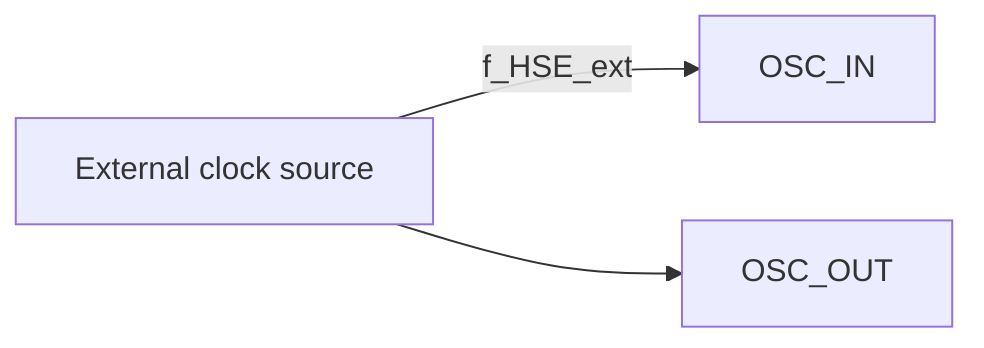
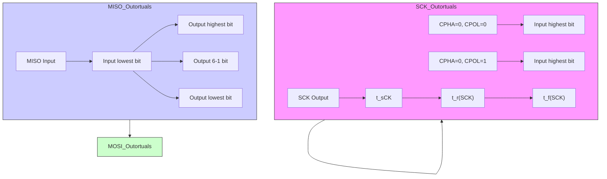
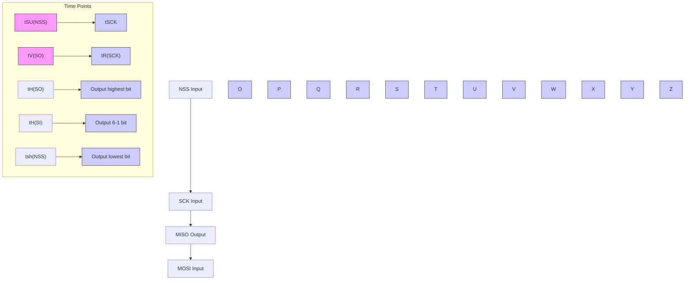
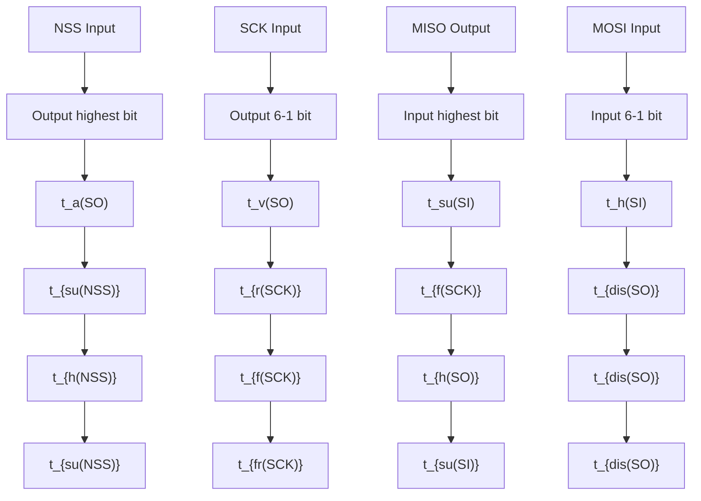

# 概述

CH32V003 系列是基于青稞 RISC-V2A 内核设计的工业级通用微控制器，支持 48MHz 系统主频，具有宽压、单线调试、低功耗、超小封装等特点。提供常用的外设功能，内置 1 组 DMA 控制器、1 组 10 位模数转换 ADC、1 组运放比较器、多组定时器、标准通讯接口如 USART、I2C、SPI 等。产品额定工作电压为 3.3V 或 5V，工作温度范围为 $-40^{\circ}C \sim 85^{\circ}C$ 工业级。

# 产品特性

# - 内核 Core

- 青稞 32 位 RISC-V 内核，RV32EC 指令集  
- 快速可编程中断控制器+硬件中断堆栈  
- 支持 2 级中断嵌套  
- 支持系统主频 48MHz

# - 存储器

- 2KB 易失数据存储区 SRAM   
- 16KB 程序存储区 CodeFlash   
- 1920B 系统引导程序存储区 BootLoader   
- 64B 系统非易失配置信息存储区  
- 64B 用户自定义信息存储区

# - 电源管理和低功耗

- 系统供电 $V_{DD}$ 额定：3.3V 或 5V  
- 低功耗模式：睡眠、待机

# - 系统时钟、复位

- 内置出厂调校的 24MHz 的 RC 振荡器  
- 内置 128KHz 的 RC 振荡器  
- 外部支持 4\~25MHz 高速振荡器  
- 上/下电复位、可编程电压监测器

# ● 7 路通用 DMA 控制器

- 7个通道，支持环形缓冲区管理  
- 支持 TIMx/ADC/USART/I2C/SPI

# ● 1 组运放、比较器：连接 ADC 和 TIM2

# ● 1 组 10 位模数转换 ADC

- 模拟输入范围： $0 \sim V_{DD}$   
- 8 路外部信号+2 路内部信号通道  
- 支持外部延迟触发

# - 多组定时器

- 1 个 16 位高级定时器，提供死区控制和紧急刹车，提供用于电机控制的 PWM 互补输出  
- 1 个 16 位通用定时器，提供输入捕获/输出比较/PWM/脉冲计数及增量编码器输入  
- 2个看门狗定时器（独立和窗口型）  
- 系统时基定时器：32 位计数器

# ● 标准通讯接口

- 1 个 USART 接口   
- 1 个 I2C 接口  
- 1 个 SPI 接口

# - GPIO 端口

- 3 组 GPIO 端口，18 个 I/O 口  
- 映射一个外部中断

● 安全特性：96 位芯片唯一 ID  
- 调试模式：串行单线调试接口  
- 封装形式：SOP、TSSOP、QFN

<table><tr><td>型号</td><td>闪存</td><td>SRAM</td><td>引脚数</td><td>通用I/O</td><td>高级定时器</td><td>通用定时器</td><td>看门狗</td><td>系统时钟源</td><td>ADC通道数</td><td>SPI</td><td>I2C</td><td>USART</td><td>封装形式</td></tr><tr><td>CH32V003F4P6</td><td rowspan="2">16K</td><td rowspan="2">2K</td><td rowspan="2">20</td><td rowspan="2">18</td><td rowspan="2">1</td><td rowspan="2">1</td><td rowspan="2">2</td><td rowspan="2">3</td><td rowspan="2">8</td><td rowspan="2">1</td><td rowspan="2">1</td><td rowspan="2">1</td><td>TSSOP20</td></tr><tr><td>CH32V003F4U6</td><td>QFN20</td></tr><tr><td>CH32V003A4M6</td><td>16K</td><td>2K</td><td>16</td><td>14</td><td>1</td><td>1</td><td>2</td><td>3</td><td>6</td><td rowspan="2">-</td><td>1</td><td>1</td><td>SOP16</td></tr><tr><td>CH32V003J4M6</td><td>16K</td><td>2K</td><td>8</td><td>6</td><td>1</td><td>1</td><td>2</td><td>3</td><td>6</td><td>1</td><td>1</td><td>SOP8</td></tr></table>

# 第 1 章 规格信息

# 1.1 系统架构

微控制器基于 RISC-V 指令集的青稞 V2A 设计，其架构中将内核、仲裁单元、DMA 模块、SRAM 存储等部分通过多组总线实现交互。设计中集成通用 DMA 控制器以减轻 CPU 负担、提高访问效率，同时兼有数据保护机制，时钟自动切换保护等措施增加了系统稳定性。下图是系列产品内部总体架构框图。

图 1-1 系统框图  
```mermaid
graph TD
    SWIO --> RISC-V["V2A"]
    RISC-V --> PFIC["1-wire SDI"]
    RISC-V --> RV32EC["RV32EC"]
    RISC-V --> DMA7Channels["DMA 7 Channels"]
    DMA7Channels --> MUX["MUX"]
    MUX --> FLASH_CTRL["FLASH CTRL"]
    FLASH_CTRL --> Flash_Memory["Flash Memory"]
    Flash_Memory --> Reset&MUX_DIV["Reset & MUX & DIV"]
    Reset&MUX_DIV --> SYSCLK["SYSCLK"]
    Reset&MUX_DIV --> HSI_RC["HSI-RC"]
    Reset&MUX_DIV --> HSE["HSE"]
    Reset&MUX_DIV --> LSI_RC["LSI-RC"]
    SystemBus --> RISC-V
    SystemBus --> DMA7Channels
    DMA7Channels --> SRAM["SRAM"]
    SRAM --> AHBCLK["AHBCLK"]
    AHBCLK --> WWDG["WWDG"]
    AHBCLK --> IWDG["IWDG"]
    AHBCLK --> EXTI["EXTI"]
    AHBCLK --> EXTEN["EXTEN"]
    AHBCLK --> ADC["ADC"]
    ADC --> TIM2_CH1["TIM2_CH1"]
    TIM2_CH1 --> TIM2["TIM2"]
    TIM2 --> RSXTTX["RX, TX, CTS, RTS, CK"]
    TIM2 --> USART["USART"]
    ADC --> Amplify["Amplify"]
    Amplify --> OPAPx["OPAPx"]
    Amplify --> OPANx["OPANx (x=0,1)"]
    OPAPx --> Adder["+"]
    OPANx --> Adder
    Adder --> Compare["Compare"]
    Compare --> OPAO["OPAO"]
    OPAO --> ADC
    ADC --> PWR["PWR"]
    ADC --> I2C["I2C"]
    ADC --> AFIO["AFIO"]
    ADC --> GPIOA["GPIOA"]
    ADC --> GPIOC["GPIOC"]
    ADC --> GPIOD["GIYOD"]
    ADC --> TIM1["TIM1"]
    TIM1 --> 4Channel["4 channels, ETR"]
    TIM1 --> 3Complementary["3 complementary Channels ETR, BIKN"]
    TIM1 --> SPI["SPI"]
    SPI --> MOSI["MOSI, MISO, SCK, NSS"]
    
    subgraph Power Supply
        RISC-V
        RISC-V_RISC-V
        DSP
        DSP_RISC-V
        DSP_RISC-V_RISC-V_RISC-V_RISC-V_RISC-V_RISC-V_RISC-V_RISC-V_RISC-V_RISC-V_RISC-V_RISC-V_RISC-V_RISC-V_RISC-V_RISC-V_RISC-V_RISC-V_RISC-V_RISC-V_RISC-V_RISC-V_RISC-V_RISC-V_RISC-V_RISC-V_RISC-V_RISC-V_RISC-V_RISC-V_RISC-V_RISC-V_RISC-V_RISC-V_DVD
        @VDD_POR | PDR_PVD
        V_DD:2.7V~5.5V_V_SS
        Reset & MUX & DIV
        *2
        HSI-RC
        HSE
        LSI-RC
        GPIO
        IWDG_CLK
        PWR_CLK
        OSC_IN
        OSC_OUT
    end
```

# 1.2 存储器映射表

图 1-2 存储器地址映射  

*[figure omitted]*

# 1.3 时钟树

系统中引入 3 组时钟源：内部高频 RC 振荡器（HSI）、内部低频 RC 振荡器（LSI）、外接高频振荡器（HSE）。其中，低频时钟源为独立看门狗提供了时钟基准。高频时钟源直接或者间接通过 2 倍频后输出为系统总线时钟（SYSCLK），系统时钟再由各预分频器提供了 AHB 域外设控制时钟及采样或接口输出时钟，部分模块工作需要由 PLL 时钟直接提供。

图 1-3 时钟树框图  
```mermaid
graph TD
    A["128kHz LSI RC"] -->|to GPIO(internal,to time)| B["IWDGCLK"]
    A -->|to IWDG| C["to PWR(low power clock source)"]
    B --> D["RCC_CFGRO"]
    C --> E["SW"]
    D --> F["PLL SRC"]
    E --> G["*2"]
    F --> H["PLLCLK"]
    G --> I["/3"]
    H --> J["to Flash(time base)"]
    I --> K["24MHz HSI RC"]
    J --> L["HSI"]
    K --> M["HSE"]
    L --> N["CSS"]
    M --> O["MCO"]
    N --> P["CS"]
    Q["OSC_IN"] --> R["4~25MHz HSE OSC"]
    S["OSC_OUT"] --> T["MCO[1:0"]]
    U["AHB prescaler /1,2.../256"] --> V["/8"]
    V --> W["to Core System Timer"]
    W --> X["FCLK core free running clock"]
    X --> Y["to SRAM/DMA"]
    Y --> Z["peripheral clock enable"]
    Z --> AA["to AHB peripherals"]
    AA --> AB["peripheral clock enable"]
    AB --> AC["to TIM2"]
    AC --> AD["peripheral clock enable"]
    AD --> AE["to TIM1"]
    AE --> AF["/2,,/4,,/6,,/8,,/12,,/16...,/64,,/96,,/128"]
    AF --> AG["ADCPRE to ADC"]
    AG --> AH["/4096"]
    AH --> AI["to WWDG"]
    AI --> AJ["peripheral clock enable"]
```

# 1.4 功能概述

# 1.4.1 RISC-V2A 处理器

RISC-V2A 支持 RISC-V 指令集 EC 子集。处理器内部以模块化管理，包含快速可编程中断控制器（PFIC）、扩展指令支持等单元。总线与外部单元模块相连，实现外部功能模块和内核的交互。RV32EC 指令集，小端数据模式。

处理器以其极简指令集、多种工作模式、模块化定制扩展等特点可以灵活应用不同场景微控制器设计，例如小面积低功耗嵌入式场景。

- 支持机器模式  
- 快速可编程中断控制器（PFIC）  
● 2 级硬件中断堆栈   
- 串行单线调试接口  
- 自定义扩展指令

# 1.4.2 片上存储器

内置 2K 字节 SRAM 区，用于存放数据，掉电后数据丢失。

内置 16K 字节程序闪存存储区（Code FLASH），用于用户的应用程序和常量数据存储。

内置 1920 字节系统存储区（System FLASH），用于系统引导程序存储（厂家固化自举加载程序）。

64 字节用于系统非易失配置信息存储区，64 字节用于用户选择字存储区。

支持 Boot 和用户代码互相跳转。

# 1.4.3 供电方案

$V_{DD} = 2.7 \sim 5.5V$ ：为 I/O 引脚和内部调压器供电（使用 ADC 时， $V_{DD}$ 如小于 2.9V 则性能逐渐变差）。

# 1.4.4 供电监控器

本产品内部集成了上电复位(POR)/掉电复位(PDR)电路，该电路始终处于工作状态，保证系统在供电超过2.7V时工作；当 $V_{DD}$ 低于设定的阈值( $V_{POR/PDR}$ )时，置器件于复位状态，而不必使用外部复位电路。

另外系统设有一个可编程的电压监测器（PVD），需要通过软件开启，用于比较 $V_{DD}$ 供电与设定的阈值 $V_{PVD}$ 的电压大小。打开 PVD 相应边沿中断，可在 $V_{DD}$ 下降到 PVD 阈值或上升到 PVD 阈值时，收到中断通知。关于 $V_{POR/PDR}$ 和 $V_{PVD}$ 的值参考第 3 章。

# 1.4.5 电压调节器

复位后，调节器自动开启，根据应用方式有两个操作模式

● 开启模式：正常的运行操作，提供稳定的内核电源  
● 低功耗模式：CPU 停止，系统自动进入待机模式

# 1.4.6 低功耗模式

系统支持两种低功耗模式，可以针对低功耗、短启动时间和多种唤醒事件等条件下选择达到最佳的平衡。

# - 睡眠模式

在睡眠模式下，只有 CPU 时钟停止，但所有外设时钟供电正常，外设处于工作状态。此模式是最浅低功耗模式，但可以达到最快唤醒。

退出条件：任意中断或唤醒事件。

# - 待机模式

置位 PDDS、SLEEPDEEP 位，执行 WFI/WFE 指令进入。内核部分的供电被关闭，HSI 的 RC 振荡器和 HSE 晶体振荡器也被关闭，此模式下可以达到最低的电能消耗。

退出条件：任意外部中断/事件（EXTI 信号）、NRST 上的外部复位信号、IWDG 复位，其中 EXTI 信

号包括 18 个外部 I/O 口之一、PVD 的输出、AWU 自动唤醒。

# 1.4.7 快速可编程中断控制器（PFIC）

产品内置快速可编程中断控制器（PFIC），最多支持255个中断向量，以最小的中断延迟提供了灵活的中断管理功能。当前产品管理了4个内核私有中断和23个外设中断管理，其他中断源保留。PFIC的寄存器均可以在机器特权模式下访问。

● 2 个可单独屏蔽中断   
● 提供一个不可屏蔽中断 NMI  
● 支持硬件中断堆栈(HPE)，无需指令开销  
● 提供 2 路免表中断 (VTF)  
- 向量表支持地址或指令模式  
● 支持 2 级中断嵌套  
● 支持中断尾部链接功能

# 1.4.8 外部中断/事件控制器（EXTI）

外部中断/事件控制器总共包含8个边沿检测器，用于产生中断/事件请求。每个中断线都可以独立地配置其触发事件（上升沿或下降沿或双边沿），并能够单独地被屏蔽；挂起寄存器维持所有中断请求状态。EXTI可以检测到脉冲宽度小于内部AHB的时钟周期。18个通用I/O口都可选择连接到同一个个外部中断源。

# 1.4.9 通用 DMA 控制器

系统内置了 1 组通用 DMA 控制器，管理 7 个通道，灵活处理存储器到存储器、外设到存储器和存储器到外设间的高速数据传输，支持环形缓冲区方式。每个通道都有专门的硬件 DMA 请求逻辑，支持一个或多个外设对存储器的访问请求，可配置访问优先权、传输长度、传输的源地址和目标地址等。

DMA 用于主要的外设包括：通用/高级定时器 TIMx、ADC、USART、I2C、SPI。

注：DMA 和 CPU 经过仲裁器仲裁之后对系统 SRAM 进行访问。

# 1.4.10 时钟和启动

系统时钟源 HSI 默认开启，在没有配置时钟或者复位后，内部 24MHz 的 RC 振荡器作为默认的 CPU 时钟，随后可以另外选择外部 4\~25MHz 时钟或 PLL 时钟。当打开时钟安全模式后，如果 HSE 用作系统时钟（直接或间接），此时检测到外部时钟失效，系统时钟将自动切换到内部 RC 振荡器，同时 HSE 和 PLL 自动关闭；对于关闭时钟的低功耗模式，唤醒后系统也将自动地切换到内部的 RC 振荡器。如果使能了时钟中断，软件可以接收到相应的中断。

# 1.4.11 ADC（模拟/数字转换器）

产品内置 1 个 10 位的模拟/数字转换器 (ADC)，共用多达 8 个外部通道和 2 个内部通道采样，可编程的通道采样时间，可以实现单次、连续、扫描或间断转换。提供模拟看门狗功能允许非常精准地监控一路或多路选中的通道，用于监测通道信号电压。支持外部事件触发转换，触发源包括片上定时器的内部信号和外部引脚。支持使用 DMA 操作。支持外部触发延迟功能，使能该功能后，当外部触发沿产生时，控制器根据配置的延迟时间将触发信号进行延迟，延迟时间到即刻触发 ADC 转换。

# 1.4.12 定时器及看门狗

系统中的定时器包括 1 个高级定时器、1 个通用定时器、2 个看门狗定时器以及系统时基定时器。

# - 高级定时器

高级定时器是一个 16 位的自动装载递加/递减计数器，具有 16 位可编程的预分频器。除了完整的

通用定时器功能外，可以被看成是分配到6个通道的三相PWM发生器，具有带死区插入的互补PWM输出功能，允许在指定数目的计数器周期之后更新定时器进行重复计数周期，刹车功能等。高级定时器的很多功能都与通用定时器相同，内部结构也相同，因此高级定时器可以通过定时器链接功能与其他TIM定时器协同操作，提供同步或事件链接功能。

# ● 通用定时器

通用定时器是一个 16 位的自动装载递加/递减计数器，具有一个可编程的 16 位预分频器以及 4 个独立的通道，每个通道都支持输入捕获、输出比较、PWM 生成和单脉冲模式输出。还能通过定时器链接功能与高级定时器共同工作，提供同步或事件链接功能。在调试模式下，计数器可以被冻结，同时 PWM 输出被禁止，从而切断由这些输出所控制的开关。任意通用定时器都能用于产生 PWM 输出。每个定时器都有独立的 DMA 请求机制。这些定时器还能够处理增量编码器的信号，也能处理 1 至 3 个霍尔传感器的数字输出。

# - 独立看门狗

独立看门狗是一个自由运行的 12 位递减计数器，支持 7 种分频系数。由一个内部独立的 128KHz 的 RC 振荡器（LSI）提供时钟；LSI 独立于主时钟，可运行于待机模式。IWDG 在主程序之外，可以完全独立工作，因此，用于在发生问题时复位整个系统，或作为一个自由定时器为应用程序提供超时管理。通过选项字节可以配置成是软件或硬件启动看门狗。在调试模式下，计数器可以被冻结。

# - 窗口看门狗

窗口看门狗是一个 7 位的递减计数器，并可以设置成自由运行。可以被用于在发生问题时复位整个系统。其由主时钟驱动，具有早期预警中断功能；在调试模式下，计数器可以被冻结。

# ● 系统时基定时器（SysTick）

青稞微处理器内核自带一个 32 位递增的计数器，用于产生 SYSTICK 异常（异常号：15），可专用于实时操作系统，为系统提供 “心跳” 节律，也可当成一个标准的 32 位计数器。具有自动重加载功能及可编程的时钟源。

# 1.4.13 通用同步/异步收发器（USART）

产品提供了 1 组通用同步/异步收发器（USART）。支持全双工异步通信、同步单向通信以及半双工单线通信，也支持 LIN（局部互连网），兼容 ISO7816 的智能卡协议和 IrDA SIRENDEC 传输编解码规范，以及调制解调器（CTS/RTS 硬件流控）操作，还允许多处理器通信。其采用分数波特率发生器系统，并支持 DMA 操作连续通讯。

# 1.4.14 串行外设接口（SPI）

1 个串行外设 SPI 接口，提供主或从操作，动态切换。支持多主模式，全双工或半双工同步传输，支持基本的 SD 卡和 MMC 模式。可编程的时钟极性和相位，数据位宽提供 8 或 16 位选择，可靠通信的硬件 CRC 产生/校验，支持 DMA 操作连续通讯。

# 1.4.15 I2C 总线

1 个 I2C 总线接口，能够工作于多主机模式或从模式，完成所有 I2C 总线特定的时序、协议、仲裁等，支持标准和快速两种通讯速度。

I2C 接口提供 7 位或 10 位寻址，并且在 7 位从模式时支持双从地址寻址。内置了硬件 CRC 发生器 / 校验器。

# 1.4.16 通用输入输出接口（GPIO）

系统提供了 3 组 GPIO 端口, 共 18 个 GPIO 引脚。每个引脚都可以由软件配置成输出 (推挽或开漏)、输入 (带或不带上拉或下拉) 或复用的外设功能端口。多数 GPIO 引脚都与数字或模拟的复用外设共用。除了具有模拟输入功能的端口，所有的 GPIO 引脚都有大电流通过能力。提供锁定机制冻结 IO 配置，以避免意外的写入 I/O 寄存器。

系统中10引脚电源由 $\mathrm{V_{DD}}$ 提供，通过改变 $\mathrm{V_{DD}}$ 供电将改变10引脚输出电平高值来适配外部通讯接口电平。具体引脚请参考引脚描述。

# 1.4.17 运放/比较器（OPA）

产品内置 1 组运放/比较器，内部选择关联到 ADC 和 TIM2（CH1）外设，其输入和输出均可通过更改配置对多个通道进行选择。支持将外部模拟小信号被放大送入 ADC 以实现小信号 ADC 转换，也可以完成信号比较器功能，比较结果由 GPIO 输出或者直接接入 TIMx 的输入通道。

# 1.4.18 串行单线调试接口（1-wire SDI Serial Debug Interface）

内核自带一个串行单线调试的接口，SWIO 引脚（Single Wire Input Output）。系统上电或复位后默认调试接口引脚功能开启。使用单线仿真调试接口时必须开启 HSI 时钟。

# 第 2 章 引脚信息

# 2.1 引脚排列

CH32V003F4P6   

```text_image
1
2
3
4
5
6
7
8
9
10
PD4/A7/UCK/T2CH1ETR/OPO/T1CH4ETR_
PD5/A5/UTX/T2CH4_/URX_
PD6/A6/URX/T2CH3_/UTX_
PD7/NRST/T2CH4/OPP1/UCK_
PA1/OSCI/A1/T1CH2/OPN0_
PA2/OSCO/A0/T1CH2N/OPP0/AETR2_
VSS_
PD0/T1CH1N/OPN1/SDA_/UTX_
VDD_
PC0/T2CH3/UTX_/NSS_/T1CH3_
PD3/A4/T2CH2/AETR/UCTS/T1CH4_
PD2/A3/T1CH1/T2CH3_/T1CH2N_
PD1/SWIO/AETR2/T1CH3N/SCL_/URX_
PC7/MISO/T1CH2_/T2CH2_/URTS_
PC6/MOSI/T1CH1CH3N_/UCTS_/SDA_
PC5/SCK/T1ETR/T2CH1ETR_/SCL_/UCK_/T1CH3_
PC4/A2/T1CH4/MCO/T1CH1CH2N_
PC3/T1CH3/T1CH1N_/UCTS_
PC2/SCL/URTS/T1BKIN/AETR_/T2CH2_/T1ETR_
PC1/SDA/NSS/T2CH4_/T2CH1ETR_/T1BKIN_/URX_
20
19
18
17
16
15
14
13
12
11
```


CH32V003F4U6


```text_image
0
VSS
1 PD7/NRST/T2CH4
2 PD7/OPP1/UCK_
3 PA1/OSCI/A1
4 PA1/T1CH2/OPN0
5 PA2/OSCO/A0/T1CH2N
6 VSS
5 PD0/T1CH1N/OPN1
6 PD0/SDA_UTX_
7 VDD
8 PC0/T2CH3/UTX_
9 PC0/NSS_T1CH3_
10 PC1/SDA/NSS/T2CH4_
11 PC1/T2CH1ETR_T1BKIN_
12 PC2/SCL/URTS/T1BKIN_
13 PC2/AETR_T2CH2_T1ETR_
14 PC3/T1CH3/T1CH1_
15 PC4/A2/T1CH4/MCO_
16 PC4/T1CH1CH2N_
17 PC5/SCK/T1ETR/T2CH1ETR_
18 PC5/SCL_UCK_T1CH3_
19 PC3/UCTS_
20 PD6/A6/UXR_
21 PD5/T2CH3_UTX_
22 PD5/A5/UTX_
23 PD5/T2CH4_URX_
24 PD4/A7/UCK/T2CH1ETR_
25 PD4/OPO/T1CH4ETR_
26 PD3/A4/T2CH2/AETR_
27 PD3/UCTS/T1CH4_
28 PD2/A3/T1CH1/T2CH3_
29 PD2/T1CH2N_
30 PD1/SWIO/AETR2_
31 PD1/T1CH3N/SCL_URX_
32 PC7/MISO/T1CH2_
33 PC7/T2CH2_URTS_
34 PC6/MOSI/T1CH1CH3_
35 PC6/UCTS_SDA_
36 PC5/SCK/T1ETR/T2CH1ETR_
37 PC5/SCL_UCK_T1CH3_
38 PC4/A2/T1CH4/MCO_
39 PC4/T1CH1CH2N_
40
```


CH32V003A4M6   

```text_image
PC1/SDA/NSS/T2CH4_/T2CH1ETR_/T1BKIN_/URX_ PC0/T2CH3/UTX_/NSS_/T1CH3_
PC2/SCL/URTS/T1BKIN/AETR_/T2CH2_/T1ETR_ VDD
PC3/T1CH3/T1CH1N_/UCTS_ VSS
PC4/A2/T1CH4/MCO/T1CH1CH2N PA2/OSCO/A0/T1CH2N/OPP0/AETR2
PC6/MOSI/T1CH1CH3N_/UCTS_/SDA_ PA1/OSCI/A1/T1CH2/OPN0
PC7/MISO/T1CH2_/T2CH2_/URTS PD7/NRST/T2CH4/OPP1/UCK_
PD1/SWIO/AETR2/T1CH3N/SCL_/URX PD6/A6/URX/T2CH3_/UTX_
PD4/A7/UCK/T2CH1ETR/OPO/T1CH4ETR_ PD5/A5/UTX/T2CH4_/URX_
16
15
14
13
12
11
10
9
```


CH32V003J4M6   

```text_image
1 PD6/A6/URX/T2CH3_/UTX_
PA1/OSCI/A1/T1CH2/OPN0
VSS
2 PD4/A7/UCK/T2CH1ETR/OPO/T1CH4ETR_
PD5/A5/UTX/T2CH4_/URX_
PD1/SWIO/AETR2/T1CH3N/SCL_/URX_
PC4/A2/T1CH4/MCO/T1CH1CH2N_
3 PA2/OSCO/A0/T1CH2N/OPP0/AETR2_
PC2/SCL/URTS/T1BKIN_
PC2/AETR_/T2CH2_/T1ETR_
4 VDD PC1/SDA/NSS/T2CH4_/T2CH1ETR_/T1BKIN_/URX_
5
8
7
6
5
```


注：引脚图中复用功能均为缩写。

示例：A:ADC\_, A7(ADC\_IN7)

```txt
T:TIME_, T2CH4 (TIM2_CH4)
U:USART, URX (USART_RX)
OP:OPA_, OPO (OPA_OUT)、OPP1 (OPA_P1)
OSCI (OSCIN)
OSCO (OSCOUT)
SDA (I2C_SDA)
SCL (I2C_SCL)
SCK (SPI_SCK)
NSS (SPI_NSS)
MOSI (SPI_MOSI)
MISO (SPI_MISO)
AETR (ADC_ETR) 
```

# 2.2 引脚描述

表 2-1 引脚定义

注意，下表中的引脚功能描述针对的是所有功能，不涉及具体型号产品。不同型号之间外设资源有差异，查看前请先根据产品型号资源表确认是否有此功能。

<table><tr><td colspan="4">引脚编号</td><td rowspan="2">引脚名称</td><td rowspan="2">引脚类型</td><td rowspan="2">主功能(复位后)</td><td rowspan="2">默认复用功能</td><td rowspan="2">重映射功能</td></tr><tr><td>SOP16</td><td>TSSOP20</td><td>QFN20</td><td>SOP8</td></tr><tr><td>-</td><td>-</td><td>0</td><td>-</td><td>VSS</td><td>P</td><td>VSS</td><td>-</td><td>-</td></tr><tr><td>8</td><td>1</td><td>18</td><td>8</td><td>PD4</td><td>I/O/A</td><td>PD4</td><td> $UCK/T2CH1ETR^{(1)}/A7/OP0$ </td><td>TIETR_2/T1CH4_3</td></tr><tr><td>9</td><td>2</td><td>19</td><td>8</td><td>PD5</td><td>I/O/A</td><td>PD5</td><td>UTX/A5</td><td>T2CH4_3/URX_2</td></tr><tr><td>10</td><td>3</td><td>20</td><td>1</td><td>PD6</td><td>I/O/A</td><td>PD6</td><td>URX/A6</td><td>T2CH3_3/UTX_2</td></tr><tr><td>11</td><td>4</td><td>1</td><td>-</td><td>PD7</td><td>I/O/A</td><td>PD7</td><td>NRST/T2CH4/OPP1</td><td>UCK_1/UCK_2/T2CH4_2</td></tr><tr><td>12</td><td>5</td><td>2</td><td>1</td><td>PA1</td><td>I/O/A</td><td>PA1</td><td>T1CH2/A1/OPNO</td><td>OSCI/T1CH2_2</td></tr><tr><td>13</td><td>6</td><td>3</td><td>3</td><td>PA2</td><td>I/O/A</td><td>PA2</td><td>T1CH2N/A0/OPPO</td><td>OSCO/AETR2_1/T1CH2N_2</td></tr><tr><td>14</td><td>7</td><td>4</td><td>2</td><td>VSS</td><td>P</td><td>VSS</td><td>-</td><td>-</td></tr><tr><td>-</td><td>8</td><td>5</td><td>-</td><td>PDO</td><td>I/O/A</td><td>PDO</td><td>T1CH1N/OPN1</td><td>SDA_1/UTX_1/T1CH1N_2</td></tr><tr><td>15</td><td>9</td><td>6</td><td>4</td><td>VDD</td><td>P</td><td>VDD</td><td>-</td><td>-</td></tr><tr><td>16</td><td>10</td><td>7</td><td>-</td><td>PCO</td><td>I/O</td><td>PCO</td><td>T2CH3</td><td>NSS_1/UTX_3/T2CH3_2/T1CH3_1</td></tr><tr><td>1</td><td>11</td><td>8</td><td>5</td><td>PC1</td><td>I/O/FT</td><td>PC1</td><td>SDA/NSS</td><td>T1BKIN_1/T2CH4_1T2CH1ETR $^{(1)}$ _2/URX_3/T2CH1ETR $^{(1)}$ _3/T1BKIN_3</td></tr><tr><td>2</td><td>12</td><td>9</td><td>6</td><td>PC2</td><td>I/O/FT</td><td>PC2</td><td>SCL/URTS/T1BKIN</td><td>AETR_1/T2CH2_1/T1ETR_3/URTS_1/T1BKIN_2</td></tr><tr><td>3</td><td>13</td><td>10</td><td>-</td><td>PC3</td><td>I/O</td><td>PC3</td><td>T1CH3</td><td>T1CH1N_1/UCTS_1/T1CH3_2/T1CH1N_3</td></tr><tr><td>4</td><td>14</td><td>11</td><td>7</td><td>PC4</td><td>I/O/A</td><td>PC4</td><td>T1CH4/MCO/A2</td><td>T1CH2N_1/T1CH4_2/T1CH1_3</td></tr><tr><td>-</td><td>15</td><td>12</td><td>-</td><td>PC5</td><td>I/O/FT</td><td>PC5</td><td>SCK/T1ETR</td><td>T2CH1ETR $^{(1)}$ _1/SCL_2/SCL_3/UCK_3/T1ETR_1/T1CH3_3/SCK_1</td></tr><tr><td>5</td><td>16</td><td>13</td><td>-</td><td>PC6</td><td>I/O/FT</td><td>PC6</td><td>MOSI</td><td>T1CH1_1/UCTS_2/SDA_2/SDA_3/UCTS_3/T1CH3N_3/MOSI_1</td></tr><tr><td>6</td><td>17</td><td>14</td><td>-</td><td>PC7</td><td>I/O</td><td>PC7</td><td>MISO</td><td>T1CH2_1/URTS_2/T2CH2_3/URTS_3/T1CH2_3/MISO_1</td></tr><tr><td>7</td><td>18</td><td>15</td><td>8</td><td>PD1</td><td>I/O/A</td><td>PD1</td><td>SWIO/T1CH3N/AETR2</td><td>SCL_1/URX_1/T1CH3N_1/T1CH3N_2</td></tr><tr><td>-</td><td>19</td><td>16</td><td>-</td><td>PD2</td><td>I/O/A</td><td>PD2</td><td>T1CH1/A3</td><td>T2CH3_1/T1CH2N_3/T1CH1_2</td></tr><tr><td>-</td><td>20</td><td>17</td><td>-</td><td>PD3</td><td>I/O/A</td><td>PD3</td><td>A4/T2CH2/AETR/UCTS</td><td>T2CH2_2/T1CH4_1</td></tr></table>

注：1. TIM2\_CH1、TIM2\_ETR;

2. 重映射功能下划线后的数值表示 AFIO 寄存器中相对应位的配置值。例如：T1CH4\_3 表示 AFIO 寄存器相应位配置为 11b；  
3. 表格缩写解释：

I = TTL/CMOS 电平斯密特输入；

O = CMOS 电平三态输出;

P = 电源;

FT = 耐受5V;

A = 模拟信号输入或输出。

# 2.3 引脚复用功能

注意，下表中的引脚功能描述针对的是所有功能，不涉及具体型号产品。不同型号之间外设资源有差异，查看前请先根据产品型号资源表确认是否有此功能。表2-2 引脚复用和重映射功能

<table><tr><td>复用引脚</td><td>ADC</td><td>TIM1</td><td>TIM2</td><td>USART</td><td>SYS</td><td>I2C</td><td>SPI</td><td>SWIO</td><td>OPA</td></tr><tr><td>PA1</td><td>A1</td><td>T1CH2/T1CH2_2</td><td></td><td></td><td>OSCI</td><td></td><td></td><td></td><td>OPNO</td></tr><tr><td>PA2</td><td>A0/AETR2_1</td><td>T1CH2N/T1CH2N_2</td><td></td><td></td><td>OSCO</td><td></td><td></td><td></td><td>OPPO</td></tr><tr><td>PCO</td><td></td><td>T1CH3_1</td><td>T2CH3/T2CH3_2</td><td>UTX_3</td><td></td><td></td><td>NSS_1</td><td></td><td></td></tr><tr><td>PC1</td><td></td><td>T1BKIN_1/T1BKIN_3</td><td> $T2CH4_1/T2CH1ETR^{(1)}_2/T2CH1ETR^{(1)}_3$ </td><td>URX_3</td><td></td><td>SDA</td><td>NSS</td><td></td><td></td></tr><tr><td>PC2</td><td>AETR_1</td><td>T1BKIN/T1ETR_3/T1BKIN_2</td><td>T2CH2_1</td><td>URTS/URTS_1</td><td></td><td>SCL</td><td></td><td></td><td></td></tr><tr><td>PC3</td><td></td><td>T1CH3/T1CH1N_1T1CH3_2/T1CH1N_3</td><td></td><td>UCTS_1</td><td></td><td></td><td></td><td></td><td></td></tr><tr><td>PC4</td><td>A2</td><td>T1CH4/T1CH2N_1/T1CH4_2/T1CH1_3</td><td></td><td></td><td>MCO</td><td></td><td></td><td></td><td></td></tr><tr><td>PC5</td><td></td><td>T1ETR/T1CH3_3/T1ETR_1</td><td> $T2CH1ETR^{(1)}_1$ </td><td>UCK_3</td><td></td><td>SCL_2/SCL_3</td><td>SCK/SCK_1</td><td></td><td></td></tr><tr><td>PC6</td><td></td><td>T1CH1_1/T1CH3N_3</td><td></td><td>UCTS_2/UCTS_3</td><td></td><td>SDA_2/SDA_3</td><td>MOSI/MOSI_1</td><td></td><td></td></tr><tr><td>PC7</td><td></td><td>T1CH2_1/T1CH2_3</td><td>T2CH2_3</td><td>URTS_2/URTS_3</td><td></td><td></td><td>MISO/MISO_1</td><td></td><td></td></tr><tr><td>PD0</td><td></td><td>T1CH1N/T1CH1N_2</td><td></td><td>UTX_1</td><td></td><td>SDA_1</td><td></td><td></td><td>OPN1</td></tr><tr><td>PD1</td><td>AETR2</td><td>T1CH3N/T1CH3N_1/T1CH3N_2</td><td></td><td>URX_1</td><td></td><td>SCL_1</td><td></td><td>SWIO</td><td></td></tr><tr><td>PD2</td><td>A3</td><td>T1CH1/T1CH2N_3/T1CH1_2</td><td>T2CH3_1</td><td></td><td></td><td></td><td></td><td></td><td></td></tr><tr><td>PD3</td><td>A4/AETR</td><td>T1CH4_1</td><td>T2CH2/T2CH2_2</td><td>UCTS</td><td></td><td></td><td></td><td></td><td></td></tr><tr><td>PD4</td><td>A7</td><td>T1ETR_2/T1CH4_3</td><td> $T2CH1ETR^{(1)}$ </td><td>UCK</td><td></td><td></td><td></td><td></td><td>OP0</td></tr><tr><td>PD5</td><td>A5</td><td></td><td>T2CH4_3</td><td>UTX/URX_2</td><td></td><td></td><td></td><td></td><td></td></tr><tr><td>PD6</td><td>A6</td><td></td><td>T2CH3_3</td><td>URX/UTX_2</td><td></td><td></td><td></td><td></td><td></td></tr><tr><td>PD7</td><td></td><td></td><td>T2CH4/T2CH4_2</td><td>UCK_1/UCK_2</td><td>NRST</td><td></td><td></td><td></td><td>OPP1</td></tr></table>

注：TIM2\_CH1、TIM2\_ETR。

# 第 3 章 电气特性

# 3.1 测试条件

除非特殊说明和标注，所有电压都以 $V_{ss}$ 为基准。

所有最小值和最大值将在最坏的环境温度、供电电压和时钟频率条件下得到保证。典型数值是基于常温 $25^{\circ}\mathrm{C}$ 和 $\mathrm{V_{DD}} = 3.3\mathrm{V}$ 或5V环境下用于设计指导。

对于通过综合评估、设计模拟或工艺特性得到的数据，不会在生产线进行测试。在综合评估的基础上，最小和最大值是通过样本测试后统计得到。除非特殊说明为实测值，否则特性参数以综合评估或设计保证。

供电方案：

图 3-1 常规供电典型电路  

```text_image
2.7-5.5V
VDD
0.1uF
Vss
```


# 3.2 绝对最大值

临界或者超过绝对最大值将可能导致芯片工作不正常甚至损坏。

表 3-1 绝对最大值参数表

<table><tr><td>符号</td><td>描述</td><td>最小值</td><td>最大值</td><td>单位</td></tr><tr><td> $T_A$ </td><td>工作时的环境温度</td><td>-40</td><td>85</td><td>°C</td></tr><tr><td> $T_S$ </td><td>存储时的环境温度</td><td>-40</td><td>125</td><td>°C</td></tr><tr><td> $V_{DD}-V_{SS}$ </td><td>外部主供电电压( $V_{DD}$ )</td><td>-0.3</td><td>5.5</td><td>V</td></tr><tr><td rowspan="2"> $V_{IN}$ </td><td>FT(耐受5V)引脚上的输入电压</td><td> $V_{SS}-0.3$ </td><td>5.5</td><td>V</td></tr><tr><td>其他引脚上的输入电压</td><td> $V_{SS}-0.3$ </td><td> $V_{DD}+0.3$ </td><td></td></tr><tr><td> $|\triangle V_{DD\_x}|$ </td><td>不同主供电引脚之间的电压差</td><td></td><td>50</td><td>mV</td></tr><tr><td> $|\triangle V_{SS\_x}|$ </td><td>不同接地引脚之间的电压差</td><td></td><td>50</td><td>mV</td></tr><tr><td> $V_{ESD(HBM)}$ </td><td>ESD静电放电电压(人体模型,非接触式)</td><td>4K</td><td></td><td>V</td></tr><tr><td> $I_{VDD}$ </td><td>经过 $V_{DD}$ 电源线的总电流(供应电流)</td><td></td><td>100</td><td rowspan="7">mA</td></tr><tr><td> $I_{Vs}$ </td><td>经过 $V_{SS}$ 地线的总电流(流出电流)</td><td></td><td>80</td></tr><tr><td rowspan="2"> $I_{IO}$ </td><td>任意I/O和控制引脚上的灌电流</td><td></td><td>20</td></tr><tr><td>任意I/O和控制引脚上的输出电流</td><td></td><td>-20</td></tr><tr><td rowspan="2"> $I_{INJ(PIN)}$ </td><td>HSE的OSC_IN引脚</td><td></td><td>+/-4</td></tr><tr><td>其他引脚的注入电流</td><td></td><td>+/-4</td></tr><tr><td> $\sum I_{INJ(PIN)}$ </td><td>所有IO和控制引脚的总注入电流</td><td></td><td>+/-20</td></tr></table>

# 3.3 电气参数

# 3.3.1 工作条件

表 3-2 通用工作条件

<table><tr><td>符号</td><td>参数</td><td>条件</td><td>最小值</td><td>最大值</td><td>单位</td></tr><tr><td> $F_{HCLK}$ </td><td>内部AHB时钟频率</td><td></td><td></td><td>50</td><td>MHz</td></tr><tr><td rowspan="2"> $V_{DD}$ </td><td rowspan="2">标准工作电压</td><td>未使用ADC</td><td>2.7</td><td>5.5</td><td rowspan="2">V</td></tr><tr><td>使用ADC(建议)</td><td>2.8</td><td>5.5</td></tr><tr><td> $T_A$ </td><td>环境温度</td><td></td><td>-40</td><td>85</td><td>°C</td></tr><tr><td> $T_J$ </td><td>结温度范围</td><td></td><td>-40</td><td>105</td><td>°C</td></tr></table>

表 3-3 上电和掉电条件

<table><tr><td>符号</td><td>参数</td><td>条件</td><td>最小值</td><td>最大值</td><td>单位</td></tr><tr><td rowspan="2"> $t_{VDD}$ </td><td> $V_{DD}$ 上升速率</td><td></td><td>0</td><td>∞</td><td rowspan="2">us/V</td></tr><tr><td> $V_{DD}$ 下降速率</td><td></td><td>20</td><td>∞</td></tr></table>

# 3.3.2 内置复位和电源控制模块特性

表 3-4 复位及电压监测（PDR 选择高阈值档位）

<table><tr><td>符号</td><td>参数</td><td>条件</td><td>最小值</td><td>典型值</td><td>最大值</td><td>单位</td></tr><tr><td rowspan="16"> $V_{PVD}^{(1)}$ </td><td rowspan="16">可编程电压检测器的电平选择</td><td>PLS[2:0] = 000(上升沿)</td><td></td><td>2.85</td><td></td><td>V</td></tr><tr><td>PLS[2:0] = 000(下降沿)</td><td></td><td>2.7</td><td></td><td>V</td></tr><tr><td>PLS[2:0] = 001(上升沿)</td><td></td><td>3.05</td><td></td><td>V</td></tr><tr><td>PLS[2:0] = 001(下降沿)</td><td></td><td>2.9</td><td></td><td>V</td></tr><tr><td>PLS[2:0] = 010(上升沿)</td><td></td><td>3.3</td><td></td><td>V</td></tr><tr><td>PLS[2:0] = 010(下降沿)</td><td></td><td>3.15</td><td></td><td>V</td></tr><tr><td>PLS[2:0] = 011(上升沿)</td><td></td><td>3.5</td><td></td><td>V</td></tr><tr><td>PLS[2:0] = 011(下降沿)</td><td></td><td>3.3</td><td></td><td>V</td></tr><tr><td>PLS[2:0] = 100(上升沿)</td><td></td><td>3.7</td><td></td><td>V</td></tr><tr><td>PLS[2:0] = 100(下降沿)</td><td></td><td>3.5</td><td></td><td>V</td></tr><tr><td>PLS[2:0] = 101(上升沿)</td><td></td><td>3.9</td><td></td><td>V</td></tr><tr><td>PLS[2:0] = 101(下降沿)</td><td></td><td>3.7</td><td></td><td>V</td></tr><tr><td>PLS[2:0] = 110(上升沿)</td><td></td><td>4.1</td><td></td><td>V</td></tr><tr><td>PLS[2:0] = 110(下降沿)</td><td></td><td>3.9</td><td></td><td>V</td></tr><tr><td>PLS[2:0] = 111(上升沿)</td><td></td><td>4.4</td><td></td><td>V</td></tr><tr><td>PLS[2:0] = 111(下降沿)</td><td></td><td>4.2</td><td></td><td>V</td></tr><tr><td> $V_{PVDhyst}$ </td><td>PVD迟滞</td><td></td><td></td><td>0.18</td><td></td><td>V</td></tr><tr><td rowspan="2"> $V_{POR/PDR}$ </td><td rowspan="2">上电/掉电复位阈值</td><td>上升沿</td><td>2.32</td><td>2.5</td><td>2.68</td><td>V</td></tr><tr><td>下降沿</td><td>2.3</td><td>2.48</td><td>2.66</td><td>V</td></tr><tr><td> $V_{PDRhyst}$ </td><td>PDR迟滞</td><td></td><td></td><td>20</td><td></td><td>mV</td></tr><tr><td rowspan="2"> $t_{RSTTEMPO}$ </td><td>上电复位</td><td></td><td>1</td><td> $1.5^{(2)}$ </td><td>21</td><td>mS</td></tr><tr><td>其他复位</td><td></td><td></td><td>300</td><td></td><td>uS</td></tr></table>

注：1. 常温测试值。  
2. 用户配置位 RST\_MODE 可以增加上电复位延时。

# 3.3.3 内置的参考电压

表 3-5 内置参考电压

<table><tr><td>符号</td><td>参数</td><td>条件</td><td>最小值</td><td>典型值</td><td>最大值</td><td>单位</td></tr><tr><td> $V_{REFINT}$ </td><td>内置参考电压</td><td> $T_A = -40°C~85°C$ </td><td>1.17</td><td>1.2</td><td>1.23</td><td>V</td></tr><tr><td> $T_{S\_vrefint}$ </td><td>当读出内部参考电压时,ADC的采样时间</td><td></td><td>3</td><td></td><td>500</td><td> $1/f_{ADC}$ </td></tr></table>

# 3.3.4 供电电流特性

电流消耗是多种参数和因素的综合指标，这些参数和因素包括工作电压、环境温度、I/O引脚的负载、产品的软件配置、工作频率、I/O脚的翻转速率、程序在存储器中的位置以及执行的代码等。电流消耗测量方法如下图：

图 3-2 电流消耗测量  

```text_image
Electric current
measurement
VDD
Electric current
measurement
```


微控制器处于下列条件：

常温 $V_{DD} = 3.3V$ 或 5V 情况下，测试时：所有 IO 端口配置下拉输入；测试 HSE 时打开 HSI，测试 HSI 时 HSE 关闭，HSE = 24M，HSI = 24M（已校准）；当 $F_{HCLK} = 48MHz$ 、16MHz 时，系统时钟来源 CLK\*2；打开所有外设时仅打开所有外设的时钟。使能或关闭所有外设时钟的功耗。

表 3-6-1 运行模式下典型的电流消耗，数据处理代码从内部闪存中运行 ( $V_{DD} = 3.3V$ )

<table><tr><td rowspan="2">符号</td><td rowspan="2">参数</td><td rowspan="2" colspan="2">条件</td><td colspan="2">典型值</td><td rowspan="2">单位</td></tr><tr><td>使能所有外设</td><td>关闭所有外设</td></tr><tr><td rowspan="10"> $I_{DD}^{(1)}$ </td><td rowspan="10">运行模式下的供应电流</td><td rowspan="5">外部时钟</td><td> $F_{HCLK} = 48MHz$ </td><td>7.4</td><td>5.2</td><td rowspan="10">mA</td></tr><tr><td> $F_{HCLK} = 24MHz$ </td><td>5.6</td><td>4.5</td></tr><tr><td> $F_{HCLK} = 16MHz$ </td><td>4.7</td><td>3.9</td></tr><tr><td> $F_{HCLK} = 8MHz$ </td><td>3.0</td><td>2.6</td></tr><tr><td> $F_{HCLK} = 750KHz$ </td><td>1.7</td><td>1.7</td></tr><tr><td rowspan="5">运行于高速内部RC振荡器(HSI),使用AHB预分频以减低频率</td><td> $F_{HCLK} = 48MHz$ </td><td>6.4</td><td>4.0</td></tr><tr><td> $F_{HCLK} = 24MHz$ </td><td>4.6</td><td>3.5</td></tr><tr><td> $F_{HCLK} = 16MHz$ </td><td>4.0</td><td>3.3</td></tr><tr><td> $F_{HCLK} = 8MHz$ </td><td>2.4</td><td>2.0</td></tr><tr><td> $F_{HCLK} = 750KHz$ </td><td>1.1</td><td>1.1</td></tr></table>

注：1. 以上为实测参数。  
2. 当 $V_{DD} < 3V$ 时，电流功耗会增大。

表 3-6-2 运行模式下典型的电流消耗，数据处理代码从内部闪存中运行 ( $V_{DD} = 5V$ )

<table><tr><td rowspan="2">符号</td><td rowspan="2">参数</td><td rowspan="2" colspan="2">条件</td><td colspan="2">典型值</td><td rowspan="2">单位</td></tr><tr><td>使能所有外设</td><td>关闭所有外设</td></tr><tr><td rowspan="10"> $I_{DD}^{(1)}$ </td><td rowspan="10">运行模式下的供应电流</td><td rowspan="5">外部时钟</td><td> $F_{HCLK} = 48MHz$ </td><td>9.0</td><td>6.8</td><td rowspan="10">mA</td></tr><tr><td> $F_{HCLK} = 24MHz$ </td><td>7.1</td><td>6.0</td></tr><tr><td> $F_{HCLK} = 16MHz$ </td><td>5.9</td><td>5.1</td></tr><tr><td> $F_{HCLK} = 8MHz$ </td><td>3.7</td><td>3.3</td></tr><tr><td> $F_{HCLK} = 750KHz$ </td><td>2.1</td><td>2.0</td></tr><tr><td rowspan="5">运行于高速内部RC振荡器(HSI),使用AHB预分频以减低频率</td><td> $F_{HCLK} = 48MHz$ </td><td>7.4</td><td>5.1</td></tr><tr><td> $F_{HCLK} = 24MHz$ </td><td>5.7</td><td>4.6</td></tr><tr><td> $F_{HCLK} = 16MHz$ </td><td>5.2</td><td>4.4</td></tr><tr><td> $F_{HCLK} = 8MHz$ </td><td>3.2</td><td>2.8</td></tr><tr><td> $F_{HCLK} = 750KHz$ </td><td>1.5</td><td>1.4</td></tr></table>

注：1. 以上为实测参数。

表 3-7-1 睡眠模式下典型的电流消耗，数据处理代码从内部闪存或 SRAM 中运行 ( $V_{DD} = 3.3V$ )

<table><tr><td rowspan="2">符号</td><td rowspan="2">参数</td><td rowspan="2" colspan="2">条件</td><td colspan="2">典型值</td><td rowspan="2">单位</td></tr><tr><td>使能所有外设</td><td>关闭所有外设</td></tr><tr><td rowspan="10"> $I_{DD}^{(1)}$ </td><td rowspan="10">睡眠模式下的供应电流(此时外设供电和时钟保持)</td><td rowspan="5">外部时钟</td><td> $F_{HCLK} = 48MHz$ </td><td>4.7</td><td>2.4</td><td rowspan="10">mA</td></tr><tr><td> $F_{HCLK} = 24MHz$ </td><td>2.8</td><td>1.7</td></tr><tr><td> $F_{HCLK} = 16MHz$ </td><td>2.5</td><td>1.7</td></tr><tr><td> $F_{HCLK} = 8MHz$ </td><td>1.7</td><td>1.3</td></tr><tr><td> $F_{HCLK} = 750KHz$ </td><td>1.2</td><td>1.1</td></tr><tr><td rowspan="5">运行于高速内部RC振荡器(HSI),使用AHB预分频以减低频率</td><td> $F_{HCLK} = 48MHz$ </td><td>4.1</td><td>1.7</td></tr><tr><td> $F_{HCLK} = 24MHz$ </td><td>2.1</td><td>1.0</td></tr><tr><td> $F_{HCLK} = 16MHz$ </td><td>1.8</td><td>1.0</td></tr><tr><td> $F_{HCLK} = 8MHz$ </td><td>1.0</td><td>0.6</td></tr><tr><td> $F_{HCLK} = 750KHz$ </td><td>0.5</td><td>0.4</td></tr></table>

注：1. 以上为实测参数。

表 3-7-2 睡眠模式下典型的电流消耗，数据处理代码从内部闪存或 SRAM 中运行 ( $V_{DD} = 5V$ )

<table><tr><td rowspan="2">符号</td><td rowspan="2">参数</td><td rowspan="2" colspan="2">条件</td><td colspan="2">典型值</td><td rowspan="2">单位</td></tr><tr><td>使能所有外设</td><td>关闭所有外设</td></tr><tr><td rowspan="10"> $I_{DD}^{(1)}$ </td><td rowspan="10">睡眠模式下的供应电流(此时外设供电和时钟保持)</td><td rowspan="5">外部时钟</td><td> $F_{HCLK} = 48MHz$ </td><td>4.7</td><td>2.4</td><td rowspan="10">mA</td></tr><tr><td> $F_{HCLK} = 24MHz$ </td><td>2.8</td><td>1.7</td></tr><tr><td> $F_{HCLK} = 16MHz$ </td><td>2.5</td><td>1.7</td></tr><tr><td> $F_{HCLK} = 8MHz$ </td><td>1.7</td><td>1.3</td></tr><tr><td> $F_{HCLK} = 750KHz$ </td><td>1.2</td><td>1.1</td></tr><tr><td rowspan="5">运行于高速内部RC振荡器(HSI),使用AHB预分频以减低频率</td><td> $F_{HCLK} = 48MHz$ </td><td>4.1</td><td>1.7</td></tr><tr><td> $F_{HCLK} = 24MHz$ </td><td>2.1</td><td>1.0</td></tr><tr><td> $F_{HCLK} = 16MHz$ </td><td>1.8</td><td>1.0</td></tr><tr><td> $F_{HCLK} = 8MHz$ </td><td>1.0</td><td>0.6</td></tr><tr><td> $F_{HCLK} = 750KHz$ </td><td>0.5</td><td>0.4</td></tr></table>

注：1. 以上为实测参数。

表 3-8 待机模式下典型的电流消耗

<table><tr><td>符号</td><td>参数</td><td colspan="2">条件</td><td>典型值</td><td>单位</td></tr><tr><td rowspan="4"> $I_{DD}$ </td><td rowspan="4">待机模式下的供应电流</td><td rowspan="2">LSI 打开</td><td> $V_{DD} = 3.3V$ </td><td>9.1</td><td rowspan="4">uA</td></tr><tr><td> $V_{DD} = 5V$ </td><td>9.4</td></tr><tr><td rowspan="2">LSI 关闭</td><td> $V_{DD} = 3.3V$ </td><td>7.6</td></tr><tr><td> $V_{DD} = 5V$ </td><td>8.0</td></tr></table>

注：1. 以上为实测参数。  
2. 此测试条件为：在常温 $V_{DD} = 3.3V$ 或 5V 情况下，测试初始主频 HSI=24M，所有 IO 端口配置下拉输入。

# 3.3.5 外部时钟源特性

表 3-9 来自外部高速时钟

<table><tr><td>符号</td><td>参数</td><td>条件</td><td>最小值</td><td>典型值</td><td>最大值</td><td>单位</td></tr><tr><td> $F_{HSE\_ext}$ </td><td>外部时钟频率</td><td></td><td>4</td><td>24</td><td>25</td><td>MHz</td></tr><tr><td> $V_{HSEH}^{(1)}$ </td><td>OSC_IN输入引脚高电平电压</td><td></td><td> $0.8V_{DD}$ </td><td></td><td> $V_{DD}$ </td><td>V</td></tr><tr><td> $V_{HSEL}^{(1)}$ </td><td>OSC_IN输入引脚低电平电压</td><td></td><td>0</td><td></td><td> $0.2V_{DD}$ </td><td>V</td></tr><tr><td> $C_{in(HSE)}$ </td><td>OSC_IN输入电容</td><td></td><td></td><td>5</td><td></td><td>pF</td></tr><tr><td>DuTy(HSE)</td><td>占空比</td><td></td><td>40</td><td>50</td><td>60</td><td>%</td></tr><tr><td> $I_L$ </td><td>OSC_IN输入漏电流</td><td></td><td></td><td></td><td>±1</td><td>uA</td></tr></table>

注：1. 不满足此条件可能会引起电平识别错误。

图 3-3 外部提供高频时钟源电路  


表 3-10 使用一个晶体/陶瓷谐振器产生的高速外部时钟

<table><tr><td>符号</td><td>参数</td><td>条件</td><td>最小值</td><td>典型值</td><td>最大值</td><td>单位</td></tr><tr><td> $F_{OSC\_IN}$ </td><td>谐振器频率</td><td></td><td>4</td><td>24</td><td>25</td><td>MHz</td></tr><tr><td> $R_F$ </td><td>反馈电阻(无需外置)</td><td></td><td></td><td>250</td><td></td><td>kΩ</td></tr><tr><td>C</td><td>建议的负载电容与对应晶体串行阻抗  $R_s$ </td><td> $R_s = 60\Omega^{(1)}$ </td><td></td><td>20</td><td></td><td>pF</td></tr><tr><td> $I_2$ </td><td>HSE 驱动电流</td><td> $V_{DD} = 3.3V, 20p$  负载</td><td></td><td>0.32</td><td></td><td>mA</td></tr><tr><td> $g_m$ </td><td>振荡器的跨导</td><td>启动</td><td></td><td>6.8</td><td></td><td>mA/V</td></tr><tr><td> $t_{SU(HSE)}$ </td><td>启动时间</td><td> $V_{DD}$  稳定,24M 晶体</td><td></td><td>2</td><td></td><td>ms</td></tr></table>

注：1.25M 晶体 ESR 建议不超过 60 欧，低于 25M 可适当放宽。

电路参考设计及要求：

晶体的负载电容以晶体厂商建议为准，通常情况 $C_{L1}=C_{L2}$ 。

图 3-4 外接 24M 晶体典型电路  

```text_image
C11
24MHz
Crystal
Oscillator
OSC_IN
C12
OSC_OUT
```


# 3.3.6 内部时钟源特性

表 3-11 内部高速 (HSI) RC 振荡器特性

<table><tr><td>符号</td><td>参数</td><td>条件</td><td>最小值</td><td>典型值</td><td>最大值</td><td>单位</td></tr><tr><td> $F_{HSI}$ </td><td>频率(校准后)</td><td></td><td></td><td>24</td><td></td><td>MHz</td></tr><tr><td> $DuCy_{HSI}$ </td><td>占空比</td><td></td><td>45</td><td>50</td><td>55</td><td>%</td></tr><tr><td rowspan="2"> $ACC_{HSI}$ </td><td rowspan="2">HSI振荡器的精度(校准后)</td><td>TA=0°C~70°C</td><td>-1.2</td><td></td><td>1.6</td><td>%</td></tr><tr><td>TA=-40°C~85°C</td><td>-2.2</td><td></td><td>2.2</td><td>%</td></tr><tr><td> $t_{SU(HSI)}$ </td><td>HSI振荡器启动稳定时间</td><td></td><td></td><td>10</td><td></td><td>us</td></tr><tr><td> $I_{DD(HSI)}$ </td><td>HSI振荡器功耗</td><td></td><td>120</td><td>180</td><td>270</td><td>uA</td></tr></table>

表 3-12 内部低速 (LSI) RC 振荡器特性

<table><tr><td>符号</td><td>参数</td><td>条件</td><td>最小值</td><td>典型值</td><td>最大值</td><td>单位</td></tr><tr><td> $F_{LSI}$ </td><td>频率</td><td></td><td>100</td><td>128</td><td>150</td><td>KHz</td></tr><tr><td> $DuTy_{LSI}$ </td><td>占空比</td><td></td><td>45</td><td>50</td><td>55</td><td>%</td></tr><tr><td> $t_{SU(LSI)}$ </td><td>LSI 振荡器启动稳定时间</td><td></td><td></td><td>80</td><td></td><td>us</td></tr><tr><td> $I_{DD(LSI)}$ </td><td>LSI 振荡器功耗</td><td></td><td></td><td>1.5</td><td></td><td>uA</td></tr></table>

# 3.3.7 从低功耗模式唤醒的时间

表 3-13 低功耗模式唤醒的时间 $^{(1)}$ 

<table><tr><td>符号</td><td>参数</td><td>条件</td><td>典型值</td><td>单位</td></tr><tr><td> $t_{wusleep}$ </td><td>从睡眠模式唤醒</td><td>使用 HSI RC 时钟唤醒</td><td>30</td><td>us</td></tr><tr><td> $t_{WUSTDBY}$ </td><td>从待机模式唤醒</td><td>LDO 稳定时间 + HSI RC 时钟唤醒</td><td>200</td><td>us</td></tr></table>

注：以上为实测参数。

# 3.3.8 存储器特性

表 3-14 闪存存储器特性

<table><tr><td>符号</td><td>参数</td><td>条件</td><td>最小值</td><td>典型值</td><td>最大值</td><td>单位</td></tr><tr><td> $t_{ERASE\_64}$ </td><td>页(64字节)编程时间</td><td> $T_A = -20°C~85°C$ </td><td>2.4</td><td></td><td>3.1</td><td>ms</td></tr><tr><td> $t_{ERASE}$ </td><td>页(64字节)擦除时间</td><td> $T_A = -20°C~85°C$ </td><td>2.4</td><td></td><td>3.1</td><td>ms</td></tr><tr><td> $t_{prog}$ </td><td>16位的编程时间</td><td> $T_A = -20°C~85°C$ </td><td>2.4</td><td></td><td>3.1</td><td>ms</td></tr><tr><td> $t_{ME}$ </td><td>整片擦除时间</td><td> $T_A = -20°C~85°C$ </td><td>2.4</td><td></td><td>3.1</td><td>ms</td></tr><tr><td> $V_{prog}$ </td><td>编程电压</td><td></td><td>2.8</td><td></td><td>5.5</td><td>V</td></tr></table>

注：实测操作擦写次数，非担保。  
表 3-15 闪存存储器寿命和数据保存期限

<table><tr><td>符号</td><td>参数</td><td>条件</td><td>最小值</td><td>典型值</td><td>最大值</td><td>单位</td></tr><tr><td> $N_{END}$ </td><td>擦写次数</td><td> $T_A = 25°C$ </td><td>10K</td><td> $80K^{(1)}$ </td><td></td><td>次</td></tr><tr><td> $t_{RET}$ </td><td>数据保存期限</td><td></td><td>10</td><td></td><td></td><td>年</td></tr></table>

# 3.3.9 I/0 端口特性

表 3-16 通用 I/O 静态特性

<table><tr><td>符号</td><td>参数</td><td>条件</td><td>最小值</td><td>典型值</td><td>最大值</td><td>单位</td></tr><tr><td rowspan="2"> $V_{IH}$ </td><td>标准I/0脚,输入高电平电压</td><td></td><td>0.22*( $V_{DD}-2.7$ )+1.55</td><td></td><td> $V_{DD}+0.3$ </td><td>V</td></tr><tr><td>FT 10引脚,输入高电平电压</td><td></td><td>0.22*(VDD-2.7)+1.55</td><td></td><td>5.5</td><td>V</td></tr><tr><td rowspan="2"> $V_{IL}$ </td><td>标准I/0脚,输入低电平电压</td><td rowspan="2"></td><td>-0.3</td><td></td><td>0.19*( $V_{DD}-2.7$ )+0.65</td><td>V</td></tr><tr><td>FT 10引脚,输入低电平电压</td><td>-0.3</td><td></td><td>0.19*( $V_{DD}-2.7$ )+0.65</td><td>V</td></tr><tr><td> $V_{hys}$ </td><td>施密特触发器电压迟滞</td><td></td><td>150</td><td></td><td></td><td>mV</td></tr><tr><td rowspan="2"> $I_{Ikg}$ </td><td rowspan="2">输入漏电流</td><td>标准I0端口</td><td></td><td></td><td>1</td><td rowspan="2">uA</td></tr><tr><td>FT 10端口</td><td></td><td></td><td>3</td></tr><tr><td> $R_{PU}$ </td><td>弱上拉等效电阻</td><td></td><td>35</td><td>45</td><td>55</td><td>kΩ</td></tr><tr><td> $R_{PD}$ </td><td>弱下拉等效电阻</td><td></td><td>35</td><td>45</td><td>55</td><td>kΩ</td></tr><tr><td> $C_{10}$ </td><td>I/0引脚电容</td><td></td><td></td><td>5</td><td></td><td>pF</td></tr></table>

# 输出驱动电流特性

GPIO(通用输入/输出端口)可以吸收或输出多达±8mA电流，并且吸收或输出±20mA电流(不严格达到 $V_{OL}/V_{OH}$ )。在用户应用中，所有10引脚驱动总电流不能超过3.2节给出的绝对最大额定值。

表 3-17 输出电压特性

<table><tr><td>符号</td><td>参数</td><td>条件</td><td>最小值</td><td>最大值</td><td>单位</td></tr><tr><td> $V_{OL}$ </td><td>输出低电平,8个引脚吸收电流</td><td>TTL端口, $I_{10}=+8mA$ </td><td></td><td>0.4</td><td rowspan="2">V</td></tr><tr><td> $V_{OH}$ </td><td>输出高电平,8个引脚输出电流</td><td>2.7V $< V_{DD}<5.5V$ </td><td> $V_{DD}-0.4$ </td><td></td></tr><tr><td> $V_{OL}$ </td><td>输出低电平,8个引脚吸收电流</td><td>CMOS端口, $I_{10}=+8mA$ </td><td></td><td>0.4</td><td rowspan="2">V</td></tr><tr><td> $V_{OH}$ </td><td>输出高电平,8个引脚输出电流</td><td>2.7V $< V_{DD}<5.5V$ </td><td>2.3</td><td></td></tr><tr><td> $V_{OL}$ </td><td>输出低电平,8个引脚吸收电流</td><td> $I_{10}=+20mA$ </td><td></td><td>1.3</td><td rowspan="2">V</td></tr><tr><td> $V_{OH}$ </td><td>输出高电平,8个引脚输出电流</td><td>2.7V $< V_{DD}<5.5V$ </td><td> $V_{DD}-1.3$ </td><td></td></tr></table>

注：以上条件中如果多个10引脚同时驱动，电流总和不能超过表3.2节给出的绝对最大额定值。另外多个10引脚同时驱动时，电源/地线点上的电流很大，会导致压降使内部10的电压达不到表中电源电压，从而导致驱动电流小于标称值。

表 3-18 输入输出交流特性

<table><tr><td>MODEx[1:0]配置</td><td>符号</td><td>参数</td><td>条件</td><td>最小值</td><td>最大值</td><td>单位</td></tr><tr><td rowspan="3">10(2MHz)</td><td> $F_{max(10)out}$ </td><td>最大频率</td><td>CL=50pF,  $V_{DD}$ =2.7-5.5V</td><td></td><td>2</td><td>MHz</td></tr><tr><td> $t_{f(10)out}$ </td><td>输出高至低电平的下降时间</td><td rowspan="2">CL=50pF,  $V_{DD}$ =2.7-5.5V</td><td></td><td>125</td><td>ns</td></tr><tr><td> $t_{r(10)out}$ </td><td>输出低至高电平的上升时间</td><td></td><td>125</td><td>ns</td></tr><tr><td rowspan="3">01(10MHz)</td><td> $F_{max(10)out}$ </td><td>最大频率</td><td>CL=50pF,  $V_{DD}$ =2.7-5.5V</td><td></td><td>10</td><td>MHz</td></tr><tr><td> $t_{f(10)out}$ </td><td>输出高至低电平的下降时间</td><td rowspan="2">CL=50pF,  $V_{DD}$ =2.7-5.5V</td><td></td><td>25</td><td>ns</td></tr><tr><td> $t_{r(10)out}$ </td><td>输出低至高电平的上升时间</td><td></td><td>25</td><td>ns</td></tr><tr><td rowspan="3">11(30MHz)</td><td> $F_{max(10)out}$ </td><td>最大频率</td><td>CL=50pF,  $V_{DD}$ =2.7-5.5V</td><td></td><td>30</td><td>MHz</td></tr><tr><td> $t_{f(10)out}$ </td><td>输出高至低电平的下降时间</td><td>CL=50pF,  $V_{DD}$ =2.7-5.5V</td><td></td><td>10</td><td>ns</td></tr><tr><td> $t_{r(10)out}$ </td><td>输出低至高电平的上升时间</td><td>CL=50pF,  $V_{DD}$ =2.7-5.5V</td><td></td><td>10</td><td>ns</td></tr><tr><td></td><td> $t_{EXT1pw}$ </td><td>EXTI 控制器检测到外部信号的脉冲宽度</td><td></td><td>10</td><td></td><td>ns</td></tr></table>

# 3.3.10 NRST 引脚特性

表 3-19 外部复位引脚特性

<table><tr><td>符号</td><td>参数</td><td>条件</td><td>最小值</td><td>典型值</td><td>最大值</td><td>单位</td></tr><tr><td> $V_{IL (NRST)}$ </td><td>NRST 输入低电平电压</td><td></td><td>-0.3</td><td></td><td> $0.28*(V_{DD}-1.8)+0.6$ </td><td>V</td></tr><tr><td> $V_{IH (NRST)}$ </td><td>NRST 输入高电平电压</td><td></td><td> $0.41*(V_{DD}-1.8)+1.3$ </td><td></td><td> $V_{DD}+0.3$ </td><td>V</td></tr><tr><td> $V_{hys (NRST)}$ </td><td>NRST 施密特触发器电压迟滞</td><td></td><td>150</td><td></td><td></td><td>mV</td></tr><tr><td> $R_{PU}^{(1)}$ </td><td>弱上拉等效电阻</td><td></td><td>35</td><td>45</td><td>55</td><td>kΩ</td></tr></table>

注：1. 上拉电阻是一个真正的电阻串联一个可开关的 PMOS 实现。这个 PMOS/NMOS 开关的电阻很小（约占 10%）。

电路参考设计及要求：

图 3-5 外部复位引脚典型电路  

```text_image
NRST
01 μF
VDD
RPU
```


# 3.3.11 TIM 定时器特性

表 3-20 TIMx 特性

<table><tr><td>符号</td><td>参数</td><td>条件</td><td>最小值</td><td>最大值</td><td>单位</td></tr><tr><td rowspan="2"> $t_{res(TIM)}$ </td><td rowspan="2">定时器基准时钟</td><td></td><td>1</td><td></td><td> $t_{TIMxCLK}$ </td></tr><tr><td> $f_{TIMxCLK} = 48MHz$ </td><td>20.8</td><td></td><td>ns</td></tr><tr><td rowspan="2"> $F_{EXT}$ </td><td rowspan="2">CH1至CH4的定时器外部时钟频率</td><td></td><td>0</td><td> $f_{TIMxCLK}/2$ </td><td>MHz</td></tr><tr><td> $f_{TIMxCLK} = 48MHz$ </td><td>0</td><td>24</td><td>MHz</td></tr><tr><td> $R_{esTIM}$ </td><td>定时器分辨率</td><td></td><td></td><td>16</td><td>位</td></tr><tr><td rowspan="2"> $t_{COUNTER}$ </td><td rowspan="2">当选择了内部时钟时,16位计数器时钟周期</td><td></td><td>1</td><td>65536</td><td> $t_{TIMxCLK}$ </td></tr><tr><td> $f_{TIMxCLK} = 48MHz$ </td><td>0.0208</td><td>1363</td><td>us</td></tr><tr><td rowspan="2"> $t_{MAX\_COUNT}$ </td><td rowspan="2">最大可能的计数</td><td></td><td></td><td>65535</td><td> $t_{TIMxCLK}$ </td></tr><tr><td> $f_{TIMxCLK} = 48MHz$ </td><td></td><td>1363</td><td>us</td></tr></table>

# 3.3.12 I2C 接口特性

图 3-6 I2C 总线时序图  

```text_image
SCL
t_h(STA)
t_w(SCKL)
t_f(SCL)
t_w(SCKH)
t_r(SCL)
SDA
t_f(SDA)
t_SU(SDA)
t_h(SDA)
t_SU(STO)
t_r(SDA)
Start condition
t_w(STO:STA)
Repeat start condition
Stop condition
t_SU(STA)
```


表 3-21 I2C 接口特性

<table><tr><td rowspan="2">符号</td><td rowspan="2">参数</td><td colspan="2">标准 I2C</td><td colspan="2">快速 I2C</td><td rowspan="2">单位</td></tr><tr><td>最小值</td><td>最大值</td><td>最小值</td><td>最大值</td></tr><tr><td> $t_{w(SCKL)}$ </td><td>SCL 时钟低电平时间</td><td>4.7</td><td></td><td>1.2</td><td></td><td>us</td></tr><tr><td> $t_{w(SCKH)}$ </td><td>SCL 时钟高电平时间</td><td>4.0</td><td></td><td>0.6</td><td></td><td>us</td></tr><tr><td> $t_{SU(SDA)}$ </td><td>SDA 数据建立时间</td><td>250</td><td></td><td>100</td><td></td><td>ns</td></tr><tr><td> $t_{h(SDA)}$ </td><td>SDA 数据保持时间</td><td>0</td><td></td><td>0</td><td>900</td><td>ns</td></tr><tr><td> $t_{r(SDA)}/t_{r(SCL)}$ </td><td>SDA 和 SCL 上升时间</td><td></td><td>1000</td><td>20</td><td></td><td>ns</td></tr><tr><td> $t_{f(SDA)}/t_{f(SCL)}$ </td><td>SDA 和 SCL 下降时间</td><td></td><td>300</td><td></td><td></td><td>ns</td></tr><tr><td> $t_{h(STA)}$ </td><td>开始条件保持时间</td><td>4.0</td><td></td><td>0.6</td><td></td><td>us</td></tr><tr><td> $t_{SU(STA)}$ </td><td>重复的开始条件建立时间</td><td>4.7</td><td></td><td>0.6</td><td></td><td>us</td></tr><tr><td> $t_{SU(STO)}$ </td><td>停止条件建立时间</td><td>4.0</td><td></td><td>0.6</td><td></td><td>us</td></tr><tr><td> $t_{w(STO:STA)}$ </td><td>停止条件至开始条件的时间(总线空闲)</td><td>4.7</td><td></td><td>1.2</td><td></td><td>us</td></tr><tr><td> $C_b$ </td><td>每条总线的容性负载</td><td></td><td>400</td><td></td><td>400</td><td>pF</td></tr></table>

# 3.3.13 SPI 接口特性

图 3-7 SPI 主模式时序图  


图 3-8-1 SPI 从模式时序图（CPHA=0，CPOL=0）  

```other
| Signal Type       | Pulse Width (bits) |
| ----------------- | ------------------- |
| NSS Input         | Not labeled         |
| SCK Input         | Not labeled         |
| MOSI Input        | High-level         |
| SCK Input         | Low-level          |
| MOSI Input        | High-level         |
| NSS Input         | Not labeled         |
| SCK Input         | High-level         |
| MOSI Input        | High-level         |
| SCK Input         | Low-level          |
| MOSI Input        | High-level         |
| SCK Input         | Low-level          |
| MOSI Input        | High-level         |
| SCK Input         | Low-level          |
| MOSI Input        | High-level         |
| SCK Input         | Low-level          |
| MOSI Input        | High-level         |
| SCK Input         | Low-level          |
| MOSI Input        | High-level         |
| SCK Input         | Low-level                                                                          |
| MOSI Input        | High-level         |
| SCK Input         | Low-level                                                                          |
| MOSI Input        | High-level         |
| SCK Input         | Low-level                                                                          |
| MOSI Input        | High-level         |
| MOSI Input        | Low-level                                                                          |
| SCK Input         | High-level         |
| SCK Input         | Low-level                                                                          |
| MOSI Input        | High-level         |
| MOSI Input        | Low-level                                                                          |
| SCK Input         | High-level         |
| SCK Input         | Low-level                                                                          |
| MOSI Input        | High-level         |
| MOSI Input        | Low-level                                                                          |
| SCK Input         | High-level         |
| SCK Input         | Low-level                                                                          |
| MOSI Input         | High-level         |
| MOSI Input         | Low-level                                                                          |
| SCK Input         | High-level         |
| SCK Input         | Low-level                                                                          |
| MOSI Input        | High-level         |
| MOSI Input        | Low-level                                                                          |
| SCK Input         | High-level         |
| SCK Input         | Low-level                                                                          |
| MOSI Input        | High-level         |
| MOSI Input        | Low-level                                                                          |
| SCK Input         | High-level         |
| SCK Input ----------- | Low-level                                                                          |
| MOSI Input        | High-level         |
| MOSI Input        | Low-level                                                                          |
| SCK Input         | High-level         |
| SCK Input         | Low-level                                                                          |
| MOSI Input        | High-level         |
| MOSI Input        | Low-level                                                                          |
| SCK Input         | High-level         |
| SCK Input         | Low-level                                                                          |
| MOSI Input        | High-level         |
| MOSI Input         | Low-level                                                                          |
| SCK Input         | High-level         |
| SCK Input         | Low-level                                                                          |
| MOSI Input        | High-level         |
| MOSI Input        | Low-level                                                                          |
| SCK Input         | High-level         |
| SCK Input         | Low-level                                                                          |
| MOSI Input        | High-level         |
| MOSI Input        | Low-level                                                                          |
| SCK Input (CPHA=0)| High-level          |
| SCK Input (CPHA=0)| Low-level          |
| MOSI Input (CPHA=0)| High-level          |
| MOSI Input (CPHA=0)| Low-level          |
| SCK Input (CPHA=0)| High-level          |
| SCK Input (CPHA=0)| Low-level          |
| MOSI Input (CPHA=0)| High-level          |
| MOSI Input (CPHA=0)| Low-level          |
| SCK Input (CPHA=0)| High-level          |
| SCK Input (CPHA=0)| Low-level          |
| MOSI Input (CPHA=0)| High-level          |
|
| MOSI Input (CPHA=0)| Low-level          |
| SCK Input (CPHA=0)| High-level          |
|
| SCK Input (CPHA=0)| Low-level          |
| MOSI Input (CPHA=0)| High-level          |
|
| MOSI Input (CPHA=0)| Low-level          |
| SCK Input (CPHA=0)| High-level          |
|
| SCK Input (CPHA=0)| Low-level          |
| MOSI Input (CPHA=0)| High-level          |
|
| MOSI Input (CPHA=0)| Low-level           |
| SCK Input (CPHA=0)| High-level          |
|
| SCK Input (CPHA=0)| Low-level          |
| MOSI Input (CPHA=0)| High-level          |
|
| MOSI Input (CPHA=0)| Low-level          |
| SCK Input (CPHA=0)| High-level          |
|
| SCK Input (CPHA=0)| Low-level          |
| MOSI Input (CPHA=0)| High level          |
|
| MOSI Input (CPHA=0)| Low level          |
| SCK Input (CPHA=0)| High level          |
|
| SCK Input (CPHA=0)| Low level          |
| MOSI Input (CPHA=0)| High level          |
|
| MOSI Input (CPHA=0)| Low level          |
| SCK Input (CPHA=0)| High level          |
|
| SCK Input (CPHA=0)| Low level          |
| MOSI Input (CPHA=0)| High level          |
|
| MOSI Input (CPHA=0)| Low level          |
| SCK Input (CPHA=0)| Medium level      |
| SCK Input (CPHA=0)| Low level          |
| MOSI Input (CPHA=0)| Medium level      |
| MOSI Input (CPHA=0)| Low level          |
| SCK Input (CPHA=0)| Medium level      |
| SCK Input (CPHA=0)| Low level          |
| MOSI Input (CPHA=0)| Medium level      |
| MOSI Input (CPHA=0)| Low level          |
| SCK Input (CPHA=0)| Medium level      |
| SCK Input (CPHA=0)| Low level          |
| DOSInput          | Not specified       |
```


图 3-8-2 SPI 从模式时序图（CPHA=0，CPOL=1）  


图 3-9-1 SPI 从模式时序图（CPHA=1，CPOL=0）  

```other
| Signal Type       | Bit Width (bits) |
| ----------------- | ---------------- |
| NSS Input         | Not labeled     |
| SCK Input         | Not labeled     |
| MOSI Input        | Not labeled     |
```


图 3-9-2 SPI 从模式时序图（CPHA=1，CPOL=1）  


表 3-22 SPI 接口特性

<table><tr><td>符号</td><td>参数</td><td>条件</td><td>最小值</td><td>最大值</td><td>单位</td></tr><tr><td rowspan="2"> $f_{SCK}/t_{SCK}$ </td><td rowspan="2">SPI时钟频率</td><td>主模式</td><td></td><td>24</td><td>MHz</td></tr><tr><td>从模式</td><td></td><td>24</td><td>MHz</td></tr><tr><td> $t_{r(SCK)}/t_{f(SCK)}$ </td><td>SPI时钟上升和下降时间</td><td>负载电容: $C = 30pF$ </td><td></td><td>20</td><td>ns</td></tr><tr><td> $t_{SU(NSS)}$ </td><td>NSS建立时间</td><td>从模式</td><td> $2t_{PCLK}$ </td><td></td><td>ns</td></tr><tr><td> $t_{h(NSS)}$ </td><td>NSS保持时间</td><td>从模式</td><td> $2t_{PCLK}$ </td><td></td><td>ns</td></tr><tr><td> $t_{w(SCKH)}/t_{w(SCKL)}$ </td><td>SCK高电平和低电平时间</td><td>主模式 $f_{PCLK} = 48MHz$ ,预分频系数=2</td><td>30</td><td>70</td><td>ns</td></tr><tr><td> $t_{SU(MI)}$ </td><td rowspan="2">数据输入建立时间</td><td>主模式</td><td>5</td><td></td><td>ns</td></tr><tr><td> $t_{SU(SI)}$ </td><td>从模式</td><td>5</td><td></td><td>ns</td></tr><tr><td> $t_{h(MI)}$ </td><td rowspan="2">数据输入保持时间</td><td>主模式</td><td>5</td><td></td><td>ns</td></tr><tr><td> $t_{h(SI)}$ </td><td>从模式</td><td>4</td><td></td><td>ns</td></tr><tr><td> $t_{a(SO)}$ </td><td>数据输出访问时间</td><td>从模式, $f_{PCLK} = 24MHz$ </td><td>0</td><td> $1t_{PCLK}$ </td><td>ns</td></tr><tr><td> $t_{dis(SO)}$ </td><td>数据输出禁止时间</td><td>从模式</td><td>0</td><td>10</td><td>ns</td></tr><tr><td> $t_{V(SO)}$ </td><td rowspan="2">数据输出有效时间</td><td>从模式(使能边沿之后)</td><td></td><td>5</td><td>ns</td></tr><tr><td> $t_{V(MO)}$ </td><td>主模式(使能边沿之后)</td><td></td><td>5</td><td>ns</td></tr><tr><td> $t_{h(SO)}$ </td><td rowspan="2">数据输出保持时间</td><td>从模式(使能边沿之后)</td><td>2</td><td></td><td>ns</td></tr><tr><td> $t_{h(MO)}$ </td><td>主模式(使能边沿之后)</td><td>0</td><td></td><td>ns</td></tr></table>

# 3.3.14 10 位 ADC 特性

表 3-23 10 位 ADC 特性

<table><tr><td>符号</td><td>参数</td><td>条件</td><td>最小值</td><td>典型值</td><td>最大值</td><td>单位</td></tr><tr><td> $V_{DD}$ </td><td>供电电压</td><td></td><td>2.8</td><td></td><td>5.5</td><td>V</td></tr><tr><td> $I_{DD}$ </td><td>供电电流</td><td></td><td></td><td>370</td><td></td><td>uA</td></tr><tr><td rowspan="3"> $f_{ADC}$ </td><td rowspan="3">ADC时钟频率</td><td> $V_{DD}=2.8 to 5.5V$ </td><td>1</td><td></td><td>6</td><td rowspan="3">MHz</td></tr><tr><td> $V_{DD}=3.2 to 5.5V$ </td><td>1</td><td></td><td>12</td></tr><tr><td> $V_{DD}=4.5 to 5.5V$ </td><td>1</td><td></td><td>24</td></tr><tr><td> $V_{AIN}$ </td><td>转换电压范围</td><td></td><td> $V_{SS}$ </td><td></td><td> $V_{DD}$ </td><td>V</td></tr><tr><td> $C_{ADC}$ </td><td>内部采样和保持电容</td><td></td><td></td><td>3</td><td></td><td>pF</td></tr><tr><td> $R_{ADC}$ </td><td>采样开关电阻</td><td></td><td></td><td>0.6</td><td>1.5</td><td>kΩ</td></tr><tr><td rowspan="4"> $f_{S}$ </td><td rowspan="4">采样速率</td><td> $f_{ADC}=4MHz$ </td><td></td><td></td><td>285</td><td rowspan="4">KHz</td></tr><tr><td> $f_{ADC}=6MHz$ </td><td></td><td></td><td>430</td></tr><tr><td> $f_{ADC}=12MHz$ </td><td></td><td></td><td>857</td></tr><tr><td> $f_{ADC}=24MHz$ </td><td></td><td></td><td>1710</td></tr><tr><td rowspan="3"> $t_{s}$ </td><td rowspan="3">采样时间</td><td> $f_{ADC}=4MHz$ </td><td></td><td>0.75</td><td></td><td rowspan="3">us</td></tr><tr><td> $f_{ADC}=6MHz$ </td><td></td><td>0.5</td><td></td></tr><tr><td> $f_{ADC}=12MHz$ </td><td></td><td>0.25</td><td></td></tr><tr><td> $t_{STAB}$ </td><td>上电时间</td><td></td><td></td><td>7</td><td></td><td>us</td></tr><tr><td rowspan="4"> $t_{CONV}$ </td><td rowspan="4">总的转换时间(包括采样时间)</td><td> $f_{ADC}=4MHz$ </td><td>3.5</td><td></td><td></td><td>us</td></tr><tr><td> $f_{ADC}=6MHz$ </td><td>2.33</td><td></td><td></td><td>us</td></tr><tr><td> $f_{ADC}=12MHz$ </td><td>1.17</td><td></td><td></td><td>us</td></tr><tr><td></td><td colspan="3">14</td><td> $1/f_{ADC}$ </td></tr></table>

注：以上均为设计参数保证。

公式：最大 $R_{AIN}$

$$
R _ {A I N} <   \frac {T _ {s}}{f _ {A D C} \times C _ {A D C} \times \ln 2 ^ {N + 2}} - R _ {A D C}
$$

上述公式用于决定最大的外部阻抗，使得误差可以小于 1/4 LSB。其中 N=10（表示 10 位分辨率）。

表 3-24 $f_{ADC} = 12MHz$ 时的最大 $R_{AIN}$ 

<table><tr><td> $T_s$ (周期)</td><td> $t_s$ (us)</td><td>最大  $R_{AIN}$ (kΩ)</td></tr><tr><td>3.0</td><td>0.25</td><td>8.5</td></tr><tr><td>9.0</td><td>0.75</td><td>28.5</td></tr><tr><td>15.0</td><td>1.25</td><td>48.5</td></tr><tr><td>30.0</td><td>2.50</td><td>98.5</td></tr><tr><td>43.0</td><td>3.58</td><td>142.0</td></tr><tr><td>57.0</td><td>4.75</td><td>/</td></tr><tr><td>73.0</td><td>6.08</td><td>/</td></tr><tr><td>241.0</td><td>20.08</td><td>/</td></tr></table>

表 3-25 ADC 误差 ( $f_{ADC} = 12MHz:R_{AIN} < 10k\Omega, V_{DD} > 2.9V$ ) ( $f_{ADC} = 24MHz:R_{AIN} < 3k\Omega, V_{DD} = 5V$ )

<table><tr><td>符号</td><td>参数</td><td>条件</td><td>最小值</td><td>典型值</td><td>最大值</td><td>单位</td></tr><tr><td>ET</td><td>数据总偏差</td><td> $f_{ADC} = 12MHz$ </td><td></td><td>2</td><td>6</td><td rowspan="6">LSB</td></tr><tr><td>ETF24</td><td> $f_{ADC} = 24MHz$  数据总偏差</td><td> $f_{ADC} = 24MHz$ </td><td></td><td>3</td><td>8</td></tr><tr><td>EO</td><td>失调误差</td><td> $f_{ADC} = 12MHz$ </td><td></td><td>1</td><td>5</td></tr><tr><td>EG</td><td>增益误差</td><td> $f_{ADC} = 12MHz$ </td><td></td><td>1</td><td>2</td></tr><tr><td>ED</td><td>微分非线性误差</td><td> $f_{ADC} = 12MHz$ </td><td></td><td>0.5</td><td>2</td></tr><tr><td>EL</td><td>积分非线性误差</td><td> $f_{ADC} = 12MHz$ </td><td></td><td>0.6</td><td>2.5</td></tr></table>

注：来源仿真。

$C_{p}$ 表示 PCB 与焊盘上的寄生电容（大约 5pF），可能与焊盘和 PCB 布局质量有关。较大的 $C_{p}$ 数值将降低转换精度，解决办法是降低 $f_{ADC}$ 值。

图 3-10 ADC 典型连接图  

```text_image
V_{AIN}
R_{AIN}
Al Nx
V_{DD}
V_T
0.6V
V_T
0.6V
Parasitic capacitance
C_P
Sample and hold ADC converter
R_{ADC}
10-bit converter
C_{ADC}
```


图 3-11 模拟电源及退耦电路参考  

```text_image
0.1uF
V_DD
V_SS
```


# 3.3.15 OPA 特性

表 3-26 OPA 特性

<table><tr><td>符号</td><td>参数</td><td>条件</td><td>最小值</td><td>典型值</td><td>最大值</td><td>单位</td></tr><tr><td> $V_{DD}$ </td><td>供电电压</td><td></td><td>2.8</td><td></td><td>5.5</td><td>V</td></tr><tr><td>CMIR</td><td>共模输入电压</td><td></td><td>0</td><td></td><td> $V_{DD}$ </td><td>V</td></tr><tr><td> $V_{IOFFSET}$ </td><td>输入失调电压</td><td></td><td></td><td>±3</td><td>±13</td><td>mV</td></tr><tr><td> $I_{LOAD}$ </td><td>驱动电流</td><td></td><td></td><td></td><td>1.5</td><td>mA</td></tr><tr><td> $I_{DDOPAMP}$ </td><td>消耗电流</td><td>无负载,静态模式</td><td></td><td>273</td><td></td><td>uA</td></tr><tr><td> $C_{MRR}^{(1)}$ </td><td>共模抑制比</td><td>@1KHz</td><td></td><td>81</td><td></td><td>dB</td></tr><tr><td> $P_{SRR}^{(1)}$ </td><td>电源抑制比</td><td>@1KHz</td><td></td><td>88</td><td></td><td>dB</td></tr><tr><td> $A_V^{(1)}$ </td><td>开环增益</td><td> $C_{LOAD} = 50pF$ </td><td></td><td>105</td><td></td><td>dB</td></tr><tr><td> $G_{BW}^{(1)}$ </td><td>单位增益带宽</td><td> $C_{LOAD} = 50pF$ </td><td></td><td>12</td><td></td><td>MHz</td></tr><tr><td> $P_M^{(1)}$ </td><td>相位裕度</td><td> $C_{LOAD} = 50pF$ </td><td></td><td>75</td><td></td><td>deg</td></tr><tr><td> $S_R^{(1)}$ </td><td>压摆率</td><td> $C_{LOAD} = 50pF$ </td><td></td><td>7.7</td><td></td><td>V/us</td></tr><tr><td> $t_{WAKU}^{(1)}_P$ </td><td>关闭到唤醒建立时间,0.1%</td><td>输入 $V_{DD}/2$ , $C_{LOAD}=50pF$ , $R_{LOAD}=4kΩ$ </td><td></td><td>520</td><td></td><td>ns</td></tr><tr><td> $R_{LOAD}$ </td><td>电阻性负载</td><td></td><td>4</td><td></td><td></td><td>kΩ</td></tr><tr><td> $C_{LOAD}$ </td><td>电容性负载</td><td></td><td></td><td></td><td>50</td><td>pF</td></tr><tr><td rowspan="2"> $V_{OHSAT}^{(2)}$ </td><td rowspan="2">高饱和输出电压</td><td> $R_{LOAD} = 4kΩ$ ,输入 $V_{DD}$ </td><td> $V_{DD}-180$ </td><td></td><td></td><td rowspan="2">mV</td></tr><tr><td> $R_{LOAD} = 20kΩ$ ,输入 $V_{DD}$ </td><td> $V_{DD}-36$ </td><td></td><td></td></tr><tr><td rowspan="2"> $V_{OLSAT}^{(2)}$ </td><td rowspan="2">低饱和输出电压</td><td> $R_{LOAD} = 4kΩ$ ,输入0</td><td></td><td></td><td>5</td><td rowspan="2">mV</td></tr><tr><td> $R_{LOAD} = 20kΩ$ ,输入0</td><td></td><td></td><td>5</td></tr><tr><td rowspan="2"> $EN^{(1)}$ </td><td rowspan="2">等效输入电压噪声</td><td> $R_{LOAD} = 4kΩ$ ,@1KHz</td><td></td><td>83</td><td></td><td rowspan="2">nV/√Hz</td></tr><tr><td> $R_{LOAD} = 4kΩ$ ,@10KHz</td><td></td><td>28</td><td></td></tr></table>

注：1. 来源设计仿真非实测；  
2. 负载电阻会限制饱和输出电压。

# 第 4 章 封装及订货信息

芯片封装

<table><tr><td>封装形式</td><td>塑体尺寸</td><td colspan="2">引脚节距</td><td>封装说明</td><td>订货型号</td></tr><tr><td>TSSOP20</td><td>4.4*6.5mm</td><td>0.65mm</td><td>25.6mil</td><td>薄小型的20脚贴片</td><td>CH32V003F4P6</td></tr><tr><td>QFN20</td><td>3.0*3.0mm</td><td>0.4mm</td><td>15.7mil</td><td>四边无引线20脚</td><td>CH32V003F4U6</td></tr><tr><td>SOP16</td><td>3.9*10.0mm</td><td>1.27mm</td><td>50mil</td><td>标准的16脚贴片</td><td>CH32V003A4M6</td></tr><tr><td>SOP8</td><td>3.9*5.0mm</td><td>1.27mm</td><td>50mil</td><td>标准的8脚贴片</td><td>CH32V003J4M6</td></tr></table>

说明：尺寸标注的单位是 mm（毫米），引脚中心间距总是标称值，没有误差，除此之外的尺寸误差不大于±0.2mm 或者±10%两者中的较大值。

# 4.1 TSSOP20 封装


*[figure omitted]*

# 4.2 QFN20 封装


*[figure omitted]*

# 4.3 SOP16 封装


*[figure omitted]*

# 4.4 SOP8 封装


```text_image
6.0
#1
#8
5.0
#4
#5
3.9
```


```text_image
1.55
0.45
1.27
```


```text_image
0.2
0.1
0.5
```


系列产品命名规则

<table><tr><td>举例: CH32 V 产品系列</td><td>303</td><td>R</td><td>8</td><td>T</td><td>6</td></tr><tr><td>F = Arm 内核,通用 MCU</td><td></td><td></td><td></td><td></td><td></td></tr><tr><td>V = 青稞 RISC-V 内核,通用 MCU</td><td></td><td></td><td></td><td></td><td></td></tr><tr><td>L = 青稞 RISC-V 内核,低功耗 MCU</td><td></td><td></td><td></td><td></td><td></td></tr><tr><td>X = 青稞 RISC-V 内核,专用或特殊外设 MCU</td><td></td><td></td><td></td><td></td><td></td></tr><tr><td>M = 青稞 RISC-V 内核,内置预驱的电机 MCU</td><td></td><td></td><td></td><td></td><td></td></tr><tr><td>产品类型(*) +产品子系列(**)</td><td></td><td></td><td></td><td></td><td></td></tr></table>

<table><tr><td>产品类型</td><td>产品子系列</td></tr><tr><td>0 = 青稞 V2/V4 内核,超值版,主频&lt;=48M</td><td>02 = 16K 闪存超值通用型03 = 16K 闪存基础通用型,OPA05 = 32K 闪存增强通用型,OPA、双串口06 = 64K 闪存多能通用型,OPA、双串口、TKey07 = 基础电机应用型,OPA+CMP35 = 连接型,USB、USB PD/Type-C33 = 连接型,USB</td></tr><tr><td>1 = M3/青稞 V3/V4 内核,基本版,主频&lt;=96M2 = M3/青稞 V4 非浮点内核,增强版,主频&lt;=144M3 = 青稞 V4F 浮点内核,增强版,主频&lt;=144M</td><td>03 = 连接型,USB05 = 连接型,USB HS、SDIO、CAN07 = 互联型,USB HS、CAN、以太网、SDIO、FSMC08 = 无线型,BLE5.x、CAN、USB、以太网17 = 互联型,USB HS、CAN、以太网(内置 PHY)、SDIO、FSMC</td></tr></table>

引脚数目

<table><tr><td>J = 8 脚</td><td>D = 12 脚</td><td>A = 16 脚</td><td>F = 20 脚</td><td>E = 24 脚</td></tr><tr><td>G = 28 脚</td><td>K = 32 脚</td><td>T = 36 脚</td><td>C = 48 脚</td><td>R = 64 脚</td></tr><tr><td>W = 68 脚</td><td>V = 100 脚</td><td>Z = 144 脚</td><td></td><td></td></tr></table>

闪存存储容量

<table><tr><td>4 = 16K 闪存存储器</td><td>6 = 32K 闪存存储器</td><td>7 = 48K 闪存存储器</td></tr><tr><td>8 = 64K 闪存存储器</td><td>B = 128K 闪存存储器</td><td>C = 256K 闪存存储器</td></tr></table>

封装

<table><tr><td>T = LQFP</td><td>U = QFN</td><td>R = QSOP</td><td>P = TSSOP</td><td>M = SOP</td></tr></table>

温度范围 

<table><tr><td>6 = -40°C~85°C</td><td>7 = -40°C~105°C</td></tr><tr><td>3 = -40°C~125°C</td><td>D = -40°C~150°C</td></tr></table>