# 说明

CH32V003 系列是基于 32 位 RISC-V 指令集及架构设计的工业级通用微控制器。采用青稞 V2A 内核，RV32EC 指令集，支持 2 级中断嵌套。该系列产品挂载了丰富的外设接口和功能模块。其内部组织架构满足低成本低功耗嵌入式应用场景。

本手册针对用户的应用开发，提供了 CH32V003 系列产品的详细使用信息，适用于系列中不同存储器容量、功能资源、封装的产品，若有差异将在对应的功能章节做特殊说明。

有关此产品的器件特性请参考数据手册《CH32V003DS0》。

有关内核的相关信息，可参考 QingKeV2 微处理手册《QingKeV2\_Processor\_Manual》。

RISC-V 内核版本概览

<table><tr><td>内核版本\特点</td><td>指令集</td><td>硬件堆栈级数</td><td>中断嵌套级数</td><td>快速中断通道数</td><td>流水线</td><td>向量表模式</td><td>扩展指令</td><td>调试接口</td></tr><tr><td>青稞 V2A</td><td>RV32EC</td><td>2</td><td>2</td><td>2</td><td>2</td><td>地址或指令</td><td>支持</td><td>单线</td></tr></table>

寄存器中位属性缩写描述：

<table><tr><td>寄存器位属性</td><td>属性描述</td></tr><tr><td>RF</td><td>只读属性,读出固定值。</td></tr><tr><td>RO</td><td>只读属性,由硬件改变。</td></tr><tr><td>RZ</td><td>只读属性,读操作后自动位清0</td></tr><tr><td>WO</td><td>只写属性(不可读,读值不确定)</td></tr><tr><td>WA</td><td>只写属性,安全模式下可写入。</td></tr><tr><td>WZ</td><td>只写属性,写操作后自动位清0</td></tr><tr><td>RW</td><td>可读,可写。</td></tr><tr><td>RWA</td><td>可读,安全模式下可写入。</td></tr><tr><td>RW1</td><td>可读,写1有效,写0无效。</td></tr><tr><td>RW0</td><td>可读,写0有效,写1无效。</td></tr><tr><td>RW1T</td><td>可读,写0无效,写1翻转。</td></tr></table>

# 第 1 章 存储器和总线架构

# 1.1 总线架构

CH32V003 系列产品基于 RISC-V 指令集设计，其架构中将内核、仲裁单元、DMA 模块、SRAM 存储等部分通过多组总线实现交互。设计中集成通用 DMA 控制器以减轻 CPU 负担、提高访问效率，同时兼有数据保护机制，时钟自动切换保护等措施增加了系统稳定性。其系统框图见图 1-1。

图 1-1 CH32V003 系统框图  
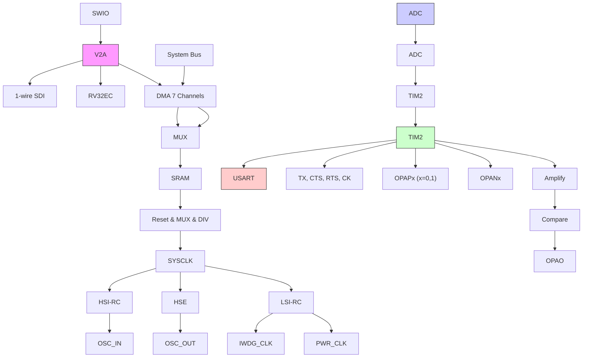

系统中设有：通用 DMA 控制器用以减轻 CPU 负担、提高效率；时钟树分级管理用以降低了外设总的运行功耗，同时还兼有数据保护机制，时钟安全系统保护机制等措施来增加系统稳定性。

- 指令总线(I-Code)将内核和FLASH指令接口相连，预取指在此总线上完成。  
● 数据总线(D-Code)将内核和FLASH数据接口相连，用于常量加载和调试。  
● 系统总线将内核和总线矩阵相连，用于协调内核、DMA、SRAM 和外设的访问。  
● DMA 总线负责 DMA 的 HB 主控接口与总线矩阵相连,该总线访问对象是 FLASH 数据、SRAM 和外设。  
总线矩阵负责的是系统总线、数据总线、DMA 总线、SRAM 和 HB 桥之间的访问协调。

# 1.2 存储器映像

CH32V003 系列产品都包含了程序存储器、数据存储器、内核寄存器和外设寄存器等等，它们都在一个 4GB 的线性空间寻址。

系统存储以小端格式存放数据，即低字节存放在低地址，高字节存放在高地址。

图 1-2 存储映像  

```bar_stacked
| Category | Value |
| -------- | ----- |
| Reserved | 0.5005 0400 |
| Reserved | 0.4002 3C00 |
| Reserved | 0.4002 3800 |
| Reserved | 0.4002 2400 |
| Flash Interface | 0.4002 2000 |
| Reserved | 0.4002 1400 |
| RCC | 0.4002 1000 |
| Reserved | 0.4002 0400 |
| DMA | 0.4002 0000 |
| Reserved | 0.4001 3C00 |
| USART | 0.4001 3800 |
| Reserved | 0.4001 3400 |
| SPI | 0.4001 3000 |
| TIM1 | 0.4001 2C00 |
| Reserved | 0.4001 2800 |
| ADC | 0.4001 2400 |
| Reserved | 0.4001 1800 |
| Port D | 0.4001 1400 |
| Port C | 0.4001 1000 |
| Reserved | 0.4001 0C00 |
| Port A | 0.4001 0800 |
| EXTI | 0.4001 0400 |
| AFIO | 0.4001 0C00 |
| Reserved | 0.4001 7400 |
| PWR | 0.4001 7C00 |
| Reserved | 0.4001 5800 |
| I2C | 0.4001 5400 |
| Reserved | 0.4001 3400 |
| IWDG | 0.4001 3C00 |
| WWDG | 0.4C2C2C2C2C2C2C2C2C2C2C2C2C2C2C2C2C2C2C2C2C2C2C2C2C2C2C2C2C2C2C2C2C2C2C2C2C2C2C2C2C2C2C2C2C2C2C2C2C2C2C |
```


# 1.2.1 存储器分配

内置 2KB 的 SRAM，起始地址 0x20000000，支持字节、半字(2 字节)、全字(4 字节)访问。

内置 16KB 的程序闪存存储区 (CodeFlash)，用于存储用户应用程序。

内置 1920B 的系统存储器 (bootloader)，用于存储系统引导程序（厂家固化自举加载程序）。

内置 64B 空间用于厂商配置字存储，出厂前固化，用户不可修改。

内置 64B 空间用于用户选择字存储。

# 第 2 章 电源控制（PWR）

# 2.1 概述

系统工作电压 $V_{DD}$ 范围为 2.7～5.5V，内置电压调节器提供内核所需的工作电源。

图 2-1 电源结构框图  
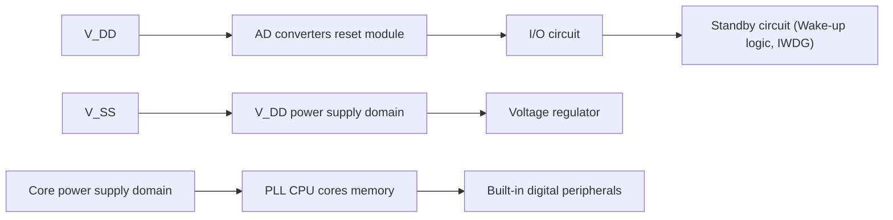

# 2.2 电源管理

# 2.2.1 上电复位和掉电复位

系统内部集成了上电复位POR和掉电复位PDR电路，当芯片供电电压 $V_{DD}$ 低于对应门限电压时，系统被相关电路复位，无需外置额外的复位电路。上电门限电压 $V_{POR}$ 和掉电门限电压 $V_{PDR}$ 的参数请参考对应的数据手册。

图 2-2 POR 和 PDR 的工作示意图  

```line
| Reset signal | V_DD(A) | t_RSTTEMPO |
| ------------ | ------- | ---------- |
| 0            | Low     | -          |
| 1            | High    | Peak       |
| 0            | Low     | -          |
```


# 2.2.2 可编程电压监测器

可编程电压监测器 PVD，主要被用于监控系统主电源的变化，与电源控制寄存器 PWR\_CTLR 的 PLS[2:0] 所设置的门槛电压相比较，配合外部中断寄存器（EXTI）设置，可产生相关中断，以便及时通知系统进行数据保存等掉电前操作。

具体配置如下：

1）设置 PWR\_CTLR 寄存器的 PLS[2:0] 域，选择要监控电压阈值。  
2）可选的中断处理。PVD 功能内部连接 EXTI 模块的第 8 线的上升/下降边沿触发设置，开启此中断（配置 EXTI），当 $V_{DD}$ 下降到 PVD 阈值以下或上升到 PVD 阈值之上时就会产生 PVD 中断。

3）设置 PWR\_CTLR 寄存器的 PVDE 位来开启 PVD 功能。  
4）读取 PWR\_CSR 状态寄存器的 PVDO 位可获取当前系统主电源与 PLS[2:0] 设置阈值关系，执行相应软处理。当 VDD 电压高于 PLS[2:0] 设置阈值，PVDO 位置 0；当 VDD 电压低于 PLS[2:0] 设置阈值，PVDO 位置 1。

图 2-3 PVD 的工作示意图  

```line
| PVD output | V_DD(A) |
| ---------- | ------- |
| 1          | 0       |
| 0          | Peak    |
| 1          | 0       |
```


# 2.3 低功耗模式

在系统复位后，微控制器处于正常工作状态（运行模式），此时可以通过降低系统主频或者关闭不用外设时钟或者降低工作外设时钟来节省系统功耗。如果系统不需要工作，可设置系统进入低功耗模式，并通过特定事件让系统跳出此状态。

微控制器目前提供了2种低功耗模式，从处理器、外设、电压调节器等的工作差异上分为：

- 睡眠模式：内核停止运行，所有外设（包含内核私有外设）仍在运行。  
● 待机模式：停止所有时钟，唤醒后，时钟切换到 HSI。

表 2-1 低功耗模式一览

<table><tr><td>模式</td><td>进入</td><td>唤醒源</td><td>对时钟的影响</td><td>电压调节器</td></tr><tr><td rowspan="2">睡眠</td><td>WFI</td><td>任意中断唤醒</td><td rowspan="2">内核时钟关闭,其他时钟无影响</td><td rowspan="2">正常</td></tr><tr><td>WFE</td><td>唤醒事件唤醒</td></tr><tr><td>待机</td><td>SLEEPDEEP 置 1PDDS 置 1WFI 或 WFE</td><td>任意外部中断或事件、AWU 事件、NRST 引脚复位、IWDG 复位。注:任意事件也可以唤醒系统,但唤醒后系统不复位。</td><td>关闭 HSE、HSI、PLL 和外设时钟</td><td>低功耗模式</td></tr></table>

注：SLEEPDEEP 位属于内核私有外设控制位，CH32V003 产品参考 PFIC\_SCTLR 寄存器。

# 2.3.1 低功耗配置选项

● WFI 和 WFE 方式

WFI: 微控制器被具有中断控制器响应的中断源唤醒, 系统唤醒后, 将最先执行中断服务函数（微控制器复位除外）。

WFE：唤醒事件触发微控制器将退出低功耗模式。唤醒事件包括：

1）配置一个外部或内部的EXTI线为事件模式，此时无需配置中断控制器；  
2）或者配置某个中断源，等效为 WFI 唤醒，系统优先执行中断服务函数；  
3）或者配置 SEVONPEND 位，开启外设中断使能，但不开启中断控制器中的中断使能，系统唤醒后需要清除中断挂起位。

● SLEEPONEXIT

启用：执行 WFI 或 WFE 指令后，微控制器确保所有待处理的中断服务退出后进入低功耗模式。

不启用：执行 WFI 或 WFE 指令后，微控制器立即进入低功耗模式。

# SEVONPEND

启用：所有中断或者唤醒事件都可以唤醒通过执行 WFE 进入的低功耗。

不启用：只有在中断控制器中使能的中断或者唤醒事件可以唤醒通过执行 WFE 进入的低功耗。

# 2.3.2 睡眠模式（SLEEP）

此模式下，所有的 10 引脚都保持他们运行模式下的状态，所有的外设时钟都正常，所以进入睡眠模式前，尽量关闭无用的外设时钟，以减低功耗。该模式唤醒所需时间最短。

进入：配置内核寄存器控制位 SLEEPDEEP=0，电源控制寄存器 PDDS=0，执行 WFI 或 WFE，可选 SEVONPEND 和 SLEEPONEXIT。

退出：任意中断或者唤醒事件。

# 2.3.3 待机模式（STANDBY）

待机模式是在内核的深睡眠模式（SLEEPDEEP）基础上结合了外设的时钟控制机制，并让电压调节器的运行处于更低功耗的状态。此模式高频时钟（HSE/HSI/PLL）域被关闭，SRAM 和寄存器内容保持，10 引脚状态保持。该模式唤醒后系统可以继续运行，HSI 称为默认系统时钟。

如果正在进行闪存编程，直到对内存访问完成，系统才进入待机模式。

待机模式下可工作模块：独立看门狗（IWDG）、低频时钟（LSI）。

进入：配置内核寄存器控制位 SLEEPDEEP=1，电源控制寄存器的 PDDS=1，执行 WFI 或 WFE，可选 SEVONPEND 和 SLEEPONEXIT。

退出：

1）任意外部中断或事件(在外部中断寄存器中设置)。  
2）AWU 事件，此唤醒后时钟切换到 HSI，系统不复位。  
3）NRST 引脚复位、IWDG 复位。

# 2.3.4 自动唤醒（AWU）

可以实现无需外部中断的情况下自动唤醒。通过对时间基数进行编程，可周期性地从待机模式下唤醒。

可选择的内部低频 128kHz 时钟振荡器 LSI 作为自动唤醒计数时基。

在开启 AWU 中断功能时，需要把内部连接 EXTI 模块的第 9 线的上升/下降边沿触发进行设置，开启此中断（配置 EXTI）。

# 2.4 寄存器描述

表 2-2 PWR 相关寄存器列表

<table><tr><td>名称</td><td>访问地址</td><td>描述</td><td>复位值</td></tr><tr><td>R32_PWR_CTLR</td><td>0x40007000</td><td>电源控制寄存器</td><td>0x00000000</td></tr><tr><td>R32_PWR_CSR</td><td>0x40007004</td><td>电源控制/状态寄存器</td><td>0x00000000</td></tr><tr><td>R32_PWR_AWUCSR</td><td>0x40007008</td><td>自动唤醒控制状态寄存器</td><td>0x00000000</td></tr><tr><td>R32_PWR_AWUWR</td><td>0x4000700C</td><td>自动唤醒窗口比较值寄存器</td><td>0x0000003f</td></tr><tr><td>R32_PWR_AWUPSC</td><td>0x40007010</td><td>自动唤醒分频因子寄存器</td><td>0x00000000</td></tr></table>

# 2.4.1 电源控制寄存器（PWR\_CTLR）

偏移地址：0x00

<table><tr><td>31</td><td>30</td><td>29</td><td>28</td><td>27</td><td>26</td><td>25</td><td>24</td><td>23</td><td>22</td><td>21</td><td>20</td><td>19</td><td>18</td><td>17</td><td>16</td></tr><tr><td colspan="16">Reserved</td></tr><tr><td>15</td><td>14</td><td>13</td><td>12</td><td>11</td><td>10</td><td>9</td><td>8</td><td>7</td><td>6</td><td>5</td><td>4</td><td>3</td><td>2</td><td>1</td><td>0</td></tr></table>

<table><tr><td>Reserved</td><td>PLS[2:0]</td><td>PVDE</td><td>Reserved</td><td>PDDS</td><td>Reser ved</td></tr></table>

<table><tr><td>位</td><td>名称</td><td>访问</td><td>描述</td><td>复位值</td></tr><tr><td>[31:8]</td><td>Reserved</td><td>RO</td><td>保留</td><td>0</td></tr><tr><td>[7:5]</td><td>PLS[2:0]</td><td>RW</td><td>PVD电压监测阈值设置。详细说明见数据手册中电气特性部分。000:上升沿2.85V/下降沿2.7V;001:上升沿3.05V/下降沿2.9V;010:上升沿3.3V/下降沿3.15V;011:上升沿3.5V/下降沿3.3V;100:上升沿3.7V/下降沿3.5V;101:上升沿3.9V/下降沿3.7V;110:上升沿4.1V/下降沿3.9V;111:上升沿4.4V/下降沿4.2V。</td><td>0</td></tr><tr><td>4</td><td>PVDE</td><td>RW</td><td>电源电压监测功能使能标志位。1:开启电源电压监测功能;0:禁止电源电压监测功能。</td><td>0</td></tr><tr><td>[3:2]</td><td>Reserved</td><td>RO</td><td>保留。</td><td>0</td></tr><tr><td>1</td><td>PDDS</td><td>RW</td><td>掉电深睡眠情景下,待机/睡眠模式选择位。1:进入待机模式;0:进入睡眠模式。</td><td>0</td></tr><tr><td>0</td><td>Reserved</td><td>RO</td><td>保留。</td><td>0</td></tr></table>

# 2.4.2 电源控制/状态寄存器（PWR\_CSR）

偏移地址：0x04

<table><tr><td>31</td><td>30</td><td>29</td><td>28</td><td>27</td><td>26</td><td>25</td><td>24</td><td>23</td><td>22</td><td>21</td><td>20</td><td>19</td><td>18</td><td>17</td><td>16</td></tr><tr><td colspan="16">Reserved</td></tr><tr><td>15</td><td>14</td><td>13</td><td>12</td><td>11</td><td>10</td><td>9</td><td>8</td><td>7</td><td>6</td><td>5</td><td>4</td><td>3</td><td>2</td><td>1</td><td>0</td></tr><tr><td colspan="13">Reserved</td><td>PVD0</td><td colspan="2">Reserved</td></tr></table>

<table><tr><td>位</td><td>名称</td><td>访问</td><td>描述</td><td>复位值</td></tr><tr><td>[31:3]</td><td>Reserved</td><td>RO</td><td>保留。</td><td>0</td></tr><tr><td>2</td><td>PVD0</td><td>RO</td><td>PVD 输出状态标志位。当 PWR_CTLR 寄存器的 PVDE=1时,该位有效。1: VDD 和 VDDA 低于 PLS[2:0]设定的 PVD 阈值;0: VDD 和 VDDA 高于 PLS[2:0]设定的 PVD 阈值。</td><td>0</td></tr><tr><td>[1:0]</td><td>Reserved</td><td>RO</td><td>保留。</td><td>0</td></tr></table>

# 2.4.3 自动唤醒控制状态寄存器（PWR\_AWUCSR）

偏移地址：0x08

<table><tr><td>31</td><td>30</td><td>29</td><td>28</td><td>27</td><td>26</td><td>25</td><td>24</td><td>23</td><td>22</td><td>21</td><td>20</td><td>19</td><td>18</td><td>17</td><td>16</td></tr><tr><td colspan="16">Reserved</td></tr><tr><td colspan="14">Reserved</td><td>AWUEN</td><td>Reser ved</td></tr></table>

<table><tr><td>位</td><td>名称</td><td>访问</td><td>描述</td><td>复位值</td></tr><tr><td>[31:2]</td><td>Reserved</td><td>RO</td><td>保留。</td><td>0</td></tr><tr><td>1</td><td>AWUEN</td><td>RW</td><td>自动唤醒使能。1:打开自动唤醒;0:无效。</td><td>0</td></tr><tr><td>0</td><td>Reserved</td><td>RO</td><td>保留。</td><td>0</td></tr></table>

# 2.4.4 自动唤醒窗口比较值寄存器（PWR\_AWUWR）

偏移地址：0x0C

<table><tr><td>31</td><td>30</td><td>29</td><td>28</td><td>27</td><td>26</td><td>25</td><td>24</td><td>23</td><td>22</td><td>21</td><td>20</td><td>19</td><td>18</td><td>17</td><td>16</td></tr><tr><td colspan="16">Reserved</td></tr><tr><td>15</td><td>14</td><td>13</td><td>12</td><td>11</td><td>10</td><td>9</td><td>8</td><td>7</td><td>6</td><td>5</td><td>4</td><td>3</td><td>2</td><td>1</td><td>0</td></tr><tr><td colspan="11">Reserved</td><td colspan="5">AWUUWR[5:0]</td></tr></table>

<table><tr><td>位</td><td>名称</td><td>访问</td><td>描述</td><td>复位值</td></tr><tr><td>[31:6]</td><td>Reserved</td><td>RO</td><td>保留。</td><td>0</td></tr><tr><td>[5:0]</td><td>AWUWR[5:0]</td><td>RW</td><td>AWU 窗口值:AWU 窗口值等于 AWU 窗口值的输入值+1;AWU 窗口值用来与递加计数器值进行比较,当计数器的值与窗口值相等时产生唤醒信号。</td><td>0x3f</td></tr></table>

# 2.4.5 自动唤醒分频因子寄存器（PWR\_AWUPSC）

偏移地址：0x10

<table><tr><td>31</td><td>30</td><td>29</td><td>28</td><td>27</td><td>26</td><td>25</td><td>24</td><td>23</td><td>22</td><td>21</td><td>20</td><td>19</td><td>18</td><td>17</td><td>16</td></tr><tr><td colspan="16">Reserved</td></tr><tr><td>15</td><td>14</td><td>13</td><td>12</td><td>11</td><td>10</td><td>9</td><td>8</td><td>7</td><td>6</td><td>5</td><td>4</td><td>3</td><td>2</td><td>1</td><td>0</td></tr><tr><td colspan="12">Reserved</td><td colspan="4">AWUPSC[3:0]</td></tr></table>

<table><tr><td>位</td><td>名称</td><td>访问</td><td>描述</td><td>复位值</td></tr><tr><td>[31:4]</td><td>Reserved</td><td>RO</td><td>保留。</td><td>0</td></tr><tr><td>[3:0]</td><td>AWUPSC[3:0]</td><td>RW</td><td>计数时基。0000:不分频;0001:不分频;0010:2分频;0011:4分频;0100:8分频;0101:16分频;0110:32分频;0111:64分频;1000:128分频;1001:256分频;1010:512分频;1011:1024分频;1100:2048分频;1101:4096分频;1110:10240分频;1111:61440分频;</td><td>0</td></tr></table>

# 第 3 章 复位和时钟控制（RCC）

控制器根据电源区域的划分以及应用中的外设功耗管理考虑，提供了不同的复位形式以及可配置的时钟树结构。此章节描述了系统中各个时钟的作用域。

# 3.1 主要特性

- 多种复位形式  
- 多路时钟源，总线时钟管理  
● 内置外部晶体振荡监测和时钟安全系统  
● 各外设时钟独立管理：复位、开启、关闭  
● 支持内部时钟输出

# 3.2 复位

控制器提供了 2 种复位形式：电源复位和系统复位。

# 3.2.1 电源复位

电源复位发生时，将复位所有寄存器。

其产生条件包括：

● 上电/掉电复位(POR/PDR 复位)

# 3.2.2 系统复位

系统复位发生时，将复位除了控制/状态寄存器 RCC\_RSTSCKR 中的复位标志和所有寄存器。通过查看 RCC\_RSTSCKR 寄存器中的复位状态标志位识别复位事件来源。

其产生条件包括：

● NRST 引脚上的低电平信号（外部复位）  
- 窗口看门狗计数终止(WWDG 复位)   
● 独立看门狗计数终止(IWDG 复位)  
● 软件复位(SW 复位)  
- 低功耗管理复位

窗口/独立看门狗复位：由窗口/独立看门狗外设定时器计数周期溢出触发产生，详细描述看其相应章节。

软件复位:CH32V003 产品通过可编程中断控制器 PFIC 中的中断配置寄存器 PFIC\_CFGR 的 RSTSYS 位置 1 复位系统或配置寄存器 PFIC\_SCTLR 的 SYSRST 位置 1 复位系统，具体参考对应章节。

低功耗管理复位：通过将用户选择字节中的 STANDBY\_RST 位置 1，将启用待机模式复位。这时执行了进入待机模式的过程后，将执行系统复位而不是进入待机模式。

图 3-1 系统复位结构  
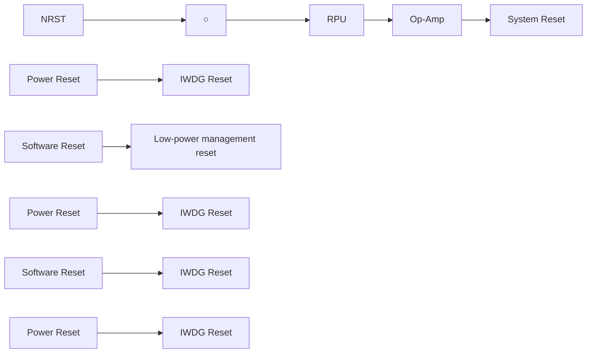

# 3.3 时钟

# 3.3.1 系统时钟结构

图 3-2 CH32V003 时钟树框图  
```mermaid
graph TD
    A["128kHz LSI RC"] -->|to GPIO(internal,to time)| B["IWDGCLK"]
    A -->|to IWDG| C["SW"]
    A -->|to PWR(low power clock source)| D["RCC_CFGR0"]
    D --> E["PLL SRC"]
    E --> F["*2"]
    F --> G["PLLCLK"]
    G --> H["SW"]
    H --> I["SYSCLK"]
    J["OSC_IN OSC_OUT"] --> K["4~25MHz HSE OSC"]
    K --> L["24MHz HSI RC"]
    L --> M["/3"]
    M --> N["to Flash(time base)"]
    N --> O["HSI"]
    O --> P["CSS"]
    Q["MCO"] --> R["MCO[1:0"]]
    R --> S["HB prescaler /1,2.../256"]
    S --> T["HLK 48MHz max"]
    T --> U[" peripheral clock enable "]
    U --> V["to SRAM/DMA"]
    V --> W["FCLK core free running clock"]
    W --> X[" peripheral clock enable "]
    X --> Y["to HB peripherals "]
    Y --> Z["to TIM2"]
    Z --> AA[" peripheral clock enable "]
    AA --> AB["to TIM1"]
    AB --> AC[" peripheral clock enable "]
    AC --> AD["/2,4,6,8,12,1 6.../64,96,128"]
    AD --> AE[" ADCPRE to ADC "]
    AD --> AF["/4096"]
    AF --> AG[" peripheral clock enable "]
    AG --> AH["to WWDG "]
```

# 3.3.2 高速时钟（HSI/HSE）

HSI 是系统内部 24MHz 的 RC 振荡器产生的高速时钟信号。HSI RC 振荡器能够在不需要任何外部器件的条件下提供系统时钟。它的启动时间很短。HSI 通过设置 RCC\_CTLR 寄存器中的 HSION 位被启动和关闭，HSIRDY 位指示 HSI RC 振荡器是否稳定。系统默认 HSION 和 HSIRDY 置 1（建议不要关闭）。如果设置了 RCC\_INTR 寄存器的 HSIRDYIE 位，将产生相应中断。

- 出厂校准：制造工艺的差异会导致每个芯片的 RC 振荡频率不同，所以在芯片出厂前，会为每颗芯片进行 HSI 校准。系统复位后，工厂校准值被装载到 RCC\_CTLR 寄存器的 HSICAL[7:0] 中。  
- 用户调整: 基于不同的电压或环境温度, 应用程序可以通过 RCC\_CTLR 寄存器里的 HSITRIM[4:0]位来调整 HSI 频率。

注：如果 HSE 晶体振荡器失效，HSI 时钟会被作为备用时钟源（时钟安全系统）。

HSE 是外部的高速时钟信号，包括外部晶体/陶瓷谐振器产生或者外部高速时钟送入。

\- 外部晶体/陶瓷谐振器（HSE 晶体）：外接 4-25MHz 外部振荡器为系统提供更为精确的时钟源。进一步信息可参考数据手册的电气特性部分。HSE 晶体可以通过设置 RCC\_CTLR 寄存器中的 HSEON 位被启动和关闭，HSERDY 位指示 HSE 晶体振荡是否稳定，硬件在 HSERDY 位置 1 后才将时钟送入系统。如果设置了 RCC\_INTR 寄存器的 HSERDYIE 位，将产生相应中断。

图 3-3 高速外部晶体电路  

```text_image
C_{L1}
Load
Capacitance
4~25MHz
C_{L2}
OSC_IN
OSC_OUT
```


注：负载电容需要尽可能地靠近振荡器引脚，并根据晶体厂家参数选择容值。

\- 外部高速时钟源（HSE 旁路）：此模式从外部直接送入时钟源到 OSC\_IN 引脚，OSC\_OUT 引脚悬空。最高支持 25MHz 频率。应用程序需在 HSEON 位为 0 情况下，置位 HSEBYP 位，打开 HSE 旁路功能，然后再置位 HSEON 位。

图 3-4 高速时钟源电路  
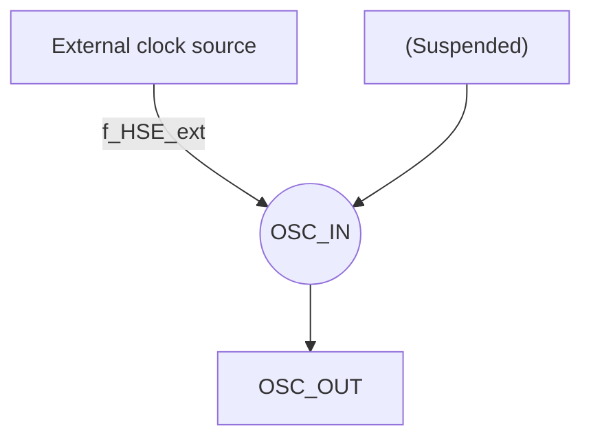

# 3.3.3 低速时钟（LSI）

LSI 是系统内部约 128kHz 的 RC 振荡器产生的低速时钟信号。它可以在停机和待机模式下保持运行，为 RTC 时钟、独立看门狗和唤醒单元提供时钟基准。进一步信息可参考数据手册的电气特性部分。LSI 可以通过设置 RCC\_RSTSCKR 寄存器中的 LSION 位被启动和关闭，然后通过查询 LSIRDY 位检测 LSI RC 振荡是否稳定，硬件在 LSIRDY 位置 1 后才将时钟送入。如果设置了 RCC\_INTR 寄存器的 LSIRDYIE 位，将产生相应中断。

# 3.3.4 PLL 时钟

通过配置 RCC\_CFGRO 寄存器和扩展寄存器 EXTEN\_CTR，内部 PLL 时钟可以选择 2 种时钟来源，这些设置必须在 PLL 被开启前完成，一旦 PLL 被启动，这些参数就不能被改动。设置 RCC\_CTLR 寄存

器中的 PLLON 位被启动和关闭，PLLRDY 位指示 PLL 时钟是否稳定，硬件在 PLL 位置 1 后才将时钟送入系统。如果设置了 RCC\_INTR 寄存器的 PLLRDYIE 位、将产生相应中断。

PLL 时钟来源:

- HSI 时钟送入  
● HSE 时钟送入

# 3.3.5 总线/外设时钟

# 3.3.5.1 系统时钟（SYSCLK）

通过配置 RCC\_CFGRO 寄存器 SW[1:0] 位配置系统时钟来源，SWS[1:0] 指示当前的系统时钟源。

● HSI 作为系统时钟  
● HSE 作为系统时钟  
- PLL 时钟作为系统时钟

控制器复位后，默认 HSI 时钟被选为系统时钟源。时钟源之间的切换必须在目标时钟源准备就绪后才会发生。

# 3.3.5.2 HB 总线外设时钟（HCLK）

通过配置 RCC\_CFGRO 寄存器的 HPRE[3:0] 位，可以配置 HB 总线的时钟。总线时钟决定了挂载在其下面的外设接口访问时钟基准。应用程序可以调整不同的数值，来降低部分外设工作时的功耗。

通过 RCC\_APB1PRSTR、RCC\_APB2PRSTR 寄存器中各个位可以复位不同的外设模块，将其恢复到初始状态。

通过 RCC\_AHBPCENR、RCC\_APB1PCENR、RCC\_APB2PCENR 寄存器中各个位可以单独开启或关闭不同外设模块通讯时钟接口。使用某个外设时，首先需要开启其时钟使能位，才能访问其寄存器。

# 3.3.5.3 独立看门狗时钟

如果独立看门狗已经由硬件配置设置或软件启动，LSI 振荡器将被强制打开，并且不能被关闭。在 LSI 振荡器稳定后，时钟供应给 IWDG。

# 3.3.5.4 时钟输出（MCO）

微控制器允许输出时钟信号到 MCO 引脚。在相应的 GPIO 端口寄存器配置复用推挽输出模式，通过配置 RCC\_CFGRO 寄存器 MCO[2:0] 位，可以选择以下 4 个时钟信号作为 MCO 时钟输出：

● 系统时钟 (SYSCLK) 输出  
● HSI 时钟输出  
HSE 时钟输出  
- PLL 时钟输出

# 3.3.6 时钟安全系统

时钟安全系统是控制器的一种运行保护机制, 它可以在 HSE 时钟发送故障的情况下, 切换到 HSI 时钟下, 并产生中断通知, 允许应用程序软件完成营救操作。

通过设置 RCC\_CTLR 寄存器的 CSSON 位置 1，激活时钟安全系统。此时，时钟监测器将在 HSE 振荡器启动（HSERDY=1）延迟后被使能，并在 HSE 时钟关闭后关闭。一旦系统运行过程中 HSE 时钟发生故障，HSE 振荡器将被关闭，时钟失效事件将被送到高级定时器(TIM1)的刹车输入端，并产生时钟安全中断，CSSF 位置 1，并且应用程序进入 NMI 不可屏蔽中断，通过置位 CSSC 位，可以清除 CSSF 位标志，可撤销 NMI 中断挂起位。

如果当前 HSE 作为系统时钟，或者当前 HSE 作为 PLL 输入时钟，PLL 作为系统时钟，时钟安全系统将在 HSE 故障时自动将系统时钟切换到 HSI 振荡器，并关闭 HSE 振荡器和 PLL。

# 3.4 寄存器描述

表 3-1 RCC 相关寄存器列表

<table><tr><td>名称</td><td>访问地址</td><td>描述</td><td>复位值</td></tr><tr><td>R32_RCC_CTLR</td><td>0x40021000</td><td>时钟控制寄存器</td><td>0x0000xx83</td></tr><tr><td>R32_RCC_CFGRO</td><td>0x40021004</td><td>时钟配置寄存器 0</td><td>0x00000020</td></tr><tr><td>R32_RCC_INTR</td><td>0x40021008</td><td>时钟中断寄存器</td><td>0x00000000</td></tr><tr><td>R32_RCC_APB2PRSTR</td><td>0x4002100C</td><td>PB2 外设复位寄存器</td><td>0x00000000</td></tr><tr><td>R32_RCC_APB1PRSTR</td><td>0x40021010</td><td>PB1 外设复位寄存器</td><td>0x00000000</td></tr><tr><td>R32_RCC_AHBPCENR</td><td>0x40021014</td><td>HB 外设时钟使能寄存器</td><td>0x00000004</td></tr><tr><td>R32_RCC_APB2PCENR</td><td>0x40021018</td><td>PB2 外设时钟使能寄存器</td><td>0x00000000</td></tr><tr><td>R32_RCC_APB1PCENR</td><td>0x4002101C</td><td>PB1 外设时钟使能寄存器</td><td>0x00000000</td></tr><tr><td>R32_RCC_RSTSCKR</td><td>0x40021024</td><td>控制/状态寄存器</td><td>0x0C0000000</td></tr></table>

# 3.4.1 时钟控制寄存器（RCC\_CTLR）

偏移地址：0x00

<table><tr><td>31</td><td>30</td><td>29</td><td>28</td><td>27</td><td>26</td><td>25</td><td>24</td><td>23</td><td>22</td><td>21</td><td>20</td><td>19</td><td>18</td><td>17</td><td>16</td></tr><tr><td></td><td colspan="5">Reserved</td><td>PLL RDY</td><td>PLL ON</td><td colspan="4">Reserved</td><td>CSSON</td><td>HSE BYP</td><td>HSE RDY</td><td>HSEON</td></tr><tr><td>15</td><td>14</td><td>13</td><td>12</td><td>11</td><td>10</td><td>9</td><td>8</td><td>7</td><td>6</td><td>5</td><td>4</td><td>3</td><td>2</td><td>1</td><td>0</td></tr><tr><td></td><td colspan="7">HSICAL[7:0]</td><td colspan="5">HSITRIM[4:0]</td><td>Reser ved</td><td>HSI RDY</td><td>HSION</td></tr></table>

<table><tr><td>位</td><td>名称</td><td>访问</td><td>描述</td><td>复位值</td></tr><tr><td>[31:26]</td><td>Reserved</td><td>RO</td><td>保留。</td><td>0</td></tr><tr><td>25</td><td>PLLRDY</td><td>RO</td><td>PLL时钟就绪锁定标志位。1:PLL时钟锁定;0:PLL时钟未锁定。</td><td>0</td></tr><tr><td>24</td><td>PLLON</td><td>RW</td><td>PLL时钟使能控制位。1:使能PLL时钟;0:关闭PLL时钟。注:进入待机低功耗模式后,此位由硬件清0。</td><td>0</td></tr><tr><td>[23:20]</td><td>Reserved</td><td>RO</td><td>保留。</td><td>0</td></tr><tr><td>19</td><td>CSSON</td><td>RW</td><td>时钟安全系统使能控制位。1:使能时钟安全系统。当HSE准备好(HSERDY置1),硬件开启对HSE的时钟监测功能,发现HSE异常触发CSSF标志及NMI中断;当HSE没有准备好,硬件关闭对HSE的时钟监测功能。0:关闭时钟安全系统。</td><td>0</td></tr><tr><td>18</td><td>HSEBYP</td><td>RW</td><td>外部高速晶体旁路控制位:1:旁路外部高速晶体/陶瓷谐振器(使用外部时钟源);0:不旁路高速外部晶体/陶瓷谐振器。注:此位需在HSEON为0下写入。</td><td>0</td></tr><tr><td>17</td><td>HSERDY</td><td>RO</td><td>外部高速晶体振荡稳定就绪标志位(由硬件置位)。1:外部高速晶体振荡稳定;0:外部高速晶体振荡没有稳定。注:在HSEON位清0后,该位需要6个HSE周期清0。</td><td>0</td></tr><tr><td>16</td><td>HSEON</td><td>RW</td><td>外部高速晶体振荡使能控制位。1:使能HSE振荡器;0:关闭HSE振荡器。注:进入待机低功耗模式后,此位由硬件清0。</td><td>0</td></tr><tr><td>[15:8]</td><td>HSICAL[7:0]</td><td>RO</td><td>内部高速时钟校准值,在系统启动时被自动初始化。</td><td>X</td></tr><tr><td>[7:3]</td><td>HSITRIM[4:0]</td><td>RW</td><td>内部高速时钟调整值。用户可以输入一个调整值叠加到HSICAL[7:0]数值上,根据电压和温度的变化调整内部HSI RC振荡器的频率。默认值为16,可以把HSI调整到24MHz±1%;每步HSICAL的变化调整约60kHz。</td><td>10000b</td></tr><tr><td>2</td><td>Reserved</td><td>RO</td><td>保留。</td><td>0</td></tr><tr><td>1</td><td>HSIRDY</td><td>RO</td><td>内部高速时钟(24MHz)稳定就绪标志位(由硬件置位)。1:内部高速时钟(24MHz)稳定;0:内部高速时钟(24MHz)没有稳定。注:在HSION位清0后,该位需要6个HSI周期清0。</td><td>1</td></tr><tr><td>0</td><td>HSION</td><td>RW</td><td>内部高速时钟(24MHz)使能控制位。1:使能HSI振荡器;0:关闭HSI振荡器。注:当从待机模式返回或用作系统时钟的外部振荡器HSE发生故障时,该位由硬件置1来启动内部24MHz的RC振荡器。</td><td>1</td></tr></table>

# 3.4.2 时钟配置寄存器 0（RCC\_CFGRO）

偏移地址：0x04

<table><tr><td>31</td><td>30</td><td>29</td><td>28</td><td>27</td><td>26</td><td>25</td><td>24</td><td>23</td><td>22</td><td>21</td><td>20</td><td>19</td><td>18</td><td>17</td><td>16</td></tr><tr><td colspan="5">Reserved</td><td colspan="3">MCO[2:0]</td><td colspan="7">Reserved</td><td>PLL SRC</td></tr><tr><td>15</td><td>14</td><td>13</td><td>12</td><td>11</td><td>10</td><td>9</td><td>8</td><td>7</td><td>6</td><td>5</td><td>4</td><td>3</td><td>2</td><td>1</td><td>0</td></tr><tr><td colspan="5">ADCPRE[4:0]</td><td colspan="3">Reserved</td><td colspan="4">HPRE[3:0]</td><td colspan="2">SWS[1:0]</td><td colspan="2">SW[1:0]</td></tr></table>

<table><tr><td>位</td><td>名称</td><td>访问</td><td>描述</td><td>复位值</td></tr><tr><td>[31:27]</td><td>Reserved</td><td>RO</td><td>保留。</td><td>0</td></tr><tr><td>[26:24]</td><td>MCO[2:0]</td><td>RW</td><td>微控制器 MCO 引脚时钟输出控制。0xx:没有时钟输出;100:系统时钟 (SYSCLK) 输出;101:内部 24MHz 的 RC 振荡器时钟 (HSI) 输出;110:外部振荡器时钟 (HSE) 输出;111:PLL 时钟输出。</td><td>0</td></tr><tr><td>[23:17]</td><td>Reserved</td><td>RO</td><td>保留。</td><td>0</td></tr><tr><td>16</td><td>PLLSRC</td><td>RW</td><td>PLL 的输入时钟源(在 PLL 关闭才可写入)。1: HSE 不分频送入 PLL;0: HSI 不分频送入 PLL。</td><td>0</td></tr><tr><td>[15:11]</td><td>ADCPRE[4:0]</td><td>RW</td><td>ADC 时钟来源预分频控制。000xx: HBCLK 2 分频后作为 ADC 时钟;010xx: HBCLK 4 分频后作为 ADC 时钟;100xx: HBCLK 6 分频后作为 ADC 时钟;110xx: HBCLK 8 分频后作为 ADC 时钟;00100: HBCLK 4 分频后作为 ADC 时钟;01100: HBCLK 8 分频后作为 ADC 时钟;10100: HBCLK 12 分频后作为 ADC 时钟;11100: HBCLK 16 分频后作为 ADC 时钟;00101: HBCLK 8 分频后作为 ADC 时钟;01101: HBCLK 16 分频后作为 ADC 时钟;10101: HBCLK 24 分频后作为 ADC 时钟;11101: HBCLK 32 分频后作为 ADC 时钟;00110: HBCLK 16 分频后作为 ADC 时钟;01110: HBCLK 32 分频后作为 ADC 时钟;10110: HBCLK 48 分频后作为 ADC 时钟;11110: HBCLK 64 分频后作为 ADC 时钟;00111: HBCLK 32 分频后作为 ADC 时钟;01111: HBCLK 64 分频后作为 ADC 时钟;10111: HBCLK 96 分频后作为 ADC 时钟;11111: HBCLK 128 分频后作为 ADC 时钟。注:ADC 时钟最高不要超过 24MHz。</td><td>0</td></tr><tr><td>[10:8]</td><td>Reserved</td><td>RW</td><td>保留。</td><td>0</td></tr><tr><td>[7:4]</td><td>HPRE[3:0]</td><td>RW</td><td>HB 时钟来源预分频控制。0000: 不分频;0001: SYSCLK 2 分频;0010: SYSCLK 3 分频;0011: SYSCLK 4 分频;0100: SYSCLK 5 分频;0101: SYSCLK 6 分频;0110: SYSCLK 7 分频;0111: SYSCLK 8 分频;1000: SYSCLK 2 分频;1001: SYSCLK 4 分频;1010: SYSCLK 8 分频;1011: SYSCLK 16 分频;1100: SYSCLK 32 分频;1101: SYSCLK 64 分频;1110: SYSCLK 128 分频;1111: SYSCLK 256 分频。</td><td>0010b</td></tr><tr><td>[3:2]</td><td>SWS[1:0]</td><td>RO</td><td>系统时钟(SYSCLK)状态(硬件置位)。00: 系统时钟源是 HSI;01: 系统时钟源是 HSE;10: 系统时钟源是 PLL;11: 不可用。</td><td>0</td></tr><tr><td>[1:0]</td><td>SW[1:0]</td><td>RW</td><td>选择系统时钟来源。00: HSI 作为系统时钟;01: HSE 作为系统时钟;10: PLL 输出作为系统时钟;11: 不可用。注: 在使能了时钟安全系统下(CSSON=1),当从待机和停止模式返回或用作系统时钟的外部振荡器 HSE 发生故障时,由硬件强制选择 HSI 作为系统时钟。</td><td>0</td></tr></table>

# 3.4.3 时钟中断寄存器（RCC\_INTR）

偏移地址：0x08

<table><tr><td colspan="8">Reserved</td><td>CSSC</td><td>Reserved</td><td>PLLRDYC</td><td>HSERDYC</td><td>HSIRDYC</td><td>Reserved</td><td>LSIRDYC</td></tr><tr><td colspan="2">Reserved</td><td>PLLRDYIE</td><td>HSERDYIE</td><td>HSIRDYIE</td><td>Reserved</td><td>LSIRDYIE</td><td>CSSF</td><td>Reserved</td><td>PLLRDYF</td><td>HSERDYF</td><td>HSIRDYF</td><td>Reserved</td><td>LSIRDYF</td><td></td></tr></table>

<table><tr><td>位</td><td>名称</td><td>访问</td><td>描述</td><td>复位值</td></tr><tr><td>[31:24]</td><td>Reserved</td><td>RO</td><td>保留。</td><td>0</td></tr><tr><td>23</td><td>CSSC</td><td>WO</td><td>清除时钟安全系统中断标志位(CSSF)。1: 清除 CSSF 中断标志;0: 无动作。</td><td>0</td></tr><tr><td>[22:21]</td><td>Reserved</td><td>RO</td><td>保留。</td><td>0</td></tr><tr><td>20</td><td>PLLRDYC</td><td>WO</td><td>清除 PLL 就绪中断标志位。1: 清除 PLLRDYF 中断标志;0: 无动作。</td><td>0</td></tr><tr><td>19</td><td>HSERDYC</td><td>WO</td><td>清除 HSE 振荡器就绪中断标志位。1: 清除 HSERDYF 中断标志;0: 无动作。</td><td>0</td></tr><tr><td>18</td><td>HSIRDYC</td><td>WO</td><td>清除 HSI 振荡器就绪中断标志位。1: 清除 HSIRDYF 中断标志;0: 无动作。</td><td>0</td></tr><tr><td>17</td><td>Reserved</td><td>RO</td><td>保留。</td><td>0</td></tr><tr><td>16</td><td>LSIRDYC</td><td>WO</td><td>清除 LSI 振荡器就绪中断标志位。1: 清除 LSIRDYF 中断标志;0: 无动作。</td><td>0</td></tr><tr><td>[15:13]</td><td>Reserved</td><td>RO</td><td>保留。</td><td>0</td></tr><tr><td>12</td><td>PLLRDYIE</td><td>RW</td><td>PLL 就绪中断使能位。1: 使能 PLL 就绪中断;0: 关闭 PLL 就绪中断。</td><td>0</td></tr><tr><td>11</td><td>HSERDYIE</td><td>RW</td><td>HSE 就绪中断使能位。1: 使能 HSE 就绪中断;0: 关闭 HSE 就绪中断。</td><td>0</td></tr><tr><td>10</td><td>HSIRDYIE</td><td>RW</td><td>HSI 就绪中断使能位。1: 使能 HSI 就绪中断;0: 关闭 HSI 就绪中断。</td><td>0</td></tr><tr><td>9</td><td>Reserved</td><td>RO</td><td>保留。</td><td>0</td></tr><tr><td>8</td><td>LSIRDYIE</td><td>RW</td><td>LSI 就绪中断使能位。1: 使能 LSI 就绪中断;0: 关闭 LSI 就绪中断。</td><td>0</td></tr><tr><td>7</td><td>CSSF</td><td>RO</td><td>时钟安全系统中断标志位。1: HSE 时钟失效,产生了时钟安全中断 CSSI;0: 无时钟安全系统中断。硬件置位,软件写 CSSC 位 1 清除。</td><td>0</td></tr><tr><td>[6:5]</td><td>Reserved</td><td>RO</td><td>保留。</td><td>0</td></tr><tr><td>4</td><td>PLLRDYF</td><td>RO</td><td>PLL 时钟就绪锁定中断标志。1: PLL 时钟锁定产生中断;0: 无 PLL 时钟锁定中断。硬件置位,软件写 PLLRDYC 位 1 清除。</td><td>0</td></tr><tr><td>3</td><td>HSERDYF</td><td>RO</td><td>HSE 时钟就绪中断标志。1: HSE 时钟就绪产生中断;0: 无 HSE 时钟就绪中断。硬件置位,软件写 HSERDYC 位 1 清除。</td><td>0</td></tr><tr><td>2</td><td>HSIRDYF</td><td>RO</td><td>HSI 时钟就绪中断标志。1: HSI 时钟就绪产生中断;0: 无 HSI 时钟就绪中断。硬件置位,软件写 HSIRDYC 位 1 清除。</td><td>0</td></tr><tr><td>1</td><td>Reserved</td><td>RO</td><td>保留。</td><td>0</td></tr><tr><td>0</td><td>LSIRDYF</td><td>RO</td><td>LSI 时钟就绪中断标志。1: LSI 时钟就绪产生中断;0: 无 LSI 时钟就绪中断。硬件置位,软件写 LSIRDYC 位 1 清除。</td><td>0</td></tr></table>

# 3.4.4 PB2 外设复位寄存器（RCC\_APB2PRSTR）

偏移地址：0x0C

<table><tr><td colspan="16">Reserved</td></tr><tr><td>15</td><td>14</td><td>13</td><td>12</td><td>11</td><td>10</td><td>9</td><td>8</td><td>7</td><td>6</td><td>5</td><td>4</td><td>3</td><td>2</td><td>1</td><td>0</td></tr><tr><td>Reserved</td><td>USART1RST</td><td>Reserved</td><td>SPI1RST</td><td>TIM1RST</td><td>Reserved</td><td>ADC1RST</td><td colspan="3">Reserved</td><td>IOPDRST</td><td>IOPCRST</td><td>Reserved</td><td>IOPARST</td><td>Reserved</td><td>AFIO RST</td></tr></table>

<table><tr><td>位</td><td>名称</td><td>访问</td><td>描述</td><td>复位值</td></tr><tr><td>[31:15]</td><td>Reserved</td><td>RO</td><td>保留。</td><td>0</td></tr><tr><td>14</td><td>USART1RST</td><td>RW</td><td>USART1 接口复位控制。1: 复位模块; 0: 无作用。</td><td>0</td></tr><tr><td>13</td><td>Reserved</td><td>RO</td><td>保留。</td><td>0</td></tr><tr><td>12</td><td>SPI1RST</td><td>RW</td><td>SPI1接口复位控制。1: 复位模块; 0: 无作用。</td><td>0</td></tr><tr><td>11</td><td>TIM1RST</td><td>RW</td><td>TIM1模块复位控制。1: 复位模块; 0: 无作用。</td><td>0</td></tr><tr><td>10</td><td>Reserved</td><td>RO</td><td>保留。</td><td>0</td></tr><tr><td>9</td><td>ADC1RST</td><td>RW</td><td>ADC1模块复位控制。1: 复位模块; 0: 无作用。</td><td>0</td></tr><tr><td>[8:6]</td><td>Reserved</td><td>RO</td><td>保留。</td><td>0</td></tr><tr><td>5</td><td>IOPDRST</td><td>RW</td><td>IO的PD端口模块复位控制。1: 复位模块; 0: 无作用。</td><td>0</td></tr><tr><td>4</td><td>IOPCRST</td><td>RW</td><td>IO的PC端口模块复位控制。1: 复位模块; 0: 无作用。</td><td>0</td></tr><tr><td>3</td><td>Reserved</td><td>RO</td><td>保留。</td><td>0</td></tr><tr><td>2</td><td>IOPARST</td><td>RW</td><td>IO的PA端口模块复位控制。1: 复位模块; 0: 无作用。</td><td>0</td></tr><tr><td>1</td><td>Reserved</td><td>RO</td><td>保留。</td><td>0</td></tr><tr><td>0</td><td>AFIORST</td><td>RW</td><td>IO辅助功能模块复位控制。1: 复位模块; 0: 无作用。</td><td>0</td></tr></table>

# 3.4.5 PB1 外设复位寄存器（RCC\_APB1PRSTR）

偏移地址：0x10

<table><tr><td>31</td><td>30</td><td>29</td><td>28</td><td>27</td><td>26</td><td>25</td><td>24</td><td>23</td><td>22</td><td>21</td><td>20</td><td>19</td><td>18</td><td>17</td><td>16</td></tr><tr><td colspan="3">Reserved</td><td>PWR RST</td><td colspan="6">Reserved</td><td>I2C1 RST</td><td colspan="5">Reserved</td></tr><tr><td>15</td><td>14</td><td>13</td><td>12</td><td>11</td><td>10</td><td>9</td><td>8</td><td>7</td><td>6</td><td>5</td><td>4</td><td>3</td><td>2</td><td>1</td><td>0</td></tr><tr><td colspan="4">Reserved</td><td>WWDG RST</td><td colspan="10">Reserved</td><td>TIM2 RST</td></tr></table>

<table><tr><td>位</td><td>名称</td><td>访问</td><td>描述</td><td>复位值</td></tr><tr><td>[31:29]</td><td>Reserved</td><td>RO</td><td>保留。</td><td>0</td></tr><tr><td>28</td><td>PWRRST</td><td>RW</td><td>电源接口模块复位控制。1: 复位模块; 0: 无作用。</td><td>0</td></tr><tr><td>[27:22]</td><td>Reserved</td><td>RO</td><td>保留。</td><td>0</td></tr><tr><td>21</td><td>I2C1RST</td><td>RW</td><td>I2C 1 接口复位控制。1: 复位模块; 0: 无作用。</td><td>0</td></tr><tr><td>[20:12]</td><td>Reserved</td><td>RO</td><td>保留。</td><td>0</td></tr><tr><td>11</td><td>WWDGRST</td><td>RW</td><td>窗口看门狗复位控制。1: 复位模块; 0: 无作用。</td><td>0</td></tr><tr><td>[10:1]</td><td>Reserved</td><td>RO</td><td>保留。</td><td>0</td></tr><tr><td>0</td><td>TIM2RST</td><td>RW</td><td>定时器 2 模块复位控制。1: 复位模块; 0: 无作用。</td><td>0</td></tr></table>

# 3.4.6 HB 外设时钟使能寄存器（RCC\_AHBPCENR）

偏移地址：0x14

<table><tr><td>31</td><td>30</td><td>29</td><td>28</td><td>27</td><td>26</td><td>25</td><td>24</td><td>23</td><td>22</td><td>21</td><td>20</td><td>19</td><td>18</td><td>17</td><td>16</td></tr><tr><td colspan="16">Reserved</td></tr><tr><td>15</td><td>14</td><td>13</td><td>12</td><td>11</td><td>10</td><td>9</td><td>8</td><td>7</td><td>6</td><td>5</td><td>4</td><td>3</td><td>2</td><td>1</td><td>0</td></tr><tr><td colspan="13">Reserved</td><td>SRAM EN</td><td>Rese rved</td><td>DMA1 EN</td></tr></table>

<table><tr><td>位</td><td>名称</td><td>访问</td><td>描述</td><td>复位值</td></tr><tr><td>[31:3]</td><td>Reserved</td><td>RO</td><td>保留。</td><td>0</td></tr><tr><td>2</td><td>SRAMEN</td><td>RW</td><td>SRAM接口模块时钟使能位。1:睡眠模式时,SRAM接口模块时钟开启;0:睡眠模式时,SRAM接口模块时钟关闭。</td><td>1</td></tr><tr><td>1</td><td>Reserved</td><td>RO</td><td>保留。</td><td>0</td></tr><tr><td>0</td><td>DMA1EN</td><td>RW</td><td>DMA1模块时钟使能位。1:模块时钟开启; 0:模块时钟关闭。</td><td>0</td></tr></table>

# 3.4.7 PB2 外设时钟使能寄存器（RCC\_APB2PCENR）

偏移地址：0x18

<table><tr><td colspan="16">Reserved</td></tr><tr><td>15</td><td>14</td><td>13</td><td>12</td><td>11</td><td>10</td><td>9</td><td>8</td><td>7</td><td>6</td><td>5</td><td>4</td><td>3</td><td>2</td><td>1</td><td>0</td></tr><tr><td>Reserved</td><td>USART1EN</td><td>Reserved</td><td>SPI1EN</td><td>TIM1EN</td><td>Reserved</td><td>ADC1EN</td><td colspan="3">Reserved</td><td>IOPDEN</td><td>IOPCEN</td><td>Reserved</td><td>IOPAEN</td><td>Reserved</td><td>AFIOEN</td></tr></table>

<table><tr><td>位</td><td>名称</td><td>访问</td><td>描述</td><td>复位值</td></tr><tr><td>[31:15]</td><td>Reserved</td><td>RO</td><td>保留。</td><td>0</td></tr><tr><td>14</td><td>USART1EN</td><td>RW</td><td>USART1 接口时钟使能位。1:模块时钟开启; 0:模块时钟关闭。</td><td>0</td></tr><tr><td>13</td><td>Reserved</td><td>RO</td><td>保留。</td><td>0</td></tr><tr><td>12</td><td>SPI1EN</td><td>RW</td><td>SPI1 接口时钟使能位。1:模块时钟开启; 0:模块时钟关闭。</td><td>0</td></tr><tr><td>11</td><td>TIM1EN</td><td>RW</td><td>TIM1 模块时钟使能位。1:模块时钟开启; 0:模块时钟关闭。</td><td>0</td></tr><tr><td>10</td><td>Reserved</td><td>RO</td><td>保留。</td><td>0</td></tr><tr><td>9</td><td>ADC1EN</td><td>RW</td><td>ADC1 模块时钟使能位。1:模块时钟开启; 0:模块时钟关闭。</td><td>0</td></tr><tr><td>[8:6]</td><td>Reserved</td><td>RO</td><td>保留。</td><td>0</td></tr><tr><td>5</td><td>IOPDEN</td><td>RW</td><td>IO 的 PD 端口模块时钟使能位。1:模块时钟开启; 0:模块时钟关闭。</td><td>0</td></tr><tr><td>4</td><td>IOPCEN</td><td>RW</td><td>IO 的 PC 端口模块时钟使能位。1:模块时钟开启; 0:模块时钟关闭。</td><td>0</td></tr><tr><td>3</td><td>Reserved</td><td>RO</td><td>保留。</td><td>0</td></tr><tr><td>2</td><td>IOPAEN</td><td>RW</td><td>IO的PA端口模块时钟使能位。1:模块时钟开启;0:模块时钟关闭。</td><td>0</td></tr><tr><td>1</td><td>Reserved</td><td>RO</td><td>保留。</td><td>0</td></tr><tr><td>0</td><td>AFIOEN</td><td>RW</td><td>IO辅助功能模块时钟使能位。1:模块时钟开启;0:模块时钟关闭。</td><td>0</td></tr></table>

# 3.4.8 PB1 外设时钟使能寄存器（RCC\_APB1PCENR）

偏移地址：0x1C

<table><tr><td>31</td><td>30</td><td>29</td><td>28</td><td>27</td><td>26</td><td>25</td><td>24</td><td>23</td><td>22</td><td>21</td><td>20</td><td>19</td><td>18</td><td>17</td><td>16</td></tr><tr><td colspan="3">Reserved</td><td>PWR EN</td><td colspan="6">Reserved</td><td>I2C1 EN</td><td colspan="5">Reserved</td></tr><tr><td>15</td><td>14</td><td>13</td><td>12</td><td>11</td><td>10</td><td>9</td><td>8</td><td>7</td><td>6</td><td>5</td><td>4</td><td>3</td><td>2</td><td>1</td><td>0</td></tr><tr><td colspan="4">Reserved</td><td>WWDG EN</td><td colspan="10">Reserved</td><td>TIM2 EN</td></tr></table>

<table><tr><td>位</td><td>名称</td><td>访问</td><td>描述</td><td>复位值</td></tr><tr><td>[31:29]</td><td>Reserved</td><td>RO</td><td>保留。</td><td>0</td></tr><tr><td>28</td><td>PWREN</td><td>RW</td><td>电源接口模块时钟使能位。1:模块时钟开启; 0:模块时钟关闭。</td><td>0</td></tr><tr><td>[27:22]</td><td>Reserved</td><td>RO</td><td>保留。</td><td>0</td></tr><tr><td>21</td><td>I2C1EN</td><td>RW</td><td>I2C 1 接口时钟使能位。1:模块时钟开启; 0:模块时钟关闭。</td><td>0</td></tr><tr><td>[20:12]</td><td>Reserved</td><td>RO</td><td>保留。</td><td>0</td></tr><tr><td>11</td><td>WWDGEN</td><td>RW</td><td>窗口看门狗时钟使能位。1:模块时钟开启; 0:模块时钟关闭。</td><td>0</td></tr><tr><td>[10:1]</td><td>Reserved</td><td>RO</td><td>保留。</td><td>0</td></tr><tr><td>0</td><td>TIM2EN</td><td>RW</td><td>定时器 2 模块时钟使能位。1:模块时钟开启; 0:模块时钟关闭。</td><td>0</td></tr></table>

# 3.4.9 控制/状态寄存器（RCC\_RSTSCKR）

偏移地址：0x24

<table><tr><td>31</td><td>30</td><td>29</td><td>28</td><td>27</td><td>26</td><td>25</td><td>24</td><td>23</td><td>22</td><td>21</td><td>20</td><td>19</td><td>18</td><td>17</td><td>16</td></tr><tr><td>LPWR RSTF</td><td>WWDG RSTF</td><td>IWDG RSTF</td><td>SFT RSTF</td><td>POR RSTF</td><td>PIN RSTF</td><td>Reser ved</td><td>RMVF</td><td colspan="8">Reserved</td></tr><tr><td>15</td><td>14</td><td>13</td><td>12</td><td>11</td><td>10</td><td>9</td><td>8</td><td>7</td><td>6</td><td>5</td><td>4</td><td>3</td><td>2</td><td>1</td><td>0</td></tr><tr><td colspan="14">Reserved</td><td>LSI RDY</td><td>LSION</td></tr></table>

注：除 BIT1 由上电复位清除，其他写清除复位标志可以清除。

<table><tr><td>位</td><td>名称</td><td>访问</td><td>描述</td><td>复位值</td></tr><tr><td>31</td><td>LPWRRSTF</td><td>RO</td><td>低功耗复位标志。1:发生低功耗复位;0:无低功耗复位发生。发生低功耗管理复位时由硬件置1;软件写RMVF位清除。</td><td>0</td></tr><tr><td>30</td><td>WWDGRSTF</td><td>RO</td><td>窗口看门狗复位标志。1:发生窗口看门狗复位;0:无窗口看门狗复位发生。发生窗口看门狗复位时由硬件置1;软件写RMVF位清除。</td><td>0</td></tr><tr><td>29</td><td>IWDGRSTF</td><td>RO</td><td>独立看门狗复位标志。1:发生独立看门狗复位;0:无独立看门狗复位发生。发生独立看门狗复位时由硬件置1;软件写RMVF位清除。</td><td>0</td></tr><tr><td>28</td><td>SFTRSTF</td><td>RO</td><td>软件复位标志。1:发生软件复位;0:无软件复位发生。发生软件复位时由硬件置1;软件写RMVF位清除。</td><td>0</td></tr><tr><td>27</td><td>PORRSTF</td><td>RO</td><td>上电/掉电复位标志。1:发生上电/掉电复位;0:无上电/掉电复位发生。发生上电/掉电复位时由硬件置1;软件写RMVF位清除。</td><td>1</td></tr><tr><td>26</td><td>PINRSTF</td><td>RO</td><td>外部手动复位(NRST引脚)标志。1:发生NRST引脚复位;0:无NRST引脚复位发生。在NRST引脚复位发生时由硬件置1;软件写RMVF位清除。</td><td>0</td></tr><tr><td>25</td><td>Reserved</td><td>RO</td><td>保留。</td><td>0</td></tr><tr><td>24</td><td>RMVF</td><td>RW</td><td>清除复位标志控制。1:清除复位标志;0:无作用。</td><td>0</td></tr><tr><td>[23:2]</td><td>Reserved</td><td>RO</td><td>保留。</td><td>0</td></tr><tr><td>1</td><td>LSIRDY</td><td>RO</td><td>内部低速时钟(LSI)稳定就绪标志位(由硬件置位)。1:内部低速时钟(128kHz)稳定;0:内部低速时钟(128kHz)没有稳定。注:在LSION位清0后,该位需要3个LSI周期清0。</td><td>0</td></tr><tr><td>0</td><td>LSION</td><td>RW</td><td>内部低速时钟(LSI)使能控制位。1:使能LSI(128kHz)振荡器;0:关闭LSI(128kHz)振荡器。</td><td>0</td></tr></table>

# 第 4 章 独立看门狗（IWDG）

系统设有独立看门狗（IWDG）用来检测逻辑错误和外部环境干扰引起的软件故障。IWDG时钟源来自于LSI，可独立于主程序之外运行，适用于对精度要求低的场合。

# 4.1 主要特征

● 12 位自减型计数器  
● 时钟来源 LSI 分频，可以在低功耗模式下运行  
● 复位条件：计数器值减到 0

# 4.2 功能说明

# 4.2.1 原理和用法

独立看门狗的时钟来源 LSI 时钟，其功能在停机和待机模式时仍能正常工作。当看门狗计数器自减到 0 时，将会产生系统复位，所以超时时间为（重装载值 +1）个时钟。

图 4-1 独立看门狗的结构框图  
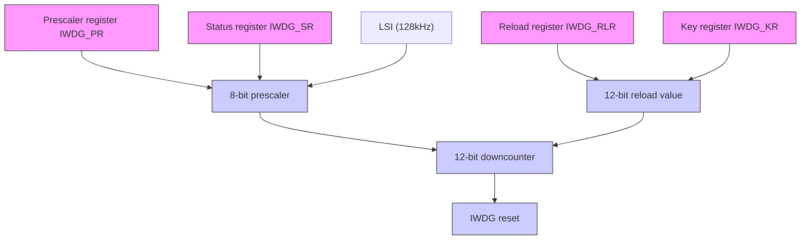

# - 启动独立看门狗

系统复位后，看门狗处于关闭状态，向 IWDG\_CTLR 寄存器写 0xCCCC 开启看门狗，随后它不能再被关闭，除非发生复位。

如果在用户选择字开启了硬件独立看门狗使能位（IWDG\_SW），在微控制器复位后将固定开启IWDG。

# - 看门狗配置

看门狗内部是一个递减运行的 12 位计数器，当计数器的值减为 0 时，将发生系统复位。开启 IWDG 功能，需要执行下面几点操作：

1) 计数时基：IWDG 时钟来源 LSI，通过 IWDG\_PSCR 寄存器设置 LSI 分频值时钟作为 IWDG 的计数时基。操作方法先向 IWDG\_CTLR 寄存器写 0x5555，再修改 IWDG\_PSCR 寄存器中的分频值。IWDG\_STATR 寄存器中的 PVU 位指示了分频值更新状态，在更新完成的情况下才可以进行分频值的修改和读出。

2) 重装载值：用于更新独立看门狗中计数器当前值，并且计数器由此值进行递减。操作方法先向 IWDG\_CTLR 寄存器写 0x5555，再修改 IWDG\_RLDR 寄存器设置目标重装载值。IWDG\_STATR 寄存器中的 RVU 位指示了重装载值更新状态，在更新完成的情况下才可以进行 IWDG\_RLDR 寄存器的修改和读出。

3) 看门狗使能：向 IWDG\_CTLR 寄存器写 0xCCCC，即可开启看门狗功能。  
4) 喂狗：即在看门狗计数器递减到 0 前刷新当前计数器值防止发生系统复位。向 IWDG\_CTLR 寄存

器写 0xAAAA，让硬件将 IWDG\_RLDR 寄存值更新到看门狗计数器中。此动作需要在看门狗功能开启后定时执行，否则会出现看门狗复位动作。

# 4.2.2 调试模式

系统进入调试模式时，可以由调试模块寄存器配置 IWDG 的计数器继续工作或停止。

# 4.3 寄存器描述

表 4-1 IWDG 相关寄存器列表

<table><tr><td>名称</td><td>访问地址</td><td>描述</td><td>复位值</td></tr><tr><td>R16_IWDG_CTLR</td><td>0x40003000</td><td>控制寄存器</td><td>0x0000</td></tr><tr><td>R16_IWDG_PSCR</td><td>0x40003004</td><td>分频因子寄存器</td><td>0x0000</td></tr><tr><td>R16_IWDG_RLDR</td><td>0x40003008</td><td>重装载值寄存器</td><td>0x0FFF</td></tr><tr><td>R16_IWDG_STATR</td><td>0x4000300C</td><td>状态寄存器</td><td>0x0000</td></tr></table>

# 4.3.1 IWDG 控制寄存器（IWDG\_CTLR）

偏移地址：0x00

<table><tr><td>15</td><td>14</td><td>13</td><td>12</td><td>11</td><td>10</td><td>9</td><td>8</td><td>7</td><td>6</td><td>5</td><td>4</td><td>3</td><td>2</td><td>1</td><td>0</td></tr><tr><td></td><td></td><td></td><td></td><td></td><td></td><td></td><td colspan="2">KEY[15:0]</td><td></td><td></td><td></td><td></td><td></td><td></td><td></td></tr></table>

<table><tr><td>位</td><td>名称</td><td>访问</td><td>描述</td><td>复位值</td></tr><tr><td>[15:0]</td><td>KEY[15:0]</td><td>WO</td><td>操作键值锁。0xAAAA:喂狗。加载 IWDG_RLDR 寄存器值到独立看门狗计数器中;0x5555:允许修改 R16_IWDG_PSCR 和 R16_IWDG_RLDR 寄存器;0xCCCC:启动看门狗,如果启用了硬件看门狗(用户选择字配置)则不受这个限制。</td><td>0</td></tr></table>

# 4.3.2 分频因子寄存器（IWDG\_PSCR）

偏移地址：0x04

<table><tr><td colspan="13">Reserved</td><td>PR[2:0]</td></tr></table>

<table><tr><td>位</td><td>名称</td><td>访问</td><td>描述</td><td>复位值</td></tr><tr><td>[15:3]</td><td>Reserved</td><td>RO</td><td>保留。</td><td>0</td></tr><tr><td>[2:0]</td><td>PR[2:0]</td><td>RW</td><td>IWDG时钟分频系数,修改此域前要向KEY中写0x5555。000:4分频; 001:8分频;010:16分频; 011:32分频;100:64分频; 101:128分频;110:256分频; 111:256分频。IWDG计数时基=LSI/分频系数。注:读该域值前,要确保 IWDG_STATR 寄存器中的 PVU 位为 0,否则读出值无效。</td><td>0</td></tr></table>

# 4.3.3 重装载值寄存器（IWDG\_RLDR）

偏移地址：0x08

<table><tr><td>15</td><td>14</td><td>13</td><td>12</td><td>11</td><td>10</td><td>9</td><td>8</td><td>7</td><td>6</td><td>5</td><td>4</td><td>3</td><td>2</td><td>1</td><td>0</td></tr><tr><td colspan="4">Reserved</td><td colspan="12">RL[11:0]</td></tr></table>

<table><tr><td>位</td><td>名称</td><td>访问</td><td>描述</td><td>复位值</td></tr><tr><td>[15:12]</td><td>Reserved</td><td>RO</td><td>保留。</td><td>0</td></tr><tr><td>[11:0]</td><td>RL[11:0]</td><td>RW</td><td>计数器重装载值。修改此域前要向 KEY 中写 0x5555。当向 KEY 中写 0xAAAA 后,此域的值将会被硬件装载到计数器中,随后计数器从这个值开始递减计数。注:读写该域值前,要确保 IWDG_STATR 寄存器中的 RVU 位为 0,否则读写此域无效。</td><td>0xFFFF</td></tr></table>

# 4.3.4 状态寄存器（IWDG\_STATR）

偏移地址：0x0C

<table><tr><td>15</td><td>14</td><td>13</td><td>12</td><td>11</td><td>10</td><td>9</td><td>8</td><td>7</td><td>6</td><td>5</td><td>4</td><td>3</td><td>2</td><td>1</td><td>0</td></tr><tr><td colspan="14">Reserved</td><td>RVU</td><td>PVU</td></tr></table>

<table><tr><td>位</td><td>名称</td><td>访问</td><td>描述</td><td>复位值</td></tr><tr><td>[15:2]</td><td>Reserved</td><td>RO</td><td>保留。</td><td>0</td></tr><tr><td>1</td><td>RVU</td><td>RO</td><td>重装值更新标志位。硬件置位或清 0。1:重装载值更新正在进行中;0:重装载更新结束(最多 5 个 LSI 周期)。注:重装载值寄存器 IWDG_RLDR 只有在 RVU 位被清 0 后才可读写访问。</td><td>0</td></tr><tr><td>0</td><td>PVU</td><td>RO</td><td>时钟分频系数更新标志位。硬件置位或清 0。1:时钟分频值更新正在进行中;0:时钟分频值更新结束(最多 5 个 LSI 周期)。注:分频因子寄存器 IWDG_PSCR 只有在 PVU 位被清 0 后才可读写访问。</td><td>0</td></tr></table>

注：在预分频或重装值更新后，不必等待 RVU 或 PVU 复位，可继续执行下面的代码。(即使在低功耗模式下，此写操作仍会被继续执行完成)

# 第 5 章 窗口看门狗（WWDG）

窗口看门狗一般用来监测系统运行的软件故障，例如外部干扰、不可预见的逻辑错误等情况。它需要在一个特定的窗口时间（有上下限）内进行计数器刷新（喂狗），否则早于或者晚于这个窗口时间看门狗电路都会产生系统复位。

# 5.1 主要特征

● 可编程的 7 位自减型计数器  
- 双条件复位：当前计数器值小于 $0 \times 40$ ，或者计数器值在窗口时间外被重装载  
● 唤醒提前通知功能（EWI），用于及时喂狗动作防止系统复位

# 5.2 功能说明

# 5.2.1 原理和用法

窗口看门狗运行基于一个 7 位的递减计数器，其挂载在 HB 总线下，计数时基 WWDG\_CLK 来源（HCLK/4096）时钟的分频，分频系数在配置寄存器 WWDG\_CFGR 中的 WDGTB[1:0] 域设置。递减计数器处于自由运行状态，无论看门狗功能是否开启，计数器一直循环递减计数。如图 5-1 所示，窗口看门狗内部结构框图。

图 5-1 窗口看门狗结构框图  
```mermaid
graph TD
    A["RESET"] --> B["AND Gate"]
    B --> C["AND Gate"]
    C --> D["Write WWDG_CTLR[6:0"]]
    D --> E["WWDG enable control, software on"]
    E --> F["HCLK"]
    F --> G["/4096"]
    G --> H["WDGTB[1:0"]]
    H --> I["WWDG_CLK"]
    I --> J["Watchdog configuration register(WWDG_CFGR)"]
    J --> K["- W6 W5 W4 W3 W2 W1 W0"]
    K --> L["Data Bus"]
    L --> M["Data Bus"]
    M --> N["Data Bus"]
    N --> O["Data Bus"]
    O --> P["Data Bus"]
    P --> Q["Data Bus"]
    Q --> R["Data Bus"]
    R --> S["Data Bus"]
    S --> T["Data Bus"]
    T --> U["Data Bus"]
    U --> V["Data Bus"]
    V --> W["Data Bus"]
    W --> X["Data Bus"]
    X --> Y["Data Bus"]
    Y --> Z["Data Bus"]
    Z --> AA["Data Bus"]
    AA --> AB["Data Bus"]
    AB --> AC["Data Bus"]
    AC --> AD["Data Bus"]
    AD --> AE["Data Bus"]
    AE --> AF["Data Bus"]
    AF --> AG["Data Bus"]
    AG --> AH["Data Bus"]
    AH --> AI["Data Bus"]
    AI --> AJ["Data Bus"]
    AJ --> AK["Data Bus"]
    AK --> AL["Data Bus"]
    AL --> AM["Data Bus"]
    AM --> AN["Data Bus"]
    AN --> AO["Data Bus"]
    AO --> AP["Data Bus"]
    AP --> AQ["Data Bus"]
    AQ --> AR["Data Bus"]
    AR --> AS["Data Bus"]
    AS --> AT["Data Bus"]
    AT --> AU["Data Bus"]
    AU --> AV["Data Bus"]
    AV --> AW["Data Bus"]
    AW --> AX["Data Bus"]
    AX --> AY["Data Bus"]
    AY --> AZ["Data Bus"]
    AZ --> BA["Data Bus"]
    BA --> BB["Data Bus"]
    BB --> BC["Data Bus"]
    BC --> BD["Data Bus"]
    BD --> BE["Data Bus"]
    BE --> BF["Data Bus"]
    BF --> BG["Data Bus"]
    BG --> BH["Data Bus"]
    BH --> BI["Data Bus"]
    BI --> BJ["Data Bus"]
    BJ --> BK["Data Bus"]
    BK --> BL["Data Bus"]
    BL --> BM["Data Bus"]
    BM --> BN["Data Bus"]
    BN --> BO["Data Bus"]
    BO --> BP["Data Bus"]
    BP --> BQ["Data Bus"]
    BQ --> BR["Data Bus"]
    BR --> BS["Data Bus"]
    BS --> BT["Data Bus"]
    BT --> BU["Data Bus"]
    BU --> BV["Data Bus"]
    BV --> BW["Data Bus"]
    BW --> BX["Data Bus"]
    BX --> BY["Data Bus"]
    BY --> BZ["Data Bus"]
```

# - 启动窗口看门狗

系统复位后，看门狗处于关闭状态，设置 WWDG\_CTLR 寄存器的 WDGA 位能够开启看门狗，随后它不能再被关闭，除非发生复位。

注：可以通过设置 RCC\_APB1PCENR 寄存器关闭 WWDG 的时钟来源，暂停 WWDG\_CLK 计数，间接停止看门狗功能，或者通过设置 RCC\_APB1PRSTR 寄存器复位 WWDG 模块，等效为复位的作用。

# - 看门狗配置

看门狗内部是一个不断循环递减运行的 7 位计数器，支持读写访问。使用看门狗复位功能，需要执行下面几点操作：

1）计数时基：通过 WWDG\_CFGR 寄存器的 WDGTB[1:0]位域，注意要开启 RCC 单元的 WWDG 模块时钟。  
2）窗口计数器：设置 WWDG\_CFGR 寄存器的 W[6:0] 位域，此计数器由硬件用作和当前计数器比较使用，数值由用户软件配置，不会改变。作为窗口时间的上限值。

3）看门狗使能：WWDG\_CTLR 寄存器 WDGA 位软件置 1，开启看门狗功能，可以系统复位。  
4）喂狗：即刷新当前计数器值，配置 WWDG\_CTLR 寄存器的 T[6:0] 位域。此动作需要在看门狗功能开启后，在周期性的窗口时间内执行，否则会出现看门狗复位动作。

# - 喂狗窗口时间

如图 5-2 所示，灰色区域为窗口看门狗的监测窗口区域，其上限时间 t2 对应当前计数器值达到窗口值 W[6:0] 的时间点；其下限时间 t3 对应当前计数器值达到 0x3F 的时间点。此区域时间内 t2<t<t3 可以进行喂狗操作（写 T[6:0]），刷新当前计数器的数值。

图 5-2 窗口看门狗的计数模式  

```line
| Time | Value |
|------|-------|
| t1   | 0x7F  |
| t2   | 0x3F  |
| t3   | Window area |
| T6 bit | Refresh not allowed |
| RESET | Refresh will be reset within the disallowed refresh time |
| The counter will reset when CNT value<0x40 | The counter will reset when CNT value<0x40 |
```


# - 看门狗复位：

1）当没有及时喂狗操作，导致 T[6:0] 计数器的值由 0x40 变成 0x3F，将出现 “窗口看门狗复位”，产生系统复位。即 T6-bit 被硬件检测为 0，将出现系统复位。

注：应用程序可以通过软件写 T6-bit 为 0，实现系统复位，等效软件复位功能。

2）当在不允许喂狗时间内执行计数器刷新动作，即在 $t1 \leqslant t \leqslant t2$ 时间内操作写 T[6:0]位域，将出现“窗口看门狗复位”，产生系统复位。

# - 提前唤醒

为了防止没有及时刷新计数器导致系统复位，看门狗模块提供了早期唤醒中断（EWI）通知。当计数器自减到0x40时，产生提前唤醒信号，EWIF标志置1，如果置位了EWI位，会同时触发窗口看门狗中断。此时距离硬件复位有1个计数器时钟周期（自减为0x3F），应用程序可在此时间内即时进行喂狗操作。

# 5.2.2 调试模式

系统进入调试模式时，可以由调试模块寄存器配置 WWDG 的计数器继续工作或停止。

# 5.3 寄存器描述

表 5-1 WWDG 相关寄存器列表

<table><tr><td>名称</td><td>访问地址</td><td>描述</td><td>复位值</td></tr><tr><td>R16_WWDG_CTLR</td><td>0x40002C00</td><td>控制寄存器</td><td>0x007F</td></tr><tr><td>R16_WWDG_CFGR</td><td>0x40002C04</td><td>配置寄存器</td><td>0x007F</td></tr><tr><td>R16_WWDG_STATR</td><td>0x40002C08</td><td>状态寄存器</td><td>0x0000</td></tr></table>

# 5.3.1 WWDG 控制寄存器（WWDG\_CTLR）

偏移地址：0x00

<table><tr><td>15</td><td>14</td><td>13</td><td>12</td><td>11</td><td>10</td><td>9</td><td>8</td><td>7</td><td>6</td><td>5</td><td>4</td><td>3</td><td>2</td><td>1</td><td>0</td></tr><tr><td colspan="8">Reserved</td><td>WDGA</td><td colspan="7">T[6:0]</td></tr></table>

<table><tr><td>位</td><td>名称</td><td>访问</td><td>描述</td><td>复位值</td></tr><tr><td>[15:8]</td><td>Reserved</td><td>R0</td><td>保留。</td><td>0</td></tr><tr><td>7</td><td>WDGA</td><td>RW1</td><td>窗口看门狗复位使能位。1:开启看门狗功能(可产生复位信号);0:禁止看门狗功能。软件写1开启,但是只允许复位后硬件清0。</td><td>0</td></tr><tr><td>[6:0]</td><td>T[6:0]</td><td>RW</td><td>7位自减计数器,每4096*2 $^{WDGTB}$ 个HCLK周期自减1。当计数器从0x40自减到0x3F时,即T6跳变为0时,产生看门狗复位。</td><td>0x7F</td></tr></table>

# 5.3.2 WWDG 配置寄存器（WWDG\_CFGR）

偏移地址：0x04

<table><tr><td>15</td><td>14</td><td>13</td><td>12</td><td>11</td><td>10</td><td>9</td><td>8</td><td>7</td><td>6</td><td>5</td><td>4</td><td>3</td><td>2</td><td>1</td><td>0</td></tr><tr><td></td><td colspan="5">Reserved</td><td>EWI</td><td colspan="2">WDGTB[1:0]</td><td colspan="7">W[6:0]</td></tr></table>

<table><tr><td>位</td><td>名称</td><td>访问</td><td>描述</td><td>复位值</td></tr><tr><td>[15:10]</td><td>Reserved</td><td>RO</td><td>保留。</td><td>0</td></tr><tr><td>9</td><td>EWI</td><td>RW1</td><td>提前唤醒中断使能位。若此位置1,则在计数器的值达到0x40时产生中断。此位只能在复位后由硬件请0。</td><td>0</td></tr><tr><td>[8:7]</td><td>WDGTB[1:0]</td><td>RW</td><td>窗口看门狗时钟分频选择。00:1分频,计数时基 = HCLK/4096;01:2分频,计数时基 = HCLK/4096/2;10:4分频,计数时基 = HCLK/4096/4;11:8分频,计数时基 = HCLK/4096/8。</td><td>0</td></tr><tr><td>[6:0]</td><td>W[6:0]</td><td>RW</td><td>窗口看门狗7位窗口值。用来与计数器的值做比较。喂狗操作只能在计数器的值小于窗口值且大于0x3F时进行。</td><td>0x7F</td></tr></table>

# 5.3.3 WWDG 状态寄存器（WWDG\_STATR）

偏移地址：0x08

<table><tr><td>15</td><td>14</td><td>13</td><td>12</td><td>11</td><td>10</td><td>9</td><td>8</td><td>7</td><td>6</td><td>5</td><td>4</td><td>3</td><td>2</td><td>1</td><td>0</td></tr><tr><td colspan="15">Reserved</td><td>EWIF</td></tr></table>

<table><tr><td>位</td><td>名称</td><td>访问</td><td>描述</td><td>复位值</td></tr><tr><td>[15:1]</td><td>Reserved</td><td>WO</td><td>保留。</td><td>0</td></tr><tr><td>0</td><td>EWIF</td><td>RWO</td><td>提前唤醒中断标志位。当计数器到达 0x40 时,此位会被硬件置位,必须通过软件清 0,用户置位是无效的。即使EWI 未被置位,此位在事件发生时仍会照常被置位。</td><td>0</td></tr></table>

# 第 6 章 中断和事件（PFIC）

CH32V003 系列内置可编程快速中断控制器（PFIC-Programmable Fast Interrupt Controller），最多支持 255 个中断向量。当前系统管理了 23 个外设中断通道和 4 个内核中断通道，其他保留。

# 6.1 主要特征

# 6.1.1 PFIC 控制器

● 23个外设中断，每个中断请求都有独立的触发和屏蔽控制位，有专用的状态位  
● 可编程多级中断嵌套，最大嵌套深度2级，硬件压栈深度2级  
● 特有快速中断进出机制，硬件自动压栈和恢复   
● 特有免表VTF（Vector Table Free）中断响应机制，2路可编程直达中断向量地址

# 6.2 系统定时器

# - CH32V003 系列产品

内核自带了一个 32 位加计数器（SysTick），支持 HCLK 或者 HCLK/8 作为时基，具有较高优先级，校准后可用于时间基准。

# 6.3 中断和异常的向量表

表 6-1 CH32V003 系列产品向量表

<table><tr><td>编号</td><td>优先级</td><td>类型</td><td>名称</td><td>描述</td><td>入口地址</td></tr><tr><td>0</td><td>-</td><td>-</td><td>-</td><td>-</td><td>0x00000000</td></tr><tr><td>1</td><td>-</td><td>-</td><td>-</td><td>-</td><td>0x00000004</td></tr><tr><td>2</td><td>-2</td><td>固定</td><td>NMI</td><td>不可屏蔽中断</td><td>0x00000008</td></tr><tr><td>3</td><td>-1</td><td>固定</td><td>HardFault</td><td>异常中断</td><td>0x0000000C</td></tr><tr><td>4-11</td><td>-</td><td>-</td><td>-</td><td>保留</td><td>0x00000010-0x0000002C</td></tr><tr><td>12</td><td>0</td><td>可编程</td><td>SysTick</td><td>系统定时器中断</td><td>0x00000030</td></tr><tr><td>13</td><td>-</td><td>-</td><td>-</td><td>保留</td><td>0x00000034</td></tr><tr><td>14</td><td>1</td><td>可编程</td><td>SW</td><td>软件中断</td><td>0x00000038</td></tr><tr><td>15</td><td>-</td><td>-</td><td>-</td><td>保留</td><td>0x0000003C</td></tr><tr><td>16</td><td>2</td><td>可编程</td><td>WWDG</td><td>窗口定时器中断</td><td>0x00000040</td></tr><tr><td>17</td><td>3</td><td>可编程</td><td>PVD</td><td>电源电压检测中断(EXTI)</td><td>0x00000044</td></tr><tr><td>18</td><td>4</td><td>可编程</td><td>FLASH</td><td>闪存全局中断</td><td>0x00000048</td></tr><tr><td>19</td><td>5</td><td>可编程</td><td>RCC</td><td>复位和时钟控制中断</td><td>0x0000004C</td></tr><tr><td>20</td><td>6</td><td>可编程</td><td>EXTI7_0</td><td>EXTI线0-7中断</td><td>0x00000050</td></tr><tr><td>21</td><td>7</td><td>可编程</td><td>AWU</td><td>唤醒中断</td><td>0x00000054</td></tr><tr><td>22</td><td>8</td><td>可编程</td><td>DMA1_CH1</td><td>DMA1通道1全局中断</td><td>0x00000058</td></tr><tr><td>23</td><td>9</td><td>可编程</td><td>DMA1_CH2</td><td>DMA1通道2全局中断</td><td>0x0000005C</td></tr><tr><td>24</td><td>10</td><td>可编程</td><td>DMA1_CH3</td><td>DMA1通道3全局中断</td><td>0x00000060</td></tr><tr><td>25</td><td>11</td><td>可编程</td><td>DMA1_CH4</td><td>DMA1通道4全局中断</td><td>0x00000064</td></tr><tr><td>26</td><td>12</td><td>可编程</td><td>DMA1_CH5</td><td>DMA1通道5全局中断</td><td>0x00000068</td></tr><tr><td>27</td><td>13</td><td>可编程</td><td>DMA1_CH6</td><td>DMA1 通道 6 全局中断</td><td>0x0000006C</td></tr><tr><td>28</td><td>14</td><td>可编程</td><td>DMA1_CH7</td><td>DMA1 通道 7 全局中断</td><td>0x00000070</td></tr><tr><td>29</td><td>15</td><td>可编程</td><td>ADC</td><td>ADC 全局中断</td><td>0x00000074</td></tr><tr><td>30</td><td>16</td><td>可编程</td><td>I2C1_EV</td><td>I2C1 事件中断</td><td>0x00000078</td></tr><tr><td>31</td><td>17</td><td>可编程</td><td>I2C1_ER</td><td>I2C1 错误中断</td><td>0x0000007C</td></tr><tr><td>32</td><td>18</td><td>可编程</td><td>USART1</td><td>USART1 全局中断</td><td>0x00000080</td></tr><tr><td>33</td><td>19</td><td>可编程</td><td>SPI1</td><td>SPI1 全局中断</td><td>0x00000084</td></tr><tr><td>34</td><td>20</td><td>可编程</td><td>TIM1BRK</td><td>TIM1 刹车中断</td><td>0x00000088</td></tr><tr><td>35</td><td>21</td><td>可编程</td><td>TIM1UP</td><td>TIM1 更新中断</td><td>0x0000008C</td></tr><tr><td>36</td><td>22</td><td>可编程</td><td>TIM1TRG</td><td>TIM1 触发中断</td><td>0x00000090</td></tr><tr><td>37</td><td>23</td><td>可编程</td><td>TIM1CC</td><td>TIM1 捕获比较中断</td><td>0x00000094</td></tr><tr><td>38</td><td>24</td><td>可编程</td><td>TIM2</td><td>TIM2 全局中断</td><td>0x00000098</td></tr></table>

# 6.4 外部中断和事件控制器（EXTI）

# 6.4.1 概述

图 6-1 外部中断(EXTI)接口框图  
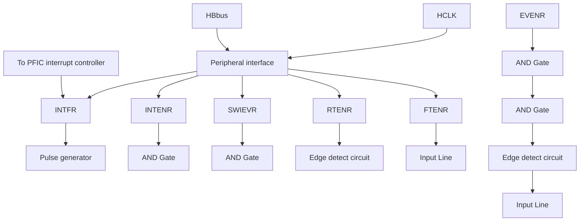

由图 6-1 可以看出，外部中断的触发源既可以是软件中断（SWIEVR）也可以是实际的外部中断通道，外部中断通道的信号会先经过边沿检测电路（edge detect circuit）的筛选。只要产生软件中断或外部中断信号其一，就会通过图中的或门电路输出给事件使能和中断使能两个与门电路，只要有中断被使能或事件被使能，就会产生中断或事件。EXTI 的六个寄存器由处理器通过 HB 接口访问。

# 6.4.2 唤醒事件说明

系统可以通过唤醒事件来唤醒由WFE指令引起的睡眠模式。唤醒事件通过以下两种配置产生：

- 在外设的寄存器里使能一个中断，但不在内核的 PFIC 里使能这个中断，同时在内核里使能 SEVONPEND 位。体现在 EXTI 中，就是使能 EXTI 中断，但不在 PFIC 中使能 EXTI 中断，同时使能 SEVONPEND 位。当 CPU 从 WFE 中唤醒后，需要清除 EXTI 的中断标志位和 PFIC 挂起位。  
- 使能一个EXTI通道为事件通道，CPU从WFE唤醒后无需清除中断标志位和PFIC挂起位的操作。

# 6.4.3 说明

使用外部中断需要配置相应外部中断通道，即选择相应触发沿，使能相应中断。当外部中断通道上出现了设定的触发沿时，将产生一个中断请求，对应的中断标志位也会被置位。对标志位写 1 可以清除该标志位。

使用外部硬件中断步骤：

1）配置 GPIO 操作；  
2）配置对应的外部中断通道的中断使能位（EXTI\_INTENR）；  
3）配置触发沿（EXTI\_RTENR或EXTI\_FTENR），选择上升沿触发、下降沿触发或双边沿触发；  
4）在内核的 PFIC 中配置 EXTI 中断，以保证其可以正确响应。

使用外部硬件事件步骤：

1）配置 GPIO 操作；  
2）配置对应的外部中断通道的事件使能位（EXTI\_EVENR）；  
3）配置触发沿（EXTI\_RTENR 或 EXTI\_FTENR），选择上升沿触发、下降沿触发或双边沿触发。

使用软件中断/事件步骤：

1）使能外部中断（EXTI\_INTENR）或外部事件（EXTI\_EVENR）；  
2）如果使用中断服务函数，需要设置内核的 PFIC 里 EXTI 中断；  
3）设置软件中断触发（EXTI\_SWIEVR），即会产生中断。

# 6.4.4 外部事件映射

表 6-2 EXTI 中断映射

<table><tr><td>外部中断/事件线路</td><td>映射事件描述</td></tr><tr><td>EXT10~EXT17</td><td>Px0~Px7(x=A/C/D),任何一个10口都可以启用外部中断/事件功能,由AF10_EXTICR寄存器配置。</td></tr><tr><td>EXT18</td><td>PVD事件:超出电压监控阈值。</td></tr><tr><td>EXT19</td><td>自动唤醒事件。</td></tr></table>

# 6.5 寄存器描述

# 6.5.1 EXTI 寄存器描述

表 6-3 EXTI 相关寄存器列表

<table><tr><td>名称</td><td>访问地址</td><td>描述</td><td>复位值</td></tr><tr><td>R32_EXTI_INTENR</td><td>0x40010400</td><td>中断使能寄存器</td><td>0x00000000</td></tr><tr><td>R32_EXTI_EVENR</td><td>0x40010404</td><td>事件使能寄存器</td><td>0x00000000</td></tr><tr><td>R32_EXTI_RTENR</td><td>0x40010408</td><td>上升沿触发使能寄存器</td><td>0x00000000</td></tr><tr><td>R32_EXTI_FTENR</td><td>0x4001040C</td><td>下降沿触发使能寄存器</td><td>0x00000000</td></tr><tr><td>R32_EXTI_SWIEVR</td><td>0x40010410</td><td>软中断事件寄存器</td><td>0x00000000</td></tr><tr><td>R32_EXTI_INTFR</td><td>0x40010414</td><td>中断标志位寄存器</td><td>0x0000XXXX</td></tr></table>

# 6.5.1.1 中断使能寄存器（EXTI\_INTENR）

偏移地址：0x00

<table><tr><td>31</td><td>30</td><td>29</td><td>28</td><td>27</td><td>26</td><td>25</td><td>24</td><td>23</td><td>22</td><td>21</td><td>20</td><td>19</td><td>18</td><td>17</td><td>16</td></tr><tr><td colspan="16">Reserved</td></tr><tr><td>15</td><td>14</td><td>13</td><td>12</td><td>11</td><td>10</td><td>9</td><td>8</td><td>7</td><td>6</td><td>5</td><td>4</td><td>3</td><td>2</td><td>1</td><td>0</td></tr><tr><td colspan="6">Reserved</td><td>MR9</td><td>MR8</td><td>MR7</td><td>MR6</td><td>MR5</td><td>MR4</td><td>MR3</td><td>MR2</td><td>MR1</td><td>MRO</td></tr></table>

<table><tr><td>位</td><td>名称</td><td>访问</td><td>描述</td><td>复位值</td></tr><tr><td>[31:10]</td><td>Reserved</td><td>RO</td><td>保留。</td><td>0</td></tr><tr><td>[9:0]</td><td>MRx</td><td>RW</td><td>使能外部中断通道 x 的中断请求信号。1:使能此通道的中断;0:屏蔽此通道的中断。</td><td>0</td></tr></table>

# 6.5.1.2 事件使能寄存器（EXTI\_EVENR）

偏移地址：0x04

<table><tr><td>31</td><td>30</td><td>29</td><td>28</td><td>27</td><td>26</td><td>25</td><td>24</td><td>23</td><td>22</td><td>21</td><td>20</td><td>19</td><td>18</td><td>17</td><td>16</td></tr><tr><td colspan="16">Reserved</td></tr><tr><td>15</td><td>14</td><td>13</td><td>12</td><td>11</td><td>10</td><td>9</td><td>8</td><td>7</td><td>6</td><td>5</td><td>4</td><td>3</td><td>2</td><td>1</td><td>0</td></tr><tr><td colspan="6">Reserved</td><td>MR9</td><td>MR8</td><td>MR7</td><td>MR6</td><td>MR5</td><td>MR4</td><td>MR3</td><td>MR2</td><td>MR1</td><td>MR0</td></tr></table>

<table><tr><td>位</td><td>名称</td><td>访问</td><td>描述</td><td>复位值</td></tr><tr><td>[31:10]</td><td>Reserved</td><td>RO</td><td>保留。</td><td>0</td></tr><tr><td>[9:0]</td><td>MRx</td><td>RW</td><td>使能外部中断通道 x 的事件请求信号。1:使能此通道的事件;0:屏蔽此通道的事件。</td><td>0</td></tr></table>

# 6.5.1.3 上升沿触发使能寄存器（EXTI\_RTENR）

偏移地址：0x08

<table><tr><td>31</td><td>30</td><td>29</td><td>28</td><td>27</td><td>26</td><td>25</td><td>24</td><td>23</td><td>22</td><td>21</td><td>20</td><td>19</td><td>18</td><td>17</td><td>16</td></tr><tr><td colspan="16">Reserved</td></tr><tr><td>15</td><td>14</td><td>13</td><td>12</td><td>11</td><td>10</td><td>9</td><td>8</td><td>7</td><td>6</td><td>5</td><td>4</td><td>3</td><td>2</td><td>1</td><td>0</td></tr><tr><td colspan="6">Reserved</td><td>TR9</td><td>TR8</td><td>TR7</td><td>TR6</td><td>TR5</td><td>TR4</td><td>TR3</td><td>TR2</td><td>TR1</td><td>TR0</td></tr></table>

<table><tr><td>位</td><td>名称</td><td>访问</td><td>描述</td><td>复位值</td></tr><tr><td>[31:10]</td><td>Reserved</td><td>RO</td><td>保留。</td><td>0</td></tr><tr><td>[9:0]</td><td>TRx</td><td>RW</td><td>使能外部中断通道 x 的上升沿触发。1:使能此通道的上升沿触发;0:禁止此通道的上升沿触发。</td><td>0</td></tr></table>

# 6.5.1.4 下降沿触发使能寄存器（EXTI\_FTENR）

偏移地址：0x0C

<table><tr><td>31</td><td>30</td><td>29</td><td>28</td><td>27</td><td>26</td><td>25</td><td>24</td><td>23</td><td>22</td><td>21</td><td>20</td><td>19</td><td>18</td><td>17</td><td>16</td></tr><tr><td colspan="16">Reserved</td></tr><tr><td>15</td><td>14</td><td>13</td><td>12</td><td>11</td><td>10</td><td>9</td><td>8</td><td>7</td><td>6</td><td>5</td><td>4</td><td>3</td><td>2</td><td>1</td><td>0</td></tr><tr><td colspan="6">Reserved</td><td>TR9</td><td>TR8</td><td>TR7</td><td>TR6</td><td>TR5</td><td>TR4</td><td>TR3</td><td>TR2</td><td>TR1</td><td>TR0</td></tr></table>

<table><tr><td>位</td><td>名称</td><td>访问</td><td>描述</td><td>复位值</td></tr><tr><td>[31:10]</td><td>Reserved</td><td>RO</td><td>保留。</td><td>0</td></tr><tr><td>[9:0]</td><td>TRx</td><td>RW</td><td>使能外部中断通道 x 的下降沿触发。1:使能此通道的下降沿触发;0:禁止此通道的下降沿触发。</td><td>0</td></tr></table>

# 6.5.1.5 软中断事件寄存器（EXTI\_SWIEVR）

偏移地址：0x10

<table><tr><td>31</td><td>30</td><td>29</td><td>28</td><td>27</td><td>26</td><td>25</td><td>24</td><td>23</td><td>22</td><td>21</td><td>20</td><td>19</td><td>18</td><td>17</td><td>16</td></tr><tr><td colspan="16">Reserved</td></tr><tr><td>15</td><td>14</td><td>13</td><td>12</td><td>11</td><td>10</td><td>9</td><td>8</td><td>7</td><td>6</td><td>5</td><td>4</td><td>3</td><td>2</td><td>1</td><td>0</td></tr><tr><td colspan="6">Reserved</td><td>SWIER 9</td><td>SWIER 8</td><td>SWIER 7</td><td>SWIER 6</td><td>SWIER 5</td><td>SWIER 4</td><td>SWIER 3</td><td>SWIER 2</td><td>SWIER 1</td><td>SWIER 0</td></tr></table>

<table><tr><td>位</td><td>名称</td><td>访问</td><td>描述</td><td>复位值</td></tr><tr><td>[31:10]</td><td>Reserved</td><td>RO</td><td>保留。</td><td>0</td></tr><tr><td>[9:0]</td><td>SWIERx</td><td>RW</td><td>在相对应的外部触发中断通道上设置一个软件中断。这里置位会使中断标志位(EXTI_INTFR)对应位置位,如果中断使能(EXTI_INTENR)或事件使能(EXTI_EVENR)开启,那么就会产生中断或事件。</td><td>0</td></tr></table>

# 6.5.1.6 中断标志位寄存器（EXTI\_INTFR）

偏移地址：0x14

<table><tr><td>31</td><td>30</td><td>29</td><td>28</td><td>27</td><td>26</td><td>25</td><td>24</td><td>23</td><td>22</td><td>21</td><td>20</td><td>19</td><td>18</td><td>17</td><td>16</td></tr><tr><td colspan="16">Reserved</td></tr><tr><td>15</td><td>14</td><td>13</td><td>12</td><td>11</td><td>10</td><td>9</td><td>8</td><td>7</td><td>6</td><td>5</td><td>4</td><td>3</td><td>2</td><td>1</td><td>0</td></tr><tr><td colspan="6">Reserved</td><td>IF9</td><td>IF8</td><td>IF7</td><td>IF6</td><td>IF5</td><td>IF4</td><td>IF3</td><td>IF2</td><td>IF1</td><td>IF0</td></tr></table>

<table><tr><td>位</td><td>名称</td><td>访问</td><td>描述</td><td>复位值</td></tr><tr><td>[31:10]</td><td>Reserved</td><td>R0</td><td>保留。</td><td>0</td></tr><tr><td>[9:0]</td><td>IFx</td><td>W1</td><td>中断标志位,该位置位标志表示发生了对应的外部中断。写1可以清除此位。</td><td>X</td></tr></table>

# 6.5.2 PFIC 寄存器描述

表 6-4 PFIC 相关寄存器列表

<table><tr><td>名称</td><td>访问地址</td><td>描述</td><td>复位值</td></tr><tr><td>R32_PFIC_ISR1</td><td>0xE000E000</td><td>PFIC 中断使能状态寄存器 1</td><td>0x0000000C</td></tr><tr><td>R32_PFIC_ISR2</td><td>0xE000E004</td><td>PFIC 中断使能状态寄存器 2</td><td>0x00000000</td></tr><tr><td>R32_PFIC_IPR1</td><td>0xE000E020</td><td>PFIC 中断挂起状态寄存器 1</td><td>0x00000000</td></tr><tr><td>R32_PFIC_IPR2</td><td>0xE000E024</td><td>PFIC 中断挂起状态寄存器 2</td><td>0x00000000</td></tr><tr><td>R32_PFIC_ITHRESDR</td><td>0xE000E040</td><td>PFIC 中断优先级阈值配置寄存器</td><td>0x00000000</td></tr><tr><td>R32_PFIC_CFGR</td><td>0xE000E048</td><td>PFIC 中断配置寄存器</td><td>0x00000000</td></tr><tr><td>R32_PFIC_GISR</td><td>0xE000E04C</td><td>PFIC 中断全局状态寄存器</td><td>0x00000000</td></tr><tr><td>R32_PFIC_VTFIDR</td><td>0xE000E050</td><td>PFIC VTF 中断 ID 配置寄存器</td><td>0x00000000</td></tr><tr><td>R32_PFIC_VTFADDRRO</td><td>0xE000E060</td><td>PFIC VTF 中断 0 偏移地址寄存器</td><td>0x00000000</td></tr><tr><td>R32_PFIC_VTFADDRR1</td><td>0xE000E064</td><td>PFIC VTF 中断 1 偏移地址寄存器</td><td>0x00000000</td></tr><tr><td>R32_PFIC_IENR1</td><td>0xE000E100</td><td>PFIC 中断使能设置寄存器 1</td><td>0x00000000</td></tr><tr><td>R32_PFIC_IENR2</td><td>0xE000E104</td><td>PFIC 中断使能设置寄存器 2</td><td>0x00000000</td></tr><tr><td>R32_PFIC_IRER1</td><td>0xE000E180</td><td>PFIC 中断使能清除寄存器 1</td><td>0x00000000</td></tr><tr><td>R32_PFIC_IRER2</td><td>0xE000E184</td><td>PFIC 中断使能清除寄存器 2</td><td>0x00000000</td></tr><tr><td>R32_PFIC_IPSR1</td><td>0xE000E200</td><td>PFIC 中断挂起设置寄存器 1</td><td>0x00000000</td></tr><tr><td>R32_PFIC_IPSR2</td><td>0xE000E204</td><td>PFIC 中断挂起设置寄存器 2</td><td>0x00000000</td></tr><tr><td>R32_PFIC_IPRR1</td><td>0xE000E280</td><td>PFIC 中断挂起清除寄存器 1</td><td>0x00000000</td></tr><tr><td>R32_PFIC_IPRR2</td><td>0xE000E284</td><td>PFIC 中断挂起清除寄存器 2</td><td>0x00000000</td></tr><tr><td>R32_PFIC_IACTR1</td><td>0xE000E300</td><td>PFIC 中断激活状态寄存器 1</td><td>0x00000000</td></tr><tr><td>R32_PFIC_IACTR2</td><td>0xE000E304</td><td>PFIC 中断激活状态寄存器 2</td><td>0x00000000</td></tr><tr><td>R32_PFIC_IPRIORx</td><td>0xE000E400</td><td>PFIC 中断优先级配置寄存器</td><td>0x00000000</td></tr><tr><td>R32_PFIC_SCTLR</td><td>0xE000ED10</td><td>PFIC 系统控制寄存器</td><td>0x00000000</td></tr></table>

注：1. PFIC\_ISR1 寄存器的默认值为 0xC，即 NMI 和异常总是默认使能的。  
2. NMI、EXC 支持中断挂起清除和设置操作，不支持中断使能清除和设置操作。

注: 在使用 PFIC\_IENRx 寄存器屏蔽任意中断或使用 CSR 寄存器屏蔽全局中断时, 追加一条“fence.i”指令, 用于内核控制状态和中断使能状态之间的同步。

# 6.5.2.1 PFIC 中断使能状态寄存器 1（PFIC\_ISR1）

偏移地址：0x00

<table><tr><td>31</td><td>30</td><td>29</td><td>28</td><td>27</td><td>26</td><td>25</td><td>24</td><td>23</td><td>22</td><td>21</td><td>20</td><td>19</td><td>18</td><td>17</td><td>16</td></tr><tr><td colspan="16">INTENSTA[31:16]</td></tr><tr><td>15</td><td>14</td><td>13</td><td>12</td><td>11</td><td>10</td><td>9</td><td>8</td><td>7</td><td>6</td><td>5</td><td>4</td><td>3</td><td>2</td><td>1</td><td>0</td></tr><tr><td>Reserved</td><td>INTENSTA14</td><td>Reserved</td><td>INTENSTA12</td><td colspan="8">Reserved</td><td>INTENSTA3</td><td>INTENSTA2</td><td colspan="2">Reserved</td></tr></table>

<table><tr><td>位</td><td>名称</td><td>访问</td><td>描述</td><td>复位值</td></tr><tr><td>[31:16]</td><td>INTENSTA</td><td>RO</td><td>16#-31#中断当前使能状态。1:当前编号中断已使能;0:当前编号中断未启用。</td><td>0</td></tr><tr><td>15</td><td>Reserved</td><td>RO</td><td>保留。</td><td>0</td></tr><tr><td>14</td><td>INTENSTA</td><td>RO</td><td>14#中断当前使能状态。1:当前编号中断已使能;0:当前编号中断未启用。</td><td>0</td></tr><tr><td>13</td><td>Reserved</td><td>RO</td><td>保留。</td><td>0</td></tr><tr><td>12</td><td>INTENSTA</td><td>RO</td><td>12#中断当前使能状态。1:当前编号中断已使能;0:当前编号中断未启用。</td><td>0</td></tr><tr><td>[11:4]</td><td>Reserved</td><td>RO</td><td>保留。</td><td>0</td></tr><tr><td>[3:2]</td><td>INTENSTA</td><td>RO</td><td>2#-3#中断当前使能状态。1:当前编号中断已使能;0:当前编号中断未启用。</td><td>0x3</td></tr><tr><td>[1:0]</td><td>Reserved</td><td>RO</td><td>保留。</td><td>0</td></tr></table>

# 6.5.2.2 PFIC 中断使能状态寄存器 2（PFIC\_ISR2）

偏移地址：0x04

<table><tr><td>31</td><td>30</td><td>29</td><td>28</td><td>27</td><td>26</td><td>25</td><td>24</td><td>23</td><td>22</td><td>21</td><td>20</td><td>19</td><td>18</td><td>17</td><td>16</td></tr><tr><td colspan="16">Reserved</td></tr><tr><td>15</td><td>14</td><td>13</td><td>12</td><td>11</td><td>10</td><td>9</td><td>8</td><td>7</td><td>6</td><td>5</td><td>4</td><td>3</td><td>2</td><td>1</td><td>0</td></tr><tr><td colspan="9">Reserved</td><td colspan="7">INTENSTA[6:0]</td></tr></table>

<table><tr><td>位</td><td>名称</td><td>访问</td><td>描述</td><td>复位值</td></tr><tr><td>[31:7]</td><td>Reserved</td><td>RO</td><td>保留。</td><td>0</td></tr><tr><td>[6:0]</td><td>INTENSTA</td><td>RO</td><td>32#-38#中断当前使能状态。1:当前编号中断已使能;0:当前编号中断未启用。</td><td>0</td></tr></table>

# 6.5.2.3 PFIC 中断挂起状态寄存器 1（PFIC\_IPR1）

偏移地址：0x20

<table><tr><td>31</td><td>30</td><td>29</td><td>28</td><td>27</td><td>26</td><td>25</td><td>24</td><td>23</td><td>22</td><td>21</td><td>20</td><td>19</td><td>18</td><td>17</td><td>16</td></tr><tr><td colspan="16">PENDSTA[31:16]</td></tr><tr><td>15</td><td>14</td><td>13</td><td>12</td><td>11</td><td>10</td><td>9</td><td>8</td><td>7</td><td>6</td><td>5</td><td>4</td><td>3</td><td>2</td><td>1</td><td>0</td></tr><tr><td>Reserved</td><td>PENDSTA14</td><td>Reserved</td><td>PENDSTA12</td><td colspan="8">Reserved</td><td>PENDSTA3</td><td>PENDSTA2</td><td colspan="2">Reserved</td></tr></table>

<table><tr><td>位</td><td>名称</td><td>访问</td><td>描述</td><td>复位值</td></tr><tr><td>[31:16]</td><td>PENDSTA</td><td>RO</td><td>16#-31#中断当前挂起状态。1:当前编号中断已挂起;0:当前编号中断未挂起。</td><td>0</td></tr><tr><td>15</td><td>Reserved</td><td>RO</td><td>保留。</td><td>0</td></tr><tr><td>14</td><td>PENDSTA</td><td>RO</td><td>14#中断当前挂起状态。1:当前编号中断已挂起;0:当前编号中断未挂起。</td><td>0</td></tr><tr><td>13</td><td>Reserved</td><td>RO</td><td>保留。</td><td>0</td></tr><tr><td>12</td><td>PENDSTA</td><td>RO</td><td>12#中断当前挂起状态。1:当前编号中断已挂起;0:当前编号中断未挂起。</td><td>0</td></tr><tr><td>[11:4]</td><td>Reserved</td><td>RO</td><td>保留。</td><td>0</td></tr><tr><td>[3:2]</td><td>PENDSTA</td><td>RO</td><td>2#-3#中断当前挂起状态。1:当前编号中断已挂起;0:当前编号中断未挂起。</td><td>0</td></tr><tr><td>[1:0]</td><td>Reserved</td><td>RO</td><td>保留。</td><td>0</td></tr></table>

# 6.5.2.4 PFIC 中断挂起状态寄存器 2（PFIC\_IPR2）

偏移地址：0x24

<table><tr><td>31</td><td>30</td><td>29</td><td>28</td><td>27</td><td>26</td><td>25</td><td>24</td><td>23</td><td>22</td><td>21</td><td>20</td><td>19</td><td>18</td><td>17</td><td>16</td></tr><tr><td colspan="16">Reserved</td></tr><tr><td>15</td><td>14</td><td>13</td><td>12</td><td>11</td><td>10</td><td>9</td><td>8</td><td>7</td><td>6</td><td>5</td><td>4</td><td>3</td><td>2</td><td>1</td><td>0</td></tr><tr><td colspan="9">Reserved</td><td colspan="7">PENDSTA[38:32]</td></tr></table>

<table><tr><td>位</td><td>名称</td><td>访问</td><td>描述</td><td>复位值</td></tr><tr><td>[31:7]</td><td>Reserved</td><td>RO</td><td>保留。</td><td>0</td></tr><tr><td>[6:0]</td><td>PENDSTA</td><td>RO</td><td>32#-38#中断当前挂起状态。1:当前编号中断已挂起;0:当前编号中断未挂起。</td><td>0</td></tr></table>

# 6.5.2.5 PFIC 中断优先级阈值配置寄存器（PFIC\_ITHRESDR）

偏移地址：0x40

31 30 29 28 27 26 25 24 23 22 21 20 19 18 17 16 15 14 13 12 11 10 9 8 7 6 5 4 3 2 1 0

<table><tr><td>Reserved</td><td>THRESHOLD [7:0]</td></tr></table>

<table><tr><td>位</td><td>名称</td><td>访问</td><td>描述</td><td>复位值</td></tr><tr><td>[31:8]</td><td>Reserved</td><td>RO</td><td>保留。</td><td>0</td></tr><tr><td>[7:0]</td><td>THRESHOLD[7:0]</td><td>RW</td><td>中断优先级阈值设置值。低于当前设置值的中断优先级值,当挂起时不执行中断服务;此寄存器为0时表示阈值寄存器功能无效。[7:6]:优先级阈值;[5:0]:保留,固定为0,写无效。</td><td>0</td></tr></table>

# 6.5.2.6 PFIC 中断配置寄存器（PFIC\_CFGR）

偏移地址：0x48

<table><tr><td>31</td><td>30</td><td>29</td><td>28</td><td>27</td><td>26</td><td>25</td><td>24</td><td>23</td><td>22</td><td>21</td><td>20</td><td>19</td><td>18</td><td>17</td><td>16</td></tr><tr><td colspan="16">KEYCODE[15:0]</td></tr><tr><td>15</td><td>14</td><td>13</td><td>12</td><td>11</td><td>10</td><td>9</td><td>8</td><td>7</td><td>6</td><td>5</td><td>4</td><td>3</td><td>2</td><td>1</td><td>0</td></tr><tr><td colspan="8">Reserved</td><td>RSTSYS</td><td colspan="7">Reserved</td></tr></table>

<table><tr><td>位</td><td>名称</td><td>访问</td><td>描述</td><td>复位值</td></tr><tr><td>[31:16]</td><td>KEYCODE[15:0]</td><td>WO</td><td>对应不同的目标控制位,需要同步写入相应的安全访问标识数据才能修改,读出数据固定为0。KEY1 = 0xFA05;KEY2 = 0xBCAF;KEY3 = 0xBEEF。</td><td>0</td></tr><tr><td>[15:8]</td><td>Reserved</td><td>RO</td><td>保留。</td><td>0</td></tr><tr><td>7</td><td>RSTSYS</td><td>WO</td><td>系统复位(同步写入KEY3)。自动清0。写1有效,写0无效。注:与PFIC_SCTLR寄存器SYSRST位作用相同。</td><td>0</td></tr><tr><td>[6:0]</td><td>Reserved</td><td>RO</td><td>保留。</td><td>0</td></tr></table>

# 6.5.2.7 PFIC 中断全局状态寄存器（PFIC\_GISR）

偏移地址：0x4C

<table><tr><td>31</td><td>30</td><td>29</td><td>28</td><td>27</td><td>26</td><td>25</td><td>24</td><td>23</td><td>22</td><td>21</td><td>20</td><td>19</td><td>18</td><td>17</td><td>16</td></tr><tr><td colspan="16">Reserved</td></tr><tr><td>15</td><td>14</td><td>13</td><td>12</td><td>11</td><td>10</td><td>9</td><td>8</td><td>7</td><td>6</td><td>5</td><td>4</td><td>3</td><td>2</td><td>1</td><td>0</td></tr><tr><td colspan="6">Reserved</td><td>GPEND STA</td><td>GACT STA</td><td colspan="8">NESTSTA[7:0]</td></tr></table>

<table><tr><td>位</td><td>名称</td><td>访问</td><td>描述</td><td>复位值</td></tr><tr><td>[31:10]</td><td>Reserved</td><td>RO</td><td>保留。</td><td>0</td></tr><tr><td>9</td><td>GPENDSTA</td><td>RO</td><td>当前是否有中断处于挂起。1:有; 0:没有。</td><td>0</td></tr><tr><td>8</td><td>GACTSTA</td><td>RO</td><td>当前是否有中断被执行。1:有; 0:没有。</td><td>0</td></tr><tr><td>[7:0]</td><td>NESTSTA[7:0]</td><td>RO</td><td>当前中断嵌套状态,目前最大支持2级嵌套,硬件压栈深度最大为2级。0x03:第2级中断中;0x01:第1级中断中;其他:没有中断发生。</td><td>0</td></tr></table>

# 6.5.2.8 PFIC VTF 中断 ID 配置寄存器（PFIC\_VTFIDR）

偏移地址：0x50

<table><tr><td>31</td><td>30</td><td>29</td><td>28</td><td>27</td><td>26</td><td>25</td><td>24</td><td>23</td><td>22</td><td>21</td><td>20</td><td>19</td><td>18</td><td>17</td><td>16</td></tr><tr><td colspan="16">Reserved</td></tr><tr><td>15</td><td>14</td><td>13</td><td>12</td><td>11</td><td>10</td><td>9</td><td>8</td><td>7</td><td>6</td><td>5</td><td>4</td><td>3</td><td>2</td><td>1</td><td>0</td></tr><tr><td colspan="8">VTFID1</td><td colspan="8">VTFID0</td></tr></table>

<table><tr><td>位</td><td>名称</td><td>访问</td><td>描述</td><td>复位值</td></tr><tr><td>[31:16]</td><td>Reserved</td><td>R0</td><td>保留。</td><td>0</td></tr><tr><td>[15:8]</td><td>VTFID1</td><td>RW</td><td>配置 VTF 中断 1 的中断编号。</td><td>0</td></tr><tr><td>[7:0]</td><td>VTFID0</td><td>RW</td><td>配置 VTF 中断 0 的中断编号。</td><td>0</td></tr></table>

# 6.5.2.9 PFIC VTF 中断 0 地址寄存器（PFIC\_VTFADDRRO）

偏移地址：0x60

<table><tr><td>31</td><td>30</td><td>29</td><td>28</td><td>27</td><td>26</td><td>25</td><td>24</td><td>23</td><td>22</td><td>21</td><td>20</td><td>19</td><td>18</td><td>17</td><td>16</td></tr><tr><td colspan="16">ADDR0[31:16]</td></tr><tr><td>15</td><td>14</td><td>13</td><td>12</td><td>11</td><td>10</td><td>9</td><td>8</td><td>7</td><td>6</td><td>5</td><td>4</td><td>3</td><td>2</td><td>1</td><td>0</td></tr><tr><td colspan="15">ADDR0[15:1]</td><td>VTFOEN</td></tr></table>

<table><tr><td>位</td><td>名称</td><td>访问</td><td>描述</td><td>复位值</td></tr><tr><td>[31:1]</td><td>ADDR0[31:1]</td><td>RW</td><td>VTF 中断 0 服务程序地址 bit[31:1],bit0 为 0。</td><td>0</td></tr><tr><td>0</td><td>VTFOEN</td><td>RW</td><td>VTF 中断 0 使能位。1:启用 VTF 中断 0 通道;0:关闭。</td><td>0</td></tr></table>

# 6.5.2.10 PFIC VTF 中断 1 地址寄存器（PFIC\_VTFADDRR1）

偏移地址：0x64

<table><tr><td>31</td><td>30</td><td>29</td><td>28</td><td>27</td><td>26</td><td>25</td><td>24</td><td>23</td><td>22</td><td>21</td><td>20</td><td>19</td><td>18</td><td>17</td><td>16</td></tr><tr><td colspan="16">ADDR1 [31:16]</td></tr><tr><td>15</td><td>14</td><td>13</td><td>12</td><td>11</td><td>10</td><td>9</td><td>8</td><td>7</td><td>6</td><td>5</td><td>4</td><td>3</td><td>2</td><td>1</td><td>0</td></tr><tr><td colspan="15">ADDR1 [15:1]</td><td>VTF1EN</td></tr></table>

<table><tr><td>位</td><td>名称</td><td>访问</td><td>描述</td><td>复位值</td></tr><tr><td>[31:1]</td><td>ADDR1 [31:1]</td><td>RW</td><td>VTF 中断 1 服务程序地址 bit[31:1],bit0 为 0。</td><td>0</td></tr><tr><td>0</td><td>VTF1EN</td><td>RW</td><td>VTF 中断 1 使能位。1:启用 VTF 中断 1 通道;0:关闭。</td><td>0</td></tr></table>

# 6.5.2.11 PFIC 中断使能设置寄存器 1（PFIC\_IENR1）

偏移地址：0x100

<table><tr><td>31</td><td>30</td><td>29</td><td>28</td><td>27</td><td>26</td><td>25</td><td>24</td><td>23</td><td>22</td><td>21</td><td>20</td><td>19</td><td>18</td><td>17</td><td>16</td></tr><tr><td colspan="16">INTEN[31:16]</td></tr><tr><td>15</td><td>14</td><td>13</td><td>12</td><td>11</td><td>10</td><td>9</td><td>8</td><td>7</td><td>6</td><td>5</td><td>4</td><td>3</td><td>2</td><td>1</td><td>0</td></tr><tr><td>Reserved</td><td>INTEN14</td><td>Reserved</td><td>INTEN12</td><td colspan="12">Reserved</td></tr></table>

<table><tr><td>位</td><td>名称</td><td>访问</td><td>描述</td><td>复位值</td></tr><tr><td>[31:16]</td><td>INTEN</td><td>WO</td><td>16#-31#中断使能控制。1:当前编号中断使能;0:无影响。</td><td>0</td></tr><tr><td>15</td><td>Reserved</td><td>RO</td><td>保留。</td><td>0</td></tr><tr><td>14</td><td>INTEN</td><td>WO</td><td>14#中断使能控制。1:当前编号中断使能;0:无影响。</td><td>0</td></tr><tr><td>13</td><td>Reserved</td><td>RO</td><td>保留。</td><td>0</td></tr><tr><td>12</td><td>INTEN</td><td>WO</td><td>12#中断使能控制。1:当前编号中断使能;0:无影响。</td><td>0</td></tr><tr><td>[11:0]</td><td>Reserved</td><td>RO</td><td>保留。</td><td>0</td></tr></table>

# 6.5.2.12 PFIC 中断使能设置寄存器 2（PFIC\_IENR2）

偏移地址：0x104

<table><tr><td>31</td><td>30</td><td>29</td><td>28</td><td>27</td><td>26</td><td>25</td><td>24</td><td>23</td><td>22</td><td>21</td><td>20</td><td>19</td><td>18</td><td>17</td><td>16</td></tr><tr><td colspan="16">Reserved</td></tr><tr><td>15</td><td>14</td><td>13</td><td>12</td><td>11</td><td>10</td><td>9</td><td>8</td><td>7</td><td>6</td><td>5</td><td>4</td><td>3</td><td>2</td><td>1</td><td>0</td></tr><tr><td colspan="9">Reserved</td><td colspan="7">INTEN[38:32]</td></tr></table>

<table><tr><td>位</td><td>名称</td><td>访问</td><td>描述</td><td>复位值</td></tr><tr><td>[31:7]</td><td>Reserved</td><td>RO</td><td>保留。</td><td>0</td></tr><tr><td>[6:0]</td><td>INTEN</td><td>WO</td><td>32#-38#中断使能控制。1:当前编号中断使能;0:无影响。</td><td>0</td></tr></table>

# 6.5.2.13 PFIC 中断使能清除寄存器 1（PFIC\_IRER1）

偏移地址：0x180

<table><tr><td>31</td><td>30</td><td>29</td><td>28</td><td>27</td><td>26</td><td>25</td><td>24</td><td>23</td><td>22</td><td>21</td><td>20</td><td>19</td><td>18</td><td>17</td><td>16</td></tr><tr><td colspan="16">INTRSET [31:16]</td></tr><tr><td>15</td><td>14</td><td>13</td><td>12</td><td>11</td><td>10</td><td>9</td><td>8</td><td>7</td><td>6</td><td>5</td><td>4</td><td>3</td><td>2</td><td>1</td><td>0</td></tr><tr><td>Reserved</td><td>INTRSET 14</td><td>Reserved</td><td>INTRSET1 2</td><td colspan="12">Reserved</td></tr></table>

<table><tr><td>位</td><td>名称</td><td>访问</td><td>描述</td><td>复位值</td></tr><tr><td>[31:16]</td><td>INTRSET</td><td>WO</td><td>16#-31#中断关闭控制。1:当前编号中断关闭;0:无影响。</td><td>0</td></tr><tr><td>15</td><td>Reserved</td><td>RO</td><td>保留。</td><td>0</td></tr><tr><td>14</td><td>INTRSET</td><td>WO</td><td>14#中断关闭控制。1:当前编号中断关闭;0:无影响。</td><td>0</td></tr><tr><td>13</td><td>Reserved</td><td>RO</td><td>保留。</td><td>0</td></tr><tr><td>12</td><td>INTRSET</td><td>WO</td><td>12#中断关闭控制。1:当前编号中断关闭;0:无影响。</td><td>0</td></tr><tr><td>[11:0]</td><td>Reserved</td><td>R0</td><td>保留。</td><td>0</td></tr></table>

# 6.5.2.14 PFIC 中断使能清除寄存器 2（PFIC\_IRER2）

偏移地址：0x184

<table><tr><td>31</td><td>30</td><td>29</td><td>28</td><td>27</td><td>26</td><td>25</td><td>24</td><td>23</td><td>22</td><td>21</td><td>20</td><td>19</td><td>18</td><td>17</td><td>16</td></tr><tr><td colspan="16">Reserved</td></tr><tr><td>15</td><td>14</td><td>13</td><td>12</td><td>11</td><td>10</td><td>9</td><td>8</td><td>7</td><td>6</td><td>5</td><td>4</td><td>3</td><td>2</td><td>1</td><td>0</td></tr><tr><td colspan="9">Reserved</td><td colspan="7">INTRSET[38:32]</td></tr></table>

<table><tr><td>位</td><td>名称</td><td>访问</td><td>描述</td><td>复位值</td></tr><tr><td>[31:7]</td><td>Reserved</td><td>RO</td><td>保留。</td><td>0</td></tr><tr><td>[6:0]</td><td>INTRSET</td><td>WO</td><td>32#-38#中断关闭控制。1:当前编号中断关闭;0:无影响。</td><td>0</td></tr></table>

# 6.5.2.15 PFIC 中断挂起设置寄存器 1（PFIC\_IPSR1）

偏移地址：0x200

<table><tr><td>31</td><td>30</td><td>29</td><td>28</td><td>27</td><td>26</td><td>25</td><td>24</td><td>23</td><td>22</td><td>21</td><td>20</td><td>19</td><td>18</td><td>17</td><td>16</td></tr><tr><td colspan="16">PENDSET [31:16]</td></tr><tr><td>15</td><td>14</td><td>13</td><td>12</td><td>11</td><td>10</td><td>9</td><td>8</td><td>7</td><td>6</td><td>5</td><td>4</td><td>3</td><td>2</td><td>1</td><td>0</td></tr><tr><td>Reserved</td><td>PEND SET14</td><td>Reserved</td><td>PEND SET12</td><td colspan="8">Reserved</td><td>PEND SET3</td><td>PEND SET2</td><td colspan="2">Reserved</td></tr></table>

<table><tr><td>位</td><td>名称</td><td>访问</td><td>描述</td><td>复位值</td></tr><tr><td>[31:16]</td><td>PENDSET</td><td>WO</td><td>16#-31#中断挂起设置。1:当前编号中断挂起;0:无影响。</td><td>0</td></tr><tr><td>15</td><td>Reserved</td><td>RO</td><td>保留。</td><td>0</td></tr><tr><td>14</td><td>PENDSET</td><td>WO</td><td>14#中断挂起设置。1:当前编号中断挂起;0:无影响。</td><td>0</td></tr><tr><td>13</td><td>Reserved</td><td>RO</td><td>保留。</td><td>0</td></tr><tr><td>12</td><td>PENDSET</td><td>WO</td><td>12#中断挂起设置。1:当前编号中断挂起;0:无影响。</td><td>0</td></tr><tr><td>[11:4]</td><td>Reserved</td><td>RO</td><td>保留。</td><td>0</td></tr><tr><td>[3:2]</td><td>PENDSET</td><td>WO</td><td>2#-3#中断挂起设置。1:当前编号中断挂起;0:无影响。</td><td>0</td></tr><tr><td>[1:0]</td><td>Reserved</td><td>RO</td><td>保留。</td><td>0</td></tr></table>

# 6.5.2.16 PFIC 中断挂起设置寄存器 2（PFIC\_IPSR2）

偏移地址：0x204

<table><tr><td>31</td><td>30</td><td>29</td><td>28</td><td>27</td><td>26</td><td>25</td><td>24</td><td>23</td><td>22</td><td>21</td><td>20</td><td>19</td><td>18</td><td>17</td><td>16</td></tr><tr><td colspan="16">Reserved</td></tr><tr><td>15</td><td>14</td><td>13</td><td>12</td><td>11</td><td>10</td><td>9</td><td>8</td><td>7</td><td>6</td><td>5</td><td>4</td><td>3</td><td>2</td><td>1</td><td>0</td></tr><tr><td colspan="9">Reserved</td><td colspan="7">PENDSET [38:32]</td></tr></table>

<table><tr><td>位</td><td>名称</td><td>访问</td><td>描述</td><td>复位值</td></tr><tr><td>[31:7]</td><td>Reserved</td><td>RO</td><td>保留。</td><td>0</td></tr><tr><td>[6:0]</td><td>PENDSET</td><td>WO</td><td>32#-38#中断挂起设置。1:当前编号中断挂起;0:无影响。</td><td>0</td></tr></table>

# 6.5.2.17 PFIC 中断挂起清除寄存器 1（PFIC\_IPRR1）

偏移地址：0x280

<table><tr><td>31</td><td>30</td><td>29</td><td>28</td><td>27</td><td>26</td><td>25</td><td>24</td><td>23</td><td>22</td><td>21</td><td>20</td><td>19</td><td>18</td><td>17</td><td>16</td></tr><tr><td colspan="16">PENDRST [31:16]</td></tr><tr><td>15</td><td>14</td><td>13</td><td>12</td><td>11</td><td>10</td><td>9</td><td>8</td><td>7</td><td>6</td><td>5</td><td>4</td><td>3</td><td>2</td><td>1</td><td>0</td></tr><tr><td>Reserved</td><td>PEND RST14</td><td>Reserved</td><td>PEND RST12</td><td colspan="8">Reserved</td><td>PEND RST3</td><td>PEND RST2</td><td colspan="2">Reserved</td></tr></table>

<table><tr><td>位</td><td>名称</td><td>访问</td><td>描述</td><td>复位值</td></tr><tr><td>[31:16]</td><td>PENDRST</td><td>WO</td><td>16#-31#中断挂起清除。1:当前编号中断清除挂起状态;0:无影响。</td><td>0</td></tr><tr><td>15</td><td>Reserved</td><td>RO</td><td>保留。</td><td>0</td></tr><tr><td>14</td><td>PENDRST</td><td>WO</td><td>14#中断挂起清除。1:当前编号中断清除挂起状态;0:无影响。</td><td>0</td></tr><tr><td>13</td><td>Reserved</td><td>RO</td><td>保留。</td><td>0</td></tr><tr><td>12</td><td>PENDRST</td><td>WO</td><td>12#中断挂起清除。1:当前编号中断清除挂起状态;0:无影响。</td><td>0</td></tr><tr><td>[11:4]</td><td>Reserved</td><td>RO</td><td>保留。</td><td>0</td></tr><tr><td>[3:2]</td><td>PENDRST</td><td>WO</td><td>2#-3#中断挂起清除。1:当前编号中断清除挂起状态;0:无影响。</td><td>0</td></tr><tr><td>[1:0]</td><td>Reserved</td><td>RO</td><td>保留。</td><td>0</td></tr></table>

# 6.5.2.18 PFIC 中断挂起清除寄存器 2（PFIC\_IPRR2）

偏移地址：0x284

<table><tr><td>31</td><td>30</td><td>29</td><td>28</td><td>27</td><td>26</td><td>25</td><td>24</td><td>23</td><td>22</td><td>21</td><td>20</td><td>19</td><td>18</td><td>17</td><td>16</td></tr><tr><td colspan="16">Reserved</td></tr><tr><td>15</td><td>14</td><td>13</td><td>12</td><td>11</td><td>10</td><td>9</td><td>8</td><td>7</td><td>6</td><td>5</td><td>4</td><td>3</td><td>2</td><td>1</td><td>0</td></tr><tr><td colspan="9">Reserved</td><td colspan="7">PENDRST [38:32]</td></tr></table>

<table><tr><td>位</td><td>名称</td><td>访问</td><td>描述</td><td>复位值</td></tr><tr><td>[31:7]</td><td>Reserved</td><td>RO</td><td>保留。</td><td>0</td></tr><tr><td>[6:0]</td><td>PENDRST</td><td>WO</td><td>32#-38#中断挂起清除。1:当前编号中断清除挂起状态;0:无影响。</td><td>0</td></tr></table>

# 6.5.2.19 PFIC 中断激活状态寄存器 1（PFIC\_IACTR1）

偏移地址：0x300

<table><tr><td>31</td><td>30</td><td>29</td><td>28</td><td>27</td><td>26</td><td>25</td><td>24</td><td>23</td><td>22</td><td>21</td><td>20</td><td>19</td><td>18</td><td>17</td><td>16</td></tr><tr><td colspan="16">IACTS [31:16]</td></tr><tr><td>15</td><td>14</td><td>13</td><td>12</td><td>11</td><td>10</td><td>9</td><td>8</td><td>7</td><td>6</td><td>5</td><td>4</td><td>3</td><td>2</td><td>1</td><td>0</td></tr><tr><td>Reserved</td><td>IACTS14</td><td>Reserved</td><td>IACTS12</td><td colspan="8">Reserved</td><td>IACTS3</td><td>IACTS2</td><td colspan="2">Reserved</td></tr></table>

<table><tr><td>位</td><td>名称</td><td>访问</td><td>描述</td><td>复位值</td></tr><tr><td>[31:16]</td><td>IACTS</td><td>RO</td><td>16#-31#中断执行状态。1:当前编号中断执行中;0:当前编号中断没执行。</td><td>0</td></tr><tr><td>15</td><td>Reserved</td><td>RO</td><td>保留。</td><td>0</td></tr><tr><td>14</td><td>IACTS</td><td>RO</td><td>14#中断执行状态。1:当前编号中断执行中;0:当前编号中断没执行。</td><td>0</td></tr><tr><td>13</td><td>Reserved</td><td>RO</td><td>保留。</td><td>0</td></tr><tr><td>12</td><td>IACTS</td><td>RO</td><td>12#中断执行状态。1:当前编号中断执行中;0:当前编号中断没执行。</td><td>0</td></tr><tr><td>[11:4]</td><td>Reserved</td><td>RO</td><td>保留。</td><td>0</td></tr><tr><td>[3:2]</td><td>IACTS</td><td>RO</td><td>2#-3#中断执行状态。1:当前编号中断执行中;0:当前编号中断没执行。</td><td>0</td></tr><tr><td>[1:0]</td><td>Reserved</td><td>RO</td><td>保留。</td><td>0</td></tr></table>

# 6.5.2.20 PFIC 中断激活状态寄存器 2（PFIC\_IACTR2）

偏移地址：0x304

<table><tr><td>31</td><td>30</td><td>29</td><td>28</td><td>27</td><td>26</td><td>25</td><td>24</td><td>23</td><td>22</td><td>21</td><td>20</td><td>19</td><td>18</td><td>17</td><td>16</td></tr><tr><td colspan="16">Reserved</td></tr><tr><td>15</td><td>14</td><td>13</td><td>12</td><td>11</td><td>10</td><td>9</td><td>8</td><td>7</td><td>6</td><td>5</td><td>4</td><td>3</td><td>2</td><td>1</td><td>0</td></tr><tr><td colspan="9">Reserved</td><td colspan="7">IACTS [38:32]</td></tr></table>

<table><tr><td>位</td><td>名称</td><td>访问</td><td>描述</td><td>复位值</td></tr><tr><td>[31:7]</td><td>Reserved</td><td>RO</td><td>保留。</td><td>0</td></tr><tr><td>[6:0]</td><td>IACTS</td><td>RO</td><td>32#-38#中断执行状态。1:当前编号中断执行中;0:当前编号中断没执行。</td><td>0</td></tr></table>

# 6.5.2.21 PFIC 中断优先级配置寄存器（PFIC\_IPRIORx）（x=0-63）

偏移地址：0x400 - 0x4FF

控制器支持 256 个中断（0-255），每个中断使用 8bit 来设置控制优先级。

<table><tr><td></td><td>31</td><td>24</td><td>23</td><td>16</td><td>15</td><td>8</td><td>7</td><td>0</td></tr><tr><td>IPRIOR63</td><td colspan="2">PRIO_255</td><td colspan="2">PRIO_254</td><td colspan="2">PRIO_253</td><td colspan="2">PRIO_252</td></tr><tr><td>...</td><td colspan="2">...</td><td colspan="2">...</td><td colspan="2">...</td><td colspan="2">...</td></tr><tr><td>IPRIORx</td><td colspan="2">PRIO_(4x+3)</td><td colspan="2">PRIO_(4x+2)</td><td colspan="2">PRIO_(4x+1)</td><td colspan="2">PRIO_(4x)</td></tr><tr><td>...</td><td colspan="2">...</td><td colspan="2">...</td><td colspan="2">...</td><td colspan="2">...</td></tr><tr><td>IPRIOR0</td><td colspan="2">PRIO_3</td><td colspan="2">PRIO_2</td><td colspan="2">PRIO_1</td><td colspan="2">PRIO_0</td></tr></table>

<table><tr><td>位</td><td>名称</td><td>访问</td><td>描述</td><td>复位值</td></tr><tr><td>[2047:2040]</td><td>IP_255</td><td>RW</td><td>同 IP_0 描述。</td><td>0</td></tr><tr><td>...</td><td>...</td><td>...</td><td>...</td><td>...</td></tr><tr><td>[31:24]</td><td>IP_3</td><td>RW</td><td>同 IP_0 描述。</td><td>0</td></tr><tr><td>[23:16]</td><td>IP_2</td><td>RW</td><td>同 IP_0 描述。</td><td>0</td></tr><tr><td>[15:8]</td><td>IP_1</td><td>RW</td><td>同 IP_0 描述。</td><td>0</td></tr><tr><td>[7:0]</td><td>IP_0</td><td>RW</td><td>编号 0 中断优先级配置。[7:6]:优先级控制位。若配置无嵌套,无抢占位;若配置 2 级嵌套,bit7 为抢占位;[5:0]:保留,固定为 0,写无效。</td><td>0</td></tr></table>

# 6.5.2.22 PFIC 系统控制寄存器（PFIC\_SCTLR）

偏移地址：0xD10

<table><tr><td>31</td><td>30</td><td>29</td><td>28</td><td>27</td><td>26</td><td>25</td><td>24</td><td>23</td><td>22</td><td>21</td><td>20</td><td>19</td><td>18</td><td>17</td><td>16</td></tr><tr><td>SYSRST</td><td colspan="15">Reserved</td></tr></table>

<table><tr><td colspan="9">Reserved</td><td>SETEVENT</td><td>SEVONPEND</td><td>WFITOWFE</td><td>SLEEPDEEP</td><td>SLEEPONEXIT</td><td>Reserved</td></tr></table>

<table><tr><td>位</td><td>名称</td><td>访问</td><td>描述</td><td>复位值</td></tr><tr><td>31</td><td>SYSRST</td><td>WO</td><td>系统复位,自动清0。写1有效,写0无效,与PFIC_CFGR寄存器相同效果。</td><td>0</td></tr><tr><td>[30:6]</td><td>Reserved</td><td>RO</td><td>保留。</td><td>0</td></tr><tr><td>5</td><td>SETEVENT</td><td>WO</td><td>设置事件,可以唤醒WFE的情况。</td><td>0</td></tr><tr><td>4</td><td>SEVONPEND</td><td>RW</td><td>当发生事件或者中断挂起状态时,可以从WFE指令后唤醒系统,如果未执行WFE指令,将在下次执行该指令后立即唤醒系统。1:启用的事件和所有中断(包括未开启中断)都能唤醒系统;0:只有启用的事件和启用的中断可以唤醒系统。</td><td>0</td></tr><tr><td>3</td><td>WFITOWFE</td><td>RW</td><td>将WFI指令当成是WFE执行。1:将之后的WFI指令当做WFE指令;0:无作用。</td><td>0</td></tr><tr><td>2</td><td>SLEEPDEEP</td><td>RW</td><td>控制系统的低功耗模式。1:DEEPSLEEP; 0:SLEEP。</td><td>0</td></tr><tr><td>1</td><td>SLEEPONEXIT</td><td>RW</td><td>控制离开中断服务程序后,系统状态。1:系统进入低功耗模式;0:系统进入主程序。</td><td>0</td></tr><tr><td>0</td><td>Reserved</td><td>RO</td><td>保留。</td><td>0</td></tr></table>

# 6.5.3 专用 CSR 寄存器

RISC-V 架构中定义了一些控制和状态寄存器（Control and Status Register, CSR），用于配置或标识或记录运行状态。CSR 寄存器属于内核内部的寄存器，使用专用的 12 位地址空间。CH32V003 芯片除了 RISC-V 特权架构文档中定义的标准寄存器外，还增加了一些厂商自定义寄存器，需要使用 csr 指令进行访问。

注：此类寄存器标注为“MRW, MRO, MRW1”属性的需要系统在机器模式下才能访问。

# 6.5.3.1 中断系统控制寄存器（INTSYSCR）

CSR 地址：0x804

<table><tr><td>31</td><td>30</td><td>29</td><td>28</td><td>27</td><td>26</td><td>25</td><td>24</td><td>23</td><td>22</td><td>21</td><td>20</td><td>19</td><td>18</td><td>17</td><td>16</td></tr><tr><td colspan="16">Reserved</td></tr><tr><td>15</td><td>14</td><td>13</td><td>12</td><td>11</td><td>10</td><td>9</td><td>8</td><td>7</td><td>6</td><td>5</td><td>4</td><td>3</td><td>2</td><td>1</td><td>0</td></tr><tr><td colspan="14">Reserved</td><td>INESTEN</td><td>HWSTKEN</td></tr></table>

<table><tr><td>位</td><td>名称</td><td>访问</td><td>描述</td><td>复位值</td></tr><tr><td>[31:2]</td><td>Reserved</td><td>MRO</td><td>保留。</td><td>0</td></tr><tr><td>1</td><td>INESTEN</td><td>MRW</td><td>中断嵌套使能。1:中断嵌套功能使能;0:中断嵌套功能关闭。</td><td>0</td></tr><tr><td>0</td><td>HWSTKEN</td><td>MRW</td><td>硬件压栈使能。1:硬件压栈功能使能;0:硬件压栈功能关闭。</td><td>0</td></tr></table>

# 6.5.3.2 异常入口基地址寄存器（MTVEC）

CSR 地址：0x305

<table><tr><td>31</td><td>30</td><td>29</td><td>28</td><td>27</td><td>26</td><td>25</td><td>24</td><td>23</td><td>22</td><td>21</td><td>20</td><td>19</td><td>18</td><td>17</td><td>16</td></tr><tr><td colspan="16">BASEADDR[31:16]</td></tr><tr><td>15</td><td>14</td><td>13</td><td>12</td><td>11</td><td>10</td><td>9</td><td>8</td><td>7</td><td>6</td><td>5</td><td>4</td><td>3</td><td>2</td><td>1</td><td>0</td></tr><tr><td colspan="14">BASEADDR[15:2]</td><td>MODE1</td><td>MODE0</td></tr></table>

<table><tr><td>位</td><td>名称</td><td>访问</td><td>描述</td><td>复位值</td></tr><tr><td>[31:2]</td><td>BASEADDR[31:2]</td><td>MRW</td><td>中断向量表基地址。</td><td>0</td></tr><tr><td>1</td><td>MODE1</td><td>MRW</td><td>中断向量表识别模式。1:按绝对地址识别,支持全范围,但必须跳转;0:按跳转指令识别,有限范围,支持非跳指令。</td><td>0</td></tr><tr><td>0</td><td>MODE0</td><td>MRW</td><td>中断或异常入口地址模式选择。1:根据中断编号*4进行地址偏移;0:使用统一入口地址。</td><td>0</td></tr></table>

# 6.5.4 STK 寄存器描述

表 6-5 STK 相关寄存器列表

<table><tr><td>名称</td><td>访问地址</td><td>描述</td><td>复位值</td></tr><tr><td>R32_STK_CTLR</td><td>0xE000F000</td><td>系统计数控制寄存器</td><td>0x00000000</td></tr><tr><td>R32_STK_SR</td><td>0xE000F004</td><td>系统计数状态寄存器</td><td>0x00000000</td></tr><tr><td>R32_STK_CNTL</td><td>0xE000F008</td><td>系统计数器寄存器</td><td>0x00000000</td></tr><tr><td>R32_STK_CMPLR</td><td>0xE000F010</td><td>计数比较寄存器</td><td>0x00000000</td></tr></table>

# 6.5.4.1 系统计数控制寄存器（STK\_CTLR）

偏移地址：0x00

<table><tr><td>31</td><td>30</td><td>29</td><td>28</td><td>27</td><td>26</td><td>25</td><td>24</td><td>23</td><td>22</td><td>21</td><td>20</td><td>19</td><td>18</td><td>17</td><td>16</td></tr><tr><td>SWIE</td><td colspan="15">Reserved</td></tr><tr><td>15</td><td>14</td><td>13</td><td>12</td><td>11</td><td>10</td><td>9</td><td>8</td><td>7</td><td>6</td><td>5</td><td>4</td><td>3</td><td>2</td><td>1</td><td>0</td></tr><tr><td colspan="12">Reserved</td><td>STRE</td><td>STCLK</td><td>STIE</td><td>STE</td></tr><tr><td colspan="12">位</td><td>名称</td><td>访问</td><td>描述</td><td>复位值</td></tr><tr><td colspan="12">31</td><td>SWIE</td><td>RW</td><td>软件中断触发使能(SWI)。1:触发软件中断;0:关闭触发。进入软件中断后,需软件清0,否则持续触发。</td><td>0</td></tr><tr><td colspan="12">[30:4]</td><td>Reserved</td><td>RO</td><td>保留。</td><td>0</td></tr><tr><td colspan="12">3</td><td>STRE</td><td>RW</td><td>自动重装载计数使能位。1:向上计数到比较值后重新从0开始计数;0:向上计数到比较值后继续向上计数。</td><td>0</td></tr><tr><td colspan="12">2</td><td>STCLK</td><td>RW</td><td>计数器时钟源选择位。1:HCLK做时基;0:HCLK/8做时基。</td><td>0</td></tr><tr><td colspan="12">1</td><td>STIE</td><td>RW</td><td>计数器中断使能控制位。1:使能计数器中断;0:关闭计数器中断。</td><td>0</td></tr><tr><td colspan="12">0</td><td>STE</td><td>RW</td><td>系统计数器使能控制位。1:启动系统计数器STK;0:关闭系统计数器STK,计数器停止计数。</td><td>0</td></tr></table>

# 6.5.4.2 系统计数状态寄存器（STK\_SR）

偏移地址：0x04

<table><tr><td>31</td><td>30</td><td>29</td><td>28</td><td>27</td><td>26</td><td>25</td><td>24</td><td>23</td><td>22</td><td>21</td><td>20</td><td>19</td><td>18</td><td>17</td><td>16</td></tr><tr><td colspan="16">Reserved</td></tr><tr><td>15</td><td>14</td><td>13</td><td>12</td><td>11</td><td>10</td><td>9</td><td>8</td><td>7</td><td>6</td><td>5</td><td>4</td><td>3</td><td>2</td><td>1</td><td>0</td></tr><tr><td colspan="15">Reserved</td><td>CNTIF</td></tr></table>

<table><tr><td>位</td><td>名称</td><td>访问</td><td>描述</td><td>复位值</td></tr><tr><td>[31:1]</td><td>Reserved</td><td>RO</td><td>保留。</td><td>0</td></tr><tr><td>0</td><td>CNTIF</td><td>RWO</td><td>计数值比较标志,写0清除,写1无效。1:向上计数达到比较值;0:未达到比较值。</td><td>0</td></tr></table>

# 6.5.4.3 系统计数器寄存器（STK\_CNTL）

偏移地址：0x08

<table><tr><td>31</td><td>30</td><td>29</td><td>28</td><td>27</td><td>26</td><td>25</td><td>24</td><td>23</td><td>22</td><td>21</td><td>20</td><td>19</td><td>18</td><td>17</td><td>16</td></tr><tr><td colspan="16">CNT[31:16]</td></tr><tr><td>15</td><td>14</td><td>13</td><td>12</td><td>11</td><td>10</td><td>9</td><td>8</td><td>7</td><td>6</td><td>5</td><td>4</td><td>3</td><td>2</td><td>1</td><td>0</td></tr><tr><td colspan="16">CNT[15:0]</td></tr></table>

<table><tr><td>位</td><td>名称</td><td>访问</td><td>描述</td><td>复位值</td></tr><tr><td>[31:0]</td><td>CNT [31:0]</td><td>RW</td><td>当前计数器计数值 32 位。</td><td>0</td></tr></table>

# 6.5.4.4 计数比较寄存器（STK\_CMPLR）

偏移地址：0x10

<table><tr><td>31</td><td>30</td><td>29</td><td>28</td><td>27</td><td>26</td><td>25</td><td>24</td><td>23</td><td>22</td><td>21</td><td>20</td><td>19</td><td>18</td><td>17</td><td>16</td></tr><tr><td colspan="16">CMP[31:16]</td></tr><tr><td>15</td><td>14</td><td>13</td><td>12</td><td>11</td><td>10</td><td>9</td><td>8</td><td>7</td><td>6</td><td>5</td><td>4</td><td>3</td><td>2</td><td>1</td><td>0</td></tr><tr><td colspan="16">CMP[15:0]</td></tr></table>

<table><tr><td>位</td><td>名称</td><td>访问</td><td>描述</td><td>复位值</td></tr><tr><td>[31:0]</td><td>CMP [31:0]</td><td>RW</td><td>设置比较计数器值 32 位。</td><td>0</td></tr></table>

# 第 7 章 GPIO 及其复用功能（GPIO/AFIO）

GPIO 口可以配置成多种输入或输出模式，内置可关闭的上拉或下拉电阻，可以配置成推挽或开漏功能。GPIO 口还可以复用成其他功能。

# 7.1 主要特征

端口的每个引脚都可以配置成以下的多种模式之一：

- 浮空输入  
- 开漏输出  
- 上拉输入  
- 推挽输出  
- 下拉输入  
- 复用功能的输入和输出  
- 模拟输入

许多引脚拥有复用功能，很多其他的外设把自己的输出和输入通道映射到这些引脚上，这些复用引脚具体用法需要参照各个外设，而对这些引脚是否复用和是否重映射的内容由本章说明。

# 7.2 功能描述

# 7.2.1 概述

图 7-1 GPIO 模块基本结构框图  
```mermaid
graph TD
    A["Read"] --> B["Input data register"]
    C["Write"] --> D["Bit set reset registers"]
    E["Read/write"] --> F["Output data register"]
    G["To onchip peripheral"] --> H["Analog Input"]
    I["Alternate Function Input"] --> J["on/off"]
    K["TTL Schmitt trigger"] --> L["on/off"]
    M["V_DD"] --> N["on/off"]
    O["V_DDx (1)"] --> P["Protection diode"]
    Q["VSS"] --> R["I/O pin"]
    S["P-MOS"] --> T["N-MOS"]
    U["Pushpull, open drain or disabled"] --> V["Output control"]
    W["Alternate Function Output"] --> X["Output driver"]
    Y["V_DD"] --> Z["P-MOS"]
    AA["VSS"] --> AB["N-MOS"]
    AC["VSSx"] --> AD["Pushpull, open drain or disabled"]
```

注：（1）当 GPIO 为普通 IO 时，VDDx 为 VDD，当 GPIO 为 FT IO 时，VDDx 为 VDD\_FT。

如图 7-1 所示 IO 口结构，每个引脚在芯片内部都有两只保护二极管，IO 口内部可分为输入和输出驱动模块。其中输入驱动有弱上下拉电阻可选，可连接到 AD 等模拟输入的外设；如果输入到数字外设，就需要经过一个 TTL 施密特触发器，再连接到 GPIO 输入寄存器或其他复用外设。而输出驱动有一对 MOS 管，可通过配置上下的 MOS 管是否使能来将 IO 口配置成开漏或推挽输出；输出驱动内部也可以配置成由 GPIO 控制输出还是由复用的其他外设控制输出。

# 7.2.2 GPIO 的初始化功能

刚复位后，GPIO 口运行在初始状态，这时大多数 10 口都是运行在浮空输入状态，但也有 HSE 等外设相关的引脚是运行在外设复用的功能上。具体的初始化功能请参照引脚描述相关的章节。

# 7.2.3 外部中断

所有的 GPIO 口都可以被配置外部中断输入通道,但一个外部中断输入通道最多只能映射到一个 GPIO 引脚上，且外部中断通道的序号必须和 GPIO 端口的位号一致，比如 PA1（或 PC1、PD1 等）只能映射到 EXTI1 上，且 EXTI1 只能接受 PA1、PC1 或 PD1 等其中之一的映射，两方都是一对一的关系。

# 7.2.4 复用功能

使用复用功能必须要注意：

- 使用输入方向的复用功能，端口必须配置成复用输入模式，上下拉设置可根据实际需要来设置  
● 使用输出方向的复用功能，端口必须配置成复用输出模式，推挽或开漏可根据实际情况设置  
● 对于双向的复用功能，端口必须配置成复用输出模式，这时驱动器被配置成浮空输入模式

同一个 10 口可能有多个外设复用到此管脚，因此为了使各个外设都有最大的发挥空间，外设的复用引脚除了默认复用引脚，还可以进行重映射，重映射到其他的引脚，避开被占用的引脚。

# 7.2.5 锁定机制

锁定机制可以锁定 10 口的配置。经过特定的一个写序列后，选定的 10 引脚配置将被锁定，在下一个复位前无法更改。

# 7.2.6 输入配置

图 7-2 GPIO 模块输入配置结构框图  
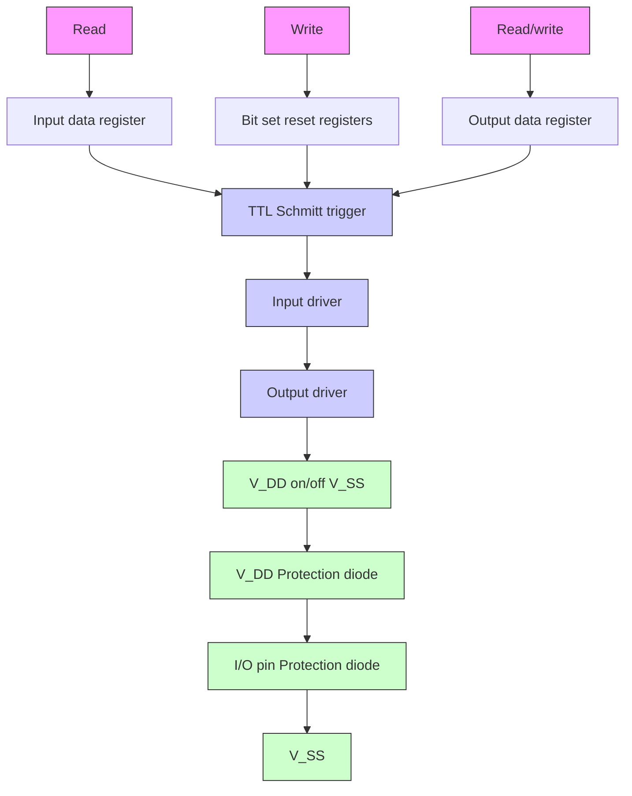

当 10 口配置成输入模式时，输出驱动断开，输入上下拉可选，不连接复用功能和模拟输入。在每个 10 口上的数据在每个 HB 时钟被采样到输入数据寄存器，读取输入数据寄存器对应位即获取了对应引脚的电平状态。

# 7.2.7 输出配置

图 7-3 GPIO 模块输出配置结构框图  
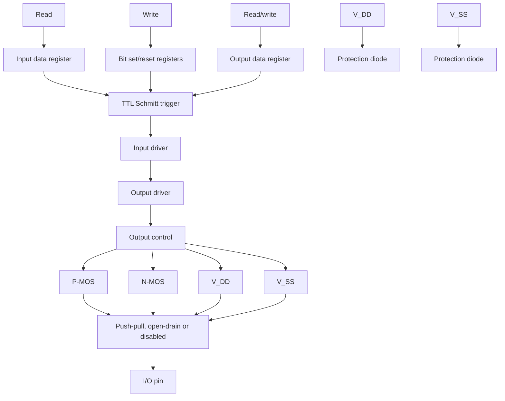

当 10 口配置成输出模式时，输出驱动器中的一对 MOS 可根据需要被配置成推挽或开漏模式，不使用复用功能。输入驱动的上下拉电阻被禁用，TTL 施密特触发器被激活，出现在 10 引脚上的电平将会在每个 HB 时钟被采样到输入数据寄存器，所以读取输入数据寄存器将会得到 10 状态，在推挽输出模式时，对输出数据寄存器的访问就会得到最后一次写入的值。

# 7.2.8 复用功能配置

图 7-4 GPIO 模块被其他外设复用时的结构框图  
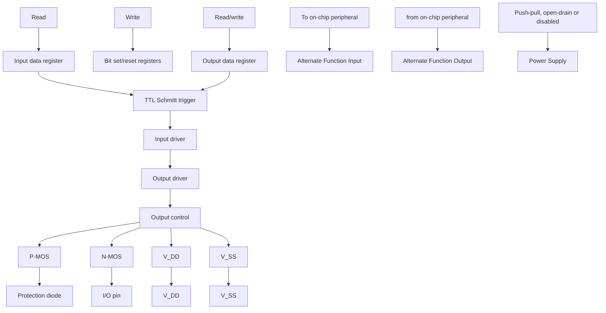

在启用复用功能时，输出驱动器被使能，可以按需要被配置成开漏或推挽模式，施密特触发器也被打开，复用功能的输入和输出线都被连接，但是输出数据寄存器被断开，出现在10引脚上的电平将会在每个HB时钟被采样到输入数据寄存器，在开漏模式下，读取输入数据寄存器将会得到10口当前状态；在推挽模式下，读取输出数据寄存器将会得到最后一次写入的值。

# 7.2.9 模拟输入配置

图 7-5 GPIO 模块作为模拟输入时的配置结构框图  
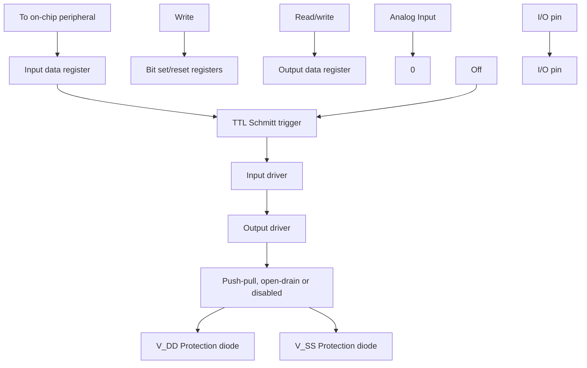

在启用模拟输入时，输出缓冲器被断开，输入驱动中施密特触发器的输入被禁止以防止产生 10 口上的消耗，上下拉电阻被禁止，读取输入数据寄存器将一直为 0。

# 7.2.10 外设的 GPIO 设置

下列表格推荐了各个外设的引脚相应的 GPIO 口配置。

表 7-1 高级定时器（TIM1）

<table><tr><td>TIM1</td><td>配置</td><td>GPIO 配置</td></tr><tr><td rowspan="2">TIM1_CHx</td><td>输入捕获通道 x</td><td>浮空输入</td></tr><tr><td>输出比较通道 x</td><td>推挽复用输出</td></tr><tr><td>TIM1_CHxN</td><td>互补输出通道 x</td><td>推挽复用输出</td></tr><tr><td>TIM1_BKIN</td><td>刹车输入</td><td>浮空输入</td></tr><tr><td>TIM1_ETR</td><td>外部触发时钟输入</td><td>浮空输入</td></tr></table>

表 7-2 通用定时器（TIM2）

<table><tr><td>TIM2 引脚</td><td>配置</td><td>GPIO 配置</td></tr><tr><td rowspan="2">TIM2_CHx</td><td>输入捕获通道 x</td><td>浮空输入</td></tr><tr><td>输出比较通道 x</td><td>推挽复用输出</td></tr><tr><td>TIM2_ETR</td><td>外部触发时钟输入</td><td>浮空输入</td></tr></table>

表 7-3 通用同步异步串行收发器（USART）

<table><tr><td>USART 引脚</td><td>配置</td><td>GPIO 配置</td></tr><tr><td rowspan="2">USARTx_TX</td><td>全双工模式</td><td>推挽复用输出</td></tr><tr><td>半双工同步模式</td><td>开漏复用输出</td></tr><tr><td rowspan="2">USARTx_RX</td><td>全双工模式</td><td>浮空输入或带上拉输入</td></tr><tr><td>半双工同步模式</td><td>未使用</td></tr><tr><td>USARTx_CK</td><td>同步模式</td><td>推挽复用输出</td></tr><tr><td>USARTx_RTS</td><td>硬件流量控制</td><td>推挽复用输出</td></tr><tr><td>USARTx_CTS</td><td>硬件流量控制</td><td>浮空输入或带上拉输入</td></tr></table>

表 7-4 串行外设接口（SPI）模块

<table><tr><td>SPI 引脚</td><td>配置</td><td>GPIO 配置</td></tr><tr><td rowspan="2">SPIx_SCK</td><td>主模式</td><td>推挽复用输出</td></tr><tr><td>从模式</td><td>浮空输入</td></tr><tr><td rowspan="4">SPIx_MOSI</td><td>全双工主模式</td><td>推挽复用输出</td></tr><tr><td>全双工从模式</td><td>浮空输入或带上拉输入</td></tr><tr><td>简单的双向数据线/主模式</td><td>推挽复用输出</td></tr><tr><td>简单的双向数据线/从模式</td><td>未使用</td></tr><tr><td rowspan="4">SPIx_MISO</td><td>全双工主模式</td><td>浮空输入或带上拉输入</td></tr><tr><td>全双工从模式</td><td>推挽复用输出</td></tr><tr><td>简单的双向数据线/主模式</td><td>未使用</td></tr><tr><td>简单的双向数据线/从模式</td><td>推挽复用输出</td></tr><tr><td rowspan="3">SPIx_NSS</td><td>硬件主或从模式</td><td>浮空、上拉或下拉输入</td></tr><tr><td>硬件主模式/NSS 输出使能模式</td><td>推挽复用输出</td></tr><tr><td>软件模式</td><td>未使用</td></tr></table>

表 7-5 内部集成总线（I2C）模块

<table><tr><td> $I^{2}C$  引脚</td><td>配置</td><td>GPIO 配置</td></tr><tr><td> $I^{2}C\_SCL$ </td><td> $I^{2}C$  时钟</td><td>开漏复用输出</td></tr><tr><td> $I^{2}C\_SDA$ </td><td> $I^{2}C$  数据</td><td>开漏复用输出</td></tr></table>

表 7-6 模拟转数字转换器（ADC）

<table><tr><td>ADC 引脚</td><td>GPIO 配置</td></tr><tr><td>ADC</td><td>模拟输入</td></tr></table>

表 7-7 其他的 10 功能设置

<table><tr><td>引脚</td><td>配置功能</td><td>GPIO 配置</td></tr><tr><td>MCO</td><td>时钟输出</td><td>推挽复用输出</td></tr><tr><td>EXTI</td><td>外部中断输入</td><td>浮空、上拉或下拉输入</td></tr><tr><td>OPA</td><td>运算放大器输入</td><td>浮空输入</td></tr></table>

# 7.2.11 复用功能重映射 GPIO 设置

# 7.2.11.1 定时器复用功能重映射

注：对于表中 TIM1\_CH1 的映射功能，条件为 TIM1\_1\_RM=0。当 TIM1\_1\_RM=1 时，TIM1\_CHI 映射到 LSI。  
表 7-8 TIM1 复用功能重映射

<table><tr><td>复用功能</td><td>TIM1_RM=00默认映射</td><td>TIM1_RM=01部分映射</td><td>TIM1_RM=10部分映射</td><td>TIM1_RM=11完全映射</td></tr><tr><td>TIM1_ETR</td><td>PC5</td><td>PC5</td><td>PD4</td><td>PC2</td></tr><tr><td>TIM1_CH1</td><td>PD2</td><td>PC6</td><td>PD2</td><td>PC4</td></tr><tr><td>TIM1_CH2</td><td>PA1</td><td>PC7</td><td>PA1</td><td>PC7</td></tr><tr><td>TIM1_CH3</td><td>PC3</td><td>PC0</td><td>PC3</td><td>PC5</td></tr><tr><td>TIM1_CH4</td><td>PC4</td><td>PD3</td><td>PC4</td><td>PD4</td></tr><tr><td>TIM1_BKIN</td><td>PC2</td><td>PC1</td><td>PC2</td><td>PC1</td></tr><tr><td>TIM1_CH1N</td><td>PDO</td><td>PC3</td><td>PDO</td><td>PC3</td></tr><tr><td>TIM1_CH2N</td><td>PA2</td><td>PC4</td><td>PA2</td><td>PD2</td></tr><tr><td>TIM1_CH3N</td><td>PD1</td><td>PD1</td><td>PD1</td><td>PC6</td></tr></table>

表 7-9 TIM2 复用功能重映射

<table><tr><td>复用功能</td><td>TIM2_RM=00默认映射</td><td>TIM2_RM=01部分映射</td><td>TIM2_RM=10部分映射</td><td>TIM2_RM=11完全映射</td></tr><tr><td>TIM2_ETR</td><td>PD4</td><td>PC5</td><td>PC1</td><td>PC1</td></tr><tr><td>TIM2_CH1</td><td>PD4</td><td>PC5</td><td>PC1</td><td>PC1</td></tr><tr><td>TIM2_CH2</td><td>PD3</td><td>PC2</td><td>PD3</td><td>PC7</td></tr><tr><td>TIM2_CH3</td><td>PC0</td><td>PD2</td><td>PC0</td><td>PD6</td></tr><tr><td>TIM2_CH4</td><td>PD7</td><td>PC1</td><td>PD7</td><td>PD5</td></tr></table>

# 7.2.11.2 USART 复用功能重映射

表 7-10 USART1 复用功能重映射

<table><tr><td>复用功能</td><td>USART1_RM=00默认映射</td><td>USART1_RM=01重映射</td><td>USART1_RM=10重映射</td><td>USART1_RM=11重映射</td></tr><tr><td>USART1_CK</td><td>PD4</td><td>PD7</td><td>PD7</td><td>PC5</td></tr><tr><td>USART1_TX</td><td>PD5</td><td>PD0</td><td>PD6</td><td>PC0</td></tr><tr><td>USART1_RX</td><td>PD6</td><td>PD1</td><td>PD5</td><td>PC1</td></tr><tr><td>USART1_CTS</td><td>PD3</td><td>PC3</td><td>PC6</td><td>PC6</td></tr><tr><td>USART1_RTS</td><td>PC2</td><td>PC2</td><td>PC7</td><td>PC7</td></tr></table>

# 7.2.11.3 SPI 复用功能重映射

表 7-11 SPI1 复用功能重映射

<table><tr><td>复用功能</td><td>SPI1_RM=0默认映射</td><td>SPI1_RM=1重映射</td></tr><tr><td>SPI1_NSS</td><td>PC1</td><td>PC0</td></tr><tr><td>SPI1_SCK</td><td>PC5</td><td>PC5</td></tr><tr><td>SPI1_MISO</td><td>PC7</td><td>PC7</td></tr><tr><td>SPI1_MOSI</td><td>PC6</td><td>PC6</td></tr></table>

# 7.2.11.4 I2C 复用功能重映射

表 7-12 I2C1 复用功能重映射

<table><tr><td>复用功能</td><td>I2C1_RM=00默认映射</td><td>I2C1_RM=01重映射</td><td>I2C1_RM=1x重映射</td></tr><tr><td>I2C1_SCL</td><td>PC2</td><td>PD1</td><td>PC5</td></tr><tr><td>I2C1_SDA</td><td>PC1</td><td>PDO</td><td>PC6</td></tr></table>

# 7.2.11.5 ADC 复用功能重映射

表 7-13 ADC 外部触发注入转换复用功能重映射

<table><tr><td>复用功能</td><td>ADC_ETRGINJ_RM=0默认映射</td><td>ADC_ETRGINJ_RM=1重映射</td></tr><tr><td>ADC 外部触发注入转换</td><td>ADC 外部触发注入转换与 PD1相连</td><td>ADC 外部触发注入转换与 PA2相连</td></tr></table>

表 7-14 ADC 外部触发规则转换复用功能重映射

<table><tr><td>复用功能</td><td>ADC_ETRGREG_RM=0默认映射</td><td>ADC_ETRGREG_RM=1重映射</td></tr><tr><td>ADC 外部触发规则转换</td><td>ADC 外部触发规则转换与 PD3相连</td><td>ADC 外部触发规则转换与 PC2相连</td></tr></table>

# 7.3 寄存器描述

# 7.3.1 GPIO 的寄存器描述

除非特殊说明，GPIO 的寄存器必须以字的方式操作（以 32 位来操作这些寄存器）。

表 7-15 GPIO 相关寄存器列表

<table><tr><td>名称</td><td>访问地址</td><td>描述</td><td>复位值</td></tr><tr><td>R32_GPIOA_CFGLR</td><td>0x40010800</td><td>PA 端口配置寄存器低位</td><td>0x44444444</td></tr><tr><td>R32_GPIOC_CFGLR</td><td>0x40011000</td><td>PC 端口配置寄存器低位</td><td>0x44444444</td></tr><tr><td>R32_GPIOD_CFGLR</td><td>0x40011400</td><td>PD 端口配置寄存器低位</td><td>0x44444444</td></tr><tr><td>R32_GPIOA_INDR</td><td>0x40010808</td><td>PA 端口输入数据寄存器</td><td>0x000000XX</td></tr><tr><td>R32_GPIOC_INDR</td><td>0x40011008</td><td>PC 端口输入数据寄存器</td><td>0x000000XX</td></tr><tr><td>R32_GPIOD_INDR</td><td>0x40011408</td><td>PD 端口输入数据寄存器</td><td>0x000000XX</td></tr><tr><td>R32_GPIOA_OUTDR</td><td>0x4001080C</td><td>PA 端口输出数据寄存器</td><td>0x00000000</td></tr><tr><td>R32_GPIOC_OUTDR</td><td>0x4001100C</td><td>PC 端口输出数据寄存器</td><td>0x00000000</td></tr><tr><td>R32_GPIOD_OUTDR</td><td>0x4001140C</td><td>PD 端口输出数据寄存器</td><td>0x00000000</td></tr><tr><td>R32_GPIOA_BSHR</td><td>0x40010810</td><td>PA 端口置位/复位寄存器</td><td>0x00000000</td></tr><tr><td>R32_GPIOC_BSHR</td><td>0x40011010</td><td>PC 端口置位/复位寄存器</td><td>0x00000000</td></tr><tr><td>R32_GPIOD_BSHR</td><td>0x40011410</td><td>PD 端口置位/复位寄存器</td><td>0x00000000</td></tr><tr><td>R32_GPIOA_BCR</td><td>0x40010814</td><td>PA 端口复位寄存器</td><td>0x00000000</td></tr><tr><td>R32_GPIOC_BCR</td><td>0x40011014</td><td>PC 端口复位寄存器</td><td>0x00000000</td></tr><tr><td>R32_GPIOD_BCR</td><td>0x40011414</td><td>PD 端口复位寄存器</td><td>0x00000000</td></tr><tr><td>R32_GPIOA_LCKR</td><td>0x40010818</td><td>PA 端口锁定配置寄存器</td><td>0x00000000</td></tr><tr><td>R32_GPIOC_LCKR</td><td>0x40011018</td><td>PC 端口锁定配置寄存器</td><td>0x00000000</td></tr><tr><td>R32_GPIOD_LCKR</td><td>0x40011418</td><td>PD 端口锁定配置寄存器</td><td>0x00000000</td></tr></table>

# 7.3.1.1 GPIO 配置寄存器低位（GPIOx\_CFGLR）（x=A/C/D）

偏移地址：0x00

<table><tr><td>31</td><td>30</td><td>29</td><td>28</td><td>27</td><td>26</td><td>25</td><td>24</td><td>23</td><td>22</td><td>21</td><td>20</td><td>19</td><td>18</td><td>17</td><td>16</td></tr><tr><td colspan="2">CNF7[1:0]</td><td colspan="2">MODE7[1:0]</td><td colspan="2">CNF6[1:0]</td><td colspan="2">MODE6[1:0]</td><td colspan="2">CNF5[1:0]</td><td colspan="2">MODE5[1:0]</td><td colspan="2">CNF4[1:0]</td><td colspan="2">MODE4[1:0]</td></tr><tr><td>15</td><td>14</td><td>13</td><td>12</td><td>11</td><td>10</td><td>9</td><td>8</td><td>7</td><td>6</td><td>5</td><td>4</td><td>3</td><td>2</td><td>1</td><td>0</td></tr><tr><td colspan="2">CNF3[1:0]</td><td colspan="2">MODE3[1:0]</td><td colspan="2">CNF2[1:0]</td><td colspan="2">MODE2[1:0]</td><td colspan="2">CNF1[1:0]</td><td colspan="2">MODE1[1:0]</td><td colspan="2">CNF0[1:0]</td><td colspan="2">MODE0[1:0]</td></tr></table>

<table><tr><td>位</td><td>名称</td><td>访问</td><td>描述</td><td>复位值</td></tr><tr><td>[31:30]</td><td rowspan="8">CNFy[1:0]</td><td rowspan="8">RW</td><td rowspan="8">(y=0-7),端口x的配置位,通过这些位配置相应的端口。在输入模式时(MODE=00b):00:模拟输入模式;01:浮空输入模式;10:带有上下拉模式。11:保留。在输出模式(MODE&gt;00b):00:通用推挽输出模式;01:通用开漏输出模式;10:复用功能推挽输出模式;11:复用功能开漏输出模式。</td><td rowspan="8">01b</td></tr><tr><td>[27:26]</td></tr><tr><td>[23:22]</td></tr><tr><td>[19:18]</td></tr><tr><td>[15:14]</td></tr><tr><td>[11:10]</td></tr><tr><td>[7:6]</td></tr><tr><td>[3:2]</td></tr><tr><td>[29:28]</td><td rowspan="8">MODEy[1:0]</td><td rowspan="8">RW</td><td rowspan="8">(y=0-7),端口x模式选择,通过这些位配置相应的端口。00:输入模式;01:输出模式,最大速度10MHz;10:输出模式,最大速度2MHz;11:输出模式,最大速度30MHz。</td><td rowspan="8">00b</td></tr><tr><td>[25:24]</td></tr><tr><td>[21:20]</td></tr><tr><td>[17:16]</td></tr><tr><td>[13:12]</td></tr><tr><td>[9:8]</td></tr><tr><td>[5:4]</td></tr><tr><td>[1:0]</td></tr></table>

# 7.3.1.2 端口输入寄存器（GPIOx\_INDR）（x=A/C/D）

偏移地址：0x08

<table><tr><td>31</td><td>30</td><td>29</td><td>28</td><td>27</td><td>26</td><td>25</td><td>24</td><td>23</td><td>22</td><td>21</td><td>20</td><td>19</td><td>18</td><td>17</td><td>16</td></tr><tr><td colspan="16">Reserved</td></tr><tr><td>15</td><td>14</td><td>13</td><td>12</td><td>11</td><td>10</td><td>9</td><td>8</td><td>7</td><td>6</td><td>5</td><td>4</td><td>3</td><td>2</td><td>1</td><td>0</td></tr><tr><td colspan="8">Reserved</td><td>IDR7</td><td>IDR6</td><td>IDR5</td><td>IDR4</td><td>IDR3</td><td>IDR2</td><td>IDR1</td><td>IDRO</td></tr></table>

<table><tr><td>位</td><td>名称</td><td>访问</td><td>描述</td><td>复位值</td></tr><tr><td>[31:8]</td><td>Reserved</td><td>RO</td><td>保留。</td><td>0</td></tr><tr><td>[7:0]</td><td>IDRy</td><td>RO</td><td>(y=0-7),端口输入数据。这些位只读并只能以 16 位形式读出。读出的值就是对应位的高低状态。</td><td>X</td></tr></table>

# 7.3.1.3 端口输出寄存器（GPIOx\_OUTDR）（x=A/C/D）

偏移地址：0x0C

<table><tr><td>31</td><td>30</td><td>29</td><td>28</td><td>27</td><td>26</td><td>25</td><td>24</td><td>23</td><td>22</td><td>21</td><td>20</td><td>19</td><td>18</td><td>17</td><td>16</td></tr><tr><td colspan="16">Reserved</td></tr><tr><td>15</td><td>14</td><td>13</td><td>12</td><td>11</td><td>10</td><td>9</td><td>8</td><td>7</td><td>6</td><td>5</td><td>4</td><td>3</td><td>2</td><td>1</td><td>0</td></tr><tr><td colspan="8">Reserved</td><td>ODR7</td><td>ODR6</td><td>ODR5</td><td>ODR4</td><td>ODR3</td><td>ODR2</td><td>ODR1</td><td>ODRO</td></tr></table>

<table><tr><td>位</td><td>名称</td><td>访问</td><td>描述</td><td>复位值</td></tr><tr><td>[31:8]</td><td>Reserved</td><td>RO</td><td>保留。</td><td>0</td></tr><tr><td>[7:0]</td><td>ODRy</td><td>RW</td><td>对于输出模式:(y=0-7),端口输出的数据。这些数据只能以16位的形式操作。10口对外输出这些寄存器的值。对于带有上下拉输入模式:1:上拉输入;0:下拉输入。</td><td>0</td></tr></table>

# 7.3.1.4 端口复位/置位寄存器（GPIOx\_BSHR）（x=A/C/D）

偏移地址：0x10

<table><tr><td>31</td><td>30</td><td>29</td><td>28</td><td>27</td><td>26</td><td>25</td><td>24</td><td>23</td><td>22</td><td>21</td><td>20</td><td>19</td><td>18</td><td>17</td><td>16</td></tr><tr><td colspan="3"></td><td colspan="5">Reserved</td><td>BR7</td><td>BR6</td><td>BR5</td><td>BR4</td><td>BR3</td><td>BR2</td><td>BR1</td><td>BR0</td></tr><tr><td>15</td><td>14</td><td>13</td><td>12</td><td>11</td><td>10</td><td>9</td><td>8</td><td>7</td><td>6</td><td>5</td><td>4</td><td>3</td><td>2</td><td>1</td><td>0</td></tr><tr><td colspan="3"></td><td colspan="5">Reserved</td><td>BS7</td><td>BS6</td><td>BS5</td><td>BS4</td><td>BS3</td><td>BS2</td><td>BS1</td><td>BS0</td></tr></table>

<table><tr><td>位</td><td>名称</td><td>访问</td><td>描述</td><td>复位值</td></tr><tr><td>[31:24]</td><td>Reserved</td><td>RO</td><td>保留。</td><td>0</td></tr><tr><td>[23:16]</td><td>BRy</td><td>WO</td><td>(y=0-7),对这些位置位会清除对应的 OUTDR 位,写 0 不产生影响。这些位只能以 16 位的形式访问。如果同时设置了 BR 和 BS 位,则 BS 位起作用。</td><td>0</td></tr><tr><td>[15:8]</td><td>Reserved</td><td>RO</td><td>保留。</td><td>0</td></tr><tr><td>[7:0]</td><td>BSy</td><td>WO</td><td>(y=0-7),对这些位置位会使对应的 OUTDR 位置位,写 0 不产生影响。这些位只能以 16 位的形式访问。如果同时设置了 BR 和 BS 位,则 BS 位起作用。</td><td>0</td></tr></table>

# 7.3.1.5 端口复位寄存器（GPIOx\_BCR）（x=A/C/D）

偏移地址：0x14

<table><tr><td>31</td><td>30</td><td>29</td><td>28</td><td>27</td><td>26</td><td>25</td><td>24</td><td>23</td><td>22</td><td>21</td><td>20</td><td>19</td><td>18</td><td>17</td><td>16</td></tr><tr><td colspan="16">Reserved</td></tr><tr><td>15</td><td>14</td><td>13</td><td>12</td><td>11</td><td>10</td><td>9</td><td>8</td><td>7</td><td>6</td><td>5</td><td>4</td><td>3</td><td>2</td><td>1</td><td>0</td></tr><tr><td colspan="8">Reserved</td><td>BR7</td><td>BR6</td><td>BR5</td><td>BR4</td><td>BR3</td><td>BR2</td><td>BR1</td><td>BR0</td></tr></table>

<table><tr><td>位</td><td>名称</td><td>访问</td><td>描述</td><td>复位值</td></tr><tr><td>[31:8]</td><td>Reserved</td><td>RO</td><td>保留。</td><td>0</td></tr><tr><td>[7:0]</td><td>BRy</td><td>WO</td><td>(y=0-7),对这些位置位会清除对应的 OUTDR 位,写 0 不产生影响。这些位只能以 16 位的形式访问。</td><td>0</td></tr></table>

# 7.3.1.6 配置锁定寄存器（GPIOx\_LCKR）（x=A/C/D）

偏移地址：0x18

<table><tr><td>31</td><td>30</td><td>29</td><td>28</td><td>27</td><td>26</td><td>25</td><td>24</td><td>23</td><td>22</td><td>21</td><td>20</td><td>19</td><td>18</td><td>17</td><td>16</td></tr><tr><td colspan="15">Reserved</td><td>LCKK</td></tr><tr><td>15</td><td>14</td><td>13</td><td>12</td><td>11</td><td>10</td><td>9</td><td>8</td><td>7</td><td>6</td><td>5</td><td>4</td><td>3</td><td>2</td><td>1</td><td>0</td></tr><tr><td colspan="8">Reserved</td><td>LCK7</td><td>LCK6</td><td>LCK5</td><td>LCK4</td><td>LCK3</td><td>LCK2</td><td>LCK1</td><td>LCK0</td></tr></table>

<table><tr><td>位</td><td>名称</td><td>访问</td><td>描述</td><td>复位值</td></tr><tr><td>[31:17]</td><td>Reserved</td><td>RO</td><td>保留。</td><td>0</td></tr><tr><td>16</td><td>LCKK</td><td>RW</td><td>锁定键,它可以通过特定的序列写入实现锁定,但它可以随时读出。它读出为0时表示未锁定生效,读出1时表示锁定生效。锁定键的写入序列为:写1-写0-写1-读0-读1,最后一步非必要,但是可以用以确认锁定键已经激活。在写入序列时任何错误都不会使激活锁定,且在写入序列时,不能更改LCK[7:0]的值。锁定生效后,只有在下次复位后才能更改端口的配置。</td><td>0</td></tr><tr><td>[15:8]</td><td>Reserved</td><td>RO</td><td>保留。</td><td>0</td></tr><tr><td>[7:0]</td><td>LCKy</td><td>RW</td><td>(y=0-7),这些位为1时表示锁定对应端口的配置。只能在LCKK未锁定前改变这些位。锁定的配置指的是配置寄存器GPIOx_CFGLR。</td><td>0</td></tr></table>

注：当对相应的端口位执行了 LOCK 序列后，在下次系统复位之前将不能再更改端口位的配置。

# 7.3.2 AF10 寄存器

除非特殊说明，AF10 的寄存器必须以字的方式操作（以 32 位来操作这些寄存器）。

表 7-16 AFIO 相关寄存器列表

<table><tr><td>名称</td><td>访问地址</td><td>描述</td><td>复位值</td></tr><tr><td>R32_AF10_PCFR1</td><td>0x40010004</td><td>重映射寄存器 1</td><td>0x00000000</td></tr><tr><td>R32_AF10_EXTICR</td><td>0x40010008</td><td>外部中断配置寄存器 1</td><td>0x00000000</td></tr></table>

# 7.3.2.1 重映射寄存器 1（AFIO\_PCFR1）

偏移地址：0x04

<table><tr><td>Reserved</td><td>SWCFG[2:0]</td><td>TIM1_1_RM</td><td>I2C1_RM1</td><td>USART1_RM1</td><td>Reserved</td><td>ADC_ETRGREG_RM</td><td>ADC_ETRGINJ_RM</td><td>Reserved</td></tr></table>

<table><tr><td>15</td><td>14</td><td>13</td><td>12</td><td>11</td><td>10</td><td>9</td><td>8</td><td>7</td><td>6</td><td>5</td><td>4</td><td>3</td><td>2</td><td>1</td><td>0</td></tr><tr><td>PA1P A2_RM</td><td colspan="5">Reserved</td><td colspan="2">TIM2_RM [1:0]</td><td colspan="2">TIM1_RM [1:0]</td><td colspan="3">Reserved</td><td>USART1_RM</td><td>I2C1_RM</td><td>SPI1_RM</td></tr></table>

<table><tr><td>位</td><td>名称</td><td>访问</td><td>描述</td><td>复位值</td></tr><tr><td>[31:27]</td><td>Reserved</td><td>RO</td><td>保留。</td><td>0</td></tr><tr><td>[26:24]</td><td>SWCFG[2:0]</td><td>RW</td><td>这些位用以配置SW功能和跟踪功能的IO口。SWD(SDI)是访问内核的调试接口。系统复位后总是作为SWD端口。0xx:启用SWD(SDI);100:关闭SWD(SDI),作为GPIO功能;其他:无效。</td><td>0</td></tr><tr><td>23</td><td>TIM1_1_RM</td><td>RW</td><td>控制定时器1通道1的选择。1:选择内部LSI时钟;0:选择外部引脚。</td><td>0</td></tr><tr><td>22</td><td>I2C1_RM1</td><td>RW</td><td>I2C1 重映射高位(配合AFIO_PCFR1寄存器bit1 I2C1_RM使用[22,1])。00:默认映射(SCL/PC2,SDA/PC1);01:重映射(SCL/PD1,SDA/PD0);1X:重映射(SCL/PC5,SDA/PC6)。</td><td>0</td></tr><tr><td>21</td><td>USART1_RM1</td><td>RW</td><td>USART1 映射配置高位(配合AFIO_PCFR1寄存器bit2 USART1_RM使用[21,2])。00:默认映射(CK/PD4,TX/PD5,RX/PD6,CTS/PD3,RTS/PC2);01:重映射(CK/PD7,TX/PD0,RX/PD1,CTS/PC3,RTS/PC2);10:重映射(CK/PD7,TX/PD6,RX/PD5,CTS/PC6,RTS/PC7);11:重映射(CK/PC5,TX/PC0,RX/PC1,CTS/PC6,RTS/PC7)。</td><td>0</td></tr><tr><td>[20:19]</td><td>Reserved</td><td>RO</td><td>保留。</td><td>0</td></tr><tr><td>18</td><td>ADC_ETRGREG_RM</td><td>RW</td><td>ADC 外部触发规则转换的重映射位。1:ADC 外部触发规则转换与PC2相连;0:ADC 外部触发规则转换与PD3相连。</td><td>0</td></tr><tr><td>17</td><td>ADC_ETRGINJ_RM</td><td>RW</td><td>ADC 外部触发注入转换的重映射位。1:ADC 外部触发注入转换与PA2相连;0:ADC 外部触发注入转换与PD1相连。</td><td>0</td></tr><tr><td>16</td><td>Reserved</td><td>RO</td><td>保留。</td><td>0</td></tr><tr><td>15</td><td>PA1PA2_RM</td><td>RW</td><td>引脚PA1&amp;PA2重映射位,该位可由用户读写。它控制PA1和PA2的功能是否正常(接外部晶振引脚需置1)。1:引脚无功能作用;0:引脚作为GPIO和复用功能使用。</td><td>0</td></tr><tr><td>[14:10]</td><td>Reserved</td><td>RO</td><td>保留。</td><td>0</td></tr><tr><td>[9:8]</td><td>TIM2_RM[1:0]</td><td>RW</td><td>定时器2的重映射位。这些位可由用户读写。它控制定时器2的通道1至4和外部触发(ETR)在GPIO端口的映射。00:默认映射(CH1/ETR/PD4,CH2/PD3,CH3/PC0,CH4/PD7);01:部分映射(CH1/ETR/PC5,CH2/PC2,CH3/PD2,CH4/PC1);10:部分映射(CH1/ETR/PC1,CH2/PD3,CH3/PC0,CH4/PD7);11:完全映射(CH1/ETR/PC1,CH2/PC7,CH3/PD6,CH4/PD5)。</td><td>0</td></tr><tr><td>[7:6]</td><td>TIM1_RM[1:0]</td><td>RW</td><td>定时器1的重映射位。这些位可由用户读写。它控制定时器1的通道1至4、1N至3N、外部触发(ETR)和刹车输入(BKIN)在GPIO端口的映射。00:默认映射(ETR/PC5,CH1/PD2,CH2/PA1,CH3/PC3,CH4/PC4,BKIN/PC2,CH1N/PD0,CH2N/PA2,CH3N/PD1);01:部分映射(ETR/PC5,CH1/PC6,CH2/PC7,CH3/PC0,CH4/PD3,BKIN/PC1,CH1N/PC3,CH2N/PC4,CH3N/PD1);10:部分映射(ETR/PD4,CH1/PD2,CH2/PA1,CH3/PC3,CH4/PC4,BKIN/PC2,CH1N/PD0,CH2N/PA2,CH3N/PD1);11:完全映射(ETR/PC2,CH1/PC4,CH2/PC7,CH3/PC5,CH4/PD4,BKIN/PC1,CH1N/PC3,CH2N/PD2,CH3N/PC6)。</td><td>0</td></tr><tr><td>[5:3]</td><td>Reserved</td><td>RO</td><td>保留。</td><td>0</td></tr><tr><td>2</td><td>USART1_RM</td><td>RW</td><td>USART1映射配置低位(配合AFIO_PCFR1寄存器bit21 USART1RM1使用[21,2])。00:默认映射(CK/PD4,TX/PD5,RX/PD6,CTS/PD3,RTS/PC2);01:重映射(CK/PD7,TX/PD0,RX/PD1,CTS/PC3,RTS/PC2);10:重映射(CK/PD7,TX/PD6,RX/PD5,CTS/PC6,RTS/PC7);11:重映射(CK/PC5,TX/PC0,RX/PC1,CTS/PC6,RTS/PC7)。</td><td>0</td></tr><tr><td>1</td><td>I2C1_RM</td><td>RW</td><td>I2C1重映射低位(配合AFIO_PCFR1寄存器bit22 I2C1_RM1使用[22,1])。00:默认映射(SCL/PC2,SDA/PC1);01:重映射(SCL/PD1,SDA/PD0);1X:重映射(SCL/PC5,SDA/PC6)。</td><td>0</td></tr><tr><td>0</td><td>SPI1_RM</td><td>RW</td><td>SPI1的重映射。该位可由用户读写。它控制SPI1的NSS、SCK、MISO和MOSI复用功能在GPIO端口的映射。0:默认映射(NSS/PC1, CK/PC5, MISO/PC7, MOSI/PC6);1:重映射(NSS/PC0, CK/PC5, MISO/PC7, MOSI/PC6)。</td><td>0</td></tr></table>

# 7.3.2.2 外部中断配置寄存器 1（AFIO\_EXTICR）

偏移地址：0x08

<table><tr><td colspan="15">Reserved</td><td></td></tr><tr><td>15</td><td>14</td><td>13</td><td>12</td><td>11</td><td>10</td><td>9</td><td>8</td><td>7</td><td>6</td><td>5</td><td>4</td><td>3</td><td>2</td><td>1</td><td>0</td></tr><tr><td colspan="2">EXTI7[1:0]</td><td colspan="2">EXTI6[1:0]</td><td colspan="2">EXTI5[1:0]</td><td colspan="2">EXTI4[1:0]</td><td colspan="2">EXTI3[1:0]</td><td colspan="2">EXTI2[1:0]</td><td colspan="2">EXTI1[1:0]</td><td colspan="2">EXTIO[1:0]</td></tr></table>

<table><tr><td>位</td><td>名称</td><td>访问</td><td>描述</td><td>复位值</td></tr><tr><td>[31:16]</td><td>Reserved</td><td>RO</td><td>保留。</td><td>0</td></tr><tr><td>[15:14]</td><td rowspan="8">EXTIx[1:0]</td><td rowspan="8">RW</td><td rowspan="8">(x=0-7),外部中断输入引脚配置位。用以决定外部中断引脚映射到哪个端口的引脚上。00:PA引脚的第x个引脚;10:PC引脚的第x个引脚;11:PD引脚的第x个引脚。</td><td rowspan="8">0</td></tr><tr><td>[13:12]</td></tr><tr><td>[11:10]</td></tr><tr><td>[9:8]</td></tr><tr><td>[7:6]</td></tr><tr><td>[5:4]</td></tr><tr><td>[3:2]</td></tr><tr><td>[1:0]</td></tr></table>

# 第 8 章 直接存储器访问控制（DMA）

直接存储器访问控制器（DMA）提供在外设和存储器之间或存储器和存储器之间的高速数据传输方式，无须 CPU 干预，数据可以通过 DMA 快速地移动，以节省 CPU 的资源来做其他操作。

DMA 控制器每个通道专门用来管理来自于一个或多个外设对存储器访问的请求。还有一个仲裁器来协调各通道之间的优先级。

# 8.1 主要特性

- 多个独立可配置通道  
- 每个通道都直接连接专用的硬件 DMA 请求，并支持软件触发  
● 支持循环的缓冲器管理  
- 多个通道之间的请求优先权可以通过软件编程设置(最高、高、中和低)，优先权设置相等时由通道号决定（通道号越低优先级越高）  
● 支持外设到存储器、存储器到外设、存储器到存储器之间的传输  
- 闪存、SRAM、外设的 SRAM 和 HB 外设均可作为访问的源和目标  
● 可编程的数据传输字节数目：最大为 65535

# 8.2 功能描述

# 8.2.1 DMA 通道处理

# 1）仲裁优先级

多个独立的通道产生的 DMA 请求通过逻辑或结构输入到 DMA 控制器，当前只会有一个通道的请求得到响应。模块内部的仲裁器根据通道请求的优先级来选择要启动的外设/存储器的访问。

软件管理中，应用程序通过对 DMA\_CFGRx 寄存器的 PL[1:0] 位设置，可以为每个通道独立配置优先等级，包括最高、高、中、低 4 个等级。当通道间的软件设置等级一致时，模块会按固定的硬件优先级选择，通道编号偏低的要比偏高的有较高优先权。

# 2）DMA 配置

当 DMA 控制器收到一个请求信号时，会访问发出请求的外设或存储器，建立外设或存储器和存储器之间的数据传输。主要包括下面 3 个操作步骤：

1）从外设数据寄存器或当前外设/存储器地址寄存器指示的存储器地址取数据，第一次传输时的开始地址是 DMA\_PADDRx 或 DMA\_MADDRx 寄存器指定的外设基地址或存储器地址。  
2）存数据到外设数据寄存器或当前外设/存储器地址寄存器指示的存储器地址，第一次传输时的开始地址是 DMA\_PADDRx 或 DMA\_MADDRx 寄存器指定的外设基地址或存储器地址。  
3）执行一次 DMA\_CNTRx 寄存器中数值的递减操作，该寄存器指示当前未完成转移的操作数目。

每个通道包括 3 种 DMA 数据转移方式：

● 外设到存储器（MEM2MEM=0，DIR=0）  
- 存储器到外设（MEM2MEM=0，DIR=1）  
- 存储器到存储器（MEM2MEM=1）

注：存储器到存储器方式无需外设请求信号，配置为此模式后（MEM2MEM=1），通道开启（EN=1）即可启动数据传输。此方式不支持循环模式。

配置过程如下：

1）在 DMA\_PADDRx 寄存器中设置外设寄存器的首地址或存储器到存储器方式（MEM2MEM=1）下存储

器数据地址。发生 DMA 请求时，这个地址将是数据传输的源或目标地址。

2）在DMA\_MADDRx寄存器中设置存储器数据地址。发生DMA请求时，传输的数据将从这个地址读出或写入这个地址。  
3）在 DMA\_CNTRx 寄存器中设置要传输的数据数量。在每个数据传输后，这个数值递减。  
4）在 DMA\_CFGRx 寄存器的 PL[1:0] 位中设置通道的优先级。  
5）在 DMA\_CFGRx 寄存器中设置数据传输的方向、循环模式、外设和存储器的增量模式、外设和存储器的数据宽度、传输过半、传输完成、传输错误中断使能位。  
6）设置 DMA\_CCRx 寄存器的 ENABLE 位，启动通道 x。

注：DMA\_PADDRx/DMA\_MADDRx/DMA\_CNTRx 寄存器以及 DMA\_CFGRx 寄存器中的数据传输的方向（DIR）、循环模式（位置）、外设和存储器的增量模式（MINC/PINC）等控制位只有在 DMA 通道被关闭下才可以配置写入。

# 3）循环模式

设置 DMA\_CFGRx 寄存器的 CIRC 位置 1，可以启用通道数据传输的循环模式功能。循环模式下，当数据传输的数目变为 0 时，DMA\_CNTRx 寄存器的内容会自动被重新加载为其初始数值，内部的外设和存储器地址寄存器也被重新加载为 DMA\_PADDRx 和 DMA\_MADDRx 寄存器设定的初始地址值，DMA 操作将继续进行，直到通道被关闭或关闭 DMA 模式。

# 4）DMA 处理状态

- 传输过半：对应 DMA\_INTFR 寄存器中的 HTIFx 位硬件置位。当 DMA 的传输字节数目减至初始设定值一半以下将会产生 DMA 传输过半标志，如果在 DMA\_CCRx 寄存器中置位了 HTIE，则将产生中断。硬件通过此标志提醒应用程序，可以为新一轮数据传输做准备。  
- 传输完成：对应DMA\_INTFR寄存器中的TCIFx位硬件置位。当DMA的传输字节数目减至0将会产生DMA传输完成标志，如果在DMA\_CCRx寄存器中置位了TCIE，则将产生中断。  
- 传输错误：对应 DMA\_INTFR 寄存器中的 TEIFx 位硬件置位。读写一个保留的地址区域，将会产生 DMA 传输错误。同时模块硬件会自动清 0 发生错误的通道所对应的 DMA\_CCRx 寄存器的 EN 位，该通道被关闭。如果在 DMA\_CCRx 寄存器中置位了 TEIE，则将产生中断。

应用程序在查询 DMA 通道状态时，可以先访问 DMA\_INTFR 寄存器的 GIFx 位，判断出当前哪个通道发生了 DMA 事件，进而处理该通道的具体 DMA 事件内容。

# 8.2.2 可编程的数据传输总大小/数据位宽/对齐方式

DMA 每个通道一轮传输的数据量总大小可编程，最大 65535 次。DMA\_CNTRx 寄存器中指示待传输字节数目。在 EN=0 时，写入设置值，在 EN=1 开启 DMA 传输通道后，此寄存器变为只读属性，在每次传输后数值递减。

外设和存储器的传输数据取值支持地址指针自动递增功能，指针增量可编程。它们访问的第一个传输的数据地址存放在 DMA\_PADDRx 和 DMA\_MADDRx 寄存器中，通过设置 DMA\_CFGRx 寄存器的 PINC 位或 MINC 位置 1，可以分别开启外设地址自增模式或存储器地址自增模式，PSIZE[1:0] 设置外设地址取数据大小及地址自增大小，MSIZE[1:0] 设置存储器地址取数据大小及地址自增大小，包括 3 种选择：8 位、16 位、32 位。具体数据转移方式如下表：

表 8-1 不同数据位宽下 DMA 转移（PINC=MINC=1）

<table><tr><td>源端位宽</td><td>目标位宽</td><td>传输数目</td><td>源:地址/数据</td><td>目标:地址/数据</td><td>传输操作</td></tr><tr><td>8</td><td>8</td><td>4</td><td>0x00/B00x01/B10x02/B20x03/B3</td><td>0x00/B00x01/B10x02/B20x03/B3</td><td>● 源端地址递增量与源端设置的数据位宽对齐,取值大小等于源端数据位宽● 目标地址递增量与目标设置数</td></tr><tr><td>8</td><td>16</td><td>4</td><td>0x00/B00x01/B10x02/B20x03/B3</td><td>0x00/00B00x02/00B10x04/00B20x06/00B3</td><td rowspan="8">据的位宽对齐,取值大小等于目标数据位宽● DMA转移送入目标端的数据依据原则:数据大小不足高位补0,数据大小溢出高位去掉● 存储数据方式:小端模式,低地址存放低字节,高地址存放高字节</td></tr><tr><td>8</td><td>32</td><td>4</td><td>0x00/B00x01/B10x02/B20x03/B3</td><td>0x00/000000B00x04/000000B10x08/000000B20x0C/000000B3</td></tr><tr><td>16</td><td>8</td><td>4</td><td>0x00/B1B00x02/B3B20x04/B5B40x06/B7B6</td><td>0x00/B00x01/B20x02/B40x03/B6</td></tr><tr><td>16</td><td>16</td><td>4</td><td>0x00/B1B00x02/B3B20x04/B5B40x06/B7B6</td><td>0x00/B1B00x02/B3B20x04/B5B40x06/B7B6</td></tr><tr><td>16</td><td>32</td><td>4</td><td>0x00/B1B00x02/B3B20x04/B5B40x06/B7B6</td><td>0x00/0000B1B00x04/0000B3B20x08/0000B5B40x0C/0000B7B6</td></tr><tr><td>32</td><td>8</td><td>4</td><td>0x00/B3B2B1B00x04/B7B6B5B40x08/BBBAB9B80x0C/BFBEBDBC</td><td>0x00/B00x01/B40x02/B80x03/BC</td></tr><tr><td>32</td><td>16</td><td>4</td><td>0x00/B3B2B1B00x04/B7B6B5B40x08/BBBAB9B80x0C/BFBEBDBC</td><td>0x00/B1B00x02/B5B40x04/B9B80x06/BDBC</td></tr><tr><td>32</td><td>32</td><td>4</td><td>0x00/B3B2B1B00x04/B7B6B5B40x08/BBBAB9B80x0C/BFBEBDBC</td><td>0x00/B3B2B1B00x04/B7B6B5B40x08/BBBAB9B80x0C/BFBEBDBC</td></tr></table>

# 8.2.3 DMA 请求映射

DMA 控制器提供 7 个通道，每个通道对应多个外设请求，通过设置相应外设寄存器中对应 DMA 控制位，可以独立的开启或关闭各个外设的 DMA 功能，具体对应关系如下。

图 8-1 DMA1 请求映像  
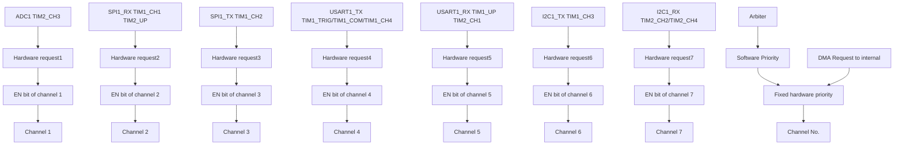

表 8-2 DMA1 各通道外设映射表

<table><tr><td>外设</td><td>通道1</td><td>通道2</td><td>通道3</td><td>通道4</td><td>通道5</td><td>通道6</td><td>通道7</td></tr><tr><td>ADC1</td><td>ADC1</td><td></td><td></td><td></td><td></td><td></td><td></td></tr><tr><td>SPI1</td><td></td><td>SPI1_RX</td><td>SPI1_TX</td><td></td><td></td><td></td><td></td></tr><tr><td>USART1</td><td></td><td></td><td></td><td>USART1_TX</td><td>USART1_RX</td><td></td><td></td></tr><tr><td>I2C1</td><td></td><td></td><td></td><td></td><td></td><td>I2C1_TX</td><td>I2C1_RX</td></tr><tr><td>TIM1</td><td></td><td>TIM1_CH1</td><td>TIM1_CH2</td><td>TIM1_CH4TIM1_TRIGTIM1_COM</td><td>TIM1_UP</td><td>TIM1_CH3</td><td></td></tr><tr><td>TIM2</td><td>TIM2_CH3</td><td>TIM2_UP</td><td></td><td></td><td>TIM2_CH1</td><td></td><td>TIM2_CH2TIM2_CH4</td></tr></table>

# 8.3 寄存器描述

表 8-3 DMA 相关寄存器列表

<table><tr><td>名称</td><td>访问地址</td><td>描述</td><td>复位值</td></tr><tr><td>R32_DMA_INTFR</td><td>0x40020000</td><td>DMA 中断状态寄存器</td><td>0x00000000</td></tr><tr><td>R32_DMA_INTFCR</td><td>0x40020004</td><td>DMA 中断标志清除寄存器</td><td>0x00000000</td></tr><tr><td>R32_DMA_CFGR1</td><td>0x40020008</td><td>DMA 通道 1 配置寄存器</td><td>0x00000000</td></tr><tr><td>R32_DMA_CNTR1</td><td>0x4002000C</td><td>DMA 通道 1 传输数据数目寄存器</td><td>0x00000000</td></tr><tr><td>R32_DMA_PADDR1</td><td>0x40020010</td><td>DMA 通道 1 外设地址寄存器</td><td>0x00000000</td></tr><tr><td>R32_DMA_MADDR1</td><td>0x40020014</td><td>DMA 通道 1 存储器地址寄存器</td><td>0x00000000</td></tr><tr><td>R32_DMA_CFGR2</td><td>0x4002001C</td><td>DMA 通道 2 配置寄存器</td><td>0x00000000</td></tr><tr><td>R32_DMA_CNTR2</td><td>0x40020020</td><td>DMA 通道 2 传输数据数目寄存器</td><td>0x00000000</td></tr><tr><td>R32_DMA_PADDR2</td><td>0x40020024</td><td>DMA 通道 2 外设地址寄存器</td><td>0x00000000</td></tr><tr><td>R32_DMA_MADDR2</td><td>0x40020028</td><td>DMA 通道 2 存储器地址寄存器</td><td>0x00000000</td></tr><tr><td>R32_DMA_CFGR3</td><td>0x40020030</td><td>DMA 通道 3 配置寄存器</td><td>0x00000000</td></tr><tr><td>R32_DMA_CNTR3</td><td>0x40020034</td><td>DMA 通道 3 传输数据数目寄存器</td><td>0x00000000</td></tr><tr><td>R32_DMA_PADDR3</td><td>0x40020038</td><td>DMA 通道 3 外设地址寄存器</td><td>0x00000000</td></tr><tr><td>R32_DMA_MADDR3</td><td>0x4002003C</td><td>DMA 通道 3 存储器地址寄存器</td><td>0x00000000</td></tr><tr><td>R32_DMA_CFGR4</td><td>0x40020044</td><td>DMA 通道 4 配置寄存器</td><td>0x00000000</td></tr><tr><td>R32_DMA_CNTR4</td><td>0x40020048</td><td>DMA 通道 4 传输数据数目寄存器</td><td>0x00000000</td></tr><tr><td>R32_DMA_PADDR4</td><td>0x4002004C</td><td>DMA 通道 4 外设地址寄存器</td><td>0x00000000</td></tr><tr><td>R32_DMA_MADDR4</td><td>0x40020050</td><td>DMA 通道 4 存储器地址寄存器</td><td>0x00000000</td></tr><tr><td>R32_DMA_CFGR5</td><td>0x40020058</td><td>DMA 通道 5 配置寄存器</td><td>0x00000000</td></tr><tr><td>R32_DMA_CNTR5</td><td>0x4002005C</td><td>DMA 通道 5 传输数据数目寄存器</td><td>0x00000000</td></tr><tr><td>R32_DMA_PADDR5</td><td>0x40020060</td><td>DMA 通道 5 外设地址寄存器</td><td>0x00000000</td></tr><tr><td>R32_DMA_MADDR5</td><td>0x40020064</td><td>DMA 通道 5 存储器地址寄存器</td><td>0x00000000</td></tr><tr><td>R32_DMA_CFGR6</td><td>0x4002006C</td><td>DMA 通道 6 配置寄存器</td><td>0x00000000</td></tr><tr><td>R32_DMA_CNTR6</td><td>0x40020070</td><td>DMA 通道 6 传输数据数目寄存器</td><td>0x00000000</td></tr><tr><td>R32_DMA_PADDR6</td><td>0x40020074</td><td>DMA 通道 6 外设地址寄存器</td><td>0x00000000</td></tr><tr><td>R32_DMA_MADDR6</td><td>0x40020078</td><td>DMA 通道 6 存储器地址寄存器</td><td>0x00000000</td></tr><tr><td>R32_DMA_CFGR7</td><td>0x40020080</td><td>DMA 通道 7 配置寄存器</td><td>0x00000000</td></tr><tr><td>R32_DMA_CNTR7</td><td>0x40020084</td><td>DMA 通道 7 传输数据数目寄存器</td><td>0x00000000</td></tr><tr><td>R32_DMA_PADDR7</td><td>0x40020088</td><td>DMA 通道 7 外设地址寄存器</td><td>0x00000000</td></tr><tr><td>R32_DMA_MADDR7</td><td>0x4002008C</td><td>DMA 通道 7 存储器地址寄存器</td><td>0x00000000</td></tr></table>

# 8.3.1 DMA 中断状态寄存器（DMA\_INTFR）

偏移地址：0x00

<table><tr><td>31</td><td>30</td><td>29</td><td>28</td><td>27</td><td>26</td><td>25</td><td>24</td><td>23</td><td>22</td><td>21</td><td>20</td><td>19</td><td>18</td><td>17</td><td>16</td></tr><tr><td></td><td colspan="3">Reserved</td><td>TEIF7</td><td>HTIF7</td><td>TCIF7</td><td>GIF7</td><td>TEIF6</td><td>HTIF6</td><td>TCIF6</td><td>GIF6</td><td>TEIF5</td><td>HTIF5</td><td>TCIF5</td><td>GIF5</td></tr><tr><td>15</td><td>14</td><td>13</td><td>12</td><td>11</td><td>10</td><td>9</td><td>8</td><td>7</td><td>6</td><td>5</td><td>4</td><td>3</td><td>2</td><td>1</td><td>0</td></tr><tr><td>TEIF4</td><td>HTIF4</td><td>TCIF4</td><td>GIF4</td><td>TEIF3</td><td>HTIF3</td><td>TCIF3</td><td>GIF3</td><td>TEIF2</td><td>HTIF2</td><td>TCIF2</td><td>GIF2</td><td>TEIF1</td><td>HTIF1</td><td>TCIF1</td><td>GIF1</td></tr></table>

<table><tr><td>位</td><td>名称</td><td>访问</td><td>描述</td><td>复位值</td></tr><tr><td>[31:28]</td><td>Reserved</td><td>RO</td><td>保留。</td><td>0</td></tr><tr><td>27/23/19/15/11/7/3</td><td>TEIFx</td><td>RO</td><td>通道x的传输错误标志(x=1/2/3/4/5/6/7)。1:在通道x上发生了传输错误;0:在通道x上没有传输错误。硬件置位,软件写CTEIFx位清除此标志。</td><td>0</td></tr><tr><td>26/22/18/14/10/6/2</td><td>HTIFx</td><td>RO</td><td>通道x的传输过半标志(x=1/2/3/4/5/6/7)。1:在通道x上产生了传输过半事件;0:在通道x上没有传输过半。硬件置位,软件写CHTIFx位清除此标志。</td><td>0</td></tr><tr><td>25/21/17/13/9/5/1</td><td>TCIFx</td><td>RO</td><td>通道x的传输完成标志(x=1/2/3/4/5/6/7)。1:在通道x上产生了传输完成事件;0:在通道x上没有传输完成事件。硬件置位,软件写CTCIFx位清除此标志。</td><td>0</td></tr><tr><td>24/20/16/12/8/4/0</td><td>GIFx</td><td>RO</td><td>通道x的全局中断标志(x=1/2/3/4/5/6/7)。1:在通道x上产生了TEIFx或HTIFx或TCIFx;0:在通道x上没有发生TEIFx或HTIFx或TCIFx。硬件置位,软件写CGIFx位清除此标志。</td><td>0</td></tr></table>

# 8.3.2 DMA 中断标志清除寄存器（DMA\_INTFCR）

偏移地址：0x04

<table><tr><td>31</td><td>30</td><td>29</td><td>28</td><td>27</td><td>26</td><td>25</td><td>24</td><td>23</td><td>22</td><td>21</td><td>20</td><td>19</td><td>18</td><td>17</td><td>16</td></tr><tr><td></td><td colspan="3">Reserved</td><td>CTEIF7</td><td>CHTIF7</td><td>CTCIF7</td><td>CGIF7</td><td>CTEIF6</td><td>CHTIF6</td><td>CTCIF6</td><td>CGIF6</td><td>CTEIF5</td><td>CHTIF5</td><td>CTCIF5</td><td>CGIF5</td></tr><tr><td>15</td><td>14</td><td>13</td><td>12</td><td>11</td><td>10</td><td>9</td><td>8</td><td>7</td><td>6</td><td>5</td><td>4</td><td>3</td><td>2</td><td>1</td><td>0</td></tr><tr><td>CTEIF4</td><td>CHTIF4</td><td>CTCIF4</td><td>CGIF4</td><td>CTEIF3</td><td>CHTIF3</td><td>CTCIF3</td><td>CGIF3</td><td>CTEIF2</td><td>CHTIF2</td><td>CTCIF2</td><td>CGIF2</td><td>CTEIF1</td><td>CHTIF1</td><td>CTCIF1</td><td>CGIF1</td></tr></table>

<table><tr><td>位</td><td>名称</td><td>访问</td><td>描述</td><td>复位值</td></tr><tr><td>[31:28]</td><td>Reserved</td><td>RO</td><td>保留。</td><td>0</td></tr><tr><td>27/23/19/15/11/7/3</td><td>CTEIFx</td><td>WO</td><td>清除通道 x 的传输错误标志(x=1/2/3/4/5/6/7)。1: 清除 DMA_INTFR 寄存器中的 TEIFx 标志;0: 无作用。</td><td>0</td></tr><tr><td>26/22/18/14/10/6/2</td><td>CHTIFx</td><td>WO</td><td>清除通道 x 的传输过半标志(x=1/2/3/4/5/6/7)。1: 清除 DMA_INTFR 寄存器中的 HTIFx 标志;0: 无作用。</td><td>0</td></tr><tr><td>25/21/17/13/9/5/1</td><td>CTCIFx</td><td>WO</td><td>清除通道 x 的传输完成标志(x=1/2/3/4/5/6/7)。1: 清除 DMA_INTFR 寄存器中的 TCIFx 标志;0: 无作用。</td><td>0</td></tr><tr><td>24/20/16/12/8/4/0</td><td>CGIFx</td><td>WO</td><td>清除通道 x 的全局中断标志(x=1/2/3/4/5/6/7)。1: 清除 DMA_INTFR 寄存器中的 TEIFx/HTIFx/TCIFx/GIFx 标志;0: 无作用。</td><td>0</td></tr></table>

# 8.3.3 DMA 通道 x 配置寄存器（DMA\_CFGRx）（x=1/2/3/4/5/6/7）

偏移地址：0x08 + (x-1)\*20

<table><tr><td colspan="16">Reserved</td></tr><tr><td>15</td><td>14</td><td>13</td><td>12</td><td>11</td><td>10</td><td>9</td><td>8</td><td>7</td><td>6</td><td>5</td><td>4</td><td>3</td><td>2</td><td>1</td><td>0</td></tr><tr><td>Reserved</td><td>MEM2 MEM</td><td colspan="2">PL[1:0]</td><td colspan="2">MSIZE[1:0]</td><td colspan="2">PSIZE[1:0]</td><td>MINC</td><td>PINC</td><td>CIRC</td><td>DIR</td><td>TEIE</td><td>HTIE</td><td>TCIE</td><td>EN</td></tr></table>

<table><tr><td>位</td><td>名称</td><td>访问</td><td>描述</td><td>复位值</td></tr><tr><td>[31:15]</td><td>Reserved</td><td>RO</td><td>保留。</td><td>0</td></tr><tr><td>14</td><td>MEM2MEM</td><td>RW</td><td>存储器到存储器模式使能。1:使能存储器到存储器数据传输模式;0:非存储器到存储器数据传输。</td><td>0</td></tr><tr><td>[13:12]</td><td>PL[1:0]</td><td>RW</td><td>通道优先级设置。00:低; 01:中;10:高; 11:最高。</td><td>0</td></tr><tr><td>[11:10]</td><td>MSIZE[1:0]</td><td>RW</td><td>存储器地址数据宽度设置。00:8位; 01:16位;10:32位; 11:保留。</td><td>0</td></tr><tr><td>[9:8]</td><td>PSIZE[1:0]</td><td>RW</td><td>外设地址数据宽度设置。00:8位; 01:16位;10:32位; 11:保留。</td><td>0</td></tr><tr><td>7</td><td>MINC</td><td>RW</td><td>存储器地址增量递增模式使能。1:使能存储器地址增量递增操作;0:存储器地址保持不变操作。</td><td>0</td></tr><tr><td>6</td><td>PINC</td><td>RW</td><td>外设地址增量递增模式使能。1:使能外设地址增量递增操作;0:外设地址保持不变操作。</td><td>0</td></tr><tr><td>5</td><td>CIRC</td><td>RW</td><td>DMA通道循环模式使能。1:使能循环操作;0:执行单次操作。</td><td>0</td></tr><tr><td>4</td><td>DIR</td><td>RW</td><td>数据传输方向。1:从存储器读;0:从外设读。</td><td>0</td></tr><tr><td>3</td><td>TEIE</td><td>RW</td><td>传输错误中断使能控制。1:使能传输错误中断;0:禁止传输错误中断。</td><td>0</td></tr><tr><td>2</td><td>HTIE</td><td>RW</td><td>传输过半中断使能控制。1:使能传输过半中断;0:禁止传输过半中断。</td><td>0</td></tr><tr><td>1</td><td>TCIE</td><td>RW</td><td>传输完成中断使能控制。1:使能传输完成中断;0:禁止传输完成中断。</td><td>0</td></tr><tr><td>0</td><td>EN</td><td>RW</td><td>通道使能控制。1:通道开启;0:通道关闭。发生DMA传输错误时,硬件自动将此位清0,关闭通道。</td><td>0</td></tr></table>

# 8.3.4 DMA 通道 x 传输数据数目寄存器（DMA\_CNTRx）（x=1/2/3/4/5/6/7）

偏移地址：0x0C + (x-1)\*20

<table><tr><td>31</td><td>30</td><td>29</td><td>28</td><td>27</td><td>26</td><td>25</td><td>24</td><td>23</td><td>22</td><td>21</td><td>20</td><td>19</td><td>18</td><td>17</td><td>16</td></tr><tr><td colspan="16">Reserved</td></tr><tr><td>15</td><td>14</td><td>13</td><td>12</td><td>11</td><td>10</td><td>9</td><td>8</td><td>7</td><td>6</td><td>5</td><td>4</td><td>3</td><td>2</td><td>1</td><td>0</td></tr><tr><td colspan="16">NDT[15:0]</td></tr></table>

<table><tr><td>位</td><td>名称</td><td>访问</td><td>描述</td><td>复位值</td></tr><tr><td>[31:16]</td><td>Reserved</td><td>RO</td><td>保留。</td><td>0</td></tr><tr><td>[15:0]</td><td>NDT[15:0]</td><td>RW</td><td>数据传输数量,范围 0-65535。这个寄存器只能在通道不工作(DMA_CFGRx 的 EN=0)时写入。通道开启后该寄存器变为只读,指示剩余的待传输数目(寄存器内容在每次 DMA 传输后递减)。在通道为循环模式下,寄存器的内容将被自动重新加载为之前配置的数值。</td><td>0</td></tr></table>

# 8.3.5 DMA 通道 x 外设地址寄存器（DMA\_PADDRx）（x=1/2/3/4/5/6/7）

偏移地址：0x10 + (x-1)\*20

31 30 29 28 27 26 25 24 23 22 21 20 19 18 17 16 15 14 13 12 11 10 9 8 7 6 5 4 3 2 1 0

PA[31:0]

<table><tr><td>位</td><td>名称</td><td>访问</td><td>描述</td><td>复位值</td></tr><tr><td>[31:0]</td><td>PA[31:0]</td><td>RW</td><td>外设基地址,作为外设数据传输的源或目标地址。当PSIZE[1:0]=‘01’(16位),模块自动忽略bit0,操作地址自动2字节对齐;当PSIZE[1:0]=‘10’(32位),模块自动忽略bit[1:0],操作地址自动4字节对齐。</td><td>0</td></tr></table>

注：此寄存器只能在 EN=0 时更改，EN=1 时不可写。

# 8.3.6 DMA 通道 x 存储器地址寄存器（DMA\_MADDRx）（x=1/2/3/4/5/6/7）

偏移地址：0x14 + (x-1)\*20

31 30 29 28 27 26 25 24 23 22 21 20 19 18 17 16 15 14 13 12 11 10 9 8 7 6 5 4 3 2 1 0

MA[31:0]

注：此寄存器只能在 EN=0 时更改，EN=1 时不可写。

<table><tr><td>位</td><td>名称</td><td>访问</td><td>描述</td><td>复位值</td></tr><tr><td>[31:0]</td><td>MA[31:0]</td><td>RW</td><td>存储器数据地址,作为数据传输的源或目标地址。当MSIZE[1:0]=‘01’(16位),模块自动忽略bit0,操作地址自动2字节对齐;当MSIZE[1:0]=‘10’(32位),模块自动忽略bit[1:0],操作地址自动4字节对齐。</td><td>0</td></tr></table>

# 第 9 章 模拟/数字转换（ADC）

ADC 模块包含 1 个 10 位的逐次逼近型的模拟数字转换器，最高允许 24MHz 的输入时钟。支持 8 个外部通道和 2 个内部信号源采样源。可完成通道的单次转换、连续转换，通道间自动扫描模式、间断模式、外部触发模式、双重采样、触发延迟等功能。可以通过模拟看门狗功能监测通道电压是否在阈值范围内。

# 9.1 主要特性

● 10 位分辨率  
● 支持 8 个外部通道和 2 个内部信号源采样  
● 数据对齐模式：左对齐、右对齐  
● 采样时间可按通道分别编程  
● 规则转换和注入转换均支持外部触发  
- 模拟看门狗监测通道电压  
● ADC 通道输入范围： $0 \leqslant V_{IN} \leqslant V_{DDA}$   
● 触发延迟

● 多通道的多种采样转换方式：单次、连续、扫描、触发、间断等

# 9.2 功能描述

# 9.2.1 模块结构

图 9-1 ADC 模块框图  
```mermaid
graph TD
    A["ADC_IN0"] --> B["GPIO Port"]
    C["ADC_IN1"] --> B
    D["ADC_IN7"] --> B
    B --> E["Vref"]
    B --> F["Vcal"]
    E --> G["Analog Watchdog"]
    F --> G
    G --> H["High threshold (10-bit)"]
    G --> I["Low threshold (10-bit)"]
    H --> J["Compare Results"]
    I --> K["AWD=1"]
    J --> L["EXTSEL[2:0"]]
    K --> M["EXTTRIG"]
    L --> N["TIM1_TRGO"]
    L --> O["TIM1_CC1"]
    L --> P["TIM1_CC2"]
    L --> Q["TIM2_TRGO"]
    L --> R["TIM2_CC1"]
    L --> S["TIM2_CC2"]
    L --> T["SWSTART"]
    N --> U["JEXTSEL[2:0"]]
    O --> U
    P --> U
    Q --> U
    R --> U
    S --> U
    T --> U
    U --> V["JEXTTRIG"]
    W["Rule channel group"] --> X["Injection channel group"]
    X --> Y["Analog to Digital Converters"]
    Z["Rule channel data register (16 bits)"] --> AA["Conversion ends EOC=1"]
    AB["Injection channel data register (4×16 bits)"] --> AC["End of Injection conversion JEOC=1"]
    AD["-ADC_IOFRx[9:0"]] --> AE["Analog Watchdog"]
    AF["DMA Request"] --> AG["Analog to Digital Converters"]
    AH["PD3/PC2"] --> AI["JEXTSEL[2:0"]]
    AJ["PD1/PA2"] --> AK["JEXTTRIG"]
```

# 9.2.2 ADC 配置

# 1）模块上电

ADC\_CTLR2 寄存器的 ADON 位为 1 表示 ADC 模块上电。当 ADC 模块从断电模式（ADON=0）下进入上电状态（ADON=1）后，需要延迟一段时间 $t_{STAB}$ 用于模块稳定时间。之后再次写入 ADON 位为 1，用于作为软件启动 ADC 转换的启动信号。通过清除 ADON 位为 0，可以终止当前转换并将 ADC 模块置于断电模式，这个状态下，ADC 几乎不耗电。

# 2）采样时钟

模块的寄存器操作基于 HBCLK（HB 总线）时钟，其转换单元的时钟基准 ADCCLK，由 RCC\_CFGRO 寄存器的 ADCPRE 域配置分频，详细信息参考数据手册 CH32V003DS0。

# 3）通道配置

ADC 模块提供了 10 个通道采样源，包括 8 个外部通道和 2 个内部通道。它们可以配置到两种转换组中：规则组和注入组。以实现任意多个通道上以任意顺序进行一系列转换构成的组转换。

# 转换组：

- 规则组：由多达 16 个转换组成。规则通道和它们的转换顺序在 ADC\_RSQRx 寄存器中设置。规则组中转换的总数量应写入 ADC\_RSQR1 寄存器的 L[3:0] 中。  
- 注入组：由多达4个转换组成。注入通道和它们的转换顺序在ADC\_ISQR寄存器中设置。注入组里的转换总数量应写入ADC\_ISQR寄存器的JL[1:0]中。

注：如果 ADC\_RSQRx 或 ADC\_ISQR 寄存器在转换期间被更改，当前的转换被终止，一个新的启动信号将发送到 ADC 以转换新选择的组。

# 2 个内部通道：

- Vref 内部参考电压：连接 ADC\_IN8 通道。  
- Vcal 内部校准电压：连接 ADC\_IN9 通道，2 档可选。

# 4）校准

通过写 ADC\_CTLR2 寄存器的 RSTCAL 位置 1 初始化校准寄存器，等待 RSTCAL 硬件清 0 表示初始化完成。置位 CAL 位，启动校准功能，一旦校准结束，硬件会自动清除 CAL 位，将校准码存储到 ADC\_RDATAR 中。之后可以开始正常的转换功能。建议在 ADC 模块上电时执行一次 ADC 校准。

注：启动校准前，必须保证 ADC 模块处于上电状态 (ADON=1) 超过至少两个 ADC 时钟周期。

# 5）可编程采样时间

ADC 使用若干个 ADCCLK 周期对输入电压采样，通道的采样周期数目可以通过 ADC\_SAMPTR1 和 ADC\_SAMPTR2 寄存器中的 SMPx[2:0] 位更改。每个通道可以分别使用不同的时间采样。

总转换时间如下计算：

$$
T _ {\text { CONV }} = \text { 采样时间 } + 1 1 T _ {\text { ADCCLK }}
$$

ADC 的规则通道转换支持 DMA 功能。规则通道转换的值储存在一个仅有的数据寄存器 ADC\_RDATAR 中，为防止连续转换多个规则通道时，没有及时取走 ADC\_RDATAR 寄存器中的数据，可以开启 ADC 的 DMA 功能。硬件会在规则通道的转换结束时（EOC 置位）产生 DMA 请求，并将转换的数据从 ADC\_RDATAR 寄存器传输到用户指定的目的地址。

对 DMA 控制器模块的通道配置完成后，写 ADC\_CTLR2 寄存器的 DMA 位置 1，开启 ADC 的 DMA 功能。

注：注入组转换不支持 DMA 功能。

# 6）数据对齐

ADC\_CTLR2 寄存器中的 ALIGN 位选择 ADC 转换后的数据存储对齐方式。10 位数据支持左对齐和右对齐模式。

规则组通道的数据寄存器 ADC\_RDATAR 保存的是实际转换的 10 位数字值；而注入组通道的数据寄存器 ADC\_IDATARx 是实际转换的数据减去 ADC\_IOFRx 寄存器的定义的偏移量后写入的值，会存在正负情况，所以有符号位（SIGNB）。

表 9-1 数据左对齐  
规则组数据寄存器

<table><tr><td>D9</td><td>D8</td><td>D7</td><td>D6</td><td>D5</td><td>D4</td><td>D3</td><td>D2</td><td>D1</td><td>D0</td><td>0</td><td>0</td><td>0</td><td>0</td><td>0</td><td>0</td></tr></table>

注入组数据寄存器

<table><tr><td>SIGNB</td><td>D9</td><td>D8</td><td>D7</td><td>D6</td><td>D5</td><td>D4</td><td>D3</td><td>D2</td><td>D1</td><td>D0</td><td>0</td><td>0</td><td>0</td><td>0</td><td>0</td></tr></table>

表 9-2 数据右对齐

规则组数据寄存器

<table><tr><td>0</td><td>0</td><td>0</td><td>0</td><td>0</td><td>0</td><td>D9</td><td>D8</td><td>D7</td><td>D6</td><td>D5</td><td>D4</td><td>D3</td><td>D2</td><td>D1</td><td>D0</td></tr></table>

注入组数据寄存器

<table><tr><td>SIGNB</td><td>SIGNB</td><td>SIGNB</td><td>SIGNB</td><td>SIGNB</td><td>SIGNB</td><td>D9</td><td>D8</td><td>D7</td><td>D6</td><td>D5</td><td>D4</td><td>D3</td><td>D2</td><td>D1</td><td>D0</td></tr></table>

# 9.2.3 外部触发源

ADC 转换的启动事件可以由外部事件触发。如果设置了 ADC\_CTLR2 寄存器的 EXTTRIG 或 JEXTTRIG 位，则可分别通过外部事件触发规则组或注入组通道的转换。此时，EXTSEL[2:0] 和 JEXTSEL[2:0] 位的配置决定规则组和注入组的外部事件源。

注：当外部触发信号被选为 ADC 规则或注入转换时，只有它的上升沿可以启动转换。

表 9-3 规则组通道的外部触发源

<table><tr><td>EXTSEL [2:0]</td><td>触发源</td><td>类型</td></tr><tr><td>000</td><td>定时器 1 的 TRGO 事件</td><td rowspan="6">来自片上定时器的内部信号</td></tr><tr><td>001</td><td>定时器 1 的 CC1 事件</td></tr><tr><td>010</td><td>定时器 1 的 CC2 事件</td></tr><tr><td>011</td><td>定时器 2 的 TRGO 事件</td></tr><tr><td>100</td><td>定时器 2 的 CC1 事件</td></tr><tr><td>101</td><td>定时器 2 的 CC2 事件</td></tr><tr><td>110</td><td>PD3/PC2 事件</td><td>来自外部引脚</td></tr><tr><td>111</td><td>SWSTART 软件触发</td><td>软件控制位</td></tr></table>

表 9-4 注入组通道的外部触发源

<table><tr><td>JEXTSEL [2:0]</td><td>触发源</td><td>类型</td></tr><tr><td>000</td><td>定时器 1 的 CC3 事件</td><td rowspan="6">来自片上定时器的内部信号</td></tr><tr><td>001</td><td>定时器 1 的 CC4 事件</td></tr><tr><td>010</td><td>定时器 2 的 CC3 事件</td></tr><tr><td>011</td><td>定时器 2 的 CC4 事件</td></tr><tr><td>100</td><td>-</td></tr><tr><td>101</td><td>-</td></tr><tr><td>110</td><td>PD1/PA2</td><td>来自外部引脚</td></tr><tr><td>111</td><td>JSWSTART 软件触发</td><td>软件控制位</td></tr></table>

# 9.2.4 转换模式

注：规则组和注入组的外部触发事件是不一样的，而且 ‘ACON’ 位只能启动规则组通道转换，所以规则组和注入组通道转换的启动事件独立。  
表 9-5 转换模式组合

<table><tr><td colspan="5">ADC_CTLR1 和 ADC_CTLR2 寄存器控制位</td><td rowspan="2">ADC 转换模式</td></tr><tr><td>CONT</td><td>SCAN</td><td>DISCEN/JDISCEN</td><td>JAUTO</td><td>启动事件</td></tr><tr><td rowspan="3">0</td><td rowspan="2">0</td><td rowspan="2">0</td><td rowspan="2">0</td><td>ADON 位置 1</td><td>单次单通道模式:某一规则通道执行单次转换。</td></tr><tr><td>外部触发方式</td><td>单次单通道模式:规则通道或注入通道的某一通道执行单次转换。</td></tr><tr><td>1</td><td>0</td><td>0</td><td>ADON 位置 1或外部触发方式</td><td>单次扫描模式:按顺序对选中的所有规则组通道(ADC_RSQRx)或所有注入组通道(ADC_ISQR)逐个执行单次转换。触发注入方式:当规则组通道转换过程中可以插入注入组通道所有转换,之后再继续规则组通道转换;但转换注入组通道时不会插入规则组通道转换。</td></tr><tr><td rowspan="4"></td><td></td><td></td><td>1</td><td>ADON位置1或外部触发方式</td><td>单次扫描模式:按顺序对选中的所有规则组通道(ADC_RSQRx)或所有注入组通道(ADC_ISQR)逐个执行单次转换。自动注入方式:在规则组通道转换完之后,注入组通道被自动转换。注:转换过程中不允许出现注入通道的外部触发信号。</td></tr><tr><td rowspan="2">0</td><td rowspan="2">1(DISCEN和JDISCEN不能同时为1)</td><td>0</td><td>外部触发方式</td><td>单次间断模式:每次启动事件,执行一个短序列(DISCNUM[2:0]定义数量)的通道数量转换,直到所有选中通道转换完成才能重头开始。注:规则组和注入组选中此模式控制位分别为DISCEN和JDISCEN,不能同时为规则组和注入组配置间断模式,间断模式只能用于一组转换。</td></tr><tr><td>1</td><td>-</td><td>禁止此模式。</td></tr><tr><td>1</td><td>1</td><td>X</td><td>-</td><td>无此模式。</td></tr><tr><td rowspan="3">1</td><td>0</td><td>0</td><td>0</td><td rowspan="3">ADON位置1或外部触发方式</td><td rowspan="3">连续单通道/扫描模式:每轮结束后重复新一轮的转换,直到CONT清0才能终止。</td></tr><tr><td rowspan="2">1</td><td rowspan="2">0</td><td>0</td></tr><tr><td>1</td></tr></table>

# 1）单次单通道转换模式

此模式下，对当前 1 个通道只执行一次转换。该模式对规则组或注入组中排序第 1 的通道执行转换，其中通过设置 ADC\_CTLR2 寄存器的 ADON 位置 1（只适用于规则通道）启动也可通过外部触发启动（适用于规则通道或注入通道）。一旦选择通道的转换完成将：

如果转换的是规则组通道，则转换数据被储存在 16 位 ADC\_RDATAR 寄存器中，EOC 标志被置位，如果设置了 EOCIE 位，将触发 ADC 中断。

如果转换的是注入组通道，则转换数据被储存在 16 位 ADC\_IDATAR1 寄存器中，EOC 和 JEOC 标志被置位，如果设置了 JEOCIE 或 EOCIE 位，将触发 ADC 中断。

# 2）单次扫描模式转换

通过设置 ADC\_CTLR1 寄存器的 SCAN 位为 1 进入 ADC 扫描模式。此模式用来扫描一组模拟通道，对被 ADC\_RSQRx 寄存器（对规则通道）或 ADC\_ISQR（对注入通道）选中的所有通道逐个执行单次转换，当前通道转换结束时，同一组的下一个通道被自动转换。

在扫描模式里，根据JAUTO位的状态，又分为触发注入方式和自动注入方式。

# ● 触发注入

JAUTO 位为 0，当在扫描规则组通道过程中，发生了注入组通道转换的触发事件，当前转换被复位，注入通道的序列被以单次扫描方式进行，在所有选中的注入组通道扫描转换结束后，恢复上次被中断的规则组通道转换。

如果当前在扫描注入组通道序列时，发生了规则通道的启动事件，注入组转换不会被中断，而是在注入序列转换完成后再执行规则序列的转换。

注：使用触发的注入转换时，必须保证触发事件的间隔长于注入序列。例如，完成注入序列的转换总体时间需要 28 个 ADCCLK，那么触发注入通道的事件间隔时间最小值为 29 个 ADCCLK。

# - 自动注入

JAUTO 位为 1，在扫描完规则组选中的所有通道转换后，自动进行注入组选中通道的转换。这种方式可以用来转换 ADC\_RSQRx 和 ADC\_ISQR 寄存器中多达 20 个转换序列。

此模式里，必须禁止注入通道的外部触发（JEXTTRIG=0）。

注：对于 ADC 时钟预分频系数（ADCPRE[1:0]）为 4 至 8 时，当从规则转换切换到注入序列或从注入转换切换到规则序列时，会自动插入 1 个 ADCCLK 间隔；当 ADC 时钟预分频系数为 2 时，则有 2 个 ADCCLK 间隔的延迟。

# 3）单次间断模式转换

通过设置 ADC\_CTLR1 寄存器的 DISCEN 或 JDISCEN 位为 1 进入规则组或注入组的间断模式。此模式区别扫描模式中扫描完整的一组通道，而是将一组通道分为多个短序列，每次外部触发事件将执行一个短序列的扫描转换。

短序列的长度 n（n<=8）定义在 ADC\_CTLR1 寄存器的 DISCNUM[2:0] 中，当 DISCEN 为 1，则是规则组的间断模式，待转换总长度定义在 ADC\_RSQR1 寄存器的 L[3:0] 中；当 JDISCEN 为 1，则是注入组的间断模式，待转换总长度定义在 ADC\_ISQR 寄存器的 JL[1:0] 中。不能同时将规则组和注入组设置为间断模式。

规则组间断模式举例：

DISCEN=1, DISCNUM[2:0]=3, L[3:0]=8, 待转换通道=1, 3, 2, 5, 8, 4, 10, 6

第 1 次外部触发：转换序列为：1，3，2

第 2 次外部触发：转换序列为：5，8，4

第 3 次外部触发：转换序列为：10，6，同时产生 EOC 事件

第 4 次外部触发：转换序列为：1，3，2

注入组间断模式举例：

JDISCEN=1, DISCNUM[2:0]=1, JL[1:0]=3, 待转换通道=1, 3, 2

第 1 次外部触发：转换序列为：1

第 2 次外部触发：转换序列为：3

第 3 次外部触发：转换序列为：2，同时产生 EOC 和 JEOC 事件

第 4 次外部触发：转换序列为：1

注：1. 当以间断模式转换一个规则组或注入组时，转换序列结束后不自动从头开始。当所有子组被转换完成，下一次触发事件启动第一个子组的转换。

2. 不能同时使用自动注入（JAUTO=1）和间断模式。

3. 不能同时为规则组和注入组设置间断模式，间断模式只能用于一组转换。

# 4）连续转换

在连续转换模式中，当前面 ADC 转换一结束马上就启动另一次转换，转换不会在选择组的最后一个通道上停止，而是再次从选择组的第一个通道继续转换。此模式的启动事件包括外部触发事件和 ADON 位置 1，设置启动后，需将 CONT 位置 1。

如果一个规则通道被转换,转换数据被存储于 ADC\_RDATAR 寄存器中,转换结束标志 EOC 被置位,如果设置了 EOCIE,则产生中断。

如果一个注入通道被转换，转换数据被存储于 ADC\_IDATARx 寄存器中，注入转换结束标志 JEOC 被置位，如果设置了 JEOCIE，则产生中断。

# 9.2.5 模拟看门狗

如果被 ADC 转换的模拟电压低于低阈值或高于高阈值，AWD 模拟看门狗状态位被设置。阈值设置位于 ADC\_WDHTR 和 ADC\_WDLTR 寄存器的最低 10 个有效位中。通过设置 ADC\_CTLR1 寄存器的 AWDIE 位以允许产生相应中断。

图 9-2 模拟看门狗阈值区  

```line
| Threshold Level       | Analog Voltage Conversion Values |
| --------------------- | --------------------------------- |
| Alert High Threshold   | 0                                 |
| Alert Low Threshold    | 0                                 |
| ADC_WDHTR             | 0                                 |
| ADC_WDLTR             | 0                                 |
```


配置 ADC\_CTLR1 寄存器的 AWDSGL、AWDEN、JAWDEN 及 AWDCH[4:0] 位选择模拟看门狗警戒的通道，具体关系见下表：

表 9-6 模拟看门狗通道选择

<table><tr><td rowspan="2">模拟看门狗警戒通道</td><td colspan="4">ADC_CTLR1 寄存器控制位</td></tr><tr><td>AWDSGL</td><td>AWDEN</td><td>JAWDEN</td><td>AWDCH[4:0]</td></tr><tr><td>不警戒</td><td>忽略</td><td>0</td><td>0</td><td>忽略</td></tr><tr><td>所有注入通道</td><td>0</td><td>0</td><td>1</td><td>忽略</td></tr><tr><td>所有规则通道</td><td>0</td><td>1</td><td>0</td><td>忽略</td></tr><tr><td>所有注入和规则通道</td><td>0</td><td>1</td><td>1</td><td>忽略</td></tr><tr><td>单一注入通道</td><td>1</td><td>0</td><td>1</td><td>决定通道编号</td></tr><tr><td>单一规则通道</td><td>1</td><td>1</td><td>0</td><td>决定通道编号</td></tr><tr><td>单一注入和规则通道</td><td>1</td><td>1</td><td>1</td><td>决定通道编号</td></tr></table>

# 9.3 寄存器描述

表 9-7 ADC 相关寄存器列表

<table><tr><td>名称</td><td>访问地址</td><td>描述</td><td>复位值</td></tr><tr><td>R32_ADC_STATR</td><td>0x40012400</td><td>ADC 状态寄存器</td><td>0x00000000</td></tr><tr><td>R32_ADC_CTLR1</td><td>0x40012404</td><td>ADC 控制寄存器 1</td><td>0x02000000</td></tr><tr><td>R32_ADC_CTLR2</td><td>0x40012408</td><td>ADC 控制寄存器 2</td><td>0x00000000</td></tr><tr><td>R32_ADC_SAMPTR1</td><td>0x4001240C</td><td>ADC 采样时间配置寄存器 1</td><td>0x00000000</td></tr><tr><td>R32_ADC_SAMPTR2</td><td>0x40012410</td><td>ADC 采样时间配置寄存器 2</td><td>0x00000000</td></tr><tr><td>R32_ADC_IOFR1</td><td>0x40012414</td><td>ADC 注入通道数据偏移寄存器 1</td><td>0x00000000</td></tr><tr><td>R32_ADC_IOFR2</td><td>0x40012418</td><td>ADC 注入通道数据偏移寄存器 2</td><td>0x00000000</td></tr><tr><td>R32_ADC_IOFR3</td><td>0x4001241C</td><td>ADC 注入通道数据偏移寄存器 3</td><td>0x00000000</td></tr><tr><td>R32_ADC_IOFR4</td><td>0x40012420</td><td>ADC 注入通道数据偏移寄存器 4</td><td>0x00000000</td></tr><tr><td>R32_ADC_WDHTR</td><td>0x40012424</td><td>ADC 看门狗高阈值寄存器</td><td>0x000003FF</td></tr><tr><td>R32_ADC_WDLTR</td><td>0x40012428</td><td>ADC 看门狗低阈值寄存器</td><td>0x00000000</td></tr><tr><td>R32_ADC_RSQR1</td><td>0x4001242C</td><td>ADC 规则通道序列寄存器 1</td><td>0x00000000</td></tr><tr><td>R32_ADC_RSQR2</td><td>0x40012430</td><td>ADC 规则通道序列寄存器 2</td><td>0x00000000</td></tr><tr><td>R32_ADC_RSQR3</td><td>0x40012434</td><td>ADC 规则通道序列寄存器 3</td><td>0x00000000</td></tr><tr><td>R32_ADC_ISQR</td><td>0x40012438</td><td>ADC 注入通道序列寄存器</td><td>0x00000000</td></tr><tr><td>R32_ADC_IDATAR1</td><td>0x4001243C</td><td>ADC 注入数据寄存器 1</td><td>0x00000000</td></tr><tr><td>R32_ADC_IDATAR2</td><td>0x40012440</td><td>ADC 注入数据寄存器 2</td><td>0x00000000</td></tr><tr><td>R32_ADC_IDATAR3</td><td>0x40012444</td><td>ADC 注入数据寄存器 3</td><td>0x00000000</td></tr><tr><td>R32_ADC_IDATAR4</td><td>0x40012448</td><td>ADC 注入数据寄存器 4</td><td>0x00000000</td></tr><tr><td>R32_ADC_RDATAR</td><td>0x4001244C</td><td>ADC 规则数据寄存器</td><td>0x00000000</td></tr><tr><td>R32_ADC_DLYR</td><td>0x40012450</td><td>ADC 延迟寄存器</td><td>0x00000000</td></tr></table>

# 9.3.1 ADC 状态寄存器（ADC\_STATR）

偏移地址：0x00

<table><tr><td>31</td><td>30</td><td>29</td><td>28</td><td>27</td><td>26</td><td>25</td><td>24</td><td>23</td><td>22</td><td>21</td><td>20</td><td>19</td><td>18</td><td>17</td><td>16</td></tr><tr><td colspan="16">Reserved</td></tr><tr><td>15</td><td>14</td><td>13</td><td>12</td><td>11</td><td>10</td><td>9</td><td>8</td><td>7</td><td>6</td><td>5</td><td>4</td><td>3</td><td>2</td><td>1</td><td>0</td></tr><tr><td colspan="11">Reserved</td><td>STRT</td><td>JSTRT</td><td>JEOC</td><td>EOC</td><td>AWD</td></tr></table>

<table><tr><td>位</td><td>名称</td><td>访问</td><td>描述</td><td>复位值</td></tr><tr><td>[31:5]</td><td>Reserved</td><td>RO</td><td>保留。</td><td>0</td></tr><tr><td>4</td><td>STRT</td><td>RWO</td><td>规则通道转换开始状态。1:规则通道转换已开始;0:规则通道转换未开始。该位由硬件置1,由软件清0(写1无效)。</td><td>0</td></tr><tr><td>3</td><td>JSTRT</td><td>RWO</td><td>注入通道转换开始状态。1:注入通道转换已开始;0:注入通道转换未开始。该位由硬件置1,由软件清0(写1无效)。</td><td>0</td></tr><tr><td>2</td><td>JEOC</td><td>RWO</td><td>注入通道组转换结束状态。1:转换完成;0:转换未完成。该位由硬件置1(所有注入通道转换完),由软件清0(写1无效)。</td><td>0</td></tr><tr><td>1</td><td>EOC</td><td>RWO</td><td>转换结束状态。1:转换完成;0:转换未完成。该位由硬件置1(规则或注入通道组转换结束),由软件清0(写1无效)或读ADC_RDATAR时清除。</td><td>0</td></tr><tr><td>0</td><td>AWD</td><td>RWO</td><td>模拟看门狗标志位。1:发生模拟看门狗事件;0:没有发生模拟看门狗事件。该位由硬件置1(转换值超出ADC_WDHTR和ADC_WDLTR寄存器范围),由软件清0(写1无效)。</td><td>0</td></tr></table>

# 9.3.2 ADC 控制寄存器 1（ADC\_CTLR1）

偏移地址：0x04

<table><tr><td>31</td><td>30</td><td>29</td><td>28</td><td>27</td><td>26</td><td>25</td><td>24</td><td>23</td><td>22</td><td>21</td><td>20</td><td>19</td><td>18</td><td>17</td><td>16</td></tr><tr><td colspan="5">Reserved</td><td colspan="2">CALVOL[1:0]</td><td>Reserved</td><td>AWDEN</td><td>JAWDEN</td><td colspan="6">Reserved</td></tr><tr><td>15</td><td>14</td><td>13</td><td>12</td><td>11</td><td>10</td><td>9</td><td>8</td><td>7</td><td>6</td><td>5</td><td>4</td><td>3</td><td>2</td><td>1</td><td>0</td></tr></table>

<table><tr><td>DISCNUM[2:0]</td><td>JDISCEN</td><td>DISCEN</td><td>JAUTO</td><td>AWDSGL</td><td>SCAN</td><td>JEOCIE</td><td>AWDIE</td><td>EOCIE</td><td>AWDCH[4:0]</td></tr></table>

<table><tr><td>位</td><td>名称</td><td>访问</td><td>描述</td><td>复位值</td></tr><tr><td>[31:27]</td><td>Reserved</td><td>RO</td><td>保留。</td><td>0</td></tr><tr><td>[26:25]</td><td>CALVOL[1:0]</td><td>RW</td><td>校准电压选择。01:校准电压2/4 AVDD;10:校准电压3/4 AVDD;其他:无效。</td><td>01b</td></tr><tr><td>24</td><td>Reserved</td><td>RO</td><td>保留。</td><td>0</td></tr><tr><td>23</td><td>AWDEN</td><td>RW</td><td>在规则通道上模拟看门狗功能使能位。1:规则通道上使能模拟看门狗;0:规则通道上关闭模拟看门狗。</td><td>0</td></tr><tr><td>22</td><td>JAWDEN</td><td>RW</td><td>在注入通道上模拟看门狗功能使能位。1:注入通道上使能模拟看门狗;0:注入通道上关闭模拟看门狗。</td><td>0</td></tr><tr><td>[21:16]</td><td>Reserved</td><td>RO</td><td>保留。</td><td>0</td></tr><tr><td>[15:13]</td><td>DISCNUM[2:0]</td><td>RW</td><td>间断模式下,外部触发后要转换的规则通道数目。000:1个通道;...111:8个通道。</td><td>0</td></tr><tr><td>12</td><td>JDISCEN</td><td>RW</td><td>注入通道上的间断模式使能位。1:使能注入通道上的间断模式;0:关闭注入通道上的间断模式。</td><td>0</td></tr><tr><td>11</td><td>DISCEN</td><td>RW</td><td>规则通道上的间断模式使能位。1:使能规则通道上的间断模式;0:关闭规则通道上的间断模式。</td><td>0</td></tr><tr><td>10</td><td>JAUTO</td><td>RW</td><td>开启规则通道完成后,自动转换注入通道组使能位。1:使能自动的注入通道组转换;0:关闭自动的注入通道组转换。注:此模式需要禁止注入通道的外部触发功能。</td><td>0</td></tr><tr><td>9</td><td>AWDSGL</td><td>RW</td><td>扫描模式下,在单一通道上使用模拟看门狗使能位。1:在单一通道上使用模拟看门狗(AWDCH[4:0]选择);0:在所有通道上使用模拟看门狗。</td><td>0</td></tr><tr><td>8</td><td>SCAN</td><td>RW</td><td>扫描模式使能位。1:使能扫描模式(连续转换ADC_IOFRx和ADC_RSQRx选择的所有通道);0:关闭扫描模式。</td><td>0</td></tr><tr><td>7</td><td>JEOCIE</td><td>RW</td><td>注入通道组转换结束中断使能位。1:使能注入通道组转换完成中断(JEOC标志);0:关闭注入通道组转换完成中断。</td><td>0</td></tr><tr><td>6</td><td>AWDIE</td><td>RW</td><td>模拟看门狗中断使能位。1:使能模拟看门狗中断;0:关闭模拟看门狗中断。注:在扫描模式下,如果发生此中断将中止扫描。</td><td>0</td></tr><tr><td>5</td><td>EOCIE</td><td>RW</td><td>转换结束(规则或注入通道组)中断使能位。1:使能转换结束中断(EOC标志);0:关闭转换结束中断。</td><td>0</td></tr><tr><td>[4:0]</td><td>AWDCH[4:0]</td><td>RW</td><td>模拟看门狗通道选择位。00000:模拟输入通道0;00001:模拟输入通道1;...01001:模拟输入通道9。</td><td>0</td></tr></table>

# 9.3.3 ADC 控制寄存器 2（ADC\_CTLR2）

偏移地址：0x08

<table><tr><td colspan="9">Reserved</td><td>SW START</td><td>JSW START</td><td>EXT TRIG</td><td colspan="3">EXTSEL[2:0]</td><td>Reser ved</td></tr><tr><td>15</td><td>14</td><td>13</td><td>12</td><td>11</td><td>10</td><td>9</td><td>8</td><td>7</td><td>6</td><td>5</td><td>4</td><td>3</td><td>2</td><td>1</td><td>0</td></tr><tr><td>JEXT TRIG</td><td colspan="3">JEXTSEL[2:0]</td><td>ALIGN</td><td colspan="2">Reserved</td><td>DMA</td><td colspan="4">Reserved</td><td>RST CAL</td><td>CAL</td><td>CONT</td><td>ADON</td></tr></table>

<table><tr><td>位</td><td>名称</td><td>访问</td><td>描述</td><td>复位值</td></tr><tr><td>[31:23]</td><td>Reserved</td><td>RO</td><td>保留。</td><td>0</td></tr><tr><td>22</td><td>SWSTART</td><td>RW</td><td>启动一个规则通道转换,需要设置软件触发。1: 启动规则通道转换;0: 复位状态。此位由软件置位,转换开始后硬件清 0。</td><td>0</td></tr><tr><td>21</td><td>JSWSTART</td><td>RW</td><td>启动一个注入通道转换,需要设置软件触发。1: 启动注入通道转换;0: 复位状态。此位由软件置位,转换开始后硬件清 0 或者软件清 0。</td><td>0</td></tr><tr><td>20</td><td>EXTTRIG</td><td>RW</td><td>规则通道的外部触发转换模式使能。1: 使用外部事件启动转换;0: 关闭外部事件启动功能。</td><td>0</td></tr><tr><td>[19:17]</td><td>EXTSEL [2:0]</td><td>RW</td><td>启动规则通道转换的外部触发事件选择。000: 定时器 1 的 TRGO 事件;001: 定时器 1 的 CC1 事件;010: 定时器 1 的 CC2 事件;011: 定时器 2 的 TRGO 事件;100: 定时器 2 的 CC1 事件;101: 定时器 2 的 CC2 事件;110: PD3/PC2 事件;111: SWSTART 软件触发。</td><td>0</td></tr><tr><td>16</td><td>Reserved</td><td>RO</td><td>保留。</td><td>0</td></tr><tr><td>15</td><td>JEXTTRIG</td><td>RW</td><td>注入通道的外部触发转换模式使能。1: 使用外部事件启动转换;0: 关闭外部事件启动功能。</td><td>0</td></tr><tr><td>[14:12]</td><td>JEXTSEL [2:0]</td><td>RW</td><td>启动注入通道转换的外部触发事件选择。000:定时器1的CC3事件;001:定时器1的CC4事件;010:定时器2的CC3事件;011:定时器2的CC4事件;100:保留;101:保留;110:PD1/PA2;111:JSWSTART软件触发。</td><td>0</td></tr><tr><td>11</td><td>ALIGN</td><td>RW</td><td>数据对齐方式。1:左对齐; 0:右对齐。</td><td>0</td></tr><tr><td>[10:9]</td><td>Reserved</td><td>RO</td><td>保留。</td><td>0</td></tr><tr><td>8</td><td>DMA</td><td>RW</td><td>直接存储访问(DMA)模式使能。1:使能DMA模式;0:关闭DMA模式。</td><td>0</td></tr><tr><td>[7:4]</td><td>Reserved</td><td>RO</td><td>保留。</td><td>0</td></tr><tr><td>3</td><td>RSTCAL</td><td>RW</td><td>复位校准,此位由软件置位,复位完成后由硬件清0。1:初始化校准寄存器;0:校准寄存器已初始化。注:如果正在进行转换时设置RSTCAL,清除校准寄存器需要额外的周期。</td><td>0</td></tr><tr><td>2</td><td>CAL</td><td>RW</td><td>A/D校准,该位由软件置位,校准结束时由硬件清0。1:开始校准;0:校准完成。</td><td>0</td></tr><tr><td>1</td><td>CONT</td><td>RW</td><td>连续转换使能。1:连续转换模式;0:单次转换模式。如果设置了此位,则转换将连续进行直到该位被清除。</td><td>0</td></tr><tr><td>0</td><td>ADON</td><td>RW</td><td>开/关A/D转换器。当该位为0时,写入1将把ADC从断电模式下唤醒;当该位为1时,写入1将启动转换。1:开启ADC并启动转换;0:关闭ADC转换/校准,并进入断电模式。注:当寄存器只有ADON改变时,才会启动一次转换,如果还有其他任意位发送变化,则不会启动新的转换。</td><td>0</td></tr></table>

# 9.3.4 ADC 采样时间配置寄存器 1（ADC\_SAMPTR1）

偏移地址：0x0C

<table><tr><td>31</td><td>30</td><td>29</td><td>28</td><td>27</td><td>26</td><td>25</td><td>24</td><td>23</td><td>22</td><td>21</td><td>20</td><td>19</td><td>18</td><td>17</td><td>16</td></tr><tr><td colspan="14">Reserved</td><td colspan="2">SMP15[2:1]</td></tr><tr><td>15</td><td>14</td><td>13</td><td>12</td><td>11</td><td>10</td><td>9</td><td>8</td><td>7</td><td>6</td><td>5</td><td>4</td><td>3</td><td>2</td><td>1</td><td>0</td></tr><tr><td>SMP15[0]</td><td colspan="3">SMP14[2:0]</td><td colspan="3">SMP13[2:0]</td><td colspan="3">SMP12[2:0]</td><td colspan="3">SMP11[2:0]</td><td colspan="3">SMP10[2:0]</td></tr></table>

<table><tr><td>位</td><td>名称</td><td>访问</td><td>描述</td><td>复位值</td></tr><tr><td>[31:18]</td><td>Reserved</td><td>RO</td><td>保留。</td><td>0</td></tr><tr><td>[17:0]</td><td>SMPx[2:0]</td><td>RW</td><td>SMPx[2:0]:通道x的采样时间配置。000:3周期; 001:9周期;010:15周期; 011:30周期;100:43周期; 101:57周期;110:73周期; 111:241周期;这些位用于独立地选择每个通道的采样时间,在采样周期中通道配置值必须保持不变。</td><td>0</td></tr></table>

# 9.3.5 ADC 采样时间配置寄存器 2（ADC\_SAMPTR2）

偏移地址：0x10

<table><tr><td>31</td><td>30</td><td>29</td><td>28</td><td>27</td><td>26</td><td>25</td><td>24</td><td>23</td><td>22</td><td>21</td><td>20</td><td>19</td><td>18</td><td>17</td><td>16</td></tr><tr><td colspan="2">Reserved</td><td colspan="3">SMP9[2:0]</td><td colspan="3">SMP8[2:0]</td><td colspan="3">SMP7[2:0]</td><td colspan="3">SMP6[2:0]</td><td colspan="2">SMP5[2:1]</td></tr><tr><td>15</td><td>14</td><td>13</td><td>12</td><td>11</td><td>10</td><td>9</td><td>8</td><td>7</td><td>6</td><td>5</td><td>4</td><td>3</td><td>2</td><td>1</td><td>0</td></tr><tr><td>SMP5[0]</td><td colspan="3">SMP4[2:0]</td><td colspan="3">SMP3[2:0]</td><td colspan="3">SMP2[2:0]</td><td colspan="3">SMP1[2:0]</td><td colspan="3">SMP0[2:0]</td></tr></table>

<table><tr><td>位</td><td>名称</td><td>访问</td><td>描述</td><td>复位值</td></tr><tr><td>[31:30]</td><td>Reserved</td><td>RO</td><td>保留。</td><td>0</td></tr><tr><td>[29:0]</td><td>SMPx[2:0]</td><td>RW</td><td>SMPx[2:0]:通道x的采样时间配置。000:3周期; 001:9周期;010:15周期; 011:30周期;100:43周期; 101:57周期;110:73周期; 111:241周期;这些位用于独立地选择每个通道的采样时间,在采样周期中通道配置值必须保持不变。</td><td></td></tr></table>

# 9.3.6 ADC 注入通道数据偏移寄存器 x（ADC\_IOFRx）（x=1/2/3/4）

偏移地址：0x14 + (x-1)\*4

<table><tr><td>31</td><td>30</td><td>29</td><td>28</td><td>27</td><td>26</td><td>25</td><td>24</td><td>23</td><td>22</td><td>21</td><td>20</td><td>19</td><td>18</td><td>17</td><td>16</td></tr><tr><td colspan="16">Reserved</td></tr><tr><td>15</td><td>14</td><td>13</td><td>12</td><td>11</td><td>10</td><td>9</td><td>8</td><td>7</td><td>6</td><td>5</td><td>4</td><td>3</td><td>2</td><td>1</td><td>0</td></tr><tr><td colspan="6">Reserved</td><td colspan="10">JOFFSETx[9:0]</td></tr></table>

<table><tr><td>位</td><td>名称</td><td>访问</td><td>描述</td><td>复位值</td></tr><tr><td>[31:10]</td><td>Reserved</td><td>RO</td><td>保留。</td><td>0</td></tr><tr><td>[9:0]</td><td>JOFFSETx[11:0]</td><td>RW</td><td>注入通道 x 的数据偏移值。转换注入通道时,这个值定义了用于从原始转换数据中减去的数值。转换的结果可以在 ADC_IDATARx 寄存器中读出。</td><td>0</td></tr></table>

# 9.3.7 ADC 看门狗高阈值寄存器（ADC\_WDHTR）

偏移地址：0x24

<table><tr><td>31</td><td>30</td><td>29</td><td>28</td><td>27</td><td>26</td><td>25</td><td>24</td><td>23</td><td>22</td><td>21</td><td>20</td><td>19</td><td>18</td><td>17</td><td>16</td></tr><tr><td colspan="16">Reserved</td></tr><tr><td>15</td><td>14</td><td>13</td><td>12</td><td>11</td><td>10</td><td>9</td><td>8</td><td>7</td><td>6</td><td>5</td><td>4</td><td>3</td><td>2</td><td>1</td><td>0</td></tr><tr><td colspan="6">Reserved</td><td colspan="10">HT[9:0]</td></tr></table>

<table><tr><td>位</td><td>名称</td><td>访问</td><td>描述</td><td>复位值</td></tr><tr><td>[31:10]</td><td>Reserved</td><td>RO</td><td>保留。</td><td>0</td></tr><tr><td>[9:0]</td><td>HT [9:0]</td><td>RW</td><td>模拟看门狗高阈值设置值。</td><td>3FFh</td></tr></table>

注：可以在转换过程中更改WDHTR和WDLTR的值，但它们将在下次转换时生效。

# 9.3.8 ADC 看门狗低阈值寄存器（ADC\_WDLTR）

偏移地址：0x28

<table><tr><td>31</td><td>30</td><td>29</td><td>28</td><td>27</td><td>26</td><td>25</td><td>24</td><td>23</td><td>22</td><td>21</td><td>20</td><td>19</td><td>18</td><td>17</td><td>16</td></tr><tr><td colspan="16">Reserved</td></tr><tr><td>15</td><td>14</td><td>13</td><td>12</td><td>11</td><td>10</td><td>9</td><td>8</td><td>7</td><td>6</td><td>5</td><td>4</td><td>3</td><td>2</td><td>1</td><td>0</td></tr><tr><td colspan="6">Reserved</td><td colspan="10">LT[9:0]</td></tr></table>

<table><tr><td>位</td><td>名称</td><td>访问</td><td>描述</td><td>复位值</td></tr><tr><td>[31:10]</td><td>Reserved</td><td>RO</td><td>保留。</td><td>0</td></tr><tr><td>[9:0]</td><td>LT[9:0]</td><td>RW</td><td>模拟看门狗低阈值设置值。</td><td>0</td></tr></table>

注：可以在转换过程中更改 WDHTR 和 WDLTR 的值，但它们将在下次转换时生效。

# 9.3.9 ADC 规则通道序列寄存器 1（ADC\_RSQR1）

偏移地址：0x2C

<table><tr><td>31</td><td>30</td><td>29</td><td>28</td><td>27</td><td>26</td><td>25</td><td>24</td><td>23</td><td>22</td><td>21</td><td>20</td><td>19</td><td>18</td><td>17</td><td>16</td></tr><tr><td colspan="8">Reserved</td><td colspan="4">L[3:0]</td><td colspan="4">SQ16[4:1]</td></tr><tr><td>15</td><td>14</td><td>13</td><td>12</td><td>11</td><td>10</td><td>9</td><td>8</td><td>7</td><td>6</td><td>5</td><td>4</td><td>3</td><td>2</td><td>1</td><td>0</td></tr><tr><td>SQ16[0]</td><td colspan="5">SQ15[4:0]</td><td colspan="5">SQ14[4:0]</td><td colspan="5">SQ13[4:0]</td></tr></table>

<table><tr><td>位</td><td>名称</td><td>访问</td><td>描述</td><td>复位值</td></tr><tr><td>[31:24]</td><td>Reserved</td><td>RO</td><td>保留。</td><td>0</td></tr><tr><td>[23:20]</td><td>L[3:0]</td><td>RW</td><td>规则通道转换序列中需要转换的通道数目。0000-1111: 1-16个转换。</td><td>0</td></tr><tr><td>[19:15]</td><td>SQ16[4:0]</td><td>RW</td><td>规则序列中的第16个转换通道的编号(0-9)。</td><td>0</td></tr><tr><td>[14:10]</td><td>SQ15[4:0]</td><td>RW</td><td>规则序列中的第15个转换通道的编号(0-9)。</td><td>0</td></tr><tr><td>[9:5]</td><td>SQ14[4:0]</td><td>RW</td><td>规则序列中的第14个转换通道的编号(0-9)。</td><td>0</td></tr><tr><td>[4:0]</td><td>SQ13[4:0]</td><td>RW</td><td>规则序列中的第13个转换通道的编号(0-9)。</td><td>0</td></tr></table>

# 9.3.10 ADC 规则通道序列寄存器 2（ADC\_RSQR2）

偏移地址：0x30

<table><tr><td>31</td><td>30</td><td>29</td><td>28</td><td>27</td><td>26</td><td>25</td><td>24</td><td>23</td><td>22</td><td>21</td><td>20</td><td>19</td><td>18</td><td>17</td><td>16</td></tr><tr><td colspan="2">Reserved</td><td colspan="5">SQ12[4:0]</td><td colspan="5">SQ11[4:0]</td><td colspan="4">SQ10[4:1]</td></tr><tr><td>15</td><td>14</td><td>13</td><td>12</td><td>11</td><td>10</td><td>9</td><td>8</td><td>7</td><td>6</td><td>5</td><td>4</td><td>3</td><td>2</td><td>1</td><td>0</td></tr><tr><td>SQ10[0]</td><td colspan="5">SQ9[4:0]</td><td colspan="5">SQ8[4:0]</td><td colspan="5">SQ7[4:0]</td></tr></table>

<table><tr><td>位</td><td>名称</td><td>访问</td><td>描述</td><td>复位值</td></tr><tr><td>[31:30]</td><td>Reserved</td><td>RO</td><td>保留。</td><td>0</td></tr><tr><td>[29:25]</td><td>SQ12[4:0]</td><td>RW</td><td>规则序列中的第12个转换通道的编号(0-9)。</td><td>0</td></tr><tr><td>[24:20]</td><td>SQ11[4:0]</td><td>RW</td><td>规则序列中的第11个转换通道的编号(0-9)。</td><td>0</td></tr><tr><td>[19:15]</td><td>SQ10[4:0]</td><td>RW</td><td>规则序列中的第10个转换通道的编号(0-9)。</td><td>0</td></tr><tr><td>[14:10]</td><td>SQ9[4:0]</td><td>RW</td><td>规则序列中的第9个转换通道的编号(0-9)。</td><td>0</td></tr><tr><td>[9:5]</td><td>SQ8[4:0]</td><td>RW</td><td>规则序列中的第8个转换通道的编号(0-9)。</td><td>0</td></tr><tr><td>[4:0]</td><td>SQ7[4:0]</td><td>RW</td><td>规则序列中的第7个转换通道的编号(0-9)。</td><td>0</td></tr></table>

# 9.3.11 ADC 规则通道序列寄存器 3（ADC\_RSQR3）

偏移地址：0x34

<table><tr><td>31</td><td>30</td><td>29</td><td>28</td><td>27</td><td>26</td><td>25</td><td>24</td><td>23</td><td>22</td><td>21</td><td>20</td><td>19</td><td>18</td><td>17</td><td>16</td></tr><tr><td colspan="2">Reserved</td><td colspan="5">SQ6[4:0]</td><td colspan="5">SQ5[4:0]</td><td colspan="4">SQ4[4:1]</td></tr><tr><td>15</td><td>14</td><td>13</td><td>12</td><td>11</td><td>10</td><td>9</td><td>8</td><td>7</td><td>6</td><td>5</td><td>4</td><td>3</td><td>2</td><td>1</td><td>0</td></tr><tr><td>SQ4[0]</td><td colspan="5">SQ3[4:0]</td><td colspan="5">SQ2[4:0]</td><td colspan="5">SQ1[4:0]</td></tr></table>

<table><tr><td>位</td><td>名称</td><td>访问</td><td>描述</td><td>复位值</td></tr><tr><td>[31:30]</td><td>Reserved</td><td>RO</td><td>保留。</td><td>0</td></tr><tr><td>[29:25]</td><td>SQ6[4:0]</td><td>RW</td><td>规则序列中的第6个转换通道的编号(0-9)。</td><td>0</td></tr><tr><td>[24:20]</td><td>SQ5[4:0]</td><td>RW</td><td>规则序列中的第5个转换通道的编号(0-9)。</td><td>0</td></tr><tr><td>[19:15]</td><td>SQ4[4:0]</td><td>RW</td><td>规则序列中的第4个转换通道的编号(0-9)。</td><td>0</td></tr><tr><td>[14:10]</td><td>SQ3[4:0]</td><td>RW</td><td>规则序列中的第3个转换通道的编号(0-9)。</td><td>0</td></tr><tr><td>[9:5]</td><td>SQ2[4:0]</td><td>RW</td><td>规则序列中的第2个转换通道的编号(0-9)。</td><td>0</td></tr><tr><td>[4:0]</td><td>SQ1[4:0]</td><td>RW</td><td>规则序列中的第1个转换通道的编号(0-9)。</td><td>0</td></tr></table>

# 9.3.12 ADC 注入通道序列寄存器（ADC\_ISQR）

偏移地址：0x38

<table><tr><td>31</td><td>30</td><td>29</td><td>28</td><td>27</td><td>26</td><td>25</td><td>24</td><td>23</td><td>22</td><td>21</td><td>20</td><td>19</td><td>18</td><td>17</td><td>16</td></tr><tr><td colspan="10">Reserved</td><td colspan="2">JL[1:0]</td><td colspan="4">JSQ4[4:1]</td></tr><tr><td>15</td><td>14</td><td>13</td><td>12</td><td>11</td><td>10</td><td>9</td><td>8</td><td>7</td><td>6</td><td>5</td><td>4</td><td>3</td><td>2</td><td>1</td><td>0</td></tr><tr><td>JSQ4[0]</td><td colspan="5">JSQ3[4:0]</td><td colspan="5">JSQ2[4:0]</td><td colspan="5">JSQ1[4:0]</td></tr></table>

注：不同于规则转换序列，如果 JL[1:0] 的长度小于 4，则转换的序列顺序是从 (4-JL) 开始。  
例如，当 JL[1:0]=3（定序器中有 4 次注入转换）时，ADC 将按以下顺序转换通道：JSQ1[4:0]、JSQ2[4:0]、JSQ3[4:0] 和 JSQ4[4:0]；  
当 JL[1:0]=2（定序器中有 3 次注入转换）时，ADC 将按以下顺序转换通道：JSQ2[4:0]、JSQ3[4:0] 和 JSQ4[4:0]；  
当 $JL[1:0] = 1$ （定序器中有2次注入转换）时，ADC转换通道的顺序为：先是JSQ3[4:0]，后是JSQ4[4:0]；  
当 JL[1:0]=0（定序器中有 1 次注入转换）时，ADC 将仅转换 JSQ4[4:0] 通道。  
如果 ADCx\_ISQR[21:0]=10 00111 00011 00111 00010，ADC 将按以下顺序转换通道：JSQ2[4:0]、JSQ3[4:0] 和 JSQ4[4:0]，表示扫描转换按以下通道顺序进行：7、3、7。

<table><tr><td>位</td><td>名称</td><td>访问</td><td>描述</td><td>复位值</td></tr><tr><td>[31:22]</td><td>Reserved</td><td>R0</td><td>保留。</td><td>0</td></tr><tr><td>[21:20]</td><td>JL [1:0]</td><td>RW</td><td>注入通道转换序列中需要转换的通道数目。00-11: 1-4个转换。</td><td>0</td></tr><tr><td>[19:15]</td><td>JSQ4 [4:0]</td><td>RW</td><td>注入序列中的第4个转换通道的编号(0-9)。注:软件写入,并将通道编号(0-9)分配为要转换的序列中的第4个。</td><td>0</td></tr><tr><td>[14:10]</td><td>JSQ3 [4:0]</td><td>RW</td><td>注入序列中的第3个转换通道的编号(0-9)。</td><td>0</td></tr><tr><td>[9:5]</td><td>JSQ2 [4:0]</td><td>RW</td><td>注入序列中的第2个转换通道的编号(0-9)。</td><td>0</td></tr><tr><td>[4:0]</td><td>JSQ1 [4:0]</td><td>RW</td><td>注入序列中的第1个转换通道的编号(0-9)。</td><td>0</td></tr></table>

# 9.3.13 ADC 注入数据寄存器 x（ADC\_IDATARx）（x=1/2/3/4）

偏移地址：0x3C + (x-1)\*4

<table><tr><td>31</td><td>30</td><td>29</td><td>28</td><td>27</td><td>26</td><td>25</td><td>24</td><td>23</td><td>22</td><td>21</td><td>20</td><td>19</td><td>18</td><td>17</td><td>16</td></tr><tr><td colspan="16">Reserved</td></tr><tr><td>15</td><td>14</td><td>13</td><td>12</td><td>11</td><td>10</td><td>9</td><td>8</td><td>7</td><td>6</td><td>5</td><td>4</td><td>3</td><td>2</td><td>1</td><td>0</td></tr><tr><td colspan="16">JDATA[15:0]</td></tr></table>

<table><tr><td>位</td><td>名称</td><td>访问</td><td>描述</td><td>复位值</td></tr><tr><td>[31:16]</td><td>Reserved</td><td>RO</td><td>保留。</td><td>0</td></tr><tr><td>[15:0]</td><td>JDATA[15:0]</td><td>RO</td><td>注入通道转换数据(数据左对齐或右对齐)。</td><td>0</td></tr></table>

# 9.3.14 ADC 规则数据寄存器（ADC\_RDATAR）

偏移地址：0x4C

<table><tr><td>31</td><td>30</td><td>29</td><td>28</td><td>27</td><td>26</td><td>25</td><td>24</td><td>23</td><td>22</td><td>21</td><td>20</td><td>19</td><td>18</td><td>17</td><td>16</td></tr><tr><td colspan="16">Reserved</td></tr><tr><td>15</td><td>14</td><td>13</td><td>12</td><td>11</td><td>10</td><td>9</td><td>8</td><td>7</td><td>6</td><td>5</td><td>4</td><td>3</td><td>2</td><td>1</td><td>0</td></tr><tr><td colspan="16">DATA[15:0]</td></tr></table>

<table><tr><td>位</td><td>名称</td><td>访问</td><td>描述</td><td>复位值</td></tr><tr><td>[31:16]</td><td>Reserved</td><td>RO</td><td>保留。</td><td>0</td></tr><tr><td>[15:0]</td><td>DATA[15:0]</td><td>RO</td><td>规则通道转换数据(数据左对齐或右对齐)。</td><td>0</td></tr></table>

# 9.3.15 ADC 延迟数据寄存器（ADC\_DLYR）

偏移地址：0x50

31 30 29 28 27 26 25 24 23 22 21 20 19 18 17 16

<table><tr><td colspan="16">Reserved</td></tr><tr><td>15</td><td>14</td><td>13</td><td>12</td><td>11</td><td>10</td><td>9</td><td>8</td><td>7</td><td>6</td><td>5</td><td>4</td><td>3</td><td>2</td><td>1</td><td>0</td></tr><tr><td colspan="6">Reserved</td><td>DLYSRC</td><td colspan="9">DLYVLU[8:0]</td></tr></table>

<table><tr><td>位</td><td>名称</td><td>访问</td><td>描述</td><td>复位值</td></tr><tr><td>[31:10]</td><td>Reserved</td><td>RO</td><td>保留。</td><td>0</td></tr><tr><td>9</td><td>DLYSRC</td><td>RW</td><td>外部触发源延迟选择。1:注入通道外部触发延迟;0:规则通道外部触发延迟。</td><td>0</td></tr><tr><td>[8:0]</td><td>DLYVLU[8:0]</td><td>RW</td><td>外部触发延迟数据,延迟时间配置,单位:ADC时钟周期。</td><td>0</td></tr></table>

# 第 10 章 高级定时器（ADTM）

高级定时器模块包含一个功能强大的16位自动重装定时器TIM1，可用于测量脉冲宽度或产生脉冲、PWM波等。用于电机控制、电源等领域。

# 10.1 主要特征

高级定时器 TIM1 的主要特征包括：

● 16 位自动重装计数器，支持增计数模式，减计数模式和增减计数模式  
● 16 位预分频器，分频系数从 1～65536 之间动态可调  
● 支持四路独立的比较捕获通道  
● 每路比较捕获通道支持多种工作模式，比如：输入捕获，输出比较，PWM 生成和单脉冲输出  
● 支持可编程死区时间的互补输出  
● 支持外部信号控制定时器  
● 支持使用重复计数器在确定周期后更新定时器  
● 支持使用刹车信号将定时器复位或置其于确定状态  
● 支持在多种模式下使用 DMA  
● 支持增量式编码器  
● 支持定时器之间的级联和同步

# 10.2 原理和结构

本节主要论述高级定时器的内部构造。

# 10.2.1 概述

如图 10-1，高级定时器的结构大致可以分为三部分，即输入时钟部分，核心计数器部分和比较捕获通道部分。

高级定时器的时钟可以来自于 HB 总线时钟(CK\_INT)，可以来自外部时钟输入引脚(TIMx\_ETR)，亦可以来自于其他具有时钟输出功能的定时器（ITRx），还可以来自于比较捕获通道的输入端（TIMx\_CHx）。这些输入的时钟信号经过各种设定的滤波分频等操作后成为 CK\_PSC 时钟，输出给核心计数器部分。另外，这些复杂的时钟来源还可以作为 TRGO 输出给其他的定时器和 ADC 等外设。

高级定时器的核心是一个16位计数器（CNT）。CK\_PSC经过预分频器（PSC）分频后，成为CK\_CNT并输出给CNT，CNT支持增计数模式、减计数模式和增减计数模式，并有一个自动重装值寄存器（ATRLR）在每个计数周期结束后为CNT重装载初始值。另外还有个辅助计数器在一旁计数ATRLR为CNT重装载初值的次数，当次数达到重复计数值寄存器（RPTCR）里设置的次数时，可以产生特定事件。

高级定时器拥有四组比较捕获通道，每组比较捕获通道都可以从专属的引脚上输入脉冲，也可以向引脚输出波形，即比较捕获通道支持输入和输出模式。比较捕获寄存器每个通道的输入都支持滤波、分频和边沿检测等操作，并支持通道间的互触发，还能为核心计数器 CNT 提供时钟。每个比较捕获通道都拥有一组比较捕获寄存器（CHxCVR），支持与主计数器（CNT）进行比较而输出脉冲。

图 10-1 高级定时器的结构框图  
```mermaid
graph TD
    A["TIM_x ETR"] --> B["CK_TIM1 from RCC"]
    B --> C["Polarity selection, Edge detector and Prescaler"]
    C --> D["ETRP"]
    D --> E["Input filter"]
    E --> F["TIF_ED"]
    F --> G["T11FP1-T12FP2"]
    G --> H["Encoder interface"]
    H --> I["Trigger controller"]
    I --> J["TRGO"]
    J --> K["To other timers To ADC"]
    L["TIM_x CH1"] --> M["TI1FP1"]
    M --> N["Input filter & Edge detector"]
    N --> O["T11FP2"]
    O --> P["IC1"]
    P --> Q["Prescaler"]
    Q --> R["IC2PS"]
    R --> S["Capture/Compare 1 Register"]
    S --> T["Capture/Compare 2 Register"]
    T --> U["Capture/Compare 3 Register"]
    U --> V["Capture/Compare 4 Register"]
    V --> W["Output"]
    X["TIM_x CH2"] --> Y["TI2"]
    Y --> Z["Input filter & Edge detector"]
    Z --> AA["T12FP1"]
    AA --> AB["IC2"]
    AB --> AC["Prescaler"]
    AC --> AD["IC2PS"]
    AD --> AE["Capture/Compare 1 Register"]
    AE --> AF["Capture/Compare 2 Register"]
    AF --> AG["Capture/Compare 3 Register"]
    AG --> AH["Capture/Compare 4 Register"]
    AH --> AI["Output"]
    AJ["TIM_x CH3"] --> AK["TI3"]
    AK --> AL["Input filter & Edge detector"]
    AL --> AM["T13FP3"]
    AM --> AN["IC3"]
    AN --> AO["Prescaler"]
    AO --> AP["IC3PS"]
    AP --> AQ["Capture/Compare 3 Register"]
    AQ --> AR["Capture/Compare 4 Register"]
    AR --> AS["Output"]
    AT["TIM_x CH4"] --> AU["TI4"]
    AU --> AV["Input filter & Edge detector"]
    AV --> AW["T14FP3"]
    AW --> AX["IC4"]
    AX --> AY["Prescaler"]
    AY --> AZ["IC4PS"]
    AZ --> BA["Capture/Compare 4 Register"]
    BA --> BB["Output"]
    BC["TIM_x BKIN"] --> BD["BRK"]
    BD --> BE["Polarity selection"]
    BE --> BF["Clock failure event from clock controller CSS (Clock Security System)"]
    
    subgraph Signal Path
        direction TB
        C --> C1["CLK_TIM1 from RCC"] --> C2["Internal clock(CK_INT)"]
        D --> D1["ETRF"] --> D2["TrGO"] --> D3["Reset, Enable, Up/Down, Count"]
        E --> E1["TIGI"] --> E2["Slave mode controller"] --> E3["Encoder interface"] --> E4["AutoReload Register"] --> E5["CNT (counter)"]
        F --> F1["CK_PSC"] --> F2["PSC (prescaler)"] --> F3["CK_CNT"] --> F4["DTG[7:0"]registers] --> F5["Repetition counter"] --> F6["REP Register"] --> F7["UI"] --> F8["OC1N"] --> F9["TIM_x_CH1"] --> F10["TIM_x_CH2N"] --> F11["TIM_x_CH3N"] --> F12["TIM_x_CH4N"]
    end
```

# 10.2.2 时钟输入

图 10-2 高级定时器的 CK\_PSC 来源框图  
```mermaid
graph TD
    A["TIMx_CCMR1"] --> B["Filter"]
    B --> C["Edge detector"]
    C --> D["TI2F_Rising"]
    D --> E["TI2F_Falling"]
    E --> F["0 1"]
    F --> G["CC2P"]
    G --> H["TIMx_CCER"]
    H --> I["TS[2:0"]]
    I --> J["0xx 100 101 110 111"]
    J --> K["ICR"]
    K --> L["TI2"]
    L --> M["TI2F"]
    M --> N["Encoder mode"]
    N --> O["TRGI"]
    O --> P["External clock mode 1"]
    P --> Q["Encoder mode"]
    Q --> R["External clock mode 2"]
    R --> S["Encoder mode"]
    S --> T["Encoder mode"]
    T --> U["Encoder mode"]
    U --> V["Encoder mode"]
    V --> W["Encoder mode"]
    W --> X["Encoder mode"]
    X --> Y["Encoder mode"]
    Y --> Z["Encoder mode"]
    Z --> AA["Encoder mode"]
    AA --> AB["Encoder mode"]
    AB --> AC["Encoder mode"]
    AC --> AD["Encoder mode"]
    AD --> AE["Encoder mode"]
    AE --> AF["Encoder mode"]
    AF --> AG["Encoder mode"]
    AG --> AH["Encoder mode"]
    AH --> AI["Encoder mode"]
    AI --> AJ["Encoder mode"]
    AJ --> AK["Encoder mode"]
    AK --> AL["Encoder mode"]
    AL --> AM["Encoder mode"]
    AM --> AN["Encoder mode"]
    AN --> AO["Encoder mode"]
    AO --> AP["Encoder mode"]
    AP --> AQ["Encoder mode"]
    AQ --> AR["Encoder mode"]
    AR --> AS["Encoder mode"]
    AS --> AT["Encoder mode"]
    AT --> AU["Encoder mode"]
    AU --> AV["Encoder mode"]
    AV --> AW["Encoder mode"]
    AW --> AX["Encoder mode"]
    AX --> AY["Encoder mode"]
    AY --> AZ["Encoder mode"]
    AZ --> BA["Encoder mode"]
    BA --> BB["Encoder mode"]
    BB --> BC["Encoder mode"]
    BC --> BD["Encoder mode"]
    BD --> BE["Encoder mode"]
    BE --> BF["Encoder mode"]
    BF --> BG["Encoder mode"]
    BG --> BH["Encoder mode"]
    BH --> BI["Encoder mode"]
    BI --> BJ["Encoder mode"]
    BJ --> BK["Encoder mode"]
    BK --> BL["Encoder mode"]
    BL --> BM["Encoder mode"]
    BM --> BN["Encoder mode"]
    BN --> BO["Encoder mode"]
    BO --> BP["Encoder mode"]
    BP --> BQ["Encoder mode"]
    BQ --> BR["Encoder mode"]
    BR --> BS["Encoder mode"]
    BS --> BT["Encoder mode"]
    BT --> BU["Encoder mode"]
    BU --> BV["Encoder mode"]
    BV --> BW["Encoder mode"]
    BW --> BX["Encoder mode"]
    BX --> BY["Encoder mode"]
    BY --> BZ["Encoder mode"]
    BZ --> CA["Encoder mode"]
    CA --> CB["Encoder mode"]
    CB --> CC["Encoder mode"]
    CC --> CD["Encoder mode"]
    CD --> CE["Encoder mode"]
    CE --> CF["Encoder mode"]
    CF --> CG["Encoder mode"]
    CG --> CH["Encoder mode"]
    CH --> CI["Encoder mode"]
    CI --> CJ["Encoder mode"]
    CJ --> CK["Encoder mode"]
    CK --> CL["Encoder mode"]
    CL --> CM["Encoder mode"]
    CM --> CN["Encoder mode"]
    CN --> CO["Encoder mode"]
    CO --> CP["Encoder mode"]
    CP --> CQ["Encoder mode"]
    CQ --> CR["Encoder mode"]
    CR --> CS["Encoder mode"]
    CS --> CT["Encoder mode"]
    CT --> CU["Encoder mode"]
    CU --> CV["Encoder mode"]
    CV --> CW["Encoder mode"]
    CW --> CX["Encoder mode"]
    CX --> CY["Encoder mode"]
    CY --> CZ["Encoder mode"]
    CZ --> DA["Encoder mode"]
    DA --> DB["Encoder mode"]
    DB --> DC["Encoder mode"]
    DC --> DD["Encoder mode"]
    DD --> DE["Encoder mode"]
    DE --> DF["Encoder mode"]
    DF --> DG["Encoder mode"]
    DG --> DH["Encoder mode"]
    DH --> DI["Encoder mode"]
    DI --> DJ["Encoder mode"]
    DJ --> DK["Encoder mode"]
    DK --> DL["Encoder mode"]
    DL --> DV["Encoder mode"]
    DV --> DW["Encoder mode"]
    DW --> DX["Encoder mode"]
    DX --> DXB["Encoder mode"]
```

高级定时器 CK\_PSC 的时钟来源很多，可以分为 4 类：

1）外部时钟引脚（ETR）输入时钟的路线：ETR→ETRP→ETRF；  
2）内部 HB 时钟输入路线：CK\_INT；  
3）来自比较捕获通道引脚（TIMx\_CHx）的路线：TIMx\_CHx→Tlx→TlxFPx，此路线也用于编码器模式；  
4）来自内部其他定时器的输入：ITRx；

通过决定 CK\_PSC 来源的 SMS 的输入脉冲选择可以将实际的操作分为 4 类:

1）选择内部时钟源（CK\_INT）；  
2）外部时钟源模式1；  
3）外部时钟源模式2；  
4）编码器模式；

上文提到的 4 种时钟源来源都可通过这 4 种操作选定。

# 10.2.2.1 内部时钟源（CK\_INT）

如果将 SMS 域保持 000b 时启动高级定时器，那么就是选定内部时钟源（CK\_INT）为时钟。此时 CK\_INT 就是 CK\_PSC。

# 10.2.2.2 外部时钟源模式 1

如果将 SMS 域设置为 111b 时，就会启用外部时钟源模式 1。启用外部时钟源 1 时，TRGI 被选定为 CK\_PSC 的来源，值得注意的，还需要通过配置 TS 域来选择 TRGI 的来源。TS 域可选择以下几种脉冲作为时钟来源：

1）内部触发（ITRx，x 为 0, 1, 2, 3）；  
2）比较捕获通道1经过边缘检测器后的信号（TI1F\_ED）；  
3）比较捕获通道的信号 TI1FP1、TI2FP2；  
4）来自外部时钟引脚输入的信号 ETRF。

# 10.2.2.3 外部时钟源模式 2

使用外部触发模式 2 能在外部时钟引脚输入的每一个上升沿或下降沿计数。将 ECE 位置位时，将使用外部时钟源模式 2。使用外部时钟源模式 2 时，ETRF 被选定为 CK\_PSC。ETR 引脚经过可选的

反相器（ETP），分频器（ETPS）后成为 ETRP，再经过滤波器（ETF）后即成为 ETRF。

在 ECE 位置位且将 SMS 设为 111b 时，相当于 TS 选择 ETRF 为输入。

# 10.2.2.4 编码器模式

将 SMS 置为 001b, 010b, 011b 将会启用编码器模式。启用编码器模式可以选择在 TI1FP1 和 TI2FP2 中某一个特定的电平下以另一个跳变沿作为信号进行信号输出。此模式用于外接编码器使用的情况下。具体功能参考 10.3.9 节。

# 10.2.3 计数器和周边

CK\_PSC 输入给预分频器（PSC）进行分频。PSC 是 16 位的，实际的分频系数相当于 R16\_TIMx\_PSC 的值 +1。CK\_PSC 经过 PSC 会成为 CK\_INT。更改 R16\_TIM1\_PSC 的值并不会实时生效，而会在更新事件后更新给 PSC。更新事件包括 UG 位清零和复位。定时器的核心是一个 16 位计数器（CNT），CK\_CNT 最终会输入给 CNT，CNT 支持增计数模式、减计数模式和增减计数模式，并有一个自动重装值寄存器（ATRLR）在每个计数周期结束后为 CNT 重新装载初始值。另外还有个辅助计数器在一旁记录 ATRLR 为 CNT 重新装载初值的次数，当达到重复计数值寄存器（RPTCR）里设置的次数时，可以产生特定事件。

# 10.2.4 比较捕获通道和周边

比较捕获通道是定时器实现复杂功能的主要组件，它的核心是比较捕获寄存器，辅以外围输入部分的数字滤波，分频和通道间复用、输出部分的比较器和输出控制组成。

图 10-3 比较捕获通道的结构框图  
```mermaid
graph TD
    A["TI1"] --> B["Filter downcounter"]
    B --> C["TI1F"]
    C --> D["Edge detector"]
    D --> E["TI1F_Rising"]
    E --> F["TI1FP1"]
    F --> G["To the slave mode controller"]
    G --> H["IC1"]
    H --> I["Divider /1/2/4/8"]
    I --> J["TIMx_CCMR1"]
    K["ICF[3:0"]] --> L["TIMx_CCMR1"]
    M["CC1P/CC1NP"] --> N["TIMx_CCER"]
    O["TI2F_Rising (from channel 2)"] --> P["TI2F_Falling (from channel 2)"]
    Q["TI2F_Falling (from channel 2)"] --> R["TI2F_Rising (from channel 2)"]
    S["CC1S[1:0"]] --> T["ICPS[1:0"]]
    U["CC1E"] --> V["TIMx_CCER"]
    W["HB Bus"] --> X["MCU-peripheral interface"]
    Y["Read CCR1H"] --> Z["S R"]
    AA["Read CCR1L"] --> AB["Input mode"]
    AC["CC1S[1"] CC1S["0"]] --> AD["CaptureTransfer"]
    AE["IC1PS CC1E"] --> AF["Capture"]
    AG["CC1G"] --> AH["Counter"]
    AI["Timer_EGR"] --> AJ["Counter"]
    AK["Timer_CE"] --> AL["OC1M[3:0"]]
    AM["Timer_BDTR"] --> AN["DTG[7:0"]]
    AO["Timer_CCER"] --> AP["CC1NE CC1E"]
    AQ["Timer_CCER"] --> AR["CC1NP"]
    AS["Timer_BDTR"] --> AT["Output enable circuit"]
    AU["Timer_CCER"] --> AV["Output enable circuit"]
    AW["Timer_CCER"] --> AX["Output enable circuit"]
    AY["TCR (from slave mode controller)"] --> AZ["TI2FP1"]
    BA["TI2F_Rising (from channel 2)"] --> BB["TI2F_Falling (from channel 2)"]
    BC["TI2F_Rising (from channel 2)"] --> BD["TI2F_Rising (from channel 2)"]
    BE["TI2F_Rising (from channel 2)"] --> BF["TI2F_Rising (from channel 2)"]
    BG["TI2F_Rising (from channel 2)"] --> BH["TI2F_Rising (from channel 2)"]
    BI["TI2F_Rising (from channel 2)"] --> BJ["TI2F_Rising (from channel 2)"]
    BK["TI2F_Rising (from channel 2)"] --> BL["TI2F_Rising (from channel 2)"]
    BM["TI2F_Rising (from channel 2)"] --> BN["TI2F_Rising (from channel 2)"]
    BO["TI2F_Rising (from channel 2)"] --> BP["TI2F_Rising (from channel 2)"]
    BQ["TI2F_Rising (from channel 2)"] --> BR["TI2F_Rising (from channel 2)"]
    BS["TI2F_Rising (from channel 2)"] --> BT["TI2F_Rising (from channel 2)"]
    BU["TI2F_Rising (from channel 2)"] --> BV["TI2F_Rising (from channel 2)"]
    BW["TI2F_Rising (from channel 2)"] --> BX["TI2F_Rising (from channel 2)"]
    BY["TI2F_Rising (from channel 2)"] --> BZ["TI2F_Rising (from channel 2)"]
    CA["TI2F_Rising (from channel 2)"] --> CB["TI2F_Rising (from channel 2)"]
    CC["TI2F_Rising (from channel 2)"] --> CD["TI2F_Rising (from channel 2)"]
    CE["TI2F_Rising (from channel 2)"] --> CF["TI2F_Rising (from channel 2)"]
    CG["TI2F_Rising (from channel 2)"] --> CH["TI2F_Rising (from channel 2)"]
    CI["TI2F_Rising (from channel 2)"] --> CJ["TI2F_Rising (from channel 2)"]
    CK["TI2F_Rising (from channel 2)"] --> CL["TI2F_Rising (from channel 2)"]
    CM["TI2F_Rising (from channel 2)"] --> CN["TI2F_Rising (from channel 2)"]
    CO["TI2F_Rising (from channel 2)"] --> CP["TI2F_Rising (from channel 2)"]
    COQ["TI2F_Rising (from channel 2)"] --> CR["TI2F_Rising (from channel 2)"]
    CS["TI2F_Rising (from channel 2)"] --> CT["TI2F_Rising (from channel 2)"]
    CX["TI2F_Rising (from channel 2)"] --> CY["TI2F_Rising (from channel 2)"]
    CZ["TI2F_Rising (from channel 2)"] --> DA["TI2F_Rising (from channel 2)"]
    DB["TI2F_Rising (from channel 2)"] --> DC["TI2F_Rising (from channel 2)"]
    DBQ["TI2F_Rising (from channel 2)"] --> DE["TI2F_Rising (from channel 2)"]
    DE["Timer_CE"] --> AF["OC1M[3:0"]]
    AF["Timer_CDM"] --> AG["Output mode controller"]
    AG["Output selection"] --> AH["Dead-time generator"]
    AH["Dead-time generator"] --> AI["DC1N_DT"]
    AI["DC1N_DT"] --> AJ["DC1N"]
    AJ["DC1N"] --> AK["DC1N"]
    AL["DC1N"] --> AM["DC1N"]
    AN["DC1N"] --> AO["DC1N"]
    AP["DC1N"] --> AQ["DC1N"]
    AR["DC1N"] --> AS["DC1N"]
    AT["Timer_CCM"] --> AU["Output enable circuit"]
    AU --> AV["OC1N"]
    AW["Timer_CCER"] --> AX["Output enable circuit"]
    AX --> AY["OC1N"]
```

比较捕获通道的结构框图如图 10-3 所示。信号从通道 x 引脚输入进来后可选做为 Tlx（TI1 的来源可以不只是 CH1，见定时器的结构框图 10-1），TI1 经过滤波器（ICF[3:0]）生成 TI1F，再经过边沿检测器分成 TI1F\_Rising 和 TI1F\_Falling，这两个信号经过选择（CC1P）生成 TI1FP1，TI1FP1 和来自通道 2 的 TI2FP1 一起送给 CC1S 选择成为 IC1，经过 ICPS 分频后送给比较捕获寄存器。

比较捕获寄存器由一个预装载寄存器和一个影子寄存器组成，读写过程仅操作预装载寄存器。

在捕获模式下，捕获发生在影子寄存器上，然后复制到预装载寄存器；在比较模式下，预装载寄存器的内容被复制到影子寄存器中，然后影子寄存器的内容与核心计数器（CNT）进行比较。

# 10.3 功能和实现

高级定时器复杂功能的实现都是对定时器的比较捕获通道、时钟输入电路和计数器及周边部分的操作实现的。定时器的时钟输入可以来自于包括比较捕获通道的输入在内的多个时钟源。对比较捕获通道和时钟源选择的操作直接决定其功能。比较捕获通道是双向的，可以工作在输入和输出模式。

# 10.3.1 输入捕获模式

输入捕获模式是定时器的基本功能之一。输入捕获模式的原理是，当检测到 ICxPS 信号上确定的边沿后，则发生捕获事件，计数器当前的值会被锁存到比较捕获寄存器（R16\_TIMx\_CHCTLRx）中。发生捕获事件时，CCxIF（在 R16\_TIMx\_INTFR 中）被置位，如果使能了中断或 DMA，还会产生相应中断或 DMA。如果发生捕获事件时，CCxIF 已经被置位了，那么 CCxOF 位会被置位。CCxIF 可由软件清除，也可以通过读取比较捕获寄存器由硬件清除。CCxOF 由软件清除。

举个通道 1 的例子来说明使用输入捕获模式的步骤，如下：

1）配置 CCxS 域，选择 ICx 信号的来源。比如设为 10b，选择 TI1FP1 作为 IC1 的来源，而不可以使用默认设置，CCxS 域默认是使比较捕获模块作为输出通道；  
2）配置 ICxF 域，设定 TI 信号的数字滤波器。数字滤波器会以确定的频率，采样确定的次数，再输出一个跳变。这个采样频率和次数是通过 ICxF 来确定的；  
3）配置 CCxP 位，设定 T1xFPx 的极性。比如保持 CC1P 位为低，选择上升沿跳变；  
4）配置 ICxPS 域，设定 ICx 信号成为 ICxPS 之间的分频系数。比如保持 ICxPS 为 00b，不分频；  
5）配置 CCxE 位，允许捕获核心计数器（CNT）的值到比较捕获寄存器中。置 CC1E 位；  
6）根据需要配置 CCxIE 和 CCxDE 位，决定是否允许使能中断或 DMA。

至此已经将比较捕获通道配置完成。

当 TI1 输入了一个被捕获的脉冲时,核心计数器(CNT)的值会被记录到比较捕获寄存器中,CC1IF 被置位,当 CC1IF 在之前就已经被置位时,CCIOF 位也会被置位。如果 CC1IE 位,那么会产生一个中断;如果 CC1DE 被置位,会产生一个 DMA 请求。可以通过写事件产生寄存器(TIMx\_SWEVGR)的方式由软件产生一个输入捕获事件。

# 10.3.2 比较输出模式

比较输出模式是定时器的基本功能之一。比较输出模式的原理是在核心计数器（CNT）的值与比较捕获寄存器的值一致时，输出特定的变化或波形。OCxM 域（在 R16\_TIMx\_CHCTLRx 中）和 CCxP 位（在 R16\_TIMx\_CCER 中）决定输出的是确定的高低电平还是电平翻转。产生比较一致事件时还会置 CCxIF 位，如果预先置了 CCxIE 位，则会产生一个中断；如果预先设置了 CCxDE 位，则会产生一个 DMA 请求。

配置为比较输出模式的步骤为下:

1）配置核心计数器（CNT）的时钟源和自动重装值；  
2）设置需要对比的计数值到比较捕获寄存器（R16\_TIMx\_CHxCVR）中；  
3）如果需要产生中断，置 CCxIE 位；  
4）保持 OCxPE 为 0，禁用比较寄存器的预装载寄存器；  
5）设定输出模式，设置 OCxM 域和 CCxP 位；  
6）使能输出，置 CCxE 位；  
7）置 CEN 位启动定时器。

# 10.3.3 强制输出模式

定时器的比较捕获通道的输出模式可以由软件强制输出确定的电平，而不依赖比较捕获寄存器的影子寄存器和核心计数器的比较。

具体的做法是将 OCxM 置为 100b，即为强制将 OCxREF 置为低；或者将 OCxM 置为 101b，即为强制将 OCxREF 置为高。

需要注意的是，将 OCxM 强制置为 100b 或者 101b，内部核心计数器和比较捕获寄存器的比较过程还在进行，相应的标志位还在置位，中断和 DMA 请求还在产生。

# 10.3.4 PWM 输入模式

PWM 输入模式是用来测量 PWM 的占空比和频率的，是输入捕获模式的一种特殊情况。除下列区别外，操作和输入捕获模式相同：PWM 占用两个比较捕获通道，且两个通道的输入极性设为相反，其中一个信号被设为触发输入，SMS 设为复位模式。

例如，测量从 TI1 输入的 PWM 波的周期和频率，需要进行以下操作：

1）将 TI1(TI1FP1) 设为 IC1 信号的输入。将 CC1S 置为 01b；  
2）将 TI1FP1 置为上升沿有效。将 CC1P 保持为 0；  
3）将 TI1(TI1FP2) 置为 IC2 信号的输入。将 CC2S 置为 10b；  
4）选 TI1FP2 置为下降沿有效。将 CC2P 置为 1；  
5）时钟源的来源选择 TI1FP1。将 TS 设为 101b；  
6）将 SMS 设为复位模式，即 100b；  
7）使能输入捕获。CC1E 和 CC2E 置位；

这样比较捕获寄存器1的值就是PWM的周期，而比较捕获寄存器2的值就是其占空比。

注:因只有 TI1FP1 和 TI2FP2 连到了从模式控制器,所以 PWM 输入模式只能使用 TIM1\_CH1/TIM1\_CH2。

# 10.3.5 PWM 输出模式

PWM 输出模式是定时器的基本功能之一。PWM 输出模式最常见的是使用重装值确定 PWM 频率，使用捕获比较寄存器确定占空比的方法。将 OCxM 域中置 110b 或 111b 使用 PWM 模式 1 或模式 2，置 OCxPE 位使能预装载寄存器，最后置 ARPE 位使能预装载寄存器的自动重装载。由于在发生一个更新事件时，预装载寄存器的值才能被送到影子寄存器，所以在核心计数器开始计数之前，需要置 UG 位来初始化所有寄存器。在 PWM 模式下，核心计数器和比较捕获寄存器一直在进行比较，根据 CMS 位，定时器能够输出边沿对齐或中央对齐的 PWM 信号。

# - 边沿对齐

使用边沿对齐时，核心计数器增计数或减计数，在 PWM 模式 1 的情景下，在核心计数器的值大于比较捕获寄存器时，OCxREF 为高；当核心计数器的值小于比较捕获寄存器时（比如核心计数器增长到 R16\_TIMx\_ATRLR 的值而恢复成全 0 时），OCxREF 为低。

# ● 中央对齐

使用中央对齐模式时，核心计数器运行在增计数和减计数交替进行的模式下，OCxREF 在核心计数器和比较捕获寄存器的值一致时进行上升和下降的跳变。但比较标志在三种中央对齐模式下，置位的时机有所不同。在使用中央对齐模式时，最好在启动核心计数器之前产生一个软件更新标志（置UG 位）。

# 10.3.6 互补输出和死区

比较捕获通道一般有两个输出引脚（比较捕获通道4只有一个输出引脚），能输出两个互补的信号（OCx和OCxN），OCx和OCxN可以通过CCxP和CCxNP位独立地设置极性，通过CCxE和CCxNE独立地设置输出使能，通过MOE、OIS、OISN、OSSI、OSSR位进行死区和其他的控制。同时使能OCx和OCxN输出将插入死区，每个通道都有一个10位的死区发生器。如果存在刹车电路则还要设置MOE位。OCx和OCxN由OCxREF关联产生，如果OCx和OCxN都是高有效，那么OCx与OCxREF相同，只

是 OCx 的上升沿相当于 OCxREF 有一个延迟，OCxN 与 OCxREF 相反，它的上升沿相对参考信号的下降沿会有一个延迟，如果延迟大于有效输出宽度，则不会产生相应的脉冲。

如图 10-4 展示了 OCx 和 OCxN 与 OCxREF 的关系，并展示出死区。

图 10-4 互补输出和死区  

```text_image
OCxREF
OCx
OCxN
delay
delay
```


# 10.3.7 刹车信号

当产生刹车信号时，输出使能信号和无效电平都会根据 MOE、OIS、OISN、OSSI 和 OSSR 等位进行修改。但 OCx 和 OCxN 不会在任何时间都处在有效电平。刹车事件源可以来自于刹车输入引脚，也可以是一个时钟失败事件，而时钟失败事件由 CSS（时钟安全系统）产生。

在系统复位后，刹车功能被默认禁止（MOE 位为低），置 BKE 位可以使能刹车功能，输入的刹车信号的极性可以通过设置 BKP 设置，BKE 和 BKP 信号可以被同时写入，在真正写入之前会有一个 HB 时钟的延迟，因此需要等一个 HB 周期才能正确读出写入值。

在刹车引脚出现选定的电平系统将产生如下动作：

1）MOE 位被异步清零，根据 S00I 位的设置将输出置为无效状态、空闲状态或复位状态；  
2）在 MOE 被清零后，每一个输出通道输出由 OISx 确定的电平；  
3）当使用互补输出时：输出被置于无效状态，具体取决于极性；  
4）如果 BIE 被置位，当 BIF 置位，会产生一个中断；如果设置了 BDE 位，则会产生一个 DMA 请求；  
5）如果 AOE 被置位，在下一个更新事件 UEV 时，MOE 位被自动置位。

# 10.3.8 单脉冲模式

单脉冲模式可以用于让微控制器响应一个特定的事件，使之在一个延迟之后产生一个脉冲，延迟和脉冲的宽度可编程。置 OPM 位可以使核心计数器在产生下一个更新事件 UEV 时（计数器翻转到 0）停止。

如图10-5，需要在TI2输入引脚上检测到一个上升沿开始，延迟Tdelay之后，在OC1上产生一个长度为Tpulse的正脉冲：

图 10-5 单脉冲的产生  

```line
| Signal     | Time Segment         | Counter Value |
|------------|----------------------|---------------|
| TI2        | t_DELAY               | 0             |
| OC1REF     | t Delaware            | 0             |
| OC1        | t_PULSE              | 0             |
| ATRLR      | t Delaware            | 0             |
| CHxCVR     | t Delaware            | 0             |
```


1）设定 TI2 为触发。置 CC2S 域为 01b，把 TI2FP2 映射到 TI2；置 CC2P 位为 0b，TI2FP2 设为上升沿检测；置 TS 域为 110b，TI2FP2 设为触发源；置 SMS 域为 110b，TI2FP2 被用来启动计数器；  
2）Tdelay 由比较捕获寄存器的的值确定，Tpulse 由自动重装值寄存器的值和比较捕获寄存器的值确定。

# 10.3.9 编码器模式

编码器模式是定时器的一个典型应用，可以用来接入编码器的双相输出，核心计数器的计数方向和编码器的转轴方向同步，编码器每输出一个脉冲就会使核心计数器加一或减一。使用编码器的步骤为：将 SMS 域置为 001b（只在 TI2 边沿计数）、010b（只在 TI1 边沿计数）或 011b（在 TI1 和 TI2 双边沿计数），将编码器接到比较捕获通道 1、2 的输入端，给重装值寄存器设一个值，这个值可以设的大一点。在编码器模式时，定时器内部的比较捕获寄存器，预分频器，重复计数寄存器等都正常工作。下表表明了计数方向和编码器信号的关系。

表 10-1 定时器编码器模式的计数方向和编码器信号之间的关系

<table><tr><td rowspan="2">计数有效边沿</td><td rowspan="2">相对信号的电平</td><td colspan="2">TI1FP1 信号边沿</td><td colspan="2">TI2FP2 信号</td></tr><tr><td>上升沿</td><td>下降沿</td><td>上升沿</td><td>下降沿</td></tr><tr><td rowspan="2">仅在 TI1 边沿计数</td><td>高</td><td>向下计数</td><td>向上计数</td><td rowspan="2" colspan="2">不计数</td></tr><tr><td>低</td><td>向上计数</td><td>向下计数</td></tr><tr><td rowspan="2">仅在 TI2 边沿计数</td><td>高</td><td rowspan="2" colspan="2">不计数</td><td>向上计数</td><td>向下计数</td></tr><tr><td>低</td><td>向下计数</td><td>向上计数</td></tr><tr><td rowspan="2">在 TI1 和 TI2 双边沿计数</td><td>高</td><td>向下计数</td><td>向上计数</td><td>向上计数</td><td>向下计数</td></tr><tr><td>低</td><td>向上计数</td><td>向下计数</td><td>向下计数</td><td>向上计数</td></tr></table>

# 10.3.10 定时器同步模式

定时器能够输出时钟脉冲（TRGO），也能接收其他定时器的输入（ITRx）。不同的定时器的 ITRx 的来源（别的定时器的 TRGO）是不一样的。定时器内部触发连接如表 10-2 所示。

表 10-2 TIMx 内部触发连接

<table><tr><td>从定时器</td><td>ITRO (TS=000)</td><td>ITR1 (TS=001)</td><td>ITR2 (TS=010)</td><td>ITR3 (TS=011)</td></tr><tr><td>TIM1</td><td></td><td>TIM2</td><td></td><td></td></tr><tr><td>TIM2</td><td>TIM1</td><td></td><td></td><td></td></tr></table>

# 10.3.11 调试模式

当系统进入调试模式时，定时器根据 DBG 模块的设置继续运转或停止。

# 10.4 寄存器描述

表 10-3 TIM1 相关寄存器列表

<table><tr><td>名称</td><td>访问地址</td><td>描述</td><td>复位值</td></tr><tr><td>R16_TIM1_CTLR1</td><td>0x40012C00</td><td>控制寄存器 1</td><td>0x0000</td></tr><tr><td>R16_TIM1_CTLR2</td><td>0x40012C04</td><td>控制寄存器 2</td><td>0x0000</td></tr><tr><td>R16_TIM1_SMCFGR</td><td>0x40012C08</td><td>从模式控制寄存器</td><td>0x0000</td></tr><tr><td>R16_TIM1_DMAINTENR</td><td>0x40012C0C</td><td>DMA/中断使能寄存器</td><td>0x0000</td></tr><tr><td>R16_TIM1_INTFR</td><td>0x40012C10</td><td>中断状态寄存器</td><td>0x0000</td></tr><tr><td>R16_TIM1_SWEVGR</td><td>0x40012C14</td><td>事件产生寄存器</td><td>0x0000</td></tr><tr><td>R16_TIM1_CHCTLR1</td><td>0x40012C18</td><td>比较/捕获控制寄存器 1</td><td>0x0000</td></tr><tr><td>R16_TIM1_CHCTLR2</td><td>0x40012C1C</td><td>比较/捕获控制寄存器 2</td><td>0x0000</td></tr><tr><td>R16_TIM1_CCER</td><td>0x40012C20</td><td>比较/捕获使能寄存器</td><td>0x0000</td></tr><tr><td>R16_TIM1_CNT</td><td>0x40012C24</td><td>计数器</td><td>0x0000</td></tr><tr><td>R16_TIM1_PSC</td><td>0x40012C28</td><td>计数时钟预分频器</td><td>0x0000</td></tr><tr><td>R16_TIM1_ATRLR</td><td>0x40012C2C</td><td>自动重装值寄存器</td><td>0xFFFF</td></tr><tr><td>R16_TIM1_RPTCR</td><td>0x40012C30</td><td>重复计数值寄存器</td><td>0x0000</td></tr><tr><td>R32_TIM1_CH1CVR</td><td>0x40012C34</td><td>比较/捕获寄存器 1</td><td>0x00000000</td></tr><tr><td>R32_TIM1_CH2CVR</td><td>0x40012C38</td><td>比较/捕获寄存器 2</td><td>0x00000000</td></tr><tr><td>R32_TIM1_CH3CVR</td><td>0x40012C3C</td><td>比较/捕获寄存器 3</td><td>0x00000000</td></tr><tr><td>R32_TIM1_CH4CVR</td><td>0x40012C40</td><td>比较/捕获寄存器 4</td><td>0x00000000</td></tr><tr><td>R16_TIM1_BDTR</td><td>0x40012C44</td><td>刹车和死区寄存器</td><td>0x0000</td></tr><tr><td>R16_TIM1_DMACFGR</td><td>0x40012C48</td><td>DMA 控制寄存器</td><td>0x0000</td></tr><tr><td>R16_TIM1_DMAADR</td><td>0x40012C4C</td><td>连续模式的 DMA 地址寄存器</td><td>0x0000</td></tr></table>

# 10.4.1 控制寄存器 1（TIM1\_CTLR1）

偏移地址：0x00

<table><tr><td>15</td><td>14</td><td>13</td><td>12</td><td>11</td><td>10</td><td>9</td><td>8</td><td>7</td><td>6</td><td>5</td><td>4</td><td>3</td><td>2</td><td>1</td><td>0</td></tr><tr><td>CAPLVL</td><td>CAPOV</td><td colspan="4">Reserved</td><td colspan="2">CKD[1:0]</td><td>ARPE</td><td colspan="2">CMS[1:0]</td><td>DIR</td><td>OPM</td><td>URS</td><td>UDIS</td><td>CEN</td></tr></table>

<table><tr><td>位</td><td>名称</td><td>访问</td><td>描述</td><td>复位值</td></tr><tr><td>15</td><td>CAPLVL</td><td>RW</td><td>双沿捕获模式下,捕获电平指示使能。1:使能指示功能;0:关闭指示功能。注:使能后,CHxCVR的bit[16]指示捕获值对应的电平。</td><td>0</td></tr><tr><td>14</td><td>CAPOV</td><td>RW</td><td>捕获值模式配置。1:当捕获前产生计数器溢出时,CHxCVR值为0xFFFF;0:捕获值为实际计数器的值。</td><td>0</td></tr><tr><td>[13:10]</td><td>Reserved</td><td>RO</td><td>保留。</td><td>0</td></tr><tr><td>[9:8]</td><td>CKD[1:0]</td><td>RW</td><td>这2位定义在定时器时钟(CK_INT)频率、死区时间和由死区发生器与数字滤波器(ETR,T1x)所用的采样时钟之间的分频比例。00:Tdts=Tck_int;01:Tdts=2xTck_int;10:Tdts=4xTck_int;11:保留。</td><td>0</td></tr><tr><td>7</td><td>ARPE</td><td>RW</td><td>自动重装预装使能位。1:使能自动重装值寄存器(ATRLR);0:禁止自动重装值寄存器(ATRLR)。</td><td>0</td></tr><tr><td>[6:5]</td><td>CMS[1:0]</td><td>RW</td><td>中央对齐模式选择。00:边沿对齐模式。计数器依据方向位(DIR)向上或向下计数。01:中央对齐模式1。计数器交替地向上和向下计数。配置为输出的通道(CHCTLRx寄存器中CCxS=00)的输出比较中断标志位,只在计数器向下计数时被设置。10:中央对齐模式2。计数器交替地向上和向下计数。配置为输出的通道(CHCTLRx寄存器中CCxS=00)的输出比较中断标志位,只在计数器向上计数时被设置。11:中央对齐模式3。计数器交替地向上和向下计数。配置为输出的通道(CHCTLRx寄存器中CCxS=00)的输出比较中断标志位,在计数器向上和向下计数时均被设置。注:在计数器使能时(CEN=1),不允许从边沿对齐模式转换到中央对齐模式。</td><td>0</td></tr><tr><td>4</td><td>DIR</td><td>RW</td><td>计数器方向。1:计数器的计数模式为减计数;0:计数器的计数模式为增计数。注:当计数器配置为中央对齐模式或编码器模式时,该位无效。</td><td>0</td></tr><tr><td>3</td><td>OPM</td><td>RW</td><td>单脉冲模式。1:在发生下一次更新事件时,计数器停止(清除CEN位)。0:在发生下一次更新事件时,计数器不停止。</td><td>0</td></tr><tr><td>2</td><td>URS</td><td>RW</td><td>更新请求源,软件通过该位选择UEV事件的源。1:如果使能了更新中断或DMA请求,则只有计数器溢出/下溢才产生更新中断或DMA请求;0:如果使能了更新中断或DMA请求,则下述任一事件产生更新中断或DMA请求。-计数器溢出/下溢-设置UG位-从模式控制产生的更新。</td><td>0</td></tr><tr><td>1</td><td>UDIS</td><td>RW</td><td>禁止更新,软件通过该位允许/禁止UEV事件的产生。1:禁止UEV。不产生更新事件,各寄存器(ARR、PSC、CCRx)保持它们的值。如果设置了UG位或从模式控制器发出了一个硬件复位,则计数器和预分频器被重新初始化;0:允许UEV。更新(UEV)事件由下述任一事件产生。-计数器溢出/下溢-设置UG位-从模式控制产生的更新。具有缓存的寄存器被装入它们的预装载值。</td><td>0</td></tr><tr><td>0</td><td>CEN</td><td>RW</td><td>使能计数器。1:使能计数器;0:禁止计数器。注:在软件设置了CEN位后,外部时钟、门控模式和编码器模式才能工作。触发模式可以自动地通过硬件设置CEN位。</td><td>0</td></tr></table>

# 10.4.2 控制寄存器 2（TIM1\_CTLR2）

偏移地址：0x04

<table><tr><td>15</td><td>14</td><td>13</td><td>12</td><td>11</td><td>10</td><td>9</td><td>8</td><td>7</td><td>6</td><td>5</td><td>4</td><td>3</td><td>2</td><td>1</td><td>0</td></tr><tr><td>Reserved</td><td>OIS4</td><td>OIS3N</td><td>OIS3</td><td>OIS2N</td><td>OIS2</td><td>OIS1N</td><td>OIS1</td><td>TI1S</td><td colspan="3">MMS[2:0]</td><td>CCDS</td><td>CCUS</td><td>保留</td><td>CCPC</td></tr></table>

<table><tr><td>位</td><td>名称</td><td>访问</td><td>描述</td><td>复位值</td></tr><tr><td>15</td><td>Reserved</td><td>RO</td><td>保留。</td><td>0</td></tr><tr><td>14</td><td>OIS4</td><td>RW</td><td>输出空闲状态 4。1:当 MOE=0 时,如果实施了 OC4N,则死区后 OC4=1;0:当 MOE=0 时,如果实施了 OC4N,则死区后 OC4=0。注:已经设置了 LOCK(TIMx_BDTR 寄存器)级别 1、2或 3 后,该位不能被修改。</td><td>0</td></tr><tr><td>13</td><td>OIS3N</td><td>RW</td><td>输出空闲状态 3。1:当 MOE=0 时,死区后 OC3N=1;0:当 MOE=0 时,死区后 OC3N=0。注:已经设置了 LOCK(TIMx_BDTR 寄存器)级别 1、2或 3 后,该位不能被修改。</td><td>0</td></tr><tr><td>12</td><td>OIS3</td><td>RW</td><td>输出空闲状态 3,参见 OIS4。</td><td>0</td></tr><tr><td>11</td><td>OIS2N</td><td>RW</td><td>输出空闲状态 2,参见 OIS3N。</td><td>0</td></tr><tr><td>10</td><td>OIS2</td><td>RW</td><td>输出空闲状态 2,参见 OIS4。</td><td>0</td></tr><tr><td>9</td><td>OIS1N</td><td>RW</td><td>输出空闲状态 1,参见 OIS3N。</td><td>0</td></tr><tr><td>8</td><td>OIS1</td><td>RW</td><td>输出空闲状态 1,参见 OIS4。</td><td>0</td></tr><tr><td>7</td><td>TI1S</td><td>RW</td><td>TI1 选择。1:TIMx_CH1、TIMx_CH2 和 TIMx_CH3 引脚经异或后连到 TI1 输入;0:TIMx_CH1 引脚直连到 TI1 输入。</td><td>0</td></tr><tr><td>[6:4]</td><td>MMS[2:0]</td><td>RW</td><td>主模式选择:这 3 位用于选择在主模式下送到从定时器的同步信息(TRGO)。可能的组合如下:000:复位 - TIMx_EGR 寄存器的 UG 位被用于作为触发输出(TRGO)。如果是触发输入产生的复位(从模式控制器处于复位模式),则 TRGO 上的信号相对实际的复位会有一个延迟;001:使能 - 计数器使能信号 CNT_EN 被用于作为触发输出(TRGO)。有时需要在同一时间启动多个定时器或控制在一段时间内使能从定时器。计数器使能信号是通过 CEN 控制位和门控模式下的触发输入信号的逻辑或产生。当计数器使能信号受控于触发输入时,TRGO 上会有一个延迟,除非选择了主/从模式(见 TIMx_SMCR 寄存器中 MSM 位的描述);010:更新 - 更新事件被选为触发输出(TRGO)。例如,一个主定时器的时钟可以被用作一个从定时器的预分频器;011:比较脉冲 - 在发生一次捕获或一次比较成功时,当要设置 CC1IF 标志时(即使它已经为高),触发输出送出一个正脉冲(TRGO);100:比较-OC1REF信号被用于作为触发输出(TRGO);101:比较-OC2REF信号被用于作为触发输出(TRGO);110:比较-OC3REF信号被用于作为触发输出(TRGO);111:比较-OC4REF信号被用于作为触发输出(TRGO)。</td><td>0</td></tr><tr><td>3</td><td>CCDS</td><td>RW</td><td>捕获比较的DMA选择。1:当发生更新事件时,送出CHxCVR的DMA请求;0:当发生CHxCVR时,产生CHxCVR的DMA请求。</td><td>0</td></tr><tr><td>2</td><td>CCUS</td><td>RW</td><td>比较捕获控制更新选择位。1:如果CCPC置位,可以通过设置COM位或TRGI上的一个上升沿更新它们;0:如果CCPC置位,只能通过设置COM位更新它们。注:该位只对具有互补输出的通道起作用。</td><td>0</td></tr><tr><td>1</td><td>Reserved</td><td>RO</td><td>保留。</td><td>0</td></tr><tr><td>0</td><td>CCPC</td><td>RW</td><td>比较捕获预装载控制位。1:CCxE,CCxNE和OCxM位是预装载的,设置该位后,它们只在设置了COM位后被更新;0:CCxE,CCxNE和OCxM位不是预装载的。注:该位只对具有互补输出的通道起作用。</td><td>0</td></tr></table>

# 10.4.3 从模式控制寄存器（TIM1\_SMCFGR）

偏移地址：0x08

15 14 13 12 11 10 9 8 7 6 5 4 3 2 1 0

<table><tr><td>ETP</td><td>ECE</td><td>ETPS [1:0]</td><td>ETF [3:0]</td><td>MSM</td><td>TS [2:0]</td><td>Reserved</td><td>SMS [2:0]</td></tr></table>

<table><tr><td>位</td><td>名称</td><td>访问</td><td>描述</td><td>复位值</td></tr><tr><td>15</td><td>ETP</td><td>RO</td><td>ETR 触发极性选择,该位选择是直接输入 ETR 还是输入 ETR 的反相。1:将 ETR 反相,低电平或下降沿有效;0:ETR,高电平或上升沿有效。</td><td>0</td></tr><tr><td>14</td><td>ECE</td><td>RW</td><td>外部时钟模式 2 启用选择。1:使能外部时钟模式 2;0:禁用外部时钟模式 2。注 1:从模式可以与外部时钟模式 2 同时使用:复位模式,门控模式和触发模式;但是,这时 TRGI 不能连到 ETRF(TS 位不能是’ 111’)。注 2:外部时钟模式 1 和外部时钟模式 2 同时被使能时,外部时钟的输入是 ETRF。</td><td>0</td></tr><tr><td>[13:12]</td><td>ETPS[1:0]</td><td>RW</td><td>外部触发信号 (ETRP) 分频,这个信号频率最大不能超过 TIMxCLK 频率的 1/4,可以通过这个域来降频。00:关闭预分频;01: ETRP 频率除以 2;10: ETRP 频率除以 4;11: ETRP 频率除以 8。</td><td>0</td></tr><tr><td>[11:8]</td><td>ETF [3:0]</td><td>RW</td><td>外部触发滤波,实际上,数字滤波器是一个事件计数器,它使用一定的采样的频率,记录到 N 个事件后会产生一个输出的跳变。0000:无滤波器,以 Fdts 采样;0001:采样频率 Fsampling=Fck_int, N=2;0010:采样频率 Fsampling=Fck_int, N=4;0011:采样频率 Fsampling=Fck_int, N=8;0100:采样频率 Fsampling=Fdts/2, N=6;0101:采样频率 Fsampling=Fdts/2, N=8;0110:采样频率 Fsampling=Fdts/4, N=6;0111:采样频率 Fsampling=Fdts/4, N=8;1000:采样频率 Fsampling=Fdts/8, N=6;1001:采样频率 Fsampling=Fdts/8, N=8;1010:采样频率 Fsampling=Fdts/16, N=5;1011:采样频率 Fsampling=Fdts/16, N=6;1100:采样频率 Fsampling=Fdts/16, N=8;1101:采样频率 Fsampling=Fdts/32, N=5;1110:采样频率 Fsampling=Fdts/32, N=6;1111:采样频率 Fsampling=Fdts/32, N=8。</td><td>0</td></tr><tr><td>7</td><td>MSM</td><td>RW</td><td>主/从模式选择。1: 触发输入(TRGI)上的事件被延迟了,以允许在当前定时器(通过 TRGO)与它的从定时器间的完美同步。这对要求把几个定时器同步到一个单一的外部事件时是非常有用的;0: 不发挥作用。</td><td>0</td></tr><tr><td>[6:4]</td><td>TS [2:0]</td><td>RW</td><td>触发选择域,这 3 位选择用于同步计数器的触发输入源。000: 内部触发 0(ITRO);001: 内部触发 1(ITR1);010: 内部触发 2(ITR2);011: 内部触发 3(ITR3);100: TI1 的边沿检测器(TI1F_ED);101: 滤波后的定时器输入 1(TI1FP1);110: 滤波后的定时器输入 2(TI2FP2);111: 外部触发输入 (ETRF)。以上只有在 SMS 为 0 时改变。注: 具体见表 10-2。</td><td>0</td></tr><tr><td>3</td><td>Reserved</td><td>RO</td><td>保留。</td><td>0</td></tr><tr><td>[2:0]</td><td>SMS [2:0]</td><td>RW</td><td>输入模式选择域。选择核心计数器的时钟和触发模式。000: 由内部时钟 CK_INT 驱动;001: 编码器模式 1, 根据 TI1FP1 的电平, 核心计数器在 TI2FP2 的边沿增减计数;010:编码器模式2,根据TI2FP2的电平,核心计数器在TI1FP1的边沿增减计数;011:编码器模式3,根据另一个信号的输入电平,核心计数器在TI1FP1和TI2FP2的边沿增减计数;100:复位模式,触发输入(TRGI)的上升沿将初始化计数器,并且产生一个更新寄存器的信号;101:门控模式,当触发输入(TRGI)为高时,计数器的时钟开启;在触发输入变为低,计数器停止,计数器的启停都是受控的;110:触发模式,计数器在触发输入TRGI的上升沿启动,只有计数器的启动是受控的;111:外部时钟模式1,选中的触发输入(TRGI)的上升沿驱动计数器。</td><td>0</td></tr></table>

# 10.4.4 DMA/中断使能寄存器（TIM1\_DMAINTENR）

偏移地址：0x0C

<table><tr><td>15</td><td>14</td><td>13</td><td>12</td><td>11</td><td>10</td><td>9</td><td>8</td><td>7</td><td>6</td><td>5</td><td>4</td><td>3</td><td>2</td><td>1</td><td>0</td></tr><tr><td>Reserved</td><td>TDE</td><td>COMDE</td><td>CC4DE</td><td>CC3DE</td><td>CC2DE</td><td>CC1DE</td><td>UDE</td><td>BIE</td><td>TIE</td><td>COMIE</td><td>CC4IE</td><td>CC3IE</td><td>CC2IE</td><td>CC1IE</td><td>UIE</td></tr></table>

<table><tr><td>位</td><td>名称</td><td>访问</td><td>描述</td><td>复位值</td></tr><tr><td>15</td><td>Reserved</td><td>RO</td><td>保留。</td><td>0</td></tr><tr><td>14</td><td>TDE</td><td>RW</td><td>触发DMA请求使能位。1:允许触发DMA请求;0:禁止触发DMA请求。</td><td>0</td></tr><tr><td>13</td><td>COMDE</td><td>RW</td><td>COM的DMA请求使能位。1:允许COM的DMA请求;0:禁止COM的DMA请求。</td><td>0</td></tr><tr><td>12</td><td>CC4DE</td><td>RW</td><td>比较捕获通道4的DMA请求使能位。1:允许比较捕获通道4的DMA请求;0:禁止比较捕获通道4的DMA请求。</td><td>0b</td></tr><tr><td>11</td><td>CC3DE</td><td>RW</td><td>比较捕获通道3的DMA请求使能位。1:允许比较捕获通道3的DMA请求;0:禁止比较捕获通道3的DMA请求。</td><td>0</td></tr><tr><td>10</td><td>CC2DE</td><td>RW</td><td>比较捕获通道2的DMA请求使能位。1:允许比较捕获通道2的DMA请求;0:禁止比较捕获通道2的DMA请求。</td><td>0</td></tr><tr><td>9</td><td>CC1DE</td><td>RW</td><td>比较捕获通道1的DMA请求使能位。1:允许比较捕获通道1的DMA请求;0:禁止比较捕获通道1的DMA请求。</td><td>0</td></tr><tr><td>8</td><td>UDE</td><td>RW</td><td>更新的DMA请求使能位。1:允许更新的DMA请求;0:禁止更新的DMA请求。</td><td>0b</td></tr><tr><td>7</td><td>BIE</td><td>RW</td><td>刹车中断使能位。1:允许刹车中断;0:禁止刹车中断。</td><td>0</td></tr><tr><td>6</td><td>TIE</td><td>RW</td><td>触发中断使能位。1:使能触发中断;0:禁止触发中断。</td><td>0</td></tr><tr><td>5</td><td>COMIE</td><td>RW</td><td>COM 中断允许位。1:允许 COM 中断;0:禁止 COM 中断。</td><td>0</td></tr><tr><td>4</td><td>CC4IE</td><td>RW</td><td>比较捕获通道 4 中断使能位。1:允许比较捕获通道 4 中断;0:禁止比较捕获通道 4 中断。</td><td>0</td></tr><tr><td>3</td><td>CC3IE</td><td>RW</td><td>比较捕获通道 3 中断使能位。1:允许比较捕获通道 3 中断;0:禁止比较捕获通道 3 中断。</td><td>0</td></tr><tr><td>2</td><td>CC2IE</td><td>RW</td><td>比较捕获通道 2 中断使能位。1:允许比较捕获通道 2 中断;0:禁止比较捕获通道 2 中断。</td><td>0</td></tr><tr><td>1</td><td>CC1IE</td><td>RW</td><td>比较捕获通道 1 中断使能位。1:允许比较捕获通道 1 中断;0:禁止比较捕获通道 1 中断。</td><td>0</td></tr><tr><td>0</td><td>UIE</td><td>RW</td><td>更新中断使能位。1:允许更新中断;0:禁止更新中断。</td><td>0</td></tr></table>

# 10.4.5 中断状态寄存器（TIM1\_INTFR）

偏移地址：0x10

15 14 13 12 11 10 9 8 7 6 5 4 3 2 1 0

<table><tr><td>Reserved</td><td>CC40F</td><td>CC30F</td><td>CC20F</td><td>CC10F</td><td>Reserved</td><td>BIF</td><td>TIF</td><td>COMIF</td><td>CC4IF</td><td>CC3IF</td><td>CC2IF</td><td>CC1IF</td><td>UIF</td></tr></table>

<table><tr><td>位</td><td>名称</td><td>访问</td><td>描述</td><td>复位值</td></tr><tr><td>[15:13]</td><td>Reserved</td><td>RO</td><td>保留。</td><td>0</td></tr><tr><td>12</td><td>CC40F</td><td>RWO</td><td>比较捕获通道4重复捕获标志位。</td><td>0</td></tr><tr><td>11</td><td>CC30F</td><td>RWO</td><td>比较捕获通道3重复捕获标志位。</td><td>0</td></tr><tr><td>10</td><td>CC20F</td><td>RWO</td><td>比较捕获通道2重复捕获标志位。</td><td>0</td></tr><tr><td>9</td><td>CC10F</td><td>RWO</td><td>比较捕获通道1重复捕获标志位,仅用于比较捕获通道被配置为输入捕获模式时。该标记由硬件置位,软件写0可清除此位。1:计数器的值被捕获到捕获比较寄存器时,CC1IF的状态已经被置位;0:无重复捕获产生。</td><td>0b</td></tr><tr><td>8</td><td>Reserved</td><td>RO</td><td>保留。</td><td>0</td></tr><tr><td>7</td><td>BIF</td><td>RWO</td><td>刹车中断标志位,一旦刹车输入有效,由硬件对该位置位,可由软件清零。1:刹车引脚输入上检测到设定的有效电平;0:无刹车事件产生。</td><td>0</td></tr><tr><td>6</td><td>TIF</td><td>RWO</td><td>触发器中断标志位,当发生触发事件时由硬件对该位置位,由软件清零。触发事件包括从除门控模式外的其它模式时,在TRGI输入端检测到有效边沿,或门控模式下的任一边沿。1:触发器事件产生;0:无触发器事件产生。</td><td>0</td></tr><tr><td>5</td><td>COMIF</td><td>RWO</td><td>COM中断标志位,一旦产生COM事件,该位由硬件置位,由软件清零。COM事件包括CCxE、CCxNE、OCxM被更新。1:COM事件产生;0:无COM事件产生。</td><td>0</td></tr><tr><td>4</td><td>CC4IF</td><td>RWO</td><td>比较捕获通道4中断标志位。</td><td>0</td></tr><tr><td>3</td><td>CC3IF</td><td>RWO</td><td>比较捕获通道3中断标志位。</td><td>0</td></tr><tr><td>2</td><td>CC2IF</td><td>RWO</td><td>比较捕获通道2中断标志位。</td><td>0</td></tr><tr><td>1</td><td>CC1IF</td><td>RWO</td><td>比较捕获通道1中断标志位。如果比较捕获通道配置为输出模式:当计数器值与比较值匹配时该位由硬件置位,但在中心对称模式下除外。该位由软件清零。1:核心计数器的值与比较捕获寄存器1的值匹配;0:无匹配发生。如果比较捕获通道1配置为输入模式:当捕获事件发生时该位由硬件置位,它由软件清零或通过读比较捕获寄存器清零。1:计数器值已被捕获比较捕获寄存器1;0:无输入捕获产生。</td><td>0</td></tr><tr><td>0</td><td>UIF</td><td>RWO</td><td>更新中断标志位,当产生更新事件时该位由硬件置位,由软件清零。1:更新中断产生;0:无更新事件产生。以下情形会产生更新事件:若UDIS=0,当重复计数器数值上溢或下溢时;若URS=0、UDIS=0,当置UG位时,或当通过软件对计数器核心计数器重新初始化时;若URS=0、UDIS=0,当计数器CNT被触发事件重新初始化时。</td><td>0</td></tr></table>

# 10.4.6 事件产生寄存器（TIM1\_SWEVGR）

偏移地址：0x14

15 14 13 12 11 10 9 8 7 6 5 4 3 2 1 0

<table><tr><td>Reserved</td><td>BG</td><td>TG</td><td>COMG</td><td>CC4G</td><td>CC3G</td><td>CC2G</td><td>CC1G</td><td>UG</td></tr></table>

<table><tr><td>位</td><td>名称</td><td>访问</td><td>描述</td><td>复位值</td></tr><tr><td>[15:8]</td><td>Reserved</td><td>RO</td><td>保留。</td><td>0</td></tr><tr><td>7</td><td>BG</td><td>WO</td><td>刹车事件产生位,此位由软件置位和清零,用来产生一个刹车事件。1:产生一个刹车事件。此时 MOE=0、BIF=1,若使能对应的中断和 DMA,则产生相应的中断和 DMA;0:无动作。</td><td>0</td></tr><tr><td>6</td><td>TG</td><td>WO</td><td>触发事件产生位,该位由软件置位,硬件清零,用于产生一个触发事件。1:产生一个触发事件,TIF被置位,若使能对应的中断和DMA,则产生相应的中断和DMA;0:无动作。</td><td>0</td></tr><tr><td>5</td><td>COMG</td><td>WO</td><td>比较捕获控制更新产生位。产生比较捕获控制更新事件。该位由软件置位,由硬件自动清零。1:当CCPC=1,允许更新CCxE、CCxNE、OCxM位;0:无动作。注:该位只对拥有互补输出的通道(通道1,2,3)有效。</td><td>0</td></tr><tr><td>4</td><td>CC4G</td><td>WO</td><td>比较捕获事件产生位4,产生比较捕获事件4。</td><td>0</td></tr><tr><td>3</td><td>CC3G</td><td>WO</td><td>比较捕获事件产生位3,产生比较捕获事件3。</td><td>0</td></tr><tr><td>2</td><td>CC2G</td><td>WO</td><td>比较捕获事件产生位2,产生比较捕获事件2。</td><td>0</td></tr><tr><td>1</td><td>CC1G</td><td>WO</td><td>比较捕获事件产生位1,产生比较捕获事件1。该位由软件置位,由硬件清零。用于产生一个比较捕获事件。1:在比较捕获通道1上产生一个比较捕获事件:若比较捕获通道1配置为输出:置CC1IF位。若使能对应的中断和DMA,则产生相应的中断和DMA;若比较捕获通道1配置为输入:当前核心计数器的值被捕获至比较捕获寄存器1;置CC1IF位,若使能了对应的中断和DMA,则产生相应的中断和DMA。若CC1IF已经置位,则置CC1OF位。0:无动作。</td><td>0</td></tr><tr><td>0</td><td>UG</td><td>WO</td><td>更新事件产生位,产生更新事件。该位由软件置位,由硬件自动清零。1:初始化计数器,并产生一个更新事件;0:无动作。注:预分频器的计数器也被清零,但是预分频系数不变。若在中心对称模式下或增计数模式下则核心计数器被清零;若减计数模式下则核心计数器取重装值寄存器的值。</td><td>0</td></tr></table>

# 10.4.7 比较/捕获控制寄存器 1（TIM1\_CHCTLR1）

偏移地址：0x18

通道可用于输入(捕获模式)或输出(比较模式)，通道的方向由相应的 CCxS 位定义。该寄存器其它位的作用在输入和输出模式下不同。OCxx 描述了通道在输出模式下的功能，ICxx 描述了通道在输入模式下的功能。

<table><tr><td>15</td><td>14</td><td>13</td><td>12</td><td>11</td><td>10</td><td>9</td><td>8</td><td>7</td><td>6</td><td>5</td><td>4</td><td>3</td><td>2</td><td>1</td><td>0</td></tr><tr><td>OC2CE</td><td colspan="3">OC2M[2:0]</td><td>OC2PE</td><td>OC2FE</td><td rowspan="2" colspan="2">CC2S[1:0]</td><td>OC1CE</td><td colspan="3">OC1M[2:0]</td><td>OC1PE</td><td>OC1FE</td><td rowspan="2" colspan="2">CC1S[1:0]</td></tr><tr><td colspan="4">IC2F[3:0]</td><td colspan="2">IC2PSC[1:0]</td><td colspan="4">IC1F[3:0]</td><td colspan="2">IC1PSC[1:0]</td></tr></table>

比较模式（引脚方向为输出）：

<table><tr><td>位</td><td>名称</td><td>访问</td><td>描述</td><td>复位值</td></tr><tr><td>15</td><td>OC2CE</td><td>RW</td><td>比较捕获通道2清零使能位。1:一旦检测到ETRF输入高电平,清除OC2REF位零;0:OC2REF不受ETRF输入的影响。</td><td>0</td></tr><tr><td>[14:12]</td><td>OC2M[2:0]</td><td>RW</td><td>比较捕获通道2模式设置域。该3位定义了输出参考信号OC2REF的动作,而OC2REF决定了OC2、OC2N的值。OC2REF是高电平有效,而OC2和OC2N的有效电平取决于CC2P、CC2NP位。000:冻结。比较捕获寄存器的值与核心计数器间的比较值对OC2REF不起作用;001:强制设为有效电平。当核心计数器与比较捕获寄存器2的值相同时,强制OC2REF为高;010:强制设为无效电平。当核心计数器的值与比较捕获寄存器2相同时,强制OC2REF为低;011:翻转。当核心计数器与比较捕获寄存器2的值相同时,翻转OC2REF的电平;100:强制为无效电平。强制OC2REF为低;101:强制为有效电平。强制OC2REF为高;110:PWM模式1:在向上计数时,一旦核心计数器小于比较捕获寄存器的值时,通道2为有效电平,否则为无效电平;在向下计数时,一旦核心计数器大于比较捕获寄存器的值时,通道2为无效电平(OC2REF=0),否则为有效电平(OC2REF=1);111:PWM模式2:在向上计数时,一旦核心计数器小于比较捕获寄存器的值时,通道2为无效电平,否则为有效电平;在向下计数时,一旦核心计数器大于比较捕获寄存器的值时,通道2为有效电平(OC2REF=1),否则为无效电平(OC2REF=0)。注:一旦LOCK级别设为3并且CC2S=00b则该位不能被修改。在PWM模式1或PWM模式2中,只有当比较结果改变了或在输出比较模式中从冻结模式切换到PWM模式时,OC2REF电平才改变。</td><td>0</td></tr><tr><td>11</td><td>OC2PE</td><td>RW</td><td>比较捕获寄存器2预装载使能位。1:开启比较捕获寄存器2的预装载功能,读写操作仅对预装载寄存器操作,比较捕获寄存器2的预装载值在更新事件到来时被加载至当前影子寄存器中;0:禁止比较捕获寄存器2的预装载功能,可随时写入比较捕获寄存器2,并且新写入的数值立即起作用。注:一旦LOCK级别设为3并且CC2S=00,则该位不能被修改;仅仅在单脉冲模式下(OPM=1)可以在未确认预装载寄存器情况下使用PWM模式,否则其动作不确定。</td><td>0</td></tr><tr><td>10</td><td>OC2FE</td><td>RW</td><td>比较捕获通道2快速使能位,该位用于加快比较捕获通道输出对触发输入事件的响应。1:输入到触发器的有效沿的作用就像发生了一次比较匹配。因此,OC被设置为比较电平而与比较结果无关。采样触发器的有效沿和比较捕获通道2输出间的延时被缩短为3个时钟周期;0:根据计数器与比较捕获寄存器1的值,比较捕获通道2正常操作,即使触发器是打开的。当触发器的输入有一个有效沿时,激活比较捕获通道2输出的最小延时为5个时钟周期。OC2FE只在通道被配置成PWM1或PWM2模式时起作用。</td><td>0</td></tr><tr><td>[9:8]</td><td>CC2S[1:0]</td><td>RW</td><td>比较捕获通道2输入选择域。00:比较捕获通道2被配置为输出;01:比较捕获通道2被配置为输入,IC2映射在T12上;10:比较捕获通道2被配置为输入,IC2映射在T11上;11:比较捕获通道2被配置为输入,IC2映射在TRC上。此模式仅工作在内部触发器输入被选中时(由TS位选择)。注:比较捕获通道2仅在通道关闭时(CC2E为零时)才是可写的。</td><td>0</td></tr><tr><td>7</td><td>OC1CE</td><td>RW</td><td>比较捕获通道1清零使能位。</td><td>0</td></tr><tr><td>[6:4]</td><td>OC1M[2:0]</td><td>RW</td><td>比较捕获通道1模式设置域。</td><td>0</td></tr><tr><td>3</td><td>OC1PE</td><td>RW</td><td>比较捕获寄存器1预装载使能位。</td><td>0</td></tr><tr><td>2</td><td>OC1FE</td><td>RW</td><td>比较捕获通道1快速使能位。</td><td>0</td></tr><tr><td>[1:0]</td><td>CC1S[1:0]</td><td>RW</td><td>比较捕获通道1输入选择域。</td><td>0</td></tr></table>

捕获模式（引脚方向为输入）：

<table><tr><td>位</td><td>名称</td><td>访问</td><td>描述</td><td>复位值</td></tr><tr><td>[15:12]</td><td>IC2F[3:0]</td><td>RW</td><td>输入捕获滤波器2配置域,这几位设置了TI1输入的采样频率及数字滤波器长度。数字滤波器由一个事件计数器组成,它记录到N个事件后会产生一个输出的跳变。0000:无滤波器,以fDTS采样;1000:采样频率Fsampling=Fdts/8,N=6;0001:采样频率Fsampling=Fck_int,N=2;1001:采样频率Fsampling=Fdts/8,N=8;0010:采样频率Fsampling=Fck_int,N=4;1010:采样频率Fsampling=Fdts/16,N=5;0011:采样频率Fsampling=f=Fck_int,N=8;1011:采样频率Fsampling=Fdts/16,N=6;0100:采样频率Fsampling=Fdts/2,N=6;1100:采样频率 Fsampling=Fdts/16, N=8;0101:采样频率 Fsampling=Fdts/2, N=8;1101:采样频率 Fsampling=Fdts/32, N=5;0110:采样频率 Fsampling=Fdts/4, N=6;1110:采样频率 Fsampling=Fdts/32, N=6;0111:采样频率 Fsampling=Fdts/4, N=8;1111:采样频率 Fsampling=Fdts/32, N=8。</td><td>0</td></tr><tr><td>[11:10]</td><td>IC2PSC[1:0]</td><td>RW</td><td>比较捕获通道2预分频配置域,这2位定义了比较捕获通道2的预分频系数。一旦CC1E=0,则预分频器复位。00:无预分频器,捕获输入口上检测到的每一个边沿都触发一次捕获;01:每2个事件触发一次捕获;10:每4个事件触发一次捕获;11:每8个事件触发一次捕获。</td><td>0</td></tr><tr><td>[9:8]</td><td>CC2S[1:0]</td><td>RW</td><td>比较捕获通道2输入选择域,这2位定义通道的方向(输入/输出),及输入脚的选择。00:比较捕获通道1通道被配置为输出;01:比较捕获通道1通道被配置为输入,IC1映射在TI1上;10:比较捕获通道1通道被配置为输入,IC1映射在TI2上;11:比较捕获通道1通道被配置为输入,IC1映射在TRC上。此模式仅工作在内部触发器输入被选中时(由TS位选择)。注:CC1S仅在通道关闭时(CC1E为0)才是可写的。</td><td>0</td></tr><tr><td>[7:4]</td><td>IC1F[3:0]</td><td>RW</td><td>输入捕获滤波器1配置域。</td><td>0</td></tr><tr><td>[3:2]</td><td>IC1PSC[1:0]</td><td>RW</td><td>比较捕获通道1预分频配置域。</td><td>0</td></tr><tr><td>[1:0]</td><td>CC1S[1:0]</td><td>RW</td><td>比较捕获通道1输入选择域。</td><td>0</td></tr></table>

# 10.4.8 比较/捕获控制寄存器 2（TIM1\_CHCTLR2）

偏移地址：0x1C

通道可用于输入(捕获模式)或输出(比较模式)，通道的方向由相应的 CCxS 位定义。该寄存器其它位的作用在输入和输出模式下不同。OCxx 描述了通道在输出模式下的功能，ICxx 描述了通道在输入模式下的功能。

15 14 13 12 11 10 9 8 7 6 5 4 3 2 1 0

<table><tr><td>OC4CE</td><td>OC4M[2:0]</td><td>OC4PE</td><td>OC4FE</td><td rowspan="2">OC4S[1:0]</td><td>OC3CE</td><td>OC3M[2:0]</td><td>OC3PE</td><td>OC3FE</td><td rowspan="2">OC3S[1:0]</td></tr><tr><td colspan="2">IC4F[3:0]</td><td colspan="2">IC4PSC[1:0]</td><td colspan="2">IC3F[3:0]</td><td colspan="2">IC3PSC[1:0]</td></tr></table>

比较模式（引脚方向为输出）：

<table><tr><td>位</td><td>名称</td><td>访问</td><td>描述</td><td>复位值</td></tr><tr><td>15</td><td>0C4CE</td><td>RW</td><td>比较捕获通道 4 清零使能位。</td><td>0</td></tr><tr><td>[14:12]</td><td>0C4M[2:0]</td><td>RW</td><td>比较捕获通道 4 模式设置域。</td><td>0</td></tr><tr><td>11</td><td>0C4PE</td><td>RW</td><td>比较捕获寄存器 4 预装载使能位。</td><td>0</td></tr><tr><td>10</td><td>OC4FE</td><td>RW</td><td>比较捕获通道 4 快速使能位。</td><td>0</td></tr><tr><td>[9:8]</td><td>CC4S[1:0]</td><td>RW</td><td>比较捕获通道 4 输入选择域。</td><td>0</td></tr><tr><td>7</td><td>OC3CE</td><td>RW</td><td>比较捕获通道 3 清零使能位。</td><td>0</td></tr><tr><td>[6:4]</td><td>OC3M[2:0]</td><td>RW</td><td>比较捕获通道 3 模式设置域。</td><td>0</td></tr><tr><td>3</td><td>OC3PE</td><td>RW</td><td>比较捕获寄存器 3 预装载使能位。</td><td>0</td></tr><tr><td>2</td><td>OC3FE</td><td>RW</td><td>比较捕获通道 3 快速使能位。</td><td>0</td></tr><tr><td>[1:0]</td><td>CC3S[1:0]</td><td>RW</td><td>比较捕获通道 3 输入选择域。</td><td>0</td></tr></table>

捕获模式（引脚方向为输入）：

<table><tr><td>位</td><td>名称</td><td>访问</td><td>描述</td><td>复位值</td></tr><tr><td>[15:12]</td><td>IC4F[3:0]</td><td>RW</td><td>输入捕获滤波器 4 配置域。</td><td>0</td></tr><tr><td>[11:10]</td><td>IC4PSC[1:0]</td><td>RW</td><td>比较捕获通道 4 预分频配置域。</td><td>0</td></tr><tr><td>[9:8]</td><td>CC4S[1:0]</td><td>RW</td><td>比较捕获通道 4 输入选择域。</td><td>0</td></tr><tr><td>[7:4]</td><td>IC3F[3:0]</td><td>RW</td><td>输入捕获滤波器 3 配置域。</td><td>0</td></tr><tr><td>[3:2]</td><td>IC3PSC[1:0]</td><td>RW</td><td>比较捕获通道 3 预分频配置域。</td><td>0</td></tr><tr><td>[1:0]</td><td>CC3S[1:0]</td><td>RW</td><td>比较捕获通道 3 输入选择域。</td><td>0</td></tr></table>

# 10.4.9 比较/捕获使能寄存器（TIM1\_CCER）

偏移地址：0x20

<table><tr><td>15</td><td>14</td><td>13</td><td>12</td><td>11</td><td>10</td><td>9</td><td>8</td><td>7</td><td>6</td><td>5</td><td>4</td><td>3</td><td>2</td><td>1</td><td>0</td></tr><tr><td colspan="2">Reserved</td><td>CC4P</td><td>CC4E</td><td>CC3NP</td><td>CC3NE</td><td>CC3P</td><td>CC3E</td><td>CC2NP</td><td>CC2NE</td><td>CC2P</td><td>CC2E</td><td>CC1NP</td><td>CC1NE</td><td>CC1P</td><td>CC1E</td></tr></table>

<table><tr><td>位</td><td>名称</td><td>访问</td><td>描述</td><td>复位值</td></tr><tr><td>[15:14]</td><td>Reserved</td><td>RO</td><td>保留。</td><td>0</td></tr><tr><td>13</td><td>CC4P</td><td>RW</td><td>比较捕获通道4输出极性设置位。</td><td>0</td></tr><tr><td>12</td><td>CC4E</td><td>RW</td><td>比较捕获通道4输出使能位。</td><td>0</td></tr><tr><td>11</td><td>CC3NP</td><td>RW</td><td>比较捕获通道3互补输出极性设置位。</td><td>0</td></tr><tr><td>10</td><td>CC3NE</td><td>RW</td><td>比较捕获通道3互补输出使能位。</td><td>0</td></tr><tr><td>9</td><td>CC3P</td><td>RW</td><td>比较捕获通道3输出极性设置位。</td><td>0</td></tr><tr><td>8</td><td>CC3E</td><td>RW</td><td>比较捕获通道3输出使能位。</td><td>0</td></tr><tr><td>7</td><td>CC2NP</td><td>RW</td><td>比较捕获通道2互补输出极性设置位。</td><td>0</td></tr><tr><td>6</td><td>CC2NE</td><td>RW</td><td>比较捕获通道2互补输出使能位。</td><td>0</td></tr><tr><td>5</td><td>CC2P</td><td>RW</td><td>比较捕获通道2输出极性设置位。</td><td>0</td></tr><tr><td>4</td><td>CC2E</td><td>RW</td><td>比较捕获通道2输出使能位。</td><td>0</td></tr><tr><td>3</td><td>CC1NP</td><td>RW</td><td>比较捕获通道1互补输出极性设置位。</td><td>0</td></tr><tr><td>2</td><td>CC1NE</td><td>RW</td><td>比较捕获通道1互补输出使能位。</td><td>0</td></tr><tr><td>1</td><td>CC1P</td><td>RW</td><td>比较捕获通道1输出极性设置位。CC1通道配置为输出:1:0C1低电平有效;0:0C1高电平有效。CC1通道配置为输入:该位选择是IC1还是IC1的反相信号作为触发或捕获信号。1:反相:捕获发生在IC1的下降沿;当用作外部触发器时,IC1反相。0:不反相:捕获发生在IC1的上升沿;当用作外部触发器时,IC1不反相。注:一旦LOCK级别(TIMx_BDTR寄存器中的LOCK位)设为3或2,则该位不能被修改。</td><td>0</td></tr><tr><td>0</td><td>CC1E</td><td>RW</td><td>比较捕获通道1输出使能位。CC1通道配置为输出:1:开启。OC1信号输出到对应的输出引脚,其输出电平依赖于MOE、OSSI、OSSR、OIS1、OIS1N和CC1NE位的值。0:关闭。OC1禁止输出,因此OC1的输出电平依赖于MOE、OSSI、OSSR、OIS1、OIS1N和CC1NE位的值。CC1通道配置为输入:该位决定了计数器的值是否能捕获入TIMx_CCR1寄存器。1:捕获使能;0:捕获禁止。</td><td>0</td></tr></table>

# 10.4.10 高级定时器的计数器（TIM1\_CNT）

偏移地址：0x24

15 14 13 12 11 10 9 8 7 6 5 4 3 2 1 0

CNT[15:0]

<table><tr><td>位</td><td>名称</td><td>访问</td><td>描述</td><td>复位值</td></tr><tr><td>[15:0]</td><td>CNT[15:0]</td><td>RW</td><td>定时器的计数器的实时值。</td><td>0</td></tr></table>

# 10.4.11 计数时钟预分频器（TIM1\_PSC）

偏移地址：0x28

15 14 13 12 11 10 9 8 7 6 5 4 3 2 1 0

PSC[15:0]

<table><tr><td>位</td><td>名称</td><td>访问</td><td>描述</td><td>复位值</td></tr><tr><td>[15:0]</td><td>PSC[15:0]</td><td>RW</td><td>定时器的预分频器的分频系数;计数器的时钟频率等于分频器的输入频率/(PSC+1)。</td><td>0</td></tr></table>

# 10.4.12 自动重装值寄存器（TIM1\_ATRLR）

偏移地址：0x2C

15 14 13 12 11 10 9 8 7 6 5 4 3 2 1 0

ATRLR[15:0]

<table><tr><td>位</td><td>名称</td><td>访问</td><td>描述</td><td>复位值</td></tr><tr><td>[15:0]</td><td>ATRLR[15:0]</td><td>RW</td><td>此域的值将会被装入计数器,ATRLR 何时动作和更新见 10.2.3 章节;ATRLR 为空时,计数器停止。</td><td>FFFFh</td></tr></table>

# 10.4.13 重复计数值寄存器（TIM1\_RPTCR）

偏移地址：0x30

<table><tr><td>Reserved</td><td>RPTCR[7:0]</td></tr></table>

<table><tr><td>位</td><td>名称</td><td>访问</td><td>描述</td><td>复位值</td></tr><tr><td>[15:8]</td><td>Reserved</td><td>RO</td><td>保留。</td><td>0</td></tr><tr><td>[7:0]</td><td>RPTCR[7:0]</td><td>RW</td><td>重复计数器的值。</td><td>0</td></tr></table>

# 10.4.14 比较/捕获寄存器 1（TIM1\_CH1CVR）

偏移地址：0x34

<table><tr><td>31</td><td>30</td><td>29</td><td>28</td><td>27</td><td>26</td><td>25</td><td>24</td><td>23</td><td>22</td><td>21</td><td>20</td><td>19</td><td>18</td><td>17</td><td>16</td></tr><tr><td colspan="15">Reserved</td><td>LEVEL1</td></tr><tr><td>15</td><td>14</td><td>13</td><td>12</td><td>11</td><td>10</td><td>9</td><td>8</td><td>7</td><td>6</td><td>5</td><td>4</td><td>3</td><td>2</td><td>1</td><td>0</td></tr><tr><td colspan="16">CH1CVR[15:0]</td></tr></table>

<table><tr><td>位</td><td>名称</td><td>访问</td><td>描述</td><td>复位值</td></tr><tr><td>[31:17]</td><td>Reserved</td><td>RO</td><td>保留。</td><td>0</td></tr><tr><td>16</td><td>LEVEL1</td><td>RO</td><td>捕获值对应的电平指示 bit。</td><td>0</td></tr><tr><td>[15:0]</td><td>CH1CVR[15:0]</td><td>RW</td><td>比较捕获寄存器通道 1 的值。</td><td>0</td></tr></table>

# 10.4.15 比较/捕获寄存器 2（TIM1\_CH2CVR）

偏移地址：0x38

<table><tr><td>31</td><td>30</td><td>29</td><td>28</td><td>27</td><td>26</td><td>25</td><td>24</td><td>23</td><td>22</td><td>21</td><td>20</td><td>19</td><td>18</td><td>17</td><td>16</td></tr><tr><td colspan="15">Reserved</td><td>LEVEL2</td></tr><tr><td>15</td><td>14</td><td>13</td><td>12</td><td>11</td><td>10</td><td>9</td><td>8</td><td>7</td><td>6</td><td>5</td><td>4</td><td>3</td><td>2</td><td>1</td><td>0</td></tr><tr><td colspan="16">CH2CVR[15:0]</td></tr></table>

<table><tr><td>位</td><td>名称</td><td>访问</td><td>描述</td><td>复位值</td></tr><tr><td>[31:17]</td><td>Reserved</td><td>RO</td><td>保留。</td><td>0</td></tr><tr><td>16</td><td>LEVEL2</td><td>RO</td><td>捕获值对应的电平指示 bit。</td><td>0</td></tr><tr><td>[15:0]</td><td>CH2CVR[15:0]</td><td>RW</td><td>比较捕获寄存器通道 2 的值。</td><td>0</td></tr></table>

# 10.4.16 比较/捕获寄存器 3（TIM1\_CH3CVR）

偏移地址：0x3C

<table><tr><td>31</td><td>30</td><td>29</td><td>28</td><td>27</td><td>26</td><td>25</td><td>24</td><td>23</td><td>22</td><td>21</td><td>20</td><td>19</td><td>18</td><td>17</td><td>16</td></tr><tr><td colspan="15">Reserved</td><td>LEVEL3</td></tr><tr><td>15</td><td>14</td><td>13</td><td>12</td><td>11</td><td>10</td><td>9</td><td>8</td><td>7</td><td>6</td><td>5</td><td>4</td><td>3</td><td>2</td><td>1</td><td>0</td></tr><tr><td colspan="16">CH3CVR[15:0]</td></tr></table>

<table><tr><td>位</td><td>名称</td><td>访问</td><td>描述</td><td>复位值</td></tr><tr><td>[31:17]</td><td>Reserved</td><td>RO</td><td>保留。</td><td>0</td></tr><tr><td>16</td><td>LEVEL3</td><td>RO</td><td>捕获值对应的电平指示 bit。</td><td>0</td></tr><tr><td>[15:0]</td><td>CH3CVR[15:0]</td><td>RW</td><td>比较捕获寄存器通道 3 的值。</td><td>0</td></tr></table>

# 10.4.17 比较/捕获寄存器 4（TIM1\_CH4CVR）

偏移地址：0x40

<table><tr><td>31</td><td>30</td><td>29</td><td>28</td><td>27</td><td>26</td><td>25</td><td>24</td><td>23</td><td>22</td><td>21</td><td>20</td><td>19</td><td>18</td><td>17</td><td>16</td></tr><tr><td colspan="15">Reserved</td><td>LEVEL4</td></tr><tr><td>15</td><td>14</td><td>13</td><td>12</td><td>11</td><td>10</td><td>9</td><td>8</td><td>7</td><td>6</td><td>5</td><td>4</td><td>3</td><td>2</td><td>1</td><td>0</td></tr><tr><td colspan="16">CH4CVR[15:0]</td></tr></table>

<table><tr><td>位</td><td>名称</td><td>访问</td><td>描述</td><td>复位值</td></tr><tr><td>[31:17]</td><td>Reserved</td><td>RO</td><td>保留。</td><td>0</td></tr><tr><td>16</td><td>LEVEL4</td><td>RO</td><td>捕获值对应的电平指示 bit。</td><td>0</td></tr><tr><td>[15:0]</td><td>CH4CVR[15:0]</td><td>RW</td><td>比较捕获寄存器通道 4 的值。</td><td>0</td></tr></table>

# 10.4.18 刹车和死区寄存器（TIM1\_BDTR）

偏移地址：0x44

<table><tr><td>15</td><td>14</td><td>13</td><td>12</td><td>11</td><td>10</td><td>9</td><td>8</td><td>7</td><td>6</td><td>5</td><td>4</td><td>3</td><td>2</td><td>1</td><td>0</td></tr><tr><td>MOE</td><td>AOE</td><td>BKP</td><td>BKE</td><td>OSSR</td><td>OSSI</td><td colspan="2">LOCK[1:0]</td><td colspan="3"></td><td colspan="5">DTG[7:0]</td></tr></table>

<table><tr><td>位</td><td>名称</td><td>访问</td><td>描述</td><td>复位值</td></tr><tr><td>15</td><td>MOE</td><td>RW</td><td>主输出使能位。一旦刹车信号有效,将被异步清零。1:允许OCx和OCxN设为输出;0:禁止OCx和OCxN的输出或者强制为空闲状态。</td><td>0</td></tr><tr><td>14</td><td>AOE</td><td>RW</td><td>自动输出使能。1:MOE可以被软件置位或者在下一个更新事件中被置位;0:MOE只能被软件置位。</td><td>0</td></tr><tr><td>13</td><td>BKP</td><td>RW</td><td>刹车输入极性设置位。1:刹车输入高电平有效;0:刹车输入低电平有效。注:当设置了LOCK级别1后,该位不能被修改。对该位的写需要一个HB时钟以后才能生效。</td><td>0</td></tr><tr><td>12</td><td>BKE</td><td>RW</td><td>刹车功能使能位。1:开启刹车输入;0:禁止刹车输入。注:当设置了LOCK级别1后,该位不能被修改。对该位的写需要一个HB时钟以后才能生效。</td><td>0</td></tr><tr><td>11</td><td>OSSR</td><td>RW</td><td>1:当定时器不工作时,一旦CCxE=1或CCxNE=1,首先开启OC/OCN并输出无效电平,然后置OCx、OCxN使能输出信号=1;0:当定时器不工作时,禁止OC/OCN输出。注:当设置了LOCK级别1后,该位不能被修改。</td><td>0</td></tr><tr><td>10</td><td>OSSI</td><td>RW</td><td>1:当定时器不工作时,一旦CCxE=1或CCxNE=1,OC/OCN首先输出其空闲电平,然后OCx、OCxN使能输出信号=1;0:当定时器不工作时,禁止OC/OCN输出。注:当设置了LOCK级别1后,该位不能被修改。</td><td>0</td></tr><tr><td>[9:8]</td><td>LOCK[1:0]</td><td>RW</td><td>锁定功能设置域。00:关闭锁定功能;01:锁定级别1,不能写DTG、BKE、BKP、AOE、OISx和OISxN位;10:锁定级别2,不能写入锁定级别1中的各位,也不能写入CC极性位以及OSSR和OSSI位;11:锁定级别3,不能写入锁定级别2中的各位,也不能写入CC控制位。注:在系统复位后,只能写一次LOCK位,无法再次修改直到复位。</td><td>0</td></tr><tr><td>[7:0]</td><td>DTG[7:0]</td><td>RW</td><td>死区设置位,这些位定义了互补输出之间的死区持续时间。假设DT表示其持续时间:DTG[7:5]=0xx=&gt;DT=DTG[7:0]*Tdtg,Tdtg=TDDS;DTG[7:5]=10x=&gt;DT=(64+DTG[5:0])*Tdtg,Tdtg=2*TDTS;DTG[7:5]=110=&gt;DT=(32+DTG[4:0])*Tdtg,Tdtg=8×TDTS;DTG[7:5]=111=&gt;DT=(32+DTG[4:0])*Tdtg,Tdtg=16*TDS。</td><td>0</td></tr></table>

# 10.4.19 DMA 控制寄存器（TIM1\_DMACFGR）

偏移地址：0x48

<table><tr><td>Reserved</td><td>DBL[4:0]</td><td>Reserved</td><td>DBA[4:0]</td></tr></table>

<table><tr><td>位</td><td>名称</td><td>访问</td><td>描述</td><td>复位值</td></tr><tr><td>[15:13]</td><td>Reserved</td><td>RO</td><td>保留。</td><td>0</td></tr><tr><td>[12:8]</td><td>DBL [4:0]</td><td>RW</td><td>DMA 连续传送的长度,实际值为此域的值+1。</td><td>0</td></tr><tr><td>[7:5]</td><td>Reserved</td><td>RO</td><td>保留。</td><td>0</td></tr><tr><td>[4:0]</td><td>DBA [4:0]</td><td>RW</td><td>这些位定义了 DMA 在连续模式下从控制寄存器 1 所在地址的偏移量。</td><td>0</td></tr></table>

# 10.4.20 连续模式的 DMA 地址寄存器（TIM1\_DMAADR）

偏移地址：0x4C

<table><tr><td>15</td><td>14</td><td>13</td><td>12</td><td>11</td><td>10</td><td>9</td><td>8</td><td>7</td><td>6</td><td>5</td><td>4</td><td>3</td><td>2</td><td>1</td><td>0</td></tr></table>

DMAB[15:0]

<table><tr><td>位</td><td>名称</td><td>访问</td><td>描述</td><td>复位值</td></tr><tr><td>[15:0]</td><td>DMAB[15:0]</td><td>RW</td><td>连续模式下,DMA 的地址。</td><td>0</td></tr></table>

# 第 11 章 通用定时器（GPTM）

通用定时器模块包含一个 16 位可自动重装的定时器 TIM2，用于测量脉冲宽度或者产生特定频率的脉冲、PWM 波等。可用于自动化控制、电源等领域。

# 11.1 主要特征

通用定时器的主要特征包括：

● 16 位自动重装计数器，支持增计数模式，减计数模式和增减计数模式  
● 16 位预分频器，分频系数从 1～65536 之间动态可调  
● 支持四路独立的比较捕获通道  
● 每路比较捕获通道支持多种工作模式，比如：输入捕获、输出比较、PWM生成和单脉冲输出  
● 支持外部信号控制定时器  
● 支持在多种模式下使用 DMA  
● 支持增量式编码，定时器之间的级联和同步

# 11.2 原理和结构

图 11-1 通用定时器的结构框图  
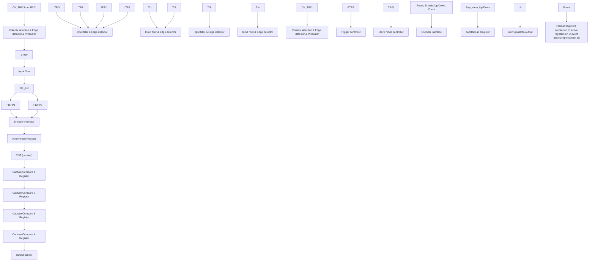

# 11.2.1 概述

如图 11-1 所示，通用定时器的结构大致可以分为三部分，即输入时钟部分，核心计数器部分和比较捕获通道部分。

通用定时器的时钟可以来自于 HB 总线时钟(CK\_INT)，可以来自外部时钟输入引脚(TIMx\_ETR)，可以来自于其他具有时钟输出功能的定时器（ITRx），还可以来自于比较捕获通道的输入端（TIMx\_CHx）。这些输入的时钟信号经过各种设定的滤波分频等操作后成为 CK\_PSC 时钟，输出给核心计数器部分。另外，这些复杂的时钟来源还可以作为 TRGO 输出给其他的定时器和 ADC 等外设。

通用定时器的核心是一个 16 位计数器（CNT）。CK\_PSC 经过预分频器（PSC）分频后，成为 CK\_CNT 再最终输给 CNT，CNT 支持增计数模式、减计数模式和增减计数模式，并有一个自动重装值寄存器（ATRLR）在每个计数周期结束后为 CNT 重装载初始化值。

通用定时器拥有四组比较捕获通道，每组比较捕获通道都可以从专属的引脚上输入脉冲，也可以向引脚输出波形，即比较捕获通道支持输入和输出模式。比较捕获寄存器每个通道的输入都支持

滤波、分频、边沿检测等操作，并支持通道间的互触发，还能为核心计数器 CNT 提供时钟。每个比较捕获通道都拥有一组比较捕获寄存器（CHxCVR），支持与主计数器（CNT）进行比较而输出脉冲。

# 11.2.2 通用定时器和高级定时器的区别

与高级定时器相比，通用定时器缺少以下功能：

1）通用定时器缺少对核心计数器的计数周期进行计数的重复计数寄存器。  
2）通用定时器的比较捕获通道缺少死区产生，没有互补输出。  
3）通用定时器没有刹车信号机制。

# 11.2.3 时钟输入

本节论述 CK\_PSC 的来源。此处截取通用定时器的整体结构框图的时钟源部分。

图 11-2 通用定时器 CK\_PSC 来源框图  
```mermaid
graph TD
    A["TIMx_CCMR1"] --> B["Filter"]
    B --> C["Edge detector"]
    C --> D["TI2F_Rising"]
    D --> E["0 1"]
    E --> F["CC2P"]
    F --> G["TIMx_CCER"]
    H["ICF[3:0"]] --> B
    I["TI2"] --> J["Filter"]
    J --> K["Edge detector"]
    K --> L["TI2F_Rising"]
    L --> M["0 1"]
    M --> N["CC2P"]
    N --> O["TIMx_CCER"]
    P["ETR pin"] --> Q["ETR"]
    Q --> R["0 1"]
    R --> S["Divider /1,2,4,8"]
    S --> T["ETPS[1:0"]]
    T --> U["TIMx_SMCR"]
    V["ETR pin"] --> W["ETR"]
    W --> X["0 1"]
    X --> Y["Divider /1,2,4,8"]
    Y --> Z["ETPS[1:0"]]
    Z --> AA["TIMx_SMCR"]
    AB["EC"] --> AC["Filter downcounter"]
    AD["SMS[2:0"]] --> AE["Internal clock mode"]
    AF["CK_PSC"] --> AG["Encoder mode"]
    AH["TRGI"] --> AI["External clock mode 1"]
    AJ["ETRF"] --> AK["External clock mode 2"]
    AL["CK_INT"] --> AM["Internal clock mode"]
    AN["TIMx_SMCR"] --> AO["Internal clock mode"]
    AP["TI2F ED"] --> AQ["0xx 100 101 110 111"]
    AR["TI1FP1"] --> AS["0xx 100 101 110 111"]
    AT["TI2F or T"] --> AU["Encoder mode"]
    AV["TI1F or T"] --> AW["External clock mode 1"]
    AX["ETR"] --> AY["Encoder mode"]
    AZ["CK_INT"] --> BA["Internal clock mode"]
```

可选的输入时钟可以分为 4 类:

1）外部时钟引脚（ETR）输入的路线：ETR→ETRP→ETRF；  
2) 内部 HB 时钟输入路线：CK\_INT；  
3) 来自比较捕获通道引脚（TIMx\_CHx）的路线：TIMx\_CHx→Tlx→TlxFPx，此路线也用于编码器模式；  
4) 来自内部其他定时器的输入：ITRx。  
通过决定 CK\_PSC 来源的 SMS 的输入脉冲选择可以将实际的操作分为三类：

1）选择内部时钟源（CK\_INT）；  
2) 外部时钟源模式 1;  
3) 外部时钟源模式 2;  
4) 编码器模式。

上文提到的 4 种时钟源来源都可通过这 4 种操作选定。

# 11.2.3.1 内部时钟源（CK\_INT）

如果将 SMS 域保持为 000b 时启动通用定时器，那么就是选定内部时钟源（CK\_INT）为时钟。此时 CK\_INT 就是 CK\_PSC。

# 11.2.3.2 外部时钟源模式 1

如果将 SMS 域设置为 111b 时，就会启用外部时钟源模式 1。启用外部时钟源 1 时，TRGI 被选定

为 CK\_PSC 的来源，值得注意的，用户还需要通过配置 TS 域来选择 TRGI 的来源。TS 域可选择以下几种脉冲作为时钟来源：

1）内部触发（ITRx，x 为 0, 1, 2, 3）；  
2）比较捕获通道 1 经过边缘检测器后的信号（TI1F\_ED）；  
3）比较捕获通道的信号 TI1FP1、TI2FP2；  
4）来自外部时钟引脚输入的信号 ETRF。

# 11.2.3.3 外部时钟源模式 2

使用外部触发模式 2 能在外部时钟引脚输入的每一个上升沿或下降沿计数。将 ECE 位置位时，将使用外部时钟源模式 2。使用外部时钟源模式 2 时，ETRF 被选定为 CK\_PSC。ETR 引脚经过可选的反相器（ETP），分频器（ETPS）后成为 ETRP，再经过滤波器（ETF）后即成为 ETRF。

在 ECE 位置位且将 SMS 设为 111b 时，那么，相当于 TS 选择 ETRF 为输入。

# 11.2.3.4 编码器模式

将 SMS 置为 001b, 010b, 011b 将会启用编码器模式。启用编码器模式可以选择在 TI1FP1 和 TI2FP2 中某一个特定的电平下以另一个跳变沿作为信号进行信号输出。此模式用于外接编码器使用的情况下。具体功能参考 11.3.7 节。

# 11.2.4 计数器和周边

CK\_PSC 输入给预分频器（PSC）进行分频。PSC 是 16 位的，实际的分频系数相当于 R16\_TIMx\_PSC 的值 +1。CK\_PSC 经过 PSC 会成为 CK\_INT。更改 R16\_TIM1\_PSC 的值并不会实时生效，而会在更新事件后更新给 PSC。更新事件包括 UG 位清零和复位。

# 11.2.5 比较捕获通道

比较捕获通道是定时器实现复杂功能的核心，它的核心是比较捕获寄存器，辅以外围输入部分的数字滤波，分频和通道间复用，输出部分的比较器和输出控制组成。比较捕获通道的结构框图如图 11-3 所示。

图 11-3 比较捕获通道的结构框图  
```mermaid
graph TD
    A["TI1"] --> B["Filter downcounter"]
    B --> C["TI1F"]
    C --> D["Edge detector"]
    D --> E["TI1F_Rising"]
    D --> F["TI1F_Falling"]
    E --> G["TI1FP1"]
    F --> H["TI2FP1"]
    G --> I["TO the slave mode controller"]
    H --> J["TRC (from slave mode controller)"]
    I --> K["IC1"]
    J --> L["CC1S[1:0"]]
    J --> M["ICPS[1:0"]]
    J --> N["CC1E"]
    O["TIMx_CHCTLR1"] --> P["ICF[3:0"]]
    P --> Q["TI1F_CHCTLR1"]
    R["TI2F_Rising (from channel 2)"] --> S["TI2F_Falling (from channel 2)"]
    T["TI2F_Falling (from channel 2)"] --> U["TI2F_Rising (from channel 2)"]
    V["HB Bus"] --> W["MCU-peripheral interface"]
    X["Read CCR1H"] --> Y["S R"]
    Z["Read CCR1L"] --> AA["Input mode"]
    AB["CC1S[1"] CC1S["0"]] --> AC["AND Gate"]
    AD["IC1PS"] --> AE["AND Gate"]
    AF["CC1E"] --> AG["AND Gate"]
    AH["CC1G"] --> AI["AND Gate"]
    AJ["TIMx_SWEVGR"] --> AK["Counter"]
    AL["ETRF"] --> AM["Output mode controller"]
    AN["CNT > CCR1"] --> AO["OC1M[2:0"]]
    AP["CNT = CCR1"] --> AQ["TIMx_CHCTLR1"]
    AR["To the master mode controller"] --> AS["TO the master mode controller"]
    AT["Output enable circuit"] --> AU["OC1"]
    AV["CC1P TIMx_CCER"] --> AW["CC1E TIMx_CCER"]
    AX["TIMx_CHCTLR1"] --> AY["TI1F ED"]
    AZ["TI1F ED"] --> BA["To the slave mode controller"]
    BB["TI2F_INP"] --> BC["TCR (from slave mode controller)"]
    BD["TI2F_INP"] --> BE["TCR (from slave mode controller)"]
    BF["TI2F_INP"] --> BG["TCR (from slave mode controller)"]
    BH["TI2F_INP"] --> BI["TCR (from slave mode controller)"]
    BJ["TI2F_INP"] --> BK["TCR (from slave mode controller)"]
    BL["TI2F_INP"] --> BM["TCR (from slave mode controller)"]
    BN["TI2F_INP"] --> BO["TCR (from slave mode controller)"]
    BP["TI2F_INP"] --> BQ["TI2F_INP"]
    BR["TI2F_INP"] --> BS["TI2F_INP"]
    BT["TI2F_INP"] --> BU["TI2F_INP"]
    BV["TI2F_INP"] --> BW["TI2F_INP"]
    BX["TI2F_INP"] --> BY["TI2F_INP"]
    BZ["TI2F_INP"] --> BZT["TCR (from slave mode controller)"]
    BXT["TI2F_INP"] --> BXTQ["TCR (from slave mode controller)"]
    BYT["TI2F_INP"] --> BYTQ["TCR (from slave mode controller)"]
```

信号从通道 x 引脚输入进来后可选做为 TIx(TI1 的来源可以不只是 CH1, 见定时器的框图 10-1), TI1 经过滤波器（ICF[3:0]）生成 TI1F，再经过边沿检测器分成 TI1F\_Rising 和 TI1F\_Falling，这两个信号经过选择（CC1P）生成 TI1FP1，TI1FP1 和来自通道 2 的 TI2FP1 一起送给 CC1S 选择成为 IC1，经过 ICPS 分频后送给比较捕获寄存器。

比较捕获寄存器由一个预装载寄存器和一个影子寄存器组成，读写过程仅操作预装载寄存器。在捕获模式下，捕获发生在影子寄存器上，然后复制到预装载寄存器；在比较模式下，预装载寄存器的内容被复制到影子寄存器中，然后影子寄存器的内容与核心计数器（CNT）进行比较。

# 11.3 功能和实现

通用定时器复杂功能的实现都是对定时器的比较捕获通道、时钟输入电路和计数器及周边组件进行操作实现的。定时器的时钟输入可以来自于包括比较捕获通道的输入在内的多个时钟源。对比

较捕获寄存通道和时钟源选择的操作直接决定其功能。比较捕获通道是双向的，可以工作在输入和输出模式。

# 11.3.1 输入捕获模式

输入捕获模式是定时器的基本功能之一。输入捕获模式的原理是，当检测到 ICxPS 信号上确定的边沿后，则产生捕获事件，计数器当前的值会被锁存到比较捕获寄存器（R16\_TIMx\_CHCTLRx）中。发生捕获事件时，CCxIF（在 R16\_TIMx\_INTFR 中）被置位，如果使能了中断或者 DMA，还会产生相应中断或者 DMA。如果发生捕获事件时，CCxIF 已经被置位了，那么 CCxOF 位会被置位。CCxIF 可由软件清除，也可以通过读取比较捕获寄存器由硬件清除。CCxOF 由软件清除。

举个通道 1 的例子来说明使用输入捕获模式的步骤，如下：

1）配置 CCxS 域，选择 ICx 信号的来源。比如设为 10b，选择 TI1FP1 作为 IC1 的来源，不可以使用默认设置，CCxS 域默认是使比较捕获模块作为输出通道；  
2）配置 ICxF 域，设定 TI 信号的数字滤波器。数字滤波器会以确定的频率，采样确定的次数，再输出一个跳变。这个采样频率和次数是通过 ICxF 来确定的；  
3）配置 CCxP 位，设定 T1xFPx 的极性。比如保持 CC1P 位为低，选择上升沿跳变；  
4）配置 ICxPS 域，设定 ICx 信号成为 ICxPS 之间的分频系数。比如保持 ICxPS 为 00b，不分频；  
5）配置 CCxE 位，允许捕获核心计数器（CNT）的值到比较捕获寄存器中。置 CC1E 位；  
6）根据需要配置 CCxIE 和 CCxDE 位，决定是否允许使能中断或者 DMA。

至此已经将比较捕获通道配置完成。

当 TI1 输入了一个被捕获的脉冲时,核心计数器(CNT)的值会被记录到比较捕获寄存器中,CC1IF 被置位,当 CC1IF 在之前就已经被置位时,CCIOF 位也会被置位。如果 CC1IE 位,那么会产生一个中断;如果 CC1DE 被置位,会产生一个 DMA 请求。可以通过写事件产生寄存器的方式(R16\_TIMx\_SWEVGR)的方式由软件产生一个输入捕获事件。

# 11.3.2 比较输出模式

比较输出模式是定时器的基本功能之一。比较输出模式的原理是在核心计数器（CNT）的值与比较捕获寄存器的值一致时，输出特定的变化或波形。OCxM 域（在 R16\_TIMx\_CHCTLRx 中）和 CCxP 位（在 R16\_TIMx\_CCER 中）决定输出的是确定的高低电平还是电平翻转。产生比较一致事件时还会置 CCxIF 位，如果预先置了 CCxIE 位，则会产生一个中断；如果预先设置了 CCxDE 位，则会产生一个 DMA 请求。

配置为比较输出模式的步骤为下:

1）配置核心计数器（CNT）的时钟源和自动重装值；  
2）设置好需要对比的计数值到比较捕获寄存器（R16\_TIMx\_CHxCVR）中；  
3）如果需要产生中断，置 CCxIE 位；  
4）保持 OCxPE 为 0，禁用比较捕获寄存器的预装载寄存器；  
5）设定输出模式，设置 OCxM 域和 CCxP 位；  
6）使能输出，置 CCxE 位；  
7）置 CEN 位启动定时器。

# 11.3.3 强制输出模式

定时器的比较捕获通道的输出模式可以由软件强制输出确定的电平，而不依赖比较捕获寄存器的影子寄存器和核心计数器的比较。

具体的做法是将 OCxM 置为 100b，即为强制将 OCxREF 置为低；或者将 OCxM 置为 101b，即为强制将 OCxREF 置为高。

需要注意的是，将 OCxM 强制置为 100b 或者 101b，内部主计数器和比较捕获寄存器的比较过程还在进行，相应的标志位还在置位，中断和 DMA 请求还在产生。

# 11.3.4 PWM 输入模式

PWM 输入模式是用来测量 PWM 的占空比和频率的，是输入捕获模式的一种特殊情况。除下列区别外，操作和输入捕获模式相同：PWM 占用两个比较捕获通道，且两个通道的输入极性设为相反，其中一个信号被设为触发输入，SMS 设为复位模式。

例如，测量从 TI1 输入的 PWM 波的周期和频率，需要进行以下操作：

1）将 TI1(TI1FP1) 设为 IC1 信号的输入。将 CC1S 置为 01b；  
2）将 TI1FP1 置为上升沿有效。将 CC1P 保持为 0；  
3）将 TI1(TI1FP2) 置为 IC2 信号的输入。将 CC2S 置为 10b；  
4）选 TI1FP2 置为下降沿有效。将 CC2P 置为 1；  
5）时钟源的来源选择 TI1FP1。将 TS 设为 101b；  
6）将 SMS 设为复位模式，即 100b；  
7）使能输入捕获。CC1E 和 CC2E 置位。

注:因只有 TI1FP1 和 TI2FP2 连到了从模式控制器,所以 PWM 输入模式只能使用 TIM2\_CH1/TIM2\_CH2。

# 11.3.5 PWM 输出模式

PWM 输出模式是定时器的基本功能之一。PWM 输出模式最常见的是使用重装值确定 PWM 频率，使用捕获比较寄存器确定占空比的方法。将 OCxM 域中置 110b 或者 111b 使用 PWM 模式 1 或者模式 2，置 OCxPE 位使能预装载寄存器，最后置 ARPE 位使能预装载寄存器的自动重装载。在发生一个更新事件时，预装载寄存器的值才能被送到影子寄存器，所以在核心计数器开始计数之前，需要置 UG 位来初始化所有寄存器。在 PWM 模式下，核心计数器和比较捕获寄存器一直在进行比较，根据 CMS 位，定时器能够输出边沿对齐或者中央对齐的 PWM 信号。

# - 边沿对齐

使用边沿对齐时，核心计数器增计数或者减计数，在 PWM 模式 1 的情景下，在核心计数器的值大于比较捕获寄存器时，OCxREF 上升为高；当核心计数器的值小于比较捕获寄存器时（比如核心计数器增长到 R16\_TIMx\_ATRLR 的值而恢复成全 0 时），OCxREF 下降为低。

# ● 中央对齐

使用中央对齐模式时，核心计数器运行在增计数和减计数交替进行的模式下，OCxREF 在核心计数器和比较捕获寄存器的值一致时进行上升和下降的跳变。但比较标志在三种中央对齐模式下，置位的时机有所不同。在使用中央对齐模式时，最好在启动核心计数器之前产生一个软件更新标志（置UG 位）。

# 11.3.6 单脉冲模式

单脉冲模式可以响应一个特定的事件，在一个延迟之后产生一个脉冲，延迟和脉冲的宽度可编程。置 OPM 位可以使核心计数器在产生下一个更新事件 UEV 时（计数器翻转到 0）停止。

图 11-4 事件产生和脉冲响应  

```line
| Signal     | Time Segment         | Counter Value |
|------------|----------------------|---------------|
| TI2        | t_DELAY               | 0             |
| OC1REF     | t Delaware            | 0             |
| OC1        | t_PULSE              | 0             |
| ATRLR      | t Delaware            | 0             |
| CHxCVR     | t Delaware            | 0             |
```


如图 11-4 所示，需要在 T12 输入引脚上检测到一个上升沿开始，延迟 Tdelay 之后，在 OC1 上产生一个长度为 Tpulse 的正脉冲：

1）设定 TI2 为触发。置 CC2S 域为 01b，把 TI2FP2 映射到 TI2；置 CC2P 位为 0b，TI2FP2 设为上升沿检测；置 TS 域为 110b，TI2FP2 设为触发源；置 SMS 域为 110b，TI2FP2 被用来启动计数器；  
2）Tdelay 由比较捕获寄存器定义，Tpulse 由自动重装值寄存器的值和比较捕获寄存器的值确定。

# 11.3.7 编码器模式

编码器模式是定时器的一个典型应用，可以用来接入编码器的双相输出，核心计数器的计数方向和编码器的转轴方向同步，编码器每输出一个脉冲就会使核心计数器加一或减一。使用编码器的步骤为：将 SMS 域置为 001b（只在 TI2 边沿计数）、010b（只在 TI1 边沿计数）或者 011b（在 TI1 和 TI2 双边沿计数），将编码器接到比较捕获通道 1、2 的输入端，设一个重装值计数器的值，这个值可以设的大一点。在编码器模式时，定时器内部的比较捕获寄存器，预分频器，重复计数寄存器等都正常工作。下表表明了计数方向和编码器信号的关系。

表 11-1 定时器编码器模式的计数方向和编码器信号之间的关系

<table><tr><td rowspan="2">计数有效边沿</td><td rowspan="2">相对信号的电平</td><td colspan="2">TI1FP1 信号边沿</td><td colspan="2">TI2FP2 信号</td></tr><tr><td>上升沿</td><td>下降沿</td><td>上升沿</td><td>下降沿</td></tr><tr><td rowspan="2">仅在 TI1 边沿计数</td><td>高</td><td>向下计数</td><td>向上计数</td><td rowspan="2" colspan="2">不计数</td></tr><tr><td>低</td><td>向上计数</td><td>向下计数</td></tr><tr><td rowspan="2">仅在 TI2 边沿计数</td><td>高</td><td rowspan="2" colspan="2">不计数</td><td>向上计数</td><td>向下计数</td></tr><tr><td>低</td><td>向下计数</td><td>向上计数</td></tr><tr><td rowspan="2">在 TI1 和 TI2 双边沿计数</td><td>高</td><td>向下计数</td><td>向上计数</td><td>向上计数</td><td>向下计数</td></tr><tr><td>低</td><td>向上计数</td><td>向下计数</td><td>向下计数</td><td>向上计数</td></tr></table>

# 11.3.8 定时器同步模式

定时器能够输出时钟脉冲（TRGO），也能接收其他定时器的输入（ITRx）。不同的定时器的 ITRx 的来源（别的定时器的 TRGO）是不一样的。定时器内部触发连接如表 11-2 所示。

表 11-2 GTPM 内部触发连接

<table><tr><td>从定时器</td><td>ITRO (TS=000)</td><td>ITR1 (TS=001)</td><td>ITR2 (TS=010)</td><td>ITR3 (TS=011)</td></tr><tr><td>TIM2</td><td>TIM1</td><td></td><td></td><td></td></tr><tr><td>TIM1</td><td></td><td>TIM2</td><td></td><td></td></tr></table>

# 11.3.9 调试模式

当系统进入调试模式时，根据 DBG 模块的设置可以控制定时器继续运转或者停止。

# 11.4 寄存器描述

表 11-3 TIM2 相关寄存器列表

<table><tr><td>名称</td><td>偏移地址</td><td>描述</td><td>复位值</td></tr><tr><td>R16_TIM2_CTLR1</td><td>0x40000000</td><td>TIM2 控制寄存器 1</td><td>0x0000</td></tr><tr><td>R16_TIM2_CTLR2</td><td>0x40000004</td><td>TIM2 控制寄存器 2</td><td>0x0000</td></tr><tr><td>R16_TIM2_SMCFGR</td><td>0x40000008</td><td>TIM2 从模式控制寄存器</td><td>0x0000</td></tr><tr><td>R16_TIM2_DMAINTENR</td><td>0x4000000C</td><td>TIM2 DMA/中断使能寄存器</td><td>0x0000</td></tr><tr><td>R16_TIM2_INTFR</td><td>0x40000010</td><td>TIM2 中断状态寄存器</td><td>0x0000</td></tr><tr><td>R16_TIM2_SWEVGR</td><td>0x40000014</td><td>TIM2 事件产生寄存器</td><td>0x0000</td></tr><tr><td>R16_TIM2_CHCTLR1</td><td>0x40000018</td><td>TIM2 比较/捕获控制寄存器 1</td><td>0x0000</td></tr><tr><td>R16_TIM2_CHCTLR2</td><td>0x4000001C</td><td>TIM2 比较/捕获控制寄存器 2</td><td>0x0000</td></tr><tr><td>R16_TIM2_CCER</td><td>0x40000020</td><td>TIM2 比较/捕获使能寄存器</td><td>0x0000</td></tr><tr><td>R16_TIM2_CNT</td><td>0x40000024</td><td>TIM2 计数器</td><td>0x0000</td></tr><tr><td>R16_TIM2_PSC</td><td>0x40000028</td><td>TIM2 计数时钟预分频器</td><td>0x0000</td></tr><tr><td>R16_TIM2_ATRLR</td><td>0x4000002C</td><td>TIM2 自动重装值寄存器</td><td>0xFFFF</td></tr><tr><td>R32_TIM2_CH1CVR</td><td>0x40000034</td><td>TIM2 比较/捕获寄存器 1</td><td>0x00000000</td></tr><tr><td>R32_TIM2_CH2CVR</td><td>0x40000038</td><td>TIM2 比较/捕获寄存器 2</td><td>0x00000000</td></tr><tr><td>R32_TIM2_CH3CVR</td><td>0x4000003C</td><td>TIM2 比较/捕获寄存器 3</td><td>0x00000000</td></tr><tr><td>R32_TIM2_CH4CVR</td><td>0x40000040</td><td>TIM2 比较/捕获寄存器 4</td><td>0x00000000</td></tr><tr><td>R16_TIM2_DMACFGR</td><td>0x40000048</td><td>TIM2 DMA 控制寄存器</td><td>0x0000</td></tr><tr><td>R16_TIM2_DMAADR</td><td>0x4000004C</td><td>TIM2 连续模式的 DMA 地址寄存器</td><td>0x0000</td></tr></table>

# 11.4.1 控制寄存器 1（TIM2\_CTLR1）

偏移地址：0x00

<table><tr><td>15</td><td>14</td><td>13</td><td>12</td><td>11</td><td>10</td><td>9</td><td>8</td><td>7</td><td>6</td><td>5</td><td>4</td><td>3</td><td>2</td><td>1</td><td>0</td></tr><tr><td>CAPLV L</td><td>CAPO V</td><td colspan="4">Reserved</td><td colspan="2">CKD[1:0]</td><td>ARPE</td><td colspan="2">CMS[1:0]</td><td>DIR</td><td>OPM</td><td>URS</td><td>UDIS</td><td>CEN</td></tr></table>

<table><tr><td>位</td><td>名称</td><td>访问</td><td>描述</td><td>复位值</td></tr><tr><td>15</td><td>CAPLVL</td><td>RW</td><td>双沿捕获模式下,捕获电平指示使能。1:使能指示功能;0:关闭指示功能。注:使能后,CHxCVR的[16]指示捕获值对应的电平。</td><td>0</td></tr><tr><td>14</td><td>CAPOV</td><td>RW</td><td>捕获值模式配置。1:当捕获前产生计数器溢出时,CHxCVR值为0xFFFF;0:捕获值为实际计数器的值。</td><td>0</td></tr><tr><td>[13:10]</td><td>Reserved</td><td>RO</td><td>保留。</td><td>0</td></tr><tr><td>[9:8]</td><td>CKD[1:0]</td><td>RW</td><td>这2位定义在定时器时钟(CK_INT)频率、数字滤波器所用的采样时钟之间的分频比例。00: Tdts=Tck_int;01: Tdts= 2xTck_int;10: Tdts= 4xTck_int;11: 保留。</td><td>0</td></tr><tr><td>7</td><td>ARPE</td><td>RW</td><td>自动重装预装使能位。1: 使能自动重装值寄存器(ATRLR);0: 禁止自动重装值寄存器(ATRLR)。</td><td>0</td></tr><tr><td>[6:5]</td><td>CMS[1:0]</td><td>RW</td><td>中央对齐模式选择。00: 边沿对齐模式。计数器依据方向位(DIR)向上或向下计数。01: 中央对齐模式 1。计数器交替地向上和向下计数。配置为输出的通道(CHCTLRx 寄存器中 CCxS=00)的输出比较中断标志位,只在计数器向下计数时被设置。10: 中央对齐模式 2。计数器交替地向上和向下计数。配置为输出的通道(CHCTLRx 寄存器中 CCxS=00)的输出比较中断标志位,只在计数器向上计数时被设置。11: 中央对齐模式 3。计数器交替地向上和向下计数。配置为输出的通道(CHCTLRx 寄存器中 CCxS=00)的输出比较中断标志位,在计数器向上和向下计数时均被设置。注: 在计数器使能时(CEN=1),不允许从边沿对齐模式转换到中央对齐模式。</td><td>0</td></tr><tr><td>4</td><td>DIR</td><td>RW</td><td>计数器方向。1: 计数器的计数模式为减计数;0: 计数器的计数模式为增计数。注: 当计数器配置为中央对齐模式或编码器模式时,该位无效。</td><td>0</td></tr><tr><td>3</td><td>OPM</td><td>RW</td><td>单脉冲模式。1: 在发生下一次更新事件时,计数器停止(清除CEN位);0: 在发生下一次更新事件时,计数器不停止。</td><td>0</td></tr><tr><td>2</td><td>URS</td><td>RW</td><td>更新请求源,软件通过该位选择UEV事件的源。1: 如果使能了更新中断或DMA请求,则只有计数器溢出/下溢才产生更新中断或DMA请求;0: 如果使能了更新中断请求,则下述任一事件产生更新中断请求:-计数器溢出/下溢-设置UG位-从模式控制器产生的更新</td><td>0</td></tr><tr><td>1</td><td>UDIS</td><td>RW</td><td>禁止更新,软件通过该位允许/禁止UEV事件的产生。1: 禁止UEV。不产生更新事件,各寄存器(ATRLR、PSC、CHCTLRx)保持它们的值。如果设置了UG位或从模式控制器发出了一个硬件复位,则计数器和预分频器被重新初始化。0:允许UEV。更新(UEV)事件由下述任一事件产生-计数器溢出/下溢-设置UG位-从模式控制器产生的更新具有缓存的寄存器被装入它们的预装载值。</td><td>0</td></tr><tr><td>0</td><td>CEN</td><td>RW</td><td>使能计数器(Counter enable)。1:使能计数器;0:禁止计数器。注:在软件设置了CEN位后,外部时钟、门控模式和编码器模式才能工作。触发模式可以自动地通过硬件设置CEN位。</td><td>0</td></tr></table>

# 11.4.2 控制寄存器 2（TIM2\_CTLR2）

偏移地址：0x04

15 14 13 12 11 10 9 8 7 6 5 4 3 2 1 0

<table><tr><td>Reserved</td><td>TI1S</td><td>MMS[2:0]</td><td>CCDS</td><td>Reserved</td></tr></table>

<table><tr><td>位</td><td>名称</td><td>访问</td><td>描述</td><td>复位值</td></tr><tr><td>[15:8]</td><td>Reserved</td><td>RO</td><td>保留。</td><td>0</td></tr><tr><td>7</td><td>TI1S</td><td>RW</td><td>TI1 选择:1: TIMx_CH1、TIMx_CH2 和 TIMx_CH3 引脚经异或后连到 TI1 输入;0: TIMx_CH1 引脚直连到 TI1 输入。</td><td>0</td></tr><tr><td>[6:4]</td><td>MMS[2:0]</td><td>RW</td><td>主模式选择:这 3 位用于选择在主模式下送到从定时器的同步信息(TRGO)。可能的组合如下:000: 复位 - UG 位被用于作为触发输出(TRGO)。如果是触发输入产生的复位(从模式控制器处于复位模式),则 TRGO 上的信号相对实际的复位会有一个延迟;001: 使能 - 计数器使能信号 CNT_EN 被用于作为触发输出(TRGO)。有时需要在同一时间启动多个定时器或控制在一段时间内使能从定时器。计数器使能信号是通过 CEN 控制位和门控模式下的触发输入信号的逻辑或产生。当计数器使能信号受控于触发输入时,TRGO 上会有一个延迟,除非选择了主/从模式(见 TIMx_SMCFGR 寄存器中 MSM 位的描述);010: 更新事件被选为触发输出(TRGO)。例如,一个主定时器的时钟可以被用作一个从定时器的预分频器;011: 比较脉冲,在发生一次捕获或一次比较成功时,当要设置 CC1IF 标志时(即使它已经为高),触发输出送出一个正脉冲(TRGO);100: 0C1REF 信号被用于作为触发输出(TRGO;101: 0C2REF 信号被用于作为触发输出(TRGO);110: 0C3REF 信号被用于作为触发输出(TRGO);111: 0C4REF 信号被用于作为触发输出(TRGO)。</td><td>0</td></tr><tr><td>3</td><td>CCDS</td><td>RW</td><td>1: 当发生更新事件时,送出 CHxCVR 的 DMA 请求;0: 当发生 CHxCVR 时,产生 CHxCVR 的 DMA 请求。</td><td>0</td></tr><tr><td>[2:0]</td><td>Reserved</td><td>RO</td><td>保留。</td><td>0</td></tr></table>

# 11.4.3 从模式控制寄存器（TIM2\_SMCFGR）

偏移地址：0x08

15 14 13 12 11 10 9 8 7 6 5 4 3 2 1 0

<table><tr><td>ETP</td><td>ECE</td><td>ETPS[1:0]</td><td>ETF[3:0]</td><td>MSM</td><td>TS[2:0]</td><td>Reserved</td><td>SMS[2:0]</td></tr></table>

<table><tr><td>位</td><td>名称</td><td>访问</td><td>描述</td><td>复位值</td></tr><tr><td>15</td><td>ETP</td><td>RO</td><td>ETR 触发极性选择,该位选择是直接输入 ETR 还是输入 ETR 的反相。1:将 ETR 反相,低电平或下降沿有效;0:ETR,高电平或上升沿有效。</td><td>0</td></tr><tr><td>14</td><td>ECE</td><td>RW</td><td>外部时钟模式 2 启用选择。1:使能外部时钟模式 2;0:禁用外部时钟模式 2。注 1:从模式可以与外部时钟模式 2 同时使用:复位模式,门控模式和触发模式;但是,这时 TRGI 不能连到 ETRF(TS 位不能是 111b)。注 2:外部时钟模式 1 和外部时钟模式 2 同时被使能时,外部时钟的输入是 ETRF。</td><td>0</td></tr><tr><td>[13:12]</td><td>ETPS[1:0]</td><td>RW</td><td>外部触发信号 (ETRP) 分频,这个信号频率最大不能超过是 TIMxCLK 频率的 1/4,可以通过这个域来降频。00:关闭预分频;01:ETRP 频率除以 2;10:ETRP 频率除以 4;11:ETRP 频率除以 8。</td><td>0</td></tr><tr><td>[11:8]</td><td>ETF[3:0]</td><td>RW</td><td>外部触发滤波,实际上,数字滤波器是一个事件计数器,它使用一定的采样的频率,记录到 N 个事件后会产生一个输出的跳变。0000:无滤波器,以 Fdts 采样;0001:采样频率 Fsampling=Fck_int,N=2;0010:采样频率 Fsampling=Fck_int,N=4;0011:采样频率 Fsampling=Fck_int,N=8;0100:采样频率 Fsampling=Fdts/2,N=6;0101:采样频率 Fsampling=Fdts/2,N=8;0110:采样频率 Fsampling=Fdts/4,N=6;0111:采样频率 Fsampling=Fdts/4,N=8;1000:采样频率 Fsampling=Fdts/8,N=6;1001:采样频率 Fsampling=Fdts/8, N=8;1010:采样频率 Fsampling=Fdts/16, N=5;1011:采样频率 Fsampling=Fdts/16, N=6;1100:采样频率 Fsampling=Fdts/16, N=8;1101:采样频率 Fsampling=Fdts/32, N=5;1110:采样频率 Fsampling=Fdts/32, N=6;1111:采样频率 Fsampling=Fdts/32, N=8。</td><td>0</td></tr><tr><td>7</td><td>MSM</td><td>RW</td><td>主/从模式选择。1:触发输入(TRGI)上的事件被延迟了,以允许在当前定时器(通过 TRGO)与它的从定时器间的完美同步。这对要求把几个定时器同步到一个单一的外部事件时是非常有用的;0:不发挥作用。</td><td>0</td></tr><tr><td>[6:4]</td><td>TS[2:0]</td><td>RW</td><td>触发选择域,这3位选择用于同步计数器的触发输入源。000:内部触发0(ITRO);001:内部触发1(ITR1);010:内部触发2(ITR2);011:内部触发3(ITR3);100:TI1的边沿检测器(TI1F_ED);101:滤波后的定时器输入1(TI1FP1);110:滤波后的定时器输入2(TI2FP2);111:外部触发输入(ETRF);以上只有在SMS为0时改变。</td><td>0</td></tr><tr><td>3</td><td>Reserved</td><td>RO</td><td>保留。</td><td>0</td></tr><tr><td>[2:0]</td><td>SMS[2:0]</td><td>RW</td><td>输入模式选择域。选择核心计数器的时钟和触发模式。000:由内部时钟CK_INT驱动;001:编码器模式1,根据TI1FP1的电平,核心计数器在TI2FP2的边沿增减计数;010:编码器模式2,根据TI2FP2的电平,核心计数器在TI1FP1的边沿增减计数;011:编码器模式3,根据另一个信号的输入电平,核心计数器在TI1FP1和TI2FP2的边沿增减计数;100:复位模式,触发输入(TRGI)的上升沿将初始化计数器,并且产生一个更新寄存器的信号;101:门控模式,当触发输入(TRGI)为高时,计数器的时钟开启;在触发输入变为低,计数器停止,计数器的启停都是受控的;110:触发模式,计数器在触发输入TRGI的上升沿启动,只有计数器的启动是受控的;111:外部时钟模式1,选中的触发输入(TRGI)的上升沿驱动计数器。</td><td>0</td></tr></table>

# 11.4.4 DMA/中断使能寄存器（TIM2\_DMAINTENR）

偏移地址：0x0C

<table><tr><td>15</td><td>14</td><td>13</td><td>12</td><td>11</td><td>10</td><td>9</td><td>8</td><td>7</td><td>6</td><td>5</td><td>4</td><td>3</td><td>2</td><td>1</td><td>0</td></tr><tr><td>Reserved</td><td>TDE</td><td>Reserved</td><td>CC4DE</td><td>CC3DE</td><td>CC2DE</td><td>CC1DE</td><td>UDE</td><td>Reserved</td><td>TIE</td><td>Reserved</td><td>CC4IE</td><td>CC3IE</td><td>CC2IE</td><td>CC1IE</td><td>UIE</td></tr></table>

<table><tr><td>位</td><td>名称</td><td>访问</td><td>描述</td><td>复位值</td></tr><tr><td>15</td><td>Reserved</td><td>RO</td><td>保留。</td><td>0</td></tr><tr><td>14</td><td>TDE</td><td>RW</td><td>触发DMA请求使能位。1:允许触发DMA请求;0:禁止触发DMA请求。</td><td>0</td></tr><tr><td>13</td><td>Reserved</td><td>RO</td><td>保留。</td><td>0</td></tr><tr><td>12</td><td>CC4DE</td><td>RW</td><td>比较捕获通道4的DMA请求使能位。1:允许比较捕获通道4的DMA请求;0:禁止比较捕获通道4的DMA请求。</td><td>0</td></tr><tr><td>11</td><td>CC3DE</td><td>RW</td><td>比较捕获通道3的DMA请求使能位。1:允许比较捕获通道3的DMA请求;0:禁止比较捕获通道3的DMA请求。</td><td>0</td></tr><tr><td>10</td><td>CC2DE</td><td>RW</td><td>比较捕获通道2的DMA请求使能位。1:允许比较捕获通道2的DMA请求;0:禁止比较捕获通道2的DMA请求。</td><td>0</td></tr><tr><td>9</td><td>CC1DE</td><td>RW</td><td>比较捕获通道1的DMA请求使能位。1:允许比较捕获通道1的DMA请求;0:禁止比较捕获通道1的DMA请求。</td><td>0</td></tr><tr><td>8</td><td>UDE</td><td>RW</td><td>更新的DMA请求使能位。1:允许更新的DMA请求;0:禁止更新的DMA请求。</td><td>0</td></tr><tr><td>7</td><td>Reserved</td><td>RO</td><td>保留。</td><td>0</td></tr><tr><td>6</td><td>TIE</td><td>RW</td><td>触发中断使能位。1:使能触发中断;0:禁止触发中断。</td><td>0</td></tr><tr><td>5</td><td>Reserved</td><td>RO</td><td>保留。</td><td>0</td></tr><tr><td>4</td><td>CC4IE</td><td>RW</td><td>比较捕获通道4中断使能位。1:允许比较捕获通道4中断;0:禁止比较捕获通道4中断。</td><td>0</td></tr><tr><td>3</td><td>CC3IE</td><td>RW</td><td>比较捕获通道3中断使能位。1:允许比较捕获通道3中断;0:禁止比较捕获通道3中断。</td><td>0</td></tr><tr><td>2</td><td>CC2IE</td><td>RW</td><td>比较捕获通道2中断使能位。1:允许比较捕获通道2中断;0:禁止比较捕获通道2中断。</td><td>0</td></tr><tr><td>1</td><td>CC1IE</td><td>RW</td><td>比较捕获通道1中断使能位。1:允许比较捕获通道1中断;0:禁止比较捕获通道1中断。</td><td>0</td></tr><tr><td>0</td><td>UIE</td><td>RW</td><td>更新中断使能位。1:允许更新中断;0:禁止更新中断。</td><td>0</td></tr></table>

# 11.4.5 中断状态寄存器（TIM2\_INTFR）

偏移地址：0x10

<table><tr><td>15</td><td>14</td><td>13</td><td>12</td><td>11</td><td>10</td><td>9</td><td>8</td><td>7</td><td>6</td><td>5</td><td>4</td><td>3</td><td>2</td><td>1</td><td>0</td></tr></table>

<table><tr><td>Reserved</td><td>CC40F</td><td>CC30F</td><td>CC20F</td><td>CC10F</td><td>Reserved</td><td>TIF</td><td>Reserved</td><td>CC4IF</td><td>CC3IF</td><td>CC2IF</td><td>CC1IF</td><td>UIF</td></tr></table>

<table><tr><td>位</td><td>名称</td><td>访问</td><td>描述</td><td>复位值</td></tr><tr><td>[15:13]</td><td>Reserved</td><td>RO</td><td>保留。</td><td>0</td></tr><tr><td>12</td><td>CC40F</td><td>RWO</td><td>比较捕获通道4重复捕获标志位。</td><td>0</td></tr><tr><td>11</td><td>CC30F</td><td>RWO</td><td>比较捕获通道3重复捕获标志位。</td><td>0</td></tr><tr><td>10</td><td>CC20F</td><td>RWO</td><td>比较捕获通道2重复捕获标志位。</td><td>0</td></tr><tr><td>9</td><td>CC10F</td><td>RWO</td><td>比较捕获通道1重复捕获标志位,仅用于比较捕获通道被配置为输入捕获模式时。该标记由硬件置位,软件写0可清除此位。1:计数器的值被捕获到捕获比较寄存器时,CC1IF的状态已经被置位;0:无重复捕获产生。</td><td>0</td></tr><tr><td>[8:7]</td><td>Reserved</td><td>RO</td><td>保留。</td><td>0</td></tr><tr><td>6</td><td>TIF</td><td>RWO</td><td>触发器中断标志位,当发生触发事件时由硬件对该位置位,由软件清零。触发事件包括从除门控模式外的其它模式时,在TRGI输入端检测到有效边沿,或门控模式下的任一边沿。1:触发器事件产生;0:无触发器事件产生。</td><td>0</td></tr><tr><td>5</td><td>Reserved</td><td>RO</td><td>保留。</td><td>0</td></tr><tr><td>4</td><td>CC4IF</td><td>RWO</td><td>比较捕获通道4中断标志位。</td><td>0</td></tr><tr><td>3</td><td>CC3IF</td><td>RWO</td><td>比较捕获通道3中断标志位。</td><td>0</td></tr><tr><td>2</td><td>CC2IF</td><td>RWO</td><td>比较捕获通道2中断标志位。</td><td>0</td></tr><tr><td>1</td><td>CC1IF</td><td>RWO</td><td>比较捕获通道1中断标志位。如果比较捕获通道配置为输出模式,当计数器值与比较值匹配时该位由硬件置位,但在中心对称模式下除外。该位由软件清零。1:核心计数器的值与比较捕获寄存器1的值匹配;0:无匹配发生。如果比较捕获通道1配置为输入模式,当捕获事件发生时该位由硬件置位,它由软件清零或通过读比较捕获寄存器清零。1:计数器值已被捕获比较捕获寄存器1;0:无输入捕获产生。</td><td>0</td></tr><tr><td>0</td><td>UIF</td><td>RWO</td><td>更新中断标志位,当产生更新事件时该位由硬件置位,由软件清零。1:更新中断产生;0:无更新事件产生。以下情形会产生更新事件:若 UDIS=0,当重复计数器数值上溢或下溢时;若 URS=0、UDIS=0,当置UG位时,或当通过软件对计数器核心计数器重新初始化时;若 URS=0、UDIS=0,当计数器CNT被触发事件重新初始化时。</td><td>0</td></tr></table>

# 11.4.6 事件产生寄存器（TIM2\_SWEVGR）

偏移地址：0x14

15 14 13 12 11 10 9 8 7 6 5 4 3 2 1 0

<table><tr><td>Reserved</td><td>TG</td><td>Reserved</td><td>CC4G</td><td>CC3G</td><td>CC2G</td><td>CC1G</td><td>UG</td></tr></table>

<table><tr><td>位</td><td>名称</td><td>访问</td><td>描述</td><td>复位值</td></tr><tr><td>[15:7]</td><td>Reserved</td><td>RO</td><td>保留。</td><td>0</td></tr><tr><td>6</td><td>TG</td><td>WO</td><td>触发事件产生位,该位由软件置位,硬件清零,用于产生一个触发事件。1:产生一个触发事件,TIF被置位,若使能对应的中断和DMA,则产生相应的中断和DMA;0:无动作。</td><td>0</td></tr><tr><td>5</td><td>Reserved</td><td>RO</td><td>保留。</td><td>0</td></tr><tr><td>4</td><td>CC4G</td><td>WO</td><td>比较捕获事件产生位4。产生比较捕获事件4。</td><td>0</td></tr><tr><td>3</td><td>CC3G</td><td>WO</td><td>比较捕获事件产生位3。产生比较捕获事件3。</td><td>0</td></tr><tr><td>2</td><td>CC2G</td><td>WO</td><td>比较捕获事件产生位2。产生比较捕获事件2。</td><td>0</td></tr><tr><td>1</td><td>CC1G</td><td>WO</td><td>比较捕获事件产生位1,产生比较捕获事件1。该位由软件置位,由硬件清零。用于产生一个比较捕获事件。1:在比较捕获通道1上产生一个比较捕获事件:若比较捕获通道1配置为输出:置CC1IF位。若使能对应的中断和DMA,则产生相应的中断和DMA;若比较捕获通道1配置为输入:当前核心计数器的值被捕获至比较捕获寄存器1;置CC1IF位,若使能了对应的中断和DMA,则产生相应的中断和DMA。若CC1IF已经置位,则置CC1OF位。0:无动作。</td><td>0</td></tr><tr><td>0</td><td>UG</td><td>WO</td><td>更新事件产生位,产生更新事件。该位由软件置位,由硬件自动清零。1:初始化计数器,并产生一个更新事件;0:无动作。注:预分频器的计数器也被清零,但是预分频系数不变。若在中心对称模式下或增计数模式下则核心计数器被清零;若减计数模式下则核心计数器取重装值寄存器的值。</td><td>0</td></tr></table>

# 11.4.7 比较/捕获控制寄存器 1（TIM2\_CHCTLR1）

偏移地址：0x18

通道可用于输入(捕获模式)或输出(比较模式)，通道的方向由相应的CCxS位定义。该寄存器其它位的作用在输入和输出模式下不同。OCxx描述了通道在输出模式下的功能，ICxx描述了通道在输入模式下的功能。

15 14 13 12 11 10 9 8 7 6 5 4 3 2 1 0 

<table><tr><td>OC2CE</td><td>OC2M[2:0]</td><td>OC2PE</td><td>OC2FE</td><td rowspan="2">CC2S[1:0]</td><td>OC1CE</td><td>OC1M[2:0]</td><td>OC1PE</td><td>OC1FE</td><td rowspan="2">CC1S[1:0]</td></tr><tr><td colspan="2">IC2F[3:0]</td><td colspan="2">IC2PSC[1:0]</td><td colspan="2">IC1F[3:0]</td><td colspan="2">IC1PSC[1:0]</td></tr></table>

比较模式（引脚方向为输出）：

<table><tr><td>位</td><td>名称</td><td>访问</td><td>描述</td><td>复位值</td></tr><tr><td>15</td><td>OC2CE</td><td>RW</td><td>比较捕获通道2清零使能位。1:一旦检测到ETRF输入高电平,清除OC2REF位零;0:OC2REF不受ETRF输入的影响。</td><td>0</td></tr><tr><td>[14:12]</td><td>OC2M[2:0]</td><td>RW</td><td>比较捕获通道2模式设置域。该3位定义了输出参考信号OC2REF的动作,而OC2REF决定了OC2、OC2N的值。OC2REF是高电平有效,而OC2和OC2N的有效电平取决于CC2P、CC2NP位。000:冻结。比较捕获寄存器的值与核心计数器间的比较值对OC2REF不起作用;001:强制设为有效电平。当核心计数器与比较捕获寄存器2的值相同时,强制OC2REF为高;010:强制设为无效电平。当核心计数器的值与比较捕获寄存器2相同时,强制OC2REF为低;011:翻转。当核心计数器与比较捕获寄存器2的值相同时,翻转OC2REF的电平。100:强制为无效电平。强制OC2REF为低。101:强制为有效电平。强制OC2REF为高。110:PWM模式1:在向上计数时,一旦核心计数器小于比较捕获寄存器的值时,通道2为有效电平,否则为无效电平;在向下计数时,一旦核心计数器大于比较捕获寄存器的值时,通道2为无效电平(OC2REF=0),否则为有效电平(OC2REF=1);111:PWM模式2:在向上计数时,一旦核心计数器小于比较捕获寄存器的值时,通道2为无效电平,否则为有效电平;在向下计数时,一旦核心计数器大于比较捕获寄存器的值时,通道2为有效电平(OC2REF=1),否则为无效电平(OC2REF=0)。注:一旦LOCK级别设为3并且CC2S=00b则该位不能被修改。在PWM模式1或PWM模式2中,只有当比较结果改变了或在输出比较模式中从冻结模式切换到PWM模式时,OC2REF电平才改变。</td><td>0</td></tr><tr><td>11</td><td>OC2PE</td><td>RW</td><td>比较捕获寄存器2预装载使能位。1:开启比较捕获寄存器2的预装载功能,读写操作仅对预装载寄存器操作,比较捕获寄存器2的预装载值在更新事件到来时被加载至当前影子寄存器中;0:禁止比较捕获寄存器2的预装载功能,可随时写入比较捕获寄存器2,并且新写入的数值立即起作用。注:一旦LOCK级别设为3并且CC2S=00,则该位不能被修改。仅仅在单脉冲模式下(OPM=1)可以在未确认预装载寄存器情况下使用PWM模式,否则其动作不确定。</td><td>0</td></tr><tr><td>10</td><td>OC2FE</td><td>RW</td><td>比较捕获通道2快速使能位,该位用于加快比较捕获通道输出对触发输入事件的响应。1:输入到触发器的有效沿的作用就像发生了一次比较匹配。因此,OC被设置为比较电平而与比较结果无关。采样触发器的有效沿和比较捕获通道2输出间的延时被缩短为3个时钟周期;0:根据计数器与比较捕获寄存器1的值,比较捕获通道2正常操作,即使触发器是打开的。当触发器的输入有一个有效沿时,激活比较捕获通道2输出的最小延时为5个时钟周期。OC2FE只在通道被配置成PWM1或PWM2模式时起作用。</td><td>0</td></tr><tr><td>[9:8]</td><td>CC2S[1:0]</td><td>RW</td><td>比较捕获通道2输入选择域。00:比较捕获通道2被配置为输出;01:比较捕获通道2被配置为输入,IC2映射在TI2上;10:比较捕获通道2被配置为输入,IC2映射在TI1上;11:比较捕获通道2被配置为输入,IC2映射在TRC上。此模式仅工作在内部触发器输入被选中时(由TS位选择)。注:比较捕获通道2仅在通道关闭时(CC2E为零时)才是可写的。</td><td>0</td></tr><tr><td>7</td><td>OC1CE</td><td>RW</td><td>比较捕获通道1清零使能位。</td><td>0</td></tr><tr><td>[6:4]</td><td>OC1M[2:0]</td><td>RW</td><td>比较捕获通道1模式设置域。</td><td>0</td></tr><tr><td>3</td><td>OC1PE</td><td>RW</td><td>比较捕获寄存器1预装载使能位。</td><td>0</td></tr><tr><td>2</td><td>OC1FE</td><td>RW</td><td>比较捕获通道1快速使能位。</td><td>0</td></tr><tr><td>[1:0]</td><td>CC1S[1:0]</td><td>RW</td><td>比较捕获通道1输入选择域。</td><td>0</td></tr></table>

捕获模式（引脚方向为输入）：

<table><tr><td>位</td><td>名称</td><td>访问</td><td>描述</td><td>复位值</td></tr><tr><td>[15:12]</td><td>IC2F[3:0]</td><td>RW</td><td>输入捕获滤波器2配置域,这几位设置了TI1输入的采样频率及数字滤波器长度。数字滤波器由一个事件计数器组成,它记录到N个事件后会产生一个输出的跳变。0000:无滤波器,以fDTS采样;</td><td>0</td></tr><tr><td></td><td></td><td></td><td>1000:采样频率 Fsampling=Fdts/8, N=6;0001:采样频率 Fsampling=Fck_int, N=2;1001:采样频率 Fsampling=Fdts/8, N=8;0010:采样频率 Fsampling=Fck_int, N=4;1010:采样频率 Fsampling=Fdts/16, N=5;0011:采样频率 Fsampling=f=Fck_int, N=8;1011:采样频率 Fsampling=Fdts/16, N=6;0100:采样频率 Fsampling=Fdts/2, N=6;1100:采样频率 Fsampling=Fdts/16, N=8;0101:采样频率 Fsampling=Fdts/2, N=8;1101:采样频率 Fsampling=Fdts/32, N=5;0110:采样频率 Fsampling=Fdts/4, N=6;1110:采样频率 Fsampling=Fdts/32, N=6;0111:采样频率 Fsampling=Fdts/4, N=8;1111:采样频率 Fsampling=Fdts/32, N=8。</td><td></td></tr><tr><td>[11:10]</td><td>IC2PSC[1:0]</td><td>RW</td><td>比较捕获通道2预分频配置域,这2位定义了比较捕获通道2的预分频系数。一旦CC1E=0,则预分频器复位。00:无预分频器,捕获输入口上检测到的每一个边沿都触发一次捕获;01:每2个事件触发一次捕获;10:每4个事件触发一次捕获;11:每8个事件触发一次捕获。</td><td>0</td></tr><tr><td>[9:8]</td><td>CC2S[1:0]</td><td>RW</td><td>比较捕获通道2输入选择域,这2位定义通道的方向(输入/输出),及输入脚的选择。00:比较捕获通道1通道被配置为输出;01:比较捕获通道1通道被配置为输入,IC1映射在TI1上;10:比较捕获通道1通道被配置为输入,IC1映射在TI2上;11:比较捕获通道1通道被配置为输入,IC1映射在TRC上。此模式仅工作在内部触发器输入被选中时(由TS位选择)。注:CC1S仅在通道关闭时(CC1E为0)才是可写的。</td><td>0</td></tr><tr><td>[7:4]</td><td>IC1F[3:0]</td><td>RW</td><td>输入捕获滤波器1配置域。</td><td>0</td></tr><tr><td>[3:2]</td><td>IC1PSC[1:0]</td><td>RW</td><td>比较捕获通道1预分频配置域。</td><td>0</td></tr><tr><td>[1:0]</td><td>CC1S[1:0]</td><td>RW</td><td>比较捕获通道1输入选择域。</td><td>0</td></tr></table>

# 11.4.8 比较/捕获控制寄存器 2（TIM2\_CHCTLR2）

偏移地址：0x1C

通道可用于输入(捕获模式)或输出(比较模式)，通道的方向由相应的CCxS位定义。该寄存器其它位的作用在输入和输出模式下不同。OCxx描述了通道在输出模式下的功能，ICxx描述了通道在输入模式下的功能。

<table><tr><td>15</td><td>14</td><td>13</td><td>12</td><td>11</td><td>10</td><td>9</td><td>8</td><td>7</td><td>6</td><td>5</td><td>4</td><td>3</td><td>2</td><td>1</td><td>0</td></tr><tr><td>OC4CE</td><td colspan="3">OC4M[2:0]</td><td>OC4PE</td><td>OC4FE</td><td colspan="2">CC4S[1:0]</td><td>OC3CE</td><td colspan="3">OC3M[2:0]</td><td>OC3PE</td><td>OC3FE</td><td colspan="2">CC3S[1:0]</td></tr></table>

<table><tr><td>IC4F[3:0]</td><td>IC4PSC[1:0]</td><td>IC3F[3:0]</td><td>IC3PSC[1:0]</td></tr></table>

比较模式（引脚方向为输出）：

<table><tr><td>位</td><td>名称</td><td>访问</td><td>描述</td><td>复位值</td></tr><tr><td>15</td><td>OC4CE</td><td>RW</td><td>比较捕获通道 4 清零使能位。</td><td>0</td></tr><tr><td>[14:12]</td><td>OC4M[2:0]</td><td>RW</td><td>比较捕获通道 4 模式设置域。</td><td>0</td></tr><tr><td>11</td><td>OC4PE</td><td>RW</td><td>比较捕获寄存器 4 预装载使能位。</td><td>0</td></tr><tr><td>10</td><td>OC4FE</td><td>RW</td><td>比较捕获通道 4 快速使能位。</td><td>0</td></tr><tr><td>[9:8]</td><td>CC4S[1:0]</td><td>RW</td><td>比较捕获通道 4 输入选择域。</td><td>0</td></tr><tr><td>7</td><td>OC3CE</td><td>RW</td><td>比较捕获通道 3 清零使能位。</td><td>0</td></tr><tr><td>[6:4]</td><td>OC3M[2:0]</td><td>RW</td><td>比较捕获通道 3 模式设置域。</td><td>0</td></tr><tr><td>3</td><td>OC3PE</td><td>RW</td><td>比较捕获寄存器 3 预装载使能位。</td><td>0</td></tr><tr><td>2</td><td>OC3FE</td><td>RW</td><td>比较捕获通道 3 快速使能位。</td><td>0</td></tr><tr><td>[1:0]</td><td>CC3S[1:0]</td><td>RW</td><td>比较捕获通道 3 输入选择域。</td><td>0</td></tr></table>

捕获模式（引脚方向为输入）：

<table><tr><td>位</td><td>名称</td><td>访问</td><td>描述</td><td>复位值</td></tr><tr><td>[15:12]</td><td>IC4F[3:0]</td><td>RW</td><td>输入捕获滤波器 4 配置域。</td><td>0</td></tr><tr><td>[11:10]</td><td>IC4PSC[1:0]</td><td>RW</td><td>比较捕获通道 4 预分频配置域。</td><td>0</td></tr><tr><td>[9:8]</td><td>CC4S[1:0]</td><td>RW</td><td>比较捕获通道 4 输入选择域。</td><td>0</td></tr><tr><td>[7:4]</td><td>IC3F[3:0]</td><td>RW</td><td>输入捕获滤波器 3 配置域。</td><td>0</td></tr><tr><td>[3:2]</td><td>IC3PSC[1:0]</td><td>RW</td><td>比较捕获通道 3 预分频配置域。</td><td>0</td></tr><tr><td>[1:0]</td><td>CC3S[1:0]</td><td>RW</td><td>比较捕获通道 3 输入选择域。</td><td>0</td></tr></table>

# 11.4.9 比较/捕获使能寄存器（TIM2\_CCER）

偏移地址：0x20

<table><tr><td>15</td><td>14</td><td>13</td><td>12</td><td>11</td><td>10</td><td>9</td><td>8</td><td>7</td><td>6</td><td>5</td><td>4</td><td>3</td><td>2</td><td>1</td><td>0</td></tr><tr><td colspan="2">Reserved</td><td>CC4P</td><td>CC4E</td><td colspan="2">Reserved</td><td>CC3P</td><td>CC3E</td><td colspan="2">Reserved</td><td>CC2P</td><td>CC2E</td><td colspan="2">Reserved</td><td>CC1P</td><td>CC1E</td></tr></table>

<table><tr><td>位</td><td>名称</td><td>访问</td><td>描述</td><td>复位值</td></tr><tr><td>[15:14]</td><td>Reserved</td><td>RO</td><td>保留。</td><td>0</td></tr><tr><td>13</td><td>CC4P</td><td>RW</td><td>比较捕获通道 4 输出极性设置位。</td><td>0</td></tr><tr><td>12</td><td>CC4E</td><td>RW</td><td>比较捕获通道 4 输出使能位。</td><td>0</td></tr><tr><td>[11:10]</td><td>Reserved</td><td>RO</td><td>保留。</td><td>0</td></tr><tr><td>9</td><td>CC3P</td><td>RW</td><td>比较捕获通道 3 输出极性设置位。</td><td>0</td></tr><tr><td>8</td><td>CC3E</td><td>RW</td><td>比较捕获通道 3 输出使能位。</td><td>0</td></tr><tr><td>[7:6]</td><td>Reserved</td><td>RO</td><td>保留。</td><td>0</td></tr><tr><td>5</td><td>CC2P</td><td>RW</td><td>比较捕获通道 2 输出极性设置位。</td><td>0</td></tr><tr><td>4</td><td>CC2E</td><td>RW</td><td>比较捕获通道 2 输出使能位。</td><td>0</td></tr><tr><td>[3:2]</td><td>Reserved</td><td>RO</td><td>保留。</td><td>0</td></tr><tr><td>1</td><td>CC1P</td><td>RW</td><td>比较捕获通道 1 输出极性设置位。CC1 通道配置为输出:1:0C1 低电平有效;0: OC1 高电平有效。CC1 通道配置为输入:该位选择是 IC1 还是 IC1 的反相信号作为触发或捕获信号。1: 反相: 捕获发生在 IC1 的下降沿; 当用作外部触发器时, IC1 反相。0: 不反相: 捕获发生在 IC1 的上升沿; 当用作外部触发器时, IC1 不反相。</td><td>0</td></tr><tr><td>0</td><td>CC1E</td><td>RW</td><td>比较捕获通道 1 输出使能位。CC1 通道配置为输出:1: 开启: OC1 信号输出到对应的输出引脚。0: 关闭: OC1 禁止输出。CC1 通道配置为输入:该位决定了计数器的值是否能捕获入 TIMx_CCR1 寄存器。1: 捕获使能;0: 捕获禁止。</td><td>0</td></tr></table>

# 11.4.10 通用定时器的计数器（TIM2\_CNT）

偏移地址：0x24

15 14 13 12 11 10 9 8 7 6 5 4 3 2 1 0

CNT[15:0]

<table><tr><td>位</td><td>名称</td><td>访问</td><td>描述</td><td>复位值</td></tr><tr><td>[15:0]</td><td>CNT[15:0]</td><td>RW</td><td>定时器的计数器的实时值。</td><td>0</td></tr></table>

# 11.4.11 计数时钟预分频器（TIM2\_PSC）

偏移地址：0x28

15 14 13 12 11 10 9 8 7 6 5 4 3 2 1 0

PSC[15:0]

<table><tr><td>位</td><td>名称</td><td>访问</td><td>描述</td><td>复位值</td></tr><tr><td>[15:0]</td><td>PSC[15:0]</td><td>RW</td><td>定时器的预分频器的分频系数;计数器的时钟频率等于分频器的输入频率/(PSC+1)。</td><td>0</td></tr></table>

# 11.4.12 自动重装值寄存器（TIM2\_ATRLR）

偏移地址：0x2C

15 14 13 12 11 10 9 8 7 6 5 4 3 2 1 0

ATRLR[15:0]

<table><tr><td>位</td><td>名称</td><td>访问</td><td>描述</td><td>复位值</td></tr><tr><td>[15:0]</td><td>ATRLR[15:0]</td><td>RW</td><td>ATRLR[15:0]的值将会被装入计数器,ATRLR何时动作和更新请阅读11.2.4节;ATRLR为空时,计数器停止。</td><td>0xFFFF</td></tr></table>

# 11.4.13 比较/捕获寄存器 1（TIM2\_CH1CVR）

偏移地址：0x34

<table><tr><td>31</td><td>30</td><td>29</td><td>28</td><td>27</td><td>26</td><td>25</td><td>24</td><td>23</td><td>22</td><td>21</td><td>20</td><td>19</td><td>18</td><td>17</td><td>16</td></tr><tr><td colspan="15">Reserved</td><td>LEVEL1</td></tr><tr><td>15</td><td>14</td><td>13</td><td>12</td><td>11</td><td>10</td><td>9</td><td>8</td><td>7</td><td>6</td><td>5</td><td>4</td><td>3</td><td>2</td><td>1</td><td>0</td></tr><tr><td colspan="16">CH1CVR[15:0]</td></tr></table>

<table><tr><td>位</td><td>名称</td><td>访问</td><td>描述</td><td>复位值</td></tr><tr><td>[31:17]</td><td>Reserved</td><td>RO</td><td>保留。</td><td>0</td></tr><tr><td>16</td><td>LEVEL1</td><td>RO</td><td>捕获值对应的电平指示 bit。</td><td>0</td></tr><tr><td>[15:0]</td><td>CH1CVR[15:0]</td><td>RW</td><td>比较捕获寄存器通道 1 的值。</td><td>0</td></tr></table>

# 11.4.14 比较/捕获寄存器 2（TIM2\_CH2CVR）

偏移地址：0x38

<table><tr><td>31</td><td>30</td><td>29</td><td>28</td><td>27</td><td>26</td><td>25</td><td>24</td><td>23</td><td>22</td><td>21</td><td>20</td><td>19</td><td>18</td><td>17</td><td>16</td></tr><tr><td colspan="15">Reserved</td><td>LEVEL2</td></tr><tr><td>15</td><td>14</td><td>13</td><td>12</td><td>11</td><td>10</td><td>9</td><td>8</td><td>7</td><td>6</td><td>5</td><td>4</td><td>3</td><td>2</td><td>1</td><td>0</td></tr><tr><td colspan="16">CH2CVR[15:0]</td></tr></table>

<table><tr><td>位</td><td>名称</td><td>访问</td><td>描述</td><td>复位值</td></tr><tr><td>[31:17]</td><td>Reserved</td><td>RO</td><td>保留。</td><td>0</td></tr><tr><td>16</td><td>LEVEL2</td><td>RO</td><td>捕获值对应的电平指示 bit。</td><td>0</td></tr><tr><td>[15:0]</td><td>CH2CVR[15:0]</td><td>RW</td><td>比较捕获寄存器通道 2 的值。</td><td>0</td></tr></table>

# 11.4.15 比较/捕获寄存器 3（TIM2\_CH3CVR）

偏移地址：0x3C

<table><tr><td>31</td><td>30</td><td>29</td><td>28</td><td>27</td><td>26</td><td>25</td><td>24</td><td>23</td><td>22</td><td>21</td><td>20</td><td>19</td><td>18</td><td>17</td><td>16</td></tr><tr><td colspan="15">Reserved</td><td>LEVEL3</td></tr><tr><td>15</td><td>14</td><td>13</td><td>12</td><td>11</td><td>10</td><td>9</td><td>8</td><td>7</td><td>6</td><td>5</td><td>4</td><td>3</td><td>2</td><td>1</td><td>0</td></tr><tr><td colspan="16">CH3CVR[15:0]</td></tr></table>

<table><tr><td>位</td><td>名称</td><td>访问</td><td>描述</td><td>复位值</td></tr><tr><td>[31:17]</td><td>Reserved</td><td>RO</td><td>保留。</td><td>0</td></tr><tr><td>16</td><td>LEVEL3</td><td>RO</td><td>捕获值对应的电平指示 bit。</td><td>0</td></tr><tr><td>[15:0]</td><td>CH3CVR[15:0]</td><td>RW</td><td>比较捕获寄存器通道 3 的值。</td><td>0</td></tr></table>

# 11.4.16 比较/捕获寄存器 4（TIM2\_CH4CVR）

偏移地址：0x40

<table><tr><td>31</td><td>30</td><td>29</td><td>28</td><td>27</td><td>26</td><td>25</td><td>24</td><td>23</td><td>22</td><td>21</td><td>20</td><td>19</td><td>18</td><td>17</td><td>16</td></tr><tr><td colspan="15">Reserved</td><td>LEVEL4</td></tr><tr><td>15</td><td>14</td><td>13</td><td>12</td><td>11</td><td>10</td><td>9</td><td>8</td><td>7</td><td>6</td><td>5</td><td>4</td><td>3</td><td>2</td><td>1</td><td>0</td></tr><tr><td colspan="16">CH4CVR[15:0]</td></tr></table>

<table><tr><td>位</td><td>名称</td><td>访问</td><td>描述</td><td>复位值</td></tr><tr><td>[31:17]</td><td>Reserved</td><td>RO</td><td>保留。</td><td>0</td></tr><tr><td>16</td><td>LEVEL4</td><td>RO</td><td>捕获值对应的电平指示 bit。</td><td>0</td></tr><tr><td>[15:0]</td><td>CH4CVR[15:0]</td><td>RW</td><td>比较捕获寄存器通道 4 的值。</td><td>0</td></tr></table>

# 11.4.17 DMA 控制寄存器（TIM2\_DMACFGR）

偏移地址：0x48

<table><tr><td>Reserved</td><td>DBL[4:0]</td><td>Reserved</td><td>DBA[4:0]</td></tr></table>

<table><tr><td>位</td><td>名称</td><td>访问</td><td>描述</td><td>复位值</td></tr><tr><td>[15:13]</td><td>Reserved</td><td>RO</td><td>保留。</td><td>0</td></tr><tr><td>[12:8]</td><td>DBL [4:0]</td><td>RW</td><td>DMA 连续传送的长度,实际值为此域的值+1。</td><td>0</td></tr><tr><td>[7:5]</td><td>Reserved</td><td>RO</td><td>保留。</td><td>0</td></tr><tr><td>[4:0]</td><td>DBA [4:0]</td><td>RW</td><td>这些位定义了 DMA 在连续模式下从控制寄存器 1 所在地址的偏移量。</td><td>0</td></tr></table>

# 11.4.18 连续模式的 DMA 地址寄存器（TIM2\_DMAADR）

偏移地址：0x4C

<table><tr><td>15</td><td>14</td><td>13</td><td>12</td><td>11</td><td>10</td><td>9</td><td>8</td><td>7</td><td>6</td><td>5</td><td>4</td><td>3</td><td>2</td><td>1</td><td>0</td></tr><tr><td colspan="16">DMAADR[15:0]</td></tr></table>

<table><tr><td>位</td><td>名称</td><td>访问</td><td>描述</td><td>复位值</td></tr><tr><td>[15:0]</td><td>DMAADR[15:0]</td><td>RW</td><td>连续模式下,DMA 的地址。</td><td>0</td></tr></table>

# 第 12 章 通用同步异步收发器（USART）

该模块包含 1 个通用同步异步收发器 USART1。

# 12.1 主要特征

● 全双工或半双工的同步或异步通信  
- NRZ 数据格式  
- 分数波特率发生器，最高 3Mbps  
● 可编程数据长度  
- 可配置的停止位  
● 支持 LIN，IrDA 编码器，智能卡  
- 支持 DMA  
- 多种中断源

# 12.2 概述

图 12-1 通用同步/异步收发器的结构框图  
```mermaid
graph TD
    A["IRDA SIR ENDEC BLOCK"] --> B["Transmit Data Register"]
    B --> C["Transmit Shift Register"]
    C --> D["GPR GT PSC"]
    D --> E["CK CONTROL"]
    E --> F["CK"]
    G["Hardware flow controller"] --> H["TRANSMIT CONTROL"]
    H --> I["WAKE UP UNIT"]
    I --> J["RECEIVER CONTROL"]
    J --> K["RS"]
    L["USART BRR"] --> M["TRANSMITTER RATE CONTROL"]
    M --> N["DIV_Mantissa DIV_Fraction"]
    N --> O["RECONVENTIONAL BAUD RATE GENERATOR"]
    P["TX/EIE"] --> Q["USART_INTERRUPT CONTROL"]
    Q --> R["/16"]
    S["TCEI"] --> Q
    T["RXNE IE"] --> Q
    U["IDLE IE"] --> Q
    V["TE"] --> Q
    W["RE"] --> Q
    X["RWU SBK"] --> Q
    Y["CTS"] --> Q
    Z["LBD"] --> Q
    AA["TXE"] --> Q
    AB["TCI"] --> Q
    AC["TXE"] --> Q
    AD["TC"] --> Q
    AE["RXNE IDLE"] --> Q
    AF["IDLE"] --> Q
    AG["ORE"] --> Q
    AH["NE FE PE"] --> Q
    AI["FE PE"] --> Q
    AJ["PEIE"] --> Q
    AK["CPOL CPHA LBCL"] --> J
    AL["STOP[1:0"] CKEN] --> J
    AM["GTR3 DMAT DMAR SCEN NACK HD IRLP IREN"] --> J
    AN["CLK"] --> J
    AO["TX RX SW_RX (Connect with RX Internally)"] --> AP["TX"]
    AP --> AP
    AP --> AP
    AP --> AP
    AP --> AP
    AP --> AP
    AP --> AP
    AP --> AP
    AP --> AP
    AP --> AP
    AP --> AP
    AP --> AP
    AP --> AP
    AP --> AP
    AP --> AP
    AP --> AP
    AP --> AP
    AP --> AP
    AP --> AP
    AP --> AP
```

当 TE（发送使能位）置位时，发送移位寄存器里的数据在 TX 引脚上输出，时钟在 CK 引脚上输出。在发送时，最先移出的是最低有效位，每个数据帧都由一个低电平的起始位开始，然后发送器

根据 M（字长）位上的设置发送八位或九位的数据字，最后是数目可配置的停止位。如果配有奇偶检验位，数据字的最后一位为校验位。在 TE 置位后会发送一个空闲帧，空闲帧是 10 位或 11 位高电平，包含停止位。断开帧是 10 位或 11 位低电平，后跟着停止位。

# 12.3 波特率发生器

收发器的波特率 = HCLK/(16\*USARTDIV)，HCLK 是 HB 的时钟。USARTDIV 的值是根据 USART\_BRR 中的 DIV\_M 和 DIV\_F 两个域决定的，具体计算的公式为：

$$
\text { USARTDIV } = \text { DIV\_M } + (\text { DIV\_F } / 1 6)
$$

需要注意的是，波特率产生器产生的波特率不一定能刚好生成用户所需要的，这其中可能是存在偏差。除了尽量取接近的值，减小偏差的方法还可以是增大HB的时钟。比如设定波特率为76800bps的时，USARTDIV的值设为39.0625，在最高频率（48MHz）时可以得到刚好76800bps的波特率，但是如果你需要921600bps的波特率时，计算的USARTDIV约为3.255，但是实际上在USART\_BRR里填入的值最接近只能是3.25，实际产生的波特率是923076bps，误差达到 $0.16\%$ 。

发送方发出的串口波形传到接收端时，接收方和发送方的波特率是有一定误差的。误差主要来自三个方面：接收方和发送方实际的波特率不一致；接收方和发送方的时钟有误差；波形在线路中产生的变化。外设模块的接收器是有一定接收容差能力的，当以上三个方面产生的总偏差之和小于模块的容差能力极限时，这个总偏差不影响收发。模块的容差能力极限受是否采用分数波特率和 M 位（数据域字长）影响，采用分数波特率和使用 9 位数据域长度会使容差能力极限降低，但不低于 3%。

# 12.4 同步模式

同步模式使得系统在使用 USART 模块时可以输出时钟信号。在开启同步模式对外发送数据时，CK 引脚会同时对外输出时钟。

开启同步模式的方式是对控制寄存器 2（R16\_USARTx\_CTLR2）的 CLKEN 位置位，但同时需要关闭 LIN 模式、智能卡模式、红外模式和半双工模式，即保证 SCEN、HDSEL 和 IREN 位处于复位状态，这三位在控制寄存器 3（R16\_USARTx\_CTLR3）中。

同步模式使用的要点在于时钟的输出控制。有以下几点需要注意：

USART 模块同步模式只工作在主模式，即 CK 引脚只输出时钟，不接收输入；

只在 TX 引脚输出数据时输出时钟信号；

LBCL 位决定在发送最后一位数据位时是否输出时钟，CPOL 位决定时钟的极性，CPHA 决定时钟的相位，这三个位在控制寄存器 2（R16\_USARTx\_CTLR2）中，这三个位需要在 TE 和 RE 未被使能的情况下设置，具体区别见图 12-2。

接收器在同步模式下只会在输出时钟时采样,需要从设备保持一定的信号建立时间和保持时间,具体见图 12-3。

图 12-2 USART 时钟时序示例 (M=0)  
```mermaid
graph TD
    A["Start"] --> B["Idle or preceding transmission"]
    B --> C["Stop"]
    C --> D["Idle or next transmission"]
    
    subgraph Time Points
        E["Clock (CPOL=0, CPHA=0)"] --> F["Data on TX (from master)"]
        G["Clock (CPOL=0, CPHA=1)"] --> H["Data on TX (from master)"]
        I["Clock (CPOL=1, CPHA=0)"] --> J["Data on TX (from master)"]
        K["Clock (CPOL=1, CPHA=1)"] --> L["Data on TX (from master)"]
        M["Start"] --> N["LSB"]
        O["1"] --> P["LSB"]
        Q["2"] --> R["LSB"]
        S["3"] --> T["LSB"]
        U["4"] --> V["MSB"]
        W["5"] --> X["Stop"]
        Y["6"] --> Z["LSB"]
        AA["7"] --> AB["MSB"]
        AC["*LBCL bit controls last data clock pulse"]
    end
    
    subgraph Data Lines
        AD["Data on RX (from slave)"] --> AE["Capture Strobe"]
    end
```

图 12-3 数据采样保持时间  

```text_image
CK (capture strobe on CK
rising edge in this example)
Data on RX
(from slave)
valid DATA bit
t_SETUP = t_HOLD 1/16 bit time
```


# 12.5 单线半双工模式

半双工模式支持使用单个引脚（只使用 TX 引脚）来接收和发送，TX 引脚和 RX 引脚在芯片内部连接。

开启半双工模式的方式是对控制寄存器 3（R16\_USARTx\_CTLR3）的 HDSEL 位置位，但同时需要关闭 LIN 模式、智能卡模式、红外模式和同步模式，即保证 SCEN、CLKEN 和 IREN 位处于复位状态，这三位在控制寄存器 2 和 3（R16\_USARTx\_CTLR2 和 R16\_USARTx\_CTLR3）中。

设置成半双工模式之后，需要把 TX 的 10 口设置成开漏输出高模式。在 TE 置位的情况下，只要将数据写到数据寄存器上，就会发送出去。特别要注意的是，半双工模式可能会出现多设备使用单总线收发时的总线冲突，这需要用户用软件自行避免。

# 12.6 智能卡

智能卡模式支持 ISO7816-3 协议访问智能卡控制器。

开启智能卡模式的方式是对控制寄存器 3（R16\_USARTx\_CTLR3）的 SCEN 位置位，但同时需要关

闭 LIN 模式、半双工模式和红外模式，即保证 LINEN、HDSEL 和 IREN 位处于复位状态，但是可以开启 CLKEN 来输出时钟，这些位在控制寄存器 2 和 3（R16\_USARTx\_CTLR2 和 R16\_USARTx\_CTLR3）中。

为了支持智能卡模式，USART 应当被置为 8 位数据位外加 1 位校验位，它的停止位建议配置成发送和接收都为 1.5 位，智能卡模式是一种单线半双工的协议，它使用 TX 线作为数据通讯，应当被配置为开漏输出加上拉。当接收方接收一帧数据检测到奇偶校验错误时，会在停止位时，发出一个 NACK 信号，即在停止位期间主动把 TX 拉低一个周期，发送方检测到 NACK 信号后，会产生帧错误，应用程序据此可以重发。图 17-4 展示了正确情况下和发生奇偶校验错误情况下的 TX 引脚上的波形图。USART 的 TC 标志（发送完成标志）可以延迟 GT（保护时间）个时钟产生，接收方也不会将自己置的 NACK 信号认成起始位。

图 12-4（未）发生奇偶校验错误示意图  
```mermaid
graph TD
    A["Without Parity error"] --> B["S 0 1 2 3 4 5 6 7 P"]
    C["With Parity error"] --> D["S 0 1 2 3 4 5 6 7 P"]
    E["Start bit"] --> F["Line pulled low by receiver during stop in case of parity error"]
    G["Guard time"] --> H["End"]
```

在智能卡模式下，CK引脚使能后输出的波形和通讯无关，它仅仅是给智能卡提供时钟的，它的值是HB时钟再经过五位可设置的时钟分频（分频值为PSC的两倍，最高62分频）。

# 12.7 IrDA

USART 模块支持控制 IrDA 红外收发器进行物理层通信。使用 IrDA 必须清除 LINEN、STOP、CLKEN、SCEN 和 HDSEL 位。USART 模块和 SIR 物理层（红外收发器）之间使用 NRZ（不归零）编码，最高支持到 115200bps 速率。

IrDA 是一个半双工的协议，如果 UASRT 正在给 SIR 物理层发数据，那么 IrDA 解码器将会忽视新发来的红外信号，如果 USART 正在接受从 SIR 发来的数据，那么 SIR 不会接受来自 USART 的信号。USART 发给 SIR 和 SIR 发给 USART 的电平逻辑是不一样的，SIR 接收逻辑中，高电平为 1，低电平为 0，但是在 SIR 发送逻辑中，高电平为 0，低电平为 1。

# 12.8 DMA

USART 模块支持 DMA 功能，可以利用 DMA 实现快速连续收发。当启用 DMA 时，TXE 被置位时，DMA 就会从设定的内存空间向发送缓冲区写数据。当使用 DMA 接收时，每次 RXNE 置位后，DMA 就会将接收缓冲区里的数据转移到特定的内存空间。

# 12.9 中断

USART 模块支持多种中断源，包括发送数据寄存器空（TXE）、CTS、发送完成（TC）、接收数据就绪（RXNE）、数据溢出（ORE）、线路空闲（IDLE）、奇偶校验出错（PE）、断开标志（LBD）、噪声（NE）、多缓冲通信的溢出（ORE）和帧错误（FE）等等。

表 12-1 中断和对应的使能位的关系

<table><tr><td>中断源</td><td>使能位</td></tr><tr><td>数据寄存器空(TXE)</td><td>TXEIE</td></tr><tr><td>允许发送(CTS)</td><td>CTSIE</td></tr><tr><td>发送完成(TC)</td><td>TCIE</td></tr><tr><td>接收数据就绪(RXNE)</td><td rowspan="2">RXNEIE</td></tr><tr><td>数据溢出(ORE)</td></tr><tr><td>线路空闲(IDLE)</td><td>IDLEIE</td></tr><tr><td>奇偶校验出错(PE)</td><td>PEIE</td></tr><tr><td>断开标志(LBD)</td><td>LBDIE</td></tr><tr><td>噪声(NE)</td><td rowspan="3">EIE</td></tr><tr><td>多缓冲通信的溢出(ORE)</td></tr><tr><td>多缓冲通信的帧错误(FE)</td></tr></table>

# 12.10 寄存器描述

表 12-2 USART 相关寄存器列表

<table><tr><td>名称</td><td>访问地址</td><td>描述</td><td>复位值</td></tr><tr><td>R32_USART_STATR</td><td>0x40013800</td><td>UASRT 状态寄存器</td><td>0x000000C0</td></tr><tr><td>R32_USART_DATAR</td><td>0x40013804</td><td>UASRT 数据寄存器</td><td>0x000000XX</td></tr><tr><td>R32_USART_BRR</td><td>0x40013808</td><td>UASRT 波特率寄存器</td><td>0x00000000</td></tr><tr><td>R32_USART_CTLR1</td><td>0x4001380C</td><td>UASRT 控制寄存器 1</td><td>0x00000000</td></tr><tr><td>R32_USART_CTLR2</td><td>0x40013810</td><td>UASRT 控制寄存器 2</td><td>0x00000000</td></tr><tr><td>R32_USART_CTLR3</td><td>0x40013814</td><td>UASRT 控制寄存器 3</td><td>0x00000000</td></tr><tr><td>R32_USART_GPR</td><td>0x40013818</td><td>UASRT 保护时间和预分频寄存器</td><td>0x00000000</td></tr></table>

# 12. 10. 1 USART 状态寄存器（USART\_STATR）

偏移地址：0x00

<table><tr><td>31</td><td>30</td><td>29</td><td>28</td><td>27</td><td>26</td><td>25</td><td>24</td><td>23</td><td>22</td><td>21</td><td>20</td><td>19</td><td>18</td><td>17</td><td>16</td></tr><tr><td colspan="16">Reserved</td></tr><tr><td>15</td><td>14</td><td>13</td><td>12</td><td>11</td><td>10</td><td>9</td><td>8</td><td>7</td><td>6</td><td>5</td><td>4</td><td>3</td><td>2</td><td>1</td><td>0</td></tr><tr><td colspan="6">Reserved</td><td>CTS</td><td>LBD</td><td>TXE</td><td>TC</td><td>RXNE</td><td>IDLE</td><td>ORE</td><td>NE</td><td>FE</td><td>PE</td></tr></table>

<table><tr><td>位</td><td>名称</td><td>访问</td><td>描述</td><td>复位值</td></tr><tr><td>[31:10]</td><td>Reserved</td><td>RO</td><td>保留。</td><td>0</td></tr><tr><td>9</td><td>CTS</td><td>RWO</td><td>CTS 状态改变标志。如果设置了 CTSE 位,当 nCTS 输出状态改变时,该位将由硬件置高。由软件清零。如果 CTSIE 位已经被置位,则会产生中断。1:nCTS 状态线上存在变化;0:nCTS 状态线上没有变化。</td><td>0</td></tr><tr><td>8</td><td>LBD</td><td>RWO</td><td>LIN Break 检测标志。当检测到 LIN Break 时,该位被硬件置位。由软件清零。如果 LBDIE 已经被置位,则将会产生中断。1:检测到LIN Break;0:没有检测待LIN Break。</td><td>0</td></tr><tr><td>7</td><td>TXE</td><td>RO</td><td>发送数据寄存器空标志。当TDR寄存器中的的数据被硬件转移到移位寄存器的时候,该位被硬件置位。如果TXEIE已经被置位时,就会产生中断,对数据寄存器进行写操作,此位将会被复位。1:数据已经被转移到移位寄存器;0:数据还没被转移到移位寄存器。</td><td>1</td></tr><tr><td>6</td><td>TC</td><td>RWO</td><td>发送完成标志。当含有数据的一帧发送完成后,并且TXE被置位,则硬件将会此位置位,如果TCIE被置位,还会产生对应中断,软件读了此位再写数据寄存器则会清除此位。也可以直接写0来清除此位。1:发送完成;0:发送还未完成。</td><td>1</td></tr><tr><td>5</td><td>RXNE</td><td>RWO</td><td>读数据寄存器非空标志,当移位寄存器中的数据被转移到数据寄存器中,该位会被硬件置位。如果RXNEIE已经被置位,则还会产生对应的中断。对数据寄存器的读操作可以将该位清除。也可以直接写0来清除该位。1:数据收到,能够读出;0:数据还没收到。</td><td>0</td></tr><tr><td>4</td><td>IDLE</td><td>RO</td><td>总线空闲标志。当总线空闲时,该位将会被硬件置位。如果IDLEIE已经被置位,则会产生对应的中断。读状态寄存器再读数据寄存器的操作会清除此位。1:总线正空闲;0:没有检测到总线空闲。注:此位不会被再次置位直到RXNE被置位。</td><td>0</td></tr><tr><td>3</td><td>ORE</td><td>RO</td><td>过载错误标志。当接收移位寄存器存在数据需要转到数据寄存器时,但是数据寄存器的接收域还有数据未读出时,此位将会被置位。如果RXNEIE被置位了,还会产生对应中断。1:发生过载错误;0:没有过载错误。注:发生过载错误时,数据寄存器的值不会丢失,但是移位寄存器的值会被覆盖。如果设置可EIE位,在多缓冲区通讯模式下,ORE标志位置位会产生中断。</td><td>0</td></tr><tr><td>2</td><td>NE</td><td>RO</td><td>噪声错误标志。当检测到噪声错误标志时,由硬件置位。读状态寄存器后,再读数据寄存器的操作会复位此位。1:检测到噪声;0:没有检测到噪声。注:该位不会产生中断。如果设置了EIE位,在多缓冲区通讯模式下,FE标志位置位会产生中断。</td><td>0</td></tr><tr><td>1</td><td>FE</td><td>RO</td><td>帧错误标志。当检测到同步错误,过多的噪声或者断开符,该位将会被硬件置位。读此位再读数据寄存器的操作会复位此位。1:检测到帧错误;0:没有检测到帧错误。注:该位不会产生中断,如果设置了EIE位,在多缓冲区通讯模式下,FE标志位置位会产生中断。</td><td>0</td></tr><tr><td>0</td><td>PE</td><td>RO</td><td>校验错误标志。在接收模式下,如果产生奇偶检验错误,硬件置位此位。读此位再读数据寄存器的操作会复位此位。在清除此位前,软件必须等RXNE标志位被置位。如果PEIE之前已经被置位,那么此位被置位会产生对应的中断。1:出现奇偶校验错误;0:没有检验错误。</td><td>0</td></tr></table>

# 12. 10. 2 USART 数据寄存器（USART\_DATAR）

偏移地址：0x04

<table><tr><td>31</td><td>30</td><td>29</td><td>28</td><td>27</td><td>26</td><td>25</td><td>24</td><td>23</td><td>22</td><td>21</td><td>20</td><td>19</td><td>18</td><td>17</td><td>16</td></tr><tr><td colspan="16">Reserved</td></tr><tr><td>15</td><td>14</td><td>13</td><td>12</td><td>11</td><td>10</td><td>9</td><td>8</td><td>7</td><td>6</td><td>5</td><td>4</td><td>3</td><td>2</td><td>1</td><td>0</td></tr><tr><td colspan="7">Reserved</td><td colspan="9">DR[8:0]</td></tr></table>

<table><tr><td>位</td><td>名称</td><td>访问</td><td>描述</td><td>复位值</td></tr><tr><td>[31:9]</td><td>Reserved</td><td>RO</td><td>保留。</td><td>0</td></tr><tr><td>[8:0]</td><td>DR[8:0]</td><td>RW</td><td>数据寄存器。这个寄存器实际上是接收数据寄存器(RDR)和发送寄存器(TDR)两个寄存器组成,DR的读写操作起始分别是读接收寄存器(RDR)和写发送寄存器(TDR)。</td><td>X</td></tr></table>

# 12. 10.3 USART 波特率寄存器（USART\_BRR）

偏移地址：0x08

<table><tr><td>31</td><td>30</td><td>29</td><td>28</td><td>27</td><td>26</td><td>25</td><td>24</td><td>23</td><td>22</td><td>21</td><td>20</td><td>19</td><td>18</td><td>17</td><td>16</td></tr><tr><td colspan="16">Reserved</td></tr><tr><td>15</td><td>14</td><td>13</td><td>12</td><td>11</td><td>10</td><td>9</td><td>8</td><td>7</td><td>6</td><td>5</td><td>4</td><td>3</td><td>2</td><td>1</td><td>0</td></tr><tr><td colspan="12">DIV_Mantissa[11:0]</td><td colspan="4">DIV_Fraction[3:0]</td></tr></table>

<table><tr><td>位</td><td>名称</td><td>访问</td><td>描述</td><td>复位值</td></tr><tr><td>[31:16]</td><td>Reserved</td><td>R0</td><td>保留。</td><td>0</td></tr><tr><td>[15:4]</td><td>DIV_Mantissa[11:0]</td><td>RW</td><td>这12位定义了分频器除法因子的整数部分。</td><td>0</td></tr><tr><td>[3:0]</td><td>DIV_Fraction[3:0]</td><td>RW</td><td>这4位定义了分频器除法因子的小数部分。</td><td>0</td></tr></table>

# 12. 10.4 USART 控制寄存器 1（USART\_CTLR1）

偏移地址：0x0C

<table><tr><td colspan="17">Reserved</td></tr><tr><td>15</td><td>14</td><td>13</td><td>12</td><td>11</td><td>10</td><td>9</td><td>8</td><td>7</td><td>6</td><td>5</td><td>4</td><td>3</td><td>2</td><td>1</td><td>0</td><td></td></tr><tr><td colspan="2">Reserved</td><td>UE</td><td>M</td><td>WAKE</td><td>PCE</td><td>PS</td><td>PEIE</td><td>TXEIE</td><td>TCIE</td><td>RXNEIE</td><td>IDLEIE</td><td>TE</td><td>RE</td><td>RWU</td><td>SBK</td><td></td></tr></table>

<table><tr><td>位</td><td>名称</td><td>访问</td><td>描述</td><td>复位值</td></tr><tr><td>[31:14]</td><td>Reserved</td><td>RO</td><td>保留。</td><td>0</td></tr><tr><td>13</td><td>UE</td><td>RW</td><td>USART 使能位。当此位被清零后,在当前字节传输完成后,USART 的分频器和输出都会停止工作。</td><td>0</td></tr><tr><td>12</td><td>M</td><td>RW</td><td>字长位。1:9个数据位;0:8个数据位。</td><td>0</td></tr><tr><td>11</td><td>WAKE</td><td>RW</td><td>唤醒位。此位决定了把USART 唤醒的方法。1:地址标记;0:总线空闲。</td><td>0</td></tr><tr><td>10</td><td>PCE</td><td>RW</td><td>校验位使能。对于接收方,就是进行对数据的奇偶校验;对于发送方,就是插入校验位。一旦设置了此位,只有当前字节传输完成后,校验位使能才生效。</td><td>0</td></tr><tr><td>9</td><td>PS</td><td>RW</td><td>奇偶校验选择。0表示偶校验,1表示奇校验。设置了该位后,只有当前字节传输完成后,校验位使能才生效。</td><td>0</td></tr><tr><td>8</td><td>PEIE</td><td>RW</td><td>奇偶检验中断使能位。对此位置位表示允许产生奇偶检验错误中断。</td><td>0</td></tr><tr><td>7</td><td>TXEIE</td><td>RW</td><td>发送缓冲区空中断使能。对此位置位表示允许产生发送缓冲区空中断。</td><td>0</td></tr><tr><td>6</td><td>TCIE</td><td>RW</td><td>发送完成中断使能。对此位置位表示允许产生发送完成中断。</td><td>0</td></tr><tr><td>5</td><td>RXNEIE</td><td>RW</td><td>接收缓冲区非空中断使能。对此位置位表示允许产生接收缓冲区非空中断。</td><td>0</td></tr><tr><td>4</td><td>IDLEIE</td><td>RW</td><td>总线空闲中断使能。对此位置位表示允许产生总线空闲中断。</td><td>0</td></tr><tr><td>3</td><td>TE</td><td>RW</td><td>发送使能。置此位会使能发送器。</td><td>0</td></tr><tr><td>2</td><td>RE</td><td>RW</td><td>接收使能。置此位会使能接收器,接收器开始检测 RX 引脚上的起始位。</td><td>0</td></tr><tr><td>1</td><td>RWU</td><td>RW</td><td>接收唤醒。该位决定是否把USART 置于静默模式。1:接收器处于静默模式;0:接收器处于正常工作模式。注1:置 RWU 位之前,USART 需要先接收一个数据字节,否则在静默模式下,不能被总线空闲唤醒;注2:当配置成地址标记唤醒时,在RXNE被置位时,不能用软件修改RWU位。</td><td>0</td></tr><tr><td>0</td><td>SBK</td><td>RW</td><td>发送帧断开字符控制位。置此位来发送一个帧断开字符。在断开帧的停止位时,由硬件复位。1:发送; 0:不发送。</td><td>0</td></tr></table>

# 12. 10.5 USART 控制寄存器 2（USART\_CTLR2）

偏移地址：0x10

<table><tr><td colspan="16">Reserved</td></tr><tr><td>15</td><td>14</td><td>13</td><td>12</td><td>11</td><td>10</td><td>9</td><td>8</td><td>7</td><td>6</td><td>5</td><td>4</td><td>3</td><td>2</td><td>1</td><td>0</td></tr><tr><td>Reser ved</td><td>LINEN</td><td colspan="2">STOP [1:0]</td><td>CLKEN</td><td>CPOL</td><td>CPHA</td><td>LBCL</td><td>Reser ved</td><td>LBDIE</td><td>LBDL</td><td>Reser ved</td><td colspan="4">ADD[3:0]</td></tr></table>

<table><tr><td>位</td><td>名称</td><td>访问</td><td>描述</td><td>复位值</td></tr><tr><td>[31:15]</td><td>Reserved</td><td>RO</td><td>保留。</td><td>0</td></tr><tr><td>14</td><td>LINEN</td><td>RW</td><td>LIN模式使能位,置位则使能LIN模式。在LIN模式下,可以使用SBK位发送LIN同步断开符号,以及检测LIN同步断开符。</td><td>0</td></tr><tr><td>[13:12]</td><td>STOP[1:0]</td><td>RW</td><td>停止位设置域。这两位来设置停止位。00:1个停止位;01:0.5个停止位;10:2个停止位;11:1.5个停止位。</td><td>0</td></tr><tr><td>11</td><td>CLKEN</td><td>RW</td><td>时钟使能,使能CK引脚。1:使能;0:禁止。</td><td>0</td></tr><tr><td>10</td><td>CPOL</td><td>RW</td><td>时钟极性设置位。在同步模式下,可以用该位选择SLCK引脚上时钟输出的极性,和CPHA一起配合来产生需要的时钟/数据的采样关系。1:总线空闲时CK引脚上保持高电平;0:总线空闲时CK引脚上保持低电平。注:使能发送后此位不可被修改。</td><td>0</td></tr><tr><td>9</td><td>CPHA</td><td>RW</td><td>时钟相位设置位。在同步模式下,可以用该位选择SLCK引脚上的时钟输出的相位,和CPOL位一起配合来产生需要的时钟/数据的采样关系。1:在时钟的第二个边沿进行数据捕获;0:在时钟的第一个边沿进行数据捕获。注:使能发送后此位不可被修改。</td><td>0</td></tr><tr><td>8</td><td>LBCL</td><td>RW</td><td>最后一个时钟脉冲控制位。在同步模式下,使用该位来控制是否在CK引脚上输出最后发送的那个数据字节对应的时钟脉冲;1: 最后一位数据的时钟脉冲不从 CK 输出;0: 最后一位数据的时钟脉冲会从 CK 输出。注: 使能发送后此位不可被修改。</td><td>0</td></tr><tr><td>7</td><td>Reserved</td><td>RW</td><td>保留。</td><td>0</td></tr><tr><td>6</td><td>LBDIE</td><td>RW</td><td>LIN Break 检测中断使能,该位置位会使能 LBD 引起的中断;</td><td>0</td></tr><tr><td>5</td><td>LBDL</td><td>RW</td><td>LIN Break 检测长度,该位用来选择是 11 位还是 10 位的断开符检测。1: 11 位的断开符检测;0: 10 位的断开符检测。</td><td>0</td></tr><tr><td>4</td><td>Reserved</td><td>RW</td><td>保留。</td><td>0</td></tr><tr><td>[3:0]</td><td>ADD [3:0]</td><td>RW</td><td>地址域,用来设置本设备的 USART 节点地址。在多处理器通讯下的静默模式中使用的,使用地址标记来唤醒某个 USART 设备。</td><td>0</td></tr></table>

# 12. 10.6 USART 控制寄存器 3（USART\_CTLR3）

偏移地址：0x14

<table><tr><td colspan="16">Reserved</td></tr><tr><td>15</td><td>14</td><td>13</td><td>12</td><td>11</td><td>10</td><td>9</td><td>8</td><td>7</td><td>6</td><td>5</td><td>4</td><td>3</td><td>2</td><td>1</td><td>0</td></tr><tr><td colspan="5">Reserved</td><td>CTSIE</td><td>CTSE</td><td>RTSE</td><td>DMAT</td><td>DMAR</td><td>SCEN</td><td>NACK</td><td>HDSEL</td><td>IRLP</td><td>IREN</td><td>EIE</td></tr></table>

<table><tr><td>位</td><td>名称</td><td>访问</td><td>描述</td><td>复位值</td></tr><tr><td>[31:11]</td><td>Reserved</td><td>RO</td><td>保留。</td><td>0</td></tr><tr><td>10</td><td>CTSIE</td><td>RW</td><td>CTSIE 中断使能位,置此位时在 CTS 被置位时会产生中断。</td><td>0</td></tr><tr><td>9</td><td>CTSE</td><td>RW</td><td>CTS 使能位,置此位会使能 CTS 流控。</td><td>0</td></tr><tr><td>8</td><td>RTSE</td><td>RW</td><td>RTS 使能位,置此位会使能 RTS 流控。</td><td>0</td></tr><tr><td>7</td><td>DMAT</td><td>RW</td><td>DMA 发送使能位。此位置 1 在发送时使用 DMA。</td><td>0</td></tr><tr><td>6</td><td>DMAR</td><td>RW</td><td>DMA 接收使能位。此位置 1 在接收时使用 DMA。</td><td>0</td></tr><tr><td>5</td><td>SCEN</td><td>RW</td><td>智能卡模式使能位,置 1 使能智能卡模式。</td><td>0</td></tr><tr><td>4</td><td>NACK</td><td>RW</td><td>智能卡 NACK 使能位,置此位在校验错误出现时,发送 NACK。</td><td>0</td></tr><tr><td>3</td><td>HDSEL</td><td>RW</td><td>半双工模式选择位,置此位选择半双工模式。</td><td>0</td></tr><tr><td>2</td><td>IRLP</td><td>RW</td><td>红外低功耗选择位,置此位在选择红外线时,启用低功耗模式。</td><td>0</td></tr><tr><td>1</td><td>IREN</td><td>RW</td><td>红外线使能位,置此位使能红外模式。</td><td>0</td></tr><tr><td>0</td><td>EIE</td><td>RW</td><td>错误使能中断位,置此位后,在 DMAR 被置位的前提下,如果 FE、ORE 或 NE 被置位,就会产生中断。</td><td>0</td></tr></table>

# 12. 10.7 USART 保护时间和预分频寄存器（USART\_GPR）

偏移地址：0x18

<table><tr><td>31</td><td>30</td><td>29</td><td>28</td><td>27</td><td>26</td><td>25</td><td>24</td><td>23</td><td>22</td><td>21</td><td>20</td><td>19</td><td>18</td><td>17</td><td>16</td></tr><tr><td colspan="16">Reserved</td></tr><tr><td>15</td><td>14</td><td>13</td><td>12</td><td>11</td><td>10</td><td>9</td><td>8</td><td>7</td><td>6</td><td>5</td><td>4</td><td>3</td><td>2</td><td>1</td><td>0</td></tr><tr><td colspan="8">GT[7:0]</td><td colspan="8">PSC[7:0]</td></tr></table>

<table><tr><td>位</td><td>名称</td><td>访问</td><td>描述</td><td>复位值</td></tr><tr><td>[31:16]</td><td>Reserved</td><td>RO</td><td>保留。</td><td>0</td></tr><tr><td>[15:8]</td><td>GT[7:0]</td><td>RW</td><td>保护时间值域。该域规定了以波特率时钟为单位的保护时间。在智能卡模式下,当保护时间过去后,才会设置发送完成标志。</td><td>0</td></tr><tr><td>[7:0]</td><td>PSC[7:0]</td><td>RW</td><td>预分频器值域。在红外低功耗模式下,源时钟被该值(全部8位有效)分频,值为0时表示保留;在红外正常模式下,此位只能被设置为1;在智能卡模式下,源时钟被该值(低5位有效)的两倍分频,来给智能卡提供时钟,值为0表示保留。</td><td>0</td></tr></table>

# 第 13 章 两线通信总线（I2C）

内部集成电路总线（I2C）广泛用在微控制器和传感器及其他片外模块的通讯上，它本身支持多主多从模式，仅仅使用两根线（SDA 和 SCL）就能以 100kHz（标准）和 400kHz（快速）两种速度通讯。I2C 总线还兼容 SMBus 协议，不仅支持 I2C 的时序，还支持仲裁、定时和 DMA，拥有 CRC 校验功能。

# 13.1 主要特征

- 支持主模式和从模式  
● 支持 7 位或 10 位地址  
● 从设备支持双 7 位地址  
● 支持两种速度模式：100kHz 和 400kHz  
● 多种状态模式，多种错误标志  
● 支持加长的时钟功能  
- 2个中断向量  
● 支持 DMA  
- 支持 PEC  
- 兼容 SMBus

# 13.2 概述

I2C 是半双工的总线，它同时只能运行在下列四种模式中之一：主设备发送模式、主设备接收模式、从设备发送模式和从设备接收模式。I2C 模块默认工作在从模式，在产生起始条件后，会自动地切换到主模式，当仲裁丢失或产生停止信号后，会切换到从模式。I2C 模块支持多主机功能。工作在主模式时，I2C 模块会主动发出数据和地址。数据和地址都以 8 位为单位进行传输，高位在前，低位在后，在起始事件后的是一个字节（7 位地址模式下）或两个字节（10 位地址模式下）地址，主机每发送 8 位数据或地址，从机需要回复一个应答 ACK，即把 SDA 总线拉低，如图 13-1 所示。

图 13-1 I2C 时序图  

```text_image
SDA
MSB
ACK
SCL
1
2
8
9
Start
condition
Stop
condition
```


为了正常使用必须给 I2C 输入正确的时钟，其中标准模式下，输入时钟最低为 2MHz，在快速模式下，输入时钟最低为 4MHz。

图 13-2 是 I2C 模块功能框图。

图 13-2 I2C 功能框图  
```mermaid
graph TD
    A["SDA"] --> B["Noise filter"]
    B --> C["Data control"]
    C --> D["Data shift register"]
    D --> E["Comparator"]
    D --> F["PEC calculation"]
    E --> G["Own address register"]
    F --> H["Dual address register"]
    G --> I["Clock control"]
    H --> J["PEC register"]
    I --> K["Clock control Register (CKCFGR)"]
    J --> L["Control logic"]
    K --> M["Control registers (CTLR1&CTLR2)"]
    L --> N["Status registers (STAR1&STAR2)"]
    M --> O["Interrupts"]
    N --> P["DMA requests & ACK"]
    Q["SCL"] --> R["Noise filter"]
    R --> S["Clock control"]
    S --> T["Control logic"]
    T --> U["Interrupts"]
    V["SMBA"] --> W["Interrupts"]
    X["Data register"] <--> Y["Data shift register"]
    Y <--> Z["Comparator"]
    Y <--> AA["PEC calculation"]
```

# 13.3 主模式

主模式时，I2C 模块主导数据传输并输出时钟信号，数据传输以开始事件开始，以结束事件结束。使用主模式通讯的步骤为：

在控制寄存器 2（R16\_I2Cx\_CTLR2）和时钟控制寄存器（R16\_I2Cx\_CKCFGR）中设置正确的时钟；

在上升沿寄存器（R16\_I2Cx\_RTR）设置合适的上升沿；

在控制寄存器（R16\_I2Cx\_CTLR1）中置 PE 位启动外设；

在控制寄存器（R16\_I2Cx\_CTLR1）中置 START 位，产生起始事件。

在置 START 位后，I2C 模块会自动切换到主模式，MSL 位会置位，产生起始事件，在产生起始事件后，SB 位会置位，如果 ITEVTEN 位（在 R16\_I2Cx\_CTLR2）被置位，则会产生中断。此时应该读取状态寄存器 1（R16\_I2Cx\_STAR1），写从地址到数据寄存器后，SB 位会自动清除；

5）如果是使用10位地址模式，那么写数据寄存器发送头序列（头序列为11110xx0b，其中的xx位是10位地址的最高两位）。

在发送完头序列之后，状态寄存器的 ADD10 位会被置位，如果 ITEVTEN 位已经置位，则会产生中断，此时应读取 R16\_I2Cx\_STAR1 寄存器后，写第二个地址字节到数据寄存器后，清除 ADD10 位。

然后写数据寄存器发送第二个地址字节，在发送完第二个地址字节后，状态寄存器的ADDR位会被置位，如果ITEVTEN位已经置位，则会产生中断，此时应读取R16\_I2Cx\_STAR1寄存器后再读一次R16\_I2Cx\_STAR2寄存器以清除ADDR位；

如果使用的是 7 位地址模式，那么写数据寄存器发送地址字节，在发送完地址字节后，状态寄存器的 ADDR 位会被置位，如果 ITEVTEN 位已经置位，则会产生中断，此时应读取 R16\_I2Cx\_STAR1 寄存器后再读一次 R16\_I2Cx\_STAR2 寄存器以清除 ADDR 位；

在 7 位地址模式下，发送的第一个字节为地址字节，头 7 位代表的是目标从设备地址，第 8 位

决定了后续报文的方向，0代表是主设备写入数据到从设备，1代表是主设备向从设备读取信息。

在 10 位地址模式下，如图 18-3 所示，在发送地址阶段，第一个字节为 11110xx0，xx 为 10 位地址的最高 2 位，第二个字节为 10 位地址的低 8 位。若后续进入主设备发送模式，则继续发送数据；若后续准备进入主设备接收模式，则需要重新发送一个起始条件，跟随发送一个字节为 11110xx1，然后进入主设备接收模式。

图 13-3 10 位地址时主机收发数据示意图  
```mermaid
graph TD
    subgraph Transmitter
        S1["S 1 1 1 0 XX"] -->|The upper 2 bits of the address| S2["Address 7-0"]
        S2 -->|(Write)| S3["Address 7-0"]
        S3 -->|The lower 8 bits of the address| S4["Address 7-0"]
        S4 -->|DATA A| S5["DATA A"]
        S5 -->|DATA A P| S6["DATA A"]
    end
    subgraph Receiver
        S3["S 1 1 1 0 XX"] -->|(The upper 2 bits of the address)| S7["Address 7-0"]
        S7 -->|(Write)| S8["Address 7-0"]
        S8 -->|The lower 8 bits of the address| S9["Address 7-0"]
        S9 -->|DATA A| S10["DATA A"]
        S10 -->|(Read)| S10
        S10 -->|DATA A̅ P| S10
    end
```

# 主发送模式：

主设备内部的移位寄存器将数据从数据寄存器发送到 SDA 线上，当主设备接收到 ACK 时，状态寄存器 1（R16\_I2Cx\_STAR1）的 TxE 被置位，如果 ITEVTEN 和 ITBUFEN 被置位，还会产生中断。向数据寄存器写入数据将会清除 TxE 位。

如果 TxE 位被置位且上次发送数据之前没有新的数据被写入数据寄存器,那么 BTF 位会被置位,在其被清除之前,SCL 将保持低电平,读 R16\_I2Cx\_STAR1 后,向数据寄存器写入数据将会清除 BTF 位。

图 13-4 主发送器传送序列图  

```text_image
7位主发送
S		地址	A		数据1	A	数据2	A	......	数据N	A		P
	EVT5			EVT6	EVT8_1	EVT8			EVT8			EVT8				EVT8_2
10位主发送
S		帧头	A		地址	A		数据1	A	......	数据N	A		P
	EVT5			EVT9			EVT6	EVT8_1	EVT8		EVT8				EVT8_2
说明：S=Start（起始条件），Sr=重复的起始条件，P=Stop（停止条件），A=响应，NA=非响应，EVTx=事件（ITEVFEN=1时产生中断）
EVT5：SB=1，读SR1然后将地址写入DR寄存器将清除该事件。
EVT6:ADDR=1，读SR1然后读SR2将消除该事件。
EVT8_1：TxE=1，移位寄存器空，数据寄存器空，写DR寄存器。
EVT8：TxE=1，移位寄存器非空，数据寄存器空，写入DR寄存器将清除该事件。
EVT8_2：TxE=1，BTF=1，请求设置停止位。TxE和BTF位由硬件在产生停止条件时清除。
EVT9：ADDR10=1，读SR1然后写入DR寄存器将清除该事件。
注：1：EVT5、EVT6、EVT9、EVT8_1和EVT8_2事件拉长SCL低的时间，直到对应的软件序列结束。
2：EVT8的软件序列必须在当前字节传输结束之前完成。
```


# 主接收模式：

I2C 模块会从 SDA 线接收数据，通过移位寄存器写进数据寄存器。在每个字节之后，如果 ACK 位被置位，那么 I2C 模块将会发出一个应答低电平，同时 RxNE 位会被置位，如果 ITEVTEN 和 ITBUFEN 被置位，还会产生中断。如果 RxNE 被置位且在新的数据被接收前，原有的数据没有被读出，则 BTF 位将被置位，在清除 BTF 之前，SCL 将保持低电平，读取 R16\_I2Cx\_STAR1 后，再读取数据寄存器将会清除 BTF 位。

图 13-5 接收器传送序列图  
```mermaid
graph TD
    A["7位主接收"] --> B["S"]
    B --> C["地址"]
    C --> D["A"]
    D --> E["数据1"]
    E --> F["A_(1)"]
    F --> G["数据2"]
    G --> H["A"]
    H --> I["......"]
    I --> J["数据N"]
    J --> K["NA"]
    K --> L["P"]
    L --> M["EVT5"]
    M --> N["EVT6"]
    N --> O["EVT6_1"]
    O --> P["EVT7"]
    P --> Q["EVT7"]
    Q --> R["......"]
    R --> S["EVT7_1"]
    S --> T["EVT7"]
    
    U["10位主接收"] --> V["S"]
    V --> W["帧头"]
    W --> X["A"]
    X --> Y["地址"]
    Y --> Z["A"]
    Z --> AA["EVT5"]
    AA --> AB["EVT9"]
    AB --> AC["EVT6"]
    AC --> AD["......"]
    AD --> AE["Sr"]
    AE --> AF["帧头"]
    AF --> AG["A"]
    AG --> AH["数据1"]
    AH --> AI["A_(1)"]
    AI --> AJ["数据2"]
    AJ --> AK["A"]
    AK --> AL["......"]
    AL --> AM["数据N"]
    AM --> AN["NA"]
    AN --> AO["P"]
    AO --> AP["EVT7_1"]
    AP --> AQ["EVT7"]
    
    style A fill:#f9f,stroke:#333
    style U fill:#f9f,stroke:#333
    style AD fill:#f9f,stroke:#333
```

主设备在结束发送数据时，会主动发一个结束事件，即置 STOP 位，I2C 将切换至从模式。在接收模式时，主设备需要在最后一个数据位的应答位置 NAK，接收到 NACK 后，从设备释放对 SCL 和 SDA 线的控制；主设备就可以发送一个停止/重起始条件。注意，产生停止条件后，I2C 模块将会自动切换至从模式。

# 13.4 从模式

从模式时，I2C 模块能识别它自己的地址和广播呼叫地址。软件能控制开启或禁止广播呼叫地址的识别。一旦检测到起始事件，I2C 模块将 SDA 的数据通过移位寄存器与自己的地址（位数取决于 ENDUAL 和 ADDMODE）或广播地址（ENGC 置位时）相比较，如果不匹配将会忽略，直到产生新的起始事件；如果与头序列相匹配，则会产生一个 ACK 信号并等待第二个字节的地址；如果第二字节的地址也匹配或者 7 位地址情况下全段地址匹配，那么：

首先产生一个 ACK 应答；

ADDR 位被置位，如果 ITEVTEN 位已经置位，那么还会产生相应的中断；

如果使用的是双地址模式（ENDUAL 位被置位），还需要读取 DUALF 位来判断主机唤起的是哪一个地址。

从模式默认是接收模式，在接收的头序列的最后一位为 1，或者 7 位地址最后一位为 1 后（取决于第一次接收到头序列还是普通的 7 位地址），当接收到重复的起始条件时，I2C 模块将进入到发送器模式，TRA 位将指示当前是接收器还是发送器模式。

# 从发送模式：

在清除 ADDR 位后，I2C 模块将字节从数据寄存器通过移位寄存器发送到 SDA 线上。从设备保持 SCL 为低电平，直到 ADDR 位被清除且待发送数据已写入数据寄存器。（见下图中的 EVT1 和 EVT3）。在收到一个应答 ACK 后，TxE 位将被置位，如果设置了 ITEVTEN 和 ITBUFEN，还会产生一个中断。如果 TxE 被置位但在下一个数据发送结束前没有新的数据被写入数据寄存器时，BTF 位将被置位。在清除 BTF 前，SCL 将保持低电平，读取状态寄存器 1（R16\_I2Cx\_STAR1）后，再向数据寄存器写入数据将会清除 BTF 位。

图 13-6 从发送器的传送序列图  
```mermaid
graph TD
    A["7位从发送"] --> B["S 地址 A"]
    B --> C["数据1"]
    C --> D["A 数据2"]
    D --> E["A"]
    E --> F["...... 数据N NA P"]
    B --> G["EVT1 EVT3_1 EVT3"]
    G --> H["EVT3"]
    H --> I["EVT3"]
    I --> J["EVT3_2"]
    K["10位从发送"] --> L["S 帧头 A 地址 A"]
    L --> M["EVT1"]
    M --> N["Sr 帧头 A"]
    N --> O["数据1"]
    O --> P["A"]
    P --> Q["EVT1 EVT3_1 EVT3"]
    Q --> R["EVT3"]
    R --> S["...... 数据N NA P"]
    T["说明：S=Start(起始条件)，Sr=重复的起始条件，P=Stop（停止条件），A=响应，NA=非响应，EVTx=事件（ITEVFEN=1时产生中断）"]
    T --> U["EVT1;ADDR=1, 读SR1然后读SR2将消除该事件。"]
    T --> V["EVT3_1: TxE=1, 移位寄存器空，数据寄存器空，写DR。"]
    T --> W["EVT3: TxE=1, 移位寄存器非空，数据寄存器空，写DR将清除该事件。"]
    T --> X["EVT3_2: AF=1, 在SR1寄存器的AF位写’0’可清除AF位。"]
    Y["注：1: EVT1和EVT3_1事件拉长SCL低的时间，直到对应的软件序列结束。"]
    Z["2: EVT3的软件序列必须在当前字节传输结束之前完成。"]
```

# 从接收模式：

在 ADDR 被清除后，I2C 模块将 SDA 上的数据通过移位寄存器存进数据寄存器，在每接收到一个字节后，I2C 模块都会置一个 ACK 位，并置 RxNE 位。如果设置了 ITEVTEN 和 ITBUFEN，还会产生一个中断。如果 RxNE 被置位，且在接收到新的数据前旧的数据没有被读出，那么 BTF 会被置位。在清除 BTF 位之前 SCL 会保持低电平。读取状态寄存器 1（R16\_I2Cx\_STAR1）并读取数据寄存器里的数据会清除 BTF 位。

图 13-7 从接收器的传送序列图  

```text_image
7位从接收
S	地址	A	数据1	A	数据2	A	......	数据N	A	P
	EVT1		EVT2		EVT2		EVT2		EVT2	EVT4
10位从接收
S	帧头	A	地址	A	数据1	A	......	数据N	A	P
	EVT1		EVT2		EVT2	EVT4
说明：S=Start(起始条件)，Sr=重复的起始条件，P=Stop（停止条件），A=响应，NA=非响应，EVTx=事件（ITEVFEN=1时产生中断）
EVT1;ADDR=1,读SR1然后读SR2将消除该事件。
EVT2:RxNE=1,读DR将清除该事件。
EVT4:STOPF=1,读SR1然后写CR1寄存器将清除该事件。
注：1:EVT1事件拉长SCL低的时间，直到对应的软件序列结束。
2:EVT2的软件序列必须在当前字节传输结束之前完成。
```


主设备在传输完最后一个数据字节后，将产生一个停止条件，当 I2C 模块检测到停止事件时，将置 STOPF 位，如果设置了 ITEVFEN 位，还会产生一个中断。用户需要读取状态寄存器（R16\_I2Cx\_STAR1）再写控制寄存器（比如复位控制字 SWRST）来清除。（见上图中的 EVT4）。

# 13.5 错误

# 13.5.1 总线错误 BERR

在传输地址或数据期间，I2C 模块检测到外部的起始或停止事件时，将产生一个总线错误。产生总线错误时，BERR 位被置位，如果设置了 ITERREN 还会产生一个中断。在从模式下，数据被丢弃，硬件释放总线。如果是起始信号，硬件会认为是重启信号，开始等待地址或停止信号；如果是停止信号，则提前按正常的停止条件操作。在主模式下，硬件不会释放总线，同时不影响当前传输，由用户代码决定是否中止传输。

# 13.5.2 应答错误 AF

当 I2C 模块检测到一个字节后没有应答时，会产生应答错误。产生应答错误时：AF 会被置位，如果设置了 ITERREN 还会产生一个中断；遇到 AF 错误，如果 I2C 模块工作在从模式，硬件必须释放总线，如果处于主模式，软件必须生成一个停止事件。

# 13.5.3 仲裁丢失 ARL0

当 I2C 模块检测到仲裁丢失时，产生仲裁丢失错误。产生仲裁丢失错误时：ARLO 位被置位，如果设置了 ITERREN 还会产生一个中断；I2C 模块切换到从模式，并不再响应针对它的从地址发起的传输，除非有主机发起新的起始事件；硬件会释放总线。

# 13.5.4 过载/欠载错误 0VR

# - 过载错误：

在从机模式下，如果禁止时钟延长，I2C 模块正在接收数据，如果已经接受到一个字节的数据，但是上一次接收到数据还没有被读出，则会产生过载错误。发生过载错误时，最后收到的字节将被丢弃，发送方应当重发最后一次发送的字节。

# - 欠载错误：

在从模式下，如果禁止时钟延长，I2C 模块正在发送数据，如果在下一个字节的时钟到来之前新的数据还没有被写入到数据寄存器，那么将产生欠载错误。在发生欠载错误时，前一次数据寄存器里的数据将被发送两次，如果发生欠载错误，那么接收方应该丢弃重复收到的数据。为了不产生欠载错误，I2C 模块应当在下一个字节的第一个上升沿之前将数据写入数据寄存器。

# 13.6 时钟延长

如果禁止时钟延长，那么就存在发生过载/欠载错误的可能。但如果使能了时钟延长：

\- 在发送模式下，如果 TxE 置位且 BTF 置位，SCL 将一直为低，一直等待用户读取状态寄存器，并向数据寄存器写入待发送的数据；

\- 在接收模式下，如果 RxNE 置位且 BTF 置位，那么 SCL 在接收到数据后将保持低，直到用户读取状态寄存器，并读取数据寄存器。

由此可见，使能时钟延长可以避免出现过载/欠载错误。

# 13.7 SMBus

SMBus 也是一种双线接口, 它一般应用在系统和电源管理之间。SMBus 和 I2C 有很多相似的地方, 例如 SMBus 使用和 I2C 一样的 7 位地址模式, 以下是 SMBus 和 I2C 的共同点:

1）主从通信模式，主机提供时钟，支持多主多从；  
2）两线通讯结构，其中 SMBus 可选一个警示线；

3）都支持7位地址格式。

同时 SMBus 和 I2C 也存在区别：

1）I2C 支持的速度最高 400kHz，而 SMBus 支持的最高是 100kHz，且 SMBus 有最小 10kHz 的速度限制；  
2）SMBus 的时钟为低超过 35mS 时，会报超时，但 I2C 无此限制；  
3）SMBus 有固定的逻辑电平，而 I2C 没有，取决于 VDD；  
4）SMBus 有总线协议，而 I2C 没有。

SMBus 还包括设备识别、地址解析协议、唯一的设备标识符、SMBus 提醒和各种总线协议，具体请参考 SMBus 规范 2.0 版本。当使用 SMBus 时，只需要置控制寄存器的 SMBus 位，按需配置 SMBTYPE 位和 ENAARP 位。

# 13.8 中断

每个 I2C 模块都有两种中断向量, 分别是事件中断和错误中断。两种中断支持图 13-4 的中断源。

图 13-8 I2C 中断请求  
```mermaid
graph TD
    A["SB"] --> G["AND Gate"]
    B["ADDR"] --> G
    C["ADD10"] --> G
    D["STOPF"] --> G
    E["BTF"] --> G
    F["TxE"] --> G
    G --> H["IT_event"]
    I["ITBUFEN"] --> J["AND Gate"]
    K["RxNE"] --> J
    J --> L["IT_event"]
    M["ITERVEN"] --> N["AND Gate"]
    O["BERR"] --> N
    P["ARLO"] --> N
    Q["AF"] --> N
    R["OVR"] --> N
    S["PECERR"] --> N
    T["TIMEOUT"] --> N
    U["SMBALERT"] --> N
    V["ITEVFEN"] --> W["AND Gate"]
    X["ITERREN"] --> Y["AND Gate"]
    W --> Z["it_event"]
    Y --> AA["it_error"]
```

# 13.9 DMA

可以使用 DMA 来进行批量数据的收发。使用 DMA 时不能对控制寄存器的 ITBUFEN 位进行置位。

● 利用 DMA 发送

通过将 CTLR2 寄存器的 DMAEN 位置位可以激活 DMA 模式。只要 TxE 位被置位，数据将由 DMA 从设定的内存装载进 I2C 的数据寄存器。需要进行以下设定来为 I2C 分配通道。

1）向 DMA\_PADDRx 寄存器设置 I2Cx\_DATAR 寄存器地址，DMA\_MADDRx 寄存器中设置存储器地址，这样在每个 TxE 事件后，数据将从存储器送至 I2Cx\_DATAR 寄存器。  
2）在 DMA\_CNTRx 寄存器中设置所需的传输字节数。在每个 TxE 事件后，此值将被递减。  
3）利用 DMA\_CFGRx 寄存器中的 PL[0:1] 位配置通道优先级。  
4）设置 DMA\_CFGRx 寄存器中的 DIR 位，并根据应用要求可以配置在整个传输完成一半或全部完成时发出中断请求。  
5）通过设置 DMA\_CFGRx 寄存器上的 EN 位激活通道。

当 DMA 控制器中设置的数据传输字节数目已经完成时，DMA 控制器给 I2C 接口发送一个传输结

束的 EOT/ EOT\_1 信号。在中断允许的情况下，将产生一个 DMA 中断。

# ● 利用 DMA 接收

置位 CTLR2 寄存器的 DMAEN 后即可进行 DMA 接收模式。使用 DMA 接收时，DMA 将数据寄存器里的数据传送到预设的内存区域。需要以下步骤来为 I2C 分配通道。

1）向DMA\_PADDRx寄存器设置I2Cx\_DATAR寄存器地址，DMA\_MADDRx寄存器中设置存储器地址，这样在每个RxNE事件后，数据将从I2Cx\_DATAR寄存器写入存储器。  
2）在 DMA\_CNTRx 寄存器中设置所需的传输字节数。在每个 RxNE 事件后，此值将被递减。  
3）用 DMA\_CFGRx 寄存器中的 PL[0:1] 配置通道优先级。  
4）清除 DMA\_CFGRx 寄存器中的 DIR 位，根据应用要求可以设置在数据传输完成一半或全部完成时发出中断请求。  
5）设置 DMA\_CFGRx 寄存器中的 EN 位激活该通道。

当 DMA 控制器中设置的数据传输字节数目已经完成时，DMA 控制器给 I2C 接口发送一个传输结束的 EOT/EOT\_1 信号。在中断允许的情况下，将产生一个 DMA 中断。

# 13.10 包校验错误

包错误校验(PEC)是为了提供传输的可靠性而增加一项CRC8校验的步骤，使用以下多项式对每一位串行数据进行计算：

$$
\mathrm{C} = \mathrm{X} ^ {8} + \mathrm{X} ^ {2} + \mathrm{X} + 1
$$

PEC 计算是由控制寄存器的 ENPEC 位激活，对所有信息字节进行计算，包括地址和读写位在内。在发送时，启用 PEC 会在最后一字节数据之后加上一个字节的 CRC8 计算结果；而在接收模式，在最后一字节被认为是 CRC8 校验结果，如果和内部的计算结果不符合，就会回复一个 NAK，如果是主接收器，无论校验结果正确与否，都会回复一个 NAK。

# 13.11 寄存器描述

表 13-1 I2C 相关寄存器列表

<table><tr><td>名称</td><td>访问地址</td><td>描述</td><td>复位值</td></tr><tr><td>R16_I2C_CTLR1</td><td>0x40005400</td><td>I2C 控制寄存器 1</td><td>0x0000</td></tr><tr><td>R16_I2C_CTLR2</td><td>0x40005404</td><td>I2C 控制寄存器 2</td><td>0x0000</td></tr><tr><td>R16_I2C_OADDR1</td><td>0x40005408</td><td>I2C 地址寄存器 1</td><td>0x0000</td></tr><tr><td>R16_I2C_OADDR2</td><td>0x4000540C</td><td>I2C 地址寄存器 2</td><td>0x0000</td></tr><tr><td>R16_I2C_DATAR</td><td>0x40005410</td><td>I2C 数据寄存器</td><td>0x0000</td></tr><tr><td>R16_I2C_STAR1</td><td>0x40005414</td><td>I2C 状态寄存器 1</td><td>0x0000</td></tr><tr><td>R16_I2C_STAR2</td><td>0x40005418</td><td>I2C 状态寄存器 2</td><td>0x0000</td></tr><tr><td>R16_I2C_CKCFGR</td><td>0x4000541C</td><td>I2C 时钟寄存器</td><td>0x0000</td></tr></table>

# 13.11.1 I2C 控制寄存器（I2C\_CTLR1）

偏移地址：0x00

<table><tr><td>15</td><td>14</td><td>13</td><td>12</td><td>11</td><td>10</td><td>9</td><td>8</td><td>7</td><td>6</td><td>5</td><td>4</td><td>3</td><td>2</td><td>1</td><td>0</td></tr><tr><td>SWRST</td><td colspan="2">Reserved</td><td>PEC</td><td>POS</td><td>ACK</td><td>STOP</td><td>START</td><td>NOSTRETCH</td><td>ENGC</td><td>ENPEC</td><td colspan="4">Reserved</td><td>PE</td></tr></table>

<table><tr><td>位</td><td>名称</td><td>访问</td><td>描述</td><td>复位值</td></tr><tr><td>15</td><td>SWRST</td><td>RW</td><td>软件重置,用户代码置此位会使I2C外设重置。在复位前确定I2C总线的引脚被释放,总线处于空闲状态。注:该位可以在总线上没有检测到停止条件但是busy位为1时,重置I2C模块。</td><td>0</td></tr><tr><td>[14:13]</td><td>Reserved</td><td>RO</td><td>保留。</td><td>0</td></tr><tr><td>12</td><td>PEC</td><td>RW</td><td>数据包出错检测使能位,置此位启用数据包出错检测。用户代码可以对此位置位或清零;当PEC被传输后,产生开始或结束信号,或PE位清0时,硬件清零该位。1:带PEC;0:不带PEC。注:仲裁丢失时,PEC失效。</td><td>0</td></tr><tr><td>11</td><td>POS</td><td>RW</td><td>ACK和PEC位置设置位,该位可以被用户代码置位或清零,在PE被清零后,可以被硬件清除。1:ACK位控制在移位寄存器里接收的下一个字节的ACK或NAK。PEC移位寄存器里接收的下一字节是PEC;0:ACK位控制当前移位寄存器内正在接受的字节的ACK或NAK。PEC位表明当位前移位寄存器的字节是PEC。注:POS位在2字节数据接收中的用法如下:必须在接收之前配置好。为了NACK第2个字节,必须在清除ADDR位后立刻清除ACK位;为了检测第二个字节的PEC,必须在ADDR事件发生后,配置POS位后设置PEC位。</td><td>0</td></tr><tr><td>10</td><td>ACK</td><td>RW</td><td>应答使能位,该位可以被用户代码置位或清零,当PE位被置位时,该位可以被硬件清除。1:在接收到一个字节后返回一个应答;0:不设应答。</td><td>0</td></tr><tr><td>9</td><td>STOP</td><td>RW</td><td>停止事件产生位,该位可以被用户代码置位或清零,或当检测到停止事件时,由硬件清除,或检测到超时错误时,由硬件将其置位。主模式下:1:在当前字节传输或当前起始条件发出后产生停止事件;0:无停止事件产生。从模式下:1:在当前字节传输后释放SCL和SDA线;0:无停止事件产生。</td><td>0</td></tr><tr><td>8</td><td>START</td><td>RW</td><td>起始事件产生位,该位可以被用户代码置位或清零,当起始条件发出后或PE被清零时,由硬件清零。主模式下:1:重复产生起始事件;0:无起始事件产生。从模式下:1:当总线空闲时,产生起始事件;0:无起始事件产生。</td><td>0</td></tr><tr><td>7</td><td>NOSTRETCH</td><td>RW</td><td>禁止时钟延长位,此位用于在ADDR或BTF标志被置位的情况下,禁止从模式下的时钟延长,直至被软件清零。1:禁止时钟延长;0:允许时钟延长。</td><td>0</td></tr><tr><td>6</td><td>ENGC</td><td>RW</td><td>广播呼叫使能位,置此位使能广播呼叫,应答广播地址00h。</td><td>0</td></tr><tr><td>5</td><td>ENPEC</td><td>RW</td><td>PEC使能位,置此位开启PEC计算。</td><td>0</td></tr><tr><td>[4:1]</td><td>Reserved</td><td>RO</td><td>保留。</td><td>0</td></tr><tr><td>0</td><td>PE</td><td>RW</td><td>I2C外设使能位。1:启用I2C模块;0:禁用I2C模块。</td><td>0</td></tr></table>

# 13.11.2 I2C 控制寄存器 2（I2C\_CTLR2）

偏移地址：0x04

<table><tr><td>Reserved</td><td>LAST</td><td>DMAEN</td><td>ITBUFEN</td><td>ITEVTEN</td><td>ITERREN</td><td>Reserved</td><td>FREQ[5:0]</td></tr></table>

<table><tr><td>位</td><td>名称</td><td>访问</td><td>描述</td><td>复位值</td></tr><tr><td>[15:13]</td><td>Reserved</td><td>RO</td><td>保留。</td><td>0</td></tr><tr><td>12</td><td>LAST</td><td>RW</td><td>DMA最后一次传输设置位。1:下一次DMA的EOT是最后的传输;0:下一次DMA的EOT不是最后的传输。注:该位在主接收模式使用,可以在最后一次接收数据时产生一个NAK。</td><td>0</td></tr><tr><td>11</td><td>DMAEN</td><td>RW</td><td>DMA请求使能位,置此位在TxE或RxEN被置位时允许DMA请求。</td><td>0</td></tr><tr><td>10</td><td>ITBUFEN</td><td>RW</td><td>缓冲器中断使能位。1:当TxE或RxEN被置位时,产生事件中断;0:当TxE或RxEN被置位时,不产生中断。</td><td>0</td></tr><tr><td>9</td><td>ITEVTEN</td><td>RW</td><td>事件中断使能位,置此位使能事件中断。在下列条件下,将产生此中断:SB=1(主模式);ADDR=1(主从模式);ADDR10=1(主模式);STOPF=1(从模式);BTF=1,但是没有TxE或RxEN事件;如果ITBUFEN=1,TxE事件为1;如果ITBUFEN=1,RxNE事件为1。</td><td>0</td></tr><tr><td>8</td><td>ITERREN</td><td>RW</td><td>出错中断使能位,置位表示允许出错中断。在下列条件下,将产生该中断:BERR=1;ARLO=1;AF=1;OVR=1;PECERR=1;TIMEOUT=1;SMBAlert=1。</td><td>0</td></tr><tr><td>[7:6]</td><td>Reserved</td><td>RO</td><td>保留。</td><td>0</td></tr><tr><td>[5:0]</td><td>FREQ[5:0]</td><td>RW</td><td>I2C 模块时钟频率域,必须输入正确的时钟频率以产生正确的时序,允许的范围在 8-48MHz之间。必须设置在 001000b 到 110000b 之间,单位为 MHz。</td><td>0</td></tr></table>

# 13.11.3 I2C 地址寄存器 1（I2C\_OADDR1）

偏移地址：0x08

<table><tr><td>15</td><td>14</td><td>13</td><td>12</td><td>11</td><td>10</td><td>9</td><td>8</td><td>7</td><td>6</td><td>5</td><td>4</td><td>3</td><td>2</td><td>1</td><td>0</td></tr><tr><td>ADD MODE</td><td colspan="5">Reserved</td><td colspan="2">ADD [9:8]</td><td colspan="7">ADD [7:1]</td><td>ADDO</td></tr></table>

<table><tr><td>位</td><td>名称</td><td>访问</td><td>描述</td><td>复位值</td></tr><tr><td>15</td><td>ADDMODE</td><td>RW</td><td>地址模式。1:10位从机地址(不响应7位地址);0:7位从机地址(不响应10位地址)。</td><td>0</td></tr><tr><td>[14:10]</td><td>Reserved</td><td>RO</td><td>保留。</td><td>0</td></tr><tr><td>[9:8]</td><td>ADD[9:8]</td><td>RW</td><td>接口地址,在使用10位地址时为第9-8位,在使用7位地址时忽略。</td><td>0</td></tr><tr><td>[7:1]</td><td>ADD[7:1]</td><td>RW</td><td>接口地址,第7-1位。</td><td>0</td></tr><tr><td>0</td><td>ADDO</td><td>RW</td><td>接口地址,使用10位地址时为第0位,在使用7位地址时忽略。</td><td>0</td></tr></table>

# 13. 11. 4 I2C 地址寄存器 2（I2C\_OADDR2）

偏移地址：0x0C

<table><tr><td colspan="8">Reserved</td><td colspan="7">ADD2[7:1]</td><td>ENDUAL</td></tr></table>

<table><tr><td>位</td><td>名称</td><td>访问</td><td>描述</td><td>复位值</td></tr><tr><td>[15:8]</td><td>Reserved</td><td>RO</td><td>保留。</td><td>0</td></tr><tr><td>[7:1]</td><td>ADD2[7:1]</td><td>RW</td><td>接口地址,双地址模式下地址的 7-1 位。</td><td>0</td></tr><tr><td>0</td><td>ENDUAL</td><td>RW</td><td>双地址模式使能位,置此位可以让 ADD2 也能被识别。</td><td>0</td></tr></table>

# 13.11.5 I2C 数据寄存器（I2C\_DATAR）

偏移地址：0x10

<table><tr><td colspan="8">Reserved</td><td colspan="8">DR[7:0]</td></tr></table>

<table><tr><td>位</td><td>名称</td><td>访问</td><td>描述</td><td>复位值</td></tr><tr><td>15:8</td><td>Reserved</td><td>RO</td><td>保留。</td><td>0</td></tr><tr><td>7:0</td><td>DR[7:0]</td><td>RW</td><td>数据寄存器,该域用来存放接收到的数据或存放用于发送到总线的数据。</td><td>0</td></tr></table>

# 13. 11. 6 I2C 状态寄存器 1（I2C\_STAR1）

偏移地址：0x14

15 14 13 12 11 10 9 8 7 6 5 4 3 2 1 0

<table><tr><td>Reserved</td><td>PECERR</td><td>OVR</td><td>AF</td><td>ARLO</td><td>BERR</td><td>TxE</td><td>RxNE</td><td>Reserved</td><td>STOPF</td><td>ADD10</td><td>BTF</td><td>ADDR</td><td>SB</td></tr></table>

<table><tr><td>位</td><td>名称</td><td>访问</td><td>描述</td><td>复位值</td></tr><tr><td>[15:13]</td><td>Reserved</td><td>RO</td><td>保留。</td><td>0</td></tr><tr><td>12</td><td>PECERR</td><td>RWO</td><td>在接收时发生 PEC 错误标志位,该位可以由用户写 0 复位,或在 PE 变低时由硬件复位。1:有 PEC 错误,接收到 PEC 后,返回 NAK;0:无 PEC 错误。</td><td>0</td></tr><tr><td>11</td><td>OVR</td><td>RWO</td><td>过载、欠载标志位。1:有过载、欠载事件发生:当 NOSTRETCH=1 时,在接收模式中收到一个新的字节时,数据寄存器里的内容还未被读出,则新接收的字节将丢失;在发送模式时,没有新的数据写入数据寄存器,同样的字节将被发送两次;0:无过载、欠载事件。</td><td>0</td></tr><tr><td>10</td><td>AF</td><td>RWO</td><td>应答失败标志位,该位可以由用户写 0 复位,或在 PE 变低时由硬件复位。1:应答错误;0:应答正常。</td><td>0</td></tr><tr><td>9</td><td>ARLO</td><td>RWO</td><td>仲裁丢失标志位,该位可以由用户写 0 复位,或在 PE 变低时由硬件复位。1:检测到仲裁丢失,模块失去对总线的控制;0:仲裁正常。</td><td>0</td></tr><tr><td>8</td><td>BERR</td><td>RWO</td><td>总线出错标志位,该位可以由用户写 0 复位,或在 PE 变低时由硬件复位。1:起始或停止条件出错;0:正常。</td><td>0</td></tr><tr><td>7</td><td>TxE</td><td>RO</td><td>数据寄存器为空标志位,向数据寄存器写数据可以清除,或产生一个起始或停止位后,或当 PE 为 0 后,由硬件自动清除。1:发送数据时,发送数据寄存器为空;0:数据寄存器非空。</td><td>0</td></tr><tr><td>6</td><td>RxNE</td><td>RO</td><td>数据寄存器非空标志位,对数据寄存器的读写操作将清除此位,或当 PE 为 0 后,由硬件清除此位。1:接收数据时,数据寄存器不为空;0:正常。</td><td>0</td></tr><tr><td>5</td><td>Reserved</td><td>RO</td><td>保留。</td><td>0</td></tr><tr><td>4</td><td>STOPF</td><td>RO</td><td>停止事件标志位,用户读取状态寄存器1之后,对控制寄存器1的写操作将会清除该位,或当PE为0后,由硬件清除此位。1:在应答之后,从设备在总线上检测到停止事件;0:没有检测到停止事件。</td><td>0</td></tr><tr><td>3</td><td>ADD10</td><td>RO</td><td>10位地址头序列发送标志位,用户读取状态寄存器1之后,对控制寄存器1的写操作将会清除该位,或当PE为0后,由硬件清除此位。1:在10位地址模式下,主设备已经将第一个地址字节发送出去;0:无。</td><td>0</td></tr><tr><td>2</td><td>BTF</td><td>RO</td><td>字节发送结束标志位,用户读取状态寄存器1后,对数据寄存器的读写将清除此位;在传输中,发起一个起始或者停止事件后,或当PE为0后,由硬件清除此位。1:字节发送结束。当NOSTRETCH=0时:发送时,当一个新数据被发送且数据寄存器还未被写入新数据;接收时,当接收一个新的字节但是数据寄存器还未被读取;0:无。</td><td>0</td></tr><tr><td>1</td><td>ADDR</td><td>RWO</td><td>地址被发送/地址匹配标志位,用户读取状态寄存器1后,对状态寄存器2的读操作将会清除此位,或当PE为0时,由硬件清除此位。主模式:1:地址发送结束:在10位地址模式下,当收到地址的第二个字节的ACK后改为被置位;在7位地址模式下,当收到地址的ACK后被置位;0:地址发送没有结束。从模式:1:收到的地址匹配;0:地址不匹配或没有收到地址。</td><td>0</td></tr><tr><td>0</td><td>SB</td><td>RO</td><td>起始位发送标志位,读取状态寄存器1后写数据寄存器的操作将清除该位,或当PE为0时,硬件将会清除此位。1:已发送起始位;0:未发送起始位。</td><td>0</td></tr></table>

# 13.11.7 I2C 状态寄存器 2（I2C\_STAR2）

偏移地址：0x18

<table><tr><td>15</td><td>14</td><td>13</td><td>12</td><td>11</td><td>10</td><td>9</td><td>8</td><td>7</td><td>6</td><td>5</td><td>4</td><td>3</td><td>2</td><td>1</td><td>0</td></tr><tr><td colspan="3"></td><td colspan="5">PEC[7:0]</td><td>DUALF</td><td colspan="2">Reserved</td><td>GENCALL</td><td>Reserved</td><td>TRA</td><td>BUSY</td><td>MSL</td></tr></table>

<table><tr><td>位</td><td>名称</td><td>访问</td><td>描述</td><td>复位值</td></tr><tr><td>[15:8]</td><td>PEC[7:0]</td><td>RO</td><td>包错误检查域,当 PEC 使能时(ENPEC 置位),此域存放 PEC 的值。</td><td>0</td></tr><tr><td>7</td><td>DUALF</td><td>RO</td><td>匹配检测标志位,在产生停止位或起始位时,或在 PE=0 时,硬件会将该位清零。1:接收到的地址与 OAR2 中的内容相符;0:接收到的地址与 OAR1 中的内容相符。</td><td>0</td></tr><tr><td>[6:5]</td><td>Reserved</td><td>RO</td><td>保留。</td><td>0</td></tr><tr><td>4</td><td>GENCALL</td><td>RO</td><td>广播呼叫地址标志位,在产生停止位或起始位时,或者在 PE=0 时,硬件会将该位清零。1:当 ENGC=1 时,收到广播呼叫的地址;0:未收到广播呼叫地址。</td><td>0</td></tr><tr><td>3</td><td>Reserved</td><td>RO</td><td>保留。</td><td>0</td></tr><tr><td>2</td><td>TRA</td><td>RO</td><td>发送/接收标志位,在检测到停止事件(STOPF=1),重复的起始条件、总线仲裁丢失(ARLO=1)或 PE=0 时,硬件会将其清零。1:数据已发送;0:接收到数据。该位根据地址字节的 R/W 位来决定。</td><td>0</td></tr><tr><td>1</td><td>BUSY</td><td>RO</td><td>总线忙标志位,该位在检测到一个停止位时会被清零。在接口被禁用时(PE=0),该信息仍被更新。1:总线忙:SDA 或 SCL 存在低电平;0:总线空闲无通讯。</td><td>0</td></tr><tr><td>0</td><td>MSL</td><td>RO</td><td>主从模式指示位,当接口处于主模式时(SB=1),硬件将该位置位;当总线检测到一个停止位,仲裁丢失时,或 PE=0 时,硬件会清除该位。</td><td>0</td></tr></table>

# 13.11.8 I2C 时钟寄存器（I2C\_CKCFGR）

偏移地址：0x1C

<table><tr><td>15</td><td>14</td><td>13</td><td>12</td><td>11</td><td>10</td><td>9</td><td>8</td><td>7</td><td>6</td><td>5</td><td>4</td><td>3</td><td>2</td><td>1</td><td>0</td></tr></table>

<table><tr><td>F/S</td><td>DUTY</td><td>Reserved</td><td>CCR[11:0]</td></tr></table>

<table><tr><td>位</td><td>名称</td><td>访问</td><td>描述</td><td>复位值</td></tr><tr><td>15</td><td>F/S</td><td>RW</td><td>主模式选择位。1:快速模式;0:标准模式。</td><td>0</td></tr><tr><td>14</td><td>DUTY</td><td>RW</td><td>快速模式时的占空比:1: $T_{低电平}/T_{高电平} = 16/9$ ;0: $T_{低电平}/T_{高电平} = 2$ 。</td><td>0</td></tr><tr><td>[13:12]</td><td>Reserved</td><td>RO</td><td>保留。</td><td>0</td></tr><tr><td>[11:0]</td><td>CCR[11:0]</td><td>RW</td><td>时钟分频系数域,决定SCL时钟的频率波形。</td><td>0</td></tr></table>

# 第 14 章 串行外设接口（SPI）

SPI 支持以三线同步串行模式进行数据交互，加上片选线支持硬件切换主从模式，支持以单根数据线通讯。

# 14.1 主要特征

# 14.1.1 SPI 特征

● 支持全双工同步串行模式  
- 支持单线半双工模式  
● 支持主模式和从模式，多从模式  
● 支持 8 位或 16 位数据结构  
● 最高时钟频率支持到 $F_{HCLK}$ 的一半  
● 数据顺序支持 MSB 或 LSB 在前  
● 支持硬件或软件控制 NSS 引脚  
● 收发支持硬件 CRC 校验  
● 收发缓冲器支持 DMA 传输  
● 支持修改时钟相位和极性

# 14.2 SPI 功能描述

# 14.2.1 概述

图 14-1 SPI 结构框图  
```mermaid
graph TD
    A["Address and data bus"] --> B["Read"]
    B --> C["Rx buffer"]
    C --> D["Shift register"]
    D --> E["Tx buffer"]
    E --> F["Write"]
    F --> G["Communication control"]
    G --> H["SPI_CTLR1"]
    H --> I["BIDI MODE"]
    H --> J["BIDI OE"]
    H --> K["CRC EN"]
    H --> L["CRC Next"]
    H --> M["DFF"]
    H --> N["RX ONLY"]
    H --> O["SSM"]
    H --> P["SSI"]
    Q["MOSI"] --> R["Shift register"]
    R --> S["Tx buffer"]
    S --> T["Write"]
    T --> U["SCK"]
    U --> V["Baud rate generator"]
    V --> W["Master control logic"]
    W --> X["SI_X"]
    X --> Y["NSS"]
    Z["SPI_CTLR2"] --> AA["TXE IE"]
    Z --> AB["RXNE IE"]
    Z --> AC["ERR IE"]
    Z --> AD["0"]
    Z --> AE["0"]
    Z --> AF["SSOE"]
    Z --> AG["TXDMAEN"]
    Z --> AH["RXDMAEN"]
    AI["SPI_CTRTR"] --> AJ["BSY"]
    AI --> AK["OVR"]
    AI --> AL["MOD F"]
    AI --> AM["CRC ERR"]
    AI --> AN["0"]
    AI --> AO["0"]
    AI --> AP["TXE"]
    AI --> AQ["RXNE"]
    AR["SPI_CTLR1"] --> AS["SI_X"]
    AR --> AT["SSM"]
    AR --> AU["SSI"]
    AV["SPI_CTLR2"] --> AW["TXE IE"]
    AV --> AX["RXNE IE"]
    AV --> AY["ERR IE"]
    AV --> AZ["0"]
    AV --> BA["0"]
    AV --> BB["SOSO"]
    AV --> BC["TXDMAEN"]
    AV --> BD["RXDMAEN"]
```

由图 14-1 可以看出，与 SPI 相关的主要是 MISO、MOSI、SCK 和 NSS 四个引脚。其中 MISO 引脚在 SPI 模块工作在主模式下时，是数据输入引脚；工作在从模式下时，是数据输出引脚。MOSI 引脚工作在主模式下时，是数据输出引脚；工作在从模式时，是数据输入引脚。SCK 是时钟引脚，时钟

信号一直由主机输出，从机接收时钟信号并同步数据收发。NSS引脚是片选引脚，有以下用法：

1）NSS 由软件控制：此时 SSM 被置位，内部 NSS 信号由 SSI 决定输出高还是低，这种情况一般用于 SPI 主模式；  
2）NSS 由硬件控制：在 NSS 输出使能时，即 SSOE 置位时，在 SPI 主机向外发送输出时会主动拉低 NSS 引脚，如果没有成功拉低 NSS 脚，说明主线上有其他主设备正在通信，则会产生一个硬件错误；SSOE 不置位，则可以用于多主机模式，如果它被拉低则会强行进入从机模式，MSTR 位会被自动清除。

可以通过 CPHA 和 CPOL 配置 SPI 的工作模式。CPHA 置位表示模块在时钟的第二个边沿进行数据采样，数据被锁存，CPHA 不置位表示 SPI 模块在时钟的第一个边沿进行采样，数据被锁存。CPOL 则表示无数据时时钟保持高电平还是低电平。

主机和设备需要设置为相同的 SPI 模式，在配置 SPI 模式前，需要清除 SPE 位。DEF 位可以决定 SP 的单个数据长度是 8 位还是 16 位。LSBFIRST 可以控制单个数据字是高位在前还是低位在前。

表 14-1 SPI 模式区分

<table><tr><td></td><td>模式 0</td><td>模式 1</td><td>模式 2</td><td>模式 3</td></tr><tr><td>CPOL</td><td>0</td><td>1</td><td>1</td><td>1</td></tr><tr><td>CPHA</td><td>0</td><td>0</td><td>0</td><td>1</td></tr></table>

# 14.2.2 主模式

在 SPI 模块工作在主模式时，由 SCK 产生串行时钟。配置成主模式进行以下步骤：

配置控制寄存器的 BR[2:0] 域来确定时钟；

配置 CPOL 和 CPHA 位来确定 SPI 模式；

配置 DEF 确定数据字长；

配置 LSBFIRST 确定帧格式；

配置 NSS 引脚，比如置 SSOE 位让硬件去置 NSS。也可以置 SSM 位并把 SSI 位置高；

置 MSTR 位和 SPE 位，需要保证 NSS 此时已经是高。

需要发送数据时只需要向数据寄存器写要发送的数据就行了。SPI会从发送缓冲区并行地把数据送到移位寄存器，然后按照LSBFIRST的设置将数据从移位寄存器发出去，当数据已经到了移位寄存器时，TXE标志会被置位，如果已经置位了TXEIE，那么会产生中断。如果TXE标志位置位需要向数据寄存器里填数据，维持完整的数据流。

当接收器接收数据时，当数据字的最后一个采样时钟沿到来时，数据从移位寄存器并行地转移到接收缓冲区，RXNE 位被置位，如果之前置位了 RXNE1E 位，还会产生中断。此时应该尽快读取数据寄存器取走数据。

图 14-2 SPI 主模式读写模式 0  
```mermaid
graph TD
    A["CPOL=0"] --> B["MOSI"]
    B --> C["MISO"]
    C --> D["NSS (to slave)"]
    D --> E["Capture strobe"]
    style A fill:#f9f,stroke:#333
    style B fill:#ccf,stroke:#333
    style C fill:#ccf,stroke:#333
    style D fill:#cfc,stroke:#333
    style E fill:#fcc,stroke:#333
    subgraph CPHA=0
        B
        C
    end
    subgraph MODE 0
        D
        E
    end
```

图 14-3 SPI 主模式读写模式 1  
```mermaid
graph TD
    A["CPHA=0"] --> B["CPOL=1"]
    B --> C["MOSI"]
    C --> D["MISO"]
    D --> E["NSS (to slave)"]
    E --> F["Capture strobe"]
    
    subgraph MODE 1
        G["MSBit"] --> H["LSBit"]
    end
    
    style G fill:#f9f,stroke:#333
    style H fill:#ccf,stroke:#333
    style_I["Capture strobe"] fill:#fff,stroke:#333
```

图 14-4 SPI 主模式读写模式 2  
```mermaid
graph TD
    A["CPOL=0"] --> B["CPHA=1"]
    B --> C["MOSI"]
    C --> D["M$Bit"]
    D --> E["..."]
    E --> F["LS Bit"]
    F --> G["MISO"]
    G --> H["M$Bit"]
    H --> I["..."]
    I --> J["LS Bit"]
    J --> K["NSS (to slave)"]
    K --> L["Capture strobe"]
    style A fill:#f9f,stroke:#333
    style B fill:#ccf,stroke:#333
    style C fill:#cfc,stroke:#333
    style D fill:#fcc,stroke:#333
    style E fill:#cff,stroke:#333
    style F fill:#ffc,stroke:#333
    style G fill:#fcf,stroke:#333
    style H fill:#cff,stroke:#333
    style I fill:#ffc,stroke:#333
    style J fill:#cfc,stroke:#333
    style K fill:#fcc,stroke:#333
    style L fill:#ffc,stroke:#333
```

图 14-5 SPI 主模式读写模式 3  
```mermaid
graph TD
    A["CPOL=1"] --> B["CPHA=1"]
    B --> C["MOSI"]
    C --> D["M$Bit"]
    D --> E["LSBit"]
    E --> F["MISO"]
    F --> G["M$Bit"]
    G --> H["L$Bit"]
    H --> I["NSS (to slave)"]
    I --> J["Capture strobe"]
    style A fill:#f9f,stroke:#333
    style B fill:#ccf,stroke:#333
    style C fill:#cfc,stroke:#333
    style D fill:#fcc,stroke:#333
    style E fill:#cff,stroke:#333
    style F fill:#ffc,stroke:#333
    style G fill:#cfc,stroke:#333
    style H fill:#fcc,stroke:#333
    style I fill:#ffc,stroke:#333
    style J fill:#fcc,stroke:#333
```

# 14.2.3 从模式

当 SPI 模块工作在从模式时，SCK 用于接收主机发来的时钟，自身的波特率设置无效。配置成从模式的步骤如下：

配置 DEF 位设置数据位长度；

配置 CPHA 匹配主机工作模式；

根据收发的配置和 CPOL 来决定 SPI 的工作模式；

若需要在从模式进行发送，则需要将 CPOL 置位，配置为模式 2 或模式 3，主机根据需要更改配置；

若只需要在从模式进行接收，则只需要匹配主机 CPOL 模式即可；

配置 LSBFIRST 匹配主机数据帧格式；

硬件管理模式下，NSS 管脚需要保持为低电平，如果设置 NSS 为软件管理（SSM 置位），那么请保持 SSI 不被置位；

清除 MSTR 位，置 SPE 位，开启 SPI 模式。

在发送时，当 SCK 出现第一个从机接收采样沿时，从机开始发送。发送的过程就是发送缓冲区的数据移到发送移位寄存器，当发送缓冲区的数据移到了移位寄存器之后，会置位 TXE 标志，如果之前置位了 TXEIE 位，那么会产生中断。

在接收时，最后一个时钟采样沿之后，RXNE 位被置位，移位寄存器接收到的字节被转移到接收缓冲区，读数据寄存器的读操作可以获得接收缓冲区里的数据。如果在 RXNE 置位之前 RXNEIE 已经被置位，那么会产生中断。

图 14-6 SPI 从模式读模式 0  

```text_image
CPHA=0
MODE 0
CPOL=0
MOSI M$Bit LS$Bit
NSS
(to slave)
Capture strobe
```


图 14-7 SPI 从模式读模式 1  
```mermaid
graph TD
    A["CPHA=0"] --> B["CPOL=1"]
    B --> C["MOSI"]
    C --> D["NSS (to slave)"]
    D --> E["Capture strobe"]
    style A fill:#f9f,stroke:#333
    style B fill:#ccf,stroke:#333
    style C fill:#cfc,stroke:#333
    style D fill:#fcc,stroke:#333
    style E fill:#ffc,stroke:#333
```

图 14-8 SPI 从模式读写模式 2  
```mermaid
graph TD
    A["CPOL=0"] --> B["CPHA=1"]
    B --> C["MOSI"]
    C --> D["M$Bit"]
    D --> E["..."]
    E --> F["LSBit"]
    F --> G["MISO"]
    G --> H["M$Bit"]
    H --> I["..."]
    I --> J["LS$Bit"]
    J --> K["NSS (to slave)"]
    K --> L["Capture strobe"]
    style A fill:#f9f,stroke:#333
    style B fill:#ccf,stroke:#333
    style C fill:#cfc,stroke:#333
    style D fill:#fcc,stroke:#333
    style E fill:#cff,stroke:#333
    style F fill:#ffc,stroke:#333
    style G fill:#fcf,stroke:#333
    style H fill:#cff,stroke:#333
    style I fill:#ffc,stroke:#333
    style J fill:#cfc,stroke:#333
    style K fill:#fcc,stroke:#333
    style L fill:#ffc,stroke:#333
```

图 14-9 SPI 从模式读写模式 3  
```mermaid
graph TD
    A["CPOL=1"] --> B["CPHA=1"]
    B --> C["MOSI"]
    C --> D["M$Bit"]
    D --> E["LSBit"]
    E --> F["MISO"]
    F --> G["M$Bit"]
    G --> H["L$Bit"]
    H --> I["NSS (to slave)"]
    I --> J["Capture strobe"]
    style A fill:#f9f,stroke:#333
    style B fill:#ccf,stroke:#333
    style C fill:#cfc,stroke:#333
    style D fill:#fcc,stroke:#333
    style E fill:#cff,stroke:#333
    style F fill:#ffc,stroke:#333
    style G fill:#cfc,stroke:#333
    style H fill:#fcc,stroke:#333
    style I fill:#ffc,stroke:#333
    style J fill:#fcc,stroke:#333
```

# 14.2.4 单工模式

SPI 接口可以工作在半双工模式，即主设备使用 MOSI 引脚，从设备使用 MISO 引脚进行通讯。使用半双工通讯时需要把 BIDIMODE 置位，使用 BIDIOE 控制传输方向。

在正常全双工模式下将 RXONLY 位置位可以将 SPI 模块设置为仅仅接收的单工模式，在 RXONLY 置位之后会释放一个数据脚，主模式和从模式释放的引脚并不相同。也可以不理会接收的数据将 SPI 置成只发送的模式。

# 14.2.5 CRC

SPI 模块使用 CRC 校验保证全双工通信的可靠性，数据收发分别使用单独的 CRC 计算器。CRC 计算的多项式由多项式寄存器决定，对于 8 位数据宽度和 16 位数据宽度，会分别使用不同的计算方法。

设置 CRCEN 位会启用 CRC 校验，同时会使 CRC 计算器复位。在发送完最后一个数据字节后，置

CRCNEXT 位会在当前字节发送结束后发送 TXCRCR 计算器的计算结果，同时最后接收到的接收移位寄存器的值如果与本地算出来的 RXCRCR 的计算值不相符，那么 CRCERR 位会被置位。使用 CRC 校验需要在配置 SPI 工作模式时设置多项式计算器并置 CRCEN 位，并在最后一个字或半字置 CRCNEXT 位发送 CRC 并进行接收 CRC 的校验。注意，收发双方的 CRC 计算多项式应该统一。

# 14.2.6 DMA

SPI 模块支持使用 DMA 加快数据通讯速度，可以使用 DMA 向发送缓冲区填写数据，或使用 DMA 从接收缓冲区及时取走数据。DMA 会以 RXNE 和 TXE 为信号及时取走或发来数据。DMA 也可以工作在单工或加 CRC 校验的模式。

# 14.2.7 错误

# - 主模式失效错误

当 SPI 工作在 NSS 引脚硬件管理模式下，发生了外部拉低 NSS 引脚的操作；或在 NSS 引脚软件管理模式下，SSI 位被清零；或 SPE 位被清零，导致 SPI 被关闭；或 MSTR 位被清零，SPI 进入从模式。如果 ERRIE 位已经被置位，还会产生中断。清除 MODF 位步骤：首先执行一次对 R16\_SPI1\_STATR 的读或写操作，然后写 R16\_SPI1\_CTLR1。

# - 溢出错误

如果主机发送了数据，而从设备的接收缓冲区中还有未读取的数据，就会发生溢出错误，OVR位被置位，如果ERRIE被置位还会产生中断。发送溢出错误应该重新开始当前传输。读取数据寄存器再读取状态寄存器会消除此位。

# - CRC 错误

当接收到的 CRC 校验字和 RXCRCR 的值不匹配时，会产生 CRC 校验错误，CRCERR 位会被置位。

# 14.2.8 中断

SPI 模块的中断支持五个中断源，其中发送缓冲区空、接收缓冲区非空这两个事件分别会置位 TXE 和 RXNE，在分别置位了 TXEIE 和 RXNEIE 位的情况下会产生中断。除此之外上面提到的三种错误也会产生中断，分别是 MODF、OVR 和 CRCERR，在使能了 ERRIE 位之后，这三种错误也会产生错误中断。

# 14.3 寄存器描述

表 14-2 SPI 相关寄存器列表

<table><tr><td>名称</td><td>访问地址</td><td>描述</td><td>复位值</td></tr><tr><td>R16_SPI_CTLR1</td><td>0x40013000</td><td>SPI 控制寄存器 1</td><td>0x0000</td></tr><tr><td>R16_SPI_CTLR2</td><td>0x40013004</td><td>SPI 控制寄存器 2</td><td>0x0000</td></tr><tr><td>R16_SPI_STATR</td><td>0x40013008</td><td>SPI 状态寄存器</td><td>0x0002</td></tr><tr><td>R16_SPI_DATAR</td><td>0x4001300C</td><td>SPI 数据寄存器</td><td>0x0000</td></tr><tr><td>R16_SPI_CRCR</td><td>0x40013010</td><td>SPI 多项式寄存器</td><td>0x0007</td></tr><tr><td>R16_SPI_RCRCR</td><td>0x40013014</td><td>SPI 接收 CRC 寄存器</td><td>0x0000</td></tr><tr><td>R16_SPI_TCRCR</td><td>0x40013018</td><td>SPI 发送 CRC 寄存器</td><td>0x0000</td></tr><tr><td>R16_SPI_HSCR</td><td>0x40013024</td><td>SPI 高速控制寄存器</td><td>0x0000</td></tr></table>

# 14.3.1 SPI 控制寄存器 1（SPI\_CTLR1）

偏移地址：0x00

<table><tr><td>15</td><td>14</td><td>13</td><td>12</td><td>11</td><td>10</td><td>9</td><td>8</td><td>7</td><td>6</td><td>5</td><td>4</td><td>3</td><td>2</td><td>1</td><td>0</td></tr><tr><td>BIDI MODE</td><td>BIDI OE</td><td>CRCEN</td><td>CRC NEXT</td><td>DFF</td><td>RX ONLY</td><td>SSM</td><td>SSI</td><td>LSB FIRST</td><td>SPE</td><td colspan="3">BR[2:0]</td><td>MSTR</td><td>CPOL</td><td>CPHA</td></tr></table>

<table><tr><td>位</td><td>名称</td><td>访问</td><td>描述</td><td>复位值</td></tr><tr><td>15</td><td>BIDIMODE</td><td>RW</td><td>单向数据模式使能位。1:选择单线双向模式;0:选择双线双向模式。</td><td>0</td></tr><tr><td>14</td><td>BIDIOE</td><td>RW</td><td>单线输出使能位,和BIDIMODE配合使用。1:使能输出,仅发送;0:禁止输出,仅接收。</td><td>0</td></tr><tr><td>13</td><td>CRCEN</td><td>RW</td><td>硬件CRC校验使能位,该位只能在SPE为0时写入,该位只能在全双工模式下使用。1:启动CRC计算;0:禁止CRC计算。</td><td>0</td></tr><tr><td>12</td><td>CRCNEXT</td><td>RW</td><td>在接下来的一次数据传输后,发送CRC寄存器的值。这位应该在向数据寄存器写入最后一个数据后立刻置位。1:发送CRC校验结果;0:继续发送数据寄存器的数据。</td><td>0</td></tr><tr><td>11</td><td>DFF</td><td>RW</td><td>数据帧长度位,此位只能在SPE为0时写入。1:使用16位数据长度进行收发;0:使用8位数据长度进行收发。</td><td>0</td></tr><tr><td>10</td><td>RXONLY</td><td>RW</td><td>双线模式下只接收位,该位和BIDIMODE配合使用。置此位可以让设备只接收不发送。1:只接收,单工模式;0:全双工模式。</td><td>0</td></tr><tr><td>9</td><td>SSM</td><td>RW</td><td>片选引脚管理位,此位决定NSS引脚的电平由硬件还是软件控制。1:软件控制NSS引脚;0:硬件控制NSS引脚。</td><td>0</td></tr><tr><td>8</td><td>SSI</td><td>RW</td><td>片选引脚控制位,在SSM置位的情况下,此位决定NSS引脚的电平。1:NSS为高电平;0:NSS为低电平。</td><td>0</td></tr><tr><td>7</td><td>LSBFIRST</td><td>RW</td><td>帧格式控制位。不可以在通讯时修改此位。1:先发送LSB;0:先发送MSB。注:LSB仅SPI做主机支持。</td><td>0</td></tr><tr><td>6</td><td>SPE</td><td>RW</td><td>SPI使能位。1:启用SPI;0:禁用SPI。</td><td>0</td></tr><tr><td>[5:3]</td><td>BR[2:0]</td><td>RW</td><td>波特率设置域,在通讯时不可以修改此域。000: $F_{HCLK}/2$ ; 001: $F_{HCLK}/4$ ;010: $F_{HCLK}/8$ ; 011: $F_{HCLK}/16$ ;100: $F_{HCLK}/32$ ; 101: $F_{HCLK}/64$ ;110: $F_{HCLK}/128$ ; 111: $F_{HCLK}/256$ 。</td><td>0</td></tr><tr><td>2</td><td>MSTR</td><td>RW</td><td>主从设置位,在通讯时不可以修改此位。1:配置为主设备;0:配置为从设备。</td><td>0b</td></tr><tr><td>1</td><td>CPOL</td><td>RW</td><td>时钟极性选择位,在通讯时不可以修改此位。1:空闲状态时,SCK保持高电平;0:空闲状态时,SCK保持低电平。</td><td>0</td></tr><tr><td>0</td><td>CPHA</td><td>RW</td><td>时钟相位设置位,在通讯时不可以修改此位。1:数据采样从第二个时钟沿开始;0:数据采样从第一个时钟沿开始。</td><td>0</td></tr></table>

# 14.3.2 SPI 控制寄存器 2（SPI\_CTLR2）

偏移地址：0x04

<table><tr><td colspan="7">Reserved</td><td>TXEIE</td><td>RXNEIE</td><td>ERRIE</td><td>Reserved</td><td>SSOE</td><td>TXDMAEN</td><td>RXDMAEN</td></tr></table>

控制寄存器 2

<table><tr><td>位</td><td>名称</td><td>访问</td><td>描述</td><td>复位值</td></tr><tr><td>[15:8]</td><td>Reserved</td><td>RO</td><td>保留。</td><td>0</td></tr><tr><td>7</td><td>TXEIE</td><td>RW</td><td>发送缓冲区空中断使能位。置此位允许 TXE 被置位时产生中断。</td><td>0</td></tr><tr><td>6</td><td>RXNEIE</td><td>RW</td><td>接收缓冲区非空中断使能位。置此位允许 RXNE 被置位时产生中断。</td><td>0</td></tr><tr><td>5</td><td>ERRIE</td><td>RW</td><td>错误中断使能位。置此位允许在产生错误(CRCERR, OVR, MODF)时产生中断。</td><td>0</td></tr><tr><td>[4:3]</td><td>Reserved</td><td>RO</td><td>保留。</td><td>0</td></tr><tr><td>2</td><td>SSOE</td><td>RW</td><td>SS 输出使能。禁止 SS 输出可以工作在多主模式下。1: 使能 SS 输出;0: 禁止主模式下的 SS 输出。</td><td>0</td></tr><tr><td>1</td><td>TXDMAEN</td><td>RW</td><td>发送缓冲区 DMA 使能位。1: 启用发送缓冲区 DMA;0: 禁用发送缓冲区 DMA。</td><td>0</td></tr><tr><td>0</td><td>RXDMAEN</td><td>RW</td><td>接收缓冲区 DMA 使能位。1: 启用接收缓冲区 DMA;0: 禁用接收缓冲区 DMA。</td><td>0</td></tr></table>

# 14.3.3 SPI 状态寄存器（SPI\_STATR）

偏移地址：0x08

<table><tr><td>15</td><td>14</td><td>13</td><td>12</td><td>11</td><td>10</td><td>9</td><td>8</td><td>7</td><td>6</td><td>5</td><td>4</td><td>3</td><td>2</td><td>1</td><td>0</td></tr><tr><td colspan="3"></td><td colspan="5">Reserved</td><td>BSY</td><td>OVR</td><td>MODF</td><td>CRCERR</td><td colspan="2">Reserved</td><td>TXE</td><td>RXNE</td></tr></table>

<table><tr><td>位</td><td>名称</td><td>访问</td><td>描述</td><td>复位值</td></tr><tr><td>[15:8]</td><td>Reserved</td><td>RO</td><td>保留。</td><td>0</td></tr><tr><td>7</td><td>BSY</td><td>RO</td><td>忙标志位,该位由硬件置位或复位。1:SPI正在通讯,或发送缓冲区非空;0:SPI不在通讯。</td><td>0</td></tr><tr><td>6</td><td>OVR</td><td>RWO</td><td>溢出标志位,该位由硬件置位,软件复位。1:出现溢出错误;0:没有出现溢出错误。</td><td>0</td></tr><tr><td>5</td><td>MODF</td><td>RO</td><td>模式错误标志位,该位由硬件置位,软件复位。1:出现了模式错误;0:没有出现模式错误。</td><td>0</td></tr><tr><td>4</td><td>CRCERR</td><td>RWO</td><td>CRC错误标志位,该位由硬件置位,软件复位。1:收到的CRC值与RCRCR的值不一致;0:收到的CRC值与RCRCR的值一致。</td><td>0</td></tr><tr><td>[3:2]</td><td>Reserved</td><td>RO</td><td>保留。</td><td>0</td></tr><tr><td>1</td><td>TXE</td><td>RO</td><td>发送缓冲区为空标志位。1:发送缓冲区为空;0:发送缓冲区非空。</td><td>1</td></tr><tr><td>0</td><td>RXNE</td><td>RO</td><td>接收缓冲区非空标志位。1:接收缓冲区非空;0:接收缓冲区为空。注:读DATAR,自动清零。</td><td>0</td></tr></table>

# 14.3.4 SPI 数据寄存器（SPI\_DATAR）

偏移地址：0x0C

<table><tr><td>15</td><td>14</td><td>13</td><td>12</td><td>11</td><td>10</td><td>9</td><td>8</td><td>7</td><td>6</td><td>5</td><td>4</td><td>3</td><td>2</td><td>1</td><td>0</td></tr><tr><td colspan="16">DR[15:0]</td></tr></table>

<table><tr><td>位</td><td>名称</td><td>访问</td><td>描述</td><td>复位值</td></tr><tr><td>[15:0]</td><td>DR[15:0]</td><td>RW</td><td>数据寄存器。数据寄存器用于存放接收到的数据或预存将要发送出去的数据,因此数据寄存器的读写实际上是对应操作不同的区域,其中读对用接收缓冲区,写对应发送缓冲区。数据的接收和发送可以是8位或者16位的,需要在传输之前就确定使用多少位的数据。使用8位进行数据传输时,只有数据寄存器的低8位被使用,接收时高8位强制为0。使用16位数据结构则会使全部16位数据寄存器被使用。</td><td>0</td></tr></table>

# 14.3.5 SPI 多项式寄存器（SPI\_CRCR）

偏移地址：0x10

<table><tr><td>15</td><td>14</td><td>13</td><td>12</td><td>11</td><td>10</td><td>9</td><td>8</td><td>7</td><td>6</td><td>5</td><td>4</td><td>3</td><td>2</td><td>1</td><td>0</td></tr><tr><td colspan="16">CRCPOLY[15:0]</td></tr></table>

<table><tr><td>位</td><td>名称</td><td>访问</td><td>描述</td><td>复位值</td></tr><tr><td>[15:0]</td><td>CRCPOLY[15:0]</td><td>RW</td><td>CRC 多项式。此域定义 CRC 计算用到的多项式。</td><td>7h</td></tr></table>

# 14.3.6 SPI 接收 CRC 寄存器（SPI\_RCRCR）

偏移地址：0x14

<table><tr><td>15</td><td>14</td><td>13</td><td>12</td><td>11</td><td>10</td><td>9</td><td>8</td><td>7</td><td>6</td><td>5</td><td>4</td><td>3</td><td>2</td><td>1</td><td>0</td></tr><tr><td colspan="16">RXCRC[15:0]</td></tr></table>

<table><tr><td>位</td><td>名称</td><td>访问</td><td>描述</td><td>复位值</td></tr><tr><td>[15:0]</td><td>RXCRC[15:0]</td><td>RO</td><td>接收 CRC 值。存储着计算出来的接收到的字节的 CRC 校验的结果。对 CRCEN 置位会复位该寄存器。计算方法使用 CRCPOLY 用到的多项式。8 位模式下只有低 8 位参与计算,16 位模式下全部 16 位都会参与计算。需要在 BSY 为 0 时去读取这个寄存器。</td><td>0</td></tr></table>

# 14.3.7 发送 CRC 寄存器（SPI\_TCRCR）

偏移地址：0x18

<table><tr><td>15</td><td>14</td><td>13</td><td>12</td><td>11</td><td>10</td><td>9</td><td>8</td><td>7</td><td>6</td><td>5</td><td>4</td><td>3</td><td>2</td><td>1</td><td>0</td></tr><tr><td colspan="16">TXCRC[15:0]</td></tr></table>

<table><tr><td>位</td><td>名称</td><td>访问</td><td>描述</td><td>复位值</td></tr><tr><td>[15:0]</td><td>TXCRC[15:0]</td><td>RO</td><td>发送 CRC 值。存储着计算出来的已经发送出去的字节的 CRC 校验的结果。对 CRCEN 置位会复位该寄存器。计算方法使用 CRCPOLY 用到的多项式。8 位模式下只有低 8 位参与计算,16 位模式下全部 16 位都会参与计算。需要在 BSY 为 0 时去读取这个寄存器。</td><td>0</td></tr></table>

# 14.3.8 SPI 高速控制寄存器（SPI\_HSCR）

偏移地址：0x24

<table><tr><td colspan="15">Reserved</td><td>HSRXEN</td></tr></table>

<table><tr><td>位</td><td>名称</td><td>访问</td><td>描述</td><td>复位值</td></tr><tr><td>[15:1]</td><td>Reserved</td><td>RO</td><td>保留。</td><td>0</td></tr><tr><td>0</td><td>HSRXEN</td><td>WO</td><td>SPI 高速模式下读使能:1:使能高速读模式;0:关闭高速读模式。芯片批号第五位小于 2 的只支持该模式仅在时钟 2 分频(即 CTLR1 寄存器的 BR = 000)时有效,其他批次不受限制,该位只写。</td><td>0</td></tr></table>

# 第 15 章 电子签名（ESIG）

电子签名包含了芯片识别信息：闪存区容量和唯一身份标识。它由厂家在出厂时烧录到存储器模块的系统存储区域，可以通过 SWD（SDI）或者应用代码读取。

# 15.1 功能描述

闪存区容量：指示当前芯片用户应用程序可以使用大小。

唯一身份标识：96位二进制码，对任意一个微控制器都是唯一的，用户只能读访问不能修改。此唯一标识信息可以用作微控制器（产品）的安全密码、加解密钥、产品序列号等，用来提高系统安全机制或表明身份信息。

以上内容用户都可以按 8/16/32 位进行读访问。

# 15.2 寄存器描述

表 15-1 ESIG 相关寄存器列表

<table><tr><td>名称</td><td>访问地址</td><td>描述</td><td>复位值</td></tr><tr><td>R16_ESIG FLACAP</td><td>0x1FFFF7E0</td><td>闪存容量寄存器</td><td>0xXXXX</td></tr><tr><td>R32_ESIG_UNIID1</td><td>0x1FFFF7E8</td><td>UID 寄存器 1</td><td>0xXXXXXXXXX</td></tr><tr><td>R32_ESIG_UNIID2</td><td>0x1FFFF7EC</td><td>UID 寄存器 2</td><td>0xXXXXXXXXX</td></tr><tr><td>R32_ESIG_UNIID3</td><td>0x1FFFF7F0</td><td>UID 寄存器 3</td><td>0xXXXXXXXXX</td></tr></table>

15.2.1 闪存容量寄存器（ESIG\_FLACAP）

<table><tr><td>15</td><td>14</td><td>13</td><td>12</td><td>11</td><td>10</td><td>9</td><td>8</td><td>7</td><td>6</td><td>5</td><td>4</td><td>3</td><td>2</td><td>1</td><td>0</td></tr><tr><td colspan="16">F_SIZE [15:0]</td></tr></table>

<table><tr><td>位</td><td>名称</td><td>访问</td><td>描述</td><td>复位值</td></tr><tr><td>[15:0]</td><td>F_SIZE[15:0]</td><td>R0</td><td>以Kbyte为单位的闪存容量。例:0x0080 = 128K字节。</td><td>X</td></tr></table>

15.2.2 UID 寄存器（ESIG\_UNIID1）

<table><tr><td>31</td><td>30</td><td>29</td><td>28</td><td>27</td><td>26</td><td>25</td><td>24</td><td>23</td><td>22</td><td>21</td><td>20</td><td>19</td><td>18</td><td>17</td><td>16</td></tr><tr><td colspan="16">U_ID[31:16]</td></tr><tr><td>15</td><td>14</td><td>13</td><td>12</td><td>11</td><td>10</td><td>9</td><td>8</td><td>7</td><td>6</td><td>5</td><td>4</td><td>3</td><td>2</td><td>1</td><td>0</td></tr><tr><td colspan="16">U_ID[15:0]</td></tr></table>

<table><tr><td>位</td><td>名称</td><td>访问</td><td>描述</td><td>复位值</td></tr><tr><td>[31:0]</td><td>U_ID[31:0]</td><td>RO</td><td>UID 的 0-31 位。</td><td>X</td></tr></table>

15.2.3 UID 寄存器（ESIG\_UNIID2）

<table><tr><td>31</td><td>30</td><td>29</td><td>28</td><td>27</td><td>26</td><td>25</td><td>24</td><td>23</td><td>22</td><td>21</td><td>20</td><td>19</td><td>18</td><td>17</td><td>16</td></tr><tr><td></td><td></td><td></td><td></td><td></td><td></td><td></td><td colspan="2">U_ID[63:48]</td><td></td><td></td><td></td><td></td><td></td><td></td><td></td></tr><tr><td>15</td><td>14</td><td>13</td><td>12</td><td>11</td><td>10</td><td>9</td><td>8</td><td>7</td><td>6</td><td>5</td><td>4</td><td>3</td><td>2</td><td>1</td><td>0</td></tr><tr><td></td><td></td><td></td><td></td><td></td><td></td><td></td><td colspan="9">U_ID[47:32]</td></tr></table>

<table><tr><td>位</td><td>名称</td><td>访问</td><td>描述</td><td>复位值</td></tr><tr><td>[31:0]</td><td>U_ID[63:32]</td><td>RO</td><td>UID 的 32-63 位。</td><td>X</td></tr></table>

# 15.2.4 UID 寄存器（ESIG\_UNIID3）

<table><tr><td>31</td><td>30</td><td>29</td><td>28</td><td>27</td><td>26</td><td>25</td><td>24</td><td>23</td><td>22</td><td>21</td><td>20</td><td>19</td><td>18</td><td>17</td><td>16</td></tr><tr><td colspan="16">U_ID[95:80]</td></tr><tr><td>15</td><td>14</td><td>13</td><td>12</td><td>11</td><td>10</td><td>9</td><td>8</td><td>7</td><td>6</td><td>5</td><td>4</td><td>3</td><td>2</td><td>1</td><td>0</td></tr><tr><td colspan="16">U_ID[79:64]</td></tr></table>

<table><tr><td>位</td><td>名称</td><td>访问</td><td>描述</td><td>复位值</td></tr><tr><td>[31:0]</td><td>U_ID[95:64]</td><td>RO</td><td>UID的64-95位。</td><td>X</td></tr></table>

# 第 16 章 闪存及用户选择字（FLASH）

# 16.1 闪存组织

芯片内部闪存组织结构如下：

表 16-1 闪存组织结构

<table><tr><td>块</td><td>名称</td><td>地址范围</td><td>大小(字节)</td></tr><tr><td rowspan="6">主存储器</td><td>页 0</td><td>0x0800 0000 - 0x0800 003F</td><td>64</td></tr><tr><td>页 1</td><td>0x0800 0040 - 0x0800 007F</td><td>64</td></tr><tr><td>页 2</td><td>0x0800 0080 - 0x0800 00BF</td><td>64</td></tr><tr><td>页 3</td><td>0x0800 00C0 - 0x0800 00FF</td><td>64</td></tr><tr><td>...</td><td>...</td><td>...</td></tr><tr><td>页 255</td><td>0x0800 3FC0 - 0x0800 3FFF</td><td>64</td></tr><tr><td rowspan="2">信息块</td><td>启动程序代码</td><td>0x1FFF F000 - 0x1FFF F77F</td><td>2K-128</td></tr><tr><td>用户选择字</td><td>0x1FFF F800 - 0x1FFF F83F</td><td>64</td></tr></table>

注：

1）上述主存储器区域用于用户的应用程序存储，以 1K 字节（16 页）单位进行写保护划分；除了“厂商配置字”区域出厂锁定，用户不可访问，其他区域在一定条件下用户可操作。

# 16.2 闪存编程及安全性

# 16.2.1 两种编程/擦除方式

- 标准编程：此方式是默认编程方式（兼容方式）。这种模式下CPU以单次2字节方式执行编程，单次1K字节执行擦除及整片擦除操作。  
- 快速编程：此方式采用页操作方式（推荐）。经过特定序列解锁后，执行单次64字节的编程及64字节擦除、1K字节擦除（标准1K整片擦除同样适用于快速编程）。

# 16.2.2 安全性-防止非法访问（读、写、擦）

- 页写入保护  
● 读保护

芯片处于读保护状态下时：

1）主存储器0-31页（2K字节）自动写保护状态，不受FLASH\_WPR寄存器控制；解除读保护状态，所有主存储页都由FLASH\_WPR寄存器控制。  
2）系统引导代码区、SDI模式、RAM区域都不可对主存储器进行擦除或编程，整片擦除除外。可擦除或编程用户选择字区域。如果试图解除读保护（编程用户字），芯片将自动擦除整片用户区。  
注：进行闪存的编程/擦除操作时，必须打开内部 RC 振荡器（HSI）。

# 16.3 寄存器描述

表 16-2 FLASH 相关寄存器列表

<table><tr><td>名称</td><td>访问地址</td><td>描述</td><td>复位值</td></tr><tr><td>R32_FLASH_ACTLR</td><td>0x40022000</td><td>控制寄存器</td><td>0x00000000</td></tr><tr><td>R32_FLASH_KEYR</td><td>0x40022004</td><td>FPEC 键寄存器</td><td>X</td></tr><tr><td>R32_FLASH_OBKEYR</td><td>0x40022008</td><td>OBKEY 寄存器</td><td>X</td></tr><tr><td>R32_FLASH_STATR</td><td>0x4002200C</td><td>状态寄存器</td><td>0x00008000</td></tr><tr><td>R32_FLASH_CTLR</td><td>0x40022010</td><td>配置寄存器</td><td>0x00008080</td></tr><tr><td>R32_FLASH_ADDR</td><td>0x40022014</td><td>地址寄存器</td><td>X</td></tr><tr><td>R32_FLASH_OBR</td><td>0x4002201C</td><td>选择字寄存器</td><td>0x0XXXXXXX</td></tr><tr><td>R32_FLASH_WPR</td><td>0x40022020</td><td>写保护寄存器</td><td>0xFFFFFFF</td></tr><tr><td>R32_FLASH_MODEKEYR</td><td>0x40022024</td><td>扩展键寄存器</td><td>X</td></tr><tr><td>R32_FLASH_BOOT_MODEKEYR</td><td>0x40022028</td><td>解锁BOOT键寄存器</td><td>X</td></tr></table>

# 16.3.1 控制寄存器（FLASH\_ACTLR）

偏移地址：0x00

<table><tr><td>31</td><td>30</td><td>29</td><td>28</td><td>27</td><td>26</td><td>25</td><td>24</td><td>23</td><td>22</td><td>21</td><td>20</td><td>19</td><td>18</td><td>17</td><td>16</td></tr><tr><td colspan="16">Reserved</td></tr><tr><td>15</td><td>14</td><td>13</td><td>12</td><td>11</td><td>10</td><td>9</td><td>8</td><td>7</td><td>6</td><td>5</td><td>4</td><td>3</td><td>2</td><td>1</td><td>0</td></tr><tr><td colspan="14">Reserved</td><td colspan="2">LATENCY</td></tr></table>

<table><tr><td>位</td><td>名称</td><td>访问</td><td>描述</td><td>复位值</td></tr><tr><td>[31:2]</td><td>Reserved</td><td>RO</td><td>保留。</td><td>0</td></tr><tr><td>[1:0]</td><td>LATENCY[1:0]</td><td>RW</td><td>FLASH 等待状态数。00:0 等待(建议 0=01:1 等待(建议 24其他:无效。</td><td>0</td></tr></table>

# 16.3.2 FPEC 键寄存器（FLASH\_KEYR）

偏移地址：0x04

<table><tr><td>31</td><td>30</td><td>29</td><td>28</td><td>27</td><td>26</td><td>25</td><td>24</td><td>23</td><td>22</td><td>21</td><td>20</td><td>19</td><td>18</td><td>17</td><td>16</td></tr><tr><td colspan="16">KEYR[31:16]</td></tr><tr><td>15</td><td>14</td><td>13</td><td>12</td><td>11</td><td>10</td><td>9</td><td>8</td><td>7</td><td>6</td><td>5</td><td>4</td><td>3</td><td>2</td><td>1</td><td>0</td></tr><tr><td colspan="16">KEYR[15:0]</td></tr></table>

<table><tr><td>位</td><td>名称</td><td>访问</td><td>描述</td><td>复位值</td></tr><tr><td>[31:0]</td><td>KEYR[31:0]</td><td>WO</td><td>FPEC 键,用于输入 FPEC 的解锁键包括:RDPRT 键 = 0x000000A5;KEY1 = 0x45670123;KEY2 = 0xCDEF89AB。</td><td>X</td></tr></table>

# 16.3.3 OBKEY 寄存器（FLASH\_OBKEYR）

偏移地址：0x08

<table><tr><td>31</td><td>30</td><td>29</td><td>28</td><td>27</td><td>26</td><td>25</td><td>24</td><td>23</td><td>22</td><td>21</td><td>20</td><td>19</td><td>18</td><td>17</td><td>16</td></tr><tr><td colspan="16">OBKEYR[31:16]</td></tr><tr><td>15</td><td>14</td><td>13</td><td>12</td><td>11</td><td>10</td><td>9</td><td>8</td><td>7</td><td>6</td><td>5</td><td>4</td><td>3</td><td>2</td><td>1</td><td>0</td></tr><tr><td colspan="16">OBKEYR[15:0]</td></tr></table>

<table><tr><td>位</td><td>名称</td><td>访问</td><td>描述</td><td>复位值</td></tr><tr><td>[31:0]</td><td>OBKEYR[31:0]</td><td>WO</td><td>选择字键,用于输入选择字键解除 OPTWRE。</td><td>X</td></tr></table>

# 16.3.4 状态寄存器（FLASH\_STATR）

偏移地址：0x0C

<table><tr><td colspan="15">Reserved</td><td></td></tr><tr><td>15</td><td>14</td><td>13</td><td>12</td><td>11</td><td>10</td><td>9</td><td>8</td><td>7</td><td>6</td><td>5</td><td>4</td><td>3</td><td>2</td><td>1</td><td>0</td></tr><tr><td>LOCK</td><td>MODE</td><td colspan="8">Reserved</td><td>EOP</td><td>WRPRTERR</td><td colspan="3">Reserved</td><td>BSY</td></tr></table>

<table><tr><td>位</td><td>名称</td><td>访问</td><td>描述</td><td>复位值</td></tr><tr><td>[31:16]</td><td>Reserved</td><td>RO</td><td>保留。</td><td>0</td></tr><tr><td>15</td><td>LOCK</td><td>RW</td><td>BOOT锁1:锁住,无法对FLASH_STATA[14]字段执行写操作。0:解锁,可以对FLASH_STATR[14]字段执行写操作。注意:写1置位,写0无效。</td><td>1</td></tr><tr><td>14</td><td>MODE</td><td>RW</td><td>可以控制用户区和BOOT区之间的切换。1:软件复位之后可以切换到BOOT区;0:软件复位之后可以切换到用户区。</td><td>0</td></tr><tr><td>[13:6]</td><td>Reserved</td><td>RO</td><td>保留。</td><td>0</td></tr><tr><td>5</td><td>EOP</td><td>RW1</td><td>指示操作结束,写1清零。每次成功擦除或编程时,硬件会置位。</td><td>0</td></tr><tr><td>4</td><td>WRPRTERR</td><td>RW1</td><td>指示写保护错误,写1清零。如果对写保护的地址编程时,硬件会置位。</td><td>0</td></tr><tr><td>[3:1]</td><td>Reserved</td><td>RO</td><td>保留。</td><td>0</td></tr><tr><td>0</td><td>BUSY</td><td>RO</td><td>指示忙状态。1:表示闪存操作正在进行;0:操作结束。</td><td>0</td></tr></table>

注：进行编程操作时，需要确定 FLASH\_CTLR 寄存器的 STRT 位为 0。

# 16.3.5 配置寄存器（FLASH\_CTLR）

偏移地址：0x10

<table><tr><td colspan="12">Reserved</td><td>BUFRST</td><td>BUFLOAD</td><td>FTER</td><td>FTPG</td></tr><tr><td>15</td><td>14</td><td>13</td><td>12</td><td>11</td><td>10</td><td>9</td><td>8</td><td>7</td><td>6</td><td>5</td><td>4</td><td>3</td><td>2</td><td>1</td><td>0</td></tr><tr><td>FLOCK</td><td colspan="2">Reserved</td><td>EOPIE</td><td>Reser ved</td><td>ERRIE</td><td>OBWRE</td><td>Reser ved</td><td>LOCK</td><td>STRT</td><td>OBER</td><td>OBPG</td><td>Rese rved</td><td>MER</td><td>PER</td><td>PG</td></tr></table>

<table><tr><td>位</td><td>名称</td><td>访问</td><td>描述</td><td>复位值</td></tr><tr><td>[31:20]</td><td>Reserved</td><td>RO</td><td>保留。</td><td>0</td></tr><tr><td>19</td><td>BUFRST</td><td>RW</td><td>BUF 复位操作。</td><td>0</td></tr><tr><td>18</td><td>BUFLOAD</td><td>RW</td><td>将数据缓存到 BUF 中。</td><td>0</td></tr><tr><td>17</td><td>FTER</td><td>RW</td><td>执行快速页(64Byte)擦除操作。</td><td>0</td></tr><tr><td>16</td><td>FTPG</td><td>RW</td><td>执行快速页编程操作。</td><td>0</td></tr><tr><td>15</td><td>FLOCK</td><td>RW1</td><td>快速编程锁。只能写‘1’。当该位为‘1’时表示快速编程/擦除模式不可用。在检测到正确的解锁序列后,硬件清除此位为‘0’。软件置 1,重新加锁。</td><td>1</td></tr><tr><td>[14:13]</td><td>Reserved</td><td>RO</td><td>保留。</td><td>0</td></tr><tr><td>12</td><td>EOPIE</td><td>RW</td><td>操作完成中断控制(FLASH_STATR 寄存器中 EOP 置位)。1:允许产生中断;0:禁止产生中断。</td><td>0</td></tr><tr><td>11</td><td>Reserved</td><td>RO</td><td>保留。</td><td>0</td></tr><tr><td>10</td><td>ERRIE</td><td>RW</td><td>错误状态中断控制(FLASH_STATR 寄存器中 PGERR/WRPRTERR 置位)。1:允许产生中断;0:禁止产生中断。</td><td>0</td></tr><tr><td>9</td><td>OBWRE</td><td>RWO</td><td>用户选择字锁,软件清 0。1:表示可以对用户选择字进行编程操作。需要在 FLASH_OBKEYR 寄存器中写入正确序列后由硬件置位;0:软件清零后重新加锁用户选择字。</td><td>0</td></tr><tr><td>8</td><td>Reserved</td><td>RO</td><td>保留。</td><td>0</td></tr><tr><td>7</td><td>LOCK</td><td>RW1</td><td>锁。只能写‘1’。当该位为‘1’时表示 FPEC 和 FLASH_CTLR 被锁住不可写。在检测到正确的解锁序列后,硬件清除此位为‘0’。在一次不成功的解锁操作后,直到下次系统复位前,该位不会再改变。</td><td>1</td></tr><tr><td>6</td><td>STRT</td><td>RW1</td><td>开始。置 1 启动一次擦除动作,硬件自动清 0(BSY 变‘0’)。</td><td>0</td></tr><tr><td>5</td><td>OBER</td><td>RW</td><td>执行用户选择字擦除。</td><td>0</td></tr><tr><td>4</td><td>OBPG</td><td>RW</td><td>执行用户选择字编程。</td><td>0</td></tr><tr><td>3</td><td>Reserved</td><td>RO</td><td>保留。</td><td>0</td></tr><tr><td>2</td><td>MER</td><td>RW</td><td>执行全擦除操作(擦除整个用户区)。</td><td>0</td></tr><tr><td>1</td><td>PER</td><td>RW</td><td>执行扇区擦除(1K)。</td><td>0</td></tr><tr><td>0</td><td>PG</td><td>RW</td><td>执行标准编程操作。</td><td>0</td></tr></table>

# 16.3.6 地址寄存器（FLASH\_ADDR）

偏移地址：0x14

<table><tr><td>31</td><td>30</td><td>29</td><td>28</td><td>27</td><td>26</td><td>25</td><td>24</td><td>23</td><td>22</td><td>21</td><td>20</td><td>19</td><td>18</td><td>17</td><td>16</td></tr><tr><td colspan="16">FAR[31:16]</td></tr><tr><td>15</td><td>14</td><td>13</td><td>12</td><td>11</td><td>10</td><td>9</td><td>8</td><td>7</td><td>6</td><td>5</td><td>4</td><td>3</td><td>2</td><td>1</td><td>0</td></tr><tr><td colspan="16">FAR[15:0]</td></tr></table>

<table><tr><td>位</td><td>名称</td><td>访问</td><td>描述</td><td>复位值</td></tr><tr><td>[31:0]</td><td>FAR[31:0]</td><td>WO</td><td>闪存地址,进行编程时为编程的地址,进行擦除时为擦除的起始地址。当 FLASH_STATR 寄存器中的 BSY 位为‘1’时,不能写此寄存器。</td><td>0</td></tr></table>

# 16.3.7 选择字寄存器（FLASH\_OBR）

偏移地址：0x1C

<table><tr><td colspan="6">Reserved</td><td colspan="8">DATA1</td><td colspan="2">DATA0</td></tr><tr><td>15</td><td>14</td><td>13</td><td>12</td><td>11</td><td>10</td><td>9</td><td>8</td><td>7</td><td>6</td><td>5</td><td>4</td><td>3</td><td>2</td><td>1</td><td>0</td></tr></table>

<table><tr><td>DATA0</td><td>2’ b11</td><td>STATR_MODE</td><td>RST_MODE</td><td>STANDY RST</td><td>Reserved</td><td>IWD G SW</td><td>RDPRT</td><td>OBERR</td></tr></table>

<table><tr><td>位</td><td colspan="2">名称</td><td>访问</td><td>描述</td><td>复位值</td></tr><tr><td>[31:26]</td><td colspan="2">Reserved</td><td>RO</td><td>保留。</td><td>0</td></tr><tr><td>[25:18]</td><td colspan="2">DATA1 [7:0]</td><td>RO</td><td>数据字节 1。</td><td>X</td></tr><tr><td>[17:10]</td><td colspan="2">DATA0 [7:0]</td><td>RO</td><td>数据字节 0。</td><td>X</td></tr><tr><td>[9:8]</td><td colspan="2">FIX_11</td><td>RO</td><td>2’ b11。</td><td>11b</td></tr><tr><td>7</td><td rowspan="5">USER</td><td>STATR_MODE</td><td>RO</td><td>上电启动方式1:从BOOT区启动0:从用户区启动注:该功能不适用于批号倒数第5位为0的产品。</td><td>1</td></tr><tr><td>[6:5]</td><td>RST_MODE</td><td>RO</td><td>配置字复位延迟时间。</td><td>X</td></tr><tr><td>4</td><td>STANDY_RST</td><td>RO</td><td>待机模式下系统复位控制。</td><td>X</td></tr><tr><td>3</td><td>Reserved</td><td>RO</td><td>保留。</td><td>X</td></tr><tr><td>2</td><td>IWDG_SW</td><td>RO</td><td>独立看门狗(IWDG)硬件使能位。</td><td>1</td></tr><tr><td>1</td><td colspan="2">RDPRT</td><td>RO</td><td>读保护状态。1:表示闪存当前读保护有效。</td><td>1</td></tr><tr><td>0</td><td colspan="2">OBERR</td><td>RO</td><td>选择字错误。1:表示选择字和它的反码不匹配。</td><td>0</td></tr></table>

注：USER 和 RDPRT 在系统复位后从用户选择字区域加载。

# 16.3.8 写保护寄存器（FLASH\_WPR）

偏移地址：0x20

<table><tr><td>31</td><td>30</td><td>29</td><td>28</td><td>27</td><td>26</td><td>25</td><td>24</td><td>23</td><td>22</td><td>21</td><td>20</td><td>19</td><td>18</td><td>17</td><td>16</td></tr><tr><td colspan="16">保留</td></tr><tr><td>15</td><td>14</td><td>13</td><td>12</td><td>11</td><td>10</td><td>9</td><td>8</td><td>7</td><td>6</td><td>5</td><td>4</td><td>3</td><td>2</td><td>1</td><td>0</td></tr><tr><td colspan="16">WPR[15:0]</td></tr></table>

<table><tr><td>位</td><td>名称</td><td>访问</td><td>描述</td><td>复位值</td></tr><tr><td>[31:16]</td><td>Reserved</td><td>R0</td><td>保留</td><td>X</td></tr><tr><td>[15:0]</td><td>WPR[15:0]</td><td>R0</td><td>闪存写保护状态。1:写保护失效;0:写保护有效。每个比特位代表 1K 字节(16 页)存储写保护状态。</td><td>X</td></tr></table>

注：WPR 在系统复位后从用户选择字区域加载。

# 16.3.9 扩展键寄存器（FLASH\_MODEKEYR）

偏移地址：0x24

<table><tr><td>31</td><td>30</td><td>29</td><td>28</td><td>27</td><td>26</td><td>25</td><td>24</td><td>23</td><td>22</td><td>21</td><td>20</td><td>19</td><td>18</td><td>17</td><td>16</td></tr><tr><td colspan="16">MODEKEYR[31:16]</td></tr><tr><td>15</td><td>14</td><td>13</td><td>12</td><td>11</td><td>10</td><td>9</td><td>8</td><td>7</td><td>6</td><td>5</td><td>4</td><td>3</td><td>2</td><td>1</td><td>0</td></tr><tr><td colspan="16">MODEKEYR[15:0]</td></tr></table>

<table><tr><td>位</td><td>名称</td><td>访问</td><td>描述</td><td>复位值</td></tr><tr><td>[31:0]</td><td>MODEKEYR[31:0]</td><td>WO</td><td>输入下面序列解锁快速编程/擦除模式。KEY1 = 0x45670123;KEY2 = 0xCDEF89AB。</td><td>X</td></tr></table>

# 16.3.10 BOOT 键寄存器（FLASH\_BOOT\_MODEKEYP）

<table><tr><td>31</td><td>30</td><td>29</td><td>28</td><td>27</td><td>26</td><td>25</td><td>24</td><td>23</td><td>22</td><td>21</td><td>20</td><td>19</td><td>18</td><td>17</td><td>16</td></tr><tr><td colspan="16">MODEKEYR[31:16]</td></tr><tr><td>15</td><td>14</td><td>13</td><td>12</td><td>11</td><td>10</td><td>9</td><td>8</td><td>7</td><td>6</td><td>5</td><td>4</td><td>3</td><td>2</td><td>1</td><td>0</td></tr><tr><td colspan="16">MODEKEYR[15:0]</td></tr></table>

<table><tr><td>位</td><td>名称</td><td>访问</td><td>描述</td><td>复位值</td></tr><tr><td>[31:0]</td><td>MODEKEYR[31:0]</td><td>WO</td><td>输入下面序列解锁 B00T 区。KEY1 = 0x45670123;KEY2 = 0xCDEF89AB。</td><td>X</td></tr></table>

# 16.4 闪存操作流程

# 16.4.1 读操作

在通用地址空间内进行直接寻址，任何 8/16/32 位数据的读操作都能访问闪存模块的内容并得到相应的数据。

# 16.4.2 解除闪存锁

系统复位后，闪存控制器（FPEC）和 FLASH\_CTLR 寄存器是被锁定的，不可访问。通过写入序列到 FLASH\_KEYR 寄存器可解锁闪存控制器模块。

解锁序列：

1）向 FLASH\_KEYR 寄存器写入 KEY1 = 0x45670123（第 1 步必须是 KEY1）；  
2）向 FLASH\_KEYR 寄存器写入 KEY2 = 0xCDEF89AB（第 2 步必须是 KEY2）。

上述操作必须按序并连续执行，否则属于错误操作，会锁死 FPEC 模块和 FLASH\_CTLR 寄存器并产生总线错误，直到下次系统复位。

闪存控制器（FPEC）和 FLASH\_CTLR 寄存器可以通过将 FLASH\_CTLR 寄存器的 “LOCK” 位，置 1 来再次锁定。

# 16.4.3 主存储器标准编程

标准编程每次可以写入 2 字节。当 FLASH\_CTLR 寄存器的 PG 位为 ‘1’ 时，每次向闪存地址写入半字（2 字节）将启动一次编程，写入任何非半字数据，FPEC 都会产生总线错误。编程过程中，BSY 位为 ‘1’，编程结束，BSY 位为 ‘0’，EOP 位为 ‘1’。

注：当 BSY 位为 ‘1’ 时，将禁止对任何寄存器执行写操作。

图 16-1 FLASH 编程  
```mermaid
graph TD
    A["Read the LOCK bit of FLASH_CTRL"] --> B{LOCK bit=1?}
    B -->|YES| C["Perform &quot;Unlock Flash Memory&quot; operation"]
    B -->|NO| D["Set FLASH_CTLR PG bit=1"]
    D --> E["Specified address write half word (2 bytes)"]
    E --> F{BSY bit=1?}
    F -->|YES| G["Perform &quot;Unlock Flash Memory&quot; operation"]
    F -->|NO| H["Read EOP/WRPRTERR to judge the programming result Read the programmed address to check the written data"]
    H --> I{Continue programming?}
    I -->|YES| G
    I -->|NO| J["Over, PG bit=0"]
    G --> H
```

1）检查 FLASH\_CTLR 寄存器 LOCK，如果为 1，需要执行 “解除闪存锁” 操作。  
2）设置 FLASH\_CTLR 寄存器的 PG 位为 ‘1’，开启标准编程模式。  
3）向指定闪存地址（偶地址）写入要编程的半字。  
4）等待 BSY 位变为 ‘0’ 或 FLASH\_STATR 寄存器的 EOP 位为 ‘1’ 表示编程结束，将 EOP 位清 0。  
5）查询 FLASH\_STATR 寄存器看是否有错误，或者读编程地址数据校验。  
6）继续编程可以重复 3-5 步骤，结束编程将 PG 位清 0。

# 16.4.4 主存储器标准擦除

闪存可以按标准页（1K 字节）擦除，也可以整片擦除。

图 16-2 FLASH 页擦除  
```mermaid
graph TD
    A["Read the LOCK bit of FLASH_CTRL"] --> B{LOCK bit=1?}
    B -->|YES| C["Perform &quot;Unlock Flash Memory&quot; operation"]
    B -->|NO| D["Set FLASH_CTLR的PER bit=1"]
    D --> E["Write the erased page header address in FLASH_ADDR register (erase 8 pages at a time)"]
    E --> F["Set FLASH_CTLR STRT bit=1"]
    F --> G{BSY bit=1?}
    G -->|YES| H["Perform &quot;Unlock Flash Memory&quot; operation"]
    G -->|NO| I["Read out erase page data verification"]
    I --> J{Continue erasing?}
    J -->|YES| H
    J -->|NO| K["Over, PEG bit=0"]
```

1）检查 FLASH\_CTLR 寄存器 LOCK 位，如果为 1，需要执行 “解除闪存锁” 操作。  
2）设置 FLASH\_CTLR 寄存器的 PER 位为 ‘1’，开启标准页擦除模式。  
3）向 FLASH\_ADDR 寄存器写入选择擦除的页首地址。  
4）设置 FLASH\_CTLR 寄存器的 STRT 位为 ‘1’，启动一次擦除动作。  
5）等待 BSY 位变为 ‘0’ 或 FLASH\_STATR 寄存器的 EOP 位为 ‘1’ 表示擦除结束，将 EOP 位清 0。  
6）读擦除页的数据进行校验。  
7）继续标准页擦除可以重复 3-5 步骤，结束擦除将 PEG 位清 0。

图 16-3 FLASH 整片擦除  
```mermaid
graph TD
    A["Read the LOCK bit of FLASH_CTRL"] --> B{LOCK bit=1?}
    B -->|YES| C["Perform &quot;Unlock Flash Memory&quot; operation"]
    B -->|NO| D["Set FLASH_CTLR MER bit=1"]
    D --> E["Set FLASH_CTLR STRT bit=1"]
    E --> F{BSY bit=1?}
    F -->|YES| G["Over, MEG bit=0"]
    F -->|NO| H["Read out all pages of data to verify"]
```

1）检查 FLASH\_CTLR 寄存器 LOCK 位，如果为 1，需要执行 “解除闪存锁” 操作。  
2）设置 FLASH\_CTLR 寄存器的 MER 位为 ‘1’，开启整片擦除模式。  
3）设置 FLASH\_CTLR 寄存器的 STRT 位为 ‘1’，启动擦除动作。  
4）等待 BSY 位变为 ‘0’ 或 FLASH\_STATR 寄存器的 EOP 位为 ‘1’ 表示擦除结束，将 EOP 位清 0。  
5）读擦除页的数据进行校验。  
6）将 MER 位清 0。

# 16.4.5 快速编程模式解锁

通过写入序列到 FLASH\_MODEKEYR 寄存器可解锁快速编程模式操作。解锁后，FLASH\_CTLR 寄存器的 FLOCK 位将清 0，表示可以进行快速擦除和编程操作。通过将 FLASH\_CTLR 寄存器的 “FLOCK” 位软件置 1 来再次锁定。

解锁序列：

1）向 FLASH\_MODEKEYR 寄存器写入 KEY1 = 0x45670123;  
2）向 FLASH\_MODEKEYR 寄存器写入 KEY2 = 0xCDEF89AB。

上述操作必须按序并连续执行，否则属于错误操作会锁定，直到下次系统复位才能重新解锁。

注：快速编程操作需要解除 “LOCK” 和 “FLOCK” 两层锁定。

# 16.4.6 主存储器快速编程

快速编程按页（64 字节）进行编程。

1）检查 FLASH\_CTLR 寄存器 LOCK 位，如果为 1，需要执行 “解除闪存锁” 操作。  
2）检查 FLASH\_STATR 寄存器的 BSY 位，以确认没有其他正在进行的编程操作。  
3）检查 FLASH\_CTLR 寄存器 FLOCK 位，如果为 1，需要执行 “快速编程模式解锁” 操作。  
4）设置 FLASH\_CTLR 寄存器的 FTPG 位，开启快速编程模式功能。  
5）设置 FLASH\_CTLR 寄存器的 BUFRST 位，执行清除内部 64 字节缓存区操作。  
6）等待 BSY 位变为 ‘0’ 或 FLASH\_STATR 寄存器的 EOP 位为 ‘1’ 表示清除结束，将 EOP 位清 0。  
7）向指定地址开始写入4字节数据（4字节/次操作），然后设置FLASH\_CTLR寄存器的BUFLOAD位，执行加载到缓存区。  
8）等待 BSY 位变为 ‘0’ 或 FLASH\_STATR 寄存器的 EOP 位为 ‘1’ 表示加载结束，将 EOP 位清 0。  
9）重复步骤7-8共16次，将64字节数据都加载到缓存区（16轮操作地址要连续）。  
10）向 FLASH\_ADDR 寄存器写入快速编程页的首地址。  
11）设置 FLASH\_CTLR 寄存器的 STRT 位为 ‘1’，启动一次快速页编程动作。  
12）等待 BSY 位变为 ‘0’ 或 FLASH\_STATR 寄存器的 EOP 位为 ‘1’ 表示编程结束，将 EOP 位清 0。  
13）查询 FLASH\_STATR 寄存器看是否有错误，或者读编程地址数据校验。  
14）继续快速页编程可以重复 5-13 步骤，结束编程将 FTPG 位清 0。

# 16.4.7 主存储器快速擦除

快速擦除按页（64 字节）进行擦除。

1）检查 FLASH\_CTLR 寄存器 LOCK 位，如果为 1，需要执行 “解除闪存锁” 操作。  
2）检查 FLASH\_CTLR 寄存器 FLOCK 位，如果为 1，需要执行 “快速编程模式解锁” 操作。  
3）检查 FLASH\_STATR 寄存器的 BSY 位，以确认没有其他正在进行的编程操作。  
4）设置 FLASH\_CTLR 寄存器的 FTER 位为 ‘1’，开启快速页擦除（64 字节）模式功能。  
5）向 FLASH\_ADDR 寄存器写入快速擦除页的首地址。  
6）设置 FLASH\_CTLR 寄存器的 STRT 位为 ‘1’，启动一次快速页擦除（64 字节）动作。  
7）等待 BSY 位变为 ‘0’ 或 FLASH\_STATR 寄存器的 EOP 位为 ‘1’ 表示擦除结束，将 EOP 位清 0。  
8）查询 FLASH\_STATR 寄存器看是否有错误，或者读擦除页地址数据校验。  
9）继续快速页擦除可以重复 5-8 步骤，结束擦除将 FTER 位清 0。

# 16.5 用户选择字

用户选择字固化在 FLASH 中，在系统复位后会被重新装载到相应寄存器，用户可以任意的进行擦除和编程。用户选择字信息块总共有 8 个字节（4 个字节为写保护，1 个字节为读保护，1 个字节为配置选项，2 个字节存储用户数据），每个位都有其反码位用于装载过程中的校验。下面描述了选择字信息结构和意义。

表 16-3 32 位选择字格式划分

<table><tr><td>[31:24]</td><td>[23:16]</td><td>[15:8]</td><td>[7:0]</td></tr><tr><td>选择字字节 1 反码</td><td>选择字字节 1</td><td>选择字字节 0 反码</td><td>选择字字节 0</td></tr></table>

表 16-4 用户选择字信息结构

<table><tr><td>地址\位</td><td>[31:24]</td><td>[23:16]</td><td>[15:8]</td><td>[7:0]</td></tr><tr><td>0x1FFFF800</td><td>nUSER</td><td>USER</td><td>nRDPR</td><td>RDPR</td></tr><tr><td>0x1FFFF804</td><td>nData1</td><td>Data1</td><td>nData0</td><td>Data0</td></tr><tr><td>0x1FFFF808</td><td>nWRPR1</td><td>WRPR1</td><td>nWRPRO</td><td>WRPRO</td></tr><tr><td>0x1FFFF80C</td><td>Reserved</td><td>Reserved</td><td>Reserved</td><td>Reserved</td></tr></table>

<table><tr><td colspan="3">名称/字节</td><td>描述</td><td>复位值</td></tr><tr><td colspan="3">RDPR</td><td>读保护控制位,配置是否可以读出闪存中的代码。0xA5:若此字节为0xA5(nRDP必须为0x5A),表示当前代码处于非读保护状态,可以读出;其他值:表示代码读保护状态,不可读,0-31页(2K)将自动写保护,不受WRPRO控制。</td><td>0xA5</td></tr><tr><td rowspan="6">USER</td><td>[7:6]</td><td>Reserved</td><td>保留(必须为1)</td><td>11b</td></tr><tr><td>5</td><td>START_MODE</td><td>上电启动方式1:从BOOT区启动0:从用户区启动注:该功能不适用于批号倒数第5位为0的产品。</td><td>1</td></tr><tr><td>[4:3]</td><td>RST_MODE</td><td>PD7复用为外部引脚复位。00:开启复用功能,上电复位忽略128us以内的引脚状态,上电复位时间至少保持128us;01:开启复用功能,上电复位忽略1ms以内的引脚状态,上电复位时间至少保持1ms;10:开启复用功能,上电复位忽略12ms以内的引脚状态,上电复位时间至少保持12ms;11:复用功能关闭,RST为IO功能。</td><td>10b</td></tr><tr><td>2</td><td>STANDYRST</td><td>待机模式下系统复位控制:1:不启用,进入待机模式系统不复位;0:启用,进入待机模式产生系统复位。</td><td>1</td></tr><tr><td>1</td><td>Reserved</td><td>保留。</td><td>1</td></tr><tr><td>0</td><td>IWDG_SW</td><td>独立看门狗(IWDG)硬件使能配置。1:IWDG由软件开启,禁止硬件开启;0:IWDG由硬件自行开启(由于IWDG的时钟由LSI提供,因此LSI会自动开启)。注:调试模式下内核停止,看门狗硬件使能将失效。</td><td>1</td></tr><tr><td colspan="3">Data0 - Data1</td><td>存储用户数据2字节。</td><td>FFFFh</td></tr><tr><td colspan="3">WRPRO - WRPR3</td><td>写保护控制位。每个比特位用于控制主存储器中1个扇区(1K字节/扇区)的写保护状态。1:关闭写保护;</td><td>FFFFh</td></tr><tr><td colspan="3"></td><td>0:启用写保护。2个字节用于保护总共16K字节的主存储器。WRPO:第0-7扇区存储写保护控制;WRP1:第8-15扇区存储写保护控制;WRP2:保留;WRP3:保留。</td><td></td></tr></table>

# 16.5.1 用户选择字解锁

通过写入序列到 FLASH\_OBKEYR 寄存器可解锁用户选择字操作。解锁后，FLASH\_CTLR 寄存器的 OBWRE 位将置 1，表示可以进行用户选择字的擦除和编程。通过将 FLASH\_CTLR 寄存器的 “OBWRE” 位，软件清 0 来再次锁定。

解锁序列：

1）向 FLASH\_OBKEYR 寄存器写入 KEY1 = 0x45670123;  
2）向 FLASH\_OBKEYR 寄存器写入 KEY2 = 0xCDEF89AB。  
注：用户选择字操作需要解除 “LOCK” 和 “OBWRE” 两层锁定。

# 16.5.2 用户选择字编程

只支持标准编程方式，一次写入半字（2 字节）。实际过程中，对用户选择字进行编程时，FPEC 只使用半字中的低字节，并自动计算出高字节（高字节为低字节的反码），然后开始编程操作，这将保证用户选择字中的字节和它的反码始终是正确的。

1）检查 FLASH\_CTLR 寄存器 LOCK 位，如果为 1，需要执行 “解除闪存锁” 操作。  
2）检查 FLASH\_STATR 寄存器的 BSY 位，以确认没有其他正在进行的编程操作。  
3）检查 FLASH\_CTLR 寄存器 OBWRE 位，如果为 0，需要执行 “用户选择字解锁” 操作。  
4）设置 FLASH\_CTLR 寄存器的 OBPG 位为 ‘1’。  
5）写入要编程的半字（2 字节）到指定地址。  
6）等待 BSY 位变为 ‘0’ 或 FLASH\_STATR 寄存器的 EOP 位为 ‘1’ 表示编程结束，将 EOP 位清 0。  
7）读编程地址数据校验。  
8）继续编程可以重复 5-7 步骤，结束编程将 OBPG 位清 0。

注：当修改选择字中的“读保护”变成“非保护”状态时，会自动执行一次整片擦除主存储区操作。如果修改“读保护”之外的选型，则不会出现整片擦除的操作。

# 16.5.3 用户选择字擦除

直接擦除整个 64 字节用户选择字区域。

1）检查 FLASH\_CTLR 寄存器 LOCK 位，如果为 1，需要执行 “解除闪存锁” 操作。  
2）检查 FLASH\_STATR 寄存器的 BSY 位，以确认没有正在进行的编程操作。  
3）检查 FLASH\_CTLR 寄存器 OBWRE 位，如果为 0，需要执行 “用户选择字解锁” 操作。  
4）设置 FLASH\_CTLR 寄存器的 OBER 位为 ‘1’，之后设置 FLASH\_CTLR 寄存器的 STAT 位为 ‘1’，开启用户选择字擦除。  
5）等待 BSY 位变为 ‘0’ 或 FLASH\_STATR 寄存器的 EOP 位为 ‘1’ 表示擦除结束，将 EOP 位清 0。  
6）读擦除地址数据校验。  
7）结束将 OBER 位清 0。

# 16.5.4 解除读保护

闪存是否读保护，由用户选择字决定。读取 FLASH\_OBR 寄存器，当 RDPRT 位为 ‘1’ 表示当前闪存处于读保护状态，闪存操作上受到读保护状态的一系列安全防护。解除读保护过程如下：

1）擦除整个用户选择字区域，此时读保护字段 RDPR，此时读保护仍然有效。

2）用户选择字编程，写入正确的RDPR代码0xA5以解除闪存的读保护。（此步骤首先将导致系统自动对闪存执行整片擦除操作）  
3）进行上电复位以重新加载选择字节（包括新的 RDPR 码），此时读保护被解除。

# 16.5.5 解除写保护

闪存是否写保护，由用户选择字决定。读取 FLASH\_WPR 寄存器，每个比特位代表 1K 字节闪存空间，当比特位为 ‘1’ 表示非写保护状态，为 ‘0’ 表示写保护。解除写保护过程如下：

1）擦除整个用户选择字区域。  
2）写入正确的 RDPR 码 0xA5，允许读访问。  
3）进行系统复位，重新加载选择字节（包括新的WRPR[3:0]字节），写保护被解除。

# 第 17 章 扩展配置（EXTEN）

# 17.1 扩展配置

系统提供了EXTEN扩展配置单元（EXTEN\_CTR寄存器）。该单元使用HB时钟，只在系统复位执行复位动作。主要包括以下几个扩展控制位功能：

1）调节内置电压：LDOTRIM字段选择默认值，在调节性能和功耗时可以修改其值。  
2) Lock-up 功能监控：LKUPEN 字段启用，将打开系统的 Lock-up 情况监控，一旦发生 Lock-up 情况，系统将进行软件复位，并将 LKUPRST 字段置 1，读取后可以写 1 清除此标志。  
3) 配置运算放大器：置位 OPAEN，即可使能 OPA，配置 OPAPSEL，可选择 OPA 的正向输入引脚，配置 OPANSEL，可选择 OPA 的负向输入引脚。

# 17.2 寄存器描述

表 17-1 EXTEN 相关寄存器列表

<table><tr><td>名称</td><td>访问地址</td><td>描述</td><td>复位值</td></tr><tr><td>R32_EXTEN_CTR</td><td>0x40023800</td><td>配置扩展控制寄存器</td><td>0x00000400</td></tr></table>

# 17.2.1 配置扩展控制寄存器（EXTEN\_CTR）

偏移地址：0x00

<table><tr><td colspan="16">Reserved</td></tr><tr><td colspan="13"></td><td>OPA PSE L</td><td>OPA NSE L</td><td>OPA EN</td></tr><tr><td>15</td><td>14</td><td>13</td><td>12</td><td>11</td><td>10</td><td>9</td><td>8</td><td>7</td><td>6</td><td>5</td><td>4</td><td>3</td><td>2</td><td>1</td><td>0</td></tr><tr><td colspan="5">Reserved</td><td>LDO_TRIM</td><td colspan="2">Reserved</td><td>LKUP RST</td><td>LKUP EN</td><td colspan="6">Reserved</td></tr></table>

<table><tr><td>位</td><td>名称</td><td>访问</td><td>描述</td><td>复位值</td></tr><tr><td>[31:19]</td><td>Reserved</td><td>RO</td><td>保留。</td><td>0</td></tr><tr><td>18</td><td>OPAPSEL</td><td>RW</td><td>OPA正端通道选择。1:正端通道1;0:正端通道0。</td><td>0</td></tr><tr><td>17</td><td>OPANSEL</td><td>RW</td><td>OPA负端通道选择。1:负端通道1;0:负端通道0。</td><td>0</td></tr><tr><td>16</td><td>OPAEN</td><td>RW</td><td>OPA使能。1:打开使能;0:关闭OPA。</td><td>0</td></tr><tr><td>[15:11]</td><td>Reserved</td><td>RO</td><td>保留。</td><td>0</td></tr><tr><td>10</td><td>LDOTRIM</td><td>RW</td><td>内核电压模式。1:提升电压模式;0:正常电压模式。</td><td>0</td></tr><tr><td>[9:8]</td><td>Reserved</td><td>RO</td><td>保留。</td><td>0</td></tr><tr><td>7</td><td>LKUPRST</td><td>RW1</td><td>LOCKUP 复位标志。1: 发生 LOCKUP 导致系统复位,写 1 清除;0: 正常。</td><td>0</td></tr><tr><td>6</td><td>LKUPEN</td><td>RW</td><td>LOCKUP 监测功能。1: 启用,系统发生 lock-up 时执行复位并将 LOCKUP_RST 置位;0: 不启用。</td><td>1</td></tr><tr><td>[5:0]</td><td>Reserved</td><td>RO</td><td>保留。</td><td>0</td></tr></table>

# 第 18 章 调试支持（DBG）

# 18.1 主要特征

此寄存器允许在调试状态下配置 MCU。包括：

● 支持独立看门狗（IWDG）的计数器  
● 支持窗口看门狗（WWDG）的计数器  
● 支持定时器 1 的计数器  
● 支持定时器 2 的计数器

# 18.2 寄存器描述

# 18.2.1 调试 MCU 配置寄存器（DBGMCU\_CR）

地址：0x7C0(CSR)

<table><tr><td colspan="16">Reserved</td></tr><tr><td>15</td><td>14</td><td>13</td><td>12</td><td>11</td><td>10</td><td>9</td><td>8</td><td>7</td><td>6</td><td>5</td><td>4</td><td>3</td><td>2</td><td>1</td><td>0</td></tr><tr><td colspan="2">Reserved</td><td>TIM2_STOP</td><td>TIM1_STOP</td><td colspan="2">Reserved</td><td>WWDG_STOP</td><td>IWDG_STOP</td><td colspan="5">Reserved</td><td>STANDBY</td><td>Reser ved</td><td>SLEEP</td></tr></table>

<table><tr><td>位</td><td>名称</td><td>访问</td><td>描述</td><td>复位值</td></tr><tr><td>[31:14]</td><td>Reserved</td><td>RW</td><td>保留</td><td>0</td></tr><tr><td>13</td><td>TIM2_STOP</td><td>RW</td><td>定时器2调试停止位。当内核进入调试状态时计数器停止工作。1:定时器2的计数器停止工作;0:定时器2的计数器仍然正常工作。</td><td>0</td></tr><tr><td>12</td><td>TIM1_STOP</td><td>RW</td><td>定时器1调试停止位。当内核进入调试状态时计数器停止工作。1:定时器1的计数器停止工作;0:定时器1的计数器仍然正常工作。</td><td>0</td></tr><tr><td>[10:11]</td><td>Reserved</td><td>RW</td><td>保留</td><td>0</td></tr><tr><td>9</td><td>WWDG_STOP</td><td>RW</td><td>窗口看门狗调试停止位。当内核进入调试状态时调试窗口看门狗停止工作。1:窗口看门狗计数器停止工作;0:窗口看门狗计数器仍然正常工作。</td><td>0</td></tr><tr><td>8</td><td>IWDG_STOP</td><td>RW</td><td>独立看门狗调试停止位。当内核进入调试状态时看门狗停止工作。1:看门狗计数器停止工作;0:看门狗计数器仍然正常工作。</td><td>0</td></tr><tr><td>[7:3]</td><td>Reserved</td><td>RW</td><td>保留</td><td>0</td></tr><tr><td>2</td><td>STANDBY</td><td>RW</td><td>调试待机模式位。1:(FCLK开,HCLK开)数字电路部分不下电,FCLK和HCLK时钟由内部RL振荡器提供时钟。另外,微控制器通过产生系统复位来退出STANDBY模式和复位是一样的;0:(FCLK关,HCLK关)整个数字电路部分都断电。从软件的观点看,退出STANDBY模式与复位是一样的(除了一些状态位指示了微控制器刚从STANDBY状态退出)。</td><td>0</td></tr><tr><td>1</td><td>Reserved</td><td>RO</td><td>保留。</td><td>0</td></tr><tr><td>0</td><td>SLEEP</td><td>RW</td><td>调试睡眠模式位。1:(FCLK开,HCLK开)在睡眠模式时,FCLK和HCLK时钟都由原先配置好的系统时钟提供;0:(FCLK开,HCLK关)在睡眠模式时,FCLK由原先已配置好的系统时钟提供,HCLK则关闭。由于睡眠模式不会复位已配置好的时钟系统,因此从睡眠模式退出时,软件不需要重新配置时钟系统。</td><td>0</td></tr></table>