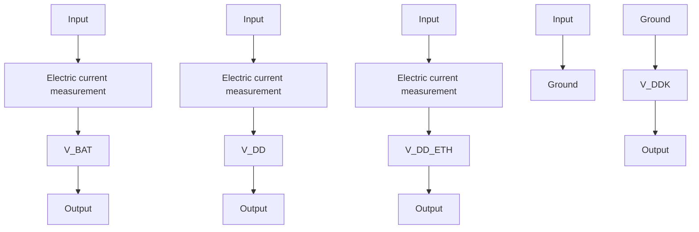
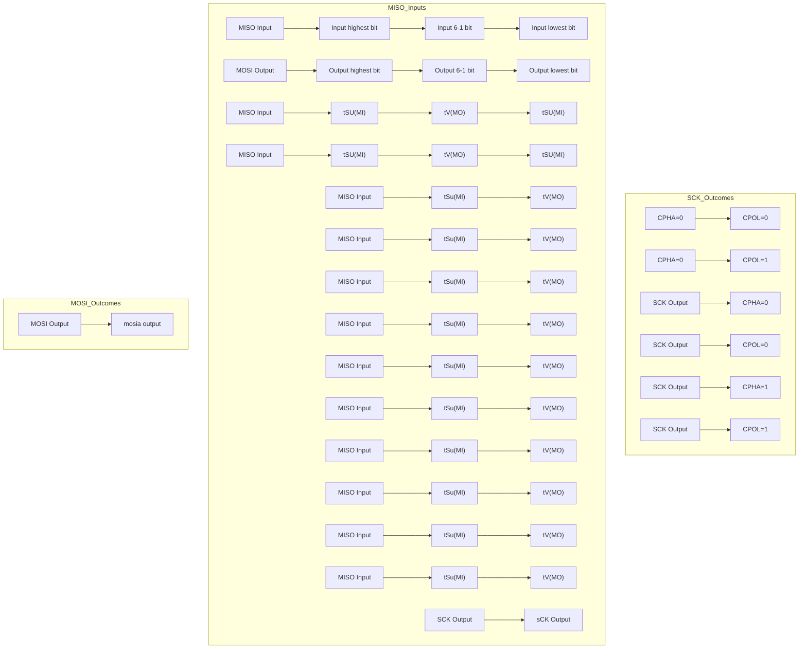
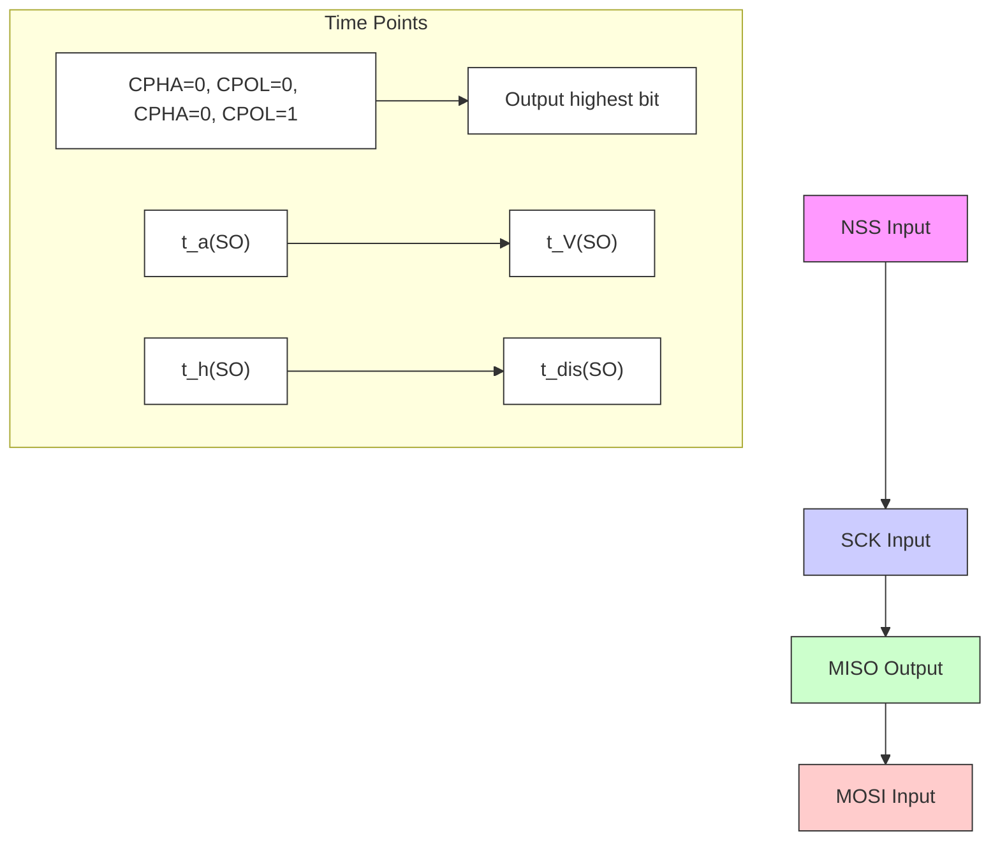
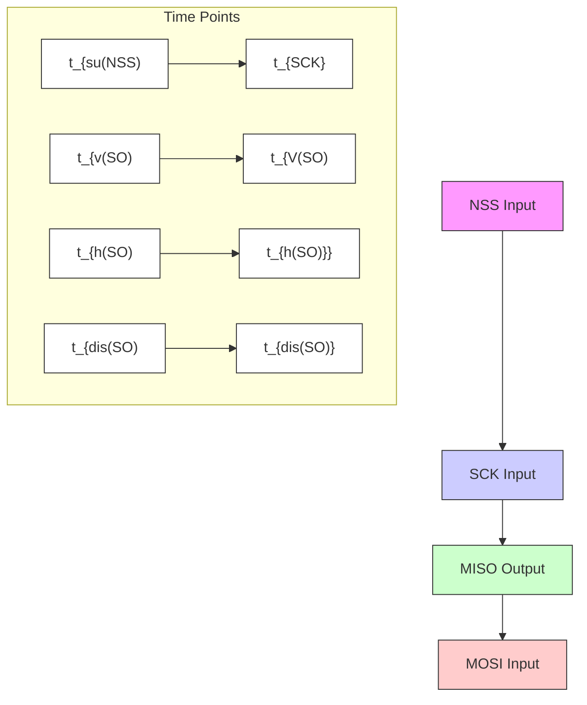

# 概述

CH32V 系列是基于青稞 RISC-V 内核设计的工业级通用微控制器，包括 CH32V305 连接型 MCU、CH32V307/CH32V317 互联型 MCU、CH32V208 无线型 MCU 等。CH32V30x 和 CH32V31x 系列基于青稞 V4F 微处理器设计，支持单精度浮点指令和快速中断响应，支持 144MHz 主频零等待运行，提供 8 组串口、4 组电机 PWM 高级定时器、SDIO、DVP 数字图像接口、4 组模拟运放、双 ADC 单元、双 DAC 单元，内置 USB2.0 高速 PHY 收发器（480Mbps）、千兆以太网 MAC 控制器及 10 兆物理层收发器、10/100 兆物理层收发器（仅适用于 CH32V317）等。

# 产品特性

# - 内核 Core:

- 青稞 32 位 RISC-V4F 内核，多种指令集组合  
- 快速可编程中断控制器+硬件中断堆栈  
- 分支预测、冲突处理机制  
- 单周期乘法、硬件除法、硬件浮点  
- 系统主频 144MHz，零等待

# - 存储器：

- 可配最大 128KB 易失数据存储区 SRAM  
- 可配 480KB 程序存储区 CodeFlash （零等待应用区+非零等待数据区）  
- 28KB 系统引导程序存储区 BootLoader   
- 128B 系统非易失配置信息存储区  
- 128B 用户自定义信息存储区

# - 电源管理和低功耗：

- 系统供电 $V_{DD}$ 额定：3.3V  
- GPIO 单元独立供电 $V_{10}$ 额定：3.3V  
- 低功耗模式：睡眠、停止、待机  
- $V_{BAT}$ 电源独立为RTC和后备寄存器供电

# - 系统时钟、复位：

- 内置出厂调校的 8MHz 的 RC 振荡器  
- 内置约 40kHz 的 RC 振荡器  
- 内置 PLL，可选 CPU 时钟达 144MHz  
- 外部支持 3～25MHz 高速振荡器  
- 外部支持 32.768kHz 低速振荡器  
- 上电和掉电复位、可编程电压监测器

# ● 实时时钟 RTC：32 位独立定时器

# ● 2 组 18 路通用 DMA 控制器：

- 18个通道，支持环形缓冲区管理  
- 支持 TIMx/ADC/DAC/USART/I2C/SPI/I2S/SDIO

# ● 4 组运放、比较器：连接 ADC 和 TIMx

# ● 2 组 12 位数模转换 DAC

# ● 2 组 12 位模数转换 ADC:

- 模拟输入范围： $V_{SSA} \sim V_{DDA}$   
- 16 路外部信号+2 路内部信号通道  
- 片上温度传感器  
- 双 ADC 转换模式

# ● 16 路 TouchKey 通道检测

# - 多组定时器：

- 4 个 16 位高级定时器，支持死区控制和紧急刹车，提供用于电机控制的 PWM 互补输出  
- 4个16位通用定时器，提供输入捕获/输出比较/PWM/脉冲计数及增量编码器输入  
- 2 个基本定时器  
- 2个看门狗定时器（独立和窗口型）  
- 系统时基定时器：64 位计数器

# - 多种通讯接口：

- 8 个 USART 接口（包含 5 个 UART）  
- 2 个 I2C 接口（支持 SMBus/PMBus）  
- 3 个 SPI 接口（SPI2、SPI3 用于 I2S2、I2S3）  
- USB2.0 全速主机/设备接口，内置 PHY  
- USB2.0 全速 OTG 接口  
- USB2.0 高速主机/设备接口，内置 PHY  
- 2 组 CAN 接口（2.0B 主动）  
- SDIO 主机接口（MMC、SD/SDIO 卡及 CE-ATA）  
- FSMC 存储器接口  
- 数字图像接口 DVP  
- 千兆以太网 MAC 控制器，10 兆 PHY 收发器  
- 10/100 兆 PHY 收发器（仅 CH32V317）

# - 快速 GPIO 端口：

- 80 个 I/O 口，映射 16 个外部中断   
● 安全特性：CRC 计算单元，96 位芯片唯一 ID  
● 调试模式：串行 2 线调试接口  
● 封装形式：LQFP、QFN 和 TSSOP

# 第 1 章 系列产品说明

CH32V 系列产品是基于 32 位 RISC-V 指令集架构设计的工业级通用增强型 MCU, 按照功能资源划分为通用、连接、无线等类别。它们之间以封装类别、外设资源及数量、引脚数目、器件特性高低上的差异相互延伸，但在软件和功能、硬件引脚配置上保持相互兼容，为用户在产品开发中进行产品迭代及快速应用提供了自由和方便。

有关此系列产品的器件特性请参考数据手册。

有关产品各外设功能描述、使用方法及寄存器配置等详细信息请参考《CH32FV2x\_V3xRM》。

数据手册和参考手册均可在沁恒官网下载：https://wch.cn

有关 RISC-V 指令集及架构的相关信息，可在 “http://riscv.org” 网站下载。

本手册为 CH32V303、CH32V305、CH32V307、CH32V317 系列产品数据手册。V203 系列请参考《CH32V203DS0》、V208 系列请参考《CH32V208DS0》。

表 1-1-1 CH32V303/305/307/317 系列产品概览

<table><tr><td colspan="2">大容量通用型(V303)</td><td colspan="2">连接型(V305)</td><td>互联型(V307)</td><td>互联型(V317)</td></tr><tr><td colspan="6">青稞 V4F</td></tr><tr><td>128K 闪存</td><td>256K 闪存</td><td>128K 闪存</td><td>256K 闪存</td><td>256K 闪存</td><td>256K 闪存</td></tr><tr><td>32K SRAM</td><td>64K SRAM</td><td>32K SRAM</td><td>64K SRAM</td><td>64K SRAM</td><td>64K SRAM</td></tr><tr><td>2*ADC (TKey)2*DACADTM3*GPTMCRC3*USART2*SPI2*I2CUSBFSCANRTC2*WDG4*OPARNGSDIOFSMC</td><td>2*ADC (TKey)2*DAC4*ADTM4*GPTM2*BCTMCRC8*USART/UART3*SPI (2*I2S)2*I2CUSBFSCANRTC2*WDG4*OPARNGSDIOFSMC</td><td>2*ADC (TKey)2*DAC4*ADTM4*GPTM2*BCTMCRC5*USART/UART3*SPI (2*I2S)2*I2COTG_FSUSBHS (+PHY)2*CANRTC2*WDG4*OPARNGSDIO</td><td>2*ADC (TKey)2*DAC4*ADTM4*GPTM2*BCTMCRC5*USART/UART3*SPI (2*I2S)2*I2COTG_FSUSBHS (+PHY)2*CANRTC2*WDG4*OPARNGSDIOFSMRNG</td><td>2*ADC (TKey)2*DAC4*ADTM4*GPTM2*BCTMCRC8*USART/UART3*SPI (2*I2S)2*I2COTG_FSUSBHS (+PHY)2*CANRTC2*WDG4*OPARNGSDIOFSMRNGETH-1000M MACETH-10M PHY</td><td>2*ADC (TKey)2*DAC4*ADTM4*GPTM2*BCTMCRC8*USART/UART3*SPI (2*I2S)2*I2COTG_FSUSBHS (+PHY)2*CANRTC2*WDG4*OPARNGSDIODSRPETH-10M/100M PHY</td></tr></table>

注：同一类产品的某些外设数量或功能可能受封装限制，选择时请确认产品封装。

表 1-1-2 CH32V203/208 系列产品概览

<table><tr><td colspan="2">中小容量通用型(V203)</td><td>无线型(V208)</td></tr><tr><td colspan="2">青稞 V4B</td><td>青稞 V4C</td></tr><tr><td>32K 闪存</td><td>64K 闪存</td><td>128K 闪存</td></tr><tr><td>10K SRAM</td><td>20K SRAM</td><td>64K SRAM</td></tr><tr><td></td><td></td><td>ADC (TKey)</td></tr><tr><td></td><td></td><td>ADTM</td></tr><tr><td>2*ADC (TKey)</td><td>2*ADC (TKey)</td><td>3*GPTM</td></tr><tr><td>ADTM</td><td>ADTM</td><td>GPTM (32)</td></tr><tr><td>3*GPTM</td><td>3*GPTM</td><td>CRC</td></tr><tr><td>CRC</td><td>CRC</td><td>4*USART/UART</td></tr><tr><td>2*USART</td><td>4*USART</td><td>2*SPI</td></tr><tr><td>SPI</td><td>2*SPI</td><td>2*12C</td></tr><tr><td>12C</td><td>2*12C</td><td>USBD</td></tr><tr><td>USBD</td><td>USBD</td><td>USBFS</td></tr><tr><td>USBFS</td><td>USBFS</td><td>CAN</td></tr><tr><td>CAN</td><td>CAN</td><td>RTC</td></tr><tr><td>RTC</td><td>RTC</td><td>2*WDG</td></tr><tr><td>2*WDG</td><td>2*WDG</td><td>2*OPA</td></tr><tr><td>2*OPA</td><td>2*OPA</td><td>ETH-10M (+PHY)</td></tr><tr><td></td><td></td><td>BLE5.3</td></tr></table>

注：同一类产品的某些外设数量或功能可能受封装限制，选择时请确认产品封装。

缩写

ADTM：高级定时器

BCTM：基本定时器

USBD：全速设备控制器

GPTM：通用定时器

OPA：运放、比较器

USBFS：全速主机/设备控制器

GPTM（32）：32位通用定时器

RNG：随机数发生器

USBHS：高速主机/设备控制器

表 1-2 MCU 内核对比概览

<table><tr><td>内核\特点</td><td>指令集</td><td>硬件堆栈级数</td><td>中断嵌套级数</td><td>快速中断通道数</td><td>整数除法周期</td><td>向量表模式</td><td>扩展指令</td><td>内存保护</td></tr><tr><td>青稞 V4B</td><td>IMAC</td><td>2</td><td>2</td><td>4</td><td>9</td><td>地址或指令</td><td>支持</td><td>无</td></tr><tr><td>青稞 V4C</td><td>IMAC</td><td>2</td><td>2</td><td>4</td><td>5</td><td>地址或指令</td><td>支持</td><td>标准</td></tr><tr><td>青稞 V4F</td><td>IMAFC</td><td>3</td><td>8</td><td>4</td><td>5</td><td>地址或指令</td><td>支持</td><td>标准</td></tr></table>

注：有关内核的相关信息，可参考青稞 QingKeV4 微处理器手册《QingKeV4\_Processor\_Manual》。

# 第 2 章 规格信息

CH32V30x 和 CH32V31x 系列是基于青稞 V4F 微处理器设计的 32 位 RISC-V 内核 MCU, 工作频率 144MHz, 内置高速存储器, 系统结构中多条总线同步工作, 提供了丰富的外设功能和增强型 I/O 端口。本系列产品内置 2 个 12 位 ADC 模块、2 个 12 位 DAC 模块、多组定时器、多通道触摸按键电容检测（TKey）等功能, 还包含了标准和专用通讯接口: I2C、I2S、SPI、USART、SDIO、CAN 控制器、USB2.0 全速主机/设备控制器、USB2.0 高速主机/设备控制器（内置 480Mbps 收发器）、数字图像接口、千兆以太网控制器等。

产品工作额定电压为 3.3V，工作温度范围为 $-40^{\circ}C \sim 85^{\circ}C$ （除 CH32V303RCT7 芯片的工作温度范围为 $-40^{\circ}C \sim 105^{\circ}C$ ）。支持多种省电工作模式来满足产品低功耗应用要求。系列产品中各型号在资源分配、外设数量、外设功能等方面有所差异，按需选择。

# 2.1 型号对比

注：1. 256K FLASH+64K SRAM 的产品支持用户选择字配置为（192K FLASH+128K SRAM）、（224K FLASH+96K SRAM）、（256K FLASH+64K SRAM）、（288K FLASH+32K SRAM）几种组合中的一种。在此基础上，批号倒数第六位不为 0 的 256K FLASH+64K SRAM 产品还增加了一种配置组合：（128K FLASH+192K SRAM）。FLASH 闪存表示的是零等待运行区域 R $_{OWAIT}$ ，256K FLASH+64K SRAM 的产品支持（480K-R $_{OWAIT}$ ）字节的非零等待区域。  
2. 定时器中的 PWM、捕捉等涉及引脚信号的功能需要结合实际芯片封装的引脚，有些封装芯片没有引出则此类功能不能使用。  
3. CH32V303RCT7 芯片支持的工作温度范围为： $-40^{\circ}C \sim 105^{\circ}C$ 。  
表 2-1-1 CH32V303/305/307 产品资源分配  
4. CH32V305 芯片不支持 UART6～8。

<table><tr><td colspan="3" rowspan="2">产品型号资源差异</td><td colspan="4">CH32V303</td><td colspan="4"> $CH32V305^{(4)}$ </td><td colspan="3">CH32V307</td></tr><tr><td>CB</td><td>RB</td><td>RC</td><td>VC</td><td>FB</td><td>GB</td><td>CC</td><td>RB</td><td>RC</td><td>WC</td><td>VC</td></tr><tr><td colspan="3">芯片引脚数</td><td>48</td><td>64</td><td>64</td><td>100</td><td>20</td><td>28</td><td>48</td><td>64</td><td>64</td><td>68</td><td>100</td></tr><tr><td colspan="3">Code FLASH(字节)</td><td>480K</td><td>480K</td><td>480K</td><td>480K</td><td>224K</td><td>224K</td><td>480K</td><td>480K</td><td>480K</td><td>480K</td><td>480K</td></tr><tr><td colspan="3">闪存(字节)</td><td>128K</td><td>128K</td><td> $256K^{(1)}$ </td><td> $256K^{(1)}$ </td><td>128K</td><td>128K</td><td> $256K^{(1)}$ </td><td>128K</td><td> $256K^{(1)}$ </td><td> $256K^{(1)}$ </td><td> $256K^{(1)}$ </td></tr><tr><td colspan="3">SRAM(字节)</td><td>32K</td><td>32K</td><td> $64K^{(1)}$ </td><td> $64K^{(1)}$ </td><td>32K</td><td>32K</td><td> $64K^{(1)}$ </td><td>32K</td><td> $64K^{(1)}$ </td><td> $64K^{(1)}$ </td><td> $64K^{(1)}$ </td></tr><tr><td colspan="3">GPIO端口数</td><td>37</td><td>51</td><td>51</td><td>80</td><td>17</td><td>24</td><td>41</td><td>51</td><td>51</td><td>54</td><td>80</td></tr><tr><td colspan="3">GPIO供电</td><td>共用</td><td colspan="3">独立供电 $V_{10}$ </td><td>共用</td><td>独立供电 $V_{10}$ </td><td>共用</td><td colspan="4">独立供电 $V_{10}$ </td></tr><tr><td rowspan="5">定时器</td><td colspan="2">高级( $16位$ ) $^{(2)}$ </td><td>1</td><td>1</td><td>4</td><td>4</td><td>4</td><td>4</td><td>4</td><td>4</td><td>4</td><td>4</td><td>4</td></tr><tr><td colspan="2">通用( $16位$ ) $^{(2)}$ </td><td>3</td><td>3</td><td>4</td><td>4</td><td>4</td><td>4</td><td>4</td><td>4</td><td>4</td><td>4</td><td>4</td></tr><tr><td colspan="2">基本(16位)</td><td colspan="2">-</td><td>2</td><td>2</td><td>2</td><td>2</td><td>2</td><td>2</td><td>2</td><td>2</td><td>2</td></tr><tr><td colspan="2">看门狗</td><td colspan="11">2(WWDG+IWDG)</td></tr><tr><td colspan="2">系统时基64位</td><td colspan="11">支持</td></tr><tr><td colspan="3">RTC</td><td colspan="11">支持</td></tr><tr><td colspan="2" rowspan="2">ADC/TKey</td><td>单元数</td><td>2</td><td>2</td><td>2</td><td>2</td><td>2</td><td>2</td><td>2</td><td>2</td><td>2</td><td>2</td><td>2</td></tr><tr><td>通道数</td><td>10</td><td>16</td><td>16</td><td>16</td><td>1</td><td>6</td><td>16</td><td>16</td><td>16</td><td>16</td><td>16</td></tr><tr><td colspan="3">DAC(单元)</td><td>2</td><td>2</td><td>2</td><td>2</td><td>DAC2</td><td>2</td><td>2</td><td>2</td><td>2</td><td>2</td><td>2</td></tr><tr><td colspan="3">运放、比较器</td><td>4</td><td>4</td><td>4</td><td>4</td><td>-</td><td>OPA3</td><td>4</td><td>4</td><td>4</td><td>4</td><td>4</td></tr><tr><td colspan="3">随机数发生器</td><td>-</td><td>-</td><td>1</td><td>1</td><td>1</td><td>1</td><td>1</td><td>1</td><td>1</td><td>1</td><td>1</td></tr><tr><td rowspan="9">通信接口</td><td colspan="2">USART/UART</td><td>3</td><td>3</td><td>8</td><td>8</td><td>USART1USART3</td><td>5</td><td>5</td><td>5</td><td>8</td><td>8</td><td>8</td></tr><tr><td colspan="2">SPI</td><td>2</td><td>2</td><td>3</td><td>3</td><td>SPI2</td><td>3</td><td>3</td><td>3</td><td>3</td><td>3</td><td>3</td></tr><tr><td colspan="2">I2S</td><td>-</td><td>-</td><td>2</td><td>2</td><td>I2S2</td><td>2</td><td>2</td><td>2</td><td>2</td><td>2</td><td>2</td></tr><tr><td colspan="2">I2C</td><td>2</td><td>2</td><td>2</td><td>2</td><td>2</td><td>2</td><td>2</td><td>2</td><td>2</td><td>2</td><td>2</td></tr><tr><td colspan="2">CAN</td><td>1</td><td>1</td><td>1</td><td>1</td><td>CAN2</td><td>CAN2</td><td>2</td><td>2</td><td>2</td><td>2</td><td>2</td></tr><tr><td colspan="2">SDIO</td><td>-</td><td>-</td><td>1</td><td>1</td><td>-</td><td>1</td><td>-</td><td>1</td><td>1</td><td>1</td><td>1</td></tr><tr><td>USB(FS)</td><td>USBHD</td><td>1</td><td>1</td><td>1</td><td>1</td><td>-</td><td>-</td><td>1</td><td>1</td><td>1</td><td>1</td><td>1</td></tr><tr><td colspan="2">USBHS(含PHY)</td><td colspan="4">-</td><td>1</td><td>1</td><td>1</td><td>1</td><td>1</td><td>1</td><td>1</td></tr><tr><td colspan="2">Ethernet</td><td colspan="8">-</td><td colspan="3">1G MAC+10M PHY</td></tr><tr><td colspan="2" rowspan="2">资源差异\产品型号</td><td colspan="4">CH32V303</td><td colspan="4"> $CH32V305^{(4)}$ </td><td colspan="4">CH32V307</td></tr><tr><td>CB</td><td>RB</td><td>RC</td><td>VC</td><td>FB</td><td>GB</td><td>CC</td><td>RB</td><td>RC</td><td>WC</td><td colspan="2">VC</td></tr><tr><td rowspan="2"></td><td>DVP</td><td colspan="10">-</td><td colspan="2">1</td></tr><tr><td>FSMC</td><td colspan="3">-</td><td>1</td><td colspan="6">-</td><td colspan="2">1</td></tr><tr><td colspan="2">CPU主频</td><td colspan="12">Max: 144MHz</td></tr><tr><td colspan="2">工作温度</td><td colspan="12">-40°C~85°C(3)</td></tr><tr><td colspan="2">封装形式</td><td>LQFP48</td><td colspan="2">LQFP64M</td><td>LQFP100</td><td>TSSOP20</td><td>QFN28</td><td>LQFP48</td><td>LQFP64M</td><td>LQFP64M</td><td>QFN68</td><td colspan="2">LQFP100</td></tr></table>

注：1. CH32V317 支持用户选择字配置为（192K FLASH+128K SRAM）、（224K FLASH+96K SRAM）、（256K FLASH+64K SRAM）、（288K FLASH+32K SRAM）、（128K FLASH+192K SRAM）几种组合中的一种。FLASH 闪存表示的是零等待运行区域 $R_{OWAIT}$ ，CH32V317 支持（480K- $R_{OWAIT}$ ）字节的非零等待区域。  
2. 定时器中的 PWM、捕捉等涉及引脚信号的功能需要结合实际芯片封装的引脚，有些封装芯片没有引出则此类功能不能使用。  
表 2-1-2 CH32V317 产品资源分配

<table><tr><td colspan="3">产品型号</td><td colspan="2">CH32V317</td></tr><tr><td colspan="3">资源差异</td><td>WC</td><td>VC</td></tr><tr><td colspan="3">芯片引脚数</td><td>68</td><td>100</td></tr><tr><td colspan="3">Code FLASH(字节)</td><td>480K</td><td>480K</td></tr><tr><td colspan="3">闪存(字节)</td><td> $256K^{(1)}$ </td><td> $256K^{(1)}$ </td></tr><tr><td colspan="3">SRAM(字节)</td><td> $64K^{(1)}$ </td><td> $64K^{(1)}$ </td></tr><tr><td colspan="3">GPIO端口数</td><td>48</td><td>70</td></tr><tr><td colspan="3">GPIO供电</td><td colspan="2">独立供电 $V_{10}$ </td></tr><tr><td rowspan="5">定时器</td><td colspan="2">高级(16位) $^{(2)}$ </td><td>4</td><td>4</td></tr><tr><td colspan="2">通用(16位) $^{(2)}$ </td><td>4</td><td>4</td></tr><tr><td colspan="2">基本(16位)</td><td>2</td><td>2</td></tr><tr><td colspan="2">看门狗</td><td colspan="2">2(WWDG+IWDG)</td></tr><tr><td colspan="2">系统时基64位</td><td colspan="2">支持</td></tr><tr><td colspan="3">RTC</td><td colspan="2">支持</td></tr><tr><td colspan="2" rowspan="2">ADC/TKey</td><td>单元数</td><td>2</td><td>2</td></tr><tr><td>通道数</td><td>16</td><td>16</td></tr><tr><td colspan="3">DAC(单元)</td><td>2</td><td>2</td></tr><tr><td colspan="3">运放</td><td>4</td><td>4</td></tr><tr><td colspan="3">随机数发生器</td><td>1</td><td>1</td></tr><tr><td rowspan="7">通信接口</td><td colspan="2">USART/UART</td><td>8</td><td>8</td></tr><tr><td colspan="2">SPI</td><td>3</td><td>3</td></tr><tr><td colspan="2">I2S</td><td>2</td><td>2</td></tr><tr><td colspan="2">I2C</td><td>2</td><td>2</td></tr><tr><td colspan="2">CAN</td><td>2</td><td>2</td></tr><tr><td colspan="2">SDIO</td><td>1</td><td>1</td></tr><tr><td>USB(FS)</td><td>USBHD</td><td>1</td><td>1</td></tr><tr><td colspan="2" rowspan="2">资源差异\产品型号</td><td colspan="3">CH32V317</td></tr><tr><td>WC</td><td colspan="2">VC</td></tr><tr><td rowspan="4"></td><td>USBHS(含 PHY)</td><td>1</td><td colspan="2">1</td></tr><tr><td>Ethernet</td><td colspan="3">MAC+10M/100M PHY</td></tr><tr><td>DVP</td><td>-</td><td colspan="2">1</td></tr><tr><td>FSMC</td><td colspan="3">-</td></tr><tr><td colspan="2">CPU 主频</td><td colspan="3">Max: 144MHz</td></tr><tr><td colspan="2">工作温度</td><td colspan="3">工业级:-40°C~85°C</td></tr><tr><td colspan="2">封装形式</td><td>QFN68</td><td colspan="2">LQFP100</td></tr></table>

# 2.2 系统架构

微控制器基于 RISC-V 指令集设计，其架构中将内核、仲裁单元、DMA 模块、SRAM 存储等部分通过多组总线实现交互。设计中集成通用 DMA 控制器以减轻 CPU 负担、提高访问效率，应用多级时钟管理机制降低了外设的运行功耗，同时兼有数据保护机制，时钟自动切换保护等措施增加了系统稳定性。下图是系列产品内部总体架构框图。

图 2-1-1 CH32V303/305/307 系统框图  
```mermaid
graph TD
    A["RISC-V (V4F)"] --> B["PFIC"]
    A --> C["SDI"]
    A --> D["RV32 IMAFC"]
    B --> E["MUX"]
    C --> E
    D --> E
    E --> F["FLASH CTRL"]
    F --> G["Flash Memory"]
    H["DMAX 7 Channels"] --> I["XIN"]
    J["ETH MAC 10/100/1000"] --> K["SRAM"]
    L["USBHS +PHY"] --> M["HB F_max = 144MHz"]
    N["USBFS/OTG_FS"] --> O["TRNG"]
    P["SDIO"] --> Q["HB to PB2 Bridge"]
    R["OPA1-4"] --> Q
    S["DAT[11:0"] PCLK VSYNC,HSYNC] --> T["DVP"]
    U["HS_DP H5_DM"] --> T
    V["FS_DP,FS_DM VBUS,ID DP,DM"] --> W["USBFS/OTG_FS"]
    X["OPAx_CHP OPaX_CHN OPaX_OUT (x=1,2,3,4)"] --> Y["OPA1-4"]
    Z["PAO ~ PA15"] --> AA["EXIT/WKUP"]
    AB["PBO ~ PB15"] --> AC["GPIOA"]
    AD["PCO ~ PC15"] --> AE["GPIOB"]
    AF["PDO ~ PD15"] --> AG["GPIOC"]
    AH["PEO ~ PE15"] --> AI["GPIOD"]
    AJ["MOSI,MISO,SCK, NSS"] --> AK["SPI1"]
    AL["RX, TX, CTS, RTS, CK"] --> AM["USART1"]
    AN["3 Complementary Channels ETR, BIKN"] --> AO["TIM1"]
    AP["3 Complementary Channels ETR, BIKN"] --> AQ["TIM8"]
    AR["3 Complementary Channels ETR, BIKN"] --> AS["TIM9"]
    AT["AINO ~ AIN15"] --> AU["Tkey ADC1"]
    AV["(VSSA)V_REF - (2.4V~VDDA)V_REF+"] --> AW["ADC2"]
    AX["SWCLK SWDIO"] --> AY["SYN"]
    AZ["MII"] --> BA["TXD[3:0"],TXCLK,TXEN_RXD["3:0"],RXER,RXCLK,RXDV COL,MDC,MDIO,CRS PPS_OUT]
    BB["RMI"] --> BC["TXD[1:0"],TXEN_RXD["1:0"],REFCLK,CRSDV MDC,MDIO PPS_OUT]
    BD["RMII"] --> BE["TXD[3:0"],GTXC,TXEN_RXD["3:0"],RXC,RXCTL 12SIN]
    BF["RXP, RXN TXP, TXN"] --> BG["TOM PHY"]
    BH["RSP, RXN TXP"] --> BI["TOM PHY"]
    BJ["RDP, RXN TXP"] --> BK["TOM PHY"]
    BL["RDP, RXN TXP"] --> BM["TOM PHY"]
    BN["RDP, RXN TXP"] --> BO["TOM PHY"]
    BP["RDP, RXN TXP"] --> BP["TOM PHY"]
    BQ["RDP, RXN TXP"] --> BR["TOM PHY"]
    BS["RDP, RXN TXP"] --> BT["TOM PHY"]
    BU["RDP, RXN TXP"] --> BV["TOM PHY"]
    BW["RDP, RXN TXP"] --> BX["TOM PHY"]
    BY["RDP, RXN TXP"] --> BZ["TOM PHY"]
    CA["RDP, RXN TXP"] --> CB["TOM PHY"]
    CC["RDP, RXN TXP"] --> CD["TOM PHY"]
    CE["RDP, RXN TXP"] --> CF["TOM PHY"]
    DG["RDP, RXN TXP"] --> DH["TOM PHY"]
    DI["RDP, RXN TXP"] --> DJ["TOM PHY"]
    DK["RDP, RXN TXP"] --> DL["TOM PHY"]
    DM["RDP, RXN TXP"] --> DE["TOM PHY"]
    DF["RDP, RXN TXP"] --> DF["TOM PHY"]
    DG["RDP, RXN TXP"] --> DG["TOM PHY"]
    DH["RDP, RXN TXP"] --> DH["TOM PHY"]
    BI["RDP, RXN TXP"] --> BI["TOM PHY"]
    BJ["RDP, RXN TXP"] --> BJ["TOM PHY"]
    BK["RDP, RXN TXP"] --> BK["TOM PHY"]
    BL["RDP, RXN TXP"] --> BL["TOM PHY"]
    BM["RDP, RXN TXP"] --> BM["TOM PHY"]
    BN["RDP, RXN TXP"] --> BN["TOM PHY"]
    BO["RDP, RXN TXP"] --> BO["TOM PHY"]
    BP["RDP, RXN TXP"] --> BP["TOM PHY"]
    BH["RDP, RXN TXP"] --> BH["TOM PHY"]
    BI["RDP, RXN TXP"] --> BI["TOM PHY"]
    BJ["RDP, RXN TXP"] --> BJ["TOM PHY"]
    BK["RDP, RXN TXP"] --> BK["TOM PHY"]
    BL["RDP, RXN TXP"] --> BL["TOM PHY"]
    BN["RDP, RXN TXP"] --> BN["TOM PHY"]
    BO["RDP, RXN TXP"] --> BO["TOM PHY"]
    BP["RDP, RXN TXP"] --> BP["TOM PHY"]
    BH["RDP, RXN TXP"] --> BH["TOM PHY"]
    BI["RDP, RXN TXP"] --> BI["TOM PHY"]
    BJ["RDP, RXN TXP"] --> BJ["TOM PHY"]

    subgraph Power Components
        BB["Reset & MUX & DIV"] --> BC["PLL & PLL2 & PLL3 & RTC_CLK & LSE & @VBAT"]
        BC --> BD["HSI-RC & HSE & LSI-RC & @VBAT"]

        BB --> BB1["RTC/BKP & TIM2 & TIM3 & TIM4 & TIM5 & USART2 & USART3 & SPI2/I2S2 & IWDG & WWDG & TIM6 & TIM7"]

        BB1 --> BB2["TAMPER-RTC & TIM2 & TIM3 & TIM4 & TIM5 & USART2 & USART3 & SPI2/I2S2 & IWDG & WWDG & TIM6 & TIM7"]

        BB2 --> BB3["4 channels, ETR & 4 channels, ETR & 4 channels, ETR & 4 channels"]
        BB3 --> BB4["4 channels, ETR & 4 channels, ETR & 4 channels"]
        BB4 --> BB5["4 channels, ETR & 4 channels, ETR & 4 channels"]
        BB5 --> BB6["4 channels, ETR & 4 channels, ETR & 4 channels"]
        BB6 --> BB7["4 channels, ETR & 4 channels, ETR & 4 channels"]
        BB7 --> BB8["4 channels, ETR & 4 channels, ETR & 4 channels"]
        BB8 --> BB9["4 channels, ETR & 4 channels, ETR & 4 channels"]
        BB9 --> BB10["4 channels, ETR & 4 channels, ETR & 4 channels"]
        BB10 --> BB11["4 channels, ETR & 4 channels, ETR & 4 channels"]
        BB11 --> BB12["4 channels, ETR & 4 channels, ETR & 4 channels"]
        BB12 --> BB13["4 channels, ETR & 4 channels, ETR & 4 channels"]
        BB13 --> BB14["4 channels, ETR & 4 channels, ETR & 4 channels"]
        BB14 --> BB15["4 channels, ETR & 4 channels, ETR & 4 channels"]
        BB15 --> BB16["4 channels, ETR & 4 channels, ETR & 4 channels"]
        BB16 --> BB17["4 channels, ETR & 4 channels, ETR & 4 channels"]
        BB17 --> BB18["4 channels, ETR & 4 channels, ETR & 4 channels"]
        BB18 --> BB19["4 channels, ETR & 4 channels, ETR & 4 channels"]
        BB19 --> BB20["4 channels, ETR & 4 channels, ETR & 4 channels"]
        BB20 --> BB21["4 channels, ETR & 4 channels, ETR & 4 channels"]
        BB21 --> BB22["4 channels, ETR & 4 channels, ETR & 4 channels"]
        BB22 --> BB23["4 channels, ETR & 4 channels, ETR & 4 channels"]
        BB23 --> BB24["4 channels, ETR & 4 channels, ETR & 4 channels"]
        BB24 --> BB25["4 channels, ETR & 4 channels, ETR & 4 channels"]
        BB25 --> BB26["4 channels, ETR & 4 channels, ETR & 4 channels"]
        BB26 --> BB27["4 channels, ETR & 4 channels, ETR & 4 channels"]
        BB27 --> BB28["4 channels, ETR & 4 channels, ETR & 4 channels"]
        BB28 --> BB29["4 channels, ETR & 4 channels, ETR & 4 channels"]
        BB29 --> BB30["4 channels, ETR & 4 channels, ETR & 4 channels"]
        BB30 --> BB31["4 channels, ETR & 4 channels, ETR & 4 channels"]
        BB31 --> BB32["4 channels, ETR & 4 channels, ETR & 4 channels"]
        BB32 --> BB33["4 channels, ETR & 4 channels, ETR & 4 channels"]
        BB33 --> BB34["4 channels, ETR & 4 channels, ETR & 4 channels"]
        BB34 --> BB35["4 channels, ETR & 4 channels, ETR & 4 channels"]
        BB35 --> BB36["4 channels, ETR & 4 channels, ETR & 4 channels"]
        BB36 --> BB37["4 channels, ETR & 4 channels, ETR & 4 channels"]
        BB37 --> BB38["4 channels, ETR & 4 channels, ETR & 4 channels"]
        BB38 --> BB39["4 channels, ETR & 4 channels, ETR & 4 channels"]
        BB39 --> BB40["4 channels, ETR & 4 channels, ETR & 4 channels"]
        BB40 --> BB41["4 channels, ETR & 4 channels, ETR & 4 channels"]
        BB41 --> BB42["4 channels, ETR & 4 channels, ETR & 4 channels"]
        BB42 --> BB43["4 channels, ETR & 4 channels, ETR & 4 channels"]
        BB43 --> BB44["4 channels, ETR & 4 channels, ETR & 4 channels"]
        BB44 --> BB45["4 channels, ETR & 4 channels, ETR & 4 channels"]
        BB45 --> BB46["4 channels, ETR & 4 channels, ETR & 4 channels"]
        BB46 --> BB47["4 channels, ETR & 4 channels, ETR & 4 channels"]
        BB47 --> BB48["4 channels, ETR & 4 channels, ETR & 4 channels"]
        BB48 --> BB49["4 channels, ETR & 4 channels, ETR & 4 channels"]
        BB49 --> BB50["4 channels, ETR & 4 channels, ETR & 4 channels"]
        BB50 --> BB51["4 channels, ETR & 4 channels, ETR & 4 channels"]
        BB51 --> BB52["4 channels, ETR & 4 channels, ETR & 4 channels"]
        BB52 --> BB53["4 channels, ETR & 4 channels, ETR & 4 channels"]
        BB53 --> BB54["4 channels, ETR & 4 channels, ETR & 4 channels"]
        BB54 --> BB55["4 channels, ETR & 4 channels, ETR & 4 channels"]
        BB55 --> BB56["4 channels, ETR & 4 channels, ETR & 4 channels"]
        BB56 --> BB57["4 channels, ETR & 4 channels, ETR & 4 channels"]
        BB57 --> BB58["4 channels, ETR & 4 channels, ETR & 4 channels"]
        BB58 --> BB59["4 channels, ETR & 4 channels, ETR & 4 channels"]
        BB59 --> BB60["4 Channels - ADC1 - ADC2 - Temp Sensor"]

    subgraph Power Components
        BN["PB1: F_max = 1.6 MHz"]:::note
        BP["IWDG"]:::note
        BPW["WWDG"]:::note
        BPVI["I2C1"]:::note
        BPV["I2C2"]:::note
        BPVC["bxCAN1"]:::note
        BPVCb["SRAM S12B"]:::note
        BPVCc["bxCAN2"]:::note
        BPVCd["DAC1"]:::note
        BPVCe["DAC2"]:::note
        BPVCf["DACOUT1"]:::note
        BPVCg["DACOUT2"]:::note
    end

    style Components fill:#f9f9f9
```

图 2-1-2 CH32V317 系统框图  
Electronic circuit block diagram showing signal flow from RISC-V, DMA channels, and flash memory to PB1, with labeled components and frequency limits.

# 2.3 存储器映射表

图 2-2 存储器地址映射  

*[figure omitted]*

# 2.4 时钟树

系统中引入4组时钟源：内部高频RC振荡器（HSI）、内部低频RC振荡器（LSI）、外接高频振荡器（HSE）、外接低频振荡器（LSE）。其中，低频时钟源为RTC和独立看门狗提供了时钟基准。高频时钟源直接或者间接通过PLL倍频后输出为系统总线时钟（SYSCLK)，系统时钟再由各预分频器提供了HB域、PB1域、PB2域外设控制时钟及采样或接口输出时钟，部分模块工作需要由PLL时钟直接提供。

图2-3 CH32V305/307/317时钟树框图  
Microcontroller architecture diagram showing I2S2/ISU interface, USB prescaler, and peripheral clock enable logic for memory management

图 2-4 CH32V303 时钟树框图  

```mermaid
graph TD
    subgraph OSC32_IN
        A["40kHz LSI RC"] --> B["IWDGCLK"] --> C["to independent watchdog"]
        D["32.768kHz LSE OSC"] --> E["RTCCLK"] --> F["to RTC"]
        G["OSC32_OUT"] --> H["/128"] --> I["8MHz HSI RC"]
        J["OSC_IN"] --> K["PLLXTPRE"] --> L["PLL SRC"] --> M["PLL MUL"] --> N["USB prescaler /1,2,3"] --> O["48MHz"] --> P["USBCLK"]
        Q["OSC_OUT"] --> R["/2"] --> S["PLLCLK"]
        T["USB prescaler"] --> U["SW"] --> V["SYSCLK"] --> W["to I2S2 interface"]
        X["USB prescaler"] --> Y["PSLCLK"] --> Z["HSI"] --> AA["HSI"]
        AB["USB prescaler"] --> AC["CSS"] --> AD["HSE"]
        AE["USB prescaler"] --> AF["CPU"] --> AG["CPU"]
        AH["USB prescaler"] --> AI["CPU"] --> AJ["CPU"]
        AK["USB prescaler"] --> AL["CPU"] --> AM["CPU"]
        AN["USB prescaler"] --> AO["CPU"] --> AP["CPU"]
        AQ["USB prescaler"] --> AR["CPU"] --> AS["CPU"]
        AT["USB prescaler"] --> AU["CPU"] --> AV["CPU"]
        AW["USB prescaler"] --> AX["CPU"] --> AY["CPU"]
        AZ["USB prescaler"] --> BA["CPU"] --> BB["CPU"]
        BC["USB prescaler"] --> BD["CPU"] --> BE["CPU"]
        BF["USB prescaler"] --> BG["CPU"] --> BH["CPU"]
        BI["USB prescaler"] --> BJ["CPU"] --> BK["CPU"]
        BL["USB prescaler"] --> BM["CPU"] --> BN["CPU"]
        BO["USB prescaler"] --> BP["CPU"] --> BQ["CPU"]
        BR["USB prescaler"] --> BS["CPU"] --> BT["CPU"]
        BU["USB prescaler"] --> BV["CPU"] --> BW["CPU"]
        BX["USB prescaler"] --> BY["CPU"] --> BZ["CPU"]
        CA["USB prescaler"] --> CB["CPU"] --> CC["CPU"]
        CY["USB prescaler"] --> CZ["CPU"] --> DA["CPU"]
        DB["USB prescaler"] --> DB["CPU"] --> DB2["CPU"]
        DB2 --> DC["CPU"]
        DB2 --> DB3["CPU"]
        DB2 --> DB4["CPU"]
        DB2 --> DB5["CPU"]
        DB2 --> DB6["CPU"]
        DB2 --> DB7["CPU"]
        DB2 --> DB8["CPU"]
        DB2 --> DB9["CPU"]
        DB2 --> DB10["CPU"]
        DB2 --> DB11["CPU"]
        DB2 --> DB12["CPU"]
        DB2 --> DB13["CPU"]
        DB2 --> DB14["CPU"]
        DB2 --> DB15["CPU"]
        DB2 --> DB16["CPU"]
        DB2 --> DB17["CPU"]
        DB2 --> DB18["CPU"]
        DB2 --> DB19["CPU"]
        DB2 --> DB20["CPU"]
    end

    subgraph OSC32_OUT
        B
        E
        H
        I
        K
        M
    end

    subgraph OSC_IN
        K
        M
        N
    end

    subgraph OSC_OUT
        K
        M
    end

    subgraph MCO
        O
        P
    end

    subgraph HB Prescaler
        Q
    end

    subgraph PB1 Prescaler
        R
    end

    subgraph PB2 Prescaler
        S
    end

    subgraph HB Prescaler
        T
    end

    subgraph PB1 Prescaler
        U
    end

    subgraph PB2 Prescaler
        V
    end

    subgraph PB1 Prescaler
        W
    end

    subgraph PB2 Prescaler
        X
    end

    subgraph PB1 Prescaler
        Y
    end

    subgraph PB2 Prescaler
        Z
    end

    subgraph PB1 Prescaler
        AA
    end

    subgraph PB2 Prescaler
        AB
    end

    subgraph PB1 Prescaler
        AC
    end

    subgraph PB2 Prescaler
        AD
    end

    subgraph PB1 Prescaler
        AE
    end

    subgraph PB2 Prescaler
        AF
    end

    subgraph PB1 Prescaler
        AG
    end

    subgraph PB2 Prescaler
        AH
    end

    subgraph PB1 Prescaler
        AI
    end

    subgraph PB2 Prescaler
        AJ
    end

    subgraph PB1 Prescaler
        AK
    end

    subgraph PB2 Prescaler
        AL
    end

    subgraph PB1 Prescaler
        AM
    end

    subgraph PB2 Prescaler
        AN
    end

    subgraph PB1 Prescaler
        AO
    end

    subgraph PB2 Prescaler
        AP
    end

    subgraph PB1 Prescaler
        AQ
    end

    subgraph PB2 Prescaler
        AR
    end

    subgraph PB1 Prescaler
        AS
    end

    subgraph PB2 Prescaler
        AT
    end

    subgraph PB1 Prescaler
        AU
    end

    subgraph PB2 Prescaler
        AV
    end

    subgraph PB1 Prescaler
        AW
    end

    subgraph PB2 Prescaler
        AX
    end

    subgraph PB1 Prescaler
        AY
    end

    subgraph PB2 Prescaler
        AZ
    end

    subgraph PB1 Prescaler
        BA
    end

    subgraph PB2 Prescaler
        BB
    end

    subgraph PB1 Prescaler
        BC
    end

    subgraph PB2 Prescaler
        DA
    end

    subgraph PB1 Prescaler
        EQ
    end

    subgraph PB2 Prescaler
        ARX
    end

    subgraph PB1 Prescaler
        ASX
    end

    subgraph PB2 Prescaler
        AZX
    end

    subgraph PB1 Prescaler
        AYX
    end

    subgraph PB2 Prescaler
        AZYX
    end

    subgraph PB1 Prescaler
        AYXYXN1*1*1*1*1*1*1*1*1*1*1*1*1*1*1*1*1*1*1*1*1*1*1*1*1*1*1*1*1*1*1*1*1*1*1*1*1*1*1*1*1*1*1*1*1*1*1*1*1*1*1*
    end
```


注：当使用 USB 功能时，CPU 的频率必须是 48MHz 或 96MHz 或 144MHz。当系统从停机或待机状态唤醒时，系统会自动切换为 HSI 做主频。

# 2.5 功能概述

# 2.5.1 RISC-V4F 处理器

RISC-V4F 支持 RISC-V 指令集 IMAFC 子集，增加了单精度浮点运算。处理器内部以模块化管理，包含快速可编程中断控制器（PFIC）、内存保护、分支预测模式、扩展指令支持等单元。对外多组总线与外部单元模块相连，实现外部功能模块和内核的交互。

青稞微处理器以其极简指令集、多种工作模式、模块化定制扩展等特点可以灵活应用不同场景微控制器设计，例如小面积低功耗嵌入式场景、高性能应用操作系统场景等。

● 支持机器和用户特权模式  
- 快速可编程中断控制器（PFIC）  
- 多级硬件中断堆栈  
- 串行2线调试接口  
● 标准内存保护设计  
● 静态或动态分支预测、高效跳转、冲突检测机制  
- 自定义扩展指令

# 2.5.2 片上存储器及自举模式

内置最大 128K 字节 SRAM 区，用于存放数据，掉电后数据丢失。具体容量要对应芯片型号。

内置最大 480K 字节程序闪存存储区（Code FLASH），即用户区，用于用户的应用程序和常量数据存储。其中包括零等待程序运行区域和非零等待区域。区域具体大小对应芯片型号。

内置 28K 字节系统存储区（System FLASH），即 BOOT 区，用于系统引导程序存储（厂家固化自举加载程序）。

128 字节用于系统非易失配置信息存储区，用于厂商配置字存储，出厂前固化，用户不可修改。

128 字节用于用户自定义信息存储区，用于用户选择字存储。

在启动时，通过自举引脚（BOOT0 和 BOOT1）可以选择三种自举模式中的一种：

- 从程序闪存存储器自举  
- 从系统存储器自举  
● 从内部 SRAM 自举

自举加载程序存放于系统存储区, 可以通过USART1和USB接口对程序闪存存储区的内容重新编程。

# 2.5.3 供电方案

(1) CH32V303/305/307

- $V_{DD} = 2.4^{(1)} \sim 3.6V$ ：为部分 I/O 引脚和内部调压器供电，包括内置的 USB PHY 和以太网 PHY。  
- $V_{10} = 2.4^{(1)} \sim 3.6V$ ：为大部分 I/O 引脚供电，决定了引脚输出高压幅值。正常工作时， $V_{10}$ 电压不能高于 $V_{DD}$ 电压。  
- $V_{\text{DDA}} = 2.4^{(1)} \sim 3.6\text{V}$ : 为高频 RC 振荡器、ADC、温度传感器、OPA、DAC 及 PLL 的模拟部分供电。 $V_{\text{DDA}}$ 电压必须和 $V_{\text{IO}}$ 电压相同（如果 $V_{\text{DD}}$ 掉电， $V_{\text{IO}}$ 带电，则 $V_{\text{DDA}}$ 必须带电并且和 $V_{\text{IO}}$ 一致）。使用 ADC 时， $V_{\text{DDA}}$ 不得小于 2.4V。  
- $V_{BAT} = 1.8 \sim 3.6V$ ：可选的备用电源，当关闭 $V_{DD}$ 时，（通过内部电源切换器）单独为 RTC、外部低频振荡器和后备寄存器供电。

(2) CH32V317

- $V_{DD} = 2.4^{(1)} \sim 3.6V$ ：为部分 I/O 引脚和内部调压器供电，包括内置的 USB PHY 和以太网 10M PHY。  
- $V_{10} = 2.4^{(1)} \sim 3.6V$ ：为大部分 $I / 0$ 引脚供电，决定了引脚输出高压幅值。正常工作时， $V_{10}$ 电压不能高于 $V_{DD}$ 电压。

- $V_{\text{DDA}} = 2.4^{(1)} \sim 3.6\text{V}$ ：为高频 RC 振荡器、ADC、温度传感器、OPA、DAC 及 PLL 的模拟部分供电。 $V_{\text{DDA}}$ 电压必须和 $V_{\text{IO}}$ 电压相同（如果 $V_{\text{DD}}$ 掉电， $V_{\text{IO}}$ 带电，则 $V_{\text{DDA}}$ 必须带电并且和 $V_{\text{IO}}$ 一致）。使用 ADC 时， $V_{\text{DDA}}$ 不得小于 2.4V。  
- $V_{DD\_ETH} = 3.15 \sim 3.45V$ : 为内置的 10/100M 以太网 PHY 供电。建议外接 1uF～4.7uF 容量的对地电容，支持 10uF 但需并联 0.1uF。  
- $V_{DDK}$ ：内部电源 LDO 退耦端，需外接 1uF 容量的退耦电容。  
- $V_{BAT} = 1.8 \sim 3.6V$ ：可选的备用电源，当关闭 $V_{DD}$ 时，（通过内部电源切换器）单独为 RTC、外部低频振荡器和后备寄存器供电。

注：1. 对于寄存器 FEATURE\_SIGN 的位 VLEVEL = 1 的芯片， $V_{DD}$ 、 $V_{IO}$ 、 $V_{DDA}$ 支持最低供电电压为 2.4V；对于位 VLEVEL = 0 的芯片， $V_{DD}$ 、 $V_{DDA}$ 支持最低供电电压为 1.8V， $V_{IO}$ 支持最低供电电压 1.2V（仅对于批号倒数第五位大于 4 的产品，无独立供电 $V_{IO}$ 的产品和 CH32V305GBU6 除外）或 1.8V。

# 2.5.4 供电监控器

产品内部集成了上电复位（POR）/掉电复位（PDR）电路，该电路始终处于工作状态。当 $V_{DD}$ 低于设定的阈值（ $V_{POR/PDR}$ ）时，置器件于复位状态，而不必使用外部复位电路。

另外系统设有一个可编程的电压监测器（PVD），需要通过软件开启，用于比较 $V_{DD}$ 供电与设定的阈值 $V_{PVD}$ 的电压大小。打开 PVD 相应边沿中断，可在 $V_{DD}$ 下降到 PVD 阈值或上升到 PVD 阈值时，收到中断通知。关于 $V_{POR/PDR}$ 和 $V_{PVD}$ 的值参考第 4 章。

# 2.5.5 电压调节器

复位后，调节器自动开启，根据应用方式有三个操作模式

● 开启模式：正常的运行操作，提供稳定的内核电源  
● 低功耗模式：当 CPU 进入停止模式后，可选择调节器低功耗运行  
- 关断模式：当 CPU 进入待机模式后自动切换调节器到此模式，调压器输出为高阻状态，内核电路的供电切断，调压器处于零消耗状态。

该调压器在复位后始终处于开启模式，在待机模式下被关闭处于关断模式，此时是高阻输出。

# 2.5.6 低功耗模式

系统支持三种低功耗模式，可以针对低功耗、短启动时间和多种唤醒事件等条件下选择达到最佳的平衡。

# - 睡眠模式

在睡眠模式下，只有 CPU 时钟停止，但所有外设时钟供电正常，外设处于工作状态。此模式是最浅低功耗模式，但可以达到最快唤醒。

退出条件：任意中断或唤醒事件。

# - 停止模式

此模式 FLASH 进入低功耗模式，PLL、HSI 的 RC 振荡器和 HSE 晶体振荡器被关闭。在保持 SRAM 和寄存器内容不丢失的情况下，停止模式可以达到最低的电能消耗。

退出条件：任意外部中断/事件（EXTI 信号）、NRST 上的外部复位信号、IWDG 复位，其中 EXTI 信号包括 16 个外部 I/O 口之一、PVD 的输出、RTC 闹钟、以太网唤醒信号或 USB 的唤醒信号。

# - 待机模式

此模式下，系统主 LDO 关闭，由低功耗 LDO 给唤醒电路供电，其他数字电路全部断电，且 FLASH 处于断电状态。从待机模式唤醒系统会产生复位，同时 SBF（PWR\_CSR）会置位。唤醒后，查询 SBF 状态可知唤醒前的低功耗模式，SBF 由 CSBF（PWR\_CR）位清除。在待机模式下，32KB 的 SRAM 的内容可以保持（取决于睡前的规划配置），后备寄存器内容保留。

退出条件：任意外部事件（EXTI 信号）、NRST 上的外部复位信号、IWDG 复位、WKUP 引脚上的一个上升边沿，其中 EXTI 信号包括 16 个外部 I/O 口之一、RTC 闹钟、以太网唤醒信号或 USB 的唤醒信号。

# 2.5.7 CRC（循环冗余校验）计算单元

CRC（循环冗余校验）计算单元使用一个固定的多项式发生器，从一个32位的数据字产生一个CRC码。在众多的应用中，基于CRC的技术被用于验证数据传输或存储的一致性。在EN/IEC60335-1标准的范围内，提供了一种检测闪存存储器错误的手段，CRC计算单元可以用于实时地计算软件的签名，并与在链接和生成该软件时产生的签名对比。

# 2.5.8 快速可编程中断控制器（PFIC）

产品内置快速可编程中断控制器（PFIC），最多支持255个中断向量，以最小的中断延迟提供了灵活的中断管理功能。当前产品管理了8个内核私有中断和88个外设中断管理，其他中断源保留。PFIC的寄存器均可以在用户和机器特权模式下访问。

● 2 个可单独屏蔽中断   
● 提供一个不可屏蔽中断 NMI  
● 支持硬件中断堆栈（HPE），无需指令开销  
● 提供 4 路免表中断（VTF）  
- 向量表支持地址或指令模式  
- 中断嵌套深度可配置最高8级  
● 支持中断尾部链接功能

# 2.5.9 外部中断/事件控制器（EXTI）

外部中断/事件控制器总共包含 19 个边沿检测器，用于产生中断/事件请求。每个中断线都可以独立地配置其触发事件（上升沿或下降沿或双边沿），并能够单独地被屏蔽；挂起寄存器维持所有中断请求状态。EXTI 可以检测到脉冲宽度小于内部 PB2 的时钟周期。多达 80 个通用 I/O 口都可选择连接到 16 个外部中断线。

# 2.5.10 通用 DMA 控制器

系统内置了 2 组通用 DMA 控制器，总共管理 18 个通道，灵活处理存储器到存储器、外设到存储器和存储器到外设间的高速数据传输，支持环形缓冲区方式。每个通道都有专门的硬件 DMA 请求逻辑，支持一个或多个外设对存储器的访问请求，可配置访问优先权、传输长度、传输的源地址和目标地址等。

DMA 用于主要的外设包括：通用/高级/基本定时器 TIMx、ADC、DAC、I2S、USART、I2C、SPI、SDIO。注：DMA1、DMA2 和 CPU 经过仲裁器仲裁之后对系统 SRAM 进行访问。

# 2.5.11 时钟和启动

系统时钟源 HSI 默认开启，在没有配置时钟或者复位后，内部 8MHz 的 RC 振荡器作为默认的 CPU 时钟，随后可以另外选择外部 3～25MHz 时钟或 PLL 时钟。当打开时钟安全模式后，如果 HSE 用作系统时钟（直接或间接），此时检测到外部时钟失效，系统时钟将自动切换到内部 RC 振荡器，同时 HSE 和 PLL 自动关闭；对于关闭时钟的低功耗模式，唤醒后系统也将自动地切换到内部的 RC 振荡器。如果使能了时钟中断，软件可以接收到相应的中断。

多个预分频器用于配置 HB 的频率、高速 PB（PB2）和低速 PB（PB1）区域提供各外设时钟，最高频率 144MHz，参考图 2-3 的时钟树框图。I2S 单元的时钟来源另一个专用的 PLL（PLL3），这样，I2S 主时钟可产生 8kHz～192kHz 之间的所有标准的采样频率。

# 2.5.12 RTC（实时时钟）和后备寄存器

RTC和后备寄存器在系统内部处于后备供电区域，在 $\mathrm{V_{DD}}$ 有效时由 $\mathrm{V_{DD}}$ 供电，在 $\mathrm{V_{DD}}$ 无效时内部自动切换到由 $\mathrm{V_{BAT}}$ 引脚供电。

RTC 实时时钟是一组 32 位可编程计数器，时基支持 20 位预分频，用于较长时间段的测量。时钟

基准来源高速的外部时钟 128 分频（HSE/128）、外部晶体低频振荡器（LSE）或内部低功耗 RC 振荡器（LSI）。其中 LSE 也存在后备供电区域，所以，当选择 LSE 做 RTC 时基下，系统复位或从待机模式唤醒后，RTC 的设置和时间能够保持不变。

后备寄存器最多包含 42 个 16 位寄存器，可以用来存储 84 字节的用户应用数据。此数据在待机唤醒后，或系统复位或电源复位时，都能继续保持。在侵入检测功能开启下，一旦侵入检测信号有效，将被清除后备寄存器中所有内容。

# 2.5.13 ADC（模拟/数字转换器）和触摸按键电容检测（TKey）

产品内置 2 个 12 位的模拟/数字转换器（ADC），共用多达 16 个外部通道和 2 个内部通道采样，可编程的通道采样时间，可以实现单次、连续、扫描或间断转换，且支持双 ADC 转换模式。提供模拟看门狗功能允许非常精准地监控一路或多路选中的通道，用于监测通道信号电压。支持外部事件触发转换，触发源包括片上定时器的内部信号和外部引脚。支持使用 DMA 操作。

ADC 内部通道采样包括一路内置温度传感器采样和一路内部参考电源采样。温度传感器产生一个随温度线性变化的电压。温度传感器在内部被连接到 IN16 输入通道上，用于将传感器的输出转换到数字数值。

触摸按键电容检测单元，提供了多达 16 个检测通道，复用 ADC 模块的外部通道。检测结果通过 ADC 模块转换输出结果，通过软件计算识别触摸按键状态。

# 2.5.14 DAC（数字/模拟转换器）

产品内置 2 个 12 位电压输出数字/模拟转换器（DAC），转换 2 路数字信号为 2 路模拟电压信号并输出，支持双 DAC 通道独立或同步转换，支持外部事件触发转换，触发源包括片上定时器的内部信号和外部引脚（EXTI 线 9）。可实现三角波、噪声生成。支持使用 DMA 操作。

# 2.5.15 定时器及看门狗

系统中的定时器包括高级定时器、通用定时器、基本定时器、看门狗定时器以及系统时基定时器。系列中不同的产品包含的定时器数量有差异，具体参考表2-2。

表 2-2 定时器比较

<table><tr><td colspan="2">定时器</td><td>分辨率</td><td>计数类型</td><td>时基</td><td>DMA</td><td>功能作用</td></tr><tr><td rowspan="4">高级定时器</td><td>TIM1</td><td rowspan="4">16位</td><td rowspan="4">向上向下向上/下</td><td rowspan="4">PB2时域16位分频器</td><td rowspan="4">支持</td><td rowspan="4">PWM互补输出,单脉冲输出输入捕获输出比较定时计数</td></tr><tr><td>TIM8</td></tr><tr><td>TIM9</td></tr><tr><td>TIM10</td></tr><tr><td rowspan="4">通用定时器</td><td>TIM2</td><td rowspan="4">16位</td><td rowspan="4">向上向下向上/下</td><td rowspan="4">PB1时域16位分频器</td><td rowspan="4">支持</td><td rowspan="4">输入捕获输出比较定时计数</td></tr><tr><td>TIM3</td></tr><tr><td>TIM4</td></tr><tr><td>TIM5</td></tr><tr><td rowspan="2">基本定时器</td><td>TIM6</td><td rowspan="2">16位</td><td rowspan="2">向上</td><td rowspan="2">PB1时域16位分频器</td><td rowspan="2">支持</td><td rowspan="2">定时计数</td></tr><tr><td>TIM7</td></tr><tr><td colspan="2">窗口看门狗</td><td>7位</td><td>向下</td><td>PB1时域4种分频</td><td>不支持</td><td>定时复位系统(正常工作)</td></tr><tr><td colspan="2">独立看门狗</td><td>12位</td><td>向下</td><td>PB1时域7种分频</td><td>不支持</td><td>定时复位系统(正常+低功耗工作)</td></tr><tr><td colspan="2">系统时基定时器</td><td>64位</td><td>向上或下</td><td>SYSCLK或SYSCLK/8</td><td>不支持</td><td>定时</td></tr></table>

# - 高级定时器

高级定时器是一个 16 位的自动装载递加/递减计数器，具有 16 位可编程的预分频器。除了完整的通用定时器功能外，可以被看成是分配到 6 个通道的三相 PWM 发生器，具有带死区插入的互补 PWM 输出功能，允许在指定数目的计数器周期之后更新定时器进行重复计数周期，刹车功能等。高级定时器的很多功能都与通用定时器相同，内部结构也相同，因此高级定时器可以通过定时器链接功能与其他 TIM 定时器协同操作，提供同步或事件链接功能。

# ● 通用定时器

通用定时器是一个 16 位的自动装载递加/递减计数器，具有一个可编程的 16 位预分频器以及 4 个独立的通道，每个通道都支持输入捕获、输出比较、PWM 生成和单脉冲模式输出。还能通过定时器链接功能与高级定时器共同工作，提供同步或事件链接功能。在调试模式下，计数器可以被冻结，同时 PWM 输出被禁止，从而切断由这些输出所控制的开关。任意通用定时器都能用于产生 PWM 输出。每个定时器都有独立的 DMA 请求机制。这些定时器还能够处理增量编码器的信号，也能处理 1 至 3 个霍尔传感器的数字输出。

# - 基本定时器

基本定时器是一个 16 位自动装载计数器，支持 16 位可编程预分频器。可以位数模转换（DAC）提供时钟，触发 DAC 的同步电路。基本定时器之间是互相独立的，互不共享任何资源。

# - 独立看门狗

独立看门狗是一个自由运行的 12 位递减计数器，支持 7 种分频系数。由一个内部独立的约 40kHz 的 RC 振荡器（LSI）提供时钟；因为 LSI 独立于主时钟，所以可运行于停止和待机模式。IWDG 在主程序之外，可以完全独立工作，因此，用于在发生问题时复位整个系统，或作为一个自由定时器为应用程序提供超时管理。通过选项字节可以配置成是软件或硬件启动看门狗。在调试模式下，计数器可以被冻结。

# - 窗口看门狗

窗口看门狗是一个 7 位的递减计数器，并可以设置成自由运行。可以被用于在发生问题时复位整个系统。其由主时钟驱动，具有早期预警中断功能；在调试模式下，计数器可以被冻结。

# - 系统时基定时器

青稞微处理器内核自带一个 64 位可选递增或递减的计数器,用于产生 SYSTICK 异常(异常号:15),可专用于实时操作系统,为系统提供 “心跳” 节律,也可当成一个标准的 64 位计数器。具有自动重加载功能及可编程的时钟源。

# 2.5.16 通用同步/异步串口收发器（USART）

产品提供了3组通用同步/异步串口收发器（USART1、USART2、USART3），以及5组通用异步收发器（UART4、UART5、UART6、UART7、UART8）。支持全双工异步通信、同步单向通信以及半双工单线通信，也支持LIN（局部互连网），兼容ISO7816的智能卡协议和IrDA SIR ENDEC传输编解码规范，以及调制解调器（CTS/RTS 硬件流控）操作。还允许多处理器通信。其采用分数波特率发生器系统，并支持DMA操作连续通讯。

# 2.5.17 串行外设接口（SPI）

最高 3 组串行外设 SPI 接口，提供主或从操作，动态切换。支持多主模式，全双工或半双工同步传输，支持基本的 SD 卡和 MMC 模式。可编程的时钟极性和相位，数据位宽提供 8 或 16 位选择，可靠通信的硬件 CRC 产生/校验，支持 DMA 操作连续通讯。

# 2.5.18 I2S（音频）接口

最高 2 组标准的 I2S 接口（与 SPI2 和 SPI3 复用）工作于主或从模式。软件可配置为 16/32 位数据包传输帧，支持音频采样频率从 8kHz 到 562.2kHz，支持 4 种音频标准。在主模式下，其主时钟可以以固定的 256 倍音频采样频率输出到外部的 DAC 或 CODEC（解码器），支持 DMA。

# 2.5.19 I2C 总线

多达 2 个 I2C 总线接口，能够工作于多主机模式或从模式，完成所有 I2C 总线特定的时序、协议、仲裁等。支持标准和快速两种通讯速度，同时与 SMBus2.0 兼容。

I2C 接口提供 7 位或 10 位寻址，并且在 7 位从模式时支持双从地址寻址。内置了硬件 CRC 发生器/校验器。可以使用 DMA 操作并支持 SMBus 总线 2.0 版/PMBus 总线。

# 2.5.20 控制器区域网络（CAN）

CAN 接口兼容规范 2.0A 和 2.0B（主动），波特率高达 1Mbits/s，支持时间触发通信功能。可以接收和发送 11 位标识符的标准帧，也可以接收和发送 29 位标识符的扩展帧。具有 3 个发送邮箱和 2 个 3 级深度接收 FIFO。

具有 2 组 CAN 控制器的产品，共享 28 个可设置的过滤器和 512 字节的 SRAM 存储器资源。

具有 1 组 CAN 控制器产品只有 14 个可设置的过滤器, 并和 USBD 模块共用一个专用的 512 字节 SRAM 存储器用于数据的发送和接收, 当 USBD 和 CAN 同时使用时, 为了防止访问 SRAM 冲突, USBD 只能使用低 384 字节空间。

# 2.5.21 通用串行总线 USB2.0 全速主机/设备控制器（USBFS/OTG\_FS）

USB2.0 全速主机控制器和设备控制器（USBFS），遵循 USB2.0 Fullspeed 标准。提供 16 个可配置的 USB 设备端点及一组主机端点。支持控制/批量/同步/中断传输，双缓冲区机制，USB 总线挂起/恢复操作，并提供待机/唤醒功能。USBFS 模块专用的 48MHz 时钟由内部主 PLL 分频直接产生（PLL 必须为 144MHz 或 96MHz 或 48MHz）。

OTG\_FS 是双重角色 USB 控制器，支持主机端和设备端的功能，兼容 On-The-Go Supplement to the USB2.0 规范。同时，该控制器也可配置为仅支持主机端或仅支持设备端功能的控制器，兼容 USB2.0 全速规范。控制器使用来自 PLL 分频得到的 48MHz 时钟，主要特性包括：

- 支持在（OTG\_FS 控制器的物理层）USB On-The-Go Supplement, Revision1.3 规范中定义为可选项目 OTG 协议  
● 通过软件可配置 USB 全速主机、USB 全速/低速设备、USB 双重角色设备  
● 提供省电功能  
● 支持控制传输、批量传输、中断传输、实时/同步传输  
● 提供总线复位、挂起、唤醒和恢复功能

# 2.5.22 通用串行总线 USB2.0 高速主机/设备控制器（USBHS）

USB2.0 高速控制器具有主机控制器和设备控制器双重角色，内置 480Mbps 的 USB PHY 物理层收发器。当作为主机控制器时，它可支持低速、全速和高速的 USB 设备。当作为设备控制器时，可以灵活设置为低速、全速或高速模式以适应各种应用。主要特性包括：

● 支持 USB 2.0、USB 1.1、USB 1.0 协议规范  
● 支持控制传输、批量传输、中断传输、实时/同步传输  
● 提供总线复位、挂起、唤醒和恢复功能  
- 支持高速 HUB  
● 设备模式下提供 16 组上下传输通道，支持配置 16 个端点号  
● 除设备端点 0 外，其他端点均支持最大 1024 字节的数据包，可使用双缓冲功能

# 2.5.23 数字图像接口（DVP）

数字图像接口 DVP(Digital Video Port)用来连接摄像头模块获取图像数据流。提供了 8/10/12bit 并行接口方式通讯。支持按原始的行、帧格式组织的图像数据，如 YUV、RGB 等，也支持如 JPEG 格式的压缩图像数据流。接收时，主要依靠 VSYNC 和 HSYNC 信号同步。支持图像裁剪功能。

# 2.5.24 SDIO 主机控制器

SDIO 主机接口提供了多媒体卡（MMC）、SD 存储卡、SDIO 卡以及 CE-ATA 设备的操作接口。支持 3 种不同的数据总线模式：1 位（默认）、4 位和 8 位。在 8 位模式下，该接口可以使数据传输速率达到 48MHz。目前该接口全兼容多媒体卡系统规范 4.2（向前兼容）、SD I/O 卡规范 2.0、SD 存储卡规范 2.0、CE-ATA 数字协议规范 1.1。

# 2.5.25 可配置的静态存储器控制器（FSMC）

FSMC 接口主要提供了同步或异步存储器接口，支持 SRAM、PSRAM、NOR 及 NAND 等器件。内部 HB 传输信号被转换成合适的外部通讯协议，允许 8/16/32 位数据的连续访问。并灵活可配置采样延迟时间以满足不同器件时序。

此外，FSMC 也可用于多数图形 LCD 控制器接口，它支持 Intel 8080 和 Motorola 6800 的模式，很方便地构建简易的图形应用环境，或用于专用加速控制器的高性能方案。

# 2.5.26 以太网控制器（MAC+PHY）

产品提供了符合 IEEE 802.3-2002 标准的千兆以太网控制器（MAC），充当数据链路层的角色，其 Link 速率最高支持 1Gbps，支持千兆和百兆及速度自适应，提供 MII/RMII/RGMII 接口连接外置的 PHY 芯片（例如 100Mbps 的工业级物理层芯片 CH182）。应用时，结合 TCP/IP 协议栈实现网络产品的开发。

CH32V307 芯片内置 10Mbps 的以太网 PHY 物理层收发器；而 CH32V317 芯片内置 10Mbps/100Mbps 以太网 PHY 物理层收发器。单芯片即可实现以太网通讯。

主要特性包括：

● 符合 IEEE 802.3 协议规范及设计  
● 提供 RGMII、RMII、MII 接口，连接外置的以太网 PHY 收发器  
● 支持全双工操作，支持 10/100/1000Mbps 的数据传输速率  
● 硬件自动完成 IPv4 和 IPv6 包完整性校验，IP/ICMP/UDP/TCP 包校验和计算机帧长度填充  
- 多种 MAC 地址过滤模式  
● SMI 即可对外置 PHY 进行配置和管理  
● CH32V307 芯片应用可选择以太网控制器 MAC + 内置 10Mbps PHY 或外置 1Gbps PHY  
● CH32V317 芯片应用可为以太网控制器 MAC + 内置 10Mbps/100Mbps PHY  
● CH32V317 芯片支持 Auto-MDIX 交换 RX/TX，自动识别正负信号线。

# 2.5.27 通用输入输出接口（GPIO）

系统提供了 5 组 GPIO 端口, 共 80 个 GPIO 引脚。每个引脚都可以由软件配置成输出(推挽或开漏)、输入(带或不带上拉或下拉)或复用的外设功能端口。多数 GPIO 引脚都与数字或模拟的复用外设共用。除了具有模拟输入功能的端口，所有的 GPIO 引脚都有大电流通过能力。提供锁定机制冻结 IO 配置，以避免意外的写入 I/O 寄存器。

系统中大部分 10 引脚电源由 $V_{10}$ 提供，通过改变 $V_{10}$ 供电将改变 10 引脚输出电平高值来适配外部通讯接口电平。具体引脚请参考引脚描述。

# 2.5.28 随机数发生器（RNG）

产品内置一个随机数发生器，它通过内部的模拟电路提供一个 32 位的随机数。

# 2.5.29 运放比较器（OPA）

产品内置 4 组运算放大器，也可用于比较器，内部选择关联到 ADC 和 TIMx 外设，其输入和输出均可通过更改配置对多个通道进行选择。支持将外部模拟小信号被放大送入 ADC 以实现小信号 ADC 转换，也可以完成信号比较器功能，比较结果由 GPIO 输出或者直接接入 TIMx 的输入通道。

# 2.5.30 串行 2 线调试接口（2-wire SDI Serial Debug Interface）

内核自带一个串行2线调试的接口（SDI），包括SWDIO和SWCLK引脚。系统上电或复位后默认调试接口引脚功能开启，主程序运行后可以根据需要关闭SDI。

# 第 3 章 引脚信息

# 3.1 引脚排列

# 3.1.1 互联型 V307

CH32V307VCT6   

```geo
| Chip | Power | Label |
| :--- | :--- | :--- |
| VIO_3 | 99 | 100 |
| VSS_3 | 98 | 98 |
| PE1 | 97 | 97 |
| PE0 | 96 | 96 |
| PB9 | 95 | 95 |
| PB8 | 94 | 94 |
| BOOT0 | 93 | 93 |
| PB7/USB2DP | 92 | 92 |
| PB6/USB2DM | 91 | 91 |
| PB5 | 90 | 90 |
| PB4 | 89 | 89 |
| PB3 | 88 | 88 |
| PD7 | 87 | 87 |
| PD6 | 86 | 86 |
| PD5 | 85 | 85 |
| PD4 | 84 | 84 |
| PD3 | 83 | 83 |
| PD2 | 82 | 82 |
| PD1 | 81 | 81 |
| PD0 | 80 | 80 |
| PC12 | 79 | 79 |
| PC11 | 78 | 78 |
| PC10 | 77 | 77 |
| PA15 | 76 | 76 |
| PA14/SWCLK | 75 | 75 |
| VDD_2 | 74 | VDD_2 |
| VSS_2 | 73 | VSS_2 |
| NC | 72 | NC |
| PA13/SWDIO | 71 | PA13/SWDIO |
| PA12/USB1DP | 70 | PA12/USB1DP |
| PA11/USB1DM | 69 | PA11/USB1DM |
| PA10 | 68 | PA10 |
| PA9 | 67 | PA9 |
| PA8 | 66 | PA8 |
| PC9/TXN | 65 | PC9/TXN |
| PC8/TXP | 64 | PC8/TXP |
| PC7/RXN | 63 | PC7/RXN |
| PC6/RXP | 62 | PC6/RXP |
| PD15 | 61 | PD15 |
| PD14 | 60 | PD14 |
| PD13 | 59 | PD13 |
| PD12 | 58 | PD12 |
| PD11 | 57 | PD11 |
| PD10 | 56 | PD10 |
| PD9 | 55 | PD9 |
| PD8 | 54 | PD8 |
| PB15 | 53 | PB15 |
| PB14 | 52 | PB14 |
| PB13 | 51 | PB13 |
| PB12 | 50 | PB12 |
The chart displays a schematic representation of the chip structure with labeled pins (e.g., VDD_2, VSS_2, etc.) and corresponding power connections. The diagram includes color-coded markers for @VDD power, @VIO power, and @VDD&VBAT power.
```


CH32V307WCU6   

```geo
| Label | Value |
|---|---|
| VSS | 68 |
| VDD_3 | 67 |
| VIO_3 | 66 |
| PE0 | 65 |
| PB9 | 64 |
| PB8 | 63 |
| BOOT0 | 62 |
| PB7/USB2DP | 61 |
| PB6/USB2DM | 60 |
| PB5 | 59 |
| PB4 | 58 |
| PB3 | 57 |
| PD2 | 56 |
| PC12 | 55 |
| PC11 | 54 |
| PC10 | 53 |
| PA15 | 52 |
| PA14/SWCLK | 51 |
| VBAT | 50 |
| PC13/TAMPER-RTC | 49 |
| PC14/OSC32IN | 48 |
| PC15/OSC32OUT | 47 |
| OSC_IN/PD0 | 46 |
| OSC_OUT/PD1 | 45 |
| NRST | 44 |
| PC0/ADC10 | 43 |
| PC1/ADC11 | 42 |
| PC2/ADC12 | 41 |
| PC3/ADC13 | 40 |
| VSSA | 39 |
| VDDA | 38 |
| PA0/WKUP/ADC0 | 37 |
| PA1/ADC1 | 36 |
| PA2/ADC2 | 35 |
| VIO_4 | 34 |
VSS_1 | 33 |
| PA3/ADC3 | 32 |
| PA4/ADC4/DAC0 | 31 |
| PA5/ADC5/DAC1 | 30 |
| PA6/ADC6 | 29 |
| PA7/ADC7 | 28 |
| PC4/ADC14 | 27 |
| PC5/ADC15 | 26 |
| PB0/ADC8 | 25 |
| PB1/ADC9 | 24 |
| PB2/BOOT1 | 23 |
| PB10 | 22 |
| PB11 | 21 |
| VIO_1 | 20 |
| VDD_1 | 19 |
| PD8 | 18 |
| PD9 | 17 |
VDD & VBAT power: @VDD power
@VIO power: @VIO power
@VDD & VBAT power: @VDD & VBAT power
```


CH32V307RCT6   

*[figure omitted]*

3.1.2 连接型 V305  

*[figure omitted]*

```other
CH32V305GBU6
| Pin | Power Rating |
|---|---|
| VSS/GND | 28 |
| OSC_IN/PD0 | 27 |
| OSC_OUT/PD1 | 26 |
| NRST | 25 |
| PC2/UART7TX | 24 |
| PC3/UART7RX | 23 |
| VIO | 22 |
| PA4/SPI1NSS/SPI3NSS1/PA1 | 21 |
| PB7/USB2DP/UART1RX1 | 20 |
| PB6/USB2DM/UART1TX1 | 19 |
| PD2/UART5RX/SD_CMD | 18 |
| PC12/UART5TX/SPI3MOSI1/SD_CK | 17 |
| PC11/UART4RX/SPI3MISO1/SD_D3 | 16 |
| PC10/UART4TX/SPI3SCK1/SD_D2 | 15 |
| PA14/SWCLK/UART3RX2 | 21 |
| PA13/SWDIO/UART3TX2 | 18 |
| PA8/UART1RX2/PC9/SD_D1 | 17 |
| PC8/SD_D0 | 16 |
| PB15/SPI2MOSI/UART1TX2 | 15 |
| PB14/SPI2MISO/UART3RTS | 15 |
| PA5/SP11SCK | 8 |
| PA6/SP11MISO | 9 |
| PA7/SP11MOSI | 10 |
| PB10/UART3TX/I2C2SCL | 11 |
| PB11/UART3RX/I2C2SDA | 12 |
| PB12/SPI2NSS/CAN2RX | 13 |
| PB13/SPI2SCK/UART3CTS/CAN2TX | 14 |
The diagram shows pin connections and power ratings for different signals in a CH32V305GBU6 integrated circuit.
```


```text_image
CH32V305FBP6
1 NRST OSC_OUT/PD1 20
2 PA5/UART1_CTS/PA1 (no5V) OSC_IN/PD0 19
3 PB10/UART3_TX/I2C2_SCL VSS/GND 18
4 PB11/UART3_RX/I2C2_SDA PB7/USB2DP/UART1X_RX 17
5 PB12/SPI2_NSS/CAN2_RX PB6/USB2DM/UART1X_TX 16
6 PB13/SPI2_SCK/UART3_CTS/CAN2_TX PA14/SWCLK 15
7 PB14/SPI2_MISO/UART3_RTS VDD/VIO 14
8 PB15/SPI2_MOSI/UART1_TX PA9/UART1_RTS/PA13/SWDIO 13
9 PC6 PC9/PA8/UART1_RX 12
10 PC7 PC8 11
```


3.1.3 大容量通用型 V303  

```geo
CH32V303VCT6
| Pin | Label | Power |
| :--- | :--- | :--- |
| 1 | PE2 | 75 |
| 2 | PE3 | 74 |
| 3 | PE4 | 73 |
| 4 | PE5 | 72 |
| 5 | PE6 | 71 |
| 6 | VBAT | 70 |
| 7 | PC13/TAMPER-RTC | 69 |
| 8 | PC14/OSC32IN | 68 |
| 9 | PC15/OSC32OUT | 67 |
| 10 | VSS_5 | 66 |
| 11 | VDD_5 | 65 |
| 12 | OSC_IN | 64 |
| 13 | OSC_OUT | 63 |
| 14 | NRST | 62 |
| 15 | PC0/ADC10 | 61 |
| 16 | PC1/ADC11 | 60 |
| 17 | PC2/ADC12 | 59 |
| 18 | PC3/ADC13 | 58 |
| 19 | VSSA | 57 |
| 20 | VREF- | 56 |
| 21 | VREF+ | 55 |
| 22 | VDDA | 54 |
| 23 | PA0/WKUP/ADC0 | 53 |
| 24 | PA1/ADC1 | 52 |
| 25 | PA2/ADC2 | 51 |
| 26 | PA3/ADC3 | — |
| 27 | VSS_4 | — |
| 28 | VDD_4 | — |
| 29 | PA4/ADC4/DAC0 | — |
| 30 | PA5/ADC5/DAC1 | — |
| 31 | PA6/ADC6 | — |
| 32 | PA7/ADC7 | — |
| 33 | PC4/ADC14 | — |
| 34 | PC5/ADC15 | — |
| 35 | PB0/ADC8 | — |
| 36 | PB1/ADC9 | — |
| 37 | PB2/BOOT1 | — |
| 38 | PE7 | — |
| 39 | PE8 | — |
| 40 | PE9 | — |
| 41 | PE10 | — |
| 42 | PE11 | — |
| 43 | PE12 | — |
| 44 | PE13 | — |
| 45 | PE14 | — |
| 46 | PE15 | — |
| 47 | PB10 | — |
| 48 | PB11 | — |
| 49 | VSS_1 | — |
| 50 | VIO_1 | — |
VDD_2, VSS_2, NC, PA13/SWDIO, PA12/USB1DP, PA11/USB1DM, PA10, PA9, PA8, PC9, PC8, PC7, PC6, PD15, PD14, PD13, PD12, PD11, PD10, PC10, PC11, PC10, PA15/SWCLK, PA14/SWCLK, PA13/SWDIO, PA12/USB1DP, PA11/USB1DM, PA10, PA9, PA8, PC9, PC8, PC7, PC6, PD15, PD14, PD13, PD12, PD11, PD10, PC10, PC11, PC10, PA15/SWCLK, PA14/SWCLK, PA13-SWDIO, PA9, PA8, PC9, PC8, PC7, PC6, PD15, PD14, PD13, PD12, PD11, PD10, PC10, PC11, PC10, PA15/SWCLK, PA14/SWCLK, PA9, PA8, PC9, PC8, PC7, PC6, PD15, PD14, PD13, PD12, PD11, PD10, PC10, PC11, PC10, PA15/SWCLK, PA9, PA8, PC9, PC8, PC7, PC6, PD15, PD14, PD13, PD12, PD11, PD10, PC10, PC11, PC10, PA15/SWCLK, PA9, PA8, PC9, PC8, PC7, PC6, PD15, PD14, PD13, PD12,PD9,PD8,PB8,PB8,PB8,PB8,PB8,PB8,PB8,PB8,PB8,PB8,PB8,PB8,PB8,PB8,PB8,PB8,PB8,PB8,PB8,PB8,PB8,PB8,PB8,PB8,PB8,PB8,PB8,PB8,PB8,PB8,PB8,PB8,PB8,PB<ecel><nl>
```


CH32V303RxT6/CH32V303RCT7   

```other
| Label | Power | Value |
|---|---|---|
| VIO_3 | @VDD power | 64 |
| VSS_3 | @VDD power | 63 |
| PB9 | @VIO power | 62 |
| PB8 | @VDD & VBAT power | 61 |
| BOOT0 | @VDD power | 60 |
| PB7 | @VDD power | 59 |
| PB6 | @VDD power | 58 |
| PB5 | @VDD power | 57 |
| PB4 | @VDD power | 56 |
| PB3 | @VDD power | 55 |
| PD2 | @VDD power | 54 |
| PC12 | @VDD power | 53 |
| PC11 | @VDD power | 52 |
| PC10 | @VDD power | 51 |
| PA15 | @VDD power | 49 |
| PA14/SWCLK | @VDD power | 48 |
| VDD_2 | @VDD power | 47 |
| VSS_2 | @VDD power | 46 |
| PA13/SWDIO | @VDD power | 45 |
| PA12/USB1DP | @VDD power | 44 |
| PA11/USB1DM | @VDD power | 43 |
| PA10 | @VDD power | 42 |
| PA9 | @VDD power | 41 |
| PA8 | @VDD power | 40 |
| PC9 | @VDD power | 39 |
| PC8 | @VDD & VBAT power | 38 |
| PC7 | @VDD & VBAT power | 37 |
| PC6 | @VDD & VBAT power | 36 |
| PB15 | @VDD & VBAT power | 35 |
| PB14 | @VDD & VBAT power | 34 |
| PB13 | @VDD & VBAT power | 33 |
| PB12 | @VDD & VBAT power | 32 |
| PA3/ADC3 | @VDD & VBAT power | 31 |
| VSS_4 | @VDD & VBAT power | 30 |
| VDD_4 | @VDD & VBAT power | 29 |
| PA4/ADC4/DAC0 | @VDD & VBAT power | 28 |
| PA5/ADC5/DAC1 | @VDD & VBAT power | 27 |
| PA6/ADC6 | @VDD & VBAT power | 26 |
| PA7/ADC7 | @VDD & VBAT power | 25 |
| PC4/ADC14 | @VDD & VBAT power | 24 |
| PC5/ADC15 | @VDD & VBAT power | 23 |
| PB0/ADC8 | @VDD & VBAT power | 22 |
| PB1/ADC9 | @VDD & VBAT power | 21 |
| PB2/BOOT1 | @VDD & VBAT power | 20 |
| PB10 | @VDD & VBAT power | 19 |
| PB11 | @VDD & VBAT power | 18 |
| VSS_1 | @VDD & VBAT power | 17 |
| VIO_1 | @VDD & VBAT power | 16 |
NVBAT: VIO_3, PC13/TAMPER-RTC, PC14/OSC32IN, PC15/OSC32OUT, OSC_IN/PD0, OSC_OUT/PD1, NRST, PC0/ADC10, PC1/ADC11, PC2/ADC12, PC3/ADC13, VSSA, VDDA, PA0/WKUP/ADC0, PA1/ADC1, PA2/ADC2, PA3/ADC3, VSS_4, VDD_4, PA4/ADC4/DAC0, PA5/ADC5/DAC1, PA6/ADC6, PA7/ADC7, PC4/ADC14, PC5/ADC15, PB0/ADC8, PB1/ADC9, PB2/BOOT1, PB10, PB11, VSS_1, PA1/ADC1, PA2/ADC2
```


CH32V303CBT6   

```other
| Label | Value |
|---|---|
| VBAT | 36 |
| PC13/TAMPER_RTC | 35 |
| PC14/OSC32IN | 34 |
| PC15/OSC32OUT | 33 |
| OSC_IN/PD0 | 32 |
| OSC_OUT/PD1 | 31 |
| NRST | 30 |
| VSSA | 29 |
| VDDA | 28 |
| PA0/WKUP/ADC0 | 27 |
| PA1/ADC1 | 26 |
| PA2/ADC2 | 25 |
| PA3/ADC3 | 24 |
| PA4/ADC4/DAC0 | 23 |
| PA5/ADC5/DAC1 | 22 |
| PA6/ADC6 | 21 |
| PA7/ADC7 | 20 |
| PB0/ADC8 | 19 |
| PB1/ADC9 | 18 |
| PB2/BOOT1 | 17 |
| PB10 | 16 |
| PB11 | 15 |
| VSS_1 | 14 |
| VDD_VIO_1 | 13 |
| VSS_2 | 12 |
| PA13/SWDIO | 11 |
| PA12/USB1DP | 10 |
| PA11/USB1DM | 9 |
| VDD_2 | 8 |
| PB9 | 7 |
| PB8 | 6 |
| PB7 | 5 |
| BOOT0 | 4 |
| PB6 | 3 |
| PB5 | 2 |
| PB4 | 1 |
| PB3 | 0 |
| PA15 | -1 |
| PA14/SWCLK | -2 |
The chart displays a pinout diagram with labeled pins and their corresponding functions. The values are explicitly labeled on the pins. The numbers inside the pins are explicitly labeled above the pins.
```


# 3.1.4 互联型 V317


```other
| Label | Value |
|-------|-------|
| PE2 | 75 |
| PE3 | 74 |
| PE4 | 73 |
| PE5 | 72 |
| PE6 | 71 |
| VBAT | 70 |
| PC13/TAMPER-RTC | 69 |
| PC14/OSC32IN | 68 |
| PC15/OSC32OUT | 67 |
| VSS_5 | 66 |
| VDD_5 | 65 |
| OSC_IN | 64 |
| OSC_OUT | 63 |
| NRST | 62 |
| PC0/ADC10 | 61 |
| PC1/ADC11 | 60 |
| PC2/ADC12 | 59 |
| PC3/ADC13 | 58 |
| VSSA | 57 |
| VREF- | 56 |
| VREF+ | 55 |
| VDDA | 54 |
| PAO/WKUP/ADC0 | 53 |
| PA1/ADC1 | 52 |
| PA2/ADC2 | 51 |
| PA3/ADC3 | 50 |
| VSS_4 | 49 |
| VIO_4 | 48 |
| PA4/ADC4/DAC0 | 47 |
| PA5/ADC5/DAC1 | 46 |
| PA6/ADC6 | 45 |
| PA7/ADC7 | 44 |
| PC4/ADC14 | 43 |
| PC5/ADC15 | 42 |
| PB0/ADC8 | 41 |
| PB1/ADC9 | 40 |
| PB2/BOOT1 | 39 |
| LEDO | 38 |
| LED1 | 37 |
| VDDK | 36 |
| VSS_6 | 35 |
| MDITP | 34 |
| MDITN | 33 |
| MDIRP | 32 |
| MDIRN | 31 |
| VDD_ETH | 30 |
| VSS_1 | 29 |
| VIO_1 | 28 |
| PB10 | 27 |
| PB11 | 26 |
```


*[figure omitted]*

注：引脚图中复用功能均为缩写。  
示例：USB2DP:USBHS\_DP   
USB2DM: USBHS\_DM   
USB1DP:OTG\_FS\_DP  
USB1DM:OTG\_FS\_DM

# 3.2 引脚定义

注意，下表中的引脚功能描述针对的是所有功能，不涉及具体型号产品。不同型号之间外设资源有差异，查看前请先根据产品型号资源表确认是否有此功能。

注 1：表格缩写解释：  
表 3-1 CH32V303/305/307 引脚定义  
I = TTL/CMOS电平斯密特输入；O = CMOS电平三态输出；A = 模拟信号输入或输出； 

<table><tr><td colspan="7">引脚编号</td><td rowspan="2">引脚名称</td><td rowspan="2">引脚类型(1)</td><td rowspan="2">0/1串</td><td rowspan="2">主功能(复位后)</td><td rowspan="2">默认复用功能</td><td rowspan="2">重映射功能(13)</td></tr><tr><td>TSSOP20</td><td>QFN28</td><td>LQFP48(V305CCT6)</td><td> $LQFP48(V303CBT6)^{(17)}$ </td><td>LQFP64M(17)</td><td>QFN68</td><td>LQFP100</td></tr><tr><td rowspan="2">18</td><td>0</td><td rowspan="2">-</td><td rowspan="2">-</td><td rowspan="2">-</td><td rowspan="2">0</td><td rowspan="2">-</td><td rowspan="2">VSS</td><td rowspan="2">P</td><td rowspan="2">-</td><td rowspan="2">VSS</td><td rowspan="2">-</td><td rowspan="2">-</td></tr><tr><td>20</td></tr><tr><td>-</td><td>-</td><td>-</td><td>-</td><td>-</td><td>-</td><td>1</td><td>PE2</td><td>I/O</td><td>FT</td><td>PE2</td><td>FSMC_A23</td><td>TIM10_BKIN_2TIM10_BKIN_3</td></tr><tr><td>-</td><td>-</td><td>-</td><td>-</td><td>-</td><td>-</td><td>2</td><td>PE3</td><td>I/O</td><td>FT</td><td>PE3</td><td>FSMC_A19</td><td>TIM10_CH1N_2TIM10_CH1N_3</td></tr><tr><td>-</td><td>-</td><td>-</td><td>-</td><td>-</td><td>-</td><td>3</td><td>PE4</td><td>I/O</td><td>FT</td><td>PE4</td><td>FSMC_A20</td><td>TIM10_CH2N_2TIM10_CH2N_3</td></tr><tr><td>-</td><td>-</td><td>-</td><td>-</td><td>-</td><td>-</td><td>4</td><td>PE5</td><td>I/O</td><td>FT</td><td>PE5</td><td>FSMC_A21</td><td>TIM10_CH3N_2TIM10_CH3N_3</td></tr><tr><td>-</td><td>-</td><td>-</td><td>-</td><td>-</td><td>-</td><td>5</td><td>PE6</td><td>I/O</td><td>FT</td><td>PE6</td><td>FSMC_A22</td><td></td></tr><tr><td>-</td><td>-</td><td>-</td><td>1</td><td>1</td><td>1</td><td>6</td><td> $V_{BAT}$ </td><td>P</td><td>-</td><td> $V_{BAT}$ </td><td></td><td></td></tr><tr><td>-</td><td>-</td><td>-</td><td>2</td><td>2</td><td>2</td><td>7</td><td>PC13-TAMPER- $RTC^{(2)}$ </td><td>I/O</td><td>-</td><td>PC13(3)</td><td>TAMPER-RTC</td><td>TIM8_CH4_1</td></tr><tr><td>-</td><td>-</td><td>-</td><td>3</td><td>3</td><td>3</td><td>8</td><td>PC14-OSC32_IN(2)</td><td>I/O/A</td><td>-</td><td>PC14(3)</td><td>OSC32_IN</td><td>TIM9_CH4_1</td></tr><tr><td>-</td><td>-</td><td>-</td><td>4</td><td>4</td><td>4</td><td>9</td><td>PC15-OSC32_OUT(2)</td><td>I/O/A</td><td>-</td><td>PC15(3)</td><td>OSC32_OUT</td><td>TIM10_CH4_1</td></tr><tr><td>-</td><td>-</td><td>-</td><td>-</td><td>-</td><td>-</td><td>10</td><td> $V_{SS\_5}$ </td><td>P</td><td>-</td><td> $V_{SS\_5}$ </td><td></td><td></td></tr><tr><td>-</td><td>-</td><td>-</td><td>-</td><td>-</td><td>-</td><td>11</td><td> $V_{DD\_5}$ </td><td>P</td><td>-</td><td> $V_{DD\_5}$ </td><td></td><td></td></tr><tr><td>19</td><td>1</td><td>1</td><td>5</td><td>5</td><td>5</td><td>12</td><td>OSC_IN</td><td>I/A</td><td>-</td><td>OSC_IN</td><td></td><td> $PD0^{(4)}$ </td></tr><tr><td>20</td><td>2</td><td>2</td><td>6</td><td>6</td><td>6</td><td>13</td><td>OSC_OUT</td><td>O/A</td><td>-</td><td>OSC_OUT</td><td></td><td> $PD1^{(4)}$ </td></tr><tr><td>1</td><td>3</td><td>3</td><td>7</td><td>7</td><td>7</td><td>14</td><td>NRST</td><td>I</td><td>-</td><td>NRST</td><td></td><td></td></tr><tr><td>-</td><td>-</td><td>4</td><td>-</td><td>8</td><td>8</td><td>15</td><td>PC0</td><td>I/O/A</td><td>-</td><td>PC0</td><td>ADC_IN10TIM9_CH1NUART6_TXETH_RGMII_RXC</td><td></td></tr><tr><td>-</td><td>-</td><td>5</td><td>-</td><td>9</td><td>9</td><td>16</td><td>PC1</td><td>I/O/A</td><td>-</td><td>PC1</td><td>ADC_IN11TIM9_CH2NUART6_RXETH_MII_MDCETH_RMII_MDC</td><td></td></tr><tr><td colspan="7">引脚编号</td><td rowspan="2">引脚名称</td><td rowspan="2">引脚类型(1)</td><td rowspan="2">0/1</td><td rowspan="2">主功能(复位后)</td><td rowspan="2">默认复用功能</td><td rowspan="2">重映射功能(13)</td></tr><tr><td>TSSOP20</td><td>QFN28</td><td>LQFP48 (V305CCT6)</td><td> $LQFP48 (V303CBT6)^{(17)}$ </td><td> $LQFP64M^{(17)}$ </td><td>QFN68</td><td>LQFP100</td></tr><tr><td></td><td></td><td></td><td></td><td></td><td></td><td></td><td></td><td></td><td></td><td></td><td>ETH_RGMII_RXCTL</td><td></td></tr><tr><td>-</td><td>4</td><td>6</td><td>-</td><td>10</td><td>10</td><td>17</td><td>PC2</td><td>I/O/A</td><td>-</td><td>PC2</td><td>ADC_IN12TIM9_CH3NUART7_TXOPA3_CH1NETH_MII_TXD2ETH_RGMII_RXDO</td><td></td></tr><tr><td>-</td><td>5</td><td>7</td><td>-</td><td>11</td><td>11</td><td>18</td><td>PC3</td><td>I/O/A</td><td>-</td><td>PC3</td><td>ADC_IN13TIM10_CH3UART7_RXOPA4_CH1NETH_MII_TX_CLKETH_RGMII_RXD1</td><td></td></tr><tr><td>-</td><td>-</td><td>8</td><td>8</td><td>12</td><td>12</td><td>19</td><td> $V_{SSA}$ </td><td>P</td><td>-</td><td> $V_{SSA}$ </td><td></td><td></td></tr><tr><td>-</td><td>-</td><td>-</td><td>-</td><td>-</td><td>-</td><td>20</td><td> $V_{REF-}$ </td><td>P</td><td>-</td><td> $V_{REF-}$ </td><td></td><td></td></tr><tr><td>-</td><td>-</td><td>-</td><td>-</td><td>-</td><td>-</td><td>21</td><td> $V_{REF+}$ </td><td>P</td><td>-</td><td> $V_{REF+}$ </td><td></td><td></td></tr><tr><td>-</td><td>-</td><td>9</td><td>9</td><td>13</td><td>13</td><td>22</td><td> $V_{DDA}$ </td><td>P</td><td>-</td><td> $V_{DDA}$ </td><td></td><td></td></tr><tr><td>-</td><td>-</td><td>10</td><td>10</td><td>14</td><td>14</td><td>23</td><td>PAO-WKUP</td><td>I/O/A</td><td>-</td><td>PAO</td><td>WKUPUSART2_CTSADC_INOTIM2_CH1(14)TIM2_ETR(14)TIM5_CH1TIM8_ETROPA4_OUTOETH_MII_CRSETH_RGMII_RXD2</td><td>TIM2_CH1_2(14)TIM2_ETR_2(14)TIM8_ETR_1</td></tr><tr><td>2</td><td>7</td><td>11</td><td>11</td><td>15</td><td>15</td><td>24</td><td>PA1(15)</td><td>I/O/A</td><td>-</td><td>PA1</td><td>USART2_RTSADC_IN1TIM5_CH2TIM2_CH2OPA3_OUTOETH_MII_RX_CLKETH_RMII_REF_CLKETH_RGMII_RXD3</td><td>TIM2_CH2_2TIM9_BKIN_1</td></tr><tr><td>-</td><td>-</td><td>12</td><td>12</td><td>16</td><td>16</td><td>25</td><td>PA2</td><td>I/O/A</td><td>-</td><td>PA2</td><td>USART2_TXTIM5_CH3ADC_IN2TIM2_CH3TIM9_CH1TIM9_ETROPA2_OUTOETH_MII_MDIOETH_RMII_MDIOETH_RGMII_GTXC</td><td>TIM2_CH3_1TIM9_CH1_1TIM9_ETR_1</td></tr><tr><td>-</td><td>-</td><td>-</td><td>-</td><td>-</td><td>17</td><td>-</td><td> $V_{10\_4}$ </td><td>P</td><td>-</td><td> $V_{10\_4}$ </td><td></td><td></td></tr><tr><td>-</td><td>-</td><td>13</td><td>13</td><td>17</td><td>19</td><td>26</td><td>PA3</td><td>I/O/A</td><td>-</td><td>PA3</td><td>USART2_RXTIM5_CH4ADC_IN3TIM2_CH4TIM9_CH2OPA1_OUTOETH_MII_COLETH_RGMII_TXEN</td><td>TIM2_CH4_1TIM9_CH2_1</td></tr><tr><td>-</td><td>-</td><td>-</td><td>-</td><td>18</td><td>-</td><td>27</td><td> $V_{ss\_4}$ </td><td>P</td><td>-</td><td> $V_{ss\_4}$ </td><td></td><td></td></tr><tr><td>-</td><td>-</td><td>-</td><td>-</td><td>19</td><td>-</td><td>28</td><td> $V_{DD\_4}$ </td><td>P</td><td>-</td><td> $V_{DD\_4}$ </td><td></td><td></td></tr><tr><td>-</td><td>7</td><td>14</td><td>14</td><td>20</td><td>20</td><td>29</td><td>PA4</td><td>I/O/A</td><td>-</td><td>PA4</td><td>SPI1_NSSUSART2_CKADC_IN4DAC1_OUTTIM9_CH3DVP_HSYNC</td><td>SPI3_NSS_1I2S3_WS_1TIM9_CH3_1</td></tr><tr><td>2</td><td>8</td><td>15</td><td>15</td><td>21</td><td>21</td><td>30</td><td> $PA5^{(15)}$ </td><td>I/O/A</td><td>-</td><td>PA5</td><td>SPI1_SCKADC_IN5DAC2_OUTOPA2_CH1NDVP_VSYNC</td><td>TIM10_CH1N_1USART1_CTS_2USART1_CK_3</td></tr><tr><td>-</td><td>9</td><td>16</td><td>16</td><td>22</td><td>22</td><td>31</td><td>PA6</td><td>I/O/A</td><td>-</td><td>PA6</td><td>SPI1_MISOTIM8_BKINADC_IN6TIM3_CH1OPA1_CH1NDVP_PCLK</td><td>TIM1_BKIN_1USART1_TX_3UART7_TX_1TIM10_CH2N_1</td></tr><tr><td>-</td><td>10</td><td>17</td><td>17</td><td>23</td><td>23</td><td>32</td><td>PA7</td><td>I/O/A</td><td>-</td><td>PA7</td><td>SPI1_MOSITIM8_CH1NADC_IN7TIM3_CH2OPA2_CH1PETH_MII_RX_DVETH_RMII_CRS_DVETH_RGMII_TXDO</td><td>TIM1_CH1N_1USART1_RX_3UART7_RX_1TIM10_CH3N_1</td></tr><tr><td>-</td><td>-</td><td>18</td><td>-</td><td>24</td><td>24</td><td>33</td><td>PC4</td><td>I/O/A</td><td>-</td><td>PC4</td><td>ADC_IN14TIM9_CH4UART8_TXOPA4_CH1PETH_MII_RXDOETH_RMII_RXDOETH_RGMII_TXD1</td><td>USART1_CTS_3</td></tr><tr><td>-</td><td>-</td><td>19</td><td>-</td><td>25</td><td>25</td><td>34</td><td>PC5</td><td>I/O/A</td><td>-</td><td>PC5</td><td>ADC_IN15TIM9_BKINUART8_RXOPA3_CH1PETH_MII_RXD1ETH_RMII_RXD1ETH_RGMII_TXD2</td><td>USART1_RTS_3</td></tr><tr><td>-</td><td>-</td><td>20</td><td>18</td><td>26</td><td>26</td><td>35</td><td>PB0</td><td>I/O/A</td><td>-</td><td>PB0</td><td>ADC_IN8TIM3_CH3TIM8_CH2NOPA1_CH1PETH_MII_RXD2ETH_RGMII_TXD3</td><td>TIM1_CH2N_1TIM3_CH3_2TIM9_CH1N_1UART4_TX_1</td></tr><tr><td>-</td><td>-</td><td>21</td><td>19</td><td>27</td><td>27</td><td>36</td><td>PB1</td><td>I/O/A</td><td>-</td><td>PB1</td><td>ADC_IN9TIM3_CH4TIM8_CH3NOPA4_CHONETH_MII_RXD3ETH_RGMII_125IN</td><td>TIM1_CH3N_1TIM3_CH4_2TIM9_CH2N_1UART4_RX_1</td></tr><tr><td>-</td><td>-</td><td>22</td><td>20</td><td>28</td><td>28</td><td>37</td><td> $PB2^{(5)}$ </td><td>I/O</td><td>FT</td><td>PB2BOOT1(5)</td><td>OPA3_CHON</td><td>TIM9_CH3N_1</td></tr><tr><td>-</td><td>-</td><td>-</td><td>-</td><td>-</td><td>-</td><td>38</td><td>PE7</td><td>I/O/A</td><td>FT</td><td>PE7</td><td>FSMC_D4OPA3_OUT1</td><td>TIM1_ETR_3</td></tr><tr><td>-</td><td>-</td><td>-</td><td>-</td><td>-</td><td>-</td><td>39</td><td>PE8</td><td>I/O/A</td><td>FT</td><td>PE8</td><td>FSMC_D5OPA4_OUT1</td><td>TIM1_CH1N_3UART5_TX_2UART5_TX_3</td></tr><tr><td>-</td><td>-</td><td>-</td><td>-</td><td>-</td><td>-</td><td>40</td><td>PE9</td><td>I/O</td><td>FT</td><td>PE9</td><td>FSMC_D6</td><td>TIM1_CH1_3UART5_RX_2UART5_RX_3</td></tr><tr><td>-</td><td>-</td><td>-</td><td>-</td><td>-</td><td>-</td><td>41</td><td>PE10</td><td>I/O</td><td>FT</td><td>PE10</td><td>FSMC_D7</td><td>TIM1_CH2N_3UART6_TX_2UART6_TX_3</td></tr><tr><td>-</td><td>-</td><td>-</td><td>-</td><td>-</td><td>-</td><td>42</td><td>PE11</td><td>I/O</td><td>FT</td><td>PE11</td><td>FSMC_D8</td><td>TIM1_CH2_3UART6_RX_2UART6_RX_3</td></tr><tr><td>-</td><td>-</td><td>-</td><td>-</td><td>-</td><td>-</td><td>43</td><td>PE12</td><td>I/O</td><td>FT</td><td>PE12</td><td>FSMC_D9</td><td>TIM1_CH3N_3UART7_TX_2UART7_TX_3</td></tr><tr><td>-</td><td>-</td><td>-</td><td>-</td><td>-</td><td>-</td><td>44</td><td>PE13</td><td>I/O</td><td>FT</td><td>PE13</td><td>FSMC_D10</td><td>TIM1_CH3_3UART7_RX_2UART7_RX_3</td></tr><tr><td>-</td><td>-</td><td>-</td><td>-</td><td>-</td><td>-</td><td>45</td><td>PE14</td><td>I/O/A</td><td>FT</td><td>PE14</td><td>FSMC_D11OPA2_OUT1</td><td>TIM1_CH4_3UART8_TX_2UART8_TX_3</td></tr><tr><td>-</td><td>-</td><td>-</td><td>-</td><td>-</td><td>-</td><td>46</td><td>PE15</td><td>I/O/A</td><td>FT</td><td>PE15</td><td>FSMC_D12OPA1_OUT1</td><td>TIM1_BKIN_3UART8_RX_2UART8_RX_3</td></tr><tr><td>3</td><td>11</td><td>23</td><td>21</td><td>29</td><td>29</td><td>47</td><td>PB10</td><td>I/O/A</td><td>FT</td><td>PB10</td><td>I2C2_SCLUSART3_TXOPA2_CHONETH_MII_RX_ER</td><td>TIM2_CH3_2TIM2_CH3_3TIM10_BKIN_1</td></tr><tr><td>4</td><td>12</td><td>24</td><td>22</td><td>30</td><td>30</td><td>48</td><td>PB11</td><td>I/O/A</td><td>FT</td><td>PB11</td><td>I2C2_SDAUSART3_RXOPA1_CHONETH_MII_TX_ENETH_RMII_TX_EN</td><td>TIM2_CH4_2TIM2_CH4_3TIM10_ETR_1</td></tr><tr><td>-</td><td>-</td><td>26</td><td>23</td><td>31</td><td>18</td><td>49</td><td> $V_{ss\_1}$ </td><td>P</td><td></td><td> $V_{ss\_1}$ </td><td></td><td></td></tr><tr><td>-</td><td>-</td><td>-</td><td>-</td><td>32</td><td>31</td><td>50</td><td> $V_{10\_1}$ </td><td>P</td><td></td><td> $V_{10\_1}$ </td><td></td><td></td></tr><tr><td>-</td><td>-</td><td>25</td><td>24</td><td>-</td><td>-</td><td>-</td><td> $V_{DD\_10\_1}$ </td><td>P</td><td></td><td> $V_{DD\_10\_1}$ </td><td></td><td></td></tr><tr><td>-5</td><td>-13</td><td>-27</td><td>-25</td><td>-33</td><td>3235</td><td>-51</td><td> $V_{DD\_1}$ PB12</td><td>PI/O/A</td><td>FT</td><td> $V_{DD\_1}$ PB12</td><td>SPI2_NSSI2S2_WSI2C2_SMBAUSART3_CKTIM1_BKINOPA4_CHOPCAN2_RXETH_MII_TXDOETH_RMII_TXDOETH_RGMII_MDC</td><td></td></tr><tr><td>6</td><td>14</td><td>28</td><td>26</td><td>34</td><td>36</td><td>52</td><td>PB13</td><td>I/O/A</td><td>FT</td><td>PB13</td><td>SPI2_SCKI2S2_CKUSART3_CSTSIM1_CH1NOPA3_CHOPCAN2_TXETH_MII_TXD1ETH_RMII_TXD1ETH_RGMII_MDIO</td><td>USART3_CTS_1</td></tr><tr><td>7</td><td>15</td><td>29</td><td>27</td><td>35</td><td>37</td><td>53</td><td>PB14</td><td>I/O/A</td><td>FT</td><td>PB14</td><td>SPI2_MISOTIM1_CH2NUSART3_RTSOPA2_CHOPSDIO_DO(7)</td><td>USART3_RTS_1</td></tr><tr><td>8</td><td>16</td><td>30</td><td>28</td><td>36</td><td>38</td><td>54</td><td>PB15</td><td>I/O/A</td><td>FT</td><td>PB15</td><td>SPI2_MOSI2S2_SDTIM1_CH3NOPA1_CHOPSDIO_D1(7)</td><td>USART1_TX_2</td></tr><tr><td>-</td><td>-</td><td>-</td><td>-</td><td>-</td><td>33</td><td>55</td><td>PD8</td><td>I/O</td><td>FT</td><td>PD8</td><td>FSMC_D13</td><td>USART3_TX_3TIM9_CH1N_2TIM9_CH1N_3ETH_MII_RX_DV_1ETH_RMII_CRS_DV_1</td></tr><tr><td>-</td><td>-</td><td>-</td><td>-</td><td>-</td><td>34</td><td>56</td><td>PD9</td><td>I/O</td><td>FT</td><td>PD9</td><td>FSMC_D14</td><td>USART3_RX_3TIM9_CH1_2TIM9_ETR_2TIM9_CH1_3TIM9_ETR_3ETH_MII_RXD0_1ETH_RMII_RXD0_1</td></tr><tr><td>-</td><td>-</td><td>-</td><td>-</td><td>-</td><td>-</td><td>57</td><td>PD10</td><td>I/0</td><td>FT</td><td>PD10</td><td>FSMC_D15</td><td>USART3_CK_2USART3_CK_3TIM9_CH2N_2TIM9_CH2N_3ETH_MII_RXD1_1ETH_RMII_RXD1_1</td></tr><tr><td>-</td><td>-</td><td>-</td><td>-</td><td>-</td><td>-</td><td>58</td><td>PD11</td><td>I/0</td><td>FT</td><td>PD11</td><td>FSMC_A16</td><td>USART3_CTS_2USART3_CTS_3TIM9_CH2_2TIM9_CH2_3ETH_MII_RXD2_1</td></tr><tr><td>-</td><td>-</td><td>-</td><td>-</td><td>-</td><td>-</td><td>59</td><td>PD12</td><td>I/0</td><td>FT</td><td>PD12</td><td>FSMC_A17</td><td>TIM4_CH1_1TIM9_CH3N_2TIM9_CH3N_3USART3_RTS_3ETH_MII_RXD3USART3_RTS_2</td></tr><tr><td>-</td><td>-</td><td>-</td><td>-</td><td>-</td><td>-</td><td>60</td><td>PD13</td><td>I/0</td><td>FT</td><td>PD13</td><td>FSMC_A18</td><td>TIM4_CH2_1TIM9_CH3_2TIM9_CH3_3</td></tr><tr><td>-</td><td>-</td><td>-</td><td>-</td><td>-</td><td>-</td><td>61</td><td>PD14</td><td>I/0</td><td>FT</td><td>PD14</td><td>FSMC_DO</td><td>TIM4_CH3_1TIM9_BKIN_2TIM9_BKIN_3</td></tr><tr><td>-</td><td>-</td><td>-</td><td>-</td><td>-</td><td>-</td><td>62</td><td>PD15</td><td>I/0</td><td>FT</td><td>PD15</td><td>FSMC_D1</td><td>TIM4_CH4_1TIM9_CH4_2TIM9_CH4_3</td></tr><tr><td>9</td><td>-</td><td>31</td><td>-</td><td>37</td><td>39</td><td>63</td><td>PC6</td><td>I/0</td><td>FT</td><td>PC6</td><td>I2S2_MCKTIM8_CH1SDIO_D6ETH_RXP</td><td>TIM3_CH1_3</td></tr><tr><td>10</td><td>-</td><td>-</td><td>-</td><td>38</td><td>40</td><td>64</td><td>PC7</td><td>I/0</td><td>FT</td><td>PC7</td><td>I2S3_MCK(11)(12)TIM8_CH2SD10_D7ETH_RXN</td><td>TIM3_CH2_3</td></tr><tr><td>11</td><td>17</td><td>-</td><td>-</td><td>39</td><td>41</td><td>65</td><td>PC8</td><td>I/O</td><td>FT</td><td>PC8</td><td>TIM8_CH3 $SD10\_DO^{(7)}$ ETH_TXPDVP_D2</td><td>TIM3_CH3_3</td></tr><tr><td>12</td><td>18</td><td>-</td><td>-</td><td>40</td><td>42</td><td>66</td><td> $PC9^{(6)}$ </td><td>I/O</td><td>FT</td><td>PC9</td><td>TIM8_CH4 $SD10\_D1^{(7)}$ ETH_TXNDVP_D3</td><td>TIM3_CH4_3</td></tr><tr><td></td><td></td><td>32</td><td>29</td><td>41</td><td>43</td><td>67</td><td> $PA8^{(6)}$ </td><td>I/O</td><td>FT</td><td>PA8</td><td>USART1_CKTIM1_CH1MC0I2S3_MCK(11)(12)</td><td>USART1_CK_1USART1_RX_2TIM1_CH1_1</td></tr><tr><td>13</td><td>-</td><td>33</td><td>30</td><td>42</td><td>44</td><td>68</td><td> $PA9^{(16)}$ </td><td>I/O</td><td>FT</td><td>PA9</td><td>USART1_TXTIM1_CH2OTG_FS_VBUSDVP_DOI2S3_SD(10)(12)</td><td>USART1_RTS_2TIM1_CH2_1</td></tr><tr><td>-</td><td>-</td><td>34</td><td>31</td><td>43</td><td>45</td><td>69</td><td>PA10</td><td>I/O</td><td>FT</td><td>PA10</td><td>USART1_RXTIM1_CH3OTG_FS_IDDVP_D1</td><td>USART1_CK_2TIM1_CH3_1</td></tr><tr><td>-</td><td>-</td><td>35</td><td>32</td><td>44</td><td>46</td><td>70</td><td>PA11</td><td>I/O/A</td><td>FT</td><td>PA11</td><td>USART1_CTSCAN1_RXTIM1_CH4OTG_FS_DM</td><td>USART1_CTS_1TIM1_CH4_1</td></tr><tr><td>-</td><td>-</td><td>36</td><td>33</td><td>45</td><td>47</td><td>71</td><td>PA12</td><td>I/O/A</td><td>FT</td><td>PA12</td><td>USART1_RTSCAN1_TXTIM1_ETRTIM10_CH1NOTG_FS_DP</td><td>USART1_RTS_1TIM1_ETR_1</td></tr><tr><td>13</td><td>19</td><td>37</td><td>34</td><td>46</td><td>48</td><td>72</td><td> $PA13^{(16)}$ </td><td>I/O</td><td>FT</td><td>SWDIO</td><td>TIM10_CH2N</td><td>PA13TIM8_CH1N_1USART3_TX_2</td></tr><tr><td>-</td><td>-</td><td>-</td><td>-</td><td>-</td><td>-</td><td>73</td><td colspan="6">未使用</td></tr><tr><td>-</td><td>-</td><td>-</td><td>35</td><td>47</td><td>49</td><td>74</td><td> $V_{ss\_2}$ </td><td>P</td><td>-</td><td> $V_{ss\_2}$ </td><td></td><td></td></tr><tr><td>-</td><td>-</td><td>-</td><td>36</td><td>48</td><td>50</td><td>75</td><td> $V_{DD\_2}$ </td><td>P</td><td>-</td><td> $V_{DD\_2}$ </td><td></td><td></td></tr><tr><td>-</td><td>-</td><td>-</td><td>-</td><td>-</td><td>51</td><td>-</td><td> $V_{I0\_2}$ </td><td>P</td><td>-</td><td> $V_{I0\_2}$ </td><td></td><td></td></tr><tr><td>15</td><td>22</td><td>38</td><td>37</td><td>49</td><td>52</td><td>76</td><td>PA14</td><td>I/O</td><td>FT</td><td>SWCLK</td><td>TIM10_CH3N</td><td>TIM8_CH2N_1UART8_TX_1USART3_RX_2</td></tr><tr><td>-</td><td>-</td><td>39</td><td>38</td><td>50</td><td>53</td><td>77</td><td>PA15</td><td>I/O</td><td>FT</td><td>PA15</td><td> $SPI3_NSS^{(12)}$  $SPI3_MOSI^{(12)}$  $I2S3_WS^{(12)}$ </td><td> $TIM2_CH1_1^{(14)}$  $TIM2_ETR_1^{(14)}$  $TIM2_CH1_3^{(14)}$  $TIM2_ETR_3^{(14)}$  $SPI1_NSS_1$  $TIM8_CH3N_1$  $UART8_RX_1$ </td></tr><tr><td>-</td><td>23</td><td>-</td><td>-</td><td>51</td><td>54</td><td>78</td><td>PC10</td><td>I/O</td><td>FT</td><td>PC10</td><td>UART4_TXSDIO_D2TIM10_ETRDVP_D8</td><td>USART3_TX_1SPI3_SCK_1I2S3_CK_1</td></tr><tr><td>-</td><td>24</td><td>-</td><td>-</td><td>52</td><td>55</td><td>79</td><td>PC11</td><td>I/O</td><td>FT</td><td>PC11</td><td>UART4_RXSDIO_D3TIM10_CH4DVP_D4</td><td>USART3_RX_1SPI3_MISO_1</td></tr><tr><td>-</td><td>25</td><td>-</td><td>-</td><td>53</td><td>56</td><td>80</td><td>PC12</td><td>I/O</td><td>FT</td><td>PC12</td><td>UART5_TXSDIO_CKTIM10_BKINDVP_D9</td><td>USART3_CK_1SPI3_MOSI_1I2S3_SD_1</td></tr><tr><td>-</td><td>-</td><td>-</td><td>-</td><td>-</td><td>-</td><td>81</td><td>PDO</td><td>I/O/A</td><td>FT</td><td>PDO</td><td>FSMC_D2</td><td>CAN1_RX_3TIM10_ETR_2TIM10_ETR_3</td></tr><tr><td>-</td><td>-</td><td>-</td><td>-</td><td>-</td><td>-</td><td>82</td><td>PD1</td><td>I/O/A</td><td>FT</td><td>PD1</td><td>FSMC_D3</td><td>CAN1_TX_3TIM10_CH1_2TIM10_CH1_3</td></tr><tr><td>-</td><td>26</td><td>-</td><td>-</td><td>54</td><td>57</td><td>83</td><td>PD2</td><td>I/O</td><td>FT</td><td>PD2</td><td>TIM3_ETRUART5_RXSDIO_CMDDVP_D11 $FSMC\_NADV^{(9)}$ </td><td>TIM3_ETR_2TIM3_ETR_3</td></tr><tr><td>-</td><td>-</td><td>-</td><td>-</td><td>-</td><td>-</td><td>84</td><td>PD3</td><td>I/O</td><td>FT</td><td>PD3</td><td>FSMC_CLK</td><td>USART2_CTS_1TIM10_CH2_2TIM10_CH2_3</td></tr><tr><td>-</td><td>-</td><td>-</td><td>-</td><td>-</td><td>-</td><td>85</td><td>PD4</td><td>I/0</td><td>FT</td><td>PD4</td><td>FSMC_NOE</td><td>USART2_RTS_1</td></tr><tr><td>-</td><td>-</td><td>-</td><td>-</td><td>-</td><td>-</td><td>86</td><td>PD5</td><td>I/0</td><td>FT</td><td>PD5</td><td>FSMC_NWE</td><td>USART2_TX_1TIM10_CH3_2TIM10_CH3_3</td></tr><tr><td>-</td><td>-</td><td>-</td><td>-</td><td>-</td><td>-</td><td>87</td><td>PD6</td><td>I/0</td><td>FT</td><td>PD6</td><td>FSMC_NWAITDVP_D10</td><td>USART2_RX_1</td></tr><tr><td>-</td><td>-</td><td>-</td><td>-</td><td>-</td><td>-</td><td>88</td><td>PD7</td><td>I/0</td><td>FT</td><td>PD7</td><td>FSMC_NE1FSMC_NCE2</td><td>USART2_CK_1TIM10_CH4_2TIM10_CH4_3</td></tr><tr><td>-</td><td>-</td><td>40</td><td>39</td><td>55</td><td>58</td><td>89</td><td>PB3</td><td>I/0</td><td>FT</td><td>PB3</td><td>SPI3_SCK $I2S3\_CK^{(12)}$ DVP_D5(8)</td><td>TIM2_CH2_1TIM2_CH2_3SPI1_SCK_1TIM10_CH1_1</td></tr><tr><td>-</td><td>-</td><td>41</td><td>40</td><td>56</td><td>59</td><td>90</td><td>PB4</td><td>I/0</td><td>FT</td><td>PB4</td><td>SPI3_MISO</td><td>TIM3_CH1_2SPI1_MISO_1UART5_TX_1TIM10_CH2_1</td></tr><tr><td>-</td><td>-</td><td>42</td><td>41</td><td>57</td><td>60</td><td>91</td><td>PB5</td><td>I/0</td><td>FT</td><td>PB5</td><td> $I2C1\_SMBA$  $SPI3\_MOSI^{(12)}$  $I2S3\_SD^{(10)}{}^{(12)}$ ETH_MI_PPS_OUTETH_RMII_PPS_OUT</td><td>TIM3_CH2_2SPI1_MOSI_1CAN2_RX_1TIM10_CH3_1UART5_RX_1</td></tr><tr><td>16</td><td>27</td><td>43</td><td>42</td><td>58</td><td>61</td><td>92</td><td>PB6</td><td>I/0</td><td>FT</td><td>PB6</td><td> $I2C1\_SCL$ TIM4_CH1DVP_D5(8)USBHS_DM</td><td>USART1_TX_1CAN2_TX_1TIM8_CH1_1</td></tr><tr><td>17</td><td>28</td><td>44</td><td>43</td><td>59</td><td>62</td><td>93</td><td>PB7</td><td>I/0</td><td>FT</td><td>PB7</td><td> $I2C1\_SDA$ FSMC_NADVTIM4_CH2USBHS_DP</td><td>USART1_RX_1TIM8_CH2_1</td></tr><tr><td>-</td><td>-</td><td>-</td><td>44</td><td>60</td><td>63</td><td>94</td><td> $BOOT0^{(5)}$ </td><td>I</td><td>-</td><td> $BOOT0^{(5)}$ </td><td></td><td></td></tr><tr><td>-</td><td>-</td><td>45</td><td>45</td><td>61</td><td>64</td><td>95</td><td>PB8</td><td>I/0/A</td><td>FT</td><td>PB8</td><td>TIM4_CH3SDIO_D4TIM10_CH1DVP_D6ETH_MI_TXD3</td><td> $I2C1\_SCL\_1$ CAN1_RX_2UART6_TX_1TIM8_CH3_1</td></tr><tr><td>-</td><td>-</td><td>46</td><td>46</td><td>62</td><td>65</td><td>96</td><td>PB9</td><td>I/O/A</td><td>FT</td><td>PB9</td><td>TIM4_CH4SDIO_D5TIM10_CH2DVP_D7</td><td>I2C1_SDA_1CAN1_TX_2UART6_RX_1TIM8_BKIN_1</td></tr><tr><td>-</td><td>-</td><td>-</td><td>-</td><td>-</td><td>66</td><td>97</td><td>PE0</td><td>I/O</td><td>FT</td><td>PE0</td><td>TIM4_ETRFSMC_NBL0</td><td>TIM4_ETR_1UART4_TX_2UART4_TX_3</td></tr><tr><td>-</td><td>-</td><td>-</td><td>-</td><td>-</td><td>-</td><td>98</td><td>PE1</td><td>I/O</td><td>FT</td><td>PE1</td><td>FSMC_NBL1</td><td>UART4_RX_2UART4_RX_3</td></tr><tr><td>-</td><td>-</td><td>47</td><td>47</td><td>63</td><td>-</td><td>99</td><td> $V_{SS\_3}$ </td><td>P</td><td>-</td><td> $V_{SS\_3}$ </td><td></td><td></td></tr><tr><td>-</td><td>-</td><td>-</td><td>-</td><td>64</td><td>67</td><td>100</td><td> $V_{IO\_3}$ </td><td>P</td><td>-</td><td> $V_{IO\_3}$ </td><td></td><td></td></tr><tr><td>-</td><td>-</td><td>-</td><td>-</td><td>-</td><td>68</td><td>-</td><td> $V_{DD\_3}$ </td><td>P</td><td>-</td><td> $V_{DD\_3}$ </td><td></td><td></td></tr><tr><td>-</td><td>-</td><td>48</td><td>48</td><td>-</td><td></td><td>-</td><td> $V_{DD\_IO\_3}$ </td><td>P</td><td>-</td><td> $V_{DD\_IO\_3}$ </td><td></td><td></td></tr><tr><td rowspan="2">14</td><td>21</td><td>-</td><td>-</td><td>-</td><td>-</td><td>-</td><td> $V_{DD}$ </td><td>P</td><td>-</td><td> $V_{DD}$ </td><td></td><td></td></tr><tr><td>6</td><td>-</td><td>-</td><td>-</td><td>-</td><td>-</td><td> $V_{IO}$ </td><td>P</td><td>-</td><td> $V_{IO}$ </td><td></td><td></td></tr></table>

P = 电源；FT = 耐受5V；ANT = 射频信号输入输出（天线）。  
注2： $V_{DD}$ 和 $V_{BAT}$ 均可连接内部模拟开关为备份区域以及PC13、PC14和PC15引脚供电，这个模拟开关只能够通过有限的电流(3mA)。当由 $V_{DD}$ 供电时：PC14和PC15可用于GPIO或LSE引脚、PC13可作为通用I/O口、TAMPER引脚、RTC校准时钟、RTC闹钟或秒输出；PC13、PC14和PC15作为GPIO输出脚时只能工作在2MHz模式下，最大驱动负载为30pF，并且不能作为电流源(如驱动LED)。而当由 $V_{BAT}$ 供电时：PC14和PC15只能用于LSE引脚、PC13可作为TAMPER引脚、RTC闹钟或秒输出。  
注3：这些引脚在备份区域第一次上电时处于主功能状态下，之后即使复位，这些引脚的状态由备份区域寄存器控制（这些寄存器不会被主复位系统所复位）。关于如何控制这些10口的具体信息，请参考CH32FV2x\_V3xRM手册的电池备份区域和BKP寄存器的相关章节。  
注4：LQFP64M封装的引脚5和引脚6在芯片复位后默认配置为OSC\_IN和OSC\_OUT功能脚。软件可以重新设置这两个引脚为PDO和PD1功能。但对于LQFP100封装，由于PDO和PD1为固有的功能引脚，因此没有必要再由软件进行重映射设置。更多详细信息请参考CH32FV2x\_V3xRM手册的复用功能I/O章节和调试设置章节。  
注5：BOOT0和BOOT1/PB2引脚都未引出的芯片，在内部BOOT0引脚已短接到GND，BOOT1/PB2引脚浮空，低功耗情况下，建议配置PB2为下拉输入模式，以防止产生额外电流。  
BOOT1/PB2引脚引出但BOOT0引脚未引出的芯片，在内部BOOT0引脚已短接到GND。  
BOOT0引脚引出但BOOT1/PB2引脚未引出的芯片，在内部BOOT1/PB2引脚已短接到GND，低功耗情况下，建议配置PB2下拉输入模式，以防止产生额外电流。  
注6：对于CH32V305FBP6和CH32V305GBU6芯片，PA8和PC9引脚在芯片内部短接合封，禁止将两个10均配置为输出功能，有功耗要求的注意引脚状态。

注7：SDIO\_DO和SDIO\_D1默认映射到PC8和PC9。仅对于批号倒数第五位大于1，或批号倒数第六位不为0的产品（除CH32V305GBU6芯片以外），当寄存器RCC\_HBPCENR的bit[14]ETHMACEN=1与bit[10]SDIOEN=1时，SDIO\_DO和SDIO\_D1默认映射自动改到PB14和PB15。  
注8：DVP\_D5默认映射到PB6。仅对于批号倒数第五位大于1，或批号倒数第六位不为0的产品，当寄存器RCC\_HBPCENR的bit[13]DVPEN=1与bit[11]USBHSEN=1且R8\_USB\_CTRL的bit[2]RB\_UC\_RST\_SIE=0时，DVP\_D5默认映射自动改到PB3。  
注9：FSMC\_NADV默认映射到PB7。仅对于批号倒数第五位大于1，或批号倒数第六位不为0的产品，当寄存器RCC\_HBPCENR的bit[8]FSMCEN=1与bit[11]USBHSEN=1且R8\_USB\_CTRL的bit[2]RB\_UC\_RST\_SIE=0时，FSMC\_NADV默认映射自动改到PD2。  
注10：I2S3\_SD默认映射到PB5。仅对于批号倒数第五位大于2，或批号倒数第六位不为0的产品，如果同时使用10M以太网和I2S3功能，则I2S3\_SD默认映射自动改到PA9。  
注11：I2S3\_MCK默认映射到PC7。仅对于批号倒数第五位大于2，或批号倒数第六位不为0的产品，如果同时使用10M以太网和I2S3功能，则I2S3\_MCK默认映射自动改到PA8。  
注12：SPI3\_MOSI默认映射到PB5。仅对于批号倒数第五位为2，且批号倒数第六位为0的产品，当使用以太网时，I2S3默认引脚功能不可用，SPI3默认引脚的片选信号不可用，此时SPI3\_MOSI默认映射自动改到PA15。  
注 13: 重映射功能下划线后的数值表示 AFIO 寄存器中相对应位的配置值。例如: UART4\_RX\_3 表示 AFIO 寄存器相应位配置为 11b。  
注 14: TIM2\_CH1 和 TIM2\_ETR 共用一个引脚，但不能同时使用。  
注15、注16：对于CH32V305FBP6芯片，PA5和PA1引脚在芯片内部短接合封，禁止将两个I0均配置为输出功能；PA9和PA13引脚在芯片内部短接合封，禁止将两个I0均配置为输出功能；有功耗要求的注意引脚状态。  
注17：CH32V303CBT6和CH32V303RBT6芯片均不支持TIM8。

注1：表格缩写解释：  
I = TTL/CMOS电平斯密特输入；O = CMOS电平三态输出；A = 模拟信号输入或输出；   
P = 电源；FT = 耐受5V。  
注2： $V_{DD}$ 和 $V_{BAT}$ 均可连接内部模拟开关为备份区域以及PC13、PC14和PC15引脚供电，这个模拟开关只能够通过有限的电流(3mA)。当由 $V_{DD}$ 供电时：PC14和PC15可用于GPIO或LSE引脚、PC13可作为通用I/O口、TAMPER引脚、RTC校准时钟、RTC闹钟或秒输出；PC13、PC14和PC15作为GPIO输出脚时只能工作在2MHz模式下，最大驱动负载为30pF，并且不能作为电流源(如驱动LED)。而当由 $V_{BAT}$ 供电时：PC14和PC15只能用于LSE引脚、PC13可作为TAMPER引脚、RTC闹钟或秒输出。  
注3：这些引脚在备份区域第一次上电时处于主功能状态下，之后即使复位，这些引脚的状态由备份区域寄存器控制（这些寄存器不会被主复位系统所复位）。关于如何控制这些10口的具体信息，请参考CH32FV2x\_V3xRM手册的电池备份区域和BKP寄存器的相关章节。  
注4：对于CH32V317WCU6芯片，引脚5和引脚6在芯片复位后默认配置为OSC\_IN和OSC\_OUT功能脚。软件可以重新设置这两个引脚为PDO和PD1功能。但对于CH32V317VCT6芯片，由于PDO和PD1为固有的功能引脚，因此没有必要再由软件进行重映射设置。更多详细信息请参考CH32FV2x\_V3xRM手册的复用功能I/O章节和调试设置章节。  
注5：BOOT0和BOOT1/PB2引脚都未引出的芯片，在内部BOOT0引脚已短接到GND，BOOT1/PB2引脚浮空，低功耗情况下，建议配置PB2为下拉输入模式，以防止产生额外电流。  
BOOT1/PB2引脚引出但BOOT0引脚未引出的芯片，在内部BOOT0引脚已短接到GND。  
B00T0引脚引出但B00T1/PB2引脚未引出的芯片，在内部B00T1/PB2引脚已短接到GND，低功耗情况下，建议配置PB2下拉输入模式，以防止产生额外电流。  
注6、注7：对于CH32V317WCU6芯片，PB10和PD15引脚在芯片内部短接合封，禁止将两个I0均配置为输出功能，有功耗要求的注意引脚状态；PB11和PD14引脚在芯片内部短接合封，禁止将两个I0均配置为输出功能，有功耗要求的注意引脚状态。  
表 3-2 CH32V317 引脚定义  
注8：SDIO\_D0和SDIO\_D1默认映射到PC8和PC9。当寄存器RCC\_HBPCENR的bit[14]ETHMACEN=1与bit[10]SDIOEN=1时，SDIO\_D0和SDIO\_D1默认映射自动改到PB14和PB15。

<table><tr><td colspan="2">引脚编号</td><td rowspan="2">引脚名称</td><td rowspan="2">引脚类型(1)</td><td rowspan="2">-0串卡</td><td rowspan="2">主功能(复位后)</td><td rowspan="2">默认复用功能</td><td rowspan="2">重映射功能(10)</td></tr><tr><td>QFN68</td><td>LQFP100</td></tr><tr><td>0</td><td>-</td><td>VSS</td><td>P</td><td>-</td><td>VSS</td><td></td><td></td></tr><tr><td>-</td><td>1</td><td>PE2</td><td>I/0</td><td>FT</td><td>PE2</td><td></td><td>TIM10_BKIN_2TIM10_BKIN_3</td></tr><tr><td>-</td><td>2</td><td>PE3</td><td>I/0</td><td>FT</td><td>PE3</td><td></td><td>TIM10_CH1N_2TIM10_CH1N_3</td></tr><tr><td>-</td><td>3</td><td>PE4</td><td>I/0</td><td>FT</td><td>PE4</td><td></td><td>TIM10_CH2N_2TIM10_CH2N_3</td></tr><tr><td>-</td><td>4</td><td>PE5</td><td>I/0</td><td>FT</td><td>PE5</td><td></td><td>TIM10_CH3N_2TIM10_CH3N_3</td></tr><tr><td>-</td><td>5</td><td>PE6</td><td>I/0</td><td>FT</td><td>PE6</td><td></td><td></td></tr><tr><td>1</td><td>6</td><td> $V_{BAT}$ </td><td>P</td><td>-</td><td> $V_{BAT}$ </td><td></td><td></td></tr><tr><td>2</td><td>7</td><td>PC13-TAMPER- $RTC^{(2)}$ </td><td>I/0</td><td>-</td><td>PC13(3)</td><td>TAMPER-RTC</td><td>TIM8_CH4_1</td></tr><tr><td>3</td><td>8</td><td>PC14-</td><td>I/0/A</td><td>-</td><td>PC14(3)</td><td>OSC32_IN</td><td>TIM9_CH4_1</td></tr><tr><td colspan="2">引脚编号</td><td rowspan="2">引脚名称</td><td rowspan="2">引脚类型(1)</td><td rowspan="2">I/O串卡</td><td rowspan="2">主功能(复位后)</td><td rowspan="2">默认复用功能</td><td rowspan="2">重映射功能 $^{(10)}$ </td></tr><tr><td>QFN68</td><td>LQFP100</td></tr><tr><td></td><td></td><td> $OSC32\_IN^{(2)}$ </td><td></td><td></td><td></td><td></td><td></td></tr><tr><td>4</td><td>9</td><td> $PC15-OSC32\_OUT^{(2)}$ </td><td>I/O/A</td><td>-</td><td> $PC15^{(3)}$ </td><td> $OSC32\_OUT$ </td><td> $TIM10\_CH4\_1$ </td></tr><tr><td>-</td><td>10</td><td> $V_{SS\_5}$ </td><td>P</td><td>-</td><td> $V_{SS\_5}$ </td><td></td><td></td></tr><tr><td>-</td><td>11</td><td> $V_{DD\_5}$ </td><td>P</td><td>-</td><td> $V_{DD\_5}$ </td><td></td><td></td></tr><tr><td>5</td><td>12</td><td> $OSC\_IN$ </td><td>I/A</td><td>-</td><td> $OSC\_IN$ </td><td></td><td> $PD0^{(4)}$ </td></tr><tr><td>6</td><td>13</td><td> $OSC\_OUT$ </td><td>O/A</td><td>-</td><td> $OSC\_OUT$ </td><td></td><td> $PD1^{(4)}$ </td></tr><tr><td>7</td><td>14</td><td>NRST</td><td>I</td><td>-</td><td>NRST</td><td></td><td></td></tr><tr><td>8</td><td>15</td><td>PCO</td><td>I/O/A</td><td>-</td><td>PCO</td><td>ADC_IN10TIM9_CH1NUART6_TX</td><td></td></tr><tr><td>9</td><td>16</td><td>PC1</td><td>I/O/A</td><td>-</td><td>PC1</td><td>ADC_IN11TIM9_CH2NUART6_RX</td><td></td></tr><tr><td>10</td><td>17</td><td>PC2</td><td>I/O/A</td><td>-</td><td>PC2</td><td>ADC_IN12TIM9_CH3NUART7_TXOPA3_CH1N</td><td></td></tr><tr><td>11</td><td>18</td><td>PC3</td><td>I/O/A</td><td>-</td><td>PC3</td><td>ADC_IN13TIM10_CH3UART7_RXOPA4_CH1N</td><td></td></tr><tr><td>12</td><td>19</td><td> $V_{SSA}$ </td><td>P</td><td>-</td><td> $V_{SSA}$ </td><td></td><td></td></tr><tr><td>-</td><td>20</td><td> $V_{REF-}$ </td><td>P</td><td>-</td><td> $V_{REF-}$ </td><td></td><td></td></tr><tr><td>-</td><td>21</td><td> $V_{REF+}$ </td><td>P</td><td>-</td><td> $V_{REF+}$ </td><td></td><td></td></tr><tr><td>13</td><td>22</td><td> $V_{DDA}$ </td><td>P</td><td>-</td><td> $V_{DDA}$ </td><td></td><td></td></tr><tr><td>14</td><td>23</td><td>PAO-WKUP</td><td>I/O/A</td><td>-</td><td>PAO</td><td>WKUPUSART2_CTSADC_INOTIM2_CH1 $^{(11)}$ TIM2_ETR $^{(11)}$ TIM5_CH1TIM8_ETROPA4_OUTO</td><td> $TIM2\_CH1\_2^{(11)}$  $TIM2\_ETR\_2^{(11)}$ TIM8_ETR_1</td></tr><tr><td>15</td><td>24</td><td>PA1</td><td>I/O/A</td><td>-</td><td>PA1</td><td>USART2_RTSADC_INITIM5_CH2TIM2_CH2OPA3_OUTO</td><td> $TIM2\_CH2\_2$ TIM9_BKIN_1</td></tr><tr><td>16</td><td>25</td><td>PA2</td><td>I/O/A</td><td>-</td><td>PA2</td><td>USART2_TXTIM5_CH3ADC_IN2TIM2_CH3TIM9_CH1TIM9_ETROPA2_OUTO</td><td>TIM2_CH3_1TIM9_CH1_1TIM9_ETR_1</td></tr><tr><td>17</td><td>26</td><td>PA3</td><td>I/O/A</td><td>-</td><td>PA3</td><td>USART2_RXTIM5_CH4ADC_IN3TIM2_CH4TIM9_CH2OPA1_OUTO</td><td>TIM2_CH4_1TIM9_CH2_1</td></tr><tr><td>-</td><td>27</td><td> $V_{ss\_4}$ </td><td>P</td><td>-</td><td> $V_{ss\_4}$ </td><td></td><td></td></tr><tr><td>18</td><td>28</td><td> $V_{10\_4}$ </td><td>P</td><td>-</td><td> $V_{10\_4}$ </td><td></td><td></td></tr><tr><td>19</td><td>29</td><td>PA4</td><td>I/O/A</td><td>-</td><td>PA4</td><td>SPI1_NSSUSART2_CKADC_IN4DAC1_OUTTIM9_CH3DVP_HSYNC</td><td>SPI3_NSS_1I2S3_WS_1TIM9_CH3_1</td></tr><tr><td>20</td><td>30</td><td>PA5</td><td>I/O/A</td><td>-</td><td>PA5</td><td>SPI1_SCKADC_IN5DAC2_OUTOPA2_CH1NDVP_VSYNC</td><td>TIM10_CH1N_1USART1_CTS_2USART1_CK_3</td></tr><tr><td>21</td><td>31</td><td>PA6</td><td>I/O/A</td><td>-</td><td>PA6</td><td>SPI1_MISOTIM8_BKINADC_IN6TIM3_CH1OPA1_CH1NDVP_PCLK</td><td>TIM1_BKIN_1USART1_TX_3UART7_TX_1TIM10_CH2N_1</td></tr><tr><td>22</td><td>32</td><td>PA7</td><td>I/O/A</td><td>-</td><td>PA7</td><td>SPI1_MOSITIM8_CH1NADC_IN7TIM3_CH2OPA2_CH1P</td><td>TIM1_CH1N_1USART1_RX_3UART7_RX_1TIM10_CH3N_1</td></tr><tr><td>23</td><td>33</td><td>PC4</td><td>I/O/A</td><td>-</td><td>PC4</td><td>ADC_IN14TIM9_CH4UART8_TX</td><td>USART1_CTS_3</td></tr><tr><td colspan="2">引脚编号</td><td rowspan="2">引脚名称</td><td rowspan="2">引脚类型(1)</td><td rowspan="2">I/O串卡</td><td rowspan="2">主功能(复位后)</td><td rowspan="2">默认复用功能</td><td rowspan="2">重映射功能(10)</td></tr><tr><td>QFN68</td><td>LQFP100</td></tr><tr><td></td><td></td><td></td><td></td><td></td><td></td><td>OPA4_CH1P</td><td></td></tr><tr><td>24</td><td>34</td><td>PC5</td><td>I/O/A</td><td>-</td><td>PC5</td><td>ADC_IN15TIM9_BKINUART8_RXOPA3_CH1P</td><td>USART1_RTS_3</td></tr><tr><td>25</td><td>35</td><td>PB0</td><td>I/O/A</td><td>-</td><td>PB0</td><td>ADC_IN8TIM3_CH3TIM8_CH2NOPA1_CH1P</td><td>TIM1_CH2N_1TIM3_CH3_2TIM9_CH1N_1UART4_TX_1</td></tr><tr><td>26</td><td>36</td><td>PB1</td><td>I/O/A</td><td>-</td><td>PB1</td><td>ADC_IN9TIM3_CH4TIM8_CH3NOPA4_CHON</td><td>TIM1_CH3N_1TIM3_CH4_2TIM9_CH2N_1UART4_RX_1</td></tr><tr><td>27</td><td>37</td><td> $PB2^{(5)}$ </td><td>I/O</td><td>FT</td><td> $PB2$  $BOOT1^{(5)}$ </td><td>OPA3_CHON</td><td>TIM9_CH3N_1</td></tr><tr><td>28</td><td>38</td><td>LEDO</td><td>I/O</td><td>-</td><td>LEDO</td><td></td><td></td></tr><tr><td>29</td><td>39</td><td>LED1</td><td>I/O</td><td>-</td><td>LED1</td><td></td><td></td></tr><tr><td>30</td><td>40</td><td> $V_{DDK}$ </td><td>P</td><td>-</td><td> $V_{DDK}$ </td><td></td><td></td></tr><tr><td>-</td><td>41</td><td> $V_{SS\_6}$ </td><td>P</td><td>-</td><td> $V_{SS\_6}$ </td><td></td><td></td></tr><tr><td>31</td><td>42</td><td> $MDITP^{(12)}$ </td><td>I/O</td><td>-</td><td>MDITP</td><td></td><td></td></tr><tr><td>32</td><td>43</td><td> $MDITN^{(12)}$ </td><td>I/O</td><td>-</td><td>MDITN</td><td></td><td></td></tr><tr><td>33</td><td>44</td><td> $MDIRP^{(12)}$ </td><td>I/O</td><td>-</td><td>MDIRP</td><td></td><td></td></tr><tr><td>34</td><td>45</td><td> $MDIRN^{(12)}$ </td><td>I/O</td><td>-</td><td>MDIRN</td><td></td><td></td></tr><tr><td>35</td><td>46</td><td> $V_{DD\_ETH}$ </td><td>P</td><td>-</td><td> $V_{DD\_ETH}$ </td><td></td><td></td></tr><tr><td>-</td><td>47</td><td> $V_{SS\_1}$ </td><td>P</td><td>-</td><td> $V_{SS\_1}$ </td><td></td><td></td></tr><tr><td>36</td><td>48</td><td> $V_{IO\_1}$ </td><td>P</td><td>-</td><td> $V_{IO\_1}$ </td><td></td><td></td></tr><tr><td>42</td><td>49</td><td> $PB10^{(6)}$ </td><td>I/O/A</td><td>FT</td><td>PB10</td><td>I2C2_SCLUSART3_TXOPA2_CHON</td><td>TIM2_CH3_2TIM2_CH3_3TIM10_BKIN_1</td></tr><tr><td>41</td><td>50</td><td> $PB11^{(7)}$ </td><td>I/O/A</td><td>FT</td><td>PB11</td><td>I2C2_SDAUSART3_RXOPA1_CHON</td><td>TIM2_CH4_2TIM2_CH4_3TIM10_ETR_1</td></tr><tr><td>-</td><td>51</td><td> $V_{DD\_1}$ </td><td>P</td><td></td><td> $V_{DD\_1}$ </td><td></td><td></td></tr><tr><td>37</td><td>52</td><td>PB12</td><td>I/O/A</td><td>FT</td><td>PB12</td><td>SPI2_NSSI2S2_WSI2C2_SMBAUSART3_CKTIM1_BKINOPA4_CHOP</td><td></td></tr><tr><td colspan="2">引脚编号</td><td rowspan="2">引脚名称</td><td rowspan="2">引脚类型(1)</td><td rowspan="2">I/O串卡</td><td rowspan="2">主功能(复位后)</td><td rowspan="2">默认复用功能</td><td rowspan="2">重映射功能 $^{(10)}$ </td></tr><tr><td>QFN68</td><td>LQFP100</td></tr><tr><td></td><td></td><td></td><td></td><td></td><td></td><td>CAN2_RX</td><td></td></tr><tr><td>38</td><td>53</td><td>PB13</td><td>I/O/A</td><td>FT</td><td>PB13</td><td>SPI2_SCKI2S2_CKUSART3_CSTSIM1_CH1NOPA3_CHOPCAN2_TX</td><td>USART3_CTS_1</td></tr><tr><td>39</td><td>54</td><td>PB14</td><td>I/O/A</td><td>FT</td><td>PB14</td><td>SPI2_MISOTIM1_CH2NUSART3_RTSOPA2_CHOPSDIO_DO $^{(8)}$ </td><td>USART3_RTS_1</td></tr><tr><td>40</td><td>55</td><td>PB15</td><td>I/O/A</td><td>FT</td><td>PB15</td><td>SPI2_MOSI12S2_SDTIM1_CH3NOPA1_CHOPSDIO_D1 $^{(8)}$ </td><td>USART1_TX_2</td></tr><tr><td>-</td><td>56</td><td>PD9</td><td>I/O</td><td>FT</td><td>PD9</td><td></td><td>USART3_RX_3TIM9_CH1_2TIM9_ETR_2TIM9_CH1_3TIM9_ETR_3</td></tr><tr><td>-</td><td>57</td><td>PD10</td><td>I/O</td><td>FT</td><td>PD10</td><td></td><td>USART3_CK_2USART3_CK_3TIM9_CH2N_2TIM9_CH2N_3</td></tr><tr><td>-</td><td>58</td><td>PD11</td><td>I/O</td><td>FT</td><td>PD11</td><td></td><td>USART3_CTS_2USART3_CTS_3TIM9_CH2_2TIM9_CH2_3</td></tr><tr><td>-</td><td>59</td><td>PD12</td><td>I/O</td><td>FT</td><td>PD12</td><td></td><td>TIM4_CH1_1TIM9_CH3N_2TIM9_CH3N_3USART3_RTS_3USART3_RTS_2</td></tr><tr><td>-</td><td>60</td><td>PD13</td><td>I/O</td><td>FT</td><td>PD13</td><td></td><td>TIM4_CH2_1TIM9_CH3_2TIM9_CH3_3</td></tr><tr><td>41</td><td>61</td><td>PD14 $^{(7)}$ </td><td>I/O</td><td>FT</td><td>PD14</td><td></td><td>TIM4_CH3_1TIM9_BKIN_2TIM9_BKIN_3</td></tr><tr><td>42</td><td>62</td><td>PD15 $^{(6)}$ </td><td>I/0</td><td>FT</td><td>PD15</td><td></td><td>TIM4_CH4_1TIM9_CH4_2TIM9_CH4_3</td></tr><tr><td>-</td><td>63</td><td>PC6</td><td>I/0</td><td>FT</td><td>PC6</td><td>I2S2_MCKTIM8_CH1SDIO_D6</td><td>TIM3_CH1_3</td></tr><tr><td>-</td><td>64</td><td>PC7</td><td>I/0</td><td>FT</td><td>PC7</td><td>I2S3_MCKTIM8_CH2SDIO_D7</td><td>TIM3_CH2_3</td></tr><tr><td>-</td><td>65</td><td>PC8</td><td>I/0</td><td>FT</td><td>PC8</td><td>TIM8_CH3SDIO_DO $^{(8)}$ DVP_D2</td><td>TIM3_CH3_3</td></tr><tr><td>-</td><td>66</td><td>PC9</td><td>I/0</td><td>FT</td><td>PC9</td><td>TIM8_CH4SDIO_D1 $^{(8)}$ DVP_D3</td><td>TIM3_CH4_3</td></tr><tr><td>43</td><td>67</td><td>PA8</td><td>I/0</td><td>FT</td><td>PA8</td><td>USART1_CKTIM1_CH1MCO</td><td>USART1_CK_1USART1_RX_2TIM1_CH1_1</td></tr><tr><td>44</td><td>68</td><td>PA9</td><td>I/0</td><td>FT</td><td>PA9</td><td>USART1_TXTIM1_CH2OTG_FS_VBUSDVP_DO</td><td>USART1_RTS_2TIM1_CH2_1</td></tr><tr><td>45</td><td>69</td><td>PA10</td><td>I/0</td><td>FT</td><td>PA10</td><td>USART1_RXTIM1_CH3OTG_FS_IDDVP_D1</td><td>USART1_CK_2TIM1_CH3_1</td></tr><tr><td>46</td><td>70</td><td>PA11</td><td>I/0/A</td><td>FT</td><td>PA11</td><td>USART1_CTSCAN1_RXTIM1_CH4OTG_FS_DM</td><td>USART1_CTS_1TIM1_CH4_1</td></tr><tr><td>47</td><td>71</td><td>PA12</td><td>I/0/A</td><td>FT</td><td>PA12</td><td>USART1_RTSCAN1_TXTIM1_ETRTIM10_CH1NOTG_FS_DP</td><td>USART1_RTS_1TIM1_ETR_1</td></tr><tr><td>48-</td><td>7273</td><td>PA13NC.</td><td>I/0</td><td>FT</td><td>SWDI0</td><td>TIM10_CH2N</td><td>PA13TIM8_CH1N_1USART3_TX_2</td></tr><tr><td>49</td><td>74</td><td> $V_{SS\_2}$ </td><td>P</td><td>-</td><td> $V_{SS\_2}$ </td><td></td><td></td></tr><tr><td>50</td><td>75</td><td> $V_{DD\_2}$ </td><td>P</td><td>-</td><td> $V_{DD\_2}$ </td><td></td><td></td></tr><tr><td>51</td><td>-</td><td> $V_{I0\_2}$ </td><td>P</td><td>-</td><td> $V_{I0\_2}$ </td><td></td><td></td></tr><tr><td>52</td><td>76</td><td>PA14</td><td>I/O</td><td>FT</td><td>SWCLK</td><td>TIM10_CH3N</td><td>TIM8_CH2N_1UART8_TX_1USART3_RX_2</td></tr><tr><td>53</td><td>77</td><td>PA15</td><td>I/O</td><td>FT</td><td>PA15</td><td>SPI3_NSSI2S3_WS</td><td>TIM2_CH1_1 $^{(11)}$ TIM2_ETR_1 $^{(11)}$ TIM2_CH1_3 $^{(11)}$ TIM2_ETR_3 $^{(11)}$ SPI1_NSS_1TIM8_CH3N_1UART8_RX_1</td></tr><tr><td>54</td><td>78</td><td>PC10</td><td>I/O</td><td>FT</td><td>PC10</td><td>UART4_TXSDIO_D2TIM10_ETRDVP_D8</td><td>USART3_TX_1SPI3_SCK_1I2S3_CK_1</td></tr><tr><td>55</td><td>79</td><td>PC11</td><td>I/O</td><td>FT</td><td>PC11</td><td>UART4_RXSDIO_D3TIM10_CH4DVP_D4</td><td>USART3_RX_1SPI3_MISO_1</td></tr><tr><td>56</td><td>80</td><td>PC12</td><td>I/O</td><td>FT</td><td>PC12</td><td>UART5_TXSDIO_CKTIM10_BKINDVP_D9</td><td>USART3_CK_1SPI3_MOSI_1I2S3_SD_1</td></tr><tr><td>-</td><td>81</td><td>PDO</td><td>I/O/A</td><td>FT</td><td>PDO</td><td></td><td>CAN1_RX_3TIM10_ETR_2TIM10_ETR_3</td></tr><tr><td>-</td><td>82</td><td>PD1</td><td>I/O/A</td><td>FT</td><td>PD1</td><td></td><td>CAN1_TX_3TIM10_CH1_2TIM10_CH1_3</td></tr><tr><td>57</td><td>83</td><td>PD2</td><td>I/O</td><td>FT</td><td>PD2</td><td>TIM3_ETRUART5_RXSDIO_CMDDVP_D11</td><td>TIM3_ETR_2TIM3_ETR_3</td></tr><tr><td>-</td><td>84</td><td>PD3</td><td>I/O</td><td>FT</td><td>PD3</td><td></td><td>USART2_CTS_1TIM10_CH2_2TIM10_CH2_3</td></tr><tr><td>-</td><td>85</td><td>PD4</td><td>I/0</td><td>FT</td><td>PD4</td><td></td><td>USART2_RTS_1</td></tr><tr><td>-</td><td>86</td><td>PD5</td><td>I/0</td><td>FT</td><td>PD5</td><td></td><td>USART2_TX_1TIM10_CH3_2TIM10_CH3_3</td></tr><tr><td>-</td><td>87</td><td>PD6</td><td>I/0</td><td>FT</td><td>PD6</td><td>DVP_D10</td><td>USART2_RX_1</td></tr><tr><td>-</td><td>88</td><td>PD7</td><td>I/0</td><td>FT</td><td>PD7</td><td></td><td>USART2_CK_1TIM10_CH4_2TIM10_CH4_3</td></tr><tr><td>58</td><td>89</td><td>PB3</td><td>I/0</td><td>FT</td><td>PB3</td><td>SPI3_SCKI2S3_CKDVP_D5 $^{(9)}$ </td><td>TIM2_CH2_1TIM2_CH2_3SPI1_SCK_1TIM10_CH1_1</td></tr><tr><td>59</td><td>90</td><td>PB4</td><td>I/0</td><td>FT</td><td>PB4</td><td>SPI3_MISO</td><td>TIM3_CH1_2SPI1_MISO_1UART5_TX_1TIM10_CH2_1</td></tr><tr><td>60</td><td>91</td><td>PB5</td><td>I/0</td><td>FT</td><td>PB5</td><td>I2C1_SMBASPI3_MOSI12S3_SD</td><td>TIM3_CH2_2SPI1_MOSI_1CAN2_RX_1TIM10_CH3_1UART5_RX_1</td></tr><tr><td>61</td><td>92</td><td>PB6</td><td>I/0</td><td>FT</td><td>PB6</td><td>I2C1_SCLTIM4_CH1DVP_D5 $^{(9)}$ USBHS_DM</td><td>USART1_TX_1CAN2_TX_1TIM8_CH1_1</td></tr><tr><td>62</td><td>93</td><td>PB7</td><td>I/0</td><td>FT</td><td>PB7</td><td>I2C1_SDATIM4_CH2USBHS_DP</td><td>USART1_RX_1TIM8_CH2_1</td></tr><tr><td>63</td><td>94</td><td> $B00T0^{(5)}$ </td><td>I</td><td>-</td><td> $B00T0^{(5)}$ </td><td></td><td></td></tr><tr><td>64</td><td>95</td><td>PB8</td><td>I/0/A</td><td>FT</td><td>PB8</td><td>TIM4_CH3SDIO_D4TIM10_CH1DVP_D6</td><td>I2C1_SCL_1CAN1_RX_2UART6_TX_1TIM8_CH3_1</td></tr><tr><td>65</td><td>96</td><td>PB9</td><td>I/0/A</td><td>FT</td><td>PB9</td><td>TIM4_CH4SDIO_D5TIM10_CH2DVP_D7</td><td>I2C1_SDA_1CAN1_TX_2UART6_RX_1TIM8_BKIN_1</td></tr><tr><td>66</td><td>97</td><td>PE0</td><td>I/0</td><td>FT</td><td>PE0</td><td>TIM4_ETR</td><td>TIM4_ETR_1UART4_TX_2</td></tr><tr><td colspan="2">引脚编号</td><td rowspan="2">引脚名称</td><td rowspan="2">引脚类型(1)</td><td rowspan="2">二/四卡</td><td rowspan="2">主功能(复位后)</td><td rowspan="2">默认复用功能</td><td rowspan="2">重映射功能 $^{(10)}$ </td></tr><tr><td>QFN68</td><td>LQFP100</td></tr><tr><td></td><td></td><td></td><td></td><td></td><td></td><td></td><td>UART4_TX_3</td></tr><tr><td>-</td><td>98</td><td>PE1</td><td>I/O</td><td>FT</td><td>PE1</td><td></td><td>UART4_RX_2UART4_RX_3</td></tr><tr><td>-</td><td>99</td><td> $V_{SS\_3}$ </td><td>P</td><td>-</td><td> $V_{SS\_3}$ </td><td></td><td></td></tr><tr><td>67</td><td>100</td><td> $V_{IO\_3}$ </td><td>P</td><td>-</td><td> $V_{IO\_3}$ </td><td></td><td></td></tr><tr><td>68</td><td>-</td><td> $V_{DD\_3}$ </td><td>P</td><td>-</td><td> $V_{DD\_3}$ </td><td></td><td></td></tr></table>

注9：DVP\_D5默认映射到PB6。当寄存器RCC\_HBPCENR的bit[13]DVPEN=1与bit[11]USBHSEN=1且R8\_USB\_CTRL的bit[2]RB\_UC\_RST\_SIE=0时，DVP\_D5默认映射自动改到PB3。  
注 10: 重映射功能下划线后的数值表示 AFIO 寄存器中相对应位的配置值。例如: UART4\_RX\_3 表示 AFIO 寄存器相应位配置为 11b。  
注 11：TIM2\_CH1 和 TIM2\_ETR 共用一个引脚，但不能同时使用。  
注 12: CH32V317 芯片支持以太网引脚 RX/TX 收发识别和成对交换，支持引脚 MDIRP/MDIRN 正负识别和交换，支持引脚 MDITP/MDITN 正负识别和交换。

表 3-3 CH32V317 专有引脚说明

<table><tr><td>引脚名称</td><td colspan="5">引脚说明</td></tr><tr><td> $V_{DD\_ETH}$ </td><td colspan="5">为10/100M以太网PHY供电,建议1uF~4.7uF对地电容贴近芯片放置,支持10uF但需并联0.1uF。</td></tr><tr><td> $V_{DDK}$ </td><td colspan="5">外接1uF对地电容贴近芯片放置。</td></tr><tr><td>MDITP</td><td rowspan="2" colspan="5">10BASE-T/100BASE-TX MDI模式下的差分输出;10BASE-T/100BASE-TX MDIX模式下的差分输入。</td></tr><tr><td>MDITN</td></tr><tr><td>MDIRP</td><td rowspan="2" colspan="5">10BASE-T/100BASE-TX MDI模式下的差分输入;10BASE-T/100BASE-TX MDIX模式下的差分输出。</td></tr><tr><td>MDIRN</td></tr><tr><td rowspan="3">LEDO</td><td colspan="5">传统LED功能选择,默认LED_SEL为11:</td></tr><tr><td>LED_SEL</td><td>00</td><td>01</td><td>10</td><td>11</td></tr><tr><td>LEDO</td><td>ACTALL</td><td>LINKALL/ACTALL</td><td>LINK10/ACTALL</td><td>LINK10/ACT10</td></tr><tr><td rowspan="3">LED1</td><td colspan="5">传统LED功能选择,默认LED_SEL为11:</td></tr><tr><td>LED_SEL</td><td>00</td><td>01</td><td>10</td><td>11</td></tr><tr><td>LED1</td><td>LINK100</td><td>LINK100</td><td>LINK100</td><td>LINK100/ACT100</td></tr></table>

# 3.3 引脚复用功能

注意，下表中的引脚功能描述针对的是所有功能，不涉及具体型号产品。不同型号之间外设资源有差异，查看前请先根据产品型号资源表确认是否有此功能。表3-4 引脚复用和重映射功能

<table><tr><td>复用引脚</td><td>ADC DAC</td><td>TIM1 8/9/10</td><td>TIM2 3/4/5</td><td>UART USART</td><td>USB</td><td>SYS</td><td>I2C</td><td>SPI I2S</td><td>ETH</td><td>FSMC SDIO</td><td>DVP</td><td>OPA</td><td>CAN</td></tr><tr><td>PAO</td><td>ADC_INO</td><td>TIM8_ETR TIM8_ETR_1</td><td>TIM2_CH1 TIM2_ETR TIM2_CH1_2 TIM2_ETR_2 TIM5_CH1</td><td>USART2_CTS</td><td></td><td>WKUP</td><td></td><td></td><td>ETH_MII_CRS ETH_RGMII_RXD2</td><td></td><td></td><td>OPA4_OUTO</td><td></td></tr><tr><td>PA1</td><td>ADC_1N1</td><td>TIM9_BKIN_1</td><td>TIM2_CH2 TIM2_CH2_2 TIM5_CH2</td><td>USART2_RTS</td><td></td><td></td><td></td><td></td><td>ETH_MII_RX_CLK ETH_RMII_REF_CLK ETH_RGMII_RXD3</td><td></td><td></td><td>OPA3_OUTO</td><td></td></tr><tr><td>PA2</td><td>ADC_IN2</td><td>TIM9_CH1 TIM9_CH1_1 TIM9_ETR TIM9_ETR_1</td><td>TIM2_CH3 TIM2_CH3_1 TIM5_CH3</td><td>USART2_TX</td><td></td><td></td><td></td><td></td><td>ETH_MII_MDIO ETH_RMII_MDIO ETH_RGMII_GTXC</td><td></td><td></td><td>OPA2_OUTO</td><td></td></tr><tr><td>PA3</td><td>ADC_IN3</td><td>TIM9_CH2 TIM9_CH2_1</td><td>TIM2_CH4 TIM2_CH4_1 TIM5_CH4</td><td>USART2_RX</td><td></td><td></td><td></td><td></td><td>ETH_MII_COL ETH_RGMII_TXEN</td><td></td><td></td><td>OPA1_OUTO</td><td></td></tr><tr><td>PA4</td><td>ADC_IN4 DAC1_OUT</td><td>TIM9_CH3 TIM9_CH3_1</td><td></td><td>USART2_CK</td><td></td><td></td><td></td><td>SPI1_NSS SPI3_NSS_1 I2S3_WS_1</td><td></td><td></td><td>DVP_HSYNC</td><td></td><td></td></tr><tr><td>PA5</td><td>ADC_IN5 DAC2_OUT</td><td>TIM10_CH1N_1</td><td></td><td>USART1_CTS_2 USART1_CK_3</td><td></td><td></td><td></td><td>SPI1_SCK</td><td></td><td></td><td>DVP_VSYNC</td><td>OPA2_CH1N</td><td></td></tr><tr><td>PA6</td><td>ADC_IN6</td><td>TIM1_BKIN_1 TIM8_BKIN TIM10_CH2N_1</td><td>TIM3_CH1</td><td>USART1_TX_3 UART7_TX_1</td><td></td><td></td><td></td><td>SPI1_MISO</td><td></td><td></td><td>DVP_PCLK</td><td>OPA1_CH1N</td><td></td></tr><tr><td>PA7</td><td>ADC_IN7</td><td>TIM1_CH1N_1 TIM8_CH1N TIM10_CH3N_1</td><td>TIM3_CH2</td><td>USART1_RX_3 UART7_RX_1</td><td></td><td></td><td></td><td>SPI1_MOSI</td><td>ETH_MII_RX_DV ETH_RMII_CRS_DV ETH_RGMII_TXDO</td><td></td><td></td><td>OPA2_CH1P</td><td></td></tr><tr><td>PA8</td><td></td><td>TIM1_CH1 TIM1_CH1_1</td><td></td><td>USART1_CK USART1_CK_1 USART1_RX_2</td><td></td><td>MCO</td><td></td><td>I2S3_MCK</td><td></td><td></td><td></td><td></td><td></td></tr><tr><td>PA9</td><td></td><td>TIM1_CH2 TIM1_CH2_1</td><td></td><td>USART1_TX USART1_RTS_2</td><td>OTG_FS_VBUS</td><td></td><td></td><td>I2S3_SD</td><td></td><td></td><td>DVP_DO</td><td></td><td></td></tr><tr><td>PA10</td><td></td><td>TIM1_CH3 TIM1_CH3_1</td><td></td><td>USART1_RX USART1_CK_2</td><td>OTG_FS_ID</td><td></td><td></td><td></td><td></td><td></td><td>DVP_D1</td><td></td><td></td></tr><tr><td>PA11</td><td></td><td>TIM1_CH4 TIM1_CH4_1</td><td></td><td>USART1_CTS USART1_CTS_1</td><td>OTG_FS_DM</td><td></td><td></td><td></td><td></td><td></td><td></td><td></td><td>CAN1_RX</td></tr><tr><td>PA12</td><td></td><td>TIM1_ETR TIM1_ETR_1 TIM10_CH1N</td><td></td><td>USART1_RTS USART1_RTS_1</td><td>OTG_FS_DP</td><td></td><td></td><td></td><td></td><td></td><td></td><td></td><td>CAN1_TX</td></tr><tr><td>PA13</td><td></td><td>TIM8_CH1N_1 TIM10_CH2N</td><td></td><td>USART3_TX_2</td><td></td><td>SWDIO</td><td></td><td></td><td></td><td></td><td></td><td></td><td></td></tr><tr><td>PA14</td><td></td><td>TIM8_CH2N_1 TIM10_CH3N</td><td></td><td>UART8_TX_1 USART3_RX_2</td><td></td><td>SWCLK</td><td></td><td></td><td></td><td></td><td></td><td></td><td></td></tr><tr><td>PA15</td><td></td><td>TIM8_CH3N_1</td><td>TIM2_CH1_1 TIM2_ETR_1 TIM2_CH1_3 TIM2_ETR_3</td><td>UART8_RX_1</td><td></td><td></td><td></td><td>SPI1_NSS_1 SPI3_MOSI SPI3_NSS I2S3_WS</td><td></td><td></td><td></td><td></td><td></td></tr><tr><td>PB0</td><td>ADC_IN8</td><td>TIM1_CH2N_1 TIM8_CH2N TIM9_CH1N_1</td><td>TIM3_CH3 TIM3_CH3_2</td><td>UART4_TX_1</td><td></td><td></td><td></td><td></td><td>ETH_MII_RXD2 ETH_RGMII_TXD3</td><td></td><td></td><td>OPA1_CH1P</td><td></td></tr><tr><td>PB1</td><td>ADC_IN9</td><td>TIM1_CH3N_1 TIM8_CH3N TIM9_CH2N_1</td><td>TIM3_CH4 TIM3_CH4_2</td><td>UART4_RX_1</td><td></td><td></td><td></td><td></td><td>ETH_MII_RXD3 ETH_RGMII_125IN</td><td></td><td></td><td>OPA4_CHON</td><td></td></tr><tr><td>PB2</td><td></td><td>TIM9_CH3N_1</td><td></td><td></td><td></td><td>BOOT1</td><td></td><td></td><td></td><td></td><td></td><td>OPA3_CHON</td><td></td></tr><tr><td>PB3</td><td></td><td>TIM10_CH1_1</td><td>TIM2_CH2_1 TIM2_CH2_3</td><td></td><td></td><td></td><td></td><td>SPI1_SCK_1 SPI3_SCK I2S3_CK</td><td></td><td></td><td>DVP_D5</td><td></td><td></td></tr><tr><td>PB4</td><td></td><td>TIM10_CH2_1</td><td>TIM3_CH1_2</td><td>UART5_TX_1</td><td></td><td></td><td></td><td>SPI1_MISO_1 SPI3_MISO</td><td></td><td></td><td></td><td></td><td></td></tr><tr><td>PB5</td><td></td><td>TIM10_CH3_1</td><td>TIM3_CH2_2</td><td>UART5_RX_1</td><td></td><td></td><td>I2C1_SMBA</td><td>SPI1_MOSI_1 SPI3_MOSI I2S3_SD</td><td>ETH_MII_PPS_OUT ETH_RMI_PPS_OUT</td><td></td><td></td><td></td><td>CAN2_RX_1</td></tr><tr><td>PB6</td><td></td><td>TIM8_CH1_1</td><td>TIM4_CH1</td><td>USART1_TX_1</td><td>USBHS_DM</td><td></td><td>I2C1_SCL</td><td></td><td></td><td></td><td>DVP_D5</td><td></td><td>CAN2_TX_1</td></tr><tr><td>PB7</td><td></td><td>TIM8_CH2_1</td><td>TIM4_CH2</td><td>USART1_RX_1</td><td>USBHS_DP</td><td></td><td>I2C1_SDA</td><td></td><td></td><td>FSMC_NADV</td><td></td><td></td><td></td></tr><tr><td>PB8</td><td></td><td>TIM8_CH3_1 TIM10_CH1</td><td>TIM4_CH3</td><td>UART6_TX_1</td><td></td><td></td><td>I2C1_SCL_1</td><td></td><td>ETH_MII_TXD3</td><td>SDIO_D4</td><td>DVP_D6</td><td></td><td>CAN1_RX_2</td></tr><tr><td>PB9</td><td></td><td>TIM8_BKIN_1 TIM10_CH2</td><td>TIM4_CH4</td><td>UART6_RX_1</td><td></td><td></td><td>I2C1_SDA_1</td><td></td><td></td><td>SDIO_D5</td><td>DVP_D7</td><td></td><td>CAN1_TX_2</td></tr><tr><td>PB10</td><td></td><td>TIM10_BKIN_1</td><td>TIM2_CH3_2 TIM2_CH3_3</td><td>USART3_TX</td><td></td><td></td><td>I2C2_SCL</td><td></td><td>ETH_MII_RX_ER</td><td></td><td></td><td>OPA2_CHON</td><td></td></tr><tr><td>PB11</td><td></td><td>TIM10_ETR_1</td><td>TIM2_CH4_2 TIM2_CH4_3</td><td>USART3_RX</td><td></td><td></td><td>I2C2_SDA</td><td></td><td>ETH_MII_TX_EN ETH_RMI_TX_EN</td><td></td><td></td><td>OPA1_CHON</td><td></td></tr><tr><td>PB12</td><td></td><td>TIM1_BKIN</td><td></td><td>USART3_CK</td><td></td><td></td><td>I2C2_SMBA</td><td>SPI2_NSS I2S2_WS</td><td>ETH_MII_TXDO ETH_RMI_TXDO ETH_RGMIT_MDC</td><td></td><td></td><td>OPA4_CHOP</td><td>CAN2_RX</td></tr><tr><td>PB13</td><td></td><td>TIM1_CH1N</td><td></td><td>USART3_CTS USART3_CTS_1</td><td></td><td></td><td></td><td>SPI2_SCK I2S2_CK</td><td>ETH_MII_TXD1 ETH_RMI_TXD1 ETH_RGMIT_MD10</td><td></td><td></td><td>OPA3_CHOP</td><td>CAN2_TX</td></tr><tr><td>PB14</td><td></td><td>TIM1_CH2N</td><td></td><td>USART3_RTS USART3_RTS_1</td><td></td><td></td><td></td><td>SPI2_MISO</td><td></td><td>SDIO_D0</td><td></td><td>OPA2_CHOP</td><td></td></tr><tr><td>PB15</td><td></td><td>TIM1_CH3N</td><td></td><td>USART1_TX_2</td><td></td><td></td><td></td><td>SPI2_MOSI I2S2_SD</td><td></td><td>SDIO_D1</td><td></td><td>OPA1_CHOP</td><td></td></tr><tr><td>PC0</td><td>ADC_IN10</td><td>TIM9_CH1N</td><td></td><td>UART6_TX</td><td></td><td></td><td></td><td></td><td>ETH_RGMI_RXC</td><td></td><td></td><td></td><td></td></tr><tr><td>PC1</td><td>ADC_IN11</td><td>TIM9_CH2N</td><td></td><td>UART6_RX</td><td></td><td></td><td></td><td></td><td>ETH_MII_MDC ETH_RMI_MDC ETH_RGMI_RXCTL</td><td></td><td></td><td></td><td></td></tr><tr><td>PC2</td><td>ADC_IN12</td><td>TIM9_CH3N</td><td></td><td>UART7_TX</td><td></td><td></td><td></td><td></td><td>ETH_MII_TXD2 ETH_RMI_RXD0</td><td></td><td></td><td>OPA3_CH1N</td><td></td></tr><tr><td>PC3</td><td>ADC_IN13</td><td>TIM10_CH3</td><td></td><td>UART7_RX</td><td></td><td></td><td></td><td></td><td>ETH_MII_TX_CLK ETH_RGMI_RXD1</td><td></td><td></td><td>OPA4_CH1N</td><td></td></tr><tr><td>PC4</td><td>ADC_IN14</td><td>TIM9_CH4</td><td></td><td>USART1_CTS_3 UART8_TX</td><td></td><td></td><td></td><td></td><td>ETH_MII_RXDO ETH_RMI_RXDO ETH_RGMI_TXD1</td><td></td><td></td><td>OPA4_CH1P</td><td></td></tr><tr><td>PC5</td><td>ADC_IN15</td><td>TIM9_BKIN</td><td></td><td>USART1_RTS_3 UART8_RX</td><td></td><td></td><td></td><td></td><td>ETH_MII_RXD1 ETH_RMI_RXD1 ETH_RGMI_TXD2</td><td></td><td></td><td>OPA3_CH1P</td><td></td></tr><tr><td>PC6</td><td></td><td>TIM8_CH1</td><td>TIM3_CH1_3</td><td></td><td></td><td></td><td></td><td>I2S2_MCK</td><td>ETH_RXP</td><td>SDIO_D6</td><td></td><td></td><td></td></tr><tr><td>PC7</td><td></td><td>TIM8_CH2</td><td>TIM3_CH2_3</td><td></td><td></td><td></td><td></td><td>I2S3_MCK</td><td>ETH_RXN</td><td>SDIO_D7</td><td></td><td></td><td></td></tr><tr><td>PC8</td><td></td><td>TIM8_CH3</td><td>TIM3_CH3_3</td><td></td><td></td><td></td><td></td><td></td><td>ETH_TXP</td><td>SDIO_D0</td><td>DVP_D2</td><td></td><td></td></tr><tr><td>PC9</td><td></td><td>TIM8_CH4</td><td>TIM3_CH4_3</td><td></td><td></td><td></td><td></td><td></td><td>ETH_TXN</td><td>SDIO_D1</td><td>DVP_D3</td><td></td><td></td></tr><tr><td>PC10</td><td></td><td>TIM10_ETR</td><td></td><td>USART3_TX_1 UART4_TX</td><td></td><td></td><td></td><td>SPI3_SCK_1 I2S3_CK_1</td><td></td><td>SDIO_D2</td><td>DVP_D8</td><td></td><td></td></tr><tr><td>PC11</td><td></td><td>TIM10_CH4</td><td></td><td>USART3_RX_1 UART4_RX</td><td></td><td></td><td></td><td>SPI3_MISO_1</td><td></td><td>SDIO_D3</td><td>DVP_D4</td><td></td><td></td></tr><tr><td>PC12</td><td></td><td>TIM10_BKIN</td><td></td><td>USART3_CK_1 UART5_TX</td><td></td><td></td><td></td><td>SPI3_MOSI_1 I2S3_SD_1</td><td></td><td>SDIO_CK</td><td>DVP_D9</td><td></td><td></td></tr><tr><td>PC13</td><td></td><td>TIM8_CH4_1</td><td></td><td></td><td></td><td>TAMPER-RTC</td><td></td><td></td><td></td><td></td><td></td><td></td><td></td></tr><tr><td>PC14</td><td></td><td>TIM9_CH4_1</td><td></td><td></td><td></td><td>OSC32_IN</td><td></td><td></td><td></td><td></td><td></td><td></td><td></td></tr><tr><td>PC15</td><td></td><td>TIM10_CH4_1</td><td></td><td></td><td></td><td>OSC32_OUT</td><td></td><td></td><td></td><td></td><td></td><td></td><td></td></tr><tr><td>PD0</td><td></td><td>TIM10_ETR_2 TIM10_ETR_3</td><td></td><td></td><td></td><td>OSC_IN</td><td></td><td></td><td></td><td>FSMC_D2</td><td></td><td></td><td>CAN1_RX_3</td></tr><tr><td>PD1</td><td></td><td>TIM10_CH1_2 TIM10_CH1_3</td><td></td><td></td><td></td><td>OSC_OUT</td><td></td><td></td><td></td><td>FSMC_D3</td><td></td><td></td><td>CAN1_TX_3</td></tr><tr><td>PD2</td><td></td><td></td><td>TIM3_ETR TIM3_ETR_2 TIM3_ETR_3</td><td>UART5_RX</td><td></td><td></td><td></td><td></td><td></td><td>SDIO_CMD FSMC_NADV</td><td>DVP_D11</td><td></td><td></td></tr><tr><td>复用引脚</td><td>ADC DAC</td><td>TIM1 8/9/10</td><td>TIM2 3/4/5</td><td>UART USART</td><td>USB</td><td>SYS</td><td>I2C</td><td>SPI I2S</td><td>ETH</td><td>FSMC SD10</td><td>DVP</td><td>OPA</td><td>CAN</td></tr><tr><td>PD3</td><td></td><td>TIM10_CH2_2TIM10_CH2_3</td><td></td><td>USART2_CTS_1</td><td></td><td></td><td></td><td></td><td></td><td>FSMC_CLK</td><td></td><td></td><td></td></tr><tr><td>PD4</td><td></td><td></td><td></td><td>USART2_RTS_1</td><td></td><td></td><td></td><td></td><td></td><td>FSMC_NOE</td><td></td><td></td><td></td></tr><tr><td>PD5</td><td></td><td>TIM10_CH3_2TIM10_CH3_3</td><td></td><td>USART2_TX_1</td><td></td><td></td><td></td><td></td><td></td><td>FSMC_NWE</td><td></td><td></td><td></td></tr><tr><td>PD6</td><td></td><td></td><td></td><td>USART2_RX_1</td><td></td><td></td><td></td><td></td><td></td><td>FSMC_NWAIT</td><td>DVP_D10</td><td></td><td></td></tr><tr><td>PD7</td><td></td><td>TIM10_CH4_2TIM10_CH4_3</td><td></td><td>USART2_CK_1</td><td></td><td></td><td></td><td></td><td></td><td>FSMC_NE1FSMC_NCE2</td><td></td><td></td><td></td></tr><tr><td>PD8</td><td></td><td>TIM9_CH1N_2TIM9_CH1N_3</td><td></td><td>USART3_TX_3</td><td></td><td></td><td></td><td></td><td>ETH_MII_RX_DV_1ETH_RMII_CRS_DV_1</td><td>FSMC_D13</td><td></td><td></td><td></td></tr><tr><td>PD9</td><td></td><td>TIM9_CH1_2TIM9_ETR_2TIM9_CH1_3TIM9_ETR_3</td><td></td><td>USART3_RX_3</td><td></td><td></td><td></td><td></td><td>ETH_MII_RXDO_1ETH_RMII_RXDO_1</td><td>FSMC_D14</td><td></td><td></td><td></td></tr><tr><td>PD10</td><td></td><td>TIM9_CH2N_2TIM9_CH2N_3</td><td></td><td>USART3_CK_3USART3_CK_2</td><td></td><td></td><td></td><td></td><td>ETH_MII_RXD1_1ETH_RMII_RXD1_1</td><td>FSMC_D15</td><td></td><td></td><td></td></tr><tr><td>PD11</td><td></td><td>TIM9_CH2_2TIM9_CH2_3</td><td></td><td>USART3_CTS_3USART3_CTS_2</td><td></td><td></td><td></td><td></td><td>ETH_MII_RXD2_1</td><td>FSMC_A16</td><td></td><td></td><td></td></tr><tr><td>PD12</td><td></td><td>TIM9_CH3N_2TIM9_CH3N_3</td><td>TIM4_CH1_1</td><td>USART3_RTS_3USART3_RTS_2</td><td></td><td></td><td></td><td></td><td>ETH_MII_RXD3</td><td>FSMC_A17</td><td></td><td></td><td></td></tr><tr><td>PD13</td><td></td><td>TIM9_CH3_2TIM9_CH3_3</td><td>TIM4_CH2_1</td><td></td><td></td><td></td><td></td><td></td><td></td><td>FSMC_A18</td><td></td><td></td><td></td></tr><tr><td>PD14</td><td></td><td>TIM9_BKIN_2TIM9_BKIN_3</td><td>TIM4_CH3_1</td><td></td><td></td><td></td><td></td><td></td><td></td><td>FSMC_D0</td><td></td><td></td><td></td></tr><tr><td>PD15</td><td></td><td>TIM9_CH4_2TIM9_CH4_3</td><td>TIM4_CH4_1</td><td></td><td></td><td></td><td></td><td></td><td></td><td>FSMC_D1</td><td></td><td></td><td></td></tr><tr><td>PE0</td><td></td><td></td><td>TIM4_ETRTIM4_ETR_1</td><td>UART4_TX_2UART4_TX_3</td><td></td><td></td><td></td><td></td><td></td><td>FSMC_NBLO</td><td></td><td></td><td></td></tr><tr><td>PE1</td><td></td><td></td><td></td><td>UART4_RX_2UART4_RX_3</td><td></td><td></td><td></td><td></td><td></td><td>FSMC_NBLO1</td><td></td><td></td><td></td></tr><tr><td>PE2</td><td></td><td>TIM10_BKIN_2TIM10_BKIN_3</td><td></td><td></td><td></td><td></td><td></td><td></td><td></td><td>FSMC_A23</td><td></td><td></td><td></td></tr><tr><td>PE3</td><td></td><td>TIM10_CH1N_2TIM10_CH1N_3</td><td></td><td></td><td></td><td></td><td></td><td></td><td></td><td>FSMC_A19</td><td></td><td></td><td></td></tr><tr><td>PE4</td><td></td><td>TIM10_CH2N_2TIM10_CH2N_3</td><td></td><td></td><td></td><td></td><td></td><td></td><td></td><td>FSMC_A20</td><td></td><td></td><td></td></tr><tr><td>PE5</td><td></td><td>TIM10_CH3N_2TIM10_CH3N_3</td><td></td><td></td><td></td><td></td><td></td><td></td><td></td><td>FSMC_A21</td><td></td><td></td><td></td></tr><tr><td>PE6</td><td></td><td></td><td></td><td></td><td></td><td></td><td></td><td></td><td></td><td>FSMC_A22</td><td></td><td></td><td></td></tr><tr><td>PE7</td><td></td><td>TIM1_ETR_3</td><td></td><td></td><td></td><td></td><td></td><td></td><td></td><td>FSMC_D4</td><td></td><td>OPA3_OUT1</td><td></td></tr><tr><td>PE8</td><td></td><td>TIM1_CH1N_3</td><td></td><td>UART5_TX_2UART5_TX_3</td><td></td><td></td><td></td><td></td><td></td><td>FSMC_D5</td><td></td><td>OPA4_OUT1</td><td></td></tr><tr><td>PE9</td><td></td><td>TIM1_CH1_3</td><td></td><td>UART5_RX_2UART5_RX_3</td><td></td><td></td><td></td><td></td><td></td><td>FSMC_D6</td><td></td><td></td><td></td></tr><tr><td>PE10</td><td></td><td>TIM1_CH2N_3</td><td></td><td>UART6_TX_2UART6_TX_3</td><td></td><td></td><td></td><td></td><td></td><td>FSMC_D7</td><td></td><td></td><td></td></tr><tr><td>PE11</td><td></td><td>TIM1_CH2_3</td><td></td><td>UART6_RX_2UART6_RX_3</td><td></td><td></td><td></td><td></td><td></td><td>FSMC_D8</td><td></td><td></td><td></td></tr><tr><td>PE12</td><td></td><td>TIM1_CH3N_3</td><td></td><td>UART7_TX_2UART7_TX_3</td><td></td><td></td><td></td><td></td><td></td><td>FSMC_D9</td><td></td><td></td><td></td></tr><tr><td>PE13</td><td></td><td>TIM1_CH3_3</td><td></td><td>UART7_RX_2UART7_RX_3</td><td></td><td></td><td></td><td></td><td></td><td>FSMC_D10</td><td></td><td></td><td></td></tr><tr><td>PE14</td><td></td><td>TIM1_CH4_3</td><td></td><td>UART8_TX_2UART8_TX_3</td><td></td><td></td><td></td><td></td><td></td><td>FSMC_D11</td><td></td><td>OPA2_OUT1</td><td></td></tr><tr><td>PE15</td><td></td><td>TIM1_BKIN_3</td><td></td><td>UART8_RX_2UART8_RX_3</td><td></td><td></td><td></td><td></td><td></td><td>FSMC_D12</td><td></td><td>OPA1_OUT1</td><td></td></tr></table>

# 第 4 章 电气特性

# 4.1 测试条件

除非特殊说明和标注，所有电压都以 $V_{ss}$ 为基准。

所有最小值和最大值将在最坏的环境温度、供电电压和时钟频率条件下得到保证。

CH32V303/305/307 的典型数值是基于常温 $25^{\circ}$ C 和 $V_{DD} = 3.3$ V 环境下用于设计指导。

CH32V317 的典型数值是基于常温 $25^{\circ}C$ 、 $V_{DD} = 3.3V$ 、 $V_{DD\_ETH} = 3.3V$ 环境下用于设计指导。

对于通过综合评估、设计模拟或工艺特性得到的数据，不会在生产线进行测试。在综合评估的基础上，最小和最大值是通过样本测试后统计得到。除非特殊说明为实测值，否则特性参数以综合评估或设计保证。

供电方案：

图 4-1-1 CH32V303/305/307 常规供电典型电路  

```text_image
1.8-3.6V
0.1uF
VDD
0.1uF
VSS
VBAT
VSSx/VDDx/VIOx
VDD
VDDA
VSSA
0.1uF
VDD
```


图 4-1-2 CH32V317 常规供电典型电路  

```text_image
1.8-3.6V
0.1uF
VDD
0.1uF
VDDx/VIOx
VSSx
VDDA
VSSA
VDD_ETH
10uF
0.1uF
VDD_ETH
VSS
VDDK
1uF
VSS
```


# 4.2 绝对最大值

临界或者超过绝对最大值将可能导致芯片工作不正常甚至损坏。

表 4-1 绝对最大值参数表

<table><tr><td>符号</td><td colspan="2">描述</td><td>最小值</td><td>最大值</td><td>单位</td></tr><tr><td rowspan="2"> $T_A$ </td><td rowspan="2">工作时的环境温度</td><td>除CH32V303RCT7</td><td>-40</td><td>85</td><td>°C</td></tr><tr><td>CH32V303RCT7</td><td>-40</td><td>105</td><td>°C</td></tr><tr><td> $T_S$ </td><td colspan="2">存储时的环境温度</td><td>-40</td><td>125</td><td>°C</td></tr><tr><td> $V_{DD}-V_{SS}$ </td><td colspan="2">外部主供电电压(包含 $V_{DDA}$ 和 $V_{DD}$ )</td><td>-0.3</td><td>4.0</td><td>V</td></tr><tr><td> $V_{10}-V_{SS}$ </td><td colspan="2">10供电电压</td><td>-0.3</td><td>4.0</td><td>V</td></tr><tr><td> $V_{DD\_ETH}-V_{SS}$ </td><td>内部10/100M以太网PHY供电电压</td><td>CH32V317</td><td>-0.3</td><td>4.0</td><td>V</td></tr><tr><td> $V_{DDK}$ </td><td>内部电源LDO退耦端的电压</td><td>CH32V317</td><td>-0.2</td><td>1.5</td><td>V</td></tr><tr><td rowspan="4"> $V_{IN}$ </td><td colspan="2">FT(耐受5V)引脚上的输入电压</td><td> $V_{ss}-0.3$ </td><td>5.5</td><td>V</td></tr><tr><td>10/100M以太网PHY差分引脚</td><td>CH32V317</td><td> $V_{ss}-0.3$ </td><td> $V_{DD\_ETH}+0.3$ </td><td>V</td></tr><tr><td colspan="2">USB和10M以太网PHY引脚上的输入电压</td><td> $V_{ss}-0.3$ </td><td> $V_{DD}+0.3$ </td><td>V</td></tr><tr><td colspan="2">其他引脚上的输入电压</td><td> $V_{ss}-0.3$ </td><td> $V_{IO}+0.3$ </td><td>V</td></tr><tr><td> $|\triangle V_{DD\_x}|$ </td><td colspan="2">不同主供电引脚之间的电压差</td><td></td><td>50</td><td>mV</td></tr><tr><td> $|\triangle V_{IO\_x}|$ </td><td colspan="2">不同IO端供电引脚之间的电压差</td><td></td><td>50</td><td>mV</td></tr><tr><td> $|\triangle V_{SS\_x}|$ </td><td colspan="2">不同接地引脚之间的电压差</td><td></td><td>50</td><td>mV</td></tr><tr><td rowspan="2"> $V_{ESD(HBM)}$ </td><td colspan="2">ESD静电放电电压(HBM人体模型,非接触式)</td><td colspan="2">4K</td><td>V</td></tr><tr><td colspan="2">USB引脚(PA11、PA12)</td><td colspan="2">3K</td><td>V</td></tr><tr><td> $I_{VDD}$ </td><td colspan="2">经过 $V_{DD}/V_{DDA}/V_{IO}$ 电源线的总电流(供应电流)</td><td></td><td>150</td><td rowspan="8">mA</td></tr><tr><td> $I_{Vss}$ </td><td colspan="2">经过 $V_{ss}$ 地线的总电流(流出电流)</td><td></td><td>150</td></tr><tr><td rowspan="2"> $I_{IO}$ </td><td colspan="2">任意I/O和控制引脚上的灌电流</td><td></td><td>25</td></tr><tr><td colspan="2">任意I/O和控制引脚上的源电流</td><td></td><td>-25</td></tr><tr><td rowspan="3"> $I_{INJ(PIN)}$ </td><td colspan="2">NRST引脚注入电流</td><td></td><td>+/-5</td></tr><tr><td colspan="2">HSE的OSC_IN引脚和LSE的OSC_IN引脚注入电流</td><td></td><td>+/-5</td></tr><tr><td colspan="2">其他引脚的注入电流</td><td></td><td>+/-5</td></tr><tr><td> $\sum I_{INJ(PIN)}$ </td><td colspan="2">所有IO和控制引脚的总注入电流</td><td></td><td>+/-25</td></tr></table>

# 4.3 电气参数

# 4.3.1 工作条件

表 4-2 通用工作条件

<table><tr><td>符号</td><td colspan="3">参数</td><td>条件</td><td>最小值</td><td>最大值</td><td>单位</td></tr><tr><td> $F_{HCLK}$ </td><td colspan="3">内部HB时钟频率</td><td></td><td></td><td>144</td><td>MHz</td></tr><tr><td> $F_{PCLK1}$ </td><td colspan="3">内部PB1时钟频率</td><td></td><td></td><td>144</td><td>MHz</td></tr><tr><td> $F_{PCLK2}$ </td><td colspan="3">内部PB2时钟频率</td><td></td><td></td><td>144</td><td>MHz</td></tr><tr><td rowspan="2"> $V_{DD}$ </td><td rowspan="2" colspan="3">标准工作电压</td><td>未使用USB或ETH</td><td>2.4(2)</td><td>3.6</td><td rowspan="2">V</td></tr><tr><td>使用USB或ETH</td><td>3.0</td><td>3.6</td></tr><tr><td> $V_{IO}$ </td><td colspan="3">大部分IO引脚输出电压</td><td> $V_{IO}$ 不能高于 $V_{DD}$ </td><td>2.4(2)</td><td>3.6</td><td>V</td></tr><tr><td rowspan="2"> $V_{DDA}$ </td><td colspan="3">模拟部分工作电压(未使用ADC)</td><td rowspan="2"> $V_{DDA}$ 必须与 $V_{IO}$ 相同, $V_{REF+}$ 不能高于 $V_{DDA}, V_{REF-}$ 等于 $V_{SS}$ </td><td>2.4(2)</td><td>3.6</td><td rowspan="2">V</td></tr><tr><td colspan="3">模拟部分工作电压(使用ADC)</td><td>2.4</td><td>3.6</td></tr><tr><td> $V_{DD_ETH}$ </td><td colspan="2">内部10/100M以太网PHY电源电压</td><td>CH32V317</td><td></td><td>3.15</td><td>3.45</td><td>V</td></tr><tr><td> $V_{BAT}^{(1)}$ </td><td colspan="3">备份单元工作电压</td><td></td><td>1.8</td><td>3.6</td><td>V</td></tr><tr><td rowspan="2"> $T_A$ </td><td rowspan="2">环境温度</td><td colspan="2">除CH32V303RCT7</td><td></td><td>-40</td><td>85</td><td>°C</td></tr><tr><td colspan="2">CH32V303RCT7</td><td></td><td>-40</td><td>105</td><td>°C</td></tr><tr><td rowspan="2"> $T_J$ </td><td rowspan="2">结温度范围</td><td colspan="2">除CH32V303RCT7</td><td></td><td>-40</td><td>105</td><td>°C</td></tr><tr><td colspan="2">CH32V303RCT7</td><td></td><td>-40</td><td>115</td><td>°C</td></tr></table>

注：1. 电池到 $V_{BAT}$ 连线要尽可能的短。  
2. 对于位 VLEVEL = 1 的芯片， $V_{DD}$ 、 $V_{IO}$ 、 $V_{DDA}$ 支持最低供电电压为 2.4V；对于位 VLEVEL = 0 的芯片， $V_{DD}$ 、 $V_{DDA}$ 支持最低供电电压为 1.8V， $V_{IO}$ 支持最低供电电压 1.2V（仅对于批号倒数第五位大于 4 的产品，无独立供电 $V_{IO}$ 的产品和 CH32V305GBU6 除外）或 1.8V；使用 ADC，DAC 与 OPA 外设时， $V_{DD}$ 、 $V_{IO}$ 、 $V_{DDA}$ 支持最低供电压仍为 2.4V。

表 4-3 上电和掉电条件

<table><tr><td>符号</td><td>参数</td><td>条件</td><td>最小值</td><td>最大值</td><td>单位</td></tr><tr><td rowspan="2"> $t_{VDD}$ </td><td> $V_{DD}$ 上升速率</td><td></td><td>0</td><td>∞</td><td rowspan="2">us/V</td></tr><tr><td> $V_{DD}$ 下降速率</td><td></td><td>20</td><td>∞</td></tr><tr><td rowspan="2"> $t_{VDDA}$ </td><td> $V_{DDA}$ 上升速率</td><td rowspan="2"> $V_{DD}$ 有电</td><td>0</td><td>10000</td><td rowspan="2">us/V</td></tr><tr><td> $V_{DDA}$ 下降速率</td><td>20</td><td>∞</td></tr></table>

# 4.3.2 内置复位和电源控制模块特性

表 4-4-1 复位及电压监测（适用于位 VLEVEL = 1 的芯片）

<table><tr><td>符号</td><td>参数</td><td>条件</td><td>最小值</td><td>典型值</td><td>最大值</td><td>单位</td></tr><tr><td rowspan="16"> $V_{PVD}^{(1)}$ </td><td rowspan="16">可编程电压检测器的电平选择(2)</td><td>PLS[2:0] = 000(上升沿)</td><td></td><td>2.39</td><td></td><td>V</td></tr><tr><td>PLS[2:0] = 000(下降沿)</td><td></td><td>2.31</td><td></td><td>V</td></tr><tr><td>PLS[2:0] = 001(上升沿)</td><td></td><td>2.56</td><td></td><td>V</td></tr><tr><td>PLS[2:0] = 001(下降沿)</td><td></td><td>2.48</td><td></td><td>V</td></tr><tr><td>PLS[2:0] = 010(上升沿)</td><td></td><td>2.65</td><td></td><td>V</td></tr><tr><td>PLS[2:0] = 010(下降沿)</td><td></td><td>2.57</td><td></td><td>V</td></tr><tr><td>PLS[2:0] = 011(上升沿)</td><td></td><td>2.78</td><td></td><td>V</td></tr><tr><td>PLS[2:0] = 011(下降沿)</td><td></td><td>2.69</td><td></td><td>V</td></tr><tr><td>PLS[2:0] = 100(上升沿)</td><td></td><td>2.89</td><td></td><td>V</td></tr><tr><td>PLS[2:0] = 100(下降沿)</td><td></td><td>2.81</td><td></td><td>V</td></tr><tr><td>PLS[2:0] = 101(上升沿)</td><td></td><td>3.05</td><td></td><td>V</td></tr><tr><td>PLS[2:0] = 101(下降沿)</td><td></td><td>2.96</td><td></td><td>V</td></tr><tr><td>PLS[2:0] = 110(上升沿)</td><td></td><td>3.17</td><td></td><td>V</td></tr><tr><td>PLS[2:0] = 110(下降沿)</td><td></td><td>3.08</td><td></td><td>V</td></tr><tr><td>PLS[2:0] = 111(上升沿)</td><td></td><td>3.31</td><td></td><td>V</td></tr><tr><td>PLS[2:0] = 111(下降沿)</td><td></td><td>3.21</td><td></td><td>V</td></tr><tr><td> $V_{PVDhyst}$ </td><td>PVD迟滞</td><td></td><td></td><td>0.08</td><td></td><td>V</td></tr><tr><td rowspan="2"> $V_{POR/PDR}$ </td><td rowspan="2">上电/掉电复位阈值</td><td>上升沿</td><td></td><td>2.2</td><td></td><td>V</td></tr><tr><td>下降沿</td><td></td><td>2.2</td><td></td><td>V</td></tr><tr><td> $V_{PDRhyst}$ </td><td>PDR迟滞</td><td></td><td></td><td>20</td><td></td><td>mV</td></tr><tr><td rowspan="2"> $t_{RSTTEMPO}$ </td><td>上电复位</td><td></td><td>16</td><td>28</td><td>30</td><td rowspan="2">mS</td></tr><tr><td>其他复位</td><td></td><td>2</td><td>10</td><td>30</td></tr></table>

注：1. 常温测试值。  
2. 对于 CH32V317 芯片，建议 PLS[2:0] 选择配置为 110 或 111。

注：1. 常温测试值。  
表 4-4-2 复位及电压监测（适用于位 VLEVEL = 0 的芯片）

<table><tr><td>符号</td><td>参数</td><td>条件</td><td>最小值</td><td>典型值</td><td>最大值</td><td>单位</td></tr><tr><td rowspan="5"> $V_{PVD}^{(1)}$ </td><td rowspan="5">可编程电压检测器的电平选择</td><td>PLS[2:0] = 000(上升沿)</td><td></td><td>2.19</td><td></td><td>V</td></tr><tr><td>PLS[2:0] = 000(下降沿)</td><td></td><td>2.13</td><td></td><td>V</td></tr><tr><td>PLS[2:0] = 001(上升沿)</td><td></td><td>2.33</td><td></td><td>V</td></tr><tr><td>PLS[2:0] = 001(下降沿)</td><td></td><td>2.25</td><td></td><td>V</td></tr><tr><td>PLS[2:0] = 010(上升沿)</td><td></td><td>2.39</td><td></td><td>V</td></tr><tr><td rowspan="11"></td><td rowspan="11"></td><td>PLS[2:0] = 010(下降沿)</td><td></td><td>2.32</td><td></td><td>V</td></tr><tr><td>PLS[2:0] = 011(上升沿)</td><td></td><td>2.48</td><td></td><td>V</td></tr><tr><td>PLS[2:0] = 011(下降沿)</td><td></td><td>2.42</td><td></td><td>V</td></tr><tr><td>PLS[2:0] = 100(上升沿)</td><td></td><td>2.57</td><td></td><td>V</td></tr><tr><td>PLS[2:0] = 100(下降沿)</td><td></td><td>2.51</td><td></td><td>V</td></tr><tr><td>PLS[2:0] = 101(上升沿)</td><td></td><td>2.69</td><td></td><td>V</td></tr><tr><td>PLS[2:0] = 101(下降沿)</td><td></td><td>2.61</td><td></td><td>V</td></tr><tr><td>PLS[2:0] = 110(上升沿)</td><td></td><td>2.78</td><td></td><td>V</td></tr><tr><td>PLS[2:0] = 110(下降沿)</td><td></td><td>2.69</td><td></td><td>V</td></tr><tr><td>PLS[2:0] = 111(上升沿)</td><td></td><td>2.88</td><td></td><td>V</td></tr><tr><td>PLS[2:0] = 111(下降沿)</td><td></td><td>2.79</td><td></td><td>V</td></tr><tr><td> $V_{PVDhyst}$ </td><td>PVD迟滞</td><td></td><td></td><td>0.08</td><td></td><td>V</td></tr><tr><td rowspan="2"> $V_{POR/PDR}$ </td><td rowspan="2">上电/掉电复位阈值</td><td>上升沿</td><td></td><td>1.59</td><td></td><td>V</td></tr><tr><td>下降沿</td><td></td><td>1.57</td><td></td><td>V</td></tr><tr><td> $V_{PDRhyst}$ </td><td>PDR迟滞</td><td></td><td></td><td>20</td><td></td><td>mV</td></tr><tr><td rowspan="2"> $t_{RSTTEMPO}$ </td><td>上电复位</td><td></td><td>16</td><td>28</td><td>30</td><td rowspan="2">mS</td></tr><tr><td>其他复位</td><td></td><td>2</td><td>10</td><td>30</td></tr></table>

# 4.3.3 内置的参考电压

表 4-5 内置参考电压

<table><tr><td>符号</td><td>参数</td><td>条件</td><td>最小值</td><td>典型值</td><td>最大值</td><td>单位</td></tr><tr><td> $V_{REFINT}$ </td><td>内置参考电压</td><td> $T_A = -40°C~105°C$ </td><td>1.17</td><td>1.2</td><td>1.23</td><td>V</td></tr><tr><td> $T_{S\_vrefint}$ </td><td>当读出内部参考电压时,ADC的采样时间</td><td></td><td></td><td></td><td>17.1</td><td>us</td></tr></table>

# 4.3.4 供电电流特性

电流消耗是多种参数和因素的综合指标，这些参数和因素包括工作电压、环境温度、I/O引脚的负载、产品的软件配置、工作频率、I/O脚的翻转速率、程序在存储器中的位置以及执行的代码等。电流消耗测量方法如下图：

图 4-2-1 CH32V303/305/307 电流消耗测量  

```text_image
I_BAT
Electric current
measurement
V_BAT
I_DD
Electric current
measurement
V_DD
V_DDA
```


图 4-2-2 CH32V317 电流消耗测量  


CH32V303/305/307 处于下列条件：

常温 $V_{DD} = 3.3V$ 情况下，测试时：所有 10 端口配置下拉输入，HSE 或 HSI 只开 1 个，HSE = 8M，HSI = 8M（已校准）， $F_{PLCK1} = F_{HCLK}/2$ ， $F_{PLCK2} = F_{HCLK}$ ，当 $F_{HCLK} > 8MHz$ 时，PLL 打开。使能或关闭所有外设时钟的功耗。

CH32V317 处于下列条件：

常温 $V_{DD} = 3.3V$ 、 $V_{DD\_ETH} = 3.3V$ 情况下，测试时：所有 10 端口配置下拉输入，HSE 或 HSI 只开 1 个，HSE=8M，HSI=8M（已校准）， $F_{PLCK1}=F_{HCLK}/2$ ， $F_{PLCK2}=F_{HCLK}$ ，当 $F_{HCLK}>8MHz$ 时，PLL 打开。使能或关闭所有外设时钟的功耗。

注：以上为实测参数。  
表 4-6 运行模式下典型的电流消耗，数据处理代码从内部闪存中运行

<table><tr><td rowspan="2">符号</td><td rowspan="2">参数</td><td colspan="2" rowspan="2">条件</td><td colspan="2">典型值</td><td rowspan="2">单位</td></tr><tr><td>使能所有外设</td><td>关闭所有外设</td></tr><tr><td rowspan="15"> $I_{DD}^{(1)}$ </td><td rowspan="15">运行模式下的供应电流</td><td rowspan="9">外部时钟</td><td> $F_{HCLK} = 144MHz$ </td><td>22.4</td><td>12.4</td><td rowspan="15">mA</td></tr><tr><td> $F_{HCLK} = 72MHz$ </td><td>11.5</td><td>6.5</td></tr><tr><td> $F_{HCLK} = 48MHz$ </td><td>8.0</td><td>4.6</td></tr><tr><td> $F_{HCLK} = 36MHz$ </td><td>6.4</td><td>3.8</td></tr><tr><td> $F_{HCLK} = 24MHz$ </td><td>4.4</td><td>2.7</td></tr><tr><td> $F_{HCLK} = 16MHz$ </td><td>3.5</td><td>2.3</td></tr><tr><td> $F_{HCLK} = 8MHz$ </td><td>1.8</td><td>1.3</td></tr><tr><td> $F_{HCLK} = 4MHz$ </td><td>1.3</td><td>1.0</td></tr><tr><td> $F_{HCLK} = 500kHz$ </td><td>0.8</td><td>0.7</td></tr><tr><td rowspan="6">运行于高速内部RC振荡器(HSI),使用HB预分频以减低频率</td><td> $F_{HCLK} = 144MHz$ </td><td>22.1</td><td>12.2</td></tr><tr><td> $F_{HCLK} = 72MHz$ </td><td>11.3</td><td>6.3</td></tr><tr><td> $F_{HCLK} = 48MHz$ </td><td>7.7</td><td>4.3</td></tr><tr><td> $F_{HCLK} = 36MHz$ </td><td>5.8</td><td>3.3</td></tr><tr><td> $F_{HCLK} = 24MHz$ </td><td>4.1</td><td>2.4</td></tr><tr><td> $F_{HCLK} = 16MHz$ </td><td>3.0</td><td>1.8</td></tr><tr><td rowspan="3"></td><td rowspan="3"></td><td rowspan="3"></td><td> $F_{HCLK} = 8MHz$ </td><td>1.5</td><td>1.0</td><td rowspan="3"></td></tr><tr><td> $F_{HCLK} = 4MHz$ </td><td>1.0</td><td>0.7</td></tr><tr><td> $F_{HCLK} = 500kHz$ </td><td>0.4</td><td>0.4</td></tr></table>

表 4-7 睡眠模式下典型的电流消耗，数据处理代码从内部闪存或 SRAM 中运行

<table><tr><td rowspan="2">符号</td><td rowspan="2">参数</td><td rowspan="2" colspan="2">条件</td><td colspan="2">典型值</td><td rowspan="2">单位</td></tr><tr><td>使能所有外设</td><td>关闭所有外设</td></tr><tr><td rowspan="18"> $I_{DD}^{(1)}$ </td><td rowspan="18">睡眠模式下的供应电流(此时外设供电和时钟保持)</td><td rowspan="9">外部时钟</td><td> $F_{HCLK} = 144MHz$ </td><td>13.7</td><td>3.8</td><td rowspan="18">mA</td></tr><tr><td> $F_{HCLK} = 72MHz$ </td><td>7.2</td><td>2.3</td></tr><tr><td> $F_{HCLK} = 48MHz$ </td><td>5.1</td><td>1.8</td></tr><tr><td> $F_{HCLK} = 36MHz$ </td><td>4.0</td><td>1.5</td></tr><tr><td> $F_{HCLK} = 24MHz$ </td><td>2.9</td><td>1.3</td></tr><tr><td> $F_{HCLK} = 16MHz$ </td><td>2.2</td><td>1.1</td></tr><tr><td> $F_{HCLK} = 8MHz$ </td><td>1.4</td><td>0.8</td></tr><tr><td> $F_{HCLK} = 4MHz$ </td><td>1.0</td><td>0.8</td></tr><tr><td> $F_{HCLK} = 500kHz$ </td><td>0.7</td><td>0.7</td></tr><tr><td rowspan="9">运行于高速内部RC振荡器(HSI),使用HB预分频以减低频率</td><td> $F_{HCLK} = 144MHz$ </td><td>13.4</td><td>3.5</td></tr><tr><td> $F_{HCLK} = 72MHz$ </td><td>6.9</td><td>1.9</td></tr><tr><td> $F_{HCLK} = 48MHz$ </td><td>4.7</td><td>1.4</td></tr><tr><td> $F_{HCLK} = 36MHz$ </td><td>3.6</td><td>1.2</td></tr><tr><td> $F_{HCLK} = 24MHz$ </td><td>2.6</td><td>0.9</td></tr><tr><td> $F_{HCLK} = 16MHz$ </td><td>1.9</td><td>0.7</td></tr><tr><td> $F_{HCLK} = 8MHz$ </td><td>1.0</td><td>0.5</td></tr><tr><td> $F_{HCLK} = 4MHz$ </td><td>0.7</td><td>0.4</td></tr><tr><td> $F_{HCLK} = 500kHz$ </td><td>0.4</td><td>0.3</td></tr></table>

注：以上为实测参数。

注：以上为实测参数。  
表 4-8 停止和待机模式下典型的电流消耗

<table><tr><td>符号</td><td>参数</td><td>条件</td><td>典型值</td><td>单位</td></tr><tr><td rowspan="6"> $I_{DD}^{(1)}$ </td><td rowspan="2">停止模式下的供应电流</td><td>调压器处于运行模式,低速和高速内部RC振荡器及外部振荡器都处于关闭状态(没有独立看门狗)</td><td>110</td><td rowspan="6">uA</td></tr><tr><td>调压器处于低功耗模式,低速和高速内部RC振荡器及外部振荡器都处于关闭状态(没有独立看门狗,PVD关闭),RAM进入低功耗模式</td><td>30</td></tr><tr><td rowspan="4">待机模式下的供应电流</td><td>低速内部RC振荡器和独立看门狗处于开启状态,所有RAM不带电</td><td>1.8</td></tr><tr><td>低速内部RC振荡器处于开启状态,独立看门狗关闭状态,所有RAM不带电</td><td>1.8</td></tr><tr><td>LSI/LSE/RTC/IWDG关闭,32K_RAM带电并处于低功耗状态</td><td>2.5</td></tr><tr><td>LSI/LSE/RTC/IWDG关闭,2K_RAM带电并处于低功耗状态</td><td>1.2</td></tr><tr><td></td><td></td><td>LSI/LSE/RTC/IWDG关闭,所有RAM不带电</td><td>1</td><td rowspan="2"></td></tr><tr><td> $I_{DD\_VBAT}^{(1)}$ </td><td>备份区域的供应电流(移除 $V_{DD}$ 和 $V_{DDA}$ ,只使用 $V_{BAT}$ 供电)</td><td>低速外部振荡器和RTC处于开启状态</td><td>1.8</td></tr></table>

CH32V317 芯片内置 10/100Mbps 以太网 PHY 物理层收发器，该模块的电流消耗如下表 4-9 所示。

表 4-9 10/100Mbps 以太网 PHY 模块的电流消耗（仅针对 CH32V317 芯片）

<table><tr><td>符号</td><td>参数</td><td>条件</td><td>典型值</td><td>单位</td></tr><tr><td rowspan="6"> $I_{DD\_10/100M\_PHY}$ </td><td rowspan="2">传输状态下的供应电流</td><td>100BASE-TX 通路链接成功并且在收发通道上有数据包</td><td>60.4</td><td rowspan="6">mA</td></tr><tr><td>10BASE-TX 通路链接成功并且在收发通道上有数据包</td><td>34.2</td></tr><tr><td rowspan="2">空闲状态下的供应电流</td><td>100BASE-TX 通路链接成功并且在收发通道上无任何数据包</td><td>61.4</td></tr><tr><td>10BASE-TX 通路链接成功并且在收发通道上无任何数据包</td><td>28.1</td></tr><tr><td>断开状态下的供应电流</td><td>100BASE-TX 和 10BASE-TX 通路均未链接成功且 PHY 处于自动协商状态。</td><td>38.4</td></tr><tr><td>停机状态下的供应电流</td><td>仅 SMI 接口处于工作状态</td><td>0.2</td></tr></table>

# 4.3.5 外部时钟源特性

表 4-10 来自外部高速时钟

<table><tr><td>符号</td><td>参数</td><td>条件</td><td>最小值</td><td>典型值</td><td>最大值</td><td>单位</td></tr><tr><td> $F_{HSE\_ext}$ </td><td>外部时钟频率</td><td></td><td>3</td><td>8</td><td>25</td><td>MHz</td></tr><tr><td> $V_{HSEH}^{(1)}$ </td><td>OSC_IN输入引脚高电平电压</td><td></td><td> $0.8V_{10}$ </td><td></td><td> $V_{10}$ </td><td>V</td></tr><tr><td> $V_{HSEL}^{(1)}$ </td><td>OSC_IN输入引脚低电平电压</td><td></td><td>0</td><td></td><td> $0.2V_{10}$ </td><td>V</td></tr><tr><td> $C_{in(HSE)}$ </td><td>OSC_IN输入电容</td><td></td><td></td><td>5</td><td></td><td>pF</td></tr><tr><td> $DuCy_{HSE}$ </td><td>占空比(Duty cycle)</td><td></td><td></td><td>50</td><td></td><td>%</td></tr><tr><td> $I_L$ </td><td>OSC_IN输入漏电流</td><td></td><td></td><td></td><td>±1</td><td>uA</td></tr></table>

注：不满足此条件可能会引起电平识别错误。

图 4-3 外部提供高频时钟源电路  


表 4-11 来自外部低速时钟

<table><tr><td>符号</td><td>参数</td><td>条件</td><td>最小值</td><td>典型值</td><td>最大值</td><td>单位</td></tr><tr><td> $F_{LSE\_ext}$ </td><td>用户外部时钟频率</td><td></td><td></td><td>32.768</td><td>1000</td><td>kHz</td></tr><tr><td> $V_{LSEH}$ </td><td>OSC32_IN输入引脚高电平电压</td><td></td><td> $0.8V_{DD}$ </td><td></td><td> $V_{DD}$ </td><td>V</td></tr><tr><td> $V_{LSEL}$ </td><td>OSC32_IN输入引脚低电平电压</td><td></td><td>0</td><td></td><td> $0.2V_{DD}$ </td><td>V</td></tr><tr><td> $C_{in (LSE)}$ </td><td>OSC32_IN输入电容</td><td></td><td></td><td>5</td><td></td><td>pF</td></tr><tr><td> $DuCy_{LSE}$ </td><td>占空比(Duty cycle)</td><td></td><td></td><td>50</td><td></td><td>%</td></tr><tr><td> $I_L$ </td><td>OSC32_IN输入漏电流</td><td></td><td></td><td></td><td>±1</td><td>uA</td></tr></table>

图 4-4 外部提供低频时钟源电路  


表 4-12 使用一个晶体/陶瓷谐振器产生的高速外部时钟

<table><tr><td>符号</td><td>参数</td><td>条件</td><td>最小值</td><td>典型值</td><td>最大值</td><td>单位</td></tr><tr><td> $F_{OSC\_IN}$ </td><td>谐振器频率</td><td></td><td>3</td><td>8</td><td>25</td><td>MHz</td></tr><tr><td> $R_F$ </td><td>反馈电阻</td><td></td><td></td><td>250</td><td></td><td>kΩ</td></tr><tr><td>C</td><td>建议的负载电容与对应晶体串行阻抗  $R_s$ </td><td> $R_s=60\Omega^{(1)}$ </td><td></td><td>20</td><td></td><td>pF</td></tr><tr><td> $I_2$ </td><td>HSE 驱动电流</td><td></td><td></td><td>0.53</td><td></td><td>mA</td></tr><tr><td> $g_m$ </td><td>振荡器的跨导</td><td>启动</td><td></td><td>17</td><td></td><td>mA/V</td></tr><tr><td> $t_{SU(HSE)}$ </td><td>启动时间</td><td> $V_{DD}$ 稳定,8M 晶体</td><td></td><td> $1.5^{(2)}$ </td><td>4</td><td>ms</td></tr></table>

注：1. 建议晶体 ESR 不超过 80 欧姆，优先选择 ESR 较小的晶体，负载电容参考晶体手册要求。  
2. 启动时间指从 HSEON 开启到 HSERDY 被置位的时间差。  
3. 对于 CH32V317 芯片，晶振频率偏差建议在±40ppm 以内。

电路参考设计及要求：

晶体的负载电容以晶体厂商建议为准，通常情况 $C_{L1}=C_{L2}$ 。

图 4-5 外接 8M 晶体典型电路  

```text_image
C11
8MHz
Crystal
Oscillator
OSC_IN
OSC_OUT
C2
```


表 4-13 使用一个晶体/陶瓷谐振器产生的低速外部时钟 ( $f_{LSE}=32.768kHz$ )

<table><tr><td>符号</td><td>参数</td><td>条件</td><td>最小值</td><td>典型值</td><td>最大值</td><td>单位</td></tr><tr><td> $R_F$ </td><td>反馈电阻</td><td></td><td></td><td>5</td><td></td><td>MΩ</td></tr><tr><td>C</td><td>建议的负载电容与对应晶体串行阻抗  $R_s$ </td><td> $R_s<70kΩ$ </td><td></td><td></td><td>15</td><td>pF</td></tr><tr><td> $i_2$ </td><td>LSE 驱动电流</td><td>VDD = 3.3V</td><td></td><td>0.35</td><td></td><td>uA</td></tr><tr><td> $g_m$ </td><td>振荡器的跨导</td><td>启动</td><td></td><td>25.3</td><td></td><td>uA/V</td></tr><tr><td> $t_{SU (LSE)}$ </td><td>启动时间</td><td>VDD 是稳定的</td><td></td><td>800</td><td></td><td>mS</td></tr></table>

电路参考设计及要求：

晶体的负载电容以晶体厂商建议为准，通常情况 $C_{L1}=C_{L2}$ ，可选 12pF 左右。

图 4-6 外接 32.768K 晶体典型电路  

```text_image
C11
32.768KHz
crystal
oscillator
OSC_IN
OSC_OUT
C12
```


注：负载电容 $C_{L}$ 由下式计算： $C_{L} = C_{L1} \times C_{L2} / (C_{L1} + C_{L2}) + C_{stray}$ ，其中 $C_{stray}$ 是引脚的电容和 PCB 板或 PCB 相关的电容，它的典型值是介于 2pF 至 7pF 之间。

# 4.3.6 内部时钟源特性

表 4-14 内部高速（HSI）RC 振荡器特性

<table><tr><td>符号</td><td>参数</td><td>条件</td><td>最小值</td><td>典型值</td><td>最大值</td><td>单位</td></tr><tr><td> $F_{HSI}$ </td><td>频率(校准后)</td><td></td><td></td><td>8</td><td></td><td>MHz</td></tr><tr><td> $DuCy_{HSI}$ </td><td>占空比(Duty cycle)</td><td></td><td>45</td><td>50</td><td>55</td><td>%</td></tr><tr><td rowspan="2"> $ACC_{HSI}$ </td><td rowspan="2">HSI振荡器的精度(校准后)</td><td> $T_A=0°C~70°C$ </td><td>-1.6</td><td></td><td>1.6</td><td>%</td></tr><tr><td> $T_A=表4-2所示工作环境温度范围$ </td><td>-2.2</td><td></td><td>2.2</td><td>%</td></tr><tr><td> $t_{SU(HSI)}$ </td><td>HSI振荡器启动稳定时间(1)</td><td></td><td></td><td></td><td>8</td><td>us</td></tr><tr><td> $I_{DD(HSI)}$ </td><td>HSI振荡器功耗</td><td></td><td>120</td><td>180</td><td>270</td><td>uA</td></tr></table>

注：1. 寄存器 RCC\_CTLR HSION 位置 1，等待 HSIRDY 置 1。

表 4-15 内部低速（LSI）RC 振荡器特性

<table><tr><td>符号</td><td>参数</td><td>条件</td><td>最小值</td><td>典型值</td><td>最大值</td><td>单位</td></tr><tr><td> $F_{LSI}$ </td><td>频率</td><td></td><td>25</td><td>39</td><td>60</td><td>kHz</td></tr><tr><td> $DuCy_{LSI}$ </td><td>占空比(Duty cycle)</td><td></td><td>45</td><td>50</td><td>55</td><td>%</td></tr><tr><td rowspan="2"> $t_{SU (LSI)}$ </td><td rowspan="2">LSI 振荡器启动稳定时间(1)</td><td>LSE 开启</td><td></td><td>230</td><td></td><td>us</td></tr><tr><td>LSE 关闭</td><td></td><td>5</td><td></td><td>ms</td></tr><tr><td> $I_{DD (LSI)}$ </td><td>LSI 振荡器功耗</td><td></td><td></td><td>0.6</td><td></td><td>uA</td></tr></table>

注：1. 寄存器 RCC\_RSTSCKR LSION 位置 1，等待 LSIRDY 置 1。

# 4.3.7 PLL 特性

表 4-16 PLL 特性

<table><tr><td>符号</td><td>参数</td><td>条件</td><td>最小值</td><td>典型值</td><td>最大值</td><td>单位</td></tr><tr><td rowspan="2"> $F_{PLL\_IN}$ </td><td>PLL 输入时钟</td><td></td><td>3</td><td>8</td><td>25</td><td>MHz</td></tr><tr><td>PLL 输入时钟占空比</td><td></td><td>40</td><td></td><td>60</td><td>%</td></tr><tr><td> $F_{PLL\_OUT}$ </td><td>PLL 倍频输出时钟</td><td></td><td>18</td><td></td><td>144(1)</td><td>MHz</td></tr><tr><td> $t_{LOCK}$ </td><td>PLL 锁定时间</td><td></td><td></td><td>80</td><td>200</td><td>us</td></tr></table>

注：须选择合适倍频，满足 PLL 输出频率范围。

表 4-17 PLL2 特性

<table><tr><td>符号</td><td>参数</td><td>条件</td><td>最小值</td><td>典型值</td><td>最大值</td><td>单位</td></tr><tr><td rowspan="2"> $F_{PLL\_IN}$ </td><td>PLL 输入时钟</td><td></td><td>3</td><td></td><td>25</td><td>MHz</td></tr><tr><td>PLL 输入时钟占空比</td><td></td><td>40</td><td></td><td>60</td><td>%</td></tr><tr><td> $F_{PLL\_OUT}$ </td><td>PLL 倍频输出时钟</td><td></td><td>30</td><td></td><td>75(1)</td><td>MHz</td></tr><tr><td> $F_{VCO}$ </td><td>VCO 输出时钟</td><td></td><td>60</td><td></td><td>150</td><td>MHz</td></tr><tr><td> $t_{LOCK1}$ </td><td>PLL 锁定时间</td><td></td><td></td><td>80</td><td>200</td><td>us</td></tr></table>

注：1. 须选择合适倍频，满足 PLL 输出频率范围。

表 4-18 PLL3 特性

<table><tr><td>符号</td><td>参数</td><td>条件</td><td>最小值</td><td>典型值</td><td>最大值</td><td>单位</td></tr><tr><td rowspan="2"> $F_{PLL\_IN}$ </td><td>PLL 输入时钟</td><td></td><td>3</td><td></td><td>25</td><td>MHz</td></tr><tr><td>PLL 输入时钟占空比</td><td></td><td>40</td><td></td><td>60</td><td>%</td></tr><tr><td> $F_{PLL\_OUT}$ </td><td>PLL 倍频输出时钟</td><td></td><td>30</td><td></td><td>100(1)</td><td>MHz</td></tr><tr><td> $F_{VCO}$ </td><td>VCO 输出时钟</td><td></td><td>60</td><td></td><td>200</td><td>MHz</td></tr><tr><td> $t_{LOCK1}$ </td><td>PLL 锁定时间</td><td></td><td></td><td>80</td><td>200</td><td>us</td></tr></table>

注：1. 须选择合适倍频，满足 PLL 输出频率范围。

# 4.3.8 从低功耗模式唤醒的时间

表 4-19 低功耗模式唤醒的时间 $^{(1)}$ 

<table><tr><td>符号</td><td>参数</td><td>条件</td><td>典型值</td><td>单位</td></tr><tr><td> $t_{wusleep}$ </td><td>从睡眠模式唤醒</td><td>使用 HSI RC 时钟唤醒</td><td>2.4</td><td>us</td></tr><tr><td rowspan="2"> $t_{wustop}$ </td><td>从停止模式唤醒(调压器处于运行模式)</td><td>HSI RC 时钟唤醒</td><td>23.1</td><td>us</td></tr><tr><td>从停止模式唤醒(调压器为低功耗模式)</td><td>调压器从低功耗模式唤醒时间 + HSI RC 时钟唤醒</td><td>76.7</td><td>us</td></tr><tr><td> $t_{WUSTDBY}$ </td><td>从待机模式唤醒</td><td>LDO 稳定时间 + HSI RC 时钟唤醒 + 代码加载时间 (2)(举例 256K)</td><td>8.9</td><td>ms</td></tr></table>

注：1. 以上为实测参数；  
2. 代码加载时间以当前芯片配置 0 等待运行区域容量和加载配置时钟大小计算可得。

# 4.3.9 存储器特性

表 4-20 闪存存储器特性

<table><tr><td>符号</td><td>参数</td><td>条件</td><td>最小值</td><td>典型值</td><td>最大值</td><td>单位</td></tr><tr><td> $F_{prog}$ </td><td>操作频率(1)</td><td> $T_A = -40°C~85°C$ </td><td></td><td></td><td>60</td><td>MHz</td></tr><tr><td> $t_{prog\_page}$ </td><td>页(256字节)编程时间</td><td> $T_A = -40°C~85°C$ </td><td></td><td>2</td><td>2.5</td><td>ms</td></tr><tr><td> $t_{erase\_page}$ </td><td>页(256字节)擦除时间</td><td> $T_A = -40°C~85°C$ </td><td></td><td>16</td><td>20</td><td>ms</td></tr><tr><td> $t_{erase\_sec}$ </td><td>扇区(4K字节)擦除时间</td><td> $T_A = -40°C~85°C$ </td><td></td><td>16</td><td>20</td><td>ms</td></tr><tr><td> $V_{prog}$ </td><td>编程电压</td><td></td><td>2.4</td><td></td><td>3.6</td><td>V</td></tr></table>

注：flash 的操作频率包括读、编程、擦除，时钟来自于 HCLK。

表 4-21 闪存存储器寿命和数据保存期限

<table><tr><td>符号</td><td>参数</td><td>条件</td><td>最小值</td><td>典型值</td><td>最大值</td><td>单位</td></tr><tr><td> $N_{END}$ </td><td>擦写次数</td><td> $T_A = 25°C$ </td><td>10K</td><td>80K(1)</td><td></td><td>次</td></tr><tr><td> $t_{RET}$ </td><td>数据保存期限</td><td></td><td>20</td><td></td><td></td><td>年</td></tr></table>

注：实测操作擦写次数，非担保。

# 4.3.10 I/O 端口特性

表 4-22 通用 I/O 静态特性

<table><tr><td>符号</td><td>参数</td><td>条件</td><td>最小值</td><td>典型值</td><td>最大值</td><td>单位</td></tr><tr><td rowspan="2"> $V_{IH}$ </td><td>标准I/0脚,输入高电平电压</td><td></td><td>0.41*( $V_{10}-1.8$ )+1.3</td><td></td><td> $V_{10}+0.3$ </td><td>V</td></tr><tr><td>FT 10引脚,输入高电平电压</td><td></td><td>0.42*( $V_{10}-1.8$ )+1</td><td></td><td>5.5</td><td>V</td></tr><tr><td rowspan="2"> $V_{IL}$ </td><td>标准I/0脚,输入低电平电压</td><td rowspan="2"></td><td>-0.3</td><td></td><td>0.28*( $V_{10}-1.8$ )+0.6</td><td>V</td></tr><tr><td>FT 10引脚,输入低电平电压</td><td>-0.3</td><td></td><td>0.32*( $V_{10}-1.8$ )+0.55</td><td>V</td></tr><tr><td rowspan="2"> $V_{hys}$ </td><td>标准I/0脚施密特触发器电压迟滞</td><td rowspan="2"></td><td>150</td><td></td><td></td><td rowspan="2">mV</td></tr><tr><td>FT 10引脚施密特触发器电压迟滞</td><td>90</td><td></td><td></td></tr><tr><td rowspan="2"> $I_{Ikg}$ </td><td rowspan="2">输入漏电流</td><td>标准I0端口</td><td></td><td></td><td>1</td><td rowspan="2">uA</td></tr><tr><td>FT 10端口</td><td></td><td></td><td>3</td></tr><tr><td> $R_{PU}$ </td><td>上拉等效电阻</td><td></td><td>30</td><td>40</td><td>50</td><td>kΩ</td></tr><tr><td> $R_{PD}$ </td><td>下拉等效电阻</td><td></td><td>30</td><td>40</td><td>50</td><td>kΩ</td></tr><tr><td> $C_{10}$ </td><td>I/0引脚电容</td><td></td><td></td><td>5</td><td></td><td>pF</td></tr></table>

# 输出驱动电流特性

GPIO（通用输入/输出端口）可以吸收或输出多达±8mA电流，并且吸收或输出±20mA电流（不严格达到 $V_{OL}/V_{OH}$ ）。在用户应用中，所有10引脚驱动总电流不能超过4.2节给出的绝对最大额定值：

表 4-23 输出电压特性

<table><tr><td>符号</td><td>参数</td><td>条件</td><td>最小值</td><td>最大值</td><td>单位</td></tr><tr><td> $V_{OL}$ </td><td>输出低电平,8个引脚灌电流</td><td>TTL端口, $I_{10}=8mA$ </td><td></td><td>0.4</td><td rowspan="2">V</td></tr><tr><td> $V_{OH}$ </td><td>输出高电平,8个引脚源电流</td><td>2.7V $< V_{DD}<3.6V$ </td><td> $V_{DD}-0.4$ </td><td></td></tr><tr><td> $V_{OL}$ </td><td>输出低电平,8个引脚灌电流</td><td>CMOS端口, $I_{10}=8mA$ </td><td></td><td>0.4</td><td rowspan="2">V</td></tr><tr><td> $V_{OH}$ </td><td>输出高电平,8个引脚源电流</td><td>2.7V $< V_{DD}<3.6V$ </td><td> $V_{DD}-0.4$ </td><td></td></tr><tr><td> $V_{OL}$ </td><td>输出低电平,8个引脚灌电流</td><td> $I_{10}=20mA$ </td><td></td><td>1.0</td><td rowspan="2">V</td></tr><tr><td> $V_{OH}$ </td><td>输出高电平,8个引脚源电流</td><td>2.7V $< V_{DD}<3.6V$ </td><td> $V_{DD}-1.2$ </td><td></td></tr><tr><td> $V_{OL}$ </td><td>输出低电平,8个引脚灌电流</td><td> $I_{10}=6mA$ </td><td></td><td>0.4</td><td rowspan="2">V</td></tr><tr><td> $V_{OH}$ </td><td>输出高电平,8个引脚源电流</td><td>2.4V $< V_{DD}<2.7V$ </td><td> $V_{DD}-0.6$ </td><td></td></tr></table>

注：以上条件中如果多个 10 引脚同时驱动，电流总和不能超过表 4.2 节给出的绝对最大额定值。另外多个 10 引脚同时驱动时，电源/地线点上的电流很大，会导致压降使内部 10 的电压达不到表中电源电压，从而导致驱动电流小于标称值。

表 4-24 输入输出交流特性

<table><tr><td>MODEx[1:0]配置</td><td>符号</td><td>参数</td><td>条件</td><td>最小值</td><td>最大值</td><td>单位</td></tr><tr><td rowspan="3">10(2MHz)</td><td> $F_{max (10) out}$ </td><td>最大频率</td><td>CL=50pF,  $V_{DD}=2.7-3.6V$ </td><td></td><td>2</td><td>MHz</td></tr><tr><td> $t_{f (10) out}$ </td><td>输出高至低电平的下降时间</td><td rowspan="2">CL=50pF,  $V_{DD}=2.7-3.6V$ </td><td></td><td>125</td><td>ns</td></tr><tr><td> $t_{r (10) out}$ </td><td>输出低至高电平的上升时间</td><td></td><td>125</td><td>ns</td></tr><tr><td rowspan="3">01(10MHz)</td><td> $F_{max (10) out}$ </td><td>最大频率</td><td>CL=50pF,  $V_{DD}=2.7-3.6V$ </td><td></td><td>10</td><td>MHz</td></tr><tr><td> $t_{f (10) out}$ </td><td>输出高至低电平的下降时间</td><td rowspan="2">CL=50pF,  $V_{DD}=2.7-3.6V$ </td><td></td><td>25</td><td>ns</td></tr><tr><td> $t_{r (10) out}$ </td><td>输出低至高电平的上升时间</td><td></td><td>25</td><td>ns</td></tr><tr><td rowspan="6">11(50MHz)</td><td rowspan="2"> $F_{max (10) out}$ </td><td rowspan="2">最大频率</td><td>CL=30pF,  $V_{DD}=2.7-3.6V$ </td><td></td><td>50</td><td>MHz</td></tr><tr><td>CL=50pF,  $V_{DD}=2.7-3.6V$ </td><td></td><td>30</td><td>MHz</td></tr><tr><td rowspan="2"> $t_{f (10) out}$ </td><td rowspan="2">输出高至低电平的下降时间</td><td>CL=30pF,  $V_{DD}=2.7-3.6V$ </td><td></td><td>5</td><td>ns</td></tr><tr><td>CL=50pF,  $V_{DD}=2.7-3.6V$ </td><td></td><td>8</td><td>ns</td></tr><tr><td rowspan="2"> $t_{r (10) out}$ </td><td rowspan="2">输出低至高电平的上升时间</td><td>CL=30pF,  $V_{DD}=2.7-3.6V$ </td><td></td><td>5</td><td>ns</td></tr><tr><td>CL=50pF,  $V_{DD}=2.7-3.6V$ </td><td></td><td>8</td><td>ns</td></tr><tr><td></td><td> $t_{EXT1pw}$ </td><td>EXT1 控制器检测到外部信号的脉冲宽度</td><td></td><td>10</td><td></td><td>ns</td></tr></table>

# 4.3.11 NRST 引脚特性

表 4-25 外部复位引脚特性

<table><tr><td>符号</td><td>参数</td><td>条件</td><td>最小值</td><td>典型值</td><td>最大值</td><td>单位</td></tr><tr><td> $V_{IL}$ (NRST)</td><td>NRST输入低电平电压</td><td></td><td>-0.3</td><td></td><td> $0.28*(V_{DD}-1.8)+0.6$ </td><td>V</td></tr><tr><td> $V_{IH}$ (NRST)</td><td>NRST输入高电平电压</td><td></td><td> $0.41*(V_{DD}-1.8)+1.3$ </td><td></td><td> $V_{DD}+0.3$ </td><td>V</td></tr><tr><td> $V_{hys}$ (NRST)</td><td>NRST施密特触发器电压迟滞</td><td></td><td>150</td><td></td><td></td><td>mV</td></tr><tr><td> $R_{PU}^{(1)}$ </td><td>上拉等效电阻</td><td></td><td>30</td><td>40</td><td>50</td><td>kΩ</td></tr><tr><td> $V_{F}$ (NRST)</td><td>NRST输入可被滤波脉宽</td><td></td><td></td><td></td><td>100</td><td>ns</td></tr><tr><td> $V_{NF}$ (NRST)</td><td>NRST输入无法滤波脉宽</td><td></td><td>300</td><td></td><td></td><td>ns</td></tr></table>

注：上拉电阻是一个真正的电阻串联一个可开关的PMOS实现。这个PMOS开关的电阻很小（约占 $10\%$ ）。

电路参考设计及要求：

图 4-7 外部复位引脚典型电路  

```text_image
NRST
01 μF
VDD
RPU
Filter
```


# 4.3.12 TIM 定时器特性

表 4-26 TIMx 特性

<table><tr><td>符号</td><td>参数</td><td>条件</td><td>最小值</td><td>最大值</td><td>单位</td></tr><tr><td> $t_{res (TIM)}$ </td><td>定时器基准时钟</td><td> $f_{TIMxCLK} = 72MHz$ </td><td>113.9</td><td></td><td> $t_{TIMxCLK}$ ns</td></tr><tr><td rowspan="2"> $F_{EXT}$ </td><td rowspan="2">CH1至CH4的定时器外部时钟频率</td><td></td><td>0</td><td> $f_{TIMxCLK}/2$ </td><td>MHz</td></tr><tr><td> $f_{TIMxCLK} = 72MHz$ </td><td>0</td><td>36</td><td>MHz</td></tr><tr><td> $R_{esTIM}$ </td><td>定时器分辨率</td><td></td><td></td><td>16</td><td>位</td></tr><tr><td rowspan="2"> $t_{COUNTER}$ </td><td rowspan="2">当选择了内部时钟时,16位计数器时钟周期</td><td></td><td>1</td><td>65536</td><td> $t_{TIMxCLK}$ </td></tr><tr><td> $f_{TIMxCLK} = 72MHz$ </td><td>0.0139</td><td>910</td><td>us</td></tr><tr><td rowspan="2"> $t_{MAX\_COUNT}$ </td><td rowspan="2">最大可能的计数</td><td></td><td></td><td>65536</td><td> $t_{TIMxCLK}$ </td></tr><tr><td> $f_{TIMxCLK} = 72MHz$ </td><td></td><td>59.6</td><td>s</td></tr></table>

# 4.3.13 I2C 接口特性

图 4-8 I2C 总线时序图  

```text_image
SCL
t_h(STA)
t_w(SCKL)
t_f(SCL)
t_w(SCKH)
t_r(SCL)
SDA
t_f(SDA)
t_SU(SDA)
t_h(SDA)
t_SU(STO)
t_r(SDA)
Start condition
t_w(STO:STA)
Repeat start condition
Stop condition
t_SU(STA)
```


表 4-27 I2C 接口特性

<table><tr><td rowspan="2">符号</td><td rowspan="2">参数</td><td colspan="2">标准 I2C</td><td colspan="2">快速 I2C</td><td rowspan="2">单位</td></tr><tr><td>最小值</td><td>最大值</td><td>最小值</td><td>最大值</td></tr><tr><td> $t_{w(SCKL)}$ </td><td>SCL 时钟低电平时间</td><td>4.7</td><td></td><td>1.2</td><td></td><td>us</td></tr><tr><td> $t_{w(SCKH)}$ </td><td>SCL 时钟高电平时间</td><td>4.0</td><td></td><td>0.6</td><td></td><td>us</td></tr><tr><td> $t_{SU(SDA)}$ </td><td>SDA 数据建立时间</td><td>250</td><td></td><td>100</td><td></td><td>ns</td></tr><tr><td> $t_{h(SDA)}$ </td><td>SDA 数据保持时间</td><td>0</td><td></td><td>0</td><td>900</td><td>ns</td></tr><tr><td> $t_{r(SDA)}/t_{r(SCL)}$ </td><td>SDA 和 SCL 上升时间</td><td></td><td>1000</td><td>20</td><td></td><td>ns</td></tr><tr><td> $t_{f(SDA)}/t_{f(SCL)}$ </td><td>SDA 和 SCL 下降时间</td><td></td><td>300</td><td></td><td></td><td>ns</td></tr><tr><td> $t_{h(STA)}$ </td><td>开始条件保持时间</td><td>4.0</td><td></td><td>0.6</td><td></td><td>us</td></tr><tr><td> $t_{SU(STA)}$ </td><td>重复的开始条件建立时间</td><td>4.7</td><td></td><td>0.6</td><td></td><td>us</td></tr><tr><td> $t_{SU(STO)}$ </td><td>停止条件建立时间</td><td>4.0</td><td></td><td>0.6</td><td></td><td>us</td></tr><tr><td> $t_{w(STO:STA)}$ </td><td>停止条件至开始条件的时间(总线空闲)</td><td>4.7</td><td></td><td>1.2</td><td></td><td>us</td></tr><tr><td> $C_b$ </td><td>每条总线的容性负载</td><td></td><td>400</td><td></td><td>400</td><td>pF</td></tr></table>

# 4.3.14 SPI 接口特性

图 4-9 SPI 主模式时序图  


图 4-10 SPI 从模式时序图（CPHA=0）  


图 4-11 SPI 从模式时序图（CPHA=1）  


表 4-28 SPI 接口特性

<table><tr><td>符号</td><td>参数</td><td colspan="2">条件</td><td>最小值</td><td>最大值</td><td>单位</td></tr><tr><td rowspan="2"> $f_{SCK}/t_{SCK}$ </td><td rowspan="2">SPI时钟频率</td><td colspan="2">主模式</td><td></td><td>72</td><td>MHz</td></tr><tr><td colspan="2">从模式</td><td></td><td>72</td><td>MHz</td></tr><tr><td> $t_r(SCK)/t_f(SCK)$ </td><td>SPI时钟上升和下降时间</td><td colspan="2">负载电容: $C=30pF$ </td><td></td><td>8</td><td>ns</td></tr><tr><td> $t_{SU(NSS)}$ </td><td>NSS建立时间</td><td colspan="2">从模式</td><td> $2*t_{PCLK}$ </td><td></td><td>ns</td></tr><tr><td> $t_h(NSS)$ </td><td>NSS保持时间</td><td colspan="2">从模式</td><td> $2*t_{PCLK}$ </td><td></td><td>ns</td></tr><tr><td> $t_w(SCKH)/t_w(SCKL)$ </td><td>SCK高电平和低电平时间</td><td colspan="2">主模式, $f_{PCLK}=24MHz$ ,预分频系数=4</td><td>70</td><td>97</td><td>ns</td></tr><tr><td rowspan="2"> $t_{SU(MI)}$ </td><td rowspan="3">数据输入建立时间</td><td rowspan="2">主模式</td><td>HSRXEN=0</td><td>10</td><td></td><td>ns</td></tr><tr><td>HSRXEN=1</td><td> $10-0.5*t_{SCK}$ </td><td></td><td>ns</td></tr><tr><td> $t_{SU(SI)}$ </td><td colspan="2">从模式</td><td>4</td><td></td><td>ns</td></tr><tr><td rowspan="2"> $t_h(MI)$ </td><td rowspan="3">数据输入保持时间</td><td rowspan="2">主模式</td><td>HSRXEN=0</td><td>-4</td><td></td><td>ns</td></tr><tr><td>HSRXEN=1</td><td> $0.5*t_{SCK}-4$ </td><td></td><td>ns</td></tr><tr><td> $t_h(SI)$ </td><td colspan="2">从模式</td><td>4</td><td></td><td>ns</td></tr><tr><td> $t_a(SO)$ </td><td>数据输出访问时间</td><td colspan="2">从模式, $f_{PCLK}=20MHz$ </td><td>0</td><td> $1*t_{PCLK}$ </td><td>ns</td></tr><tr><td> $t_{dis(SO)}$ </td><td>数据输出禁止时间</td><td colspan="2">从模式</td><td>0</td><td>10</td><td>ns</td></tr><tr><td> $t_v(SO)$ </td><td rowspan="2">数据输出有效时间</td><td colspan="2">从模式(使能边沿之后)</td><td></td><td>10</td><td>ns</td></tr><tr><td> $t_v(MO)$ </td><td colspan="2">主模式(使能边沿之后)</td><td></td><td>5</td><td>ns</td></tr><tr><td> $t_h(SO)$ </td><td rowspan="2">数据输出保持时间</td><td colspan="2">从模式(使能边沿之后)</td><td>8</td><td></td><td>ns</td></tr><tr><td> $t_h(MO)$ </td><td colspan="2">主模式(使能边沿之后)</td><td>0</td><td></td><td>ns</td></tr></table>

# 4.3.15 I2S 接口特性

图 4-12 I2S 总线主模式时序图  

```text_image
CK Input
CPOL=0
CPOL=1
tR(CK)
tf(CK)
tCK
tw(CKH)
tw(WS)
tsu(WS)
tw(CKL)
th(WS)
WS Input
SD Output
Output lowest bit
Output highest bit
Output No.n bit
Output lowest bit
SD Input
Input lowest bit
Input highest bit
Input No.n bit
Input lowest bit
```


图 4-13 I2S 总线从模式时序图  

```text_image
CK Input
CPOL=0
CPOL=1
WS Input
SD Output
SD Input
tR(CK)
tf(CK)
tw(CKH)
tw(CKL)
tv(SD_ST)
tv(SD_SR)
tv(SD_ST)
tv(SD_n bit)
tv(SD_SR)
tv(SD_SR)
tv(SD_ST)
tv(SD_N bit)
tv(SD_N bit)
tv(SD_N bit)
tv(SD_N bit)
tv(SD_N bit)
tv(SD_N bit)
tv(SD_N bit)
tv(SD_N bit)
tv(SD_N bit)
tv(SD_N bit)
tv(SD_N bit)
tv(SD_N bit)
tv(SD_N bit)
tv(SD_N bit)
tv(SD_N bit)
tv(SD_N bit)
tv(SD_N bit)
tv(Sd_CK)
tw(CKH)
tw(CKL)
tw(WS)
tsu(WS)
tsu(SD_SR)
Input lowest bit
Input highest bit
Input No.n bit
Input lowest bit
```


表 4-29 I2S 接口特性

<table><tr><td>符号</td><td>参数</td><td>条件</td><td>最小值</td><td>最大值</td><td>单位</td></tr><tr><td rowspan="2"> $f_{CK}/t_{CK}$ </td><td rowspan="2">I2S时钟频率</td><td>主模式</td><td></td><td>8</td><td>MHz</td></tr><tr><td>从模式</td><td></td><td>8</td><td>MHz</td></tr><tr><td> $t_{r(CK)}/t_{f(CK)}$ </td><td>I2S时钟上升和下降时间</td><td>负载电容: $C = 30pF$ </td><td></td><td>20</td><td>ns</td></tr><tr><td> $t_{V(WS)}$ </td><td>WS有效时间</td><td>主模式</td><td></td><td>5</td><td>ns</td></tr><tr><td> $t_{SU(WS)}$ </td><td>WS建立时间</td><td>从模式</td><td>10</td><td></td><td>ns</td></tr><tr><td rowspan="2"> $t_{h(WS)}$ </td><td rowspan="2">WS保持时间</td><td>主模式</td><td>0</td><td></td><td>ns</td></tr><tr><td>从模式</td><td>0</td><td></td><td>ns</td></tr><tr><td> $t_{w(CKH)}/t_{w(CKL)}$ </td><td>SCK高电平和低电平时间</td><td>主模式, $f_{PCLK} = 36MHz$ 预分频系数=4</td><td>40</td><td>60</td><td>%</td></tr><tr><td> $t_{SU(SD_MR)}$ </td><td>数据输入建立时间</td><td>主模式</td><td>8</td><td></td><td>ns</td></tr><tr><td> $t_{SU(SD_SR)}$ </td><td></td><td>从模式</td><td>8</td><td></td><td>ns</td></tr><tr><td rowspan="2"> $t_h(SD_MR)$  $t_h(SD_SR)$ </td><td rowspan="2">数据输入保持时间</td><td>主模式</td><td>5</td><td></td><td>ns</td></tr><tr><td>从模式</td><td>4</td><td></td><td>ns</td></tr><tr><td> $t_h(SD_MT)$ </td><td rowspan="2">数据输出保持时间</td><td>主模式(使能边沿之后)</td><td></td><td>5</td><td>ns</td></tr><tr><td> $t_h(SD_ST)$ </td><td>从模式(使能边沿之后)</td><td></td><td>5</td><td>ns</td></tr><tr><td> $t_v(SD_MT)$ </td><td rowspan="2">数据输出有效时间</td><td>主模式(使能边沿之后)</td><td></td><td>5</td><td>ns</td></tr><tr><td> $t_v(SD_ST)$ </td><td>从模式(使能边沿之后)</td><td></td><td>4</td><td>ns</td></tr></table>

# 4.3.16 USB 接口特性

表 4-30 USB 模块特性

<table><tr><td>符号</td><td>参数</td><td>条件</td><td>最小值</td><td>最大值</td><td>单位</td></tr><tr><td> $V_{DD}$ </td><td>USB 操作电压</td><td></td><td>3.0</td><td>3.6</td><td>V</td></tr><tr><td> $V_{SE}$ </td><td>单端接收器阈值</td><td> $V_{DD} = 3.3V$ </td><td>1.2</td><td>1.9</td><td>V</td></tr><tr><td> $V_{OL}$ </td><td>静态输出低电平</td><td></td><td></td><td>0.3</td><td>V</td></tr><tr><td> $V_{OH}$ </td><td>静态输出高电平</td><td></td><td>2.8</td><td>3.6</td><td>V</td></tr><tr><td> $V_{HSSQ}$ </td><td>高速压制信息检测阈值</td><td></td><td>100</td><td>150</td><td>mV</td></tr><tr><td> $V_{HSDSC}$ </td><td>高速断开连接检测阈值</td><td></td><td>500</td><td>625</td><td>mV</td></tr><tr><td> $V_{HSOI}$ </td><td>高速空闲电平</td><td></td><td>-10</td><td>10</td><td>mV</td></tr><tr><td> $V_{HSOH}$ </td><td>高速数据高电平</td><td></td><td>360</td><td>440</td><td>mV</td></tr><tr><td> $V_{HSOL}$ </td><td>高速数据低电平</td><td></td><td>-10</td><td>10</td><td>mV</td></tr></table>

# 4.3.17 SD/MMC 接口特性

图 4-14 SD 高速模式时序图  

```text_image
CK Output
tCK
tw(CKH)
tw(CKL)
tOH
DATA/CMD
Output
tISU
tIH
DATA/CMD
Input
```


图 4-15 SD 默认模式时序图  

```text_image
CK Output
tCK
tw(CKH)
tw(CKL)
tOVD
tf(CK)
tr(CK)
DATA/CMD
Output
```


表 4-31 SD/MMC 接口特性

<table><tr><td>符号</td><td>参数</td><td colspan="2">条件</td><td>最小值</td><td>最大值</td><td>单位</td></tr><tr><td> $f_{CK}/t_{CK}$ </td><td>数据传输模式下的时钟频率</td><td colspan="2">CL≤30pF</td><td></td><td>48</td><td>MHz</td></tr><tr><td> $t_{W(CKL)}$ </td><td>时钟低电平时间</td><td colspan="2">CL≤30pF</td><td>6</td><td></td><td rowspan="4">ns</td></tr><tr><td> $t_{W(CKH)}$ </td><td>时钟高电平时间</td><td colspan="2">CL≤30pF</td><td>6</td><td></td></tr><tr><td> $t_{r(CK)}$ </td><td>上升时间</td><td colspan="2">CL≤30pF</td><td></td><td>4</td></tr><tr><td> $t_{f(CK)}$ </td><td>下降时间</td><td colspan="2">CL≤30pF</td><td></td><td>4</td></tr><tr><td colspan="7">CMD/DAT输入(参考CK)</td></tr><tr><td> $t_{ISU}$ </td><td>输入建立时间</td><td colspan="2">CL≤30pF</td><td>7</td><td></td><td rowspan="2">ns</td></tr><tr><td> $t_{IH}$ </td><td>输入保持时间</td><td colspan="2">CL≤30pF</td><td>2</td><td></td></tr><tr><td colspan="7">在高速模式下,CMD/DAT输出(参考CK)</td></tr><tr><td rowspan="2"> $t_{OV}$ </td><td rowspan="2">输出有效时间</td><td rowspan="2">CL≤30pF</td><td>主模式</td><td></td><td>5</td><td rowspan="3">ns</td></tr><tr><td>从模式</td><td></td><td>9</td></tr><tr><td> $t_{OH}$ </td><td>输出保持时间</td><td colspan="2">CL≤30pF</td><td>20</td><td></td></tr><tr><td colspan="7">在默认模式下,CMD/DAT输出(参考CK)</td></tr><tr><td rowspan="2"> $t_{OVD}$ </td><td rowspan="2">输出有效默认时间</td><td rowspan="2">CL≤30pF</td><td>主模式</td><td></td><td>8</td><td rowspan="3">ns</td></tr><tr><td>从模式</td><td></td><td>14</td></tr><tr><td> $t_{OHD}$ </td><td>输出保持默认时间</td><td colspan="2">CL≤30pF</td><td>20</td><td></td></tr></table>

# 4.3.18 FSMC 特性

图 4-16 异步总线复用 PSRAM/NOR 读操作波形  

```text_image
FSMC_NE
t_w(NE)
FSMC_NOE
t_v(NOE_NE)
t_w(NOE)
t_h(NE_NOE)
FSMC_NWE
t_v(A_NE)
t_h(A_NOE)
FSMC_A[23:16]
Address
t_v(BL_NE)
t_h(BL_NOE)
FSMC_NBL[1:0]
t_v(A_NE)
t_h(DATA_NE)
tSU(DATA_NOE)
t_h(DATA_NOE)
FSMC_AD[15:0]
Address
t_v(NADV_NE)
t_w(NADV)
t_h(AD_NADV)
FSMC_NADV
```


表 4-32 异步总线复用的 PSRAM/NOR 读操作时序

<table><tr><td>符号</td><td>参数</td><td>最小值</td><td>最大值</td><td>单位</td></tr><tr><td> $t_{W(NE)}$ </td><td>FSMC_NE 低电平时间</td><td> $7t_{HCLK}$ </td><td></td><td rowspan="15">ns</td></tr><tr><td> $t_{V(NOE_NE)}$ </td><td>FSMC_NE 低至 FSMC_NOE 低</td><td>0</td><td></td></tr><tr><td> $t_{W(NOE)}$ </td><td>FSMC_NOE 低时间</td><td> $7t_{HCLK}$ </td><td></td></tr><tr><td> $t_{h(NE_NOE)}$ </td><td>FSMC_NOE 高至 FSMC_NE 高保持时间</td><td>0</td><td></td></tr><tr><td> $t_{V(A_NE)}$ </td><td>FSMC_NE 低至 FSMC_A 有效</td><td>0</td><td>5</td></tr><tr><td> $t_{V(NADV_NE)}$ </td><td>FSMC_NE 低至 FSMC_NADV 低</td><td>0</td><td>5</td></tr><tr><td> $t_{W(NADV)}$ </td><td>FSMC_NADV 低时间</td><td> $t_{HCLK}$ </td><td></td></tr><tr><td> $t_{h(AD_NADV)}$ </td><td>FSMC_NADV 高之后 FSMC_AD(地址)有效保持时间</td><td> $2t_{HCLK}$ </td><td></td></tr><tr><td> $t_{h(A_NOE)}$ </td><td>FSMC_NOE 高之后的地址保持时间</td><td>0</td><td></td></tr><tr><td> $t_{h(BL_NOE)}$ </td><td>FSMC_NOE 高之后的 FSMC_BL 保持时间</td><td>0</td><td></td></tr><tr><td> $t_{V(BL_NE)}$ </td><td>FSMC_NE 低至 FSMC_BL 有效</td><td>0</td><td>5</td></tr><tr><td> $t_{SU(DATA_NE)}$ </td><td>数据至 FSMC_NE 高的建立时间</td><td> $3t_{HCLK}$ </td><td></td></tr><tr><td> $t_{SU(DATA_NOE)}$ </td><td>数据至 FSMC_NOE 高的建立时间</td><td> $3t_{HCLK}$ </td><td></td></tr><tr><td> $t_{h(DATA_NE)}$ </td><td>FSMC_NE 高之后的数据保持时间</td><td>0</td><td></td></tr><tr><td> $t_{h(DATA_NOE)}$ </td><td>FSMC_NOE 高之后的数据保持时间</td><td>0</td><td></td></tr></table>

图 4-17 异步总线复用 PSRAM/NOR 写操作波形  

```text_image
FSMC_NE
FSMC_NOE
FSMC_NWE
FSMC_A[23:16]
FSMC_NBL[1:0]
FSMC_AD[15:0]
FSMC_NADV
tw(NE)
tw(NWE)
tw(A_NE)
tw(BL_NE)
tw(DATA_NADV)
tw(NADV_NE)
tw(NWE)
tw(NWE)
th(NE_NWE)
th(A_NWE)
th(BL_NWE)
th(DATA_NWE)
th(AD_NADV)
```


表 4-33 异步总线复用 PSRAM/NOR 写操作时序

<table><tr><td>符号</td><td>参数</td><td>最小值</td><td>最大值</td><td>单位</td></tr><tr><td> $t_{W(NE)}$ </td><td>FSMC_NE 低电平时间</td><td> $5t_{HCLK}$ </td><td></td><td rowspan="13">ns</td></tr><tr><td> $t_{V(NEW_NE)}$ </td><td>FSMC_NE 低至 FSMC_NWE 低</td><td> $3t_{HCLK}$ </td><td></td></tr><tr><td> $t_{W(NWE)}$ </td><td>FSMC_NWE 低时间</td><td> $2t_{HCLK}$ </td><td></td></tr><tr><td> $t_{h(NE_NWE)}$ </td><td>FSMC_NWE 高至 FSMC_NE 高保持时间</td><td> $t_{HCLK}$ </td><td></td></tr><tr><td> $t_{V(A_NE)}$ </td><td>FSMC_NE 低至 FSMC_A 有效</td><td>0</td><td>5</td></tr><tr><td> $t_{V(NADV_NE)}$ </td><td>FSMC_NE 低至 FSMC_NADV 低</td><td>0</td><td>5</td></tr><tr><td> $t_{W(NADV)}$ </td><td>FSMC_NADV 低时间</td><td> $t_{HCLK}$ </td><td></td></tr><tr><td> $t_{h(AD_NADV)}$ </td><td>FSMC_NADV 高之后 FSMC_AD(地址)有效保持时间</td><td> $2t_{HCLK}$ </td><td></td></tr><tr><td> $t_{h(A_NWE)}$ </td><td>FSMC_NWE 高之后的地址保持时间</td><td> $t_{HCLK}$ </td><td></td></tr><tr><td> $t_{V(BL_NE)}$ </td><td>FSMC_NE 低至 FSMC_BL 有效</td><td>0</td><td>5</td></tr><tr><td> $t_{h(BL_NWE)}$ </td><td>FSMC_NWE 高之后的 FSMC_BL 保持时间</td><td> $t_{HCLK}$ </td><td></td></tr><tr><td> $t_{V(DATA_NADV)}$ </td><td>FSMC_NADV 高至数据保持时间</td><td> $2t_{HCLK}$ </td><td></td></tr><tr><td> $t_{h(DATA_NWE)}$ </td><td>FSMC_NWE 高之后的数据保持时间</td><td> $t_{HCLK}$ </td><td></td></tr></table>

图 4-18 同步总线复用 NOR/PSRAM 读波形  

```other
| Signal          | Time Interval                     |
|-----------------|-----------------------------------|
| FSMC_CLK        | t_w(CLK)                           |
| FSMC_NE         | t_d(CLKL_NEL)                      |
| FSMC_NADV       | t_d(CLKL_NADVL)                     |
| FSMC_A[23:16]   | t_d(CLKL_AV)                       |
| FSMC_NOE        | t_d(CLKL_NOEL)                     |
| FSMC_AD[15:0]   | Address[15:0]                     |
| FSMC_NWAIT     | tSU(NWAITV_CLKH)                  |
| FSMC_NWAIT     | tSU(NWAITV_CLKH)                  |
| FSMC_NWAIT     | tSU(NWAITV_NWAITV)                |
```


表 4-34 同步总线复用 NOR/PSRAM 读时序

<table><tr><td>符号</td><td>参数</td><td>最小值</td><td>最大值</td><td>单位</td></tr><tr><td> $t_{W(CLK)}$ </td><td>FSMC_CLK周期</td><td> $2t_{HCLK}$ </td><td></td><td rowspan="15">ns</td></tr><tr><td> $t_{d(CLKL_NEL)}$ </td><td>FSMC_CLK低至FSMC_NE低</td><td>0</td><td>5</td></tr><tr><td> $t_{d(CLKH_NEH)}$ </td><td>FSMC_CLK高至FSMC_NE高</td><td> $0.5t_{HCLK}$ </td><td> $0.5t_{HCLK}$ </td></tr><tr><td> $t_{d(CLKL_NADVL)}$ </td><td>FSMC_CLK低至FSMC_NADV低</td><td>0</td><td>5</td></tr><tr><td> $t_{d(CLKL_NADVH)}$ </td><td>FSMC_CLK低至FSMC_NADV高</td><td>0</td><td>5</td></tr><tr><td> $t_{d(CLKL_AV)}$ </td><td>FSMC_CLK低至FSMC_Ax有效(x=16···23)</td><td>0</td><td>5</td></tr><tr><td> $t_{d(CLKH_AIV)}$ </td><td>FSMC_CLK高至FSMC_Ax无效(x=16···23)</td><td>0</td><td>5</td></tr><tr><td> $t_{d(CLKL_NOEL)}$ </td><td>FSMC_CLK低至FSMC_NOE低</td><td> $2t_{HCLK}$ </td><td></td></tr><tr><td> $t_{d(CLKH_NOEH)}$ </td><td>FSMC_CLK高至FSMC_NOE高</td><td> $t_{HCLK}$ </td><td></td></tr><tr><td> $t_{d(CLKL_ADV)}$ </td><td>FSMC_CLK低至FSMC_AD[15:0]有效</td><td>0</td><td>5</td></tr><tr><td> $t_{d(CLKL_ADV)}$ </td><td>FSMC_CLK低至FSMC_AD[15:0]无效</td><td>0</td><td>5</td></tr><tr><td> $t_{SU(ADV_CLKH)}$ </td><td>FSMC_CLK高之前FSMC_AD[15:0]有效数据</td><td>8</td><td></td></tr><tr><td> $t_{h(CLKH_ADV)}$ </td><td>FSMC_CLK高之后FSMC_AD[15:0]有效数据</td><td>8</td><td></td></tr><tr><td> $t_{SU(NWAITV_CLKH)}$ </td><td>FSMC_CLK高之前FSMC_NWAIT有效</td><td>6</td><td></td></tr><tr><td> $t_{h(CLKH_NWAITV)}$ </td><td>FSMC_CLK高之后FSMC_NWAIT有效</td><td>2</td><td></td></tr></table>

图 4-19 同步总线复用 PSRAM 写波形  

```other
| Signal          | Time Segment                     |
|-----------------|----------------------------------|
| FSMC_CLK        | t_d(CLKL_NEL)                    |
| FSMC_NE         | t_d(CLKL_NADVL)                   |
| FSMC_NADV       | t_d(CLKL_AV)                     |
| FSMC_A[23:16]   | t_d(CLKH_AV)                     |
| FSMC_NWE        | t_d(CLKH_NWEL)                   |
| FSMC_AD[15:0]   | Address[15:0]                   |
| FSMC_NWAIT      | tSU(NWAITV_CLKH)                |
| FSMC_NBL        | t_d(CLKL_NBLH)                  |
```


表 4-35 同步总线复用 PSRAM 写时序

<table><tr><td>符号</td><td>参数</td><td>最小值</td><td>最大值</td><td>单位</td></tr><tr><td> $t_{W}$ (CLK)</td><td>FSMC_CLK周期</td><td> $2t_{HCLK}$ </td><td></td><td rowspan="15">ns</td></tr><tr><td> $t_{d}$ (CLKL_NEL)</td><td>FSMC_CLK低至FSMC_NE低</td><td>0</td><td>5</td></tr><tr><td> $t_{d}$ (CLKH_NEH)</td><td>FSMC_CLK高至FSMC_NE高</td><td> $0.5t_{HCLK}$ </td><td> $0.5t_{HCLK}$ </td></tr><tr><td> $t_{d}$ (CLKL_NADVL)</td><td>FSMC_CLK低至FSMC_NADV低</td><td>0</td><td>5</td></tr><tr><td> $t_{d}$ (CLKL_NADVH)</td><td>FSMC_CLK低至FSMC_NADV高</td><td>0</td><td>5</td></tr><tr><td> $t_{d}$ (CLKL_AV)</td><td>FSMC_CLK低至FSMC_Ax有效(x=16···23)</td><td>0</td><td>5</td></tr><tr><td> $t_{d}$ (CLKH_AIV)</td><td>FSMC_CLK高至FSMC_Ax无效(x=16···23)</td><td>0</td><td>5</td></tr><tr><td> $t_{d}$ (CLKL_NWEL)</td><td>FSMC_CLK低至FSMC_NWE低</td><td>0</td><td></td></tr><tr><td> $t_{d}$ (CLKH_NWEH)</td><td>FSMC_CLK高至FSMC_NWE高</td><td>0</td><td></td></tr><tr><td> $t_{d}$ (CLKL_ADV)</td><td>FSMC_CLK低至FSMC_AD[15:0]有效</td><td>0</td><td>5</td></tr><tr><td> $t_{d}$ (CLKL_ADV)</td><td>FSMC_CLK低至FSMC_AD[15:0]无效</td><td>0</td><td>5</td></tr><tr><td> $t_{d}$ (CLKL_DATA)</td><td>FSMC_CLK低之后FSMC_AD[15:0]有效</td><td>2</td><td></td></tr><tr><td> $t_{SU}$ (NWAITV_CLKH)</td><td>FSMC_CLK高之前FSMC_NWAIT有效</td><td>6</td><td></td></tr><tr><td> $t_{h}$ (CLKH_NWAITV)</td><td>FSMC_CLK高之后FSMC_NWAIT有效</td><td>2</td><td></td></tr><tr><td> $t_{d}$ (CLKL_NBLH)</td><td>FSMC_CLK低至FSMC_NBL高</td><td>2</td><td></td></tr></table>

NAND 控制器波形和时序

测试条件：NAND 操作区域，选择 16 位数据宽度，使能 ECC 计算电路，512 字节页面大小，其他时序配置为设置寄存器 FSMC\_PCR2=0x0002005E，FSMC\_PMEM2=0x01020301，FSMC\_PATT2=0x01020301。

图 4-20 NAND 控制器读操作波形  

```text_image
FSMC_NCE2
ALE (FSMC_A17)
CLE (FSMC_A16)
FSMC_NWE
t_d(ALE-NOE)
t_h(NOE-ALE)
FSMC_NOE
t_su(D-NOE) - t_h(NOE-D)
FSMC_D[15:0]
```


图 4-21 NAND 控制器写操作波形  

```other
| Signal          | Time Segment                     |
|-----------------|----------------------------------|
| FSMC_NCE2       | Start of sequence               |
| ALE (FSMC_A17) | Between two segments           |
| CLE (FSMC_A16) | Between two segments           |
| FSMC_NWE        | Between two segments           |
| FSMC_NOE        | Between two segments           |
| FSMC_D[15:0]    | End of sequence                  |
```


图 4-22 NAND 控制器在通用存储空间的读操作波形  

```text_image
FSMC_NCE2
ALE (FSMC_A17)
CLE (FSMC_A16)
FSMC_NWE
t_d(ALE-NOE) t_h(NOE-ALE)
t_d(ALE-NOE)
t_su(D-NOE) t_h(NOE-D)
FSMC_NOE
FSMC_D[15:0]
```


图 4-23 NAND 控制器在通用存储空间的写操作波形  

```text_image
FSMC_NCE2
ALE (FSMC_A17)
CLE (FSMC_A16)
t_d(ALE-NWE) t_h(NWE-ALE)
t_w(NWE)
FSMC_NWE
FSMC_NOE
t_v(NWE-D) t_d(D-NWE) t_h(NWE-D)
FSMC_D[15:0]
```


表 4-36 NAND 闪存读写周期的时序特性

<table><tr><td>符号</td><td>参数</td><td>最小值</td><td>最大值</td><td>单位</td></tr><tr><td> $t_{d}$ (D-NWE)</td><td>FSMC_NWE高之前至 FSMC_D[15:0]数据有效</td><td> $4t_{HCLK}$ </td><td></td><td rowspan="11">ns</td></tr><tr><td> $t_{w}$ (NOE)</td><td>FSMC_NOE低时间</td><td> $4t_{HCLK}$ </td><td></td></tr><tr><td> $t_{su}$ (D-NOE)</td><td>FSMC_NOE高之前至FSMC_D[15:0]数据有效</td><td>20</td><td></td></tr><tr><td> $t_{h}$ (NOE-D)</td><td>FSMC_NOE高之后至FSMC_D[15:0]数据有效</td><td>15</td><td></td></tr><tr><td> $t_{w}$ (NWE)</td><td>FSMC_NWE低时间</td><td> $4t_{HCLK}$ </td><td></td></tr><tr><td> $t_{v}$ (NWE-D)</td><td>FSMC_NWE低至FSMC_D[15:0]数据有效</td><td>0</td><td></td></tr><tr><td> $t_{h}$ (NWE-D)</td><td>FSMC_NWE高至FSMC_D[15:0]数据无效</td><td> $2t_{HCLK}$ </td><td></td></tr><tr><td> $t_{d}$ (ALE-NWE)</td><td>FSMC_NWE低之前至FSMC_ALE有效</td><td> $2t_{HCLK}$ </td><td></td></tr><tr><td> $t_{h}$ (NWE-ALE)</td><td>FSMC_NWE高至FSMC_ALE无效</td><td> $2t_{HCLK}$ </td><td></td></tr><tr><td> $t_{d}$ (ALE-NOE)</td><td>FSMC_NOE低之前至FSMC_ALE有效</td><td> $2t_{HCLK}$ </td><td></td></tr><tr><td> $t_{h}$ (NOE-ALE)</td><td>FSMC_NOE高至FSMC_ALE无效</td><td> $4t_{HCLK}$ </td><td></td></tr></table>

# 4.3.19 DVP 接口特性

图 4-24 DVP 时序波形  

```text_image
DVP_PCLK
-t_PixCLK
t_su(HSYNC)
DVP_HSYNC
t_su(VSYNC)
DVP_VSYNC
t_su(DATA)
t_h(DATA)
DVP_D[15:0]
t_h(HSYNC)
t_h(VSYNC)
```


表 4-37 DVP 接口特性

<table><tr><td>符号</td><td>参数及描述</td><td>最小值</td><td>最大值</td><td>单位</td></tr><tr><td> $f_{PixCLK}/t_{PixCLK}$ </td><td>像素时钟输入频率</td><td></td><td>144</td><td>MHz</td></tr><tr><td>Duty (PixCLK)</td><td>像素时钟的占空比</td><td>15</td><td></td><td>%</td></tr><tr><td> $t_{su}$ (DATA)</td><td>数据建立时间</td><td>2.5</td><td></td><td rowspan="4">ns</td></tr><tr><td> $t_{h}$ (DATA)</td><td>数据保持时间</td><td>1</td><td></td></tr><tr><td> $t_{su(HSYNC)}/t_{su(VSYNC)}$ </td><td>HSYNC/VSYNC信号输入建立时间</td><td>2.5</td><td></td></tr><tr><td> $t_{h(HSYNC)}/t_{h(VSYNC)}$ </td><td>HSYNC/VSYNC信号输入保持时间</td><td>1</td><td></td></tr></table>

# 4.3.20 千兆以太网接口特性

图 4-25 ETH-SMI 时序波形  

```text_image
ETH_MDC
t_{d(MDIO)}
t_{MDC}
ETH_MDIO(O)
t_{su(MDIO)}
t_{h(MDIO)}
ETH_MDIO(I)
```


表 4-38 以太网 MAC 的 SMI 信号特性

<table><tr><td>符号</td><td>参数及描述</td><td>最小值</td><td>典型值</td><td>最大值</td><td>单位</td></tr><tr><td> $f_{MDC}/t_{MDC}$ </td><td>MDC 时钟频率</td><td></td><td></td><td>2.5</td><td>MHz</td></tr><tr><td> $t_{d(MDI0)}$ </td><td>MDIO写数据的有效时间</td><td>0</td><td></td><td>300</td><td rowspan="3">ns</td></tr><tr><td> $t_{su(MDI0)}$ </td><td>读数据建立时间</td><td>10</td><td></td><td></td></tr><tr><td> $t_{h(MDI0)}$ </td><td>读数据保持时间</td><td>10</td><td></td><td></td></tr></table>

图 4-26 ETH-RMII 信号时序波形  

```text_image
RMII_REF_CLK
t_d(TXEN)
t_d(TXD)
RMII_TX_EN
RMII_TXD[1:0]
t_su(RXD)
t_su(CRS_DV)
t_ih(RXD)
t_d(CRS_DV)
RMII_RXD[1:0]
RMII_CSR_DV
```


表 4-39 以太网 MAC 信号 RMII 信号特性

<table><tr><td>符号</td><td>参数及描述</td><td>最小值</td><td>典型值</td><td>最大值</td><td>单位</td></tr><tr><td> $t_{su}$ (RXD)</td><td>接收数据的建立时间</td><td>4</td><td></td><td></td><td rowspan="6">ns</td></tr><tr><td> $t_{ih}$ (RXD)</td><td>接收数据的保持时间</td><td>2</td><td></td><td></td></tr><tr><td> $t_{su}$ (CRS_DV)</td><td>载波侦测信号建立时间</td><td>4</td><td></td><td></td></tr><tr><td> $t_{ih}$ (CRS_DV)</td><td>载波侦测信号保持时间</td><td>2</td><td></td><td></td></tr><tr><td> $t_{d}$ (TXEN)</td><td>传输使能有效延迟时间</td><td></td><td></td><td>16</td></tr><tr><td> $t_{d}$ (TXD)</td><td>数据传输有效延迟时间</td><td></td><td></td><td>16</td></tr></table>

图 4-27 ETH-MII 信号时序波形  

```text_image
MII_RX_CLK
tsu(RXD)
tsu(ER), tsu(DV)
MII_RXD[3:0]
MII_RX_DV
MII_RX_ER
tih(RXD)
tih(ER), tih(DV)
MII_TX_CLK
td(TXEN)
td(TXD)
MII_TX_EN
MII_TXD[3:0]
```


表 4-40 以太网 MAC 信号 MII 信号特性

<table><tr><td>符号</td><td>参数及描述</td><td>最小值</td><td>典型值</td><td>最大值</td><td>单位</td></tr><tr><td> $t_{su}$ (RXD)</td><td>接收数据的建立时间</td><td>10</td><td></td><td></td><td rowspan="8">ns</td></tr><tr><td> $t_{ih}$ (RXD)</td><td>接收数据的保持时间</td><td>10</td><td></td><td></td></tr><tr><td> $t_{su}$ (DV)</td><td>数据有效信号建立时间</td><td>10</td><td></td><td></td></tr><tr><td> $t_{ih}$ (DV)</td><td>数据有效信号保持时间</td><td>10</td><td></td><td></td></tr><tr><td> $t_{su}$ (ER)</td><td>错误信号建立时间</td><td>10</td><td></td><td></td></tr><tr><td> $t_{ih}$ (ER)</td><td>错误信号保持时间</td><td>10</td><td></td><td></td></tr><tr><td> $t_{d}$ (TXEN)</td><td>传输使能有效延迟时间</td><td></td><td></td><td>16</td></tr><tr><td> $t_{d}$ (TXD)</td><td>数据传输有效延迟时间</td><td></td><td></td><td>16</td></tr></table>

图 4-28 ETH-RGMII 信号时序波形  

```text_image
RGMII_TXC
tTXC
RGMII_TXD[3:0]
tR
tF
tsu (TDATA)
th (TDATA)
RGMII_RXC
tsu (RDATA)
th (RDATA)
RGMII_RXD[3:0]
```


表 4-41 以太网 MAC 信号 RGMII 信号特性

<table><tr><td>符号</td><td>参数及描述</td><td>最小值</td><td>典型值</td><td>最大值</td><td>单位</td></tr><tr><td> $f_{TXC}/t_{TXC}$ </td><td>TXC/RXC时钟频率</td><td>7.2</td><td>8</td><td>8.8</td><td rowspan="7">ns</td></tr><tr><td> $t_R$ </td><td>TXC/RXC上升时间</td><td></td><td></td><td>2.0</td></tr><tr><td> $t_F$ </td><td>TXC/RXC下降时间</td><td></td><td></td><td>2.0</td></tr><tr><td> $t_{su(TDATA)}$ </td><td>发送数据建立时间</td><td>1.2</td><td>2.0</td><td></td></tr><tr><td> $t_h(TDATA)$ </td><td>发送数据保持时间</td><td>1.2</td><td>2.0</td><td></td></tr><tr><td> $t_{su(RDATA)}$ </td><td>输入数据建立时间</td><td>1.2</td><td>2.0</td><td></td></tr><tr><td> $t_h(RDATA)$ </td><td>输入数据保持时间</td><td>1.2</td><td>2.0</td><td></td></tr></table>

# 4.3.21 12 位 ADC 特性

注：以上均为设计参数保证。  
表 4-42 ADC 特性

<table><tr><td>符号</td><td>参数</td><td>条件</td><td>最小值</td><td>典型值</td><td>最大值</td><td>单位</td></tr><tr><td> $V_{DDA}$ </td><td>供电电压</td><td></td><td>2.4</td><td></td><td>3.6</td><td>V</td></tr><tr><td> $V_{REF+}$ </td><td>正参考电压</td><td> $V_{REF+}$ 不能高于 $V_{DDA}$ </td><td>2.4</td><td></td><td> $V_{DDA}$ </td><td>V</td></tr><tr><td> $I_{VREF}$ </td><td>参考电流</td><td></td><td></td><td>160</td><td>220</td><td>uA</td></tr><tr><td> $I_{DDA}$ </td><td>供电电流</td><td></td><td></td><td>480</td><td>530</td><td>uA</td></tr><tr><td> $f_{ADC}$ </td><td>ADC时钟频率</td><td></td><td></td><td></td><td>14</td><td>MHz</td></tr><tr><td> $f_{S}$ </td><td>采样速率</td><td></td><td>0.05</td><td></td><td>1</td><td>MHz</td></tr><tr><td> $f_{TRIG}$ </td><td>外部触发频率</td><td></td><td></td><td></td><td>16</td><td> $1/f_{ADC}$ </td></tr><tr><td> $V_{AIN}$ </td><td>转换电压范围</td><td></td><td>0</td><td></td><td> $V_{REF+}$ </td><td>V</td></tr><tr><td> $R_{AIN}$ </td><td>外部输入阻抗</td><td></td><td></td><td></td><td>50</td><td>kΩ</td></tr><tr><td> $R_{ADC}$ </td><td>采样开关电阻</td><td></td><td></td><td>0.6</td><td>1.5</td><td>kΩ</td></tr><tr><td> $C_{ADC}$ </td><td>内部采样和保持电容</td><td></td><td></td><td>8</td><td></td><td>pF</td></tr><tr><td> $t_{CAL}$ </td><td>校准时间</td><td></td><td></td><td>40</td><td></td><td> $1/f_{ADC}$ </td></tr><tr><td> $t_{lat}$ </td><td>注入触发转换时延</td><td></td><td></td><td></td><td>2</td><td> $1/f_{ADC}$ </td></tr><tr><td> $t_{latr}$ </td><td>常规触发转换时延</td><td></td><td></td><td></td><td>2</td><td> $1/f_{ADC}$ </td></tr><tr><td> $t_s$ </td><td>采样时间</td><td></td><td>1.5</td><td></td><td>239.5</td><td> $1/f_{ADC}$ </td></tr><tr><td> $t_{STAB}$ </td><td>上电时间</td><td></td><td></td><td></td><td>1</td><td>us</td></tr><tr><td> $t_{CONV}$ </td><td>总的转换时间(包括采样时间)</td><td></td><td>14</td><td></td><td>252</td><td> $1/f_{ADC}$ </td></tr></table>

公式：最大 $R_{AIN}$

$$
\mathrm {R_ {AIN}} <   \frac {\mathrm {T_ {S}}}{\mathrm {f_ {ADC} \times C_ {ADC} \times \ln 2^ {N + 2}}} - \mathrm {R_ {ADC}}
$$

上述公式用于决定最大的外部阻抗，使得误差可以小于 1/4 LSB。其中 N = 12（表示 12 位分辨率）。

表 4-43 $f_{ADC} = 14MHz$ 时的最大 $R_{AIN}$ 

<table><tr><td> $T_s$ (周期)</td><td> $t_s$ (us)</td><td>最大 $R_{AIN}$ (kΩ)</td></tr><tr><td>1.5</td><td>0.11</td><td>0.4</td></tr><tr><td>7.5</td><td>0.54</td><td>5.9</td></tr><tr><td>13.5</td><td>0.96</td><td>11.4</td></tr><tr><td>28.5</td><td>2.04</td><td>25.2</td></tr><tr><td>41.5</td><td>2.96</td><td>37.2</td></tr><tr><td>55.5</td><td>3.96</td><td>50</td></tr><tr><td>71.5</td><td>5.11</td><td>无效</td></tr><tr><td>239.5</td><td>17.1</td><td>无效</td></tr></table>

表 4-44 ADC 误差

<table><tr><td>符号</td><td>参数</td><td>条件</td><td>最小值</td><td>典型值</td><td>最大值</td><td>单位</td></tr><tr><td>EO</td><td>偏移误差</td><td rowspan="3"> $f_{PCLK2} = 56MHz$ , $f_{ADC} = 14MHz$ , $R_{AIN} < 10kΩ, V_{DDA} = 3.3V$ </td><td></td><td>±4</td><td></td><td rowspan="3">LSB</td></tr><tr><td>ED</td><td>微分非线性误差</td><td></td><td>±0.5</td><td>±3</td></tr><tr><td>EL</td><td>积分非线性误差</td><td></td><td>±1</td><td>±4</td></tr></table>

$C_{p}$ 表示 PCB 与焊盘上的寄生电容（大约 5pF），可能与焊盘和 PCB 布局质量有关。较大的 $C_{p}$ 数值将降低转换精度，解决办法是降低 $f_{ADC}$ 值。

图 4-29 ADC 典型连接图  

```text_image
V_{AIN}
R_{AIN}
Al Nx
V_{DD}
V_T
0.6V
V_T
0.6V
Parasitic capacitance
C_P
Sample and hold ADC converter
R_{ADC}
12-bit converter
C_{ADC}
```


图 4-30 模拟电源及退耦电路参考  

```text_image
0.1μF
VDDA
VSSA
```


# 4.3.22 温度传感器特性

表 4-45 温度传感器特性

<table><tr><td>符号</td><td>参数</td><td>条件</td><td>最小值</td><td>典型值</td><td>最大值</td><td>单位</td></tr><tr><td> $R_{TS}$ </td><td>温度传感器测量范围</td><td></td><td>-40</td><td></td><td>85</td><td>°C</td></tr><tr><td> $A_{TSC}$ </td><td>温度传感器的测量误差</td><td></td><td></td><td>±12</td><td></td><td>°C</td></tr><tr><td>Avg_Slope</td><td>平均斜率(负温度系数)</td><td></td><td>3.8</td><td>4.3</td><td>4.8</td><td>mV/°C</td></tr><tr><td> $V_{25}$ </td><td>在25°C时的电压</td><td></td><td>1.34</td><td>1.40</td><td>1.46</td><td>V</td></tr><tr><td> $T_{S\_temp}$ </td><td>当读取温度时,ADC采样时间</td><td> $f_{ADC}=14MHz$ </td><td></td><td></td><td>17.1</td><td>us</td></tr></table>

# 4.3.23 DAC 特性

注：来源设计或仿真非实测。  
表 4-46 DAC 特性

<table><tr><td>符号</td><td>参数</td><td>条件</td><td>最小值</td><td>典型值</td><td>最大值</td><td>单位</td></tr><tr><td> $V_{DDA}$ </td><td>供电电压</td><td></td><td>2.4</td><td>3.3</td><td>3.6</td><td>V</td></tr><tr><td> $V_{REF+}$ </td><td>正参考电压</td><td> $V_{REF+}$ 不能高于 $V_{DDA}$ </td><td>2.4</td><td>3.3</td><td>3.6</td><td>V</td></tr><tr><td rowspan="2"> $R_{L}^{(1)}$ </td><td>缓冲器打开时的负载电阻</td><td></td><td>5</td><td></td><td></td><td>kΩ</td></tr><tr><td>缓冲器关闭时的负载电阻</td><td></td><td>15</td><td></td><td></td><td>kΩ</td></tr><tr><td> $C_{L}^{(1)}$ </td><td>缓冲器打开时负载电容</td><td></td><td></td><td></td><td>50</td><td>pF</td></tr><tr><td> $V_{OUT\_MIN}^{(1)}$ </td><td rowspan="2">缓冲器打开,12位DAC转换</td><td></td><td>0</td><td></td><td>8</td><td>mV</td></tr><tr><td> $V_{OUT\_MAX}^{(1)}$ </td><td> $V_{REF+}=3.3V$ </td><td>3.29</td><td></td><td>3.3</td><td>V</td></tr><tr><td> $V_{OUT\_MIN}^{(1)}$ </td><td rowspan="2">缓冲器关闭,12位DAC转换</td><td></td><td>0</td><td></td><td>3</td><td>mV</td></tr><tr><td> $V_{OUT\_MAX}^{(1)}$ </td><td> $V_{REF+}=3.3V$ </td><td>3.295</td><td></td><td>3.3</td><td>V</td></tr><tr><td rowspan="3"> $I_{VREF+}$ </td><td colspan="2">无负载,输入值0x800</td><td></td><td>58</td><td></td><td rowspan="3">uA</td></tr><tr><td colspan="2">无负载, $V_{REF+}=3.6V$ 时,输入值0xF1C</td><td></td><td>194</td><td></td></tr><tr><td colspan="2">无负载, $V_{REF+}=3.6V$ 时,输入值0x555(最差)</td><td></td><td>331</td><td></td></tr><tr><td rowspan="3"> $I_{DDA}$ </td><td colspan="2">缓冲器打开无负载,输入值0x800</td><td></td><td>170</td><td></td><td rowspan="3">uA</td></tr><tr><td colspan="2">缓冲器打开无负载, $V_{REF+}=3.6V$ ,输入值0xF1C</td><td></td><td>150</td><td></td></tr><tr><td colspan="2">缓冲器打开无负载, $V_{REF+}=3.6V$ ,输入值0x555(最差)</td><td></td><td>170</td><td></td></tr><tr><td>DNL</td><td>微分非线性误差</td><td></td><td></td><td>±2</td><td></td><td>LSB</td></tr><tr><td>INL</td><td>积分非线性误差</td><td>经过失调误差和增益误差校正后</td><td></td><td>±4</td><td></td><td>LSB</td></tr><tr><td rowspan="2">失调</td><td rowspan="2">偏移误差</td><td></td><td></td><td>±3</td><td>±12</td><td>mV</td></tr><tr><td> $V_{REF+}=3.6V$ </td><td></td><td></td><td>±10</td><td>LSB</td></tr><tr><td>增益误差</td><td></td><td>DAC配置为12位</td><td></td><td>±0.4</td><td></td><td>%</td></tr><tr><td>放大器增益(1)</td><td>开环时放大器的增益</td><td>5kΩ的负载(最大)</td><td>80</td><td>85</td><td></td><td>dB</td></tr><tr><td> $t_{SETTLING}$ </td><td>设置时间(全范围:输入代码)从最小值转变为最大值,DAC_OUT达到其终值的±1LSB)</td><td> $C_{LOAD} \leqslant 50pF$  $R_{LOAD} \geqslant 5k\Omega$ </td><td></td><td>3</td><td>4</td><td>us</td></tr><tr><td>更新速率</td><td>当输入代码为较小变化时(从数值i变到i+1LSB),得到正确DAC_OUT的最大频率</td><td> $C_{LOAD} \leqslant 50pF$  $R_{LOAD} \geqslant 5k\Omega$ </td><td></td><td></td><td>1</td><td>MS/s</td></tr><tr><td> $t_{WAKEUP}$ </td><td>从关闭状态唤醒的时间(DAC的使能位ENx从0变为1)</td><td> $C_{LOAD} \leqslant 50pF$ , $R_{LOAD} \geqslant 5k\Omega$ ,输入代码介于最小和最大可能数值之间</td><td></td><td>6.5</td><td>10</td><td>us</td></tr><tr><td> $PSRR^{+(1)}$ </td><td>供电抑制比(相对于 $V_{DDA}$ )(静态直流测量)</td><td>没有 $R_{LOAD}$ , $C_{LOAD} \leqslant 50pF$ </td><td></td><td>-100</td><td>-75</td><td>dB</td></tr></table>

# 4.3.24 OPA 特性

表 4-47-1 OPA 特性

<table><tr><td>符号</td><td>参数</td><td>条件</td><td>最小值</td><td>典型值</td><td>最大值</td><td>单位</td></tr><tr><td> $V_{DDA}$ </td><td>供电电压</td><td></td><td>2.4</td><td>3.3</td><td>3.6</td><td>V</td></tr><tr><td> $C_{MIR}$ </td><td>共模输入电压</td><td></td><td>0</td><td></td><td> $V_{DDA}$ </td><td>V</td></tr><tr><td> $O_{SW}^{(3)}$ </td><td>输出摆幅</td><td></td><td>0</td><td></td><td> $V_{DDA}$ </td><td>V</td></tr><tr><td> $V_{IOFFSET}$ </td><td>输入失调电压</td><td></td><td></td><td>±2.5</td><td>±10</td><td>mV</td></tr><tr><td> $I_{LOAD}$ </td><td>驱动电流</td><td></td><td></td><td></td><td>600</td><td>uA</td></tr><tr><td> $I_{DDOPAMP}$ </td><td>消耗电流</td><td>无负载,静态模式</td><td></td><td>195</td><td></td><td>uA</td></tr><tr><td> $C_{MRR}^{(1)}$ </td><td>共模抑制比</td><td>@1kHz</td><td></td><td>96</td><td></td><td>dB</td></tr><tr><td> $P_{SRR}^{(1)}$ </td><td>电源抑制比</td><td>@1kHz</td><td></td><td>86</td><td></td><td>dB</td></tr><tr><td> $A_V^{(1)}$ </td><td>开环增益</td><td> $C_{LOAD} = 5pF$ </td><td></td><td>136</td><td></td><td>dB</td></tr><tr><td> $G_{BW}^{(1)}$ </td><td>单位增益带宽</td><td> $C_{LOAD} = 5pF$ </td><td></td><td>19</td><td></td><td>MHz</td></tr><tr><td> $P_M^{(1)}$ </td><td>相位裕度</td><td> $C_{LOAD} = 5pF$ </td><td></td><td>93</td><td></td><td>°</td></tr><tr><td> $S_R^{(1)}$ </td><td>压摆率</td><td> $C_{LOAD} = 5pF$ </td><td></td><td>8</td><td></td><td>V/us</td></tr><tr><td> $t_{WAKUP}^{(1)}$ </td><td>关闭到唤醒建立时间,0.1%</td><td>输入 $V_{DDA}/2$ , $C_{LOAD} = 50pF$ , $R_{LOAD} = 4kΩ$ </td><td></td><td></td><td>0.5</td><td>us</td></tr><tr><td> $R_{LOAD}$ </td><td>电阻性负载</td><td></td><td>4</td><td></td><td></td><td>kΩ</td></tr><tr><td> $C_{LOAD}$ </td><td>电容性负载</td><td></td><td></td><td></td><td>50</td><td>pF</td></tr><tr><td rowspan="2"> $V_{OHSAT}^{(2)}$ </td><td rowspan="2">高饱和输出电压</td><td> $R_{LOAD} = 4kΩ$ ,输入 $V_{DDA}$ </td><td> $V_{DDA}-300$ </td><td> $V_{DDA}-150$ </td><td></td><td rowspan="2">mV</td></tr><tr><td> $R_{LOAD} = 20kΩ$ ,输入 $V_{DDA}$ </td><td> $V_{DDA}-50$ </td><td> $V_{DDA}-30$ </td><td></td></tr><tr><td rowspan="2"> $V_{OLSAT}^{(2)}$ </td><td rowspan="2">低饱和输出电压</td><td> $R_{LOAD} = 4kΩ$ ,输入0</td><td></td><td>3</td><td>10</td><td rowspan="2">mV</td></tr><tr><td> $R_{LOAD} = 20kΩ$ ,输入0</td><td></td><td>3</td><td>10</td></tr><tr><td rowspan="2"> $EN^{(1)}$ </td><td rowspan="2">等效输入电压噪声</td><td> $R_{LOAD} = 4kΩ$ ,@1kHz</td><td></td><td>83</td><td></td><td rowspan="2"> $\frac{nv}{\sqrt{Hz}}$ </td></tr><tr><td> $R_{LOAD} = 4kΩ$ ,@10kHz</td><td></td><td>42</td><td></td></tr></table>

注：1. 来源仿真非实测。  
2. 负载电流会限制饱和输出电压。  
3. 当 PE7、PE8、PE14、PE15 引脚用于运放输出时，其输出摆幅受限： $V_{DDA} = 3.3V$ 时， $0 \leqslant O_{SW} \leqslant 2V$ 。

表 4-47-2 OPA 特性（高速模式）

<table><tr><td>符号</td><td>参数</td><td>条件</td><td>最小值</td><td>典型值</td><td>最大值</td><td>单位</td></tr><tr><td> $V_{DDA}$ </td><td>供电电压</td><td></td><td>2.4</td><td>3.3</td><td>3.6</td><td>V</td></tr><tr><td> $C_{MIR}$ </td><td>共模输入电压</td><td></td><td>0</td><td></td><td> $V_{DDA}$ </td><td>V</td></tr><tr><td> $O_{SW}^{(3)}$ </td><td>输出摆幅</td><td></td><td>0</td><td></td><td> $V_{DDA}$ </td><td>V</td></tr><tr><td> $V_{IOFFSET}$ </td><td>输入失调电压</td><td></td><td></td><td>±2.5</td><td>±10</td><td>mV</td></tr><tr><td> $I_{LOAD}$ </td><td>驱动电流</td><td></td><td></td><td></td><td>600</td><td>uA</td></tr><tr><td> $I_{DDOPAMP}$ </td><td>消耗电流</td><td>无负载,静态模式</td><td></td><td>770</td><td></td><td>uA</td></tr><tr><td> $C_{MRR}^{(1)}$ </td><td>共模抑制比</td><td>@1kHz</td><td></td><td>96</td><td></td><td>dB</td></tr><tr><td> $P_{SRR}^{(1)}$ </td><td>电源抑制比</td><td>@1kHz</td><td></td><td>86</td><td></td><td>dB</td></tr><tr><td> $A_V^{(1)}$ </td><td>开环增益</td><td> $C_{LOAD} = 5pF$ </td><td></td><td>136</td><td></td><td>dB</td></tr><tr><td> $G_{BW}^{(1)}$ </td><td>单位增益带宽</td><td> $C_{LOAD} = 5pF$ </td><td></td><td>53</td><td></td><td>MHz</td></tr><tr><td> $P_M^{(1)}$ </td><td>相位裕度</td><td> $C_{LOAD} = 5pF$ </td><td></td><td>93</td><td></td><td>°</td></tr><tr><td> $S_R^{(1)}$ </td><td>压摆率</td><td> $C_{LOAD} = 5pF$ </td><td></td><td>16</td><td></td><td>V/us</td></tr><tr><td> $t_{WAKUP}^{(1)}$ </td><td>关闭到唤醒建立时间,0.1%</td><td>输入 $V_{DDA}/2$ , $C_{LOAD} = 50pF$ , $R_{LOAD} = 4kΩ$ </td><td></td><td></td><td>0.5</td><td>us</td></tr><tr><td> $R_{LOAD}$ </td><td>电阻性负载</td><td></td><td>4</td><td></td><td></td><td>kΩ</td></tr><tr><td> $C_{LOAD}$ </td><td>电容性负载</td><td></td><td></td><td></td><td>30</td><td>pF</td></tr><tr><td rowspan="2"> $V_{OHSAT}^{(2)}$ </td><td rowspan="2">高饱和输出电压</td><td> $R_{LOAD} = 4kΩ$ ,输入 $V_{DDA}$ </td><td> $V_{DDA}-300$ </td><td> $V_{DDA}-150$ </td><td></td><td rowspan="2">mV</td></tr><tr><td> $R_{LOAD} = 20kΩ$ ,输入 $V_{DDA}$ </td><td> $V_{DDA}-50$ </td><td> $V_{DDA}-30$ </td><td></td></tr><tr><td rowspan="2"> $V_{OLSAT}^{(2)}$ </td><td rowspan="2">低饱和输出电压</td><td> $R_{LOAD} = 4kΩ$ ,输入0</td><td></td><td>3</td><td>10</td><td rowspan="2">mV</td></tr><tr><td> $R_{LOAD} = 20kΩ$ ,输入0</td><td></td><td>3</td><td>10</td></tr><tr><td rowspan="2"> $EN^{(1)}$ </td><td rowspan="2">等效输入电压噪声</td><td> $R_{LOAD} = 4kΩ$ ,@1kHz</td><td></td><td>83</td><td></td><td rowspan="2"> $\frac{nv}{\sqrt{Hz}}$ </td></tr><tr><td> $R_{LOAD} = 4kΩ$ ,@10kHz</td><td></td><td>42</td><td></td></tr></table>

注：1. 来源仿真非实测。  
2. 负载电流会限制饱和输出电压。  
3. 当 PE7、PE8、PE14、PE15 引脚用于运放输出时，其输出摆幅受限： $V_{DDA} = 3.3V$ 时， $0 \leqslant O_{SW} \leqslant 2V$ 。

# 第 5 章 封装及订货信息

芯片封装

<table><tr><td>封装形式</td><td>塑体尺寸</td><td colspan="2">引脚节距</td><td>封装说明</td><td>订货型号</td></tr><tr><td>LQFP48</td><td>7*7mm</td><td>0.5mm</td><td>19.7mil</td><td>LQFP48(7*7)贴片</td><td>CH32V303CBT6</td></tr><tr><td>LQFP64M</td><td>10*10mm</td><td>0.5mm</td><td>19.7mil</td><td>LQFP64M(10*10)贴片</td><td>CH32V303RBT6</td></tr><tr><td>LQFP64M</td><td>10*10mm</td><td>0.5mm</td><td>19.7mil</td><td>LQFP64M(10*10)贴片</td><td>CH32V303RCT6</td></tr><tr><td>LQFP64M</td><td>10*10mm</td><td>0.5mm</td><td>19.7mil</td><td>LQFP64M(10*10)贴片</td><td>CH32V303RCT7</td></tr><tr><td>LQFP100</td><td>14*14mm</td><td>0.5mm</td><td>19.7mil</td><td>LQFP100(14*14)贴片</td><td>CH32V303VCT6</td></tr><tr><td>TSSOP20</td><td>4.4*6.5mm</td><td>0.65mm</td><td>25.6mil</td><td>薄小型的20脚贴片</td><td>CH32V305FBP6</td></tr><tr><td>QFN28</td><td>4*4mm</td><td>0.4mm</td><td>15.7mil</td><td>四边无引线28脚</td><td>CH32V305GBU6</td></tr><tr><td>LQFP48</td><td>7*7mm</td><td>0.5mm</td><td>19.7mil</td><td>LQFP48(7*7)贴片</td><td>CH32V305CCT6</td></tr><tr><td>LQFP64M</td><td>10*10mm</td><td>0.5mm</td><td>19.7mil</td><td>LQFP64M(10*10)贴片</td><td>CH32V305RBT6</td></tr><tr><td>LQFP64M</td><td>10*10mm</td><td>0.5mm</td><td>19.7mil</td><td>LQFP64M(10*10)贴片</td><td>CH32V307RCT6</td></tr><tr><td>QFN68</td><td>8*8mm</td><td>0.4mm</td><td>15.7mil</td><td>四边无引线68脚</td><td>CH32V307WCU6</td></tr><tr><td>LQFP100</td><td>14*14mm</td><td>0.5mm</td><td>19.7mil</td><td>LQFP100(14*14)贴片</td><td>CH32V307VCT6</td></tr><tr><td>QFN68</td><td>8*8mm</td><td>0.4mm</td><td>15.7mil</td><td>四边无引线68脚</td><td>CH32V317WCU6</td></tr><tr><td>LQFP100</td><td>14*14mm</td><td>0.5mm</td><td>19.7mil</td><td>LQFP100(14*14)贴片</td><td>CH32V317VCT6</td></tr></table>

说明：尺寸标注的单位是 mm（毫米），引脚中心间距总是标称值，没有误差，除此之外的尺寸误差不大于±0.2mm 或者±10%两者中的较大值。

# 5.1 TSSOP20 封装


```text_image
6.4
#1
#20
6.5
#10
#11
4.4
```


```text_image
1.1
0.65
0.25
```


```text_image
0.15
0.1
0.6
```


# 5.2 QFN28 封装


```text_image
4.0 ± 0.1
Top View
#28
#1
#6
4.0 ± 0.1
5
```


```text_image
0.2±0.05
#14
2.7±0.2
Bottom View
#8
0.35±0.1
0.4 #1
```


```other
| Dimension         | Value        |
| ----------------- | ------------ |
| Top Left          | 0.2 ± 0.05   |
| Top Right         | (0.15 ± 0.05) |
| Bottom Left       | 0.025 ± 0.025|
| Bottom Right      | 0.75 ± 0.05   |
| Bottom Right      | (0.55 ± 0.05) |
```


# 5.3 LQFP48 封装


```text_image
#25
#37
7.00
9.00
#13
#48
#1
0.5
0.2
7.00
9.00
LQFP
TQFP
0.15
0.6
0.1
1.5
1.05
```


# 5.4 LQFP64M 封装


```text_image
#33
#49
10.00
12.00
#64
#17
#1
0.5
0.22
10.00
12.00
0.15
0.6
0.1
1.5
```


5.5 QFN68 封装  

```other
| Section       | Dimension         |
| ------------- | ----------------- |
| Top View      | 8.0 ± 0.1         |
| Top View      | 8.0 ± 0.1         |
| Top View      | 8.0 ± 0.1         |
| Top View      | 8.0 ± 0.1         |
| Top View      | 8.0 ± 0.1         |
| Top View      | 8.0 ± 0.1         |
| Top View      | 8.0 ± 0.1         |
| Top view      | 8.0 ± 0.1         |
| Top view      | 8.0 ± 0.1         |
| Top view      | 8.0 ± 0.1         |
| Top view      | 8.0 ± 0.1         |
| Top view      | 8.0 ± 0.1         |
| Top view      | 8.0 ± 0.1         |
| Top view      | 6.2 ± 0.3         |
| Top view      | 6.2 ± 0.3         |
| Top view      | 6.2 ± 0.3         |
| Top view      | 6.2 ± 0.3         |
| Top view      | 6.2 ± 0.3         |
| Top view      | 6.2 ± 0.3         |
| Top view      | 6.2 ± 0.3         |
| Bottom view   | 0.2 ± 0.05        |
| Bottom view   | 0.2 ± 0.05        |
| Bottom view   | 0.2 ± 0.05        |
| Bottom view   | 0.2 ± 0.05        |
| Bottom view   | 0.2 ± 0.05        |
| Bottom view   | 0.2 ± 0.05        |
| Bottom view   | 0.2 ± 0.3         |
| Bottom view   | 6.2 ± 1.2         |
| Bottom view   | 6.2 ± 1.2         |
| Bottom view   | 6.2 ± 1.2         |
| Bottom view   | 6.2 ± 1.2         |
| Bottom view   | 6.2 ± 1.2         |
| Bottom view   | 6.2 ± 1.2         |
| Bottom view   | 6.2 ± 1.2         |
| Top view      | 8.0 ± 0.1         |
| Top view      | 8.0 ± 0.1         |
| Top view      | 8.0 ± 0.1         |
| Top view      | 8.0 ± 0.1         |
| Top view      | 8.0 ± 0.1         |
| Top view      | 8.0 ± 0.1         |
| #1            | -                 |
| #1            | -                 |
| #1            | -                 |
| #1            | -                 |
| #1            | -                 |
| #1            | -                 |
| #1            | -                 |
| #1            | -                 |
| #1            | -                 |
| #1            | -                 |
| #1            | -                 |
| #1            | -                 |
| #1            | -                 |
| #4            | -                 |
| #4            | -                 |
| #4            | -                 |
| #4            | -                 |
| #4            | -                 |
| #4            | -                 |
| #4            | -                 |
| #4            | -                 |
| #4            | -                 |
| #4            | -                 |
| #4            | -                 |
| #4            | -                 |
| #4            | -                  |
| #4            | -                 |
| #4            | -                 |
| #4            | -                 |
| #4            | -                 |
| #4            | -                 |
| #4            | -                 |
| #4            | -                 |
| #4            | -                 |
| #4            | -                 |
| #4            | -                 |
| #4            | -                 |
| #4            | -                 |
| #75           | -                 |
| #75           | -                 |
| #75           | -                 |
| #75           | -                 |
| #75           | -                 |
| #75           | -                 |
| #75           | -                 |
| #75           | -                 |
| #75           | -                 |
| #75           | -                 |
| #75           | -                 |
| #75           (bottom)     | -               |
| Top view      | 8.0 ± 0.1         |
| Top view      | 8.0 ± 0.1         |
| Top view      | 8.0 ± 0.1         |
| Top view      | 8.0 ± 0.1         |
| Top view      | 8.0 ± 0.1         |
| Top view      | 8.0 ± 0.1         |
| Top v          | -                 |
| Top v          | -                 |
| Top v          | -                 |
| Top v          | -                 |
| Top v          | -                 |
| Top v          | -                 |
| Top v          | -                 |
| Top v          | -                 |
| Top v          | -                 |
| Top v          | -                 |
| Top v          | -                 |
| Top v          | -                 |
| Top v          | -                 |
| Top w          | -                 |
| Top w          | -                 |
| Top w          | -                 |
| Top w          | -                 |
| Top w          | -                 |
| Top w          | -                 |
| Top w          | -                 |
| Top w          | -                 |
| Top w          | -                 |
| Top w          | -                 |
| Top w          | -                 |
| Top w          | -                 |
| Top w          | -                   |
| Top w          | -                   |
| Top w          | -                   |
| Top w          | -                   |
| Top w          | -                   |
| Top w          | -                   |
| Top w          | -                   |
| Top w          | -                   |
| Top w          | -                   |
| Top w          | -                   |
| Top w          | -                   |
| Top w          | -                   |
| Top w          | -                   |
| Top v          | -                 |
| Top v          | -                 |
| Top v          | -                 |
| Top v          | -                 |
| Top v          | -                 |
| Top v          | -                 |
| Top v          | -                 |
| Top v          | -                 |
| Top v          | -                 |
| Top v          | -                 |
| Top v          | -                   |
| Top v          | -                   |
| Top v          | -                   |
| Top v          | -                   |
| Top v          | -                   |
| Top v          | -                   |
| Top v          | -                   |
| Top v          | -                   |
| Top v          | -                   |
|
| Bottom view   | 8.0 ± 0.1         |
| Bottom view   | 8.0 ± 0.1         |
| Bottom view   | 8.0 ± 0.1         |
| Bottom view   | 8.0 ± 0.1         |
| Bottom view   | 8.0 ± 0.1         |
| Bottom view   | 8.0 ± 0.1         |
| Bottom view   | 8.0 ± 0.1         |
| Bottom view    | 8.0 ± 0.1         |
| Bottom view    | 8.0 ± 0.1         |
| Bottom view    | 8.0 ± 0.1         |
| Bottom view    | 8.0 ± 0.1         |
|
| Bottom view    | 8.0 ± 0.1         |
|
| Bottom view    | 8.0 ± 0.1         |
|
|
|
|
|
|
|
|
|
|
|
|
|
|
|
|
|
|
|
|
|
|
|
|
|
|
|
|
|
|
|
|
|
|
|
|
|
|
|
|
|
|
|
|
|
|
|
|
|
|
|
|
|
|
|
|
|
|
|
|
|
|
|
|
|
|
|
|
|
|
|
|
|
|
|
|
|
|
|
|
|
|
|
|
|
|
|
|
|
|
|
|
|
|
|
|
|
|
|
|
|\n2^+±±±±±±±±±±±±±±±±±±±±±±±±±±±±±±±±±±±±±±±±±±±±±±±±±±±±±±±±±±±±±±±±±±±±±±±±±±±±±±±±±±±±±±±±±±±±±±±±±±±±επ/π
|\n2^+±±±±±επ/π
|\n2^+±±±επ/π
|\n2^+±επ/π
|\n2^+επ/π
|\n2^+επ/π
|\n2^+επ/π
|\n2^+επ/π
|\n2^+επ/π
|\n2^+επ/π
|\n2^+επ/π
|\n2^+επ/π
|\n2^+επ/π
|\n2^+επ/π
|\n2^* + επ/π
|\n2^* + επ/π
|\n2^* + επ/π
|\n2^* + επ/π
|\n2^* + επ/π
|\n2^* + επ/π
|\n2^* + επ/π
|\n2^* + επ/π
|\n2^* + επ/π
|\n2^* + ε π/π
|\n2^* + ε π/π
|\n2^* + ε π/π
|\n2^* + ε π/π
|\n2^* + ε π/π
|\n2^* + ε π/π
|\n2^* + ε π/π
|\n2^* + ε π/π
|\n2^* + ε π/π
|\n2^* + ε π /π
|\n2^* + ε π /π
|\n2^* + ε π /π
|\n2^* + ε π /π
|\n2^* + ε π /π
|\n2^* + ε π /π
|\n2^* + ε π /π
|\n2^* + ε π /π
|\n2^* + ε π /π
|\n2^* + ε π / π
|\n2^* + ε π / π
|\n2^* + ε π / π
|\n2^* + ε π / π
|\n2^* + ε π / π
|\n2^* + ε π / π
|\n2^* + ε π / π
|\n2^* + ε π / π
|\n2^* + ε π / π
|\n2^* + ε π / π
```


5.6 LQFP100 封装  

```text_image
16.0
14.0
16.0
14.0
#100
#1
0.5
0.22
0.15
0.5
0.1
1.5
```


系列产品命名规则

<table><tr><td>举例:CH32V</td><td>303</td><td>R</td><td>8</td><td>T</td><td>6</td></tr><tr><td>产品系列</td><td></td><td></td><td></td><td></td><td></td></tr><tr><td>F = Arm内核,通用MCU</td><td></td><td></td><td></td><td></td><td></td></tr><tr><td>V = 青稞RISC-V内核,通用MCU</td><td></td><td></td><td></td><td></td><td></td></tr><tr><td>L = 青稞RISC-V内核,低功耗MCU</td><td></td><td></td><td></td><td></td><td></td></tr><tr><td>X = 青稞RISC-V内核,专用或特殊外设MCU</td><td></td><td></td><td></td><td></td><td></td></tr><tr><td>M = 青稞RISC-V内核,内置预驱的电机MCU</td><td></td><td></td><td></td><td></td><td></td></tr><tr><td>产品类型(*)+产品子系列(**)</td><td></td><td></td><td></td><td></td><td></td></tr></table>

<table><tr><td>产品类型</td><td>产品子系列</td></tr><tr><td>0 = 青稞 V2/V4 内核,超值版,主频&lt;=48M</td><td>03 = 16K 闪存基础通用型,OPA06 = 64K 闪存多能通用型,OPA、双串口、TKey35 = 连接型,USB、USB PD/Type-C</td></tr><tr><td>1 = M3/青稞 V3/V4 内核,基本版,主频&lt;=96M</td><td>03 = 连接型,USB05 = 连接型,USB HS、SDIO、CAN</td></tr><tr><td>2 = M3/青稞 V4 非浮点内核,增强版,主频&lt;=144M</td><td>07 = 互联型,USB HS、CAN、以太网、SDIO、FSMC08 = 无线型,BLE5.x、CAN、USB、以太网</td></tr><tr><td>3 = 青稞 V4F 浮点内核,增强版,主频&lt;=144M</td><td>17 = 互联型,USB HS、CAN、以太网(10/100M PHY)、SDIO</td></tr></table>

引脚数目

<table><tr><td>J = 8 脚</td><td>D = 12 脚</td><td>A = 16 脚</td><td>F = 20 脚</td><td>E = 24 脚</td></tr><tr><td>G = 28 脚</td><td>K = 32 脚</td><td>T = 36 脚</td><td>S = 44&amp;46 脚</td><td>C = 48 脚</td></tr><tr><td>R = 64 脚</td><td>W = 68 脚</td><td>V = 100 脚</td><td>Z = 144 脚</td><td></td></tr></table>

闪存存储容量

<table><tr><td>4 = 16K 闪存存储器</td><td>6 = 32K 闪存存储器</td><td>7 = 48K 闪存存储器</td></tr><tr><td>8 = 64K 闪存存储器</td><td>B = 128K 闪存存储器</td><td>C = 256K 闪存存储器</td></tr></table>

封装

<table><tr><td>T = LQFP</td><td>U = QFN</td><td>R = QSOP</td><td>P = TSSOP</td><td>M = SOP</td></tr></table>

温度范围 

<table><tr><td>6 = -40°C~85°C</td><td>7 = -40°C~105°C</td></tr><tr><td>3 = -40°C~125°C</td><td>D = -40°C~150°C</td></tr></table>